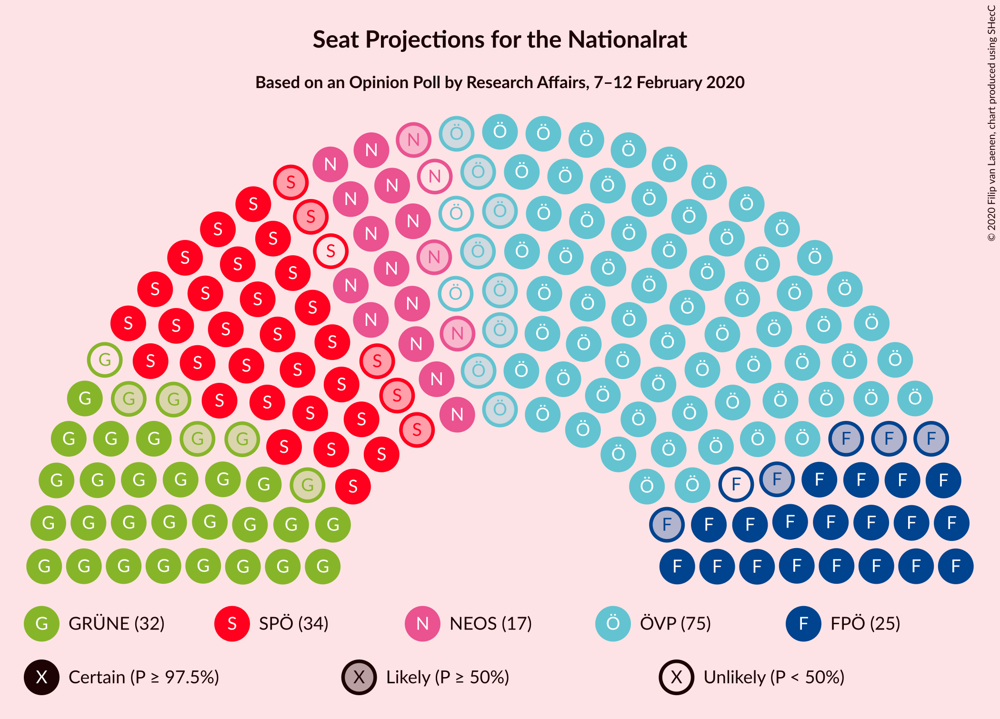
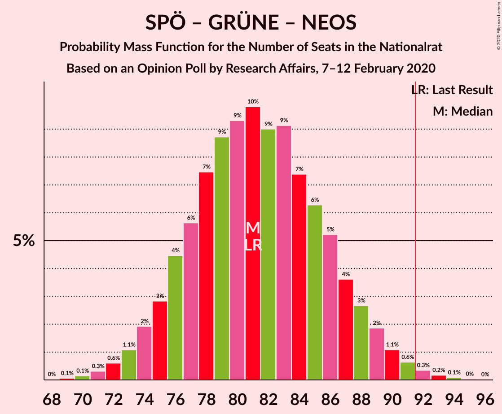

# Opinion Poll by Research Affairs, 7–12 February 2020

<a href="#voting-intentions">Voting Intentions</a> | <a href="#seats">Seats</a> | <a href="#coalitions">Coalitions</a> | <a href="#technical-information">Technical Information</a>

## Voting Intentions

### Confidence Intervals

| Party | Last Result | Poll Result | 80% Confidence Interval | 90% Confidence Interval | 95% Confidence Interval | 99% Confidence Interval |
|:-----:|:-----------:|:-----------:|:-----------------------:|:-----------------------:|:-----------------------:|:-----------------------:|
| Österreichische Volkspartei | 37.5% | 39.0% | 36.6–41.5% |36.0–42.2% |35.4–42.8% |34.2–44.0% |
| Sozialdemokratische Partei Österreichs | 21.2% | 18.0% | 16.2–20.0% |15.7–20.6% |15.3–21.1% |14.4–22.1% |
| Die Grünen–Die Grüne Alternative | 13.9% | 16.9% | 15.2–18.9% |14.7–19.5% |14.3–20.0% |13.5–21.0% |
| Freiheitliche Partei Österreichs | 16.2% | 13.0% | 11.5–14.8% |11.0–15.3% |10.7–15.8% |10.0–16.7% |
| NEOS–Das Neue Österreich und Liberales Forum | 8.1% | 8.9% | 7.7–10.5% |7.3–11.0% |7.0–11.4% |6.4–12.1% |

*Note:* The poll result column reflects the actual value used in the calculations. Published results may vary slightly, and in addition be rounded to fewer digits.

## Seats

### Confidence Intervals

| Party | Last Result | Median | 80% Confidence Interval | 90% Confidence Interval | 95% Confidence Interval | 99% Confidence Interval |
|:-----:|:-----------:|:------:|:-----------------------:|:-----------------------:|:-----------------------:|:-----------------------:|
| <a href="#österreichische-volkspartei">Österreichische Volkspartei</a> | 71 | 73 | 68–78 |66–79 |65–81 |63–83 |
| <a href="#sozialdemokratische-partei-österreichs">Sozialdemokratische Partei Österreichs</a> | 40 | 33 | 30–37 |29–38 |28–39 |26–41 |
| <a href="#die-grünen–die-grüne-alternative">Die Grünen–Die Grüne Alternative</a> | 26 | 31 | 28–35 |27–36 |26–37 |25–39 |
| <a href="#freiheitliche-partei-österreichs">Freiheitliche Partei Österreichs</a> | 31 | 24 | 21–27 |20–28 |19–29 |18–31 |
| <a href="#neos–das-neue-österreich-und-liberales-forum">NEOS–Das Neue Österreich und Liberales Forum</a> | 15 | 16 | 14–19 |13–20 |13–21 |11–22 |

### Österreichische Volkspartei

*For a full overview of the results for this party, see the [Österreichische Volkspartei](party-österreichischevolkspartei.html) page.*

| Number of Seats | Probability | Accumulated | Special Marks |
|:---------------:|:-----------:|:-----------:|:-------------:|
| 61 | 0.1% | 100% |  |
| 62 | 0.2% | 99.9% |  |
| 63 | 0.4% | 99.7% |  |
| 64 | 0.8% | 99.3% |  |
| 65 | 1.3% | 98.6% |  |
| 66 | 2% | 97% |  |
| 67 | 4% | 95% |  |
| 68 | 5% | 91% |  |
| 69 | 7% | 86% |  |
| 70 | 8% | 80% |  |
| 71 | 9% | 71% | Last Result |
| 72 | 10% | 62% |  |
| 73 | 11% | 52% | Median |
| 74 | 10% | 42% |  |
| 75 | 8% | 32% |  |
| 76 | 7% | 24% |  |
| 77 | 5% | 17% |  |
| 78 | 4% | 11% |  |
| 79 | 3% | 7% |  |
| 80 | 2% | 4% |  |
| 81 | 1.2% | 3% |  |
| 82 | 0.7% | 1.4% |  |
| 83 | 0.4% | 0.7% |  |
| 84 | 0.2% | 0.3% |  |
| 85 | 0.1% | 0.2% |  |
| 86 | 0% | 0.1% |  |
| 87 | 0% | 0% |  |

### Sozialdemokratische Partei Österreichs

*For a full overview of the results for this party, see the [Sozialdemokratische Partei Österreichs](party-sozialdemokratischeparteiösterreichs.html) page.*

| Number of Seats | Probability | Accumulated | Special Marks |
|:---------------:|:-----------:|:-----------:|:-------------:|
| 25 | 0.1% | 100% |  |
| 26 | 0.4% | 99.8% |  |
| 27 | 1.0% | 99.4% |  |
| 28 | 2% | 98% |  |
| 29 | 4% | 96% |  |
| 30 | 7% | 92% |  |
| 31 | 10% | 84% |  |
| 32 | 12% | 74% |  |
| 33 | 14% | 62% | Median |
| 34 | 13% | 48% |  |
| 35 | 11% | 35% |  |
| 36 | 9% | 24% |  |
| 37 | 6% | 15% |  |
| 38 | 4% | 8% |  |
| 39 | 2% | 4% |  |
| 40 | 1.2% | 2% | Last Result |
| 41 | 0.6% | 1.0% |  |
| 42 | 0.3% | 0.4% |  |
| 43 | 0.1% | 0.2% |  |
| 44 | 0% | 0.1% |  |
| 45 | 0% | 0% |  |

### Die Grünen–Die Grüne Alternative

*For a full overview of the results for this party, see the [Die Grünen–Die Grüne Alternative](party-diegrünen–diegrünealternative.html) page.*

| Number of Seats | Probability | Accumulated | Special Marks |
|:---------------:|:-----------:|:-----------:|:-------------:|
| 23 | 0.1% | 100% |  |
| 24 | 0.3% | 99.9% |  |
| 25 | 0.9% | 99.6% |  |
| 26 | 2% | 98.7% | Last Result |
| 27 | 4% | 97% |  |
| 28 | 7% | 92% |  |
| 29 | 11% | 86% |  |
| 30 | 13% | 75% |  |
| 31 | 14% | 62% | Median |
| 32 | 14% | 48% |  |
| 33 | 12% | 35% |  |
| 34 | 9% | 23% |  |
| 35 | 6% | 14% |  |
| 36 | 4% | 8% |  |
| 37 | 2% | 4% |  |
| 38 | 1.1% | 2% |  |
| 39 | 0.5% | 0.8% |  |
| 40 | 0.2% | 0.4% |  |
| 41 | 0.1% | 0.1% |  |
| 42 | 0% | 0% |  |

### Freiheitliche Partei Österreichs

*For a full overview of the results for this party, see the [Freiheitliche Partei Österreichs](party-freiheitlicheparteiösterreichs.html) page.*

| Number of Seats | Probability | Accumulated | Special Marks |
|:---------------:|:-----------:|:-----------:|:-------------:|
| 17 | 0.2% | 100% |  |
| 18 | 0.6% | 99.8% |  |
| 19 | 2% | 99.1% |  |
| 20 | 4% | 97% |  |
| 21 | 8% | 93% |  |
| 22 | 12% | 85% |  |
| 23 | 14% | 73% |  |
| 24 | 16% | 58% | Median |
| 25 | 14% | 42% |  |
| 26 | 11% | 28% |  |
| 27 | 8% | 17% |  |
| 28 | 5% | 9% |  |
| 29 | 2% | 4% |  |
| 30 | 1.2% | 2% |  |
| 31 | 0.5% | 0.8% | Last Result |
| 32 | 0.2% | 0.3% |  |
| 33 | 0.1% | 0.1% |  |
| 34 | 0% | 0% |  |

### NEOS–Das Neue Österreich und Liberales Forum

*For a full overview of the results for this party, see the [NEOS–Das Neue Österreich und Liberales Forum](party-neos–dasneueösterreichundliberalesforum.html) page.*

| Number of Seats | Probability | Accumulated | Special Marks |
|:---------------:|:-----------:|:-----------:|:-------------:|
| 10 | 0.1% | 100% |  |
| 11 | 0.5% | 99.9% |  |
| 12 | 2% | 99.5% |  |
| 13 | 5% | 98% |  |
| 14 | 11% | 93% |  |
| 15 | 16% | 82% | Last Result |
| 16 | 19% | 66% | Median |
| 17 | 17% | 48% |  |
| 18 | 14% | 30% |  |
| 19 | 8% | 17% |  |
| 20 | 5% | 8% |  |
| 21 | 2% | 3% |  |
| 22 | 0.9% | 1.4% |  |
| 23 | 0.3% | 0.4% |  |
| 24 | 0.1% | 0.1% |  |
| 25 | 0% | 0% |  |

## Coalitions

### Confidence Intervals

| Coalition | Last Result | Median | Majority? | 80% Confidence Interval | 90% Confidence Interval | 95% Confidence Interval | 99% Confidence Interval |
|:---------:|:-----------:|:------:|:---------:|:-----------------------:|:-----------------------:|:-----------------------:|:-----------------------:|
| Österreichische Volkspartei – Die Grünen–Die Grüne Alternative – NEOS–Das Neue Österreich und Liberales Forum | 112 | 121 | 100% | 115–126 | 114–128 | 113–129 | 110–132 |
| Österreichische Volkspartei – Sozialdemokratische Partei Österreichs | 111 | 106 | 100% | 101–112 | 99–113 | 98–115 | 96–117 |
| Österreichische Volkspartei – Die Grünen–Die Grüne Alternative | 97 | 104 | 99.9% | 99–110 | 97–111 | 96–113 | 94–115 |
| Österreichische Volkspartei – Freiheitliche Partei Österreichs | 102 | 97 | 90% | 91–102 | 90–104 | 89–105 | 87–108 |
| Österreichische Volkspartei – NEOS–Das Neue Österreich und Liberales Forum | 86 | 89 | 29% | 84–95 | 83–96 | 81–97 | 79–100 |
| Sozialdemokratische Partei Österreichs – Die Grünen–Die Grüne Alternative – NEOS–Das Neue Österreich und Liberales Forum | 81 | 81 | 0.7% | 76–87 | 75–88 | 74–89 | 71–92 |
| Österreichische Volkspartei | 71 | 73 | 0% | 68–78 | 66–79 | 65–81 | 63–83 |
| Sozialdemokratische Partei Österreichs – Die Grünen–Die Grüne Alternative | 66 | 65 | 0% | 60–70 | 59–71 | 58–72 | 56–75 |
| Sozialdemokratische Partei Österreichs – Freiheitliche Partei Österreichs | 71 | 57 | 0% | 53–62 | 52–64 | 51–65 | 49–67 |
| Sozialdemokratische Partei Österreichs | 40 | 33 | 0% | 30–37 | 29–38 | 28–39 | 26–41 |

### Österreichische Volkspartei – Die Grünen–Die Grüne Alternative – NEOS–Das Neue Österreich und Liberales Forum

| Number of Seats | Probability | Accumulated | Special Marks |
|:---------------:|:-----------:|:-----------:|:-------------:|
| 107 | 0% | 100% |  |
| 108 | 0.1% | 99.9% |  |
| 109 | 0.2% | 99.9% |  |
| 110 | 0.4% | 99.7% |  |
| 111 | 0.7% | 99.3% |  |
| 112 | 1.1% | 98.7% | Last Result |
| 113 | 2% | 98% |  |
| 114 | 3% | 96% |  |
| 115 | 4% | 92% |  |
| 116 | 6% | 88% |  |
| 117 | 7% | 82% |  |
| 118 | 8% | 75% |  |
| 119 | 8% | 67% |  |
| 120 | 8% | 59% | Median |
| 121 | 9% | 51% |  |
| 122 | 8% | 42% |  |
| 123 | 7% | 34% |  |
| 124 | 7% | 27% |  |
| 125 | 6% | 20% |  |
| 126 | 5% | 14% |  |
| 127 | 4% | 10% |  |
| 128 | 2% | 6% |  |
| 129 | 2% | 4% |  |
| 130 | 1.0% | 2% |  |
| 131 | 0.5% | 1.1% |  |
| 132 | 0.3% | 0.5% |  |
| 133 | 0.1% | 0.2% |  |
| 134 | 0.1% | 0.1% |  |
| 135 | 0% | 0% |  |

### Österreichische Volkspartei – Sozialdemokratische Partei Österreichs

| Number of Seats | Probability | Accumulated | Special Marks |
|:---------------:|:-----------:|:-----------:|:-------------:|
| 93 | 0% | 100% |  |
| 94 | 0.1% | 99.9% |  |
| 95 | 0.2% | 99.8% |  |
| 96 | 0.5% | 99.6% |  |
| 97 | 0.9% | 99.1% |  |
| 98 | 1.5% | 98% |  |
| 99 | 2% | 97% |  |
| 100 | 3% | 94% |  |
| 101 | 5% | 91% |  |
| 102 | 6% | 86% |  |
| 103 | 8% | 80% |  |
| 104 | 8% | 72% |  |
| 105 | 9% | 65% |  |
| 106 | 9% | 56% | Median |
| 107 | 9% | 47% |  |
| 108 | 8% | 37% |  |
| 109 | 7% | 29% |  |
| 110 | 6% | 22% |  |
| 111 | 5% | 16% | Last Result |
| 112 | 4% | 11% |  |
| 113 | 3% | 7% |  |
| 114 | 2% | 5% |  |
| 115 | 1.2% | 3% |  |
| 116 | 0.7% | 2% |  |
| 117 | 0.4% | 0.8% |  |
| 118 | 0.2% | 0.4% |  |
| 119 | 0.1% | 0.2% |  |
| 120 | 0% | 0.1% |  |
| 121 | 0% | 0% |  |

### Österreichische Volkspartei – Die Grünen–Die Grüne Alternative

| Number of Seats | Probability | Accumulated | Special Marks |
|:---------------:|:-----------:|:-----------:|:-------------:|
| 91 | 0% | 100% |  |
| 92 | 0.1% | 99.9% | Majority |
| 93 | 0.2% | 99.8% |  |
| 94 | 0.5% | 99.6% |  |
| 95 | 0.9% | 99.1% |  |
| 96 | 1.5% | 98% |  |
| 97 | 2% | 97% | Last Result |
| 98 | 3% | 94% |  |
| 99 | 5% | 91% |  |
| 100 | 6% | 86% |  |
| 101 | 7% | 80% |  |
| 102 | 8% | 73% |  |
| 103 | 9% | 65% |  |
| 104 | 9% | 56% | Median |
| 105 | 9% | 46% |  |
| 106 | 8% | 37% |  |
| 107 | 7% | 29% |  |
| 108 | 6% | 22% |  |
| 109 | 5% | 16% |  |
| 110 | 4% | 11% |  |
| 111 | 3% | 8% |  |
| 112 | 2% | 5% |  |
| 113 | 1.2% | 3% |  |
| 114 | 0.8% | 2% |  |
| 115 | 0.4% | 0.8% |  |
| 116 | 0.2% | 0.4% |  |
| 117 | 0.1% | 0.2% |  |
| 118 | 0% | 0.1% |  |
| 119 | 0% | 0% |  |

### Österreichische Volkspartei – Freiheitliche Partei Österreichs

| Number of Seats | Probability | Accumulated | Special Marks |
|:---------------:|:-----------:|:-----------:|:-------------:|
| 84 | 0.1% | 100% |  |
| 85 | 0.1% | 99.9% |  |
| 86 | 0.3% | 99.8% |  |
| 87 | 0.6% | 99.5% |  |
| 88 | 1.0% | 98.9% |  |
| 89 | 2% | 98% |  |
| 90 | 3% | 96% |  |
| 91 | 4% | 94% |  |
| 92 | 5% | 90% | Majority |
| 93 | 7% | 85% |  |
| 94 | 8% | 78% |  |
| 95 | 8% | 70% |  |
| 96 | 9% | 62% |  |
| 97 | 9% | 52% | Median |
| 98 | 9% | 43% |  |
| 99 | 8% | 34% |  |
| 100 | 7% | 27% |  |
| 101 | 5% | 19% |  |
| 102 | 4% | 14% | Last Result |
| 103 | 3% | 10% |  |
| 104 | 2% | 6% |  |
| 105 | 2% | 4% |  |
| 106 | 1.0% | 2% |  |
| 107 | 0.6% | 1.2% |  |
| 108 | 0.3% | 0.6% |  |
| 109 | 0.2% | 0.3% |  |
| 110 | 0.1% | 0.1% |  |
| 111 | 0% | 0.1% |  |
| 112 | 0% | 0% |  |

### Österreichische Volkspartei – NEOS–Das Neue Österreich und Liberales Forum

| Number of Seats | Probability | Accumulated | Special Marks |
|:---------------:|:-----------:|:-----------:|:-------------:|
| 76 | 0% | 100% |  |
| 77 | 0.1% | 99.9% |  |
| 78 | 0.2% | 99.9% |  |
| 79 | 0.4% | 99.7% |  |
| 80 | 0.7% | 99.3% |  |
| 81 | 1.3% | 98.6% |  |
| 82 | 2% | 97% |  |
| 83 | 3% | 95% |  |
| 84 | 5% | 92% |  |
| 85 | 6% | 87% |  |
| 86 | 8% | 81% | Last Result |
| 87 | 8% | 74% |  |
| 88 | 9% | 65% |  |
| 89 | 9% | 56% | Median |
| 90 | 9% | 47% |  |
| 91 | 9% | 38% |  |
| 92 | 7% | 29% | Majority |
| 93 | 6% | 22% |  |
| 94 | 5% | 15% |  |
| 95 | 3% | 10% |  |
| 96 | 3% | 7% |  |
| 97 | 2% | 4% |  |
| 98 | 1.0% | 2% |  |
| 99 | 0.6% | 1.3% |  |
| 100 | 0.4% | 0.7% |  |
| 101 | 0.2% | 0.3% |  |
| 102 | 0.1% | 0.2% |  |
| 103 | 0% | 0.1% |  |
| 104 | 0% | 0% |  |

### Sozialdemokratische Partei Österreichs – Die Grünen–Die Grüne Alternative – NEOS–Das Neue Österreich und Liberales Forum

| Number of Seats | Probability | Accumulated | Special Marks |
|:---------------:|:-----------:|:-----------:|:-------------:|
| 69 | 0.1% | 100% |  |
| 70 | 0.1% | 99.9% |  |
| 71 | 0.3% | 99.8% |  |
| 72 | 0.6% | 99.4% |  |
| 73 | 1.1% | 98.8% |  |
| 74 | 2% | 98% |  |
| 75 | 3% | 96% |  |
| 76 | 4% | 93% |  |
| 77 | 6% | 89% |  |
| 78 | 7% | 83% |  |
| 79 | 9% | 75% |  |
| 80 | 9% | 67% | Median |
| 81 | 10% | 57% | Last Result |
| 82 | 9% | 48% |  |
| 83 | 9% | 39% |  |
| 84 | 7% | 29% |  |
| 85 | 6% | 22% |  |
| 86 | 5% | 16% |  |
| 87 | 4% | 11% |  |
| 88 | 3% | 7% |  |
| 89 | 2% | 4% |  |
| 90 | 1.1% | 2% |  |
| 91 | 0.6% | 1.3% |  |
| 92 | 0.3% | 0.7% | Majority |
| 93 | 0.2% | 0.3% |  |
| 94 | 0.1% | 0.1% |  |
| 95 | 0% | 0.1% |  |
| 96 | 0% | 0% |  |

### Österreichische Volkspartei

| Number of Seats | Probability | Accumulated | Special Marks |
|:---------------:|:-----------:|:-----------:|:-------------:|
| 61 | 0.1% | 100% |  |
| 62 | 0.2% | 99.9% |  |
| 63 | 0.4% | 99.7% |  |
| 64 | 0.8% | 99.3% |  |
| 65 | 1.3% | 98.6% |  |
| 66 | 2% | 97% |  |
| 67 | 4% | 95% |  |
| 68 | 5% | 91% |  |
| 69 | 7% | 86% |  |
| 70 | 8% | 80% |  |
| 71 | 9% | 71% | Last Result |
| 72 | 10% | 62% |  |
| 73 | 11% | 52% | Median |
| 74 | 10% | 42% |  |
| 75 | 8% | 32% |  |
| 76 | 7% | 24% |  |
| 77 | 5% | 17% |  |
| 78 | 4% | 11% |  |
| 79 | 3% | 7% |  |
| 80 | 2% | 4% |  |
| 81 | 1.2% | 3% |  |
| 82 | 0.7% | 1.4% |  |
| 83 | 0.4% | 0.7% |  |
| 84 | 0.2% | 0.3% |  |
| 85 | 0.1% | 0.2% |  |
| 86 | 0% | 0.1% |  |
| 87 | 0% | 0% |  |

### Sozialdemokratische Partei Österreichs – Die Grünen–Die Grüne Alternative

| Number of Seats | Probability | Accumulated | Special Marks |
|:---------------:|:-----------:|:-----------:|:-------------:|
| 53 | 0% | 100% |  |
| 54 | 0.1% | 99.9% |  |
| 55 | 0.3% | 99.8% |  |
| 56 | 0.6% | 99.5% |  |
| 57 | 1.2% | 99.0% |  |
| 58 | 2% | 98% |  |
| 59 | 3% | 96% |  |
| 60 | 5% | 93% |  |
| 61 | 6% | 88% |  |
| 62 | 9% | 82% |  |
| 63 | 10% | 73% |  |
| 64 | 9% | 63% | Median |
| 65 | 11% | 54% |  |
| 66 | 11% | 43% | Last Result |
| 67 | 7% | 32% |  |
| 68 | 8% | 25% |  |
| 69 | 6% | 17% |  |
| 70 | 3% | 11% |  |
| 71 | 3% | 7% |  |
| 72 | 2% | 4% |  |
| 73 | 1.0% | 2% |  |
| 74 | 0.7% | 1.3% |  |
| 75 | 0.3% | 0.6% |  |
| 76 | 0.1% | 0.3% |  |
| 77 | 0.1% | 0.1% |  |
| 78 | 0% | 0.1% |  |
| 79 | 0% | 0% |  |

### Sozialdemokratische Partei Österreichs – Freiheitliche Partei Österreichs

| Number of Seats | Probability | Accumulated | Special Marks |
|:---------------:|:-----------:|:-----------:|:-------------:|
| 46 | 0% | 100% |  |
| 47 | 0.1% | 99.9% |  |
| 48 | 0.3% | 99.8% |  |
| 49 | 0.6% | 99.6% |  |
| 50 | 1.2% | 99.0% |  |
| 51 | 2% | 98% |  |
| 52 | 4% | 96% |  |
| 53 | 5% | 92% |  |
| 54 | 7% | 87% |  |
| 55 | 9% | 80% |  |
| 56 | 10% | 71% |  |
| 57 | 11% | 61% | Median |
| 58 | 11% | 50% |  |
| 59 | 10% | 39% |  |
| 60 | 9% | 29% |  |
| 61 | 6% | 20% |  |
| 62 | 5% | 14% |  |
| 63 | 3% | 9% |  |
| 64 | 2% | 5% |  |
| 65 | 1.4% | 3% |  |
| 66 | 0.8% | 2% |  |
| 67 | 0.4% | 0.8% |  |
| 68 | 0.2% | 0.4% |  |
| 69 | 0.1% | 0.2% |  |
| 70 | 0% | 0.1% |  |
| 71 | 0% | 0% | Last Result |

### Sozialdemokratische Partei Österreichs

| Number of Seats | Probability | Accumulated | Special Marks |
|:---------------:|:-----------:|:-----------:|:-------------:|
| 25 | 0.1% | 100% |  |
| 26 | 0.4% | 99.8% |  |
| 27 | 1.0% | 99.4% |  |
| 28 | 2% | 98% |  |
| 29 | 4% | 96% |  |
| 30 | 7% | 92% |  |
| 31 | 10% | 84% |  |
| 32 | 12% | 74% |  |
| 33 | 14% | 62% | Median |
| 34 | 13% | 48% |  |
| 35 | 11% | 35% |  |
| 36 | 9% | 24% |  |
| 37 | 6% | 15% |  |
| 38 | 4% | 8% |  |
| 39 | 2% | 4% |  |
| 40 | 1.2% | 2% | Last Result |
| 41 | 0.6% | 1.0% |  |
| 42 | 0.3% | 0.4% |  |
| 43 | 0.1% | 0.2% |  |
| 44 | 0% | 0.1% |  |
| 45 | 0% | 0% |  |

## Technical Information

### Opinion Poll

+ **Polling firm:** Research Affairs
+ **Commissioner(s):** —
+ **Fieldwork period:** 7–12 February 2020

### Calculations

+ **Sample size:** 661
+ **Simulations done:** 1,048,576
+ **Error estimate:** 0.67%

