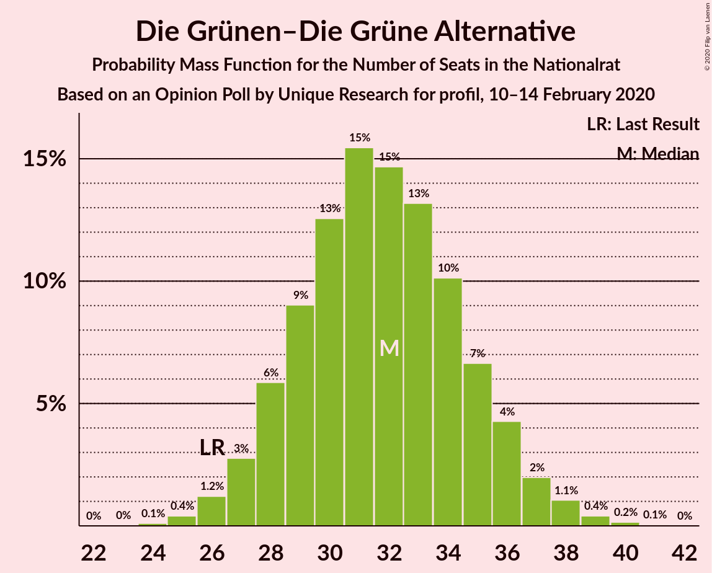
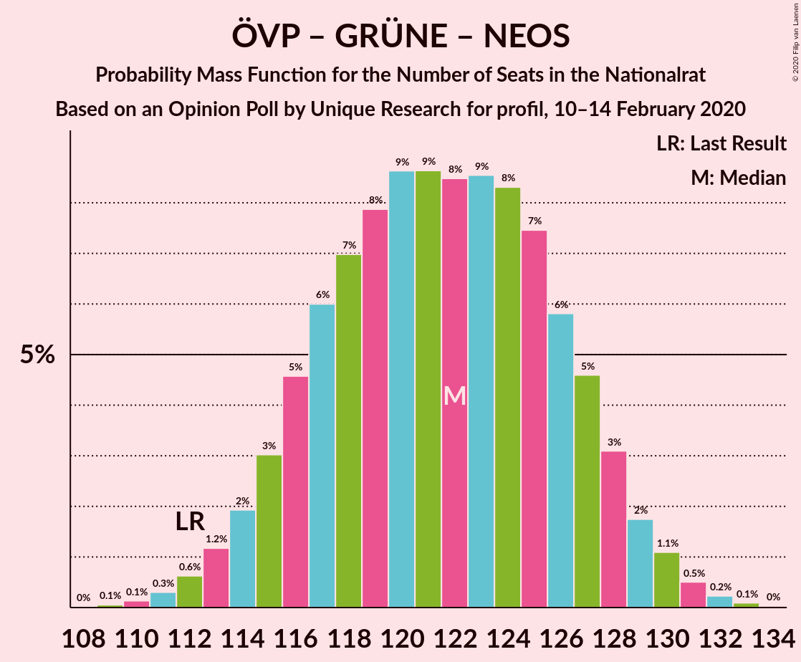
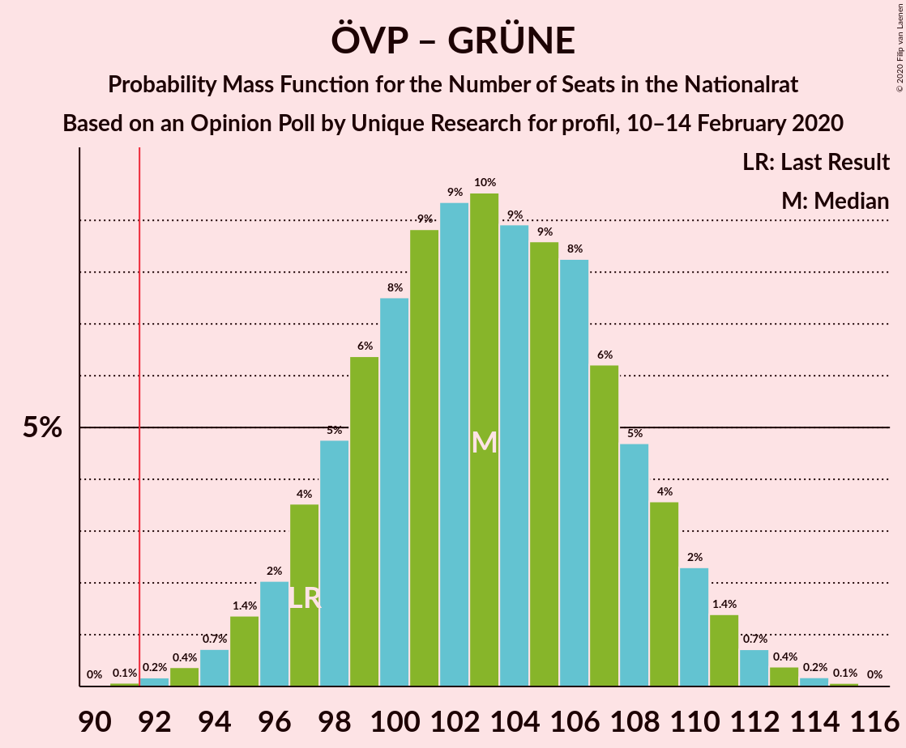
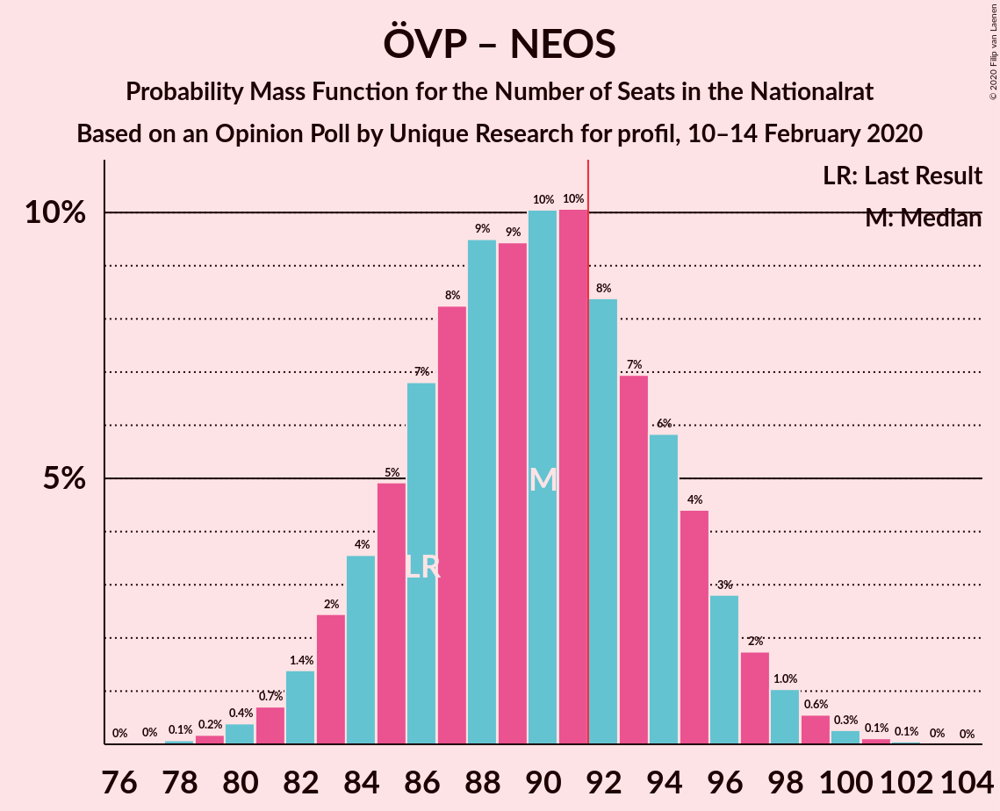

# Opinion Poll by Unique Research for profil, 10–14 February 2020

<a href="#voting-intentions">Voting Intentions</a> | <a href="#seats">Seats</a> | <a href="#coalitions">Coalitions</a> | <a href="#technical-information">Technical Information</a>

## Voting Intentions

### Confidence Intervals

| Party | Last Result | Poll Result | 80% Confidence Interval | 90% Confidence Interval | 95% Confidence Interval | 99% Confidence Interval |
|:-----:|:-----------:|:-----------:|:-----------------------:|:-----------------------:|:-----------------------:|:-----------------------:|
| Österreichische Volkspartei | 37.5% | 38.1% | 35.9–40.3% |35.3–40.9% |34.8–41.5% |33.7–42.6% |
| Die Grünen–Die Grüne Alternative | 13.9% | 17.0% | 15.4–18.8% |15.0–19.4% |14.6–19.8% |13.9–20.7% |
| Freiheitliche Partei Österreichs | 16.2% | 16.0% | 14.5–17.8% |14.0–18.3% |13.7–18.7% |13.0–19.6% |
| Sozialdemokratische Partei Österreichs | 21.2% | 15.0% | 13.5–16.8% |13.1–17.3% |12.7–17.7% |12.0–18.5% |
| NEOS–Das Neue Österreich und Liberales Forum | 8.1% | 10.0% | 8.7–11.4% |8.4–11.9% |8.1–12.2% |7.5–13.0% |

*Note:* The poll result column reflects the actual value used in the calculations. Published results may vary slightly, and in addition be rounded to fewer digits.

## Seats

### Confidence Intervals

| Party | Last Result | Median | 80% Confidence Interval | 90% Confidence Interval | 95% Confidence Interval | 99% Confidence Interval |
|:-----:|:-----------:|:------:|:-----------------------:|:-----------------------:|:-----------------------:|:-----------------------:|
| <a href="#österreichische-volkspartei">Österreichische Volkspartei</a> | 71 | 71 | 67–76 |65–77 |64–78 |62–81 |
| <a href="#die-grünen–die-grüne-alternative">Die Grünen–Die Grüne Alternative</a> | 26 | 32 | 28–35 |28–36 |27–37 |25–39 |
| <a href="#freiheitliche-partei-österreichs">Freiheitliche Partei Österreichs</a> | 31 | 30 | 27–33 |26–34 |25–35 |24–37 |
| <a href="#sozialdemokratische-partei-österreichs">Sozialdemokratische Partei Österreichs</a> | 40 | 28 | 25–31 |24–32 |23–33 |22–35 |
| <a href="#neos–das-neue-österreich-und-liberales-forum">NEOS–Das Neue Österreich und Liberales Forum</a> | 15 | 18 | 16–21 |15–22 |15–23 |14–24 |

### Österreichische Volkspartei

*For a full overview of the results for this party, see the [Österreichische Volkspartei](party-österreichischevolkspartei.html) page.*

| Number of Seats | Probability | Accumulated | Special Marks |
|:---------------:|:-----------:|:-----------:|:-------------:|
| 60 | 0.1% | 100% |  |
| 61 | 0.1% | 99.9% |  |
| 62 | 0.3% | 99.8% |  |
| 63 | 0.7% | 99.4% |  |
| 64 | 1.4% | 98.8% |  |
| 65 | 2% | 97% |  |
| 66 | 4% | 95% |  |
| 67 | 5% | 91% |  |
| 68 | 8% | 85% |  |
| 69 | 9% | 78% |  |
| 70 | 10% | 69% |  |
| 71 | 11% | 58% | Last Result, Median |
| 72 | 11% | 47% |  |
| 73 | 9% | 36% |  |
| 74 | 8% | 27% |  |
| 75 | 7% | 19% |  |
| 76 | 5% | 12% |  |
| 77 | 3% | 7% |  |
| 78 | 2% | 4% |  |
| 79 | 1.1% | 2% |  |
| 80 | 0.6% | 1.1% |  |
| 81 | 0.3% | 0.5% |  |
| 82 | 0.1% | 0.2% |  |
| 83 | 0.1% | 0.1% |  |
| 84 | 0% | 0% |  |

### Die Grünen–Die Grüne Alternative

*For a full overview of the results for this party, see the [Die Grünen–Die Grüne Alternative](party-diegrünen–diegrünealternative.html) page.*

| Number of Seats | Probability | Accumulated | Special Marks |
|:---------------:|:-----------:|:-----------:|:-------------:|
| 24 | 0.1% | 100% |  |
| 25 | 0.4% | 99.9% |  |
| 26 | 1.2% | 99.5% | Last Result |
| 27 | 3% | 98% |  |
| 28 | 6% | 95% |  |
| 29 | 9% | 90% |  |
| 30 | 13% | 81% |  |
| 31 | 15% | 68% |  |
| 32 | 15% | 53% | Median |
| 33 | 13% | 38% |  |
| 34 | 10% | 25% |  |
| 35 | 7% | 15% |  |
| 36 | 4% | 8% |  |
| 37 | 2% | 4% |  |
| 38 | 1.1% | 2% |  |
| 39 | 0.4% | 0.6% |  |
| 40 | 0.2% | 0.2% |  |
| 41 | 0.1% | 0.1% |  |
| 42 | 0% | 0% |  |

### Freiheitliche Partei Österreichs

*For a full overview of the results for this party, see the [Freiheitliche Partei Österreichs](party-freiheitlicheparteiösterreichs.html) page.*

| Number of Seats | Probability | Accumulated | Special Marks |
|:---------------:|:-----------:|:-----------:|:-------------:|
| 22 | 0.1% | 100% |  |
| 23 | 0.3% | 99.9% |  |
| 24 | 0.9% | 99.6% |  |
| 25 | 2% | 98.7% |  |
| 26 | 5% | 96% |  |
| 27 | 9% | 91% |  |
| 28 | 12% | 83% |  |
| 29 | 15% | 70% |  |
| 30 | 16% | 55% | Median |
| 31 | 13% | 39% | Last Result |
| 32 | 11% | 26% |  |
| 33 | 7% | 15% |  |
| 34 | 4% | 8% |  |
| 35 | 2% | 4% |  |
| 36 | 1.0% | 2% |  |
| 37 | 0.4% | 0.6% |  |
| 38 | 0.2% | 0.2% |  |
| 39 | 0% | 0.1% |  |
| 40 | 0% | 0% |  |

### Sozialdemokratische Partei Österreichs

*For a full overview of the results for this party, see the [Sozialdemokratische Partei Österreichs](party-sozialdemokratischeparteiösterreichs.html) page.*

| Number of Seats | Probability | Accumulated | Special Marks |
|:---------------:|:-----------:|:-----------:|:-------------:|
| 21 | 0.2% | 100% |  |
| 22 | 0.6% | 99.8% |  |
| 23 | 2% | 99.1% |  |
| 24 | 4% | 97% |  |
| 25 | 8% | 93% |  |
| 26 | 12% | 85% |  |
| 27 | 15% | 73% |  |
| 28 | 16% | 58% | Median |
| 29 | 15% | 42% |  |
| 30 | 12% | 27% |  |
| 31 | 7% | 15% |  |
| 32 | 4% | 8% |  |
| 33 | 2% | 4% |  |
| 34 | 1.0% | 2% |  |
| 35 | 0.4% | 0.6% |  |
| 36 | 0.1% | 0.2% |  |
| 37 | 0% | 0.1% |  |
| 38 | 0% | 0% |  |
| 39 | 0% | 0% |  |
| 40 | 0% | 0% | Last Result |

### NEOS–Das Neue Österreich und Liberales Forum

*For a full overview of the results for this party, see the [NEOS–Das Neue Österreich und Liberales Forum](party-neos–dasneueösterreichundliberalesforum.html) page.*

| Number of Seats | Probability | Accumulated | Special Marks |
|:---------------:|:-----------:|:-----------:|:-------------:|
| 12 | 0.1% | 100% |  |
| 13 | 0.4% | 99.9% |  |
| 14 | 2% | 99.6% |  |
| 15 | 5% | 98% | Last Result |
| 16 | 10% | 93% |  |
| 17 | 16% | 83% |  |
| 18 | 20% | 67% | Median |
| 19 | 18% | 47% |  |
| 20 | 14% | 30% |  |
| 21 | 8% | 15% |  |
| 22 | 4% | 7% |  |
| 23 | 2% | 3% |  |
| 24 | 0.7% | 1.0% |  |
| 25 | 0.2% | 0.3% |  |
| 26 | 0.1% | 0.1% |  |
| 27 | 0% | 0% |  |

## Coalitions

### Confidence Intervals

| Coalition | Last Result | Median | Majority? | 80% Confidence Interval | 90% Confidence Interval | 95% Confidence Interval | 99% Confidence Interval |
|:---------:|:-----------:|:------:|:---------:|:-----------------------:|:-----------------------:|:-----------------------:|:-----------------------:|
| Österreichische Volkspartei – Die Grünen–Die Grüne Alternative – NEOS–Das Neue Österreich und Liberales Forum | 112 | 122 | 100% | 116–127 | 115–128 | 114–129 | 111–131 |
| Österreichische Volkspartei – Die Grünen–Die Grüne Alternative | 97 | 103 | 99.9% | 98–108 | 97–110 | 95–111 | 93–113 |
| Österreichische Volkspartei – Freiheitliche Partei Österreichs | 102 | 101 | 99.4% | 96–106 | 95–108 | 94–109 | 91–111 |
| Österreichische Volkspartei – Sozialdemokratische Partei Österreichs | 111 | 99 | 98% | 94–104 | 93–106 | 92–107 | 90–109 |
| Österreichische Volkspartei – NEOS–Das Neue Österreich und Liberales Forum | 86 | 90 | 32% | 85–95 | 83–96 | 82–97 | 80–99 |
| Die Grünen–Die Grüne Alternative – Sozialdemokratische Partei Österreichs – NEOS–Das Neue Österreich und Liberales Forum | 81 | 78 | 0% | 73–83 | 72–84 | 71–85 | 69–88 |
| Österreichische Volkspartei | 71 | 71 | 0% | 67–76 | 65–77 | 64–78 | 62–81 |
| Die Grünen–Die Grüne Alternative – Sozialdemokratische Partei Österreichs | 66 | 60 | 0% | 55–64 | 54–65 | 53–67 | 51–69 |
| Freiheitliche Partei Österreichs – Sozialdemokratische Partei Österreichs | 71 | 58 | 0% | 54–62 | 52–63 | 52–65 | 50–67 |
| Sozialdemokratische Partei Österreichs | 40 | 28 | 0% | 25–31 | 24–32 | 23–33 | 22–35 |

### Österreichische Volkspartei – Die Grünen–Die Grüne Alternative – NEOS–Das Neue Österreich und Liberales Forum

| Number of Seats | Probability | Accumulated | Special Marks |
|:---------------:|:-----------:|:-----------:|:-------------:|
| 109 | 0.1% | 100% |  |
| 110 | 0.1% | 99.9% |  |
| 111 | 0.3% | 99.8% |  |
| 112 | 0.6% | 99.5% | Last Result |
| 113 | 1.2% | 98.9% |  |
| 114 | 2% | 98% |  |
| 115 | 3% | 96% |  |
| 116 | 5% | 93% |  |
| 117 | 6% | 88% |  |
| 118 | 7% | 82% |  |
| 119 | 8% | 75% |  |
| 120 | 9% | 67% |  |
| 121 | 9% | 59% | Median |
| 122 | 8% | 50% |  |
| 123 | 9% | 42% |  |
| 124 | 8% | 33% |  |
| 125 | 7% | 25% |  |
| 126 | 6% | 17% |  |
| 127 | 5% | 11% |  |
| 128 | 3% | 7% |  |
| 129 | 2% | 4% |  |
| 130 | 1.1% | 2% |  |
| 131 | 0.5% | 0.9% |  |
| 132 | 0.2% | 0.4% |  |
| 133 | 0.1% | 0.1% |  |
| 134 | 0% | 0% |  |

### Österreichische Volkspartei – Die Grünen–Die Grüne Alternative

| Number of Seats | Probability | Accumulated | Special Marks |
|:---------------:|:-----------:|:-----------:|:-------------:|
| 91 | 0.1% | 100% |  |
| 92 | 0.2% | 99.9% | Majority |
| 93 | 0.4% | 99.7% |  |
| 94 | 0.7% | 99.3% |  |
| 95 | 1.4% | 98.6% |  |
| 96 | 2% | 97% |  |
| 97 | 4% | 95% | Last Result |
| 98 | 5% | 92% |  |
| 99 | 6% | 87% |  |
| 100 | 8% | 81% |  |
| 101 | 9% | 73% |  |
| 102 | 9% | 64% |  |
| 103 | 10% | 55% | Median |
| 104 | 9% | 45% |  |
| 105 | 9% | 36% |  |
| 106 | 8% | 28% |  |
| 107 | 6% | 20% |  |
| 108 | 5% | 13% |  |
| 109 | 4% | 9% |  |
| 110 | 2% | 5% |  |
| 111 | 1.4% | 3% |  |
| 112 | 0.7% | 1.4% |  |
| 113 | 0.4% | 0.7% |  |
| 114 | 0.2% | 0.3% |  |
| 115 | 0.1% | 0.1% |  |
| 116 | 0% | 0% |  |

### Österreichische Volkspartei – Freiheitliche Partei Österreichs

| Number of Seats | Probability | Accumulated | Special Marks |
|:---------------:|:-----------:|:-----------:|:-------------:|
| 89 | 0.1% | 100% |  |
| 90 | 0.2% | 99.9% |  |
| 91 | 0.3% | 99.8% |  |
| 92 | 0.6% | 99.4% | Majority |
| 93 | 1.3% | 98.8% |  |
| 94 | 2% | 98% |  |
| 95 | 3% | 95% |  |
| 96 | 4% | 92% |  |
| 97 | 6% | 88% |  |
| 98 | 8% | 82% |  |
| 99 | 9% | 75% |  |
| 100 | 10% | 66% |  |
| 101 | 9% | 56% | Median |
| 102 | 9% | 47% | Last Result |
| 103 | 10% | 38% |  |
| 104 | 8% | 28% |  |
| 105 | 6% | 20% |  |
| 106 | 5% | 14% |  |
| 107 | 4% | 9% |  |
| 108 | 3% | 5% |  |
| 109 | 1.3% | 3% |  |
| 110 | 0.8% | 2% |  |
| 111 | 0.4% | 0.8% |  |
| 112 | 0.2% | 0.3% |  |
| 113 | 0.1% | 0.1% |  |
| 114 | 0% | 0% |  |

### Österreichische Volkspartei – Sozialdemokratische Partei Österreichs

| Number of Seats | Probability | Accumulated | Special Marks |
|:---------------:|:-----------:|:-----------:|:-------------:|
| 87 | 0.1% | 100% |  |
| 88 | 0.1% | 99.9% |  |
| 89 | 0.3% | 99.8% |  |
| 90 | 0.6% | 99.5% |  |
| 91 | 1.2% | 98.9% |  |
| 92 | 2% | 98% | Majority |
| 93 | 3% | 96% |  |
| 94 | 4% | 93% |  |
| 95 | 6% | 89% |  |
| 96 | 8% | 83% |  |
| 97 | 8% | 75% |  |
| 98 | 9% | 67% |  |
| 99 | 10% | 58% | Median |
| 100 | 9% | 48% |  |
| 101 | 9% | 39% |  |
| 102 | 8% | 30% |  |
| 103 | 7% | 22% |  |
| 104 | 5% | 15% |  |
| 105 | 4% | 9% |  |
| 106 | 2% | 6% |  |
| 107 | 2% | 3% |  |
| 108 | 1.0% | 2% |  |
| 109 | 0.4% | 0.7% |  |
| 110 | 0.2% | 0.3% |  |
| 111 | 0.1% | 0.1% | Last Result |
| 112 | 0% | 0.1% |  |
| 113 | 0% | 0% |  |

### Österreichische Volkspartei – NEOS–Das Neue Österreich und Liberales Forum

| Number of Seats | Probability | Accumulated | Special Marks |
|:---------------:|:-----------:|:-----------:|:-------------:|
| 78 | 0.1% | 100% |  |
| 79 | 0.2% | 99.9% |  |
| 80 | 0.4% | 99.7% |  |
| 81 | 0.7% | 99.3% |  |
| 82 | 1.4% | 98.6% |  |
| 83 | 2% | 97% |  |
| 84 | 4% | 95% |  |
| 85 | 5% | 91% |  |
| 86 | 7% | 86% | Last Result |
| 87 | 8% | 79% |  |
| 88 | 9% | 71% |  |
| 89 | 9% | 62% | Median |
| 90 | 10% | 52% |  |
| 91 | 10% | 42% |  |
| 92 | 8% | 32% | Majority |
| 93 | 7% | 24% |  |
| 94 | 6% | 17% |  |
| 95 | 4% | 11% |  |
| 96 | 3% | 7% |  |
| 97 | 2% | 4% |  |
| 98 | 1.0% | 2% |  |
| 99 | 0.6% | 1.0% |  |
| 100 | 0.3% | 0.5% |  |
| 101 | 0.1% | 0.2% |  |
| 102 | 0.1% | 0.1% |  |
| 103 | 0% | 0% |  |

### Die Grünen–Die Grüne Alternative – Sozialdemokratische Partei Österreichs – NEOS–Das Neue Österreich und Liberales Forum

| Number of Seats | Probability | Accumulated | Special Marks |
|:---------------:|:-----------:|:-----------:|:-------------:|
| 67 | 0.1% | 100% |  |
| 68 | 0.2% | 99.9% |  |
| 69 | 0.5% | 99.7% |  |
| 70 | 0.9% | 99.2% |  |
| 71 | 2% | 98% |  |
| 72 | 3% | 97% |  |
| 73 | 4% | 94% |  |
| 74 | 6% | 90% |  |
| 75 | 7% | 84% |  |
| 76 | 10% | 77% |  |
| 77 | 10% | 67% |  |
| 78 | 10% | 57% | Median |
| 79 | 10% | 47% |  |
| 80 | 10% | 37% |  |
| 81 | 8% | 27% | Last Result |
| 82 | 6% | 19% |  |
| 83 | 5% | 13% |  |
| 84 | 4% | 8% |  |
| 85 | 2% | 4% |  |
| 86 | 1.1% | 2% |  |
| 87 | 0.6% | 1.2% |  |
| 88 | 0.4% | 0.6% |  |
| 89 | 0.2% | 0.3% |  |
| 90 | 0.1% | 0.1% |  |
| 91 | 0% | 0% |  |

### Österreichische Volkspartei

| Number of Seats | Probability | Accumulated | Special Marks |
|:---------------:|:-----------:|:-----------:|:-------------:|
| 60 | 0.1% | 100% |  |
| 61 | 0.1% | 99.9% |  |
| 62 | 0.3% | 99.8% |  |
| 63 | 0.7% | 99.4% |  |
| 64 | 1.4% | 98.8% |  |
| 65 | 2% | 97% |  |
| 66 | 4% | 95% |  |
| 67 | 5% | 91% |  |
| 68 | 8% | 85% |  |
| 69 | 9% | 78% |  |
| 70 | 10% | 69% |  |
| 71 | 11% | 58% | Last Result, Median |
| 72 | 11% | 47% |  |
| 73 | 9% | 36% |  |
| 74 | 8% | 27% |  |
| 75 | 7% | 19% |  |
| 76 | 5% | 12% |  |
| 77 | 3% | 7% |  |
| 78 | 2% | 4% |  |
| 79 | 1.1% | 2% |  |
| 80 | 0.6% | 1.1% |  |
| 81 | 0.3% | 0.5% |  |
| 82 | 0.1% | 0.2% |  |
| 83 | 0.1% | 0.1% |  |
| 84 | 0% | 0% |  |

### Die Grünen–Die Grüne Alternative – Sozialdemokratische Partei Österreichs

| Number of Seats | Probability | Accumulated | Special Marks |
|:---------------:|:-----------:|:-----------:|:-------------:|
| 49 | 0% | 100% |  |
| 50 | 0.1% | 99.9% |  |
| 51 | 0.3% | 99.8% |  |
| 52 | 0.8% | 99.5% |  |
| 53 | 2% | 98.7% |  |
| 54 | 3% | 97% |  |
| 55 | 5% | 94% |  |
| 56 | 7% | 90% |  |
| 57 | 9% | 83% |  |
| 58 | 10% | 74% |  |
| 59 | 11% | 65% |  |
| 60 | 12% | 53% | Median |
| 61 | 11% | 42% |  |
| 62 | 10% | 30% |  |
| 63 | 7% | 21% |  |
| 64 | 5% | 13% |  |
| 65 | 3% | 8% |  |
| 66 | 2% | 5% | Last Result |
| 67 | 1.4% | 3% |  |
| 68 | 0.7% | 1.2% |  |
| 69 | 0.3% | 0.5% |  |
| 70 | 0.1% | 0.2% |  |
| 71 | 0.1% | 0.1% |  |
| 72 | 0% | 0% |  |

### Freiheitliche Partei Österreichs – Sozialdemokratische Partei Österreichs

| Number of Seats | Probability | Accumulated | Special Marks |
|:---------------:|:-----------:|:-----------:|:-------------:|
| 48 | 0.1% | 100% |  |
| 49 | 0.3% | 99.8% |  |
| 50 | 0.7% | 99.6% |  |
| 51 | 1.3% | 98.9% |  |
| 52 | 3% | 98% |  |
| 53 | 4% | 95% |  |
| 54 | 6% | 91% |  |
| 55 | 8% | 85% |  |
| 56 | 10% | 77% |  |
| 57 | 11% | 66% |  |
| 58 | 12% | 55% | Median |
| 59 | 12% | 43% |  |
| 60 | 10% | 31% |  |
| 61 | 7% | 22% |  |
| 62 | 6% | 14% |  |
| 63 | 4% | 9% |  |
| 64 | 2% | 5% |  |
| 65 | 1.4% | 3% |  |
| 66 | 0.7% | 1.3% |  |
| 67 | 0.3% | 0.5% |  |
| 68 | 0.1% | 0.2% |  |
| 69 | 0.1% | 0.1% |  |
| 70 | 0% | 0% |  |
| 71 | 0% | 0% | Last Result |

### Sozialdemokratische Partei Österreichs

| Number of Seats | Probability | Accumulated | Special Marks |
|:---------------:|:-----------:|:-----------:|:-------------:|
| 21 | 0.2% | 100% |  |
| 22 | 0.6% | 99.8% |  |
| 23 | 2% | 99.1% |  |
| 24 | 4% | 97% |  |
| 25 | 8% | 93% |  |
| 26 | 12% | 85% |  |
| 27 | 15% | 73% |  |
| 28 | 16% | 58% | Median |
| 29 | 15% | 42% |  |
| 30 | 12% | 27% |  |
| 31 | 7% | 15% |  |
| 32 | 4% | 8% |  |
| 33 | 2% | 4% |  |
| 34 | 1.0% | 2% |  |
| 35 | 0.4% | 0.6% |  |
| 36 | 0.1% | 0.2% |  |
| 37 | 0% | 0.1% |  |
| 38 | 0% | 0% |  |
| 39 | 0% | 0% |  |
| 40 | 0% | 0% | Last Result |

## Technical Information

### Opinion Poll

+ **Polling firm:** Unique Research
+ **Commissioner(s):** profil
+ **Fieldwork period:** 10–14 February 2020

### Calculations

+ **Sample size:** 804
+ **Simulations done:** 1,048,576
+ **Error estimate:** 0.40%

