# Opinion Poll by Research Affairs for ÖSTERREICH, 24–27 February 2020

<a href="#voting-intentions">Voting Intentions</a> | <a href="#seats">Seats</a> | <a href="#coalitions">Coalitions</a> | <a href="#technical-information">Technical Information</a>

## Voting Intentions

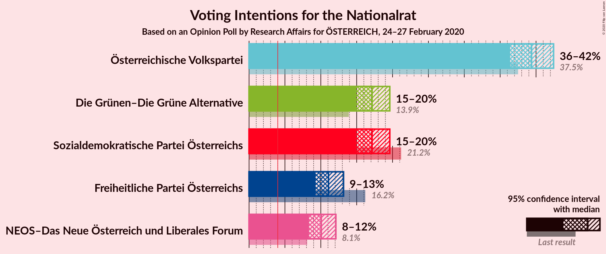

### Confidence Intervals

| Party | Last Result | Poll Result | 80% Confidence Interval | 90% Confidence Interval | 95% Confidence Interval | 99% Confidence Interval |
|:-----:|:-----------:|:-----------:|:-----------------------:|:-----------------------:|:-----------------------:|:-----------------------:|
| Österreichische Volkspartei | 37.5% | 39.4% | 37.4–41.4% |36.9–42.0% |36.4–42.4% |35.5–43.4% |
| Sozialdemokratische Partei Österreichs | 21.2% | 17.1% | 15.7–18.8% |15.3–19.2% |14.9–19.6% |14.3–20.4% |
| Die Grünen–Die Grüne Alternative | 13.9% | 17.1% | 15.7–18.8% |15.3–19.2% |14.9–19.6% |14.3–20.4% |
| Freiheitliche Partei Österreichs | 16.2% | 11.1% | 9.9–12.4% |9.6–12.8% |9.3–13.2% |8.7–13.9% |
| NEOS–Das Neue Österreich und Liberales Forum | 8.1% | 10.1% | 8.9–11.4% |8.6–11.8% |8.4–12.1% |7.8–12.8% |

*Note:* The poll result column reflects the actual value used in the calculations. Published results may vary slightly, and in addition be rounded to fewer digits.

## Seats

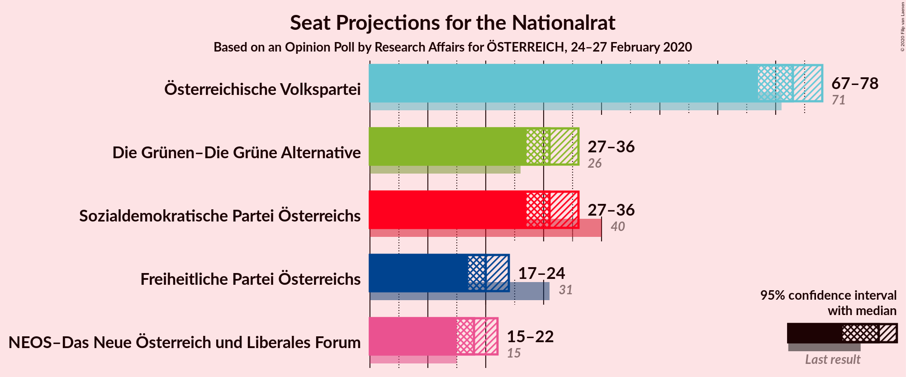

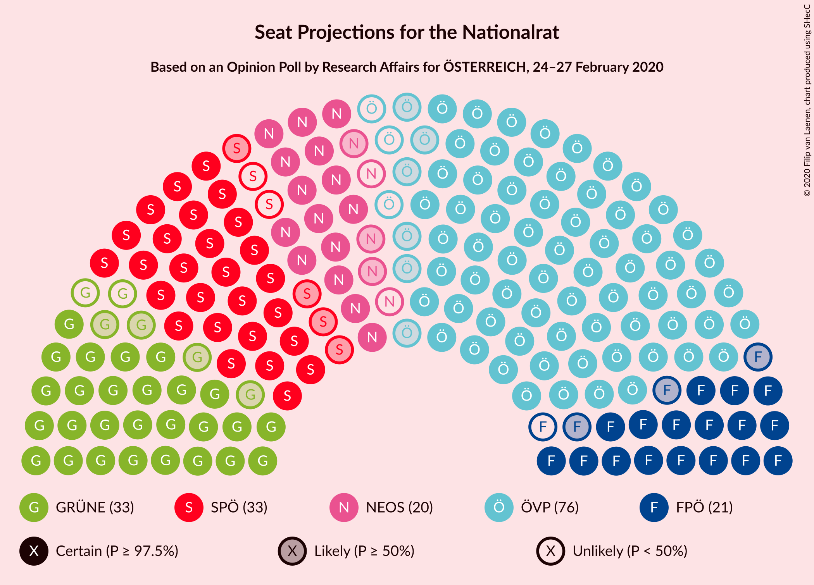

### Confidence Intervals

| Party | Last Result | Median | 80% Confidence Interval | 90% Confidence Interval | 95% Confidence Interval | 99% Confidence Interval |
|:-----:|:-----------:|:------:|:-----------------------:|:-----------------------:|:-----------------------:|:-----------------------:|
| <a href="#österreichische-volkspartei">Österreichische Volkspartei</a> | 71 | 73 | 69–76 |68–77 |67–78 |65–80 |
| <a href="#sozialdemokratische-partei-österreichs">Sozialdemokratische Partei Österreichs</a> | 40 | 31 | 29–34 |28–35 |27–36 |26–37 |
| <a href="#die-grünen–die-grüne-alternative">Die Grünen–Die Grüne Alternative</a> | 26 | 31 | 29–34 |28–35 |27–36 |26–37 |
| <a href="#freiheitliche-partei-österreichs">Freiheitliche Partei Österreichs</a> | 31 | 20 | 18–23 |17–23 |17–24 |16–25 |
| <a href="#neos–das-neue-österreich-und-liberales-forum">NEOS–Das Neue Österreich und Liberales Forum</a> | 15 | 18 | 16–21 |16–21 |15–22 |14–23 |

### Österreichische Volkspartei

*For a full overview of the results for this party, see the [Österreichische Volkspartei](party-österreichischevolkspartei.html) page.*

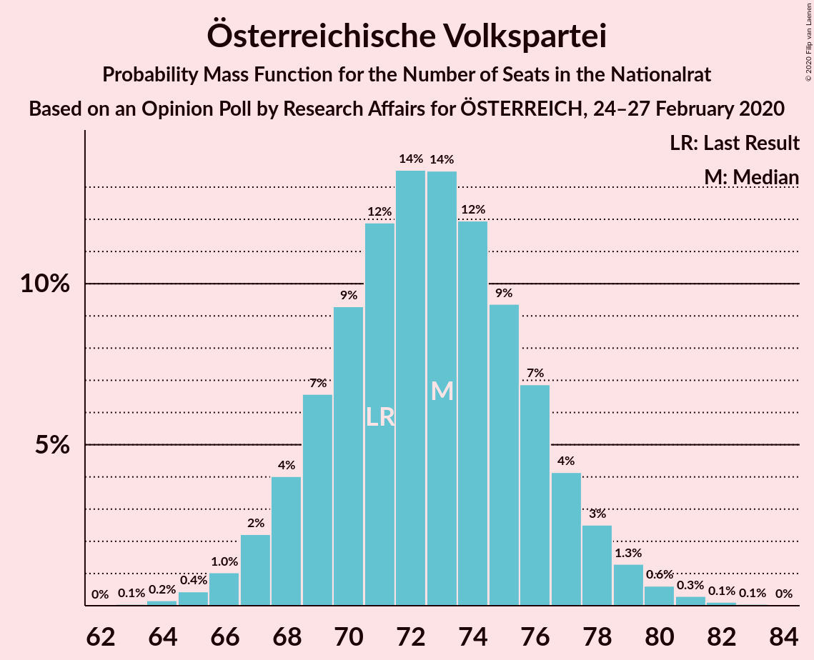

| Number of Seats | Probability | Accumulated | Special Marks |
|:---------------:|:-----------:|:-----------:|:-------------:|
| 63 | 0.1% | 100% |  |
| 64 | 0.2% | 99.9% |  |
| 65 | 0.4% | 99.8% |  |
| 66 | 1.0% | 99.3% |  |
| 67 | 2% | 98% |  |
| 68 | 4% | 96% |  |
| 69 | 7% | 92% |  |
| 70 | 9% | 85% |  |
| 71 | 12% | 76% | Last Result |
| 72 | 14% | 64% |  |
| 73 | 14% | 51% | Median |
| 74 | 12% | 37% |  |
| 75 | 9% | 25% |  |
| 76 | 7% | 16% |  |
| 77 | 4% | 9% |  |
| 78 | 3% | 5% |  |
| 79 | 1.3% | 2% |  |
| 80 | 0.6% | 1.1% |  |
| 81 | 0.3% | 0.5% |  |
| 82 | 0.1% | 0.2% |  |
| 83 | 0.1% | 0.1% |  |
| 84 | 0% | 0% |  |

### Sozialdemokratische Partei Österreichs

*For a full overview of the results for this party, see the [Sozialdemokratische Partei Österreichs](party-sozialdemokratischeparteiösterreichs.html) page.*

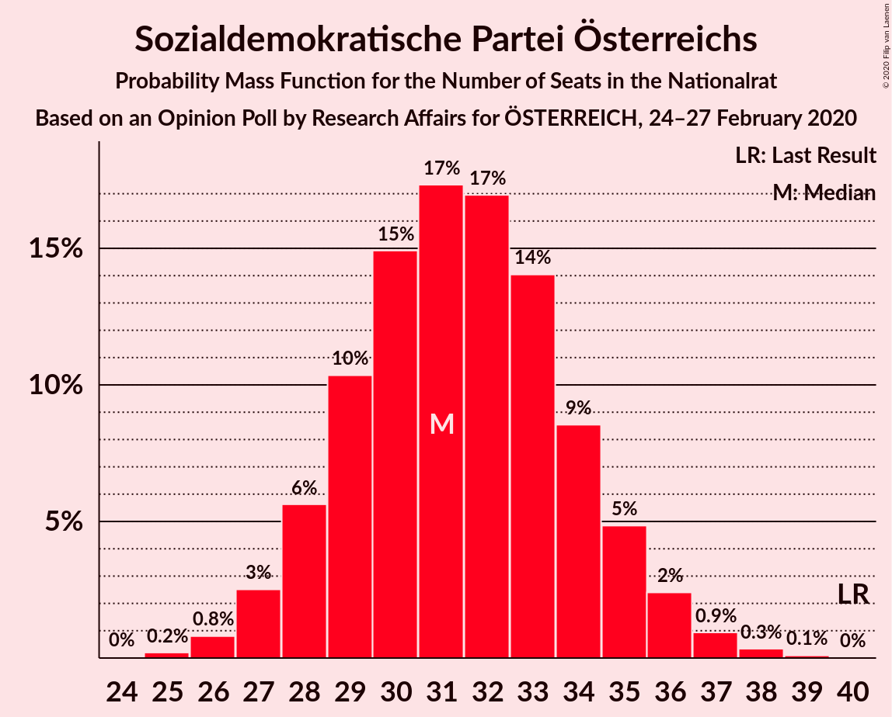

| Number of Seats | Probability | Accumulated | Special Marks |
|:---------------:|:-----------:|:-----------:|:-------------:|
| 25 | 0.2% | 100% |  |
| 26 | 0.8% | 99.8% |  |
| 27 | 3% | 98.9% |  |
| 28 | 6% | 96% |  |
| 29 | 10% | 91% |  |
| 30 | 15% | 80% |  |
| 31 | 17% | 66% | Median |
| 32 | 17% | 48% |  |
| 33 | 14% | 31% |  |
| 34 | 9% | 17% |  |
| 35 | 5% | 9% |  |
| 36 | 2% | 4% |  |
| 37 | 0.9% | 1.4% |  |
| 38 | 0.3% | 0.5% |  |
| 39 | 0.1% | 0.1% |  |
| 40 | 0% | 0% | Last Result |

### Die Grünen–Die Grüne Alternative

*For a full overview of the results for this party, see the [Die Grünen–Die Grüne Alternative](party-diegrünen–diegrünealternative.html) page.*

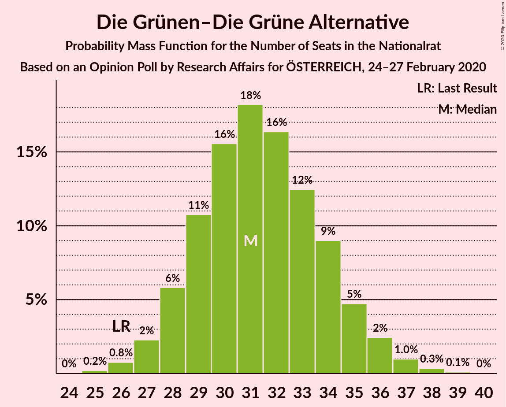

| Number of Seats | Probability | Accumulated | Special Marks |
|:---------------:|:-----------:|:-----------:|:-------------:|
| 25 | 0.2% | 100% |  |
| 26 | 0.8% | 99.8% | Last Result |
| 27 | 2% | 99.0% |  |
| 28 | 6% | 97% |  |
| 29 | 11% | 91% |  |
| 30 | 16% | 80% |  |
| 31 | 18% | 65% | Median |
| 32 | 16% | 46% |  |
| 33 | 12% | 30% |  |
| 34 | 9% | 18% |  |
| 35 | 5% | 9% |  |
| 36 | 2% | 4% |  |
| 37 | 1.0% | 1.5% |  |
| 38 | 0.3% | 0.5% |  |
| 39 | 0.1% | 0.1% |  |
| 40 | 0% | 0% |  |

### Freiheitliche Partei Österreichs

*For a full overview of the results for this party, see the [Freiheitliche Partei Österreichs](party-freiheitlicheparteiösterreichs.html) page.*

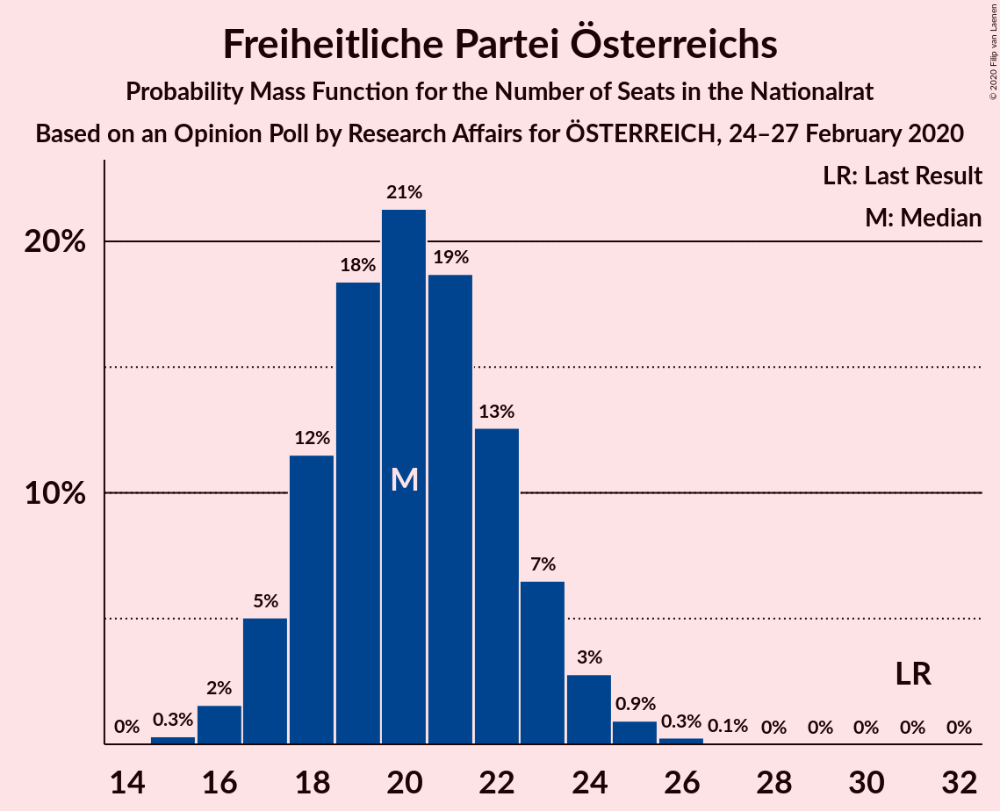

| Number of Seats | Probability | Accumulated | Special Marks |
|:---------------:|:-----------:|:-----------:|:-------------:|
| 15 | 0.3% | 100% |  |
| 16 | 2% | 99.6% |  |
| 17 | 5% | 98% |  |
| 18 | 12% | 93% |  |
| 19 | 18% | 82% |  |
| 20 | 21% | 63% | Median |
| 21 | 19% | 42% |  |
| 22 | 13% | 23% |  |
| 23 | 7% | 11% |  |
| 24 | 3% | 4% |  |
| 25 | 0.9% | 1.3% |  |
| 26 | 0.3% | 0.3% |  |
| 27 | 0.1% | 0.1% |  |
| 28 | 0% | 0% |  |
| 29 | 0% | 0% |  |
| 30 | 0% | 0% |  |
| 31 | 0% | 0% | Last Result |

### NEOS–Das Neue Österreich und Liberales Forum

*For a full overview of the results for this party, see the [NEOS–Das Neue Österreich und Liberales Forum](party-neos–dasneueösterreichundliberalesforum.html) page.*

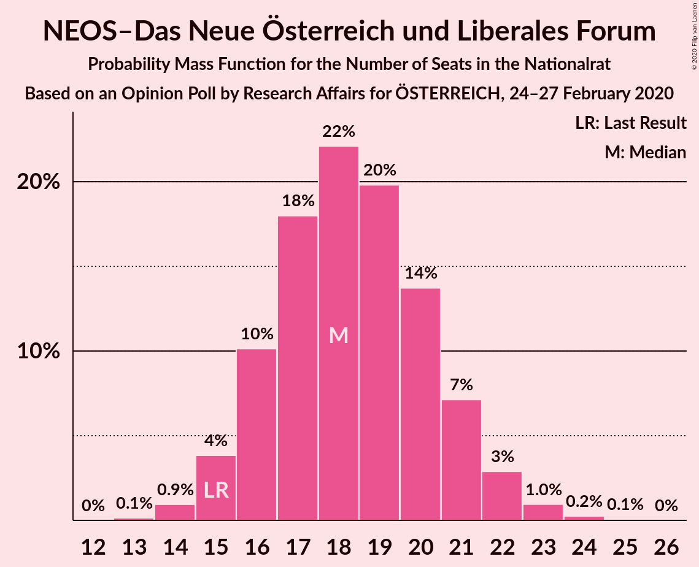

| Number of Seats | Probability | Accumulated | Special Marks |
|:---------------:|:-----------:|:-----------:|:-------------:|
| 13 | 0.1% | 100% |  |
| 14 | 0.9% | 99.8% |  |
| 15 | 4% | 98.9% | Last Result |
| 16 | 10% | 95% |  |
| 17 | 18% | 85% |  |
| 18 | 22% | 67% | Median |
| 19 | 20% | 45% |  |
| 20 | 14% | 25% |  |
| 21 | 7% | 11% |  |
| 22 | 3% | 4% |  |
| 23 | 1.0% | 1.3% |  |
| 24 | 0.2% | 0.3% |  |
| 25 | 0.1% | 0.1% |  |
| 26 | 0% | 0% |  |

## Coalitions

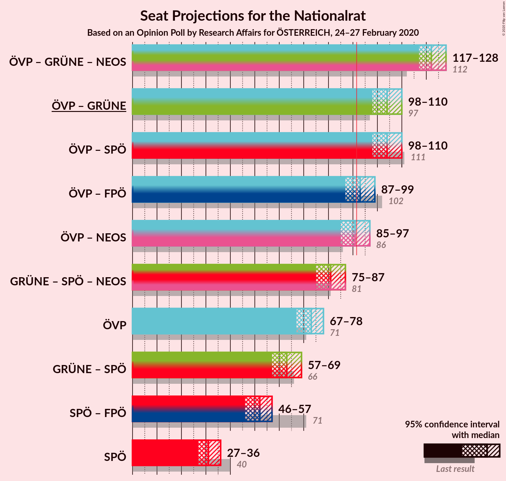

### Confidence Intervals

| Coalition | Last Result | Median | Majority? | 80% Confidence Interval | 90% Confidence Interval | 95% Confidence Interval | 99% Confidence Interval |
|:---------:|:-----------:|:------:|:---------:|:-----------------------:|:-----------------------:|:-----------------------:|:-----------------------:|
| Österreichische Volkspartei – Die Grünen–Die Grüne Alternative – NEOS–Das Neue Österreich und Liberales Forum | 112 | 122 | 100% | 119–126 | 118–127 | 117–128 | 115–131 |
| Österreichische Volkspartei – Die Grünen–Die Grüne Alternative | 97 | 104 | 100% | 100–108 | 99–109 | 98–110 | 96–113 |
| Österreichische Volkspartei – Sozialdemokratische Partei Österreichs | 111 | 104 | 100% | 100–108 | 99–109 | 98–110 | 96–113 |
| Österreichische Volkspartei – Freiheitliche Partei Österreichs | 102 | 93 | 66% | 89–97 | 88–98 | 87–99 | 85–101 |
| Österreichische Volkspartei – NEOS–Das Neue Österreich und Liberales Forum | 86 | 91 | 42% | 87–95 | 86–96 | 85–97 | 83–99 |
| Die Grünen–Die Grüne Alternative – Sozialdemokratische Partei Österreichs – NEOS–Das Neue Österreich und Liberales Forum | 81 | 81 | 0.1% | 77–85 | 76–86 | 75–87 | 74–89 |
| Österreichische Volkspartei | 71 | 73 | 0% | 69–76 | 68–77 | 67–78 | 65–80 |
| Die Grünen–Die Grüne Alternative – Sozialdemokratische Partei Österreichs | 66 | 63 | 0% | 59–67 | 58–68 | 57–69 | 56–70 |
| Sozialdemokratische Partei Österreichs – Freiheitliche Partei Österreichs | 71 | 52 | 0% | 48–55 | 47–56 | 46–57 | 45–59 |
| Sozialdemokratische Partei Österreichs | 40 | 31 | 0% | 29–34 | 28–35 | 27–36 | 26–37 |

### Österreichische Volkspartei – Die Grünen–Die Grüne Alternative – NEOS–Das Neue Österreich und Liberales Forum

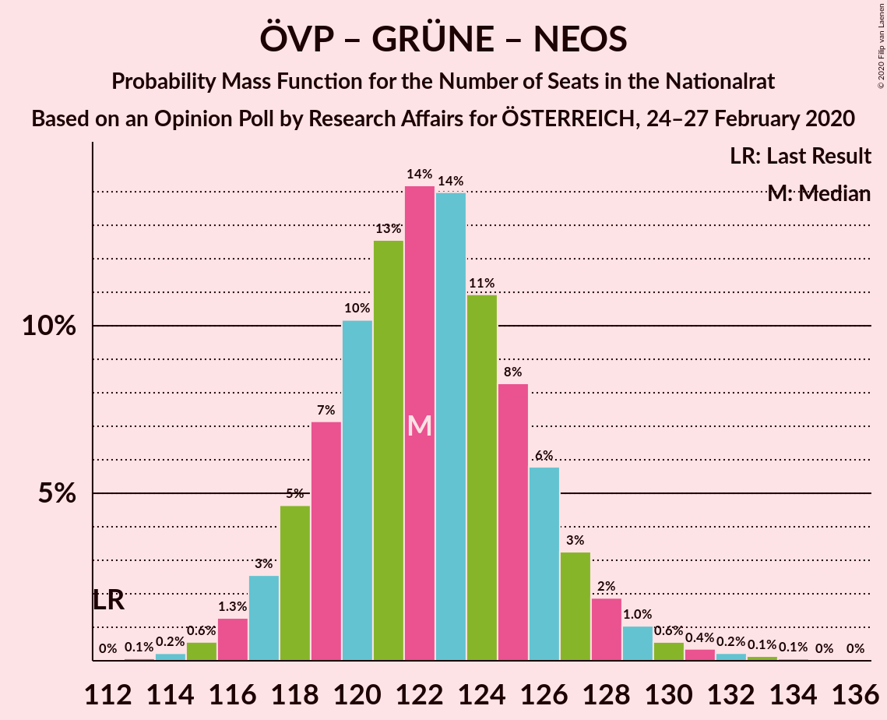

| Number of Seats | Probability | Accumulated | Special Marks |
|:---------------:|:-----------:|:-----------:|:-------------:|
| 112 | 0% | 100% | Last Result |
| 113 | 0.1% | 100% |  |
| 114 | 0.2% | 99.9% |  |
| 115 | 0.6% | 99.7% |  |
| 116 | 1.3% | 99.1% |  |
| 117 | 3% | 98% |  |
| 118 | 5% | 95% |  |
| 119 | 7% | 91% |  |
| 120 | 10% | 83% |  |
| 121 | 13% | 73% |  |
| 122 | 14% | 61% | Median |
| 123 | 14% | 47% |  |
| 124 | 11% | 33% |  |
| 125 | 8% | 22% |  |
| 126 | 6% | 13% |  |
| 127 | 3% | 8% |  |
| 128 | 2% | 4% |  |
| 129 | 1.0% | 2% |  |
| 130 | 0.6% | 1.4% |  |
| 131 | 0.4% | 0.8% |  |
| 132 | 0.2% | 0.5% |  |
| 133 | 0.1% | 0.2% |  |
| 134 | 0.1% | 0.1% |  |
| 135 | 0% | 0% |  |

### Österreichische Volkspartei – Die Grünen–Die Grüne Alternative

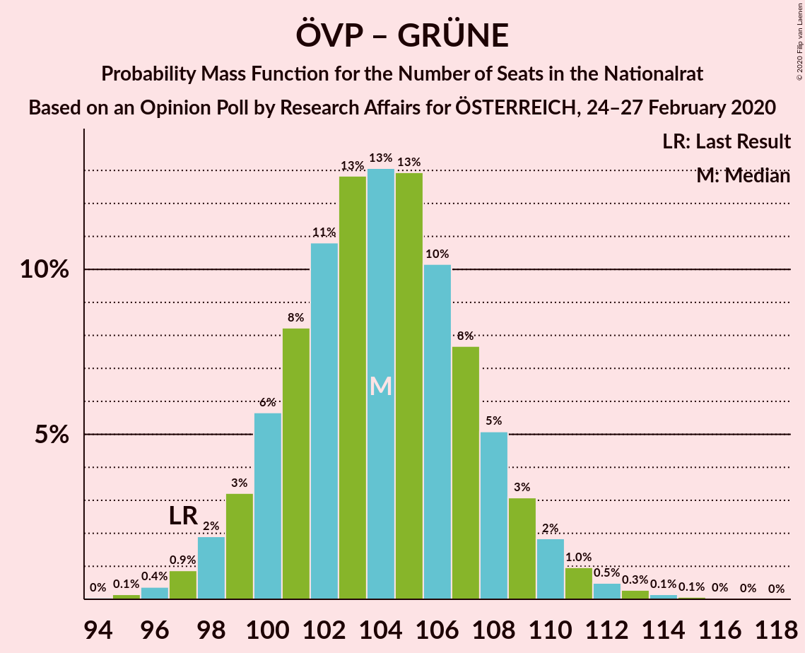

| Number of Seats | Probability | Accumulated | Special Marks |
|:---------------:|:-----------:|:-----------:|:-------------:|
| 94 | 0% | 100% |  |
| 95 | 0.1% | 99.9% |  |
| 96 | 0.4% | 99.8% |  |
| 97 | 0.9% | 99.4% | Last Result |
| 98 | 2% | 98.5% |  |
| 99 | 3% | 97% |  |
| 100 | 6% | 93% |  |
| 101 | 8% | 88% |  |
| 102 | 11% | 80% |  |
| 103 | 13% | 69% |  |
| 104 | 13% | 56% | Median |
| 105 | 13% | 43% |  |
| 106 | 10% | 30% |  |
| 107 | 8% | 20% |  |
| 108 | 5% | 12% |  |
| 109 | 3% | 7% |  |
| 110 | 2% | 4% |  |
| 111 | 1.0% | 2% |  |
| 112 | 0.5% | 1.1% |  |
| 113 | 0.3% | 0.6% |  |
| 114 | 0.1% | 0.3% |  |
| 115 | 0.1% | 0.1% |  |
| 116 | 0% | 0.1% |  |
| 117 | 0% | 0% |  |

### Österreichische Volkspartei – Sozialdemokratische Partei Österreichs

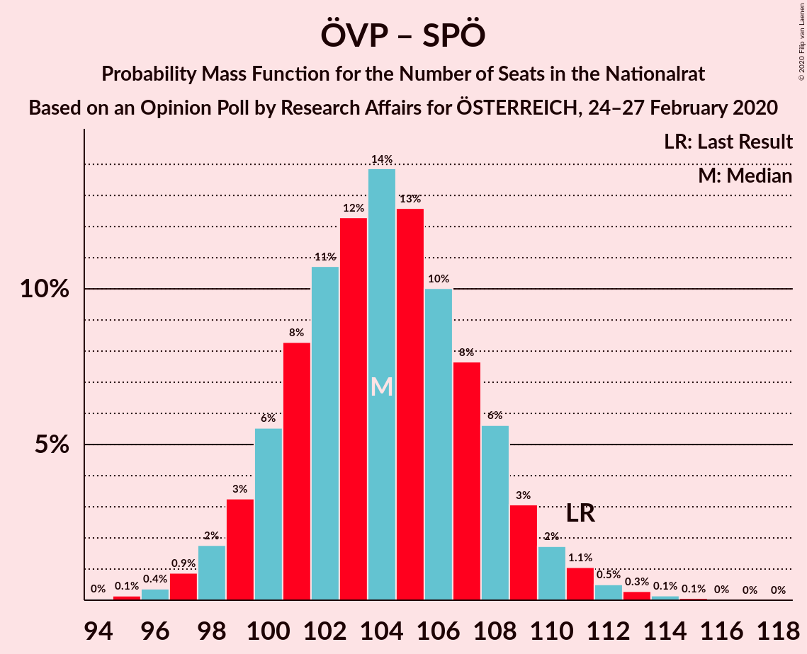

| Number of Seats | Probability | Accumulated | Special Marks |
|:---------------:|:-----------:|:-----------:|:-------------:|
| 94 | 0% | 100% |  |
| 95 | 0.1% | 99.9% |  |
| 96 | 0.4% | 99.8% |  |
| 97 | 0.9% | 99.4% |  |
| 98 | 2% | 98.5% |  |
| 99 | 3% | 97% |  |
| 100 | 6% | 94% |  |
| 101 | 8% | 88% |  |
| 102 | 11% | 80% |  |
| 103 | 12% | 69% |  |
| 104 | 14% | 57% | Median |
| 105 | 13% | 43% |  |
| 106 | 10% | 30% |  |
| 107 | 8% | 20% |  |
| 108 | 6% | 13% |  |
| 109 | 3% | 7% |  |
| 110 | 2% | 4% |  |
| 111 | 1.1% | 2% | Last Result |
| 112 | 0.5% | 1.1% |  |
| 113 | 0.3% | 0.6% |  |
| 114 | 0.1% | 0.3% |  |
| 115 | 0.1% | 0.1% |  |
| 116 | 0% | 0.1% |  |
| 117 | 0% | 0% |  |

### Österreichische Volkspartei – Freiheitliche Partei Österreichs

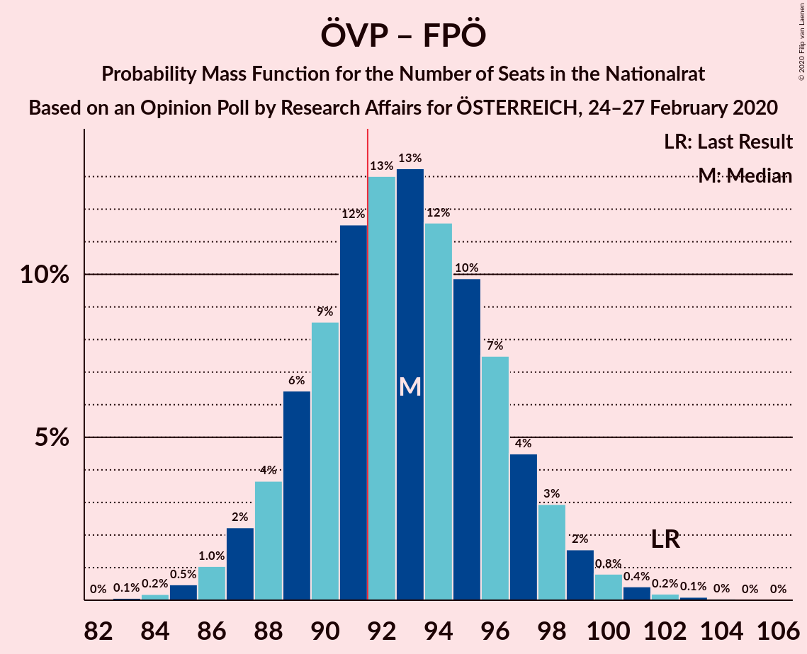

| Number of Seats | Probability | Accumulated | Special Marks |
|:---------------:|:-----------:|:-----------:|:-------------:|
| 83 | 0.1% | 100% |  |
| 84 | 0.2% | 99.9% |  |
| 85 | 0.5% | 99.7% |  |
| 86 | 1.0% | 99.2% |  |
| 87 | 2% | 98% |  |
| 88 | 4% | 96% |  |
| 89 | 6% | 92% |  |
| 90 | 9% | 86% |  |
| 91 | 12% | 77% |  |
| 92 | 13% | 66% | Majority |
| 93 | 13% | 53% | Median |
| 94 | 12% | 40% |  |
| 95 | 10% | 28% |  |
| 96 | 7% | 18% |  |
| 97 | 4% | 11% |  |
| 98 | 3% | 6% |  |
| 99 | 2% | 3% |  |
| 100 | 0.8% | 2% |  |
| 101 | 0.4% | 0.8% |  |
| 102 | 0.2% | 0.4% | Last Result |
| 103 | 0.1% | 0.2% |  |
| 104 | 0% | 0.1% |  |
| 105 | 0% | 0% |  |

### Österreichische Volkspartei – NEOS–Das Neue Österreich und Liberales Forum

| Number of Seats | Probability | Accumulated | Special Marks |
|:---------------:|:-----------:|:-----------:|:-------------:|
| 81 | 0.1% | 100% |  |
| 82 | 0.2% | 99.9% |  |
| 83 | 0.4% | 99.8% |  |
| 84 | 0.9% | 99.3% |  |
| 85 | 2% | 98% |  |
| 86 | 4% | 96% | Last Result |
| 87 | 6% | 93% |  |
| 88 | 8% | 87% |  |
| 89 | 11% | 79% |  |
| 90 | 13% | 68% |  |
| 91 | 13% | 55% | Median |
| 92 | 12% | 42% | Majority |
| 93 | 10% | 30% |  |
| 94 | 7% | 19% |  |
| 95 | 5% | 12% |  |
| 96 | 3% | 7% |  |
| 97 | 2% | 3% |  |
| 98 | 0.9% | 2% |  |
| 99 | 0.4% | 0.9% |  |
| 100 | 0.2% | 0.4% |  |
| 101 | 0.1% | 0.2% |  |
| 102 | 0% | 0.1% |  |
| 103 | 0% | 0% |  |

### Die Grünen–Die Grüne Alternative – Sozialdemokratische Partei Österreichs – NEOS–Das Neue Österreich und Liberales Forum

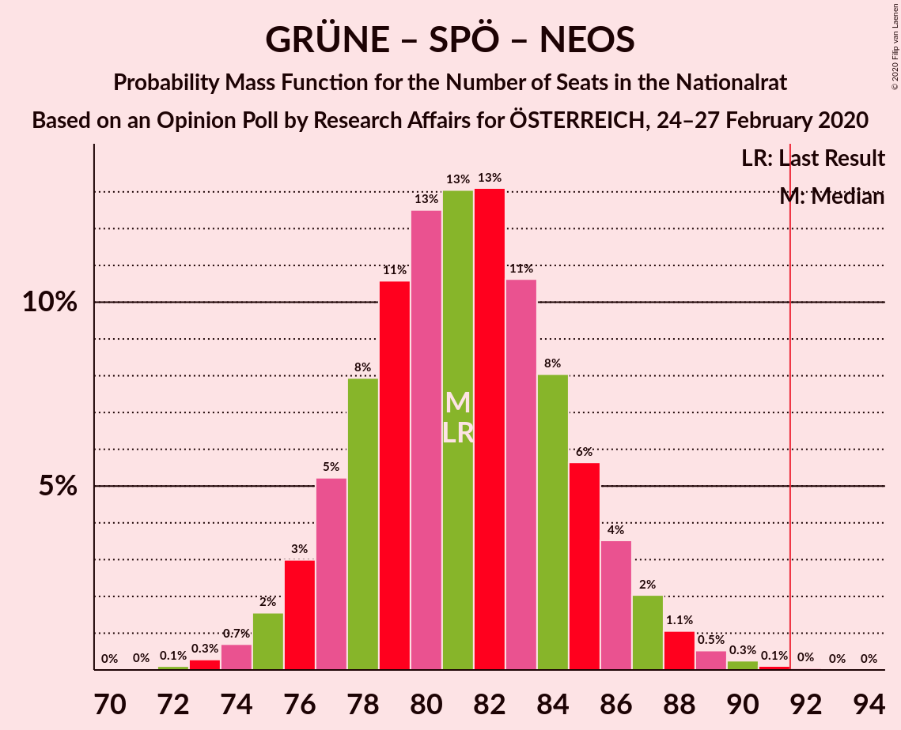

| Number of Seats | Probability | Accumulated | Special Marks |
|:---------------:|:-----------:|:-----------:|:-------------:|
| 72 | 0.1% | 100% |  |
| 73 | 0.3% | 99.9% |  |
| 74 | 0.7% | 99.6% |  |
| 75 | 2% | 98.9% |  |
| 76 | 3% | 97% |  |
| 77 | 5% | 94% |  |
| 78 | 8% | 89% |  |
| 79 | 11% | 81% |  |
| 80 | 13% | 71% | Median |
| 81 | 13% | 58% | Last Result |
| 82 | 13% | 45% |  |
| 83 | 11% | 32% |  |
| 84 | 8% | 21% |  |
| 85 | 6% | 13% |  |
| 86 | 4% | 8% |  |
| 87 | 2% | 4% |  |
| 88 | 1.1% | 2% |  |
| 89 | 0.5% | 1.0% |  |
| 90 | 0.3% | 0.4% |  |
| 91 | 0.1% | 0.2% |  |
| 92 | 0% | 0.1% | Majority |
| 93 | 0% | 0% |  |

### Österreichische Volkspartei

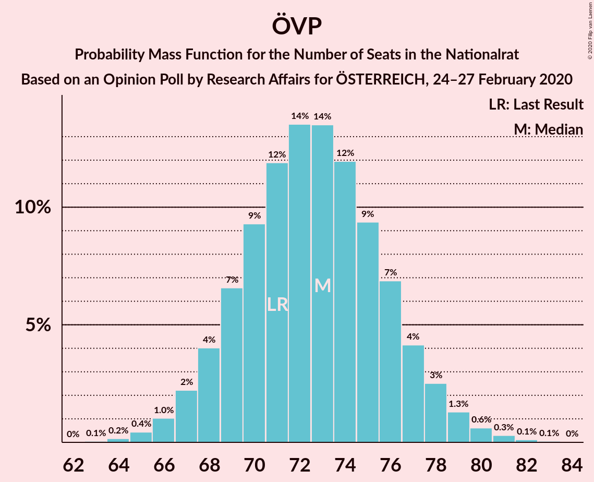

| Number of Seats | Probability | Accumulated | Special Marks |
|:---------------:|:-----------:|:-----------:|:-------------:|
| 63 | 0.1% | 100% |  |
| 64 | 0.2% | 99.9% |  |
| 65 | 0.4% | 99.8% |  |
| 66 | 1.0% | 99.3% |  |
| 67 | 2% | 98% |  |
| 68 | 4% | 96% |  |
| 69 | 7% | 92% |  |
| 70 | 9% | 85% |  |
| 71 | 12% | 76% | Last Result |
| 72 | 14% | 64% |  |
| 73 | 14% | 51% | Median |
| 74 | 12% | 37% |  |
| 75 | 9% | 25% |  |
| 76 | 7% | 16% |  |
| 77 | 4% | 9% |  |
| 78 | 3% | 5% |  |
| 79 | 1.3% | 2% |  |
| 80 | 0.6% | 1.1% |  |
| 81 | 0.3% | 0.5% |  |
| 82 | 0.1% | 0.2% |  |
| 83 | 0.1% | 0.1% |  |
| 84 | 0% | 0% |  |

### Die Grünen–Die Grüne Alternative – Sozialdemokratische Partei Österreichs

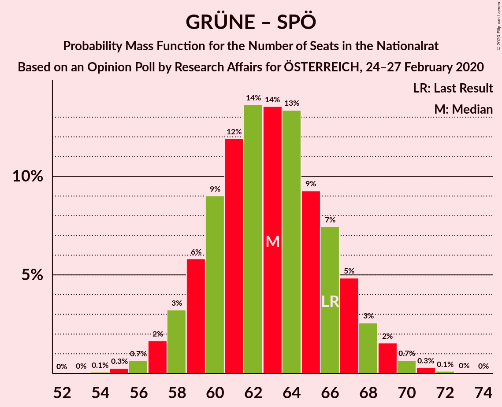

| Number of Seats | Probability | Accumulated | Special Marks |
|:---------------:|:-----------:|:-----------:|:-------------:|
| 54 | 0.1% | 100% |  |
| 55 | 0.3% | 99.9% |  |
| 56 | 0.7% | 99.6% |  |
| 57 | 2% | 99.0% |  |
| 58 | 3% | 97% |  |
| 59 | 6% | 94% |  |
| 60 | 9% | 88% |  |
| 61 | 12% | 79% |  |
| 62 | 14% | 67% | Median |
| 63 | 14% | 54% |  |
| 64 | 13% | 40% |  |
| 65 | 9% | 27% |  |
| 66 | 7% | 18% | Last Result |
| 67 | 5% | 10% |  |
| 68 | 3% | 5% |  |
| 69 | 2% | 3% |  |
| 70 | 0.7% | 1.2% |  |
| 71 | 0.3% | 0.5% |  |
| 72 | 0.1% | 0.2% |  |
| 73 | 0% | 0.1% |  |
| 74 | 0% | 0% |  |

### Sozialdemokratische Partei Österreichs – Freiheitliche Partei Österreichs

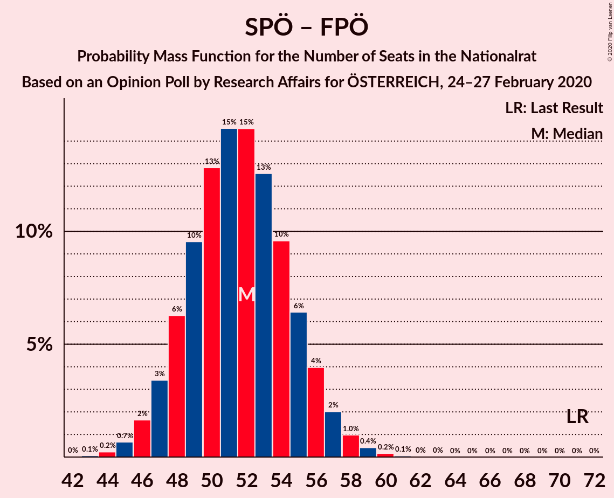

| Number of Seats | Probability | Accumulated | Special Marks |
|:---------------:|:-----------:|:-----------:|:-------------:|
| 43 | 0.1% | 100% |  |
| 44 | 0.2% | 99.9% |  |
| 45 | 0.7% | 99.7% |  |
| 46 | 2% | 99.0% |  |
| 47 | 3% | 97% |  |
| 48 | 6% | 94% |  |
| 49 | 10% | 88% |  |
| 50 | 13% | 78% |  |
| 51 | 15% | 65% | Median |
| 52 | 15% | 51% |  |
| 53 | 13% | 36% |  |
| 54 | 10% | 24% |  |
| 55 | 6% | 14% |  |
| 56 | 4% | 8% |  |
| 57 | 2% | 4% |  |
| 58 | 1.0% | 2% |  |
| 59 | 0.4% | 0.7% |  |
| 60 | 0.2% | 0.2% |  |
| 61 | 0.1% | 0.1% |  |
| 62 | 0% | 0% |  |
| 63 | 0% | 0% |  |
| 64 | 0% | 0% |  |
| 65 | 0% | 0% |  |
| 66 | 0% | 0% |  |
| 67 | 0% | 0% |  |
| 68 | 0% | 0% |  |
| 69 | 0% | 0% |  |
| 70 | 0% | 0% |  |
| 71 | 0% | 0% | Last Result |

### Sozialdemokratische Partei Österreichs

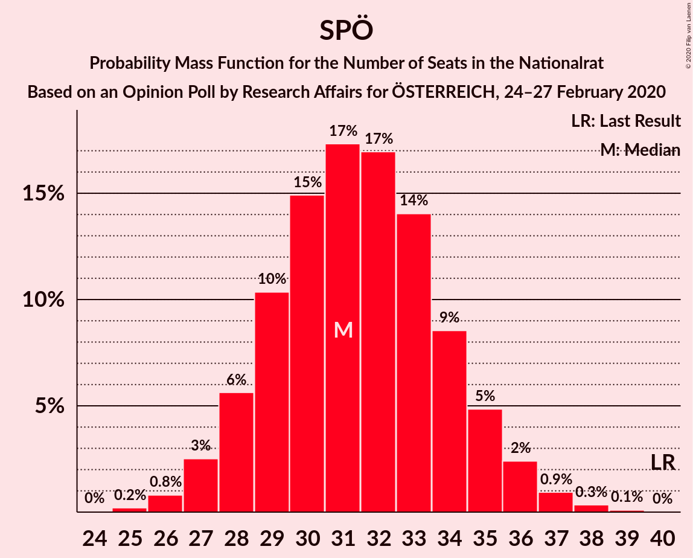

| Number of Seats | Probability | Accumulated | Special Marks |
|:---------------:|:-----------:|:-----------:|:-------------:|
| 25 | 0.2% | 100% |  |
| 26 | 0.8% | 99.8% |  |
| 27 | 3% | 98.9% |  |
| 28 | 6% | 96% |  |
| 29 | 10% | 91% |  |
| 30 | 15% | 80% |  |
| 31 | 17% | 66% | Median |
| 32 | 17% | 48% |  |
| 33 | 14% | 31% |  |
| 34 | 9% | 17% |  |
| 35 | 5% | 9% |  |
| 36 | 2% | 4% |  |
| 37 | 0.9% | 1.4% |  |
| 38 | 0.3% | 0.5% |  |
| 39 | 0.1% | 0.1% |  |
| 40 | 0% | 0% | Last Result |

## Technical Information

### Opinion Poll

+ **Polling firm:** Research Affairs
+ **Commissioner(s):** ÖSTERREICH
+ **Fieldwork period:** 24–27 February 2020

### Calculations

+ **Sample size:** 1003
+ **Simulations done:** 1,048,576
+ **Error estimate:** 0.37%

