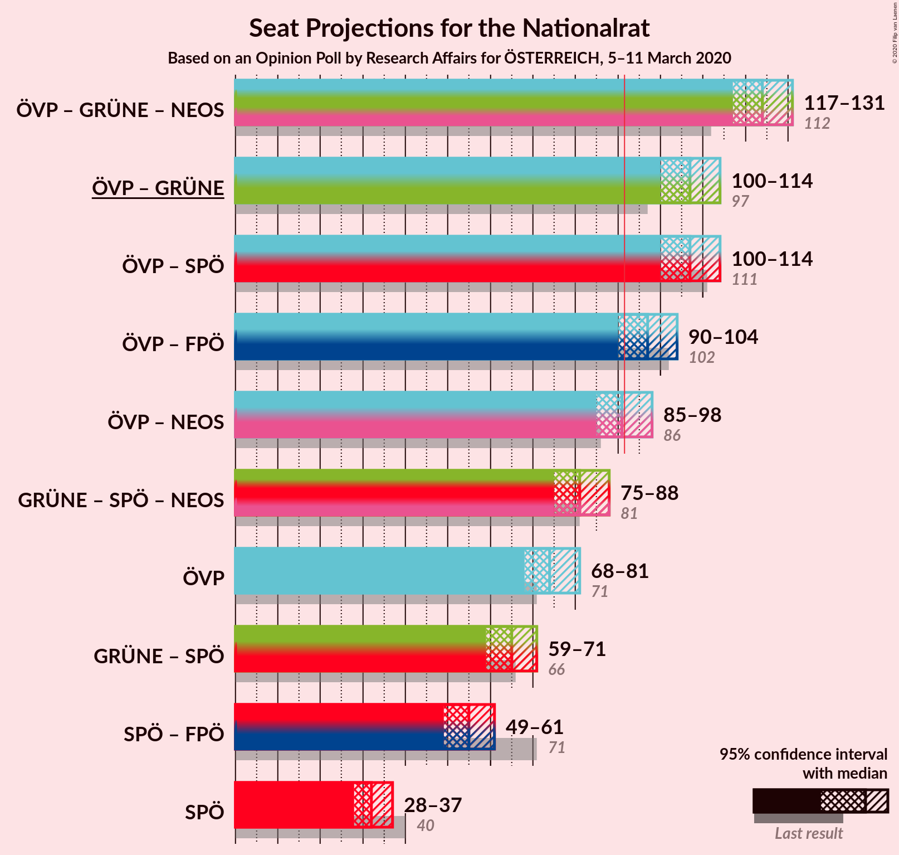

# Opinion Poll by Research Affairs for ÖSTERREICH, 5–11 March 2020

<a href="#voting-intentions">Voting Intentions</a> | <a href="#seats">Seats</a> | <a href="#coalitions">Coalitions</a> | <a href="#technical-information">Technical Information</a>

## Voting Intentions

### Confidence Intervals

| Party | Last Result | Poll Result | 80% Confidence Interval | 90% Confidence Interval | 95% Confidence Interval | 99% Confidence Interval |
|:-----:|:-----------:|:-----------:|:-----------------------:|:-----------------------:|:-----------------------:|:-----------------------:|
| Österreichische Volkspartei | 37.5% | 39.8% | 37.9–41.8% |37.3–42.4% |36.8–42.9% |35.9–43.9% |
| Sozialdemokratische Partei Österreichs | 21.2% | 17.4% | 15.9–19.0% |15.5–19.4% |15.1–19.8% |14.5–20.6% |
| Die Grünen–Die Grüne Alternative | 13.9% | 17.4% | 15.9–19.0% |15.5–19.4% |15.1–19.8% |14.5–20.6% |
| Freiheitliche Partei Österreichs | 16.2% | 12.3% | 11.0–13.7% |10.7–14.1% |10.4–14.5% |9.8–15.2% |
| NEOS–Das Neue Österreich und Liberales Forum | 8.1% | 9.2% | 8.1–10.5% |7.8–10.8% |7.5–11.1% |7.1–11.8% |

*Note:* The poll result column reflects the actual value used in the calculations. Published results may vary slightly, and in addition be rounded to fewer digits.

## Seats

### Confidence Intervals

| Party | Last Result | Median | 80% Confidence Interval | 90% Confidence Interval | 95% Confidence Interval | 99% Confidence Interval |
|:-----:|:-----------:|:------:|:-----------------------:|:-----------------------:|:-----------------------:|:-----------------------:|
| <a href="#österreichische-volkspartei">Österreichische Volkspartei</a> | 71 | 74 | 70–79 |69–80 |68–81 |66–83 |
| <a href="#sozialdemokratische-partei-österreichs">Sozialdemokratische Partei Österreichs</a> | 40 | 32 | 29–35 |29–36 |28–37 |27–39 |
| <a href="#die-grünen–die-grüne-alternative">Die Grünen–Die Grüne Alternative</a> | 26 | 32 | 29–35 |29–36 |28–37 |27–39 |
| <a href="#freiheitliche-partei-österreichs">Freiheitliche Partei Österreichs</a> | 31 | 23 | 20–25 |20–26 |19–27 |18–28 |
| <a href="#neos–das-neue-österreich-und-liberales-forum">NEOS–Das Neue Österreich und Liberales Forum</a> | 15 | 17 | 15–19 |14–20 |14–21 |13–22 |

### Österreichische Volkspartei

*For a full overview of the results for this party, see the [Österreichische Volkspartei](party-österreichischevolkspartei.html) page.*

| Number of Seats | Probability | Accumulated | Special Marks |
|:---------------:|:-----------:|:-----------:|:-------------:|
| 64 | 0.1% | 100% |  |
| 65 | 0.1% | 99.9% |  |
| 66 | 0.4% | 99.8% |  |
| 67 | 0.9% | 99.4% |  |
| 68 | 2% | 98.5% |  |
| 69 | 3% | 97% |  |
| 70 | 5% | 93% |  |
| 71 | 7% | 89% | Last Result |
| 72 | 10% | 81% |  |
| 73 | 11% | 72% |  |
| 74 | 11% | 61% | Median |
| 75 | 11% | 49% |  |
| 76 | 10% | 38% |  |
| 77 | 9% | 28% |  |
| 78 | 7% | 18% |  |
| 79 | 5% | 12% |  |
| 80 | 3% | 7% |  |
| 81 | 2% | 4% |  |
| 82 | 1.0% | 2% |  |
| 83 | 0.5% | 0.8% |  |
| 84 | 0.2% | 0.3% |  |
| 85 | 0.1% | 0.1% |  |
| 86 | 0% | 0% |  |

### Sozialdemokratische Partei Österreichs

*For a full overview of the results for this party, see the [Sozialdemokratische Partei Österreichs](party-sozialdemokratischeparteiösterreichs.html) page.*

| Number of Seats | Probability | Accumulated | Special Marks |
|:---------------:|:-----------:|:-----------:|:-------------:|
| 25 | 0.1% | 100% |  |
| 26 | 0.4% | 99.9% |  |
| 27 | 1.1% | 99.5% |  |
| 28 | 3% | 98% |  |
| 29 | 7% | 95% |  |
| 30 | 10% | 88% |  |
| 31 | 15% | 78% |  |
| 32 | 17% | 63% | Median |
| 33 | 15% | 46% |  |
| 34 | 13% | 30% |  |
| 35 | 8% | 17% |  |
| 36 | 5% | 9% |  |
| 37 | 2% | 4% |  |
| 38 | 1.2% | 2% |  |
| 39 | 0.4% | 0.6% |  |
| 40 | 0.1% | 0.2% | Last Result |
| 41 | 0% | 0.1% |  |
| 42 | 0% | 0% |  |

### Die Grünen–Die Grüne Alternative

*For a full overview of the results for this party, see the [Die Grünen–Die Grüne Alternative](party-diegrünen–diegrünealternative.html) page.*

| Number of Seats | Probability | Accumulated | Special Marks |
|:---------------:|:-----------:|:-----------:|:-------------:|
| 25 | 0.1% | 100% |  |
| 26 | 0.4% | 99.9% | Last Result |
| 27 | 1.3% | 99.5% |  |
| 28 | 3% | 98% |  |
| 29 | 7% | 95% |  |
| 30 | 10% | 89% |  |
| 31 | 15% | 78% |  |
| 32 | 17% | 63% | Median |
| 33 | 15% | 46% |  |
| 34 | 13% | 30% |  |
| 35 | 8% | 17% |  |
| 36 | 5% | 9% |  |
| 37 | 3% | 4% |  |
| 38 | 1.1% | 2% |  |
| 39 | 0.4% | 0.6% |  |
| 40 | 0.1% | 0.2% |  |
| 41 | 0% | 0% |  |

### Freiheitliche Partei Österreichs

*For a full overview of the results for this party, see the [Freiheitliche Partei Österreichs](party-freiheitlicheparteiösterreichs.html) page.*

| Number of Seats | Probability | Accumulated | Special Marks |
|:---------------:|:-----------:|:-----------:|:-------------:|
| 17 | 0.2% | 100% |  |
| 18 | 1.1% | 99.7% |  |
| 19 | 4% | 98.6% |  |
| 20 | 8% | 95% |  |
| 21 | 14% | 87% |  |
| 22 | 19% | 73% |  |
| 23 | 19% | 54% | Median |
| 24 | 15% | 34% |  |
| 25 | 10% | 19% |  |
| 26 | 5% | 9% |  |
| 27 | 2% | 4% |  |
| 28 | 0.9% | 1.2% |  |
| 29 | 0.3% | 0.4% |  |
| 30 | 0.1% | 0.1% |  |
| 31 | 0% | 0% | Last Result |

### NEOS–Das Neue Österreich und Liberales Forum

*For a full overview of the results for this party, see the [NEOS–Das Neue Österreich und Liberales Forum](party-neos–dasneueösterreichundliberalesforum.html) page.*

| Number of Seats | Probability | Accumulated | Special Marks |
|:---------------:|:-----------:|:-----------:|:-------------:|
| 12 | 0.3% | 100% |  |
| 13 | 2% | 99.7% |  |
| 14 | 6% | 98% |  |
| 15 | 14% | 92% | Last Result |
| 16 | 21% | 79% |  |
| 17 | 22% | 58% | Median |
| 18 | 17% | 36% |  |
| 19 | 11% | 19% |  |
| 20 | 5% | 8% |  |
| 21 | 2% | 3% |  |
| 22 | 0.5% | 0.7% |  |
| 23 | 0.1% | 0.2% |  |
| 24 | 0% | 0% |  |

## Coalitions

### Confidence Intervals

| Coalition | Last Result | Median | Majority? | 80% Confidence Interval | 90% Confidence Interval | 95% Confidence Interval | 99% Confidence Interval |
|:---------:|:-----------:|:------:|:---------:|:-----------------------:|:-----------------------:|:-----------------------:|:-----------------------:|
| Österreichische Volkspartei – Die Grünen–Die Grüne Alternative – NEOS–Das Neue Österreich und Liberales Forum | 112 | 124 | 100% | 119–129 | 118–130 | 117–131 | 115–133 |
| Österreichische Volkspartei – Die Grünen–Die Grüne Alternative | 97 | 107 | 100% | 102–112 | 101–113 | 100–114 | 98–116 |
| Österreichische Volkspartei – Sozialdemokratische Partei Österreichs | 111 | 107 | 100% | 102–112 | 101–113 | 100–114 | 98–116 |
| Österreichische Volkspartei – Freiheitliche Partei Österreichs | 102 | 97 | 94% | 93–102 | 91–103 | 90–104 | 88–106 |
| Österreichische Volkspartei – NEOS–Das Neue Österreich und Liberales Forum | 86 | 91 | 48% | 87–96 | 86–97 | 85–98 | 83–100 |
| Die Grünen–Die Grüne Alternative – Sozialdemokratische Partei Österreichs – NEOS–Das Neue Österreich und Liberales Forum | 81 | 81 | 0.2% | 77–86 | 76–87 | 75–88 | 73–90 |
| Österreichische Volkspartei | 71 | 74 | 0% | 70–79 | 69–80 | 68–81 | 66–83 |
| Die Grünen–Die Grüne Alternative – Sozialdemokratische Partei Österreichs | 66 | 65 | 0% | 61–69 | 60–70 | 59–71 | 57–73 |
| Sozialdemokratische Partei Österreichs – Freiheitliche Partei Österreichs | 71 | 55 | 0% | 51–59 | 50–60 | 49–61 | 48–63 |
| Sozialdemokratische Partei Österreichs | 40 | 32 | 0% | 29–35 | 29–36 | 28–37 | 27–39 |

### Österreichische Volkspartei – Die Grünen–Die Grüne Alternative – NEOS–Das Neue Österreich und Liberales Forum

| Number of Seats | Probability | Accumulated | Special Marks |
|:---------------:|:-----------:|:-----------:|:-------------:|
| 112 | 0% | 100% | Last Result |
| 113 | 0.1% | 100% |  |
| 114 | 0.3% | 99.9% |  |
| 115 | 0.6% | 99.6% |  |
| 116 | 1.3% | 99.0% |  |
| 117 | 3% | 98% |  |
| 118 | 4% | 95% |  |
| 119 | 6% | 91% |  |
| 120 | 8% | 86% |  |
| 121 | 8% | 78% |  |
| 122 | 10% | 69% |  |
| 123 | 9% | 60% | Median |
| 124 | 9% | 51% |  |
| 125 | 8% | 42% |  |
| 126 | 8% | 34% |  |
| 127 | 7% | 26% |  |
| 128 | 6% | 19% |  |
| 129 | 5% | 12% |  |
| 130 | 3% | 7% |  |
| 131 | 2% | 4% |  |
| 132 | 1.1% | 2% |  |
| 133 | 0.5% | 0.7% |  |
| 134 | 0.2% | 0.3% |  |
| 135 | 0.1% | 0.1% |  |
| 136 | 0% | 0% |  |

### Österreichische Volkspartei – Die Grünen–Die Grüne Alternative

| Number of Seats | Probability | Accumulated | Special Marks |
|:---------------:|:-----------:|:-----------:|:-------------:|
| 96 | 0.1% | 100% |  |
| 97 | 0.2% | 99.9% | Last Result |
| 98 | 0.6% | 99.6% |  |
| 99 | 1.0% | 99.1% |  |
| 100 | 2% | 98% |  |
| 101 | 3% | 96% |  |
| 102 | 5% | 92% |  |
| 103 | 7% | 87% |  |
| 104 | 8% | 80% |  |
| 105 | 10% | 72% |  |
| 106 | 10% | 62% | Median |
| 107 | 10% | 52% |  |
| 108 | 9% | 42% |  |
| 109 | 9% | 33% |  |
| 110 | 7% | 24% |  |
| 111 | 6% | 17% |  |
| 112 | 4% | 11% |  |
| 113 | 3% | 7% |  |
| 114 | 2% | 3% |  |
| 115 | 1.0% | 2% |  |
| 116 | 0.5% | 0.8% |  |
| 117 | 0.2% | 0.3% |  |
| 118 | 0.1% | 0.1% |  |
| 119 | 0% | 0% |  |

### Österreichische Volkspartei – Sozialdemokratische Partei Österreichs

| Number of Seats | Probability | Accumulated | Special Marks |
|:---------------:|:-----------:|:-----------:|:-------------:|
| 96 | 0.1% | 100% |  |
| 97 | 0.2% | 99.9% |  |
| 98 | 0.5% | 99.6% |  |
| 99 | 1.2% | 99.1% |  |
| 100 | 2% | 98% |  |
| 101 | 3% | 96% |  |
| 102 | 5% | 92% |  |
| 103 | 7% | 87% |  |
| 104 | 8% | 80% |  |
| 105 | 9% | 72% |  |
| 106 | 11% | 63% | Median |
| 107 | 9% | 52% |  |
| 108 | 10% | 43% |  |
| 109 | 9% | 33% |  |
| 110 | 7% | 24% |  |
| 111 | 6% | 17% | Last Result |
| 112 | 4% | 11% |  |
| 113 | 3% | 6% |  |
| 114 | 2% | 4% |  |
| 115 | 0.9% | 2% |  |
| 116 | 0.5% | 0.8% |  |
| 117 | 0.2% | 0.3% |  |
| 118 | 0.1% | 0.1% |  |
| 119 | 0% | 0% |  |

### Österreichische Volkspartei – Freiheitliche Partei Österreichs

| Number of Seats | Probability | Accumulated | Special Marks |
|:---------------:|:-----------:|:-----------:|:-------------:|
| 86 | 0% | 100% |  |
| 87 | 0.1% | 99.9% |  |
| 88 | 0.3% | 99.8% |  |
| 89 | 0.8% | 99.5% |  |
| 90 | 2% | 98.7% |  |
| 91 | 3% | 97% |  |
| 92 | 4% | 94% | Majority |
| 93 | 6% | 90% |  |
| 94 | 8% | 84% |  |
| 95 | 9% | 76% |  |
| 96 | 10% | 67% |  |
| 97 | 10% | 57% | Median |
| 98 | 10% | 47% |  |
| 99 | 9% | 37% |  |
| 100 | 8% | 27% |  |
| 101 | 6% | 19% |  |
| 102 | 5% | 13% | Last Result |
| 103 | 3% | 8% |  |
| 104 | 2% | 4% |  |
| 105 | 1.3% | 2% |  |
| 106 | 0.6% | 1.0% |  |
| 107 | 0.3% | 0.5% |  |
| 108 | 0.1% | 0.2% |  |
| 109 | 0% | 0.1% |  |
| 110 | 0% | 0% |  |

### Österreichische Volkspartei – NEOS–Das Neue Österreich und Liberales Forum

| Number of Seats | Probability | Accumulated | Special Marks |
|:---------------:|:-----------:|:-----------:|:-------------:|
| 81 | 0.1% | 100% |  |
| 82 | 0.3% | 99.9% |  |
| 83 | 0.6% | 99.6% |  |
| 84 | 1.3% | 99.0% |  |
| 85 | 2% | 98% |  |
| 86 | 4% | 96% | Last Result |
| 87 | 5% | 92% |  |
| 88 | 8% | 86% |  |
| 89 | 9% | 78% |  |
| 90 | 10% | 69% |  |
| 91 | 11% | 59% | Median |
| 92 | 10% | 48% | Majority |
| 93 | 9% | 38% |  |
| 94 | 9% | 29% |  |
| 95 | 7% | 20% |  |
| 96 | 5% | 14% |  |
| 97 | 4% | 9% |  |
| 98 | 2% | 5% |  |
| 99 | 1.4% | 2% |  |
| 100 | 0.6% | 1.1% |  |
| 101 | 0.3% | 0.5% |  |
| 102 | 0.1% | 0.2% |  |
| 103 | 0% | 0.1% |  |
| 104 | 0% | 0% |  |

### Die Grünen–Die Grüne Alternative – Sozialdemokratische Partei Österreichs – NEOS–Das Neue Österreich und Liberales Forum

| Number of Seats | Probability | Accumulated | Special Marks |
|:---------------:|:-----------:|:-----------:|:-------------:|
| 71 | 0.1% | 100% |  |
| 72 | 0.2% | 99.9% |  |
| 73 | 0.4% | 99.7% |  |
| 74 | 1.0% | 99.3% |  |
| 75 | 2% | 98% |  |
| 76 | 3% | 96% |  |
| 77 | 5% | 93% |  |
| 78 | 7% | 88% |  |
| 79 | 9% | 81% |  |
| 80 | 10% | 72% |  |
| 81 | 12% | 61% | Last Result, Median |
| 82 | 11% | 50% |  |
| 83 | 10% | 39% |  |
| 84 | 9% | 29% |  |
| 85 | 7% | 20% |  |
| 86 | 5% | 13% |  |
| 87 | 4% | 8% |  |
| 88 | 2% | 4% |  |
| 89 | 1.2% | 2% |  |
| 90 | 0.6% | 1.1% |  |
| 91 | 0.3% | 0.5% |  |
| 92 | 0.1% | 0.2% | Majority |
| 93 | 0% | 0.1% |  |
| 94 | 0% | 0% |  |

### Österreichische Volkspartei

| Number of Seats | Probability | Accumulated | Special Marks |
|:---------------:|:-----------:|:-----------:|:-------------:|
| 64 | 0.1% | 100% |  |
| 65 | 0.1% | 99.9% |  |
| 66 | 0.4% | 99.8% |  |
| 67 | 0.9% | 99.4% |  |
| 68 | 2% | 98.5% |  |
| 69 | 3% | 97% |  |
| 70 | 5% | 93% |  |
| 71 | 7% | 89% | Last Result |
| 72 | 10% | 81% |  |
| 73 | 11% | 72% |  |
| 74 | 11% | 61% | Median |
| 75 | 11% | 49% |  |
| 76 | 10% | 38% |  |
| 77 | 9% | 28% |  |
| 78 | 7% | 18% |  |
| 79 | 5% | 12% |  |
| 80 | 3% | 7% |  |
| 81 | 2% | 4% |  |
| 82 | 1.0% | 2% |  |
| 83 | 0.5% | 0.8% |  |
| 84 | 0.2% | 0.3% |  |
| 85 | 0.1% | 0.1% |  |
| 86 | 0% | 0% |  |

### Die Grünen–Die Grüne Alternative – Sozialdemokratische Partei Österreichs

| Number of Seats | Probability | Accumulated | Special Marks |
|:---------------:|:-----------:|:-----------:|:-------------:|
| 55 | 0.1% | 100% |  |
| 56 | 0.2% | 99.9% |  |
| 57 | 0.7% | 99.7% |  |
| 58 | 1.4% | 99.0% |  |
| 59 | 2% | 98% |  |
| 60 | 5% | 95% |  |
| 61 | 6% | 91% |  |
| 62 | 9% | 84% |  |
| 63 | 12% | 75% |  |
| 64 | 12% | 63% | Median |
| 65 | 13% | 51% |  |
| 66 | 11% | 38% | Last Result |
| 67 | 9% | 27% |  |
| 68 | 6% | 18% |  |
| 69 | 5% | 11% |  |
| 70 | 3% | 7% |  |
| 71 | 2% | 3% |  |
| 72 | 0.9% | 2% |  |
| 73 | 0.6% | 0.8% |  |
| 74 | 0.2% | 0.3% |  |
| 75 | 0.1% | 0.1% |  |
| 76 | 0% | 0% |  |

### Sozialdemokratische Partei Österreichs – Freiheitliche Partei Österreichs

| Number of Seats | Probability | Accumulated | Special Marks |
|:---------------:|:-----------:|:-----------:|:-------------:|
| 46 | 0.1% | 100% |  |
| 47 | 0.3% | 99.9% |  |
| 48 | 0.7% | 99.6% |  |
| 49 | 2% | 98.9% |  |
| 50 | 3% | 97% |  |
| 51 | 6% | 94% |  |
| 52 | 8% | 89% |  |
| 53 | 11% | 80% |  |
| 54 | 12% | 69% |  |
| 55 | 14% | 57% | Median |
| 56 | 12% | 43% |  |
| 57 | 11% | 31% |  |
| 58 | 8% | 20% |  |
| 59 | 5% | 12% |  |
| 60 | 3% | 7% |  |
| 61 | 2% | 4% |  |
| 62 | 1.0% | 2% |  |
| 63 | 0.4% | 0.7% |  |
| 64 | 0.2% | 0.3% |  |
| 65 | 0.1% | 0.1% |  |
| 66 | 0% | 0% |  |
| 67 | 0% | 0% |  |
| 68 | 0% | 0% |  |
| 69 | 0% | 0% |  |
| 70 | 0% | 0% |  |
| 71 | 0% | 0% | Last Result |

### Sozialdemokratische Partei Österreichs

| Number of Seats | Probability | Accumulated | Special Marks |
|:---------------:|:-----------:|:-----------:|:-------------:|
| 25 | 0.1% | 100% |  |
| 26 | 0.4% | 99.9% |  |
| 27 | 1.1% | 99.5% |  |
| 28 | 3% | 98% |  |
| 29 | 7% | 95% |  |
| 30 | 10% | 88% |  |
| 31 | 15% | 78% |  |
| 32 | 17% | 63% | Median |
| 33 | 15% | 46% |  |
| 34 | 13% | 30% |  |
| 35 | 8% | 17% |  |
| 36 | 5% | 9% |  |
| 37 | 2% | 4% |  |
| 38 | 1.2% | 2% |  |
| 39 | 0.4% | 0.6% |  |
| 40 | 0.1% | 0.2% | Last Result |
| 41 | 0% | 0.1% |  |
| 42 | 0% | 0% |  |

## Technical Information

### Opinion Poll

+ **Polling firm:** Research Affairs
+ **Commissioner(s):** ÖSTERREICH
+ **Fieldwork period:** 5–11 March 2020

### Calculations

+ **Sample size:** 1002
+ **Simulations done:** 1,048,576
+ **Error estimate:** 0.27%

