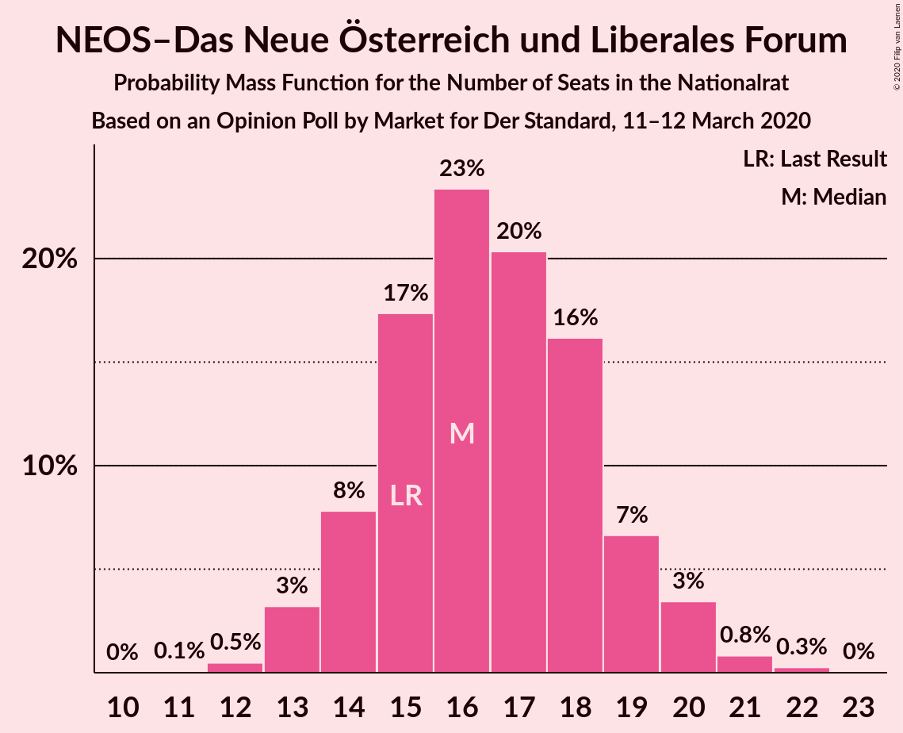
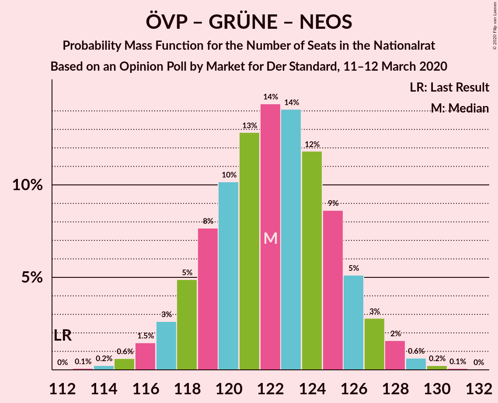
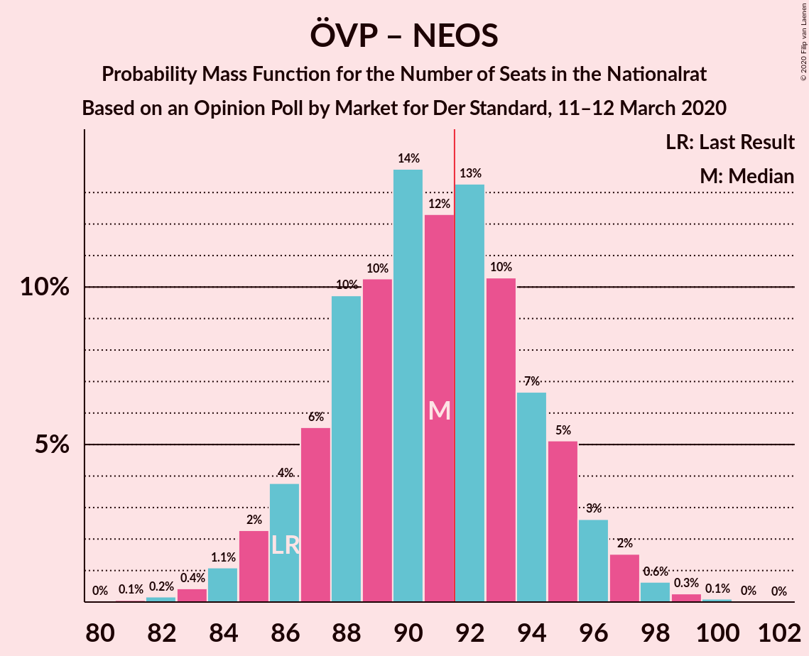
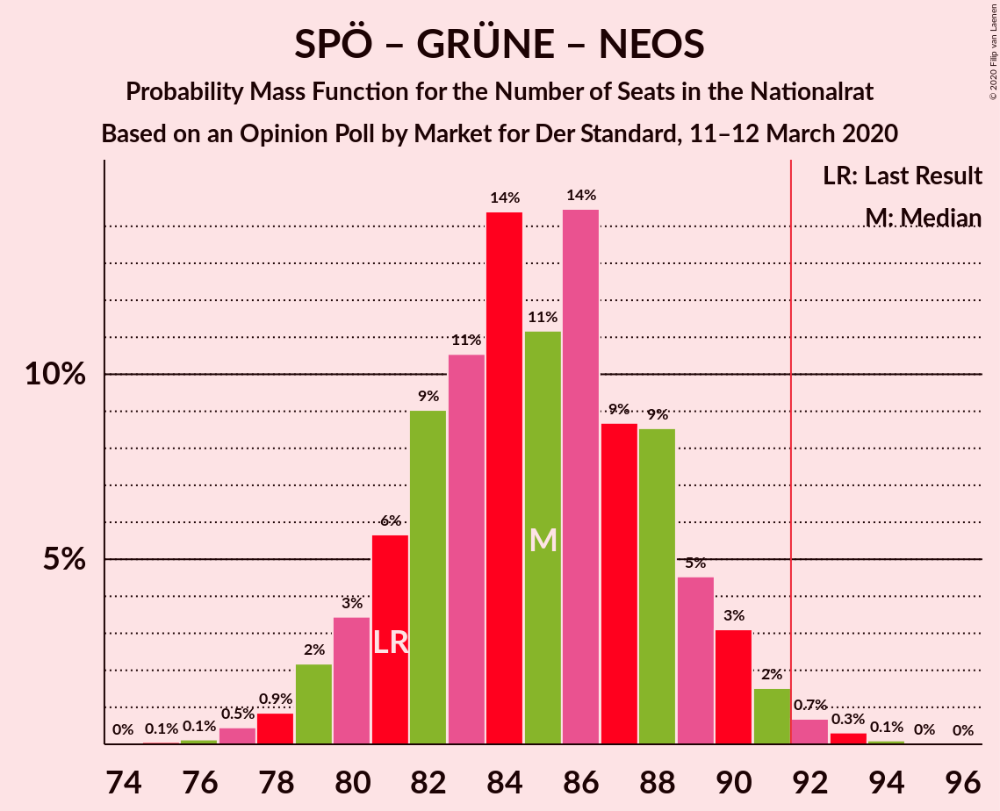
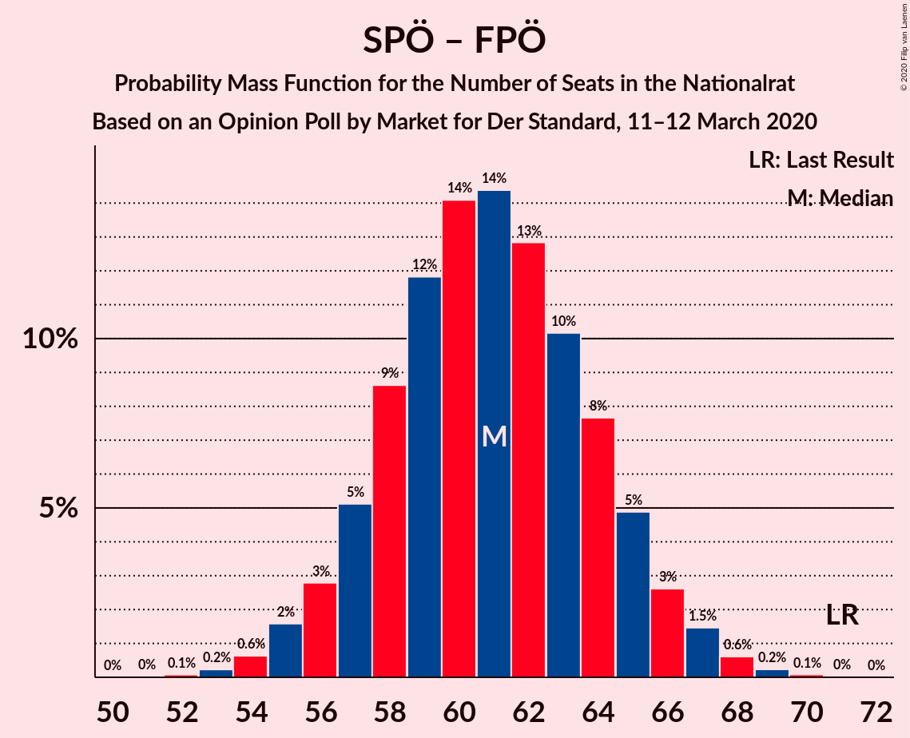

# Opinion Poll by Market for Der Standard, 11–12 March 2020

<a href="#voting-intentions">Voting Intentions</a> | <a href="#seats">Seats</a> | <a href="#coalitions">Coalitions</a> | <a href="#technical-information">Technical Information</a>

## Voting Intentions

### Confidence Intervals

| Party | Last Result | Poll Result | 80% Confidence Interval | 90% Confidence Interval | 95% Confidence Interval | 99% Confidence Interval |
|:-----:|:-----------:|:-----------:|:-----------------------:|:-----------------------:|:-----------------------:|:-----------------------:|
| Österreichische Volkspartei | 37.5% | 40.0% | 38.0–42.0% |37.5–42.6% |37.0–43.1% |36.1–44.0% |
| Sozialdemokratische Partei Österreichs | 21.2% | 20.0% | 18.4–21.7% |18.0–22.2% |17.6–22.6% |16.9–23.4% |
| Die Grünen–Die Grüne Alternative | 13.9% | 17.0% | 15.5–18.6% |15.1–19.1% |14.8–19.5% |14.1–20.3% |
| Freiheitliche Partei Österreichs | 16.2% | 13.0% | 11.7–14.5% |11.4–14.9% |11.1–15.2% |10.5–16.0% |
| NEOS–Das Neue Österreich und Liberales Forum | 8.1% | 9.0% | 7.9–10.3% |7.6–10.6% |7.4–10.9% |6.9–11.6% |

*Note:* The poll result column reflects the actual value used in the calculations. Published results may vary slightly, and in addition be rounded to fewer digits.

## Seats

### Confidence Intervals

| Party | Last Result | Median | 80% Confidence Interval | 90% Confidence Interval | 95% Confidence Interval | 99% Confidence Interval |
|:-----:|:-----------:|:------:|:-----------------------:|:-----------------------:|:-----------------------:|:-----------------------:|
| <a href="#österreichische-volkspartei">Österreichische Volkspartei</a> | 71 | 74 | 71–78 |69–79 |69–80 |67–82 |
| <a href="#sozialdemokratische-partei-österreichs">Sozialdemokratische Partei Österreichs</a> | 40 | 37 | 34–40 |33–41 |32–42 |31–43 |
| <a href="#die-grünen–die-grüne-alternative">Die Grünen–Die Grüne Alternative</a> | 26 | 31 | 29–34 |28–35 |27–36 |26–37 |
| <a href="#freiheitliche-partei-österreichs">Freiheitliche Partei Österreichs</a> | 31 | 24 | 21–26 |21–27 |20–28 |19–29 |
| <a href="#neos–das-neue-österreich-und-liberales-forum">NEOS–Das Neue Österreich und Liberales Forum</a> | 15 | 16 | 14–19 |14–19 |13–20 |12–21 |

### Österreichische Volkspartei

*For a full overview of the results for this party, see the [Österreichische Volkspartei](party-österreichischevolkspartei.html) page.*

| Number of Seats | Probability | Accumulated | Special Marks |
|:---------------:|:-----------:|:-----------:|:-------------:|
| 65 | 0.1% | 100% |  |
| 66 | 0.2% | 99.9% |  |
| 67 | 0.6% | 99.7% |  |
| 68 | 1.4% | 99.1% |  |
| 69 | 3% | 98% |  |
| 70 | 5% | 95% |  |
| 71 | 8% | 90% | Last Result |
| 72 | 10% | 83% |  |
| 73 | 12% | 72% |  |
| 74 | 14% | 60% | Median |
| 75 | 13% | 46% |  |
| 76 | 11% | 33% |  |
| 77 | 9% | 22% |  |
| 78 | 6% | 13% |  |
| 79 | 4% | 7% |  |
| 80 | 2% | 3% |  |
| 81 | 1.0% | 2% |  |
| 82 | 0.4% | 0.6% |  |
| 83 | 0.1% | 0.2% |  |
| 84 | 0.1% | 0.1% |  |
| 85 | 0% | 0% |  |

### Sozialdemokratische Partei Österreichs

*For a full overview of the results for this party, see the [Sozialdemokratische Partei Österreichs](party-sozialdemokratischeparteiösterreichs.html) page.*

| Number of Seats | Probability | Accumulated | Special Marks |
|:---------------:|:-----------:|:-----------:|:-------------:|
| 30 | 0.2% | 100% |  |
| 31 | 0.6% | 99.8% |  |
| 32 | 2% | 99.2% |  |
| 33 | 4% | 97% |  |
| 34 | 8% | 93% |  |
| 35 | 12% | 85% |  |
| 36 | 15% | 73% |  |
| 37 | 17% | 58% | Median |
| 38 | 16% | 41% |  |
| 39 | 10% | 25% |  |
| 40 | 7% | 15% | Last Result |
| 41 | 4% | 7% |  |
| 42 | 2% | 3% |  |
| 43 | 0.7% | 1.1% |  |
| 44 | 0.3% | 0.4% |  |
| 45 | 0.1% | 0.1% |  |
| 46 | 0% | 0% |  |

### Die Grünen–Die Grüne Alternative

*For a full overview of the results for this party, see the [Die Grünen–Die Grüne Alternative](party-diegrünen–diegrünealternative.html) page.*

| Number of Seats | Probability | Accumulated | Special Marks |
|:---------------:|:-----------:|:-----------:|:-------------:|
| 25 | 0.3% | 100% |  |
| 26 | 0.7% | 99.7% | Last Result |
| 27 | 3% | 99.0% |  |
| 28 | 5% | 96% |  |
| 29 | 13% | 91% |  |
| 30 | 12% | 78% |  |
| 31 | 21% | 66% | Median |
| 32 | 13% | 45% |  |
| 33 | 16% | 32% |  |
| 34 | 7% | 16% |  |
| 35 | 6% | 9% |  |
| 36 | 2% | 3% |  |
| 37 | 1.1% | 1.4% |  |
| 38 | 0.2% | 0.4% |  |
| 39 | 0.1% | 0.1% |  |
| 40 | 0% | 0% |  |

### Freiheitliche Partei Österreichs

*For a full overview of the results for this party, see the [Freiheitliche Partei Österreichs](party-freiheitlicheparteiösterreichs.html) page.*

| Number of Seats | Probability | Accumulated | Special Marks |
|:---------------:|:-----------:|:-----------:|:-------------:|
| 18 | 0.2% | 100% |  |
| 19 | 0.8% | 99.8% |  |
| 20 | 3% | 99.0% |  |
| 21 | 7% | 96% |  |
| 22 | 13% | 89% |  |
| 23 | 19% | 76% |  |
| 24 | 20% | 58% | Median |
| 25 | 17% | 38% |  |
| 26 | 11% | 21% |  |
| 27 | 6% | 10% |  |
| 28 | 3% | 4% |  |
| 29 | 1.0% | 1.4% |  |
| 30 | 0.3% | 0.4% |  |
| 31 | 0.1% | 0.1% | Last Result |
| 32 | 0% | 0% |  |

### NEOS–Das Neue Österreich und Liberales Forum

*For a full overview of the results for this party, see the [NEOS–Das Neue Österreich und Liberales Forum](party-neos–dasneueösterreichundliberalesforum.html) page.*

| Number of Seats | Probability | Accumulated | Special Marks |
|:---------------:|:-----------:|:-----------:|:-------------:|
| 11 | 0.1% | 100% |  |
| 12 | 0.5% | 99.9% |  |
| 13 | 3% | 99.4% |  |
| 14 | 8% | 96% |  |
| 15 | 17% | 88% | Last Result |
| 16 | 23% | 71% | Median |
| 17 | 20% | 48% |  |
| 18 | 16% | 27% |  |
| 19 | 7% | 11% |  |
| 20 | 3% | 5% |  |
| 21 | 0.8% | 1.1% |  |
| 22 | 0.3% | 0.3% |  |
| 23 | 0% | 0% |  |

## Coalitions

### Confidence Intervals

| Coalition | Last Result | Median | Majority? | 80% Confidence Interval | 90% Confidence Interval | 95% Confidence Interval | 99% Confidence Interval |
|:---------:|:-----------:|:------:|:---------:|:-----------------------:|:-----------------------:|:-----------------------:|:-----------------------:|
| Österreichische Volkspartei – Die Grünen–Die Grüne Alternative – NEOS–Das Neue Österreich und Liberales Forum | 112 | 122 | 100% | 119–126 | 117–127 | 117–128 | 115–129 |
| Österreichische Volkspartei – Sozialdemokratische Partei Österreichs | 111 | 111 | 100% | 108–115 | 106–116 | 106–117 | 104–119 |
| Österreichische Volkspartei – Die Grünen–Die Grüne Alternative | 97 | 106 | 100% | 102–109 | 101–110 | 100–111 | 98–113 |
| Österreichische Volkspartei – Freiheitliche Partei Österreichs | 102 | 98 | 98.8% | 94–102 | 93–103 | 92–104 | 91–106 |
| Österreichische Volkspartei – NEOS–Das Neue Österreich und Liberales Forum | 86 | 91 | 41% | 87–95 | 86–96 | 85–97 | 83–98 |
| Sozialdemokratische Partei Österreichs – Die Grünen–Die Grüne Alternative – NEOS–Das Neue Österreich und Liberales Forum | 81 | 85 | 1.2% | 81–89 | 80–90 | 79–91 | 77–92 |
| Österreichische Volkspartei | 71 | 74 | 0% | 71–78 | 69–79 | 69–80 | 67–82 |
| Sozialdemokratische Partei Österreichs – Die Grünen–Die Grüne Alternative | 66 | 68 | 0% | 65–72 | 64–73 | 63–74 | 61–76 |
| Sozialdemokratische Partei Österreichs – Freiheitliche Partei Österreichs | 71 | 61 | 0% | 57–64 | 56–66 | 55–66 | 54–68 |
| Sozialdemokratische Partei Österreichs | 40 | 37 | 0% | 34–40 | 33–41 | 32–42 | 31–43 |

### Österreichische Volkspartei – Die Grünen–Die Grüne Alternative – NEOS–Das Neue Österreich und Liberales Forum

| Number of Seats | Probability | Accumulated | Special Marks |
|:---------------:|:-----------:|:-----------:|:-------------:|
| 112 | 0% | 100% | Last Result |
| 113 | 0.1% | 100% |  |
| 114 | 0.2% | 99.9% |  |
| 115 | 0.6% | 99.6% |  |
| 116 | 1.5% | 99.0% |  |
| 117 | 3% | 98% |  |
| 118 | 5% | 95% |  |
| 119 | 8% | 90% |  |
| 120 | 10% | 82% |  |
| 121 | 13% | 72% | Median |
| 122 | 14% | 59% |  |
| 123 | 14% | 45% |  |
| 124 | 12% | 31% |  |
| 125 | 9% | 19% |  |
| 126 | 5% | 10% |  |
| 127 | 3% | 5% |  |
| 128 | 2% | 3% |  |
| 129 | 0.6% | 1.0% |  |
| 130 | 0.2% | 0.3% |  |
| 131 | 0.1% | 0.1% |  |
| 132 | 0% | 0% |  |

### Österreichische Volkspartei – Sozialdemokratische Partei Österreichs

| Number of Seats | Probability | Accumulated | Special Marks |
|:---------------:|:-----------:|:-----------:|:-------------:|
| 102 | 0.1% | 100% |  |
| 103 | 0.2% | 99.9% |  |
| 104 | 0.6% | 99.6% |  |
| 105 | 1.4% | 99.0% |  |
| 106 | 3% | 98% |  |
| 107 | 5% | 95% |  |
| 108 | 7% | 90% |  |
| 109 | 10% | 83% |  |
| 110 | 13% | 73% |  |
| 111 | 14% | 60% | Last Result, Median |
| 112 | 13% | 46% |  |
| 113 | 11% | 33% |  |
| 114 | 8% | 22% |  |
| 115 | 7% | 13% |  |
| 116 | 3% | 7% |  |
| 117 | 2% | 3% |  |
| 118 | 0.8% | 1.4% |  |
| 119 | 0.4% | 0.6% |  |
| 120 | 0.1% | 0.2% |  |
| 121 | 0% | 0.1% |  |
| 122 | 0% | 0% |  |

### Österreichische Volkspartei – Die Grünen–Die Grüne Alternative

| Number of Seats | Probability | Accumulated | Special Marks |
|:---------------:|:-----------:|:-----------:|:-------------:|
| 96 | 0.1% | 100% |  |
| 97 | 0.2% | 99.9% | Last Result |
| 98 | 0.5% | 99.7% |  |
| 99 | 1.1% | 99.2% |  |
| 100 | 2% | 98% |  |
| 101 | 4% | 96% |  |
| 102 | 7% | 92% |  |
| 103 | 9% | 86% |  |
| 104 | 11% | 76% |  |
| 105 | 13% | 66% | Median |
| 106 | 14% | 52% |  |
| 107 | 13% | 38% |  |
| 108 | 9% | 26% |  |
| 109 | 7% | 16% |  |
| 110 | 5% | 9% |  |
| 111 | 3% | 5% |  |
| 112 | 1.0% | 2% |  |
| 113 | 0.6% | 0.9% |  |
| 114 | 0.2% | 0.3% |  |
| 115 | 0.1% | 0.1% |  |
| 116 | 0% | 0% |  |

### Österreichische Volkspartei – Freiheitliche Partei Österreichs

| Number of Seats | Probability | Accumulated | Special Marks |
|:---------------:|:-----------:|:-----------:|:-------------:|
| 88 | 0% | 100% |  |
| 89 | 0.1% | 99.9% |  |
| 90 | 0.3% | 99.8% |  |
| 91 | 0.7% | 99.5% |  |
| 92 | 2% | 98.8% | Majority |
| 93 | 3% | 97% |  |
| 94 | 5% | 94% |  |
| 95 | 9% | 90% |  |
| 96 | 9% | 81% |  |
| 97 | 14% | 72% |  |
| 98 | 11% | 58% | Median |
| 99 | 14% | 47% |  |
| 100 | 11% | 32% |  |
| 101 | 9% | 22% |  |
| 102 | 6% | 13% | Last Result |
| 103 | 3% | 7% |  |
| 104 | 2% | 4% |  |
| 105 | 0.9% | 2% |  |
| 106 | 0.5% | 0.7% |  |
| 107 | 0.1% | 0.2% |  |
| 108 | 0.1% | 0.1% |  |
| 109 | 0% | 0% |  |

### Österreichische Volkspartei – NEOS–Das Neue Österreich und Liberales Forum

| Number of Seats | Probability | Accumulated | Special Marks |
|:---------------:|:-----------:|:-----------:|:-------------:|
| 81 | 0.1% | 100% |  |
| 82 | 0.2% | 99.9% |  |
| 83 | 0.4% | 99.7% |  |
| 84 | 1.1% | 99.3% |  |
| 85 | 2% | 98% |  |
| 86 | 4% | 96% | Last Result |
| 87 | 6% | 92% |  |
| 88 | 10% | 87% |  |
| 89 | 10% | 77% |  |
| 90 | 14% | 67% | Median |
| 91 | 12% | 53% |  |
| 92 | 13% | 41% | Majority |
| 93 | 10% | 27% |  |
| 94 | 7% | 17% |  |
| 95 | 5% | 10% |  |
| 96 | 3% | 5% |  |
| 97 | 2% | 3% |  |
| 98 | 0.6% | 1.1% |  |
| 99 | 0.3% | 0.4% |  |
| 100 | 0.1% | 0.1% |  |
| 101 | 0% | 0% |  |

### Sozialdemokratische Partei Österreichs – Die Grünen–Die Grüne Alternative – NEOS–Das Neue Österreich und Liberales Forum

| Number of Seats | Probability | Accumulated | Special Marks |
|:---------------:|:-----------:|:-----------:|:-------------:|
| 75 | 0.1% | 100% |  |
| 76 | 0.1% | 99.9% |  |
| 77 | 0.5% | 99.8% |  |
| 78 | 0.9% | 99.3% |  |
| 79 | 2% | 98% |  |
| 80 | 3% | 96% |  |
| 81 | 6% | 93% | Last Result |
| 82 | 9% | 87% |  |
| 83 | 11% | 78% |  |
| 84 | 14% | 68% | Median |
| 85 | 11% | 53% |  |
| 86 | 14% | 42% |  |
| 87 | 9% | 28% |  |
| 88 | 9% | 19% |  |
| 89 | 5% | 10% |  |
| 90 | 3% | 6% |  |
| 91 | 2% | 3% |  |
| 92 | 0.7% | 1.2% | Majority |
| 93 | 0.3% | 0.5% |  |
| 94 | 0.1% | 0.2% |  |
| 95 | 0% | 0.1% |  |
| 96 | 0% | 0% |  |

### Österreichische Volkspartei

| Number of Seats | Probability | Accumulated | Special Marks |
|:---------------:|:-----------:|:-----------:|:-------------:|
| 65 | 0.1% | 100% |  |
| 66 | 0.2% | 99.9% |  |
| 67 | 0.6% | 99.7% |  |
| 68 | 1.4% | 99.1% |  |
| 69 | 3% | 98% |  |
| 70 | 5% | 95% |  |
| 71 | 8% | 90% | Last Result |
| 72 | 10% | 83% |  |
| 73 | 12% | 72% |  |
| 74 | 14% | 60% | Median |
| 75 | 13% | 46% |  |
| 76 | 11% | 33% |  |
| 77 | 9% | 22% |  |
| 78 | 6% | 13% |  |
| 79 | 4% | 7% |  |
| 80 | 2% | 3% |  |
| 81 | 1.0% | 2% |  |
| 82 | 0.4% | 0.6% |  |
| 83 | 0.1% | 0.2% |  |
| 84 | 0.1% | 0.1% |  |
| 85 | 0% | 0% |  |

### Sozialdemokratische Partei Österreichs – Die Grünen–Die Grüne Alternative

| Number of Seats | Probability | Accumulated | Special Marks |
|:---------------:|:-----------:|:-----------:|:-------------:|
| 59 | 0.1% | 100% |  |
| 60 | 0.2% | 99.9% |  |
| 61 | 0.5% | 99.7% |  |
| 62 | 1.2% | 99.2% |  |
| 63 | 2% | 98% |  |
| 64 | 4% | 96% |  |
| 65 | 7% | 91% |  |
| 66 | 11% | 84% | Last Result |
| 67 | 11% | 73% |  |
| 68 | 14% | 62% | Median |
| 69 | 14% | 48% |  |
| 70 | 12% | 34% |  |
| 71 | 9% | 22% |  |
| 72 | 6% | 13% |  |
| 73 | 4% | 8% |  |
| 74 | 2% | 4% |  |
| 75 | 0.9% | 2% |  |
| 76 | 0.4% | 0.7% |  |
| 77 | 0.2% | 0.3% |  |
| 78 | 0.1% | 0.1% |  |
| 79 | 0% | 0% |  |

### Sozialdemokratische Partei Österreichs – Freiheitliche Partei Österreichs

| Number of Seats | Probability | Accumulated | Special Marks |
|:---------------:|:-----------:|:-----------:|:-------------:|
| 52 | 0.1% | 100% |  |
| 53 | 0.2% | 99.9% |  |
| 54 | 0.6% | 99.7% |  |
| 55 | 2% | 99.0% |  |
| 56 | 3% | 97% |  |
| 57 | 5% | 95% |  |
| 58 | 9% | 90% |  |
| 59 | 12% | 81% |  |
| 60 | 14% | 69% |  |
| 61 | 14% | 55% | Median |
| 62 | 13% | 41% |  |
| 63 | 10% | 28% |  |
| 64 | 8% | 18% |  |
| 65 | 5% | 10% |  |
| 66 | 3% | 5% |  |
| 67 | 1.5% | 2% |  |
| 68 | 0.6% | 1.0% |  |
| 69 | 0.2% | 0.4% |  |
| 70 | 0.1% | 0.1% |  |
| 71 | 0% | 0% | Last Result |

### Sozialdemokratische Partei Österreichs

| Number of Seats | Probability | Accumulated | Special Marks |
|:---------------:|:-----------:|:-----------:|:-------------:|
| 30 | 0.2% | 100% |  |
| 31 | 0.6% | 99.8% |  |
| 32 | 2% | 99.2% |  |
| 33 | 4% | 97% |  |
| 34 | 8% | 93% |  |
| 35 | 12% | 85% |  |
| 36 | 15% | 73% |  |
| 37 | 17% | 58% | Median |
| 38 | 16% | 41% |  |
| 39 | 10% | 25% |  |
| 40 | 7% | 15% | Last Result |
| 41 | 4% | 7% |  |
| 42 | 2% | 3% |  |
| 43 | 0.7% | 1.1% |  |
| 44 | 0.3% | 0.4% |  |
| 45 | 0.1% | 0.1% |  |
| 46 | 0% | 0% |  |

## Technical Information

### Opinion Poll

+ **Polling firm:** Market
+ **Commissioner(s):** Der Standard
+ **Fieldwork period:** 11–12 March 2020

### Calculations

+ **Sample size:** 1000
+ **Simulations done:** 1,048,576
+ **Error estimate:** 0.59%

