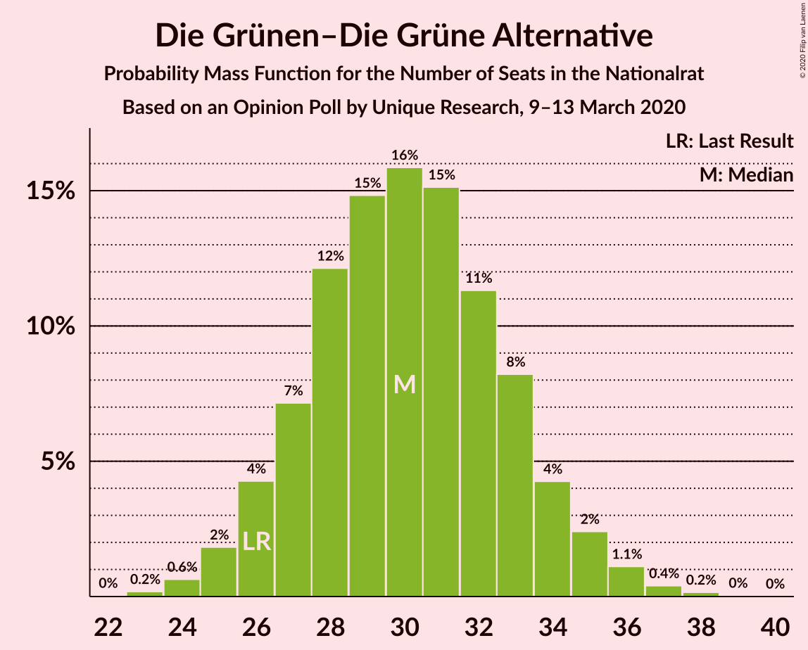
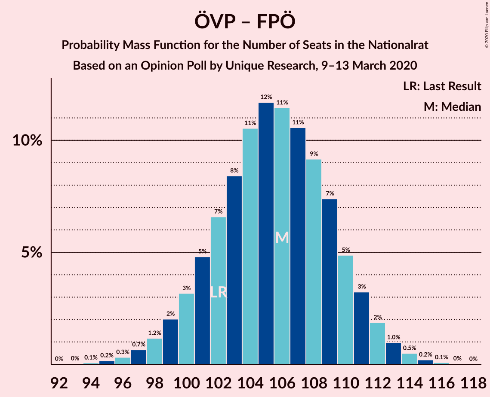
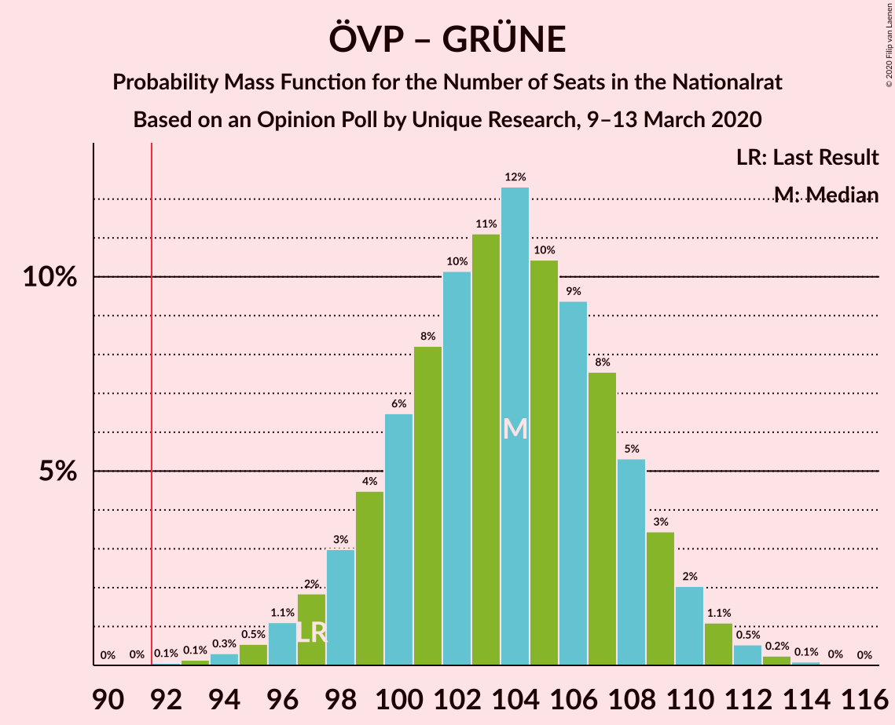
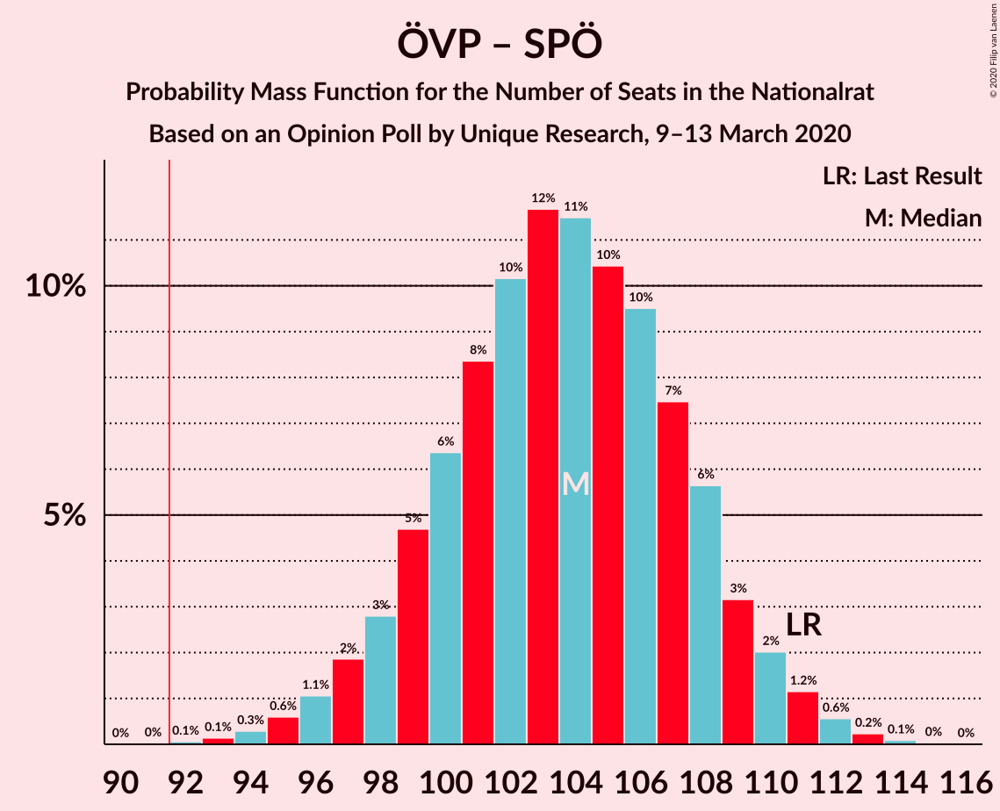
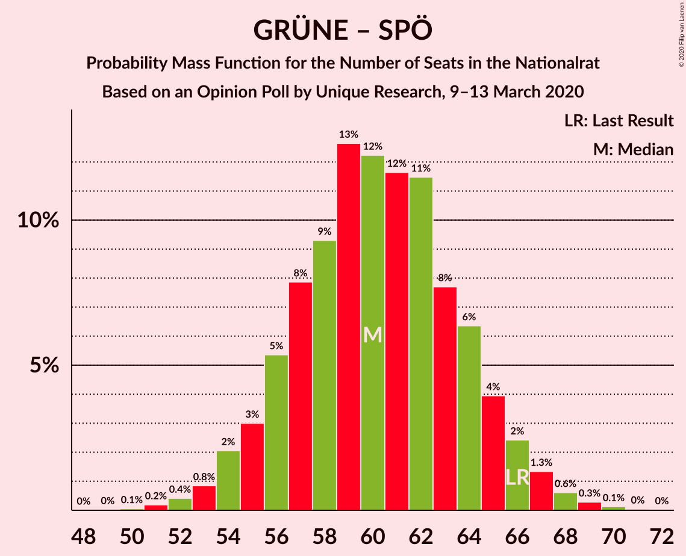

# Opinion Poll by Unique Research, 9–13 March 2020

<a href="#voting-intentions">Voting Intentions</a> | <a href="#seats">Seats</a> | <a href="#coalitions">Coalitions</a> | <a href="#technical-information">Technical Information</a>

## Voting Intentions

### Confidence Intervals

| Party | Last Result | Poll Result | 80% Confidence Interval | 90% Confidence Interval | 95% Confidence Interval | 99% Confidence Interval |
|:-----:|:-----------:|:-----------:|:-----------------------:|:-----------------------:|:-----------------------:|:-----------------------:|
| Österreichische Volkspartei | 37.5% | 39.0% | 36.8–41.2% |36.2–41.8% |35.7–42.4% |34.6–43.5% |
| Freiheitliche Partei Österreichs | 16.2% | 17.0% | 15.4–18.8% |15.0–19.3% |14.6–19.8% |13.8–20.7% |
| Sozialdemokratische Partei Österreichs | 21.2% | 16.0% | 14.5–17.8% |14.0–18.3% |13.7–18.7% |12.9–19.6% |
| Die Grünen–Die Grüne Alternative | 13.9% | 16.0% | 14.5–17.8% |14.0–18.3% |13.7–18.7% |12.9–19.6% |
| NEOS–Das Neue Österreich und Liberales Forum | 8.1% | 9.0% | 7.8–10.4% |7.5–10.8% |7.2–11.2% |6.7–11.9% |

*Note:* The poll result column reflects the actual value used in the calculations. Published results may vary slightly, and in addition be rounded to fewer digits.

## Seats

### Confidence Intervals

| Party | Last Result | Median | 80% Confidence Interval | 90% Confidence Interval | 95% Confidence Interval | 99% Confidence Interval |
|:-----:|:-----------:|:------:|:-----------------------:|:-----------------------:|:-----------------------:|:-----------------------:|
| <a href="#österreichische-volkspartei">Österreichische Volkspartei</a> | 71 | 73 | 69–78 |68–79 |67–80 |65–82 |
| <a href="#freiheitliche-partei-österreichs">Freiheitliche Partei Österreichs</a> | 31 | 32 | 29–35 |28–36 |27–37 |26–39 |
| <a href="#sozialdemokratische-partei-österreichs">Sozialdemokratische Partei Österreichs</a> | 40 | 30 | 27–33 |26–34 |25–35 |24–37 |
| <a href="#die-grünen–die-grüne-alternative">Die Grünen–Die Grüne Alternative</a> | 26 | 30 | 27–33 |26–34 |25–35 |24–37 |
| <a href="#neos–das-neue-österreich-und-liberales-forum">NEOS–Das Neue Österreich und Liberales Forum</a> | 15 | 17 | 14–19 |14–20 |13–21 |12–22 |

### Österreichische Volkspartei

*For a full overview of the results for this party, see the [Österreichische Volkspartei](party-österreichischevolkspartei.html) page.*

| Number of Seats | Probability | Accumulated | Special Marks |
|:---------------:|:-----------:|:-----------:|:-------------:|
| 63 | 0.1% | 100% |  |
| 64 | 0.2% | 99.9% |  |
| 65 | 0.4% | 99.7% |  |
| 66 | 0.9% | 99.3% |  |
| 67 | 2% | 98% |  |
| 68 | 3% | 97% |  |
| 69 | 5% | 94% |  |
| 70 | 7% | 89% |  |
| 71 | 9% | 82% | Last Result |
| 72 | 10% | 73% |  |
| 73 | 13% | 62% | Median |
| 74 | 11% | 50% |  |
| 75 | 12% | 39% |  |
| 76 | 8% | 27% |  |
| 77 | 8% | 19% |  |
| 78 | 5% | 11% |  |
| 79 | 3% | 6% |  |
| 80 | 2% | 4% |  |
| 81 | 1.1% | 2% |  |
| 82 | 0.4% | 0.8% |  |
| 83 | 0.2% | 0.3% |  |
| 84 | 0.1% | 0.1% |  |
| 85 | 0% | 0% |  |

### Freiheitliche Partei Österreichs

*For a full overview of the results for this party, see the [Freiheitliche Partei Österreichs](party-freiheitlicheparteiösterreichs.html) page.*

| Number of Seats | Probability | Accumulated | Special Marks |
|:---------------:|:-----------:|:-----------:|:-------------:|
| 24 | 0.1% | 100% |  |
| 25 | 0.3% | 99.9% |  |
| 26 | 0.9% | 99.6% |  |
| 27 | 2% | 98.8% |  |
| 28 | 5% | 96% |  |
| 29 | 8% | 92% |  |
| 30 | 12% | 84% |  |
| 31 | 17% | 72% | Last Result |
| 32 | 16% | 55% | Median |
| 33 | 11% | 39% |  |
| 34 | 11% | 27% |  |
| 35 | 8% | 16% |  |
| 36 | 5% | 8% |  |
| 37 | 2% | 3% |  |
| 38 | 1.0% | 2% |  |
| 39 | 0.5% | 0.7% |  |
| 40 | 0.2% | 0.2% |  |
| 41 | 0% | 0.1% |  |
| 42 | 0% | 0% |  |

### Sozialdemokratische Partei Österreichs

*For a full overview of the results for this party, see the [Sozialdemokratische Partei Österreichs](party-sozialdemokratischeparteiösterreichs.html) page.*

| Number of Seats | Probability | Accumulated | Special Marks |
|:---------------:|:-----------:|:-----------:|:-------------:|
| 23 | 0.2% | 100% |  |
| 24 | 0.7% | 99.8% |  |
| 25 | 2% | 99.0% |  |
| 26 | 4% | 97% |  |
| 27 | 7% | 93% |  |
| 28 | 12% | 86% |  |
| 29 | 15% | 74% |  |
| 30 | 15% | 58% | Median |
| 31 | 15% | 43% |  |
| 32 | 12% | 29% |  |
| 33 | 8% | 17% |  |
| 34 | 5% | 9% |  |
| 35 | 2% | 4% |  |
| 36 | 1.0% | 2% |  |
| 37 | 0.5% | 0.7% |  |
| 38 | 0.1% | 0.2% |  |
| 39 | 0.1% | 0.1% |  |
| 40 | 0% | 0% | Last Result |

### Die Grünen–Die Grüne Alternative

*For a full overview of the results for this party, see the [Die Grünen–Die Grüne Alternative](party-diegrünen–diegrünealternative.html) page.*

| Number of Seats | Probability | Accumulated | Special Marks |
|:---------------:|:-----------:|:-----------:|:-------------:|
| 22 | 0% | 100% |  |
| 23 | 0.2% | 99.9% |  |
| 24 | 0.6% | 99.8% |  |
| 25 | 2% | 99.2% |  |
| 26 | 5% | 97% | Last Result |
| 27 | 7% | 93% |  |
| 28 | 11% | 86% |  |
| 29 | 16% | 75% |  |
| 30 | 17% | 58% | Median |
| 31 | 13% | 41% |  |
| 32 | 12% | 28% |  |
| 33 | 8% | 16% |  |
| 34 | 4% | 8% |  |
| 35 | 2% | 4% |  |
| 36 | 1.1% | 2% |  |
| 37 | 0.4% | 0.6% |  |
| 38 | 0.1% | 0.2% |  |
| 39 | 0% | 0.1% |  |
| 40 | 0% | 0% |  |

### NEOS–Das Neue Österreich und Liberales Forum

*For a full overview of the results for this party, see the [NEOS–Das Neue Österreich und Liberales Forum](party-neos–dasneueösterreichundliberalesforum.html) page.*

| Number of Seats | Probability | Accumulated | Special Marks |
|:---------------:|:-----------:|:-----------:|:-------------:|
| 11 | 0.1% | 100% |  |
| 12 | 0.8% | 99.9% |  |
| 13 | 3% | 99.1% |  |
| 14 | 7% | 96% |  |
| 15 | 13% | 89% | Last Result |
| 16 | 20% | 76% |  |
| 17 | 20% | 55% | Median |
| 18 | 17% | 35% |  |
| 19 | 10% | 19% |  |
| 20 | 5% | 8% |  |
| 21 | 2% | 3% |  |
| 22 | 0.7% | 1.0% |  |
| 23 | 0.2% | 0.3% |  |
| 24 | 0.1% | 0.1% |  |
| 25 | 0% | 0% |  |

## Coalitions

### Confidence Intervals

| Coalition | Last Result | Median | Majority? | 80% Confidence Interval | 90% Confidence Interval | 95% Confidence Interval | 99% Confidence Interval |
|:---------:|:-----------:|:------:|:---------:|:-----------------------:|:-----------------------:|:-----------------------:|:-----------------------:|
| Österreichische Volkspartei – Die Grünen–Die Grüne Alternative – NEOS–Das Neue Österreich und Liberales Forum | 112 | 121 | 100% | 116–125 | 115–126 | 113–127 | 111–129 |
| Österreichische Volkspartei – Freiheitliche Partei Österreichs | 102 | 106 | 100% | 101–110 | 100–111 | 98–112 | 96–114 |
| Österreichische Volkspartei – Die Grünen–Die Grüne Alternative | 97 | 104 | 99.9% | 99–108 | 98–109 | 97–110 | 94–112 |
| Österreichische Volkspartei – Sozialdemokratische Partei Österreichs | 111 | 103 | 100% | 99–108 | 98–109 | 97–110 | 94–112 |
| Österreichische Volkspartei – NEOS–Das Neue Österreich und Liberales Forum | 86 | 91 | 37% | 86–95 | 85–96 | 84–97 | 81–99 |
| Die Grünen–Die Grüne Alternative – Sozialdemokratische Partei Österreichs – NEOS–Das Neue Österreich und Liberales Forum | 81 | 77 | 0% | 73–81 | 72–83 | 70–83 | 68–86 |
| Österreichische Volkspartei | 71 | 73 | 0% | 69–78 | 68–79 | 67–80 | 65–82 |
| Freiheitliche Partei Österreichs – Sozialdemokratische Partei Österreichs | 71 | 62 | 0% | 58–66 | 57–67 | 56–68 | 54–70 |
| Die Grünen–Die Grüne Alternative – Sozialdemokratische Partei Österreichs | 66 | 60 | 0% | 56–64 | 55–65 | 54–66 | 52–69 |
| Sozialdemokratische Partei Österreichs | 40 | 30 | 0% | 27–33 | 26–34 | 25–35 | 24–37 |

### Österreichische Volkspartei – Die Grünen–Die Grüne Alternative – NEOS–Das Neue Österreich und Liberales Forum

| Number of Seats | Probability | Accumulated | Special Marks |
|:---------------:|:-----------:|:-----------:|:-------------:|
| 108 | 0% | 100% |  |
| 109 | 0.1% | 99.9% |  |
| 110 | 0.2% | 99.9% |  |
| 111 | 0.5% | 99.7% |  |
| 112 | 0.5% | 99.2% | Last Result |
| 113 | 1.3% | 98.7% |  |
| 114 | 2% | 97% |  |
| 115 | 2% | 95% |  |
| 116 | 5% | 93% |  |
| 117 | 7% | 88% |  |
| 118 | 8% | 81% |  |
| 119 | 12% | 73% |  |
| 120 | 10% | 61% | Median |
| 121 | 12% | 51% |  |
| 122 | 11% | 39% |  |
| 123 | 9% | 27% |  |
| 124 | 8% | 18% |  |
| 125 | 4% | 10% |  |
| 126 | 3% | 6% |  |
| 127 | 1.3% | 3% |  |
| 128 | 0.9% | 1.4% |  |
| 129 | 0.4% | 0.6% |  |
| 130 | 0.1% | 0.2% |  |
| 131 | 0% | 0.1% |  |
| 132 | 0% | 0% |  |

### Österreichische Volkspartei – Freiheitliche Partei Österreichs

| Number of Seats | Probability | Accumulated | Special Marks |
|:---------------:|:-----------:|:-----------:|:-------------:|
| 94 | 0.1% | 100% |  |
| 95 | 0.1% | 99.9% |  |
| 96 | 0.4% | 99.7% |  |
| 97 | 0.6% | 99.4% |  |
| 98 | 1.4% | 98.8% |  |
| 99 | 2% | 97% |  |
| 100 | 4% | 96% |  |
| 101 | 4% | 92% |  |
| 102 | 8% | 88% | Last Result |
| 103 | 8% | 80% |  |
| 104 | 12% | 73% |  |
| 105 | 10% | 61% | Median |
| 106 | 13% | 51% |  |
| 107 | 10% | 38% |  |
| 108 | 8% | 28% |  |
| 109 | 8% | 20% |  |
| 110 | 5% | 11% |  |
| 111 | 3% | 7% |  |
| 112 | 2% | 3% |  |
| 113 | 1.0% | 2% |  |
| 114 | 0.4% | 0.8% |  |
| 115 | 0.3% | 0.4% |  |
| 116 | 0.1% | 0.1% |  |
| 117 | 0% | 0% |  |

### Österreichische Volkspartei – Die Grünen–Die Grüne Alternative

| Number of Seats | Probability | Accumulated | Special Marks |
|:---------------:|:-----------:|:-----------:|:-------------:|
| 91 | 0% | 100% |  |
| 92 | 0.1% | 99.9% | Majority |
| 93 | 0.2% | 99.9% |  |
| 94 | 0.3% | 99.7% |  |
| 95 | 0.5% | 99.5% |  |
| 96 | 1.2% | 99.0% |  |
| 97 | 2% | 98% | Last Result |
| 98 | 3% | 96% |  |
| 99 | 4% | 93% |  |
| 100 | 7% | 89% |  |
| 101 | 8% | 82% |  |
| 102 | 10% | 73% |  |
| 103 | 11% | 64% | Median |
| 104 | 14% | 53% |  |
| 105 | 10% | 39% |  |
| 106 | 8% | 29% |  |
| 107 | 9% | 21% |  |
| 108 | 5% | 12% |  |
| 109 | 3% | 7% |  |
| 110 | 2% | 4% |  |
| 111 | 1.3% | 2% |  |
| 112 | 0.4% | 0.8% |  |
| 113 | 0.3% | 0.4% |  |
| 114 | 0.1% | 0.1% |  |
| 115 | 0% | 0% |  |

### Österreichische Volkspartei – Sozialdemokratische Partei Österreichs

| Number of Seats | Probability | Accumulated | Special Marks |
|:---------------:|:-----------:|:-----------:|:-------------:|
| 92 | 0.1% | 100% | Majority |
| 93 | 0.1% | 99.9% |  |
| 94 | 0.3% | 99.8% |  |
| 95 | 0.7% | 99.5% |  |
| 96 | 1.1% | 98.8% |  |
| 97 | 2% | 98% |  |
| 98 | 3% | 96% |  |
| 99 | 5% | 93% |  |
| 100 | 5% | 88% |  |
| 101 | 7% | 82% |  |
| 102 | 12% | 76% |  |
| 103 | 14% | 64% | Median |
| 104 | 9% | 50% |  |
| 105 | 9% | 40% |  |
| 106 | 10% | 32% |  |
| 107 | 9% | 21% |  |
| 108 | 6% | 12% |  |
| 109 | 2% | 7% |  |
| 110 | 2% | 4% |  |
| 111 | 1.5% | 2% | Last Result |
| 112 | 0.5% | 0.8% |  |
| 113 | 0.2% | 0.3% |  |
| 114 | 0.1% | 0.1% |  |
| 115 | 0% | 0.1% |  |
| 116 | 0% | 0% |  |

### Österreichische Volkspartei – NEOS–Das Neue Österreich und Liberales Forum

| Number of Seats | Probability | Accumulated | Special Marks |
|:---------------:|:-----------:|:-----------:|:-------------:|
| 79 | 0.1% | 100% |  |
| 80 | 0.1% | 99.9% |  |
| 81 | 0.3% | 99.8% |  |
| 82 | 0.7% | 99.5% |  |
| 83 | 1.2% | 98.7% |  |
| 84 | 2% | 98% |  |
| 85 | 3% | 95% |  |
| 86 | 5% | 92% | Last Result |
| 87 | 8% | 87% |  |
| 88 | 9% | 79% |  |
| 89 | 10% | 70% |  |
| 90 | 9% | 60% | Median |
| 91 | 14% | 51% |  |
| 92 | 11% | 37% | Majority |
| 93 | 8% | 26% |  |
| 94 | 7% | 18% |  |
| 95 | 4% | 11% |  |
| 96 | 3% | 7% |  |
| 97 | 2% | 3% |  |
| 98 | 0.7% | 2% |  |
| 99 | 0.6% | 0.9% |  |
| 100 | 0.2% | 0.3% |  |
| 101 | 0.1% | 0.1% |  |
| 102 | 0% | 0% |  |

### Die Grünen–Die Grüne Alternative – Sozialdemokratische Partei Österreichs – NEOS–Das Neue Österreich und Liberales Forum

| Number of Seats | Probability | Accumulated | Special Marks |
|:---------------:|:-----------:|:-----------:|:-------------:|
| 66 | 0.1% | 100% |  |
| 67 | 0.1% | 99.9% |  |
| 68 | 0.4% | 99.8% |  |
| 69 | 0.6% | 99.3% |  |
| 70 | 1.4% | 98.7% |  |
| 71 | 2% | 97% |  |
| 72 | 4% | 95% |  |
| 73 | 5% | 91% |  |
| 74 | 9% | 86% |  |
| 75 | 9% | 77% |  |
| 76 | 11% | 68% |  |
| 77 | 13% | 57% | Median |
| 78 | 11% | 44% |  |
| 79 | 11% | 33% |  |
| 80 | 7% | 22% |  |
| 81 | 7% | 15% | Last Result |
| 82 | 3% | 8% |  |
| 83 | 3% | 5% |  |
| 84 | 1.2% | 2% |  |
| 85 | 0.7% | 1.2% |  |
| 86 | 0.3% | 0.5% |  |
| 87 | 0.1% | 0.2% |  |
| 88 | 0% | 0.1% |  |
| 89 | 0% | 0% |  |

### Österreichische Volkspartei

| Number of Seats | Probability | Accumulated | Special Marks |
|:---------------:|:-----------:|:-----------:|:-------------:|
| 63 | 0.1% | 100% |  |
| 64 | 0.2% | 99.9% |  |
| 65 | 0.4% | 99.7% |  |
| 66 | 0.9% | 99.3% |  |
| 67 | 2% | 98% |  |
| 68 | 3% | 97% |  |
| 69 | 5% | 94% |  |
| 70 | 7% | 89% |  |
| 71 | 9% | 82% | Last Result |
| 72 | 10% | 73% |  |
| 73 | 13% | 62% | Median |
| 74 | 11% | 50% |  |
| 75 | 12% | 39% |  |
| 76 | 8% | 27% |  |
| 77 | 8% | 19% |  |
| 78 | 5% | 11% |  |
| 79 | 3% | 6% |  |
| 80 | 2% | 4% |  |
| 81 | 1.1% | 2% |  |
| 82 | 0.4% | 0.8% |  |
| 83 | 0.2% | 0.3% |  |
| 84 | 0.1% | 0.1% |  |
| 85 | 0% | 0% |  |

### Freiheitliche Partei Österreichs – Sozialdemokratische Partei Österreichs

| Number of Seats | Probability | Accumulated | Special Marks |
|:---------------:|:-----------:|:-----------:|:-------------:|
| 52 | 0.1% | 100% |  |
| 53 | 0.2% | 99.9% |  |
| 54 | 0.5% | 99.7% |  |
| 55 | 1.1% | 99.1% |  |
| 56 | 2% | 98% |  |
| 57 | 4% | 96% |  |
| 58 | 5% | 92% |  |
| 59 | 9% | 87% |  |
| 60 | 10% | 79% |  |
| 61 | 12% | 68% |  |
| 62 | 12% | 56% | Median |
| 63 | 10% | 44% |  |
| 64 | 12% | 33% |  |
| 65 | 8% | 22% |  |
| 66 | 6% | 14% |  |
| 67 | 4% | 8% |  |
| 68 | 2% | 4% |  |
| 69 | 1.4% | 2% |  |
| 70 | 0.5% | 1.0% |  |
| 71 | 0.3% | 0.4% | Last Result |
| 72 | 0.1% | 0.2% |  |
| 73 | 0% | 0.1% |  |
| 74 | 0% | 0% |  |

### Die Grünen–Die Grüne Alternative – Sozialdemokratische Partei Österreichs

| Number of Seats | Probability | Accumulated | Special Marks |
|:---------------:|:-----------:|:-----------:|:-------------:|
| 50 | 0.1% | 100% |  |
| 51 | 0.2% | 99.9% |  |
| 52 | 0.4% | 99.7% |  |
| 53 | 1.0% | 99.4% |  |
| 54 | 2% | 98% |  |
| 55 | 3% | 96% |  |
| 56 | 5% | 93% |  |
| 57 | 9% | 88% |  |
| 58 | 8% | 79% |  |
| 59 | 13% | 71% |  |
| 60 | 11% | 58% | Median |
| 61 | 13% | 47% |  |
| 62 | 11% | 34% |  |
| 63 | 8% | 23% |  |
| 64 | 7% | 15% |  |
| 65 | 4% | 8% |  |
| 66 | 2% | 5% | Last Result |
| 67 | 1.5% | 2% |  |
| 68 | 0.5% | 1.0% |  |
| 69 | 0.3% | 0.5% |  |
| 70 | 0.1% | 0.2% |  |
| 71 | 0% | 0.1% |  |
| 72 | 0% | 0% |  |

### Sozialdemokratische Partei Österreichs

| Number of Seats | Probability | Accumulated | Special Marks |
|:---------------:|:-----------:|:-----------:|:-------------:|
| 23 | 0.2% | 100% |  |
| 24 | 0.7% | 99.8% |  |
| 25 | 2% | 99.0% |  |
| 26 | 4% | 97% |  |
| 27 | 7% | 93% |  |
| 28 | 12% | 86% |  |
| 29 | 15% | 74% |  |
| 30 | 15% | 58% | Median |
| 31 | 15% | 43% |  |
| 32 | 12% | 29% |  |
| 33 | 8% | 17% |  |
| 34 | 5% | 9% |  |
| 35 | 2% | 4% |  |
| 36 | 1.0% | 2% |  |
| 37 | 0.5% | 0.7% |  |
| 38 | 0.1% | 0.2% |  |
| 39 | 0.1% | 0.1% |  |
| 40 | 0% | 0% | Last Result |

## Technical Information

### Opinion Poll

+ **Polling firm:** Unique Research
+ **Commissioner(s):** —
+ **Fieldwork period:** 9–13 March 2020

### Calculations

+ **Sample size:** 811
+ **Simulations done:** 131,072
+ **Error estimate:** 1.02%

