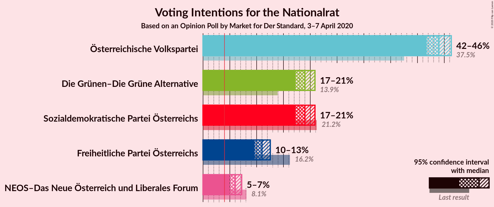

# Opinion Poll by Market for Der Standard, 3–7 April 2020

<a href="#voting-intentions">Voting Intentions</a> | <a href="#seats">Seats</a> | <a href="#coalitions">Coalitions</a> | <a href="#technical-information">Technical Information</a>

## Voting Intentions

### Confidence Intervals

| Party | Last Result | Poll Result | 80% Confidence Interval | 90% Confidence Interval | 95% Confidence Interval | 99% Confidence Interval |
|:-----:|:-----------:|:-----------:|:-----------------------:|:-----------------------:|:-----------------------:|:-----------------------:|
| Österreichische Volkspartei | 37.5% | 44.0% | 42.5–45.5% |42.1–45.9% |41.7–46.3% |41.0–47.0% |
| Sozialdemokratische Partei Österreichs | 21.2% | 19.0% | 17.8–20.2% |17.5–20.6% |17.3–20.9% |16.7–21.5% |
| Die Grünen–Die Grüne Alternative | 13.9% | 19.0% | 17.8–20.2% |17.5–20.6% |17.3–20.9% |16.7–21.5% |
| Freiheitliche Partei Österreichs | 16.2% | 11.0% | 10.1–12.0% |9.8–12.3% |9.6–12.5% |9.2–13.0% |
| NEOS–Das Neue Österreich und Liberales Forum | 8.1% | 6.0% | 5.3–6.8% |5.2–7.0% |5.0–7.2% |4.7–7.6% |

*Note:* The poll result column reflects the actual value used in the calculations. Published results may vary slightly, and in addition be rounded to fewer digits.

## Seats

### Confidence Intervals

| Party | Last Result | Median | 80% Confidence Interval | 90% Confidence Interval | 95% Confidence Interval | 99% Confidence Interval |
|:-----:|:-----------:|:------:|:-----------------------:|:-----------------------:|:-----------------------:|:-----------------------:|
| <a href="#österreichische-volkspartei">Österreichische Volkspartei</a> | 71 | 82 | 79–85 |78–85 |78–86 |76–87 |
| <a href="#sozialdemokratische-partei-österreichs">Sozialdemokratische Partei Österreichs</a> | 40 | 35 | 33–37 |32–38 |32–39 |31–40 |
| <a href="#die-grünen–die-grüne-alternative">Die Grünen–Die Grüne Alternative</a> | 26 | 35 | 33–37 |32–38 |32–39 |31–40 |
| <a href="#freiheitliche-partei-österreichs">Freiheitliche Partei Österreichs</a> | 31 | 20 | 18–22 |18–22 |18–23 |17–24 |
| <a href="#neos–das-neue-österreich-und-liberales-forum">NEOS–Das Neue Österreich und Liberales Forum</a> | 15 | 11 | 9–12 |9–13 |9–13 |8–14 |

### Österreichische Volkspartei

*For a full overview of the results for this party, see the [Österreichische Volkspartei](party-österreichischevolkspartei.html) page.*

| Number of Seats | Probability | Accumulated | Special Marks |
|:---------------:|:-----------:|:-----------:|:-------------:|
| 71 | 0% | 100% | Last Result |
| 72 | 0% | 100% |  |
| 73 | 0% | 100% |  |
| 74 | 0% | 100% |  |
| 75 | 0.1% | 100% |  |
| 76 | 0.6% | 99.8% |  |
| 77 | 2% | 99.2% |  |
| 78 | 4% | 98% |  |
| 79 | 8% | 94% |  |
| 80 | 13% | 85% |  |
| 81 | 16% | 72% |  |
| 82 | 18% | 56% | Median |
| 83 | 16% | 38% |  |
| 84 | 11% | 22% |  |
| 85 | 7% | 11% |  |
| 86 | 3% | 5% |  |
| 87 | 1.2% | 2% |  |
| 88 | 0.4% | 0.5% |  |
| 89 | 0.1% | 0.1% |  |
| 90 | 0% | 0% |  |

### Sozialdemokratische Partei Österreichs

*For a full overview of the results for this party, see the [Sozialdemokratische Partei Österreichs](party-sozialdemokratischeparteiösterreichs.html) page.*

| Number of Seats | Probability | Accumulated | Special Marks |
|:---------------:|:-----------:|:-----------:|:-------------:|
| 30 | 0.3% | 100% |  |
| 31 | 1.3% | 99.7% |  |
| 32 | 5% | 98% |  |
| 33 | 11% | 94% |  |
| 34 | 19% | 82% |  |
| 35 | 22% | 63% | Median |
| 36 | 21% | 41% |  |
| 37 | 12% | 20% |  |
| 38 | 6% | 8% |  |
| 39 | 2% | 3% |  |
| 40 | 0.5% | 0.6% | Last Result |
| 41 | 0.1% | 0.1% |  |
| 42 | 0% | 0% |  |

### Die Grünen–Die Grüne Alternative

*For a full overview of the results for this party, see the [Die Grünen–Die Grüne Alternative](party-diegrünen–diegrünealternative.html) page.*

| Number of Seats | Probability | Accumulated | Special Marks |
|:---------------:|:-----------:|:-----------:|:-------------:|
| 26 | 0% | 100% | Last Result |
| 27 | 0% | 100% |  |
| 28 | 0% | 100% |  |
| 29 | 0% | 100% |  |
| 30 | 0.3% | 100% |  |
| 31 | 1.3% | 99.7% |  |
| 32 | 5% | 98% |  |
| 33 | 11% | 93% |  |
| 34 | 19% | 83% |  |
| 35 | 23% | 63% | Median |
| 36 | 19% | 40% |  |
| 37 | 13% | 21% |  |
| 38 | 6% | 8% |  |
| 39 | 2% | 3% |  |
| 40 | 0.5% | 0.7% |  |
| 41 | 0.1% | 0.1% |  |
| 42 | 0% | 0% |  |

### Freiheitliche Partei Österreichs

*For a full overview of the results for this party, see the [Freiheitliche Partei Österreichs](party-freiheitlicheparteiösterreichs.html) page.*

| Number of Seats | Probability | Accumulated | Special Marks |
|:---------------:|:-----------:|:-----------:|:-------------:|
| 16 | 0.2% | 100% |  |
| 17 | 2% | 99.7% |  |
| 18 | 9% | 98% |  |
| 19 | 21% | 89% |  |
| 20 | 29% | 68% | Median |
| 21 | 22% | 39% |  |
| 22 | 12% | 17% |  |
| 23 | 4% | 5% |  |
| 24 | 0.9% | 1.0% |  |
| 25 | 0.1% | 0.1% |  |
| 26 | 0% | 0% |  |
| 27 | 0% | 0% |  |
| 28 | 0% | 0% |  |
| 29 | 0% | 0% |  |
| 30 | 0% | 0% |  |
| 31 | 0% | 0% | Last Result |

### NEOS–Das Neue Österreich und Liberales Forum

*For a full overview of the results for this party, see the [NEOS–Das Neue Österreich und Liberales Forum](party-neos–dasneueösterreichundliberalesforum.html) page.*

| Number of Seats | Probability | Accumulated | Special Marks |
|:---------------:|:-----------:|:-----------:|:-------------:|
| 8 | 1.0% | 100% |  |
| 9 | 9% | 99.0% |  |
| 10 | 29% | 90% |  |
| 11 | 35% | 61% | Median |
| 12 | 20% | 25% |  |
| 13 | 5% | 6% |  |
| 14 | 0.7% | 0.8% |  |
| 15 | 0.1% | 0.1% | Last Result |
| 16 | 0% | 0% |  |

## Coalitions

### Confidence Intervals

| Coalition | Last Result | Median | Majority? | 80% Confidence Interval | 90% Confidence Interval | 95% Confidence Interval | 99% Confidence Interval |
|:---------:|:-----------:|:------:|:---------:|:-----------------------:|:-----------------------:|:-----------------------:|:-----------------------:|
| Österreichische Volkspartei – Die Grünen–Die Grüne Alternative – NEOS–Das Neue Österreich und Liberales Forum | 112 | 128 | 100% | 125–130 | 124–131 | 124–132 | 122–133 |
| Österreichische Volkspartei – Die Grünen–Die Grüne Alternative | 97 | 117 | 100% | 114–120 | 113–120 | 113–121 | 111–122 |
| Österreichische Volkspartei – Sozialdemokratische Partei Österreichs | 111 | 117 | 100% | 114–120 | 113–120 | 113–121 | 111–122 |
| Österreichische Volkspartei – Freiheitliche Partei Österreichs | 102 | 102 | 100% | 99–105 | 98–106 | 98–106 | 96–108 |
| Österreichische Volkspartei – NEOS–Das Neue Österreich und Liberales Forum | 86 | 93 | 69% | 90–96 | 89–96 | 88–97 | 87–98 |
| Österreichische Volkspartei | 71 | 82 | 0% | 79–85 | 78–85 | 78–86 | 76–87 |
| Die Grünen–Die Grüne Alternative – Sozialdemokratische Partei Österreichs – NEOS–Das Neue Österreich und Liberales Forum | 81 | 81 | 0% | 78–84 | 77–85 | 77–85 | 75–87 |
| Die Grünen–Die Grüne Alternative – Sozialdemokratische Partei Österreichs | 66 | 70 | 0% | 67–73 | 67–74 | 66–74 | 65–76 |
| Sozialdemokratische Partei Österreichs – Freiheitliche Partei Österreichs | 71 | 55 | 0% | 53–58 | 52–59 | 51–59 | 50–61 |
| Sozialdemokratische Partei Österreichs | 40 | 35 | 0% | 33–37 | 32–38 | 32–39 | 31–40 |

### Österreichische Volkspartei – Die Grünen–Die Grüne Alternative – NEOS–Das Neue Österreich und Liberales Forum

| Number of Seats | Probability | Accumulated | Special Marks |
|:---------------:|:-----------:|:-----------:|:-------------:|
| 112 | 0% | 100% | Last Result |
| 113 | 0% | 100% |  |
| 114 | 0% | 100% |  |
| 115 | 0% | 100% |  |
| 116 | 0% | 100% |  |
| 117 | 0% | 100% |  |
| 118 | 0% | 100% |  |
| 119 | 0% | 100% |  |
| 120 | 0% | 100% |  |
| 121 | 0.1% | 100% |  |
| 122 | 0.4% | 99.9% |  |
| 123 | 1.4% | 99.5% |  |
| 124 | 4% | 98% |  |
| 125 | 8% | 94% |  |
| 126 | 13% | 86% |  |
| 127 | 18% | 73% |  |
| 128 | 19% | 55% | Median |
| 129 | 16% | 35% |  |
| 130 | 11% | 19% |  |
| 131 | 5% | 8% |  |
| 132 | 2% | 3% |  |
| 133 | 0.7% | 0.9% |  |
| 134 | 0.2% | 0.2% |  |
| 135 | 0% | 0% |  |

### Österreichische Volkspartei – Die Grünen–Die Grüne Alternative

| Number of Seats | Probability | Accumulated | Special Marks |
|:---------------:|:-----------:|:-----------:|:-------------:|
| 97 | 0% | 100% | Last Result |
| 98 | 0% | 100% |  |
| 99 | 0% | 100% |  |
| 100 | 0% | 100% |  |
| 101 | 0% | 100% |  |
| 102 | 0% | 100% |  |
| 103 | 0% | 100% |  |
| 104 | 0% | 100% |  |
| 105 | 0% | 100% |  |
| 106 | 0% | 100% |  |
| 107 | 0% | 100% |  |
| 108 | 0% | 100% |  |
| 109 | 0% | 100% |  |
| 110 | 0.1% | 100% |  |
| 111 | 0.4% | 99.9% |  |
| 112 | 1.4% | 99.4% |  |
| 113 | 3% | 98% |  |
| 114 | 7% | 95% |  |
| 115 | 13% | 87% |  |
| 116 | 17% | 75% |  |
| 117 | 19% | 58% | Median |
| 118 | 16% | 39% |  |
| 119 | 12% | 23% |  |
| 120 | 7% | 11% |  |
| 121 | 3% | 5% |  |
| 122 | 1.1% | 1.5% |  |
| 123 | 0.3% | 0.4% |  |
| 124 | 0.1% | 0.1% |  |
| 125 | 0% | 0% |  |

### Österreichische Volkspartei – Sozialdemokratische Partei Österreichs

| Number of Seats | Probability | Accumulated | Special Marks |
|:---------------:|:-----------:|:-----------:|:-------------:|
| 110 | 0.1% | 100% |  |
| 111 | 0.4% | 99.9% | Last Result |
| 112 | 1.4% | 99.4% |  |
| 113 | 3% | 98% |  |
| 114 | 7% | 95% |  |
| 115 | 13% | 87% |  |
| 116 | 18% | 75% |  |
| 117 | 18% | 57% | Median |
| 118 | 16% | 39% |  |
| 119 | 12% | 24% |  |
| 120 | 7% | 12% |  |
| 121 | 3% | 5% |  |
| 122 | 1.1% | 2% |  |
| 123 | 0.3% | 0.4% |  |
| 124 | 0.1% | 0.1% |  |
| 125 | 0% | 0% |  |

### Österreichische Volkspartei – Freiheitliche Partei Österreichs

| Number of Seats | Probability | Accumulated | Special Marks |
|:---------------:|:-----------:|:-----------:|:-------------:|
| 95 | 0.1% | 100% |  |
| 96 | 0.5% | 99.8% |  |
| 97 | 1.5% | 99.4% |  |
| 98 | 4% | 98% |  |
| 99 | 7% | 94% |  |
| 100 | 13% | 87% |  |
| 101 | 16% | 75% |  |
| 102 | 18% | 59% | Last Result, Median |
| 103 | 16% | 41% |  |
| 104 | 12% | 25% |  |
| 105 | 7% | 13% |  |
| 106 | 3% | 5% |  |
| 107 | 1.4% | 2% |  |
| 108 | 0.4% | 0.6% |  |
| 109 | 0.1% | 0.1% |  |
| 110 | 0% | 0% |  |

### Österreichische Volkspartei – NEOS–Das Neue Österreich und Liberales Forum

| Number of Seats | Probability | Accumulated | Special Marks |
|:---------------:|:-----------:|:-----------:|:-------------:|
| 85 | 0% | 100% |  |
| 86 | 0.2% | 99.9% | Last Result |
| 87 | 0.7% | 99.7% |  |
| 88 | 2% | 99.0% |  |
| 89 | 5% | 97% |  |
| 90 | 9% | 92% |  |
| 91 | 14% | 83% |  |
| 92 | 17% | 69% | Majority |
| 93 | 18% | 53% | Median |
| 94 | 15% | 34% |  |
| 95 | 10% | 20% |  |
| 96 | 6% | 10% |  |
| 97 | 3% | 4% |  |
| 98 | 0.9% | 1.3% |  |
| 99 | 0.3% | 0.4% |  |
| 100 | 0.1% | 0.1% |  |
| 101 | 0% | 0% |  |

### Österreichische Volkspartei

| Number of Seats | Probability | Accumulated | Special Marks |
|:---------------:|:-----------:|:-----------:|:-------------:|
| 71 | 0% | 100% | Last Result |
| 72 | 0% | 100% |  |
| 73 | 0% | 100% |  |
| 74 | 0% | 100% |  |
| 75 | 0.1% | 100% |  |
| 76 | 0.6% | 99.8% |  |
| 77 | 2% | 99.2% |  |
| 78 | 4% | 98% |  |
| 79 | 8% | 94% |  |
| 80 | 13% | 85% |  |
| 81 | 16% | 72% |  |
| 82 | 18% | 56% | Median |
| 83 | 16% | 38% |  |
| 84 | 11% | 22% |  |
| 85 | 7% | 11% |  |
| 86 | 3% | 5% |  |
| 87 | 1.2% | 2% |  |
| 88 | 0.4% | 0.5% |  |
| 89 | 0.1% | 0.1% |  |
| 90 | 0% | 0% |  |

### Die Grünen–Die Grüne Alternative – Sozialdemokratische Partei Österreichs – NEOS–Das Neue Österreich und Liberales Forum

| Number of Seats | Probability | Accumulated | Special Marks |
|:---------------:|:-----------:|:-----------:|:-------------:|
| 74 | 0.1% | 100% |  |
| 75 | 0.4% | 99.9% |  |
| 76 | 1.4% | 99.4% |  |
| 77 | 3% | 98% |  |
| 78 | 7% | 95% |  |
| 79 | 12% | 87% |  |
| 80 | 16% | 75% |  |
| 81 | 18% | 59% | Last Result, Median |
| 82 | 16% | 41% |  |
| 83 | 13% | 25% |  |
| 84 | 7% | 13% |  |
| 85 | 4% | 6% |  |
| 86 | 1.5% | 2% |  |
| 87 | 0.5% | 0.6% |  |
| 88 | 0.1% | 0.2% |  |
| 89 | 0% | 0% |  |

### Die Grünen–Die Grüne Alternative – Sozialdemokratische Partei Österreichs

| Number of Seats | Probability | Accumulated | Special Marks |
|:---------------:|:-----------:|:-----------:|:-------------:|
| 63 | 0.1% | 100% |  |
| 64 | 0.3% | 99.9% |  |
| 65 | 1.0% | 99.6% |  |
| 66 | 3% | 98.6% | Last Result |
| 67 | 6% | 96% |  |
| 68 | 11% | 90% |  |
| 69 | 16% | 79% |  |
| 70 | 18% | 63% | Median |
| 71 | 16% | 44% |  |
| 72 | 14% | 28% |  |
| 73 | 8% | 14% |  |
| 74 | 4% | 6% |  |
| 75 | 2% | 2% |  |
| 76 | 0.5% | 0.7% |  |
| 77 | 0.2% | 0.2% |  |
| 78 | 0% | 0% |  |

### Sozialdemokratische Partei Österreichs – Freiheitliche Partei Österreichs

| Number of Seats | Probability | Accumulated | Special Marks |
|:---------------:|:-----------:|:-----------:|:-------------:|
| 49 | 0.2% | 100% |  |
| 50 | 0.7% | 99.8% |  |
| 51 | 2% | 99.1% |  |
| 52 | 5% | 97% |  |
| 53 | 11% | 92% |  |
| 54 | 16% | 81% |  |
| 55 | 19% | 65% | Median |
| 56 | 18% | 45% |  |
| 57 | 13% | 27% |  |
| 58 | 8% | 14% |  |
| 59 | 4% | 6% |  |
| 60 | 1.4% | 2% |  |
| 61 | 0.4% | 0.5% |  |
| 62 | 0.1% | 0.1% |  |
| 63 | 0% | 0% |  |
| 64 | 0% | 0% |  |
| 65 | 0% | 0% |  |
| 66 | 0% | 0% |  |
| 67 | 0% | 0% |  |
| 68 | 0% | 0% |  |
| 69 | 0% | 0% |  |
| 70 | 0% | 0% |  |
| 71 | 0% | 0% | Last Result |

### Sozialdemokratische Partei Österreichs

| Number of Seats | Probability | Accumulated | Special Marks |
|:---------------:|:-----------:|:-----------:|:-------------:|
| 30 | 0.3% | 100% |  |
| 31 | 1.3% | 99.7% |  |
| 32 | 5% | 98% |  |
| 33 | 11% | 94% |  |
| 34 | 19% | 82% |  |
| 35 | 22% | 63% | Median |
| 36 | 21% | 41% |  |
| 37 | 12% | 20% |  |
| 38 | 6% | 8% |  |
| 39 | 2% | 3% |  |
| 40 | 0.5% | 0.6% | Last Result |
| 41 | 0.1% | 0.1% |  |
| 42 | 0% | 0% |  |

## Technical Information

### Opinion Poll

+ **Polling firm:** Market
+ **Commissioner(s):** Der Standard
+ **Fieldwork period:** 3–7 April 2020

### Calculations

+ **Sample size:** 1800
+ **Simulations done:** 1,048,576
+ **Error estimate:** 0.41%

