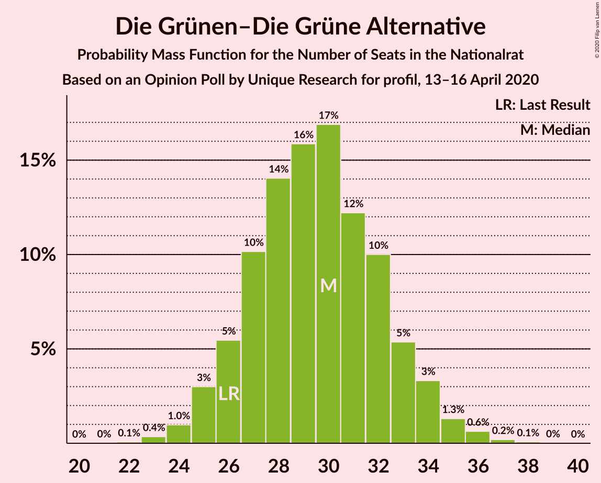
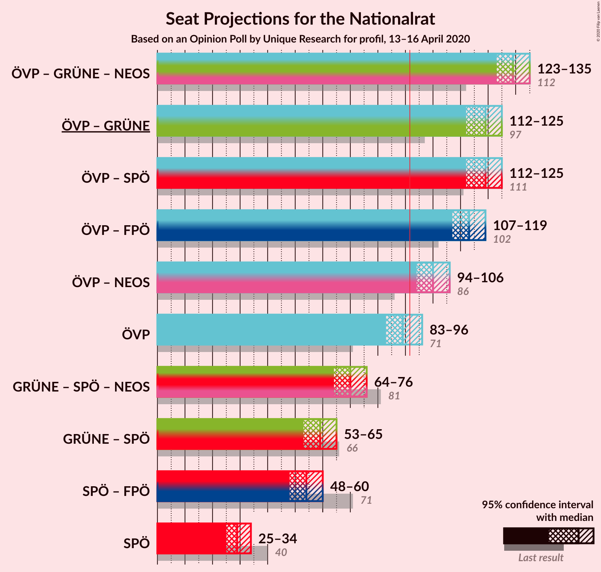
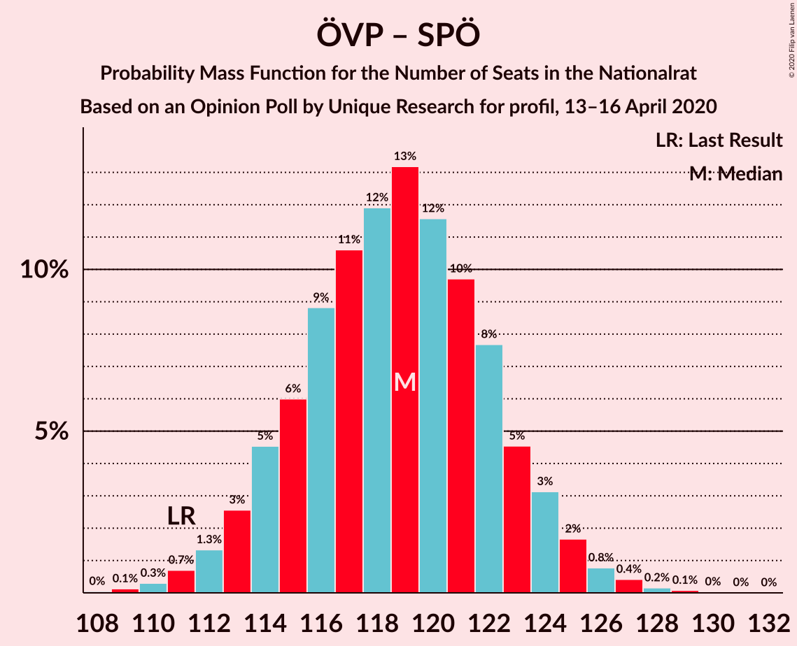
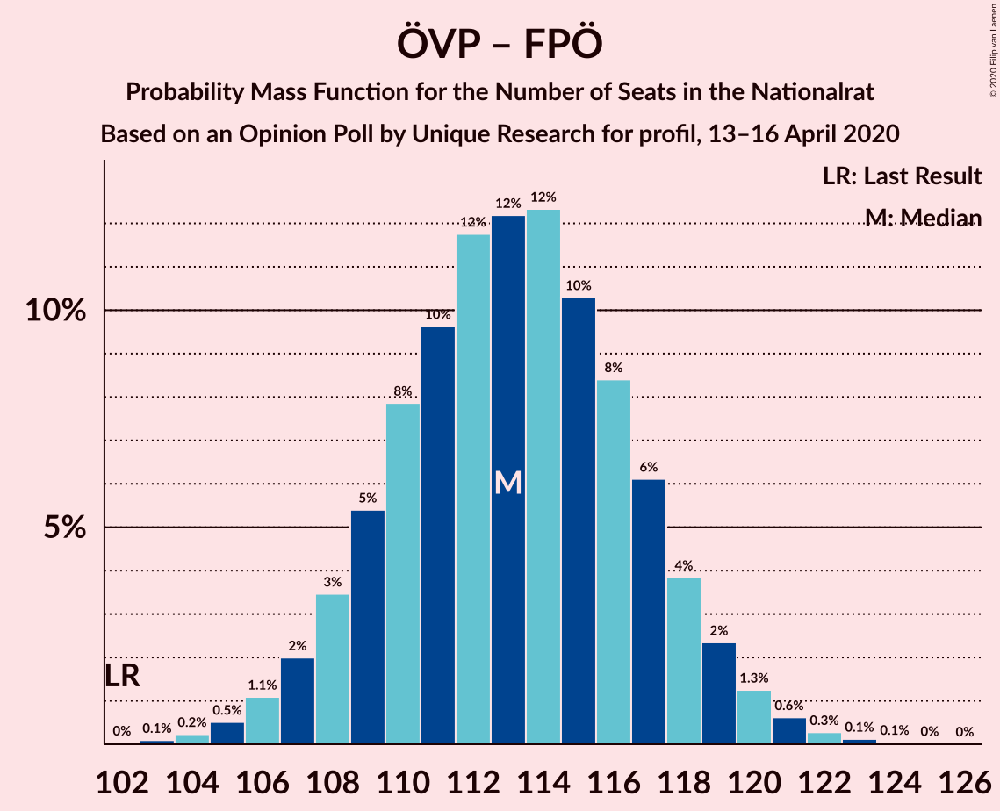
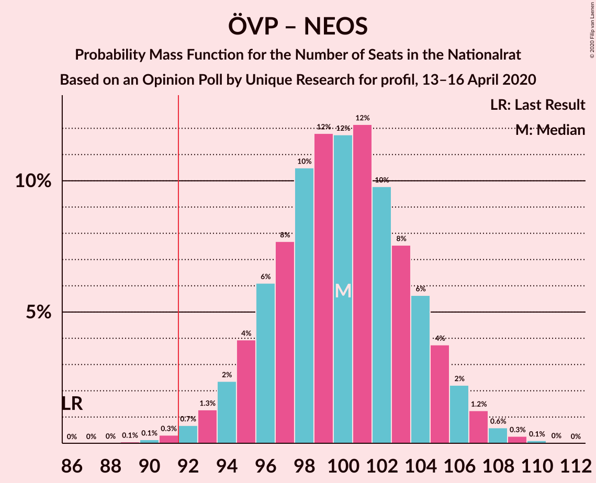
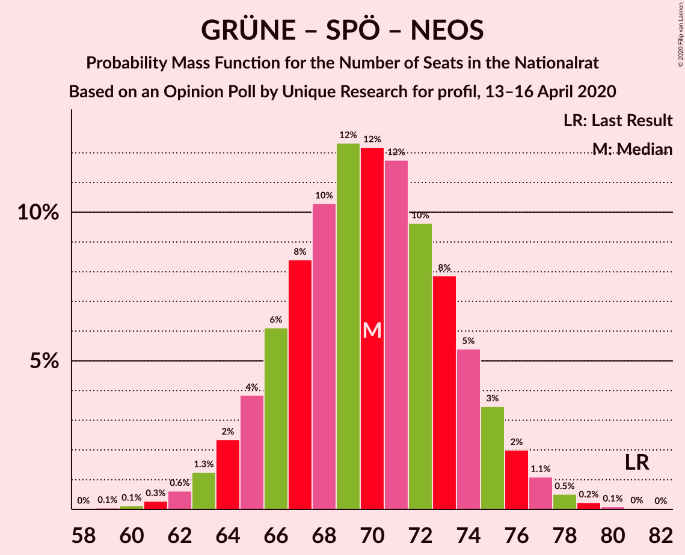
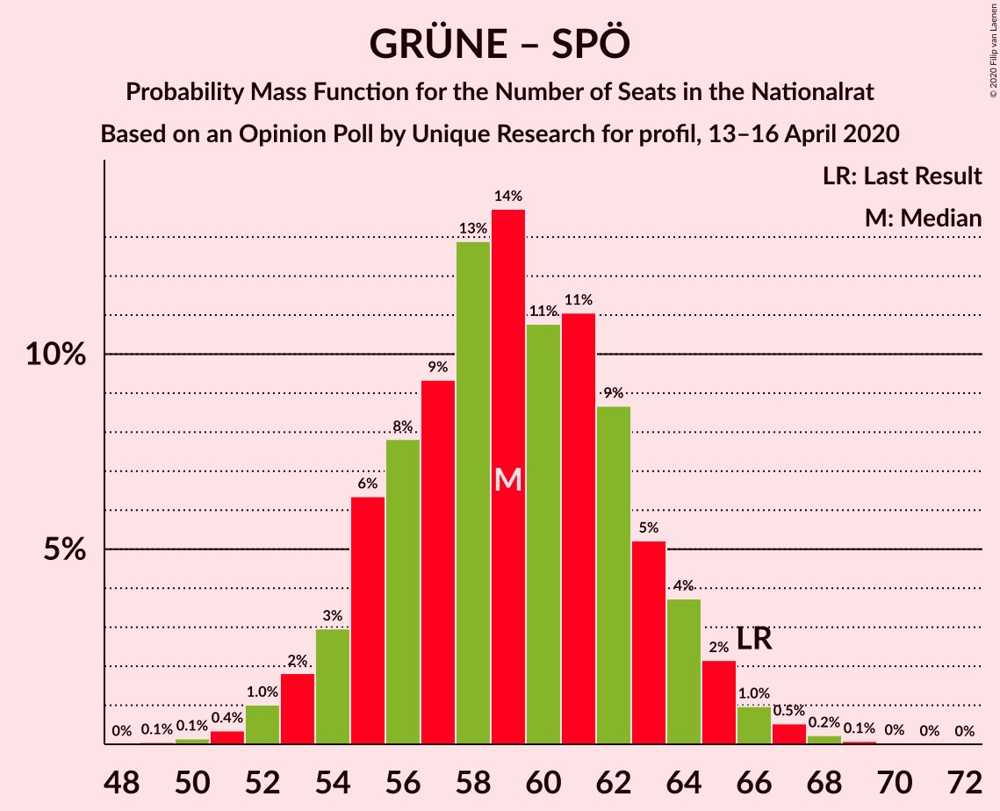

# Opinion Poll by Unique Research for profil, 13–16 April 2020

<a href="#voting-intentions">Voting Intentions</a> | <a href="#seats">Seats</a> | <a href="#coalitions">Coalitions</a> | <a href="#technical-information">Technical Information</a>

## Voting Intentions

### Confidence Intervals

| Party | Last Result | Poll Result | 80% Confidence Interval | 90% Confidence Interval | 95% Confidence Interval | 99% Confidence Interval |
|:-----:|:-----------:|:-----------:|:-----------------------:|:-----------------------:|:-----------------------:|:-----------------------:|
| Österreichische Volkspartei | 37.5% | 48.0% | 45.8–50.3% |45.1–50.9% |44.6–51.5% |43.5–52.6% |
| Sozialdemokratische Partei Österreichs | 21.2% | 16.0% | 14.4–17.8% |14.0–18.3% |13.6–18.7% |12.9–19.6% |
| Die Grünen–Die Grüne Alternative | 13.9% | 16.0% | 14.4–17.8% |14.0–18.3% |13.6–18.7% |12.9–19.6% |
| Freiheitliche Partei Österreichs | 16.2% | 13.0% | 11.6–14.7% |11.2–15.1% |10.9–15.5% |10.2–16.4% |
| NEOS–Das Neue Österreich und Liberales Forum | 8.1% | 6.0% | 5.0–7.2% |4.7–7.5% |4.5–7.8% |4.1–8.4% |

*Note:* The poll result column reflects the actual value used in the calculations. Published results may vary slightly, and in addition be rounded to fewer digits.

## Seats

### Confidence Intervals

| Party | Last Result | Median | 80% Confidence Interval | 90% Confidence Interval | 95% Confidence Interval | 99% Confidence Interval |
|:-----:|:-----------:|:------:|:-----------------------:|:-----------------------:|:-----------------------:|:-----------------------:|
| <a href="#österreichische-volkspartei">Österreichische Volkspartei</a> | 71 | 89 | 85–93 |84–95 |83–96 |81–98 |
| <a href="#sozialdemokratische-partei-österreichs">Sozialdemokratische Partei Österreichs</a> | 40 | 30 | 27–33 |26–34 |25–34 |24–36 |
| <a href="#die-grünen–die-grüne-alternative">Die Grünen–Die Grüne Alternative</a> | 26 | 29 | 27–33 |26–34 |25–34 |24–36 |
| <a href="#freiheitliche-partei-österreichs">Freiheitliche Partei Österreichs</a> | 31 | 24 | 21–27 |20–28 |20–28 |19–30 |
| <a href="#neos–das-neue-österreich-und-liberales-forum">NEOS–Das Neue Österreich und Liberales Forum</a> | 15 | 11 | 9–13 |8–13 |8–14 |7–15 |

### Österreichische Volkspartei

*For a full overview of the results for this party, see the [Österreichische Volkspartei](party-österreichischevolkspartei.html) page.*

| Number of Seats | Probability | Accumulated | Special Marks |
|:---------------:|:-----------:|:-----------:|:-------------:|
| 71 | 0% | 100% | Last Result |
| 72 | 0% | 100% |  |
| 73 | 0% | 100% |  |
| 74 | 0% | 100% |  |
| 75 | 0% | 100% |  |
| 76 | 0% | 100% |  |
| 77 | 0% | 100% |  |
| 78 | 0% | 100% |  |
| 79 | 0.1% | 99.9% |  |
| 80 | 0.3% | 99.9% |  |
| 81 | 0.6% | 99.6% |  |
| 82 | 1.1% | 99.0% |  |
| 83 | 2% | 98% |  |
| 84 | 4% | 96% |  |
| 85 | 5% | 92% |  |
| 86 | 8% | 87% |  |
| 87 | 10% | 78% |  |
| 88 | 10% | 69% |  |
| 89 | 13% | 58% | Median |
| 90 | 13% | 45% |  |
| 91 | 8% | 32% |  |
| 92 | 9% | 24% | Majority |
| 93 | 5% | 15% |  |
| 94 | 4% | 10% |  |
| 95 | 3% | 5% |  |
| 96 | 1.2% | 3% |  |
| 97 | 0.7% | 1.3% |  |
| 98 | 0.4% | 0.7% |  |
| 99 | 0.2% | 0.3% |  |
| 100 | 0.1% | 0.1% |  |
| 101 | 0% | 0% |  |

### Sozialdemokratische Partei Österreichs

*For a full overview of the results for this party, see the [Sozialdemokratische Partei Österreichs](party-sozialdemokratischeparteiösterreichs.html) page.*

| Number of Seats | Probability | Accumulated | Special Marks |
|:---------------:|:-----------:|:-----------:|:-------------:|
| 22 | 0.1% | 100% |  |
| 23 | 0.3% | 99.9% |  |
| 24 | 1.1% | 99.6% |  |
| 25 | 2% | 98% |  |
| 26 | 6% | 96% |  |
| 27 | 10% | 90% |  |
| 28 | 15% | 80% |  |
| 29 | 15% | 65% |  |
| 30 | 15% | 50% | Median |
| 31 | 15% | 35% |  |
| 32 | 9% | 20% |  |
| 33 | 6% | 11% |  |
| 34 | 3% | 6% |  |
| 35 | 1.3% | 2% |  |
| 36 | 0.5% | 0.8% |  |
| 37 | 0.2% | 0.3% |  |
| 38 | 0.1% | 0.1% |  |
| 39 | 0% | 0% |  |
| 40 | 0% | 0% | Last Result |

### Die Grünen–Die Grüne Alternative

*For a full overview of the results for this party, see the [Die Grünen–Die Grüne Alternative](party-diegrünen–diegrünealternative.html) page.*

| Number of Seats | Probability | Accumulated | Special Marks |
|:---------------:|:-----------:|:-----------:|:-------------:|
| 22 | 0.1% | 100% |  |
| 23 | 0.3% | 99.9% |  |
| 24 | 1.1% | 99.6% |  |
| 25 | 3% | 98% |  |
| 26 | 5% | 95% | Last Result |
| 27 | 10% | 90% |  |
| 28 | 14% | 80% |  |
| 29 | 16% | 66% | Median |
| 30 | 17% | 50% |  |
| 31 | 13% | 33% |  |
| 32 | 9% | 20% |  |
| 33 | 6% | 12% |  |
| 34 | 3% | 5% |  |
| 35 | 1.1% | 2% |  |
| 36 | 0.7% | 1.0% |  |
| 37 | 0.2% | 0.3% |  |
| 38 | 0.1% | 0.1% |  |
| 39 | 0% | 0% |  |

### Freiheitliche Partei Österreichs

*For a full overview of the results for this party, see the [Freiheitliche Partei Österreichs](party-freiheitlicheparteiösterreichs.html) page.*

| Number of Seats | Probability | Accumulated | Special Marks |
|:---------------:|:-----------:|:-----------:|:-------------:|
| 17 | 0.1% | 100% |  |
| 18 | 0.3% | 99.9% |  |
| 19 | 1.4% | 99.6% |  |
| 20 | 4% | 98% |  |
| 21 | 7% | 95% |  |
| 22 | 12% | 87% |  |
| 23 | 17% | 75% |  |
| 24 | 18% | 58% | Median |
| 25 | 15% | 40% |  |
| 26 | 12% | 25% |  |
| 27 | 7% | 13% |  |
| 28 | 4% | 6% |  |
| 29 | 2% | 2% |  |
| 30 | 0.6% | 0.9% |  |
| 31 | 0.2% | 0.3% | Last Result |
| 32 | 0.1% | 0.1% |  |
| 33 | 0% | 0% |  |

### NEOS–Das Neue Österreich und Liberales Forum

*For a full overview of the results for this party, see the [NEOS–Das Neue Österreich und Liberales Forum](party-neos–dasneueösterreichundliberalesforum.html) page.*

| Number of Seats | Probability | Accumulated | Special Marks |
|:---------------:|:-----------:|:-----------:|:-------------:|
| 0 | 0.3% | 100% |  |
| 1 | 0% | 99.7% |  |
| 2 | 0% | 99.7% |  |
| 3 | 0% | 99.7% |  |
| 4 | 0% | 99.7% |  |
| 5 | 0% | 99.7% |  |
| 6 | 0% | 99.7% |  |
| 7 | 0.7% | 99.7% |  |
| 8 | 5% | 99.0% |  |
| 9 | 14% | 94% |  |
| 10 | 24% | 80% |  |
| 11 | 25% | 56% | Median |
| 12 | 17% | 31% |  |
| 13 | 9% | 14% |  |
| 14 | 3% | 5% |  |
| 15 | 1.1% | 1.4% | Last Result |
| 16 | 0.3% | 0.3% |  |
| 17 | 0.1% | 0.1% |  |
| 18 | 0% | 0% |  |

## Coalitions

### Confidence Intervals

| Coalition | Last Result | Median | Majority? | 80% Confidence Interval | 90% Confidence Interval | 95% Confidence Interval | 99% Confidence Interval |
|:---------:|:-----------:|:------:|:---------:|:-----------------------:|:-----------------------:|:-----------------------:|:-----------------------:|
| Österreichische Volkspartei – Die Grünen–Die Grüne Alternative – NEOS–Das Neue Österreich und Liberales Forum | 112 | 129 | 100% | 126–133 | 124–134 | 123–135 | 122–137 |
| Österreichische Volkspartei – Sozialdemokratische Partei Österreichs | 111 | 119 | 100% | 115–123 | 113–124 | 113–125 | 111–127 |
| Österreichische Volkspartei – Die Grünen–Die Grüne Alternative | 97 | 119 | 100% | 115–123 | 113–124 | 112–125 | 110–127 |
| Österreichische Volkspartei – Freiheitliche Partei Österreichs | 102 | 113 | 100% | 109–117 | 108–118 | 107–119 | 105–122 |
| Österreichische Volkspartei – NEOS–Das Neue Österreich und Liberales Forum | 86 | 100 | 99.4% | 96–104 | 94–105 | 93–106 | 91–108 |
| Österreichische Volkspartei | 71 | 89 | 24% | 85–93 | 84–95 | 83–96 | 81–98 |
| Die Grünen–Die Grüne Alternative – Sozialdemokratische Partei Österreichs – NEOS–Das Neue Österreich und Liberales Forum | 81 | 70 | 0% | 66–74 | 65–75 | 64–76 | 61–78 |
| Die Grünen–Die Grüne Alternative – Sozialdemokratische Partei Österreichs | 66 | 59 | 0% | 55–63 | 54–64 | 53–65 | 51–67 |
| Sozialdemokratische Partei Österreichs – Freiheitliche Partei Österreichs | 71 | 54 | 0% | 50–57 | 49–59 | 48–60 | 46–61 |
| Sozialdemokratische Partei Österreichs | 40 | 30 | 0% | 27–33 | 26–34 | 25–34 | 24–36 |

### Österreichische Volkspartei – Die Grünen–Die Grüne Alternative – NEOS–Das Neue Österreich und Liberales Forum

| Number of Seats | Probability | Accumulated | Special Marks |
|:---------------:|:-----------:|:-----------:|:-------------:|
| 112 | 0% | 100% | Last Result |
| 113 | 0% | 100% |  |
| 114 | 0% | 100% |  |
| 115 | 0% | 100% |  |
| 116 | 0% | 100% |  |
| 117 | 0% | 100% |  |
| 118 | 0% | 100% |  |
| 119 | 0% | 100% |  |
| 120 | 0.1% | 99.9% |  |
| 121 | 0.3% | 99.8% |  |
| 122 | 0.7% | 99.5% |  |
| 123 | 1.4% | 98.9% |  |
| 124 | 3% | 97% |  |
| 125 | 4% | 95% |  |
| 126 | 7% | 91% |  |
| 127 | 9% | 84% |  |
| 128 | 12% | 75% |  |
| 129 | 13% | 63% | Median |
| 130 | 13% | 50% |  |
| 131 | 13% | 37% |  |
| 132 | 8% | 24% |  |
| 133 | 7% | 16% |  |
| 134 | 5% | 9% |  |
| 135 | 2% | 4% |  |
| 136 | 1.1% | 2% |  |
| 137 | 0.5% | 0.8% |  |
| 138 | 0.2% | 0.3% |  |
| 139 | 0.1% | 0.1% |  |
| 140 | 0% | 0% |  |

### Österreichische Volkspartei – Sozialdemokratische Partei Österreichs

| Number of Seats | Probability | Accumulated | Special Marks |
|:---------------:|:-----------:|:-----------:|:-------------:|
| 108 | 0% | 100% |  |
| 109 | 0.2% | 99.9% |  |
| 110 | 0.3% | 99.8% |  |
| 111 | 0.7% | 99.5% | Last Result |
| 112 | 1.3% | 98.8% |  |
| 113 | 3% | 98% |  |
| 114 | 5% | 95% |  |
| 115 | 7% | 90% |  |
| 116 | 8% | 84% |  |
| 117 | 10% | 75% |  |
| 118 | 13% | 65% |  |
| 119 | 13% | 53% | Median |
| 120 | 12% | 40% |  |
| 121 | 9% | 28% |  |
| 122 | 8% | 19% |  |
| 123 | 5% | 11% |  |
| 124 | 3% | 6% |  |
| 125 | 2% | 3% |  |
| 126 | 0.8% | 1.4% |  |
| 127 | 0.3% | 0.7% |  |
| 128 | 0.2% | 0.3% |  |
| 129 | 0.1% | 0.2% |  |
| 130 | 0% | 0.1% |  |
| 131 | 0% | 0% |  |

### Österreichische Volkspartei – Die Grünen–Die Grüne Alternative

| Number of Seats | Probability | Accumulated | Special Marks |
|:---------------:|:-----------:|:-----------:|:-------------:|
| 97 | 0% | 100% | Last Result |
| 98 | 0% | 100% |  |
| 99 | 0% | 100% |  |
| 100 | 0% | 100% |  |
| 101 | 0% | 100% |  |
| 102 | 0% | 100% |  |
| 103 | 0% | 100% |  |
| 104 | 0% | 100% |  |
| 105 | 0% | 100% |  |
| 106 | 0% | 100% |  |
| 107 | 0% | 100% |  |
| 108 | 0% | 100% |  |
| 109 | 0.1% | 99.9% |  |
| 110 | 0.3% | 99.8% |  |
| 111 | 0.7% | 99.5% |  |
| 112 | 1.4% | 98.8% |  |
| 113 | 2% | 97% |  |
| 114 | 4% | 95% |  |
| 115 | 7% | 91% |  |
| 116 | 8% | 84% |  |
| 117 | 11% | 76% |  |
| 118 | 12% | 65% | Median |
| 119 | 14% | 53% |  |
| 120 | 12% | 39% |  |
| 121 | 8% | 27% |  |
| 122 | 7% | 19% |  |
| 123 | 5% | 11% |  |
| 124 | 3% | 6% |  |
| 125 | 2% | 3% |  |
| 126 | 0.6% | 1.4% |  |
| 127 | 0.4% | 0.8% |  |
| 128 | 0.2% | 0.3% |  |
| 129 | 0.1% | 0.2% |  |
| 130 | 0% | 0.1% |  |
| 131 | 0% | 0% |  |

### Österreichische Volkspartei – Freiheitliche Partei Österreichs

| Number of Seats | Probability | Accumulated | Special Marks |
|:---------------:|:-----------:|:-----------:|:-------------:|
| 102 | 0% | 100% | Last Result |
| 103 | 0.1% | 99.9% |  |
| 104 | 0.2% | 99.8% |  |
| 105 | 0.5% | 99.6% |  |
| 106 | 1.2% | 99.1% |  |
| 107 | 2% | 98% |  |
| 108 | 3% | 96% |  |
| 109 | 5% | 92% |  |
| 110 | 8% | 87% |  |
| 111 | 9% | 79% |  |
| 112 | 13% | 70% |  |
| 113 | 11% | 57% | Median |
| 114 | 12% | 46% |  |
| 115 | 10% | 33% |  |
| 116 | 8% | 23% |  |
| 117 | 7% | 15% |  |
| 118 | 4% | 8% |  |
| 119 | 3% | 5% |  |
| 120 | 1.3% | 2% |  |
| 121 | 0.6% | 1.1% |  |
| 122 | 0.3% | 0.5% |  |
| 123 | 0.2% | 0.3% |  |
| 124 | 0% | 0.1% |  |
| 125 | 0% | 0.1% |  |
| 126 | 0% | 0% |  |

### Österreichische Volkspartei – NEOS–Das Neue Österreich und Liberales Forum

| Number of Seats | Probability | Accumulated | Special Marks |
|:---------------:|:-----------:|:-----------:|:-------------:|
| 86 | 0% | 100% | Last Result |
| 87 | 0% | 100% |  |
| 88 | 0% | 100% |  |
| 89 | 0.1% | 100% |  |
| 90 | 0.1% | 99.9% |  |
| 91 | 0.4% | 99.8% |  |
| 92 | 0.6% | 99.4% | Majority |
| 93 | 1.4% | 98.8% |  |
| 94 | 2% | 97% |  |
| 95 | 4% | 95% |  |
| 96 | 6% | 91% |  |
| 97 | 7% | 85% |  |
| 98 | 9% | 77% |  |
| 99 | 13% | 68% |  |
| 100 | 13% | 55% | Median |
| 101 | 11% | 42% |  |
| 102 | 9% | 30% |  |
| 103 | 8% | 22% |  |
| 104 | 6% | 14% |  |
| 105 | 4% | 8% |  |
| 106 | 2% | 4% |  |
| 107 | 1.0% | 2% |  |
| 108 | 0.6% | 1.1% |  |
| 109 | 0.3% | 0.5% |  |
| 110 | 0.1% | 0.2% |  |
| 111 | 0% | 0.1% |  |
| 112 | 0% | 0% |  |

### Österreichische Volkspartei

| Number of Seats | Probability | Accumulated | Special Marks |
|:---------------:|:-----------:|:-----------:|:-------------:|
| 71 | 0% | 100% | Last Result |
| 72 | 0% | 100% |  |
| 73 | 0% | 100% |  |
| 74 | 0% | 100% |  |
| 75 | 0% | 100% |  |
| 76 | 0% | 100% |  |
| 77 | 0% | 100% |  |
| 78 | 0% | 100% |  |
| 79 | 0.1% | 99.9% |  |
| 80 | 0.3% | 99.9% |  |
| 81 | 0.6% | 99.6% |  |
| 82 | 1.1% | 99.0% |  |
| 83 | 2% | 98% |  |
| 84 | 4% | 96% |  |
| 85 | 5% | 92% |  |
| 86 | 8% | 87% |  |
| 87 | 10% | 78% |  |
| 88 | 10% | 69% |  |
| 89 | 13% | 58% | Median |
| 90 | 13% | 45% |  |
| 91 | 8% | 32% |  |
| 92 | 9% | 24% | Majority |
| 93 | 5% | 15% |  |
| 94 | 4% | 10% |  |
| 95 | 3% | 5% |  |
| 96 | 1.2% | 3% |  |
| 97 | 0.7% | 1.3% |  |
| 98 | 0.4% | 0.7% |  |
| 99 | 0.2% | 0.3% |  |
| 100 | 0.1% | 0.1% |  |
| 101 | 0% | 0% |  |

### Die Grünen–Die Grüne Alternative – Sozialdemokratische Partei Österreichs – NEOS–Das Neue Österreich und Liberales Forum

| Number of Seats | Probability | Accumulated | Special Marks |
|:---------------:|:-----------:|:-----------:|:-------------:|
| 58 | 0% | 100% |  |
| 59 | 0% | 99.9% |  |
| 60 | 0.2% | 99.9% |  |
| 61 | 0.3% | 99.7% |  |
| 62 | 0.6% | 99.5% |  |
| 63 | 1.3% | 98.9% |  |
| 64 | 3% | 98% |  |
| 65 | 4% | 95% |  |
| 66 | 7% | 92% |  |
| 67 | 8% | 85% |  |
| 68 | 10% | 77% |  |
| 69 | 12% | 67% |  |
| 70 | 11% | 54% | Median |
| 71 | 13% | 43% |  |
| 72 | 9% | 30% |  |
| 73 | 8% | 21% |  |
| 74 | 5% | 13% |  |
| 75 | 3% | 8% |  |
| 76 | 2% | 4% |  |
| 77 | 1.2% | 2% |  |
| 78 | 0.5% | 0.9% |  |
| 79 | 0.2% | 0.4% |  |
| 80 | 0.1% | 0.2% |  |
| 81 | 0% | 0.1% | Last Result |
| 82 | 0% | 0% |  |

### Die Grünen–Die Grüne Alternative – Sozialdemokratische Partei Österreichs

| Number of Seats | Probability | Accumulated | Special Marks |
|:---------------:|:-----------:|:-----------:|:-------------:|
| 49 | 0.1% | 100% |  |
| 50 | 0.2% | 99.9% |  |
| 51 | 0.3% | 99.8% |  |
| 52 | 1.1% | 99.4% |  |
| 53 | 2% | 98% |  |
| 54 | 3% | 97% |  |
| 55 | 6% | 93% |  |
| 56 | 8% | 87% |  |
| 57 | 9% | 79% |  |
| 58 | 13% | 70% |  |
| 59 | 13% | 57% | Median |
| 60 | 10% | 44% |  |
| 61 | 11% | 33% |  |
| 62 | 9% | 22% |  |
| 63 | 5% | 13% |  |
| 64 | 4% | 8% |  |
| 65 | 2% | 4% |  |
| 66 | 1.1% | 2% | Last Result |
| 67 | 0.5% | 0.9% |  |
| 68 | 0.3% | 0.4% |  |
| 69 | 0.1% | 0.1% |  |
| 70 | 0% | 0.1% |  |
| 71 | 0% | 0% |  |

### Sozialdemokratische Partei Österreichs – Freiheitliche Partei Österreichs

| Number of Seats | Probability | Accumulated | Special Marks |
|:---------------:|:-----------:|:-----------:|:-------------:|
| 44 | 0.1% | 100% |  |
| 45 | 0.2% | 99.9% |  |
| 46 | 0.5% | 99.7% |  |
| 47 | 1.1% | 99.2% |  |
| 48 | 2% | 98% |  |
| 49 | 5% | 96% |  |
| 50 | 7% | 91% |  |
| 51 | 8% | 84% |  |
| 52 | 13% | 76% |  |
| 53 | 13% | 63% |  |
| 54 | 13% | 50% | Median |
| 55 | 12% | 37% |  |
| 56 | 9% | 25% |  |
| 57 | 7% | 16% |  |
| 58 | 4% | 9% |  |
| 59 | 3% | 5% |  |
| 60 | 1.4% | 3% |  |
| 61 | 0.7% | 1.1% |  |
| 62 | 0.3% | 0.5% |  |
| 63 | 0.1% | 0.2% |  |
| 64 | 0% | 0.1% |  |
| 65 | 0% | 0% |  |
| 66 | 0% | 0% |  |
| 67 | 0% | 0% |  |
| 68 | 0% | 0% |  |
| 69 | 0% | 0% |  |
| 70 | 0% | 0% |  |
| 71 | 0% | 0% | Last Result |

### Sozialdemokratische Partei Österreichs

| Number of Seats | Probability | Accumulated | Special Marks |
|:---------------:|:-----------:|:-----------:|:-------------:|
| 22 | 0.1% | 100% |  |
| 23 | 0.3% | 99.9% |  |
| 24 | 1.1% | 99.6% |  |
| 25 | 2% | 98% |  |
| 26 | 6% | 96% |  |
| 27 | 10% | 90% |  |
| 28 | 15% | 80% |  |
| 29 | 15% | 65% |  |
| 30 | 15% | 50% | Median |
| 31 | 15% | 35% |  |
| 32 | 9% | 20% |  |
| 33 | 6% | 11% |  |
| 34 | 3% | 6% |  |
| 35 | 1.3% | 2% |  |
| 36 | 0.5% | 0.8% |  |
| 37 | 0.2% | 0.3% |  |
| 38 | 0.1% | 0.1% |  |
| 39 | 0% | 0% |  |
| 40 | 0% | 0% | Last Result |

## Technical Information

### Opinion Poll

+ **Polling firm:** Unique Research
+ **Commissioner(s):** profil
+ **Fieldwork period:** 13–16 April 2020

### Calculations

+ **Sample size:** 806
+ **Simulations done:** 131,072
+ **Error estimate:** 0.73%

