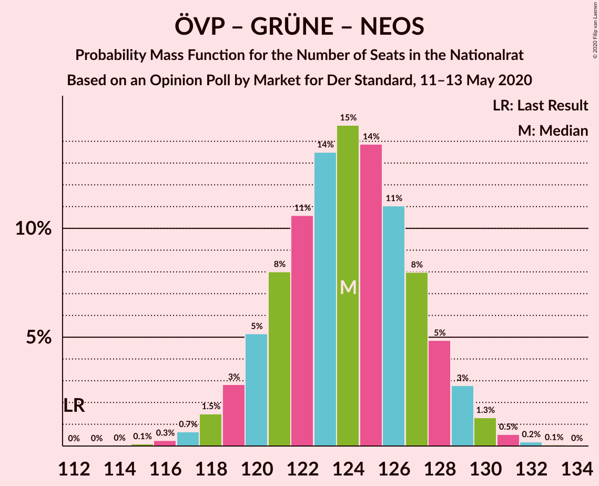
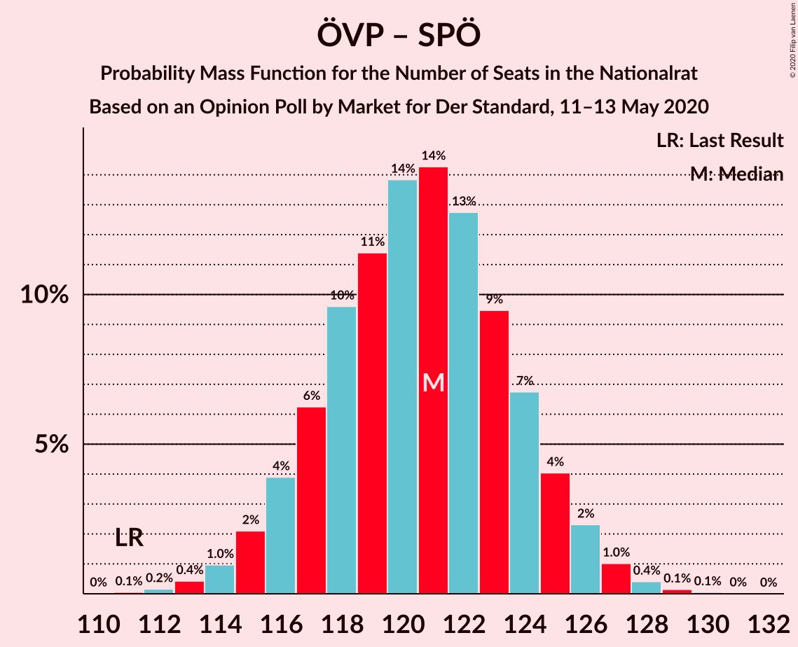
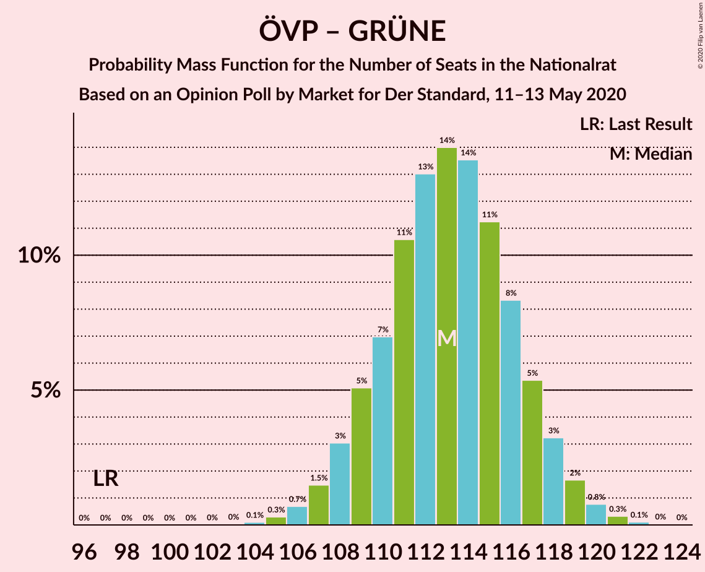
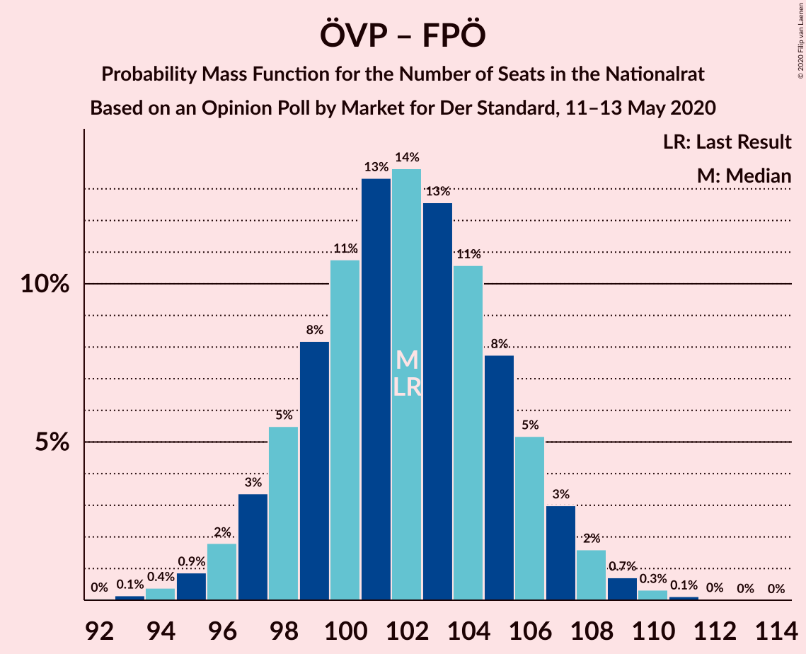
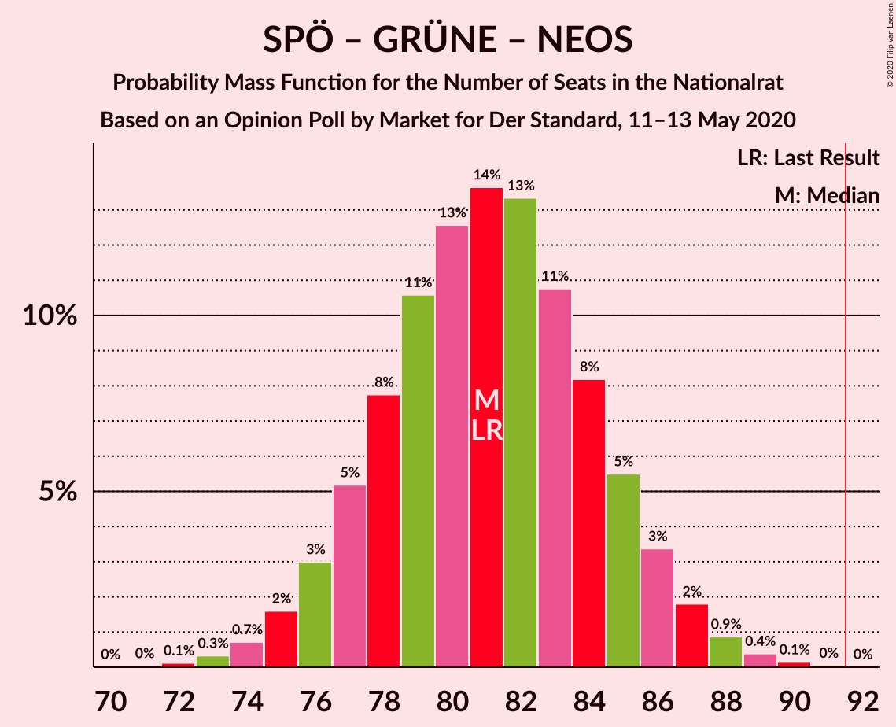
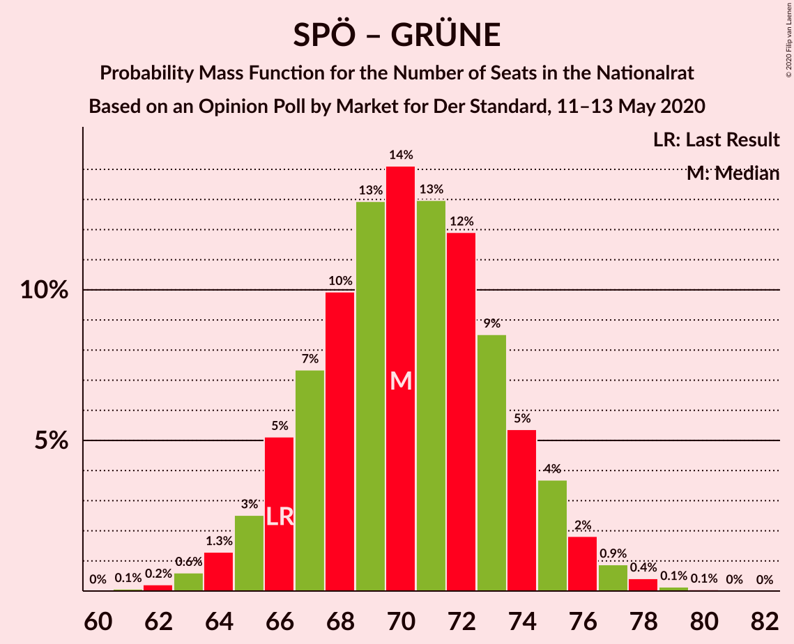
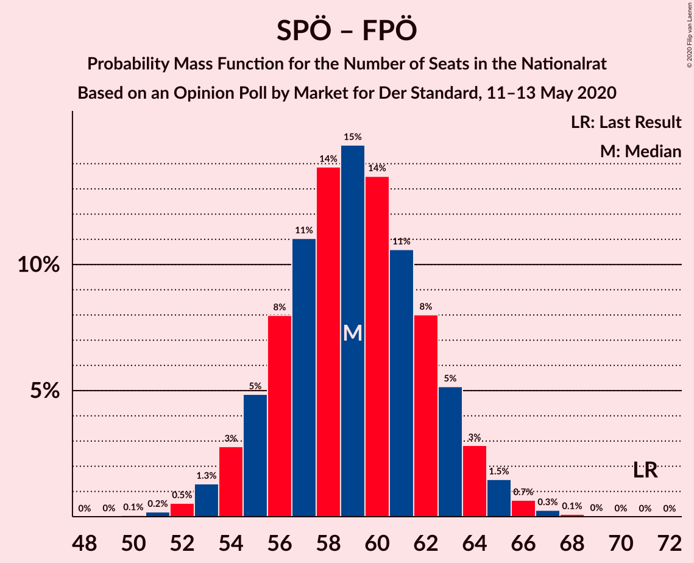

# Opinion Poll by Market for Der Standard, 11–13 May 2020

<a href="#voting-intentions">Voting Intentions</a> | <a href="#seats">Seats</a> | <a href="#coalitions">Coalitions</a> | <a href="#technical-information">Technical Information</a>

## Voting Intentions

### Confidence Intervals

| Party | Last Result | Poll Result | 80% Confidence Interval | 90% Confidence Interval | 95% Confidence Interval | 99% Confidence Interval |
|:-----:|:-----------:|:-----------:|:-----------------------:|:-----------------------:|:-----------------------:|:-----------------------:|
| Österreichische Volkspartei | 37.5% | 44.0% | 42.0–46.0% |41.4–46.6% |40.9–47.1% |40.0–48.1% |
| Sozialdemokratische Partei Österreichs | 21.2% | 21.0% | 19.4–22.7% |19.0–23.2% |18.6–23.6% |17.8–24.5% |
| Die Grünen–Die Grüne Alternative | 13.9% | 17.0% | 15.5–18.6% |15.1–19.1% |14.8–19.5% |14.1–20.3% |
| Freiheitliche Partei Österreichs | 16.2% | 11.0% | 9.8–12.4% |9.5–12.8% |9.2–13.1% |8.7–13.8% |
| NEOS–Das Neue Österreich und Liberales Forum | 8.1% | 6.0% | 5.1–7.1% |4.9–7.4% |4.7–7.7% |4.3–8.2% |

*Note:* The poll result column reflects the actual value used in the calculations. Published results may vary slightly, and in addition be rounded to fewer digits.

## Seats

### Confidence Intervals

| Party | Last Result | Median | 80% Confidence Interval | 90% Confidence Interval | 95% Confidence Interval | 99% Confidence Interval |
|:-----:|:-----------:|:------:|:-----------------------:|:-----------------------:|:-----------------------:|:-----------------------:|
| <a href="#österreichische-volkspartei">Österreichische Volkspartei</a> | 71 | 82 | 78–85 |77–87 |76–87 |74–89 |
| <a href="#sozialdemokratische-partei-österreichs">Sozialdemokratische Partei Österreichs</a> | 40 | 39 | 36–42 |35–43 |34–44 |33–45 |
| <a href="#die-grünen–die-grüne-alternative">Die Grünen–Die Grüne Alternative</a> | 26 | 31 | 29–34 |28–35 |27–36 |26–37 |
| <a href="#freiheitliche-partei-österreichs">Freiheitliche Partei Österreichs</a> | 31 | 20 | 18–23 |17–23 |17–24 |16–25 |
| <a href="#neos–das-neue-österreich-und-liberales-forum">NEOS–Das Neue Österreich und Liberales Forum</a> | 15 | 11 | 9–13 |9–13 |8–14 |8–15 |

### Österreichische Volkspartei

*For a full overview of the results for this party, see the [Österreichische Volkspartei](party-österreichischevolkspartei.html) page.*

| Number of Seats | Probability | Accumulated | Special Marks |
|:---------------:|:-----------:|:-----------:|:-------------:|
| 71 | 0% | 100% | Last Result |
| 72 | 0.1% | 100% |  |
| 73 | 0.2% | 99.9% |  |
| 74 | 0.4% | 99.8% |  |
| 75 | 1.0% | 99.3% |  |
| 76 | 2% | 98% |  |
| 77 | 4% | 96% |  |
| 78 | 6% | 93% |  |
| 79 | 9% | 86% |  |
| 80 | 11% | 78% |  |
| 81 | 14% | 67% |  |
| 82 | 13% | 53% | Median |
| 83 | 12% | 39% |  |
| 84 | 10% | 27% |  |
| 85 | 7% | 17% |  |
| 86 | 4% | 10% |  |
| 87 | 3% | 5% |  |
| 88 | 1.4% | 2% |  |
| 89 | 0.6% | 1.1% |  |
| 90 | 0.3% | 0.4% |  |
| 91 | 0.1% | 0.1% |  |
| 92 | 0% | 0.1% | Majority |
| 93 | 0% | 0% |  |

### Sozialdemokratische Partei Österreichs

*For a full overview of the results for this party, see the [Sozialdemokratische Partei Österreichs](party-sozialdemokratischeparteiösterreichs.html) page.*

| Number of Seats | Probability | Accumulated | Special Marks |
|:---------------:|:-----------:|:-----------:|:-------------:|
| 31 | 0.1% | 100% |  |
| 32 | 0.2% | 99.9% |  |
| 33 | 0.8% | 99.7% |  |
| 34 | 2% | 98.9% |  |
| 35 | 5% | 97% |  |
| 36 | 8% | 92% |  |
| 37 | 13% | 84% |  |
| 38 | 16% | 71% |  |
| 39 | 16% | 55% | Median |
| 40 | 14% | 38% | Last Result |
| 41 | 11% | 24% |  |
| 42 | 7% | 13% |  |
| 43 | 4% | 7% |  |
| 44 | 2% | 3% |  |
| 45 | 0.7% | 1.1% |  |
| 46 | 0.3% | 0.4% |  |
| 47 | 0.1% | 0.1% |  |
| 48 | 0% | 0% |  |

### Die Grünen–Die Grüne Alternative

*For a full overview of the results for this party, see the [Die Grünen–Die Grüne Alternative](party-diegrünen–diegrünealternative.html) page.*

| Number of Seats | Probability | Accumulated | Special Marks |
|:---------------:|:-----------:|:-----------:|:-------------:|
| 24 | 0% | 100% |  |
| 25 | 0.2% | 99.9% |  |
| 26 | 0.9% | 99.7% | Last Result |
| 27 | 3% | 98.9% |  |
| 28 | 6% | 96% |  |
| 29 | 10% | 91% |  |
| 30 | 15% | 80% |  |
| 31 | 18% | 65% | Median |
| 32 | 17% | 47% |  |
| 33 | 13% | 30% |  |
| 34 | 9% | 17% |  |
| 35 | 5% | 8% |  |
| 36 | 2% | 4% |  |
| 37 | 0.8% | 1.3% |  |
| 38 | 0.3% | 0.4% |  |
| 39 | 0.1% | 0.1% |  |
| 40 | 0% | 0% |  |

### Freiheitliche Partei Österreichs

*For a full overview of the results for this party, see the [Freiheitliche Partei Österreichs](party-freiheitlicheparteiösterreichs.html) page.*

| Number of Seats | Probability | Accumulated | Special Marks |
|:---------------:|:-----------:|:-----------:|:-------------:|
| 15 | 0.3% | 100% |  |
| 16 | 2% | 99.7% |  |
| 17 | 5% | 98% |  |
| 18 | 11% | 93% |  |
| 19 | 18% | 82% |  |
| 20 | 21% | 64% | Median |
| 21 | 19% | 43% |  |
| 22 | 13% | 23% |  |
| 23 | 7% | 11% |  |
| 24 | 3% | 4% |  |
| 25 | 1.0% | 1.3% |  |
| 26 | 0.3% | 0.3% |  |
| 27 | 0.1% | 0.1% |  |
| 28 | 0% | 0% |  |
| 29 | 0% | 0% |  |
| 30 | 0% | 0% |  |
| 31 | 0% | 0% | Last Result |

### NEOS–Das Neue Österreich und Liberales Forum

*For a full overview of the results for this party, see the [NEOS–Das Neue Österreich und Liberales Forum](party-neos–dasneueösterreichundliberalesforum.html) page.*

| Number of Seats | Probability | Accumulated | Special Marks |
|:---------------:|:-----------:|:-----------:|:-------------:|
| 0 | 0.1% | 100% |  |
| 1 | 0% | 99.9% |  |
| 2 | 0% | 99.9% |  |
| 3 | 0% | 99.9% |  |
| 4 | 0% | 99.9% |  |
| 5 | 0% | 99.9% |  |
| 6 | 0% | 99.9% |  |
| 7 | 0.3% | 99.9% |  |
| 8 | 3% | 99.6% |  |
| 9 | 13% | 96% |  |
| 10 | 24% | 83% |  |
| 11 | 27% | 59% | Median |
| 12 | 19% | 32% |  |
| 13 | 9% | 13% |  |
| 14 | 3% | 4% |  |
| 15 | 0.7% | 0.8% | Last Result |
| 16 | 0.1% | 0.1% |  |
| 17 | 0% | 0% |  |

## Coalitions

### Confidence Intervals

| Coalition | Last Result | Median | Majority? | 80% Confidence Interval | 90% Confidence Interval | 95% Confidence Interval | 99% Confidence Interval |
|:---------:|:-----------:|:------:|:---------:|:-----------------------:|:-----------------------:|:-----------------------:|:-----------------------:|
| Österreichische Volkspartei – Die Grünen–Die Grüne Alternative – NEOS–Das Neue Österreich und Liberales Forum | 112 | 124 | 100% | 120–127 | 119–128 | 118–129 | 117–131 |
| Österreichische Volkspartei – Sozialdemokratische Partei Österreichs | 111 | 121 | 100% | 117–124 | 116–125 | 115–126 | 113–128 |
| Österreichische Volkspartei – Die Grünen–Die Grüne Alternative | 97 | 113 | 100% | 109–117 | 108–118 | 107–119 | 106–121 |
| Österreichische Volkspartei – Freiheitliche Partei Österreichs | 102 | 102 | 100% | 98–106 | 97–107 | 96–108 | 94–110 |
| Österreichische Volkspartei – NEOS–Das Neue Österreich und Liberales Forum | 86 | 93 | 64% | 89–96 | 88–97 | 87–98 | 85–100 |
| Österreichische Volkspartei | 71 | 82 | 0.1% | 78–85 | 77–87 | 76–87 | 74–89 |
| Sozialdemokratische Partei Österreichs – Die Grünen–Die Grüne Alternative – NEOS–Das Neue Österreich und Liberales Forum | 81 | 81 | 0% | 77–85 | 76–86 | 75–87 | 73–89 |
| Sozialdemokratische Partei Österreichs – Die Grünen–Die Grüne Alternative | 66 | 70 | 0% | 67–74 | 66–75 | 65–76 | 63–78 |
| Sozialdemokratische Partei Österreichs – Freiheitliche Partei Österreichs | 71 | 59 | 0% | 56–63 | 55–64 | 54–65 | 52–66 |
| Sozialdemokratische Partei Österreichs | 40 | 39 | 0% | 36–42 | 35–43 | 34–44 | 33–45 |

### Österreichische Volkspartei – Die Grünen–Die Grüne Alternative – NEOS–Das Neue Österreich und Liberales Forum

| Number of Seats | Probability | Accumulated | Special Marks |
|:---------------:|:-----------:|:-----------:|:-------------:|
| 112 | 0% | 100% | Last Result |
| 113 | 0% | 100% |  |
| 114 | 0% | 100% |  |
| 115 | 0.1% | 100% |  |
| 116 | 0.3% | 99.9% |  |
| 117 | 0.7% | 99.6% |  |
| 118 | 1.5% | 98.9% |  |
| 119 | 3% | 97% |  |
| 120 | 5% | 95% |  |
| 121 | 8% | 89% |  |
| 122 | 11% | 81% |  |
| 123 | 14% | 71% |  |
| 124 | 15% | 57% | Median |
| 125 | 14% | 43% |  |
| 126 | 11% | 29% |  |
| 127 | 8% | 18% |  |
| 128 | 5% | 10% |  |
| 129 | 3% | 5% |  |
| 130 | 1.3% | 2% |  |
| 131 | 0.5% | 0.8% |  |
| 132 | 0.2% | 0.3% |  |
| 133 | 0.1% | 0.1% |  |
| 134 | 0% | 0% |  |

### Österreichische Volkspartei – Sozialdemokratische Partei Österreichs

| Number of Seats | Probability | Accumulated | Special Marks |
|:---------------:|:-----------:|:-----------:|:-------------:|
| 111 | 0.1% | 100% | Last Result |
| 112 | 0.2% | 99.9% |  |
| 113 | 0.4% | 99.8% |  |
| 114 | 1.0% | 99.3% |  |
| 115 | 2% | 98% |  |
| 116 | 4% | 96% |  |
| 117 | 6% | 92% |  |
| 118 | 10% | 86% |  |
| 119 | 11% | 77% |  |
| 120 | 14% | 65% |  |
| 121 | 14% | 51% | Median |
| 122 | 13% | 37% |  |
| 123 | 9% | 24% |  |
| 124 | 7% | 15% |  |
| 125 | 4% | 8% |  |
| 126 | 2% | 4% |  |
| 127 | 1.0% | 2% |  |
| 128 | 0.4% | 0.6% |  |
| 129 | 0.1% | 0.2% |  |
| 130 | 0.1% | 0.1% |  |
| 131 | 0% | 0% |  |

### Österreichische Volkspartei – Die Grünen–Die Grüne Alternative

| Number of Seats | Probability | Accumulated | Special Marks |
|:---------------:|:-----------:|:-----------:|:-------------:|
| 97 | 0% | 100% | Last Result |
| 98 | 0% | 100% |  |
| 99 | 0% | 100% |  |
| 100 | 0% | 100% |  |
| 101 | 0% | 100% |  |
| 102 | 0% | 100% |  |
| 103 | 0% | 100% |  |
| 104 | 0.1% | 100% |  |
| 105 | 0.3% | 99.8% |  |
| 106 | 0.7% | 99.5% |  |
| 107 | 1.5% | 98.9% |  |
| 108 | 3% | 97% |  |
| 109 | 5% | 94% |  |
| 110 | 7% | 89% |  |
| 111 | 11% | 82% |  |
| 112 | 13% | 72% |  |
| 113 | 14% | 59% | Median |
| 114 | 14% | 45% |  |
| 115 | 11% | 31% |  |
| 116 | 8% | 20% |  |
| 117 | 5% | 12% |  |
| 118 | 3% | 6% |  |
| 119 | 2% | 3% |  |
| 120 | 0.8% | 1.3% |  |
| 121 | 0.3% | 0.5% |  |
| 122 | 0.1% | 0.2% |  |
| 123 | 0% | 0.1% |  |
| 124 | 0% | 0% |  |

### Österreichische Volkspartei – Freiheitliche Partei Österreichs

| Number of Seats | Probability | Accumulated | Special Marks |
|:---------------:|:-----------:|:-----------:|:-------------:|
| 92 | 0% | 100% | Majority |
| 93 | 0.1% | 99.9% |  |
| 94 | 0.4% | 99.8% |  |
| 95 | 0.9% | 99.4% |  |
| 96 | 2% | 98.5% |  |
| 97 | 3% | 97% |  |
| 98 | 5% | 93% |  |
| 99 | 8% | 88% |  |
| 100 | 11% | 80% |  |
| 101 | 13% | 69% |  |
| 102 | 14% | 56% | Last Result, Median |
| 103 | 13% | 42% |  |
| 104 | 11% | 29% |  |
| 105 | 8% | 19% |  |
| 106 | 5% | 11% |  |
| 107 | 3% | 6% |  |
| 108 | 2% | 3% |  |
| 109 | 0.7% | 1.2% |  |
| 110 | 0.3% | 0.5% |  |
| 111 | 0.1% | 0.2% |  |
| 112 | 0% | 0.1% |  |
| 113 | 0% | 0% |  |

### Österreichische Volkspartei – NEOS–Das Neue Österreich und Liberales Forum

| Number of Seats | Probability | Accumulated | Special Marks |
|:---------------:|:-----------:|:-----------:|:-------------:|
| 83 | 0.1% | 100% |  |
| 84 | 0.2% | 99.9% |  |
| 85 | 0.5% | 99.7% |  |
| 86 | 1.1% | 99.1% | Last Result |
| 87 | 2% | 98% |  |
| 88 | 4% | 96% |  |
| 89 | 7% | 92% |  |
| 90 | 9% | 85% |  |
| 91 | 12% | 76% |  |
| 92 | 13% | 64% | Majority |
| 93 | 14% | 51% | Median |
| 94 | 12% | 37% |  |
| 95 | 10% | 26% |  |
| 96 | 7% | 16% |  |
| 97 | 4% | 9% |  |
| 98 | 2% | 5% |  |
| 99 | 1.4% | 2% |  |
| 100 | 0.6% | 0.9% |  |
| 101 | 0.2% | 0.4% |  |
| 102 | 0.1% | 0.1% |  |
| 103 | 0% | 0% |  |

### Österreichische Volkspartei

| Number of Seats | Probability | Accumulated | Special Marks |
|:---------------:|:-----------:|:-----------:|:-------------:|
| 71 | 0% | 100% | Last Result |
| 72 | 0.1% | 100% |  |
| 73 | 0.2% | 99.9% |  |
| 74 | 0.4% | 99.8% |  |
| 75 | 1.0% | 99.3% |  |
| 76 | 2% | 98% |  |
| 77 | 4% | 96% |  |
| 78 | 6% | 93% |  |
| 79 | 9% | 86% |  |
| 80 | 11% | 78% |  |
| 81 | 14% | 67% |  |
| 82 | 13% | 53% | Median |
| 83 | 12% | 39% |  |
| 84 | 10% | 27% |  |
| 85 | 7% | 17% |  |
| 86 | 4% | 10% |  |
| 87 | 3% | 5% |  |
| 88 | 1.4% | 2% |  |
| 89 | 0.6% | 1.1% |  |
| 90 | 0.3% | 0.4% |  |
| 91 | 0.1% | 0.1% |  |
| 92 | 0% | 0.1% | Majority |
| 93 | 0% | 0% |  |

### Sozialdemokratische Partei Österreichs – Die Grünen–Die Grüne Alternative – NEOS–Das Neue Österreich und Liberales Forum

| Number of Seats | Probability | Accumulated | Special Marks |
|:---------------:|:-----------:|:-----------:|:-------------:|
| 71 | 0% | 100% |  |
| 72 | 0.1% | 99.9% |  |
| 73 | 0.3% | 99.8% |  |
| 74 | 0.7% | 99.5% |  |
| 75 | 2% | 98.8% |  |
| 76 | 3% | 97% |  |
| 77 | 5% | 94% |  |
| 78 | 8% | 89% |  |
| 79 | 11% | 81% |  |
| 80 | 13% | 71% |  |
| 81 | 14% | 58% | Last Result, Median |
| 82 | 13% | 44% |  |
| 83 | 11% | 31% |  |
| 84 | 8% | 20% |  |
| 85 | 5% | 12% |  |
| 86 | 3% | 7% |  |
| 87 | 2% | 3% |  |
| 88 | 0.9% | 1.5% |  |
| 89 | 0.4% | 0.6% |  |
| 90 | 0.1% | 0.2% |  |
| 91 | 0% | 0.1% |  |
| 92 | 0% | 0% | Majority |

### Sozialdemokratische Partei Österreichs – Die Grünen–Die Grüne Alternative

| Number of Seats | Probability | Accumulated | Special Marks |
|:---------------:|:-----------:|:-----------:|:-------------:|
| 61 | 0.1% | 100% |  |
| 62 | 0.2% | 99.9% |  |
| 63 | 0.6% | 99.7% |  |
| 64 | 1.3% | 99.1% |  |
| 65 | 3% | 98% |  |
| 66 | 5% | 95% | Last Result |
| 67 | 7% | 90% |  |
| 68 | 10% | 83% |  |
| 69 | 13% | 73% |  |
| 70 | 14% | 60% | Median |
| 71 | 13% | 46% |  |
| 72 | 12% | 33% |  |
| 73 | 9% | 21% |  |
| 74 | 5% | 12% |  |
| 75 | 4% | 7% |  |
| 76 | 2% | 3% |  |
| 77 | 0.9% | 2% |  |
| 78 | 0.4% | 0.6% |  |
| 79 | 0.1% | 0.2% |  |
| 80 | 0.1% | 0.1% |  |
| 81 | 0% | 0% |  |

### Sozialdemokratische Partei Österreichs – Freiheitliche Partei Österreichs

| Number of Seats | Probability | Accumulated | Special Marks |
|:---------------:|:-----------:|:-----------:|:-------------:|
| 50 | 0.1% | 100% |  |
| 51 | 0.2% | 99.9% |  |
| 52 | 0.5% | 99.7% |  |
| 53 | 1.3% | 99.2% |  |
| 54 | 3% | 98% |  |
| 55 | 5% | 95% |  |
| 56 | 8% | 90% |  |
| 57 | 11% | 82% |  |
| 58 | 14% | 71% |  |
| 59 | 15% | 57% | Median |
| 60 | 14% | 43% |  |
| 61 | 11% | 29% |  |
| 62 | 8% | 19% |  |
| 63 | 5% | 11% |  |
| 64 | 3% | 5% |  |
| 65 | 1.5% | 3% |  |
| 66 | 0.7% | 1.1% |  |
| 67 | 0.3% | 0.4% |  |
| 68 | 0.1% | 0.1% |  |
| 69 | 0% | 0% |  |
| 70 | 0% | 0% |  |
| 71 | 0% | 0% | Last Result |

### Sozialdemokratische Partei Österreichs

| Number of Seats | Probability | Accumulated | Special Marks |
|:---------------:|:-----------:|:-----------:|:-------------:|
| 31 | 0.1% | 100% |  |
| 32 | 0.2% | 99.9% |  |
| 33 | 0.8% | 99.7% |  |
| 34 | 2% | 98.9% |  |
| 35 | 5% | 97% |  |
| 36 | 8% | 92% |  |
| 37 | 13% | 84% |  |
| 38 | 16% | 71% |  |
| 39 | 16% | 55% | Median |
| 40 | 14% | 38% | Last Result |
| 41 | 11% | 24% |  |
| 42 | 7% | 13% |  |
| 43 | 4% | 7% |  |
| 44 | 2% | 3% |  |
| 45 | 0.7% | 1.1% |  |
| 46 | 0.3% | 0.4% |  |
| 47 | 0.1% | 0.1% |  |
| 48 | 0% | 0% |  |

## Technical Information

### Opinion Poll

+ **Polling firm:** Market
+ **Commissioner(s):** Der Standard
+ **Fieldwork period:** 11–13 May 2020

### Calculations

+ **Sample size:** 1000
+ **Simulations done:** 1,048,576
+ **Error estimate:** 0.52%

