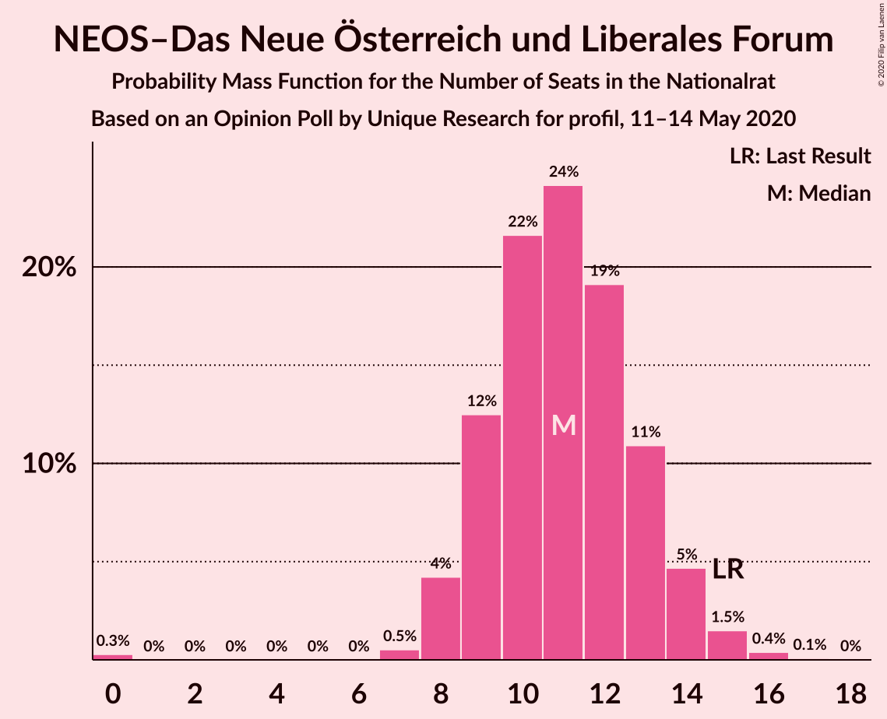
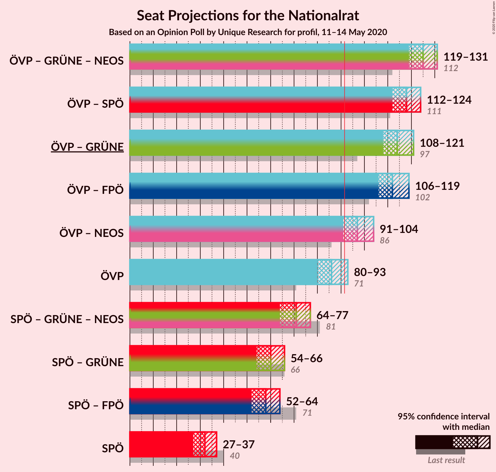
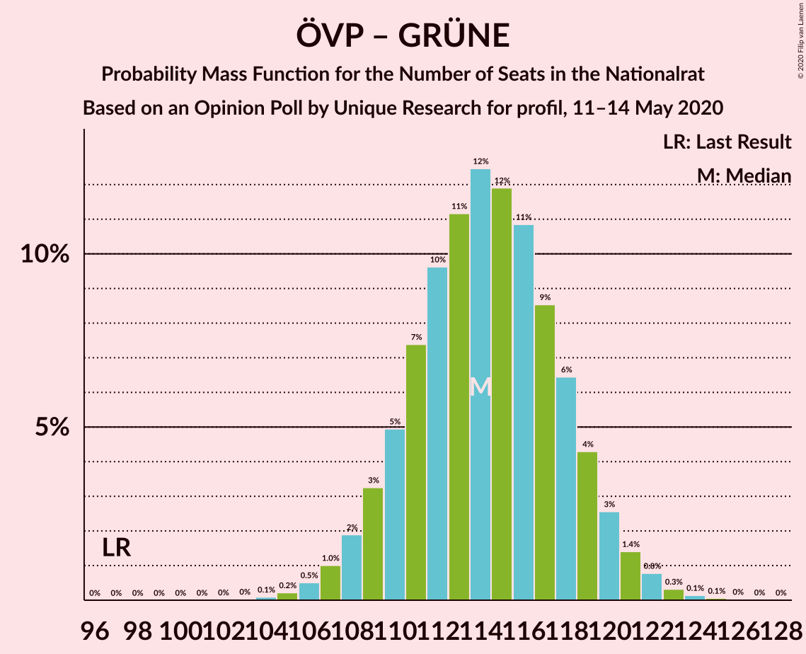
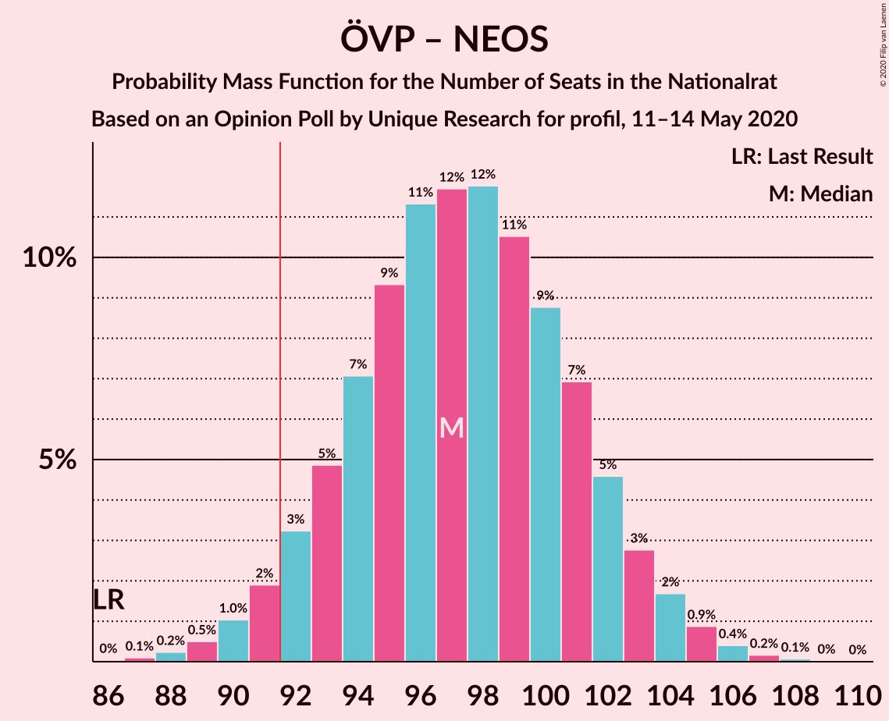
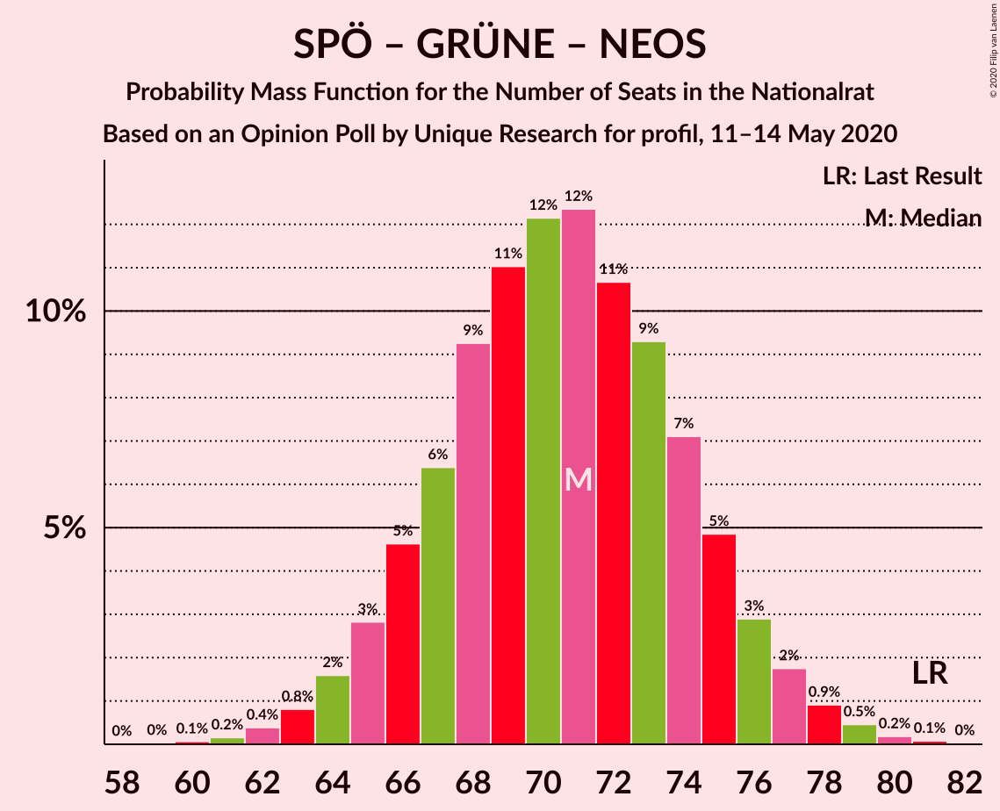

# Opinion Poll by Unique Research for profil, 11–14 May 2020

<a href="#voting-intentions">Voting Intentions</a> | <a href="#seats">Seats</a> | <a href="#coalitions">Coalitions</a> | <a href="#technical-information">Technical Information</a>

## Voting Intentions

### Confidence Intervals

| Party | Last Result | Poll Result | 80% Confidence Interval | 90% Confidence Interval | 95% Confidence Interval | 99% Confidence Interval |
|:-----:|:-----------:|:-----------:|:-----------------------:|:-----------------------:|:-----------------------:|:-----------------------:|
| Österreichische Volkspartei | 37.5% | 46.0% | 43.8–48.3% |43.1–48.9% |42.6–49.5% |41.5–50.6% |
| Sozialdemokratische Partei Österreichs | 21.2% | 17.0% | 15.3–18.8% |14.9–19.3% |14.5–19.7% |13.8–20.6% |
| Die Grünen–Die Grüne Alternative | 13.9% | 15.0% | 13.4–16.7% |13.0–17.2% |12.7–17.6% |12.0–18.5% |
| Freiheitliche Partei Österreichs | 16.2% | 14.0% | 12.5–15.7% |12.1–16.1% |11.7–16.6% |11.1–17.4% |
| NEOS–Das Neue Österreich und Liberales Forum | 8.1% | 6.0% | 5.0–7.2% |4.8–7.5% |4.5–7.8% |4.1–8.5% |

*Note:* The poll result column reflects the actual value used in the calculations. Published results may vary slightly, and in addition be rounded to fewer digits.

## Seats

### Confidence Intervals

| Party | Last Result | Median | 80% Confidence Interval | 90% Confidence Interval | 95% Confidence Interval | 99% Confidence Interval |
|:-----:|:-----------:|:------:|:-----------------------:|:-----------------------:|:-----------------------:|:-----------------------:|
| <a href="#österreichische-volkspartei">Österreichische Volkspartei</a> | 71 | 86 | 82–91 |81–92 |80–93 |78–95 |
| <a href="#sozialdemokratische-partei-österreichs">Sozialdemokratische Partei Österreichs</a> | 40 | 32 | 28–35 |28–36 |27–37 |26–38 |
| <a href="#die-grünen–die-grüne-alternative">Die Grünen–Die Grüne Alternative</a> | 26 | 28 | 25–31 |24–32 |23–33 |22–34 |
| <a href="#freiheitliche-partei-österreichs">Freiheitliche Partei Österreichs</a> | 31 | 26 | 23–29 |22–30 |22–31 |20–32 |
| <a href="#neos–das-neue-österreich-und-liberales-forum">NEOS–Das Neue Österreich und Liberales Forum</a> | 15 | 11 | 9–13 |8–14 |8–14 |7–16 |

### Österreichische Volkspartei

*For a full overview of the results for this party, see the [Österreichische Volkspartei](party-österreichischevolkspartei.html) page.*

| Number of Seats | Probability | Accumulated | Special Marks |
|:---------------:|:-----------:|:-----------:|:-------------:|
| 71 | 0% | 100% | Last Result |
| 72 | 0% | 100% |  |
| 73 | 0% | 100% |  |
| 74 | 0% | 100% |  |
| 75 | 0% | 100% |  |
| 76 | 0.1% | 100% |  |
| 77 | 0.2% | 99.9% |  |
| 78 | 0.4% | 99.7% |  |
| 79 | 1.0% | 99.2% |  |
| 80 | 2% | 98% |  |
| 81 | 3% | 97% |  |
| 82 | 4% | 93% |  |
| 83 | 7% | 89% |  |
| 84 | 10% | 81% |  |
| 85 | 10% | 71% |  |
| 86 | 12% | 61% | Median |
| 87 | 12% | 49% |  |
| 88 | 11% | 37% |  |
| 89 | 8% | 26% |  |
| 90 | 7% | 18% |  |
| 91 | 4% | 11% |  |
| 92 | 3% | 7% | Majority |
| 93 | 2% | 3% |  |
| 94 | 0.9% | 2% |  |
| 95 | 0.4% | 0.7% |  |
| 96 | 0.2% | 0.3% |  |
| 97 | 0.1% | 0.1% |  |
| 98 | 0% | 0% |  |

### Sozialdemokratische Partei Österreichs

*For a full overview of the results for this party, see the [Sozialdemokratische Partei Österreichs](party-sozialdemokratischeparteiösterreichs.html) page.*

| Number of Seats | Probability | Accumulated | Special Marks |
|:---------------:|:-----------:|:-----------:|:-------------:|
| 24 | 0.1% | 100% |  |
| 25 | 0.3% | 99.9% |  |
| 26 | 1.0% | 99.5% |  |
| 27 | 3% | 98.5% |  |
| 28 | 6% | 96% |  |
| 29 | 9% | 90% |  |
| 30 | 14% | 80% |  |
| 31 | 15% | 67% |  |
| 32 | 16% | 52% | Median |
| 33 | 13% | 36% |  |
| 34 | 10% | 23% |  |
| 35 | 6% | 13% |  |
| 36 | 4% | 7% |  |
| 37 | 2% | 3% |  |
| 38 | 0.8% | 1.3% |  |
| 39 | 0.3% | 0.4% |  |
| 40 | 0.1% | 0.1% | Last Result |
| 41 | 0% | 0% |  |

### Die Grünen–Die Grüne Alternative

*For a full overview of the results for this party, see the [Die Grünen–Die Grüne Alternative](party-diegrünen–diegrünealternative.html) page.*

| Number of Seats | Probability | Accumulated | Special Marks |
|:---------------:|:-----------:|:-----------:|:-------------:|
| 21 | 0.2% | 100% |  |
| 22 | 0.7% | 99.8% |  |
| 23 | 2% | 99.1% |  |
| 24 | 5% | 97% |  |
| 25 | 9% | 92% |  |
| 26 | 13% | 83% | Last Result |
| 27 | 15% | 70% |  |
| 28 | 17% | 55% | Median |
| 29 | 13% | 38% |  |
| 30 | 11% | 25% |  |
| 31 | 7% | 14% |  |
| 32 | 4% | 7% |  |
| 33 | 2% | 3% |  |
| 34 | 0.8% | 1.2% |  |
| 35 | 0.3% | 0.4% |  |
| 36 | 0.1% | 0.1% |  |
| 37 | 0% | 0% |  |

### Freiheitliche Partei Österreichs

*For a full overview of the results for this party, see the [Freiheitliche Partei Österreichs](party-freiheitlicheparteiösterreichs.html) page.*

| Number of Seats | Probability | Accumulated | Special Marks |
|:---------------:|:-----------:|:-----------:|:-------------:|
| 19 | 0.1% | 100% |  |
| 20 | 0.5% | 99.9% |  |
| 21 | 1.4% | 99.4% |  |
| 22 | 4% | 98% |  |
| 23 | 8% | 94% |  |
| 24 | 12% | 86% |  |
| 25 | 16% | 75% |  |
| 26 | 16% | 59% | Median |
| 27 | 16% | 42% |  |
| 28 | 11% | 26% |  |
| 29 | 7% | 15% |  |
| 30 | 4% | 7% |  |
| 31 | 2% | 3% | Last Result |
| 32 | 0.8% | 1.2% |  |
| 33 | 0.3% | 0.4% |  |
| 34 | 0.1% | 0.1% |  |
| 35 | 0% | 0% |  |

### NEOS–Das Neue Österreich und Liberales Forum

*For a full overview of the results for this party, see the [NEOS–Das Neue Österreich und Liberales Forum](party-neos–dasneueösterreichundliberalesforum.html) page.*

| Number of Seats | Probability | Accumulated | Special Marks |
|:---------------:|:-----------:|:-----------:|:-------------:|
| 0 | 0.2% | 100% |  |
| 1 | 0% | 99.8% |  |
| 2 | 0% | 99.8% |  |
| 3 | 0% | 99.8% |  |
| 4 | 0% | 99.8% |  |
| 5 | 0% | 99.8% |  |
| 6 | 0% | 99.8% |  |
| 7 | 0.7% | 99.8% |  |
| 8 | 5% | 99.0% |  |
| 9 | 13% | 94% |  |
| 10 | 20% | 81% |  |
| 11 | 22% | 61% | Median |
| 12 | 20% | 39% |  |
| 13 | 12% | 19% |  |
| 14 | 5% | 8% |  |
| 15 | 2% | 2% | Last Result |
| 16 | 0.4% | 0.5% |  |
| 17 | 0.1% | 0.1% |  |
| 18 | 0% | 0% |  |

## Coalitions

### Confidence Intervals

| Coalition | Last Result | Median | Majority? | 80% Confidence Interval | 90% Confidence Interval | 95% Confidence Interval | 99% Confidence Interval |
|:---------:|:-----------:|:------:|:---------:|:-----------------------:|:-----------------------:|:-----------------------:|:-----------------------:|
| Österreichische Volkspartei – Die Grünen–Die Grüne Alternative – NEOS–Das Neue Österreich und Liberales Forum | 112 | 125 | 100% | 121–129 | 120–130 | 119–131 | 117–133 |
| Österreichische Volkspartei – Sozialdemokratische Partei Österreichs | 111 | 118 | 100% | 114–122 | 113–123 | 112–124 | 110–126 |
| Österreichische Volkspartei – Die Grünen–Die Grüne Alternative | 97 | 114 | 100% | 110–118 | 109–120 | 108–121 | 106–123 |
| Österreichische Volkspartei – Freiheitliche Partei Österreichs | 102 | 113 | 100% | 108–117 | 107–118 | 106–119 | 104–121 |
| Österreichische Volkspartei – NEOS–Das Neue Österreich und Liberales Forum | 86 | 97 | 97% | 93–102 | 92–103 | 91–104 | 89–106 |
| Österreichische Volkspartei | 71 | 86 | 7% | 82–91 | 81–92 | 80–93 | 78–95 |
| Sozialdemokratische Partei Österreichs – Die Grünen–Die Grüne Alternative – NEOS–Das Neue Österreich und Liberales Forum | 81 | 70 | 0% | 66–75 | 65–76 | 64–77 | 62–79 |
| Sozialdemokratische Partei Österreichs – Die Grünen–Die Grüne Alternative | 66 | 59 | 0% | 55–64 | 54–65 | 54–66 | 52–68 |
| Sozialdemokratische Partei Österreichs – Freiheitliche Partei Österreichs | 71 | 58 | 0% | 54–62 | 53–63 | 52–64 | 50–66 |
| Sozialdemokratische Partei Österreichs | 40 | 32 | 0% | 28–35 | 28–36 | 27–37 | 26–38 |

### Österreichische Volkspartei – Die Grünen–Die Grüne Alternative – NEOS–Das Neue Österreich und Liberales Forum

| Number of Seats | Probability | Accumulated | Special Marks |
|:---------------:|:-----------:|:-----------:|:-------------:|
| 112 | 0% | 100% | Last Result |
| 113 | 0% | 100% |  |
| 114 | 0% | 100% |  |
| 115 | 0.1% | 100% |  |
| 116 | 0.2% | 99.9% |  |
| 117 | 0.5% | 99.7% |  |
| 118 | 1.1% | 99.3% |  |
| 119 | 1.1% | 98% |  |
| 120 | 3% | 97% |  |
| 121 | 6% | 94% |  |
| 122 | 7% | 89% |  |
| 123 | 9% | 82% |  |
| 124 | 14% | 73% |  |
| 125 | 13% | 59% | Median |
| 126 | 9% | 46% |  |
| 127 | 12% | 37% |  |
| 128 | 11% | 24% |  |
| 129 | 6% | 13% |  |
| 130 | 3% | 8% |  |
| 131 | 3% | 5% |  |
| 132 | 1.2% | 2% |  |
| 133 | 0.5% | 0.7% |  |
| 134 | 0.2% | 0.3% |  |
| 135 | 0.1% | 0.1% |  |
| 136 | 0% | 0% |  |

### Österreichische Volkspartei – Sozialdemokratische Partei Österreichs

| Number of Seats | Probability | Accumulated | Special Marks |
|:---------------:|:-----------:|:-----------:|:-------------:|
| 107 | 0% | 100% |  |
| 108 | 0.1% | 99.9% |  |
| 109 | 0.3% | 99.8% |  |
| 110 | 0.6% | 99.6% |  |
| 111 | 1.2% | 99.0% | Last Result |
| 112 | 2% | 98% |  |
| 113 | 4% | 96% |  |
| 114 | 5% | 92% |  |
| 115 | 7% | 87% |  |
| 116 | 11% | 79% |  |
| 117 | 11% | 68% |  |
| 118 | 12% | 57% | Median |
| 119 | 11% | 45% |  |
| 120 | 11% | 34% |  |
| 121 | 9% | 23% |  |
| 122 | 6% | 14% |  |
| 123 | 4% | 8% |  |
| 124 | 2% | 4% |  |
| 125 | 1.0% | 2% |  |
| 126 | 0.6% | 0.9% |  |
| 127 | 0.2% | 0.3% |  |
| 128 | 0.1% | 0.1% |  |
| 129 | 0% | 0.1% |  |
| 130 | 0% | 0% |  |

### Österreichische Volkspartei – Die Grünen–Die Grüne Alternative

| Number of Seats | Probability | Accumulated | Special Marks |
|:---------------:|:-----------:|:-----------:|:-------------:|
| 97 | 0% | 100% | Last Result |
| 98 | 0% | 100% |  |
| 99 | 0% | 100% |  |
| 100 | 0% | 100% |  |
| 101 | 0% | 100% |  |
| 102 | 0% | 100% |  |
| 103 | 0% | 100% |  |
| 104 | 0.1% | 99.9% |  |
| 105 | 0.3% | 99.8% |  |
| 106 | 0.6% | 99.6% |  |
| 107 | 1.0% | 99.0% |  |
| 108 | 2% | 98% |  |
| 109 | 4% | 96% |  |
| 110 | 5% | 93% |  |
| 111 | 9% | 88% |  |
| 112 | 9% | 79% |  |
| 113 | 10% | 69% |  |
| 114 | 11% | 59% | Median |
| 115 | 12% | 48% |  |
| 116 | 11% | 36% |  |
| 117 | 8% | 25% |  |
| 118 | 7% | 16% |  |
| 119 | 4% | 10% |  |
| 120 | 3% | 6% |  |
| 121 | 1.4% | 3% |  |
| 122 | 1.0% | 2% |  |
| 123 | 0.3% | 0.6% |  |
| 124 | 0.1% | 0.2% |  |
| 125 | 0.1% | 0.1% |  |
| 126 | 0% | 0.1% |  |
| 127 | 0% | 0% |  |

### Österreichische Volkspartei – Freiheitliche Partei Österreichs

| Number of Seats | Probability | Accumulated | Special Marks |
|:---------------:|:-----------:|:-----------:|:-------------:|
| 102 | 0.1% | 100% | Last Result |
| 103 | 0.2% | 99.9% |  |
| 104 | 0.5% | 99.7% |  |
| 105 | 0.9% | 99.2% |  |
| 106 | 2% | 98% |  |
| 107 | 3% | 97% |  |
| 108 | 5% | 94% |  |
| 109 | 8% | 90% |  |
| 110 | 9% | 81% |  |
| 111 | 10% | 72% |  |
| 112 | 12% | 62% | Median |
| 113 | 13% | 50% |  |
| 114 | 10% | 37% |  |
| 115 | 10% | 27% |  |
| 116 | 6% | 17% |  |
| 117 | 5% | 11% |  |
| 118 | 3% | 6% |  |
| 119 | 2% | 3% |  |
| 120 | 0.8% | 1.4% |  |
| 121 | 0.3% | 0.6% |  |
| 122 | 0.1% | 0.2% |  |
| 123 | 0.1% | 0.1% |  |
| 124 | 0% | 0% |  |

### Österreichische Volkspartei – NEOS–Das Neue Österreich und Liberales Forum

| Number of Seats | Probability | Accumulated | Special Marks |
|:---------------:|:-----------:|:-----------:|:-------------:|
| 86 | 0% | 100% | Last Result |
| 87 | 0.1% | 99.9% |  |
| 88 | 0.2% | 99.8% |  |
| 89 | 0.5% | 99.6% |  |
| 90 | 1.0% | 99.1% |  |
| 91 | 2% | 98% |  |
| 92 | 3% | 97% | Majority |
| 93 | 4% | 93% |  |
| 94 | 8% | 89% |  |
| 95 | 10% | 81% |  |
| 96 | 10% | 71% |  |
| 97 | 12% | 61% | Median |
| 98 | 12% | 49% |  |
| 99 | 10% | 37% |  |
| 100 | 8% | 27% |  |
| 101 | 8% | 18% |  |
| 102 | 4% | 11% |  |
| 103 | 3% | 6% |  |
| 104 | 2% | 3% |  |
| 105 | 0.9% | 1.5% |  |
| 106 | 0.4% | 0.6% |  |
| 107 | 0.1% | 0.2% |  |
| 108 | 0.1% | 0.1% |  |
| 109 | 0% | 0% |  |

### Österreichische Volkspartei

| Number of Seats | Probability | Accumulated | Special Marks |
|:---------------:|:-----------:|:-----------:|:-------------:|
| 71 | 0% | 100% | Last Result |
| 72 | 0% | 100% |  |
| 73 | 0% | 100% |  |
| 74 | 0% | 100% |  |
| 75 | 0% | 100% |  |
| 76 | 0.1% | 100% |  |
| 77 | 0.2% | 99.9% |  |
| 78 | 0.4% | 99.7% |  |
| 79 | 1.0% | 99.2% |  |
| 80 | 2% | 98% |  |
| 81 | 3% | 97% |  |
| 82 | 4% | 93% |  |
| 83 | 7% | 89% |  |
| 84 | 10% | 81% |  |
| 85 | 10% | 71% |  |
| 86 | 12% | 61% | Median |
| 87 | 12% | 49% |  |
| 88 | 11% | 37% |  |
| 89 | 8% | 26% |  |
| 90 | 7% | 18% |  |
| 91 | 4% | 11% |  |
| 92 | 3% | 7% | Majority |
| 93 | 2% | 3% |  |
| 94 | 0.9% | 2% |  |
| 95 | 0.4% | 0.7% |  |
| 96 | 0.2% | 0.3% |  |
| 97 | 0.1% | 0.1% |  |
| 98 | 0% | 0% |  |

### Sozialdemokratische Partei Österreichs – Die Grünen–Die Grüne Alternative – NEOS–Das Neue Österreich und Liberales Forum

| Number of Seats | Probability | Accumulated | Special Marks |
|:---------------:|:-----------:|:-----------:|:-------------:|
| 60 | 0.1% | 100% |  |
| 61 | 0.2% | 99.9% |  |
| 62 | 0.3% | 99.8% |  |
| 63 | 0.8% | 99.4% |  |
| 64 | 2% | 98.6% |  |
| 65 | 3% | 97% |  |
| 66 | 5% | 94% |  |
| 67 | 6% | 89% |  |
| 68 | 11% | 83% |  |
| 69 | 10% | 72% |  |
| 70 | 13% | 63% |  |
| 71 | 12% | 50% | Median |
| 72 | 10% | 38% |  |
| 73 | 9% | 28% |  |
| 74 | 8% | 18% |  |
| 75 | 5% | 10% |  |
| 76 | 3% | 6% |  |
| 77 | 2% | 3% |  |
| 78 | 0.9% | 2% |  |
| 79 | 0.5% | 0.8% |  |
| 80 | 0.2% | 0.3% |  |
| 81 | 0.1% | 0.1% | Last Result |
| 82 | 0% | 0% |  |

### Sozialdemokratische Partei Österreichs – Die Grünen–Die Grüne Alternative

| Number of Seats | Probability | Accumulated | Special Marks |
|:---------------:|:-----------:|:-----------:|:-------------:|
| 50 | 0.1% | 100% |  |
| 51 | 0.2% | 99.9% |  |
| 52 | 0.5% | 99.7% |  |
| 53 | 1.4% | 99.1% |  |
| 54 | 3% | 98% |  |
| 55 | 5% | 95% |  |
| 56 | 5% | 90% |  |
| 57 | 11% | 84% |  |
| 58 | 14% | 73% |  |
| 59 | 10% | 59% |  |
| 60 | 10% | 49% | Median |
| 61 | 12% | 38% |  |
| 62 | 10% | 27% |  |
| 63 | 6% | 17% |  |
| 64 | 5% | 11% |  |
| 65 | 3% | 6% |  |
| 66 | 1.1% | 3% | Last Result |
| 67 | 1.0% | 2% |  |
| 68 | 0.4% | 0.7% |  |
| 69 | 0.2% | 0.3% |  |
| 70 | 0.1% | 0.1% |  |
| 71 | 0% | 0% |  |

### Sozialdemokratische Partei Österreichs – Freiheitliche Partei Österreichs

| Number of Seats | Probability | Accumulated | Special Marks |
|:---------------:|:-----------:|:-----------:|:-------------:|
| 48 | 0.1% | 100% |  |
| 49 | 0.2% | 99.9% |  |
| 50 | 0.5% | 99.7% |  |
| 51 | 1.2% | 99.3% |  |
| 52 | 3% | 98% |  |
| 53 | 3% | 95% |  |
| 54 | 6% | 92% |  |
| 55 | 11% | 87% |  |
| 56 | 12% | 75% |  |
| 57 | 9% | 63% |  |
| 58 | 13% | 54% | Median |
| 59 | 14% | 41% |  |
| 60 | 9% | 27% |  |
| 61 | 7% | 18% |  |
| 62 | 6% | 11% |  |
| 63 | 3% | 5% |  |
| 64 | 1.1% | 3% |  |
| 65 | 1.1% | 2% |  |
| 66 | 0.5% | 0.7% |  |
| 67 | 0.2% | 0.3% |  |
| 68 | 0% | 0.1% |  |
| 69 | 0% | 0% |  |
| 70 | 0% | 0% |  |
| 71 | 0% | 0% | Last Result |

### Sozialdemokratische Partei Österreichs

| Number of Seats | Probability | Accumulated | Special Marks |
|:---------------:|:-----------:|:-----------:|:-------------:|
| 24 | 0.1% | 100% |  |
| 25 | 0.3% | 99.9% |  |
| 26 | 1.0% | 99.5% |  |
| 27 | 3% | 98.5% |  |
| 28 | 6% | 96% |  |
| 29 | 9% | 90% |  |
| 30 | 14% | 80% |  |
| 31 | 15% | 67% |  |
| 32 | 16% | 52% | Median |
| 33 | 13% | 36% |  |
| 34 | 10% | 23% |  |
| 35 | 6% | 13% |  |
| 36 | 4% | 7% |  |
| 37 | 2% | 3% |  |
| 38 | 0.8% | 1.3% |  |
| 39 | 0.3% | 0.4% |  |
| 40 | 0.1% | 0.1% | Last Result |
| 41 | 0% | 0% |  |

## Technical Information

### Opinion Poll

+ **Polling firm:** Unique Research
+ **Commissioner(s):** profil
+ **Fieldwork period:** 11–14 May 2020

### Calculations

+ **Sample size:** 802
+ **Simulations done:** 131,072
+ **Error estimate:** 0.64%

