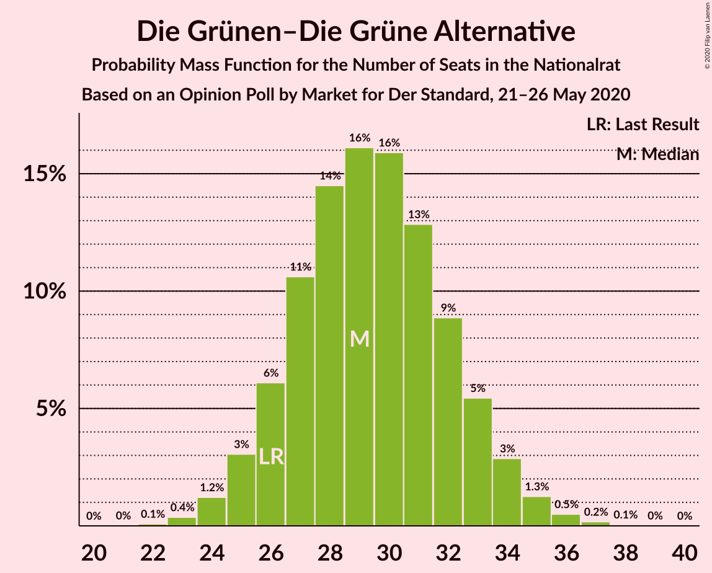
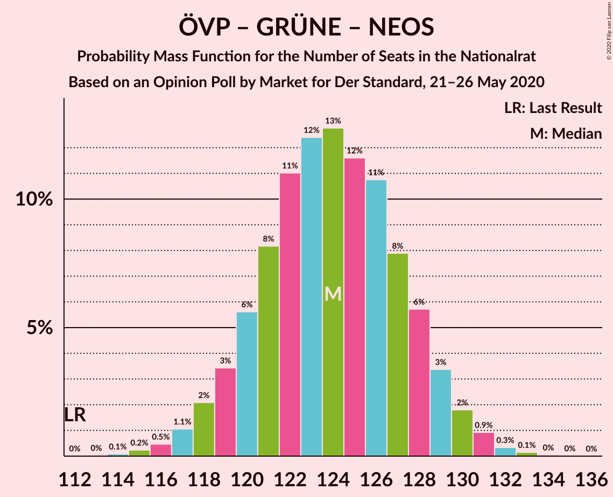
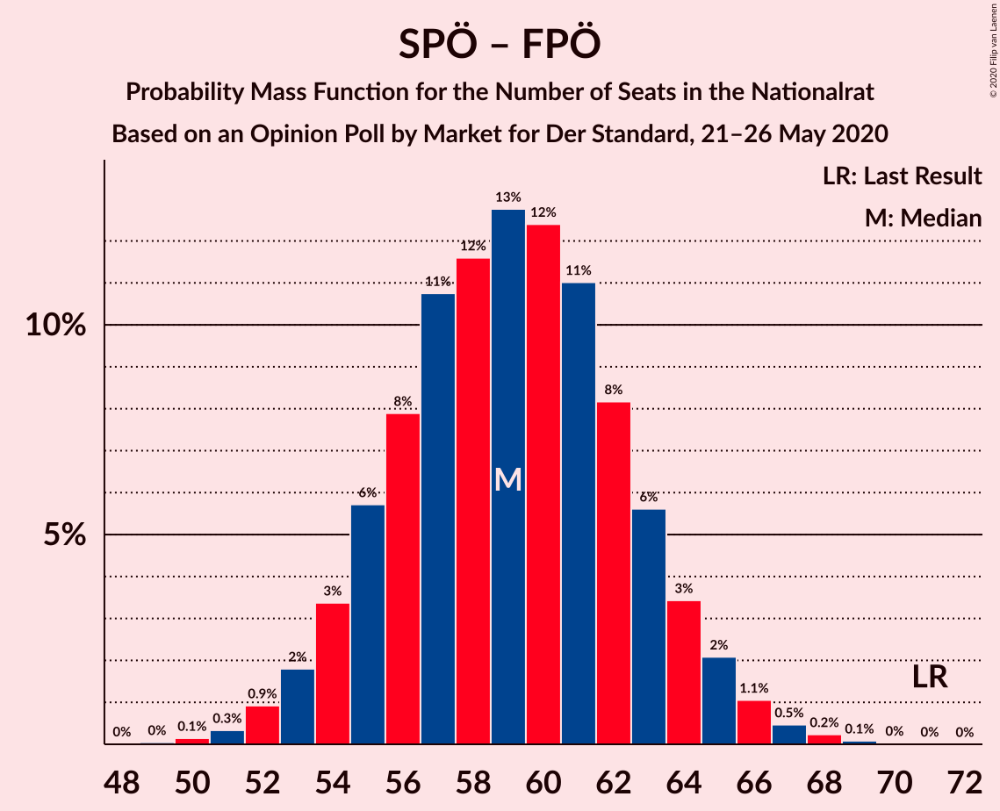

# Opinion Poll by Market for Der Standard, 21–26 May 2020

<a href="#voting-intentions">Voting Intentions</a> | <a href="#seats">Seats</a> | <a href="#coalitions">Coalitions</a> | <a href="#technical-information">Technical Information</a>

## Voting Intentions

### Confidence Intervals

| Party | Last Result | Poll Result | 80% Confidence Interval | 90% Confidence Interval | 95% Confidence Interval | 99% Confidence Interval |
|:-----:|:-----------:|:-----------:|:-----------------------:|:-----------------------:|:-----------------------:|:-----------------------:|
| Österreichische Volkspartei | 37.5% | 44.0% | 41.8–46.3% |41.2–46.9% |40.6–47.4% |39.6–48.5% |
| Sozialdemokratische Partei Österreichs | 21.2% | 20.0% | 18.3–21.9% |17.8–22.5% |17.4–22.9% |16.6–23.9% |
| Die Grünen–Die Grüne Alternative | 13.9% | 15.9% | 14.4–17.7% |13.9–18.2% |13.6–18.6% |12.9–19.5% |
| Freiheitliche Partei Österreichs | 16.2% | 12.0% | 10.6–13.6% |10.2–14.0% |9.9–14.4% |9.3–15.2% |
| NEOS–Das Neue Österreich und Liberales Forum | 8.1% | 7.0% | 6.0–8.3% |5.7–8.7% |5.5–9.0% |5.0–9.7% |

*Note:* The poll result column reflects the actual value used in the calculations. Published results may vary slightly, and in addition be rounded to fewer digits.

## Seats

### Confidence Intervals

| Party | Last Result | Median | 80% Confidence Interval | 90% Confidence Interval | 95% Confidence Interval | 99% Confidence Interval |
|:-----:|:-----------:|:------:|:-----------------------:|:-----------------------:|:-----------------------:|:-----------------------:|
| <a href="#österreichische-volkspartei">Österreichische Volkspartei</a> | 71 | 82 | 78–86 |76–87 |75–88 |73–90 |
| <a href="#sozialdemokratische-partei-österreichs">Sozialdemokratische Partei Österreichs</a> | 40 | 37 | 34–40 |33–42 |32–42 |30–44 |
| <a href="#die-grünen–die-grüne-alternative">Die Grünen–Die Grüne Alternative</a> | 26 | 29 | 26–33 |26–34 |25–34 |24–36 |
| <a href="#freiheitliche-partei-österreichs">Freiheitliche Partei Österreichs</a> | 31 | 22 | 19–25 |19–26 |18–27 |17–28 |
| <a href="#neos–das-neue-österreich-und-liberales-forum">NEOS–Das Neue Österreich und Liberales Forum</a> | 15 | 13 | 11–15 |10–16 |10–16 |9–17 |

### Österreichische Volkspartei

*For a full overview of the results for this party, see the [Österreichische Volkspartei](party-österreichischevolkspartei.html) page.*

| Number of Seats | Probability | Accumulated | Special Marks |
|:---------------:|:-----------:|:-----------:|:-------------:|
| 71 | 0.1% | 100% | Last Result |
| 72 | 0.2% | 99.9% |  |
| 73 | 0.3% | 99.8% |  |
| 74 | 0.6% | 99.4% |  |
| 75 | 2% | 98.8% |  |
| 76 | 3% | 97% |  |
| 77 | 4% | 94% |  |
| 78 | 6% | 90% |  |
| 79 | 11% | 85% |  |
| 80 | 13% | 74% |  |
| 81 | 10% | 60% |  |
| 82 | 9% | 51% | Median |
| 83 | 11% | 41% |  |
| 84 | 13% | 31% |  |
| 85 | 7% | 18% |  |
| 86 | 4% | 11% |  |
| 87 | 3% | 7% |  |
| 88 | 3% | 4% |  |
| 89 | 1.3% | 2% |  |
| 90 | 0.3% | 0.6% |  |
| 91 | 0.2% | 0.3% |  |
| 92 | 0.1% | 0.2% | Majority |
| 93 | 0% | 0.1% |  |
| 94 | 0% | 0% |  |

### Sozialdemokratische Partei Österreichs

*For a full overview of the results for this party, see the [Sozialdemokratische Partei Österreichs](party-sozialdemokratischeparteiösterreichs.html) page.*

| Number of Seats | Probability | Accumulated | Special Marks |
|:---------------:|:-----------:|:-----------:|:-------------:|
| 29 | 0.1% | 100% |  |
| 30 | 0.4% | 99.9% |  |
| 31 | 0.9% | 99.5% |  |
| 32 | 3% | 98.6% |  |
| 33 | 5% | 96% |  |
| 34 | 9% | 91% |  |
| 35 | 13% | 82% |  |
| 36 | 14% | 70% |  |
| 37 | 14% | 56% | Median |
| 38 | 15% | 42% |  |
| 39 | 9% | 27% |  |
| 40 | 8% | 18% | Last Result |
| 41 | 4% | 10% |  |
| 42 | 3% | 5% |  |
| 43 | 1.4% | 2% |  |
| 44 | 0.5% | 0.8% |  |
| 45 | 0.2% | 0.3% |  |
| 46 | 0.1% | 0.1% |  |
| 47 | 0% | 0% |  |

### Die Grünen–Die Grüne Alternative

*For a full overview of the results for this party, see the [Die Grünen–Die Grüne Alternative](party-diegrünen–diegrünealternative.html) page.*

| Number of Seats | Probability | Accumulated | Special Marks |
|:---------------:|:-----------:|:-----------:|:-------------:|
| 22 | 0.1% | 100% |  |
| 23 | 0.4% | 99.9% |  |
| 24 | 1.3% | 99.5% |  |
| 25 | 3% | 98% |  |
| 26 | 6% | 95% | Last Result |
| 27 | 10% | 90% |  |
| 28 | 14% | 80% |  |
| 29 | 16% | 66% | Median |
| 30 | 18% | 50% |  |
| 31 | 13% | 32% |  |
| 32 | 8% | 19% |  |
| 33 | 6% | 11% |  |
| 34 | 3% | 5% |  |
| 35 | 1.4% | 2% |  |
| 36 | 0.4% | 0.7% |  |
| 37 | 0.2% | 0.3% |  |
| 38 | 0.1% | 0.1% |  |
| 39 | 0% | 0% |  |

### Freiheitliche Partei Österreichs

*For a full overview of the results for this party, see the [Freiheitliche Partei Österreichs](party-freiheitlicheparteiösterreichs.html) page.*

| Number of Seats | Probability | Accumulated | Special Marks |
|:---------------:|:-----------:|:-----------:|:-------------:|
| 16 | 0.2% | 100% |  |
| 17 | 0.9% | 99.7% |  |
| 18 | 3% | 98.8% |  |
| 19 | 7% | 96% |  |
| 20 | 12% | 89% |  |
| 21 | 17% | 76% |  |
| 22 | 20% | 59% | Median |
| 23 | 14% | 39% |  |
| 24 | 12% | 25% |  |
| 25 | 8% | 13% |  |
| 26 | 3% | 5% |  |
| 27 | 2% | 3% |  |
| 28 | 0.6% | 0.8% |  |
| 29 | 0.1% | 0.2% |  |
| 30 | 0.1% | 0.1% |  |
| 31 | 0% | 0% | Last Result |

### NEOS–Das Neue Österreich und Liberales Forum

*For a full overview of the results for this party, see the [NEOS–Das Neue Österreich und Liberales Forum](party-neos–dasneueösterreichundliberalesforum.html) page.*

| Number of Seats | Probability | Accumulated | Special Marks |
|:---------------:|:-----------:|:-----------:|:-------------:|
| 8 | 0.2% | 100% |  |
| 9 | 2% | 99.8% |  |
| 10 | 5% | 98% |  |
| 11 | 14% | 93% |  |
| 12 | 23% | 78% |  |
| 13 | 20% | 55% | Median |
| 14 | 19% | 35% |  |
| 15 | 10% | 16% | Last Result |
| 16 | 4% | 6% |  |
| 17 | 2% | 2% |  |
| 18 | 0.3% | 0.5% |  |
| 19 | 0.1% | 0.1% |  |
| 20 | 0% | 0% |  |

## Coalitions

### Confidence Intervals

| Coalition | Last Result | Median | Majority? | 80% Confidence Interval | 90% Confidence Interval | 95% Confidence Interval | 99% Confidence Interval |
|:---------:|:-----------:|:------:|:---------:|:-----------------------:|:-----------------------:|:-----------------------:|:-----------------------:|
| Österreichische Volkspartei – Die Grünen–Die Grüne Alternative – NEOS–Das Neue Österreich und Liberales Forum | 112 | 124 | 100% | 120–128 | 119–129 | 118–130 | 116–132 |
| Österreichische Volkspartei – Sozialdemokratische Partei Österreichs | 111 | 119 | 100% | 115–123 | 113–124 | 113–125 | 111–127 |
| Österreichische Volkspartei – Die Grünen–Die Grüne Alternative | 97 | 111 | 100% | 107–115 | 106–116 | 105–118 | 103–119 |
| Österreichische Volkspartei – Freiheitliche Partei Österreichs | 102 | 104 | 100% | 100–108 | 98–109 | 97–110 | 95–112 |
| Österreichische Volkspartei – NEOS–Das Neue Österreich und Liberales Forum | 86 | 94 | 80% | 90–99 | 89–100 | 88–101 | 86–103 |
| Österreichische Volkspartei | 71 | 82 | 0.2% | 78–86 | 76–87 | 75–88 | 73–90 |
| Sozialdemokratische Partei Österreichs – Die Grünen–Die Grüne Alternative – NEOS–Das Neue Österreich und Liberales Forum | 81 | 79 | 0% | 75–83 | 74–85 | 73–86 | 71–88 |
| Sozialdemokratische Partei Österreichs – Die Grünen–Die Grüne Alternative | 66 | 66 | 0% | 62–70 | 61–72 | 60–73 | 59–74 |
| Sozialdemokratische Partei Österreichs – Freiheitliche Partei Österreichs | 71 | 59 | 0% | 55–63 | 54–64 | 53–65 | 51–67 |
| Sozialdemokratische Partei Österreichs | 40 | 37 | 0% | 34–40 | 33–42 | 32–42 | 30–44 |

### Österreichische Volkspartei – Die Grünen–Die Grüne Alternative – NEOS–Das Neue Österreich und Liberales Forum

| Number of Seats | Probability | Accumulated | Special Marks |
|:---------------:|:-----------:|:-----------:|:-------------:|
| 112 | 0% | 100% | Last Result |
| 113 | 0% | 100% |  |
| 114 | 0.1% | 100% |  |
| 115 | 0.2% | 99.9% |  |
| 116 | 0.4% | 99.6% |  |
| 117 | 1.3% | 99.2% |  |
| 118 | 2% | 98% |  |
| 119 | 4% | 96% |  |
| 120 | 4% | 92% |  |
| 121 | 7% | 88% |  |
| 122 | 12% | 80% |  |
| 123 | 14% | 69% |  |
| 124 | 13% | 55% | Median |
| 125 | 9% | 41% |  |
| 126 | 12% | 33% |  |
| 127 | 9% | 21% |  |
| 128 | 6% | 12% |  |
| 129 | 3% | 6% |  |
| 130 | 2% | 3% |  |
| 131 | 1.1% | 2% |  |
| 132 | 0.3% | 0.5% |  |
| 133 | 0.2% | 0.2% |  |
| 134 | 0.1% | 0.1% |  |
| 135 | 0% | 0% |  |

### Österreichische Volkspartei – Sozialdemokratische Partei Österreichs

| Number of Seats | Probability | Accumulated | Special Marks |
|:---------------:|:-----------:|:-----------:|:-------------:|
| 108 | 0% | 100% |  |
| 109 | 0.2% | 99.9% |  |
| 110 | 0.2% | 99.7% |  |
| 111 | 1.0% | 99.5% | Last Result |
| 112 | 0.8% | 98.6% |  |
| 113 | 3% | 98% |  |
| 114 | 3% | 95% |  |
| 115 | 10% | 92% |  |
| 116 | 5% | 82% |  |
| 117 | 16% | 77% |  |
| 118 | 8% | 61% |  |
| 119 | 16% | 53% | Median |
| 120 | 5% | 36% |  |
| 121 | 15% | 32% |  |
| 122 | 4% | 16% |  |
| 123 | 7% | 13% |  |
| 124 | 1.5% | 5% |  |
| 125 | 3% | 4% |  |
| 126 | 0.4% | 1.1% |  |
| 127 | 0.5% | 0.7% |  |
| 128 | 0% | 0.1% |  |
| 129 | 0.1% | 0.1% |  |
| 130 | 0% | 0% |  |

### Österreichische Volkspartei – Die Grünen–Die Grüne Alternative

| Number of Seats | Probability | Accumulated | Special Marks |
|:---------------:|:-----------:|:-----------:|:-------------:|
| 97 | 0% | 100% | Last Result |
| 98 | 0% | 100% |  |
| 99 | 0% | 100% |  |
| 100 | 0% | 100% |  |
| 101 | 0.1% | 99.9% |  |
| 102 | 0.2% | 99.8% |  |
| 103 | 0.5% | 99.6% |  |
| 104 | 1.3% | 99.1% |  |
| 105 | 2% | 98% |  |
| 106 | 4% | 96% |  |
| 107 | 5% | 92% |  |
| 108 | 7% | 86% |  |
| 109 | 10% | 80% |  |
| 110 | 13% | 70% |  |
| 111 | 11% | 57% | Median |
| 112 | 11% | 46% |  |
| 113 | 12% | 35% |  |
| 114 | 9% | 23% |  |
| 115 | 5% | 14% |  |
| 116 | 5% | 9% |  |
| 117 | 2% | 5% |  |
| 118 | 2% | 3% |  |
| 119 | 0.5% | 0.8% |  |
| 120 | 0.2% | 0.3% |  |
| 121 | 0.1% | 0.1% |  |
| 122 | 0% | 0% |  |

### Österreichische Volkspartei – Freiheitliche Partei Österreichs

| Number of Seats | Probability | Accumulated | Special Marks |
|:---------------:|:-----------:|:-----------:|:-------------:|
| 93 | 0.1% | 100% |  |
| 94 | 0.1% | 99.9% |  |
| 95 | 0.3% | 99.8% |  |
| 96 | 0.9% | 99.5% |  |
| 97 | 1.4% | 98.6% |  |
| 98 | 3% | 97% |  |
| 99 | 4% | 94% |  |
| 100 | 6% | 90% |  |
| 101 | 13% | 85% |  |
| 102 | 8% | 72% | Last Result |
| 103 | 12% | 64% |  |
| 104 | 11% | 52% | Median |
| 105 | 10% | 41% |  |
| 106 | 13% | 32% |  |
| 107 | 7% | 19% |  |
| 108 | 5% | 12% |  |
| 109 | 3% | 7% |  |
| 110 | 2% | 4% |  |
| 111 | 1.2% | 2% |  |
| 112 | 0.5% | 0.8% |  |
| 113 | 0.2% | 0.3% |  |
| 114 | 0.1% | 0.1% |  |
| 115 | 0% | 0% |  |

### Österreichische Volkspartei – NEOS–Das Neue Österreich und Liberales Forum

| Number of Seats | Probability | Accumulated | Special Marks |
|:---------------:|:-----------:|:-----------:|:-------------:|
| 84 | 0.1% | 100% |  |
| 85 | 0.2% | 99.9% |  |
| 86 | 0.4% | 99.7% | Last Result |
| 87 | 0.8% | 99.2% |  |
| 88 | 2% | 98% |  |
| 89 | 2% | 96% |  |
| 90 | 4% | 94% |  |
| 91 | 9% | 90% |  |
| 92 | 6% | 80% | Majority |
| 93 | 12% | 74% |  |
| 94 | 15% | 62% |  |
| 95 | 7% | 47% | Median |
| 96 | 14% | 40% |  |
| 97 | 9% | 26% |  |
| 98 | 6% | 17% |  |
| 99 | 5% | 11% |  |
| 100 | 2% | 6% |  |
| 101 | 2% | 4% |  |
| 102 | 1.1% | 2% |  |
| 103 | 0.4% | 0.7% |  |
| 104 | 0.1% | 0.3% |  |
| 105 | 0.1% | 0.1% |  |
| 106 | 0% | 0% |  |

### Österreichische Volkspartei

| Number of Seats | Probability | Accumulated | Special Marks |
|:---------------:|:-----------:|:-----------:|:-------------:|
| 71 | 0.1% | 100% | Last Result |
| 72 | 0.2% | 99.9% |  |
| 73 | 0.3% | 99.8% |  |
| 74 | 0.6% | 99.4% |  |
| 75 | 2% | 98.8% |  |
| 76 | 3% | 97% |  |
| 77 | 4% | 94% |  |
| 78 | 6% | 90% |  |
| 79 | 11% | 85% |  |
| 80 | 13% | 74% |  |
| 81 | 10% | 60% |  |
| 82 | 9% | 51% | Median |
| 83 | 11% | 41% |  |
| 84 | 13% | 31% |  |
| 85 | 7% | 18% |  |
| 86 | 4% | 11% |  |
| 87 | 3% | 7% |  |
| 88 | 3% | 4% |  |
| 89 | 1.3% | 2% |  |
| 90 | 0.3% | 0.6% |  |
| 91 | 0.2% | 0.3% |  |
| 92 | 0.1% | 0.2% | Majority |
| 93 | 0% | 0.1% |  |
| 94 | 0% | 0% |  |

### Sozialdemokratische Partei Österreichs – Die Grünen–Die Grüne Alternative – NEOS–Das Neue Österreich und Liberales Forum

| Number of Seats | Probability | Accumulated | Special Marks |
|:---------------:|:-----------:|:-----------:|:-------------:|
| 69 | 0.1% | 100% |  |
| 70 | 0.2% | 99.9% |  |
| 71 | 0.5% | 99.7% |  |
| 72 | 1.2% | 99.2% |  |
| 73 | 2% | 98% |  |
| 74 | 3% | 96% |  |
| 75 | 5% | 93% |  |
| 76 | 7% | 88% |  |
| 77 | 13% | 81% |  |
| 78 | 10% | 68% |  |
| 79 | 11% | 59% | Median |
| 80 | 12% | 48% |  |
| 81 | 8% | 36% | Last Result |
| 82 | 13% | 28% |  |
| 83 | 6% | 15% |  |
| 84 | 4% | 10% |  |
| 85 | 3% | 6% |  |
| 86 | 1.4% | 3% |  |
| 87 | 0.9% | 1.4% |  |
| 88 | 0.3% | 0.5% |  |
| 89 | 0.1% | 0.2% |  |
| 90 | 0.1% | 0.1% |  |
| 91 | 0% | 0% |  |

### Sozialdemokratische Partei Österreichs – Die Grünen–Die Grüne Alternative

| Number of Seats | Probability | Accumulated | Special Marks |
|:---------------:|:-----------:|:-----------:|:-------------:|
| 56 | 0% | 100% |  |
| 57 | 0.2% | 99.9% |  |
| 58 | 0.3% | 99.8% |  |
| 59 | 0.6% | 99.5% |  |
| 60 | 2% | 98.9% |  |
| 61 | 4% | 97% |  |
| 62 | 4% | 94% |  |
| 63 | 5% | 89% |  |
| 64 | 10% | 84% |  |
| 65 | 15% | 74% |  |
| 66 | 13% | 59% | Last Result, Median |
| 67 | 5% | 46% |  |
| 68 | 12% | 41% |  |
| 69 | 12% | 28% |  |
| 70 | 8% | 16% |  |
| 71 | 2% | 9% |  |
| 72 | 3% | 6% |  |
| 73 | 2% | 3% |  |
| 74 | 0.7% | 1.2% |  |
| 75 | 0.3% | 0.5% |  |
| 76 | 0.1% | 0.2% |  |
| 77 | 0.1% | 0.1% |  |
| 78 | 0% | 0% |  |

### Sozialdemokratische Partei Österreichs – Freiheitliche Partei Österreichs

| Number of Seats | Probability | Accumulated | Special Marks |
|:---------------:|:-----------:|:-----------:|:-------------:|
| 49 | 0.1% | 100% |  |
| 50 | 0.2% | 99.9% |  |
| 51 | 0.3% | 99.8% |  |
| 52 | 1.1% | 99.5% |  |
| 53 | 2% | 98% |  |
| 54 | 3% | 97% |  |
| 55 | 6% | 94% |  |
| 56 | 9% | 88% |  |
| 57 | 12% | 79% |  |
| 58 | 9% | 67% |  |
| 59 | 13% | 59% | Median |
| 60 | 14% | 45% |  |
| 61 | 12% | 31% |  |
| 62 | 7% | 20% |  |
| 63 | 4% | 12% |  |
| 64 | 4% | 8% |  |
| 65 | 2% | 4% |  |
| 66 | 1.3% | 2% |  |
| 67 | 0.4% | 0.8% |  |
| 68 | 0.2% | 0.4% |  |
| 69 | 0.1% | 0.1% |  |
| 70 | 0% | 0% |  |
| 71 | 0% | 0% | Last Result |

### Sozialdemokratische Partei Österreichs

| Number of Seats | Probability | Accumulated | Special Marks |
|:---------------:|:-----------:|:-----------:|:-------------:|
| 29 | 0.1% | 100% |  |
| 30 | 0.4% | 99.9% |  |
| 31 | 0.9% | 99.5% |  |
| 32 | 3% | 98.6% |  |
| 33 | 5% | 96% |  |
| 34 | 9% | 91% |  |
| 35 | 13% | 82% |  |
| 36 | 14% | 70% |  |
| 37 | 14% | 56% | Median |
| 38 | 15% | 42% |  |
| 39 | 9% | 27% |  |
| 40 | 8% | 18% | Last Result |
| 41 | 4% | 10% |  |
| 42 | 3% | 5% |  |
| 43 | 1.4% | 2% |  |
| 44 | 0.5% | 0.8% |  |
| 45 | 0.2% | 0.3% |  |
| 46 | 0.1% | 0.1% |  |
| 47 | 0% | 0% |  |

## Technical Information

### Opinion Poll

+ **Polling firm:** Market
+ **Commissioner(s):** Der Standard
+ **Fieldwork period:** 21–26 May 2020

### Calculations

+ **Sample size:** 809
+ **Simulations done:** 131,072
+ **Error estimate:** 0.66%

