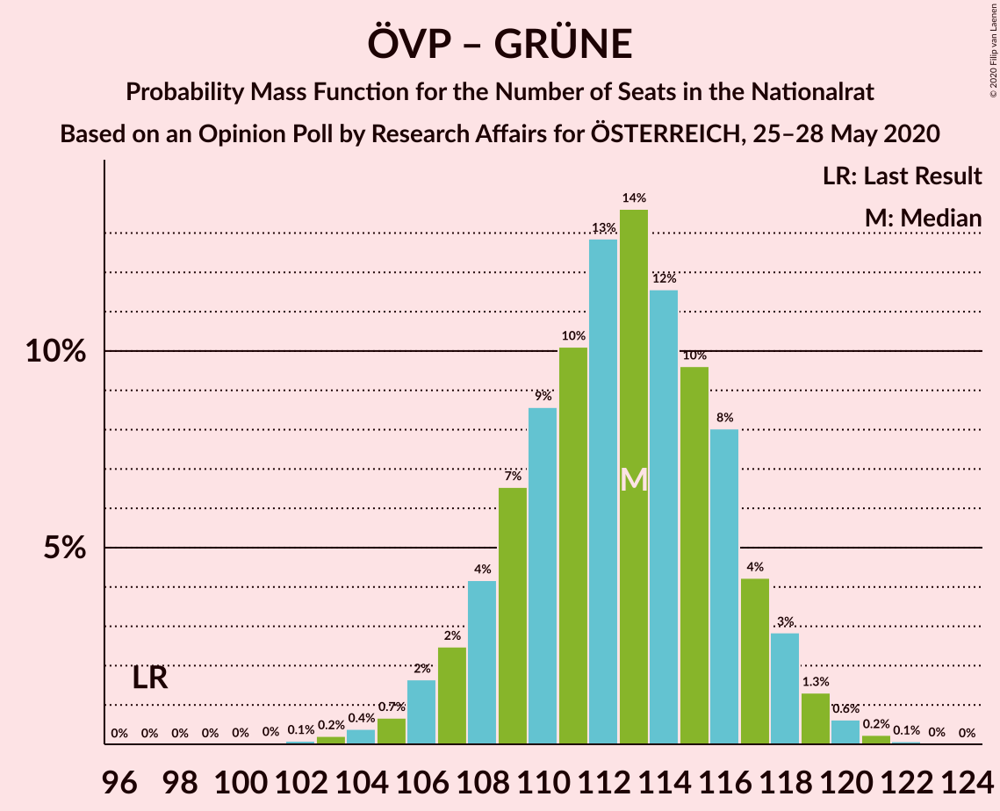
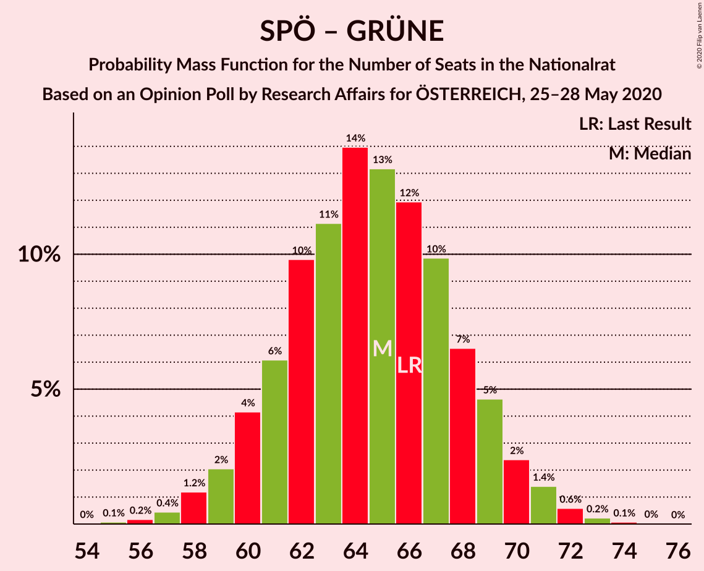

# Opinion Poll by Research Affairs for ÖSTERREICH, 25–28 May 2020

<a href="#voting-intentions">Voting Intentions</a> | <a href="#seats">Seats</a> | <a href="#coalitions">Coalitions</a> | <a href="#technical-information">Technical Information</a>

## Voting Intentions

### Confidence Intervals

| Party | Last Result | Poll Result | 80% Confidence Interval | 90% Confidence Interval | 95% Confidence Interval | 99% Confidence Interval |
|:-----:|:-----------:|:-----------:|:-----------------------:|:-----------------------:|:-----------------------:|:-----------------------:|
| Österreichische Volkspartei | 37.5% | 43.0% | 41.0–45.0% |40.4–45.6% |40.0–46.1% |39.0–47.1% |
| Sozialdemokratische Partei Österreichs | 21.2% | 18.0% | 16.5–19.6% |16.1–20.1% |15.7–20.5% |15.0–21.3% |
| Die Grünen–Die Grüne Alternative | 13.9% | 16.0% | 14.6–17.6% |14.2–18.0% |13.9–18.4% |13.2–19.2% |
| Freiheitliche Partei Österreichs | 16.2% | 12.0% | 10.8–13.4% |10.4–13.8% |10.1–14.2% |9.6–14.9% |
| NEOS–Das Neue Österreich und Liberales Forum | 8.1% | 7.0% | 6.1–8.2% |5.8–8.5% |5.6–8.8% |5.2–9.3% |
| Team HC Strache–Allianz für Österreich | 0.0% | 3.0% | 2.4–3.8% |2.2–4.1% |2.1–4.3% |1.9–4.7% |

*Note:* The poll result column reflects the actual value used in the calculations. Published results may vary slightly, and in addition be rounded to fewer digits.

## Seats

### Confidence Intervals

| Party | Last Result | Median | 80% Confidence Interval | 90% Confidence Interval | 95% Confidence Interval | 99% Confidence Interval |
|:-----:|:-----------:|:------:|:-----------------------:|:-----------------------:|:-----------------------:|:-----------------------:|
| <a href="#österreichische-volkspartei">Österreichische Volkspartei</a> | 71 | 82 | 78–86 |77–87 |76–88 |74–90 |
| <a href="#sozialdemokratische-partei-österreichs">Sozialdemokratische Partei Österreichs</a> | 40 | 34 | 31–37 |30–38 |30–39 |28–40 |
| <a href="#die-grünen–die-grüne-alternative">Die Grünen–Die Grüne Alternative</a> | 26 | 30 | 28–33 |27–34 |26–35 |25–36 |
| <a href="#freiheitliche-partei-österreichs">Freiheitliche Partei Österreichs</a> | 31 | 23 | 20–25 |19–26 |19–27 |18–28 |
| <a href="#neos–das-neue-österreich-und-liberales-forum">NEOS–Das Neue Österreich und Liberales Forum</a> | 15 | 13 | 11–15 |11–16 |10–16 |9–17 |
| <a href="#team-hc-strache–allianz-für-österreich">Team HC Strache–Allianz für Österreich</a> | 0 | 0 | 0 |0–7 |0–7 |0–8 |

### Österreichische Volkspartei

*For a full overview of the results for this party, see the [Österreichische Volkspartei](party-österreichischevolkspartei.html) page.*

| Number of Seats | Probability | Accumulated | Special Marks |
|:---------------:|:-----------:|:-----------:|:-------------:|
| 71 | 0% | 100% | Last Result |
| 72 | 0.1% | 100% |  |
| 73 | 0.2% | 99.9% |  |
| 74 | 0.4% | 99.7% |  |
| 75 | 0.8% | 99.3% |  |
| 76 | 2% | 98% |  |
| 77 | 3% | 97% |  |
| 78 | 6% | 94% |  |
| 79 | 8% | 88% |  |
| 80 | 10% | 80% |  |
| 81 | 11% | 71% |  |
| 82 | 13% | 60% | Median |
| 83 | 13% | 47% |  |
| 84 | 12% | 34% |  |
| 85 | 8% | 22% |  |
| 86 | 6% | 14% |  |
| 87 | 4% | 8% |  |
| 88 | 2% | 4% |  |
| 89 | 1.0% | 2% |  |
| 90 | 0.5% | 0.8% |  |
| 91 | 0.2% | 0.3% |  |
| 92 | 0.1% | 0.1% | Majority |
| 93 | 0% | 0% |  |

### Sozialdemokratische Partei Österreichs

*For a full overview of the results for this party, see the [Sozialdemokratische Partei Österreichs](party-sozialdemokratischeparteiösterreichs.html) page.*

| Number of Seats | Probability | Accumulated | Special Marks |
|:---------------:|:-----------:|:-----------:|:-------------:|
| 27 | 0.1% | 100% |  |
| 28 | 0.5% | 99.9% |  |
| 29 | 1.4% | 99.4% |  |
| 30 | 3% | 98% |  |
| 31 | 7% | 95% |  |
| 32 | 11% | 88% |  |
| 33 | 16% | 76% |  |
| 34 | 17% | 61% | Median |
| 35 | 15% | 44% |  |
| 36 | 12% | 29% |  |
| 37 | 9% | 17% |  |
| 38 | 5% | 8% |  |
| 39 | 2% | 4% |  |
| 40 | 1.0% | 1.4% | Last Result |
| 41 | 0.3% | 0.5% |  |
| 42 | 0.1% | 0.1% |  |
| 43 | 0% | 0% |  |

### Die Grünen–Die Grüne Alternative

*For a full overview of the results for this party, see the [Die Grünen–Die Grüne Alternative](party-diegrünen–diegrünealternative.html) page.*

| Number of Seats | Probability | Accumulated | Special Marks |
|:---------------:|:-----------:|:-----------:|:-------------:|
| 23 | 0% | 100% |  |
| 24 | 0.3% | 99.9% |  |
| 25 | 1.0% | 99.7% |  |
| 26 | 2% | 98.7% | Last Result |
| 27 | 6% | 96% |  |
| 28 | 11% | 91% |  |
| 29 | 15% | 79% |  |
| 30 | 17% | 65% | Median |
| 31 | 17% | 47% |  |
| 32 | 14% | 31% |  |
| 33 | 9% | 17% |  |
| 34 | 4% | 8% |  |
| 35 | 2% | 4% |  |
| 36 | 1.0% | 1.4% |  |
| 37 | 0.3% | 0.4% |  |
| 38 | 0.1% | 0.1% |  |
| 39 | 0% | 0% |  |

### Freiheitliche Partei Österreichs

*For a full overview of the results for this party, see the [Freiheitliche Partei Österreichs](party-freiheitlicheparteiösterreichs.html) page.*

| Number of Seats | Probability | Accumulated | Special Marks |
|:---------------:|:-----------:|:-----------:|:-------------:|
| 17 | 0.2% | 100% |  |
| 18 | 1.0% | 99.7% |  |
| 19 | 4% | 98.8% |  |
| 20 | 8% | 95% |  |
| 21 | 16% | 87% |  |
| 22 | 19% | 71% |  |
| 23 | 18% | 53% | Median |
| 24 | 17% | 35% |  |
| 25 | 10% | 19% |  |
| 26 | 5% | 8% |  |
| 27 | 2% | 3% |  |
| 28 | 0.7% | 1.0% |  |
| 29 | 0.3% | 0.3% |  |
| 30 | 0% | 0.1% |  |
| 31 | 0% | 0% | Last Result |

### NEOS–Das Neue Österreich und Liberales Forum

*For a full overview of the results for this party, see the [NEOS–Das Neue Österreich und Liberales Forum](party-neos–dasneueösterreichundliberalesforum.html) page.*

| Number of Seats | Probability | Accumulated | Special Marks |
|:---------------:|:-----------:|:-----------:|:-------------:|
| 9 | 0.5% | 100% |  |
| 10 | 3% | 99.4% |  |
| 11 | 11% | 96% |  |
| 12 | 21% | 85% |  |
| 13 | 26% | 64% | Median |
| 14 | 20% | 39% |  |
| 15 | 12% | 19% | Last Result |
| 16 | 5% | 7% |  |
| 17 | 1.5% | 2% |  |
| 18 | 0.4% | 0.5% |  |
| 19 | 0.1% | 0.1% |  |
| 20 | 0% | 0% |  |

### Team HC Strache–Allianz für Österreich

*For a full overview of the results for this party, see the [Team HC Strache–Allianz für Österreich](party-teamhcstrache–allianzfürösterreich.html) page.*

| Number of Seats | Probability | Accumulated | Special Marks |
|:---------------:|:-----------:|:-----------:|:-------------:|
| 0 | 95% | 100% | Last Result, Median |
| 1 | 0% | 5% |  |
| 2 | 0% | 5% |  |
| 3 | 0% | 5% |  |
| 4 | 0% | 5% |  |
| 5 | 0% | 5% |  |
| 6 | 0% | 5% |  |
| 7 | 3% | 5% |  |
| 8 | 2% | 2% |  |
| 9 | 0.3% | 0.3% |  |
| 10 | 0% | 0% |  |

## Coalitions

### Confidence Intervals

| Coalition | Last Result | Median | Majority? | 80% Confidence Interval | 90% Confidence Interval | 95% Confidence Interval | 99% Confidence Interval |
|:---------:|:-----------:|:------:|:---------:|:-----------------------:|:-----------------------:|:-----------------------:|:-----------------------:|
| Österreichische Volkspartei – Die Grünen–Die Grüne Alternative – NEOS–Das Neue Österreich und Liberales Forum | 112 | 126 | 100% | 122–129 | 121–130 | 119–131 | 117–133 |
| Österreichische Volkspartei – Sozialdemokratische Partei Österreichs | 111 | 116 | 100% | 112–120 | 111–121 | 110–122 | 108–124 |
| Österreichische Volkspartei – Die Grünen–Die Grüne Alternative | 97 | 113 | 100% | 109–116 | 107–118 | 106–118 | 104–120 |
| Österreichische Volkspartei – Freiheitliche Partei Österreichs | 102 | 105 | 100% | 101–109 | 100–110 | 99–111 | 96–113 |
| Österreichische Volkspartei – NEOS–Das Neue Österreich und Liberales Forum | 86 | 95 | 88% | 91–99 | 90–100 | 89–101 | 87–103 |
| Österreichische Volkspartei | 71 | 82 | 0.1% | 78–86 | 77–87 | 76–88 | 74–90 |
| Sozialdemokratische Partei Österreichs – Die Grünen–Die Grüne Alternative – NEOS–Das Neue Österreich und Liberales Forum | 81 | 78 | 0% | 74–82 | 73–83 | 72–84 | 70–85 |
| Sozialdemokratische Partei Österreichs – Die Grünen–Die Grüne Alternative | 66 | 65 | 0% | 61–68 | 60–69 | 59–70 | 57–72 |
| Sozialdemokratische Partei Österreichs – Freiheitliche Partei Österreichs | 71 | 57 | 0% | 53–61 | 52–62 | 51–62 | 50–64 |
| Sozialdemokratische Partei Österreichs | 40 | 34 | 0% | 31–37 | 30–38 | 30–39 | 28–40 |

### Österreichische Volkspartei – Die Grünen–Die Grüne Alternative – NEOS–Das Neue Österreich und Liberales Forum

| Number of Seats | Probability | Accumulated | Special Marks |
|:---------------:|:-----------:|:-----------:|:-------------:|
| 112 | 0% | 100% | Last Result |
| 113 | 0% | 100% |  |
| 114 | 0% | 100% |  |
| 115 | 0.1% | 99.9% |  |
| 116 | 0.2% | 99.8% |  |
| 117 | 0.4% | 99.7% |  |
| 118 | 0.8% | 99.3% |  |
| 119 | 1.1% | 98% |  |
| 120 | 2% | 97% |  |
| 121 | 4% | 95% |  |
| 122 | 6% | 91% |  |
| 123 | 8% | 85% |  |
| 124 | 11% | 78% |  |
| 125 | 13% | 67% | Median |
| 126 | 13% | 54% |  |
| 127 | 12% | 40% |  |
| 128 | 11% | 28% |  |
| 129 | 8% | 17% |  |
| 130 | 5% | 9% |  |
| 131 | 3% | 5% |  |
| 132 | 1.3% | 2% |  |
| 133 | 0.5% | 0.8% |  |
| 134 | 0.2% | 0.2% |  |
| 135 | 0.1% | 0.1% |  |
| 136 | 0% | 0% |  |

### Österreichische Volkspartei – Sozialdemokratische Partei Österreichs

| Number of Seats | Probability | Accumulated | Special Marks |
|:---------------:|:-----------:|:-----------:|:-------------:|
| 105 | 0% | 100% |  |
| 106 | 0.1% | 99.9% |  |
| 107 | 0.2% | 99.8% |  |
| 108 | 0.4% | 99.6% |  |
| 109 | 0.9% | 99.2% |  |
| 110 | 2% | 98% |  |
| 111 | 3% | 97% | Last Result |
| 112 | 4% | 94% |  |
| 113 | 7% | 90% |  |
| 114 | 9% | 83% |  |
| 115 | 11% | 74% |  |
| 116 | 13% | 63% | Median |
| 117 | 12% | 50% |  |
| 118 | 13% | 37% |  |
| 119 | 10% | 25% |  |
| 120 | 6% | 15% |  |
| 121 | 4% | 9% |  |
| 122 | 2% | 4% |  |
| 123 | 1.1% | 2% |  |
| 124 | 0.5% | 0.8% |  |
| 125 | 0.2% | 0.3% |  |
| 126 | 0.1% | 0.1% |  |
| 127 | 0% | 0% |  |

### Österreichische Volkspartei – Die Grünen–Die Grüne Alternative

| Number of Seats | Probability | Accumulated | Special Marks |
|:---------------:|:-----------:|:-----------:|:-------------:|
| 97 | 0% | 100% | Last Result |
| 98 | 0% | 100% |  |
| 99 | 0% | 100% |  |
| 100 | 0% | 100% |  |
| 101 | 0% | 100% |  |
| 102 | 0.1% | 99.9% |  |
| 103 | 0.2% | 99.8% |  |
| 104 | 0.4% | 99.6% |  |
| 105 | 0.7% | 99.2% |  |
| 106 | 2% | 98.6% |  |
| 107 | 2% | 97% |  |
| 108 | 4% | 94% |  |
| 109 | 7% | 90% |  |
| 110 | 9% | 84% |  |
| 111 | 10% | 75% |  |
| 112 | 13% | 65% | Median |
| 113 | 14% | 52% |  |
| 114 | 12% | 39% |  |
| 115 | 10% | 27% |  |
| 116 | 8% | 17% |  |
| 117 | 4% | 9% |  |
| 118 | 3% | 5% |  |
| 119 | 1.3% | 2% |  |
| 120 | 0.6% | 1.0% |  |
| 121 | 0.2% | 0.3% |  |
| 122 | 0.1% | 0.1% |  |
| 123 | 0% | 0% |  |

### Österreichische Volkspartei – Freiheitliche Partei Österreichs

| Number of Seats | Probability | Accumulated | Special Marks |
|:---------------:|:-----------:|:-----------:|:-------------:|
| 94 | 0.1% | 100% |  |
| 95 | 0.1% | 99.9% |  |
| 96 | 0.3% | 99.8% |  |
| 97 | 0.6% | 99.5% |  |
| 98 | 1.2% | 98.9% |  |
| 99 | 2% | 98% |  |
| 100 | 4% | 95% |  |
| 101 | 5% | 92% |  |
| 102 | 9% | 86% | Last Result |
| 103 | 9% | 77% |  |
| 104 | 13% | 68% |  |
| 105 | 12% | 55% | Median |
| 106 | 12% | 43% |  |
| 107 | 11% | 31% |  |
| 108 | 8% | 20% |  |
| 109 | 6% | 12% |  |
| 110 | 3% | 7% |  |
| 111 | 2% | 3% |  |
| 112 | 0.9% | 1.5% |  |
| 113 | 0.4% | 0.6% |  |
| 114 | 0.1% | 0.2% |  |
| 115 | 0.1% | 0.1% |  |
| 116 | 0% | 0% |  |

### Österreichische Volkspartei – NEOS–Das Neue Österreich und Liberales Forum

| Number of Seats | Probability | Accumulated | Special Marks |
|:---------------:|:-----------:|:-----------:|:-------------:|
| 84 | 0% | 100% |  |
| 85 | 0.1% | 99.9% |  |
| 86 | 0.2% | 99.9% | Last Result |
| 87 | 0.4% | 99.6% |  |
| 88 | 0.9% | 99.2% |  |
| 89 | 2% | 98% |  |
| 90 | 3% | 97% |  |
| 91 | 5% | 93% |  |
| 92 | 7% | 88% | Majority |
| 93 | 9% | 81% |  |
| 94 | 11% | 72% |  |
| 95 | 13% | 61% | Median |
| 96 | 13% | 49% |  |
| 97 | 12% | 36% |  |
| 98 | 8% | 23% |  |
| 99 | 7% | 16% |  |
| 100 | 4% | 8% |  |
| 101 | 2% | 4% |  |
| 102 | 1.4% | 2% |  |
| 103 | 0.5% | 0.9% |  |
| 104 | 0.2% | 0.3% |  |
| 105 | 0.1% | 0.1% |  |
| 106 | 0% | 0% |  |

### Österreichische Volkspartei

| Number of Seats | Probability | Accumulated | Special Marks |
|:---------------:|:-----------:|:-----------:|:-------------:|
| 71 | 0% | 100% | Last Result |
| 72 | 0.1% | 100% |  |
| 73 | 0.2% | 99.9% |  |
| 74 | 0.4% | 99.7% |  |
| 75 | 0.8% | 99.3% |  |
| 76 | 2% | 98% |  |
| 77 | 3% | 97% |  |
| 78 | 6% | 94% |  |
| 79 | 8% | 88% |  |
| 80 | 10% | 80% |  |
| 81 | 11% | 71% |  |
| 82 | 13% | 60% | Median |
| 83 | 13% | 47% |  |
| 84 | 12% | 34% |  |
| 85 | 8% | 22% |  |
| 86 | 6% | 14% |  |
| 87 | 4% | 8% |  |
| 88 | 2% | 4% |  |
| 89 | 1.0% | 2% |  |
| 90 | 0.5% | 0.8% |  |
| 91 | 0.2% | 0.3% |  |
| 92 | 0.1% | 0.1% | Majority |
| 93 | 0% | 0% |  |

### Sozialdemokratische Partei Österreichs – Die Grünen–Die Grüne Alternative – NEOS–Das Neue Österreich und Liberales Forum

| Number of Seats | Probability | Accumulated | Special Marks |
|:---------------:|:-----------:|:-----------:|:-------------:|
| 68 | 0.1% | 100% |  |
| 69 | 0.3% | 99.8% |  |
| 70 | 0.6% | 99.6% |  |
| 71 | 1.2% | 99.0% |  |
| 72 | 2% | 98% |  |
| 73 | 4% | 96% |  |
| 74 | 6% | 92% |  |
| 75 | 8% | 85% |  |
| 76 | 12% | 77% |  |
| 77 | 13% | 65% | Median |
| 78 | 12% | 52% |  |
| 79 | 13% | 40% |  |
| 80 | 9% | 27% |  |
| 81 | 8% | 19% | Last Result |
| 82 | 5% | 11% |  |
| 83 | 3% | 6% |  |
| 84 | 2% | 3% |  |
| 85 | 0.7% | 1.2% |  |
| 86 | 0.3% | 0.5% |  |
| 87 | 0.1% | 0.2% |  |
| 88 | 0% | 0.1% |  |
| 89 | 0% | 0% |  |

### Sozialdemokratische Partei Österreichs – Die Grünen–Die Grüne Alternative

| Number of Seats | Probability | Accumulated | Special Marks |
|:---------------:|:-----------:|:-----------:|:-------------:|
| 55 | 0.1% | 100% |  |
| 56 | 0.2% | 99.9% |  |
| 57 | 0.4% | 99.7% |  |
| 58 | 1.2% | 99.3% |  |
| 59 | 2% | 98% |  |
| 60 | 4% | 96% |  |
| 61 | 6% | 92% |  |
| 62 | 10% | 86% |  |
| 63 | 11% | 76% |  |
| 64 | 14% | 65% | Median |
| 65 | 13% | 51% |  |
| 66 | 12% | 38% | Last Result |
| 67 | 10% | 26% |  |
| 68 | 7% | 16% |  |
| 69 | 5% | 9% |  |
| 70 | 2% | 5% |  |
| 71 | 1.4% | 2% |  |
| 72 | 0.6% | 0.9% |  |
| 73 | 0.2% | 0.3% |  |
| 74 | 0.1% | 0.1% |  |
| 75 | 0% | 0% |  |

### Sozialdemokratische Partei Österreichs – Freiheitliche Partei Österreichs

| Number of Seats | Probability | Accumulated | Special Marks |
|:---------------:|:-----------:|:-----------:|:-------------:|
| 48 | 0.1% | 100% |  |
| 49 | 0.3% | 99.9% |  |
| 50 | 0.7% | 99.6% |  |
| 51 | 2% | 98.9% |  |
| 52 | 3% | 97% |  |
| 53 | 5% | 94% |  |
| 54 | 9% | 89% |  |
| 55 | 12% | 80% |  |
| 56 | 13% | 69% |  |
| 57 | 14% | 56% | Median |
| 58 | 13% | 42% |  |
| 59 | 11% | 29% |  |
| 60 | 7% | 18% |  |
| 61 | 5% | 11% |  |
| 62 | 3% | 5% |  |
| 63 | 1.5% | 2% |  |
| 64 | 0.6% | 1.0% |  |
| 65 | 0.3% | 0.4% |  |
| 66 | 0.1% | 0.1% |  |
| 67 | 0% | 0% |  |
| 68 | 0% | 0% |  |
| 69 | 0% | 0% |  |
| 70 | 0% | 0% |  |
| 71 | 0% | 0% | Last Result |

### Sozialdemokratische Partei Österreichs

| Number of Seats | Probability | Accumulated | Special Marks |
|:---------------:|:-----------:|:-----------:|:-------------:|
| 27 | 0.1% | 100% |  |
| 28 | 0.5% | 99.9% |  |
| 29 | 1.4% | 99.4% |  |
| 30 | 3% | 98% |  |
| 31 | 7% | 95% |  |
| 32 | 11% | 88% |  |
| 33 | 16% | 76% |  |
| 34 | 17% | 61% | Median |
| 35 | 15% | 44% |  |
| 36 | 12% | 29% |  |
| 37 | 9% | 17% |  |
| 38 | 5% | 8% |  |
| 39 | 2% | 4% |  |
| 40 | 1.0% | 1.4% | Last Result |
| 41 | 0.3% | 0.5% |  |
| 42 | 0.1% | 0.1% |  |
| 43 | 0% | 0% |  |

## Technical Information

### Opinion Poll

+ **Polling firm:** Research Affairs
+ **Commissioner(s):** ÖSTERREICH
+ **Fieldwork period:** 25–28 May 2020

### Calculations

+ **Sample size:** 1000
+ **Simulations done:** 1,048,576
+ **Error estimate:** 0.81%

