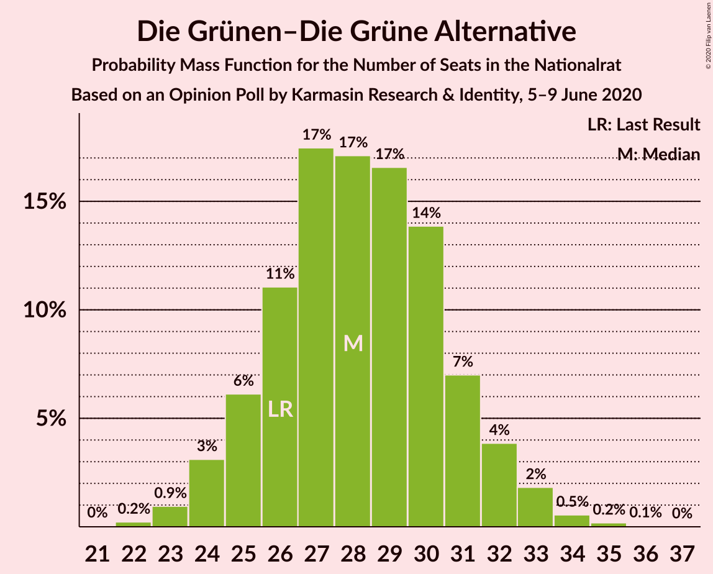
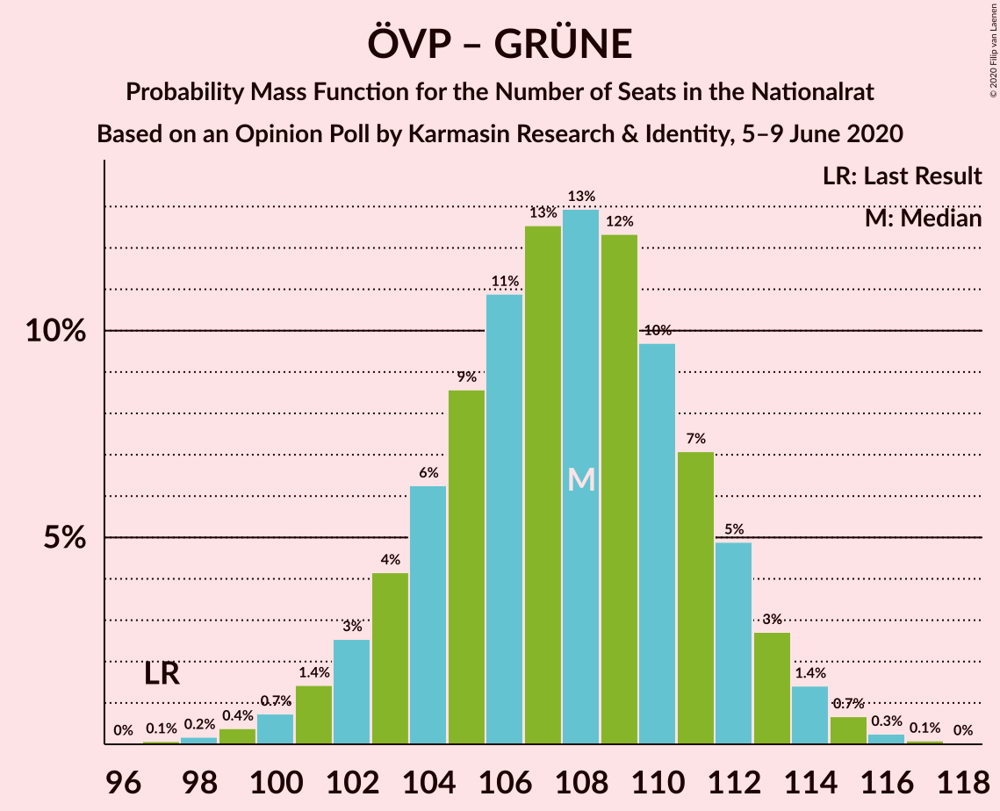
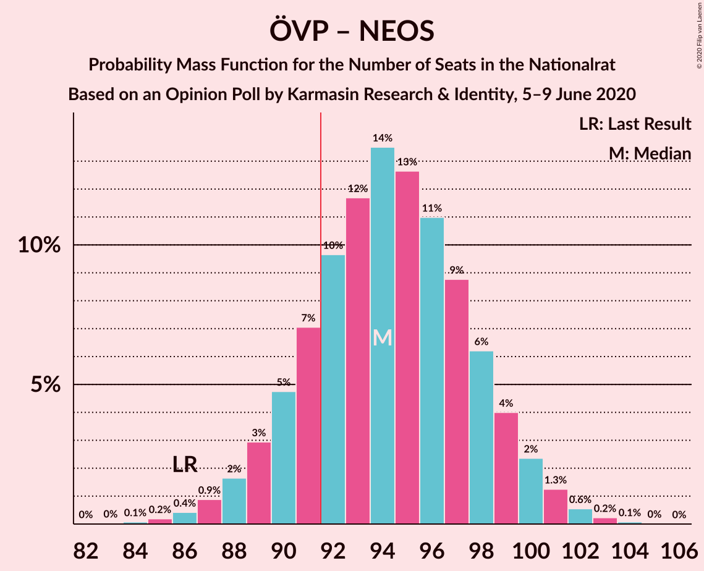

# Opinion Poll by Karmasin Research & Identity, 5–9 June 2020

<a href="#voting-intentions">Voting Intentions</a> | <a href="#seats">Seats</a> | <a href="#coalitions">Coalitions</a> | <a href="#technical-information">Technical Information</a>

## Voting Intentions

### Confidence Intervals

| Party | Last Result | Poll Result | 80% Confidence Interval | 90% Confidence Interval | 95% Confidence Interval | 99% Confidence Interval |
|:-----:|:-----------:|:-----------:|:-----------------------:|:-----------------------:|:-----------------------:|:-----------------------:|
| Österreichische Volkspartei | 37.5% | 42.0% | 40.0–44.0% |39.5–44.6% |39.0–45.1% |38.0–46.1% |
| Sozialdemokratische Partei Österreichs | 21.2% | 19.0% | 17.5–20.7% |17.1–21.1% |16.7–21.6% |16.0–22.4% |
| Die Grünen–Die Grüne Alternative | 13.9% | 15.0% | 13.6–16.5% |13.2–17.0% |12.9–17.4% |12.3–18.1% |
| Freiheitliche Partei Österreichs | 16.2% | 13.0% | 11.7–14.5% |11.4–14.9% |11.1–15.2% |10.5–16.0% |
| NEOS–Das Neue Österreich und Liberales Forum | 8.1% | 8.0% | 7.0–9.2% |6.7–9.6% |6.5–9.9% |6.0–10.5% |

*Note:* The poll result column reflects the actual value used in the calculations. Published results may vary slightly, and in addition be rounded to fewer digits.

## Seats

### Confidence Intervals

| Party | Last Result | Median | 80% Confidence Interval | 90% Confidence Interval | 95% Confidence Interval | 99% Confidence Interval |
|:-----:|:-----------:|:------:|:-----------------------:|:-----------------------:|:-----------------------:|:-----------------------:|
| <a href="#österreichische-volkspartei">Österreichische Volkspartei</a> | 71 | 79 | 75–83 |74–84 |73–85 |72–87 |
| <a href="#sozialdemokratische-partei-österreichs">Sozialdemokratische Partei Österreichs</a> | 40 | 36 | 33–39 |32–40 |31–40 |30–42 |
| <a href="#die-grünen–die-grüne-alternative">Die Grünen–Die Grüne Alternative</a> | 26 | 28 | 26–31 |25–32 |24–33 |23–34 |
| <a href="#freiheitliche-partei-österreichs">Freiheitliche Partei Österreichs</a> | 31 | 24 | 22–27 |21–28 |21–28 |19–30 |
| <a href="#neos–das-neue-österreich-und-liberales-forum">NEOS–Das Neue Österreich und Liberales Forum</a> | 15 | 15 | 13–17 |12–18 |12–18 |11–19 |

### Österreichische Volkspartei

*For a full overview of the results for this party, see the [Österreichische Volkspartei](party-österreichischevolkspartei.html) page.*

| Number of Seats | Probability | Accumulated | Special Marks |
|:---------------:|:-----------:|:-----------:|:-------------:|
| 69 | 0% | 100% |  |
| 70 | 0.1% | 99.9% |  |
| 71 | 0.3% | 99.8% | Last Result |
| 72 | 0.7% | 99.5% |  |
| 73 | 2% | 98.9% |  |
| 74 | 3% | 97% |  |
| 75 | 5% | 94% |  |
| 76 | 7% | 90% |  |
| 77 | 10% | 83% |  |
| 78 | 9% | 73% |  |
| 79 | 15% | 64% | Median |
| 80 | 14% | 49% |  |
| 81 | 12% | 35% |  |
| 82 | 7% | 23% |  |
| 83 | 7% | 16% |  |
| 84 | 4% | 8% |  |
| 85 | 3% | 5% |  |
| 86 | 1.1% | 2% |  |
| 87 | 0.6% | 1.0% |  |
| 88 | 0.3% | 0.4% |  |
| 89 | 0.1% | 0.1% |  |
| 90 | 0% | 0% |  |

### Sozialdemokratische Partei Österreichs

*For a full overview of the results for this party, see the [Sozialdemokratische Partei Österreichs](party-sozialdemokratischeparteiösterreichs.html) page.*

| Number of Seats | Probability | Accumulated | Special Marks |
|:---------------:|:-----------:|:-----------:|:-------------:|
| 28 | 0.1% | 100% |  |
| 29 | 0.3% | 99.9% |  |
| 30 | 0.8% | 99.7% |  |
| 31 | 2% | 98.9% |  |
| 32 | 5% | 96% |  |
| 33 | 9% | 91% |  |
| 34 | 13% | 82% |  |
| 35 | 17% | 69% |  |
| 36 | 16% | 52% | Median |
| 37 | 14% | 36% |  |
| 38 | 9% | 22% |  |
| 39 | 7% | 13% |  |
| 40 | 3% | 6% | Last Result |
| 41 | 1.3% | 2% |  |
| 42 | 0.8% | 1.1% |  |
| 43 | 0.2% | 0.3% |  |
| 44 | 0.1% | 0.1% |  |
| 45 | 0% | 0% |  |

### Die Grünen–Die Grüne Alternative

*For a full overview of the results for this party, see the [Die Grünen–Die Grüne Alternative](party-diegrünen–diegrünealternative.html) page.*

| Number of Seats | Probability | Accumulated | Special Marks |
|:---------------:|:-----------:|:-----------:|:-------------:|
| 21 | 0.1% | 100% |  |
| 22 | 0.1% | 99.9% |  |
| 23 | 1.2% | 99.8% |  |
| 24 | 3% | 98.6% |  |
| 25 | 3% | 95% |  |
| 26 | 14% | 92% | Last Result |
| 27 | 19% | 78% |  |
| 28 | 10% | 59% | Median |
| 29 | 23% | 49% |  |
| 30 | 14% | 26% |  |
| 31 | 4% | 12% |  |
| 32 | 5% | 8% |  |
| 33 | 2% | 3% |  |
| 34 | 0.3% | 0.6% |  |
| 35 | 0.3% | 0.3% |  |
| 36 | 0.1% | 0.1% |  |
| 37 | 0% | 0% |  |

### Freiheitliche Partei Österreichs

*For a full overview of the results for this party, see the [Freiheitliche Partei Österreichs](party-freiheitlicheparteiösterreichs.html) page.*

| Number of Seats | Probability | Accumulated | Special Marks |
|:---------------:|:-----------:|:-----------:|:-------------:|
| 18 | 0.1% | 100% |  |
| 19 | 0.5% | 99.9% |  |
| 20 | 2% | 99.4% |  |
| 21 | 5% | 98% |  |
| 22 | 11% | 93% |  |
| 23 | 14% | 81% |  |
| 24 | 20% | 68% | Median |
| 25 | 20% | 48% |  |
| 26 | 13% | 28% |  |
| 27 | 8% | 15% |  |
| 28 | 4% | 7% |  |
| 29 | 2% | 2% |  |
| 30 | 0.5% | 0.7% |  |
| 31 | 0.2% | 0.2% | Last Result |
| 32 | 0% | 0% |  |

### NEOS–Das Neue Österreich und Liberales Forum

*For a full overview of the results for this party, see the [NEOS–Das Neue Österreich und Liberales Forum](party-neos–dasneueösterreichundliberalesforum.html) page.*

| Number of Seats | Probability | Accumulated | Special Marks |
|:---------------:|:-----------:|:-----------:|:-------------:|
| 10 | 0.2% | 100% |  |
| 11 | 1.2% | 99.8% |  |
| 12 | 5% | 98.6% |  |
| 13 | 14% | 94% |  |
| 14 | 22% | 80% |  |
| 15 | 22% | 58% | Last Result, Median |
| 16 | 19% | 35% |  |
| 17 | 11% | 17% |  |
| 18 | 4% | 6% |  |
| 19 | 1.4% | 2% |  |
| 20 | 0.4% | 0.5% |  |
| 21 | 0.1% | 0.1% |  |
| 22 | 0% | 0% |  |

## Coalitions

### Confidence Intervals

| Coalition | Last Result | Median | Majority? | 80% Confidence Interval | 90% Confidence Interval | 95% Confidence Interval | 99% Confidence Interval |
|:---------:|:-----------:|:------:|:---------:|:-----------------------:|:-----------------------:|:-----------------------:|:-----------------------:|
| Österreichische Volkspartei – Die Grünen–Die Grüne Alternative – NEOS–Das Neue Österreich und Liberales Forum | 112 | 123 | 100% | 119–126 | 117–127 | 116–128 | 114–130 |
| Österreichische Volkspartei – Sozialdemokratische Partei Österreichs | 111 | 115 | 100% | 111–119 | 110–120 | 109–121 | 107–123 |
| Österreichische Volkspartei – Die Grünen–Die Grüne Alternative | 97 | 108 | 100% | 103–112 | 102–112 | 101–114 | 99–115 |
| Österreichische Volkspartei – Freiheitliche Partei Österreichs | 102 | 104 | 100% | 100–108 | 99–109 | 97–110 | 95–112 |
| Österreichische Volkspartei – NEOS–Das Neue Österreich und Liberales Forum | 86 | 94 | 83% | 90–98 | 89–99 | 88–100 | 86–102 |
| Sozialdemokratische Partei Österreichs – Die Grünen–Die Grüne Alternative – NEOS–Das Neue Österreich und Liberales Forum | 81 | 79 | 0% | 75–83 | 74–84 | 73–85 | 71–87 |
| Österreichische Volkspartei | 71 | 79 | 0% | 75–83 | 74–84 | 73–85 | 72–87 |
| Sozialdemokratische Partei Österreichs – Die Grünen–Die Grüne Alternative | 66 | 64 | 0% | 60–68 | 59–69 | 58–70 | 56–71 |
| Sozialdemokratische Partei Österreichs – Freiheitliche Partei Österreichs | 71 | 60 | 0% | 56–64 | 55–65 | 55–66 | 53–68 |
| Sozialdemokratische Partei Österreichs | 40 | 36 | 0% | 33–39 | 32–40 | 31–40 | 30–42 |

### Österreichische Volkspartei – Die Grünen–Die Grüne Alternative – NEOS–Das Neue Österreich und Liberales Forum

| Number of Seats | Probability | Accumulated | Special Marks |
|:---------------:|:-----------:|:-----------:|:-------------:|
| 111 | 0% | 100% |  |
| 112 | 0.1% | 99.9% | Last Result |
| 113 | 0.2% | 99.8% |  |
| 114 | 0.4% | 99.6% |  |
| 115 | 0.8% | 99.2% |  |
| 116 | 1.5% | 98% |  |
| 117 | 3% | 97% |  |
| 118 | 3% | 94% |  |
| 119 | 7% | 91% |  |
| 120 | 8% | 84% |  |
| 121 | 12% | 76% |  |
| 122 | 11% | 64% | Median |
| 123 | 15% | 53% |  |
| 124 | 11% | 38% |  |
| 125 | 11% | 26% |  |
| 126 | 7% | 15% |  |
| 127 | 5% | 9% |  |
| 128 | 2% | 4% |  |
| 129 | 1.0% | 2% |  |
| 130 | 0.5% | 0.6% |  |
| 131 | 0.1% | 0.2% |  |
| 132 | 0% | 0.1% |  |
| 133 | 0% | 0% |  |

### Österreichische Volkspartei – Sozialdemokratische Partei Österreichs

| Number of Seats | Probability | Accumulated | Special Marks |
|:---------------:|:-----------:|:-----------:|:-------------:|
| 104 | 0.1% | 100% |  |
| 105 | 0.1% | 99.9% |  |
| 106 | 0.2% | 99.8% |  |
| 107 | 0.5% | 99.6% |  |
| 108 | 1.1% | 99.1% |  |
| 109 | 2% | 98% |  |
| 110 | 4% | 96% |  |
| 111 | 4% | 92% | Last Result |
| 112 | 8% | 88% |  |
| 113 | 8% | 80% |  |
| 114 | 16% | 73% |  |
| 115 | 11% | 57% | Median |
| 116 | 15% | 46% |  |
| 117 | 11% | 31% |  |
| 118 | 7% | 20% |  |
| 119 | 5% | 13% |  |
| 120 | 4% | 8% |  |
| 121 | 2% | 4% |  |
| 122 | 1.0% | 2% |  |
| 123 | 0.4% | 0.6% |  |
| 124 | 0.1% | 0.2% |  |
| 125 | 0.1% | 0.1% |  |
| 126 | 0% | 0% |  |

### Österreichische Volkspartei – Die Grünen–Die Grüne Alternative

| Number of Seats | Probability | Accumulated | Special Marks |
|:---------------:|:-----------:|:-----------:|:-------------:|
| 96 | 0% | 100% |  |
| 97 | 0.1% | 99.9% | Last Result |
| 98 | 0.1% | 99.8% |  |
| 99 | 0.3% | 99.7% |  |
| 100 | 0.9% | 99.4% |  |
| 101 | 1.3% | 98% |  |
| 102 | 3% | 97% |  |
| 103 | 5% | 95% |  |
| 104 | 6% | 90% |  |
| 105 | 7% | 84% |  |
| 106 | 14% | 77% |  |
| 107 | 9% | 63% | Median |
| 108 | 15% | 55% |  |
| 109 | 13% | 40% |  |
| 110 | 10% | 26% |  |
| 111 | 5% | 17% |  |
| 112 | 6% | 11% |  |
| 113 | 2% | 5% |  |
| 114 | 1.5% | 3% |  |
| 115 | 0.7% | 1.1% |  |
| 116 | 0.3% | 0.4% |  |
| 117 | 0.1% | 0.1% |  |
| 118 | 0% | 0.1% |  |
| 119 | 0% | 0% |  |

### Österreichische Volkspartei – Freiheitliche Partei Österreichs

| Number of Seats | Probability | Accumulated | Special Marks |
|:---------------:|:-----------:|:-----------:|:-------------:|
| 93 | 0.1% | 100% |  |
| 94 | 0.2% | 99.9% |  |
| 95 | 0.4% | 99.7% |  |
| 96 | 0.6% | 99.4% |  |
| 97 | 1.3% | 98.8% |  |
| 98 | 2% | 97% |  |
| 99 | 3% | 95% |  |
| 100 | 6% | 92% |  |
| 101 | 6% | 85% |  |
| 102 | 13% | 79% | Last Result |
| 103 | 11% | 66% | Median |
| 104 | 14% | 55% |  |
| 105 | 11% | 40% |  |
| 106 | 9% | 29% |  |
| 107 | 9% | 20% |  |
| 108 | 6% | 11% |  |
| 109 | 3% | 6% |  |
| 110 | 2% | 3% |  |
| 111 | 0.6% | 1.2% |  |
| 112 | 0.3% | 0.6% |  |
| 113 | 0.2% | 0.2% |  |
| 114 | 0% | 0.1% |  |
| 115 | 0% | 0% |  |

### Österreichische Volkspartei – NEOS–Das Neue Österreich und Liberales Forum

| Number of Seats | Probability | Accumulated | Special Marks |
|:---------------:|:-----------:|:-----------:|:-------------:|
| 83 | 0% | 100% |  |
| 84 | 0.1% | 99.9% |  |
| 85 | 0.2% | 99.9% |  |
| 86 | 0.3% | 99.6% | Last Result |
| 87 | 0.9% | 99.3% |  |
| 88 | 2% | 98% |  |
| 89 | 3% | 97% |  |
| 90 | 5% | 93% |  |
| 91 | 6% | 88% |  |
| 92 | 10% | 83% | Majority |
| 93 | 10% | 72% |  |
| 94 | 13% | 62% | Median |
| 95 | 14% | 49% |  |
| 96 | 13% | 35% |  |
| 97 | 8% | 22% |  |
| 98 | 5% | 14% |  |
| 99 | 4% | 9% |  |
| 100 | 2% | 4% |  |
| 101 | 0.9% | 2% |  |
| 102 | 0.6% | 1.0% |  |
| 103 | 0.3% | 0.4% |  |
| 104 | 0.1% | 0.1% |  |
| 105 | 0% | 0% |  |

### Sozialdemokratische Partei Österreichs – Die Grünen–Die Grüne Alternative – NEOS–Das Neue Österreich und Liberales Forum

| Number of Seats | Probability | Accumulated | Special Marks |
|:---------------:|:-----------:|:-----------:|:-------------:|
| 69 | 0.1% | 100% |  |
| 70 | 0.3% | 99.9% |  |
| 71 | 0.5% | 99.6% |  |
| 72 | 1.0% | 99.1% |  |
| 73 | 2% | 98% |  |
| 74 | 3% | 96% |  |
| 75 | 6% | 93% |  |
| 76 | 10% | 86% |  |
| 77 | 9% | 77% |  |
| 78 | 12% | 67% |  |
| 79 | 14% | 55% | Median |
| 80 | 11% | 41% |  |
| 81 | 13% | 30% | Last Result |
| 82 | 6% | 17% |  |
| 83 | 6% | 12% |  |
| 84 | 3% | 6% |  |
| 85 | 2% | 3% |  |
| 86 | 0.8% | 1.3% |  |
| 87 | 0.3% | 0.5% |  |
| 88 | 0.2% | 0.2% |  |
| 89 | 0% | 0.1% |  |
| 90 | 0% | 0% |  |

### Österreichische Volkspartei

| Number of Seats | Probability | Accumulated | Special Marks |
|:---------------:|:-----------:|:-----------:|:-------------:|
| 69 | 0% | 100% |  |
| 70 | 0.1% | 99.9% |  |
| 71 | 0.3% | 99.8% | Last Result |
| 72 | 0.7% | 99.5% |  |
| 73 | 2% | 98.9% |  |
| 74 | 3% | 97% |  |
| 75 | 5% | 94% |  |
| 76 | 7% | 90% |  |
| 77 | 10% | 83% |  |
| 78 | 9% | 73% |  |
| 79 | 15% | 64% | Median |
| 80 | 14% | 49% |  |
| 81 | 12% | 35% |  |
| 82 | 7% | 23% |  |
| 83 | 7% | 16% |  |
| 84 | 4% | 8% |  |
| 85 | 3% | 5% |  |
| 86 | 1.1% | 2% |  |
| 87 | 0.6% | 1.0% |  |
| 88 | 0.3% | 0.4% |  |
| 89 | 0.1% | 0.1% |  |
| 90 | 0% | 0% |  |

### Sozialdemokratische Partei Österreichs – Die Grünen–Die Grüne Alternative

| Number of Seats | Probability | Accumulated | Special Marks |
|:---------------:|:-----------:|:-----------:|:-------------:|
| 54 | 0% | 100% |  |
| 55 | 0.1% | 99.9% |  |
| 56 | 0.3% | 99.8% |  |
| 57 | 0.9% | 99.5% |  |
| 58 | 2% | 98.6% |  |
| 59 | 3% | 97% |  |
| 60 | 6% | 94% |  |
| 61 | 7% | 88% |  |
| 62 | 12% | 81% |  |
| 63 | 14% | 69% |  |
| 64 | 13% | 55% | Median |
| 65 | 13% | 42% |  |
| 66 | 11% | 29% | Last Result |
| 67 | 7% | 18% |  |
| 68 | 5% | 11% |  |
| 69 | 3% | 6% |  |
| 70 | 1.5% | 3% |  |
| 71 | 0.8% | 1.2% |  |
| 72 | 0.3% | 0.4% |  |
| 73 | 0.1% | 0.2% |  |
| 74 | 0% | 0.1% |  |
| 75 | 0% | 0% |  |

### Sozialdemokratische Partei Österreichs – Freiheitliche Partei Österreichs

| Number of Seats | Probability | Accumulated | Special Marks |
|:---------------:|:-----------:|:-----------:|:-------------:|
| 51 | 0.1% | 100% |  |
| 52 | 0.2% | 99.9% |  |
| 53 | 0.6% | 99.7% |  |
| 54 | 1.3% | 99.1% |  |
| 55 | 3% | 98% |  |
| 56 | 5% | 95% |  |
| 57 | 7% | 89% |  |
| 58 | 12% | 82% |  |
| 59 | 12% | 70% |  |
| 60 | 16% | 58% | Median |
| 61 | 11% | 43% |  |
| 62 | 12% | 31% |  |
| 63 | 7% | 20% |  |
| 64 | 6% | 12% |  |
| 65 | 3% | 6% |  |
| 66 | 2% | 3% |  |
| 67 | 0.7% | 1.3% |  |
| 68 | 0.4% | 0.6% |  |
| 69 | 0.1% | 0.2% |  |
| 70 | 0.1% | 0.1% |  |
| 71 | 0% | 0% | Last Result |

### Sozialdemokratische Partei Österreichs

| Number of Seats | Probability | Accumulated | Special Marks |
|:---------------:|:-----------:|:-----------:|:-------------:|
| 28 | 0.1% | 100% |  |
| 29 | 0.3% | 99.9% |  |
| 30 | 0.8% | 99.7% |  |
| 31 | 2% | 98.9% |  |
| 32 | 5% | 96% |  |
| 33 | 9% | 91% |  |
| 34 | 13% | 82% |  |
| 35 | 17% | 69% |  |
| 36 | 16% | 52% | Median |
| 37 | 14% | 36% |  |
| 38 | 9% | 22% |  |
| 39 | 7% | 13% |  |
| 40 | 3% | 6% | Last Result |
| 41 | 1.3% | 2% |  |
| 42 | 0.8% | 1.1% |  |
| 43 | 0.2% | 0.3% |  |
| 44 | 0.1% | 0.1% |  |
| 45 | 0% | 0% |  |

## Technical Information

### Opinion Poll

+ **Polling firm:** Karmasin Research & Identity
+ **Commissioner(s):** —
+ **Fieldwork period:** 5–9 June 2020

### Calculations

+ **Sample size:** 1000
+ **Simulations done:** 131,072
+ **Error estimate:** 1.14%

