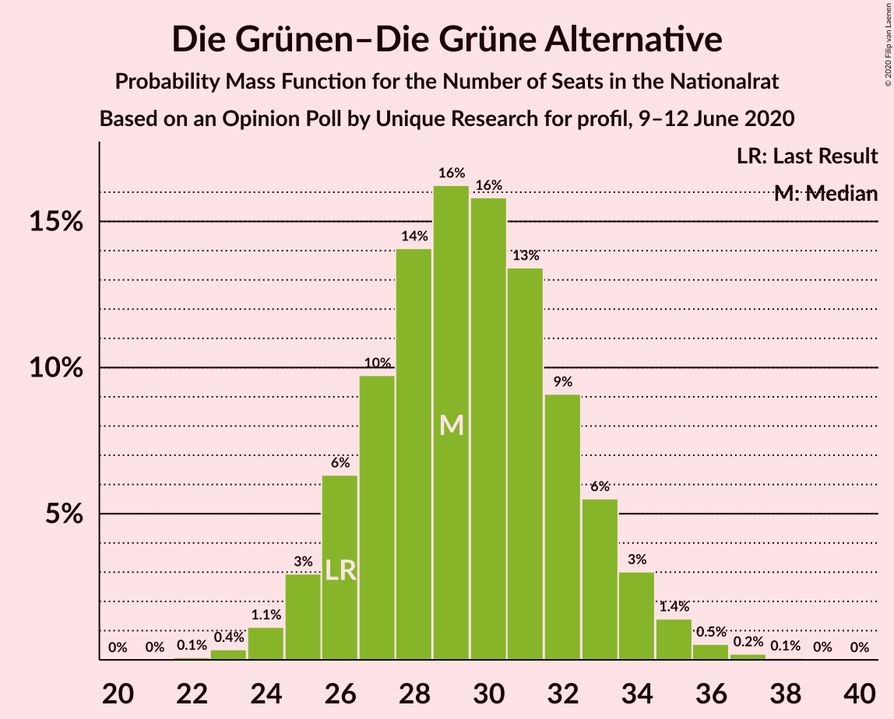
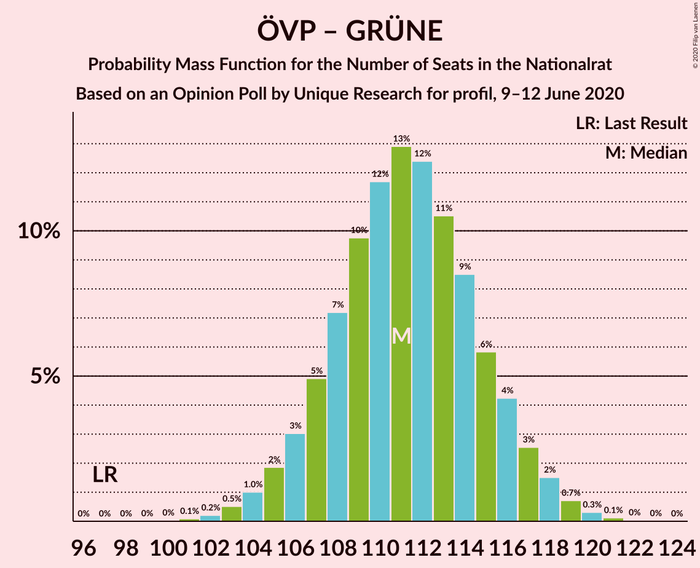
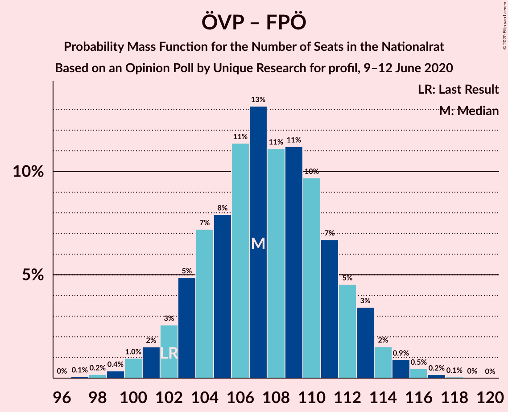
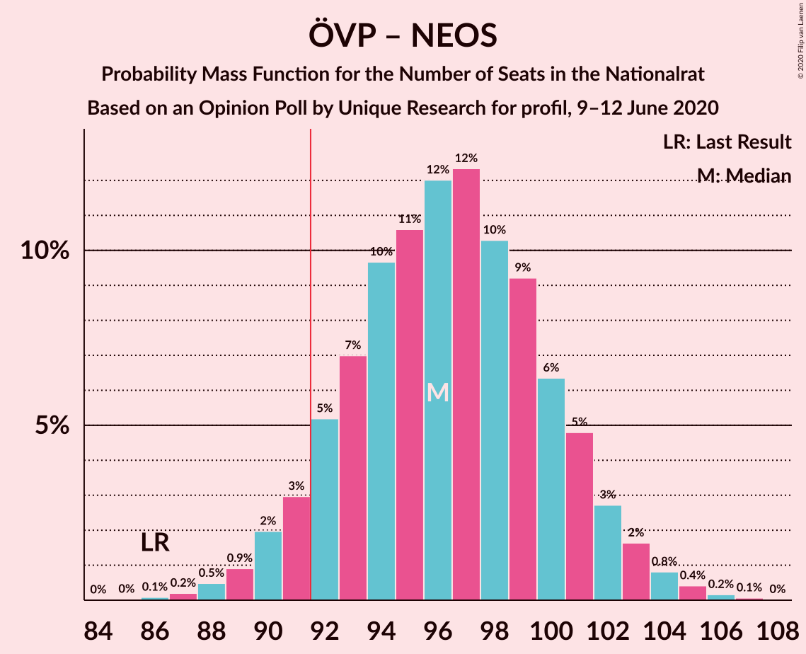
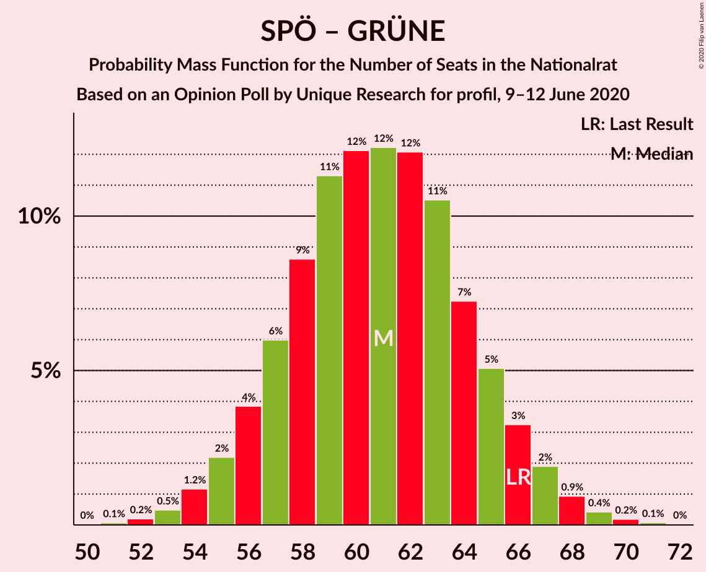

# Opinion Poll by Unique Research for profil, 9–12 June 2020

<a href="#voting-intentions">Voting Intentions</a> | <a href="#seats">Seats</a> | <a href="#coalitions">Coalitions</a> | <a href="#technical-information">Technical Information</a>

## Voting Intentions

### Confidence Intervals

| Party | Last Result | Poll Result | 80% Confidence Interval | 90% Confidence Interval | 95% Confidence Interval | 99% Confidence Interval |
|:-----:|:-----------:|:-----------:|:-----------------------:|:-----------------------:|:-----------------------:|:-----------------------:|
| Österreichische Volkspartei | 37.5% | 44.0% | 41.8–46.3% |41.2–46.9% |40.6–47.5% |39.6–48.6% |
| Sozialdemokratische Partei Österreichs | 21.2% | 17.0% | 15.3–18.8% |14.9–19.3% |14.5–19.7% |13.8–20.6% |
| Die Grünen–Die Grüne Alternative | 13.9% | 16.0% | 14.4–17.7% |14.0–18.2% |13.6–18.7% |12.9–19.5% |
| Freiheitliche Partei Österreichs | 16.2% | 14.0% | 12.5–15.7% |12.1–16.1% |11.7–16.6% |11.1–17.4% |
| NEOS–Das Neue Österreich und Liberales Forum | 8.1% | 8.0% | 6.9–9.3% |6.6–9.7% |6.3–10.1% |5.8–10.8% |

*Note:* The poll result column reflects the actual value used in the calculations. Published results may vary slightly, and in addition be rounded to fewer digits.

## Seats

### Confidence Intervals

| Party | Last Result | Median | 80% Confidence Interval | 90% Confidence Interval | 95% Confidence Interval | 99% Confidence Interval |
|:-----:|:-----------:|:------:|:-----------------------:|:-----------------------:|:-----------------------:|:-----------------------:|
| <a href="#österreichische-volkspartei">Österreichische Volkspartei</a> | 71 | 82 | 78–86 |76–87 |75–88 |73–90 |
| <a href="#sozialdemokratische-partei-österreichs">Sozialdemokratische Partei Österreichs</a> | 40 | 31 | 28–35 |27–35 |27–36 |25–38 |
| <a href="#die-grünen–die-grüne-alternative">Die Grünen–Die Grüne Alternative</a> | 26 | 29 | 26–33 |26–34 |25–34 |24–36 |
| <a href="#freiheitliche-partei-österreichs">Freiheitliche Partei Österreichs</a> | 31 | 26 | 23–29 |22–30 |21–30 |20–32 |
| <a href="#neos–das-neue-österreich-und-liberales-forum">NEOS–Das Neue Österreich und Liberales Forum</a> | 15 | 15 | 12–17 |12–18 |11–18 |10–20 |

### Österreichische Volkspartei

*For a full overview of the results for this party, see the [Österreichische Volkspartei](party-österreichischevolkspartei.html) page.*

| Number of Seats | Probability | Accumulated | Special Marks |
|:---------------:|:-----------:|:-----------:|:-------------:|
| 71 | 0.1% | 100% | Last Result |
| 72 | 0.1% | 99.9% |  |
| 73 | 0.3% | 99.8% |  |
| 74 | 0.7% | 99.5% |  |
| 75 | 1.4% | 98.8% |  |
| 76 | 3% | 97% |  |
| 77 | 4% | 95% |  |
| 78 | 6% | 91% |  |
| 79 | 9% | 85% |  |
| 80 | 10% | 76% |  |
| 81 | 13% | 66% |  |
| 82 | 13% | 53% | Median |
| 83 | 11% | 40% |  |
| 84 | 10% | 29% |  |
| 85 | 7% | 20% |  |
| 86 | 5% | 13% |  |
| 87 | 3% | 8% |  |
| 88 | 2% | 4% |  |
| 89 | 1.2% | 2% |  |
| 90 | 0.6% | 1.0% |  |
| 91 | 0.2% | 0.4% |  |
| 92 | 0.1% | 0.2% | Majority |
| 93 | 0% | 0.1% |  |
| 94 | 0% | 0% |  |

### Sozialdemokratische Partei Österreichs

*For a full overview of the results for this party, see the [Sozialdemokratische Partei Österreichs](party-sozialdemokratischeparteiösterreichs.html) page.*

| Number of Seats | Probability | Accumulated | Special Marks |
|:---------------:|:-----------:|:-----------:|:-------------:|
| 24 | 0.1% | 100% |  |
| 25 | 0.5% | 99.8% |  |
| 26 | 1.4% | 99.3% |  |
| 27 | 4% | 98% |  |
| 28 | 7% | 94% |  |
| 29 | 11% | 88% |  |
| 30 | 14% | 77% |  |
| 31 | 16% | 63% | Median |
| 32 | 15% | 47% |  |
| 33 | 13% | 32% |  |
| 34 | 9% | 19% |  |
| 35 | 5% | 10% |  |
| 36 | 3% | 5% |  |
| 37 | 1.4% | 2% |  |
| 38 | 0.5% | 0.8% |  |
| 39 | 0.2% | 0.3% |  |
| 40 | 0.1% | 0.1% | Last Result |
| 41 | 0% | 0% |  |

### Die Grünen–Die Grüne Alternative

*For a full overview of the results for this party, see the [Die Grünen–Die Grüne Alternative](party-diegrünen–diegrünealternative.html) page.*

| Number of Seats | Probability | Accumulated | Special Marks |
|:---------------:|:-----------:|:-----------:|:-------------:|
| 22 | 0.1% | 100% |  |
| 23 | 0.4% | 99.9% |  |
| 24 | 1.1% | 99.5% |  |
| 25 | 3% | 98% |  |
| 26 | 6% | 95% | Last Result |
| 27 | 10% | 89% |  |
| 28 | 14% | 79% |  |
| 29 | 16% | 65% | Median |
| 30 | 16% | 49% |  |
| 31 | 13% | 33% |  |
| 32 | 9% | 20% |  |
| 33 | 6% | 11% |  |
| 34 | 3% | 5% |  |
| 35 | 1.4% | 2% |  |
| 36 | 0.5% | 0.8% |  |
| 37 | 0.2% | 0.3% |  |
| 38 | 0.1% | 0.1% |  |
| 39 | 0% | 0% |  |

### Freiheitliche Partei Österreichs

*For a full overview of the results for this party, see the [Freiheitliche Partei Österreichs](party-freiheitlicheparteiösterreichs.html) page.*

| Number of Seats | Probability | Accumulated | Special Marks |
|:---------------:|:-----------:|:-----------:|:-------------:|
| 19 | 0.1% | 100% |  |
| 20 | 0.6% | 99.8% |  |
| 21 | 2% | 99.2% |  |
| 22 | 5% | 97% |  |
| 23 | 9% | 93% |  |
| 24 | 13% | 84% |  |
| 25 | 17% | 71% |  |
| 26 | 17% | 54% | Median |
| 27 | 14% | 37% |  |
| 28 | 11% | 22% |  |
| 29 | 6% | 12% |  |
| 30 | 3% | 6% |  |
| 31 | 1.5% | 2% | Last Result |
| 32 | 0.6% | 0.8% |  |
| 33 | 0.2% | 0.3% |  |
| 34 | 0.1% | 0.1% |  |
| 35 | 0% | 0% |  |

### NEOS–Das Neue Österreich und Liberales Forum

*For a full overview of the results for this party, see the [NEOS–Das Neue Österreich und Liberales Forum](party-neos–dasneueösterreichundliberalesforum.html) page.*

| Number of Seats | Probability | Accumulated | Special Marks |
|:---------------:|:-----------:|:-----------:|:-------------:|
| 9 | 0.1% | 100% |  |
| 10 | 0.6% | 99.9% |  |
| 11 | 3% | 99.3% |  |
| 12 | 8% | 96% |  |
| 13 | 14% | 88% |  |
| 14 | 22% | 74% |  |
| 15 | 22% | 52% | Last Result, Median |
| 16 | 16% | 29% |  |
| 17 | 8% | 14% |  |
| 18 | 4% | 6% |  |
| 19 | 2% | 2% |  |
| 20 | 0.4% | 0.6% |  |
| 21 | 0.1% | 0.1% |  |
| 22 | 0% | 0% |  |

## Coalitions

### Confidence Intervals

| Coalition | Last Result | Median | Majority? | 80% Confidence Interval | 90% Confidence Interval | 95% Confidence Interval | 99% Confidence Interval |
|:---------:|:-----------:|:------:|:---------:|:-----------------------:|:-----------------------:|:-----------------------:|:-----------------------:|
| Österreichische Volkspartei – Die Grünen–Die Grüne Alternative – NEOS–Das Neue Österreich und Liberales Forum | 112 | 126 | 100% | 122–130 | 121–131 | 120–132 | 118–134 |
| Österreichische Volkspartei – Sozialdemokratische Partei Österreichs | 111 | 113 | 100% | 109–117 | 108–118 | 107–119 | 105–121 |
| Österreichische Volkspartei – Die Grünen–Die Grüne Alternative | 97 | 111 | 100% | 107–115 | 106–117 | 105–118 | 103–119 |
| Österreichische Volkspartei – Freiheitliche Partei Österreichs | 102 | 107 | 100% | 103–112 | 102–113 | 101–114 | 99–116 |
| Österreichische Volkspartei – NEOS–Das Neue Österreich und Liberales Forum | 86 | 96 | 93% | 92–101 | 91–102 | 90–103 | 88–105 |
| Österreichische Volkspartei | 71 | 82 | 0.2% | 78–86 | 76–87 | 75–88 | 73–90 |
| Sozialdemokratische Partei Österreichs – Die Grünen–Die Grüne Alternative – NEOS–Das Neue Österreich und Liberales Forum | 81 | 76 | 0% | 71–80 | 70–81 | 69–82 | 67–84 |
| Sozialdemokratische Partei Österreichs – Die Grünen–Die Grüne Alternative | 66 | 61 | 0% | 57–65 | 56–66 | 55–67 | 53–69 |
| Sozialdemokratische Partei Österreichs – Freiheitliche Partei Österreichs | 71 | 57 | 0% | 53–61 | 52–62 | 51–63 | 49–65 |
| Sozialdemokratische Partei Österreichs | 40 | 31 | 0% | 28–35 | 27–35 | 27–36 | 25–38 |

### Österreichische Volkspartei – Die Grünen–Die Grüne Alternative – NEOS–Das Neue Österreich und Liberales Forum

| Number of Seats | Probability | Accumulated | Special Marks |
|:---------------:|:-----------:|:-----------:|:-------------:|
| 112 | 0% | 100% | Last Result |
| 113 | 0% | 100% |  |
| 114 | 0% | 100% |  |
| 115 | 0% | 100% |  |
| 116 | 0.1% | 100% |  |
| 117 | 0.2% | 99.9% |  |
| 118 | 0.5% | 99.7% |  |
| 119 | 1.0% | 99.1% |  |
| 120 | 2% | 98% |  |
| 121 | 4% | 96% |  |
| 122 | 6% | 92% |  |
| 123 | 8% | 87% |  |
| 124 | 11% | 78% |  |
| 125 | 12% | 68% |  |
| 126 | 13% | 55% | Median |
| 127 | 13% | 42% |  |
| 128 | 10% | 30% |  |
| 129 | 8% | 20% |  |
| 130 | 5% | 12% |  |
| 131 | 3% | 6% |  |
| 132 | 2% | 3% |  |
| 133 | 0.8% | 1.4% |  |
| 134 | 0.3% | 0.5% |  |
| 135 | 0.1% | 0.2% |  |
| 136 | 0% | 0.1% |  |
| 137 | 0% | 0% |  |

### Österreichische Volkspartei – Sozialdemokratische Partei Österreichs

| Number of Seats | Probability | Accumulated | Special Marks |
|:---------------:|:-----------:|:-----------:|:-------------:|
| 102 | 0% | 100% |  |
| 103 | 0.1% | 99.9% |  |
| 104 | 0.2% | 99.8% |  |
| 105 | 0.5% | 99.6% |  |
| 106 | 1.1% | 99.1% |  |
| 107 | 2% | 98% |  |
| 108 | 3% | 96% |  |
| 109 | 5% | 93% |  |
| 110 | 8% | 87% |  |
| 111 | 10% | 80% | Last Result |
| 112 | 12% | 70% |  |
| 113 | 12% | 58% | Median |
| 114 | 12% | 45% |  |
| 115 | 11% | 33% |  |
| 116 | 8% | 23% |  |
| 117 | 6% | 14% |  |
| 118 | 4% | 8% |  |
| 119 | 2% | 5% |  |
| 120 | 1.2% | 2% |  |
| 121 | 0.6% | 1.0% |  |
| 122 | 0.3% | 0.4% |  |
| 123 | 0.1% | 0.2% |  |
| 124 | 0% | 0% |  |

### Österreichische Volkspartei – Die Grünen–Die Grüne Alternative

| Number of Seats | Probability | Accumulated | Special Marks |
|:---------------:|:-----------:|:-----------:|:-------------:|
| 97 | 0% | 100% | Last Result |
| 98 | 0% | 100% |  |
| 99 | 0% | 100% |  |
| 100 | 0% | 100% |  |
| 101 | 0.1% | 100% |  |
| 102 | 0.2% | 99.9% |  |
| 103 | 0.5% | 99.7% |  |
| 104 | 1.0% | 99.1% |  |
| 105 | 2% | 98% |  |
| 106 | 3% | 96% |  |
| 107 | 5% | 93% |  |
| 108 | 7% | 88% |  |
| 109 | 10% | 81% |  |
| 110 | 12% | 71% |  |
| 111 | 13% | 60% | Median |
| 112 | 12% | 47% |  |
| 113 | 11% | 34% |  |
| 114 | 9% | 24% |  |
| 115 | 6% | 15% |  |
| 116 | 4% | 10% |  |
| 117 | 3% | 5% |  |
| 118 | 2% | 3% |  |
| 119 | 0.7% | 1.2% |  |
| 120 | 0.3% | 0.5% |  |
| 121 | 0.1% | 0.2% |  |
| 122 | 0% | 0.1% |  |
| 123 | 0% | 0% |  |

### Österreichische Volkspartei – Freiheitliche Partei Österreichs

| Number of Seats | Probability | Accumulated | Special Marks |
|:---------------:|:-----------:|:-----------:|:-------------:|
| 97 | 0.1% | 100% |  |
| 98 | 0.2% | 99.9% |  |
| 99 | 0.4% | 99.7% |  |
| 100 | 1.0% | 99.4% |  |
| 101 | 2% | 98% |  |
| 102 | 3% | 97% | Last Result |
| 103 | 5% | 94% |  |
| 104 | 7% | 89% |  |
| 105 | 8% | 82% |  |
| 106 | 11% | 74% |  |
| 107 | 13% | 63% |  |
| 108 | 11% | 50% | Median |
| 109 | 11% | 39% |  |
| 110 | 10% | 27% |  |
| 111 | 7% | 18% |  |
| 112 | 5% | 11% |  |
| 113 | 3% | 7% |  |
| 114 | 2% | 3% |  |
| 115 | 0.9% | 2% |  |
| 116 | 0.5% | 0.7% |  |
| 117 | 0.2% | 0.3% |  |
| 118 | 0.1% | 0.1% |  |
| 119 | 0% | 0% |  |

### Österreichische Volkspartei – NEOS–Das Neue Österreich und Liberales Forum

| Number of Seats | Probability | Accumulated | Special Marks |
|:---------------:|:-----------:|:-----------:|:-------------:|
| 86 | 0.1% | 100% | Last Result |
| 87 | 0.2% | 99.9% |  |
| 88 | 0.5% | 99.7% |  |
| 89 | 0.9% | 99.2% |  |
| 90 | 2% | 98% |  |
| 91 | 3% | 96% |  |
| 92 | 5% | 93% | Majority |
| 93 | 7% | 88% |  |
| 94 | 10% | 81% |  |
| 95 | 11% | 71% |  |
| 96 | 12% | 61% |  |
| 97 | 12% | 49% | Median |
| 98 | 10% | 37% |  |
| 99 | 9% | 26% |  |
| 100 | 6% | 17% |  |
| 101 | 5% | 11% |  |
| 102 | 3% | 6% |  |
| 103 | 2% | 3% |  |
| 104 | 0.8% | 1.5% |  |
| 105 | 0.4% | 0.7% |  |
| 106 | 0.2% | 0.3% |  |
| 107 | 0.1% | 0.1% |  |
| 108 | 0% | 0% |  |

### Österreichische Volkspartei

| Number of Seats | Probability | Accumulated | Special Marks |
|:---------------:|:-----------:|:-----------:|:-------------:|
| 71 | 0.1% | 100% | Last Result |
| 72 | 0.1% | 99.9% |  |
| 73 | 0.3% | 99.8% |  |
| 74 | 0.7% | 99.5% |  |
| 75 | 1.4% | 98.8% |  |
| 76 | 3% | 97% |  |
| 77 | 4% | 95% |  |
| 78 | 6% | 91% |  |
| 79 | 9% | 85% |  |
| 80 | 10% | 76% |  |
| 81 | 13% | 66% |  |
| 82 | 13% | 53% | Median |
| 83 | 11% | 40% |  |
| 84 | 10% | 29% |  |
| 85 | 7% | 20% |  |
| 86 | 5% | 13% |  |
| 87 | 3% | 8% |  |
| 88 | 2% | 4% |  |
| 89 | 1.2% | 2% |  |
| 90 | 0.6% | 1.0% |  |
| 91 | 0.2% | 0.4% |  |
| 92 | 0.1% | 0.2% | Majority |
| 93 | 0% | 0.1% |  |
| 94 | 0% | 0% |  |

### Sozialdemokratische Partei Österreichs – Die Grünen–Die Grüne Alternative – NEOS–Das Neue Österreich und Liberales Forum

| Number of Seats | Probability | Accumulated | Special Marks |
|:---------------:|:-----------:|:-----------:|:-------------:|
| 65 | 0.1% | 100% |  |
| 66 | 0.2% | 99.9% |  |
| 67 | 0.5% | 99.7% |  |
| 68 | 0.9% | 99.3% |  |
| 69 | 2% | 98% |  |
| 70 | 3% | 97% |  |
| 71 | 5% | 93% |  |
| 72 | 7% | 89% |  |
| 73 | 10% | 82% |  |
| 74 | 11% | 73% |  |
| 75 | 11% | 61% | Median |
| 76 | 13% | 50% |  |
| 77 | 11% | 37% |  |
| 78 | 8% | 26% |  |
| 79 | 7% | 18% |  |
| 80 | 5% | 11% |  |
| 81 | 3% | 6% | Last Result |
| 82 | 2% | 3% |  |
| 83 | 1.0% | 2% |  |
| 84 | 0.4% | 0.6% |  |
| 85 | 0.2% | 0.3% |  |
| 86 | 0.1% | 0.1% |  |
| 87 | 0% | 0% |  |

### Sozialdemokratische Partei Österreichs – Die Grünen–Die Grüne Alternative

| Number of Seats | Probability | Accumulated | Special Marks |
|:---------------:|:-----------:|:-----------:|:-------------:|
| 51 | 0.1% | 100% |  |
| 52 | 0.2% | 99.9% |  |
| 53 | 0.5% | 99.7% |  |
| 54 | 1.2% | 99.2% |  |
| 55 | 2% | 98% |  |
| 56 | 4% | 96% |  |
| 57 | 6% | 92% |  |
| 58 | 9% | 86% |  |
| 59 | 11% | 77% |  |
| 60 | 12% | 66% | Median |
| 61 | 12% | 54% |  |
| 62 | 12% | 42% |  |
| 63 | 11% | 30% |  |
| 64 | 7% | 19% |  |
| 65 | 5% | 12% |  |
| 66 | 3% | 7% | Last Result |
| 67 | 2% | 4% |  |
| 68 | 0.9% | 2% |  |
| 69 | 0.4% | 0.7% |  |
| 70 | 0.2% | 0.3% |  |
| 71 | 0.1% | 0.1% |  |
| 72 | 0% | 0% |  |

### Sozialdemokratische Partei Österreichs – Freiheitliche Partei Österreichs

| Number of Seats | Probability | Accumulated | Special Marks |
|:---------------:|:-----------:|:-----------:|:-------------:|
| 47 | 0% | 100% |  |
| 48 | 0.1% | 99.9% |  |
| 49 | 0.3% | 99.8% |  |
| 50 | 0.8% | 99.5% |  |
| 51 | 2% | 98.6% |  |
| 52 | 3% | 97% |  |
| 53 | 5% | 94% |  |
| 54 | 8% | 88% |  |
| 55 | 10% | 80% |  |
| 56 | 13% | 70% |  |
| 57 | 13% | 58% | Median |
| 58 | 12% | 45% |  |
| 59 | 11% | 32% |  |
| 60 | 8% | 22% |  |
| 61 | 6% | 13% |  |
| 62 | 4% | 8% |  |
| 63 | 2% | 4% |  |
| 64 | 1.0% | 2% |  |
| 65 | 0.5% | 0.9% |  |
| 66 | 0.2% | 0.3% |  |
| 67 | 0.1% | 0.1% |  |
| 68 | 0% | 0% |  |
| 69 | 0% | 0% |  |
| 70 | 0% | 0% |  |
| 71 | 0% | 0% | Last Result |

### Sozialdemokratische Partei Österreichs

| Number of Seats | Probability | Accumulated | Special Marks |
|:---------------:|:-----------:|:-----------:|:-------------:|
| 24 | 0.1% | 100% |  |
| 25 | 0.5% | 99.8% |  |
| 26 | 1.4% | 99.3% |  |
| 27 | 4% | 98% |  |
| 28 | 7% | 94% |  |
| 29 | 11% | 88% |  |
| 30 | 14% | 77% |  |
| 31 | 16% | 63% | Median |
| 32 | 15% | 47% |  |
| 33 | 13% | 32% |  |
| 34 | 9% | 19% |  |
| 35 | 5% | 10% |  |
| 36 | 3% | 5% |  |
| 37 | 1.4% | 2% |  |
| 38 | 0.5% | 0.8% |  |
| 39 | 0.2% | 0.3% |  |
| 40 | 0.1% | 0.1% | Last Result |
| 41 | 0% | 0% |  |

## Technical Information

### Opinion Poll

+ **Polling firm:** Unique Research
+ **Commissioner(s):** profil
+ **Fieldwork period:** 9–12 June 2020

### Calculations

+ **Sample size:** 802
+ **Simulations done:** 1,048,576
+ **Error estimate:** 0.72%

