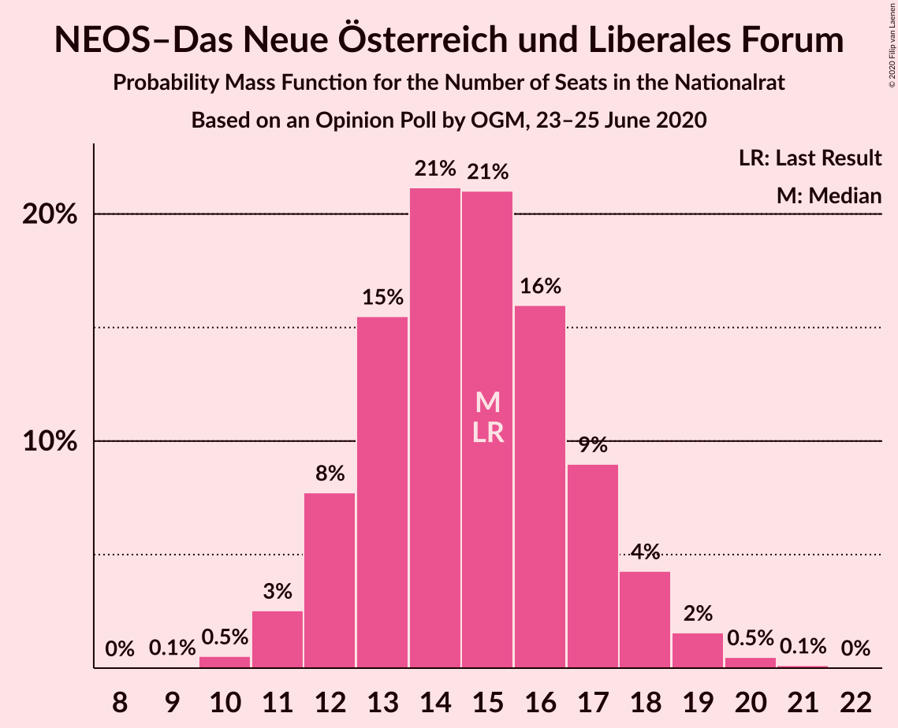

# Opinion Poll by OGM, 23–25 June 2020

<a href="#voting-intentions">Voting Intentions</a> | <a href="#seats">Seats</a> | <a href="#coalitions">Coalitions</a> | <a href="#technical-information">Technical Information</a>

## Voting Intentions

### Confidence Intervals

| Party | Last Result | Poll Result | 80% Confidence Interval | 90% Confidence Interval | 95% Confidence Interval | 99% Confidence Interval |
|:-----:|:-----------:|:-----------:|:-----------------------:|:-----------------------:|:-----------------------:|:-----------------------:|
| Österreichische Volkspartei | 37.5% | 42.0% | 39.8–44.2% |39.2–44.9% |38.6–45.4% |37.6–46.5% |
| Sozialdemokratische Partei Österreichs | 21.2% | 19.0% | 17.3–20.9% |16.8–21.4% |16.4–21.9% |15.7–22.8% |
| Die Grünen–Die Grüne Alternative | 13.9% | 16.0% | 14.5–17.8% |14.0–18.3% |13.6–18.7% |12.9–19.6% |
| Freiheitliche Partei Österreichs | 16.2% | 13.0% | 11.6–14.7% |11.2–15.2% |10.9–15.6% |10.2–16.4% |
| NEOS–Das Neue Österreich und Liberales Forum | 8.1% | 8.0% | 6.8–9.3% |6.5–9.7% |6.3–10.0% |5.8–10.7% |

*Note:* The poll result column reflects the actual value used in the calculations. Published results may vary slightly, and in addition be rounded to fewer digits.

## Seats

### Confidence Intervals

| Party | Last Result | Median | 80% Confidence Interval | 90% Confidence Interval | 95% Confidence Interval | 99% Confidence Interval |
|:-----:|:-----------:|:------:|:-----------------------:|:-----------------------:|:-----------------------:|:-----------------------:|
| <a href="#österreichische-volkspartei">Österreichische Volkspartei</a> | 71 | 79 | 74–83 |73–84 |72–85 |70–87 |
| <a href="#sozialdemokratische-partei-österreichs">Sozialdemokratische Partei Österreichs</a> | 40 | 35 | 32–39 |31–40 |31–41 |29–42 |
| <a href="#die-grünen–die-grüne-alternative">Die Grünen–Die Grüne Alternative</a> | 26 | 30 | 27–33 |26–34 |25–35 |24–37 |
| <a href="#freiheitliche-partei-österreichs">Freiheitliche Partei Österreichs</a> | 31 | 25 | 21–27 |21–28 |20–29 |19–30 |
| <a href="#neos–das-neue-österreich-und-liberales-forum">NEOS–Das Neue Österreich und Liberales Forum</a> | 15 | 15 | 12–17 |12–18 |11–18 |10–20 |

### Österreichische Volkspartei

*For a full overview of the results for this party, see the [Österreichische Volkspartei](party-österreichischevolkspartei.html) page.*

| Number of Seats | Probability | Accumulated | Special Marks |
|:---------------:|:-----------:|:-----------:|:-------------:|
| 68 | 0.1% | 100% |  |
| 69 | 0.1% | 99.9% |  |
| 70 | 0.3% | 99.8% |  |
| 71 | 0.9% | 99.5% | Last Result |
| 72 | 1.4% | 98.5% |  |
| 73 | 3% | 97% |  |
| 74 | 5% | 94% |  |
| 75 | 8% | 90% |  |
| 76 | 6% | 82% |  |
| 77 | 12% | 76% |  |
| 78 | 10% | 64% |  |
| 79 | 12% | 54% | Median |
| 80 | 14% | 42% |  |
| 81 | 11% | 28% |  |
| 82 | 6% | 17% |  |
| 83 | 5% | 12% |  |
| 84 | 3% | 7% |  |
| 85 | 2% | 4% |  |
| 86 | 0.9% | 2% |  |
| 87 | 0.5% | 0.9% |  |
| 88 | 0.2% | 0.4% |  |
| 89 | 0.1% | 0.1% |  |
| 90 | 0% | 0% |  |

### Sozialdemokratische Partei Österreichs

*For a full overview of the results for this party, see the [Sozialdemokratische Partei Österreichs](party-sozialdemokratischeparteiösterreichs.html) page.*

| Number of Seats | Probability | Accumulated | Special Marks |
|:---------------:|:-----------:|:-----------:|:-------------:|
| 27 | 0.1% | 100% |  |
| 28 | 0.2% | 99.9% |  |
| 29 | 0.7% | 99.8% |  |
| 30 | 1.5% | 99.0% |  |
| 31 | 3% | 98% |  |
| 32 | 8% | 95% |  |
| 33 | 11% | 87% |  |
| 34 | 10% | 76% |  |
| 35 | 16% | 65% | Median |
| 36 | 18% | 49% |  |
| 37 | 11% | 32% |  |
| 38 | 7% | 21% |  |
| 39 | 7% | 13% |  |
| 40 | 3% | 6% | Last Result |
| 41 | 2% | 3% |  |
| 42 | 1.1% | 1.5% |  |
| 43 | 0.3% | 0.4% |  |
| 44 | 0.1% | 0.1% |  |
| 45 | 0.1% | 0.1% |  |
| 46 | 0% | 0% |  |

### Die Grünen–Die Grüne Alternative

*For a full overview of the results for this party, see the [Die Grünen–Die Grüne Alternative](party-diegrünen–diegrünealternative.html) page.*

| Number of Seats | Probability | Accumulated | Special Marks |
|:---------------:|:-----------:|:-----------:|:-------------:|
| 22 | 0.1% | 100% |  |
| 23 | 0.1% | 99.9% |  |
| 24 | 1.3% | 99.8% |  |
| 25 | 2% | 98.5% |  |
| 26 | 5% | 97% | Last Result |
| 27 | 7% | 92% |  |
| 28 | 17% | 85% |  |
| 29 | 11% | 68% |  |
| 30 | 13% | 57% | Median |
| 31 | 18% | 44% |  |
| 32 | 13% | 25% |  |
| 33 | 6% | 13% |  |
| 34 | 2% | 6% |  |
| 35 | 3% | 4% |  |
| 36 | 0.4% | 1.0% |  |
| 37 | 0.4% | 0.5% |  |
| 38 | 0.1% | 0.1% |  |
| 39 | 0% | 0% |  |

### Freiheitliche Partei Österreichs

*For a full overview of the results for this party, see the [Freiheitliche Partei Österreichs](party-freiheitlicheparteiösterreichs.html) page.*

| Number of Seats | Probability | Accumulated | Special Marks |
|:---------------:|:-----------:|:-----------:|:-------------:|
| 18 | 0.2% | 100% |  |
| 19 | 1.2% | 99.8% |  |
| 20 | 3% | 98.6% |  |
| 21 | 7% | 96% |  |
| 22 | 10% | 88% |  |
| 23 | 19% | 78% |  |
| 24 | 9% | 60% |  |
| 25 | 17% | 50% | Median |
| 26 | 17% | 33% |  |
| 27 | 8% | 16% |  |
| 28 | 5% | 8% |  |
| 29 | 2% | 3% |  |
| 30 | 0.8% | 1.1% |  |
| 31 | 0.2% | 0.3% | Last Result |
| 32 | 0.1% | 0.2% |  |
| 33 | 0% | 0% |  |

### NEOS–Das Neue Österreich und Liberales Forum

*For a full overview of the results for this party, see the [NEOS–Das Neue Österreich und Liberales Forum](party-neos–dasneueösterreichundliberalesforum.html) page.*

| Number of Seats | Probability | Accumulated | Special Marks |
|:---------------:|:-----------:|:-----------:|:-------------:|
| 9 | 0.1% | 100% |  |
| 10 | 0.6% | 99.9% |  |
| 11 | 3% | 99.4% |  |
| 12 | 8% | 97% |  |
| 13 | 17% | 89% |  |
| 14 | 20% | 72% |  |
| 15 | 22% | 52% | Last Result, Median |
| 16 | 15% | 30% |  |
| 17 | 8% | 15% |  |
| 18 | 5% | 7% |  |
| 19 | 2% | 2% |  |
| 20 | 0.5% | 0.7% |  |
| 21 | 0.1% | 0.2% |  |
| 22 | 0% | 0% |  |

## Coalitions

### Confidence Intervals

| Coalition | Last Result | Median | Majority? | 80% Confidence Interval | 90% Confidence Interval | 95% Confidence Interval | 99% Confidence Interval |
|:---------:|:-----------:|:------:|:---------:|:-----------------------:|:-----------------------:|:-----------------------:|:-----------------------:|
| Österreichische Volkspartei – Die Grünen–Die Grüne Alternative – NEOS–Das Neue Österreich und Liberales Forum | 112 | 123 | 100% | 119–127 | 118–128 | 117–129 | 115–131 |
| Österreichische Volkspartei – Sozialdemokratische Partei Österreichs | 111 | 114 | 100% | 110–118 | 109–119 | 108–120 | 106–122 |
| Österreichische Volkspartei – Die Grünen–Die Grüne Alternative | 97 | 109 | 100% | 105–113 | 103–114 | 102–115 | 100–117 |
| Österreichische Volkspartei – Freiheitliche Partei Österreichs | 102 | 103 | 100% | 99–107 | 97–108 | 96–109 | 94–112 |
| Österreichische Volkspartei – NEOS–Das Neue Österreich und Liberales Forum | 86 | 93 | 72% | 89–97 | 88–99 | 87–100 | 85–102 |
| Sozialdemokratische Partei Österreichs – Die Grünen–Die Grüne Alternative – NEOS–Das Neue Österreich und Liberales Forum | 81 | 80 | 0% | 76–84 | 75–86 | 74–87 | 71–89 |
| Österreichische Volkspartei | 71 | 79 | 0% | 74–83 | 73–84 | 72–85 | 70–87 |
| Sozialdemokratische Partei Österreichs – Die Grünen–Die Grüne Alternative | 66 | 65 | 0% | 61–69 | 60–71 | 59–72 | 57–74 |
| Sozialdemokratische Partei Österreichs – Freiheitliche Partei Österreichs | 71 | 60 | 0% | 56–64 | 55–65 | 54–66 | 52–68 |
| Sozialdemokratische Partei Österreichs | 40 | 35 | 0% | 32–39 | 31–40 | 31–41 | 29–42 |

### Österreichische Volkspartei – Die Grünen–Die Grüne Alternative – NEOS–Das Neue Österreich und Liberales Forum

| Number of Seats | Probability | Accumulated | Special Marks |
|:---------------:|:-----------:|:-----------:|:-------------:|
| 112 | 0% | 100% | Last Result |
| 113 | 0.1% | 100% |  |
| 114 | 0.1% | 99.9% |  |
| 115 | 0.4% | 99.7% |  |
| 116 | 0.9% | 99.3% |  |
| 117 | 2% | 98% |  |
| 118 | 3% | 97% |  |
| 119 | 6% | 93% |  |
| 120 | 5% | 87% |  |
| 121 | 10% | 81% |  |
| 122 | 11% | 72% |  |
| 123 | 15% | 61% |  |
| 124 | 14% | 46% | Median |
| 125 | 7% | 32% |  |
| 126 | 11% | 25% |  |
| 127 | 5% | 14% |  |
| 128 | 5% | 9% |  |
| 129 | 2% | 4% |  |
| 130 | 0.9% | 2% |  |
| 131 | 0.6% | 0.9% |  |
| 132 | 0.2% | 0.3% |  |
| 133 | 0.1% | 0.1% |  |
| 134 | 0% | 0% |  |

### Österreichische Volkspartei – Sozialdemokratische Partei Österreichs

| Number of Seats | Probability | Accumulated | Special Marks |
|:---------------:|:-----------:|:-----------:|:-------------:|
| 103 | 0% | 100% |  |
| 104 | 0.1% | 99.9% |  |
| 105 | 0.2% | 99.8% |  |
| 106 | 0.5% | 99.7% |  |
| 107 | 1.2% | 99.2% |  |
| 108 | 2% | 98% |  |
| 109 | 5% | 96% |  |
| 110 | 3% | 91% |  |
| 111 | 10% | 88% | Last Result |
| 112 | 9% | 78% |  |
| 113 | 11% | 69% |  |
| 114 | 13% | 58% | Median |
| 115 | 9% | 45% |  |
| 116 | 11% | 36% |  |
| 117 | 9% | 24% |  |
| 118 | 5% | 15% |  |
| 119 | 6% | 10% |  |
| 120 | 2% | 4% |  |
| 121 | 0.9% | 2% |  |
| 122 | 0.7% | 1.0% |  |
| 123 | 0.2% | 0.4% |  |
| 124 | 0.1% | 0.1% |  |
| 125 | 0% | 0% |  |

### Österreichische Volkspartei – Die Grünen–Die Grüne Alternative

| Number of Seats | Probability | Accumulated | Special Marks |
|:---------------:|:-----------:|:-----------:|:-------------:|
| 97 | 0% | 100% | Last Result |
| 98 | 0.1% | 100% |  |
| 99 | 0.3% | 99.9% |  |
| 100 | 0.2% | 99.7% |  |
| 101 | 0.8% | 99.4% |  |
| 102 | 2% | 98.7% |  |
| 103 | 3% | 96% |  |
| 104 | 4% | 94% |  |
| 105 | 7% | 90% |  |
| 106 | 11% | 83% |  |
| 107 | 10% | 72% |  |
| 108 | 11% | 62% |  |
| 109 | 12% | 51% | Median |
| 110 | 9% | 39% |  |
| 111 | 12% | 30% |  |
| 112 | 8% | 19% |  |
| 113 | 4% | 10% |  |
| 114 | 4% | 7% |  |
| 115 | 1.4% | 3% |  |
| 116 | 0.7% | 1.4% |  |
| 117 | 0.4% | 0.7% |  |
| 118 | 0.2% | 0.3% |  |
| 119 | 0% | 0.1% |  |
| 120 | 0% | 0% |  |

### Österreichische Volkspartei – Freiheitliche Partei Österreichs

| Number of Seats | Probability | Accumulated | Special Marks |
|:---------------:|:-----------:|:-----------:|:-------------:|
| 92 | 0.1% | 100% | Majority |
| 93 | 0.1% | 99.9% |  |
| 94 | 0.4% | 99.8% |  |
| 95 | 0.7% | 99.4% |  |
| 96 | 2% | 98.7% |  |
| 97 | 2% | 97% |  |
| 98 | 3% | 95% |  |
| 99 | 7% | 92% |  |
| 100 | 7% | 85% |  |
| 101 | 9% | 78% |  |
| 102 | 14% | 69% | Last Result |
| 103 | 10% | 55% |  |
| 104 | 11% | 46% | Median |
| 105 | 12% | 34% |  |
| 106 | 9% | 22% |  |
| 107 | 6% | 13% |  |
| 108 | 3% | 7% |  |
| 109 | 2% | 4% |  |
| 110 | 0.8% | 2% |  |
| 111 | 0.7% | 1.2% |  |
| 112 | 0.4% | 0.5% |  |
| 113 | 0.1% | 0.2% |  |
| 114 | 0% | 0.1% |  |
| 115 | 0% | 0% |  |

### Österreichische Volkspartei – NEOS–Das Neue Österreich und Liberales Forum

| Number of Seats | Probability | Accumulated | Special Marks |
|:---------------:|:-----------:|:-----------:|:-------------:|
| 82 | 0% | 100% |  |
| 83 | 0.1% | 99.9% |  |
| 84 | 0.2% | 99.9% |  |
| 85 | 0.6% | 99.7% |  |
| 86 | 0.9% | 99.1% | Last Result |
| 87 | 2% | 98% |  |
| 88 | 4% | 96% |  |
| 89 | 5% | 92% |  |
| 90 | 7% | 87% |  |
| 91 | 8% | 80% |  |
| 92 | 11% | 72% | Majority |
| 93 | 14% | 61% |  |
| 94 | 10% | 47% | Median |
| 95 | 14% | 37% |  |
| 96 | 6% | 23% |  |
| 97 | 7% | 17% |  |
| 98 | 4% | 10% |  |
| 99 | 2% | 6% |  |
| 100 | 2% | 4% |  |
| 101 | 0.6% | 1.4% |  |
| 102 | 0.5% | 0.8% |  |
| 103 | 0.1% | 0.2% |  |
| 104 | 0.1% | 0.1% |  |
| 105 | 0% | 0% |  |

### Sozialdemokratische Partei Österreichs – Die Grünen–Die Grüne Alternative – NEOS–Das Neue Österreich und Liberales Forum

| Number of Seats | Probability | Accumulated | Special Marks |
|:---------------:|:-----------:|:-----------:|:-------------:|
| 69 | 0% | 100% |  |
| 70 | 0.1% | 99.9% |  |
| 71 | 0.4% | 99.8% |  |
| 72 | 0.7% | 99.5% |  |
| 73 | 0.8% | 98.8% |  |
| 74 | 2% | 98% |  |
| 75 | 3% | 96% |  |
| 76 | 6% | 93% |  |
| 77 | 9% | 87% |  |
| 78 | 12% | 78% |  |
| 79 | 11% | 65% |  |
| 80 | 10% | 54% | Median |
| 81 | 14% | 45% | Last Result |
| 82 | 9% | 31% |  |
| 83 | 7% | 22% |  |
| 84 | 7% | 15% |  |
| 85 | 3% | 8% |  |
| 86 | 2% | 5% |  |
| 87 | 2% | 3% |  |
| 88 | 0.7% | 1.2% |  |
| 89 | 0.4% | 0.6% |  |
| 90 | 0.1% | 0.2% |  |
| 91 | 0.1% | 0.1% |  |
| 92 | 0% | 0% | Majority |

### Österreichische Volkspartei

| Number of Seats | Probability | Accumulated | Special Marks |
|:---------------:|:-----------:|:-----------:|:-------------:|
| 68 | 0.1% | 100% |  |
| 69 | 0.1% | 99.9% |  |
| 70 | 0.3% | 99.8% |  |
| 71 | 0.9% | 99.5% | Last Result |
| 72 | 1.4% | 98.5% |  |
| 73 | 3% | 97% |  |
| 74 | 5% | 94% |  |
| 75 | 8% | 90% |  |
| 76 | 6% | 82% |  |
| 77 | 12% | 76% |  |
| 78 | 10% | 64% |  |
| 79 | 12% | 54% | Median |
| 80 | 14% | 42% |  |
| 81 | 11% | 28% |  |
| 82 | 6% | 17% |  |
| 83 | 5% | 12% |  |
| 84 | 3% | 7% |  |
| 85 | 2% | 4% |  |
| 86 | 0.9% | 2% |  |
| 87 | 0.5% | 0.9% |  |
| 88 | 0.2% | 0.4% |  |
| 89 | 0.1% | 0.1% |  |
| 90 | 0% | 0% |  |

### Sozialdemokratische Partei Österreichs – Die Grünen–Die Grüne Alternative

| Number of Seats | Probability | Accumulated | Special Marks |
|:---------------:|:-----------:|:-----------:|:-------------:|
| 55 | 0% | 100% |  |
| 56 | 0.2% | 99.9% |  |
| 57 | 0.4% | 99.7% |  |
| 58 | 0.8% | 99.3% |  |
| 59 | 2% | 98.5% |  |
| 60 | 2% | 97% |  |
| 61 | 5% | 94% |  |
| 62 | 8% | 89% |  |
| 63 | 9% | 81% |  |
| 64 | 13% | 72% |  |
| 65 | 9% | 59% | Median |
| 66 | 15% | 50% | Last Result |
| 67 | 11% | 35% |  |
| 68 | 8% | 24% |  |
| 69 | 7% | 16% |  |
| 70 | 3% | 9% |  |
| 71 | 3% | 6% |  |
| 72 | 2% | 3% |  |
| 73 | 0.8% | 1.4% |  |
| 74 | 0.4% | 0.6% |  |
| 75 | 0.1% | 0.2% |  |
| 76 | 0% | 0.1% |  |
| 77 | 0% | 0% |  |

### Sozialdemokratische Partei Österreichs – Freiheitliche Partei Österreichs

| Number of Seats | Probability | Accumulated | Special Marks |
|:---------------:|:-----------:|:-----------:|:-------------:|
| 50 | 0.1% | 100% |  |
| 51 | 0.2% | 99.9% |  |
| 52 | 0.6% | 99.7% |  |
| 53 | 0.9% | 99.1% |  |
| 54 | 2% | 98% |  |
| 55 | 5% | 96% |  |
| 56 | 5% | 91% |  |
| 57 | 11% | 86% |  |
| 58 | 7% | 75% |  |
| 59 | 14% | 68% |  |
| 60 | 15% | 54% | Median |
| 61 | 11% | 39% |  |
| 62 | 10% | 28% |  |
| 63 | 5% | 18% |  |
| 64 | 6% | 13% |  |
| 65 | 3% | 7% |  |
| 66 | 2% | 3% |  |
| 67 | 0.9% | 2% |  |
| 68 | 0.4% | 0.6% |  |
| 69 | 0.1% | 0.2% |  |
| 70 | 0.1% | 0.1% |  |
| 71 | 0% | 0% | Last Result |

### Sozialdemokratische Partei Österreichs

| Number of Seats | Probability | Accumulated | Special Marks |
|:---------------:|:-----------:|:-----------:|:-------------:|
| 27 | 0.1% | 100% |  |
| 28 | 0.2% | 99.9% |  |
| 29 | 0.7% | 99.8% |  |
| 30 | 1.5% | 99.0% |  |
| 31 | 3% | 98% |  |
| 32 | 8% | 95% |  |
| 33 | 11% | 87% |  |
| 34 | 10% | 76% |  |
| 35 | 16% | 65% | Median |
| 36 | 18% | 49% |  |
| 37 | 11% | 32% |  |
| 38 | 7% | 21% |  |
| 39 | 7% | 13% |  |
| 40 | 3% | 6% | Last Result |
| 41 | 2% | 3% |  |
| 42 | 1.1% | 1.5% |  |
| 43 | 0.3% | 0.4% |  |
| 44 | 0.1% | 0.1% |  |
| 45 | 0.1% | 0.1% |  |
| 46 | 0% | 0% |  |

## Technical Information

### Opinion Poll

+ **Polling firm:** OGM
+ **Commissioner(s):** —
+ **Fieldwork period:** 23–25 June 2020

### Calculations

+ **Sample size:** 805
+ **Simulations done:** 131,072
+ **Error estimate:** 1.48%

