# Opinion Poll by Unique Research for profil, 13–16 July 2020

<a href="#voting-intentions">Voting Intentions</a> | <a href="#seats">Seats</a> | <a href="#coalitions">Coalitions</a> | <a href="#technical-information">Technical Information</a>

## Voting Intentions

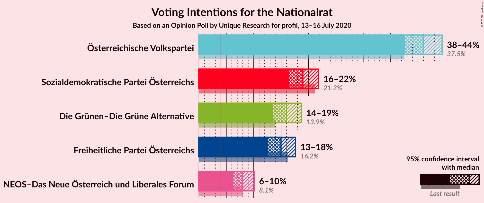

### Confidence Intervals

| Party | Last Result | Poll Result | 80% Confidence Interval | 90% Confidence Interval | 95% Confidence Interval | 99% Confidence Interval |
|:-----:|:-----------:|:-----------:|:-----------------------:|:-----------------------:|:-----------------------:|:-----------------------:|
| Österreichische Volkspartei | 37.5% | 40.9% | 38.7–43.2% |38.1–43.9% |37.6–44.4% |36.5–45.5% |
| Sozialdemokratische Partei Österreichs | 21.2% | 19.0% | 17.3–20.9% |16.8–21.4% |16.4–21.8% |15.6–22.8% |
| Die Grünen–Die Grüne Alternative | 13.9% | 16.0% | 14.4–17.8% |14.0–18.2% |13.6–18.7% |12.9–19.6% |
| Freiheitliche Partei Österreichs | 16.2% | 15.0% | 13.5–16.7% |13.0–17.2% |12.7–17.6% |12.0–18.5% |
| NEOS–Das Neue Österreich und Liberales Forum | 8.1% | 8.0% | 6.9–9.4% |6.6–9.7% |6.3–10.1% |5.8–10.8% |

*Note:* The poll result column reflects the actual value used in the calculations. Published results may vary slightly, and in addition be rounded to fewer digits.

## Seats

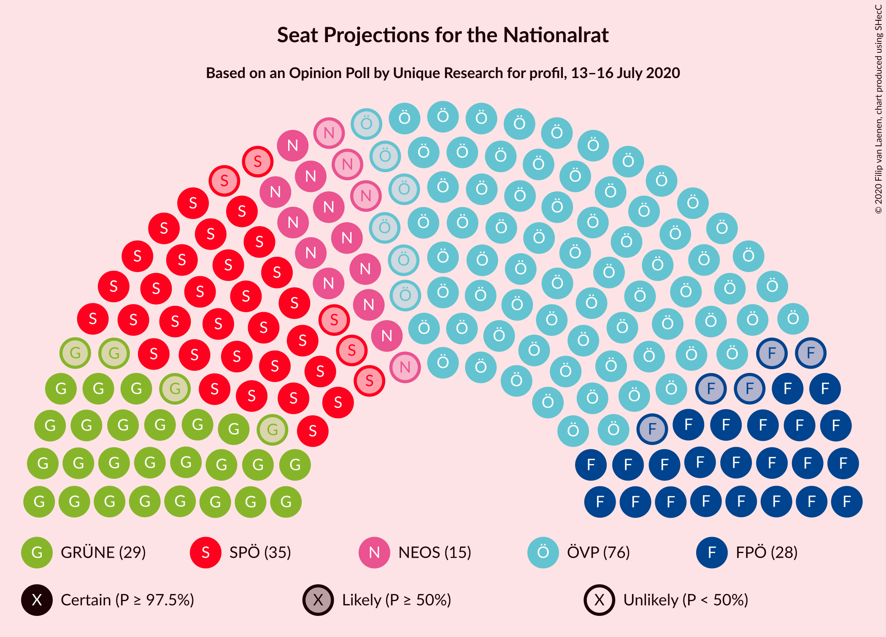

### Confidence Intervals

| Party | Last Result | Median | 80% Confidence Interval | 90% Confidence Interval | 95% Confidence Interval | 99% Confidence Interval |
|:-----:|:-----------:|:------:|:-----------------------:|:-----------------------:|:-----------------------:|:-----------------------:|
| <a href="#österreichische-volkspartei">Österreichische Volkspartei</a> | 71 | 76 | 72–80 |71–81 |70–82 |68–84 |
| <a href="#sozialdemokratische-partei-österreichs">Sozialdemokratische Partei Österreichs</a> | 40 | 35 | 32–38 |31–39 |30–40 |29–42 |
| <a href="#die-grünen–die-grüne-alternative">Die Grünen–Die Grüne Alternative</a> | 26 | 29 | 26–33 |26–34 |25–34 |24–36 |
| <a href="#freiheitliche-partei-österreichs">Freiheitliche Partei Österreichs</a> | 31 | 28 | 25–31 |24–32 |23–32 |22–34 |
| <a href="#neos–das-neue-österreich-und-liberales-forum">NEOS–Das Neue Österreich und Liberales Forum</a> | 15 | 15 | 12–17 |12–18 |11–18 |10–20 |

### Österreichische Volkspartei

*For a full overview of the results for this party, see the [Österreichische Volkspartei](party-österreichischevolkspartei.html) page.*

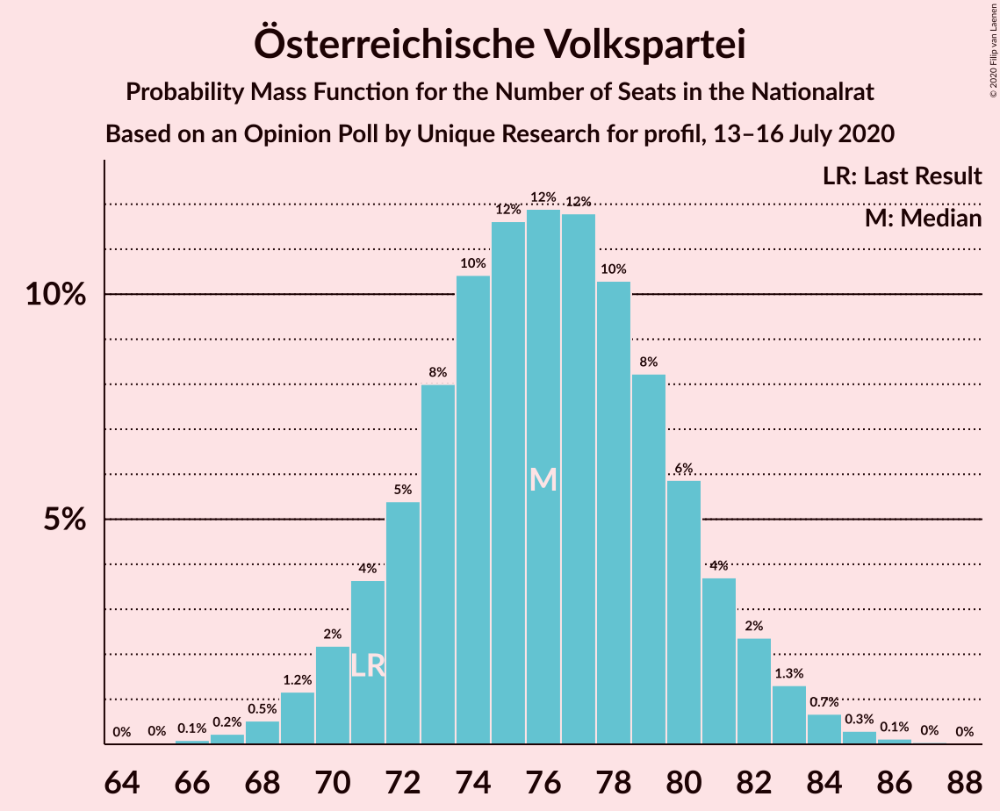

| Number of Seats | Probability | Accumulated | Special Marks |
|:---------------:|:-----------:|:-----------:|:-------------:|
| 66 | 0.1% | 100% |  |
| 67 | 0.2% | 99.9% |  |
| 68 | 0.5% | 99.6% |  |
| 69 | 1.2% | 99.1% |  |
| 70 | 2% | 98% |  |
| 71 | 4% | 96% | Last Result |
| 72 | 5% | 92% |  |
| 73 | 8% | 87% |  |
| 74 | 10% | 79% |  |
| 75 | 12% | 68% |  |
| 76 | 12% | 57% | Median |
| 77 | 12% | 45% |  |
| 78 | 10% | 33% |  |
| 79 | 8% | 23% |  |
| 80 | 6% | 14% |  |
| 81 | 4% | 9% |  |
| 82 | 2% | 5% |  |
| 83 | 1.3% | 2% |  |
| 84 | 0.7% | 1.2% |  |
| 85 | 0.3% | 0.5% |  |
| 86 | 0.1% | 0.2% |  |
| 87 | 0% | 0.1% |  |
| 88 | 0% | 0% |  |

### Sozialdemokratische Partei Österreichs

*For a full overview of the results for this party, see the [Sozialdemokratische Partei Österreichs](party-sozialdemokratischeparteiösterreichs.html) page.*

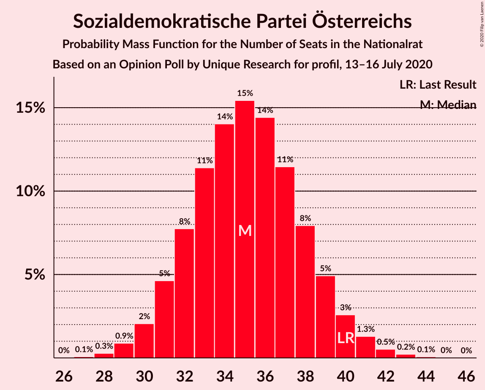

| Number of Seats | Probability | Accumulated | Special Marks |
|:---------------:|:-----------:|:-----------:|:-------------:|
| 27 | 0.1% | 100% |  |
| 28 | 0.3% | 99.9% |  |
| 29 | 0.9% | 99.6% |  |
| 30 | 2% | 98.7% |  |
| 31 | 5% | 97% |  |
| 32 | 8% | 92% |  |
| 33 | 11% | 84% |  |
| 34 | 14% | 73% |  |
| 35 | 15% | 59% | Median |
| 36 | 14% | 43% |  |
| 37 | 11% | 29% |  |
| 38 | 8% | 18% |  |
| 39 | 5% | 10% |  |
| 40 | 3% | 5% | Last Result |
| 41 | 1.3% | 2% |  |
| 42 | 0.5% | 0.8% |  |
| 43 | 0.2% | 0.3% |  |
| 44 | 0.1% | 0.1% |  |
| 45 | 0% | 0% |  |

### Die Grünen–Die Grüne Alternative

*For a full overview of the results for this party, see the [Die Grünen–Die Grüne Alternative](party-diegrünen–diegrünealternative.html) page.*

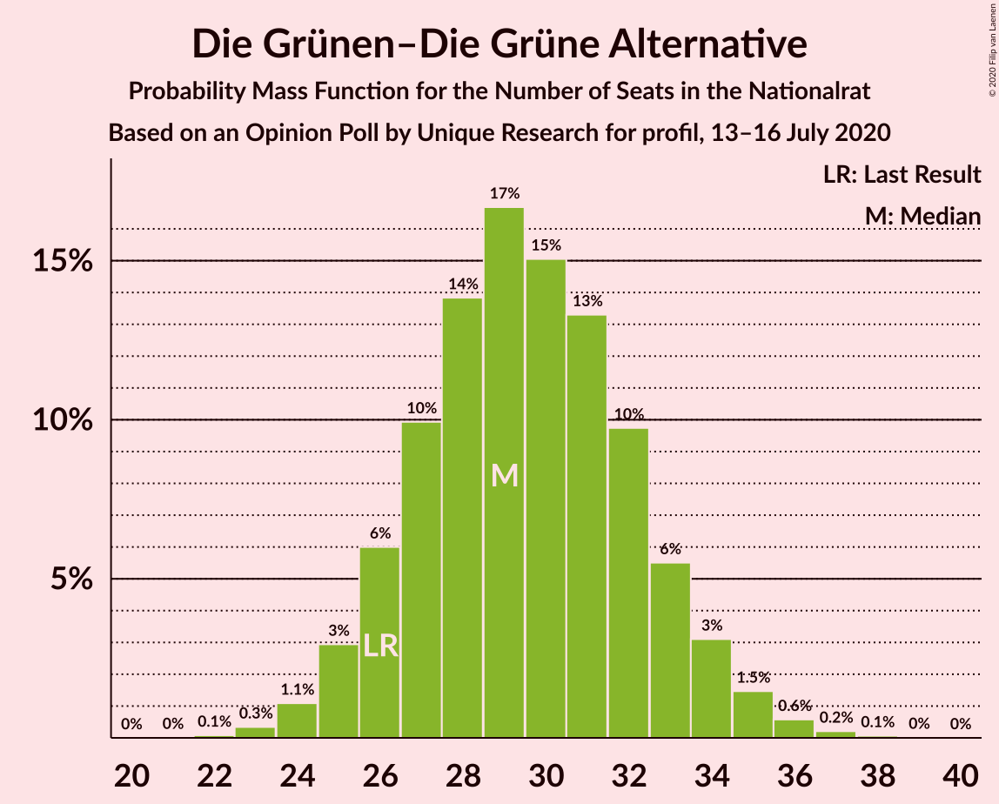

| Number of Seats | Probability | Accumulated | Special Marks |
|:---------------:|:-----------:|:-----------:|:-------------:|
| 22 | 0.1% | 100% |  |
| 23 | 0.3% | 99.9% |  |
| 24 | 1.1% | 99.6% |  |
| 25 | 3% | 98% |  |
| 26 | 6% | 96% | Last Result |
| 27 | 10% | 90% |  |
| 28 | 14% | 80% |  |
| 29 | 17% | 66% | Median |
| 30 | 15% | 49% |  |
| 31 | 13% | 34% |  |
| 32 | 10% | 21% |  |
| 33 | 6% | 11% |  |
| 34 | 3% | 5% |  |
| 35 | 1.5% | 2% |  |
| 36 | 0.6% | 0.9% |  |
| 37 | 0.2% | 0.3% |  |
| 38 | 0.1% | 0.1% |  |
| 39 | 0% | 0% |  |

### Freiheitliche Partei Österreichs

*For a full overview of the results for this party, see the [Freiheitliche Partei Österreichs](party-freiheitlicheparteiösterreichs.html) page.*

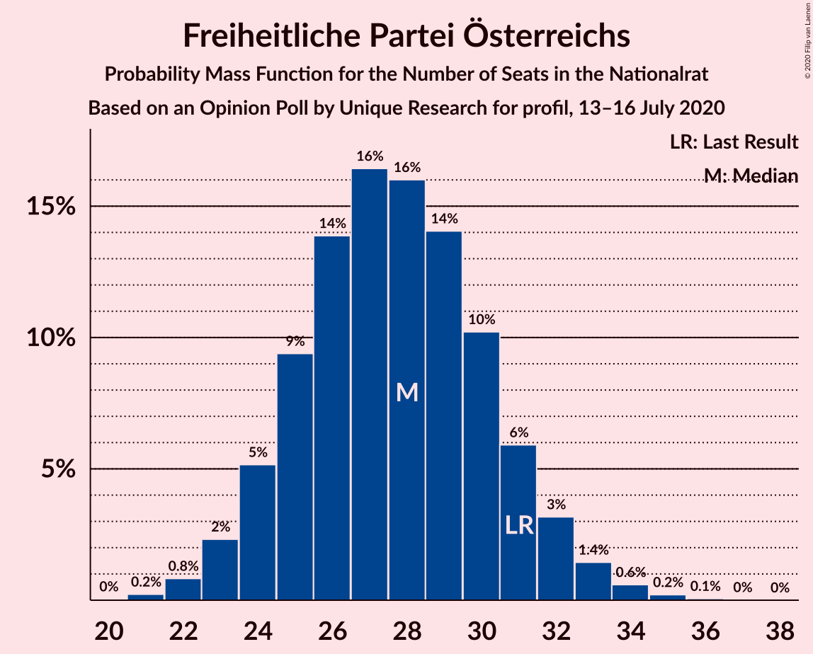

| Number of Seats | Probability | Accumulated | Special Marks |
|:---------------:|:-----------:|:-----------:|:-------------:|
| 20 | 0% | 100% |  |
| 21 | 0.2% | 99.9% |  |
| 22 | 0.8% | 99.7% |  |
| 23 | 2% | 98.9% |  |
| 24 | 5% | 97% |  |
| 25 | 9% | 91% |  |
| 26 | 14% | 82% |  |
| 27 | 16% | 68% |  |
| 28 | 16% | 52% | Median |
| 29 | 14% | 36% |  |
| 30 | 10% | 22% |  |
| 31 | 6% | 11% | Last Result |
| 32 | 3% | 6% |  |
| 33 | 1.4% | 2% |  |
| 34 | 0.6% | 0.9% |  |
| 35 | 0.2% | 0.3% |  |
| 36 | 0.1% | 0.1% |  |
| 37 | 0% | 0% |  |

### NEOS–Das Neue Österreich und Liberales Forum

*For a full overview of the results for this party, see the [NEOS–Das Neue Österreich und Liberales Forum](party-neos–dasneueösterreichundliberalesforum.html) page.*

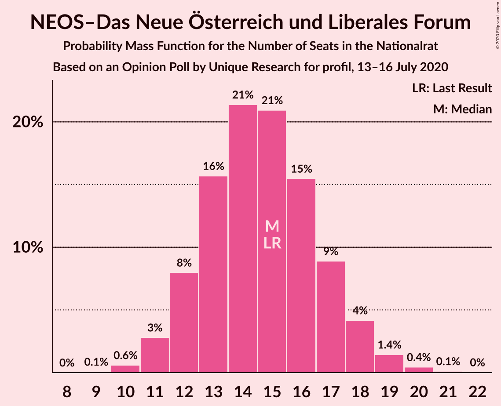

| Number of Seats | Probability | Accumulated | Special Marks |
|:---------------:|:-----------:|:-----------:|:-------------:|
| 9 | 0.1% | 100% |  |
| 10 | 0.6% | 99.9% |  |
| 11 | 3% | 99.3% |  |
| 12 | 8% | 97% |  |
| 13 | 16% | 89% |  |
| 14 | 21% | 73% |  |
| 15 | 21% | 51% | Last Result, Median |
| 16 | 15% | 31% |  |
| 17 | 9% | 15% |  |
| 18 | 4% | 6% |  |
| 19 | 1.4% | 2% |  |
| 20 | 0.4% | 0.6% |  |
| 21 | 0.1% | 0.1% |  |
| 22 | 0% | 0% |  |

## Coalitions

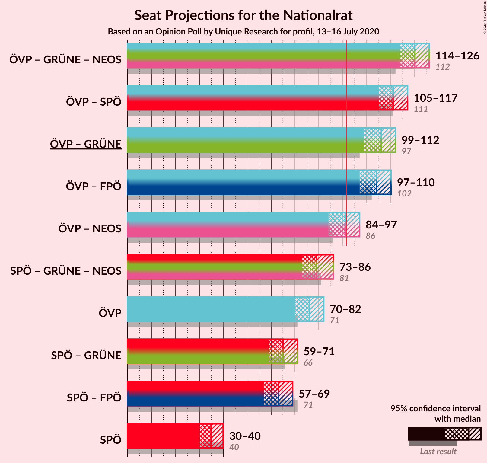

### Confidence Intervals

| Coalition | Last Result | Median | Majority? | 80% Confidence Interval | 90% Confidence Interval | 95% Confidence Interval | 99% Confidence Interval |
|:---------:|:-----------:|:------:|:---------:|:-----------------------:|:-----------------------:|:-----------------------:|:-----------------------:|
| Österreichische Volkspartei – Die Grünen–Die Grüne Alternative – NEOS–Das Neue Österreich und Liberales Forum | 112 | 120 | 100% | 116–124 | 115–125 | 114–126 | 112–128 |
| Österreichische Volkspartei – Sozialdemokratische Partei Österreichs | 111 | 111 | 100% | 107–115 | 106–116 | 105–117 | 103–119 |
| Österreichische Volkspartei – Die Grünen–Die Grüne Alternative | 97 | 106 | 100% | 101–110 | 100–111 | 99–112 | 97–114 |
| Österreichische Volkspartei – Freiheitliche Partei Österreichs | 102 | 104 | 100% | 100–108 | 98–109 | 97–110 | 95–112 |
| Österreichische Volkspartei – NEOS–Das Neue Österreich und Liberales Forum | 86 | 91 | 41% | 86–95 | 85–96 | 84–97 | 82–99 |
| Sozialdemokratische Partei Österreichs – Die Grünen–Die Grüne Alternative – NEOS–Das Neue Österreich und Liberales Forum | 81 | 79 | 0% | 75–83 | 74–85 | 73–86 | 71–88 |
| Österreichische Volkspartei | 71 | 76 | 0% | 72–80 | 71–81 | 70–82 | 68–84 |
| Sozialdemokratische Partei Österreichs – Die Grünen–Die Grüne Alternative | 66 | 65 | 0% | 61–69 | 59–70 | 59–71 | 57–73 |
| Sozialdemokratische Partei Österreichs – Freiheitliche Partei Österreichs | 71 | 63 | 0% | 59–67 | 58–68 | 57–69 | 55–71 |
| Sozialdemokratische Partei Österreichs | 40 | 35 | 0% | 32–38 | 31–39 | 30–40 | 29–42 |

### Österreichische Volkspartei – Die Grünen–Die Grüne Alternative – NEOS–Das Neue Österreich und Liberales Forum

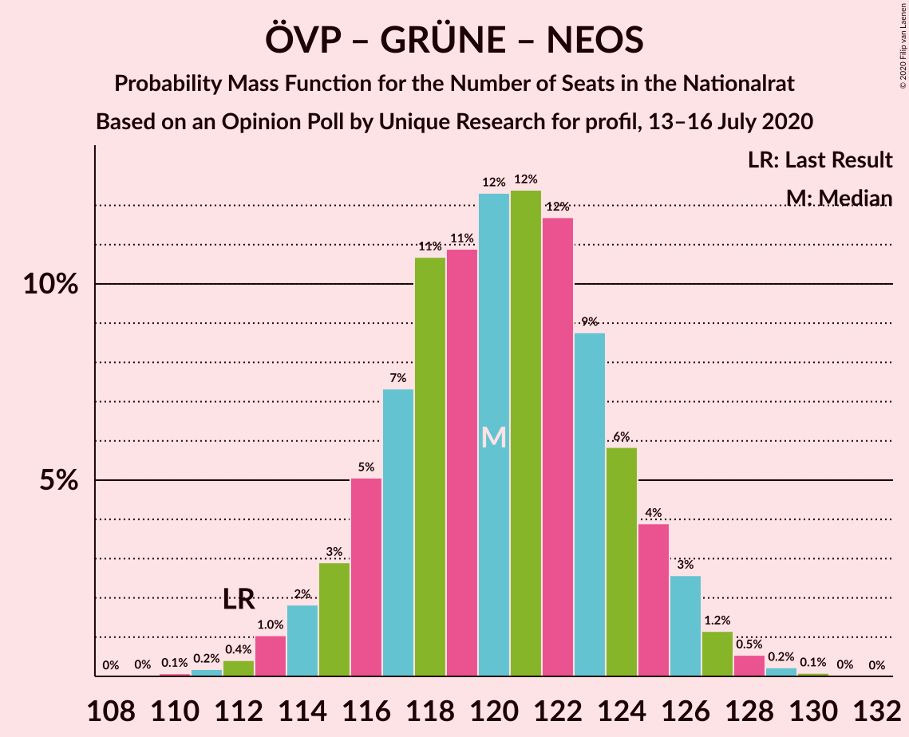

| Number of Seats | Probability | Accumulated | Special Marks |
|:---------------:|:-----------:|:-----------:|:-------------:|
| 110 | 0.1% | 100% |  |
| 111 | 0.2% | 99.9% |  |
| 112 | 0.4% | 99.7% | Last Result |
| 113 | 1.0% | 99.3% |  |
| 114 | 2% | 98% |  |
| 115 | 3% | 96% |  |
| 116 | 5% | 94% |  |
| 117 | 7% | 88% |  |
| 118 | 11% | 81% |  |
| 119 | 11% | 70% |  |
| 120 | 12% | 60% | Median |
| 121 | 12% | 47% |  |
| 122 | 12% | 35% |  |
| 123 | 9% | 23% |  |
| 124 | 6% | 14% |  |
| 125 | 4% | 9% |  |
| 126 | 3% | 5% |  |
| 127 | 1.2% | 2% |  |
| 128 | 0.5% | 0.9% |  |
| 129 | 0.2% | 0.4% |  |
| 130 | 0.1% | 0.1% |  |
| 131 | 0% | 0% |  |

### Österreichische Volkspartei – Sozialdemokratische Partei Österreichs

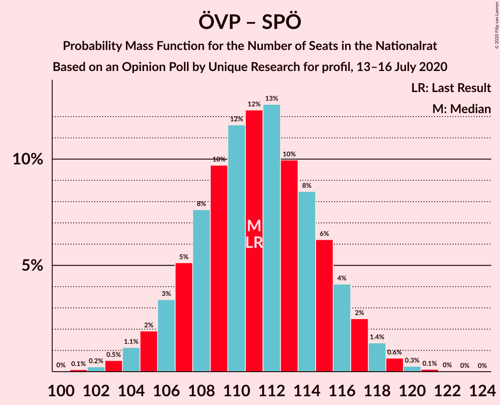

| Number of Seats | Probability | Accumulated | Special Marks |
|:---------------:|:-----------:|:-----------:|:-------------:|
| 100 | 0% | 100% |  |
| 101 | 0.1% | 99.9% |  |
| 102 | 0.2% | 99.9% |  |
| 103 | 0.5% | 99.6% |  |
| 104 | 1.1% | 99.1% |  |
| 105 | 2% | 98% |  |
| 106 | 3% | 96% |  |
| 107 | 5% | 93% |  |
| 108 | 8% | 88% |  |
| 109 | 10% | 80% |  |
| 110 | 12% | 70% |  |
| 111 | 12% | 59% | Last Result, Median |
| 112 | 13% | 46% |  |
| 113 | 10% | 34% |  |
| 114 | 8% | 24% |  |
| 115 | 6% | 15% |  |
| 116 | 4% | 9% |  |
| 117 | 2% | 5% |  |
| 118 | 1.4% | 2% |  |
| 119 | 0.6% | 1.1% |  |
| 120 | 0.3% | 0.4% |  |
| 121 | 0.1% | 0.2% |  |
| 122 | 0% | 0.1% |  |
| 123 | 0% | 0% |  |

### Österreichische Volkspartei – Die Grünen–Die Grüne Alternative

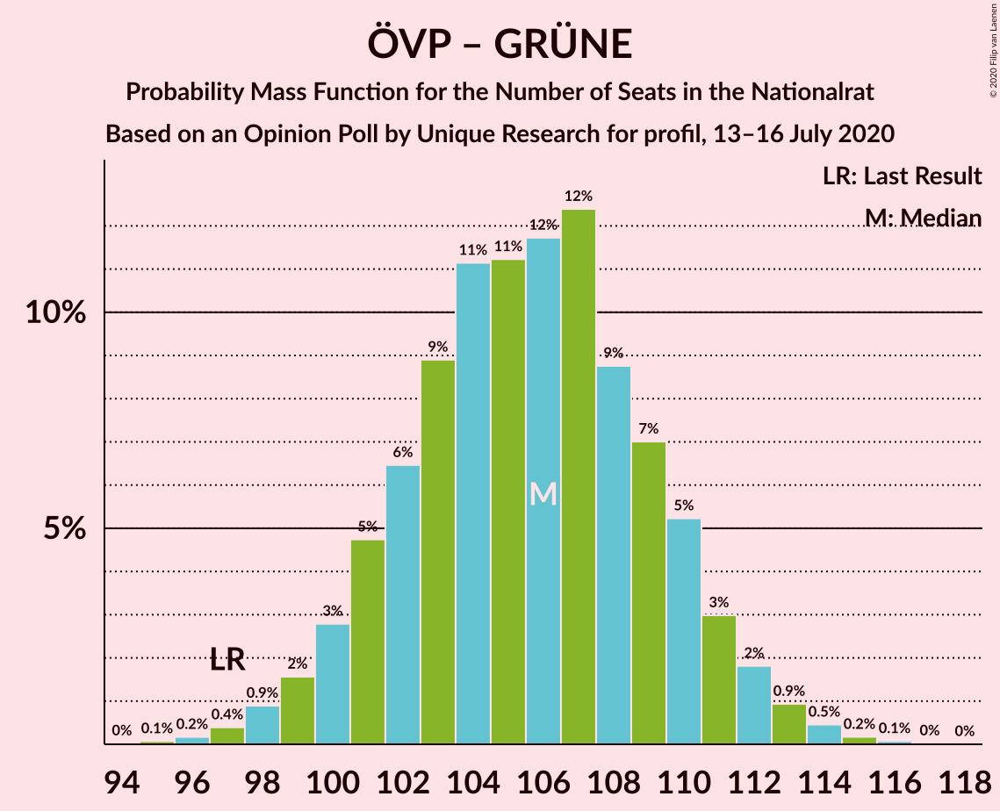

| Number of Seats | Probability | Accumulated | Special Marks |
|:---------------:|:-----------:|:-----------:|:-------------:|
| 95 | 0.1% | 100% |  |
| 96 | 0.2% | 99.9% |  |
| 97 | 0.4% | 99.7% | Last Result |
| 98 | 0.9% | 99.3% |  |
| 99 | 2% | 98% |  |
| 100 | 3% | 97% |  |
| 101 | 5% | 94% |  |
| 102 | 6% | 89% |  |
| 103 | 9% | 83% |  |
| 104 | 11% | 74% |  |
| 105 | 11% | 63% | Median |
| 106 | 12% | 52% |  |
| 107 | 12% | 40% |  |
| 108 | 9% | 27% |  |
| 109 | 7% | 19% |  |
| 110 | 5% | 12% |  |
| 111 | 3% | 6% |  |
| 112 | 2% | 3% |  |
| 113 | 0.9% | 2% |  |
| 114 | 0.5% | 0.7% |  |
| 115 | 0.2% | 0.3% |  |
| 116 | 0.1% | 0.1% |  |
| 117 | 0% | 0% |  |

### Österreichische Volkspartei – Freiheitliche Partei Österreichs

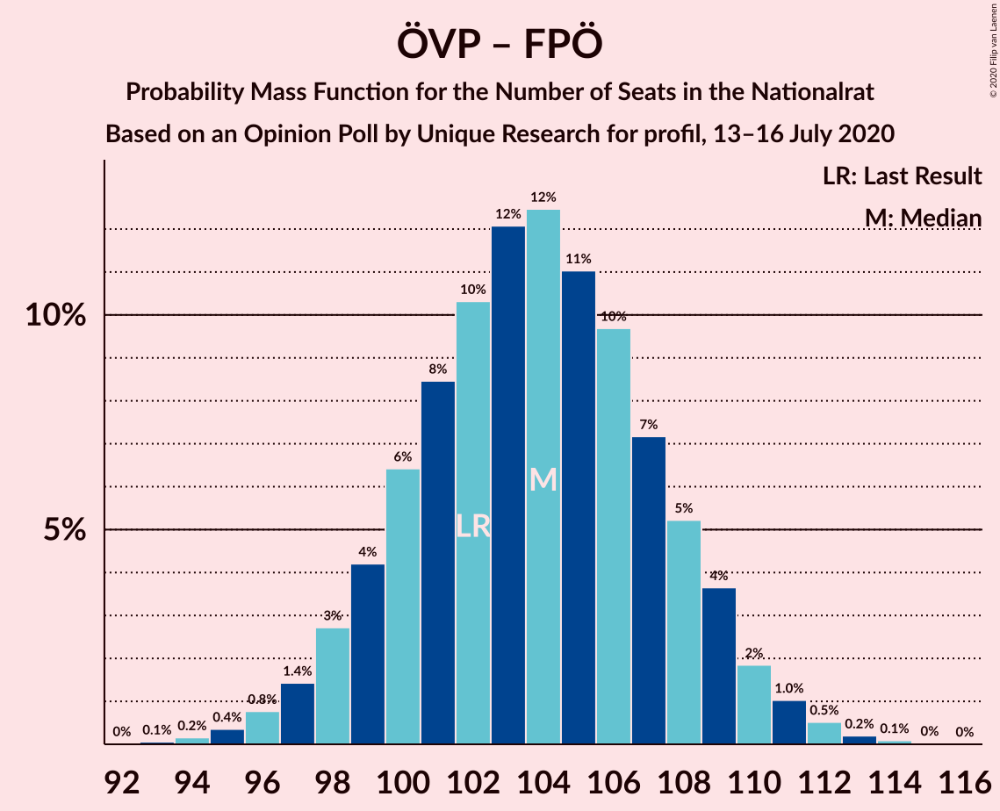

| Number of Seats | Probability | Accumulated | Special Marks |
|:---------------:|:-----------:|:-----------:|:-------------:|
| 93 | 0.1% | 100% |  |
| 94 | 0.2% | 99.9% |  |
| 95 | 0.4% | 99.8% |  |
| 96 | 0.8% | 99.4% |  |
| 97 | 1.4% | 98.6% |  |
| 98 | 3% | 97% |  |
| 99 | 4% | 94% |  |
| 100 | 6% | 90% |  |
| 101 | 8% | 84% |  |
| 102 | 10% | 75% | Last Result |
| 103 | 12% | 65% |  |
| 104 | 12% | 53% | Median |
| 105 | 11% | 41% |  |
| 106 | 10% | 29% |  |
| 107 | 7% | 20% |  |
| 108 | 5% | 13% |  |
| 109 | 4% | 7% |  |
| 110 | 2% | 4% |  |
| 111 | 1.0% | 2% |  |
| 112 | 0.5% | 0.9% |  |
| 113 | 0.2% | 0.3% |  |
| 114 | 0.1% | 0.1% |  |
| 115 | 0% | 0% |  |

### Österreichische Volkspartei – NEOS–Das Neue Österreich und Liberales Forum

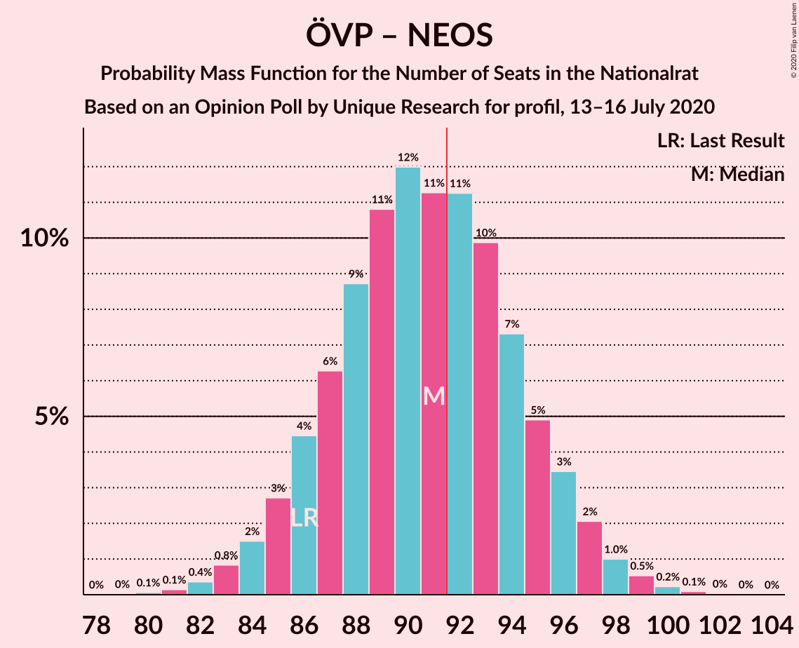

| Number of Seats | Probability | Accumulated | Special Marks |
|:---------------:|:-----------:|:-----------:|:-------------:|
| 80 | 0.1% | 100% |  |
| 81 | 0.1% | 99.9% |  |
| 82 | 0.4% | 99.8% |  |
| 83 | 0.8% | 99.4% |  |
| 84 | 2% | 98.6% |  |
| 85 | 3% | 97% |  |
| 86 | 4% | 94% | Last Result |
| 87 | 6% | 90% |  |
| 88 | 9% | 84% |  |
| 89 | 11% | 75% |  |
| 90 | 12% | 64% |  |
| 91 | 11% | 52% | Median |
| 92 | 11% | 41% | Majority |
| 93 | 10% | 30% |  |
| 94 | 7% | 20% |  |
| 95 | 5% | 12% |  |
| 96 | 3% | 7% |  |
| 97 | 2% | 4% |  |
| 98 | 1.0% | 2% |  |
| 99 | 0.5% | 0.9% |  |
| 100 | 0.2% | 0.4% |  |
| 101 | 0.1% | 0.1% |  |
| 102 | 0% | 0.1% |  |
| 103 | 0% | 0% |  |

### Sozialdemokratische Partei Österreichs – Die Grünen–Die Grüne Alternative – NEOS–Das Neue Österreich und Liberales Forum

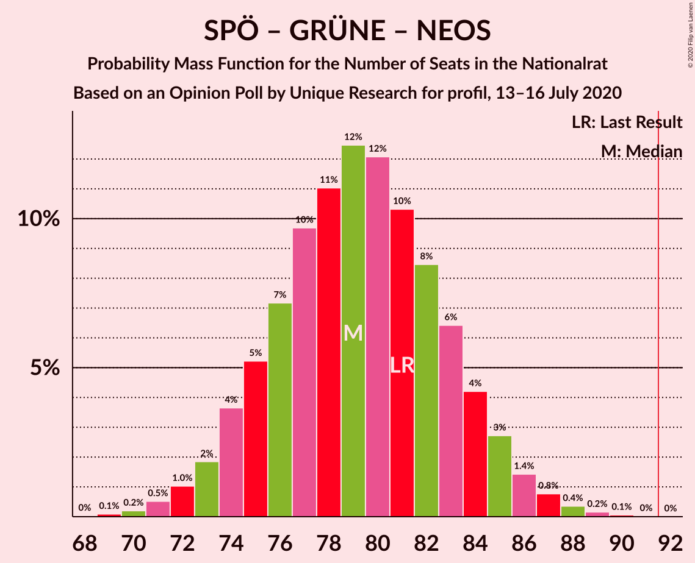

| Number of Seats | Probability | Accumulated | Special Marks |
|:---------------:|:-----------:|:-----------:|:-------------:|
| 69 | 0.1% | 100% |  |
| 70 | 0.2% | 99.9% |  |
| 71 | 0.5% | 99.7% |  |
| 72 | 1.0% | 99.1% |  |
| 73 | 2% | 98% |  |
| 74 | 4% | 96% |  |
| 75 | 5% | 93% |  |
| 76 | 7% | 87% |  |
| 77 | 10% | 80% |  |
| 78 | 11% | 71% |  |
| 79 | 12% | 59% | Median |
| 80 | 12% | 47% |  |
| 81 | 10% | 35% | Last Result |
| 82 | 8% | 25% |  |
| 83 | 6% | 16% |  |
| 84 | 4% | 10% |  |
| 85 | 3% | 6% |  |
| 86 | 1.4% | 3% |  |
| 87 | 0.8% | 1.4% |  |
| 88 | 0.4% | 0.6% |  |
| 89 | 0.2% | 0.2% |  |
| 90 | 0.1% | 0.1% |  |
| 91 | 0% | 0% |  |

### Österreichische Volkspartei

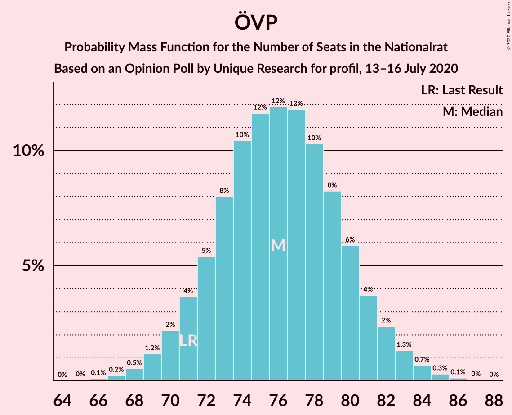

| Number of Seats | Probability | Accumulated | Special Marks |
|:---------------:|:-----------:|:-----------:|:-------------:|
| 66 | 0.1% | 100% |  |
| 67 | 0.2% | 99.9% |  |
| 68 | 0.5% | 99.6% |  |
| 69 | 1.2% | 99.1% |  |
| 70 | 2% | 98% |  |
| 71 | 4% | 96% | Last Result |
| 72 | 5% | 92% |  |
| 73 | 8% | 87% |  |
| 74 | 10% | 79% |  |
| 75 | 12% | 68% |  |
| 76 | 12% | 57% | Median |
| 77 | 12% | 45% |  |
| 78 | 10% | 33% |  |
| 79 | 8% | 23% |  |
| 80 | 6% | 14% |  |
| 81 | 4% | 9% |  |
| 82 | 2% | 5% |  |
| 83 | 1.3% | 2% |  |
| 84 | 0.7% | 1.2% |  |
| 85 | 0.3% | 0.5% |  |
| 86 | 0.1% | 0.2% |  |
| 87 | 0% | 0.1% |  |
| 88 | 0% | 0% |  |

### Sozialdemokratische Partei Österreichs – Die Grünen–Die Grüne Alternative

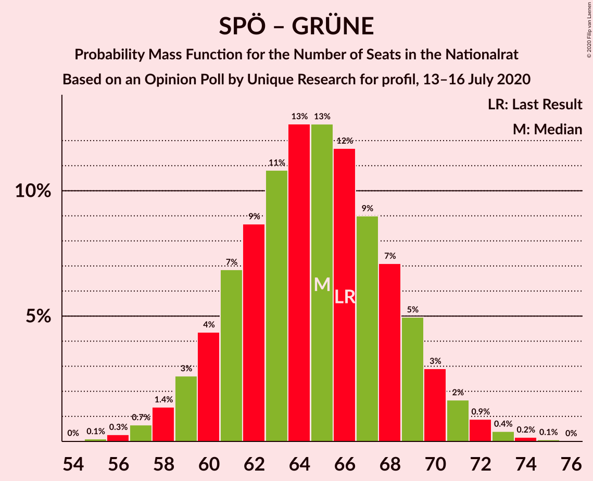

| Number of Seats | Probability | Accumulated | Special Marks |
|:---------------:|:-----------:|:-----------:|:-------------:|
| 55 | 0.1% | 100% |  |
| 56 | 0.3% | 99.8% |  |
| 57 | 0.7% | 99.6% |  |
| 58 | 1.4% | 98.9% |  |
| 59 | 3% | 98% |  |
| 60 | 4% | 95% |  |
| 61 | 7% | 91% |  |
| 62 | 9% | 84% |  |
| 63 | 11% | 75% |  |
| 64 | 13% | 64% | Median |
| 65 | 13% | 52% |  |
| 66 | 12% | 39% | Last Result |
| 67 | 9% | 27% |  |
| 68 | 7% | 18% |  |
| 69 | 5% | 11% |  |
| 70 | 3% | 6% |  |
| 71 | 2% | 3% |  |
| 72 | 0.9% | 2% |  |
| 73 | 0.4% | 0.7% |  |
| 74 | 0.2% | 0.3% |  |
| 75 | 0.1% | 0.1% |  |
| 76 | 0% | 0% |  |

### Sozialdemokratische Partei Österreichs – Freiheitliche Partei Österreichs

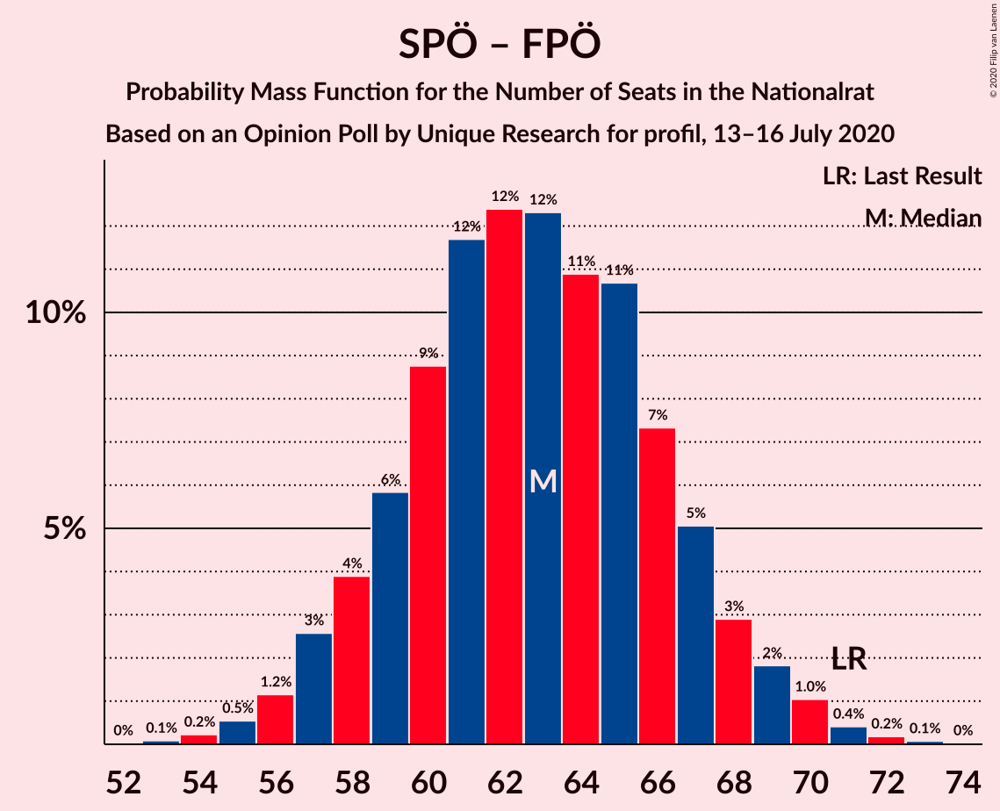

| Number of Seats | Probability | Accumulated | Special Marks |
|:---------------:|:-----------:|:-----------:|:-------------:|
| 53 | 0.1% | 100% |  |
| 54 | 0.2% | 99.9% |  |
| 55 | 0.5% | 99.6% |  |
| 56 | 1.2% | 99.1% |  |
| 57 | 3% | 98% |  |
| 58 | 4% | 95% |  |
| 59 | 6% | 91% |  |
| 60 | 9% | 86% |  |
| 61 | 12% | 77% |  |
| 62 | 12% | 65% |  |
| 63 | 12% | 53% | Median |
| 64 | 11% | 40% |  |
| 65 | 11% | 30% |  |
| 66 | 7% | 19% |  |
| 67 | 5% | 12% |  |
| 68 | 3% | 6% |  |
| 69 | 2% | 4% |  |
| 70 | 1.0% | 2% |  |
| 71 | 0.4% | 0.7% | Last Result |
| 72 | 0.2% | 0.3% |  |
| 73 | 0.1% | 0.1% |  |
| 74 | 0% | 0% |  |

### Sozialdemokratische Partei Österreichs

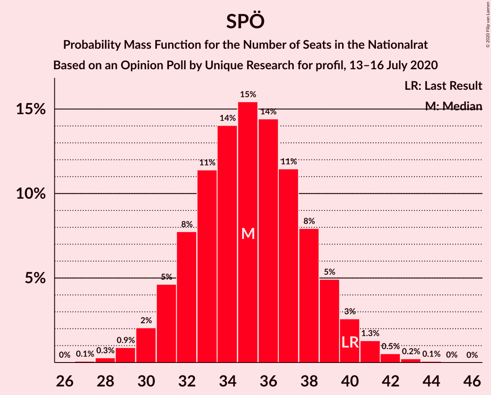

| Number of Seats | Probability | Accumulated | Special Marks |
|:---------------:|:-----------:|:-----------:|:-------------:|
| 27 | 0.1% | 100% |  |
| 28 | 0.3% | 99.9% |  |
| 29 | 0.9% | 99.6% |  |
| 30 | 2% | 98.7% |  |
| 31 | 5% | 97% |  |
| 32 | 8% | 92% |  |
| 33 | 11% | 84% |  |
| 34 | 14% | 73% |  |
| 35 | 15% | 59% | Median |
| 36 | 14% | 43% |  |
| 37 | 11% | 29% |  |
| 38 | 8% | 18% |  |
| 39 | 5% | 10% |  |
| 40 | 3% | 5% | Last Result |
| 41 | 1.3% | 2% |  |
| 42 | 0.5% | 0.8% |  |
| 43 | 0.2% | 0.3% |  |
| 44 | 0.1% | 0.1% |  |
| 45 | 0% | 0% |  |

## Technical Information

### Opinion Poll

+ **Polling firm:** Unique Research
+ **Commissioner(s):** profil
+ **Fieldwork period:** 13–16 July 2020

### Calculations

+ **Sample size:** 801
+ **Simulations done:** 1,048,576
+ **Error estimate:** 0.79%

