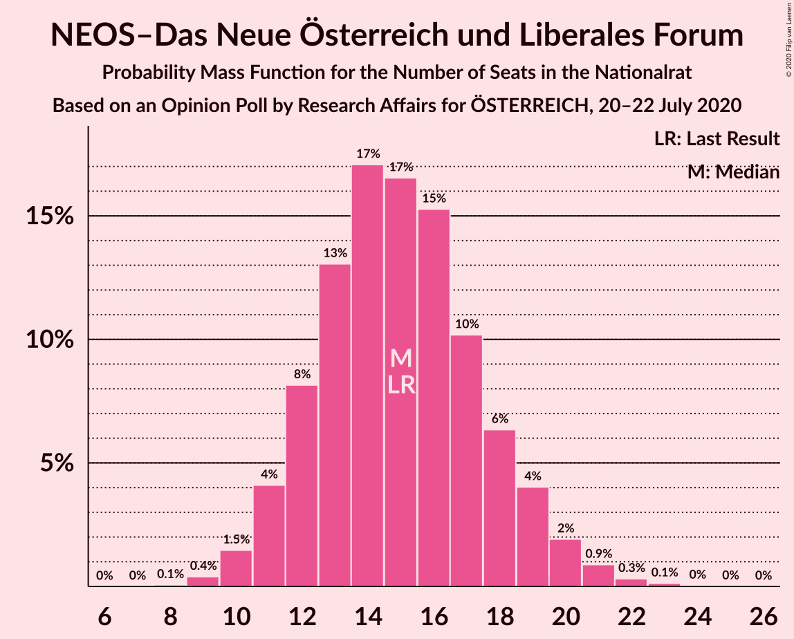
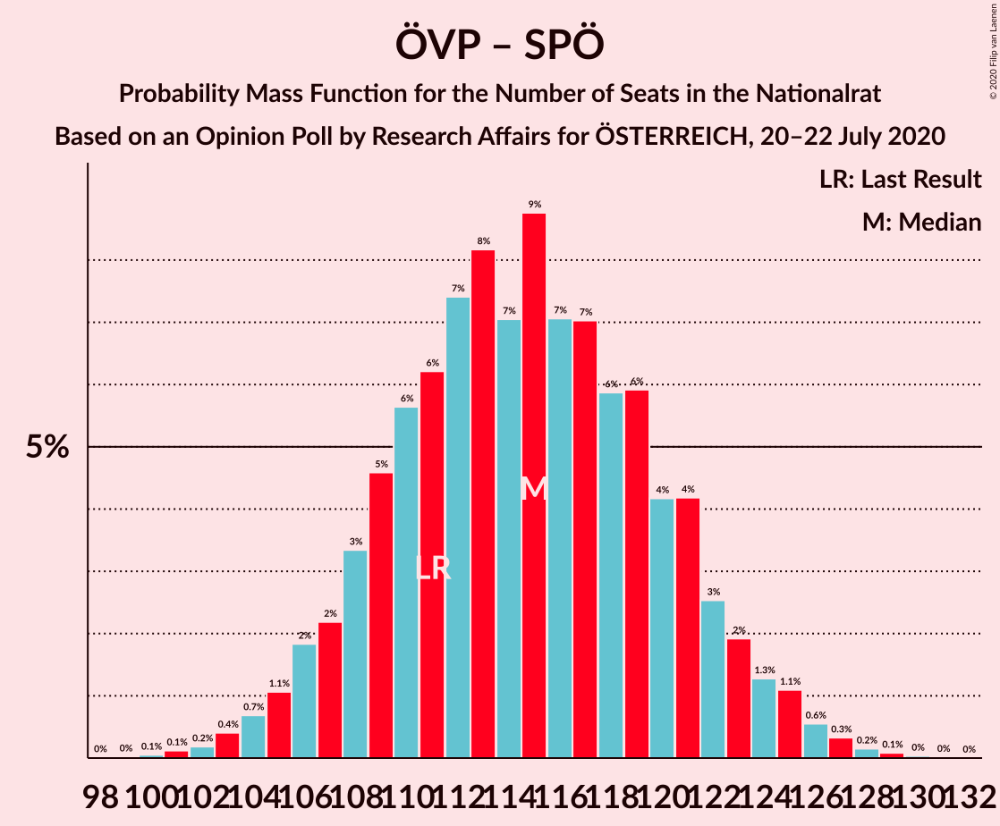
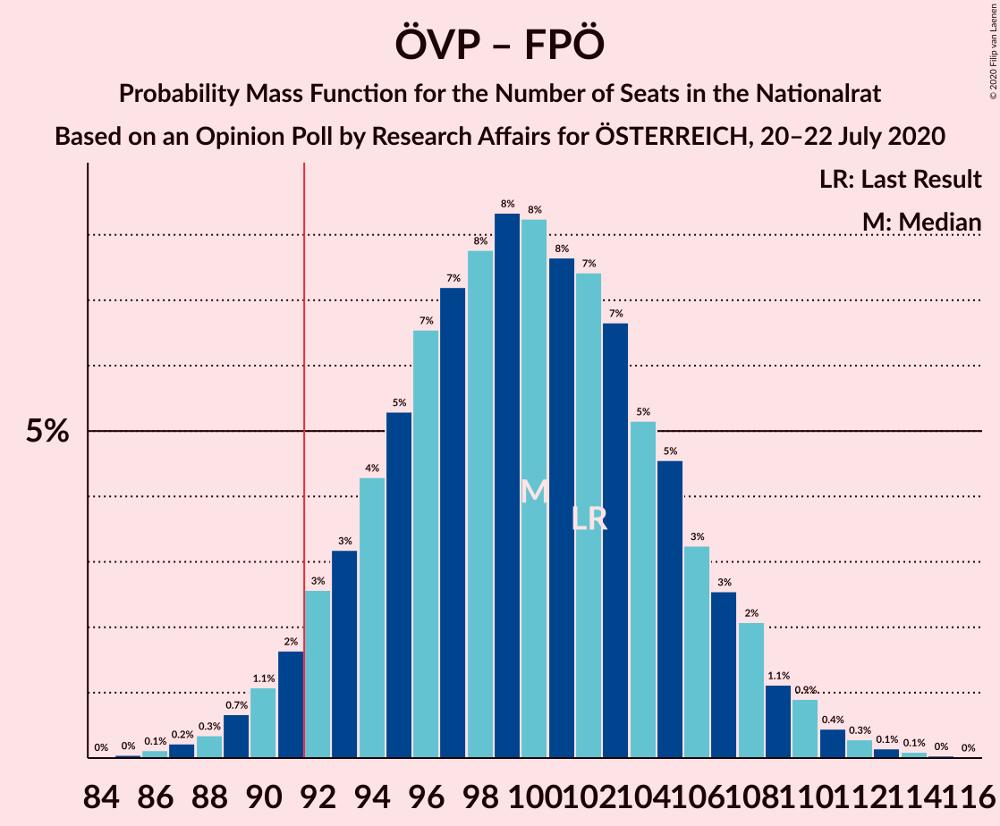

# Opinion Poll by Research Affairs for ÖSTERREICH, 20–22 July 2020

<a href="#voting-intentions">Voting Intentions</a> | <a href="#seats">Seats</a> | <a href="#coalitions">Coalitions</a> | <a href="#technical-information">Technical Information</a>

## Voting Intentions

### Confidence Intervals

| Party | Last Result | Poll Result | 80% Confidence Interval | 90% Confidence Interval | 95% Confidence Interval | 99% Confidence Interval |
|:-----:|:-----------:|:-----------:|:-----------------------:|:-----------------------:|:-----------------------:|:-----------------------:|
| Österreichische Volkspartei | 37.5% | 42.0% | 39.2–44.9% |38.4–45.7% |37.7–46.4% |36.4–47.8% |
| Sozialdemokratische Partei Österreichs | 21.2% | 19.0% | 16.9–21.4% |16.3–22.1% |15.8–22.7% |14.8–23.9% |
| Die Grünen–Die Grüne Alternative | 13.9% | 15.0% | 13.1–17.2% |12.6–17.8% |12.1–18.4% |11.3–19.5% |
| Freiheitliche Partei Österreichs | 16.2% | 11.0% | 9.4–13.0% |8.9–13.5% |8.6–14.1% |7.8–15.1% |
| NEOS–Das Neue Österreich und Liberales Forum | 8.1% | 8.0% | 6.6–9.8% |6.2–10.3% |5.9–10.7% |5.3–11.6% |
| Team HC Strache–Allianz für Österreich | 0.0% | 4.0% | 3.1–5.4% |2.8–5.8% |2.6–6.1% |2.2–6.8% |

*Note:* The poll result column reflects the actual value used in the calculations. Published results may vary slightly, and in addition be rounded to fewer digits.

## Seats

### Confidence Intervals

| Party | Last Result | Median | 80% Confidence Interval | 90% Confidence Interval | 95% Confidence Interval | 99% Confidence Interval |
|:-----:|:-----------:|:------:|:-----------------------:|:-----------------------:|:-----------------------:|:-----------------------:|
| <a href="#österreichische-volkspartei">Österreichische Volkspartei</a> | 71 | 79 | 73–85 |72–86 |70–88 |68–91 |
| <a href="#sozialdemokratische-partei-österreichs">Sozialdemokratische Partei Österreichs</a> | 40 | 36 | 31–40 |30–41 |29–43 |27–45 |
| <a href="#die-grünen–die-grüne-alternative">Die Grünen–Die Grüne Alternative</a> | 26 | 28 | 24–32 |23–34 |22–34 |21–37 |
| <a href="#freiheitliche-partei-österreichs">Freiheitliche Partei Österreichs</a> | 31 | 21 | 17–24 |16–25 |16–26 |14–28 |
| <a href="#neos–das-neue-österreich-und-liberales-forum">NEOS–Das Neue Österreich und Liberales Forum</a> | 15 | 15 | 12–18 |11–19 |11–20 |10–22 |
| <a href="#team-hc-strache–allianz-für-österreich">Team HC Strache–Allianz für Österreich</a> | 0 | 7 | 0–9 |0–10 |0–11 |0–12 |

### Österreichische Volkspartei

*For a full overview of the results for this party, see the [Österreichische Volkspartei](party-österreichischevolkspartei.html) page.*

| Number of Seats | Probability | Accumulated | Special Marks |
|:---------------:|:-----------:|:-----------:|:-------------:|
| 65 | 0.1% | 100% |  |
| 66 | 0.1% | 99.9% |  |
| 67 | 0.2% | 99.8% |  |
| 68 | 0.4% | 99.6% |  |
| 69 | 0.6% | 99.2% |  |
| 70 | 1.3% | 98.6% |  |
| 71 | 2% | 97% | Last Result |
| 72 | 3% | 95% |  |
| 73 | 4% | 93% |  |
| 74 | 5% | 89% |  |
| 75 | 6% | 84% |  |
| 76 | 8% | 78% |  |
| 77 | 7% | 70% |  |
| 78 | 9% | 63% |  |
| 79 | 9% | 54% | Median |
| 80 | 9% | 45% |  |
| 81 | 8% | 37% |  |
| 82 | 6% | 28% |  |
| 83 | 5% | 22% |  |
| 84 | 5% | 17% |  |
| 85 | 3% | 11% |  |
| 86 | 3% | 8% |  |
| 87 | 2% | 5% |  |
| 88 | 1.0% | 3% |  |
| 89 | 1.0% | 2% |  |
| 90 | 0.4% | 1.0% |  |
| 91 | 0.3% | 0.6% |  |
| 92 | 0.1% | 0.3% | Majority |
| 93 | 0.1% | 0.2% |  |
| 94 | 0.1% | 0.1% |  |
| 95 | 0% | 0% |  |

### Sozialdemokratische Partei Österreichs

*For a full overview of the results for this party, see the [Sozialdemokratische Partei Österreichs](party-sozialdemokratischeparteiösterreichs.html) page.*

| Number of Seats | Probability | Accumulated | Special Marks |
|:---------------:|:-----------:|:-----------:|:-------------:|
| 25 | 0% | 100% |  |
| 26 | 0.1% | 99.9% |  |
| 27 | 0.3% | 99.8% |  |
| 28 | 0.8% | 99.5% |  |
| 29 | 2% | 98.7% |  |
| 30 | 3% | 97% |  |
| 31 | 5% | 94% |  |
| 32 | 7% | 89% |  |
| 33 | 9% | 82% |  |
| 34 | 11% | 73% |  |
| 35 | 12% | 62% |  |
| 36 | 11% | 50% | Median |
| 37 | 10% | 39% |  |
| 38 | 9% | 29% |  |
| 39 | 7% | 20% |  |
| 40 | 5% | 13% | Last Result |
| 41 | 3% | 8% |  |
| 42 | 2% | 5% |  |
| 43 | 1.3% | 3% |  |
| 44 | 0.7% | 1.4% |  |
| 45 | 0.4% | 0.7% |  |
| 46 | 0.2% | 0.3% |  |
| 47 | 0.1% | 0.1% |  |
| 48 | 0% | 0.1% |  |
| 49 | 0% | 0% |  |

### Die Grünen–Die Grüne Alternative

*For a full overview of the results for this party, see the [Die Grünen–Die Grüne Alternative](party-diegrünen–diegrünealternative.html) page.*

| Number of Seats | Probability | Accumulated | Special Marks |
|:---------------:|:-----------:|:-----------:|:-------------:|
| 19 | 0.1% | 100% |  |
| 20 | 0.2% | 99.9% |  |
| 21 | 0.6% | 99.6% |  |
| 22 | 2% | 99.0% |  |
| 23 | 3% | 97% |  |
| 24 | 5% | 94% |  |
| 25 | 10% | 89% |  |
| 26 | 9% | 79% | Last Result |
| 27 | 11% | 70% |  |
| 28 | 16% | 59% | Median |
| 29 | 11% | 43% |  |
| 30 | 9% | 32% |  |
| 31 | 10% | 23% |  |
| 32 | 5% | 13% |  |
| 33 | 3% | 8% |  |
| 34 | 3% | 5% |  |
| 35 | 1.0% | 2% |  |
| 36 | 0.5% | 1.1% |  |
| 37 | 0.4% | 0.6% |  |
| 38 | 0.1% | 0.2% |  |
| 39 | 0.1% | 0.1% |  |
| 40 | 0% | 0% |  |

### Freiheitliche Partei Österreichs

*For a full overview of the results for this party, see the [Freiheitliche Partei Österreichs](party-freiheitlicheparteiösterreichs.html) page.*

| Number of Seats | Probability | Accumulated | Special Marks |
|:---------------:|:-----------:|:-----------:|:-------------:|
| 13 | 0.1% | 100% |  |
| 14 | 0.5% | 99.8% |  |
| 15 | 2% | 99.3% |  |
| 16 | 3% | 98% |  |
| 17 | 6% | 94% |  |
| 18 | 10% | 88% |  |
| 19 | 13% | 78% |  |
| 20 | 15% | 65% |  |
| 21 | 15% | 50% | Median |
| 22 | 12% | 36% |  |
| 23 | 9% | 24% |  |
| 24 | 6% | 14% |  |
| 25 | 4% | 8% |  |
| 26 | 2% | 4% |  |
| 27 | 1.1% | 2% |  |
| 28 | 0.5% | 0.9% |  |
| 29 | 0.2% | 0.4% |  |
| 30 | 0.1% | 0.1% |  |
| 31 | 0% | 0% | Last Result |

### NEOS–Das Neue Österreich und Liberales Forum

*For a full overview of the results for this party, see the [NEOS–Das Neue Österreich und Liberales Forum](party-neos–dasneueösterreichundliberalesforum.html) page.*

| Number of Seats | Probability | Accumulated | Special Marks |
|:---------------:|:-----------:|:-----------:|:-------------:|
| 8 | 0.1% | 100% |  |
| 9 | 0.4% | 99.9% |  |
| 10 | 1.5% | 99.5% |  |
| 11 | 4% | 98% |  |
| 12 | 8% | 94% |  |
| 13 | 13% | 86% |  |
| 14 | 17% | 73% |  |
| 15 | 17% | 56% | Last Result, Median |
| 16 | 15% | 39% |  |
| 17 | 10% | 24% |  |
| 18 | 6% | 14% |  |
| 19 | 4% | 7% |  |
| 20 | 2% | 3% |  |
| 21 | 0.9% | 1.4% |  |
| 22 | 0.3% | 0.5% |  |
| 23 | 0.1% | 0.2% |  |
| 24 | 0% | 0.1% |  |
| 25 | 0% | 0% |  |

### Team HC Strache–Allianz für Österreich

*For a full overview of the results for this party, see the [Team HC Strache–Allianz für Österreich](party-teamhcstrache–allianzfürösterreich.html) page.*

| Number of Seats | Probability | Accumulated | Special Marks |
|:---------------:|:-----------:|:-----------:|:-------------:|
| 0 | 46% | 100% | Last Result |
| 1 | 0% | 54% |  |
| 2 | 0% | 54% |  |
| 3 | 0% | 54% |  |
| 4 | 0% | 54% |  |
| 5 | 0% | 54% |  |
| 6 | 0% | 54% |  |
| 7 | 11% | 54% | Median |
| 8 | 20% | 43% |  |
| 9 | 12% | 22% |  |
| 10 | 6% | 10% |  |
| 11 | 2% | 4% |  |
| 12 | 0.9% | 1.2% |  |
| 13 | 0.3% | 0.3% |  |
| 14 | 0.1% | 0.1% |  |
| 15 | 0% | 0% |  |

## Coalitions

### Confidence Intervals

| Coalition | Last Result | Median | Majority? | 80% Confidence Interval | 90% Confidence Interval | 95% Confidence Interval | 99% Confidence Interval |
|:---------:|:-----------:|:------:|:---------:|:-----------------------:|:-----------------------:|:-----------------------:|:-----------------------:|
| Österreichische Volkspartei – Die Grünen–Die Grüne Alternative – NEOS–Das Neue Österreich und Liberales Forum | 112 | 122 | 100% | 116–128 | 114–130 | 113–131 | 110–134 |
| Österreichische Volkspartei – Sozialdemokratische Partei Österreichs | 111 | 115 | 100% | 109–121 | 107–123 | 105–124 | 103–127 |
| Österreichische Volkspartei – Die Grünen–Die Grüne Alternative | 97 | 107 | 100% | 101–113 | 99–115 | 98–117 | 95–119 |
| Österreichische Volkspartei – Freiheitliche Partei Österreichs | 102 | 100 | 96% | 94–106 | 92–108 | 90–109 | 88–112 |
| Österreichische Volkspartei – NEOS–Das Neue Österreich und Liberales Forum | 86 | 94 | 68% | 88–100 | 86–102 | 85–103 | 82–106 |
| Sozialdemokratische Partei Österreichs – Die Grünen–Die Grüne Alternative – NEOS–Das Neue Österreich und Liberales Forum | 81 | 79 | 0.3% | 73–85 | 71–86 | 70–88 | 68–91 |
| Österreichische Volkspartei | 71 | 79 | 0.3% | 73–85 | 72–86 | 70–88 | 68–91 |
| Sozialdemokratische Partei Österreichs – Die Grünen–Die Grüne Alternative | 66 | 64 | 0% | 58–69 | 57–71 | 56–72 | 53–75 |
| Sozialdemokratische Partei Österreichs – Freiheitliche Partei Österreichs | 71 | 56 | 0% | 51–62 | 50–63 | 48–64 | 46–67 |
| Sozialdemokratische Partei Österreichs | 40 | 36 | 0% | 31–40 | 30–41 | 29–43 | 27–45 |

### Österreichische Volkspartei – Die Grünen–Die Grüne Alternative – NEOS–Das Neue Österreich und Liberales Forum

| Number of Seats | Probability | Accumulated | Special Marks |
|:---------------:|:-----------:|:-----------:|:-------------:|
| 107 | 0% | 100% |  |
| 108 | 0.1% | 99.9% |  |
| 109 | 0.2% | 99.8% |  |
| 110 | 0.3% | 99.7% |  |
| 111 | 0.6% | 99.4% |  |
| 112 | 0.9% | 98.8% | Last Result |
| 113 | 1.3% | 98% |  |
| 114 | 2% | 97% |  |
| 115 | 3% | 94% |  |
| 116 | 4% | 91% |  |
| 117 | 5% | 88% |  |
| 118 | 6% | 83% |  |
| 119 | 7% | 77% |  |
| 120 | 7% | 70% |  |
| 121 | 8% | 62% |  |
| 122 | 8% | 55% | Median |
| 123 | 7% | 46% |  |
| 124 | 7% | 39% |  |
| 125 | 7% | 32% |  |
| 126 | 5% | 25% |  |
| 127 | 6% | 19% |  |
| 128 | 4% | 14% |  |
| 129 | 3% | 10% |  |
| 130 | 3% | 7% |  |
| 131 | 2% | 4% |  |
| 132 | 1.1% | 2% |  |
| 133 | 0.6% | 1.4% |  |
| 134 | 0.4% | 0.8% |  |
| 135 | 0.2% | 0.4% |  |
| 136 | 0.1% | 0.2% |  |
| 137 | 0.1% | 0.1% |  |
| 138 | 0% | 0% |  |

### Österreichische Volkspartei – Sozialdemokratische Partei Österreichs

| Number of Seats | Probability | Accumulated | Special Marks |
|:---------------:|:-----------:|:-----------:|:-------------:|
| 100 | 0.1% | 100% |  |
| 101 | 0.1% | 99.9% |  |
| 102 | 0.2% | 99.8% |  |
| 103 | 0.4% | 99.6% |  |
| 104 | 0.7% | 99.2% |  |
| 105 | 1.1% | 98.5% |  |
| 106 | 2% | 97% |  |
| 107 | 2% | 96% |  |
| 108 | 3% | 93% |  |
| 109 | 5% | 90% |  |
| 110 | 6% | 85% |  |
| 111 | 6% | 80% | Last Result |
| 112 | 7% | 74% |  |
| 113 | 8% | 66% |  |
| 114 | 7% | 58% |  |
| 115 | 9% | 51% | Median |
| 116 | 7% | 42% |  |
| 117 | 7% | 35% |  |
| 118 | 6% | 28% |  |
| 119 | 6% | 22% |  |
| 120 | 4% | 16% |  |
| 121 | 4% | 12% |  |
| 122 | 3% | 8% |  |
| 123 | 2% | 5% |  |
| 124 | 1.3% | 4% |  |
| 125 | 1.1% | 2% |  |
| 126 | 0.6% | 1.2% |  |
| 127 | 0.3% | 0.6% |  |
| 128 | 0.2% | 0.3% |  |
| 129 | 0.1% | 0.1% |  |
| 130 | 0% | 0.1% |  |
| 131 | 0% | 0% |  |

### Österreichische Volkspartei – Die Grünen–Die Grüne Alternative

| Number of Seats | Probability | Accumulated | Special Marks |
|:---------------:|:-----------:|:-----------:|:-------------:|
| 92 | 0% | 100% | Majority |
| 93 | 0.1% | 99.9% |  |
| 94 | 0.2% | 99.9% |  |
| 95 | 0.3% | 99.7% |  |
| 96 | 0.5% | 99.4% |  |
| 97 | 0.9% | 98.9% | Last Result |
| 98 | 1.3% | 98% |  |
| 99 | 2% | 97% |  |
| 100 | 3% | 95% |  |
| 101 | 3% | 91% |  |
| 102 | 5% | 88% |  |
| 103 | 6% | 83% |  |
| 104 | 7% | 78% |  |
| 105 | 8% | 71% |  |
| 106 | 8% | 63% |  |
| 107 | 8% | 55% | Median |
| 108 | 7% | 47% |  |
| 109 | 8% | 40% |  |
| 110 | 6% | 32% |  |
| 111 | 6% | 25% |  |
| 112 | 6% | 19% |  |
| 113 | 4% | 13% |  |
| 114 | 2% | 9% |  |
| 115 | 2% | 7% |  |
| 116 | 2% | 4% |  |
| 117 | 1.0% | 3% |  |
| 118 | 0.6% | 2% |  |
| 119 | 0.5% | 0.9% |  |
| 120 | 0.2% | 0.4% |  |
| 121 | 0.1% | 0.2% |  |
| 122 | 0.1% | 0.1% |  |
| 123 | 0% | 0% |  |

### Österreichische Volkspartei – Freiheitliche Partei Österreichs

| Number of Seats | Probability | Accumulated | Special Marks |
|:---------------:|:-----------:|:-----------:|:-------------:|
| 85 | 0% | 100% |  |
| 86 | 0.1% | 99.9% |  |
| 87 | 0.2% | 99.8% |  |
| 88 | 0.3% | 99.6% |  |
| 89 | 0.7% | 99.2% |  |
| 90 | 1.1% | 98.6% |  |
| 91 | 2% | 97% |  |
| 92 | 3% | 96% | Majority |
| 93 | 3% | 93% |  |
| 94 | 4% | 90% |  |
| 95 | 5% | 86% |  |
| 96 | 7% | 80% |  |
| 97 | 7% | 74% |  |
| 98 | 8% | 67% |  |
| 99 | 8% | 59% |  |
| 100 | 8% | 51% | Median |
| 101 | 8% | 42% |  |
| 102 | 7% | 35% | Last Result |
| 103 | 7% | 27% |  |
| 104 | 5% | 21% |  |
| 105 | 5% | 15% |  |
| 106 | 3% | 11% |  |
| 107 | 3% | 8% |  |
| 108 | 2% | 5% |  |
| 109 | 1.1% | 3% |  |
| 110 | 0.9% | 2% |  |
| 111 | 0.4% | 1.0% |  |
| 112 | 0.3% | 0.6% |  |
| 113 | 0.1% | 0.3% |  |
| 114 | 0.1% | 0.2% |  |
| 115 | 0% | 0.1% |  |
| 116 | 0% | 0% |  |

### Österreichische Volkspartei – NEOS–Das Neue Österreich und Liberales Forum

| Number of Seats | Probability | Accumulated | Special Marks |
|:---------------:|:-----------:|:-----------:|:-------------:|
| 79 | 0% | 100% |  |
| 80 | 0.1% | 99.9% |  |
| 81 | 0.2% | 99.8% |  |
| 82 | 0.2% | 99.7% |  |
| 83 | 0.4% | 99.4% |  |
| 84 | 0.9% | 99.0% |  |
| 85 | 2% | 98% |  |
| 86 | 2% | 96% | Last Result |
| 87 | 3% | 94% |  |
| 88 | 3% | 91% |  |
| 89 | 4% | 88% |  |
| 90 | 7% | 84% |  |
| 91 | 9% | 77% |  |
| 92 | 8% | 68% | Majority |
| 93 | 7% | 60% |  |
| 94 | 7% | 53% | Median |
| 95 | 8% | 46% |  |
| 96 | 9% | 38% |  |
| 97 | 7% | 29% |  |
| 98 | 6% | 22% |  |
| 99 | 4% | 16% |  |
| 100 | 3% | 12% |  |
| 101 | 3% | 9% |  |
| 102 | 2% | 6% |  |
| 103 | 2% | 4% |  |
| 104 | 0.8% | 2% |  |
| 105 | 0.5% | 1.1% |  |
| 106 | 0.2% | 0.6% |  |
| 107 | 0.2% | 0.4% |  |
| 108 | 0.1% | 0.2% |  |
| 109 | 0.1% | 0.1% |  |
| 110 | 0% | 0% |  |

### Sozialdemokratische Partei Österreichs – Die Grünen–Die Grüne Alternative – NEOS–Das Neue Österreich und Liberales Forum

| Number of Seats | Probability | Accumulated | Special Marks |
|:---------------:|:-----------:|:-----------:|:-------------:|
| 64 | 0% | 100% |  |
| 65 | 0.1% | 99.9% |  |
| 66 | 0.1% | 99.9% |  |
| 67 | 0.2% | 99.8% |  |
| 68 | 0.5% | 99.5% |  |
| 69 | 0.8% | 99.0% |  |
| 70 | 1.4% | 98% |  |
| 71 | 2% | 97% |  |
| 72 | 3% | 95% |  |
| 73 | 4% | 92% |  |
| 74 | 5% | 88% |  |
| 75 | 7% | 83% |  |
| 76 | 7% | 76% |  |
| 77 | 8% | 69% |  |
| 78 | 9% | 61% |  |
| 79 | 8% | 52% | Median |
| 80 | 8% | 44% |  |
| 81 | 8% | 35% | Last Result |
| 82 | 7% | 27% |  |
| 83 | 6% | 21% |  |
| 84 | 4% | 15% |  |
| 85 | 3% | 10% |  |
| 86 | 2% | 7% |  |
| 87 | 2% | 5% |  |
| 88 | 1.3% | 3% |  |
| 89 | 0.6% | 2% |  |
| 90 | 0.4% | 1.0% |  |
| 91 | 0.3% | 0.5% |  |
| 92 | 0.1% | 0.3% | Majority |
| 93 | 0.1% | 0.1% |  |
| 94 | 0% | 0.1% |  |
| 95 | 0% | 0% |  |

### Österreichische Volkspartei

| Number of Seats | Probability | Accumulated | Special Marks |
|:---------------:|:-----------:|:-----------:|:-------------:|
| 65 | 0.1% | 100% |  |
| 66 | 0.1% | 99.9% |  |
| 67 | 0.2% | 99.8% |  |
| 68 | 0.4% | 99.6% |  |
| 69 | 0.6% | 99.2% |  |
| 70 | 1.3% | 98.6% |  |
| 71 | 2% | 97% | Last Result |
| 72 | 3% | 95% |  |
| 73 | 4% | 93% |  |
| 74 | 5% | 89% |  |
| 75 | 6% | 84% |  |
| 76 | 8% | 78% |  |
| 77 | 7% | 70% |  |
| 78 | 9% | 63% |  |
| 79 | 9% | 54% | Median |
| 80 | 9% | 45% |  |
| 81 | 8% | 37% |  |
| 82 | 6% | 28% |  |
| 83 | 5% | 22% |  |
| 84 | 5% | 17% |  |
| 85 | 3% | 11% |  |
| 86 | 3% | 8% |  |
| 87 | 2% | 5% |  |
| 88 | 1.0% | 3% |  |
| 89 | 1.0% | 2% |  |
| 90 | 0.4% | 1.0% |  |
| 91 | 0.3% | 0.6% |  |
| 92 | 0.1% | 0.3% | Majority |
| 93 | 0.1% | 0.2% |  |
| 94 | 0.1% | 0.1% |  |
| 95 | 0% | 0% |  |

### Sozialdemokratische Partei Österreichs – Die Grünen–Die Grüne Alternative

| Number of Seats | Probability | Accumulated | Special Marks |
|:---------------:|:-----------:|:-----------:|:-------------:|
| 51 | 0.1% | 100% |  |
| 52 | 0.2% | 99.9% |  |
| 53 | 0.3% | 99.7% |  |
| 54 | 0.6% | 99.4% |  |
| 55 | 1.1% | 98.8% |  |
| 56 | 2% | 98% |  |
| 57 | 3% | 96% |  |
| 58 | 4% | 94% |  |
| 59 | 6% | 90% |  |
| 60 | 6% | 84% |  |
| 61 | 8% | 78% |  |
| 62 | 8% | 70% |  |
| 63 | 10% | 63% |  |
| 64 | 10% | 53% | Median |
| 65 | 9% | 43% |  |
| 66 | 9% | 34% | Last Result |
| 67 | 7% | 26% |  |
| 68 | 5% | 19% |  |
| 69 | 4% | 14% |  |
| 70 | 4% | 10% |  |
| 71 | 2% | 6% |  |
| 72 | 2% | 4% |  |
| 73 | 0.8% | 2% |  |
| 74 | 0.6% | 1.3% |  |
| 75 | 0.3% | 0.7% |  |
| 76 | 0.2% | 0.4% |  |
| 77 | 0.1% | 0.2% |  |
| 78 | 0.1% | 0.1% |  |
| 79 | 0% | 0% |  |

### Sozialdemokratische Partei Österreichs – Freiheitliche Partei Österreichs

| Number of Seats | Probability | Accumulated | Special Marks |
|:---------------:|:-----------:|:-----------:|:-------------:|
| 44 | 0.1% | 100% |  |
| 45 | 0.1% | 99.9% |  |
| 46 | 0.4% | 99.7% |  |
| 47 | 0.6% | 99.4% |  |
| 48 | 1.5% | 98.8% |  |
| 49 | 2% | 97% |  |
| 50 | 4% | 96% |  |
| 51 | 4% | 92% |  |
| 52 | 6% | 88% |  |
| 53 | 7% | 82% |  |
| 54 | 8% | 75% |  |
| 55 | 10% | 67% |  |
| 56 | 9% | 56% |  |
| 57 | 11% | 47% | Median |
| 58 | 8% | 37% |  |
| 59 | 8% | 29% |  |
| 60 | 6% | 22% |  |
| 61 | 6% | 16% |  |
| 62 | 3% | 10% |  |
| 63 | 3% | 7% |  |
| 64 | 2% | 4% |  |
| 65 | 1.0% | 2% |  |
| 66 | 0.7% | 1.4% |  |
| 67 | 0.3% | 0.7% |  |
| 68 | 0.3% | 0.4% |  |
| 69 | 0.1% | 0.2% |  |
| 70 | 0.1% | 0.1% |  |
| 71 | 0% | 0% | Last Result |

### Sozialdemokratische Partei Österreichs

| Number of Seats | Probability | Accumulated | Special Marks |
|:---------------:|:-----------:|:-----------:|:-------------:|
| 25 | 0% | 100% |  |
| 26 | 0.1% | 99.9% |  |
| 27 | 0.3% | 99.8% |  |
| 28 | 0.8% | 99.5% |  |
| 29 | 2% | 98.7% |  |
| 30 | 3% | 97% |  |
| 31 | 5% | 94% |  |
| 32 | 7% | 89% |  |
| 33 | 9% | 82% |  |
| 34 | 11% | 73% |  |
| 35 | 12% | 62% |  |
| 36 | 11% | 50% | Median |
| 37 | 10% | 39% |  |
| 38 | 9% | 29% |  |
| 39 | 7% | 20% |  |
| 40 | 5% | 13% | Last Result |
| 41 | 3% | 8% |  |
| 42 | 2% | 5% |  |
| 43 | 1.3% | 3% |  |
| 44 | 0.7% | 1.4% |  |
| 45 | 0.4% | 0.7% |  |
| 46 | 0.2% | 0.3% |  |
| 47 | 0.1% | 0.1% |  |
| 48 | 0% | 0.1% |  |
| 49 | 0% | 0% |  |

## Technical Information

### Opinion Poll

+ **Polling firm:** Research Affairs
+ **Commissioner(s):** ÖSTERREICH
+ **Fieldwork period:** 20–22 July 2020

### Calculations

+ **Sample size:** 500
+ **Simulations done:** 1,048,576
+ **Error estimate:** 0.69%

