# Opinion Poll by Unique Research for profil, 10–13 August 2020

<a href="#voting-intentions">Voting Intentions</a> | <a href="#seats">Seats</a> | <a href="#coalitions">Coalitions</a> | <a href="#technical-information">Technical Information</a>

## Voting Intentions

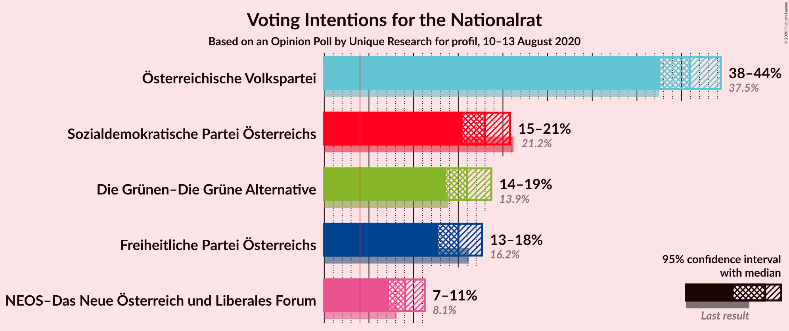

### Confidence Intervals

| Party | Last Result | Poll Result | 80% Confidence Interval | 90% Confidence Interval | 95% Confidence Interval | 99% Confidence Interval |
|:-----:|:-----------:|:-----------:|:-----------------------:|:-----------------------:|:-----------------------:|:-----------------------:|
| Österreichische Volkspartei | 37.5% | 40.9% | 38.7–43.2% |38.1–43.8% |37.6–44.4% |36.5–45.5% |
| Sozialdemokratische Partei Österreichs | 21.2% | 18.0% | 16.3–19.8% |15.9–20.3% |15.5–20.8% |14.7–21.7% |
| Die Grünen–Die Grüne Alternative | 13.9% | 16.0% | 14.4–17.8% |14.0–18.3% |13.6–18.7% |12.9–19.6% |
| Freiheitliche Partei Österreichs | 16.2% | 15.0% | 13.5–16.7% |13.1–17.2% |12.7–17.6% |12.0–18.5% |
| NEOS–Das Neue Österreich und Liberales Forum | 8.1% | 9.1% | 7.9–10.5% |7.5–10.9% |7.3–11.2% |6.7–12.0% |

*Note:* The poll result column reflects the actual value used in the calculations. Published results may vary slightly, and in addition be rounded to fewer digits.

## Seats

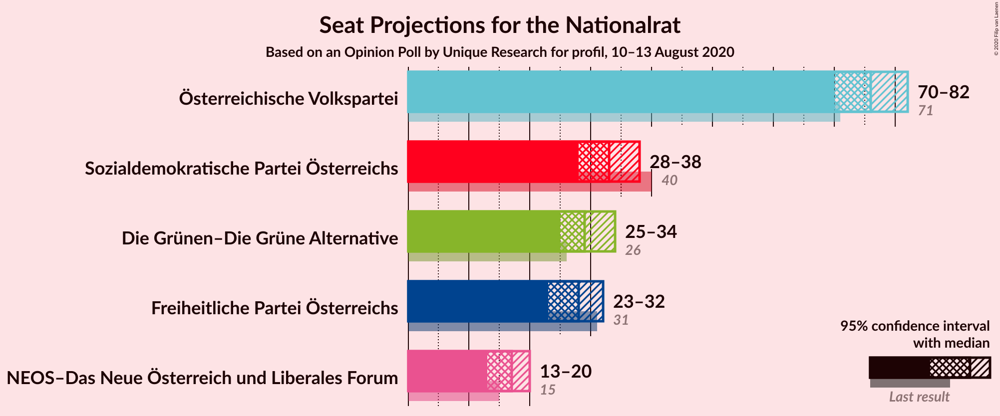

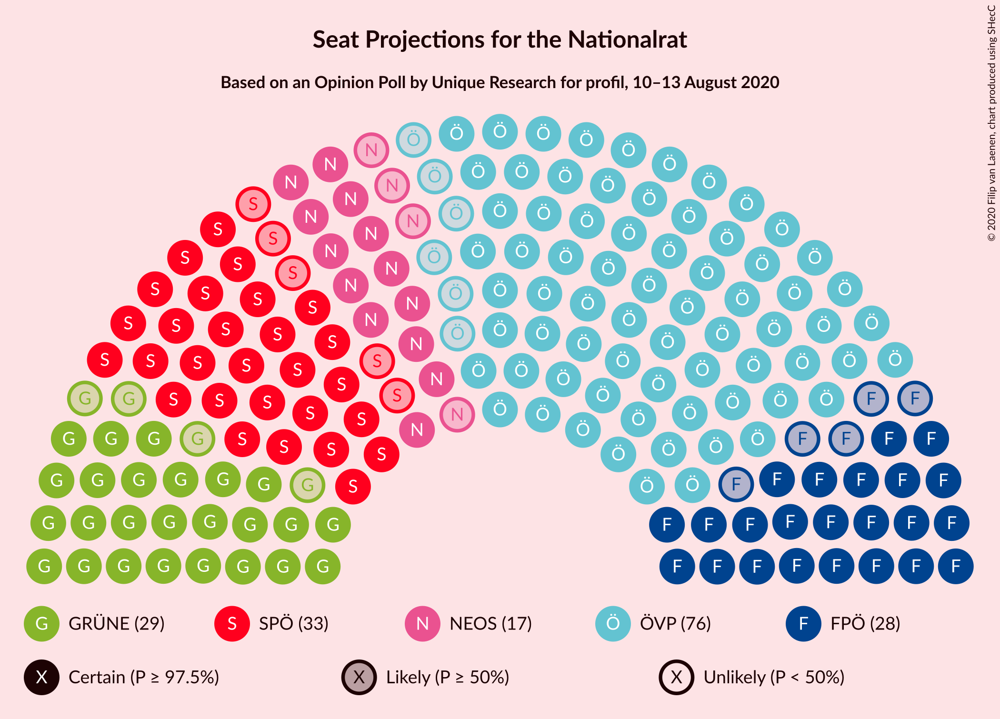

### Confidence Intervals

| Party | Last Result | Median | 80% Confidence Interval | 90% Confidence Interval | 95% Confidence Interval | 99% Confidence Interval |
|:-----:|:-----------:|:------:|:-----------------------:|:-----------------------:|:-----------------------:|:-----------------------:|
| <a href="#österreichische-volkspartei">Österreichische Volkspartei</a> | 71 | 76 | 72–80 |71–81 |70–82 |68–84 |
| <a href="#sozialdemokratische-partei-österreichs">Sozialdemokratische Partei Österreichs</a> | 40 | 33 | 30–36 |29–37 |28–38 |27–40 |
| <a href="#die-grünen–die-grüne-alternative">Die Grünen–Die Grüne Alternative</a> | 26 | 29 | 26–33 |26–34 |25–34 |24–36 |
| <a href="#freiheitliche-partei-österreichs">Freiheitliche Partei Österreichs</a> | 31 | 28 | 25–31 |24–32 |23–32 |22–34 |
| <a href="#neos–das-neue-österreich-und-liberales-forum">NEOS–Das Neue Österreich und Liberales Forum</a> | 15 | 17 | 14–19 |14–20 |13–20 |12–22 |

### Österreichische Volkspartei

*For a full overview of the results for this party, see the [Österreichische Volkspartei](party-österreichischevolkspartei.html) page.*

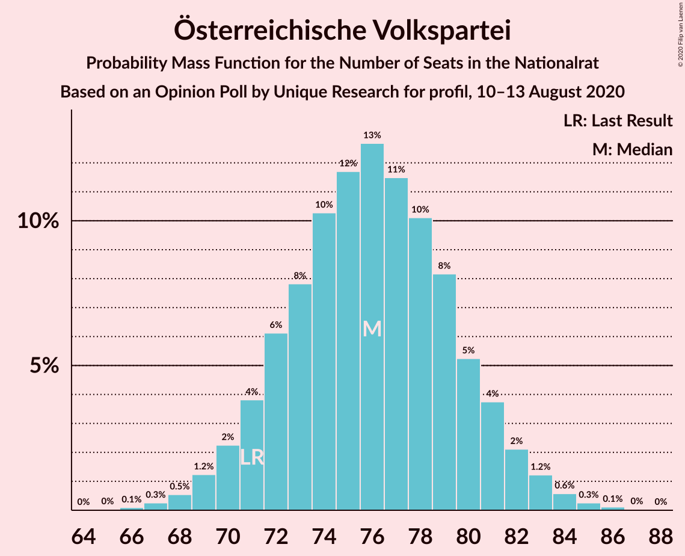

| Number of Seats | Probability | Accumulated | Special Marks |
|:---------------:|:-----------:|:-----------:|:-------------:|
| 66 | 0.1% | 100% |  |
| 67 | 0.3% | 99.9% |  |
| 68 | 0.5% | 99.6% |  |
| 69 | 1.2% | 99.0% |  |
| 70 | 2% | 98% |  |
| 71 | 4% | 96% | Last Result |
| 72 | 6% | 92% |  |
| 73 | 8% | 86% |  |
| 74 | 10% | 78% |  |
| 75 | 12% | 68% |  |
| 76 | 13% | 56% | Median |
| 77 | 11% | 43% |  |
| 78 | 10% | 32% |  |
| 79 | 8% | 22% |  |
| 80 | 5% | 13% |  |
| 81 | 4% | 8% |  |
| 82 | 2% | 4% |  |
| 83 | 1.2% | 2% |  |
| 84 | 0.6% | 1.0% |  |
| 85 | 0.3% | 0.4% |  |
| 86 | 0.1% | 0.2% |  |
| 87 | 0% | 0.1% |  |
| 88 | 0% | 0% |  |

### Sozialdemokratische Partei Österreichs

*For a full overview of the results for this party, see the [Sozialdemokratische Partei Österreichs](party-sozialdemokratischeparteiösterreichs.html) page.*

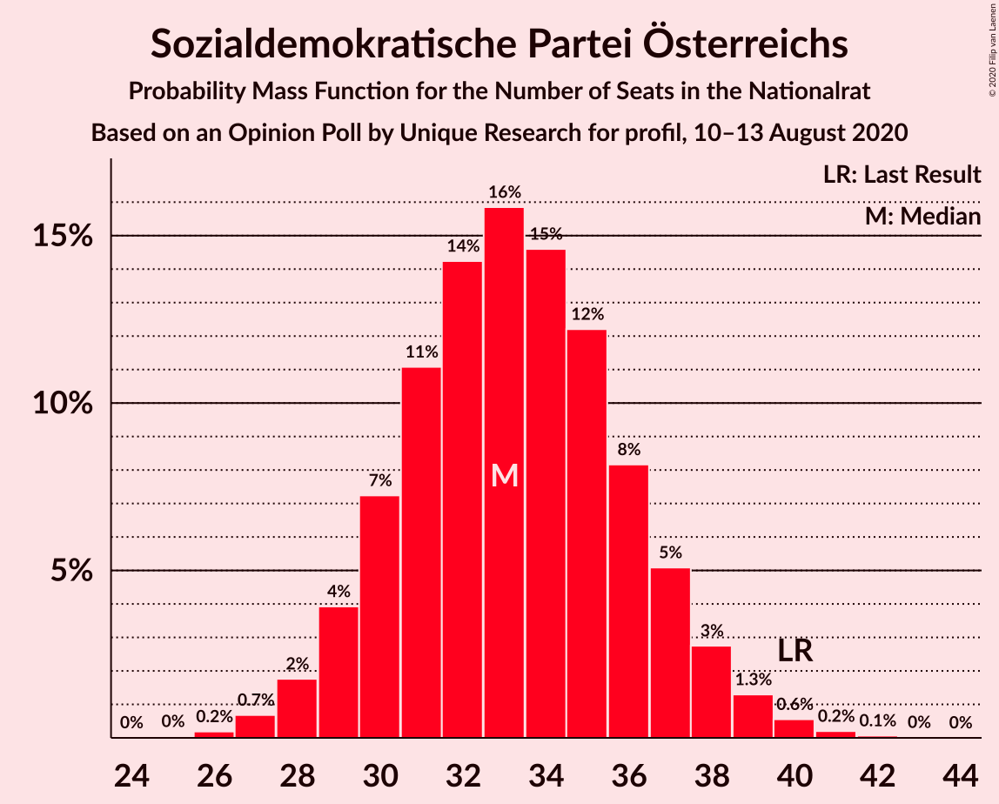

| Number of Seats | Probability | Accumulated | Special Marks |
|:---------------:|:-----------:|:-----------:|:-------------:|
| 25 | 0% | 100% |  |
| 26 | 0.2% | 99.9% |  |
| 27 | 0.7% | 99.8% |  |
| 28 | 2% | 99.1% |  |
| 29 | 4% | 97% |  |
| 30 | 7% | 93% |  |
| 31 | 11% | 86% |  |
| 32 | 14% | 75% |  |
| 33 | 16% | 61% | Median |
| 34 | 15% | 45% |  |
| 35 | 12% | 30% |  |
| 36 | 8% | 18% |  |
| 37 | 5% | 10% |  |
| 38 | 3% | 5% |  |
| 39 | 1.3% | 2% |  |
| 40 | 0.6% | 0.9% | Last Result |
| 41 | 0.2% | 0.3% |  |
| 42 | 0.1% | 0.1% |  |
| 43 | 0% | 0% |  |

### Die Grünen–Die Grüne Alternative

*For a full overview of the results for this party, see the [Die Grünen–Die Grüne Alternative](party-diegrünen–diegrünealternative.html) page.*

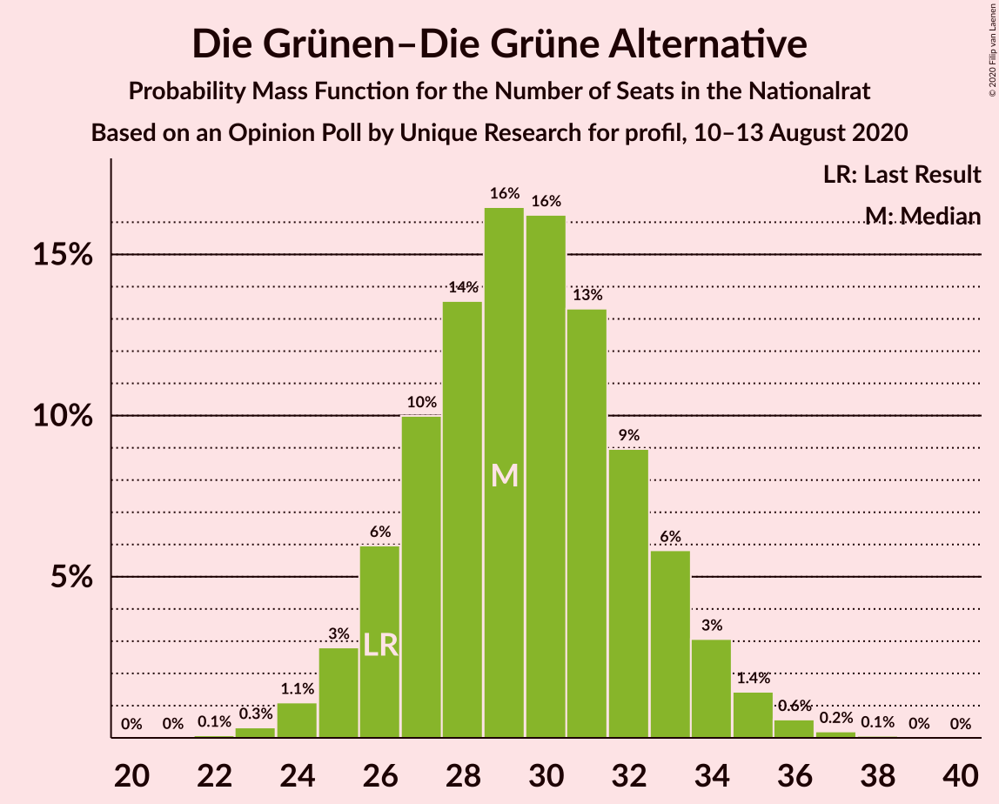

| Number of Seats | Probability | Accumulated | Special Marks |
|:---------------:|:-----------:|:-----------:|:-------------:|
| 22 | 0.1% | 100% |  |
| 23 | 0.3% | 99.9% |  |
| 24 | 1.1% | 99.6% |  |
| 25 | 3% | 98% |  |
| 26 | 6% | 96% | Last Result |
| 27 | 10% | 90% |  |
| 28 | 14% | 80% |  |
| 29 | 16% | 66% | Median |
| 30 | 16% | 50% |  |
| 31 | 13% | 33% |  |
| 32 | 9% | 20% |  |
| 33 | 6% | 11% |  |
| 34 | 3% | 5% |  |
| 35 | 1.4% | 2% |  |
| 36 | 0.6% | 0.9% |  |
| 37 | 0.2% | 0.3% |  |
| 38 | 0.1% | 0.1% |  |
| 39 | 0% | 0% |  |

### Freiheitliche Partei Österreichs

*For a full overview of the results for this party, see the [Freiheitliche Partei Österreichs](party-freiheitlicheparteiösterreichs.html) page.*

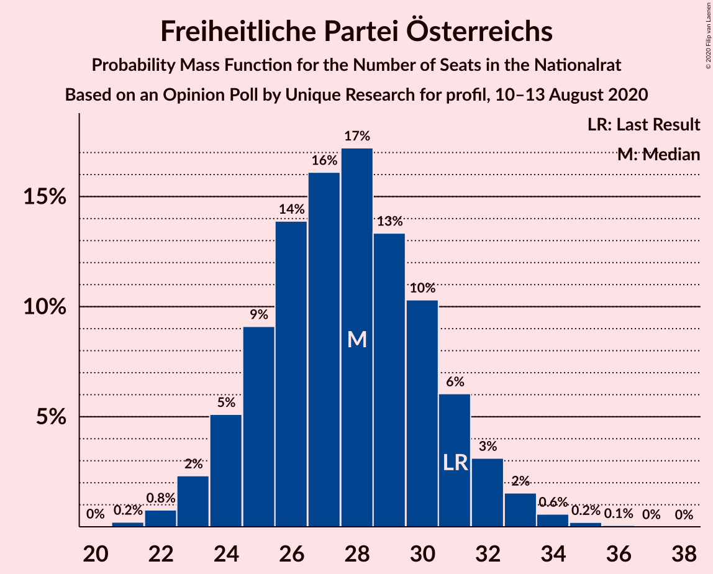

| Number of Seats | Probability | Accumulated | Special Marks |
|:---------------:|:-----------:|:-----------:|:-------------:|
| 21 | 0.2% | 100% |  |
| 22 | 0.8% | 99.7% |  |
| 23 | 2% | 99.0% |  |
| 24 | 5% | 97% |  |
| 25 | 9% | 92% |  |
| 26 | 14% | 82% |  |
| 27 | 16% | 69% |  |
| 28 | 17% | 52% | Median |
| 29 | 13% | 35% |  |
| 30 | 10% | 22% |  |
| 31 | 6% | 12% | Last Result |
| 32 | 3% | 6% |  |
| 33 | 2% | 2% |  |
| 34 | 0.6% | 0.9% |  |
| 35 | 0.2% | 0.3% |  |
| 36 | 0.1% | 0.1% |  |
| 37 | 0% | 0% |  |

### NEOS–Das Neue Österreich und Liberales Forum

*For a full overview of the results for this party, see the [NEOS–Das Neue Österreich und Liberales Forum](party-neos–dasneueösterreichundliberalesforum.html) page.*

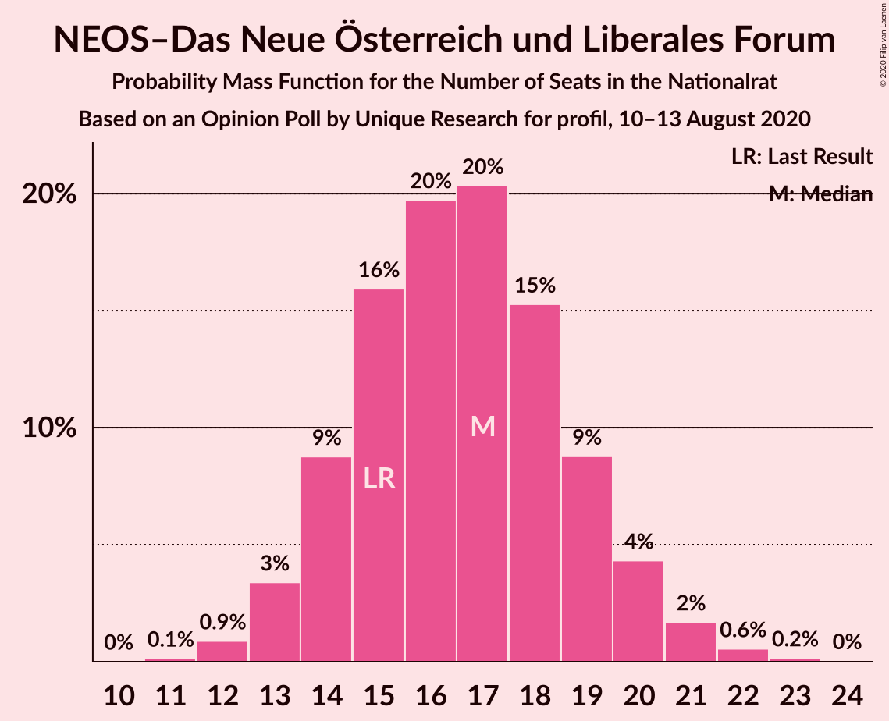

| Number of Seats | Probability | Accumulated | Special Marks |
|:---------------:|:-----------:|:-----------:|:-------------:|
| 11 | 0.1% | 100% |  |
| 12 | 0.9% | 99.8% |  |
| 13 | 3% | 99.0% |  |
| 14 | 9% | 96% |  |
| 15 | 16% | 87% | Last Result |
| 16 | 20% | 71% |  |
| 17 | 20% | 51% | Median |
| 18 | 15% | 31% |  |
| 19 | 9% | 16% |  |
| 20 | 4% | 7% |  |
| 21 | 2% | 2% |  |
| 22 | 0.6% | 0.8% |  |
| 23 | 0.2% | 0.2% |  |
| 24 | 0% | 0% |  |

## Coalitions

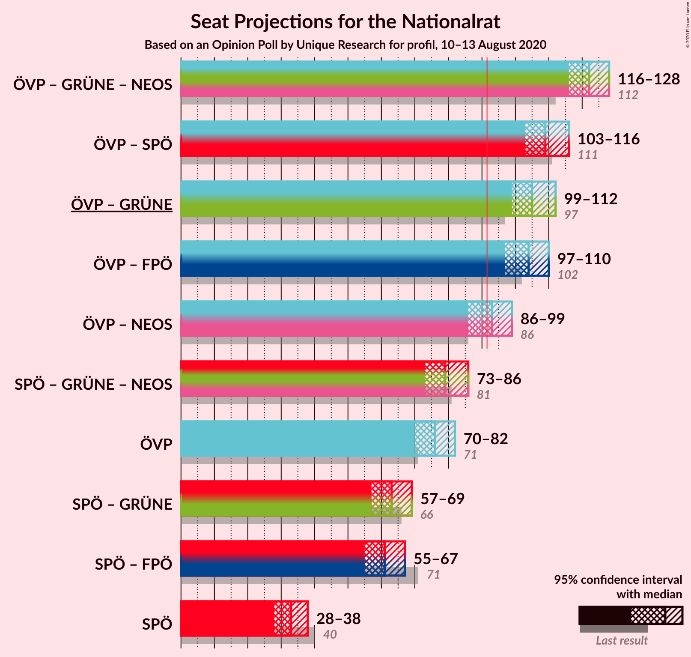

### Confidence Intervals

| Coalition | Last Result | Median | Majority? | 80% Confidence Interval | 90% Confidence Interval | 95% Confidence Interval | 99% Confidence Interval |
|:---------:|:-----------:|:------:|:---------:|:-----------------------:|:-----------------------:|:-----------------------:|:-----------------------:|
| Österreichische Volkspartei – Die Grünen–Die Grüne Alternative – NEOS–Das Neue Österreich und Liberales Forum | 112 | 122 | 100% | 118–126 | 117–127 | 116–128 | 114–130 |
| Österreichische Volkspartei – Sozialdemokratische Partei Österreichs | 111 | 109 | 100% | 105–113 | 104–114 | 103–116 | 101–117 |
| Österreichische Volkspartei – Die Grünen–Die Grüne Alternative | 97 | 105 | 100% | 101–110 | 100–111 | 99–112 | 97–114 |
| Österreichische Volkspartei – Freiheitliche Partei Österreichs | 102 | 104 | 100% | 99–108 | 98–109 | 97–110 | 95–112 |
| Österreichische Volkspartei – NEOS–Das Neue Österreich und Liberales Forum | 86 | 93 | 63% | 88–97 | 87–98 | 86–99 | 84–101 |
| Sozialdemokratische Partei Österreichs – Die Grünen–Die Grüne Alternative – NEOS–Das Neue Österreich und Liberales Forum | 81 | 79 | 0% | 75–84 | 74–85 | 73–86 | 71–88 |
| Österreichische Volkspartei | 71 | 76 | 0% | 72–80 | 71–81 | 70–82 | 68–84 |
| Sozialdemokratische Partei Österreichs – Die Grünen–Die Grüne Alternative | 66 | 63 | 0% | 59–67 | 58–68 | 57–69 | 55–71 |
| Sozialdemokratische Partei Österreichs – Freiheitliche Partei Österreichs | 71 | 61 | 0% | 57–65 | 56–66 | 55–67 | 53–69 |
| Sozialdemokratische Partei Österreichs | 40 | 33 | 0% | 30–36 | 29–37 | 28–38 | 27–40 |

### Österreichische Volkspartei – Die Grünen–Die Grüne Alternative – NEOS–Das Neue Österreich und Liberales Forum

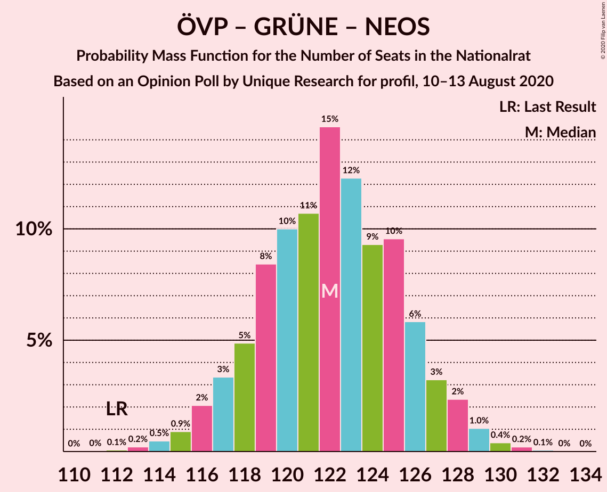

| Number of Seats | Probability | Accumulated | Special Marks |
|:---------------:|:-----------:|:-----------:|:-------------:|
| 112 | 0.1% | 100% | Last Result |
| 113 | 0.2% | 99.9% |  |
| 114 | 0.5% | 99.7% |  |
| 115 | 0.9% | 99.2% |  |
| 116 | 2% | 98% |  |
| 117 | 3% | 96% |  |
| 118 | 5% | 93% |  |
| 119 | 8% | 88% |  |
| 120 | 10% | 80% |  |
| 121 | 11% | 70% |  |
| 122 | 15% | 59% | Median |
| 123 | 12% | 44% |  |
| 124 | 9% | 32% |  |
| 125 | 10% | 23% |  |
| 126 | 6% | 13% |  |
| 127 | 3% | 7% |  |
| 128 | 2% | 4% |  |
| 129 | 1.0% | 2% |  |
| 130 | 0.4% | 0.7% |  |
| 131 | 0.2% | 0.3% |  |
| 132 | 0.1% | 0.1% |  |
| 133 | 0% | 0% |  |

### Österreichische Volkspartei – Sozialdemokratische Partei Österreichs

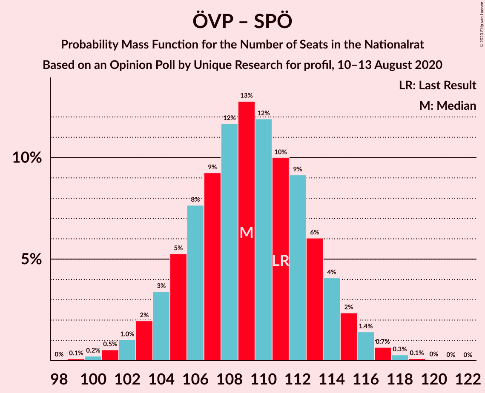

| Number of Seats | Probability | Accumulated | Special Marks |
|:---------------:|:-----------:|:-----------:|:-------------:|
| 99 | 0.1% | 100% |  |
| 100 | 0.2% | 99.9% |  |
| 101 | 0.5% | 99.6% |  |
| 102 | 1.0% | 99.1% |  |
| 103 | 2% | 98% |  |
| 104 | 3% | 96% |  |
| 105 | 5% | 93% |  |
| 106 | 8% | 87% |  |
| 107 | 9% | 80% |  |
| 108 | 12% | 71% |  |
| 109 | 13% | 59% | Median |
| 110 | 12% | 46% |  |
| 111 | 10% | 34% | Last Result |
| 112 | 9% | 24% |  |
| 113 | 6% | 15% |  |
| 114 | 4% | 9% |  |
| 115 | 2% | 5% |  |
| 116 | 1.4% | 3% |  |
| 117 | 0.7% | 1.1% |  |
| 118 | 0.3% | 0.5% |  |
| 119 | 0.1% | 0.2% |  |
| 120 | 0% | 0.1% |  |
| 121 | 0% | 0% |  |

### Österreichische Volkspartei – Die Grünen–Die Grüne Alternative

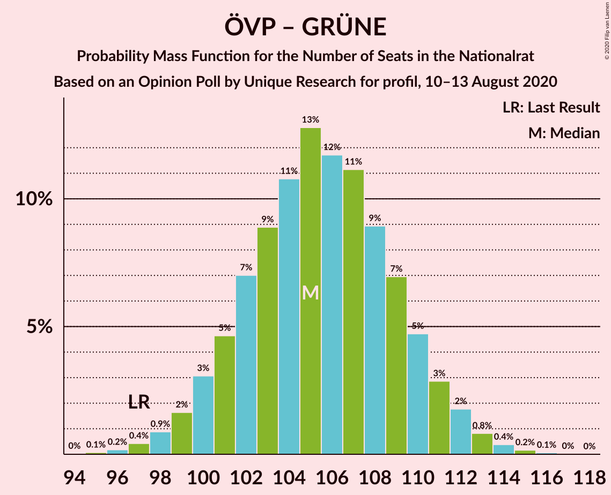

| Number of Seats | Probability | Accumulated | Special Marks |
|:---------------:|:-----------:|:-----------:|:-------------:|
| 95 | 0.1% | 100% |  |
| 96 | 0.2% | 99.9% |  |
| 97 | 0.4% | 99.7% | Last Result |
| 98 | 0.9% | 99.3% |  |
| 99 | 2% | 98% |  |
| 100 | 3% | 97% |  |
| 101 | 5% | 94% |  |
| 102 | 7% | 89% |  |
| 103 | 9% | 82% |  |
| 104 | 11% | 73% |  |
| 105 | 13% | 62% | Median |
| 106 | 12% | 50% |  |
| 107 | 11% | 38% |  |
| 108 | 9% | 27% |  |
| 109 | 7% | 18% |  |
| 110 | 5% | 11% |  |
| 111 | 3% | 6% |  |
| 112 | 2% | 3% |  |
| 113 | 0.8% | 1.5% |  |
| 114 | 0.4% | 0.6% |  |
| 115 | 0.2% | 0.3% |  |
| 116 | 0.1% | 0.1% |  |
| 117 | 0% | 0% |  |

### Österreichische Volkspartei – Freiheitliche Partei Österreichs

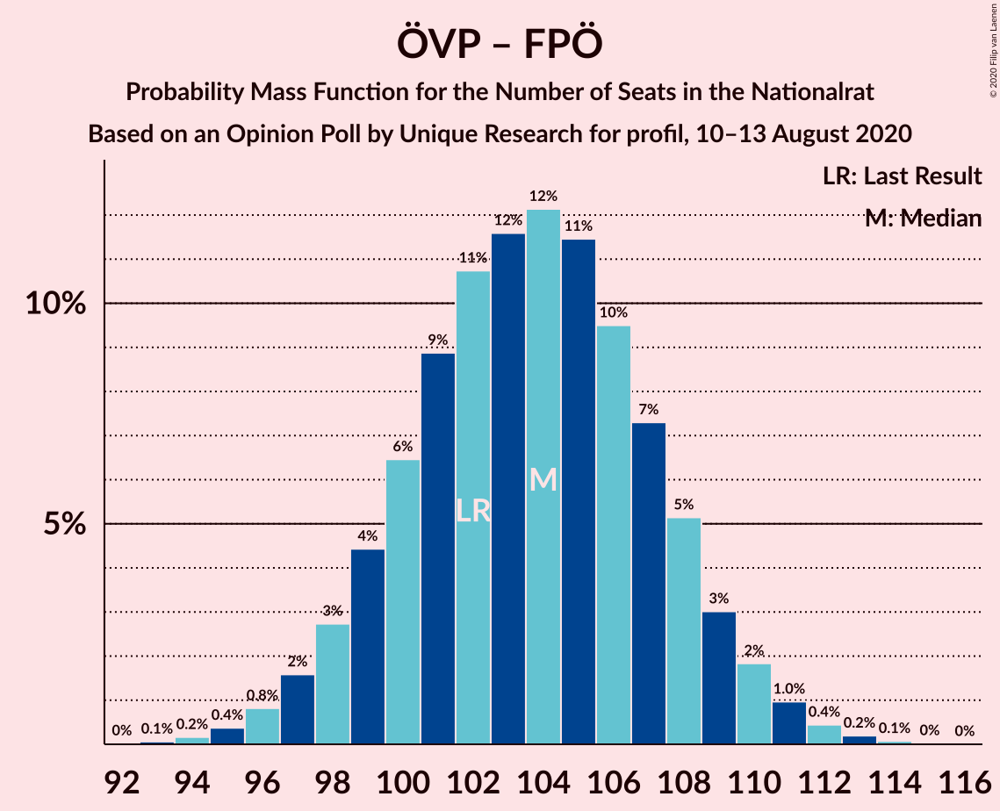

| Number of Seats | Probability | Accumulated | Special Marks |
|:---------------:|:-----------:|:-----------:|:-------------:|
| 93 | 0.1% | 100% |  |
| 94 | 0.2% | 99.9% |  |
| 95 | 0.4% | 99.7% |  |
| 96 | 0.8% | 99.4% |  |
| 97 | 2% | 98.5% |  |
| 98 | 3% | 97% |  |
| 99 | 4% | 94% |  |
| 100 | 6% | 90% |  |
| 101 | 9% | 83% |  |
| 102 | 11% | 74% | Last Result |
| 103 | 12% | 64% |  |
| 104 | 12% | 52% | Median |
| 105 | 11% | 40% |  |
| 106 | 10% | 29% |  |
| 107 | 7% | 19% |  |
| 108 | 5% | 12% |  |
| 109 | 3% | 7% |  |
| 110 | 2% | 4% |  |
| 111 | 1.0% | 2% |  |
| 112 | 0.4% | 0.8% |  |
| 113 | 0.2% | 0.3% |  |
| 114 | 0.1% | 0.1% |  |
| 115 | 0% | 0% |  |

### Österreichische Volkspartei – NEOS–Das Neue Österreich und Liberales Forum

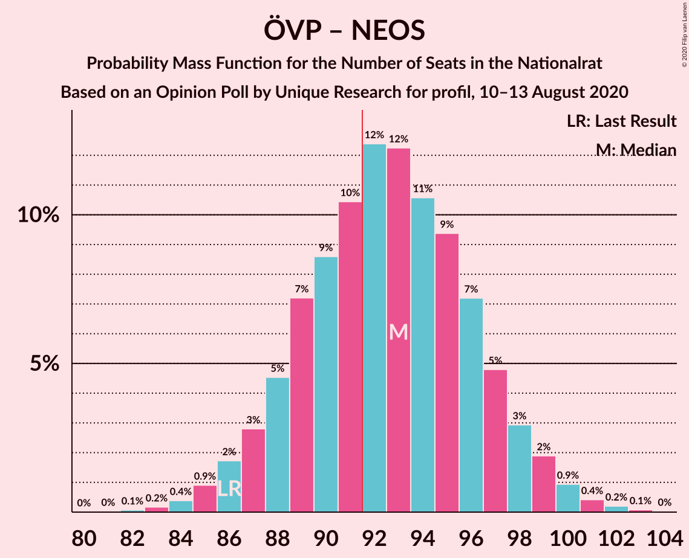

| Number of Seats | Probability | Accumulated | Special Marks |
|:---------------:|:-----------:|:-----------:|:-------------:|
| 82 | 0.1% | 100% |  |
| 83 | 0.2% | 99.9% |  |
| 84 | 0.4% | 99.7% |  |
| 85 | 0.9% | 99.3% |  |
| 86 | 2% | 98% | Last Result |
| 87 | 3% | 97% |  |
| 88 | 5% | 94% |  |
| 89 | 7% | 89% |  |
| 90 | 9% | 82% |  |
| 91 | 10% | 74% |  |
| 92 | 12% | 63% | Majority |
| 93 | 12% | 51% | Median |
| 94 | 11% | 38% |  |
| 95 | 9% | 28% |  |
| 96 | 7% | 19% |  |
| 97 | 5% | 11% |  |
| 98 | 3% | 7% |  |
| 99 | 2% | 4% |  |
| 100 | 0.9% | 2% |  |
| 101 | 0.4% | 0.7% |  |
| 102 | 0.2% | 0.3% |  |
| 103 | 0.1% | 0.1% |  |
| 104 | 0% | 0% |  |

### Sozialdemokratische Partei Österreichs – Die Grünen–Die Grüne Alternative – NEOS–Das Neue Österreich und Liberales Forum

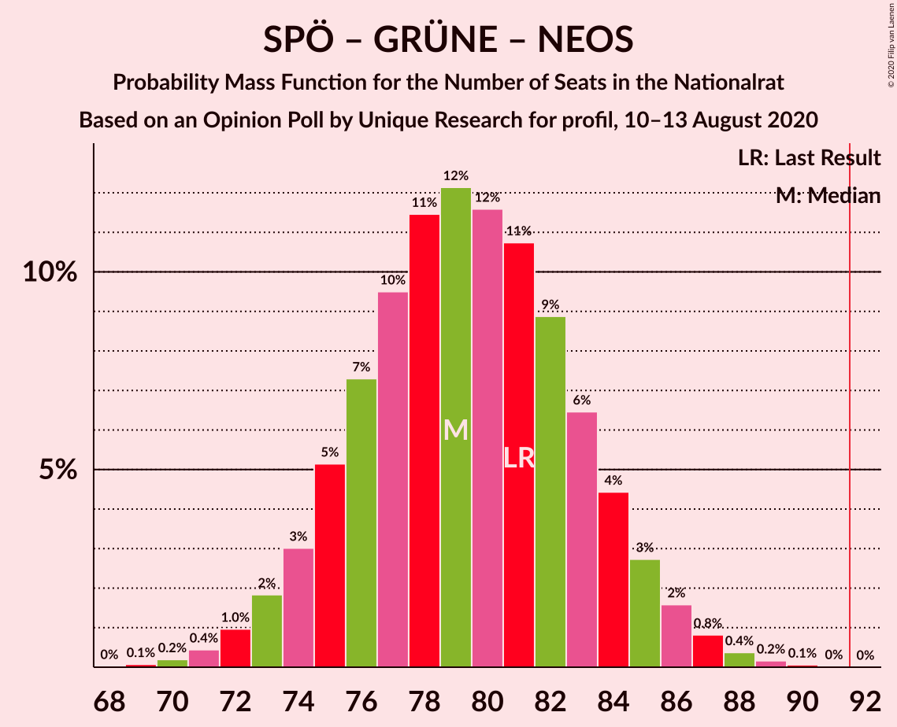

| Number of Seats | Probability | Accumulated | Special Marks |
|:---------------:|:-----------:|:-----------:|:-------------:|
| 69 | 0.1% | 100% |  |
| 70 | 0.2% | 99.9% |  |
| 71 | 0.4% | 99.7% |  |
| 72 | 1.0% | 99.2% |  |
| 73 | 2% | 98% |  |
| 74 | 3% | 96% |  |
| 75 | 5% | 93% |  |
| 76 | 7% | 88% |  |
| 77 | 10% | 81% |  |
| 78 | 11% | 71% |  |
| 79 | 12% | 60% | Median |
| 80 | 12% | 48% |  |
| 81 | 11% | 36% | Last Result |
| 82 | 9% | 26% |  |
| 83 | 6% | 17% |  |
| 84 | 4% | 10% |  |
| 85 | 3% | 6% |  |
| 86 | 2% | 3% |  |
| 87 | 0.8% | 1.5% |  |
| 88 | 0.4% | 0.6% |  |
| 89 | 0.2% | 0.3% |  |
| 90 | 0.1% | 0.1% |  |
| 91 | 0% | 0% |  |

### Österreichische Volkspartei

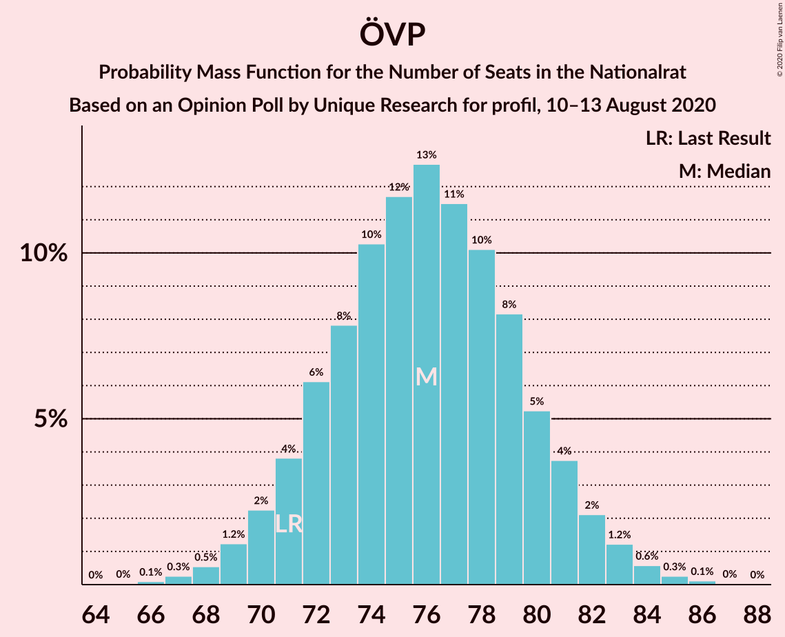

| Number of Seats | Probability | Accumulated | Special Marks |
|:---------------:|:-----------:|:-----------:|:-------------:|
| 66 | 0.1% | 100% |  |
| 67 | 0.3% | 99.9% |  |
| 68 | 0.5% | 99.6% |  |
| 69 | 1.2% | 99.0% |  |
| 70 | 2% | 98% |  |
| 71 | 4% | 96% | Last Result |
| 72 | 6% | 92% |  |
| 73 | 8% | 86% |  |
| 74 | 10% | 78% |  |
| 75 | 12% | 68% |  |
| 76 | 13% | 56% | Median |
| 77 | 11% | 43% |  |
| 78 | 10% | 32% |  |
| 79 | 8% | 22% |  |
| 80 | 5% | 13% |  |
| 81 | 4% | 8% |  |
| 82 | 2% | 4% |  |
| 83 | 1.2% | 2% |  |
| 84 | 0.6% | 1.0% |  |
| 85 | 0.3% | 0.4% |  |
| 86 | 0.1% | 0.2% |  |
| 87 | 0% | 0.1% |  |
| 88 | 0% | 0% |  |

### Sozialdemokratische Partei Österreichs – Die Grünen–Die Grüne Alternative

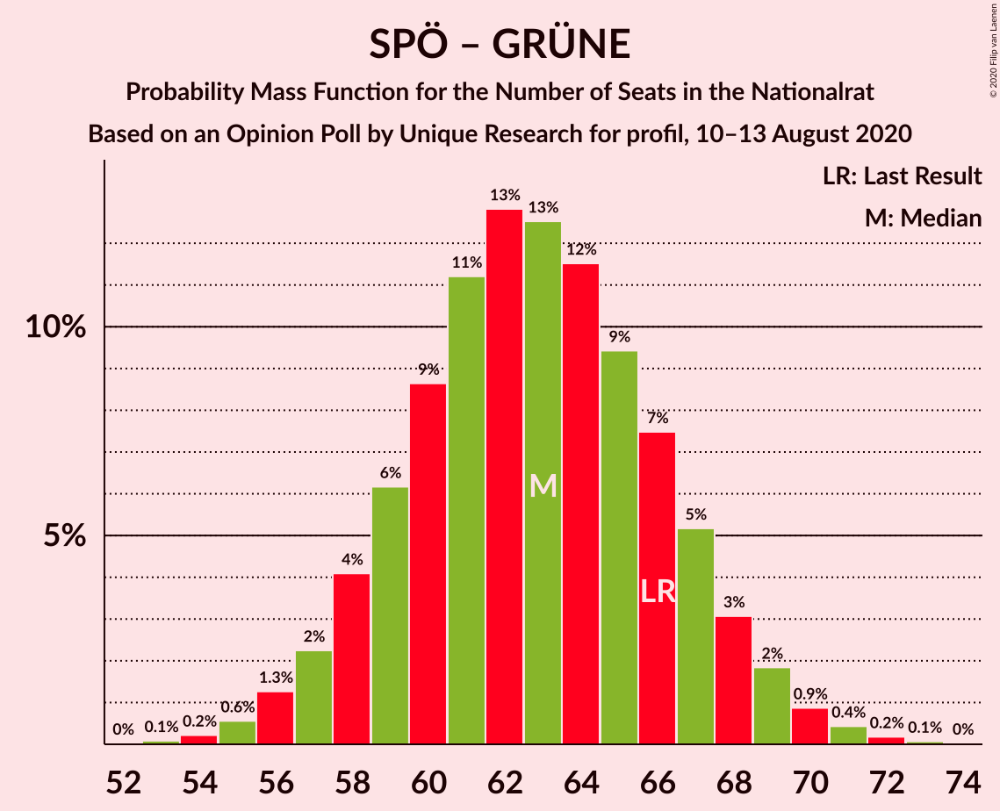

| Number of Seats | Probability | Accumulated | Special Marks |
|:---------------:|:-----------:|:-----------:|:-------------:|
| 53 | 0.1% | 100% |  |
| 54 | 0.2% | 99.9% |  |
| 55 | 0.6% | 99.7% |  |
| 56 | 1.3% | 99.1% |  |
| 57 | 2% | 98% |  |
| 58 | 4% | 96% |  |
| 59 | 6% | 91% |  |
| 60 | 9% | 85% |  |
| 61 | 11% | 77% |  |
| 62 | 13% | 65% | Median |
| 63 | 13% | 53% |  |
| 64 | 12% | 40% |  |
| 65 | 9% | 29% |  |
| 66 | 7% | 19% | Last Result |
| 67 | 5% | 12% |  |
| 68 | 3% | 7% |  |
| 69 | 2% | 3% |  |
| 70 | 0.9% | 2% |  |
| 71 | 0.4% | 0.7% |  |
| 72 | 0.2% | 0.3% |  |
| 73 | 0.1% | 0.1% |  |
| 74 | 0% | 0% |  |

### Sozialdemokratische Partei Österreichs – Freiheitliche Partei Österreichs

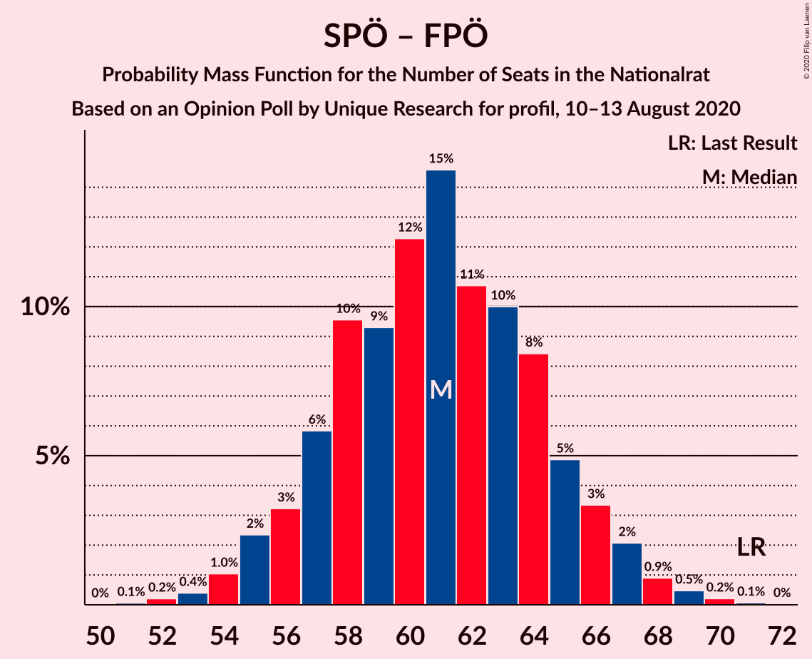

| Number of Seats | Probability | Accumulated | Special Marks |
|:---------------:|:-----------:|:-----------:|:-------------:|
| 51 | 0.1% | 100% |  |
| 52 | 0.2% | 99.9% |  |
| 53 | 0.4% | 99.7% |  |
| 54 | 1.0% | 99.3% |  |
| 55 | 2% | 98% |  |
| 56 | 3% | 96% |  |
| 57 | 6% | 93% |  |
| 58 | 10% | 87% |  |
| 59 | 9% | 77% |  |
| 60 | 12% | 68% |  |
| 61 | 15% | 56% | Median |
| 62 | 11% | 41% |  |
| 63 | 10% | 30% |  |
| 64 | 8% | 20% |  |
| 65 | 5% | 12% |  |
| 66 | 3% | 7% |  |
| 67 | 2% | 4% |  |
| 68 | 0.9% | 2% |  |
| 69 | 0.5% | 0.8% |  |
| 70 | 0.2% | 0.3% |  |
| 71 | 0.1% | 0.1% | Last Result |
| 72 | 0% | 0% |  |

### Sozialdemokratische Partei Österreichs

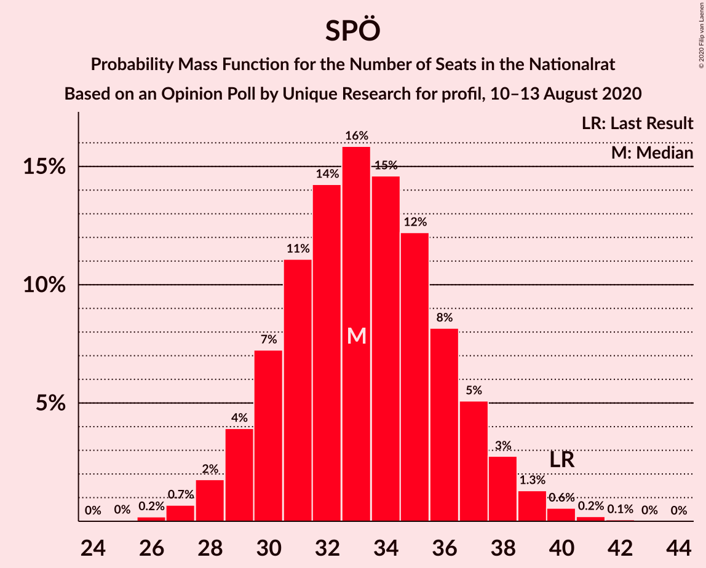

| Number of Seats | Probability | Accumulated | Special Marks |
|:---------------:|:-----------:|:-----------:|:-------------:|
| 25 | 0% | 100% |  |
| 26 | 0.2% | 99.9% |  |
| 27 | 0.7% | 99.8% |  |
| 28 | 2% | 99.1% |  |
| 29 | 4% | 97% |  |
| 30 | 7% | 93% |  |
| 31 | 11% | 86% |  |
| 32 | 14% | 75% |  |
| 33 | 16% | 61% | Median |
| 34 | 15% | 45% |  |
| 35 | 12% | 30% |  |
| 36 | 8% | 18% |  |
| 37 | 5% | 10% |  |
| 38 | 3% | 5% |  |
| 39 | 1.3% | 2% |  |
| 40 | 0.6% | 0.9% | Last Result |
| 41 | 0.2% | 0.3% |  |
| 42 | 0.1% | 0.1% |  |
| 43 | 0% | 0% |  |

## Technical Information

### Opinion Poll

+ **Polling firm:** Unique Research
+ **Commissioner(s):** profil
+ **Fieldwork period:** 10–13 August 2020

### Calculations

+ **Sample size:** 806
+ **Simulations done:** 1,048,576
+ **Error estimate:** 0.67%

