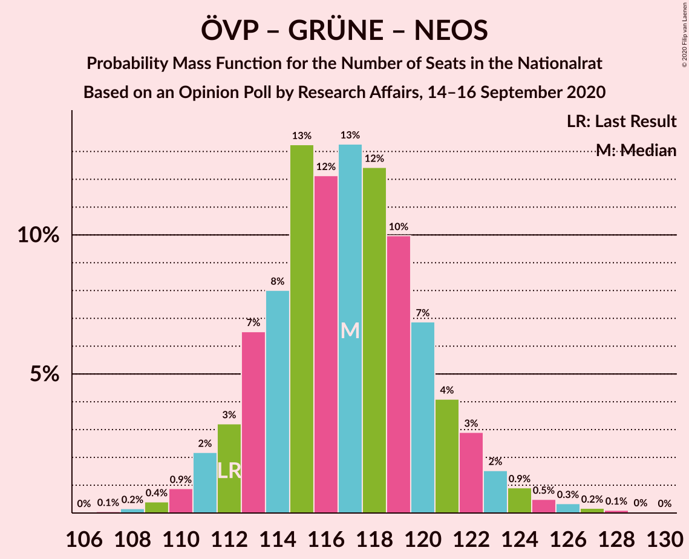
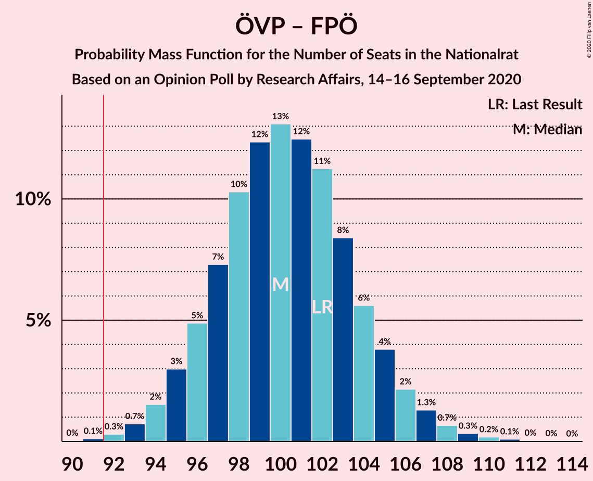

# Opinion Poll by Research Affairs, 14–16 September 2020

<a href="#voting-intentions">Voting Intentions</a> | <a href="#seats">Seats</a> | <a href="#coalitions">Coalitions</a> | <a href="#technical-information">Technical Information</a>

## Voting Intentions

### Confidence Intervals

| Party | Last Result | Poll Result | 80% Confidence Interval | 90% Confidence Interval | 95% Confidence Interval | 99% Confidence Interval |
|:-----:|:-----------:|:-----------:|:-----------------------:|:-----------------------:|:-----------------------:|:-----------------------:|
| Österreichische Volkspartei | 37.5% | 42.4% | 40.4–44.4% |39.9–45.0% |39.4–45.5% |38.4–46.5% |
| Sozialdemokratische Partei Österreichs | 21.2% | 19.2% | 17.7–20.9% |17.2–21.4% |16.9–21.8% |16.2–22.6% |
| Freiheitliche Partei Österreichs | 16.2% | 12.1% | 10.9–13.5% |10.5–13.9% |10.2–14.3% |9.6–15.0% |
| Die Grünen–Die Grüne Alternative | 13.9% | 12.1% | 10.9–13.5% |10.5–13.9% |10.2–14.3% |9.6–15.0% |
| NEOS–Das Neue Österreich und Liberales Forum | 8.1% | 9.1% | 8.0–10.4% |7.7–10.7% |7.5–11.1% |7.0–11.7% |

*Note:* The poll result column reflects the actual value used in the calculations. Published results may vary slightly, and in addition be rounded to fewer digits.

## Seats

### Confidence Intervals

| Party | Last Result | Median | 80% Confidence Interval | 90% Confidence Interval | 95% Confidence Interval | 99% Confidence Interval |
|:-----:|:-----------:|:------:|:-----------------------:|:-----------------------:|:-----------------------:|:-----------------------:|
| <a href="#österreichische-volkspartei">Österreichische Volkspartei</a> | 71 | 78 | 74–82 |73–83 |72–84 |71–86 |
| <a href="#sozialdemokratische-partei-österreichs">Sozialdemokratische Partei Österreichs</a> | 40 | 35 | 32–38 |31–39 |31–40 |29–42 |
| <a href="#freiheitliche-partei-österreichs">Freiheitliche Partei Österreichs</a> | 31 | 22 | 20–25 |19–25 |18–26 |18–27 |
| <a href="#die-grünen–die-grüne-alternative">Die Grünen–Die Grüne Alternative</a> | 26 | 22 | 20–25 |19–25 |18–26 |17–27 |
| <a href="#neos–das-neue-österreich-und-liberales-forum">NEOS–Das Neue Österreich und Liberales Forum</a> | 15 | 16 | 14–19 |14–19 |13–20 |12–21 |

### Österreichische Volkspartei

*For a full overview of the results for this party, see the [Österreichische Volkspartei](party-österreichischevolkspartei.html) page.*

| Number of Seats | Probability | Accumulated | Special Marks |
|:---------------:|:-----------:|:-----------:|:-------------:|
| 69 | 0.1% | 100% |  |
| 70 | 0.3% | 99.9% |  |
| 71 | 0.7% | 99.6% | Last Result |
| 72 | 2% | 98.9% |  |
| 73 | 3% | 97% |  |
| 74 | 5% | 94% |  |
| 75 | 8% | 89% |  |
| 76 | 10% | 81% |  |
| 77 | 13% | 71% |  |
| 78 | 14% | 59% | Median |
| 79 | 13% | 45% |  |
| 80 | 11% | 33% |  |
| 81 | 8% | 22% |  |
| 82 | 5% | 13% |  |
| 83 | 4% | 8% |  |
| 84 | 2% | 4% |  |
| 85 | 1.1% | 2% |  |
| 86 | 0.6% | 1.0% |  |
| 87 | 0.2% | 0.4% |  |
| 88 | 0.1% | 0.2% |  |
| 89 | 0% | 0.1% |  |
| 90 | 0% | 0% |  |

### Sozialdemokratische Partei Österreichs

*For a full overview of the results for this party, see the [Sozialdemokratische Partei Österreichs](party-sozialdemokratischeparteiösterreichs.html) page.*

| Number of Seats | Probability | Accumulated | Special Marks |
|:---------------:|:-----------:|:-----------:|:-------------:|
| 28 | 0.1% | 100% |  |
| 29 | 0.4% | 99.9% |  |
| 30 | 1.3% | 99.5% |  |
| 31 | 3% | 98% |  |
| 32 | 7% | 95% |  |
| 33 | 11% | 88% |  |
| 34 | 15% | 77% |  |
| 35 | 17% | 62% | Median |
| 36 | 16% | 45% |  |
| 37 | 12% | 29% |  |
| 38 | 8% | 17% |  |
| 39 | 5% | 8% |  |
| 40 | 2% | 4% | Last Result |
| 41 | 0.9% | 1.5% |  |
| 42 | 0.3% | 0.5% |  |
| 43 | 0.1% | 0.2% |  |
| 44 | 0% | 0% |  |

### Freiheitliche Partei Österreichs

*For a full overview of the results for this party, see the [Freiheitliche Partei Österreichs](party-freiheitlicheparteiösterreichs.html) page.*

| Number of Seats | Probability | Accumulated | Special Marks |
|:---------------:|:-----------:|:-----------:|:-------------:|
| 16 | 0.1% | 100% |  |
| 17 | 0.4% | 99.9% |  |
| 18 | 2% | 99.5% |  |
| 19 | 7% | 97% |  |
| 20 | 11% | 90% |  |
| 21 | 14% | 79% |  |
| 22 | 25% | 66% | Median |
| 23 | 21% | 40% |  |
| 24 | 8% | 20% |  |
| 25 | 6% | 11% |  |
| 26 | 3% | 5% |  |
| 27 | 1.1% | 1.4% |  |
| 28 | 0.2% | 0.3% |  |
| 29 | 0.1% | 0.1% |  |
| 30 | 0% | 0% |  |
| 31 | 0% | 0% | Last Result |

### Die Grünen–Die Grüne Alternative

*For a full overview of the results for this party, see the [Die Grünen–Die Grüne Alternative](party-diegrünen–diegrünealternative.html) page.*

| Number of Seats | Probability | Accumulated | Special Marks |
|:---------------:|:-----------:|:-----------:|:-------------:|
| 16 | 0.1% | 100% |  |
| 17 | 0.5% | 99.9% |  |
| 18 | 2% | 99.4% |  |
| 19 | 6% | 97% |  |
| 20 | 13% | 91% |  |
| 21 | 18% | 79% |  |
| 22 | 21% | 61% | Median |
| 23 | 17% | 40% |  |
| 24 | 12% | 23% |  |
| 25 | 7% | 11% |  |
| 26 | 3% | 4% | Last Result |
| 27 | 1.1% | 2% |  |
| 28 | 0.3% | 0.4% |  |
| 29 | 0.1% | 0.1% |  |
| 30 | 0% | 0% |  |

### NEOS–Das Neue Österreich und Liberales Forum

*For a full overview of the results for this party, see the [NEOS–Das Neue Österreich und Liberales Forum](party-neos–dasneueösterreichundliberalesforum.html) page.*

| Number of Seats | Probability | Accumulated | Special Marks |
|:---------------:|:-----------:|:-----------:|:-------------:|
| 11 | 0.1% | 100% |  |
| 12 | 0.5% | 99.9% |  |
| 13 | 2% | 99.5% |  |
| 14 | 8% | 97% |  |
| 15 | 16% | 89% | Last Result |
| 16 | 23% | 73% | Median |
| 17 | 22% | 50% |  |
| 18 | 15% | 28% |  |
| 19 | 8% | 13% |  |
| 20 | 3% | 5% |  |
| 21 | 1.0% | 1.3% |  |
| 22 | 0.3% | 0.3% |  |
| 23 | 0.1% | 0.1% |  |
| 24 | 0% | 0% |  |

## Coalitions

### Confidence Intervals

| Coalition | Last Result | Median | Majority? | 80% Confidence Interval | 90% Confidence Interval | 95% Confidence Interval | 99% Confidence Interval |
|:---------:|:-----------:|:------:|:---------:|:-----------------------:|:-----------------------:|:-----------------------:|:-----------------------:|
| Österreichische Volkspartei – Die Grünen–Die Grüne Alternative – NEOS–Das Neue Österreich und Liberales Forum | 112 | 117 | 100% | 113–121 | 112–122 | 111–123 | 109–126 |
| Österreichische Volkspartei – Sozialdemokratische Partei Österreichs | 111 | 113 | 100% | 110–117 | 109–119 | 108–120 | 106–123 |
| Österreichische Volkspartei – Die Grünen–Die Grüne Alternative | 97 | 100 | 99.8% | 96–104 | 95–105 | 94–107 | 93–109 |
| Österreichische Volkspartei – Freiheitliche Partei Österreichs | 102 | 100 | 99.8% | 96–104 | 95–105 | 94–107 | 93–109 |
| Österreichische Volkspartei – NEOS–Das Neue Österreich und Liberales Forum | 86 | 95 | 86% | 91–99 | 90–100 | 89–101 | 87–103 |
| Österreichische Volkspartei | 71 | 78 | 0% | 74–82 | 73–83 | 72–84 | 71–86 |
| Sozialdemokratische Partei Österreichs – Die Grünen–Die Grüne Alternative – NEOS–Das Neue Österreich und Liberales Forum | 81 | 74 | 0% | 70–78 | 69–79 | 68–80 | 66–82 |
| Sozialdemokratische Partei Österreichs – Die Grünen–Die Grüne Alternative | 66 | 57 | 0% | 54–61 | 53–62 | 52–63 | 50–65 |
| Sozialdemokratische Partei Österreichs – Freiheitliche Partei Österreichs | 71 | 57 | 0% | 54–61 | 53–62 | 52–63 | 50–65 |
| Sozialdemokratische Partei Österreichs | 40 | 35 | 0% | 32–38 | 31–39 | 31–40 | 29–42 |

### Österreichische Volkspartei – Die Grünen–Die Grüne Alternative – NEOS–Das Neue Österreich und Liberales Forum

| Number of Seats | Probability | Accumulated | Special Marks |
|:---------------:|:-----------:|:-----------:|:-------------:|
| 107 | 0.1% | 100% |  |
| 108 | 0.2% | 99.9% |  |
| 109 | 0.4% | 99.8% |  |
| 110 | 0.9% | 99.4% |  |
| 111 | 2% | 98% |  |
| 112 | 3% | 96% | Last Result |
| 113 | 7% | 93% |  |
| 114 | 8% | 87% |  |
| 115 | 13% | 79% |  |
| 116 | 12% | 65% | Median |
| 117 | 13% | 53% |  |
| 118 | 12% | 40% |  |
| 119 | 10% | 27% |  |
| 120 | 7% | 17% |  |
| 121 | 4% | 11% |  |
| 122 | 3% | 7% |  |
| 123 | 2% | 4% |  |
| 124 | 0.9% | 2% |  |
| 125 | 0.5% | 1.2% |  |
| 126 | 0.3% | 0.7% |  |
| 127 | 0.2% | 0.3% |  |
| 128 | 0.1% | 0.2% |  |
| 129 | 0% | 0.1% |  |
| 130 | 0% | 0% |  |

### Österreichische Volkspartei – Sozialdemokratische Partei Österreichs

| Number of Seats | Probability | Accumulated | Special Marks |
|:---------------:|:-----------:|:-----------:|:-------------:|
| 104 | 0.1% | 100% |  |
| 105 | 0.2% | 99.9% |  |
| 106 | 0.6% | 99.6% |  |
| 107 | 1.3% | 99.0% |  |
| 108 | 3% | 98% |  |
| 109 | 5% | 95% |  |
| 110 | 7% | 91% |  |
| 111 | 10% | 83% | Last Result |
| 112 | 12% | 74% |  |
| 113 | 14% | 61% | Median |
| 114 | 13% | 48% |  |
| 115 | 11% | 35% |  |
| 116 | 9% | 24% |  |
| 117 | 6% | 15% |  |
| 118 | 4% | 9% |  |
| 119 | 2% | 5% |  |
| 120 | 1.2% | 3% |  |
| 121 | 0.8% | 2% |  |
| 122 | 0.4% | 0.9% |  |
| 123 | 0.3% | 0.5% |  |
| 124 | 0.2% | 0.3% |  |
| 125 | 0.1% | 0.1% |  |
| 126 | 0% | 0% |  |

### Österreichische Volkspartei – Die Grünen–Die Grüne Alternative

| Number of Seats | Probability | Accumulated | Special Marks |
|:---------------:|:-----------:|:-----------:|:-------------:|
| 90 | 0% | 100% |  |
| 91 | 0.1% | 99.9% |  |
| 92 | 0.3% | 99.8% | Majority |
| 93 | 0.7% | 99.5% |  |
| 94 | 2% | 98.8% |  |
| 95 | 3% | 97% |  |
| 96 | 5% | 94% |  |
| 97 | 8% | 89% | Last Result |
| 98 | 10% | 82% |  |
| 99 | 12% | 72% |  |
| 100 | 13% | 59% | Median |
| 101 | 13% | 46% |  |
| 102 | 11% | 33% |  |
| 103 | 8% | 22% |  |
| 104 | 6% | 14% |  |
| 105 | 4% | 9% |  |
| 106 | 2% | 5% |  |
| 107 | 1.2% | 3% |  |
| 108 | 0.7% | 1.4% |  |
| 109 | 0.4% | 0.7% |  |
| 110 | 0.2% | 0.4% |  |
| 111 | 0.1% | 0.2% |  |
| 112 | 0% | 0.1% |  |
| 113 | 0% | 0% |  |

### Österreichische Volkspartei – Freiheitliche Partei Österreichs

| Number of Seats | Probability | Accumulated | Special Marks |
|:---------------:|:-----------:|:-----------:|:-------------:|
| 90 | 0% | 100% |  |
| 91 | 0.1% | 99.9% |  |
| 92 | 0.3% | 99.8% | Majority |
| 93 | 0.7% | 99.5% |  |
| 94 | 2% | 98.8% |  |
| 95 | 3% | 97% |  |
| 96 | 5% | 94% |  |
| 97 | 7% | 89% |  |
| 98 | 10% | 82% |  |
| 99 | 12% | 72% |  |
| 100 | 13% | 59% | Median |
| 101 | 12% | 46% |  |
| 102 | 11% | 34% | Last Result |
| 103 | 8% | 23% |  |
| 104 | 6% | 14% |  |
| 105 | 4% | 9% |  |
| 106 | 2% | 5% |  |
| 107 | 1.3% | 3% |  |
| 108 | 0.7% | 1.3% |  |
| 109 | 0.3% | 0.7% |  |
| 110 | 0.2% | 0.4% |  |
| 111 | 0.1% | 0.2% |  |
| 112 | 0% | 0.1% |  |
| 113 | 0% | 0% |  |

### Österreichische Volkspartei – NEOS–Das Neue Österreich und Liberales Forum

| Number of Seats | Probability | Accumulated | Special Marks |
|:---------------:|:-----------:|:-----------:|:-------------:|
| 85 | 0.1% | 100% |  |
| 86 | 0.2% | 99.9% | Last Result |
| 87 | 0.5% | 99.7% |  |
| 88 | 1.1% | 99.2% |  |
| 89 | 2% | 98% |  |
| 90 | 4% | 96% |  |
| 91 | 6% | 92% |  |
| 92 | 10% | 86% | Majority |
| 93 | 11% | 76% |  |
| 94 | 13% | 65% | Median |
| 95 | 13% | 53% |  |
| 96 | 11% | 39% |  |
| 97 | 11% | 28% |  |
| 98 | 6% | 17% |  |
| 99 | 5% | 11% |  |
| 100 | 3% | 6% |  |
| 101 | 2% | 3% |  |
| 102 | 1.0% | 2% |  |
| 103 | 0.4% | 0.9% |  |
| 104 | 0.2% | 0.4% |  |
| 105 | 0.1% | 0.2% |  |
| 106 | 0.1% | 0.1% |  |
| 107 | 0% | 0% |  |

### Österreichische Volkspartei

| Number of Seats | Probability | Accumulated | Special Marks |
|:---------------:|:-----------:|:-----------:|:-------------:|
| 69 | 0.1% | 100% |  |
| 70 | 0.3% | 99.9% |  |
| 71 | 0.7% | 99.6% | Last Result |
| 72 | 2% | 98.9% |  |
| 73 | 3% | 97% |  |
| 74 | 5% | 94% |  |
| 75 | 8% | 89% |  |
| 76 | 10% | 81% |  |
| 77 | 13% | 71% |  |
| 78 | 14% | 59% | Median |
| 79 | 13% | 45% |  |
| 80 | 11% | 33% |  |
| 81 | 8% | 22% |  |
| 82 | 5% | 13% |  |
| 83 | 4% | 8% |  |
| 84 | 2% | 4% |  |
| 85 | 1.1% | 2% |  |
| 86 | 0.6% | 1.0% |  |
| 87 | 0.2% | 0.4% |  |
| 88 | 0.1% | 0.2% |  |
| 89 | 0% | 0.1% |  |
| 90 | 0% | 0% |  |

### Sozialdemokratische Partei Österreichs – Die Grünen–Die Grüne Alternative – NEOS–Das Neue Österreich und Liberales Forum

| Number of Seats | Probability | Accumulated | Special Marks |
|:---------------:|:-----------:|:-----------:|:-------------:|
| 64 | 0% | 100% |  |
| 65 | 0.1% | 99.9% |  |
| 66 | 0.3% | 99.8% |  |
| 67 | 0.9% | 99.5% |  |
| 68 | 2% | 98.5% |  |
| 69 | 4% | 97% |  |
| 70 | 6% | 93% |  |
| 71 | 9% | 87% |  |
| 72 | 12% | 79% |  |
| 73 | 13% | 67% | Median |
| 74 | 14% | 54% |  |
| 75 | 12% | 41% |  |
| 76 | 10% | 28% |  |
| 77 | 7% | 18% |  |
| 78 | 5% | 11% |  |
| 79 | 3% | 6% |  |
| 80 | 2% | 3% |  |
| 81 | 0.8% | 2% | Last Result |
| 82 | 0.4% | 0.7% |  |
| 83 | 0.2% | 0.3% |  |
| 84 | 0.1% | 0.1% |  |
| 85 | 0% | 0.1% |  |
| 86 | 0% | 0% |  |

### Sozialdemokratische Partei Österreichs – Die Grünen–Die Grüne Alternative

| Number of Seats | Probability | Accumulated | Special Marks |
|:---------------:|:-----------:|:-----------:|:-------------:|
| 49 | 0.1% | 100% |  |
| 50 | 0.4% | 99.8% |  |
| 51 | 1.0% | 99.4% |  |
| 52 | 2% | 98% |  |
| 53 | 4% | 96% |  |
| 54 | 7% | 92% |  |
| 55 | 11% | 85% |  |
| 56 | 13% | 74% |  |
| 57 | 14% | 61% | Median |
| 58 | 14% | 47% |  |
| 59 | 12% | 33% |  |
| 60 | 9% | 21% |  |
| 61 | 6% | 13% |  |
| 62 | 3% | 7% |  |
| 63 | 2% | 3% |  |
| 64 | 0.9% | 2% |  |
| 65 | 0.4% | 0.6% |  |
| 66 | 0.2% | 0.3% | Last Result |
| 67 | 0.1% | 0.1% |  |
| 68 | 0% | 0% |  |

### Sozialdemokratische Partei Österreichs – Freiheitliche Partei Österreichs

| Number of Seats | Probability | Accumulated | Special Marks |
|:---------------:|:-----------:|:-----------:|:-------------:|
| 49 | 0.1% | 100% |  |
| 50 | 0.4% | 99.8% |  |
| 51 | 1.1% | 99.4% |  |
| 52 | 2% | 98% |  |
| 53 | 4% | 96% |  |
| 54 | 7% | 92% |  |
| 55 | 10% | 85% |  |
| 56 | 13% | 74% |  |
| 57 | 14% | 61% | Median |
| 58 | 14% | 47% |  |
| 59 | 12% | 33% |  |
| 60 | 9% | 21% |  |
| 61 | 6% | 13% |  |
| 62 | 3% | 7% |  |
| 63 | 2% | 3% |  |
| 64 | 0.9% | 2% |  |
| 65 | 0.4% | 0.7% |  |
| 66 | 0.2% | 0.3% |  |
| 67 | 0.1% | 0.1% |  |
| 68 | 0% | 0% |  |
| 69 | 0% | 0% |  |
| 70 | 0% | 0% |  |
| 71 | 0% | 0% | Last Result |

### Sozialdemokratische Partei Österreichs

| Number of Seats | Probability | Accumulated | Special Marks |
|:---------------:|:-----------:|:-----------:|:-------------:|
| 28 | 0.1% | 100% |  |
| 29 | 0.4% | 99.9% |  |
| 30 | 1.3% | 99.5% |  |
| 31 | 3% | 98% |  |
| 32 | 7% | 95% |  |
| 33 | 11% | 88% |  |
| 34 | 15% | 77% |  |
| 35 | 17% | 62% | Median |
| 36 | 16% | 45% |  |
| 37 | 12% | 29% |  |
| 38 | 8% | 17% |  |
| 39 | 5% | 8% |  |
| 40 | 2% | 4% | Last Result |
| 41 | 0.9% | 1.5% |  |
| 42 | 0.3% | 0.5% |  |
| 43 | 0.1% | 0.2% |  |
| 44 | 0% | 0% |  |

## Technical Information

### Opinion Poll

+ **Polling firm:** Research Affairs
+ **Commissioner(s):** —
+ **Fieldwork period:** 14–16 September 2020

### Calculations

+ **Sample size:** 1000
+ **Simulations done:** 1,048,576
+ **Error estimate:** 0.35%

