# Opinion Poll by Unique Research, 14–18 September 2020

<a href="#voting-intentions">Voting Intentions</a> | <a href="#seats">Seats</a> | <a href="#coalitions">Coalitions</a> | <a href="#technical-information">Technical Information</a>

## Voting Intentions

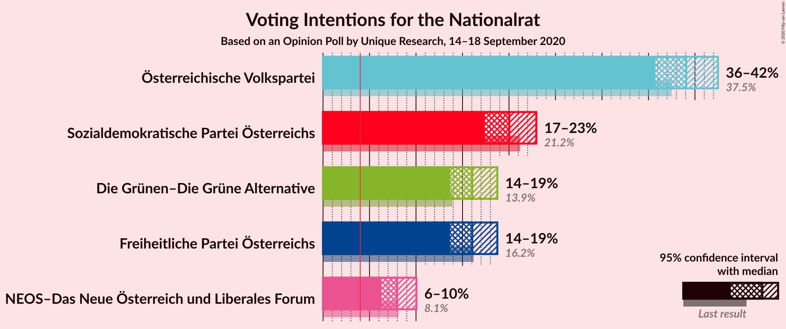

### Confidence Intervals

| Party | Last Result | Poll Result | 80% Confidence Interval | 90% Confidence Interval | 95% Confidence Interval | 99% Confidence Interval |
|:-----:|:-----------:|:-----------:|:-----------------------:|:-----------------------:|:-----------------------:|:-----------------------:|
| Österreichische Volkspartei | 37.5% | 39.1% | 36.9–41.3% |36.3–41.9% |35.7–42.5% |34.7–43.6% |
| Sozialdemokratische Partei Österreichs | 21.2% | 20.0% | 18.3–21.9% |17.8–22.5% |17.4–22.9% |16.6–23.9% |
| Freiheitliche Partei Österreichs | 16.2% | 16.0% | 14.5–17.8% |14.0–18.3% |13.7–18.7% |13.0–19.6% |
| Die Grünen–Die Grüne Alternative | 13.9% | 16.0% | 14.5–17.8% |14.0–18.3% |13.7–18.7% |13.0–19.6% |
| NEOS–Das Neue Österreich und Liberales Forum | 8.1% | 8.0% | 6.9–9.3% |6.5–9.7% |6.3–10.0% |5.8–10.7% |

*Note:* The poll result column reflects the actual value used in the calculations. Published results may vary slightly, and in addition be rounded to fewer digits.

## Seats

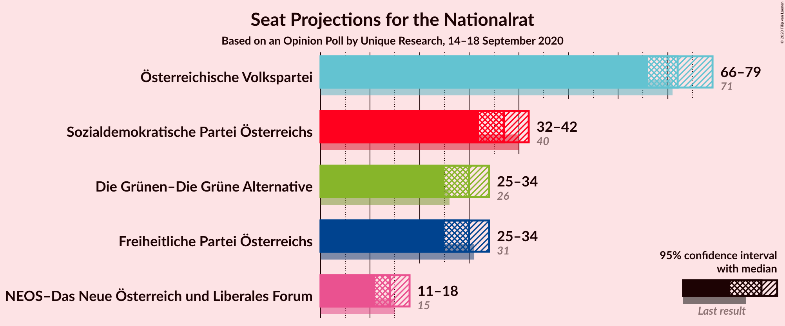

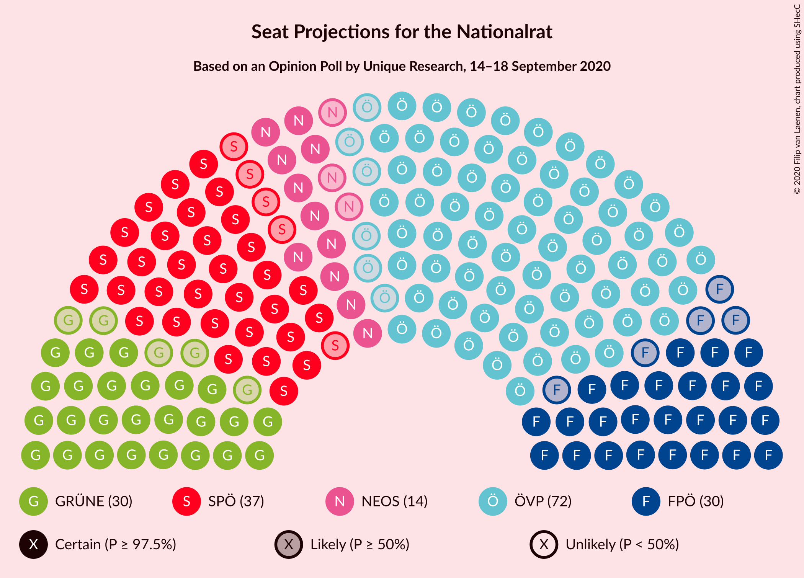

### Confidence Intervals

| Party | Last Result | Median | 80% Confidence Interval | 90% Confidence Interval | 95% Confidence Interval | 99% Confidence Interval |
|:-----:|:-----------:|:------:|:-----------------------:|:-----------------------:|:-----------------------:|:-----------------------:|
| <a href="#österreichische-volkspartei">Österreichische Volkspartei</a> | 71 | 72 | 68–76 |67–78 |66–79 |64–81 |
| <a href="#sozialdemokratische-partei-österreichs">Sozialdemokratische Partei Österreichs</a> | 40 | 37 | 34–40 |33–41 |32–42 |30–44 |
| <a href="#freiheitliche-partei-österreichs">Freiheitliche Partei Österreichs</a> | 31 | 30 | 27–33 |26–34 |25–34 |24–36 |
| <a href="#die-grünen–die-grüne-alternative">Die Grünen–Die Grüne Alternative</a> | 26 | 30 | 27–33 |26–34 |25–34 |24–36 |
| <a href="#neos–das-neue-österreich-und-liberales-forum">NEOS–Das Neue Österreich und Liberales Forum</a> | 15 | 14 | 12–17 |12–18 |11–18 |10–19 |

### Österreichische Volkspartei

*For a full overview of the results for this party, see the [Österreichische Volkspartei](party-österreichischevolkspartei.html) page.*

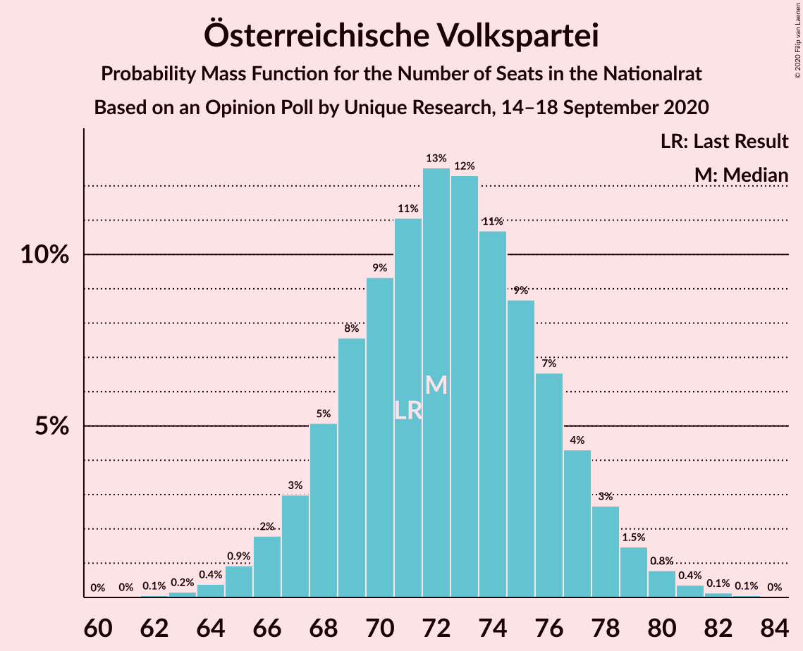

| Number of Seats | Probability | Accumulated | Special Marks |
|:---------------:|:-----------:|:-----------:|:-------------:|
| 62 | 0.1% | 100% |  |
| 63 | 0.2% | 99.9% |  |
| 64 | 0.4% | 99.7% |  |
| 65 | 0.9% | 99.4% |  |
| 66 | 2% | 98% |  |
| 67 | 3% | 97% |  |
| 68 | 5% | 94% |  |
| 69 | 8% | 89% |  |
| 70 | 9% | 81% |  |
| 71 | 11% | 72% | Last Result |
| 72 | 13% | 61% | Median |
| 73 | 12% | 48% |  |
| 74 | 11% | 36% |  |
| 75 | 9% | 25% |  |
| 76 | 7% | 16% |  |
| 77 | 4% | 10% |  |
| 78 | 3% | 6% |  |
| 79 | 1.5% | 3% |  |
| 80 | 0.8% | 1.4% |  |
| 81 | 0.4% | 0.6% |  |
| 82 | 0.1% | 0.2% |  |
| 83 | 0.1% | 0.1% |  |
| 84 | 0% | 0% |  |

### Sozialdemokratische Partei Österreichs

*For a full overview of the results for this party, see the [Sozialdemokratische Partei Österreichs](party-sozialdemokratischeparteiösterreichs.html) page.*

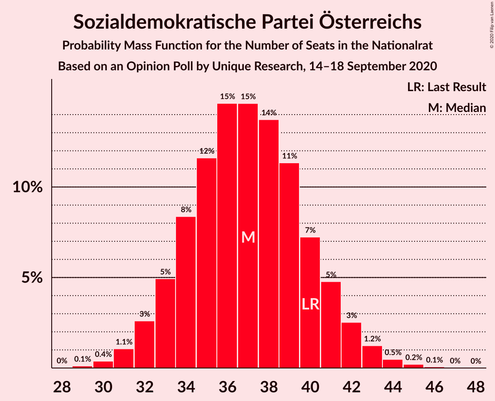

| Number of Seats | Probability | Accumulated | Special Marks |
|:---------------:|:-----------:|:-----------:|:-------------:|
| 29 | 0.1% | 100% |  |
| 30 | 0.4% | 99.9% |  |
| 31 | 1.1% | 99.5% |  |
| 32 | 3% | 98% |  |
| 33 | 5% | 96% |  |
| 34 | 8% | 91% |  |
| 35 | 12% | 82% |  |
| 36 | 15% | 71% |  |
| 37 | 15% | 56% | Median |
| 38 | 14% | 42% |  |
| 39 | 11% | 28% |  |
| 40 | 7% | 17% | Last Result |
| 41 | 5% | 9% |  |
| 42 | 3% | 5% |  |
| 43 | 1.2% | 2% |  |
| 44 | 0.5% | 0.8% |  |
| 45 | 0.2% | 0.3% |  |
| 46 | 0.1% | 0.1% |  |
| 47 | 0% | 0% |  |

### Freiheitliche Partei Österreichs

*For a full overview of the results for this party, see the [Freiheitliche Partei Österreichs](party-freiheitlicheparteiösterreichs.html) page.*

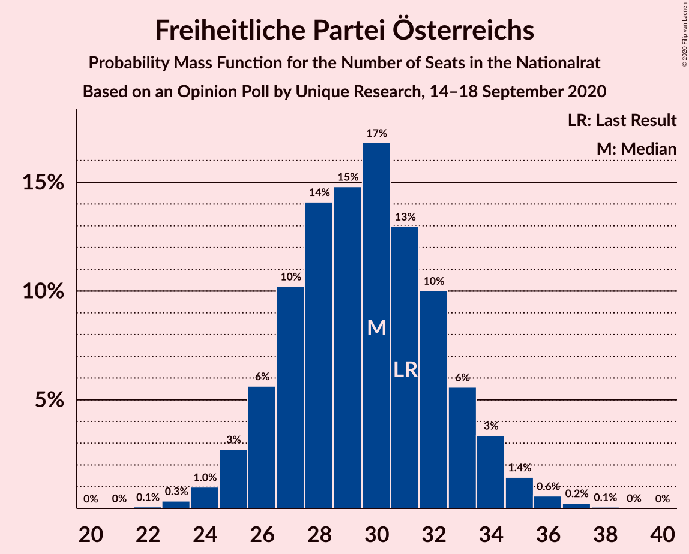

| Number of Seats | Probability | Accumulated | Special Marks |
|:---------------:|:-----------:|:-----------:|:-------------:|
| 22 | 0.1% | 100% |  |
| 23 | 0.3% | 99.9% |  |
| 24 | 1.0% | 99.6% |  |
| 25 | 3% | 98.6% |  |
| 26 | 6% | 96% |  |
| 27 | 10% | 90% |  |
| 28 | 14% | 80% |  |
| 29 | 15% | 66% |  |
| 30 | 17% | 51% | Median |
| 31 | 13% | 34% | Last Result |
| 32 | 10% | 21% |  |
| 33 | 6% | 11% |  |
| 34 | 3% | 6% |  |
| 35 | 1.4% | 2% |  |
| 36 | 0.6% | 0.9% |  |
| 37 | 0.2% | 0.3% |  |
| 38 | 0.1% | 0.1% |  |
| 39 | 0% | 0% |  |

### Die Grünen–Die Grüne Alternative

*For a full overview of the results for this party, see the [Die Grünen–Die Grüne Alternative](party-diegrünen–diegrünealternative.html) page.*

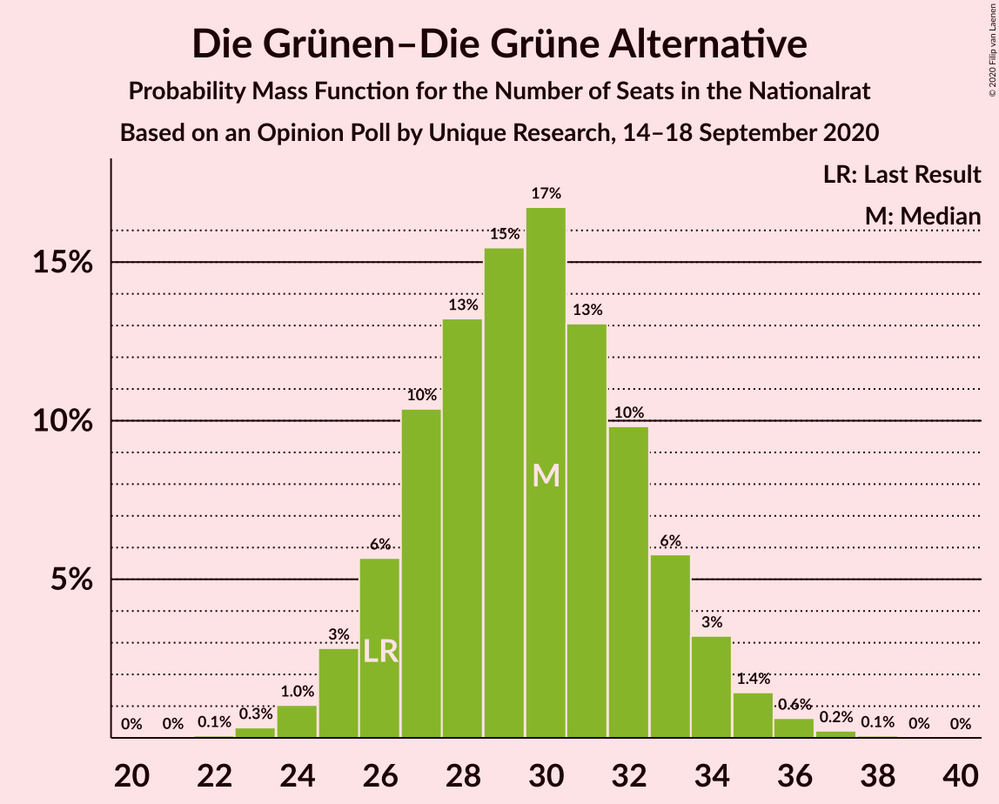

| Number of Seats | Probability | Accumulated | Special Marks |
|:---------------:|:-----------:|:-----------:|:-------------:|
| 22 | 0.1% | 100% |  |
| 23 | 0.3% | 99.9% |  |
| 24 | 1.0% | 99.6% |  |
| 25 | 3% | 98.6% |  |
| 26 | 6% | 96% | Last Result |
| 27 | 10% | 90% |  |
| 28 | 13% | 80% |  |
| 29 | 15% | 66% |  |
| 30 | 17% | 51% | Median |
| 31 | 13% | 34% |  |
| 32 | 10% | 21% |  |
| 33 | 6% | 11% |  |
| 34 | 3% | 6% |  |
| 35 | 1.4% | 2% |  |
| 36 | 0.6% | 0.9% |  |
| 37 | 0.2% | 0.3% |  |
| 38 | 0.1% | 0.1% |  |
| 39 | 0% | 0% |  |

### NEOS–Das Neue Österreich und Liberales Forum

*For a full overview of the results for this party, see the [NEOS–Das Neue Österreich und Liberales Forum](party-neos–dasneueösterreichundliberalesforum.html) page.*

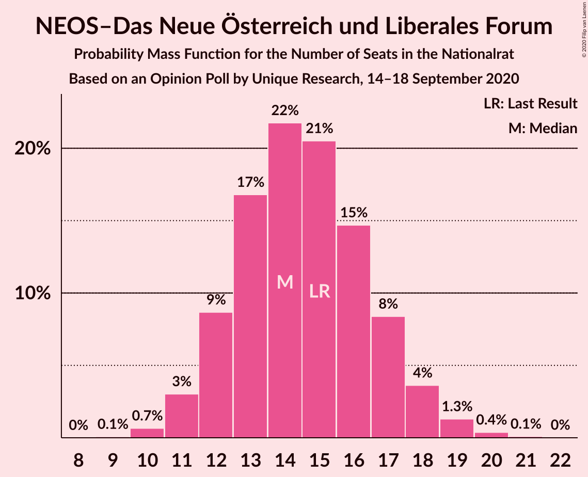

| Number of Seats | Probability | Accumulated | Special Marks |
|:---------------:|:-----------:|:-----------:|:-------------:|
| 9 | 0.1% | 100% |  |
| 10 | 0.7% | 99.9% |  |
| 11 | 3% | 99.3% |  |
| 12 | 9% | 96% |  |
| 13 | 17% | 88% |  |
| 14 | 22% | 71% | Median |
| 15 | 21% | 49% | Last Result |
| 16 | 15% | 28% |  |
| 17 | 8% | 14% |  |
| 18 | 4% | 5% |  |
| 19 | 1.3% | 2% |  |
| 20 | 0.4% | 0.5% |  |
| 21 | 0.1% | 0.1% |  |
| 22 | 0% | 0% |  |

## Coalitions

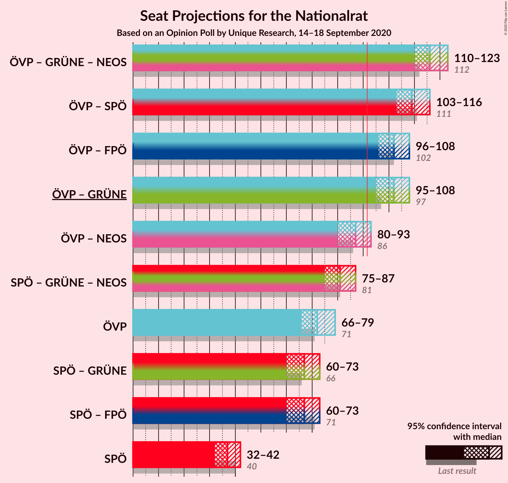

### Confidence Intervals

| Coalition | Last Result | Median | Majority? | 80% Confidence Interval | 90% Confidence Interval | 95% Confidence Interval | 99% Confidence Interval |
|:---------:|:-----------:|:------:|:---------:|:-----------------------:|:-----------------------:|:-----------------------:|:-----------------------:|
| Österreichische Volkspartei – Die Grünen–Die Grüne Alternative – NEOS–Das Neue Österreich und Liberales Forum | 112 | 116 | 100% | 112–120 | 111–122 | 110–123 | 108–124 |
| Österreichische Volkspartei – Sozialdemokratische Partei Österreichs | 111 | 109 | 100% | 105–113 | 104–115 | 103–116 | 101–118 |
| Österreichische Volkspartei – Freiheitliche Partei Österreichs | 102 | 102 | 99.9% | 98–106 | 97–107 | 96–108 | 93–110 |
| Österreichische Volkspartei – Die Grünen–Die Grüne Alternative | 97 | 102 | 99.9% | 98–106 | 97–107 | 95–108 | 93–110 |
| Österreichische Volkspartei – NEOS–Das Neue Österreich und Liberales Forum | 86 | 87 | 8% | 83–91 | 81–92 | 80–93 | 78–95 |
| Sozialdemokratische Partei Österreichs – Die Grünen–Die Grüne Alternative – NEOS–Das Neue Österreich und Liberales Forum | 81 | 81 | 0.1% | 77–85 | 76–86 | 75–87 | 73–90 |
| Österreichische Volkspartei | 71 | 72 | 0% | 68–76 | 67–78 | 66–79 | 64–81 |
| Sozialdemokratische Partei Österreichs – Die Grünen–Die Grüne Alternative | 66 | 67 | 0% | 62–71 | 61–72 | 60–73 | 59–75 |
| Sozialdemokratische Partei Österreichs – Freiheitliche Partei Österreichs | 71 | 67 | 0% | 63–71 | 61–72 | 60–73 | 59–75 |
| Sozialdemokratische Partei Österreichs | 40 | 37 | 0% | 34–40 | 33–41 | 32–42 | 30–44 |

### Österreichische Volkspartei – Die Grünen–Die Grüne Alternative – NEOS–Das Neue Österreich und Liberales Forum

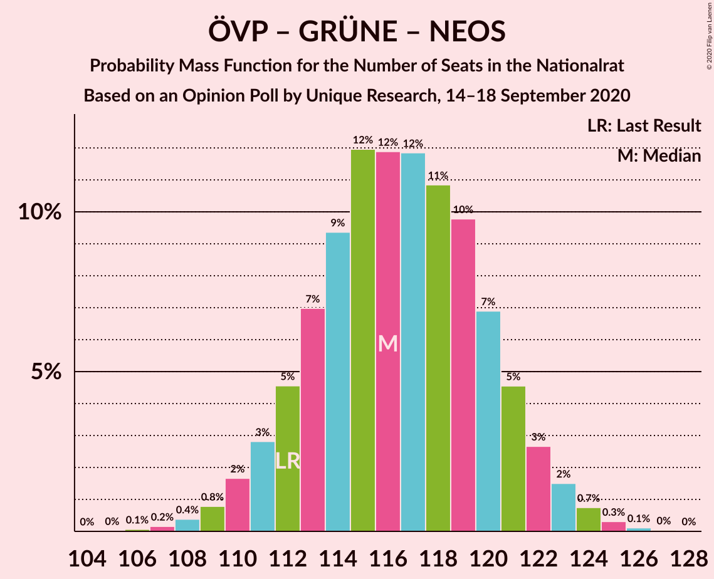

| Number of Seats | Probability | Accumulated | Special Marks |
|:---------------:|:-----------:|:-----------:|:-------------:|
| 106 | 0.1% | 100% |  |
| 107 | 0.2% | 99.9% |  |
| 108 | 0.4% | 99.7% |  |
| 109 | 0.8% | 99.4% |  |
| 110 | 2% | 98.6% |  |
| 111 | 3% | 97% |  |
| 112 | 5% | 94% | Last Result |
| 113 | 7% | 90% |  |
| 114 | 9% | 83% |  |
| 115 | 12% | 73% |  |
| 116 | 12% | 61% | Median |
| 117 | 12% | 49% |  |
| 118 | 11% | 37% |  |
| 119 | 10% | 27% |  |
| 120 | 7% | 17% |  |
| 121 | 5% | 10% |  |
| 122 | 3% | 5% |  |
| 123 | 2% | 3% |  |
| 124 | 0.7% | 1.2% |  |
| 125 | 0.3% | 0.5% |  |
| 126 | 0.1% | 0.2% |  |
| 127 | 0% | 0.1% |  |
| 128 | 0% | 0% |  |

### Österreichische Volkspartei – Sozialdemokratische Partei Österreichs

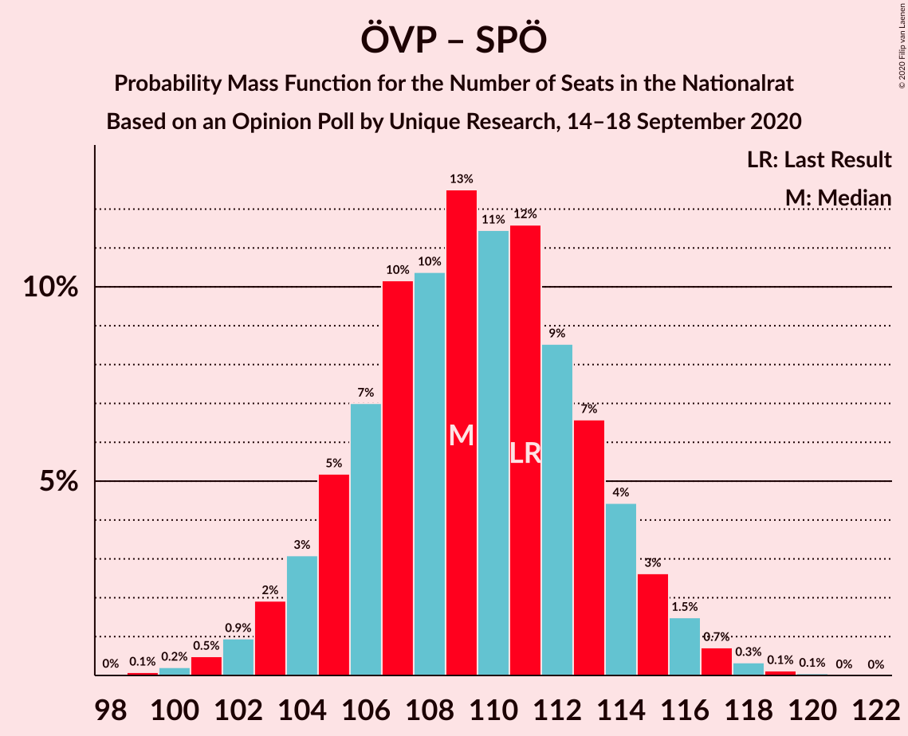

| Number of Seats | Probability | Accumulated | Special Marks |
|:---------------:|:-----------:|:-----------:|:-------------:|
| 99 | 0.1% | 100% |  |
| 100 | 0.2% | 99.9% |  |
| 101 | 0.5% | 99.7% |  |
| 102 | 0.9% | 99.2% |  |
| 103 | 2% | 98% |  |
| 104 | 3% | 96% |  |
| 105 | 5% | 93% |  |
| 106 | 7% | 88% |  |
| 107 | 10% | 81% |  |
| 108 | 10% | 71% |  |
| 109 | 13% | 60% | Median |
| 110 | 11% | 48% |  |
| 111 | 12% | 37% | Last Result |
| 112 | 9% | 25% |  |
| 113 | 7% | 16% |  |
| 114 | 4% | 10% |  |
| 115 | 3% | 5% |  |
| 116 | 1.5% | 3% |  |
| 117 | 0.7% | 1.3% |  |
| 118 | 0.3% | 0.5% |  |
| 119 | 0.1% | 0.2% |  |
| 120 | 0.1% | 0.1% |  |
| 121 | 0% | 0% |  |

### Österreichische Volkspartei – Freiheitliche Partei Österreichs

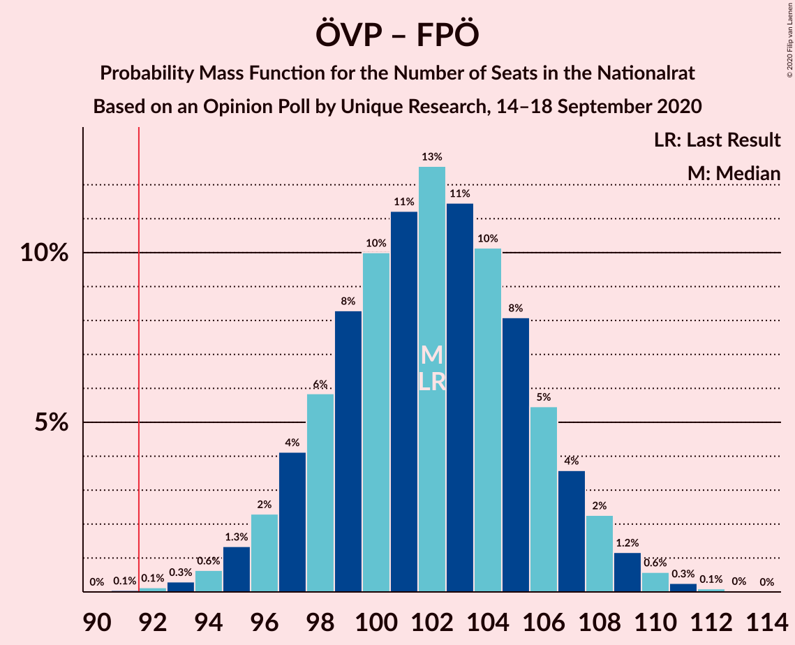

| Number of Seats | Probability | Accumulated | Special Marks |
|:---------------:|:-----------:|:-----------:|:-------------:|
| 91 | 0.1% | 100% |  |
| 92 | 0.1% | 99.9% | Majority |
| 93 | 0.3% | 99.8% |  |
| 94 | 0.6% | 99.5% |  |
| 95 | 1.3% | 98.9% |  |
| 96 | 2% | 98% |  |
| 97 | 4% | 95% |  |
| 98 | 6% | 91% |  |
| 99 | 8% | 85% |  |
| 100 | 10% | 77% |  |
| 101 | 11% | 67% |  |
| 102 | 13% | 56% | Last Result, Median |
| 103 | 11% | 43% |  |
| 104 | 10% | 32% |  |
| 105 | 8% | 22% |  |
| 106 | 5% | 13% |  |
| 107 | 4% | 8% |  |
| 108 | 2% | 4% |  |
| 109 | 1.2% | 2% |  |
| 110 | 0.6% | 1.0% |  |
| 111 | 0.3% | 0.4% |  |
| 112 | 0.1% | 0.2% |  |
| 113 | 0% | 0.1% |  |
| 114 | 0% | 0% |  |

### Österreichische Volkspartei – Die Grünen–Die Grüne Alternative

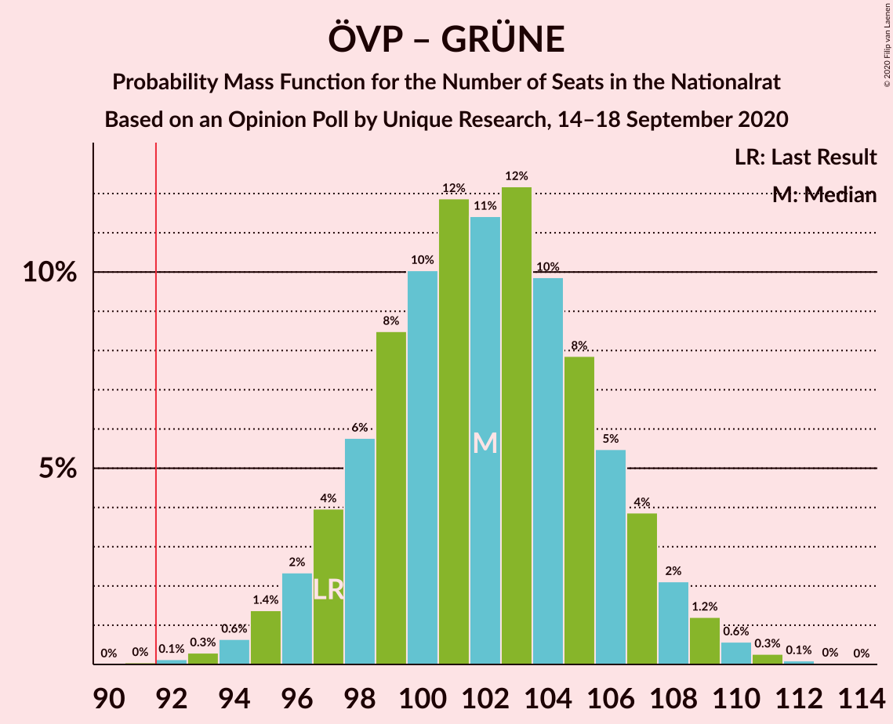

| Number of Seats | Probability | Accumulated | Special Marks |
|:---------------:|:-----------:|:-----------:|:-------------:|
| 91 | 0% | 100% |  |
| 92 | 0.1% | 99.9% | Majority |
| 93 | 0.3% | 99.8% |  |
| 94 | 0.6% | 99.5% |  |
| 95 | 1.4% | 98.9% |  |
| 96 | 2% | 97% |  |
| 97 | 4% | 95% | Last Result |
| 98 | 6% | 91% |  |
| 99 | 8% | 85% |  |
| 100 | 10% | 77% |  |
| 101 | 12% | 67% |  |
| 102 | 11% | 55% | Median |
| 103 | 12% | 44% |  |
| 104 | 10% | 31% |  |
| 105 | 8% | 22% |  |
| 106 | 5% | 14% |  |
| 107 | 4% | 8% |  |
| 108 | 2% | 4% |  |
| 109 | 1.2% | 2% |  |
| 110 | 0.6% | 1.0% |  |
| 111 | 0.3% | 0.4% |  |
| 112 | 0.1% | 0.2% |  |
| 113 | 0% | 0.1% |  |
| 114 | 0% | 0% |  |

### Österreichische Volkspartei – NEOS–Das Neue Österreich und Liberales Forum

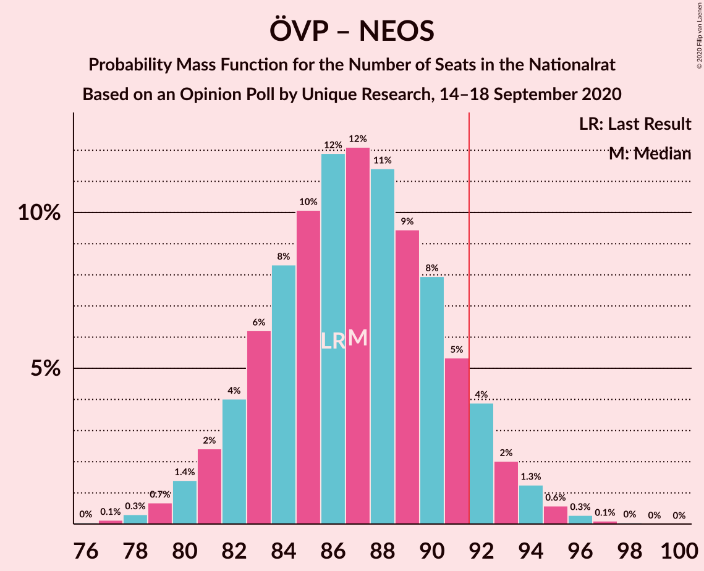

| Number of Seats | Probability | Accumulated | Special Marks |
|:---------------:|:-----------:|:-----------:|:-------------:|
| 76 | 0% | 100% |  |
| 77 | 0.1% | 99.9% |  |
| 78 | 0.3% | 99.8% |  |
| 79 | 0.7% | 99.5% |  |
| 80 | 1.4% | 98.8% |  |
| 81 | 2% | 97% |  |
| 82 | 4% | 95% |  |
| 83 | 6% | 91% |  |
| 84 | 8% | 85% |  |
| 85 | 10% | 76% |  |
| 86 | 12% | 66% | Last Result, Median |
| 87 | 12% | 54% |  |
| 88 | 11% | 42% |  |
| 89 | 9% | 31% |  |
| 90 | 8% | 21% |  |
| 91 | 5% | 14% |  |
| 92 | 4% | 8% | Majority |
| 93 | 2% | 4% |  |
| 94 | 1.3% | 2% |  |
| 95 | 0.6% | 1.0% |  |
| 96 | 0.3% | 0.5% |  |
| 97 | 0.1% | 0.2% |  |
| 98 | 0% | 0.1% |  |
| 99 | 0% | 0% |  |

### Sozialdemokratische Partei Österreichs – Die Grünen–Die Grüne Alternative – NEOS–Das Neue Österreich und Liberales Forum

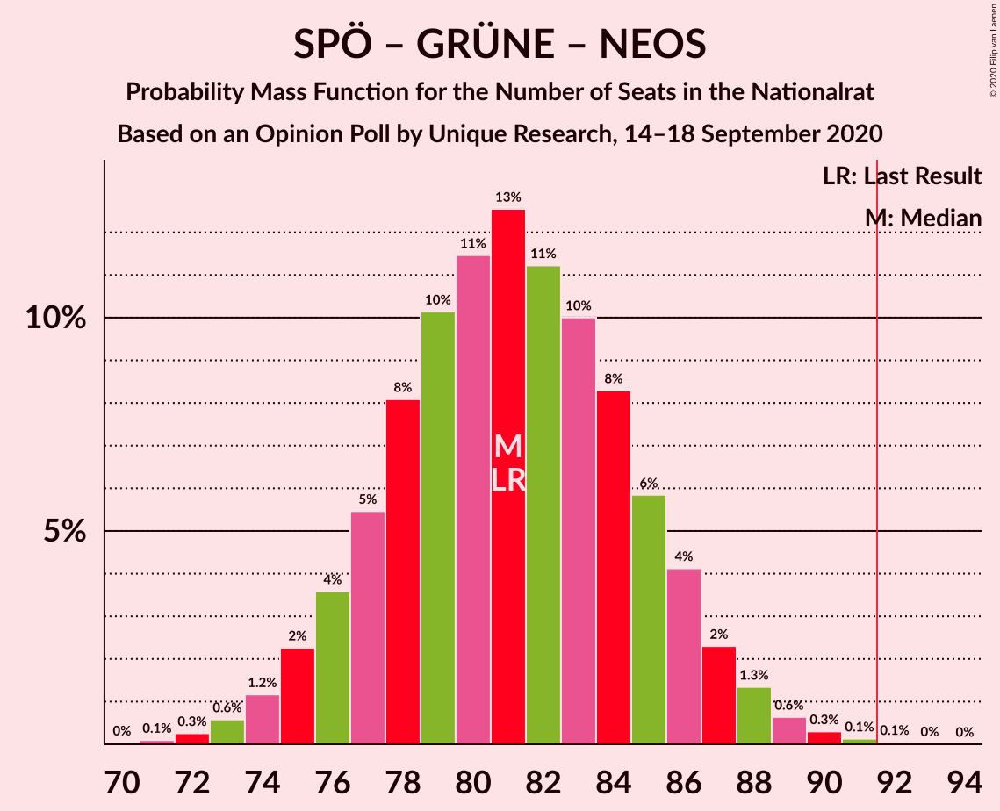

| Number of Seats | Probability | Accumulated | Special Marks |
|:---------------:|:-----------:|:-----------:|:-------------:|
| 70 | 0% | 100% |  |
| 71 | 0.1% | 99.9% |  |
| 72 | 0.3% | 99.8% |  |
| 73 | 0.6% | 99.6% |  |
| 74 | 1.2% | 99.0% |  |
| 75 | 2% | 98% |  |
| 76 | 4% | 96% |  |
| 77 | 5% | 92% |  |
| 78 | 8% | 87% |  |
| 79 | 10% | 78% |  |
| 80 | 11% | 68% |  |
| 81 | 13% | 57% | Last Result, Median |
| 82 | 11% | 44% |  |
| 83 | 10% | 33% |  |
| 84 | 8% | 23% |  |
| 85 | 6% | 15% |  |
| 86 | 4% | 9% |  |
| 87 | 2% | 5% |  |
| 88 | 1.3% | 2% |  |
| 89 | 0.6% | 1.1% |  |
| 90 | 0.3% | 0.5% |  |
| 91 | 0.1% | 0.2% |  |
| 92 | 0.1% | 0.1% | Majority |
| 93 | 0% | 0% |  |

### Österreichische Volkspartei

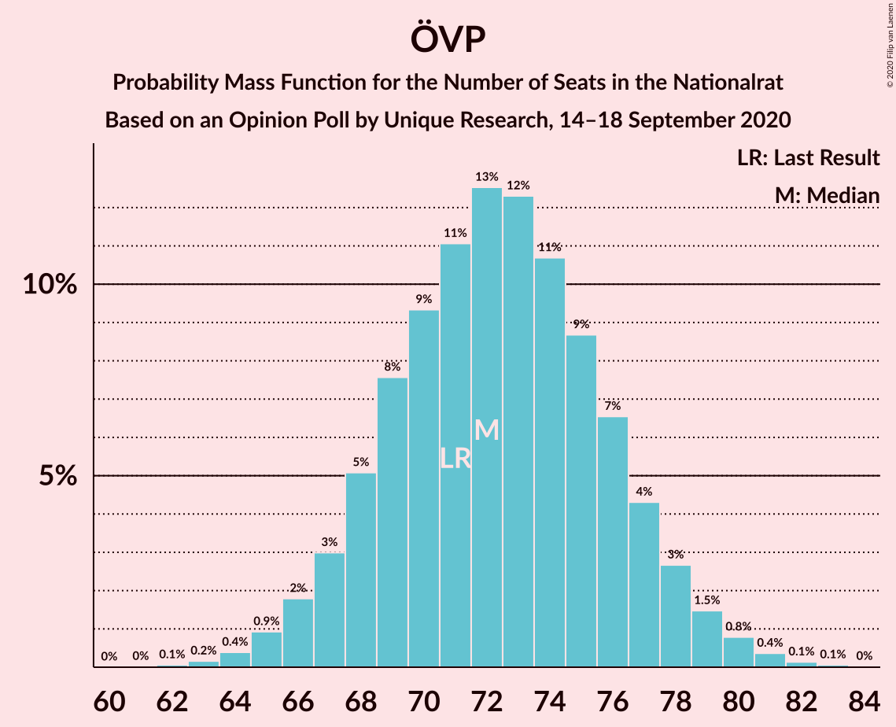

| Number of Seats | Probability | Accumulated | Special Marks |
|:---------------:|:-----------:|:-----------:|:-------------:|
| 62 | 0.1% | 100% |  |
| 63 | 0.2% | 99.9% |  |
| 64 | 0.4% | 99.7% |  |
| 65 | 0.9% | 99.4% |  |
| 66 | 2% | 98% |  |
| 67 | 3% | 97% |  |
| 68 | 5% | 94% |  |
| 69 | 8% | 89% |  |
| 70 | 9% | 81% |  |
| 71 | 11% | 72% | Last Result |
| 72 | 13% | 61% | Median |
| 73 | 12% | 48% |  |
| 74 | 11% | 36% |  |
| 75 | 9% | 25% |  |
| 76 | 7% | 16% |  |
| 77 | 4% | 10% |  |
| 78 | 3% | 6% |  |
| 79 | 1.5% | 3% |  |
| 80 | 0.8% | 1.4% |  |
| 81 | 0.4% | 0.6% |  |
| 82 | 0.1% | 0.2% |  |
| 83 | 0.1% | 0.1% |  |
| 84 | 0% | 0% |  |

### Sozialdemokratische Partei Österreichs – Die Grünen–Die Grüne Alternative

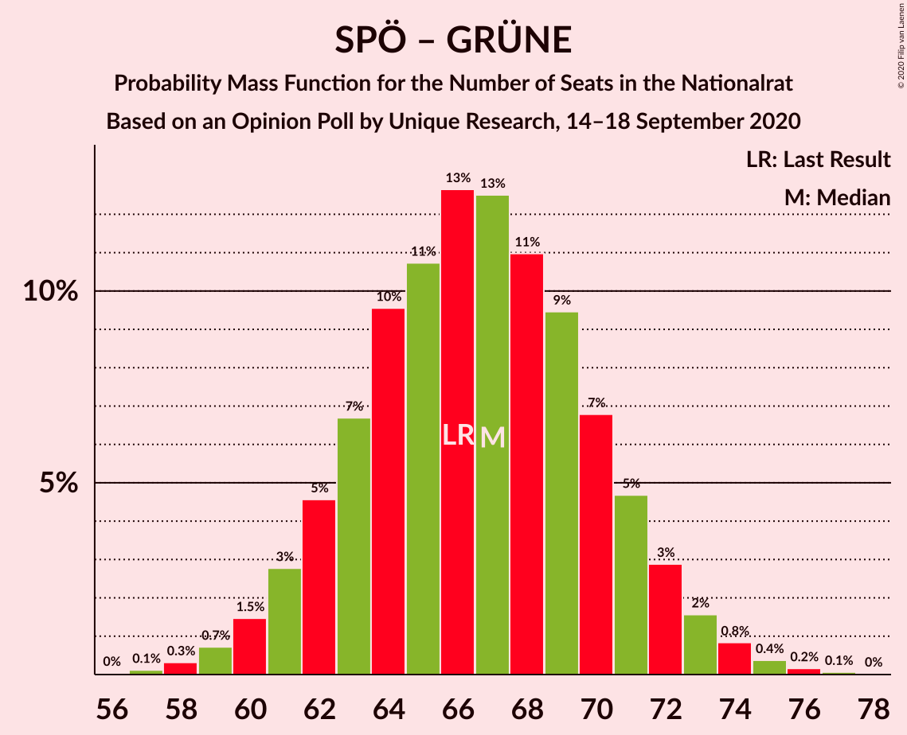

| Number of Seats | Probability | Accumulated | Special Marks |
|:---------------:|:-----------:|:-----------:|:-------------:|
| 56 | 0% | 100% |  |
| 57 | 0.1% | 99.9% |  |
| 58 | 0.3% | 99.8% |  |
| 59 | 0.7% | 99.5% |  |
| 60 | 1.5% | 98.8% |  |
| 61 | 3% | 97% |  |
| 62 | 5% | 95% |  |
| 63 | 7% | 90% |  |
| 64 | 10% | 83% |  |
| 65 | 11% | 74% |  |
| 66 | 13% | 63% | Last Result |
| 67 | 13% | 50% | Median |
| 68 | 11% | 38% |  |
| 69 | 9% | 27% |  |
| 70 | 7% | 17% |  |
| 71 | 5% | 11% |  |
| 72 | 3% | 6% |  |
| 73 | 2% | 3% |  |
| 74 | 0.8% | 1.5% |  |
| 75 | 0.4% | 0.6% |  |
| 76 | 0.2% | 0.3% |  |
| 77 | 0.1% | 0.1% |  |
| 78 | 0% | 0% |  |

### Sozialdemokratische Partei Österreichs – Freiheitliche Partei Österreichs

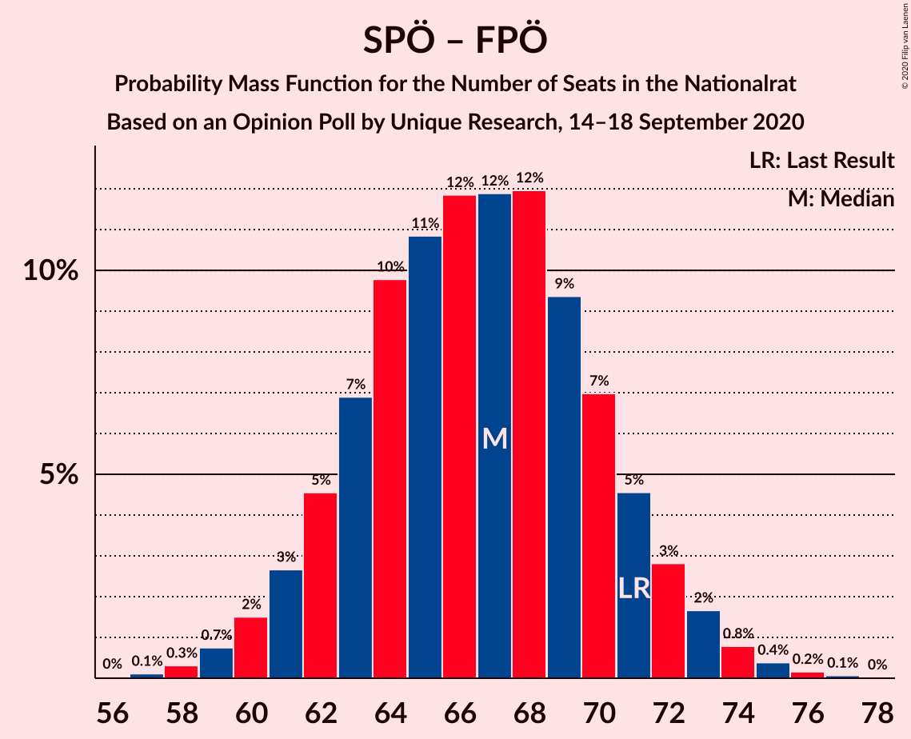

| Number of Seats | Probability | Accumulated | Special Marks |
|:---------------:|:-----------:|:-----------:|:-------------:|
| 56 | 0% | 100% |  |
| 57 | 0.1% | 99.9% |  |
| 58 | 0.3% | 99.8% |  |
| 59 | 0.7% | 99.5% |  |
| 60 | 2% | 98.8% |  |
| 61 | 3% | 97% |  |
| 62 | 5% | 95% |  |
| 63 | 7% | 90% |  |
| 64 | 10% | 83% |  |
| 65 | 11% | 73% |  |
| 66 | 12% | 63% |  |
| 67 | 12% | 51% | Median |
| 68 | 12% | 39% |  |
| 69 | 9% | 27% |  |
| 70 | 7% | 17% |  |
| 71 | 5% | 10% | Last Result |
| 72 | 3% | 6% |  |
| 73 | 2% | 3% |  |
| 74 | 0.8% | 1.4% |  |
| 75 | 0.4% | 0.6% |  |
| 76 | 0.2% | 0.3% |  |
| 77 | 0.1% | 0.1% |  |
| 78 | 0% | 0% |  |

### Sozialdemokratische Partei Österreichs

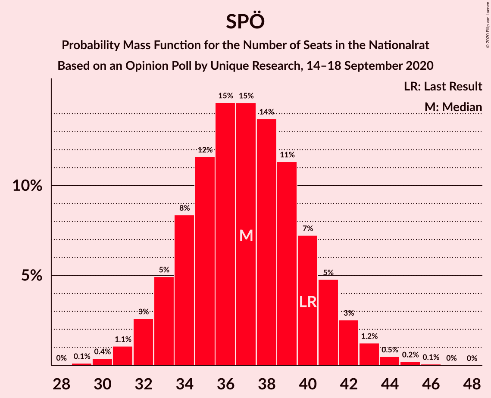

| Number of Seats | Probability | Accumulated | Special Marks |
|:---------------:|:-----------:|:-----------:|:-------------:|
| 29 | 0.1% | 100% |  |
| 30 | 0.4% | 99.9% |  |
| 31 | 1.1% | 99.5% |  |
| 32 | 3% | 98% |  |
| 33 | 5% | 96% |  |
| 34 | 8% | 91% |  |
| 35 | 12% | 82% |  |
| 36 | 15% | 71% |  |
| 37 | 15% | 56% | Median |
| 38 | 14% | 42% |  |
| 39 | 11% | 28% |  |
| 40 | 7% | 17% | Last Result |
| 41 | 5% | 9% |  |
| 42 | 3% | 5% |  |
| 43 | 1.2% | 2% |  |
| 44 | 0.5% | 0.8% |  |
| 45 | 0.2% | 0.3% |  |
| 46 | 0.1% | 0.1% |  |
| 47 | 0% | 0% |  |

## Technical Information

### Opinion Poll

+ **Polling firm:** Unique Research
+ **Commissioner(s):** —
+ **Fieldwork period:** 14–18 September 2020

### Calculations

+ **Sample size:** 804
+ **Simulations done:** 1,048,576
+ **Error estimate:** 0.53%

