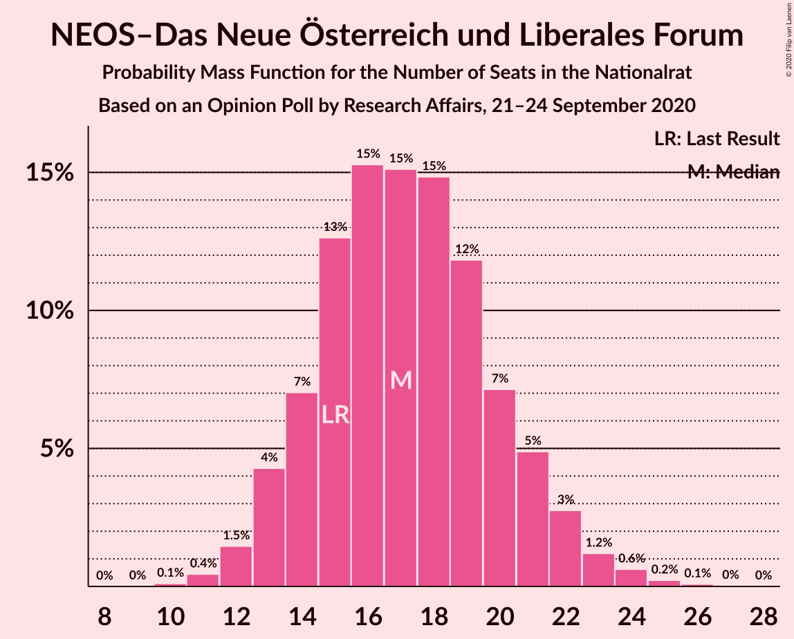
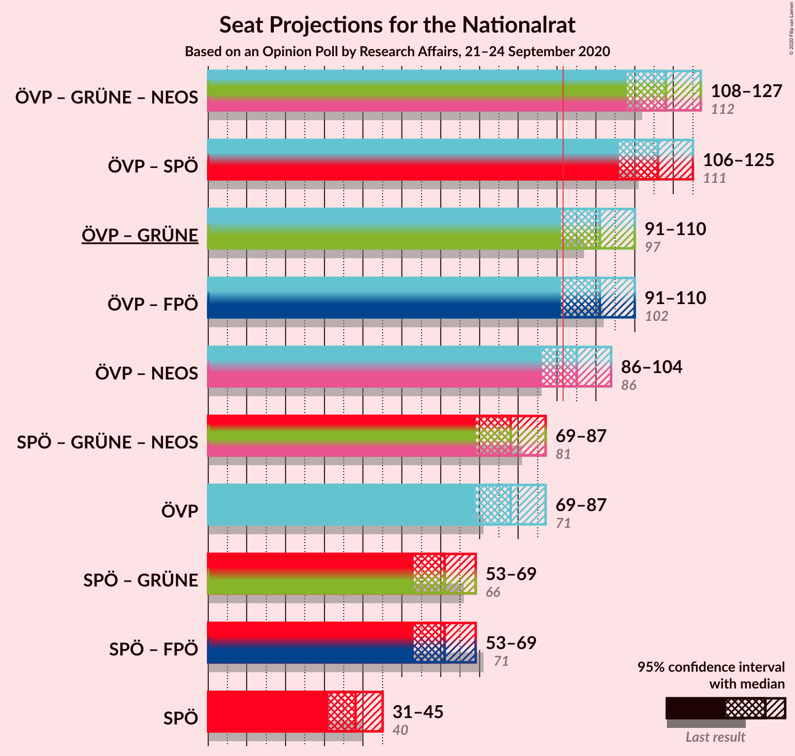
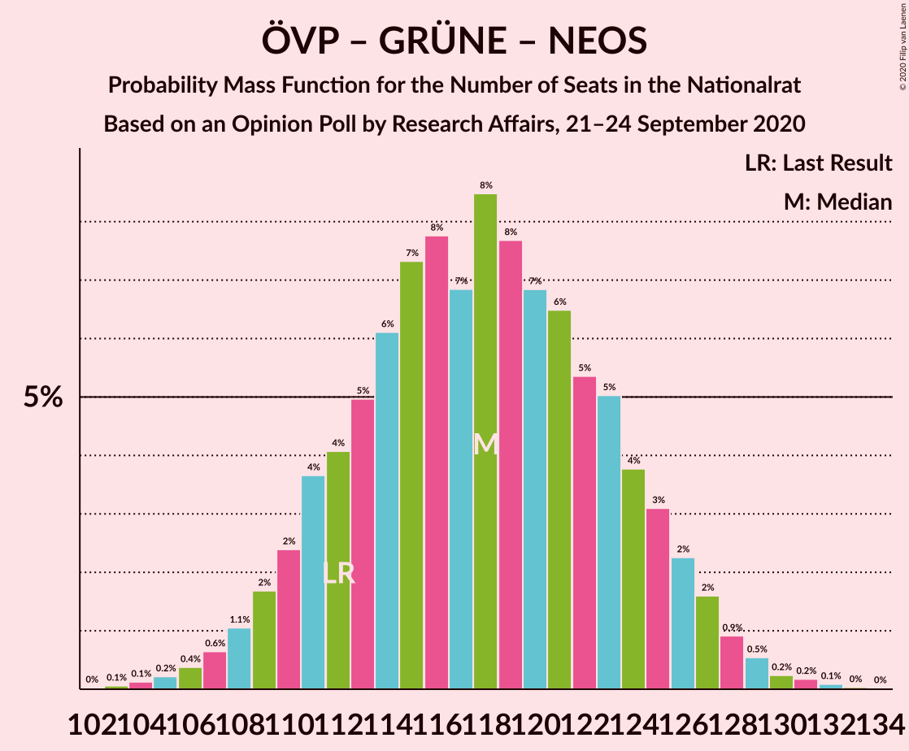
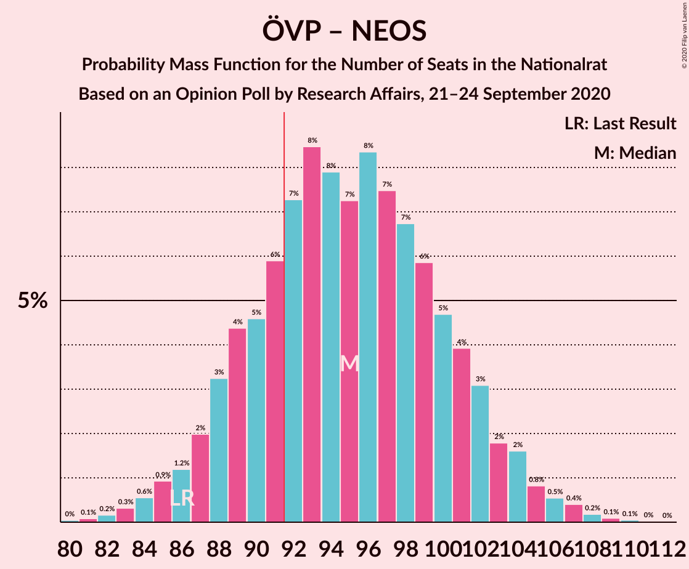
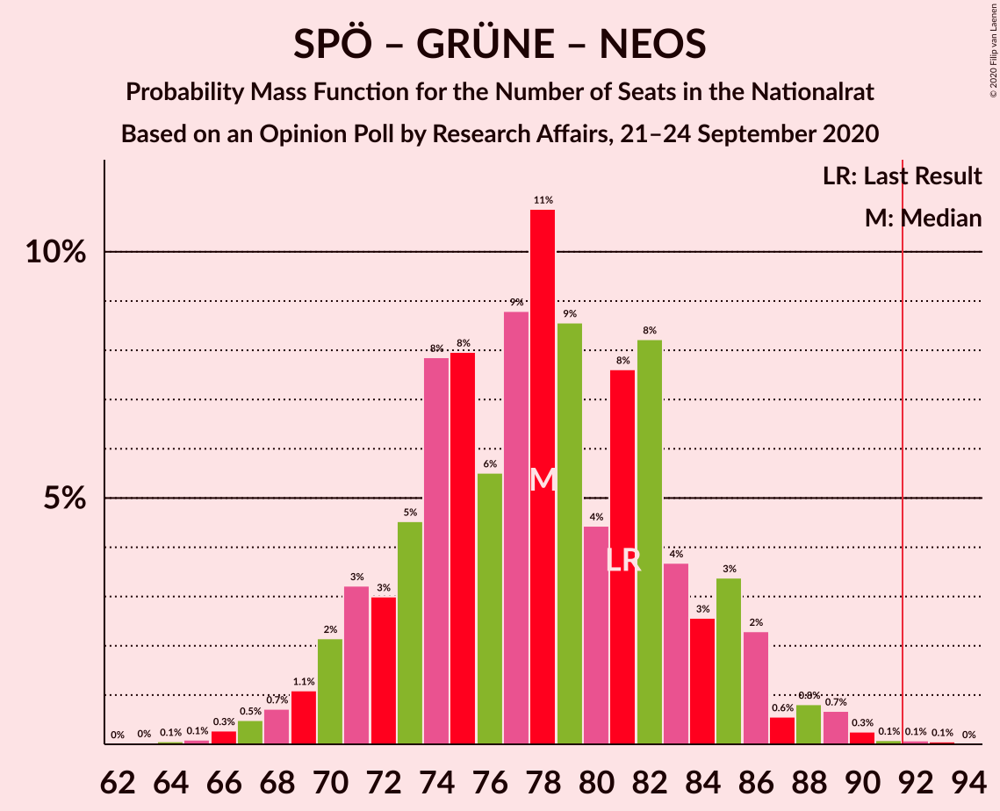

# Opinion Poll by Research Affairs, 21–24 September 2020

<a href="#voting-intentions">Voting Intentions</a> | <a href="#seats">Seats</a> | <a href="#coalitions">Coalitions</a> | <a href="#technical-information">Technical Information</a>

## Voting Intentions

### Confidence Intervals

| Party | Last Result | Poll Result | 80% Confidence Interval | 90% Confidence Interval | 95% Confidence Interval | 99% Confidence Interval |
|:-----:|:-----------:|:-----------:|:-----------------------:|:-----------------------:|:-----------------------:|:-----------------------:|
| Österreichische Volkspartei | 37.5% | 40.9% | 38.1–43.8% |37.4–44.6% |36.7–45.3% |35.4–46.6% |
| Sozialdemokratische Partei Österreichs | 21.2% | 20.0% | 17.8–22.4% |17.2–23.1% |16.7–23.7% |15.7–24.9% |
| Freiheitliche Partei Österreichs | 16.2% | 12.1% | 10.4–14.1% |9.9–14.7% |9.5–15.2% |8.7–16.2% |
| Die Grünen–Die Grüne Alternative | 13.9% | 12.1% | 10.4–14.1% |9.9–14.7% |9.5–15.2% |8.7–16.2% |
| NEOS–Das Neue Österreich und Liberales Forum | 8.1% | 9.1% | 7.6–10.9% |7.2–11.5% |6.9–11.9% |6.2–12.9% |
| Team HC Strache–Allianz für Österreich | 0.0% | 4.0% | 3.0–5.3% |2.8–5.7% |2.6–6.0% |2.2–6.8% |

*Note:* The poll result column reflects the actual value used in the calculations. Published results may vary slightly, and in addition be rounded to fewer digits.

## Seats

### Confidence Intervals

| Party | Last Result | Median | 80% Confidence Interval | 90% Confidence Interval | 95% Confidence Interval | 99% Confidence Interval |
|:-----:|:-----------:|:------:|:-----------------------:|:-----------------------:|:-----------------------:|:-----------------------:|
| <a href="#österreichische-volkspartei">Österreichische Volkspartei</a> | 71 | 77 | 72–83 |71–85 |70–87 |67–89 |
| <a href="#sozialdemokratische-partei-österreichs">Sozialdemokratische Partei Österreichs</a> | 40 | 38 | 34–43 |32–44 |31–45 |30–48 |
| <a href="#freiheitliche-partei-österreichs">Freiheitliche Partei Österreichs</a> | 31 | 23 | 19–27 |18–27 |18–28 |16–31 |
| <a href="#die-grünen–die-grüne-alternative">Die Grünen–Die Grüne Alternative</a> | 26 | 23 | 19–27 |18–28 |18–29 |16–30 |
| <a href="#neos–das-neue-österreich-und-liberales-forum">NEOS–Das Neue Österreich und Liberales Forum</a> | 15 | 17 | 14–21 |13–21 |13–22 |11–24 |
| <a href="#team-hc-strache–allianz-für-österreich">Team HC Strache–Allianz für Österreich</a> | 0 | 7 | 0–9 |0–10 |0–11 |0–12 |

### Österreichische Volkspartei

*For a full overview of the results for this party, see the [Österreichische Volkspartei](party-österreichischevolkspartei.html) page.*

| Number of Seats | Probability | Accumulated | Special Marks |
|:---------------:|:-----------:|:-----------:|:-------------:|
| 63 | 0% | 100% |  |
| 64 | 0.1% | 99.9% |  |
| 65 | 0.1% | 99.9% |  |
| 66 | 0.2% | 99.7% |  |
| 67 | 0.4% | 99.5% |  |
| 68 | 0.8% | 99.1% |  |
| 69 | 0.5% | 98% |  |
| 70 | 2% | 98% |  |
| 71 | 2% | 96% | Last Result |
| 72 | 4% | 94% |  |
| 73 | 7% | 90% |  |
| 74 | 5% | 82% |  |
| 75 | 10% | 77% |  |
| 76 | 7% | 67% |  |
| 77 | 11% | 60% | Median |
| 78 | 11% | 50% |  |
| 79 | 8% | 38% |  |
| 80 | 8% | 31% |  |
| 81 | 6% | 22% |  |
| 82 | 4% | 16% |  |
| 83 | 4% | 12% |  |
| 84 | 2% | 8% |  |
| 85 | 1.4% | 6% |  |
| 86 | 1.4% | 4% |  |
| 87 | 1.2% | 3% |  |
| 88 | 0.8% | 2% |  |
| 89 | 0.3% | 0.8% |  |
| 90 | 0.2% | 0.5% |  |
| 91 | 0.2% | 0.3% |  |
| 92 | 0.1% | 0.2% | Majority |
| 93 | 0.1% | 0.1% |  |
| 94 | 0% | 0% |  |

### Sozialdemokratische Partei Österreichs

*For a full overview of the results for this party, see the [Sozialdemokratische Partei Österreichs](party-sozialdemokratischeparteiösterreichs.html) page.*

| Number of Seats | Probability | Accumulated | Special Marks |
|:---------------:|:-----------:|:-----------:|:-------------:|
| 27 | 0.1% | 100% |  |
| 28 | 0.1% | 99.9% |  |
| 29 | 0.3% | 99.8% |  |
| 30 | 0.7% | 99.6% |  |
| 31 | 2% | 98.9% |  |
| 32 | 3% | 97% |  |
| 33 | 5% | 95% |  |
| 34 | 5% | 90% |  |
| 35 | 9% | 85% |  |
| 36 | 10% | 76% |  |
| 37 | 12% | 66% |  |
| 38 | 13% | 54% | Median |
| 39 | 11% | 40% |  |
| 40 | 8% | 29% | Last Result |
| 41 | 5% | 21% |  |
| 42 | 6% | 16% |  |
| 43 | 4% | 10% |  |
| 44 | 3% | 6% |  |
| 45 | 1.3% | 3% |  |
| 46 | 0.7% | 2% |  |
| 47 | 0.5% | 1.0% |  |
| 48 | 0.3% | 0.5% |  |
| 49 | 0.1% | 0.2% |  |
| 50 | 0.1% | 0.1% |  |
| 51 | 0% | 0% |  |

### Freiheitliche Partei Österreichs

*For a full overview of the results for this party, see the [Freiheitliche Partei Österreichs](party-freiheitlicheparteiösterreichs.html) page.*

| Number of Seats | Probability | Accumulated | Special Marks |
|:---------------:|:-----------:|:-----------:|:-------------:|
| 15 | 0.2% | 100% |  |
| 16 | 0.6% | 99.8% |  |
| 17 | 1.1% | 99.2% |  |
| 18 | 4% | 98% |  |
| 19 | 6% | 94% |  |
| 20 | 9% | 88% |  |
| 21 | 13% | 79% |  |
| 22 | 13% | 66% |  |
| 23 | 14% | 53% | Median |
| 24 | 12% | 38% |  |
| 25 | 9% | 26% |  |
| 26 | 7% | 18% |  |
| 27 | 6% | 10% |  |
| 28 | 2% | 5% |  |
| 29 | 1.0% | 2% |  |
| 30 | 0.6% | 1.2% |  |
| 31 | 0.3% | 0.5% | Last Result |
| 32 | 0.1% | 0.2% |  |
| 33 | 0.1% | 0.1% |  |
| 34 | 0% | 0% |  |

### Die Grünen–Die Grüne Alternative

*For a full overview of the results for this party, see the [Die Grünen–Die Grüne Alternative](party-diegrünen–diegrünealternative.html) page.*

| Number of Seats | Probability | Accumulated | Special Marks |
|:---------------:|:-----------:|:-----------:|:-------------:|
| 15 | 0.2% | 100% |  |
| 16 | 0.5% | 99.8% |  |
| 17 | 1.4% | 99.3% |  |
| 18 | 3% | 98% |  |
| 19 | 5% | 95% |  |
| 20 | 8% | 90% |  |
| 21 | 12% | 82% |  |
| 22 | 15% | 70% |  |
| 23 | 12% | 55% | Median |
| 24 | 16% | 42% |  |
| 25 | 11% | 27% |  |
| 26 | 6% | 16% | Last Result |
| 27 | 5% | 10% |  |
| 28 | 3% | 5% |  |
| 29 | 1.4% | 3% |  |
| 30 | 0.7% | 1.1% |  |
| 31 | 0.2% | 0.5% |  |
| 32 | 0.2% | 0.3% |  |
| 33 | 0% | 0.1% |  |
| 34 | 0% | 0% |  |

### NEOS–Das Neue Österreich und Liberales Forum

*For a full overview of the results for this party, see the [NEOS–Das Neue Österreich und Liberales Forum](party-neos–dasneueösterreichundliberalesforum.html) page.*

| Number of Seats | Probability | Accumulated | Special Marks |
|:---------------:|:-----------:|:-----------:|:-------------:|
| 10 | 0.1% | 100% |  |
| 11 | 0.5% | 99.9% |  |
| 12 | 1.4% | 99.4% |  |
| 13 | 4% | 98% |  |
| 14 | 8% | 94% |  |
| 15 | 14% | 86% | Last Result |
| 16 | 12% | 73% |  |
| 17 | 17% | 61% | Median |
| 18 | 15% | 44% |  |
| 19 | 10% | 29% |  |
| 20 | 9% | 19% |  |
| 21 | 6% | 10% |  |
| 22 | 2% | 4% |  |
| 23 | 1.1% | 2% |  |
| 24 | 0.7% | 1.1% |  |
| 25 | 0.2% | 0.4% |  |
| 26 | 0.1% | 0.2% |  |
| 27 | 0% | 0% |  |

### Team HC Strache–Allianz für Österreich

*For a full overview of the results for this party, see the [Team HC Strache–Allianz für Österreich](party-teamhcstrache–allianzfürösterreich.html) page.*

| Number of Seats | Probability | Accumulated | Special Marks |
|:---------------:|:-----------:|:-----------:|:-------------:|
| 0 | 46% | 100% | Last Result |
| 1 | 0% | 54% |  |
| 2 | 0% | 54% |  |
| 3 | 0% | 54% |  |
| 4 | 0% | 54% |  |
| 5 | 0% | 54% |  |
| 6 | 0% | 54% |  |
| 7 | 12% | 54% | Median |
| 8 | 19% | 43% |  |
| 9 | 14% | 24% |  |
| 10 | 6% | 10% |  |
| 11 | 3% | 4% |  |
| 12 | 0.7% | 1.1% |  |
| 13 | 0.2% | 0.3% |  |
| 14 | 0.1% | 0.1% |  |
| 15 | 0% | 0% |  |

## Coalitions

### Confidence Intervals

| Coalition | Last Result | Median | Majority? | 80% Confidence Interval | 90% Confidence Interval | 95% Confidence Interval | 99% Confidence Interval |
|:---------:|:-----------:|:------:|:---------:|:-----------------------:|:-----------------------:|:-----------------------:|:-----------------------:|
| Österreichische Volkspartei – Die Grünen–Die Grüne Alternative – NEOS–Das Neue Österreich und Liberales Forum | 112 | 117 | 100% | 111–124 | 110–125 | 108–127 | 106–130 |
| Österreichische Volkspartei – Sozialdemokratische Partei Österreichs | 111 | 115 | 100% | 109–121 | 108–123 | 106–125 | 103–127 |
| Österreichische Volkspartei – Freiheitliche Partei Österreichs | 102 | 100 | 98% | 96–107 | 93–108 | 92–111 | 89–113 |
| Österreichische Volkspartei – Die Grünen–Die Grüne Alternative | 97 | 101 | 98% | 95–107 | 94–108 | 92–109 | 88–114 |
| Österreichische Volkspartei – NEOS–Das Neue Österreich und Liberales Forum | 86 | 95 | 77% | 89–101 | 88–102 | 86–104 | 83–107 |
| Österreichische Volkspartei | 71 | 77 | 0.2% | 72–83 | 71–85 | 70–87 | 67–89 |
| Sozialdemokratische Partei Österreichs – Die Grünen–Die Grüne Alternative – NEOS–Das Neue Österreich und Liberales Forum | 81 | 78 | 0.1% | 72–83 | 71–86 | 69–86 | 67–90 |
| Sozialdemokratische Partei Österreichs – Freiheitliche Partei Österreichs | 71 | 61 | 0% | 56–66 | 54–68 | 53–69 | 50–72 |
| Sozialdemokratische Partei Österreichs – Die Grünen–Die Grüne Alternative | 66 | 61 | 0% | 56–66 | 54–67 | 52–68 | 51–72 |
| Sozialdemokratische Partei Österreichs | 40 | 38 | 0% | 34–43 | 32–44 | 31–45 | 30–48 |

### Österreichische Volkspartei – Die Grünen–Die Grüne Alternative – NEOS–Das Neue Österreich und Liberales Forum

| Number of Seats | Probability | Accumulated | Special Marks |
|:---------------:|:-----------:|:-----------:|:-------------:|
| 103 | 0.1% | 100% |  |
| 104 | 0.2% | 99.9% |  |
| 105 | 0.1% | 99.7% |  |
| 106 | 0.3% | 99.6% |  |
| 107 | 0.5% | 99.3% |  |
| 108 | 1.4% | 98.8% |  |
| 109 | 1.4% | 97% |  |
| 110 | 2% | 96% |  |
| 111 | 5% | 94% |  |
| 112 | 4% | 89% | Last Result |
| 113 | 4% | 85% |  |
| 114 | 9% | 82% |  |
| 115 | 6% | 72% |  |
| 116 | 8% | 66% |  |
| 117 | 9% | 59% | Median |
| 118 | 8% | 50% |  |
| 119 | 9% | 42% |  |
| 120 | 3% | 33% |  |
| 121 | 8% | 29% |  |
| 122 | 4% | 21% |  |
| 123 | 3% | 17% |  |
| 124 | 5% | 14% |  |
| 125 | 4% | 9% |  |
| 126 | 2% | 5% |  |
| 127 | 1.1% | 3% |  |
| 128 | 1.0% | 2% |  |
| 129 | 0.6% | 1.2% |  |
| 130 | 0.2% | 0.5% |  |
| 131 | 0.2% | 0.3% |  |
| 132 | 0.1% | 0.1% |  |
| 133 | 0.1% | 0.1% |  |
| 134 | 0% | 0% |  |

### Österreichische Volkspartei – Sozialdemokratische Partei Österreichs

| Number of Seats | Probability | Accumulated | Special Marks |
|:---------------:|:-----------:|:-----------:|:-------------:|
| 101 | 0.1% | 100% |  |
| 102 | 0.1% | 99.9% |  |
| 103 | 0.3% | 99.8% |  |
| 104 | 0.3% | 99.5% |  |
| 105 | 0.6% | 99.2% |  |
| 106 | 1.3% | 98.6% |  |
| 107 | 1.1% | 97% |  |
| 108 | 4% | 96% |  |
| 109 | 2% | 92% |  |
| 110 | 5% | 90% |  |
| 111 | 6% | 85% | Last Result |
| 112 | 6% | 79% |  |
| 113 | 7% | 73% |  |
| 114 | 9% | 66% |  |
| 115 | 11% | 57% | Median |
| 116 | 4% | 46% |  |
| 117 | 9% | 42% |  |
| 118 | 7% | 33% |  |
| 119 | 4% | 26% |  |
| 120 | 7% | 22% |  |
| 121 | 6% | 15% |  |
| 122 | 2% | 9% |  |
| 123 | 2% | 7% |  |
| 124 | 2% | 5% |  |
| 125 | 0.9% | 3% |  |
| 126 | 0.9% | 2% |  |
| 127 | 0.5% | 0.9% |  |
| 128 | 0.1% | 0.4% |  |
| 129 | 0.2% | 0.3% |  |
| 130 | 0.1% | 0.1% |  |
| 131 | 0% | 0% |  |

### Österreichische Volkspartei – Freiheitliche Partei Österreichs

| Number of Seats | Probability | Accumulated | Special Marks |
|:---------------:|:-----------:|:-----------:|:-------------:|
| 85 | 0% | 100% |  |
| 86 | 0.1% | 99.9% |  |
| 87 | 0% | 99.8% |  |
| 88 | 0.2% | 99.8% |  |
| 89 | 0.9% | 99.6% |  |
| 90 | 0.3% | 98.7% |  |
| 91 | 0.4% | 98% |  |
| 92 | 2% | 98% | Majority |
| 93 | 3% | 96% |  |
| 94 | 1.4% | 94% |  |
| 95 | 1.2% | 92% |  |
| 96 | 8% | 91% |  |
| 97 | 12% | 83% |  |
| 98 | 4% | 71% |  |
| 99 | 11% | 67% |  |
| 100 | 16% | 57% | Median |
| 101 | 9% | 41% |  |
| 102 | 2% | 32% | Last Result |
| 103 | 7% | 30% |  |
| 104 | 10% | 23% |  |
| 105 | 1.1% | 13% |  |
| 106 | 0.9% | 12% |  |
| 107 | 4% | 11% |  |
| 108 | 3% | 7% |  |
| 109 | 0.7% | 4% |  |
| 110 | 0.4% | 4% |  |
| 111 | 2% | 3% |  |
| 112 | 0.5% | 1.0% |  |
| 113 | 0.1% | 0.5% |  |
| 114 | 0.2% | 0.4% |  |
| 115 | 0.2% | 0.2% |  |
| 116 | 0% | 0% |  |

### Österreichische Volkspartei – Die Grünen–Die Grüne Alternative

| Number of Seats | Probability | Accumulated | Special Marks |
|:---------------:|:-----------:|:-----------:|:-------------:|
| 86 | 0% | 100% |  |
| 87 | 0.1% | 99.9% |  |
| 88 | 0.3% | 99.8% |  |
| 89 | 0.5% | 99.5% |  |
| 90 | 0.7% | 99.0% |  |
| 91 | 0.7% | 98% |  |
| 92 | 0.6% | 98% | Majority |
| 93 | 1.1% | 97% |  |
| 94 | 5% | 96% |  |
| 95 | 6% | 90% |  |
| 96 | 8% | 84% |  |
| 97 | 8% | 76% | Last Result |
| 98 | 1.5% | 68% |  |
| 99 | 3% | 67% |  |
| 100 | 13% | 63% | Median |
| 101 | 11% | 50% |  |
| 102 | 12% | 40% |  |
| 103 | 6% | 27% |  |
| 104 | 0.6% | 21% |  |
| 105 | 1.0% | 20% |  |
| 106 | 4% | 19% |  |
| 107 | 8% | 15% |  |
| 108 | 4% | 7% |  |
| 109 | 1.1% | 3% |  |
| 110 | 0.2% | 2% |  |
| 111 | 0% | 1.3% |  |
| 112 | 0.4% | 1.3% |  |
| 113 | 0.4% | 1.0% |  |
| 114 | 0.3% | 0.5% |  |
| 115 | 0.2% | 0.2% |  |
| 116 | 0% | 0% |  |

### Österreichische Volkspartei – NEOS–Das Neue Österreich und Liberales Forum

| Number of Seats | Probability | Accumulated | Special Marks |
|:---------------:|:-----------:|:-----------:|:-------------:|
| 80 | 0.1% | 100% |  |
| 81 | 0.1% | 99.9% |  |
| 82 | 0.3% | 99.8% |  |
| 83 | 0.2% | 99.6% |  |
| 84 | 0.3% | 99.4% |  |
| 85 | 0.9% | 99.0% |  |
| 86 | 0.9% | 98% | Last Result |
| 87 | 1.4% | 97% |  |
| 88 | 3% | 96% |  |
| 89 | 3% | 93% |  |
| 90 | 7% | 89% |  |
| 91 | 5% | 82% |  |
| 92 | 9% | 77% | Majority |
| 93 | 11% | 68% |  |
| 94 | 7% | 57% | Median |
| 95 | 8% | 50% |  |
| 96 | 7% | 42% |  |
| 97 | 8% | 36% |  |
| 98 | 6% | 28% |  |
| 99 | 8% | 21% |  |
| 100 | 3% | 13% |  |
| 101 | 5% | 10% |  |
| 102 | 2% | 6% |  |
| 103 | 1.0% | 4% |  |
| 104 | 1.0% | 3% |  |
| 105 | 0.6% | 2% |  |
| 106 | 0.3% | 1.3% |  |
| 107 | 0.6% | 1.0% |  |
| 108 | 0.3% | 0.5% |  |
| 109 | 0.1% | 0.2% |  |
| 110 | 0.1% | 0.1% |  |
| 111 | 0% | 0% |  |

### Österreichische Volkspartei

| Number of Seats | Probability | Accumulated | Special Marks |
|:---------------:|:-----------:|:-----------:|:-------------:|
| 63 | 0% | 100% |  |
| 64 | 0.1% | 99.9% |  |
| 65 | 0.1% | 99.9% |  |
| 66 | 0.2% | 99.7% |  |
| 67 | 0.4% | 99.5% |  |
| 68 | 0.8% | 99.1% |  |
| 69 | 0.5% | 98% |  |
| 70 | 2% | 98% |  |
| 71 | 2% | 96% | Last Result |
| 72 | 4% | 94% |  |
| 73 | 7% | 90% |  |
| 74 | 5% | 82% |  |
| 75 | 10% | 77% |  |
| 76 | 7% | 67% |  |
| 77 | 11% | 60% | Median |
| 78 | 11% | 50% |  |
| 79 | 8% | 38% |  |
| 80 | 8% | 31% |  |
| 81 | 6% | 22% |  |
| 82 | 4% | 16% |  |
| 83 | 4% | 12% |  |
| 84 | 2% | 8% |  |
| 85 | 1.4% | 6% |  |
| 86 | 1.4% | 4% |  |
| 87 | 1.2% | 3% |  |
| 88 | 0.8% | 2% |  |
| 89 | 0.3% | 0.8% |  |
| 90 | 0.2% | 0.5% |  |
| 91 | 0.2% | 0.3% |  |
| 92 | 0.1% | 0.2% | Majority |
| 93 | 0.1% | 0.1% |  |
| 94 | 0% | 0% |  |

### Sozialdemokratische Partei Österreichs – Die Grünen–Die Grüne Alternative – NEOS–Das Neue Österreich und Liberales Forum

| Number of Seats | Probability | Accumulated | Special Marks |
|:---------------:|:-----------:|:-----------:|:-------------:|
| 64 | 0.1% | 100% |  |
| 65 | 0.1% | 99.9% |  |
| 66 | 0.2% | 99.7% |  |
| 67 | 0.4% | 99.5% |  |
| 68 | 1.1% | 99.1% |  |
| 69 | 0.7% | 98% |  |
| 70 | 1.1% | 97% |  |
| 71 | 3% | 96% |  |
| 72 | 4% | 93% |  |
| 73 | 2% | 89% |  |
| 74 | 5% | 87% |  |
| 75 | 12% | 82% |  |
| 76 | 8% | 70% |  |
| 77 | 5% | 62% |  |
| 78 | 9% | 56% | Median |
| 79 | 15% | 47% |  |
| 80 | 5% | 32% |  |
| 81 | 3% | 27% | Last Result |
| 82 | 8% | 25% |  |
| 83 | 8% | 16% |  |
| 84 | 2% | 8% |  |
| 85 | 2% | 7% |  |
| 86 | 3% | 5% |  |
| 87 | 0.9% | 2% |  |
| 88 | 0.2% | 1.1% |  |
| 89 | 0.3% | 0.9% |  |
| 90 | 0.3% | 0.6% |  |
| 91 | 0.2% | 0.4% |  |
| 92 | 0% | 0.1% | Majority |
| 93 | 0.1% | 0.1% |  |
| 94 | 0% | 0% |  |

### Sozialdemokratische Partei Österreichs – Freiheitliche Partei Österreichs

| Number of Seats | Probability | Accumulated | Special Marks |
|:---------------:|:-----------:|:-----------:|:-------------:|
| 48 | 0.1% | 100% |  |
| 49 | 0.1% | 99.9% |  |
| 50 | 0.3% | 99.8% |  |
| 51 | 0.5% | 99.5% |  |
| 52 | 1.0% | 99.0% |  |
| 53 | 2% | 98% |  |
| 54 | 3% | 96% |  |
| 55 | 3% | 93% |  |
| 56 | 6% | 91% |  |
| 57 | 5% | 85% |  |
| 58 | 13% | 80% |  |
| 59 | 9% | 67% |  |
| 60 | 7% | 57% |  |
| 61 | 7% | 51% | Median |
| 62 | 12% | 43% |  |
| 63 | 6% | 31% |  |
| 64 | 10% | 25% |  |
| 65 | 2% | 15% |  |
| 66 | 5% | 14% |  |
| 67 | 3% | 9% |  |
| 68 | 2% | 5% |  |
| 69 | 1.4% | 3% |  |
| 70 | 0.8% | 2% |  |
| 71 | 0.3% | 1.2% | Last Result |
| 72 | 0.6% | 0.9% |  |
| 73 | 0.1% | 0.3% |  |
| 74 | 0.1% | 0.1% |  |
| 75 | 0% | 0% |  |

### Sozialdemokratische Partei Österreichs – Die Grünen–Die Grüne Alternative

| Number of Seats | Probability | Accumulated | Special Marks |
|:---------------:|:-----------:|:-----------:|:-------------:|
| 48 | 0.1% | 100% |  |
| 49 | 0.1% | 99.9% |  |
| 50 | 0.2% | 99.7% |  |
| 51 | 0.7% | 99.5% |  |
| 52 | 2% | 98.9% |  |
| 53 | 1.1% | 97% |  |
| 54 | 1.3% | 96% |  |
| 55 | 3% | 95% |  |
| 56 | 5% | 91% |  |
| 57 | 8% | 87% |  |
| 58 | 8% | 79% |  |
| 59 | 5% | 71% |  |
| 60 | 5% | 66% |  |
| 61 | 18% | 60% | Median |
| 62 | 12% | 42% |  |
| 63 | 8% | 29% |  |
| 64 | 4% | 21% |  |
| 65 | 5% | 17% |  |
| 66 | 2% | 12% | Last Result |
| 67 | 5% | 10% |  |
| 68 | 2% | 4% |  |
| 69 | 0.9% | 2% |  |
| 70 | 0.4% | 2% |  |
| 71 | 0.4% | 1.1% |  |
| 72 | 0.4% | 0.7% |  |
| 73 | 0.2% | 0.3% |  |
| 74 | 0.1% | 0.1% |  |
| 75 | 0% | 0.1% |  |
| 76 | 0% | 0% |  |

### Sozialdemokratische Partei Österreichs

| Number of Seats | Probability | Accumulated | Special Marks |
|:---------------:|:-----------:|:-----------:|:-------------:|
| 27 | 0.1% | 100% |  |
| 28 | 0.1% | 99.9% |  |
| 29 | 0.3% | 99.8% |  |
| 30 | 0.7% | 99.6% |  |
| 31 | 2% | 98.9% |  |
| 32 | 3% | 97% |  |
| 33 | 5% | 95% |  |
| 34 | 5% | 90% |  |
| 35 | 9% | 85% |  |
| 36 | 10% | 76% |  |
| 37 | 12% | 66% |  |
| 38 | 13% | 54% | Median |
| 39 | 11% | 40% |  |
| 40 | 8% | 29% | Last Result |
| 41 | 5% | 21% |  |
| 42 | 6% | 16% |  |
| 43 | 4% | 10% |  |
| 44 | 3% | 6% |  |
| 45 | 1.3% | 3% |  |
| 46 | 0.7% | 2% |  |
| 47 | 0.5% | 1.0% |  |
| 48 | 0.3% | 0.5% |  |
| 49 | 0.1% | 0.2% |  |
| 50 | 0.1% | 0.1% |  |
| 51 | 0% | 0% |  |

## Technical Information

### Opinion Poll

+ **Polling firm:** Research Affairs
+ **Commissioner(s):** —
+ **Fieldwork period:** 21–24 September 2020

### Calculations

+ **Sample size:** 506
+ **Simulations done:** 131,072
+ **Error estimate:** 1.72%

