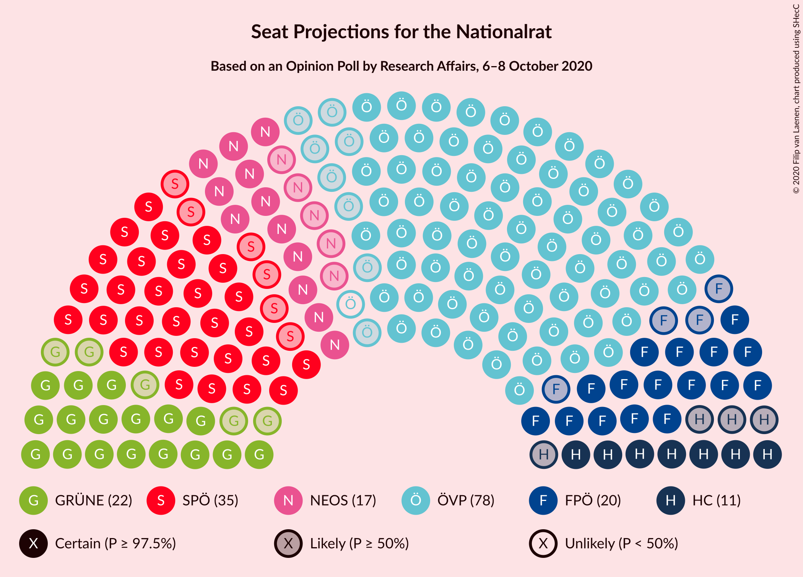
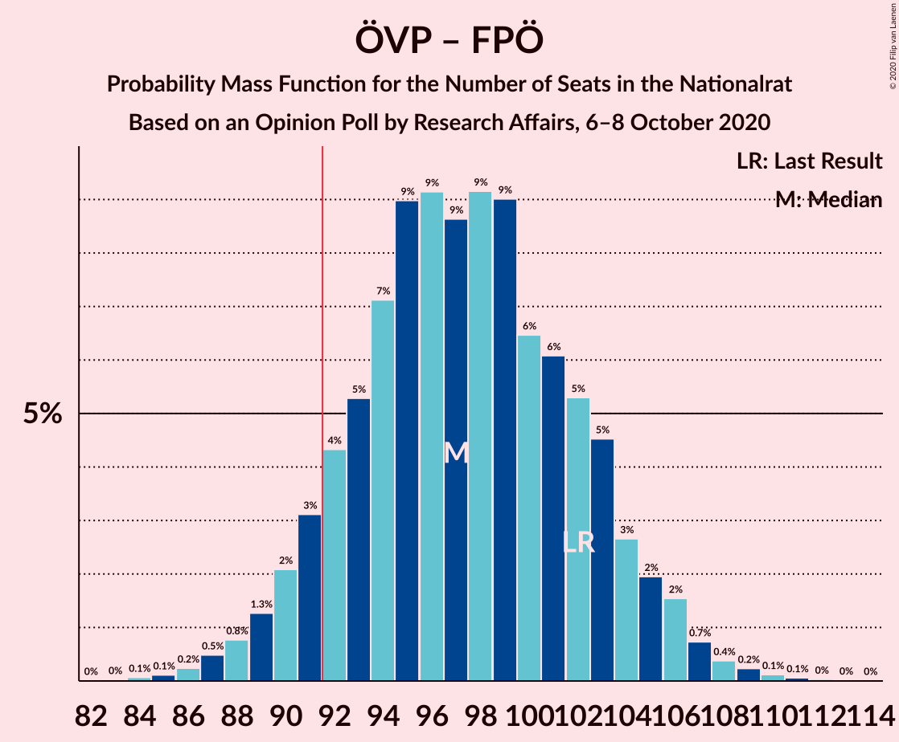

# Opinion Poll by Research Affairs, 6–8 October 2020

<a href="#voting-intentions">Voting Intentions</a> | <a href="#seats">Seats</a> | <a href="#coalitions">Coalitions</a> | <a href="#technical-information">Technical Information</a>

## Voting Intentions

### Confidence Intervals

| Party | Last Result | Poll Result | 80% Confidence Interval | 90% Confidence Interval | 95% Confidence Interval | 99% Confidence Interval |
|:-----:|:-----------:|:-----------:|:-----------------------:|:-----------------------:|:-----------------------:|:-----------------------:|
| Österreichische Volkspartei | 37.5% | 41.0% | 38.3–43.9% |37.5–44.7% |36.8–45.4% |35.5–46.7% |
| Sozialdemokratische Partei Österreichs | 21.2% | 18.9% | 16.8–21.3% |16.3–22.0% |15.8–22.6% |14.8–23.8% |
| Die Grünen–Die Grüne Alternative | 13.9% | 12.0% | 10.3–14.1% |9.9–14.6% |9.5–15.2% |8.7–16.2% |
| Freiheitliche Partei Österreichs | 16.2% | 11.0% | 9.4–13.0% |9.0–13.6% |8.6–14.1% |7.9–15.1% |
| NEOS–Das Neue Österreich und Liberales Forum | 8.1% | 9.1% | 7.6–10.9% |7.2–11.4% |6.9–11.9% |6.2–12.8% |
| Team HC Strache–Allianz für Österreich | 0.0% | 5.9% | 4.8–7.5% |4.5–7.9% |4.2–8.3% |3.7–9.1% |

*Note:* The poll result column reflects the actual value used in the calculations. Published results may vary slightly, and in addition be rounded to fewer digits.

## Seats

### Confidence Intervals

| Party | Last Result | Median | 80% Confidence Interval | 90% Confidence Interval | 95% Confidence Interval | 99% Confidence Interval |
|:-----:|:-----------:|:------:|:-----------------------:|:-----------------------:|:-----------------------:|:-----------------------:|
| <a href="#österreichische-volkspartei">Österreichische Volkspartei</a> | 71 | 77 | 71–82 |70–84 |69–85 |66–88 |
| <a href="#sozialdemokratische-partei-österreichs">Sozialdemokratische Partei Österreichs</a> | 40 | 35 | 31–40 |30–41 |29–42 |28–44 |
| <a href="#die-grünen–die-grüne-alternative">Die Grünen–Die Grüne Alternative</a> | 26 | 22 | 19–26 |18–27 |17–28 |16–30 |
| <a href="#freiheitliche-partei-österreichs">Freiheitliche Partei Österreichs</a> | 31 | 20 | 17–24 |16–25 |16–26 |14–28 |
| <a href="#neos–das-neue-österreich-und-liberales-forum">NEOS–Das Neue Österreich und Liberales Forum</a> | 15 | 17 | 14–20 |13–21 |12–22 |11–24 |
| <a href="#team-hc-strache–allianz-für-österreich">Team HC Strache–Allianz für Österreich</a> | 0 | 11 | 8–14 |8–14 |7–15 |0–17 |

### Österreichische Volkspartei

*For a full overview of the results for this party, see the [Österreichische Volkspartei](party-österreichischevolkspartei.html) page.*

| Number of Seats | Probability | Accumulated | Special Marks |
|:---------------:|:-----------:|:-----------:|:-------------:|
| 64 | 0.1% | 100% |  |
| 65 | 0.2% | 99.9% |  |
| 66 | 0.3% | 99.7% |  |
| 67 | 0.5% | 99.4% |  |
| 68 | 1.0% | 98.9% |  |
| 69 | 2% | 98% |  |
| 70 | 3% | 96% |  |
| 71 | 4% | 94% | Last Result |
| 72 | 5% | 90% |  |
| 73 | 7% | 85% |  |
| 74 | 8% | 78% |  |
| 75 | 9% | 71% |  |
| 76 | 10% | 62% |  |
| 77 | 9% | 52% | Median |
| 78 | 9% | 43% |  |
| 79 | 8% | 34% |  |
| 80 | 7% | 26% |  |
| 81 | 6% | 19% |  |
| 82 | 4% | 13% |  |
| 83 | 3% | 9% |  |
| 84 | 2% | 6% |  |
| 85 | 1.4% | 3% |  |
| 86 | 0.9% | 2% |  |
| 87 | 0.6% | 1.2% |  |
| 88 | 0.3% | 0.6% |  |
| 89 | 0.2% | 0.3% |  |
| 90 | 0.1% | 0.1% |  |
| 91 | 0% | 0.1% |  |
| 92 | 0% | 0% | Majority |

### Sozialdemokratische Partei Österreichs

*For a full overview of the results for this party, see the [Sozialdemokratische Partei Österreichs](party-sozialdemokratischeparteiösterreichs.html) page.*

| Number of Seats | Probability | Accumulated | Special Marks |
|:---------------:|:-----------:|:-----------:|:-------------:|
| 25 | 0.1% | 100% |  |
| 26 | 0.2% | 99.9% |  |
| 27 | 0.3% | 99.8% |  |
| 28 | 1.0% | 99.5% |  |
| 29 | 2% | 98.5% |  |
| 30 | 3% | 96% |  |
| 31 | 6% | 94% |  |
| 32 | 9% | 88% |  |
| 33 | 7% | 80% |  |
| 34 | 12% | 72% |  |
| 35 | 15% | 60% | Median |
| 36 | 8% | 45% |  |
| 37 | 10% | 37% |  |
| 38 | 11% | 26% |  |
| 39 | 4% | 15% |  |
| 40 | 4% | 11% | Last Result |
| 41 | 4% | 7% |  |
| 42 | 1.3% | 3% |  |
| 43 | 0.9% | 2% |  |
| 44 | 0.6% | 1.0% |  |
| 45 | 0.2% | 0.4% |  |
| 46 | 0.1% | 0.2% |  |
| 47 | 0.1% | 0.1% |  |
| 48 | 0% | 0% |  |

### Die Grünen–Die Grüne Alternative

*For a full overview of the results for this party, see the [Die Grünen–Die Grüne Alternative](party-diegrünen–diegrünealternative.html) page.*

| Number of Seats | Probability | Accumulated | Special Marks |
|:---------------:|:-----------:|:-----------:|:-------------:|
| 14 | 0% | 100% |  |
| 15 | 0.2% | 99.9% |  |
| 16 | 0.7% | 99.7% |  |
| 17 | 2% | 99.0% |  |
| 18 | 4% | 97% |  |
| 19 | 7% | 93% |  |
| 20 | 10% | 85% |  |
| 21 | 13% | 75% |  |
| 22 | 14% | 62% | Median |
| 23 | 14% | 49% |  |
| 24 | 12% | 35% |  |
| 25 | 10% | 23% |  |
| 26 | 6% | 13% | Last Result |
| 27 | 4% | 8% |  |
| 28 | 2% | 4% |  |
| 29 | 1.0% | 2% |  |
| 30 | 0.5% | 0.8% |  |
| 31 | 0.2% | 0.3% |  |
| 32 | 0.1% | 0.1% |  |
| 33 | 0% | 0% |  |

### Freiheitliche Partei Österreichs

*For a full overview of the results for this party, see the [Freiheitliche Partei Österreichs](party-freiheitlicheparteiösterreichs.html) page.*

| Number of Seats | Probability | Accumulated | Special Marks |
|:---------------:|:-----------:|:-----------:|:-------------:|
| 13 | 0.1% | 100% |  |
| 14 | 0.5% | 99.9% |  |
| 15 | 1.4% | 99.4% |  |
| 16 | 3% | 98% |  |
| 17 | 6% | 94% |  |
| 18 | 11% | 88% |  |
| 19 | 13% | 77% |  |
| 20 | 15% | 65% | Median |
| 21 | 15% | 50% |  |
| 22 | 12% | 35% |  |
| 23 | 9% | 23% |  |
| 24 | 6% | 14% |  |
| 25 | 4% | 8% |  |
| 26 | 2% | 4% |  |
| 27 | 1.0% | 2% |  |
| 28 | 0.4% | 0.7% |  |
| 29 | 0.2% | 0.3% |  |
| 30 | 0.1% | 0.1% |  |
| 31 | 0% | 0% | Last Result |

### NEOS–Das Neue Österreich und Liberales Forum

*For a full overview of the results for this party, see the [NEOS–Das Neue Österreich und Liberales Forum](party-neos–dasneueösterreichundliberalesforum.html) page.*

| Number of Seats | Probability | Accumulated | Special Marks |
|:---------------:|:-----------:|:-----------:|:-------------:|
| 10 | 0.1% | 100% |  |
| 11 | 0.6% | 99.9% |  |
| 12 | 2% | 99.3% |  |
| 13 | 5% | 97% |  |
| 14 | 10% | 92% |  |
| 15 | 13% | 83% | Last Result |
| 16 | 14% | 70% |  |
| 17 | 16% | 55% | Median |
| 18 | 14% | 40% |  |
| 19 | 11% | 26% |  |
| 20 | 7% | 15% |  |
| 21 | 4% | 7% |  |
| 22 | 2% | 4% |  |
| 23 | 1.0% | 2% |  |
| 24 | 0.4% | 0.6% |  |
| 25 | 0.1% | 0.2% |  |
| 26 | 0.1% | 0.1% |  |
| 27 | 0% | 0% |  |

### Team HC Strache–Allianz für Österreich

*For a full overview of the results for this party, see the [Team HC Strache–Allianz für Österreich](party-teamhcstrache–allianzfürösterreich.html) page.*

| Number of Seats | Probability | Accumulated | Special Marks |
|:---------------:|:-----------:|:-----------:|:-------------:|
| 0 | 2% | 100% | Last Result |
| 1 | 0% | 98% |  |
| 2 | 0% | 98% |  |
| 3 | 0% | 98% |  |
| 4 | 0% | 98% |  |
| 5 | 0% | 98% |  |
| 6 | 0% | 98% |  |
| 7 | 2% | 98% |  |
| 8 | 7% | 97% |  |
| 9 | 13% | 90% |  |
| 10 | 18% | 76% |  |
| 11 | 20% | 58% | Median |
| 12 | 16% | 37% |  |
| 13 | 11% | 22% |  |
| 14 | 6% | 11% |  |
| 15 | 3% | 5% |  |
| 16 | 1.1% | 2% |  |
| 17 | 0.4% | 0.6% |  |
| 18 | 0.1% | 0.2% |  |
| 19 | 0% | 0.1% |  |
| 20 | 0% | 0% |  |

## Coalitions

### Confidence Intervals

| Coalition | Last Result | Median | Majority? | 80% Confidence Interval | 90% Confidence Interval | 95% Confidence Interval | 99% Confidence Interval |
|:---------:|:-----------:|:------:|:---------:|:-----------------------:|:-----------------------:|:-----------------------:|:-----------------------:|
| Österreichische Volkspartei – Die Grünen–Die Grüne Alternative – NEOS–Das Neue Österreich und Liberales Forum | 112 | 116 | 100% | 111–121 | 109–123 | 108–124 | 105–127 |
| Österreichische Volkspartei – Sozialdemokratische Partei Österreichs | 111 | 112 | 100% | 107–118 | 105–119 | 104–120 | 101–123 |
| Österreichische Volkspartei – Die Grünen–Die Grüne Alternative | 97 | 99 | 97% | 94–105 | 92–106 | 91–108 | 88–110 |
| Österreichische Volkspartei – Freiheitliche Partei Österreichs | 102 | 97 | 92% | 92–103 | 90–105 | 89–106 | 87–108 |
| Österreichische Volkspartei – NEOS–Das Neue Österreich und Liberales Forum | 86 | 94 | 70% | 88–99 | 87–101 | 85–102 | 83–105 |
| Österreichische Volkspartei | 71 | 77 | 0% | 71–82 | 70–84 | 69–85 | 66–88 |
| Sozialdemokratische Partei Österreichs – Die Grünen–Die Grüne Alternative – NEOS–Das Neue Österreich und Liberales Forum | 81 | 75 | 0% | 69–80 | 68–82 | 67–83 | 64–86 |
| Sozialdemokratische Partei Österreichs – Die Grünen–Die Grüne Alternative | 66 | 58 | 0% | 53–63 | 51–64 | 50–66 | 48–68 |
| Sozialdemokratische Partei Österreichs – Freiheitliche Partei Österreichs | 71 | 56 | 0% | 51–61 | 50–62 | 49–64 | 46–66 |
| Sozialdemokratische Partei Österreichs | 40 | 35 | 0% | 31–40 | 30–41 | 29–42 | 28–44 |

### Österreichische Volkspartei – Die Grünen–Die Grüne Alternative – NEOS–Das Neue Österreich und Liberales Forum

| Number of Seats | Probability | Accumulated | Special Marks |
|:---------------:|:-----------:|:-----------:|:-------------:|
| 102 | 0% | 100% |  |
| 103 | 0.1% | 99.9% |  |
| 104 | 0.1% | 99.9% |  |
| 105 | 0.3% | 99.7% |  |
| 106 | 0.5% | 99.5% |  |
| 107 | 0.8% | 99.0% |  |
| 108 | 1.4% | 98% |  |
| 109 | 2% | 97% |  |
| 110 | 3% | 95% |  |
| 111 | 4% | 91% |  |
| 112 | 6% | 87% | Last Result |
| 113 | 7% | 81% |  |
| 114 | 9% | 74% |  |
| 115 | 10% | 66% |  |
| 116 | 9% | 56% | Median |
| 117 | 9% | 47% |  |
| 118 | 10% | 38% |  |
| 119 | 7% | 28% |  |
| 120 | 6% | 21% |  |
| 121 | 5% | 15% |  |
| 122 | 4% | 10% |  |
| 123 | 2% | 6% |  |
| 124 | 1.4% | 4% |  |
| 125 | 1.0% | 2% |  |
| 126 | 0.5% | 1.2% |  |
| 127 | 0.3% | 0.7% |  |
| 128 | 0.2% | 0.5% |  |
| 129 | 0.1% | 0.2% |  |
| 130 | 0.1% | 0.1% |  |
| 131 | 0% | 0.1% |  |
| 132 | 0% | 0% |  |

### Österreichische Volkspartei – Sozialdemokratische Partei Österreichs

| Number of Seats | Probability | Accumulated | Special Marks |
|:---------------:|:-----------:|:-----------:|:-------------:|
| 98 | 0% | 100% |  |
| 99 | 0.1% | 99.9% |  |
| 100 | 0.1% | 99.9% |  |
| 101 | 0.3% | 99.7% |  |
| 102 | 0.5% | 99.5% |  |
| 103 | 0.8% | 99.0% |  |
| 104 | 1.5% | 98% |  |
| 105 | 2% | 97% |  |
| 106 | 3% | 95% |  |
| 107 | 4% | 92% |  |
| 108 | 6% | 87% |  |
| 109 | 7% | 81% |  |
| 110 | 9% | 73% |  |
| 111 | 9% | 64% | Last Result |
| 112 | 10% | 55% | Median |
| 113 | 9% | 45% |  |
| 114 | 8% | 37% |  |
| 115 | 7% | 29% |  |
| 116 | 6% | 22% |  |
| 117 | 5% | 16% |  |
| 118 | 4% | 11% |  |
| 119 | 3% | 7% |  |
| 120 | 2% | 4% |  |
| 121 | 1.1% | 2% |  |
| 122 | 0.6% | 1.3% |  |
| 123 | 0.3% | 0.7% |  |
| 124 | 0.2% | 0.4% |  |
| 125 | 0.1% | 0.2% |  |
| 126 | 0.1% | 0.1% |  |
| 127 | 0% | 0.1% |  |
| 128 | 0% | 0% |  |

### Österreichische Volkspartei – Die Grünen–Die Grüne Alternative

| Number of Seats | Probability | Accumulated | Special Marks |
|:---------------:|:-----------:|:-----------:|:-------------:|
| 85 | 0% | 100% |  |
| 86 | 0.1% | 99.9% |  |
| 87 | 0.1% | 99.9% |  |
| 88 | 0.3% | 99.7% |  |
| 89 | 0.5% | 99.5% |  |
| 90 | 0.9% | 99.0% |  |
| 91 | 2% | 98% |  |
| 92 | 2% | 97% | Majority |
| 93 | 3% | 95% |  |
| 94 | 5% | 91% |  |
| 95 | 6% | 87% |  |
| 96 | 6% | 80% |  |
| 97 | 7% | 75% | Last Result |
| 98 | 11% | 67% |  |
| 99 | 9% | 56% | Median |
| 100 | 8% | 47% |  |
| 101 | 9% | 39% |  |
| 102 | 8% | 30% |  |
| 103 | 7% | 22% |  |
| 104 | 5% | 15% |  |
| 105 | 4% | 11% |  |
| 106 | 2% | 7% |  |
| 107 | 2% | 4% |  |
| 108 | 1.2% | 3% |  |
| 109 | 0.6% | 1.5% |  |
| 110 | 0.4% | 0.9% |  |
| 111 | 0.2% | 0.5% |  |
| 112 | 0.1% | 0.2% |  |
| 113 | 0.1% | 0.1% |  |
| 114 | 0% | 0.1% |  |
| 115 | 0% | 0% |  |

### Österreichische Volkspartei – Freiheitliche Partei Österreichs

| Number of Seats | Probability | Accumulated | Special Marks |
|:---------------:|:-----------:|:-----------:|:-------------:|
| 84 | 0.1% | 100% |  |
| 85 | 0.1% | 99.9% |  |
| 86 | 0.2% | 99.8% |  |
| 87 | 0.5% | 99.5% |  |
| 88 | 0.8% | 99.0% |  |
| 89 | 1.3% | 98% |  |
| 90 | 2% | 97% |  |
| 91 | 3% | 95% |  |
| 92 | 4% | 92% | Majority |
| 93 | 5% | 87% |  |
| 94 | 7% | 82% |  |
| 95 | 9% | 75% |  |
| 96 | 9% | 66% |  |
| 97 | 9% | 57% | Median |
| 98 | 9% | 48% |  |
| 99 | 9% | 39% |  |
| 100 | 6% | 30% |  |
| 101 | 6% | 24% |  |
| 102 | 5% | 18% | Last Result |
| 103 | 5% | 12% |  |
| 104 | 3% | 8% |  |
| 105 | 2% | 5% |  |
| 106 | 2% | 3% |  |
| 107 | 0.7% | 2% |  |
| 108 | 0.4% | 0.9% |  |
| 109 | 0.2% | 0.5% |  |
| 110 | 0.1% | 0.2% |  |
| 111 | 0.1% | 0.1% |  |
| 112 | 0% | 0.1% |  |
| 113 | 0% | 0% |  |

### Österreichische Volkspartei – NEOS–Das Neue Österreich und Liberales Forum

| Number of Seats | Probability | Accumulated | Special Marks |
|:---------------:|:-----------:|:-----------:|:-------------:|
| 80 | 0% | 100% |  |
| 81 | 0.1% | 99.9% |  |
| 82 | 0.2% | 99.8% |  |
| 83 | 0.4% | 99.7% |  |
| 84 | 0.6% | 99.2% |  |
| 85 | 1.2% | 98.7% |  |
| 86 | 2% | 97% | Last Result |
| 87 | 2% | 96% |  |
| 88 | 4% | 93% |  |
| 89 | 5% | 89% |  |
| 90 | 6% | 84% |  |
| 91 | 8% | 78% |  |
| 92 | 8% | 70% | Majority |
| 93 | 11% | 61% |  |
| 94 | 8% | 51% | Median |
| 95 | 11% | 43% |  |
| 96 | 6% | 33% |  |
| 97 | 8% | 26% |  |
| 98 | 5% | 18% |  |
| 99 | 5% | 13% |  |
| 100 | 3% | 9% |  |
| 101 | 2% | 5% |  |
| 102 | 2% | 3% |  |
| 103 | 0.8% | 2% |  |
| 104 | 0.5% | 1.2% |  |
| 105 | 0.3% | 0.6% |  |
| 106 | 0.2% | 0.3% |  |
| 107 | 0.1% | 0.2% |  |
| 108 | 0% | 0.1% |  |
| 109 | 0% | 0% |  |

### Österreichische Volkspartei

| Number of Seats | Probability | Accumulated | Special Marks |
|:---------------:|:-----------:|:-----------:|:-------------:|
| 64 | 0.1% | 100% |  |
| 65 | 0.2% | 99.9% |  |
| 66 | 0.3% | 99.7% |  |
| 67 | 0.5% | 99.4% |  |
| 68 | 1.0% | 98.9% |  |
| 69 | 2% | 98% |  |
| 70 | 3% | 96% |  |
| 71 | 4% | 94% | Last Result |
| 72 | 5% | 90% |  |
| 73 | 7% | 85% |  |
| 74 | 8% | 78% |  |
| 75 | 9% | 71% |  |
| 76 | 10% | 62% |  |
| 77 | 9% | 52% | Median |
| 78 | 9% | 43% |  |
| 79 | 8% | 34% |  |
| 80 | 7% | 26% |  |
| 81 | 6% | 19% |  |
| 82 | 4% | 13% |  |
| 83 | 3% | 9% |  |
| 84 | 2% | 6% |  |
| 85 | 1.4% | 3% |  |
| 86 | 0.9% | 2% |  |
| 87 | 0.6% | 1.2% |  |
| 88 | 0.3% | 0.6% |  |
| 89 | 0.2% | 0.3% |  |
| 90 | 0.1% | 0.1% |  |
| 91 | 0% | 0.1% |  |
| 92 | 0% | 0% | Majority |

### Sozialdemokratische Partei Österreichs – Die Grünen–Die Grüne Alternative – NEOS–Das Neue Österreich und Liberales Forum

| Number of Seats | Probability | Accumulated | Special Marks |
|:---------------:|:-----------:|:-----------:|:-------------:|
| 61 | 0% | 100% |  |
| 62 | 0.1% | 99.9% |  |
| 63 | 0.1% | 99.9% |  |
| 64 | 0.3% | 99.7% |  |
| 65 | 0.6% | 99.4% |  |
| 66 | 1.0% | 98.8% |  |
| 67 | 2% | 98% |  |
| 68 | 3% | 96% |  |
| 69 | 4% | 93% |  |
| 70 | 5% | 89% |  |
| 71 | 7% | 84% |  |
| 72 | 7% | 78% |  |
| 73 | 9% | 70% |  |
| 74 | 9% | 61% | Median |
| 75 | 9% | 52% |  |
| 76 | 10% | 43% |  |
| 77 | 8% | 33% |  |
| 78 | 7% | 25% |  |
| 79 | 6% | 18% |  |
| 80 | 4% | 13% |  |
| 81 | 3% | 8% | Last Result |
| 82 | 2% | 5% |  |
| 83 | 1.4% | 3% |  |
| 84 | 0.8% | 2% |  |
| 85 | 0.5% | 1.0% |  |
| 86 | 0.3% | 0.5% |  |
| 87 | 0.1% | 0.3% |  |
| 88 | 0.1% | 0.1% |  |
| 89 | 0% | 0.1% |  |
| 90 | 0% | 0% |  |

### Sozialdemokratische Partei Österreichs – Die Grünen–Die Grüne Alternative

| Number of Seats | Probability | Accumulated | Special Marks |
|:---------------:|:-----------:|:-----------:|:-------------:|
| 46 | 0.1% | 100% |  |
| 47 | 0.2% | 99.9% |  |
| 48 | 0.4% | 99.7% |  |
| 49 | 0.8% | 99.3% |  |
| 50 | 1.3% | 98.5% |  |
| 51 | 2% | 97% |  |
| 52 | 4% | 95% |  |
| 53 | 5% | 91% |  |
| 54 | 7% | 87% |  |
| 55 | 8% | 80% |  |
| 56 | 10% | 72% |  |
| 57 | 10% | 62% | Median |
| 58 | 10% | 52% |  |
| 59 | 9% | 43% |  |
| 60 | 10% | 34% |  |
| 61 | 7% | 24% |  |
| 62 | 5% | 17% |  |
| 63 | 4% | 12% |  |
| 64 | 3% | 7% |  |
| 65 | 2% | 4% |  |
| 66 | 1.2% | 3% | Last Result |
| 67 | 0.7% | 2% |  |
| 68 | 0.4% | 0.8% |  |
| 69 | 0.2% | 0.4% |  |
| 70 | 0.1% | 0.2% |  |
| 71 | 0.1% | 0.1% |  |
| 72 | 0% | 0% |  |

### Sozialdemokratische Partei Österreichs – Freiheitliche Partei Österreichs

| Number of Seats | Probability | Accumulated | Special Marks |
|:---------------:|:-----------:|:-----------:|:-------------:|
| 44 | 0.1% | 100% |  |
| 45 | 0.2% | 99.9% |  |
| 46 | 0.3% | 99.7% |  |
| 47 | 0.7% | 99.4% |  |
| 48 | 1.1% | 98.8% |  |
| 49 | 2% | 98% |  |
| 50 | 3% | 95% |  |
| 51 | 5% | 92% |  |
| 52 | 6% | 87% |  |
| 53 | 8% | 81% |  |
| 54 | 9% | 73% |  |
| 55 | 10% | 64% | Median |
| 56 | 10% | 54% |  |
| 57 | 10% | 43% |  |
| 58 | 8% | 34% |  |
| 59 | 7% | 25% |  |
| 60 | 6% | 18% |  |
| 61 | 5% | 13% |  |
| 62 | 3% | 8% |  |
| 63 | 2% | 5% |  |
| 64 | 1.3% | 3% |  |
| 65 | 0.7% | 2% |  |
| 66 | 0.4% | 0.8% |  |
| 67 | 0.2% | 0.4% |  |
| 68 | 0.1% | 0.2% |  |
| 69 | 0.1% | 0.1% |  |
| 70 | 0% | 0% |  |
| 71 | 0% | 0% | Last Result |

### Sozialdemokratische Partei Österreichs

| Number of Seats | Probability | Accumulated | Special Marks |
|:---------------:|:-----------:|:-----------:|:-------------:|
| 25 | 0.1% | 100% |  |
| 26 | 0.2% | 99.9% |  |
| 27 | 0.3% | 99.8% |  |
| 28 | 1.0% | 99.5% |  |
| 29 | 2% | 98.5% |  |
| 30 | 3% | 96% |  |
| 31 | 6% | 94% |  |
| 32 | 9% | 88% |  |
| 33 | 7% | 80% |  |
| 34 | 12% | 72% |  |
| 35 | 15% | 60% | Median |
| 36 | 8% | 45% |  |
| 37 | 10% | 37% |  |
| 38 | 11% | 26% |  |
| 39 | 4% | 15% |  |
| 40 | 4% | 11% | Last Result |
| 41 | 4% | 7% |  |
| 42 | 1.3% | 3% |  |
| 43 | 0.9% | 2% |  |
| 44 | 0.6% | 1.0% |  |
| 45 | 0.2% | 0.4% |  |
| 46 | 0.1% | 0.2% |  |
| 47 | 0.1% | 0.1% |  |
| 48 | 0% | 0% |  |

## Technical Information

### Opinion Poll

+ **Polling firm:** Research Affairs
+ **Commissioner(s):** —
+ **Fieldwork period:** 6–8 October 2020

### Calculations

+ **Sample size:** 507
+ **Simulations done:** 1,048,576
+ **Error estimate:** 1.40%

