# Opinion Poll by OGM, 20–22 October 2020

<a href="#voting-intentions">Voting Intentions</a> | <a href="#seats">Seats</a> | <a href="#coalitions">Coalitions</a> | <a href="#technical-information">Technical Information</a>

## Voting Intentions

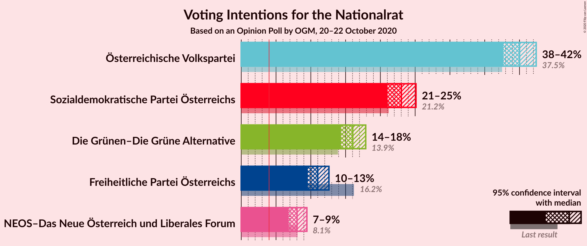

### Confidence Intervals

| Party | Last Result | Poll Result | 80% Confidence Interval | 90% Confidence Interval | 95% Confidence Interval | 99% Confidence Interval |
|:-----:|:-----------:|:-----------:|:-----------------------:|:-----------------------:|:-----------------------:|:-----------------------:|
| Österreichische Volkspartei | 37.5% | 40.0% | 38.5–41.6% |38.0–42.0% |37.7–42.4% |36.9–43.2% |
| Sozialdemokratische Partei Österreichs | 21.2% | 23.0% | 21.7–24.4% |21.4–24.8% |21.0–25.1% |20.4–25.8% |
| Die Grünen–Die Grüne Alternative | 13.9% | 16.0% | 14.9–17.2% |14.6–17.6% |14.3–17.9% |13.8–18.5% |
| Freiheitliche Partei Österreichs | 16.2% | 11.0% | 10.0–12.0% |9.8–12.3% |9.6–12.6% |9.1–13.1% |
| NEOS–Das Neue Österreich und Liberales Forum | 8.1% | 8.0% | 7.2–8.9% |7.0–9.2% |6.8–9.4% |6.4–9.9% |

*Note:* The poll result column reflects the actual value used in the calculations. Published results may vary slightly, and in addition be rounded to fewer digits.

## Seats

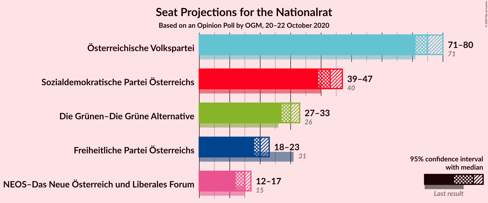

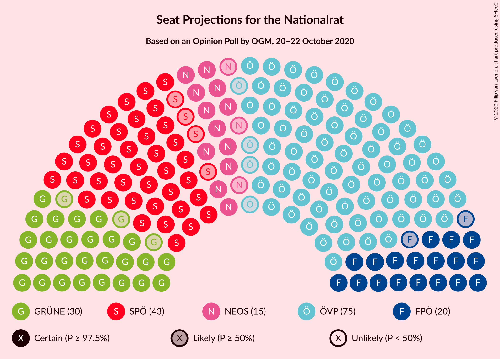

### Confidence Intervals

| Party | Last Result | Median | 80% Confidence Interval | 90% Confidence Interval | 95% Confidence Interval | 99% Confidence Interval |
|:-----:|:-----------:|:------:|:-----------------------:|:-----------------------:|:-----------------------:|:-----------------------:|
| <a href="#österreichische-volkspartei">Österreichische Volkspartei</a> | 71 | 75 | 72–78 |71–79 |71–80 |69–81 |
| <a href="#sozialdemokratische-partei-österreichs">Sozialdemokratische Partei Österreichs</a> | 40 | 43 | 40–46 |40–46 |39–47 |38–48 |
| <a href="#die-grünen–die-grüne-alternative">Die Grünen–Die Grüne Alternative</a> | 26 | 30 | 28–32 |27–33 |27–33 |26–34 |
| <a href="#freiheitliche-partei-österreichs">Freiheitliche Partei Österreichs</a> | 31 | 20 | 18–22 |18–23 |18–23 |17–24 |
| <a href="#neos–das-neue-österreich-und-liberales-forum">NEOS–Das Neue Österreich und Liberales Forum</a> | 15 | 15 | 13–16 |13–17 |12–17 |12–18 |

### Österreichische Volkspartei

*For a full overview of the results for this party, see the [Österreichische Volkspartei](party-österreichischevolkspartei.html) page.*

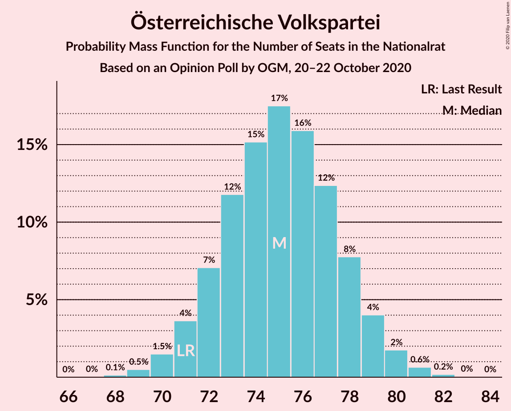

| Number of Seats | Probability | Accumulated | Special Marks |
|:---------------:|:-----------:|:-----------:|:-------------:|
| 68 | 0.1% | 100% |  |
| 69 | 0.5% | 99.8% |  |
| 70 | 1.5% | 99.3% |  |
| 71 | 4% | 98% | Last Result |
| 72 | 7% | 94% |  |
| 73 | 12% | 87% |  |
| 74 | 15% | 75% |  |
| 75 | 17% | 60% | Median |
| 76 | 16% | 43% |  |
| 77 | 12% | 27% |  |
| 78 | 8% | 14% |  |
| 79 | 4% | 7% |  |
| 80 | 2% | 3% |  |
| 81 | 0.6% | 0.9% |  |
| 82 | 0.2% | 0.2% |  |
| 83 | 0% | 0.1% |  |
| 84 | 0% | 0% |  |

### Sozialdemokratische Partei Österreichs

*For a full overview of the results for this party, see the [Sozialdemokratische Partei Österreichs](party-sozialdemokratischeparteiösterreichs.html) page.*

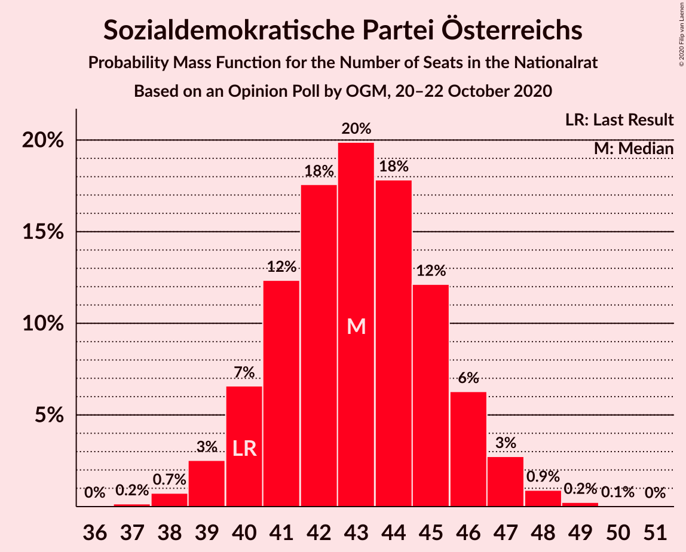

| Number of Seats | Probability | Accumulated | Special Marks |
|:---------------:|:-----------:|:-----------:|:-------------:|
| 37 | 0.2% | 100% |  |
| 38 | 0.7% | 99.8% |  |
| 39 | 3% | 99.1% |  |
| 40 | 7% | 97% | Last Result |
| 41 | 12% | 90% |  |
| 42 | 18% | 78% |  |
| 43 | 20% | 60% | Median |
| 44 | 18% | 40% |  |
| 45 | 12% | 22% |  |
| 46 | 6% | 10% |  |
| 47 | 3% | 4% |  |
| 48 | 0.9% | 1.2% |  |
| 49 | 0.2% | 0.3% |  |
| 50 | 0.1% | 0.1% |  |
| 51 | 0% | 0% |  |

### Die Grünen–Die Grüne Alternative

*For a full overview of the results for this party, see the [Die Grünen–Die Grüne Alternative](party-diegrünen–diegrünealternative.html) page.*

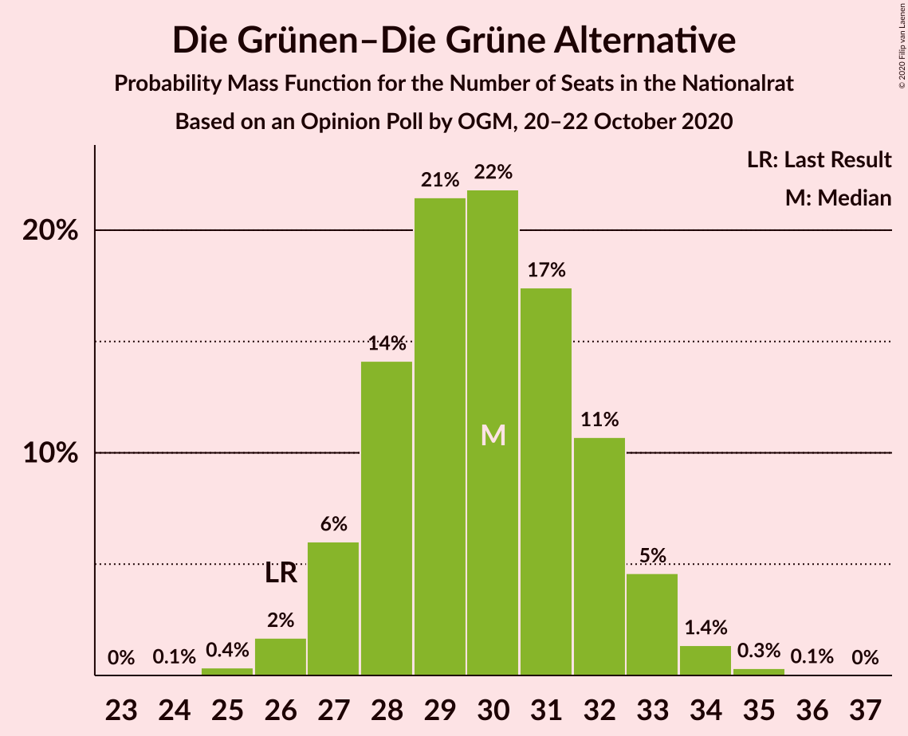

| Number of Seats | Probability | Accumulated | Special Marks |
|:---------------:|:-----------:|:-----------:|:-------------:|
| 24 | 0.1% | 100% |  |
| 25 | 0.4% | 99.9% |  |
| 26 | 2% | 99.6% | Last Result |
| 27 | 6% | 98% |  |
| 28 | 14% | 92% |  |
| 29 | 21% | 78% |  |
| 30 | 22% | 56% | Median |
| 31 | 17% | 34% |  |
| 32 | 11% | 17% |  |
| 33 | 5% | 6% |  |
| 34 | 1.4% | 2% |  |
| 35 | 0.3% | 0.4% |  |
| 36 | 0.1% | 0.1% |  |
| 37 | 0% | 0% |  |

### Freiheitliche Partei Österreichs

*For a full overview of the results for this party, see the [Freiheitliche Partei Österreichs](party-freiheitlicheparteiösterreichs.html) page.*

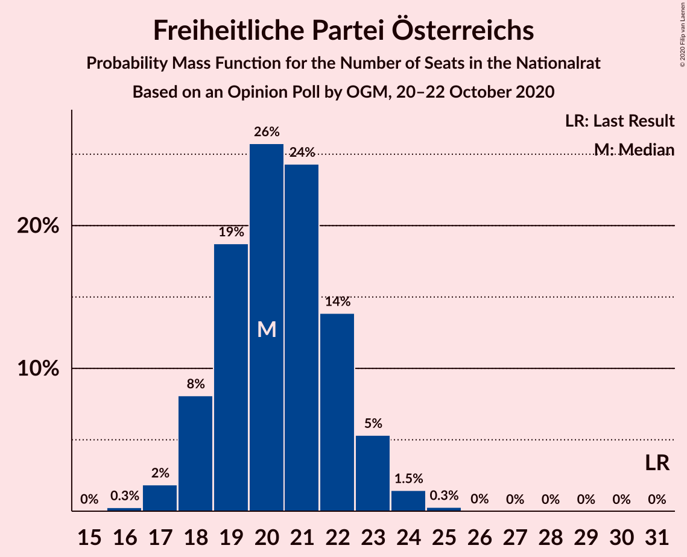

| Number of Seats | Probability | Accumulated | Special Marks |
|:---------------:|:-----------:|:-----------:|:-------------:|
| 16 | 0.3% | 100% |  |
| 17 | 2% | 99.7% |  |
| 18 | 8% | 98% |  |
| 19 | 19% | 90% |  |
| 20 | 26% | 71% | Median |
| 21 | 24% | 45% |  |
| 22 | 14% | 21% |  |
| 23 | 5% | 7% |  |
| 24 | 1.5% | 2% |  |
| 25 | 0.3% | 0.3% |  |
| 26 | 0% | 0% |  |
| 27 | 0% | 0% |  |
| 28 | 0% | 0% |  |
| 29 | 0% | 0% |  |
| 30 | 0% | 0% |  |
| 31 | 0% | 0% | Last Result |

### NEOS–Das Neue Österreich und Liberales Forum

*For a full overview of the results for this party, see the [NEOS–Das Neue Österreich und Liberales Forum](party-neos–dasneueösterreichundliberalesforum.html) page.*

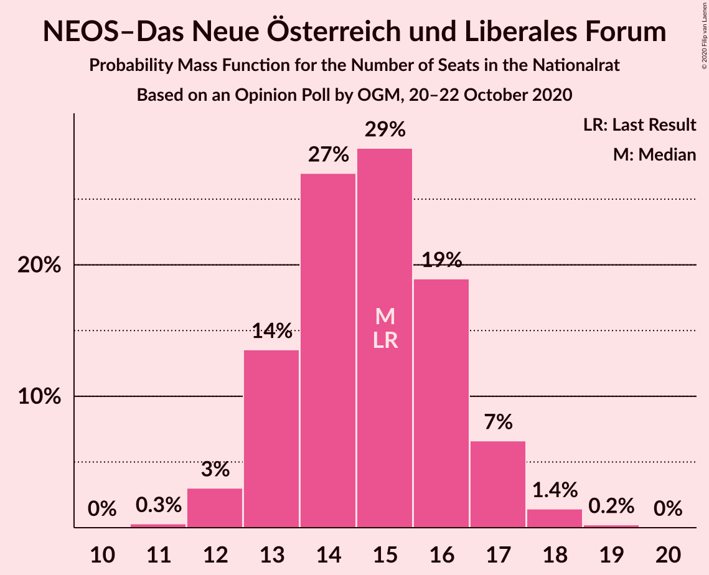

| Number of Seats | Probability | Accumulated | Special Marks |
|:---------------:|:-----------:|:-----------:|:-------------:|
| 11 | 0.3% | 100% |  |
| 12 | 3% | 99.7% |  |
| 13 | 14% | 97% |  |
| 14 | 27% | 83% |  |
| 15 | 29% | 56% | Last Result, Median |
| 16 | 19% | 27% |  |
| 17 | 7% | 8% |  |
| 18 | 1.4% | 2% |  |
| 19 | 0.2% | 0.3% |  |
| 20 | 0% | 0% |  |

## Coalitions

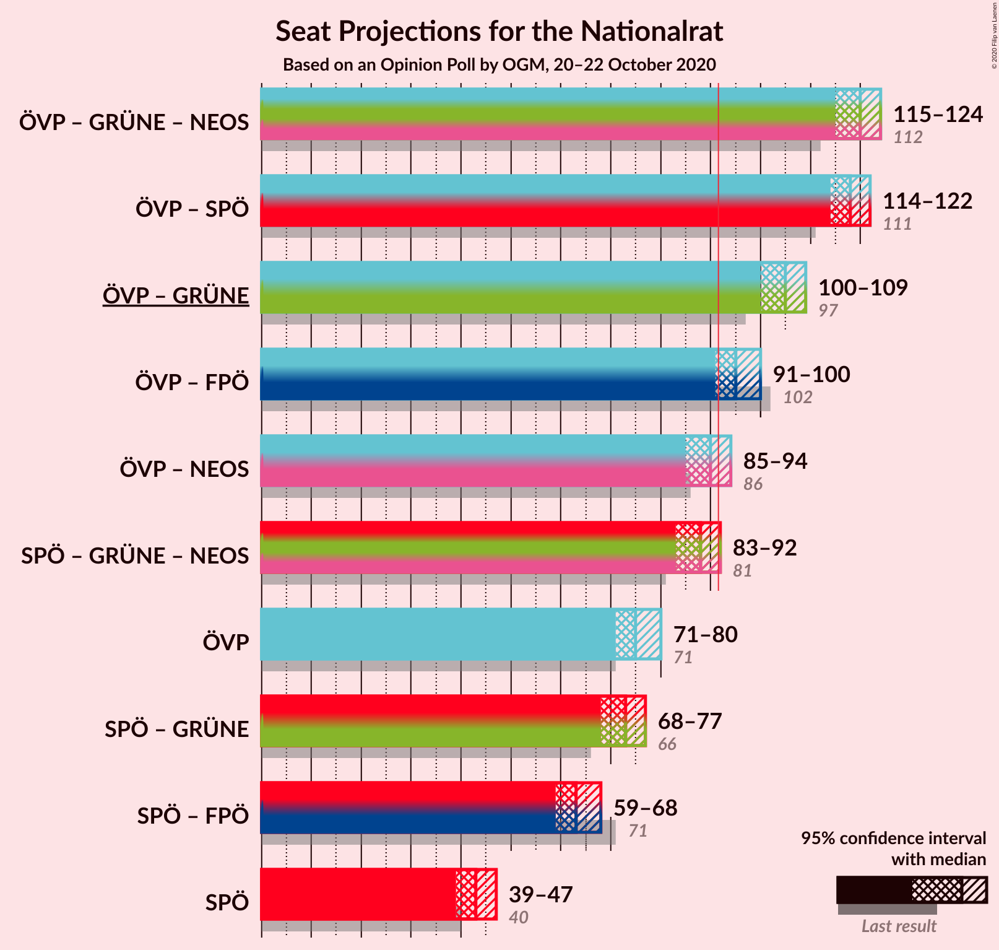

### Confidence Intervals

| Coalition | Last Result | Median | Majority? | 80% Confidence Interval | 90% Confidence Interval | 95% Confidence Interval | 99% Confidence Interval |
|:---------:|:-----------:|:------:|:---------:|:-----------------------:|:-----------------------:|:-----------------------:|:-----------------------:|
| Österreichische Volkspartei – Die Grünen–Die Grüne Alternative – NEOS–Das Neue Österreich und Liberales Forum | 112 | 120 | 100% | 117–122 | 116–123 | 115–124 | 114–125 |
| Österreichische Volkspartei – Sozialdemokratische Partei Österreichs | 111 | 118 | 100% | 115–121 | 114–122 | 114–122 | 112–124 |
| Österreichische Volkspartei – Die Grünen–Die Grüne Alternative | 97 | 105 | 100% | 102–108 | 101–109 | 100–109 | 99–111 |
| Österreichische Volkspartei – Freiheitliche Partei Österreichs | 102 | 95 | 95% | 92–98 | 92–99 | 91–100 | 89–101 |
| Österreichische Volkspartei – NEOS–Das Neue Österreich und Liberales Forum | 86 | 90 | 24% | 87–93 | 86–94 | 85–94 | 84–96 |
| Sozialdemokratische Partei Österreichs – Die Grünen–Die Grüne Alternative – NEOS–Das Neue Österreich und Liberales Forum | 81 | 88 | 5% | 85–91 | 84–91 | 83–92 | 82–94 |
| Österreichische Volkspartei | 71 | 75 | 0% | 72–78 | 71–79 | 71–80 | 69–81 |
| Sozialdemokratische Partei Österreichs – Die Grünen–Die Grüne Alternative | 66 | 73 | 0% | 70–76 | 69–77 | 68–77 | 67–79 |
| Sozialdemokratische Partei Österreichs – Freiheitliche Partei Österreichs | 71 | 63 | 0% | 61–66 | 60–67 | 59–68 | 58–69 |
| Sozialdemokratische Partei Österreichs | 40 | 43 | 0% | 40–46 | 40–46 | 39–47 | 38–48 |

### Österreichische Volkspartei – Die Grünen–Die Grüne Alternative – NEOS–Das Neue Österreich und Liberales Forum

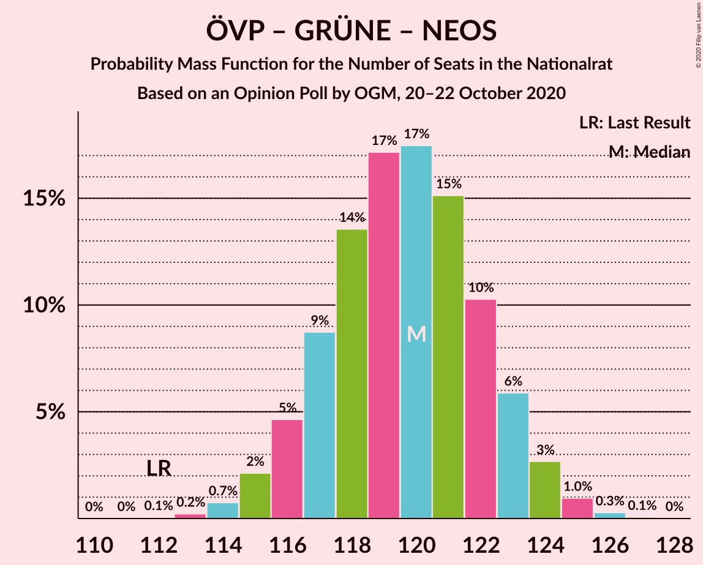

| Number of Seats | Probability | Accumulated | Special Marks |
|:---------------:|:-----------:|:-----------:|:-------------:|
| 112 | 0.1% | 100% | Last Result |
| 113 | 0.2% | 99.9% |  |
| 114 | 0.7% | 99.7% |  |
| 115 | 2% | 99.0% |  |
| 116 | 5% | 97% |  |
| 117 | 9% | 92% |  |
| 118 | 14% | 83% |  |
| 119 | 17% | 70% |  |
| 120 | 17% | 53% | Median |
| 121 | 15% | 35% |  |
| 122 | 10% | 20% |  |
| 123 | 6% | 10% |  |
| 124 | 3% | 4% |  |
| 125 | 1.0% | 1.3% |  |
| 126 | 0.3% | 0.4% |  |
| 127 | 0.1% | 0.1% |  |
| 128 | 0% | 0% |  |

### Österreichische Volkspartei – Sozialdemokratische Partei Österreichs

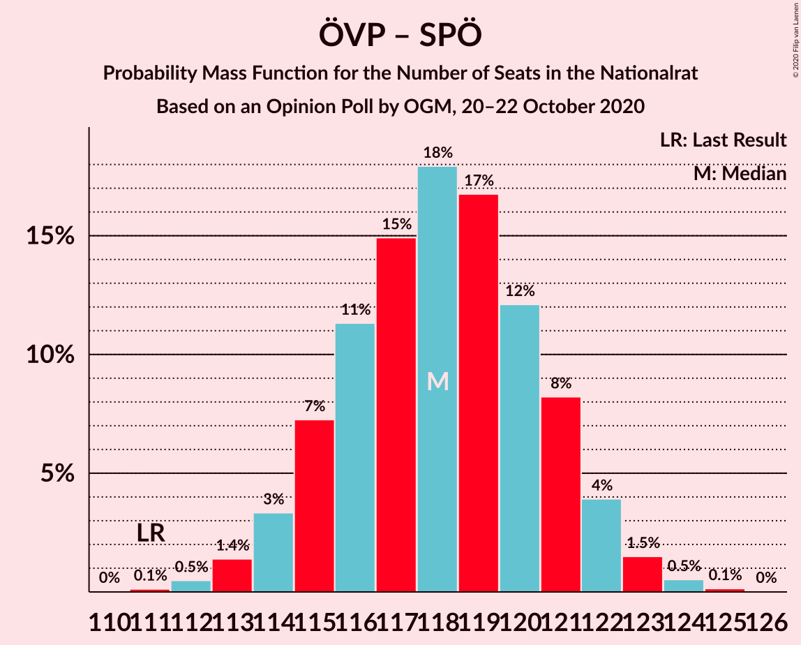

| Number of Seats | Probability | Accumulated | Special Marks |
|:---------------:|:-----------:|:-----------:|:-------------:|
| 111 | 0.1% | 100% | Last Result |
| 112 | 0.5% | 99.8% |  |
| 113 | 1.4% | 99.4% |  |
| 114 | 3% | 98% |  |
| 115 | 7% | 95% |  |
| 116 | 11% | 87% |  |
| 117 | 15% | 76% |  |
| 118 | 18% | 61% | Median |
| 119 | 17% | 43% |  |
| 120 | 12% | 26% |  |
| 121 | 8% | 14% |  |
| 122 | 4% | 6% |  |
| 123 | 1.5% | 2% |  |
| 124 | 0.5% | 0.7% |  |
| 125 | 0.1% | 0.2% |  |
| 126 | 0% | 0% |  |

### Österreichische Volkspartei – Die Grünen–Die Grüne Alternative

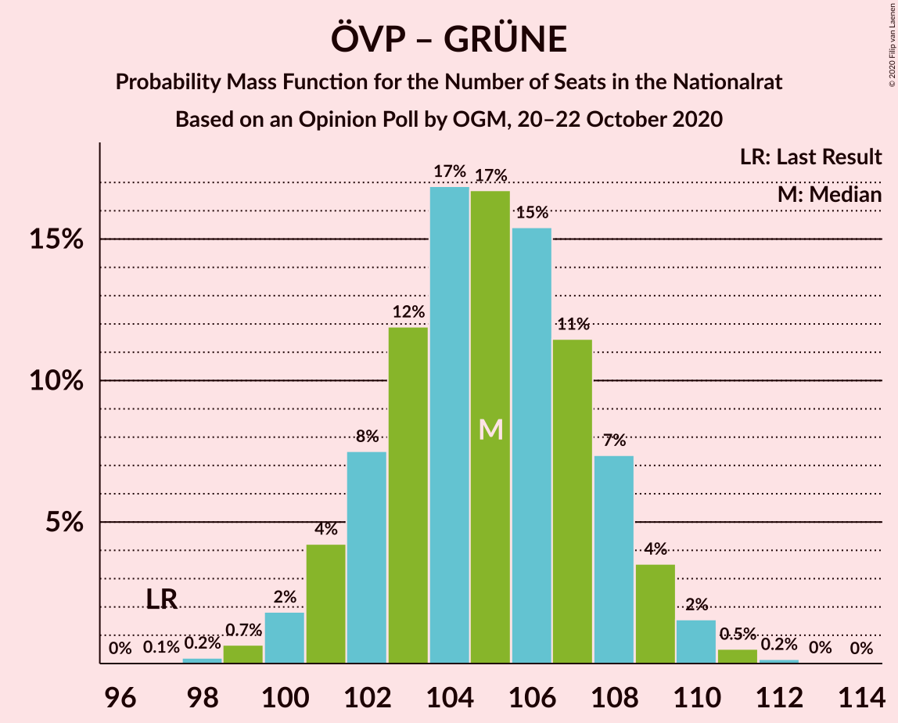

| Number of Seats | Probability | Accumulated | Special Marks |
|:---------------:|:-----------:|:-----------:|:-------------:|
| 97 | 0.1% | 100% | Last Result |
| 98 | 0.2% | 99.9% |  |
| 99 | 0.7% | 99.7% |  |
| 100 | 2% | 99.1% |  |
| 101 | 4% | 97% |  |
| 102 | 8% | 93% |  |
| 103 | 12% | 86% |  |
| 104 | 17% | 74% |  |
| 105 | 17% | 57% | Median |
| 106 | 15% | 40% |  |
| 107 | 11% | 25% |  |
| 108 | 7% | 13% |  |
| 109 | 4% | 6% |  |
| 110 | 2% | 2% |  |
| 111 | 0.5% | 0.7% |  |
| 112 | 0.2% | 0.2% |  |
| 113 | 0% | 0% |  |

### Österreichische Volkspartei – Freiheitliche Partei Österreichs

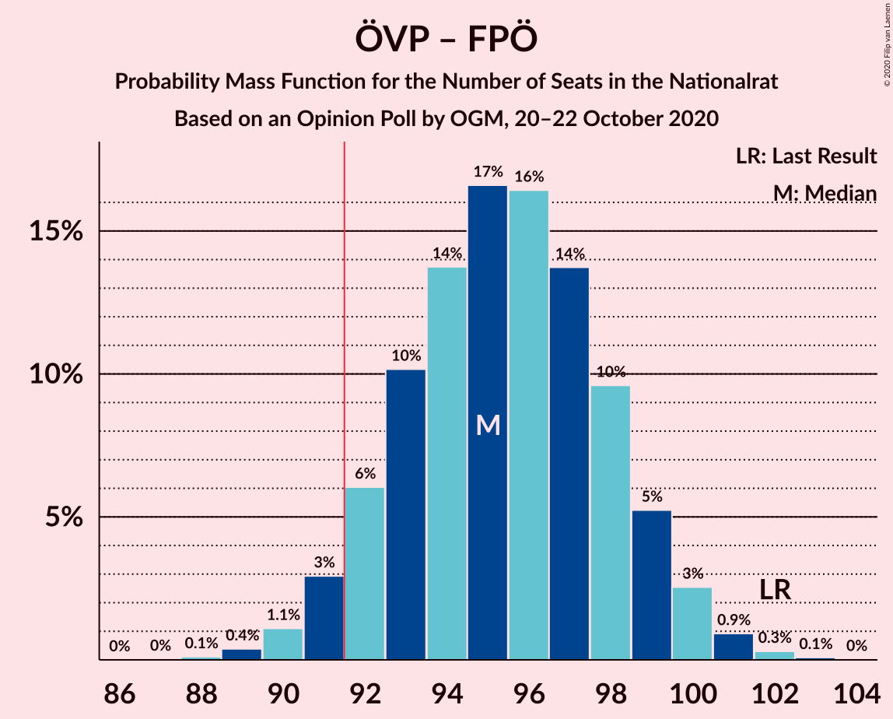

| Number of Seats | Probability | Accumulated | Special Marks |
|:---------------:|:-----------:|:-----------:|:-------------:|
| 88 | 0.1% | 100% |  |
| 89 | 0.4% | 99.9% |  |
| 90 | 1.1% | 99.5% |  |
| 91 | 3% | 98% |  |
| 92 | 6% | 95% | Majority |
| 93 | 10% | 89% |  |
| 94 | 14% | 79% |  |
| 95 | 17% | 65% | Median |
| 96 | 16% | 49% |  |
| 97 | 14% | 32% |  |
| 98 | 10% | 19% |  |
| 99 | 5% | 9% |  |
| 100 | 3% | 4% |  |
| 101 | 0.9% | 1.3% |  |
| 102 | 0.3% | 0.4% | Last Result |
| 103 | 0.1% | 0.1% |  |
| 104 | 0% | 0% |  |

### Österreichische Volkspartei – NEOS–Das Neue Österreich und Liberales Forum

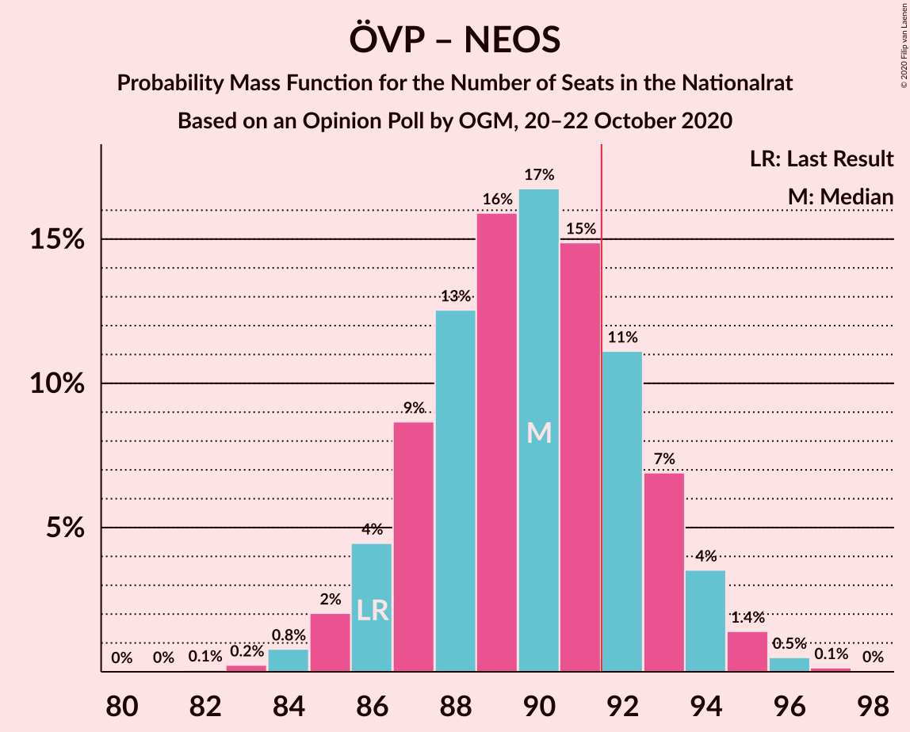

| Number of Seats | Probability | Accumulated | Special Marks |
|:---------------:|:-----------:|:-----------:|:-------------:|
| 82 | 0.1% | 100% |  |
| 83 | 0.2% | 99.9% |  |
| 84 | 0.8% | 99.7% |  |
| 85 | 2% | 98.9% |  |
| 86 | 4% | 97% | Last Result |
| 87 | 9% | 92% |  |
| 88 | 13% | 84% |  |
| 89 | 16% | 71% |  |
| 90 | 17% | 55% | Median |
| 91 | 15% | 39% |  |
| 92 | 11% | 24% | Majority |
| 93 | 7% | 13% |  |
| 94 | 4% | 6% |  |
| 95 | 1.4% | 2% |  |
| 96 | 0.5% | 0.7% |  |
| 97 | 0.1% | 0.2% |  |
| 98 | 0% | 0% |  |

### Sozialdemokratische Partei Österreichs – Die Grünen–Die Grüne Alternative – NEOS–Das Neue Österreich und Liberales Forum

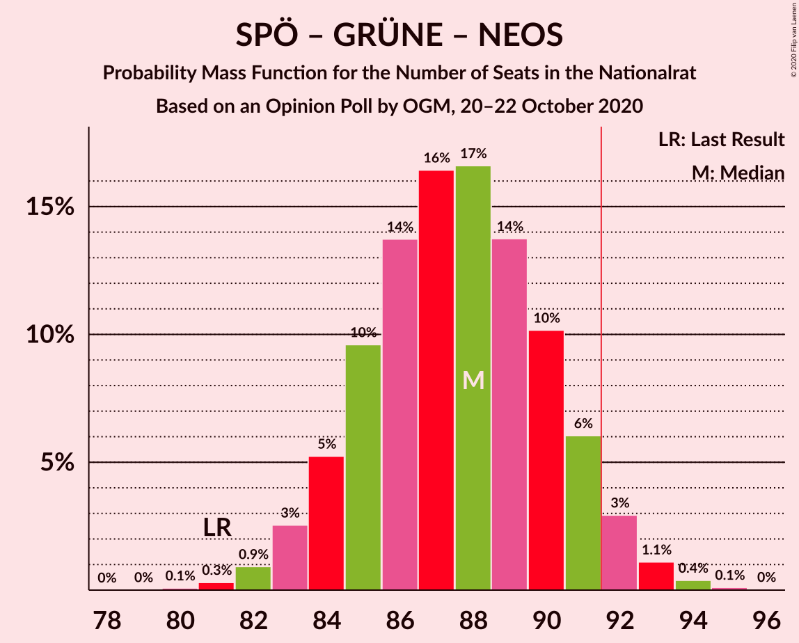

| Number of Seats | Probability | Accumulated | Special Marks |
|:---------------:|:-----------:|:-----------:|:-------------:|
| 80 | 0.1% | 100% |  |
| 81 | 0.3% | 99.9% | Last Result |
| 82 | 0.9% | 99.6% |  |
| 83 | 3% | 98.7% |  |
| 84 | 5% | 96% |  |
| 85 | 10% | 91% |  |
| 86 | 14% | 81% |  |
| 87 | 16% | 68% |  |
| 88 | 17% | 51% | Median |
| 89 | 14% | 35% |  |
| 90 | 10% | 21% |  |
| 91 | 6% | 11% |  |
| 92 | 3% | 5% | Majority |
| 93 | 1.1% | 2% |  |
| 94 | 0.4% | 0.5% |  |
| 95 | 0.1% | 0.1% |  |
| 96 | 0% | 0% |  |

### Österreichische Volkspartei

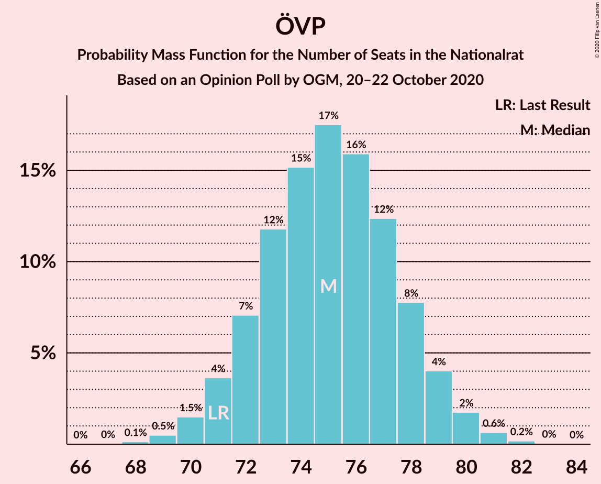

| Number of Seats | Probability | Accumulated | Special Marks |
|:---------------:|:-----------:|:-----------:|:-------------:|
| 68 | 0.1% | 100% |  |
| 69 | 0.5% | 99.8% |  |
| 70 | 1.5% | 99.3% |  |
| 71 | 4% | 98% | Last Result |
| 72 | 7% | 94% |  |
| 73 | 12% | 87% |  |
| 74 | 15% | 75% |  |
| 75 | 17% | 60% | Median |
| 76 | 16% | 43% |  |
| 77 | 12% | 27% |  |
| 78 | 8% | 14% |  |
| 79 | 4% | 7% |  |
| 80 | 2% | 3% |  |
| 81 | 0.6% | 0.9% |  |
| 82 | 0.2% | 0.2% |  |
| 83 | 0% | 0.1% |  |
| 84 | 0% | 0% |  |

### Sozialdemokratische Partei Österreichs – Die Grünen–Die Grüne Alternative

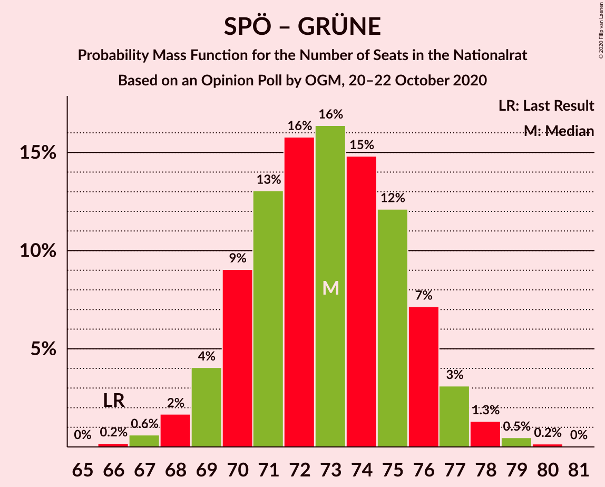

| Number of Seats | Probability | Accumulated | Special Marks |
|:---------------:|:-----------:|:-----------:|:-------------:|
| 65 | 0% | 100% |  |
| 66 | 0.2% | 99.9% | Last Result |
| 67 | 0.6% | 99.8% |  |
| 68 | 2% | 99.2% |  |
| 69 | 4% | 97% |  |
| 70 | 9% | 93% |  |
| 71 | 13% | 84% |  |
| 72 | 16% | 71% |  |
| 73 | 16% | 56% | Median |
| 74 | 15% | 39% |  |
| 75 | 12% | 24% |  |
| 76 | 7% | 12% |  |
| 77 | 3% | 5% |  |
| 78 | 1.3% | 2% |  |
| 79 | 0.5% | 0.7% |  |
| 80 | 0.2% | 0.2% |  |
| 81 | 0% | 0% |  |

### Sozialdemokratische Partei Österreichs – Freiheitliche Partei Österreichs

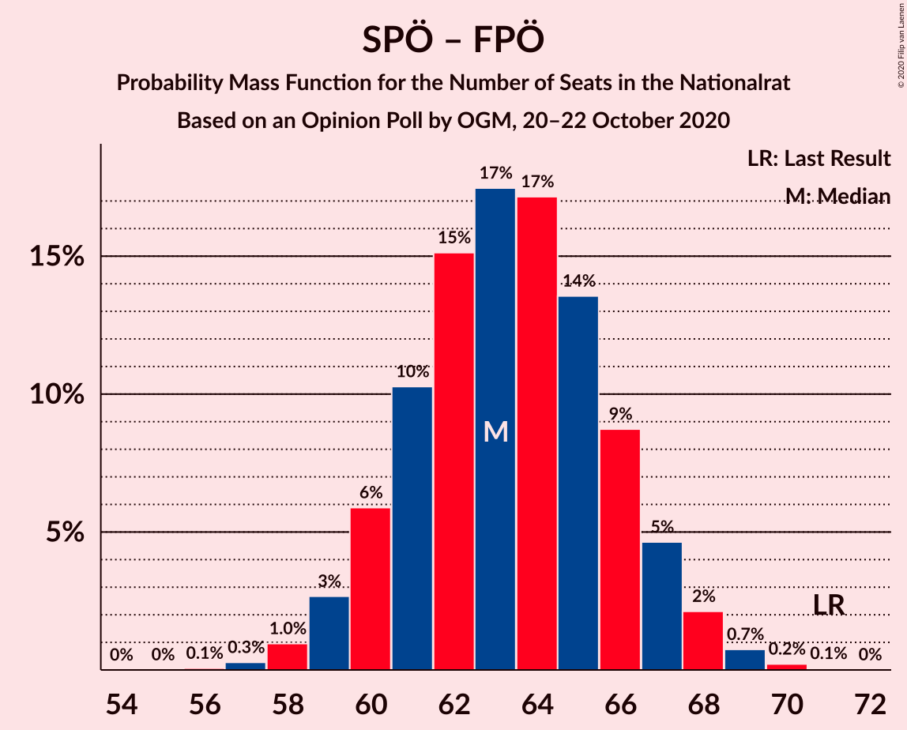

| Number of Seats | Probability | Accumulated | Special Marks |
|:---------------:|:-----------:|:-----------:|:-------------:|
| 56 | 0.1% | 100% |  |
| 57 | 0.3% | 99.9% |  |
| 58 | 1.0% | 99.6% |  |
| 59 | 3% | 98.7% |  |
| 60 | 6% | 96% |  |
| 61 | 10% | 90% |  |
| 62 | 15% | 80% |  |
| 63 | 17% | 65% | Median |
| 64 | 17% | 47% |  |
| 65 | 14% | 30% |  |
| 66 | 9% | 17% |  |
| 67 | 5% | 8% |  |
| 68 | 2% | 3% |  |
| 69 | 0.7% | 1.0% |  |
| 70 | 0.2% | 0.3% |  |
| 71 | 0.1% | 0.1% | Last Result |
| 72 | 0% | 0% |  |

### Sozialdemokratische Partei Österreichs

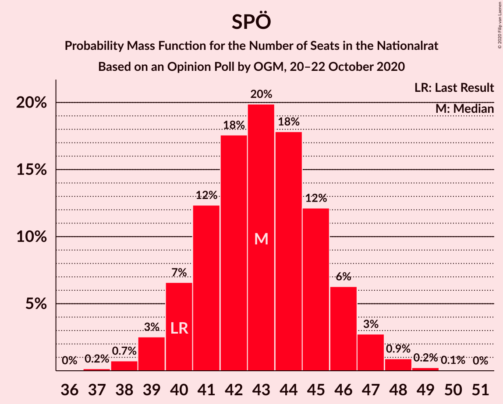

| Number of Seats | Probability | Accumulated | Special Marks |
|:---------------:|:-----------:|:-----------:|:-------------:|
| 37 | 0.2% | 100% |  |
| 38 | 0.7% | 99.8% |  |
| 39 | 3% | 99.1% |  |
| 40 | 7% | 97% | Last Result |
| 41 | 12% | 90% |  |
| 42 | 18% | 78% |  |
| 43 | 20% | 60% | Median |
| 44 | 18% | 40% |  |
| 45 | 12% | 22% |  |
| 46 | 6% | 10% |  |
| 47 | 3% | 4% |  |
| 48 | 0.9% | 1.2% |  |
| 49 | 0.2% | 0.3% |  |
| 50 | 0.1% | 0.1% |  |
| 51 | 0% | 0% |  |

## Technical Information

### Opinion Poll

+ **Polling firm:** OGM
+ **Commissioner(s):** —
+ **Fieldwork period:** 20–22 October 2020

### Calculations

+ **Sample size:** 1647
+ **Simulations done:** 1,048,576
+ **Error estimate:** 0.37%

