# Opinion Poll by Research Affairs, 20–22 October 2020

<a href="#voting-intentions">Voting Intentions</a> | <a href="#seats">Seats</a> | <a href="#coalitions">Coalitions</a> | <a href="#technical-information">Technical Information</a>

## Voting Intentions

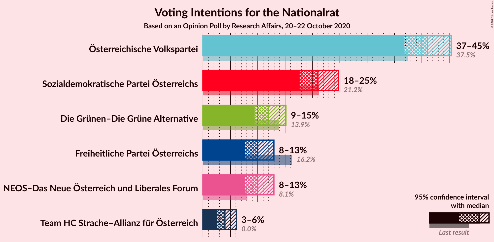

### Confidence Intervals

| Party | Last Result | Poll Result | 80% Confidence Interval | 90% Confidence Interval | 95% Confidence Interval | 99% Confidence Interval |
|:-----:|:-----------:|:-----------:|:-----------------------:|:-----------------------:|:-----------------------:|:-----------------------:|
| Österreichische Volkspartei | 37.5% | 41.0% | 38.2–43.9% |37.4–44.7% |36.8–45.4% |35.5–46.7% |
| Sozialdemokratische Partei Österreichs | 21.2% | 21.0% | 18.8–23.5% |18.2–24.2% |17.6–24.8% |16.6–26.0% |
| Die Grünen–Die Grüne Alternative | 13.9% | 12.0% | 10.3–14.1% |9.8–14.6% |9.4–15.2% |8.7–16.2% |
| Freiheitliche Partei Österreichs | 16.2% | 10.0% | 8.5–11.9% |8.0–12.5% |7.7–13.0% |7.0–13.9% |
| NEOS–Das Neue Österreich und Liberales Forum | 8.1% | 10.0% | 8.5–11.9% |8.0–12.5% |7.7–13.0% |7.0–13.9% |
| Team HC Strache–Allianz für Österreich | 0.0% | 4.0% | 3.1–5.4% |2.8–5.8% |2.6–6.1% |2.2–6.8% |

*Note:* The poll result column reflects the actual value used in the calculations. Published results may vary slightly, and in addition be rounded to fewer digits.

## Seats

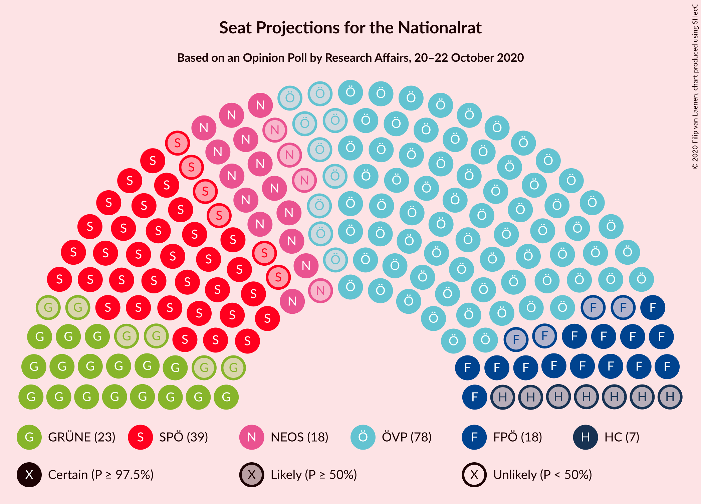

### Confidence Intervals

| Party | Last Result | Median | 80% Confidence Interval | 90% Confidence Interval | 95% Confidence Interval | 99% Confidence Interval |
|:-----:|:-----------:|:------:|:-----------------------:|:-----------------------:|:-----------------------:|:-----------------------:|
| <a href="#österreichische-volkspartei">Österreichische Volkspartei</a> | 71 | 78 | 72–84 |71–85 |69–87 |67–90 |
| <a href="#sozialdemokratische-partei-österreichs">Sozialdemokratische Partei Österreichs</a> | 40 | 40 | 35–45 |34–46 |33–47 |31–50 |
| <a href="#die-grünen–die-grüne-alternative">Die Grünen–Die Grüne Alternative</a> | 26 | 23 | 19–26 |18–28 |17–29 |16–30 |
| <a href="#freiheitliche-partei-österreichs">Freiheitliche Partei Österreichs</a> | 31 | 19 | 16–22 |15–23 |14–24 |13–26 |
| <a href="#neos–das-neue-österreich-und-liberales-forum">NEOS–Das Neue Österreich und Liberales Forum</a> | 15 | 19 | 16–22 |15–23 |14–24 |13–26 |
| <a href="#team-hc-strache–allianz-für-österreich">Team HC Strache–Allianz für Österreich</a> | 0 | 7 | 0–10 |0–10 |0–11 |0–12 |

### Österreichische Volkspartei

*For a full overview of the results for this party, see the [Österreichische Volkspartei](party-österreichischevolkspartei.html) page.*

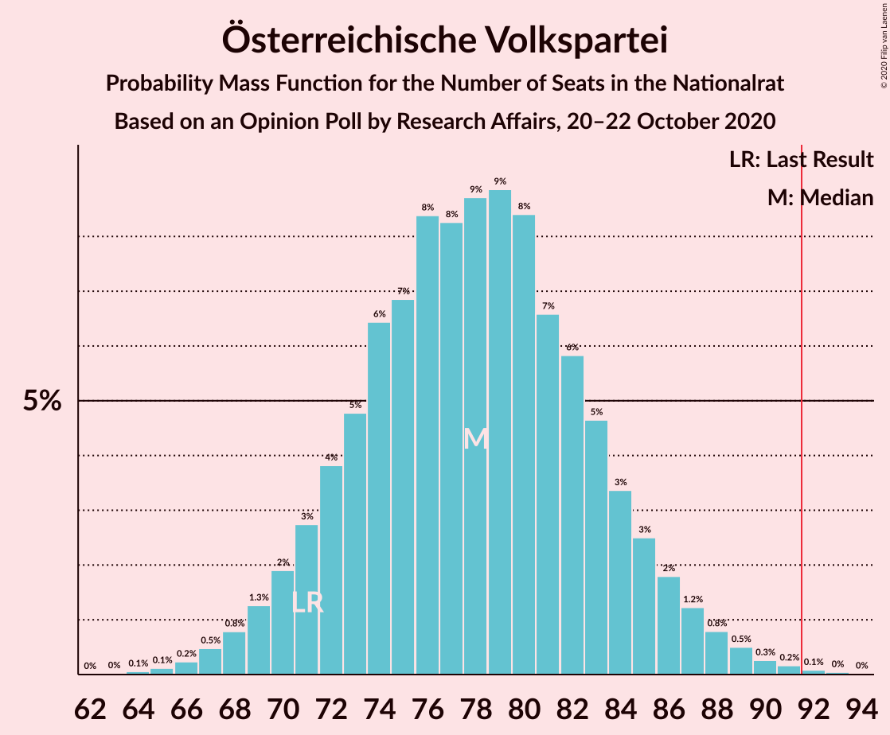

| Number of Seats | Probability | Accumulated | Special Marks |
|:---------------:|:-----------:|:-----------:|:-------------:|
| 64 | 0.1% | 100% |  |
| 65 | 0.1% | 99.9% |  |
| 66 | 0.2% | 99.8% |  |
| 67 | 0.5% | 99.5% |  |
| 68 | 0.8% | 99.1% |  |
| 69 | 1.3% | 98% |  |
| 70 | 2% | 97% |  |
| 71 | 3% | 95% | Last Result |
| 72 | 4% | 92% |  |
| 73 | 5% | 89% |  |
| 74 | 6% | 84% |  |
| 75 | 7% | 77% |  |
| 76 | 8% | 70% |  |
| 77 | 8% | 62% |  |
| 78 | 9% | 54% | Median |
| 79 | 9% | 45% |  |
| 80 | 8% | 36% |  |
| 81 | 7% | 28% |  |
| 82 | 6% | 21% |  |
| 83 | 5% | 15% |  |
| 84 | 3% | 11% |  |
| 85 | 3% | 7% |  |
| 86 | 2% | 5% |  |
| 87 | 1.2% | 3% |  |
| 88 | 0.8% | 2% |  |
| 89 | 0.5% | 1.1% |  |
| 90 | 0.3% | 0.6% |  |
| 91 | 0.2% | 0.3% |  |
| 92 | 0.1% | 0.2% | Majority |
| 93 | 0% | 0.1% |  |
| 94 | 0% | 0% |  |

### Sozialdemokratische Partei Österreichs

*For a full overview of the results for this party, see the [Sozialdemokratische Partei Österreichs](party-sozialdemokratischeparteiösterreichs.html) page.*

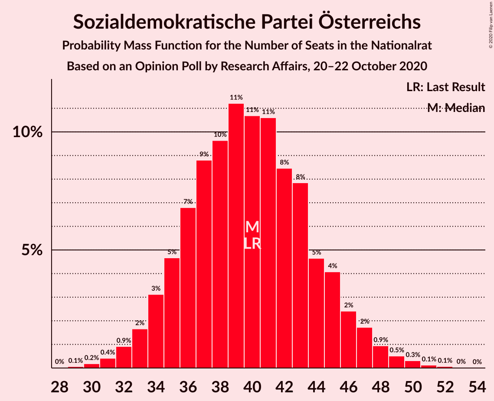

| Number of Seats | Probability | Accumulated | Special Marks |
|:---------------:|:-----------:|:-----------:|:-------------:|
| 29 | 0.1% | 100% |  |
| 30 | 0.2% | 99.9% |  |
| 31 | 0.4% | 99.7% |  |
| 32 | 0.9% | 99.3% |  |
| 33 | 2% | 98% |  |
| 34 | 3% | 97% |  |
| 35 | 5% | 94% |  |
| 36 | 7% | 89% |  |
| 37 | 9% | 82% |  |
| 38 | 10% | 73% |  |
| 39 | 11% | 64% |  |
| 40 | 11% | 52% | Last Result, Median |
| 41 | 11% | 42% |  |
| 42 | 8% | 31% |  |
| 43 | 8% | 23% |  |
| 44 | 5% | 15% |  |
| 45 | 4% | 10% |  |
| 46 | 2% | 6% |  |
| 47 | 2% | 4% |  |
| 48 | 0.9% | 2% |  |
| 49 | 0.5% | 1.1% |  |
| 50 | 0.3% | 0.6% |  |
| 51 | 0.1% | 0.2% |  |
| 52 | 0.1% | 0.1% |  |
| 53 | 0% | 0% |  |

### Die Grünen–Die Grüne Alternative

*For a full overview of the results for this party, see the [Die Grünen–Die Grüne Alternative](party-diegrünen–diegrünealternative.html) page.*

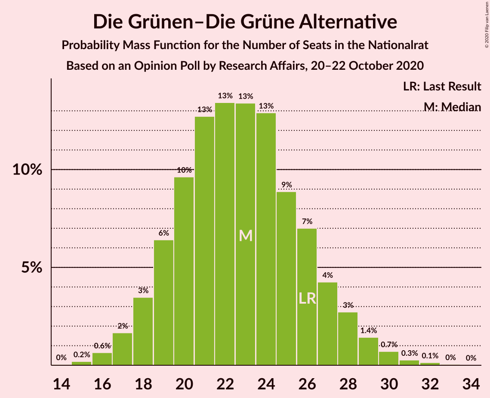

| Number of Seats | Probability | Accumulated | Special Marks |
|:---------------:|:-----------:|:-----------:|:-------------:|
| 14 | 0% | 100% |  |
| 15 | 0.2% | 99.9% |  |
| 16 | 0.6% | 99.7% |  |
| 17 | 2% | 99.1% |  |
| 18 | 3% | 97% |  |
| 19 | 6% | 94% |  |
| 20 | 10% | 88% |  |
| 21 | 13% | 78% |  |
| 22 | 13% | 65% |  |
| 23 | 13% | 52% | Median |
| 24 | 13% | 38% |  |
| 25 | 9% | 25% |  |
| 26 | 7% | 17% | Last Result |
| 27 | 4% | 10% |  |
| 28 | 3% | 5% |  |
| 29 | 1.4% | 3% |  |
| 30 | 0.7% | 1.2% |  |
| 31 | 0.3% | 0.5% |  |
| 32 | 0.1% | 0.2% |  |
| 33 | 0% | 0.1% |  |
| 34 | 0% | 0% |  |

### Freiheitliche Partei Österreichs

*For a full overview of the results for this party, see the [Freiheitliche Partei Österreichs](party-freiheitlicheparteiösterreichs.html) page.*

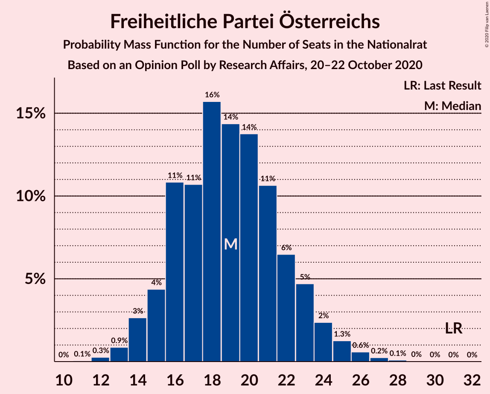

| Number of Seats | Probability | Accumulated | Special Marks |
|:---------------:|:-----------:|:-----------:|:-------------:|
| 11 | 0.1% | 100% |  |
| 12 | 0.3% | 99.9% |  |
| 13 | 0.9% | 99.7% |  |
| 14 | 3% | 98.8% |  |
| 15 | 4% | 96% |  |
| 16 | 11% | 92% |  |
| 17 | 11% | 81% |  |
| 18 | 16% | 70% |  |
| 19 | 14% | 55% | Median |
| 20 | 14% | 40% |  |
| 21 | 11% | 26% |  |
| 22 | 6% | 16% |  |
| 23 | 5% | 9% |  |
| 24 | 2% | 5% |  |
| 25 | 1.3% | 2% |  |
| 26 | 0.6% | 1.0% |  |
| 27 | 0.2% | 0.4% |  |
| 28 | 0.1% | 0.1% |  |
| 29 | 0% | 0.1% |  |
| 30 | 0% | 0% |  |
| 31 | 0% | 0% | Last Result |

### NEOS–Das Neue Österreich und Liberales Forum

*For a full overview of the results for this party, see the [NEOS–Das Neue Österreich und Liberales Forum](party-neos–dasneueösterreichundliberalesforum.html) page.*

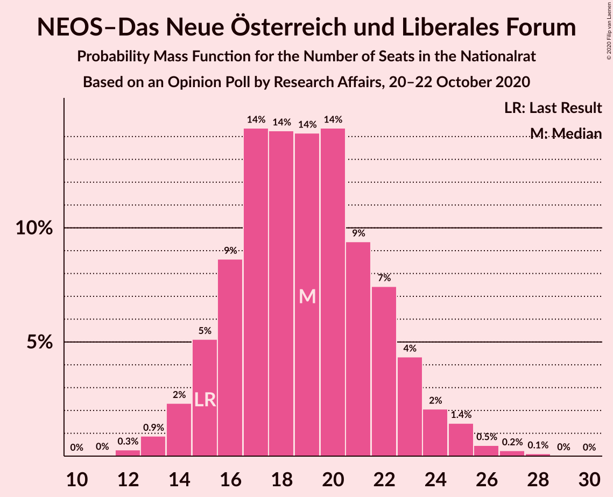

| Number of Seats | Probability | Accumulated | Special Marks |
|:---------------:|:-----------:|:-----------:|:-------------:|
| 11 | 0% | 100% |  |
| 12 | 0.3% | 99.9% |  |
| 13 | 0.9% | 99.7% |  |
| 14 | 2% | 98.8% |  |
| 15 | 5% | 96% | Last Result |
| 16 | 9% | 91% |  |
| 17 | 14% | 83% |  |
| 18 | 14% | 68% |  |
| 19 | 14% | 54% | Median |
| 20 | 14% | 40% |  |
| 21 | 9% | 26% |  |
| 22 | 7% | 16% |  |
| 23 | 4% | 9% |  |
| 24 | 2% | 4% |  |
| 25 | 1.4% | 2% |  |
| 26 | 0.5% | 0.9% |  |
| 27 | 0.2% | 0.4% |  |
| 28 | 0.1% | 0.2% |  |
| 29 | 0% | 0% |  |

### Team HC Strache–Allianz für Österreich

*For a full overview of the results for this party, see the [Team HC Strache–Allianz für Österreich](party-teamhcstrache–allianzfürösterreich.html) page.*

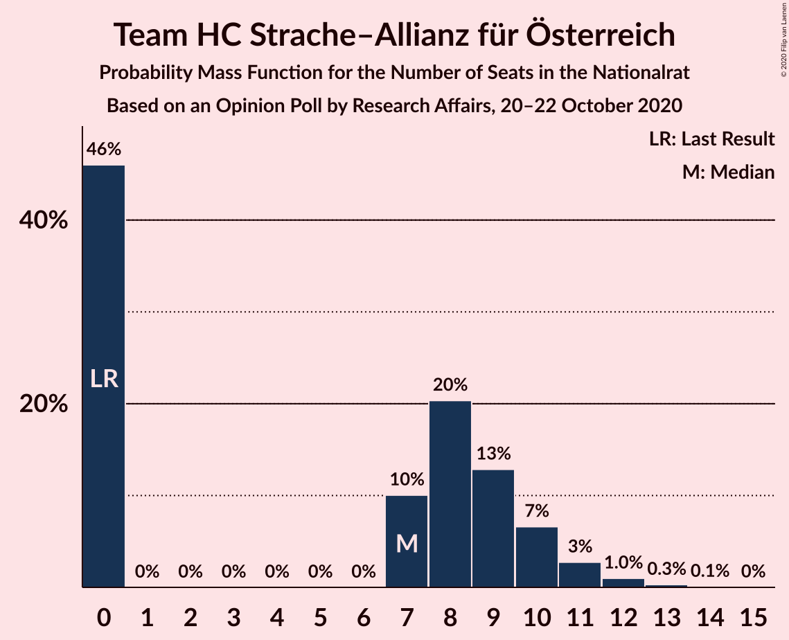

| Number of Seats | Probability | Accumulated | Special Marks |
|:---------------:|:-----------:|:-----------:|:-------------:|
| 0 | 46% | 100% | Last Result |
| 1 | 0% | 54% |  |
| 2 | 0% | 54% |  |
| 3 | 0% | 54% |  |
| 4 | 0% | 54% |  |
| 5 | 0% | 54% |  |
| 6 | 0% | 54% |  |
| 7 | 10% | 54% | Median |
| 8 | 20% | 44% |  |
| 9 | 13% | 24% |  |
| 10 | 7% | 11% |  |
| 11 | 3% | 4% |  |
| 12 | 1.0% | 1.4% |  |
| 13 | 0.3% | 0.4% |  |
| 14 | 0.1% | 0.1% |  |
| 15 | 0% | 0% |  |

## Coalitions

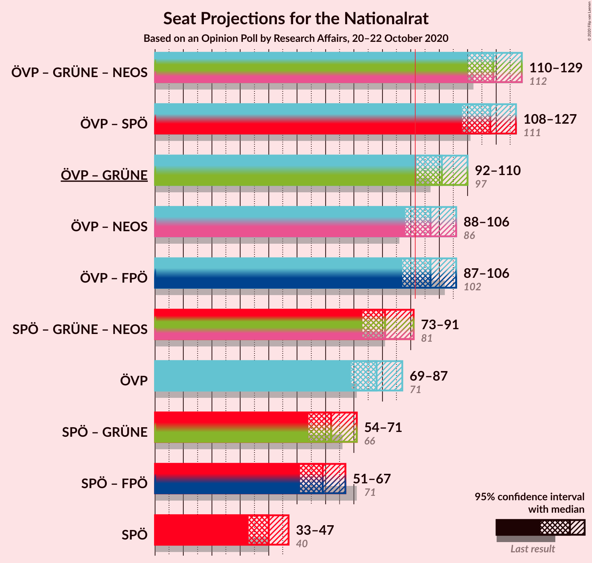

### Confidence Intervals

| Coalition | Last Result | Median | Majority? | 80% Confidence Interval | 90% Confidence Interval | 95% Confidence Interval | 99% Confidence Interval |
|:---------:|:-----------:|:------:|:---------:|:-----------------------:|:-----------------------:|:-----------------------:|:-----------------------:|
| Österreichische Volkspartei – Die Grünen–Die Grüne Alternative – NEOS–Das Neue Österreich und Liberales Forum | 112 | 119 | 100% | 113–126 | 112–127 | 110–129 | 107–132 |
| Österreichische Volkspartei – Sozialdemokratische Partei Österreichs | 111 | 118 | 100% | 112–124 | 110–126 | 108–127 | 106–130 |
| Österreichische Volkspartei – Die Grünen–Die Grüne Alternative | 97 | 101 | 98% | 94–107 | 93–109 | 92–110 | 89–113 |
| Österreichische Volkspartei – NEOS–Das Neue Österreich und Liberales Forum | 86 | 97 | 87% | 91–103 | 89–105 | 88–106 | 85–109 |
| Österreichische Volkspartei – Freiheitliche Partei Österreichs | 102 | 97 | 87% | 91–103 | 89–105 | 87–106 | 85–109 |
| Sozialdemokratische Partei Österreichs – Die Grünen–Die Grüne Alternative – NEOS–Das Neue Österreich und Liberales Forum | 81 | 81 | 2% | 76–88 | 74–89 | 73–91 | 70–93 |
| Österreichische Volkspartei | 71 | 78 | 0.2% | 72–84 | 71–85 | 69–87 | 67–90 |
| Sozialdemokratische Partei Österreichs – Die Grünen–Die Grüne Alternative | 66 | 62 | 0% | 57–68 | 56–70 | 54–71 | 52–74 |
| Sozialdemokratische Partei Österreichs – Freiheitliche Partei Österreichs | 71 | 59 | 0% | 53–64 | 52–66 | 51–67 | 49–70 |
| Sozialdemokratische Partei Österreichs | 40 | 40 | 0% | 35–45 | 34–46 | 33–47 | 31–50 |

### Österreichische Volkspartei – Die Grünen–Die Grüne Alternative – NEOS–Das Neue Österreich und Liberales Forum

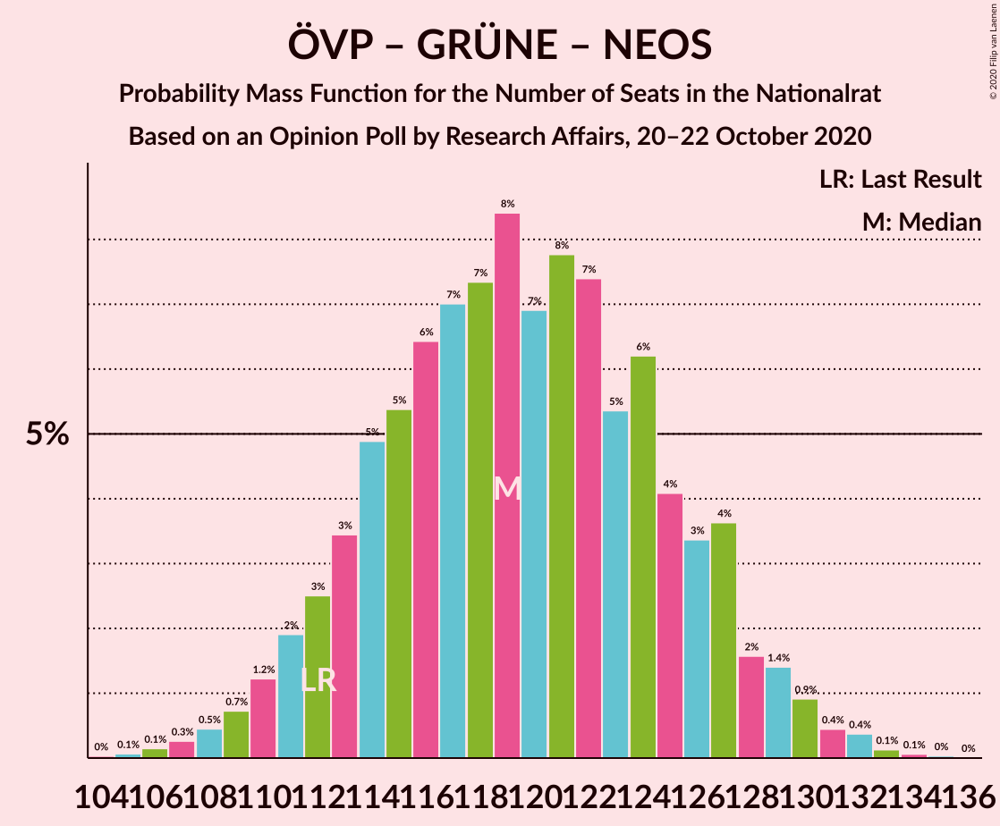

| Number of Seats | Probability | Accumulated | Special Marks |
|:---------------:|:-----------:|:-----------:|:-------------:|
| 104 | 0% | 100% |  |
| 105 | 0.1% | 99.9% |  |
| 106 | 0.1% | 99.9% |  |
| 107 | 0.3% | 99.7% |  |
| 108 | 0.5% | 99.5% |  |
| 109 | 0.7% | 99.0% |  |
| 110 | 1.2% | 98% |  |
| 111 | 2% | 97% |  |
| 112 | 3% | 95% | Last Result |
| 113 | 3% | 93% |  |
| 114 | 5% | 89% |  |
| 115 | 5% | 84% |  |
| 116 | 6% | 79% |  |
| 117 | 7% | 72% |  |
| 118 | 7% | 65% |  |
| 119 | 8% | 58% |  |
| 120 | 7% | 50% | Median |
| 121 | 8% | 43% |  |
| 122 | 7% | 35% |  |
| 123 | 5% | 28% |  |
| 124 | 6% | 22% |  |
| 125 | 4% | 16% |  |
| 126 | 3% | 12% |  |
| 127 | 4% | 9% |  |
| 128 | 2% | 5% |  |
| 129 | 1.4% | 3% |  |
| 130 | 0.9% | 2% |  |
| 131 | 0.4% | 1.1% |  |
| 132 | 0.4% | 0.6% |  |
| 133 | 0.1% | 0.2% |  |
| 134 | 0.1% | 0.1% |  |
| 135 | 0% | 0.1% |  |
| 136 | 0% | 0% |  |

### Österreichische Volkspartei – Sozialdemokratische Partei Österreichs

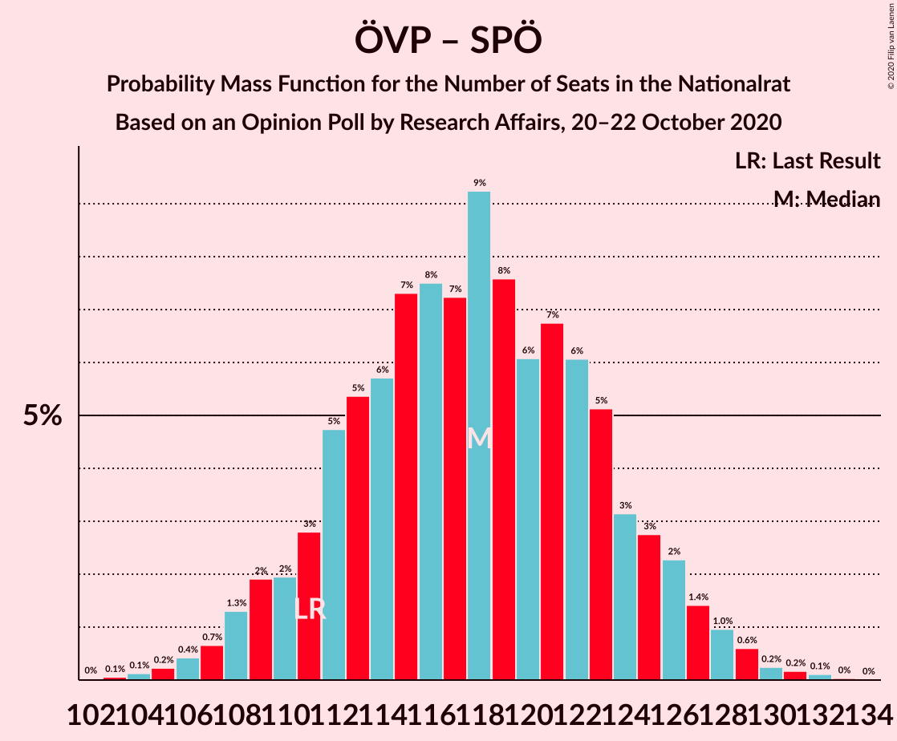

| Number of Seats | Probability | Accumulated | Special Marks |
|:---------------:|:-----------:|:-----------:|:-------------:|
| 102 | 0% | 100% |  |
| 103 | 0.1% | 99.9% |  |
| 104 | 0.1% | 99.9% |  |
| 105 | 0.2% | 99.8% |  |
| 106 | 0.4% | 99.5% |  |
| 107 | 0.7% | 99.1% |  |
| 108 | 1.3% | 98% |  |
| 109 | 2% | 97% |  |
| 110 | 2% | 95% |  |
| 111 | 3% | 93% | Last Result |
| 112 | 5% | 90% |  |
| 113 | 5% | 86% |  |
| 114 | 6% | 80% |  |
| 115 | 7% | 75% |  |
| 116 | 8% | 67% |  |
| 117 | 7% | 60% |  |
| 118 | 9% | 53% | Median |
| 119 | 8% | 43% |  |
| 120 | 6% | 36% |  |
| 121 | 7% | 30% |  |
| 122 | 6% | 23% |  |
| 123 | 5% | 17% |  |
| 124 | 3% | 12% |  |
| 125 | 3% | 9% |  |
| 126 | 2% | 6% |  |
| 127 | 1.4% | 4% |  |
| 128 | 1.0% | 2% |  |
| 129 | 0.6% | 1.2% |  |
| 130 | 0.2% | 0.6% |  |
| 131 | 0.2% | 0.3% |  |
| 132 | 0.1% | 0.2% |  |
| 133 | 0% | 0.1% |  |
| 134 | 0% | 0% |  |

### Österreichische Volkspartei – Die Grünen–Die Grüne Alternative

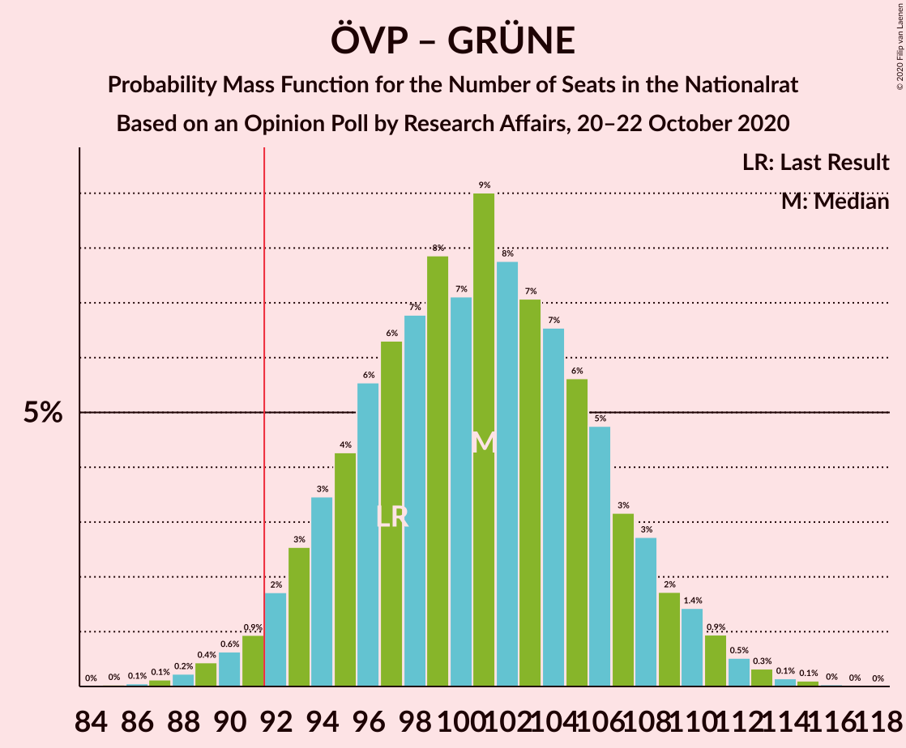

| Number of Seats | Probability | Accumulated | Special Marks |
|:---------------:|:-----------:|:-----------:|:-------------:|
| 85 | 0% | 100% |  |
| 86 | 0.1% | 99.9% |  |
| 87 | 0.1% | 99.9% |  |
| 88 | 0.2% | 99.8% |  |
| 89 | 0.4% | 99.5% |  |
| 90 | 0.6% | 99.1% |  |
| 91 | 0.9% | 98% |  |
| 92 | 2% | 98% | Majority |
| 93 | 3% | 96% |  |
| 94 | 3% | 93% |  |
| 95 | 4% | 90% |  |
| 96 | 6% | 86% |  |
| 97 | 6% | 80% | Last Result |
| 98 | 7% | 74% |  |
| 99 | 8% | 67% |  |
| 100 | 7% | 59% |  |
| 101 | 9% | 52% | Median |
| 102 | 8% | 43% |  |
| 103 | 7% | 35% |  |
| 104 | 7% | 28% |  |
| 105 | 6% | 22% |  |
| 106 | 5% | 16% |  |
| 107 | 3% | 11% |  |
| 108 | 3% | 8% |  |
| 109 | 2% | 5% |  |
| 110 | 1.4% | 4% |  |
| 111 | 0.9% | 2% |  |
| 112 | 0.5% | 1.2% |  |
| 113 | 0.3% | 0.6% |  |
| 114 | 0.1% | 0.3% |  |
| 115 | 0.1% | 0.2% |  |
| 116 | 0% | 0.1% |  |
| 117 | 0% | 0% |  |

### Österreichische Volkspartei – NEOS–Das Neue Österreich und Liberales Forum

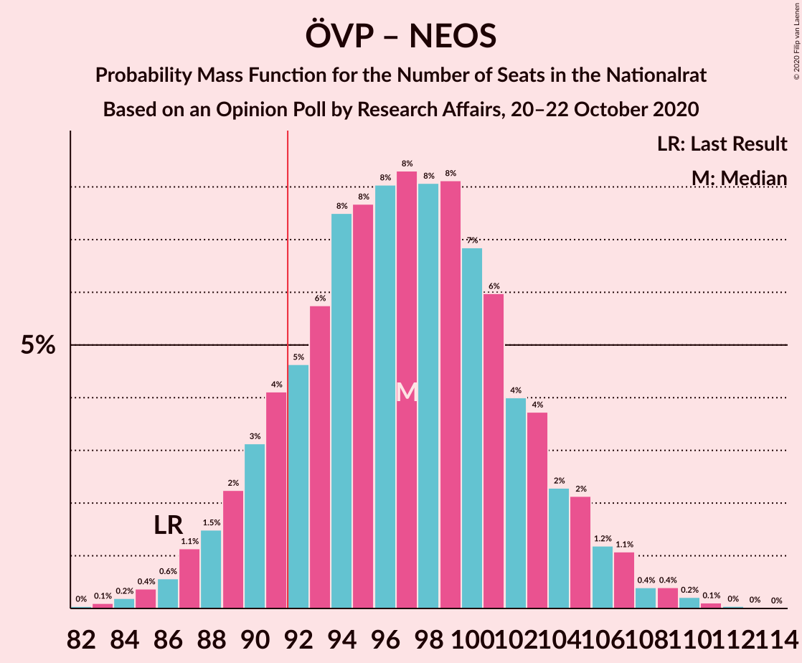

| Number of Seats | Probability | Accumulated | Special Marks |
|:---------------:|:-----------:|:-----------:|:-------------:|
| 82 | 0% | 100% |  |
| 83 | 0.1% | 99.9% |  |
| 84 | 0.2% | 99.8% |  |
| 85 | 0.4% | 99.6% |  |
| 86 | 0.6% | 99.2% | Last Result |
| 87 | 1.1% | 98.7% |  |
| 88 | 1.5% | 98% |  |
| 89 | 2% | 96% |  |
| 90 | 3% | 94% |  |
| 91 | 4% | 91% |  |
| 92 | 5% | 87% | Majority |
| 93 | 6% | 82% |  |
| 94 | 8% | 76% |  |
| 95 | 8% | 69% |  |
| 96 | 8% | 61% |  |
| 97 | 8% | 53% | Median |
| 98 | 8% | 45% |  |
| 99 | 8% | 37% |  |
| 100 | 7% | 28% |  |
| 101 | 6% | 22% |  |
| 102 | 4% | 16% |  |
| 103 | 4% | 12% |  |
| 104 | 2% | 8% |  |
| 105 | 2% | 6% |  |
| 106 | 1.2% | 3% |  |
| 107 | 1.1% | 2% |  |
| 108 | 0.4% | 1.2% |  |
| 109 | 0.4% | 0.8% |  |
| 110 | 0.2% | 0.4% |  |
| 111 | 0.1% | 0.2% |  |
| 112 | 0% | 0.1% |  |
| 113 | 0% | 0% |  |

### Österreichische Volkspartei – Freiheitliche Partei Österreichs

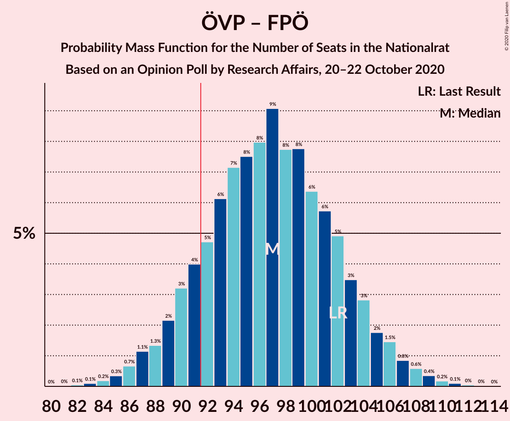

| Number of Seats | Probability | Accumulated | Special Marks |
|:---------------:|:-----------:|:-----------:|:-------------:|
| 82 | 0.1% | 100% |  |
| 83 | 0.1% | 99.9% |  |
| 84 | 0.2% | 99.8% |  |
| 85 | 0.3% | 99.6% |  |
| 86 | 0.7% | 99.3% |  |
| 87 | 1.1% | 98.6% |  |
| 88 | 1.3% | 97% |  |
| 89 | 2% | 96% |  |
| 90 | 3% | 94% |  |
| 91 | 4% | 91% |  |
| 92 | 5% | 87% | Majority |
| 93 | 6% | 82% |  |
| 94 | 7% | 76% |  |
| 95 | 8% | 69% |  |
| 96 | 8% | 61% |  |
| 97 | 9% | 53% | Median |
| 98 | 8% | 44% |  |
| 99 | 8% | 36% |  |
| 100 | 6% | 29% |  |
| 101 | 6% | 22% |  |
| 102 | 5% | 17% | Last Result |
| 103 | 3% | 12% |  |
| 104 | 3% | 8% |  |
| 105 | 2% | 5% |  |
| 106 | 1.5% | 4% |  |
| 107 | 0.8% | 2% |  |
| 108 | 0.6% | 1.3% |  |
| 109 | 0.4% | 0.7% |  |
| 110 | 0.2% | 0.4% |  |
| 111 | 0.1% | 0.2% |  |
| 112 | 0% | 0.1% |  |
| 113 | 0% | 0% |  |

### Sozialdemokratische Partei Österreichs – Die Grünen–Die Grüne Alternative – NEOS–Das Neue Österreich und Liberales Forum

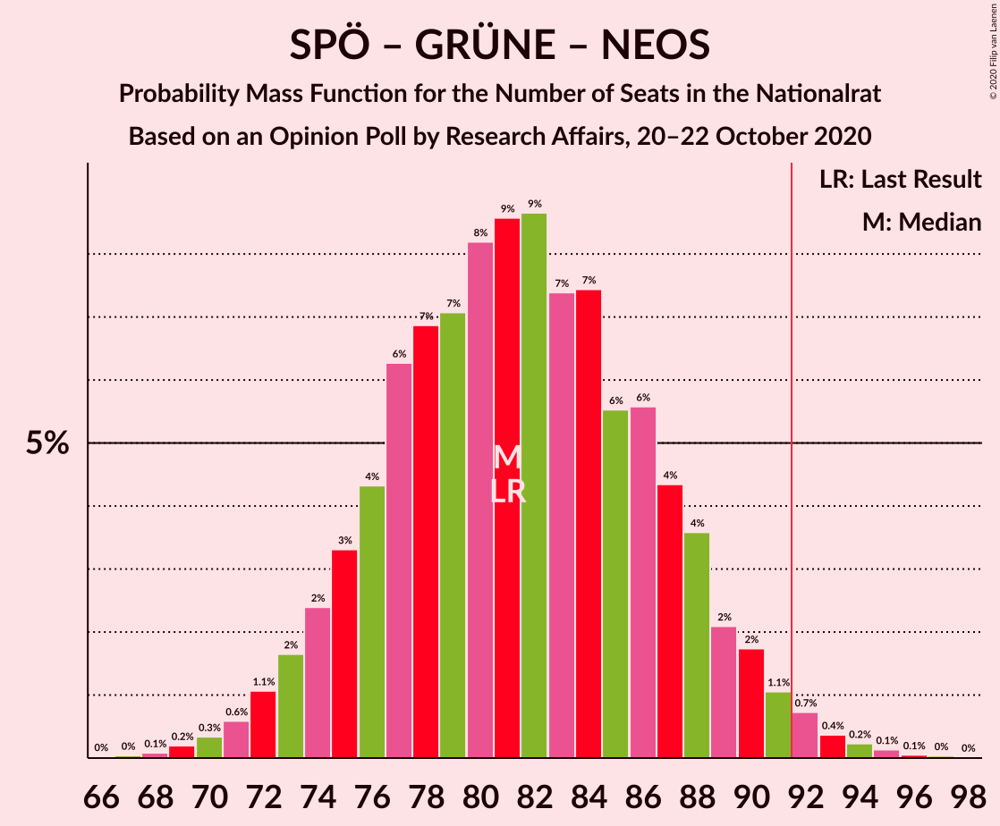

| Number of Seats | Probability | Accumulated | Special Marks |
|:---------------:|:-----------:|:-----------:|:-------------:|
| 67 | 0% | 100% |  |
| 68 | 0.1% | 99.9% |  |
| 69 | 0.2% | 99.8% |  |
| 70 | 0.3% | 99.6% |  |
| 71 | 0.6% | 99.3% |  |
| 72 | 1.1% | 98.7% |  |
| 73 | 2% | 98% |  |
| 74 | 2% | 96% |  |
| 75 | 3% | 94% |  |
| 76 | 4% | 90% |  |
| 77 | 6% | 86% |  |
| 78 | 7% | 80% |  |
| 79 | 7% | 73% |  |
| 80 | 8% | 66% |  |
| 81 | 9% | 58% | Last Result |
| 82 | 9% | 49% | Median |
| 83 | 7% | 40% |  |
| 84 | 7% | 33% |  |
| 85 | 6% | 26% |  |
| 86 | 6% | 20% |  |
| 87 | 4% | 14% |  |
| 88 | 4% | 10% |  |
| 89 | 2% | 6% |  |
| 90 | 2% | 4% |  |
| 91 | 1.1% | 3% |  |
| 92 | 0.7% | 2% | Majority |
| 93 | 0.4% | 0.8% |  |
| 94 | 0.2% | 0.5% |  |
| 95 | 0.1% | 0.2% |  |
| 96 | 0.1% | 0.1% |  |
| 97 | 0% | 0.1% |  |
| 98 | 0% | 0% |  |

### Österreichische Volkspartei

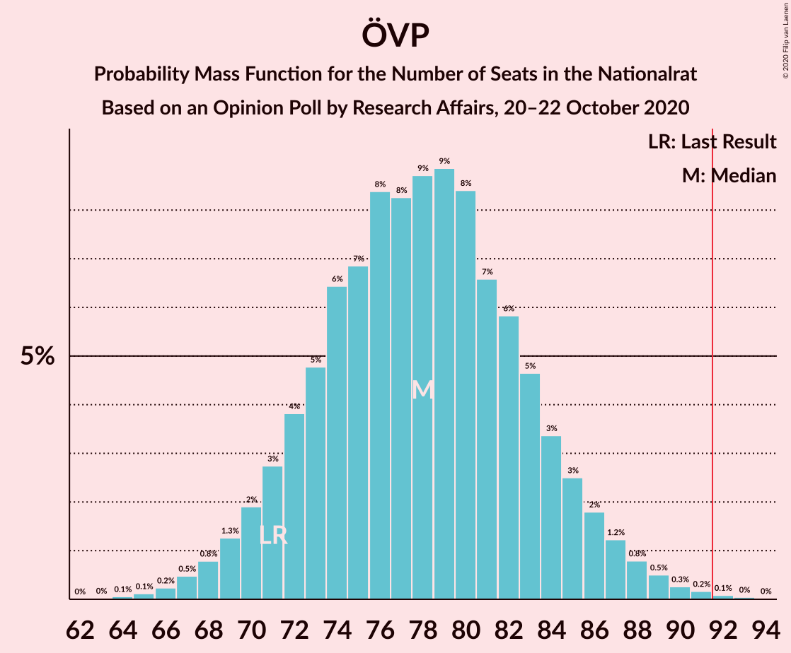

| Number of Seats | Probability | Accumulated | Special Marks |
|:---------------:|:-----------:|:-----------:|:-------------:|
| 64 | 0.1% | 100% |  |
| 65 | 0.1% | 99.9% |  |
| 66 | 0.2% | 99.8% |  |
| 67 | 0.5% | 99.5% |  |
| 68 | 0.8% | 99.1% |  |
| 69 | 1.3% | 98% |  |
| 70 | 2% | 97% |  |
| 71 | 3% | 95% | Last Result |
| 72 | 4% | 92% |  |
| 73 | 5% | 89% |  |
| 74 | 6% | 84% |  |
| 75 | 7% | 77% |  |
| 76 | 8% | 70% |  |
| 77 | 8% | 62% |  |
| 78 | 9% | 54% | Median |
| 79 | 9% | 45% |  |
| 80 | 8% | 36% |  |
| 81 | 7% | 28% |  |
| 82 | 6% | 21% |  |
| 83 | 5% | 15% |  |
| 84 | 3% | 11% |  |
| 85 | 3% | 7% |  |
| 86 | 2% | 5% |  |
| 87 | 1.2% | 3% |  |
| 88 | 0.8% | 2% |  |
| 89 | 0.5% | 1.1% |  |
| 90 | 0.3% | 0.6% |  |
| 91 | 0.2% | 0.3% |  |
| 92 | 0.1% | 0.2% | Majority |
| 93 | 0% | 0.1% |  |
| 94 | 0% | 0% |  |

### Sozialdemokratische Partei Österreichs – Die Grünen–Die Grüne Alternative

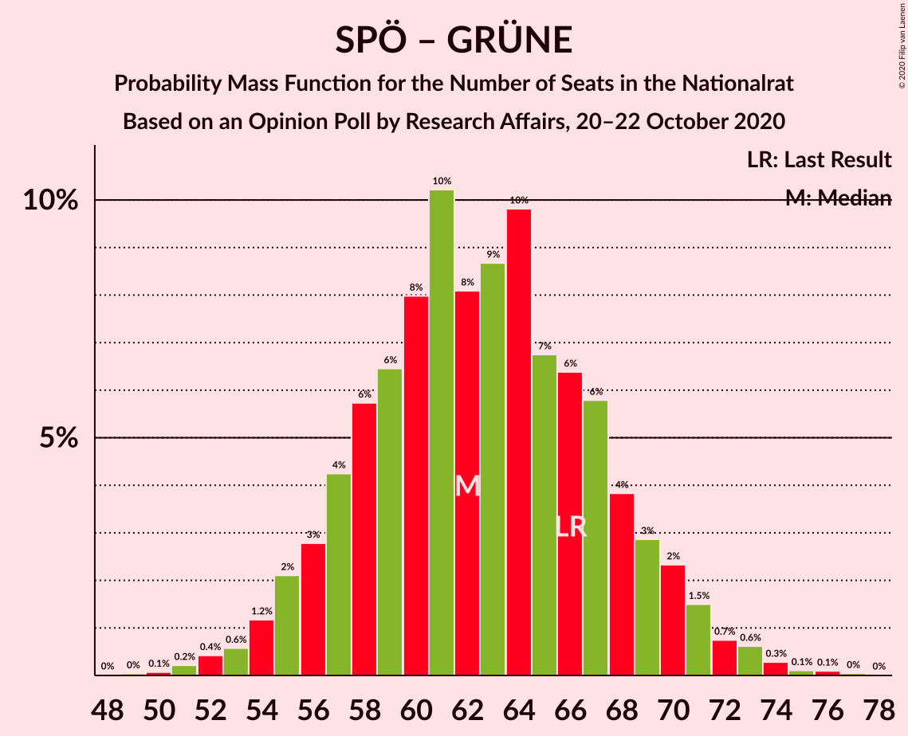

| Number of Seats | Probability | Accumulated | Special Marks |
|:---------------:|:-----------:|:-----------:|:-------------:|
| 49 | 0% | 100% |  |
| 50 | 0.1% | 99.9% |  |
| 51 | 0.2% | 99.9% |  |
| 52 | 0.4% | 99.7% |  |
| 53 | 0.6% | 99.2% |  |
| 54 | 1.2% | 98.7% |  |
| 55 | 2% | 97% |  |
| 56 | 3% | 95% |  |
| 57 | 4% | 93% |  |
| 58 | 6% | 88% |  |
| 59 | 6% | 83% |  |
| 60 | 8% | 76% |  |
| 61 | 10% | 68% |  |
| 62 | 8% | 58% |  |
| 63 | 9% | 50% | Median |
| 64 | 10% | 41% |  |
| 65 | 7% | 31% |  |
| 66 | 6% | 25% | Last Result |
| 67 | 6% | 18% |  |
| 68 | 4% | 12% |  |
| 69 | 3% | 9% |  |
| 70 | 2% | 6% |  |
| 71 | 1.5% | 3% |  |
| 72 | 0.7% | 2% |  |
| 73 | 0.6% | 1.2% |  |
| 74 | 0.3% | 0.6% |  |
| 75 | 0.1% | 0.3% |  |
| 76 | 0.1% | 0.2% |  |
| 77 | 0% | 0.1% |  |
| 78 | 0% | 0% |  |

### Sozialdemokratische Partei Österreichs – Freiheitliche Partei Österreichs

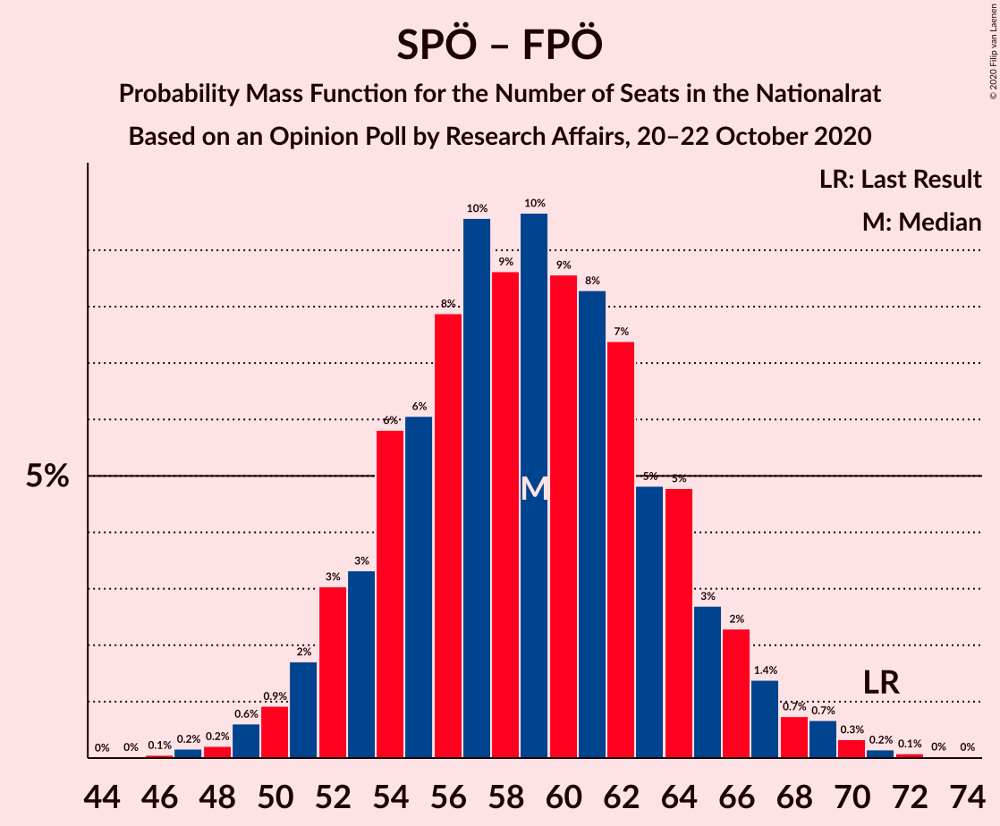

| Number of Seats | Probability | Accumulated | Special Marks |
|:---------------:|:-----------:|:-----------:|:-------------:|
| 46 | 0.1% | 100% |  |
| 47 | 0.2% | 99.9% |  |
| 48 | 0.2% | 99.7% |  |
| 49 | 0.6% | 99.5% |  |
| 50 | 0.9% | 98.9% |  |
| 51 | 2% | 98% |  |
| 52 | 3% | 96% |  |
| 53 | 3% | 93% |  |
| 54 | 6% | 90% |  |
| 55 | 6% | 84% |  |
| 56 | 8% | 78% |  |
| 57 | 10% | 70% |  |
| 58 | 9% | 61% |  |
| 59 | 10% | 52% | Median |
| 60 | 9% | 42% |  |
| 61 | 8% | 34% |  |
| 62 | 7% | 25% |  |
| 63 | 5% | 18% |  |
| 64 | 5% | 13% |  |
| 65 | 3% | 8% |  |
| 66 | 2% | 6% |  |
| 67 | 1.4% | 3% |  |
| 68 | 0.7% | 2% |  |
| 69 | 0.7% | 1.3% |  |
| 70 | 0.3% | 0.6% |  |
| 71 | 0.2% | 0.3% | Last Result |
| 72 | 0.1% | 0.2% |  |
| 73 | 0% | 0.1% |  |
| 74 | 0% | 0% |  |

### Sozialdemokratische Partei Österreichs

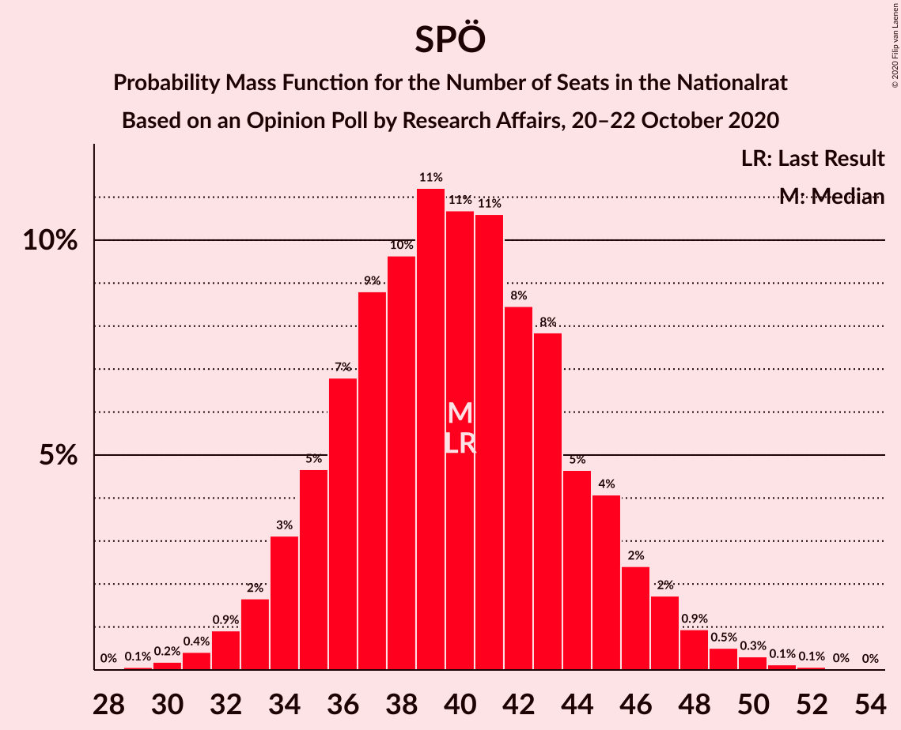

| Number of Seats | Probability | Accumulated | Special Marks |
|:---------------:|:-----------:|:-----------:|:-------------:|
| 29 | 0.1% | 100% |  |
| 30 | 0.2% | 99.9% |  |
| 31 | 0.4% | 99.7% |  |
| 32 | 0.9% | 99.3% |  |
| 33 | 2% | 98% |  |
| 34 | 3% | 97% |  |
| 35 | 5% | 94% |  |
| 36 | 7% | 89% |  |
| 37 | 9% | 82% |  |
| 38 | 10% | 73% |  |
| 39 | 11% | 64% |  |
| 40 | 11% | 52% | Last Result, Median |
| 41 | 11% | 42% |  |
| 42 | 8% | 31% |  |
| 43 | 8% | 23% |  |
| 44 | 5% | 15% |  |
| 45 | 4% | 10% |  |
| 46 | 2% | 6% |  |
| 47 | 2% | 4% |  |
| 48 | 0.9% | 2% |  |
| 49 | 0.5% | 1.1% |  |
| 50 | 0.3% | 0.6% |  |
| 51 | 0.1% | 0.2% |  |
| 52 | 0.1% | 0.1% |  |
| 53 | 0% | 0% |  |

## Technical Information

### Opinion Poll

+ **Polling firm:** Research Affairs
+ **Commissioner(s):** —
+ **Fieldwork period:** 20–22 October 2020

### Calculations

+ **Sample size:** 500
+ **Simulations done:** 1,048,576
+ **Error estimate:** 0.79%

