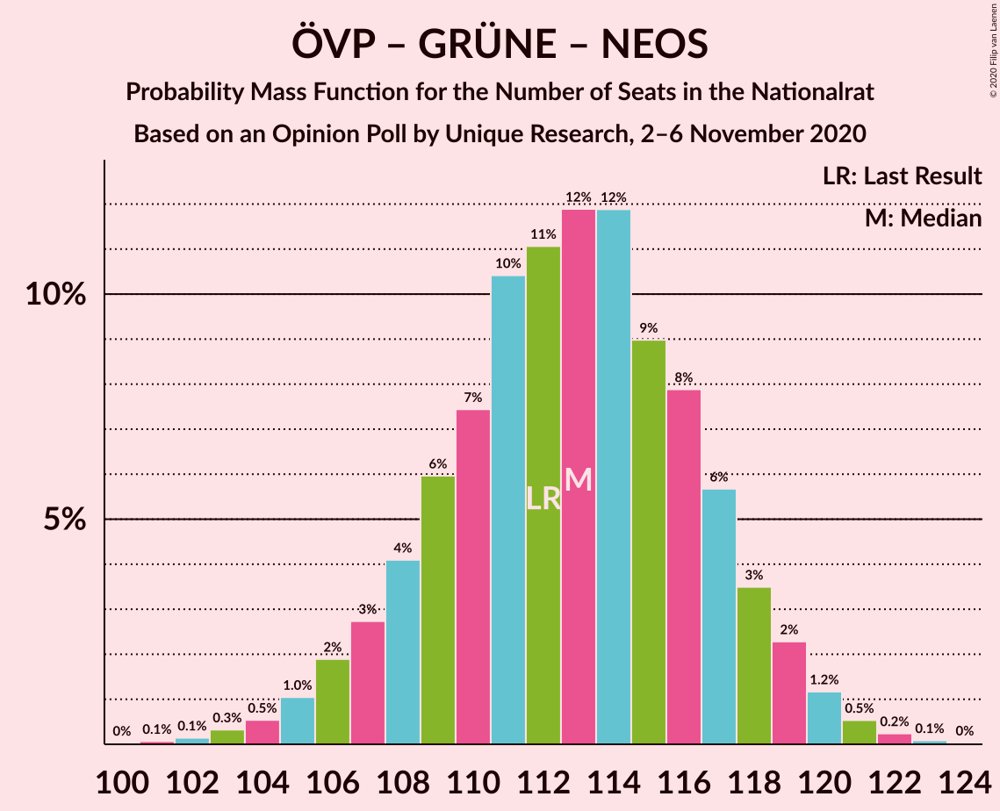

# Opinion Poll by Unique Research, 2–6 November 2020

<a href="#voting-intentions">Voting Intentions</a> | <a href="#seats">Seats</a> | <a href="#coalitions">Coalitions</a> | <a href="#technical-information">Technical Information</a>

## Voting Intentions

### Confidence Intervals

| Party | Last Result | Poll Result | 80% Confidence Interval | 90% Confidence Interval | 95% Confidence Interval | 99% Confidence Interval |
|:-----:|:-----------:|:-----------:|:-----------------------:|:-----------------------:|:-----------------------:|:-----------------------:|
| Österreichische Volkspartei | 37.5% | 38.1% | 35.9–40.3% |35.3–40.9% |34.8–41.5% |33.7–42.6% |
| Sozialdemokratische Partei Österreichs | 21.2% | 21.0% | 19.3–23.0% |18.8–23.5% |18.3–24.0% |17.5–24.9% |
| Freiheitliche Partei Österreichs | 16.2% | 16.0% | 14.5–17.8% |14.0–18.3% |13.7–18.7% |13.0–19.6% |
| Die Grünen–Die Grüne Alternative | 13.9% | 11.9% | 10.6–13.5% |10.2–14.0% |9.9–14.4% |9.3–15.2% |
| NEOS–Das Neue Österreich und Liberales Forum | 8.1% | 10.0% | 8.7–11.4% |8.4–11.9% |8.1–12.2% |7.5–13.0% |

*Note:* The poll result column reflects the actual value used in the calculations. Published results may vary slightly, and in addition be rounded to fewer digits.

## Seats

### Confidence Intervals

| Party | Last Result | Median | 80% Confidence Interval | 90% Confidence Interval | 95% Confidence Interval | 99% Confidence Interval |
|:-----:|:-----------:|:------:|:-----------------------:|:-----------------------:|:-----------------------:|:-----------------------:|
| <a href="#österreichische-volkspartei">Österreichische Volkspartei</a> | 71 | 72 | 68–76 |66–77 |65–78 |63–80 |
| <a href="#sozialdemokratische-partei-österreichs">Sozialdemokratische Partei Österreichs</a> | 40 | 40 | 36–43 |35–44 |34–45 |33–47 |
| <a href="#freiheitliche-partei-österreichs">Freiheitliche Partei Österreichs</a> | 31 | 30 | 27–33 |26–34 |25–35 |24–37 |
| <a href="#die-grünen–die-grüne-alternative">Die Grünen–Die Grüne Alternative</a> | 26 | 22 | 20–25 |19–26 |18–27 |17–28 |
| <a href="#neos–das-neue-österreich-und-liberales-forum">NEOS–Das Neue Österreich und Liberales Forum</a> | 15 | 19 | 16–21 |15–22 |15–23 |14–24 |

### Österreichische Volkspartei

*For a full overview of the results for this party, see the [Österreichische Volkspartei](party-österreichischevolkspartei.html) page.*

| Number of Seats | Probability | Accumulated | Special Marks |
|:---------------:|:-----------:|:-----------:|:-------------:|
| 61 | 0.1% | 100% |  |
| 62 | 0.2% | 99.9% |  |
| 63 | 0.4% | 99.8% |  |
| 64 | 0.8% | 99.4% |  |
| 65 | 1.5% | 98.6% |  |
| 66 | 3% | 97% |  |
| 67 | 4% | 95% |  |
| 68 | 6% | 90% |  |
| 69 | 9% | 84% |  |
| 70 | 10% | 76% |  |
| 71 | 12% | 66% | Last Result |
| 72 | 12% | 54% | Median |
| 73 | 12% | 42% |  |
| 74 | 9% | 30% |  |
| 75 | 8% | 21% |  |
| 76 | 5% | 13% |  |
| 77 | 4% | 8% |  |
| 78 | 2% | 4% |  |
| 79 | 1.2% | 2% |  |
| 80 | 0.6% | 1.0% |  |
| 81 | 0.3% | 0.5% |  |
| 82 | 0.1% | 0.2% |  |
| 83 | 0% | 0.1% |  |
| 84 | 0% | 0% |  |

### Sozialdemokratische Partei Österreichs

*For a full overview of the results for this party, see the [Sozialdemokratische Partei Österreichs](party-sozialdemokratischeparteiösterreichs.html) page.*

| Number of Seats | Probability | Accumulated | Special Marks |
|:---------------:|:-----------:|:-----------:|:-------------:|
| 31 | 0.1% | 100% |  |
| 32 | 0.3% | 99.9% |  |
| 33 | 0.8% | 99.6% |  |
| 34 | 2% | 98.8% |  |
| 35 | 4% | 97% |  |
| 36 | 7% | 93% |  |
| 37 | 9% | 86% |  |
| 38 | 13% | 77% |  |
| 39 | 14% | 64% |  |
| 40 | 15% | 50% | Last Result, Median |
| 41 | 12% | 36% |  |
| 42 | 9% | 24% |  |
| 43 | 7% | 14% |  |
| 44 | 4% | 8% |  |
| 45 | 2% | 4% |  |
| 46 | 1.0% | 2% |  |
| 47 | 0.4% | 0.7% |  |
| 48 | 0.2% | 0.3% |  |
| 49 | 0.1% | 0.1% |  |
| 50 | 0% | 0% |  |

### Freiheitliche Partei Österreichs

*For a full overview of the results for this party, see the [Freiheitliche Partei Österreichs](party-freiheitlicheparteiösterreichs.html) page.*

| Number of Seats | Probability | Accumulated | Special Marks |
|:---------------:|:-----------:|:-----------:|:-------------:|
| 23 | 0.2% | 100% |  |
| 24 | 0.7% | 99.8% |  |
| 25 | 2% | 99.1% |  |
| 26 | 4% | 97% |  |
| 27 | 8% | 93% |  |
| 28 | 11% | 86% |  |
| 29 | 15% | 74% |  |
| 30 | 16% | 59% | Median |
| 31 | 14% | 43% | Last Result |
| 32 | 12% | 29% |  |
| 33 | 8% | 17% |  |
| 34 | 5% | 9% |  |
| 35 | 2% | 4% |  |
| 36 | 1.1% | 2% |  |
| 37 | 0.4% | 0.7% |  |
| 38 | 0.2% | 0.2% |  |
| 39 | 0% | 0.1% |  |
| 40 | 0% | 0% |  |

### Die Grünen–Die Grüne Alternative

*For a full overview of the results for this party, see the [Die Grünen–Die Grüne Alternative](party-diegrünen–diegrünealternative.html) page.*

| Number of Seats | Probability | Accumulated | Special Marks |
|:---------------:|:-----------:|:-----------:|:-------------:|
| 16 | 0.2% | 100% |  |
| 17 | 0.8% | 99.8% |  |
| 18 | 2% | 99.0% |  |
| 19 | 6% | 97% |  |
| 20 | 11% | 91% |  |
| 21 | 16% | 80% |  |
| 22 | 18% | 64% | Median |
| 23 | 17% | 47% |  |
| 24 | 13% | 29% |  |
| 25 | 8% | 16% |  |
| 26 | 4% | 8% | Last Result |
| 27 | 2% | 3% |  |
| 28 | 0.8% | 1.2% |  |
| 29 | 0.3% | 0.4% |  |
| 30 | 0.1% | 0.1% |  |
| 31 | 0% | 0% |  |

### NEOS–Das Neue Österreich und Liberales Forum

*For a full overview of the results for this party, see the [NEOS–Das Neue Österreich und Liberales Forum](party-neos–dasneueösterreichundliberalesforum.html) page.*

| Number of Seats | Probability | Accumulated | Special Marks |
|:---------------:|:-----------:|:-----------:|:-------------:|
| 13 | 0.3% | 100% |  |
| 14 | 1.3% | 99.7% |  |
| 15 | 4% | 98% | Last Result |
| 16 | 9% | 94% |  |
| 17 | 15% | 85% |  |
| 18 | 19% | 70% |  |
| 19 | 19% | 50% | Median |
| 20 | 14% | 31% |  |
| 21 | 9% | 17% |  |
| 22 | 5% | 8% |  |
| 23 | 2% | 3% |  |
| 24 | 0.8% | 1.1% |  |
| 25 | 0.2% | 0.3% |  |
| 26 | 0.1% | 0.1% |  |
| 27 | 0% | 0% |  |

## Coalitions

### Confidence Intervals

| Coalition | Last Result | Median | Majority? | 80% Confidence Interval | 90% Confidence Interval | 95% Confidence Interval | 99% Confidence Interval |
|:---------:|:-----------:|:------:|:---------:|:-----------------------:|:-----------------------:|:-----------------------:|:-----------------------:|
| Österreichische Volkspartei – Die Grünen–Die Grüne Alternative – NEOS–Das Neue Österreich und Liberales Forum | 112 | 113 | 100% | 108–117 | 107–118 | 106–119 | 103–121 |
| Österreichische Volkspartei – Sozialdemokratische Partei Österreichs | 111 | 111 | 100% | 107–116 | 106–117 | 104–118 | 102–120 |
| Österreichische Volkspartei – Freiheitliche Partei Österreichs | 102 | 102 | 99.8% | 97–106 | 96–108 | 95–109 | 93–111 |
| Österreichische Volkspartei – Die Grünen–Die Grüne Alternative | 97 | 94 | 78% | 90–99 | 88–100 | 87–101 | 85–103 |
| Österreichische Volkspartei – NEOS–Das Neue Österreich und Liberales Forum | 86 | 90 | 38% | 86–95 | 85–96 | 84–97 | 81–99 |
| Sozialdemokratische Partei Österreichs – Die Grünen–Die Grüne Alternative – NEOS–Das Neue Österreich und Liberales Forum | 81 | 80 | 0.1% | 76–85 | 75–86 | 74–87 | 72–89 |
| Österreichische Volkspartei | 71 | 72 | 0% | 68–76 | 66–77 | 65–78 | 63–80 |
| Sozialdemokratische Partei Österreichs – Freiheitliche Partei Österreichs | 71 | 70 | 0% | 65–74 | 64–75 | 63–76 | 61–78 |
| Sozialdemokratische Partei Österreichs – Die Grünen–Die Grüne Alternative | 66 | 62 | 0% | 58–66 | 57–67 | 56–68 | 54–70 |
| Sozialdemokratische Partei Österreichs | 40 | 40 | 0% | 36–43 | 35–44 | 34–45 | 33–47 |

### Österreichische Volkspartei – Die Grünen–Die Grüne Alternative – NEOS–Das Neue Österreich und Liberales Forum

| Number of Seats | Probability | Accumulated | Special Marks |
|:---------------:|:-----------:|:-----------:|:-------------:|
| 101 | 0.1% | 100% |  |
| 102 | 0.1% | 99.9% |  |
| 103 | 0.3% | 99.7% |  |
| 104 | 0.5% | 99.4% |  |
| 105 | 1.0% | 98.9% |  |
| 106 | 2% | 98% |  |
| 107 | 3% | 96% |  |
| 108 | 4% | 93% |  |
| 109 | 6% | 89% |  |
| 110 | 7% | 83% |  |
| 111 | 10% | 76% |  |
| 112 | 11% | 65% | Last Result |
| 113 | 12% | 54% | Median |
| 114 | 12% | 42% |  |
| 115 | 9% | 30% |  |
| 116 | 8% | 21% |  |
| 117 | 6% | 14% |  |
| 118 | 3% | 8% |  |
| 119 | 2% | 4% |  |
| 120 | 1.2% | 2% |  |
| 121 | 0.5% | 0.9% |  |
| 122 | 0.2% | 0.4% |  |
| 123 | 0.1% | 0.1% |  |
| 124 | 0% | 0% |  |

### Österreichische Volkspartei – Sozialdemokratische Partei Österreichs

| Number of Seats | Probability | Accumulated | Special Marks |
|:---------------:|:-----------:|:-----------:|:-------------:|
| 99 | 0% | 100% |  |
| 100 | 0.1% | 99.9% |  |
| 101 | 0.2% | 99.8% |  |
| 102 | 0.4% | 99.6% |  |
| 103 | 0.7% | 99.2% |  |
| 104 | 1.3% | 98.5% |  |
| 105 | 2% | 97% |  |
| 106 | 3% | 95% |  |
| 107 | 5% | 92% |  |
| 108 | 7% | 87% |  |
| 109 | 9% | 80% |  |
| 110 | 10% | 71% |  |
| 111 | 12% | 61% | Last Result |
| 112 | 11% | 49% | Median |
| 113 | 11% | 38% |  |
| 114 | 9% | 27% |  |
| 115 | 7% | 18% |  |
| 116 | 5% | 11% |  |
| 117 | 3% | 7% |  |
| 118 | 2% | 3% |  |
| 119 | 0.9% | 2% |  |
| 120 | 0.4% | 0.7% |  |
| 121 | 0.2% | 0.3% |  |
| 122 | 0.1% | 0.1% |  |
| 123 | 0% | 0% |  |

### Österreichische Volkspartei – Freiheitliche Partei Österreichs

| Number of Seats | Probability | Accumulated | Special Marks |
|:---------------:|:-----------:|:-----------:|:-------------:|
| 90 | 0.1% | 100% |  |
| 91 | 0.1% | 99.9% |  |
| 92 | 0.2% | 99.8% | Majority |
| 93 | 0.5% | 99.6% |  |
| 94 | 0.9% | 99.1% |  |
| 95 | 2% | 98% |  |
| 96 | 3% | 97% |  |
| 97 | 4% | 94% |  |
| 98 | 6% | 90% |  |
| 99 | 8% | 84% |  |
| 100 | 10% | 76% |  |
| 101 | 11% | 67% |  |
| 102 | 11% | 56% | Last Result, Median |
| 103 | 12% | 45% |  |
| 104 | 10% | 33% |  |
| 105 | 8% | 23% |  |
| 106 | 6% | 15% |  |
| 107 | 4% | 9% |  |
| 108 | 2% | 5% |  |
| 109 | 1.4% | 3% |  |
| 110 | 0.8% | 1.3% |  |
| 111 | 0.3% | 0.5% |  |
| 112 | 0.1% | 0.2% |  |
| 113 | 0.1% | 0.1% |  |
| 114 | 0% | 0% |  |

### Österreichische Volkspartei – Die Grünen–Die Grüne Alternative

| Number of Seats | Probability | Accumulated | Special Marks |
|:---------------:|:-----------:|:-----------:|:-------------:|
| 82 | 0% | 100% |  |
| 83 | 0.1% | 99.9% |  |
| 84 | 0.2% | 99.9% |  |
| 85 | 0.4% | 99.7% |  |
| 86 | 0.7% | 99.3% |  |
| 87 | 1.4% | 98.5% |  |
| 88 | 2% | 97% |  |
| 89 | 4% | 95% |  |
| 90 | 5% | 91% |  |
| 91 | 7% | 85% |  |
| 92 | 9% | 78% | Majority |
| 93 | 11% | 69% |  |
| 94 | 12% | 59% | Median |
| 95 | 12% | 47% |  |
| 96 | 10% | 35% |  |
| 97 | 8% | 25% | Last Result |
| 98 | 6% | 17% |  |
| 99 | 5% | 11% |  |
| 100 | 3% | 6% |  |
| 101 | 2% | 3% |  |
| 102 | 0.8% | 2% |  |
| 103 | 0.4% | 0.7% |  |
| 104 | 0.2% | 0.3% |  |
| 105 | 0.1% | 0.1% |  |
| 106 | 0% | 0% |  |

### Österreichische Volkspartei – NEOS–Das Neue Österreich und Liberales Forum

| Number of Seats | Probability | Accumulated | Special Marks |
|:---------------:|:-----------:|:-----------:|:-------------:|
| 79 | 0.1% | 100% |  |
| 80 | 0.2% | 99.9% |  |
| 81 | 0.3% | 99.7% |  |
| 82 | 0.7% | 99.4% |  |
| 83 | 1.3% | 98.8% |  |
| 84 | 2% | 98% |  |
| 85 | 3% | 95% |  |
| 86 | 5% | 92% | Last Result |
| 87 | 7% | 87% |  |
| 88 | 9% | 80% |  |
| 89 | 11% | 71% |  |
| 90 | 11% | 61% |  |
| 91 | 11% | 49% | Median |
| 92 | 11% | 38% | Majority |
| 93 | 9% | 27% |  |
| 94 | 7% | 18% |  |
| 95 | 5% | 12% |  |
| 96 | 3% | 7% |  |
| 97 | 2% | 4% |  |
| 98 | 1.0% | 2% |  |
| 99 | 0.5% | 0.9% |  |
| 100 | 0.2% | 0.4% |  |
| 101 | 0.1% | 0.1% |  |
| 102 | 0% | 0.1% |  |
| 103 | 0% | 0% |  |

### Sozialdemokratische Partei Österreichs – Die Grünen–Die Grüne Alternative – NEOS–Das Neue Österreich und Liberales Forum

| Number of Seats | Probability | Accumulated | Special Marks |
|:---------------:|:-----------:|:-----------:|:-------------:|
| 69 | 0% | 100% |  |
| 70 | 0.1% | 99.9% |  |
| 71 | 0.3% | 99.8% |  |
| 72 | 0.6% | 99.6% |  |
| 73 | 1.1% | 99.0% |  |
| 74 | 2% | 98% |  |
| 75 | 3% | 96% |  |
| 76 | 5% | 93% |  |
| 77 | 7% | 88% |  |
| 78 | 9% | 81% |  |
| 79 | 10% | 72% |  |
| 80 | 12% | 62% |  |
| 81 | 11% | 50% | Last Result, Median |
| 82 | 11% | 38% |  |
| 83 | 9% | 28% |  |
| 84 | 7% | 19% |  |
| 85 | 5% | 12% |  |
| 86 | 3% | 7% |  |
| 87 | 2% | 4% |  |
| 88 | 1.0% | 2% |  |
| 89 | 0.5% | 0.9% |  |
| 90 | 0.2% | 0.4% |  |
| 91 | 0.1% | 0.1% |  |
| 92 | 0% | 0.1% | Majority |
| 93 | 0% | 0% |  |

### Österreichische Volkspartei

| Number of Seats | Probability | Accumulated | Special Marks |
|:---------------:|:-----------:|:-----------:|:-------------:|
| 61 | 0.1% | 100% |  |
| 62 | 0.2% | 99.9% |  |
| 63 | 0.4% | 99.8% |  |
| 64 | 0.8% | 99.4% |  |
| 65 | 1.5% | 98.6% |  |
| 66 | 3% | 97% |  |
| 67 | 4% | 95% |  |
| 68 | 6% | 90% |  |
| 69 | 9% | 84% |  |
| 70 | 10% | 76% |  |
| 71 | 12% | 66% | Last Result |
| 72 | 12% | 54% | Median |
| 73 | 12% | 42% |  |
| 74 | 9% | 30% |  |
| 75 | 8% | 21% |  |
| 76 | 5% | 13% |  |
| 77 | 4% | 8% |  |
| 78 | 2% | 4% |  |
| 79 | 1.2% | 2% |  |
| 80 | 0.6% | 1.0% |  |
| 81 | 0.3% | 0.5% |  |
| 82 | 0.1% | 0.2% |  |
| 83 | 0% | 0.1% |  |
| 84 | 0% | 0% |  |

### Sozialdemokratische Partei Österreichs – Freiheitliche Partei Österreichs

| Number of Seats | Probability | Accumulated | Special Marks |
|:---------------:|:-----------:|:-----------:|:-------------:|
| 59 | 0.1% | 100% |  |
| 60 | 0.2% | 99.9% |  |
| 61 | 0.4% | 99.7% |  |
| 62 | 0.8% | 99.3% |  |
| 63 | 2% | 98.5% |  |
| 64 | 3% | 97% |  |
| 65 | 4% | 94% |  |
| 66 | 7% | 90% |  |
| 67 | 9% | 83% |  |
| 68 | 10% | 74% |  |
| 69 | 12% | 65% |  |
| 70 | 12% | 52% | Median |
| 71 | 11% | 40% | Last Result |
| 72 | 10% | 29% |  |
| 73 | 7% | 19% |  |
| 74 | 5% | 12% |  |
| 75 | 3% | 7% |  |
| 76 | 2% | 4% |  |
| 77 | 1.2% | 2% |  |
| 78 | 0.5% | 0.9% |  |
| 79 | 0.2% | 0.4% |  |
| 80 | 0.1% | 0.2% |  |
| 81 | 0% | 0% |  |

### Sozialdemokratische Partei Österreichs – Die Grünen–Die Grüne Alternative

| Number of Seats | Probability | Accumulated | Special Marks |
|:---------------:|:-----------:|:-----------:|:-------------:|
| 52 | 0.1% | 100% |  |
| 53 | 0.3% | 99.9% |  |
| 54 | 0.6% | 99.6% |  |
| 55 | 1.2% | 99.0% |  |
| 56 | 2% | 98% |  |
| 57 | 4% | 95% |  |
| 58 | 6% | 92% |  |
| 59 | 8% | 85% |  |
| 60 | 11% | 77% |  |
| 61 | 12% | 67% |  |
| 62 | 12% | 55% | Median |
| 63 | 12% | 43% |  |
| 64 | 10% | 31% |  |
| 65 | 8% | 21% |  |
| 66 | 5% | 13% | Last Result |
| 67 | 4% | 8% |  |
| 68 | 2% | 4% |  |
| 69 | 1.1% | 2% |  |
| 70 | 0.5% | 0.9% |  |
| 71 | 0.2% | 0.4% |  |
| 72 | 0.1% | 0.2% |  |
| 73 | 0% | 0.1% |  |
| 74 | 0% | 0% |  |

### Sozialdemokratische Partei Österreichs

| Number of Seats | Probability | Accumulated | Special Marks |
|:---------------:|:-----------:|:-----------:|:-------------:|
| 31 | 0.1% | 100% |  |
| 32 | 0.3% | 99.9% |  |
| 33 | 0.8% | 99.6% |  |
| 34 | 2% | 98.8% |  |
| 35 | 4% | 97% |  |
| 36 | 7% | 93% |  |
| 37 | 9% | 86% |  |
| 38 | 13% | 77% |  |
| 39 | 14% | 64% |  |
| 40 | 15% | 50% | Last Result, Median |
| 41 | 12% | 36% |  |
| 42 | 9% | 24% |  |
| 43 | 7% | 14% |  |
| 44 | 4% | 8% |  |
| 45 | 2% | 4% |  |
| 46 | 1.0% | 2% |  |
| 47 | 0.4% | 0.7% |  |
| 48 | 0.2% | 0.3% |  |
| 49 | 0.1% | 0.1% |  |
| 50 | 0% | 0% |  |

## Technical Information

### Opinion Poll

+ **Polling firm:** Unique Research
+ **Commissioner(s):** —
+ **Fieldwork period:** 2–6 November 2020

### Calculations

+ **Sample size:** 804
+ **Simulations done:** 1,048,576
+ **Error estimate:** 0.35%

