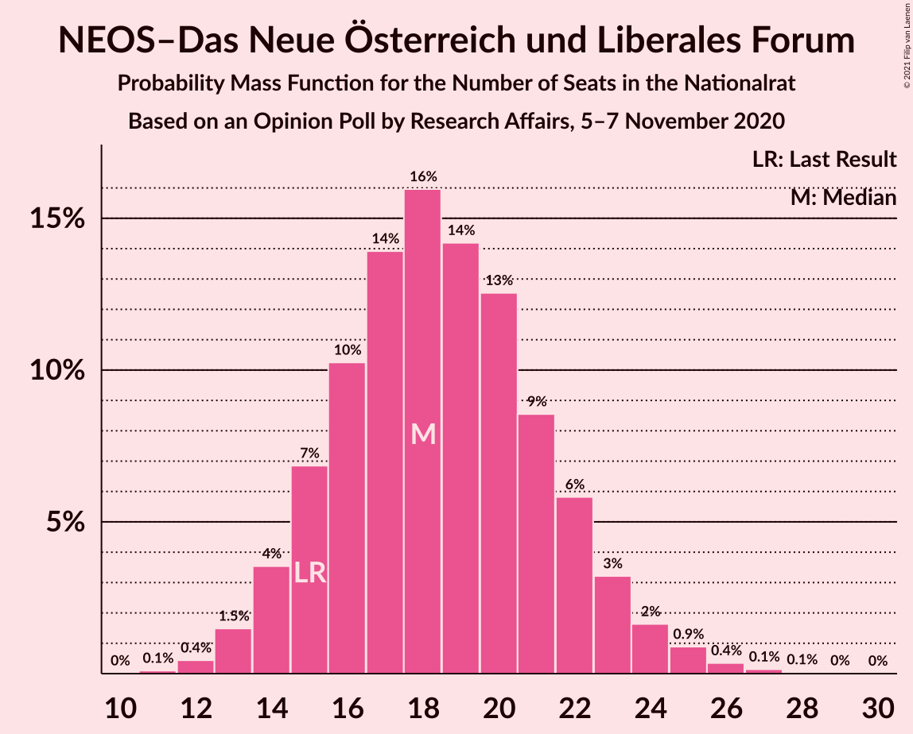
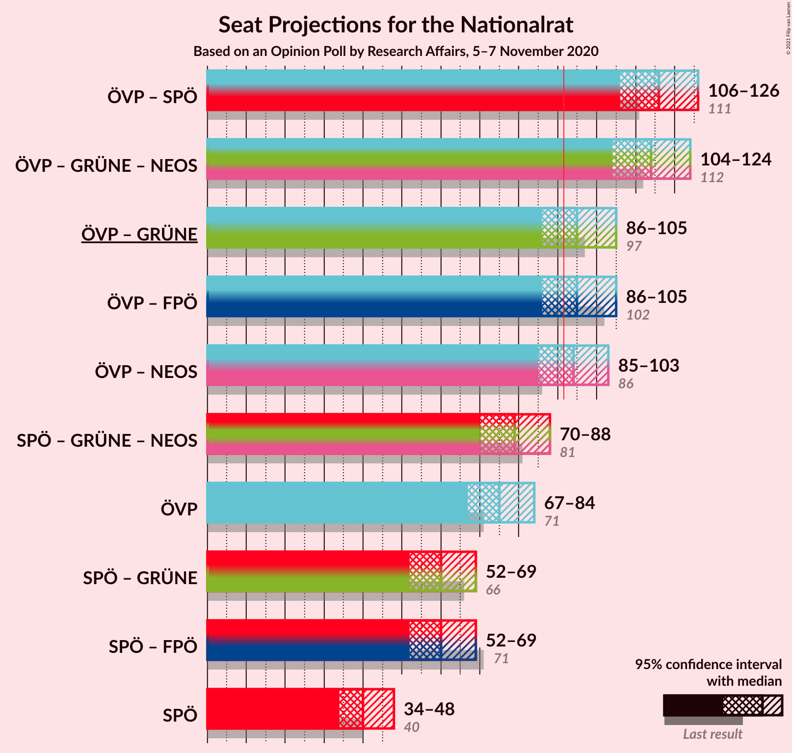
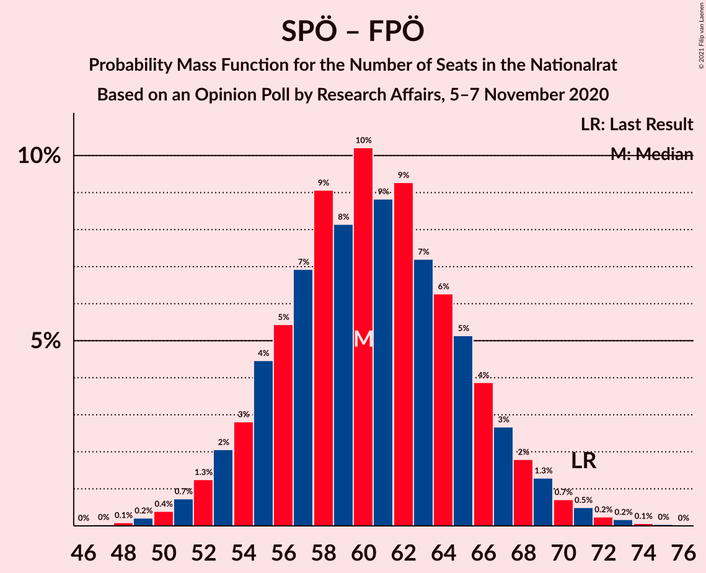

# Opinion Poll by Research Affairs, 5–7 November 2020

<a href="#voting-intentions">Voting Intentions</a> | <a href="#seats">Seats</a> | <a href="#coalitions">Coalitions</a> | <a href="#technical-information">Technical Information</a>

## Voting Intentions

### Confidence Intervals

| Party | Last Result | Poll Result | 80% Confidence Interval | 90% Confidence Interval | 95% Confidence Interval | 99% Confidence Interval |
|:-----:|:-----------:|:-----------:|:-----------------------:|:-----------------------:|:-----------------------:|:-----------------------:|
| Österreichische Volkspartei | 37.5% | 39.8% | 37.0–42.7% |36.3–43.5% |35.6–44.2% |34.3–45.5% |
| Sozialdemokratische Partei Österreichs | 21.2% | 21.4% | 19.2–23.9% |18.6–24.6% |18.0–25.2% |17.0–26.4% |
| Freiheitliche Partei Österreichs | 16.2% | 10.6% | 9.0–12.6% |8.6–13.1% |8.2–13.6% |7.5–14.6% |
| Die Grünen–Die Grüne Alternative | 13.9% | 10.6% | 9.0–12.6% |8.6–13.1% |8.2–13.6% |7.5–14.6% |
| NEOS–Das Neue Österreich und Liberales Forum | 8.1% | 9.8% | 8.3–11.7% |7.8–12.3% |7.5–12.7% |6.8–13.7% |
| Team HC Strache–Allianz für Österreich | 0.0% | 3.0% | 2.2–4.2% |2.0–4.6% |1.8–4.9% |1.5–5.5% |

*Note:* The poll result column reflects the actual value used in the calculations. Published results may vary slightly, and in addition be rounded to fewer digits.

## Seats

### Confidence Intervals

| Party | Last Result | Median | 80% Confidence Interval | 90% Confidence Interval | 95% Confidence Interval | 99% Confidence Interval |
|:-----:|:-----------:|:------:|:-----------------------:|:-----------------------:|:-----------------------:|:-----------------------:|
| <a href="#österreichische-volkspartei">Österreichische Volkspartei</a> | 71 | 75 | 70–81 |68–83 |66–84 |64–87 |
| <a href="#sozialdemokratische-partei-österreichs">Sozialdemokratische Partei Österreichs</a> | 40 | 40 | 36–45 |35–47 |34–48 |32–50 |
| <a href="#freiheitliche-partei-österreichs">Freiheitliche Partei Österreichs</a> | 31 | 20 | 17–23 |16–24 |15–25 |14–27 |
| <a href="#die-grünen–die-grüne-alternative">Die Grünen–Die Grüne Alternative</a> | 26 | 20 | 17–24 |16–25 |15–26 |14–27 |
| <a href="#neos–das-neue-österreich-und-liberales-forum">NEOS–Das Neue Österreich und Liberales Forum</a> | 15 | 18 | 15–22 |14–23 |14–24 |12–25 |
| <a href="#team-hc-strache–allianz-für-österreich">Team HC Strache–Allianz für Österreich</a> | 0 | 0 | 0–7 |0–8 |0–9 |0–10 |

### Österreichische Volkspartei

*For a full overview of the results for this party, see the [Österreichische Volkspartei](party-österreichischevolkspartei.html) page.*

| Number of Seats | Probability | Accumulated | Special Marks |
|:---------------:|:-----------:|:-----------:|:-------------:|
| 61 | 0% | 100% |  |
| 62 | 0.1% | 99.9% |  |
| 63 | 0.1% | 99.9% |  |
| 64 | 0.3% | 99.7% |  |
| 65 | 0.6% | 99.4% |  |
| 66 | 1.3% | 98.8% |  |
| 67 | 1.4% | 97% |  |
| 68 | 2% | 96% |  |
| 69 | 3% | 94% |  |
| 70 | 4% | 90% |  |
| 71 | 6% | 86% | Last Result |
| 72 | 8% | 80% |  |
| 73 | 10% | 72% |  |
| 74 | 9% | 62% |  |
| 75 | 10% | 53% | Median |
| 76 | 10% | 43% |  |
| 77 | 6% | 33% |  |
| 78 | 8% | 27% |  |
| 79 | 4% | 19% |  |
| 80 | 4% | 15% |  |
| 81 | 3% | 11% |  |
| 82 | 3% | 8% |  |
| 83 | 2% | 5% |  |
| 84 | 1.3% | 3% |  |
| 85 | 0.9% | 2% |  |
| 86 | 0.4% | 1.2% |  |
| 87 | 0.4% | 0.8% |  |
| 88 | 0.2% | 0.4% |  |
| 89 | 0.1% | 0.2% |  |
| 90 | 0% | 0.1% |  |
| 91 | 0.1% | 0.1% |  |
| 92 | 0% | 0% | Majority |

### Sozialdemokratische Partei Österreichs

*For a full overview of the results for this party, see the [Sozialdemokratische Partei Österreichs](party-sozialdemokratischeparteiösterreichs.html) page.*

| Number of Seats | Probability | Accumulated | Special Marks |
|:---------------:|:-----------:|:-----------:|:-------------:|
| 29 | 0% | 100% |  |
| 30 | 0.1% | 99.9% |  |
| 31 | 0.3% | 99.9% |  |
| 32 | 0.6% | 99.6% |  |
| 33 | 0.9% | 99.0% |  |
| 34 | 2% | 98% |  |
| 35 | 3% | 96% |  |
| 36 | 6% | 93% |  |
| 37 | 7% | 87% |  |
| 38 | 8% | 80% |  |
| 39 | 12% | 72% |  |
| 40 | 12% | 60% | Last Result, Median |
| 41 | 10% | 49% |  |
| 42 | 10% | 38% |  |
| 43 | 9% | 29% |  |
| 44 | 8% | 20% |  |
| 45 | 4% | 12% |  |
| 46 | 2% | 8% |  |
| 47 | 3% | 6% |  |
| 48 | 2% | 3% |  |
| 49 | 0.8% | 1.4% |  |
| 50 | 0.3% | 0.6% |  |
| 51 | 0.2% | 0.3% |  |
| 52 | 0.1% | 0.2% |  |
| 53 | 0.1% | 0.1% |  |
| 54 | 0% | 0% |  |

### Freiheitliche Partei Österreichs

*For a full overview of the results for this party, see the [Freiheitliche Partei Österreichs](party-freiheitlicheparteiösterreichs.html) page.*

| Number of Seats | Probability | Accumulated | Special Marks |
|:---------------:|:-----------:|:-----------:|:-------------:|
| 12 | 0.1% | 100% |  |
| 13 | 0.3% | 99.9% |  |
| 14 | 0.8% | 99.6% |  |
| 15 | 2% | 98.8% |  |
| 16 | 4% | 96% |  |
| 17 | 8% | 93% |  |
| 18 | 12% | 85% |  |
| 19 | 17% | 73% |  |
| 20 | 14% | 56% | Median |
| 21 | 16% | 42% |  |
| 22 | 11% | 26% |  |
| 23 | 7% | 15% |  |
| 24 | 4% | 9% |  |
| 25 | 3% | 5% |  |
| 26 | 1.3% | 2% |  |
| 27 | 0.6% | 1.0% |  |
| 28 | 0.3% | 0.5% |  |
| 29 | 0.2% | 0.2% |  |
| 30 | 0% | 0.1% |  |
| 31 | 0% | 0% | Last Result |

### Die Grünen–Die Grüne Alternative

*For a full overview of the results for this party, see the [Die Grünen–Die Grüne Alternative](party-diegrünen–diegrünealternative.html) page.*

| Number of Seats | Probability | Accumulated | Special Marks |
|:---------------:|:-----------:|:-----------:|:-------------:|
| 12 | 0.1% | 100% |  |
| 13 | 0.3% | 99.9% |  |
| 14 | 0.8% | 99.6% |  |
| 15 | 1.4% | 98.8% |  |
| 16 | 5% | 97% |  |
| 17 | 8% | 93% |  |
| 18 | 15% | 84% |  |
| 19 | 17% | 69% |  |
| 20 | 19% | 52% | Median |
| 21 | 8% | 34% |  |
| 22 | 8% | 25% |  |
| 23 | 6% | 17% |  |
| 24 | 5% | 11% |  |
| 25 | 3% | 6% |  |
| 26 | 2% | 3% | Last Result |
| 27 | 0.6% | 1.0% |  |
| 28 | 0.2% | 0.3% |  |
| 29 | 0.1% | 0.1% |  |
| 30 | 0% | 0.1% |  |
| 31 | 0% | 0% |  |

### NEOS–Das Neue Österreich und Liberales Forum

*For a full overview of the results for this party, see the [NEOS–Das Neue Österreich und Liberales Forum](party-neos–dasneueösterreichundliberalesforum.html) page.*

| Number of Seats | Probability | Accumulated | Special Marks |
|:---------------:|:-----------:|:-----------:|:-------------:|
| 11 | 0.1% | 100% |  |
| 12 | 0.5% | 99.9% |  |
| 13 | 2% | 99.4% |  |
| 14 | 4% | 98% |  |
| 15 | 7% | 94% | Last Result |
| 16 | 10% | 87% |  |
| 17 | 15% | 77% |  |
| 18 | 16% | 62% | Median |
| 19 | 13% | 46% |  |
| 20 | 12% | 33% |  |
| 21 | 9% | 21% |  |
| 22 | 5% | 12% |  |
| 23 | 3% | 6% |  |
| 24 | 2% | 3% |  |
| 25 | 1.0% | 1.4% |  |
| 26 | 0.3% | 0.5% |  |
| 27 | 0.1% | 0.2% |  |
| 28 | 0.1% | 0.1% |  |
| 29 | 0% | 0% |  |

### Team HC Strache–Allianz für Österreich

*For a full overview of the results for this party, see the [Team HC Strache–Allianz für Österreich](party-teamhcstrache–allianzfürösterreich.html) page.*

| Number of Seats | Probability | Accumulated | Special Marks |
|:---------------:|:-----------:|:-----------:|:-------------:|
| 0 | 85% | 100% | Last Result, Median |
| 1 | 0% | 15% |  |
| 2 | 0% | 15% |  |
| 3 | 0% | 15% |  |
| 4 | 0% | 15% |  |
| 5 | 0% | 15% |  |
| 6 | 0% | 15% |  |
| 7 | 7% | 15% |  |
| 8 | 5% | 8% |  |
| 9 | 2% | 3% |  |
| 10 | 0.5% | 0.7% |  |
| 11 | 0.2% | 0.2% |  |
| 12 | 0% | 0% |  |

## Coalitions

### Confidence Intervals

| Coalition | Last Result | Median | Majority? | 80% Confidence Interval | 90% Confidence Interval | 95% Confidence Interval | 99% Confidence Interval |
|:---------:|:-----------:|:------:|:---------:|:-----------------------:|:-----------------------:|:-----------------------:|:-----------------------:|
| Österreichische Volkspartei – Sozialdemokratische Partei Österreichs | 111 | 115 | 100% | 109–122 | 108–124 | 106–126 | 103–128 |
| Österreichische Volkspartei – Die Grünen–Die Grüne Alternative – NEOS–Das Neue Österreich und Liberales Forum | 112 | 113 | 100% | 107–119 | 106–122 | 104–123 | 101–126 |
| Österreichische Volkspartei – Freiheitliche Partei Österreichs | 102 | 95 | 78% | 89–101 | 87–103 | 86–105 | 83–107 |
| Österreichische Volkspartei – Die Grünen–Die Grüne Alternative | 97 | 95 | 76% | 89–101 | 87–103 | 86–104 | 83–108 |
| Österreichische Volkspartei – NEOS–Das Neue Österreich und Liberales Forum | 86 | 93 | 65% | 88–99 | 86–102 | 85–103 | 82–107 |
| Sozialdemokratische Partei Österreichs – Die Grünen–Die Grüne Alternative – NEOS–Das Neue Österreich und Liberales Forum | 81 | 79 | 0.3% | 73–85 | 71–87 | 70–88 | 67–91 |
| Österreichische Volkspartei | 71 | 75 | 0% | 70–81 | 68–83 | 66–84 | 64–87 |
| Sozialdemokratische Partei Österreichs – Freiheitliche Partei Österreichs | 71 | 61 | 0% | 56–66 | 54–68 | 53–69 | 50–72 |
| Sozialdemokratische Partei Österreichs – Die Grünen–Die Grüne Alternative | 66 | 60 | 0% | 55–66 | 54–68 | 52–69 | 50–71 |
| Sozialdemokratische Partei Österreichs | 40 | 40 | 0% | 36–45 | 35–47 | 34–48 | 32–50 |

### Österreichische Volkspartei – Sozialdemokratische Partei Österreichs

| Number of Seats | Probability | Accumulated | Special Marks |
|:---------------:|:-----------:|:-----------:|:-------------:|
| 100 | 0% | 100% |  |
| 101 | 0.1% | 99.9% |  |
| 102 | 0.2% | 99.8% |  |
| 103 | 0.3% | 99.7% |  |
| 104 | 0.4% | 99.4% |  |
| 105 | 0.5% | 99.1% |  |
| 106 | 1.3% | 98.5% |  |
| 107 | 2% | 97% |  |
| 108 | 3% | 95% |  |
| 109 | 3% | 93% |  |
| 110 | 4% | 89% |  |
| 111 | 5% | 86% | Last Result |
| 112 | 7% | 80% |  |
| 113 | 6% | 74% |  |
| 114 | 9% | 68% |  |
| 115 | 9% | 59% | Median |
| 116 | 10% | 50% |  |
| 117 | 8% | 40% |  |
| 118 | 7% | 32% |  |
| 119 | 6% | 25% |  |
| 120 | 4% | 19% |  |
| 121 | 4% | 15% |  |
| 122 | 3% | 10% |  |
| 123 | 2% | 8% |  |
| 124 | 2% | 6% |  |
| 125 | 0.8% | 4% |  |
| 126 | 2% | 3% |  |
| 127 | 0.4% | 1.5% |  |
| 128 | 0.6% | 1.1% |  |
| 129 | 0.2% | 0.5% |  |
| 130 | 0.1% | 0.3% |  |
| 131 | 0.1% | 0.2% |  |
| 132 | 0.1% | 0.1% |  |
| 133 | 0% | 0% |  |

### Österreichische Volkspartei – Die Grünen–Die Grüne Alternative – NEOS–Das Neue Österreich und Liberales Forum

| Number of Seats | Probability | Accumulated | Special Marks |
|:---------------:|:-----------:|:-----------:|:-------------:|
| 98 | 0% | 100% |  |
| 99 | 0.1% | 99.9% |  |
| 100 | 0.1% | 99.9% |  |
| 101 | 0.3% | 99.7% |  |
| 102 | 0.2% | 99.4% |  |
| 103 | 0.8% | 99.2% |  |
| 104 | 0.9% | 98% |  |
| 105 | 2% | 97% |  |
| 106 | 2% | 95% |  |
| 107 | 3% | 93% |  |
| 108 | 6% | 90% |  |
| 109 | 6% | 84% |  |
| 110 | 6% | 78% |  |
| 111 | 6% | 72% |  |
| 112 | 9% | 65% | Last Result |
| 113 | 7% | 56% | Median |
| 114 | 11% | 49% |  |
| 115 | 10% | 38% |  |
| 116 | 5% | 29% |  |
| 117 | 6% | 24% |  |
| 118 | 4% | 18% |  |
| 119 | 4% | 14% |  |
| 120 | 1.3% | 10% |  |
| 121 | 2% | 8% |  |
| 122 | 2% | 6% |  |
| 123 | 1.4% | 3% |  |
| 124 | 0.7% | 2% |  |
| 125 | 0.3% | 1.4% |  |
| 126 | 0.5% | 1.0% |  |
| 127 | 0.2% | 0.5% |  |
| 128 | 0.1% | 0.3% |  |
| 129 | 0.1% | 0.2% |  |
| 130 | 0% | 0.1% |  |
| 131 | 0% | 0% |  |

### Österreichische Volkspartei – Freiheitliche Partei Österreichs

| Number of Seats | Probability | Accumulated | Special Marks |
|:---------------:|:-----------:|:-----------:|:-------------:|
| 80 | 0% | 100% |  |
| 81 | 0.1% | 99.9% |  |
| 82 | 0.2% | 99.9% |  |
| 83 | 0.3% | 99.7% |  |
| 84 | 0.5% | 99.3% |  |
| 85 | 0.8% | 98.8% |  |
| 86 | 2% | 98% |  |
| 87 | 2% | 96% |  |
| 88 | 3% | 94% |  |
| 89 | 4% | 92% |  |
| 90 | 4% | 88% |  |
| 91 | 6% | 84% |  |
| 92 | 8% | 78% | Majority |
| 93 | 7% | 70% |  |
| 94 | 9% | 63% |  |
| 95 | 8% | 54% | Median |
| 96 | 9% | 46% |  |
| 97 | 7% | 37% |  |
| 98 | 8% | 30% |  |
| 99 | 7% | 23% |  |
| 100 | 4% | 16% |  |
| 101 | 4% | 12% |  |
| 102 | 3% | 8% | Last Result |
| 103 | 1.4% | 6% |  |
| 104 | 2% | 4% |  |
| 105 | 0.7% | 3% |  |
| 106 | 0.7% | 2% |  |
| 107 | 0.6% | 1.1% |  |
| 108 | 0.2% | 0.5% |  |
| 109 | 0.1% | 0.2% |  |
| 110 | 0.1% | 0.2% |  |
| 111 | 0% | 0.1% |  |
| 112 | 0% | 0% |  |

### Österreichische Volkspartei – Die Grünen–Die Grüne Alternative

| Number of Seats | Probability | Accumulated | Special Marks |
|:---------------:|:-----------:|:-----------:|:-------------:|
| 80 | 0% | 100% |  |
| 81 | 0.1% | 99.9% |  |
| 82 | 0.1% | 99.9% |  |
| 83 | 0.2% | 99.7% |  |
| 84 | 0.6% | 99.5% |  |
| 85 | 0.8% | 98.9% |  |
| 86 | 1.3% | 98% |  |
| 87 | 2% | 97% |  |
| 88 | 3% | 95% |  |
| 89 | 4% | 91% |  |
| 90 | 4% | 87% |  |
| 91 | 7% | 83% |  |
| 92 | 7% | 76% | Majority |
| 93 | 5% | 69% |  |
| 94 | 9% | 63% |  |
| 95 | 10% | 54% | Median |
| 96 | 9% | 44% |  |
| 97 | 9% | 36% | Last Result |
| 98 | 6% | 27% |  |
| 99 | 5% | 21% |  |
| 100 | 4% | 16% |  |
| 101 | 3% | 12% |  |
| 102 | 2% | 8% |  |
| 103 | 2% | 6% |  |
| 104 | 2% | 4% |  |
| 105 | 0.6% | 2% |  |
| 106 | 0.5% | 1.4% |  |
| 107 | 0.3% | 0.9% |  |
| 108 | 0.3% | 0.6% |  |
| 109 | 0.1% | 0.4% |  |
| 110 | 0.2% | 0.3% |  |
| 111 | 0% | 0.1% |  |
| 112 | 0% | 0% |  |

### Österreichische Volkspartei – NEOS–Das Neue Österreich und Liberales Forum

| Number of Seats | Probability | Accumulated | Special Marks |
|:---------------:|:-----------:|:-----------:|:-------------:|
| 78 | 0% | 100% |  |
| 79 | 0.1% | 99.9% |  |
| 80 | 0.1% | 99.9% |  |
| 81 | 0.3% | 99.8% |  |
| 82 | 0.3% | 99.5% |  |
| 83 | 0.5% | 99.2% |  |
| 84 | 0.9% | 98.8% |  |
| 85 | 2% | 98% |  |
| 86 | 1.4% | 96% | Last Result |
| 87 | 2% | 94% |  |
| 88 | 4% | 92% |  |
| 89 | 7% | 88% |  |
| 90 | 8% | 81% |  |
| 91 | 8% | 73% |  |
| 92 | 10% | 65% | Majority |
| 93 | 9% | 55% | Median |
| 94 | 9% | 47% |  |
| 95 | 10% | 37% |  |
| 96 | 6% | 27% |  |
| 97 | 3% | 22% |  |
| 98 | 3% | 19% |  |
| 99 | 5% | 15% |  |
| 100 | 2% | 10% |  |
| 101 | 2% | 8% |  |
| 102 | 1.4% | 5% |  |
| 103 | 2% | 4% |  |
| 104 | 1.1% | 2% |  |
| 105 | 0.4% | 1.3% |  |
| 106 | 0.3% | 0.9% |  |
| 107 | 0.3% | 0.6% |  |
| 108 | 0.1% | 0.3% |  |
| 109 | 0.1% | 0.2% |  |
| 110 | 0.1% | 0.1% |  |
| 111 | 0% | 0% |  |

### Sozialdemokratische Partei Österreichs – Die Grünen–Die Grüne Alternative – NEOS–Das Neue Österreich und Liberales Forum

| Number of Seats | Probability | Accumulated | Special Marks |
|:---------------:|:-----------:|:-----------:|:-------------:|
| 64 | 0% | 100% |  |
| 65 | 0.1% | 99.9% |  |
| 66 | 0.1% | 99.9% |  |
| 67 | 0.3% | 99.8% |  |
| 68 | 0.4% | 99.5% |  |
| 69 | 0.7% | 99.1% |  |
| 70 | 1.4% | 98% |  |
| 71 | 2% | 97% |  |
| 72 | 3% | 95% |  |
| 73 | 4% | 92% |  |
| 74 | 5% | 89% |  |
| 75 | 8% | 83% |  |
| 76 | 6% | 76% |  |
| 77 | 9% | 70% |  |
| 78 | 9% | 61% | Median |
| 79 | 10% | 52% |  |
| 80 | 5% | 42% |  |
| 81 | 10% | 37% | Last Result |
| 82 | 6% | 27% |  |
| 83 | 6% | 21% |  |
| 84 | 4% | 15% |  |
| 85 | 4% | 11% |  |
| 86 | 2% | 7% |  |
| 87 | 3% | 5% |  |
| 88 | 0.7% | 3% |  |
| 89 | 1.2% | 2% |  |
| 90 | 0.2% | 0.9% |  |
| 91 | 0.4% | 0.7% |  |
| 92 | 0.1% | 0.3% | Majority |
| 93 | 0.1% | 0.2% |  |
| 94 | 0% | 0.1% |  |
| 95 | 0% | 0.1% |  |
| 96 | 0% | 0% |  |

### Österreichische Volkspartei

| Number of Seats | Probability | Accumulated | Special Marks |
|:---------------:|:-----------:|:-----------:|:-------------:|
| 61 | 0% | 100% |  |
| 62 | 0.1% | 99.9% |  |
| 63 | 0.1% | 99.9% |  |
| 64 | 0.3% | 99.7% |  |
| 65 | 0.6% | 99.4% |  |
| 66 | 1.3% | 98.8% |  |
| 67 | 1.4% | 97% |  |
| 68 | 2% | 96% |  |
| 69 | 3% | 94% |  |
| 70 | 4% | 90% |  |
| 71 | 6% | 86% | Last Result |
| 72 | 8% | 80% |  |
| 73 | 10% | 72% |  |
| 74 | 9% | 62% |  |
| 75 | 10% | 53% | Median |
| 76 | 10% | 43% |  |
| 77 | 6% | 33% |  |
| 78 | 8% | 27% |  |
| 79 | 4% | 19% |  |
| 80 | 4% | 15% |  |
| 81 | 3% | 11% |  |
| 82 | 3% | 8% |  |
| 83 | 2% | 5% |  |
| 84 | 1.3% | 3% |  |
| 85 | 0.9% | 2% |  |
| 86 | 0.4% | 1.2% |  |
| 87 | 0.4% | 0.8% |  |
| 88 | 0.2% | 0.4% |  |
| 89 | 0.1% | 0.2% |  |
| 90 | 0% | 0.1% |  |
| 91 | 0.1% | 0.1% |  |
| 92 | 0% | 0% | Majority |

### Sozialdemokratische Partei Österreichs – Freiheitliche Partei Österreichs

| Number of Seats | Probability | Accumulated | Special Marks |
|:---------------:|:-----------:|:-----------:|:-------------:|
| 47 | 0% | 100% |  |
| 48 | 0.1% | 99.9% |  |
| 49 | 0.2% | 99.8% |  |
| 50 | 0.4% | 99.7% |  |
| 51 | 0.7% | 99.3% |  |
| 52 | 1.0% | 98.6% |  |
| 53 | 2% | 98% |  |
| 54 | 3% | 96% |  |
| 55 | 3% | 93% |  |
| 56 | 6% | 90% |  |
| 57 | 7% | 84% |  |
| 58 | 8% | 78% |  |
| 59 | 9% | 70% |  |
| 60 | 10% | 61% | Median |
| 61 | 13% | 51% |  |
| 62 | 8% | 38% |  |
| 63 | 6% | 30% |  |
| 64 | 7% | 23% |  |
| 65 | 6% | 17% |  |
| 66 | 3% | 11% |  |
| 67 | 3% | 8% |  |
| 68 | 2% | 5% |  |
| 69 | 2% | 3% |  |
| 70 | 0.7% | 2% |  |
| 71 | 0.4% | 1.0% | Last Result |
| 72 | 0.2% | 0.6% |  |
| 73 | 0.3% | 0.4% |  |
| 74 | 0% | 0.1% |  |
| 75 | 0% | 0.1% |  |
| 76 | 0% | 0% |  |

### Sozialdemokratische Partei Österreichs – Die Grünen–Die Grüne Alternative

| Number of Seats | Probability | Accumulated | Special Marks |
|:---------------:|:-----------:|:-----------:|:-------------:|
| 47 | 0% | 100% |  |
| 48 | 0.1% | 99.9% |  |
| 49 | 0.1% | 99.9% |  |
| 50 | 0.3% | 99.7% |  |
| 51 | 0.7% | 99.4% |  |
| 52 | 1.3% | 98.7% |  |
| 53 | 2% | 97% |  |
| 54 | 3% | 96% |  |
| 55 | 4% | 93% |  |
| 56 | 5% | 88% |  |
| 57 | 9% | 83% |  |
| 58 | 7% | 74% |  |
| 59 | 8% | 67% |  |
| 60 | 10% | 59% | Median |
| 61 | 11% | 49% |  |
| 62 | 7% | 38% |  |
| 63 | 7% | 30% |  |
| 64 | 6% | 23% |  |
| 65 | 5% | 17% |  |
| 66 | 3% | 12% | Last Result |
| 67 | 3% | 9% |  |
| 68 | 3% | 6% |  |
| 69 | 2% | 3% |  |
| 70 | 0.7% | 1.5% |  |
| 71 | 0.3% | 0.7% |  |
| 72 | 0.2% | 0.5% |  |
| 73 | 0.1% | 0.3% |  |
| 74 | 0.1% | 0.2% |  |
| 75 | 0% | 0.1% |  |
| 76 | 0% | 0% |  |

### Sozialdemokratische Partei Österreichs

| Number of Seats | Probability | Accumulated | Special Marks |
|:---------------:|:-----------:|:-----------:|:-------------:|
| 29 | 0% | 100% |  |
| 30 | 0.1% | 99.9% |  |
| 31 | 0.3% | 99.9% |  |
| 32 | 0.6% | 99.6% |  |
| 33 | 0.9% | 99.0% |  |
| 34 | 2% | 98% |  |
| 35 | 3% | 96% |  |
| 36 | 6% | 93% |  |
| 37 | 7% | 87% |  |
| 38 | 8% | 80% |  |
| 39 | 12% | 72% |  |
| 40 | 12% | 60% | Last Result, Median |
| 41 | 10% | 49% |  |
| 42 | 10% | 38% |  |
| 43 | 9% | 29% |  |
| 44 | 8% | 20% |  |
| 45 | 4% | 12% |  |
| 46 | 2% | 8% |  |
| 47 | 3% | 6% |  |
| 48 | 2% | 3% |  |
| 49 | 0.8% | 1.4% |  |
| 50 | 0.3% | 0.6% |  |
| 51 | 0.2% | 0.3% |  |
| 52 | 0.1% | 0.2% |  |
| 53 | 0.1% | 0.1% |  |
| 54 | 0% | 0% |  |

## Technical Information

### Opinion Poll

+ **Polling firm:** Research Affairs
+ **Commissioner(s):** —
+ **Fieldwork period:** 5–7 November 2020

### Calculations

+ **Sample size:** 500
+ **Simulations done:** 131,072
+ **Error estimate:** 3.48%

