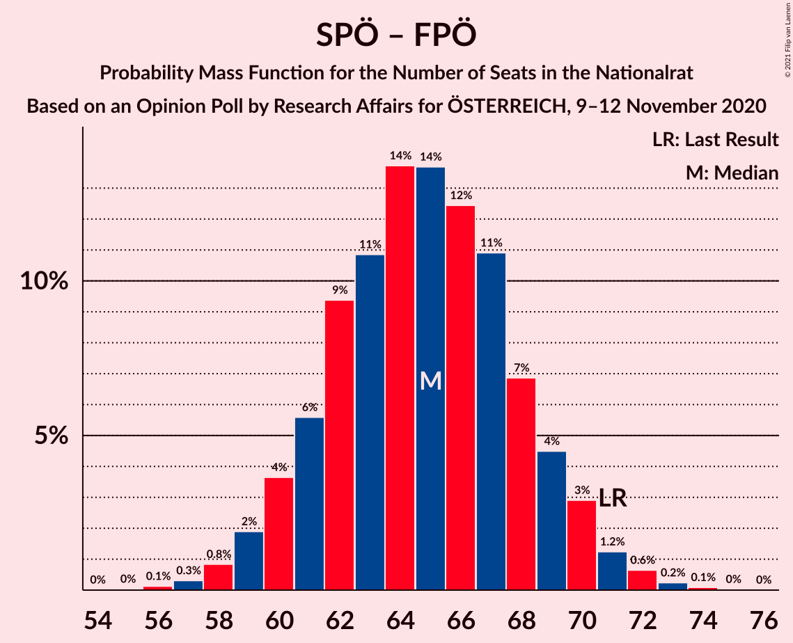

# Opinion Poll by Research Affairs for ÖSTERREICH, 9–12 November 2020

<a href="#voting-intentions">Voting Intentions</a> | <a href="#seats">Seats</a> | <a href="#coalitions">Coalitions</a> | <a href="#technical-information">Technical Information</a>

## Voting Intentions

### Confidence Intervals

| Party | Last Result | Poll Result | 80% Confidence Interval | 90% Confidence Interval | 95% Confidence Interval | 99% Confidence Interval |
|:-----:|:-----------:|:-----------:|:-----------------------:|:-----------------------:|:-----------------------:|:-----------------------:|
| Österreichische Volkspartei | 37.5% | 41.0% | 39.0–43.0% |38.5–43.6% |38.0–44.1% |37.1–45.1% |
| Sozialdemokratische Partei Österreichs | 21.2% | 22.0% | 20.4–23.7% |19.9–24.2% |19.5–24.7% |18.8–25.5% |
| Freiheitliche Partei Österreichs | 16.2% | 12.0% | 10.8–13.4% |10.4–13.8% |10.1–14.2% |9.6–14.9% |
| Die Grünen–Die Grüne Alternative | 13.9% | 11.0% | 9.8–12.4% |9.5–12.8% |9.2–13.1% |8.7–13.8% |
| NEOS–Das Neue Österreich und Liberales Forum | 8.1% | 10.0% | 8.9–11.3% |8.6–11.7% |8.3–12.0% |7.8–12.7% |
| Team HC Strache–Allianz für Österreich | 0.0% | 2.0% | 1.5–2.7% |1.4–2.9% |1.3–3.1% |1.1–3.4% |

*Note:* The poll result column reflects the actual value used in the calculations. Published results may vary slightly, and in addition be rounded to fewer digits.

## Seats

### Confidence Intervals

| Party | Last Result | Median | 80% Confidence Interval | 90% Confidence Interval | 95% Confidence Interval | 99% Confidence Interval |
|:-----:|:-----------:|:------:|:-----------------------:|:-----------------------:|:-----------------------:|:-----------------------:|
| <a href="#österreichische-volkspartei">Österreichische Volkspartei</a> | 71 | 78 | 75–82 |74–83 |73–84 |71–86 |
| <a href="#sozialdemokratische-partei-österreichs">Sozialdemokratische Partei Österreichs</a> | 40 | 42 | 39–45 |38–46 |37–47 |36–49 |
| <a href="#freiheitliche-partei-österreichs">Freiheitliche Partei Österreichs</a> | 31 | 23 | 20–25 |20–26 |19–27 |18–28 |
| <a href="#die-grünen–die-grüne-alternative">Die Grünen–Die Grüne Alternative</a> | 26 | 21 | 18–23 |18–24 |17–25 |16–26 |
| <a href="#neos–das-neue-österreich-und-liberales-forum">NEOS–Das Neue Österreich und Liberales Forum</a> | 15 | 19 | 17–21 |16–22 |15–23 |15–24 |
| <a href="#team-hc-strache–allianz-für-österreich">Team HC Strache–Allianz für Österreich</a> | 0 | 0 | 0 |0 |0 |0 |

### Österreichische Volkspartei

*For a full overview of the results for this party, see the [Österreichische Volkspartei](party-österreichischevolkspartei.html) page.*

| Number of Seats | Probability | Accumulated | Special Marks |
|:---------------:|:-----------:|:-----------:|:-------------:|
| 69 | 0.1% | 100% |  |
| 70 | 0.2% | 99.9% |  |
| 71 | 0.5% | 99.7% | Last Result |
| 72 | 1.2% | 99.2% |  |
| 73 | 2% | 98% |  |
| 74 | 4% | 96% |  |
| 75 | 7% | 91% |  |
| 76 | 10% | 85% |  |
| 77 | 12% | 75% |  |
| 78 | 13% | 63% | Median |
| 79 | 14% | 50% |  |
| 80 | 12% | 36% |  |
| 81 | 9% | 25% |  |
| 82 | 7% | 16% |  |
| 83 | 4% | 9% |  |
| 84 | 2% | 5% |  |
| 85 | 1.3% | 2% |  |
| 86 | 0.6% | 0.9% |  |
| 87 | 0.2% | 0.4% |  |
| 88 | 0.1% | 0.1% |  |
| 89 | 0% | 0% |  |

### Sozialdemokratische Partei Österreichs

*For a full overview of the results for this party, see the [Sozialdemokratische Partei Österreichs](party-sozialdemokratischeparteiösterreichs.html) page.*

| Number of Seats | Probability | Accumulated | Special Marks |
|:---------------:|:-----------:|:-----------:|:-------------:|
| 34 | 0.1% | 100% |  |
| 35 | 0.3% | 99.9% |  |
| 36 | 0.8% | 99.6% |  |
| 37 | 2% | 98.8% |  |
| 38 | 4% | 96% |  |
| 39 | 8% | 92% |  |
| 40 | 12% | 84% | Last Result |
| 41 | 14% | 72% |  |
| 42 | 15% | 58% | Median |
| 43 | 15% | 42% |  |
| 44 | 11% | 27% |  |
| 45 | 7% | 16% |  |
| 46 | 5% | 8% |  |
| 47 | 2% | 4% |  |
| 48 | 1.0% | 2% |  |
| 49 | 0.4% | 0.6% |  |
| 50 | 0.1% | 0.2% |  |
| 51 | 0% | 0.1% |  |
| 52 | 0% | 0% |  |

### Freiheitliche Partei Österreichs

*For a full overview of the results for this party, see the [Freiheitliche Partei Österreichs](party-freiheitlicheparteiösterreichs.html) page.*

| Number of Seats | Probability | Accumulated | Special Marks |
|:---------------:|:-----------:|:-----------:|:-------------:|
| 17 | 0.2% | 100% |  |
| 18 | 1.0% | 99.8% |  |
| 19 | 3% | 98.8% |  |
| 20 | 8% | 96% |  |
| 21 | 14% | 88% |  |
| 22 | 19% | 74% |  |
| 23 | 19% | 54% | Median |
| 24 | 17% | 35% |  |
| 25 | 10% | 19% |  |
| 26 | 5% | 9% |  |
| 27 | 2% | 3% |  |
| 28 | 0.8% | 1.1% |  |
| 29 | 0.2% | 0.3% |  |
| 30 | 0.1% | 0.1% |  |
| 31 | 0% | 0% | Last Result |

### Die Grünen–Die Grüne Alternative

*For a full overview of the results for this party, see the [Die Grünen–Die Grüne Alternative](party-diegrünen–diegrünealternative.html) page.*

| Number of Seats | Probability | Accumulated | Special Marks |
|:---------------:|:-----------:|:-----------:|:-------------:|
| 15 | 0.1% | 100% |  |
| 16 | 0.7% | 99.9% |  |
| 17 | 3% | 99.2% |  |
| 18 | 7% | 96% |  |
| 19 | 14% | 89% |  |
| 20 | 20% | 76% |  |
| 21 | 21% | 56% | Median |
| 22 | 16% | 35% |  |
| 23 | 11% | 19% |  |
| 24 | 5% | 8% |  |
| 25 | 2% | 3% |  |
| 26 | 0.7% | 1.0% | Last Result |
| 27 | 0.2% | 0.3% |  |
| 28 | 0% | 0.1% |  |
| 29 | 0% | 0% |  |

### NEOS–Das Neue Österreich und Liberales Forum

*For a full overview of the results for this party, see the [NEOS–Das Neue Österreich und Liberales Forum](party-neos–dasneueösterreichundliberalesforum.html) page.*

| Number of Seats | Probability | Accumulated | Special Marks |
|:---------------:|:-----------:|:-----------:|:-------------:|
| 13 | 0.1% | 100% |  |
| 14 | 0.4% | 99.9% |  |
| 15 | 2% | 99.5% | Last Result |
| 16 | 6% | 97% |  |
| 17 | 13% | 91% |  |
| 18 | 20% | 78% |  |
| 19 | 21% | 57% | Median |
| 20 | 17% | 36% |  |
| 21 | 10% | 19% |  |
| 22 | 5% | 8% |  |
| 23 | 2% | 3% |  |
| 24 | 0.7% | 0.9% |  |
| 25 | 0.2% | 0.2% |  |
| 26 | 0% | 0% |  |

### Team HC Strache–Allianz für Österreich

*For a full overview of the results for this party, see the [Team HC Strache–Allianz für Österreich](party-teamhcstrache–allianzfürösterreich.html) page.*

| Number of Seats | Probability | Accumulated | Special Marks |
|:---------------:|:-----------:|:-----------:|:-------------:|
| 0 | 100% | 100% | Last Result, Median |

## Coalitions

### Confidence Intervals

| Coalition | Last Result | Median | Majority? | 80% Confidence Interval | 90% Confidence Interval | 95% Confidence Interval | 99% Confidence Interval |
|:---------:|:-----------:|:------:|:---------:|:-----------------------:|:-----------------------:|:-----------------------:|:-----------------------:|
| Österreichische Volkspartei – Sozialdemokratische Partei Österreichs | 111 | 121 | 100% | 117–124 | 116–125 | 115–126 | 113–128 |
| Österreichische Volkspartei – Die Grünen–Die Grüne Alternative – NEOS–Das Neue Österreich und Liberales Forum | 112 | 118 | 100% | 115–122 | 113–123 | 113–124 | 111–125 |
| Österreichische Volkspartei – Freiheitliche Partei Österreichs | 102 | 101 | 99.9% | 97–105 | 96–106 | 95–107 | 94–109 |
| Österreichische Volkspartei – Die Grünen–Die Grüne Alternative | 97 | 99 | 99.6% | 95–103 | 94–104 | 93–105 | 92–107 |
| Österreichische Volkspartei – NEOS–Das Neue Österreich und Liberales Forum | 86 | 97 | 98% | 94–101 | 93–102 | 92–103 | 90–105 |
| Sozialdemokratische Partei Österreichs – Die Grünen–Die Grüne Alternative – NEOS–Das Neue Österreich und Liberales Forum | 81 | 82 | 0.1% | 78–86 | 77–87 | 76–88 | 74–89 |
| Österreichische Volkspartei | 71 | 78 | 0% | 75–82 | 74–83 | 73–84 | 71–86 |
| Sozialdemokratische Partei Österreichs – Freiheitliche Partei Österreichs | 71 | 65 | 0% | 61–68 | 60–70 | 59–70 | 58–72 |
| Sozialdemokratische Partei Österreichs – Die Grünen–Die Grüne Alternative | 66 | 63 | 0% | 59–66 | 58–68 | 57–68 | 56–70 |
| Sozialdemokratische Partei Österreichs | 40 | 42 | 0% | 39–45 | 38–46 | 37–47 | 36–49 |

### Österreichische Volkspartei – Sozialdemokratische Partei Österreichs

| Number of Seats | Probability | Accumulated | Special Marks |
|:---------------:|:-----------:|:-----------:|:-------------:|
| 111 | 0.1% | 100% | Last Result |
| 112 | 0.2% | 99.9% |  |
| 113 | 0.5% | 99.7% |  |
| 114 | 1.1% | 99.2% |  |
| 115 | 2% | 98% |  |
| 116 | 4% | 96% |  |
| 117 | 7% | 92% |  |
| 118 | 9% | 85% |  |
| 119 | 12% | 76% |  |
| 120 | 13% | 64% | Median |
| 121 | 14% | 51% |  |
| 122 | 12% | 36% |  |
| 123 | 10% | 25% |  |
| 124 | 7% | 14% |  |
| 125 | 4% | 8% |  |
| 126 | 2% | 4% |  |
| 127 | 1.0% | 2% |  |
| 128 | 0.4% | 0.6% |  |
| 129 | 0.1% | 0.2% |  |
| 130 | 0% | 0.1% |  |
| 131 | 0% | 0% |  |

### Österreichische Volkspartei – Die Grünen–Die Grüne Alternative – NEOS–Das Neue Österreich und Liberales Forum

| Number of Seats | Probability | Accumulated | Special Marks |
|:---------------:|:-----------:|:-----------:|:-------------:|
| 109 | 0.1% | 100% |  |
| 110 | 0.2% | 99.9% |  |
| 111 | 0.7% | 99.6% |  |
| 112 | 1.2% | 99.0% | Last Result |
| 113 | 3% | 98% |  |
| 114 | 5% | 95% |  |
| 115 | 7% | 90% |  |
| 116 | 11% | 83% |  |
| 117 | 12% | 73% |  |
| 118 | 14% | 60% | Median |
| 119 | 14% | 46% |  |
| 120 | 11% | 33% |  |
| 121 | 9% | 22% |  |
| 122 | 6% | 12% |  |
| 123 | 4% | 7% |  |
| 124 | 2% | 3% |  |
| 125 | 0.8% | 1.3% |  |
| 126 | 0.3% | 0.5% |  |
| 127 | 0.1% | 0.2% |  |
| 128 | 0% | 0.1% |  |
| 129 | 0% | 0% |  |

### Österreichische Volkspartei – Freiheitliche Partei Österreichs

| Number of Seats | Probability | Accumulated | Special Marks |
|:---------------:|:-----------:|:-----------:|:-------------:|
| 91 | 0% | 100% |  |
| 92 | 0.1% | 99.9% | Majority |
| 93 | 0.3% | 99.8% |  |
| 94 | 0.8% | 99.5% |  |
| 95 | 1.4% | 98.7% |  |
| 96 | 3% | 97% |  |
| 97 | 5% | 95% |  |
| 98 | 8% | 90% |  |
| 99 | 10% | 82% |  |
| 100 | 12% | 72% |  |
| 101 | 14% | 60% | Median |
| 102 | 12% | 46% | Last Result |
| 103 | 11% | 34% |  |
| 104 | 9% | 23% |  |
| 105 | 6% | 14% |  |
| 106 | 4% | 8% |  |
| 107 | 2% | 4% |  |
| 108 | 1.1% | 2% |  |
| 109 | 0.4% | 0.7% |  |
| 110 | 0.2% | 0.3% |  |
| 111 | 0.1% | 0.1% |  |
| 112 | 0% | 0% |  |

### Österreichische Volkspartei – Die Grünen–Die Grüne Alternative

| Number of Seats | Probability | Accumulated | Special Marks |
|:---------------:|:-----------:|:-----------:|:-------------:|
| 89 | 0% | 100% |  |
| 90 | 0.1% | 99.9% |  |
| 91 | 0.3% | 99.8% |  |
| 92 | 0.7% | 99.6% | Majority |
| 93 | 1.4% | 98.9% |  |
| 94 | 3% | 97% |  |
| 95 | 5% | 95% |  |
| 96 | 7% | 90% |  |
| 97 | 9% | 83% | Last Result |
| 98 | 12% | 73% |  |
| 99 | 14% | 61% | Median |
| 100 | 13% | 47% |  |
| 101 | 11% | 35% |  |
| 102 | 9% | 23% |  |
| 103 | 7% | 14% |  |
| 104 | 4% | 8% |  |
| 105 | 2% | 4% |  |
| 106 | 1.2% | 2% |  |
| 107 | 0.5% | 0.8% |  |
| 108 | 0.2% | 0.3% |  |
| 109 | 0.1% | 0.1% |  |
| 110 | 0% | 0% |  |

### Österreichische Volkspartei – NEOS–Das Neue Österreich und Liberales Forum

| Number of Seats | Probability | Accumulated | Special Marks |
|:---------------:|:-----------:|:-----------:|:-------------:|
| 86 | 0% | 100% | Last Result |
| 87 | 0% | 100% |  |
| 88 | 0.1% | 99.9% |  |
| 89 | 0.3% | 99.9% |  |
| 90 | 0.6% | 99.6% |  |
| 91 | 1.5% | 99.0% |  |
| 92 | 3% | 98% | Majority |
| 93 | 5% | 95% |  |
| 94 | 7% | 90% |  |
| 95 | 10% | 83% |  |
| 96 | 12% | 74% |  |
| 97 | 12% | 62% | Median |
| 98 | 15% | 49% |  |
| 99 | 10% | 34% |  |
| 100 | 10% | 25% |  |
| 101 | 6% | 15% |  |
| 102 | 4% | 9% |  |
| 103 | 2% | 4% |  |
| 104 | 1.4% | 2% |  |
| 105 | 0.5% | 0.9% |  |
| 106 | 0.2% | 0.3% |  |
| 107 | 0.1% | 0.1% |  |
| 108 | 0% | 0% |  |

### Sozialdemokratische Partei Österreichs – Die Grünen–Die Grüne Alternative – NEOS–Das Neue Österreich und Liberales Forum

| Number of Seats | Probability | Accumulated | Special Marks |
|:---------------:|:-----------:|:-----------:|:-------------:|
| 72 | 0.1% | 100% |  |
| 73 | 0.2% | 99.9% |  |
| 74 | 0.4% | 99.7% |  |
| 75 | 1.1% | 99.3% |  |
| 76 | 2% | 98% |  |
| 77 | 4% | 96% |  |
| 78 | 6% | 92% |  |
| 79 | 9% | 86% |  |
| 80 | 11% | 77% |  |
| 81 | 12% | 66% | Last Result |
| 82 | 14% | 53% | Median |
| 83 | 12% | 40% |  |
| 84 | 10% | 28% |  |
| 85 | 8% | 18% |  |
| 86 | 5% | 10% |  |
| 87 | 3% | 5% |  |
| 88 | 1.4% | 3% |  |
| 89 | 0.8% | 1.3% |  |
| 90 | 0.3% | 0.5% |  |
| 91 | 0.1% | 0.2% |  |
| 92 | 0% | 0.1% | Majority |
| 93 | 0% | 0% |  |

### Österreichische Volkspartei

| Number of Seats | Probability | Accumulated | Special Marks |
|:---------------:|:-----------:|:-----------:|:-------------:|
| 69 | 0.1% | 100% |  |
| 70 | 0.2% | 99.9% |  |
| 71 | 0.5% | 99.7% | Last Result |
| 72 | 1.2% | 99.2% |  |
| 73 | 2% | 98% |  |
| 74 | 4% | 96% |  |
| 75 | 7% | 91% |  |
| 76 | 10% | 85% |  |
| 77 | 12% | 75% |  |
| 78 | 13% | 63% | Median |
| 79 | 14% | 50% |  |
| 80 | 12% | 36% |  |
| 81 | 9% | 25% |  |
| 82 | 7% | 16% |  |
| 83 | 4% | 9% |  |
| 84 | 2% | 5% |  |
| 85 | 1.3% | 2% |  |
| 86 | 0.6% | 0.9% |  |
| 87 | 0.2% | 0.4% |  |
| 88 | 0.1% | 0.1% |  |
| 89 | 0% | 0% |  |

### Sozialdemokratische Partei Österreichs – Freiheitliche Partei Österreichs

| Number of Seats | Probability | Accumulated | Special Marks |
|:---------------:|:-----------:|:-----------:|:-------------:|
| 55 | 0% | 100% |  |
| 56 | 0.1% | 99.9% |  |
| 57 | 0.3% | 99.8% |  |
| 58 | 0.8% | 99.5% |  |
| 59 | 2% | 98.7% |  |
| 60 | 4% | 97% |  |
| 61 | 6% | 93% |  |
| 62 | 9% | 88% |  |
| 63 | 11% | 78% |  |
| 64 | 14% | 67% |  |
| 65 | 14% | 54% | Median |
| 66 | 12% | 40% |  |
| 67 | 11% | 27% |  |
| 68 | 7% | 17% |  |
| 69 | 4% | 10% |  |
| 70 | 3% | 5% |  |
| 71 | 1.2% | 2% | Last Result |
| 72 | 0.6% | 1.0% |  |
| 73 | 0.2% | 0.4% |  |
| 74 | 0.1% | 0.1% |  |
| 75 | 0% | 0% |  |

### Sozialdemokratische Partei Österreichs – Die Grünen–Die Grüne Alternative

| Number of Seats | Probability | Accumulated | Special Marks |
|:---------------:|:-----------:|:-----------:|:-------------:|
| 54 | 0.1% | 100% |  |
| 55 | 0.3% | 99.9% |  |
| 56 | 0.8% | 99.6% |  |
| 57 | 2% | 98.8% |  |
| 58 | 3% | 97% |  |
| 59 | 6% | 94% |  |
| 60 | 9% | 88% |  |
| 61 | 11% | 79% |  |
| 62 | 14% | 68% |  |
| 63 | 13% | 54% | Median |
| 64 | 13% | 41% |  |
| 65 | 11% | 28% |  |
| 66 | 7% | 17% | Last Result |
| 67 | 5% | 10% |  |
| 68 | 3% | 5% |  |
| 69 | 1.4% | 2% |  |
| 70 | 0.6% | 1.0% |  |
| 71 | 0.3% | 0.4% |  |
| 72 | 0.1% | 0.1% |  |
| 73 | 0% | 0% |  |

### Sozialdemokratische Partei Österreichs

| Number of Seats | Probability | Accumulated | Special Marks |
|:---------------:|:-----------:|:-----------:|:-------------:|
| 34 | 0.1% | 100% |  |
| 35 | 0.3% | 99.9% |  |
| 36 | 0.8% | 99.6% |  |
| 37 | 2% | 98.8% |  |
| 38 | 4% | 96% |  |
| 39 | 8% | 92% |  |
| 40 | 12% | 84% | Last Result |
| 41 | 14% | 72% |  |
| 42 | 15% | 58% | Median |
| 43 | 15% | 42% |  |
| 44 | 11% | 27% |  |
| 45 | 7% | 16% |  |
| 46 | 5% | 8% |  |
| 47 | 2% | 4% |  |
| 48 | 1.0% | 2% |  |
| 49 | 0.4% | 0.6% |  |
| 50 | 0.1% | 0.2% |  |
| 51 | 0% | 0.1% |  |
| 52 | 0% | 0% |  |

## Technical Information

### Opinion Poll

+ **Polling firm:** Research Affairs
+ **Commissioner(s):** ÖSTERREICH
+ **Fieldwork period:** 9–12 November 2020

### Calculations

+ **Sample size:** 1000
+ **Simulations done:** 1,048,576
+ **Error estimate:** 0.64%

