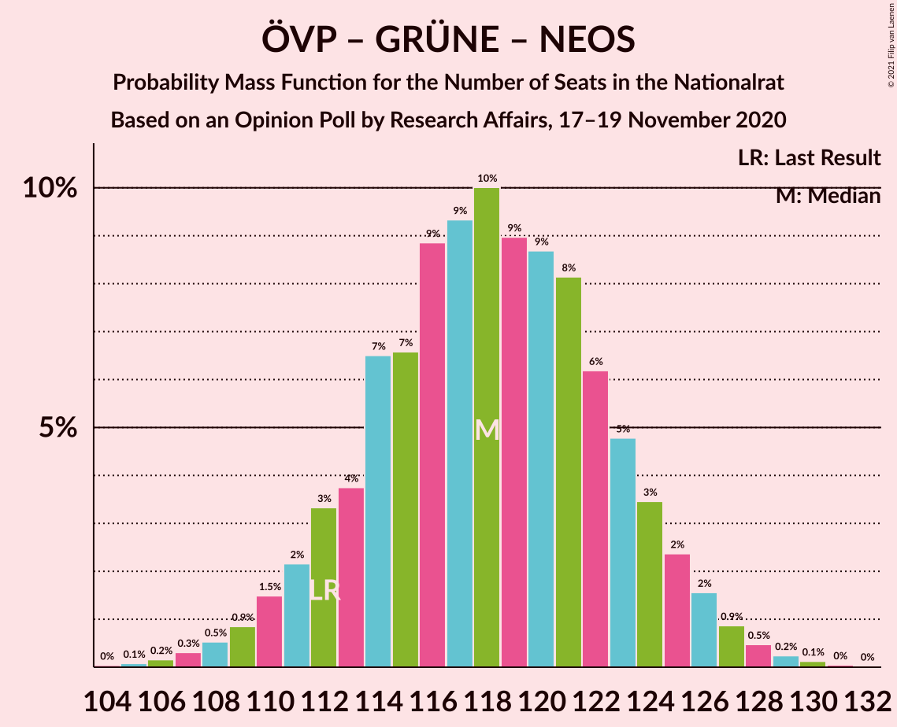
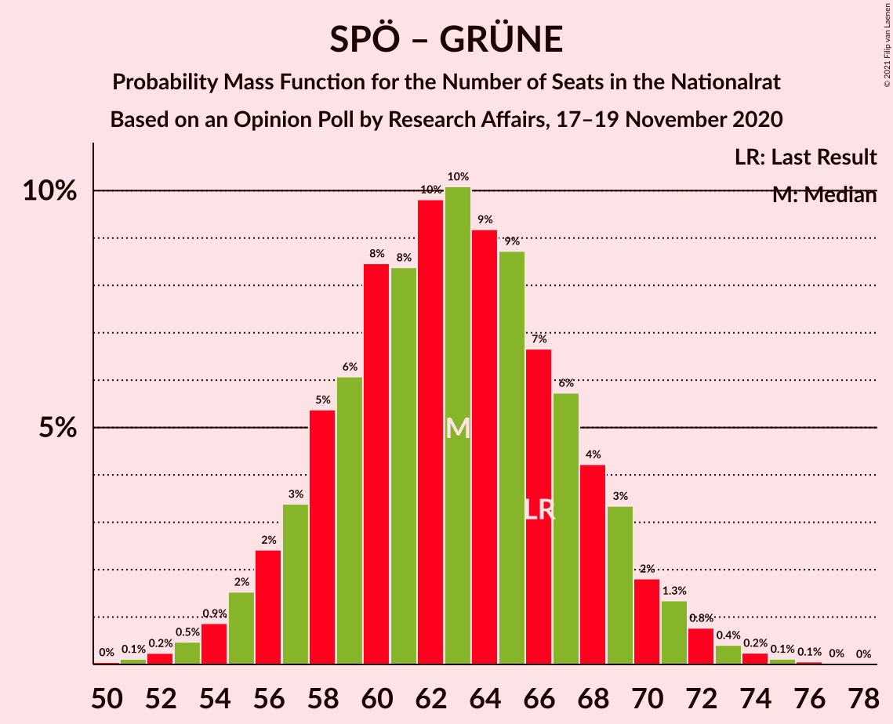

# Opinion Poll by Research Affairs, 17–19 November 2020

<a href="#voting-intentions">Voting Intentions</a> | <a href="#seats">Seats</a> | <a href="#coalitions">Coalitions</a> | <a href="#technical-information">Technical Information</a>

## Voting Intentions

### Confidence Intervals

| Party | Last Result | Poll Result | 80% Confidence Interval | 90% Confidence Interval | 95% Confidence Interval | 99% Confidence Interval |
|:-----:|:-----------:|:-----------:|:-----------------------:|:-----------------------:|:-----------------------:|:-----------------------:|
| Österreichische Volkspartei | 37.5% | 40.9% | 38.1–43.8% |37.4–44.6% |36.7–45.3% |35.4–46.7% |
| Sozialdemokratische Partei Österreichs | 21.2% | 22.0% | 19.7–24.5% |19.1–25.2% |18.5–25.8% |17.5–27.0% |
| Freiheitliche Partei Österreichs | 16.2% | 12.0% | 10.3–14.0% |9.8–14.6% |9.4–15.1% |8.7–16.2% |
| Die Grünen–Die Grüne Alternative | 13.9% | 11.0% | 9.4–13.0% |8.9–13.5% |8.5–14.0% |7.8–15.0% |
| NEOS–Das Neue Österreich und Liberales Forum | 8.1% | 10.0% | 8.4–11.9% |8.0–12.5% |7.7–12.9% |7.0–13.9% |
| Team HC Strache–Allianz für Österreich | 0.0% | 2.0% | 1.4–3.1% |1.2–3.4% |1.1–3.6% |0.9–4.2% |

*Note:* The poll result column reflects the actual value used in the calculations. Published results may vary slightly, and in addition be rounded to fewer digits.

## Seats

### Confidence Intervals

| Party | Last Result | Median | 80% Confidence Interval | 90% Confidence Interval | 95% Confidence Interval | 99% Confidence Interval |
|:-----:|:-----------:|:------:|:-----------------------:|:-----------------------:|:-----------------------:|:-----------------------:|
| <a href="#österreichische-volkspartei">Österreichische Volkspartei</a> | 71 | 78 | 73–84 |71–85 |70–86 |67–89 |
| <a href="#sozialdemokratische-partei-österreichs">Sozialdemokratische Partei Österreichs</a> | 40 | 42 | 37–47 |36–48 |35–49 |33–51 |
| <a href="#freiheitliche-partei-österreichs">Freiheitliche Partei Österreichs</a> | 31 | 23 | 19–26 |18–28 |18–29 |16–31 |
| <a href="#die-grünen–die-grüne-alternative">Die Grünen–Die Grüne Alternative</a> | 26 | 21 | 18–24 |17–25 |16–26 |15–28 |
| <a href="#neos–das-neue-österreich-und-liberales-forum">NEOS–Das Neue Österreich und Liberales Forum</a> | 15 | 19 | 16–22 |15–23 |14–24 |13–26 |
| <a href="#team-hc-strache–allianz-für-österreich">Team HC Strache–Allianz für Österreich</a> | 0 | 0 | 0 |0 |0 |0–7 |

### Österreichische Volkspartei

*For a full overview of the results for this party, see the [Österreichische Volkspartei](party-österreichischevolkspartei.html) page.*

| Number of Seats | Probability | Accumulated | Special Marks |
|:---------------:|:-----------:|:-----------:|:-------------:|
| 65 | 0.1% | 100% |  |
| 66 | 0.1% | 99.9% |  |
| 67 | 0.3% | 99.8% |  |
| 68 | 0.5% | 99.5% |  |
| 69 | 0.8% | 99.0% |  |
| 70 | 1.5% | 98% |  |
| 71 | 2% | 97% | Last Result |
| 72 | 3% | 94% |  |
| 73 | 4% | 91% |  |
| 74 | 6% | 87% |  |
| 75 | 7% | 81% |  |
| 76 | 8% | 73% |  |
| 77 | 9% | 65% |  |
| 78 | 9% | 57% | Median |
| 79 | 10% | 48% |  |
| 80 | 9% | 38% |  |
| 81 | 7% | 29% |  |
| 82 | 6% | 21% |  |
| 83 | 5% | 16% |  |
| 84 | 4% | 10% |  |
| 85 | 3% | 7% |  |
| 86 | 2% | 4% |  |
| 87 | 1.0% | 2% |  |
| 88 | 0.7% | 1.4% |  |
| 89 | 0.4% | 0.7% |  |
| 90 | 0.2% | 0.3% |  |
| 91 | 0.1% | 0.2% |  |
| 92 | 0% | 0.1% | Majority |
| 93 | 0% | 0% |  |

### Sozialdemokratische Partei Österreichs

*For a full overview of the results for this party, see the [Sozialdemokratische Partei Österreichs](party-sozialdemokratischeparteiösterreichs.html) page.*

| Number of Seats | Probability | Accumulated | Special Marks |
|:---------------:|:-----------:|:-----------:|:-------------:|
| 31 | 0.1% | 100% |  |
| 32 | 0.2% | 99.9% |  |
| 33 | 0.4% | 99.7% |  |
| 34 | 0.8% | 99.3% |  |
| 35 | 2% | 98.5% |  |
| 36 | 3% | 97% |  |
| 37 | 5% | 94% |  |
| 38 | 6% | 89% |  |
| 39 | 8% | 83% |  |
| 40 | 10% | 75% | Last Result |
| 41 | 11% | 65% |  |
| 42 | 10% | 54% | Median |
| 43 | 11% | 43% |  |
| 44 | 9% | 32% |  |
| 45 | 8% | 23% |  |
| 46 | 5% | 15% |  |
| 47 | 4% | 10% |  |
| 48 | 3% | 6% |  |
| 49 | 2% | 4% |  |
| 50 | 0.9% | 2% |  |
| 51 | 0.5% | 1.0% |  |
| 52 | 0.2% | 0.5% |  |
| 53 | 0.1% | 0.2% |  |
| 54 | 0.1% | 0.1% |  |
| 55 | 0% | 0% |  |

### Freiheitliche Partei Österreichs

*For a full overview of the results for this party, see the [Freiheitliche Partei Österreichs](party-freiheitlicheparteiösterreichs.html) page.*

| Number of Seats | Probability | Accumulated | Special Marks |
|:---------------:|:-----------:|:-----------:|:-------------:|
| 15 | 0.2% | 100% |  |
| 16 | 0.6% | 99.8% |  |
| 17 | 1.5% | 99.2% |  |
| 18 | 3% | 98% |  |
| 19 | 6% | 95% |  |
| 20 | 9% | 89% |  |
| 21 | 13% | 80% |  |
| 22 | 14% | 67% |  |
| 23 | 14% | 53% | Median |
| 24 | 12% | 39% |  |
| 25 | 10% | 27% |  |
| 26 | 7% | 17% |  |
| 27 | 4% | 10% |  |
| 28 | 3% | 5% |  |
| 29 | 1.4% | 3% |  |
| 30 | 0.7% | 1.2% |  |
| 31 | 0.3% | 0.5% | Last Result |
| 32 | 0.1% | 0.2% |  |
| 33 | 0% | 0.1% |  |
| 34 | 0% | 0% |  |

### Die Grünen–Die Grüne Alternative

*For a full overview of the results for this party, see the [Die Grünen–Die Grüne Alternative](party-diegrünen–diegrünealternative.html) page.*

| Number of Seats | Probability | Accumulated | Special Marks |
|:---------------:|:-----------:|:-----------:|:-------------:|
| 13 | 0.1% | 100% |  |
| 14 | 0.4% | 99.9% |  |
| 15 | 1.1% | 99.5% |  |
| 16 | 3% | 98% |  |
| 17 | 5% | 96% |  |
| 18 | 9% | 90% |  |
| 19 | 12% | 81% |  |
| 20 | 15% | 69% |  |
| 21 | 15% | 54% | Median |
| 22 | 13% | 39% |  |
| 23 | 10% | 27% |  |
| 24 | 7% | 17% |  |
| 25 | 5% | 9% |  |
| 26 | 2% | 5% | Last Result |
| 27 | 1.4% | 2% |  |
| 28 | 0.6% | 1.0% |  |
| 29 | 0.3% | 0.5% |  |
| 30 | 0.1% | 0.2% |  |
| 31 | 0% | 0.1% |  |
| 32 | 0% | 0% |  |

### NEOS–Das Neue Österreich und Liberales Forum

*For a full overview of the results for this party, see the [NEOS–Das Neue Österreich und Liberales Forum](party-neos–dasneueösterreichundliberalesforum.html) page.*

| Number of Seats | Probability | Accumulated | Special Marks |
|:---------------:|:-----------:|:-----------:|:-------------:|
| 11 | 0% | 100% |  |
| 12 | 0.2% | 99.9% |  |
| 13 | 0.8% | 99.7% |  |
| 14 | 2% | 98.9% |  |
| 15 | 5% | 97% | Last Result |
| 16 | 9% | 92% |  |
| 17 | 12% | 83% |  |
| 18 | 15% | 71% |  |
| 19 | 16% | 56% | Median |
| 20 | 14% | 41% |  |
| 21 | 10% | 27% |  |
| 22 | 7% | 16% |  |
| 23 | 4% | 9% |  |
| 24 | 3% | 5% |  |
| 25 | 1.2% | 2% |  |
| 26 | 0.6% | 1.0% |  |
| 27 | 0.2% | 0.4% |  |
| 28 | 0.1% | 0.1% |  |
| 29 | 0% | 0% |  |

### Team HC Strache–Allianz für Österreich

*For a full overview of the results for this party, see the [Team HC Strache–Allianz für Österreich](party-teamhcstrache–allianzfürösterreich.html) page.*

| Number of Seats | Probability | Accumulated | Special Marks |
|:---------------:|:-----------:|:-----------:|:-------------:|
| 0 | 99.2% | 100% | Last Result, Median |
| 1 | 0% | 0.8% |  |
| 2 | 0% | 0.8% |  |
| 3 | 0% | 0.8% |  |
| 4 | 0% | 0.8% |  |
| 5 | 0% | 0.8% |  |
| 6 | 0% | 0.8% |  |
| 7 | 0.4% | 0.8% |  |
| 8 | 0.4% | 0.5% |  |
| 9 | 0.1% | 0.1% |  |
| 10 | 0% | 0% |  |

## Coalitions

### Confidence Intervals

| Coalition | Last Result | Median | Majority? | 80% Confidence Interval | 90% Confidence Interval | 95% Confidence Interval | 99% Confidence Interval |
|:---------:|:-----------:|:------:|:---------:|:-----------------------:|:-----------------------:|:-----------------------:|:-----------------------:|
| Österreichische Volkspartei – Sozialdemokratische Partei Österreichs | 111 | 120 | 100% | 115–125 | 113–127 | 112–128 | 109–130 |
| Österreichische Volkspartei – Die Grünen–Die Grüne Alternative – NEOS–Das Neue Österreich und Liberales Forum | 112 | 118 | 100% | 113–123 | 111–125 | 110–126 | 107–128 |
| Österreichische Volkspartei – Freiheitliche Partei Österreichs | 102 | 101 | 98.7% | 96–106 | 94–108 | 93–109 | 90–112 |
| Österreichische Volkspartei – Die Grünen–Die Grüne Alternative | 97 | 99 | 96% | 94–105 | 92–106 | 91–107 | 88–110 |
| Österreichische Volkspartei – NEOS–Das Neue Österreich und Liberales Forum | 86 | 97 | 91% | 92–103 | 90–104 | 89–105 | 86–108 |
| Sozialdemokratische Partei Österreichs – Die Grünen–Die Grüne Alternative – NEOS–Das Neue Österreich und Liberales Forum | 81 | 82 | 1.1% | 76–87 | 75–89 | 74–90 | 71–93 |
| Österreichische Volkspartei | 71 | 78 | 0.1% | 73–84 | 71–85 | 70–86 | 67–89 |
| Sozialdemokratische Partei Österreichs – Freiheitliche Partei Österreichs | 71 | 65 | 0% | 60–70 | 58–71 | 57–73 | 54–75 |
| Sozialdemokratische Partei Österreichs – Die Grünen–Die Grüne Alternative | 66 | 63 | 0% | 58–68 | 56–69 | 55–71 | 53–73 |
| Sozialdemokratische Partei Österreichs | 40 | 42 | 0% | 37–47 | 36–48 | 35–49 | 33–51 |

### Österreichische Volkspartei – Sozialdemokratische Partei Österreichs

| Number of Seats | Probability | Accumulated | Special Marks |
|:---------------:|:-----------:|:-----------:|:-------------:|
| 106 | 0% | 100% |  |
| 107 | 0.1% | 99.9% |  |
| 108 | 0.2% | 99.8% |  |
| 109 | 0.3% | 99.7% |  |
| 110 | 0.5% | 99.4% |  |
| 111 | 0.9% | 98.9% | Last Result |
| 112 | 1.5% | 98% |  |
| 113 | 2% | 97% |  |
| 114 | 3% | 94% |  |
| 115 | 4% | 91% |  |
| 116 | 6% | 87% |  |
| 117 | 7% | 81% |  |
| 118 | 8% | 74% |  |
| 119 | 9% | 66% |  |
| 120 | 10% | 57% | Median |
| 121 | 10% | 47% |  |
| 122 | 8% | 37% |  |
| 123 | 8% | 28% |  |
| 124 | 7% | 21% |  |
| 125 | 5% | 14% |  |
| 126 | 3% | 9% |  |
| 127 | 2% | 6% |  |
| 128 | 2% | 3% |  |
| 129 | 0.9% | 2% |  |
| 130 | 0.5% | 0.9% |  |
| 131 | 0.2% | 0.4% |  |
| 132 | 0.1% | 0.2% |  |
| 133 | 0% | 0.1% |  |
| 134 | 0% | 0% |  |

### Österreichische Volkspartei – Die Grünen–Die Grüne Alternative – NEOS–Das Neue Österreich und Liberales Forum

| Number of Seats | Probability | Accumulated | Special Marks |
|:---------------:|:-----------:|:-----------:|:-------------:|
| 104 | 0% | 100% |  |
| 105 | 0.1% | 99.9% |  |
| 106 | 0.2% | 99.8% |  |
| 107 | 0.3% | 99.7% |  |
| 108 | 0.5% | 99.4% |  |
| 109 | 0.9% | 98.8% |  |
| 110 | 1.5% | 98% |  |
| 111 | 2% | 96% |  |
| 112 | 3% | 94% | Last Result |
| 113 | 4% | 91% |  |
| 114 | 7% | 87% |  |
| 115 | 7% | 81% |  |
| 116 | 9% | 74% |  |
| 117 | 9% | 65% |  |
| 118 | 10% | 56% | Median |
| 119 | 9% | 46% |  |
| 120 | 9% | 37% |  |
| 121 | 8% | 28% |  |
| 122 | 6% | 20% |  |
| 123 | 5% | 14% |  |
| 124 | 3% | 9% |  |
| 125 | 2% | 6% |  |
| 126 | 2% | 3% |  |
| 127 | 0.9% | 2% |  |
| 128 | 0.5% | 0.9% |  |
| 129 | 0.2% | 0.4% |  |
| 130 | 0.1% | 0.2% |  |
| 131 | 0% | 0.1% |  |
| 132 | 0% | 0% |  |

### Österreichische Volkspartei – Freiheitliche Partei Österreichs

| Number of Seats | Probability | Accumulated | Special Marks |
|:---------------:|:-----------:|:-----------:|:-------------:|
| 87 | 0% | 100% |  |
| 88 | 0.1% | 99.9% |  |
| 89 | 0.2% | 99.8% |  |
| 90 | 0.4% | 99.6% |  |
| 91 | 0.6% | 99.3% |  |
| 92 | 1.0% | 98.7% | Majority |
| 93 | 2% | 98% |  |
| 94 | 3% | 96% |  |
| 95 | 3% | 94% |  |
| 96 | 5% | 90% |  |
| 97 | 6% | 86% |  |
| 98 | 8% | 80% |  |
| 99 | 8% | 72% |  |
| 100 | 9% | 64% |  |
| 101 | 9% | 55% | Median |
| 102 | 9% | 45% | Last Result |
| 103 | 9% | 37% |  |
| 104 | 7% | 28% |  |
| 105 | 7% | 21% |  |
| 106 | 4% | 14% |  |
| 107 | 4% | 10% |  |
| 108 | 2% | 6% |  |
| 109 | 2% | 4% |  |
| 110 | 0.9% | 2% |  |
| 111 | 0.6% | 1.2% |  |
| 112 | 0.3% | 0.6% |  |
| 113 | 0.2% | 0.3% |  |
| 114 | 0.1% | 0.1% |  |
| 115 | 0% | 0.1% |  |
| 116 | 0% | 0% |  |

### Österreichische Volkspartei – Die Grünen–Die Grüne Alternative

| Number of Seats | Probability | Accumulated | Special Marks |
|:---------------:|:-----------:|:-----------:|:-------------:|
| 85 | 0% | 100% |  |
| 86 | 0.1% | 99.9% |  |
| 87 | 0.2% | 99.8% |  |
| 88 | 0.3% | 99.7% |  |
| 89 | 0.5% | 99.3% |  |
| 90 | 1.0% | 98.8% |  |
| 91 | 2% | 98% |  |
| 92 | 2% | 96% | Majority |
| 93 | 3% | 94% |  |
| 94 | 5% | 91% |  |
| 95 | 5% | 86% |  |
| 96 | 7% | 80% |  |
| 97 | 9% | 73% | Last Result |
| 98 | 9% | 65% |  |
| 99 | 10% | 56% | Median |
| 100 | 9% | 46% |  |
| 101 | 9% | 37% |  |
| 102 | 7% | 28% |  |
| 103 | 6% | 21% |  |
| 104 | 5% | 15% |  |
| 105 | 4% | 10% |  |
| 106 | 3% | 7% |  |
| 107 | 2% | 4% |  |
| 108 | 1.0% | 2% |  |
| 109 | 0.7% | 1.3% |  |
| 110 | 0.3% | 0.6% |  |
| 111 | 0.2% | 0.3% |  |
| 112 | 0.1% | 0.2% |  |
| 113 | 0% | 0.1% |  |
| 114 | 0% | 0% |  |

### Österreichische Volkspartei – NEOS–Das Neue Österreich und Liberales Forum

| Number of Seats | Probability | Accumulated | Special Marks |
|:---------------:|:-----------:|:-----------:|:-------------:|
| 83 | 0% | 100% |  |
| 84 | 0.1% | 99.9% |  |
| 85 | 0.2% | 99.8% |  |
| 86 | 0.3% | 99.7% | Last Result |
| 87 | 0.6% | 99.4% |  |
| 88 | 0.9% | 98.8% |  |
| 89 | 1.5% | 98% |  |
| 90 | 2% | 96% |  |
| 91 | 3% | 94% |  |
| 92 | 5% | 91% | Majority |
| 93 | 6% | 86% |  |
| 94 | 7% | 81% |  |
| 95 | 9% | 74% |  |
| 96 | 8% | 65% |  |
| 97 | 10% | 57% | Median |
| 98 | 9% | 47% |  |
| 99 | 9% | 38% |  |
| 100 | 7% | 29% |  |
| 101 | 6% | 22% |  |
| 102 | 5% | 16% |  |
| 103 | 4% | 10% |  |
| 104 | 3% | 7% |  |
| 105 | 2% | 4% |  |
| 106 | 1.1% | 2% |  |
| 107 | 0.6% | 1.4% |  |
| 108 | 0.4% | 0.7% |  |
| 109 | 0.2% | 0.4% |  |
| 110 | 0.1% | 0.2% |  |
| 111 | 0% | 0.1% |  |
| 112 | 0% | 0% |  |

### Sozialdemokratische Partei Österreichs – Die Grünen–Die Grüne Alternative – NEOS–Das Neue Österreich und Liberales Forum

| Number of Seats | Probability | Accumulated | Special Marks |
|:---------------:|:-----------:|:-----------:|:-------------:|
| 68 | 0% | 100% |  |
| 69 | 0.1% | 99.9% |  |
| 70 | 0.2% | 99.8% |  |
| 71 | 0.3% | 99.6% |  |
| 72 | 0.7% | 99.3% |  |
| 73 | 1.0% | 98.6% |  |
| 74 | 2% | 98% |  |
| 75 | 2% | 96% |  |
| 76 | 4% | 93% |  |
| 77 | 5% | 89% |  |
| 78 | 7% | 85% |  |
| 79 | 7% | 78% |  |
| 80 | 9% | 70% |  |
| 81 | 9% | 62% | Last Result |
| 82 | 9% | 53% | Median |
| 83 | 9% | 44% |  |
| 84 | 8% | 34% |  |
| 85 | 8% | 26% |  |
| 86 | 5% | 19% |  |
| 87 | 4% | 13% |  |
| 88 | 3% | 9% |  |
| 89 | 2% | 6% |  |
| 90 | 1.4% | 3% |  |
| 91 | 0.8% | 2% |  |
| 92 | 0.5% | 1.1% | Majority |
| 93 | 0.3% | 0.6% |  |
| 94 | 0.1% | 0.3% |  |
| 95 | 0.1% | 0.1% |  |
| 96 | 0% | 0.1% |  |
| 97 | 0% | 0% |  |

### Österreichische Volkspartei

| Number of Seats | Probability | Accumulated | Special Marks |
|:---------------:|:-----------:|:-----------:|:-------------:|
| 65 | 0.1% | 100% |  |
| 66 | 0.1% | 99.9% |  |
| 67 | 0.3% | 99.8% |  |
| 68 | 0.5% | 99.5% |  |
| 69 | 0.8% | 99.0% |  |
| 70 | 1.5% | 98% |  |
| 71 | 2% | 97% | Last Result |
| 72 | 3% | 94% |  |
| 73 | 4% | 91% |  |
| 74 | 6% | 87% |  |
| 75 | 7% | 81% |  |
| 76 | 8% | 73% |  |
| 77 | 9% | 65% |  |
| 78 | 9% | 57% | Median |
| 79 | 10% | 48% |  |
| 80 | 9% | 38% |  |
| 81 | 7% | 29% |  |
| 82 | 6% | 21% |  |
| 83 | 5% | 16% |  |
| 84 | 4% | 10% |  |
| 85 | 3% | 7% |  |
| 86 | 2% | 4% |  |
| 87 | 1.0% | 2% |  |
| 88 | 0.7% | 1.4% |  |
| 89 | 0.4% | 0.7% |  |
| 90 | 0.2% | 0.3% |  |
| 91 | 0.1% | 0.2% |  |
| 92 | 0% | 0.1% | Majority |
| 93 | 0% | 0% |  |

### Sozialdemokratische Partei Österreichs – Freiheitliche Partei Österreichs

| Number of Seats | Probability | Accumulated | Special Marks |
|:---------------:|:-----------:|:-----------:|:-------------:|
| 52 | 0.1% | 100% |  |
| 53 | 0.1% | 99.9% |  |
| 54 | 0.3% | 99.8% |  |
| 55 | 0.5% | 99.5% |  |
| 56 | 1.0% | 99.0% |  |
| 57 | 2% | 98% |  |
| 58 | 3% | 96% |  |
| 59 | 4% | 94% |  |
| 60 | 5% | 90% |  |
| 61 | 6% | 85% |  |
| 62 | 8% | 79% |  |
| 63 | 9% | 70% |  |
| 64 | 9% | 62% |  |
| 65 | 10% | 52% | Median |
| 66 | 9% | 42% |  |
| 67 | 9% | 33% |  |
| 68 | 6% | 24% |  |
| 69 | 6% | 18% |  |
| 70 | 4% | 12% |  |
| 71 | 3% | 8% | Last Result |
| 72 | 2% | 5% |  |
| 73 | 1.3% | 3% |  |
| 74 | 0.7% | 2% |  |
| 75 | 0.4% | 0.9% |  |
| 76 | 0.2% | 0.5% |  |
| 77 | 0.1% | 0.2% |  |
| 78 | 0.1% | 0.1% |  |
| 79 | 0% | 0% |  |

### Sozialdemokratische Partei Österreichs – Die Grünen–Die Grüne Alternative

| Number of Seats | Probability | Accumulated | Special Marks |
|:---------------:|:-----------:|:-----------:|:-------------:|
| 50 | 0% | 100% |  |
| 51 | 0.1% | 99.9% |  |
| 52 | 0.2% | 99.8% |  |
| 53 | 0.5% | 99.6% |  |
| 54 | 0.9% | 99.1% |  |
| 55 | 2% | 98% |  |
| 56 | 2% | 97% |  |
| 57 | 3% | 94% |  |
| 58 | 5% | 91% |  |
| 59 | 6% | 86% |  |
| 60 | 8% | 79% |  |
| 61 | 8% | 71% |  |
| 62 | 10% | 63% |  |
| 63 | 10% | 53% | Median |
| 64 | 9% | 43% |  |
| 65 | 9% | 33% |  |
| 66 | 7% | 25% | Last Result |
| 67 | 6% | 18% |  |
| 68 | 4% | 12% |  |
| 69 | 3% | 8% |  |
| 70 | 2% | 5% |  |
| 71 | 1.3% | 3% |  |
| 72 | 0.8% | 2% |  |
| 73 | 0.4% | 0.9% |  |
| 74 | 0.2% | 0.5% |  |
| 75 | 0.1% | 0.2% |  |
| 76 | 0.1% | 0.1% |  |
| 77 | 0% | 0% |  |

### Sozialdemokratische Partei Österreichs

| Number of Seats | Probability | Accumulated | Special Marks |
|:---------------:|:-----------:|:-----------:|:-------------:|
| 31 | 0.1% | 100% |  |
| 32 | 0.2% | 99.9% |  |
| 33 | 0.4% | 99.7% |  |
| 34 | 0.8% | 99.3% |  |
| 35 | 2% | 98.5% |  |
| 36 | 3% | 97% |  |
| 37 | 5% | 94% |  |
| 38 | 6% | 89% |  |
| 39 | 8% | 83% |  |
| 40 | 10% | 75% | Last Result |
| 41 | 11% | 65% |  |
| 42 | 10% | 54% | Median |
| 43 | 11% | 43% |  |
| 44 | 9% | 32% |  |
| 45 | 8% | 23% |  |
| 46 | 5% | 15% |  |
| 47 | 4% | 10% |  |
| 48 | 3% | 6% |  |
| 49 | 2% | 4% |  |
| 50 | 0.9% | 2% |  |
| 51 | 0.5% | 1.0% |  |
| 52 | 0.2% | 0.5% |  |
| 53 | 0.1% | 0.2% |  |
| 54 | 0.1% | 0.1% |  |
| 55 | 0% | 0% |  |

## Technical Information

### Opinion Poll

+ **Polling firm:** Research Affairs
+ **Commissioner(s):** —
+ **Fieldwork period:** 17–19 November 2020

### Calculations

+ **Sample size:** 501
+ **Simulations done:** 1,048,576
+ **Error estimate:** 1.55%

