# Opinion Poll by Research Affairs for ÖSTERREICH, 30 November–3 December 2020

<a href="#voting-intentions">Voting Intentions</a> | <a href="#seats">Seats</a> | <a href="#coalitions">Coalitions</a> | <a href="#technical-information">Technical Information</a>

## Voting Intentions

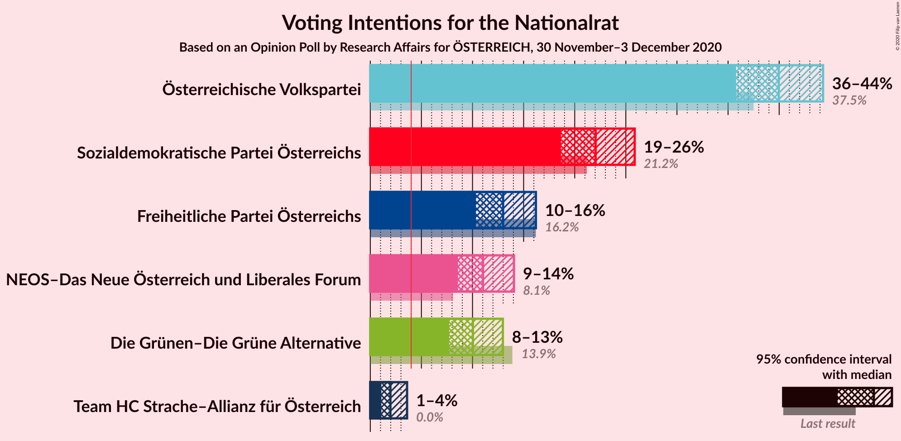

### Confidence Intervals

| Party | Last Result | Poll Result | 80% Confidence Interval | 90% Confidence Interval | 95% Confidence Interval | 99% Confidence Interval |
|:-----:|:-----------:|:-----------:|:-----------------------:|:-----------------------:|:-----------------------:|:-----------------------:|
| Österreichische Volkspartei | 37.5% | 40.0% | 37.2–42.8% |36.4–43.6% |35.8–44.3% |34.5–45.6% |
| Sozialdemokratische Partei Österreichs | 21.2% | 22.0% | 19.8–24.5% |19.2–25.2% |18.7–25.9% |17.6–27.1% |
| Freiheitliche Partei Österreichs | 16.2% | 13.0% | 11.2–15.1% |10.8–15.7% |10.3–16.2% |9.6–17.3% |
| NEOS–Das Neue Österreich und Liberales Forum | 8.1% | 11.0% | 9.4–13.0% |9.0–13.6% |8.6–14.1% |7.9–15.1% |
| Die Grünen–Die Grüne Alternative | 13.9% | 10.0% | 8.5–11.9% |8.1–12.5% |7.7–13.0% |7.0–13.9% |
| Team HC Strache–Allianz für Österreich | 0.0% | 2.0% | 1.4–3.0% |1.2–3.3% |1.1–3.6% |0.9–4.2% |

*Note:* The poll result column reflects the actual value used in the calculations. Published results may vary slightly, and in addition be rounded to fewer digits.

## Seats

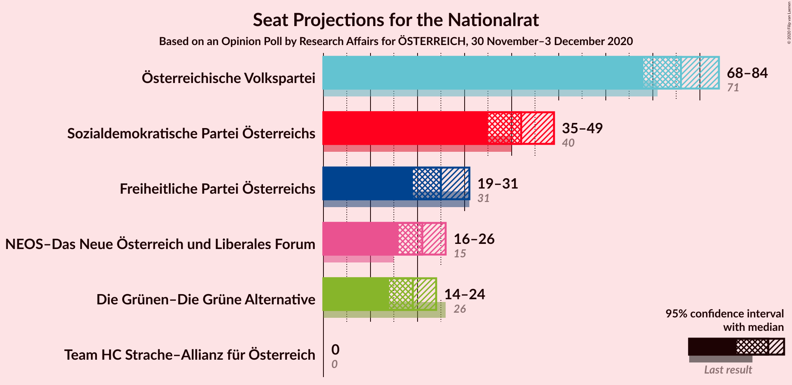

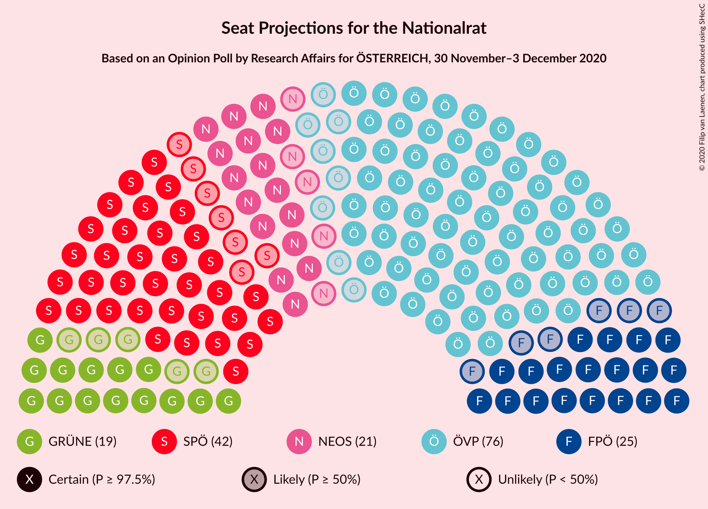

### Confidence Intervals

| Party | Last Result | Median | 80% Confidence Interval | 90% Confidence Interval | 95% Confidence Interval | 99% Confidence Interval |
|:-----:|:-----------:|:------:|:-----------------------:|:-----------------------:|:-----------------------:|:-----------------------:|
| <a href="#österreichische-volkspartei">Österreichische Volkspartei</a> | 71 | 76 | 71–82 |69–83 |68–84 |66–87 |
| <a href="#sozialdemokratische-partei-österreichs">Sozialdemokratische Partei Österreichs</a> | 40 | 42 | 38–47 |36–48 |35–49 |33–51 |
| <a href="#freiheitliche-partei-österreichs">Freiheitliche Partei Österreichs</a> | 31 | 25 | 21–28 |20–30 |19–31 |18–33 |
| <a href="#neos–das-neue-österreich-und-liberales-forum">NEOS–Das Neue Österreich und Liberales Forum</a> | 15 | 21 | 18–24 |17–25 |16–26 |15–28 |
| <a href="#die-grünen–die-grüne-alternative">Die Grünen–Die Grüne Alternative</a> | 26 | 19 | 16–22 |15–23 |14–24 |13–26 |
| <a href="#team-hc-strache–allianz-für-österreich">Team HC Strache–Allianz für Österreich</a> | 0 | 0 | 0 |0 |0 |0–7 |

### Österreichische Volkspartei

*For a full overview of the results for this party, see the [Österreichische Volkspartei](party-österreichischevolkspartei.html) page.*

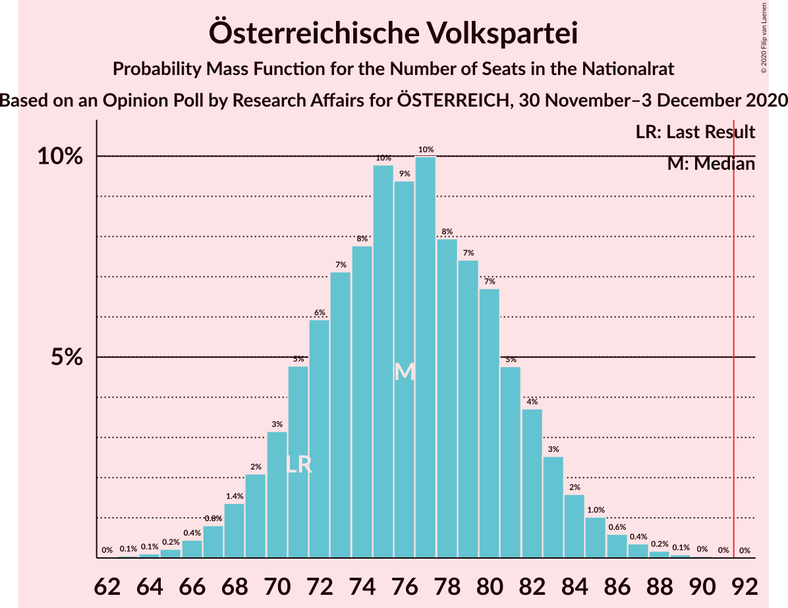

| Number of Seats | Probability | Accumulated | Special Marks |
|:---------------:|:-----------:|:-----------:|:-------------:|
| 63 | 0.1% | 100% |  |
| 64 | 0.1% | 99.9% |  |
| 65 | 0.2% | 99.8% |  |
| 66 | 0.4% | 99.6% |  |
| 67 | 0.8% | 99.1% |  |
| 68 | 1.4% | 98% |  |
| 69 | 2% | 97% |  |
| 70 | 3% | 95% |  |
| 71 | 5% | 92% | Last Result |
| 72 | 6% | 87% |  |
| 73 | 7% | 81% |  |
| 74 | 8% | 74% |  |
| 75 | 10% | 66% |  |
| 76 | 9% | 56% | Median |
| 77 | 10% | 47% |  |
| 78 | 8% | 37% |  |
| 79 | 7% | 29% |  |
| 80 | 7% | 22% |  |
| 81 | 5% | 15% |  |
| 82 | 4% | 10% |  |
| 83 | 3% | 6% |  |
| 84 | 2% | 4% |  |
| 85 | 1.0% | 2% |  |
| 86 | 0.6% | 1.3% |  |
| 87 | 0.4% | 0.7% |  |
| 88 | 0.2% | 0.3% |  |
| 89 | 0.1% | 0.2% |  |
| 90 | 0% | 0.1% |  |
| 91 | 0% | 0% |  |

### Sozialdemokratische Partei Österreichs

*For a full overview of the results for this party, see the [Sozialdemokratische Partei Österreichs](party-sozialdemokratischeparteiösterreichs.html) page.*

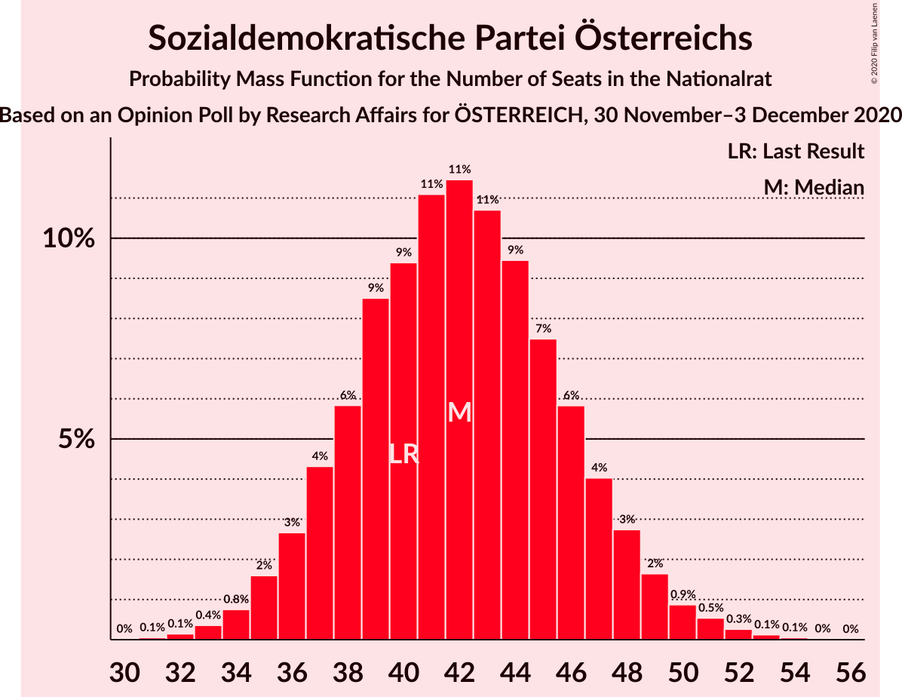

| Number of Seats | Probability | Accumulated | Special Marks |
|:---------------:|:-----------:|:-----------:|:-------------:|
| 31 | 0.1% | 100% |  |
| 32 | 0.1% | 99.9% |  |
| 33 | 0.4% | 99.8% |  |
| 34 | 0.8% | 99.4% |  |
| 35 | 2% | 98.7% |  |
| 36 | 3% | 97% |  |
| 37 | 4% | 94% |  |
| 38 | 6% | 90% |  |
| 39 | 9% | 84% |  |
| 40 | 9% | 76% | Last Result |
| 41 | 11% | 66% |  |
| 42 | 11% | 55% | Median |
| 43 | 11% | 44% |  |
| 44 | 9% | 33% |  |
| 45 | 7% | 24% |  |
| 46 | 6% | 16% |  |
| 47 | 4% | 10% |  |
| 48 | 3% | 6% |  |
| 49 | 2% | 4% |  |
| 50 | 0.9% | 2% |  |
| 51 | 0.5% | 1.0% |  |
| 52 | 0.3% | 0.5% |  |
| 53 | 0.1% | 0.2% |  |
| 54 | 0.1% | 0.1% |  |
| 55 | 0% | 0% |  |

### Freiheitliche Partei Österreichs

*For a full overview of the results for this party, see the [Freiheitliche Partei Österreichs](party-freiheitlicheparteiösterreichs.html) page.*

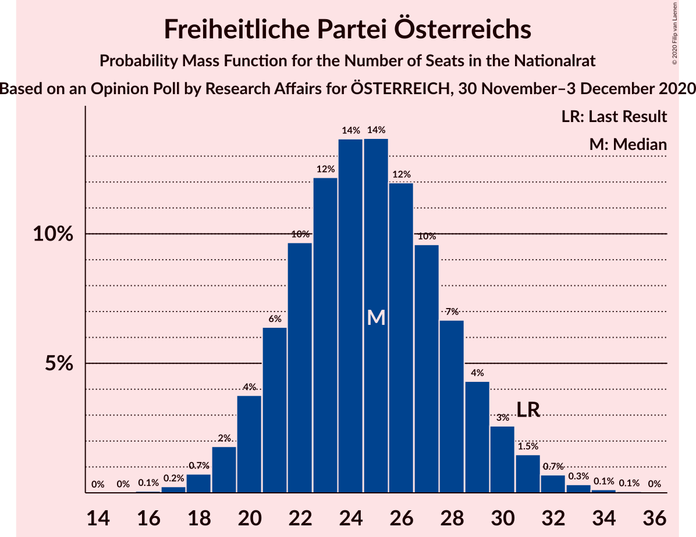

| Number of Seats | Probability | Accumulated | Special Marks |
|:---------------:|:-----------:|:-----------:|:-------------:|
| 16 | 0.1% | 100% |  |
| 17 | 0.2% | 99.9% |  |
| 18 | 0.7% | 99.7% |  |
| 19 | 2% | 99.0% |  |
| 20 | 4% | 97% |  |
| 21 | 6% | 93% |  |
| 22 | 10% | 87% |  |
| 23 | 12% | 77% |  |
| 24 | 14% | 65% |  |
| 25 | 14% | 51% | Median |
| 26 | 12% | 38% |  |
| 27 | 10% | 26% |  |
| 28 | 7% | 16% |  |
| 29 | 4% | 10% |  |
| 30 | 3% | 5% |  |
| 31 | 1.5% | 3% | Last Result |
| 32 | 0.7% | 1.2% |  |
| 33 | 0.3% | 0.5% |  |
| 34 | 0.1% | 0.2% |  |
| 35 | 0.1% | 0.1% |  |
| 36 | 0% | 0% |  |

### NEOS–Das Neue Österreich und Liberales Forum

*For a full overview of the results for this party, see the [NEOS–Das Neue Österreich und Liberales Forum](party-neos–dasneueösterreichundliberalesforum.html) page.*

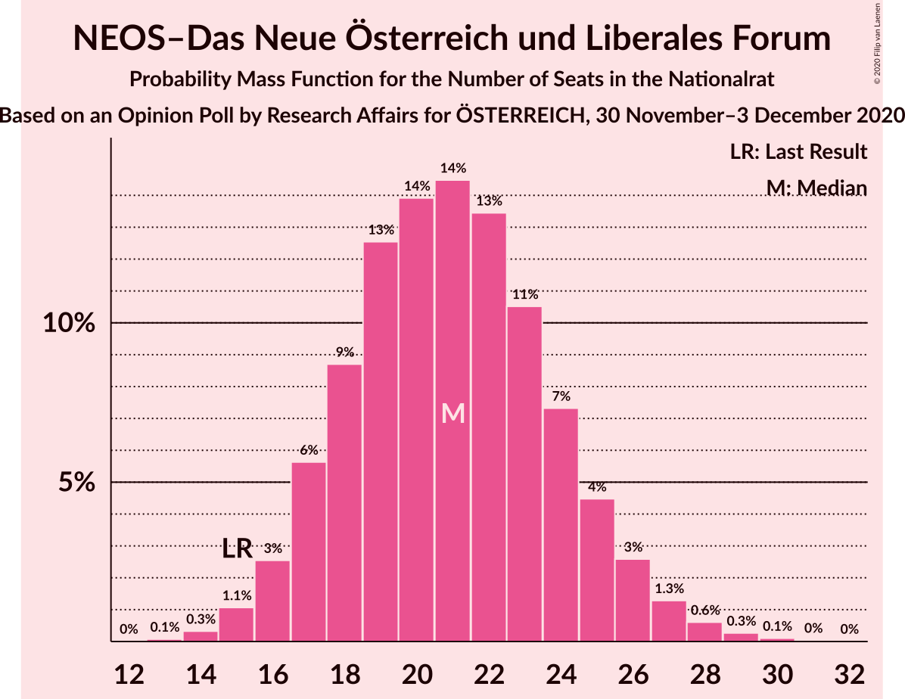

| Number of Seats | Probability | Accumulated | Special Marks |
|:---------------:|:-----------:|:-----------:|:-------------:|
| 13 | 0.1% | 100% |  |
| 14 | 0.3% | 99.9% |  |
| 15 | 1.1% | 99.6% | Last Result |
| 16 | 3% | 98.5% |  |
| 17 | 6% | 96% |  |
| 18 | 9% | 90% |  |
| 19 | 13% | 82% |  |
| 20 | 14% | 69% |  |
| 21 | 14% | 55% | Median |
| 22 | 13% | 41% |  |
| 23 | 11% | 27% |  |
| 24 | 7% | 17% |  |
| 25 | 4% | 9% |  |
| 26 | 3% | 5% |  |
| 27 | 1.3% | 2% |  |
| 28 | 0.6% | 1.0% |  |
| 29 | 0.3% | 0.4% |  |
| 30 | 0.1% | 0.2% |  |
| 31 | 0% | 0.1% |  |
| 32 | 0% | 0% |  |

### Die Grünen–Die Grüne Alternative

*For a full overview of the results for this party, see the [Die Grünen–Die Grüne Alternative](party-diegrünen–diegrünealternative.html) page.*

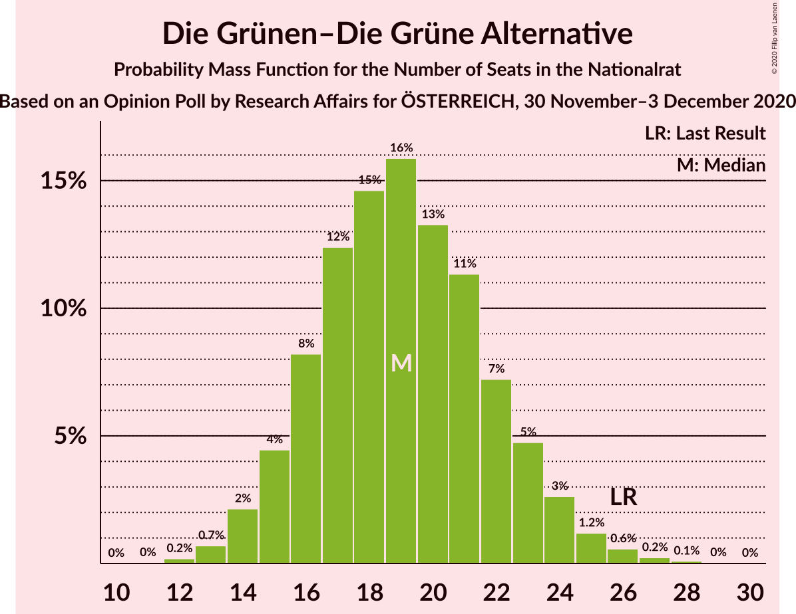

| Number of Seats | Probability | Accumulated | Special Marks |
|:---------------:|:-----------:|:-----------:|:-------------:|
| 12 | 0.2% | 100% |  |
| 13 | 0.7% | 99.8% |  |
| 14 | 2% | 99.1% |  |
| 15 | 4% | 97% |  |
| 16 | 8% | 92% |  |
| 17 | 12% | 84% |  |
| 18 | 15% | 72% |  |
| 19 | 16% | 57% | Median |
| 20 | 13% | 41% |  |
| 21 | 11% | 28% |  |
| 22 | 7% | 17% |  |
| 23 | 5% | 10% |  |
| 24 | 3% | 5% |  |
| 25 | 1.2% | 2% |  |
| 26 | 0.6% | 1.0% | Last Result |
| 27 | 0.2% | 0.4% |  |
| 28 | 0.1% | 0.1% |  |
| 29 | 0% | 0% |  |

### Team HC Strache–Allianz für Österreich

*For a full overview of the results for this party, see the [Team HC Strache–Allianz für Österreich](party-teamhcstrache–allianzfürösterreich.html) page.*

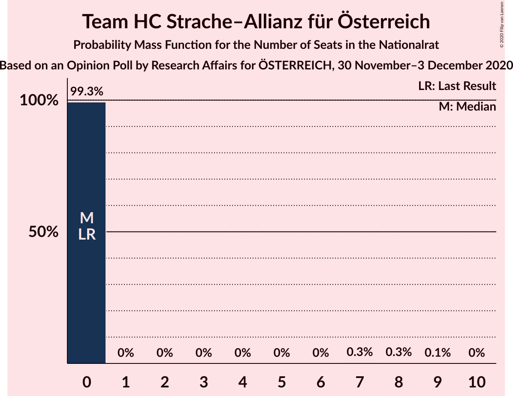

| Number of Seats | Probability | Accumulated | Special Marks |
|:---------------:|:-----------:|:-----------:|:-------------:|
| 0 | 99.3% | 100% | Last Result, Median |
| 1 | 0% | 0.7% |  |
| 2 | 0% | 0.7% |  |
| 3 | 0% | 0.7% |  |
| 4 | 0% | 0.7% |  |
| 5 | 0% | 0.7% |  |
| 6 | 0% | 0.7% |  |
| 7 | 0.3% | 0.7% |  |
| 8 | 0.3% | 0.4% |  |
| 9 | 0.1% | 0.1% |  |
| 10 | 0% | 0% |  |

## Coalitions

### Confidence Intervals

| Coalition | Last Result | Median | Majority? | 80% Confidence Interval | 90% Confidence Interval | 95% Confidence Interval | 99% Confidence Interval |
|:---------:|:-----------:|:------:|:---------:|:-----------------------:|:-----------------------:|:-----------------------:|:-----------------------:|
| Österreichische Volkspartei – Sozialdemokratische Partei Österreichs | 111 | 118 | 100% | 113–123 | 111–125 | 110–126 | 108–128 |
| Österreichische Volkspartei – NEOS–Das Neue Österreich und Liberales Forum – Die Grünen–Die Grüne Alternative | 112 | 116 | 100% | 111–121 | 109–123 | 108–124 | 105–126 |
| Österreichische Volkspartei – Freiheitliche Partei Österreichs | 102 | 101 | 98.7% | 96–106 | 94–108 | 93–109 | 90–112 |
| Österreichische Volkspartei – NEOS–Das Neue Österreich und Liberales Forum | 86 | 97 | 91% | 92–102 | 90–104 | 89–106 | 86–108 |
| Österreichische Volkspartei – Die Grünen–Die Grüne Alternative | 97 | 95 | 81% | 90–101 | 88–102 | 87–103 | 84–106 |
| Sozialdemokratische Partei Österreichs – NEOS–Das Neue Österreich und Liberales Forum – Die Grünen–Die Grüne Alternative | 81 | 82 | 1.2% | 77–87 | 75–89 | 74–90 | 71–93 |
| Österreichische Volkspartei | 71 | 76 | 0% | 71–82 | 69–83 | 68–84 | 66–87 |
| Sozialdemokratische Partei Österreichs – Freiheitliche Partei Österreichs | 71 | 67 | 0% | 61–72 | 60–73 | 59–75 | 56–77 |
| Sozialdemokratische Partei Österreichs – Die Grünen–Die Grüne Alternative | 66 | 61 | 0% | 56–66 | 55–68 | 53–69 | 51–71 |
| Sozialdemokratische Partei Österreichs | 40 | 42 | 0% | 38–47 | 36–48 | 35–49 | 33–51 |

### Österreichische Volkspartei – Sozialdemokratische Partei Österreichs

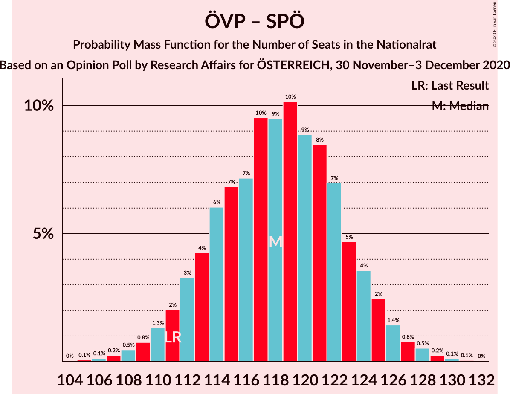

| Number of Seats | Probability | Accumulated | Special Marks |
|:---------------:|:-----------:|:-----------:|:-------------:|
| 104 | 0% | 100% |  |
| 105 | 0.1% | 99.9% |  |
| 106 | 0.1% | 99.9% |  |
| 107 | 0.2% | 99.8% |  |
| 108 | 0.5% | 99.5% |  |
| 109 | 0.8% | 99.0% |  |
| 110 | 1.3% | 98% |  |
| 111 | 2% | 97% | Last Result |
| 112 | 3% | 95% |  |
| 113 | 4% | 92% |  |
| 114 | 6% | 87% |  |
| 115 | 7% | 81% |  |
| 116 | 7% | 75% |  |
| 117 | 10% | 67% |  |
| 118 | 9% | 58% | Median |
| 119 | 10% | 48% |  |
| 120 | 9% | 38% |  |
| 121 | 8% | 29% |  |
| 122 | 7% | 21% |  |
| 123 | 5% | 14% |  |
| 124 | 4% | 9% |  |
| 125 | 2% | 6% |  |
| 126 | 1.4% | 3% |  |
| 127 | 0.8% | 2% |  |
| 128 | 0.5% | 1.0% |  |
| 129 | 0.2% | 0.4% |  |
| 130 | 0.1% | 0.2% |  |
| 131 | 0.1% | 0.1% |  |
| 132 | 0% | 0% |  |

### Österreichische Volkspartei – NEOS–Das Neue Österreich und Liberales Forum – Die Grünen–Die Grüne Alternative

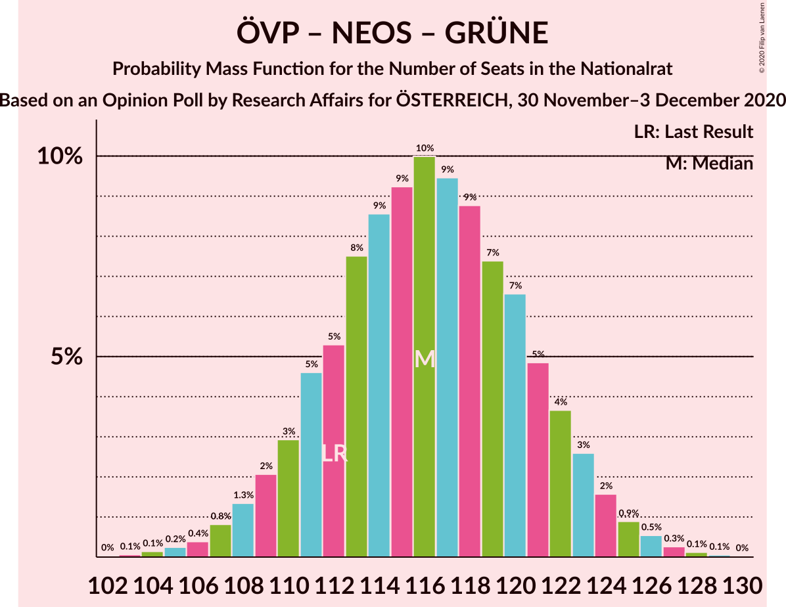

| Number of Seats | Probability | Accumulated | Special Marks |
|:---------------:|:-----------:|:-----------:|:-------------:|
| 102 | 0% | 100% |  |
| 103 | 0.1% | 99.9% |  |
| 104 | 0.1% | 99.9% |  |
| 105 | 0.2% | 99.7% |  |
| 106 | 0.4% | 99.5% |  |
| 107 | 0.8% | 99.1% |  |
| 108 | 1.3% | 98% |  |
| 109 | 2% | 97% |  |
| 110 | 3% | 95% |  |
| 111 | 5% | 92% |  |
| 112 | 5% | 87% | Last Result |
| 113 | 8% | 82% |  |
| 114 | 9% | 75% |  |
| 115 | 9% | 66% |  |
| 116 | 10% | 57% | Median |
| 117 | 9% | 47% |  |
| 118 | 9% | 37% |  |
| 119 | 7% | 29% |  |
| 120 | 7% | 21% |  |
| 121 | 5% | 15% |  |
| 122 | 4% | 10% |  |
| 123 | 3% | 6% |  |
| 124 | 2% | 3% |  |
| 125 | 0.9% | 2% |  |
| 126 | 0.5% | 1.0% |  |
| 127 | 0.3% | 0.5% |  |
| 128 | 0.1% | 0.2% |  |
| 129 | 0.1% | 0.1% |  |
| 130 | 0% | 0% |  |

### Österreichische Volkspartei – Freiheitliche Partei Österreichs

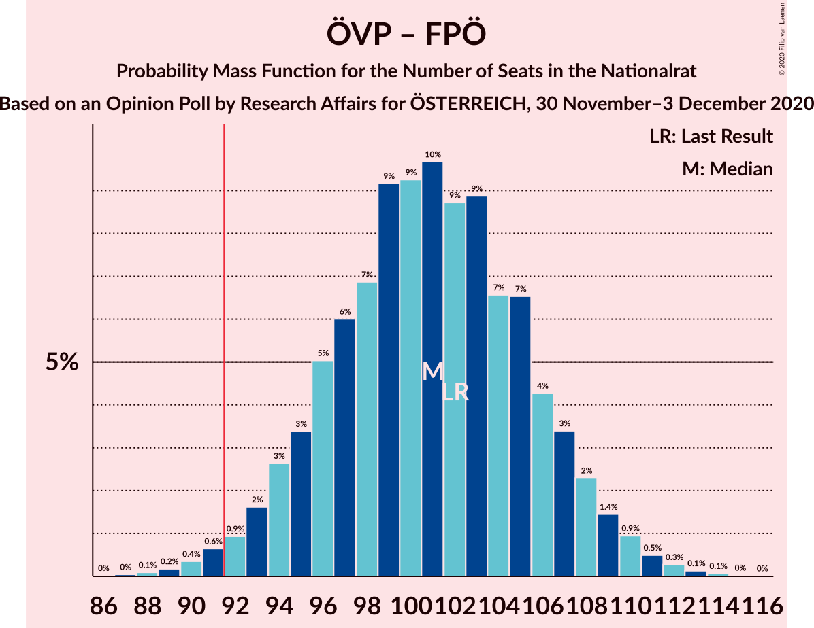

| Number of Seats | Probability | Accumulated | Special Marks |
|:---------------:|:-----------:|:-----------:|:-------------:|
| 87 | 0% | 100% |  |
| 88 | 0.1% | 99.9% |  |
| 89 | 0.2% | 99.8% |  |
| 90 | 0.4% | 99.7% |  |
| 91 | 0.6% | 99.3% |  |
| 92 | 0.9% | 98.7% | Majority |
| 93 | 2% | 98% |  |
| 94 | 3% | 96% |  |
| 95 | 3% | 93% |  |
| 96 | 5% | 90% |  |
| 97 | 6% | 85% |  |
| 98 | 7% | 79% |  |
| 99 | 9% | 72% |  |
| 100 | 9% | 63% |  |
| 101 | 10% | 54% | Median |
| 102 | 9% | 44% | Last Result |
| 103 | 9% | 35% |  |
| 104 | 7% | 26% |  |
| 105 | 7% | 20% |  |
| 106 | 4% | 13% |  |
| 107 | 3% | 9% |  |
| 108 | 2% | 6% |  |
| 109 | 1.4% | 3% |  |
| 110 | 0.9% | 2% |  |
| 111 | 0.5% | 1.0% |  |
| 112 | 0.3% | 0.5% |  |
| 113 | 0.1% | 0.2% |  |
| 114 | 0.1% | 0.1% |  |
| 115 | 0% | 0% |  |

### Österreichische Volkspartei – NEOS–Das Neue Österreich und Liberales Forum

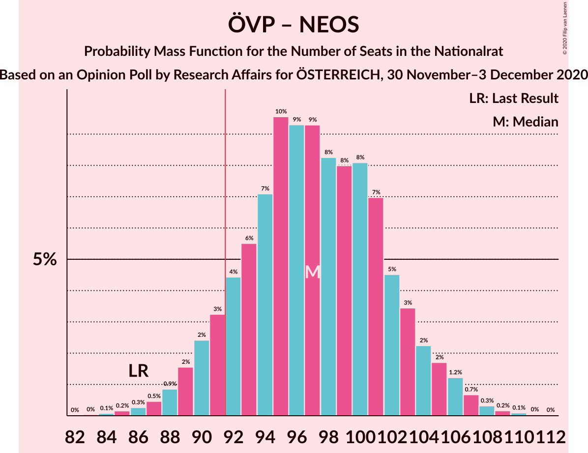

| Number of Seats | Probability | Accumulated | Special Marks |
|:---------------:|:-----------:|:-----------:|:-------------:|
| 83 | 0% | 100% |  |
| 84 | 0.1% | 99.9% |  |
| 85 | 0.2% | 99.9% |  |
| 86 | 0.3% | 99.7% | Last Result |
| 87 | 0.5% | 99.4% |  |
| 88 | 0.9% | 99.0% |  |
| 89 | 2% | 98% |  |
| 90 | 2% | 97% |  |
| 91 | 3% | 94% |  |
| 92 | 4% | 91% | Majority |
| 93 | 6% | 86% |  |
| 94 | 7% | 81% |  |
| 95 | 10% | 74% |  |
| 96 | 9% | 64% |  |
| 97 | 9% | 55% | Median |
| 98 | 8% | 46% |  |
| 99 | 8% | 37% |  |
| 100 | 8% | 29% |  |
| 101 | 7% | 21% |  |
| 102 | 5% | 14% |  |
| 103 | 3% | 10% |  |
| 104 | 2% | 6% |  |
| 105 | 2% | 4% |  |
| 106 | 1.2% | 3% |  |
| 107 | 0.7% | 1.3% |  |
| 108 | 0.3% | 0.6% |  |
| 109 | 0.2% | 0.3% |  |
| 110 | 0.1% | 0.2% |  |
| 111 | 0% | 0.1% |  |
| 112 | 0% | 0% |  |

### Österreichische Volkspartei – Die Grünen–Die Grüne Alternative

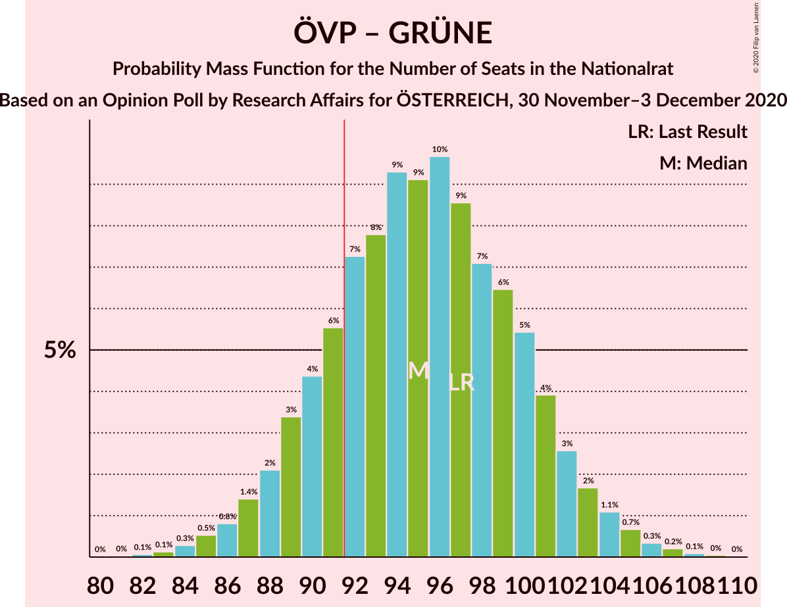

| Number of Seats | Probability | Accumulated | Special Marks |
|:---------------:|:-----------:|:-----------:|:-------------:|
| 81 | 0% | 100% |  |
| 82 | 0.1% | 99.9% |  |
| 83 | 0.1% | 99.9% |  |
| 84 | 0.3% | 99.8% |  |
| 85 | 0.5% | 99.5% |  |
| 86 | 0.8% | 98.9% |  |
| 87 | 1.4% | 98% |  |
| 88 | 2% | 97% |  |
| 89 | 3% | 95% |  |
| 90 | 4% | 91% |  |
| 91 | 6% | 87% |  |
| 92 | 7% | 81% | Majority |
| 93 | 8% | 74% |  |
| 94 | 9% | 66% |  |
| 95 | 9% | 57% | Median |
| 96 | 10% | 48% |  |
| 97 | 9% | 38% | Last Result |
| 98 | 7% | 30% |  |
| 99 | 6% | 23% |  |
| 100 | 5% | 16% |  |
| 101 | 4% | 11% |  |
| 102 | 3% | 7% |  |
| 103 | 2% | 4% |  |
| 104 | 1.1% | 2% |  |
| 105 | 0.7% | 1.4% |  |
| 106 | 0.3% | 0.7% |  |
| 107 | 0.2% | 0.4% |  |
| 108 | 0.1% | 0.2% |  |
| 109 | 0% | 0.1% |  |
| 110 | 0% | 0% |  |

### Sozialdemokratische Partei Österreichs – NEOS–Das Neue Österreich und Liberales Forum – Die Grünen–Die Grüne Alternative

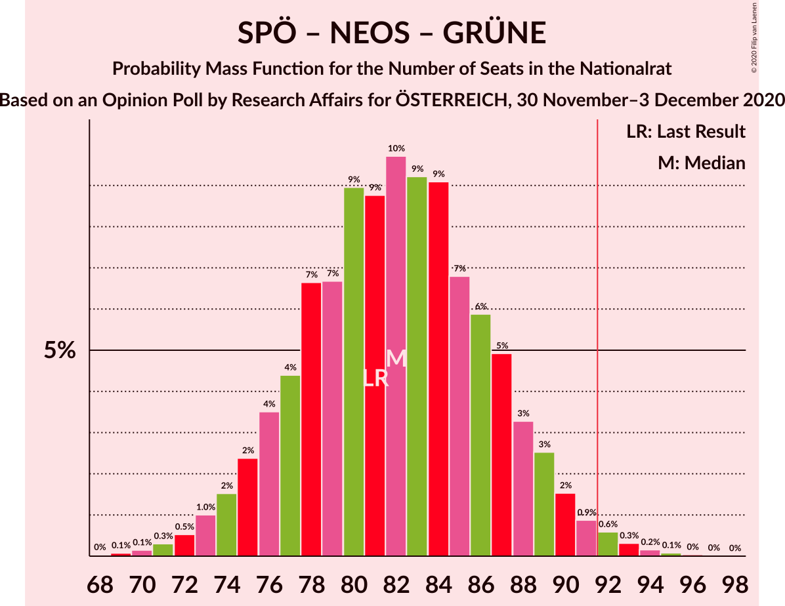

| Number of Seats | Probability | Accumulated | Special Marks |
|:---------------:|:-----------:|:-----------:|:-------------:|
| 68 | 0% | 100% |  |
| 69 | 0.1% | 99.9% |  |
| 70 | 0.1% | 99.9% |  |
| 71 | 0.3% | 99.7% |  |
| 72 | 0.5% | 99.4% |  |
| 73 | 1.0% | 98.9% |  |
| 74 | 2% | 98% |  |
| 75 | 2% | 96% |  |
| 76 | 4% | 94% |  |
| 77 | 4% | 90% |  |
| 78 | 7% | 86% |  |
| 79 | 7% | 79% |  |
| 80 | 9% | 73% |  |
| 81 | 9% | 64% | Last Result |
| 82 | 10% | 55% | Median |
| 83 | 9% | 45% |  |
| 84 | 9% | 36% |  |
| 85 | 7% | 27% |  |
| 86 | 6% | 20% |  |
| 87 | 5% | 14% |  |
| 88 | 3% | 9% |  |
| 89 | 3% | 6% |  |
| 90 | 2% | 4% |  |
| 91 | 0.9% | 2% |  |
| 92 | 0.6% | 1.2% | Majority |
| 93 | 0.3% | 0.6% |  |
| 94 | 0.2% | 0.3% |  |
| 95 | 0.1% | 0.1% |  |
| 96 | 0% | 0.1% |  |
| 97 | 0% | 0% |  |

### Österreichische Volkspartei

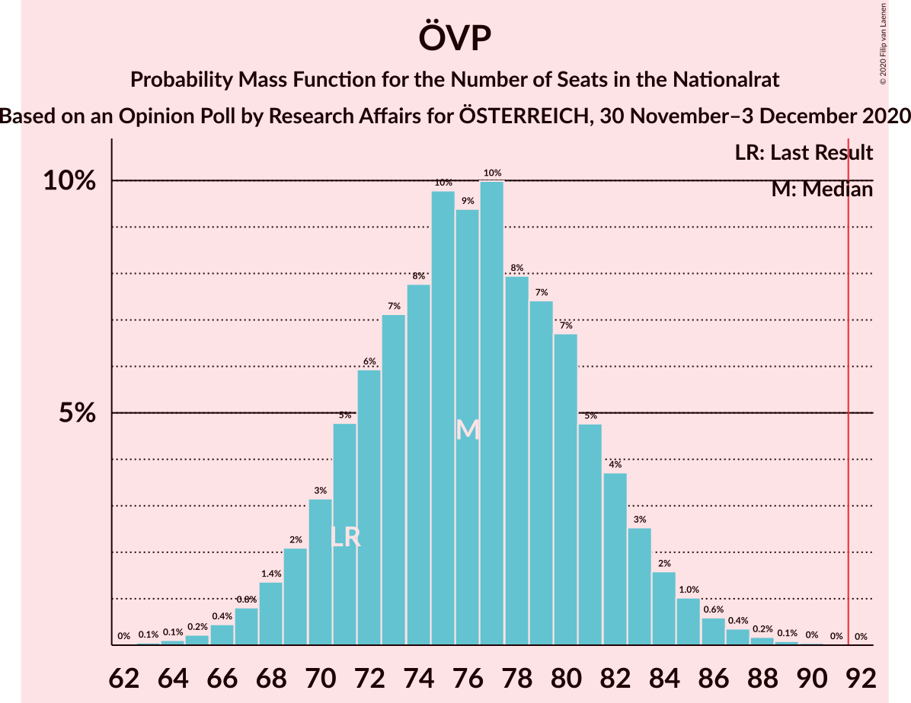

| Number of Seats | Probability | Accumulated | Special Marks |
|:---------------:|:-----------:|:-----------:|:-------------:|
| 63 | 0.1% | 100% |  |
| 64 | 0.1% | 99.9% |  |
| 65 | 0.2% | 99.8% |  |
| 66 | 0.4% | 99.6% |  |
| 67 | 0.8% | 99.1% |  |
| 68 | 1.4% | 98% |  |
| 69 | 2% | 97% |  |
| 70 | 3% | 95% |  |
| 71 | 5% | 92% | Last Result |
| 72 | 6% | 87% |  |
| 73 | 7% | 81% |  |
| 74 | 8% | 74% |  |
| 75 | 10% | 66% |  |
| 76 | 9% | 56% | Median |
| 77 | 10% | 47% |  |
| 78 | 8% | 37% |  |
| 79 | 7% | 29% |  |
| 80 | 7% | 22% |  |
| 81 | 5% | 15% |  |
| 82 | 4% | 10% |  |
| 83 | 3% | 6% |  |
| 84 | 2% | 4% |  |
| 85 | 1.0% | 2% |  |
| 86 | 0.6% | 1.3% |  |
| 87 | 0.4% | 0.7% |  |
| 88 | 0.2% | 0.3% |  |
| 89 | 0.1% | 0.2% |  |
| 90 | 0% | 0.1% |  |
| 91 | 0% | 0% |  |

### Sozialdemokratische Partei Österreichs – Freiheitliche Partei Österreichs

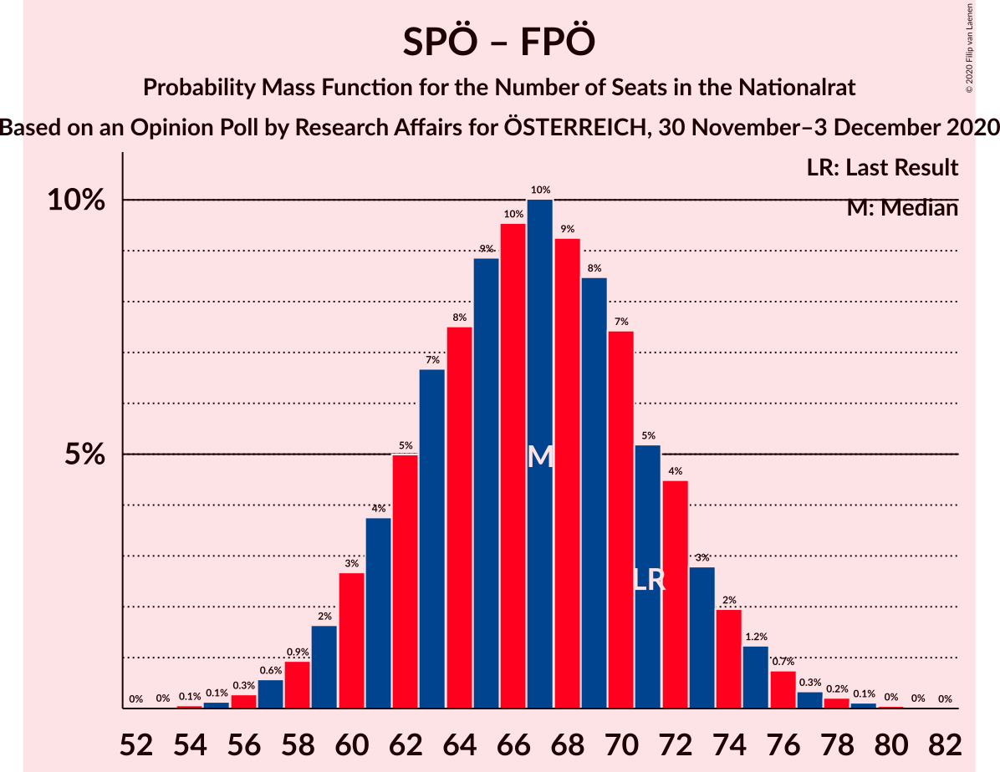

| Number of Seats | Probability | Accumulated | Special Marks |
|:---------------:|:-----------:|:-----------:|:-------------:|
| 54 | 0.1% | 100% |  |
| 55 | 0.1% | 99.9% |  |
| 56 | 0.3% | 99.8% |  |
| 57 | 0.6% | 99.5% |  |
| 58 | 0.9% | 98.9% |  |
| 59 | 2% | 98% |  |
| 60 | 3% | 96% |  |
| 61 | 4% | 94% |  |
| 62 | 5% | 90% |  |
| 63 | 7% | 85% |  |
| 64 | 8% | 78% |  |
| 65 | 9% | 71% |  |
| 66 | 10% | 62% |  |
| 67 | 10% | 52% | Median |
| 68 | 9% | 42% |  |
| 69 | 8% | 33% |  |
| 70 | 7% | 25% |  |
| 71 | 5% | 17% | Last Result |
| 72 | 4% | 12% |  |
| 73 | 3% | 7% |  |
| 74 | 2% | 5% |  |
| 75 | 1.2% | 3% |  |
| 76 | 0.7% | 1.5% |  |
| 77 | 0.3% | 0.7% |  |
| 78 | 0.2% | 0.4% |  |
| 79 | 0.1% | 0.2% |  |
| 80 | 0% | 0.1% |  |
| 81 | 0% | 0% |  |

### Sozialdemokratische Partei Österreichs – Die Grünen–Die Grüne Alternative

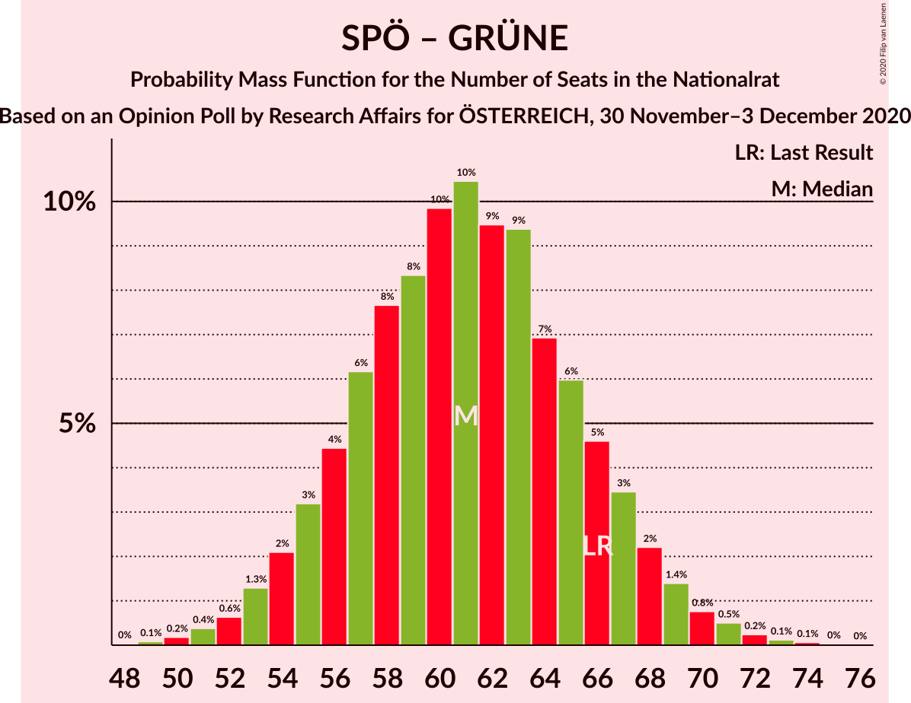

| Number of Seats | Probability | Accumulated | Special Marks |
|:---------------:|:-----------:|:-----------:|:-------------:|
| 48 | 0% | 100% |  |
| 49 | 0.1% | 99.9% |  |
| 50 | 0.2% | 99.9% |  |
| 51 | 0.4% | 99.7% |  |
| 52 | 0.6% | 99.3% |  |
| 53 | 1.3% | 98.7% |  |
| 54 | 2% | 97% |  |
| 55 | 3% | 95% |  |
| 56 | 4% | 92% |  |
| 57 | 6% | 88% |  |
| 58 | 8% | 81% |  |
| 59 | 8% | 74% |  |
| 60 | 10% | 65% |  |
| 61 | 10% | 56% | Median |
| 62 | 9% | 45% |  |
| 63 | 9% | 36% |  |
| 64 | 7% | 26% |  |
| 65 | 6% | 19% |  |
| 66 | 5% | 13% | Last Result |
| 67 | 3% | 9% |  |
| 68 | 2% | 5% |  |
| 69 | 1.4% | 3% |  |
| 70 | 0.8% | 2% |  |
| 71 | 0.5% | 1.0% |  |
| 72 | 0.2% | 0.5% |  |
| 73 | 0.1% | 0.2% |  |
| 74 | 0.1% | 0.1% |  |
| 75 | 0% | 0% |  |

### Sozialdemokratische Partei Österreichs

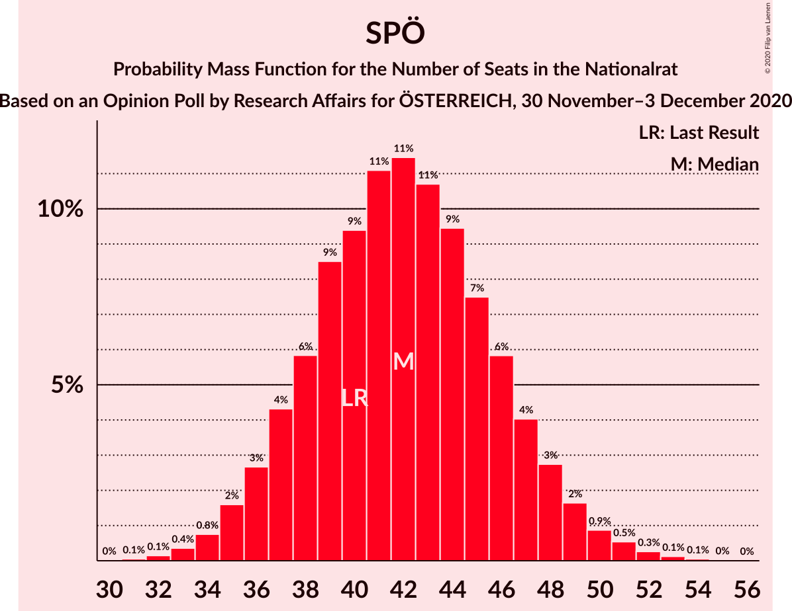

| Number of Seats | Probability | Accumulated | Special Marks |
|:---------------:|:-----------:|:-----------:|:-------------:|
| 31 | 0.1% | 100% |  |
| 32 | 0.1% | 99.9% |  |
| 33 | 0.4% | 99.8% |  |
| 34 | 0.8% | 99.4% |  |
| 35 | 2% | 98.7% |  |
| 36 | 3% | 97% |  |
| 37 | 4% | 94% |  |
| 38 | 6% | 90% |  |
| 39 | 9% | 84% |  |
| 40 | 9% | 76% | Last Result |
| 41 | 11% | 66% |  |
| 42 | 11% | 55% | Median |
| 43 | 11% | 44% |  |
| 44 | 9% | 33% |  |
| 45 | 7% | 24% |  |
| 46 | 6% | 16% |  |
| 47 | 4% | 10% |  |
| 48 | 3% | 6% |  |
| 49 | 2% | 4% |  |
| 50 | 0.9% | 2% |  |
| 51 | 0.5% | 1.0% |  |
| 52 | 0.3% | 0.5% |  |
| 53 | 0.1% | 0.2% |  |
| 54 | 0.1% | 0.1% |  |
| 55 | 0% | 0% |  |

## Technical Information

### Opinion Poll

+ **Polling firm:** Research Affairs
+ **Commissioner(s):** ÖSTERREICH
+ **Fieldwork period:** 30 November–3 December 2020

### Calculations

+ **Sample size:** 508
+ **Simulations done:** 1,048,576
+ **Error estimate:** 0.90%

