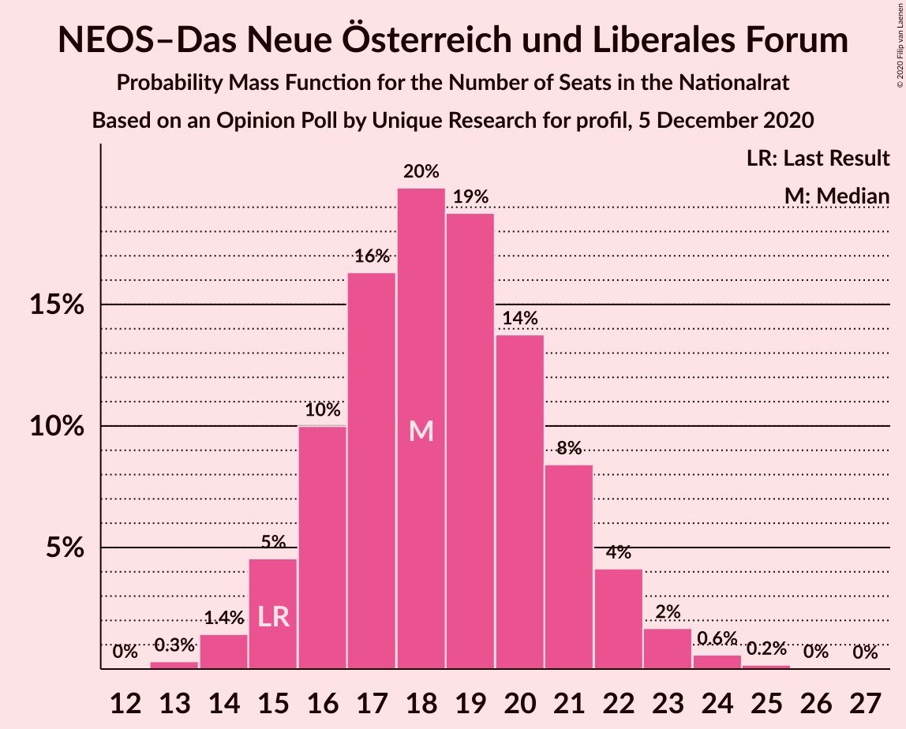

# Opinion Poll by Unique Research for profil, 5 December 2020

<a href="#voting-intentions">Voting Intentions</a> | <a href="#seats">Seats</a> | <a href="#coalitions">Coalitions</a> | <a href="#technical-information">Technical Information</a>

## Voting Intentions

### Confidence Intervals

| Party | Last Result | Poll Result | 80% Confidence Interval | 90% Confidence Interval | 95% Confidence Interval | 99% Confidence Interval |
|:-----:|:-----------:|:-----------:|:-----------------------:|:-----------------------:|:-----------------------:|:-----------------------:|
| Österreichische Volkspartei | 37.5% | 40.0% | 37.9–42.3% |37.3–42.9% |36.7–43.5% |35.7–44.5% |
| Sozialdemokratische Partei Österreichs | 21.2% | 20.0% | 18.3–21.9% |17.8–22.5% |17.4–22.9% |16.6–23.9% |
| Freiheitliche Partei Österreichs | 16.2% | 15.0% | 13.5–16.7% |13.1–17.2% |12.7–17.6% |12.0–18.5% |
| Die Grünen–Die Grüne Alternative | 13.9% | 13.0% | 11.6–14.6% |11.2–15.1% |10.9–15.5% |10.2–16.3% |
| NEOS–Das Neue Österreich und Liberales Forum | 8.1% | 10.0% | 8.7–11.4% |8.4–11.8% |8.1–12.2% |7.5–12.9% |

*Note:* The poll result column reflects the actual value used in the calculations. Published results may vary slightly, and in addition be rounded to fewer digits.

## Seats

### Confidence Intervals

| Party | Last Result | Median | 80% Confidence Interval | 90% Confidence Interval | 95% Confidence Interval | 99% Confidence Interval |
|:-----:|:-----------:|:------:|:-----------------------:|:-----------------------:|:-----------------------:|:-----------------------:|
| <a href="#österreichische-volkspartei">Österreichische Volkspartei</a> | 71 | 75 | 71–79 |70–80 |69–81 |67–83 |
| <a href="#sozialdemokratische-partei-österreichs">Sozialdemokratische Partei Österreichs</a> | 40 | 37 | 34–41 |33–42 |32–43 |31–44 |
| <a href="#freiheitliche-partei-österreichs">Freiheitliche Partei Österreichs</a> | 31 | 28 | 25–31 |24–32 |23–33 |22–34 |
| <a href="#die-grünen–die-grüne-alternative">Die Grünen–Die Grüne Alternative</a> | 26 | 24 | 21–27 |21–28 |20–29 |19–30 |
| <a href="#neos–das-neue-österreich-und-liberales-forum">NEOS–Das Neue Österreich und Liberales Forum</a> | 15 | 18 | 16–21 |15–22 |15–22 |14–24 |

### Österreichische Volkspartei

*For a full overview of the results for this party, see the [Österreichische Volkspartei](party-österreichischevolkspartei.html) page.*

| Number of Seats | Probability | Accumulated | Special Marks |
|:---------------:|:-----------:|:-----------:|:-------------:|
| 65 | 0.1% | 100% |  |
| 66 | 0.2% | 99.9% |  |
| 67 | 0.5% | 99.6% |  |
| 68 | 1.1% | 99.1% |  |
| 69 | 2% | 98% |  |
| 70 | 4% | 96% |  |
| 71 | 6% | 92% | Last Result |
| 72 | 8% | 86% |  |
| 73 | 10% | 78% |  |
| 74 | 12% | 68% |  |
| 75 | 13% | 57% | Median |
| 76 | 12% | 44% |  |
| 77 | 10% | 32% |  |
| 78 | 8% | 22% |  |
| 79 | 6% | 14% |  |
| 80 | 4% | 8% |  |
| 81 | 2% | 5% |  |
| 82 | 1.2% | 2% |  |
| 83 | 0.6% | 1.1% |  |
| 84 | 0.3% | 0.5% |  |
| 85 | 0.1% | 0.2% |  |
| 86 | 0% | 0.1% |  |
| 87 | 0% | 0% |  |

### Sozialdemokratische Partei Österreichs

*For a full overview of the results for this party, see the [Sozialdemokratische Partei Österreichs](party-sozialdemokratischeparteiösterreichs.html) page.*

| Number of Seats | Probability | Accumulated | Special Marks |
|:---------------:|:-----------:|:-----------:|:-------------:|
| 29 | 0.1% | 100% |  |
| 30 | 0.2% | 99.9% |  |
| 31 | 0.9% | 99.7% |  |
| 32 | 1.4% | 98.8% |  |
| 33 | 4% | 97% |  |
| 34 | 8% | 93% |  |
| 35 | 7% | 85% |  |
| 36 | 16% | 78% |  |
| 37 | 15% | 62% | Median |
| 38 | 12% | 46% |  |
| 39 | 15% | 35% |  |
| 40 | 7% | 19% | Last Result |
| 41 | 6% | 12% |  |
| 42 | 4% | 6% |  |
| 43 | 1.2% | 3% |  |
| 44 | 0.9% | 1.3% |  |
| 45 | 0.3% | 0.5% |  |
| 46 | 0.1% | 0.1% |  |
| 47 | 0% | 0.1% |  |
| 48 | 0% | 0% |  |

### Freiheitliche Partei Österreichs

*For a full overview of the results for this party, see the [Freiheitliche Partei Österreichs](party-freiheitlicheparteiösterreichs.html) page.*

| Number of Seats | Probability | Accumulated | Special Marks |
|:---------------:|:-----------:|:-----------:|:-------------:|
| 21 | 0.2% | 100% |  |
| 22 | 0.6% | 99.8% |  |
| 23 | 2% | 99.2% |  |
| 24 | 4% | 97% |  |
| 25 | 8% | 93% |  |
| 26 | 13% | 85% |  |
| 27 | 16% | 72% |  |
| 28 | 17% | 56% | Median |
| 29 | 15% | 40% |  |
| 30 | 11% | 25% |  |
| 31 | 7% | 14% | Last Result |
| 32 | 4% | 7% |  |
| 33 | 2% | 3% |  |
| 34 | 0.7% | 1.1% |  |
| 35 | 0.3% | 0.4% |  |
| 36 | 0.1% | 0.1% |  |
| 37 | 0% | 0% |  |

### Die Grünen–Die Grüne Alternative

*For a full overview of the results for this party, see the [Die Grünen–Die Grüne Alternative](party-diegrünen–diegrünealternative.html) page.*

| Number of Seats | Probability | Accumulated | Special Marks |
|:---------------:|:-----------:|:-----------:|:-------------:|
| 17 | 0% | 100% |  |
| 18 | 0.2% | 99.9% |  |
| 19 | 1.0% | 99.7% |  |
| 20 | 3% | 98.7% |  |
| 21 | 7% | 96% |  |
| 22 | 11% | 89% |  |
| 23 | 16% | 78% |  |
| 24 | 18% | 62% | Median |
| 25 | 16% | 44% |  |
| 26 | 12% | 28% | Last Result |
| 27 | 8% | 15% |  |
| 28 | 4% | 7% |  |
| 29 | 2% | 3% |  |
| 30 | 0.8% | 1.2% |  |
| 31 | 0.3% | 0.4% |  |
| 32 | 0.1% | 0.1% |  |
| 33 | 0% | 0% |  |

### NEOS–Das Neue Österreich und Liberales Forum

*For a full overview of the results for this party, see the [NEOS–Das Neue Österreich und Liberales Forum](party-neos–dasneueösterreichundliberalesforum.html) page.*

| Number of Seats | Probability | Accumulated | Special Marks |
|:---------------:|:-----------:|:-----------:|:-------------:|
| 13 | 0.3% | 100% |  |
| 14 | 1.4% | 99.6% |  |
| 15 | 5% | 98% | Last Result |
| 16 | 10% | 94% |  |
| 17 | 16% | 84% |  |
| 18 | 20% | 67% | Median |
| 19 | 19% | 48% |  |
| 20 | 14% | 29% |  |
| 21 | 8% | 15% |  |
| 22 | 4% | 7% |  |
| 23 | 2% | 2% |  |
| 24 | 0.6% | 0.8% |  |
| 25 | 0.2% | 0.2% |  |
| 26 | 0% | 0.1% |  |
| 27 | 0% | 0% |  |

## Coalitions

### Confidence Intervals

| Coalition | Last Result | Median | Majority? | 80% Confidence Interval | 90% Confidence Interval | 95% Confidence Interval | 99% Confidence Interval |
|:---------:|:-----------:|:------:|:---------:|:-----------------------:|:-----------------------:|:-----------------------:|:-----------------------:|
| Österreichische Volkspartei – Die Grünen–Die Grüne Alternative – NEOS–Das Neue Österreich und Liberales Forum | 112 | 118 | 100% | 114–122 | 112–123 | 111–124 | 110–126 |
| Österreichische Volkspartei – Sozialdemokratische Partei Österreichs | 111 | 112 | 100% | 108–117 | 107–118 | 106–119 | 104–121 |
| Österreichische Volkspartei – Freiheitliche Partei Österreichs | 102 | 103 | 100% | 99–107 | 98–108 | 97–109 | 95–111 |
| Österreichische Volkspartei – Die Grünen–Die Grüne Alternative | 97 | 99 | 99.1% | 95–103 | 94–105 | 93–106 | 91–108 |
| Österreichische Volkspartei – NEOS–Das Neue Österreich und Liberales Forum | 86 | 93 | 73% | 89–98 | 88–99 | 87–100 | 85–102 |
| Sozialdemokratische Partei Österreichs – Die Grünen–Die Grüne Alternative – NEOS–Das Neue Österreich und Liberales Forum | 81 | 80 | 0% | 76–84 | 75–85 | 74–86 | 72–88 |
| Österreichische Volkspartei | 71 | 75 | 0% | 71–79 | 70–80 | 69–81 | 67–83 |
| Sozialdemokratische Partei Österreichs – Freiheitliche Partei Österreichs | 71 | 65 | 0% | 61–69 | 60–70 | 59–72 | 57–73 |
| Sozialdemokratische Partei Österreichs – Die Grünen–Die Grüne Alternative | 66 | 62 | 0% | 58–66 | 57–67 | 56–68 | 54–70 |
| Sozialdemokratische Partei Österreichs | 40 | 37 | 0% | 34–41 | 33–42 | 32–43 | 31–44 |

### Österreichische Volkspartei – Die Grünen–Die Grüne Alternative – NEOS–Das Neue Österreich und Liberales Forum

| Number of Seats | Probability | Accumulated | Special Marks |
|:---------------:|:-----------:|:-----------:|:-------------:|
| 107 | 0% | 100% |  |
| 108 | 0.1% | 99.9% |  |
| 109 | 0.3% | 99.8% |  |
| 110 | 0.7% | 99.5% |  |
| 111 | 1.4% | 98.8% |  |
| 112 | 2% | 97% | Last Result |
| 113 | 4% | 95% |  |
| 114 | 6% | 91% |  |
| 115 | 9% | 85% |  |
| 116 | 11% | 76% |  |
| 117 | 13% | 65% | Median |
| 118 | 13% | 53% |  |
| 119 | 11% | 40% |  |
| 120 | 10% | 29% |  |
| 121 | 7% | 19% |  |
| 122 | 5% | 11% |  |
| 123 | 3% | 6% |  |
| 124 | 2% | 3% |  |
| 125 | 0.8% | 1.4% |  |
| 126 | 0.4% | 0.6% |  |
| 127 | 0.1% | 0.2% |  |
| 128 | 0.1% | 0.1% |  |
| 129 | 0% | 0% |  |

### Österreichische Volkspartei – Sozialdemokratische Partei Österreichs

| Number of Seats | Probability | Accumulated | Special Marks |
|:---------------:|:-----------:|:-----------:|:-------------:|
| 102 | 0.1% | 100% |  |
| 103 | 0.2% | 99.9% |  |
| 104 | 0.4% | 99.7% |  |
| 105 | 0.9% | 99.3% |  |
| 106 | 2% | 98% |  |
| 107 | 3% | 97% |  |
| 108 | 5% | 94% |  |
| 109 | 7% | 89% |  |
| 110 | 9% | 82% |  |
| 111 | 11% | 73% | Last Result |
| 112 | 12% | 61% | Median |
| 113 | 13% | 49% |  |
| 114 | 11% | 37% |  |
| 115 | 9% | 26% |  |
| 116 | 7% | 17% |  |
| 117 | 5% | 10% |  |
| 118 | 3% | 6% |  |
| 119 | 1.5% | 3% |  |
| 120 | 0.8% | 1.3% |  |
| 121 | 0.3% | 0.5% |  |
| 122 | 0.1% | 0.2% |  |
| 123 | 0% | 0.1% |  |
| 124 | 0% | 0% |  |

### Österreichische Volkspartei – Freiheitliche Partei Österreichs

| Number of Seats | Probability | Accumulated | Special Marks |
|:---------------:|:-----------:|:-----------:|:-------------:|
| 92 | 0% | 100% | Majority |
| 93 | 0.1% | 99.9% |  |
| 94 | 0.3% | 99.8% |  |
| 95 | 0.7% | 99.5% |  |
| 96 | 1.3% | 98.8% |  |
| 97 | 2% | 98% |  |
| 98 | 4% | 95% |  |
| 99 | 6% | 91% |  |
| 100 | 8% | 86% |  |
| 101 | 10% | 77% |  |
| 102 | 11% | 67% | Last Result |
| 103 | 12% | 56% | Median |
| 104 | 12% | 44% |  |
| 105 | 10% | 32% |  |
| 106 | 8% | 22% |  |
| 107 | 6% | 14% |  |
| 108 | 4% | 8% |  |
| 109 | 2% | 4% |  |
| 110 | 1.2% | 2% |  |
| 111 | 0.6% | 1.0% |  |
| 112 | 0.2% | 0.4% |  |
| 113 | 0.1% | 0.2% |  |
| 114 | 0% | 0.1% |  |
| 115 | 0% | 0% |  |

### Österreichische Volkspartei – Die Grünen–Die Grüne Alternative

| Number of Seats | Probability | Accumulated | Special Marks |
|:---------------:|:-----------:|:-----------:|:-------------:|
| 89 | 0.1% | 100% |  |
| 90 | 0.3% | 99.9% |  |
| 91 | 0.5% | 99.6% |  |
| 92 | 0.9% | 99.1% | Majority |
| 93 | 2% | 98% |  |
| 94 | 4% | 96% |  |
| 95 | 5% | 92% |  |
| 96 | 7% | 87% |  |
| 97 | 9% | 81% | Last Result |
| 98 | 13% | 71% |  |
| 99 | 12% | 59% | Median |
| 100 | 10% | 46% |  |
| 101 | 11% | 36% |  |
| 102 | 9% | 25% |  |
| 103 | 6% | 16% |  |
| 104 | 4% | 9% |  |
| 105 | 3% | 5% |  |
| 106 | 2% | 3% |  |
| 107 | 0.7% | 1.3% |  |
| 108 | 0.3% | 0.5% |  |
| 109 | 0.1% | 0.2% |  |
| 110 | 0.1% | 0.1% |  |
| 111 | 0% | 0% |  |

### Österreichische Volkspartei – NEOS–Das Neue Österreich und Liberales Forum

| Number of Seats | Probability | Accumulated | Special Marks |
|:---------------:|:-----------:|:-----------:|:-------------:|
| 83 | 0.1% | 100% |  |
| 84 | 0.2% | 99.9% |  |
| 85 | 0.4% | 99.7% |  |
| 86 | 0.9% | 99.2% | Last Result |
| 87 | 2% | 98% |  |
| 88 | 3% | 97% |  |
| 89 | 5% | 94% |  |
| 90 | 7% | 89% |  |
| 91 | 9% | 82% |  |
| 92 | 11% | 73% | Majority |
| 93 | 12% | 62% | Median |
| 94 | 12% | 50% |  |
| 95 | 11% | 38% |  |
| 96 | 9% | 27% |  |
| 97 | 7% | 18% |  |
| 98 | 5% | 11% |  |
| 99 | 3% | 6% |  |
| 100 | 2% | 3% |  |
| 101 | 0.9% | 2% |  |
| 102 | 0.4% | 0.7% |  |
| 103 | 0.2% | 0.3% |  |
| 104 | 0.1% | 0.1% |  |
| 105 | 0% | 0% |  |

### Sozialdemokratische Partei Österreichs – Die Grünen–Die Grüne Alternative – NEOS–Das Neue Österreich und Liberales Forum

| Number of Seats | Probability | Accumulated | Special Marks |
|:---------------:|:-----------:|:-----------:|:-------------:|
| 69 | 0% | 100% |  |
| 70 | 0.1% | 99.9% |  |
| 71 | 0.2% | 99.8% |  |
| 72 | 0.6% | 99.6% |  |
| 73 | 1.2% | 99.0% |  |
| 74 | 2% | 98% |  |
| 75 | 4% | 96% |  |
| 76 | 6% | 92% |  |
| 77 | 8% | 86% |  |
| 78 | 10% | 78% |  |
| 79 | 12% | 68% | Median |
| 80 | 12% | 56% |  |
| 81 | 11% | 44% | Last Result |
| 82 | 10% | 33% |  |
| 83 | 8% | 23% |  |
| 84 | 6% | 14% |  |
| 85 | 4% | 9% |  |
| 86 | 2% | 5% |  |
| 87 | 1.3% | 2% |  |
| 88 | 0.6% | 1.1% |  |
| 89 | 0.3% | 0.5% |  |
| 90 | 0.1% | 0.2% |  |
| 91 | 0% | 0.1% |  |
| 92 | 0% | 0% | Majority |

### Österreichische Volkspartei

| Number of Seats | Probability | Accumulated | Special Marks |
|:---------------:|:-----------:|:-----------:|:-------------:|
| 65 | 0.1% | 100% |  |
| 66 | 0.2% | 99.9% |  |
| 67 | 0.5% | 99.6% |  |
| 68 | 1.1% | 99.1% |  |
| 69 | 2% | 98% |  |
| 70 | 4% | 96% |  |
| 71 | 6% | 92% | Last Result |
| 72 | 8% | 86% |  |
| 73 | 10% | 78% |  |
| 74 | 12% | 68% |  |
| 75 | 13% | 57% | Median |
| 76 | 12% | 44% |  |
| 77 | 10% | 32% |  |
| 78 | 8% | 22% |  |
| 79 | 6% | 14% |  |
| 80 | 4% | 8% |  |
| 81 | 2% | 5% |  |
| 82 | 1.2% | 2% |  |
| 83 | 0.6% | 1.1% |  |
| 84 | 0.3% | 0.5% |  |
| 85 | 0.1% | 0.2% |  |
| 86 | 0% | 0.1% |  |
| 87 | 0% | 0% |  |

### Sozialdemokratische Partei Österreichs – Freiheitliche Partei Österreichs

| Number of Seats | Probability | Accumulated | Special Marks |
|:---------------:|:-----------:|:-----------:|:-------------:|
| 55 | 0.1% | 100% |  |
| 56 | 0.1% | 99.9% |  |
| 57 | 0.4% | 99.8% |  |
| 58 | 0.8% | 99.4% |  |
| 59 | 2% | 98.6% |  |
| 60 | 3% | 97% |  |
| 61 | 5% | 94% |  |
| 62 | 7% | 89% |  |
| 63 | 10% | 81% |  |
| 64 | 11% | 71% |  |
| 65 | 13% | 60% | Median |
| 66 | 13% | 47% |  |
| 67 | 11% | 35% |  |
| 68 | 9% | 24% |  |
| 69 | 6% | 15% |  |
| 70 | 4% | 9% |  |
| 71 | 2% | 5% | Last Result |
| 72 | 1.3% | 3% |  |
| 73 | 0.7% | 1.2% |  |
| 74 | 0.3% | 0.5% |  |
| 75 | 0.1% | 0.2% |  |
| 76 | 0% | 0.1% |  |
| 77 | 0% | 0% |  |

### Sozialdemokratische Partei Österreichs – Die Grünen–Die Grüne Alternative

| Number of Seats | Probability | Accumulated | Special Marks |
|:---------------:|:-----------:|:-----------:|:-------------:|
| 52 | 0.1% | 100% |  |
| 53 | 0.3% | 99.9% |  |
| 54 | 0.6% | 99.6% |  |
| 55 | 1.3% | 99.0% |  |
| 56 | 3% | 98% |  |
| 57 | 4% | 95% |  |
| 58 | 7% | 91% |  |
| 59 | 9% | 84% |  |
| 60 | 11% | 75% |  |
| 61 | 12% | 63% | Median |
| 62 | 13% | 51% |  |
| 63 | 11% | 38% |  |
| 64 | 9% | 27% |  |
| 65 | 7% | 17% |  |
| 66 | 5% | 11% | Last Result |
| 67 | 3% | 6% |  |
| 68 | 2% | 3% |  |
| 69 | 0.8% | 1.4% |  |
| 70 | 0.4% | 0.6% |  |
| 71 | 0.2% | 0.3% |  |
| 72 | 0.1% | 0.1% |  |
| 73 | 0% | 0% |  |

### Sozialdemokratische Partei Österreichs

| Number of Seats | Probability | Accumulated | Special Marks |
|:---------------:|:-----------:|:-----------:|:-------------:|
| 29 | 0.1% | 100% |  |
| 30 | 0.2% | 99.9% |  |
| 31 | 0.9% | 99.7% |  |
| 32 | 1.4% | 98.8% |  |
| 33 | 4% | 97% |  |
| 34 | 8% | 93% |  |
| 35 | 7% | 85% |  |
| 36 | 16% | 78% |  |
| 37 | 15% | 62% | Median |
| 38 | 12% | 46% |  |
| 39 | 15% | 35% |  |
| 40 | 7% | 19% | Last Result |
| 41 | 6% | 12% |  |
| 42 | 4% | 6% |  |
| 43 | 1.2% | 3% |  |
| 44 | 0.9% | 1.3% |  |
| 45 | 0.3% | 0.5% |  |
| 46 | 0.1% | 0.1% |  |
| 47 | 0% | 0.1% |  |
| 48 | 0% | 0% |  |

## Technical Information

### Opinion Poll

+ **Polling firm:** Unique Research
+ **Commissioner(s):** profil
+ **Fieldwork period:** 5 December 2020

### Calculations

+ **Sample size:** 814
+ **Simulations done:** 1,048,576
+ **Error estimate:** 0.85%

