# Opinion Poll by Peter Hajek for APA and ATV, 13 December 2020

<a href="#voting-intentions">Voting Intentions</a> | <a href="#seats">Seats</a> | <a href="#coalitions">Coalitions</a> | <a href="#technical-information">Technical Information</a>

## Voting Intentions

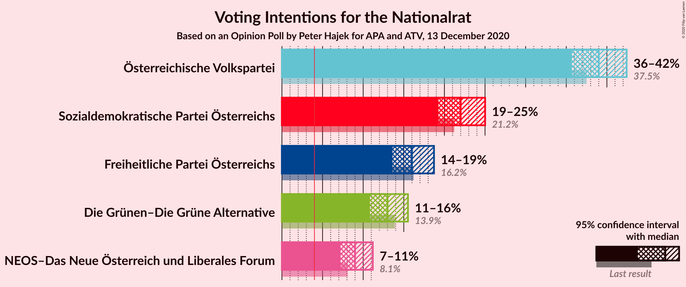

### Confidence Intervals

| Party | Last Result | Poll Result | 80% Confidence Interval | 90% Confidence Interval | 95% Confidence Interval | 99% Confidence Interval |
|:-----:|:-----------:|:-----------:|:-----------------------:|:-----------------------:|:-----------------------:|:-----------------------:|
| Österreichische Volkspartei | 37.5% | 39.0% | 36.8–41.2% |36.2–41.9% |35.7–42.4% |34.6–43.5% |
| Sozialdemokratische Partei Österreichs | 21.2% | 22.0% | 20.2–24.0% |19.7–24.5% |19.3–25.0% |18.4–26.0% |
| Freiheitliche Partei Österreichs | 16.2% | 16.0% | 14.4–17.8% |14.0–18.3% |13.6–18.7% |12.9–19.6% |
| Die Grünen–Die Grüne Alternative | 13.9% | 13.0% | 11.6–14.6% |11.2–15.1% |10.8–15.5% |10.2–16.3% |
| NEOS–Das Neue Österreich und Liberales Forum | 8.1% | 9.0% | 7.8–10.4% |7.5–10.8% |7.2–11.2% |6.7–11.9% |

*Note:* The poll result column reflects the actual value used in the calculations. Published results may vary slightly, and in addition be rounded to fewer digits.

## Seats

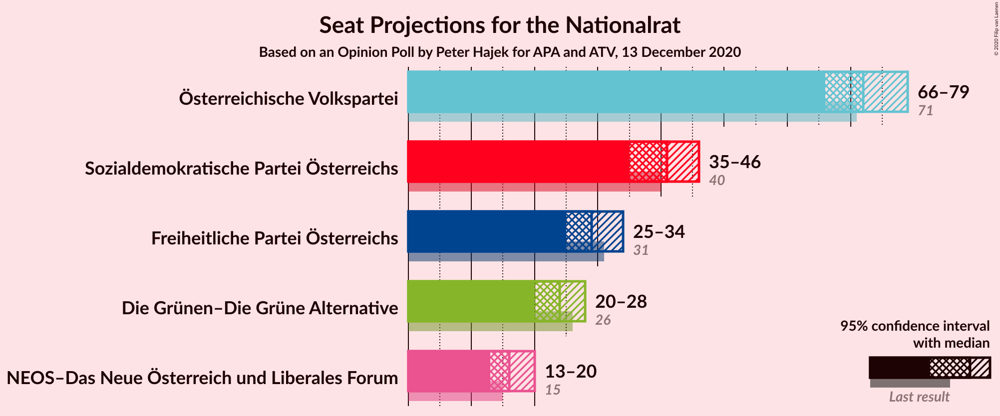

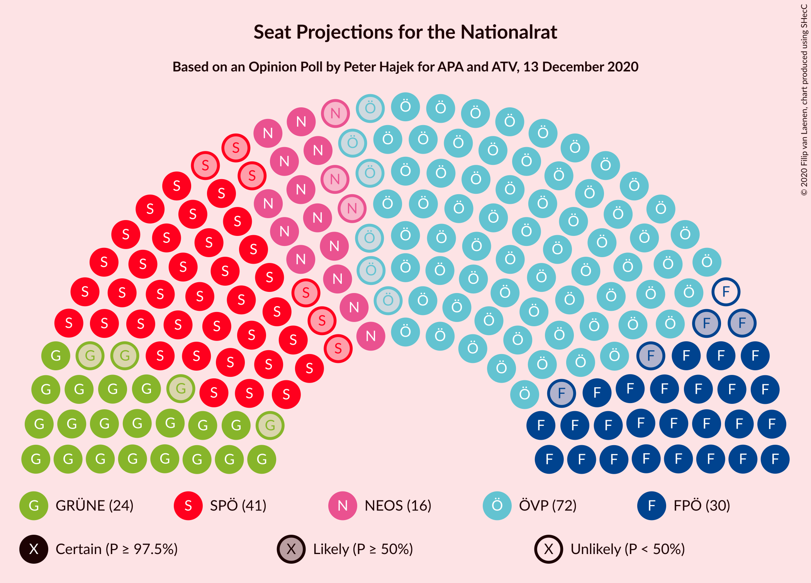

### Confidence Intervals

| Party | Last Result | Median | 80% Confidence Interval | 90% Confidence Interval | 95% Confidence Interval | 99% Confidence Interval |
|:-----:|:-----------:|:------:|:-----------------------:|:-----------------------:|:-----------------------:|:-----------------------:|
| <a href="#österreichische-volkspartei">Österreichische Volkspartei</a> | 71 | 72 | 68–76 |67–78 |66–79 |64–81 |
| <a href="#sozialdemokratische-partei-österreichs">Sozialdemokratische Partei Österreichs</a> | 40 | 41 | 37–44 |36–45 |35–46 |34–48 |
| <a href="#freiheitliche-partei-österreichs">Freiheitliche Partei Österreichs</a> | 31 | 29 | 26–33 |26–34 |25–34 |24–36 |
| <a href="#die-grünen–die-grüne-alternative">Die Grünen–Die Grüne Alternative</a> | 26 | 24 | 21–27 |20–28 |20–28 |19–30 |
| <a href="#neos–das-neue-österreich-und-liberales-forum">NEOS–Das Neue Österreich und Liberales Forum</a> | 15 | 16 | 14–19 |14–20 |13–20 |12–22 |

### Österreichische Volkspartei

*For a full overview of the results for this party, see the [Österreichische Volkspartei](party-österreichischevolkspartei.html) page.*

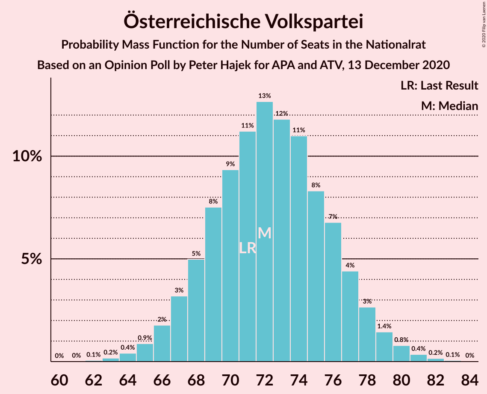

| Number of Seats | Probability | Accumulated | Special Marks |
|:---------------:|:-----------:|:-----------:|:-------------:|
| 62 | 0.1% | 100% |  |
| 63 | 0.2% | 99.9% |  |
| 64 | 0.4% | 99.7% |  |
| 65 | 0.9% | 99.3% |  |
| 66 | 2% | 98% |  |
| 67 | 3% | 97% |  |
| 68 | 5% | 93% |  |
| 69 | 8% | 89% |  |
| 70 | 9% | 81% |  |
| 71 | 11% | 72% | Last Result |
| 72 | 13% | 60% | Median |
| 73 | 12% | 48% |  |
| 74 | 11% | 36% |  |
| 75 | 8% | 25% |  |
| 76 | 7% | 17% |  |
| 77 | 4% | 10% |  |
| 78 | 3% | 5% |  |
| 79 | 1.4% | 3% |  |
| 80 | 0.8% | 1.4% |  |
| 81 | 0.4% | 0.6% |  |
| 82 | 0.2% | 0.2% |  |
| 83 | 0.1% | 0.1% |  |
| 84 | 0% | 0% |  |

### Sozialdemokratische Partei Österreichs

*For a full overview of the results for this party, see the [Sozialdemokratische Partei Österreichs](party-sozialdemokratischeparteiösterreichs.html) page.*

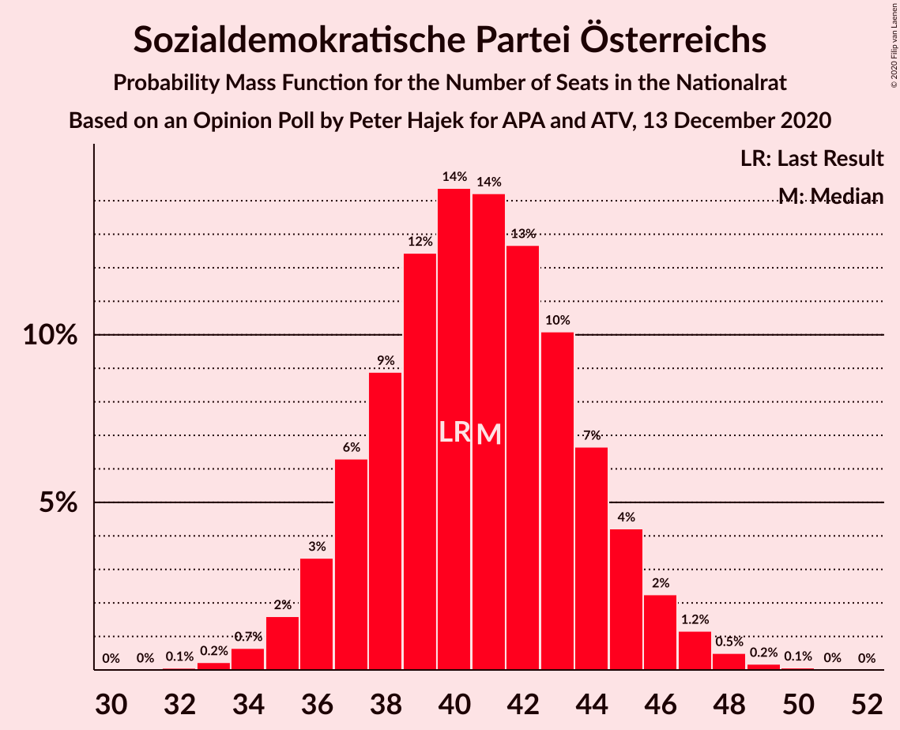

| Number of Seats | Probability | Accumulated | Special Marks |
|:---------------:|:-----------:|:-----------:|:-------------:|
| 32 | 0.1% | 100% |  |
| 33 | 0.2% | 99.9% |  |
| 34 | 0.7% | 99.7% |  |
| 35 | 2% | 99.0% |  |
| 36 | 3% | 97% |  |
| 37 | 6% | 94% |  |
| 38 | 9% | 88% |  |
| 39 | 12% | 79% |  |
| 40 | 14% | 66% | Last Result |
| 41 | 14% | 52% | Median |
| 42 | 13% | 38% |  |
| 43 | 10% | 25% |  |
| 44 | 7% | 15% |  |
| 45 | 4% | 8% |  |
| 46 | 2% | 4% |  |
| 47 | 1.2% | 2% |  |
| 48 | 0.5% | 0.8% |  |
| 49 | 0.2% | 0.3% |  |
| 50 | 0.1% | 0.1% |  |
| 51 | 0% | 0% |  |

### Freiheitliche Partei Österreichs

*For a full overview of the results for this party, see the [Freiheitliche Partei Österreichs](party-freiheitlicheparteiösterreichs.html) page.*

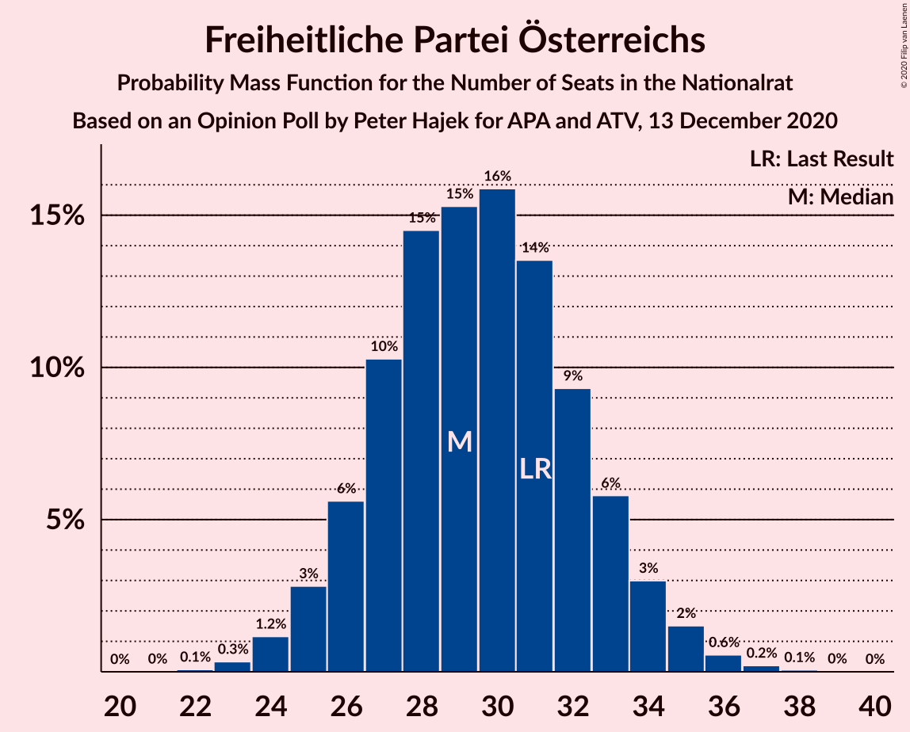

| Number of Seats | Probability | Accumulated | Special Marks |
|:---------------:|:-----------:|:-----------:|:-------------:|
| 22 | 0.1% | 100% |  |
| 23 | 0.3% | 99.9% |  |
| 24 | 1.2% | 99.6% |  |
| 25 | 3% | 98% |  |
| 26 | 6% | 96% |  |
| 27 | 10% | 90% |  |
| 28 | 15% | 80% |  |
| 29 | 15% | 65% | Median |
| 30 | 16% | 50% |  |
| 31 | 14% | 34% | Last Result |
| 32 | 9% | 20% |  |
| 33 | 6% | 11% |  |
| 34 | 3% | 5% |  |
| 35 | 2% | 2% |  |
| 36 | 0.6% | 0.9% |  |
| 37 | 0.2% | 0.3% |  |
| 38 | 0.1% | 0.1% |  |
| 39 | 0% | 0% |  |

### Die Grünen–Die Grüne Alternative

*For a full overview of the results for this party, see the [Die Grünen–Die Grüne Alternative](party-diegrünen–diegrünealternative.html) page.*

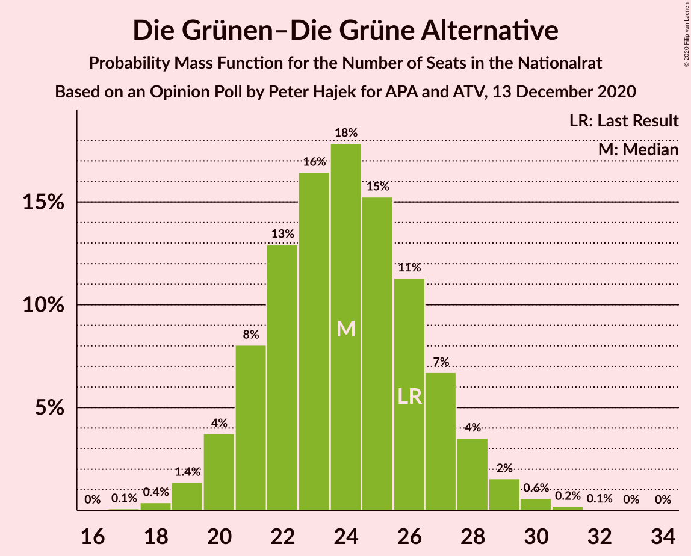

| Number of Seats | Probability | Accumulated | Special Marks |
|:---------------:|:-----------:|:-----------:|:-------------:|
| 17 | 0.1% | 100% |  |
| 18 | 0.4% | 99.9% |  |
| 19 | 1.4% | 99.5% |  |
| 20 | 4% | 98% |  |
| 21 | 8% | 94% |  |
| 22 | 13% | 86% |  |
| 23 | 16% | 73% |  |
| 24 | 18% | 57% | Median |
| 25 | 15% | 39% |  |
| 26 | 11% | 24% | Last Result |
| 27 | 7% | 13% |  |
| 28 | 4% | 6% |  |
| 29 | 2% | 2% |  |
| 30 | 0.6% | 0.8% |  |
| 31 | 0.2% | 0.3% |  |
| 32 | 0.1% | 0.1% |  |
| 33 | 0% | 0% |  |

### NEOS–Das Neue Österreich und Liberales Forum

*For a full overview of the results for this party, see the [NEOS–Das Neue Österreich und Liberales Forum](party-neos–dasneueösterreichundliberalesforum.html) page.*

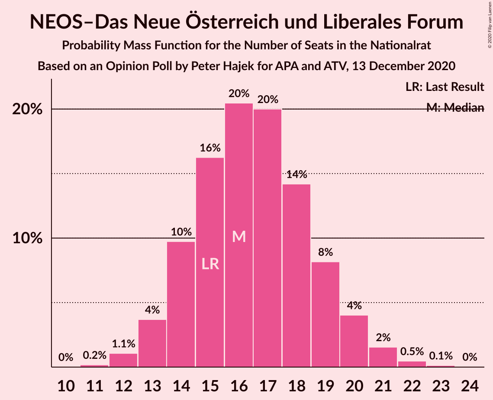

| Number of Seats | Probability | Accumulated | Special Marks |
|:---------------:|:-----------:|:-----------:|:-------------:|
| 11 | 0.2% | 100% |  |
| 12 | 1.1% | 99.8% |  |
| 13 | 4% | 98.7% |  |
| 14 | 10% | 95% |  |
| 15 | 16% | 85% | Last Result |
| 16 | 20% | 69% | Median |
| 17 | 20% | 49% |  |
| 18 | 14% | 29% |  |
| 19 | 8% | 14% |  |
| 20 | 4% | 6% |  |
| 21 | 2% | 2% |  |
| 22 | 0.5% | 0.6% |  |
| 23 | 0.1% | 0.2% |  |
| 24 | 0% | 0% |  |

## Coalitions

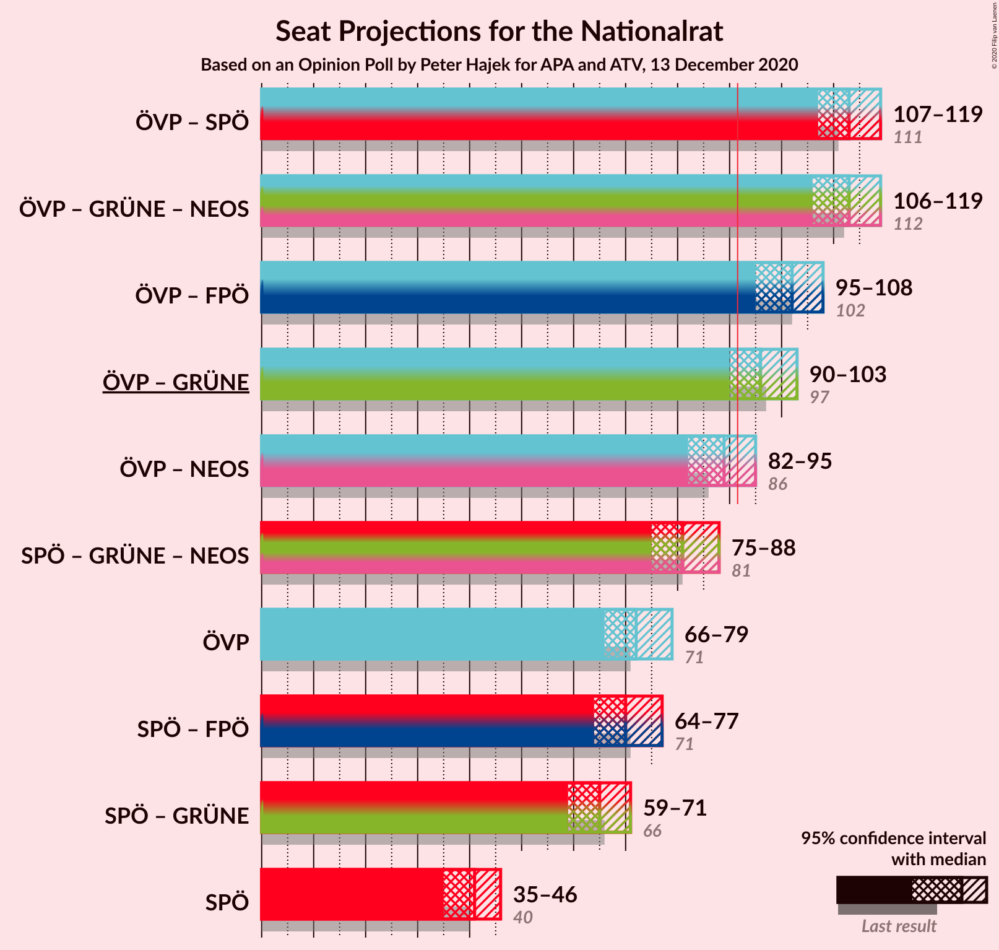

### Confidence Intervals

| Coalition | Last Result | Median | Majority? | 80% Confidence Interval | 90% Confidence Interval | 95% Confidence Interval | 99% Confidence Interval |
|:---------:|:-----------:|:------:|:---------:|:-----------------------:|:-----------------------:|:-----------------------:|:-----------------------:|
| Österreichische Volkspartei – Sozialdemokratische Partei Österreichs | 111 | 113 | 100% | 109–117 | 108–118 | 107–119 | 105–121 |
| Österreichische Volkspartei – Die Grünen–Die Grüne Alternative – NEOS–Das Neue Österreich und Liberales Forum | 112 | 113 | 100% | 109–117 | 107–118 | 106–119 | 104–121 |
| Österreichische Volkspartei – Freiheitliche Partei Österreichs | 102 | 102 | 99.9% | 98–106 | 96–107 | 95–108 | 93–110 |
| Österreichische Volkspartei – Die Grünen–Die Grüne Alternative | 97 | 96 | 93% | 92–100 | 91–102 | 90–103 | 88–105 |
| Österreichische Volkspartei – NEOS–Das Neue Österreich und Liberales Forum | 86 | 89 | 21% | 85–93 | 83–94 | 82–95 | 80–97 |
| Sozialdemokratische Partei Österreichs – Die Grünen–Die Grüne Alternative – NEOS–Das Neue Österreich und Liberales Forum | 81 | 81 | 0.1% | 77–85 | 76–87 | 75–88 | 73–90 |
| Österreichische Volkspartei | 71 | 72 | 0% | 68–76 | 67–78 | 66–79 | 64–81 |
| Sozialdemokratische Partei Österreichs – Freiheitliche Partei Österreichs | 71 | 70 | 0% | 66–74 | 65–76 | 64–77 | 62–79 |
| Sozialdemokratische Partei Österreichs – Die Grünen–Die Grüne Alternative | 66 | 65 | 0% | 61–69 | 60–70 | 59–71 | 57–73 |
| Sozialdemokratische Partei Österreichs | 40 | 41 | 0% | 37–44 | 36–45 | 35–46 | 34–48 |

### Österreichische Volkspartei – Sozialdemokratische Partei Österreichs

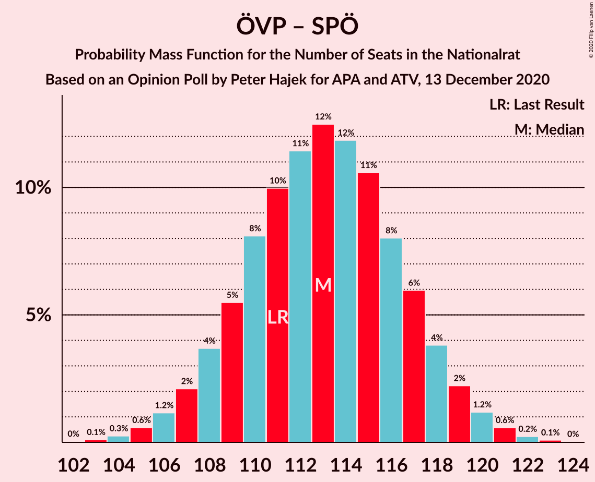

| Number of Seats | Probability | Accumulated | Special Marks |
|:---------------:|:-----------:|:-----------:|:-------------:|
| 102 | 0% | 100% |  |
| 103 | 0.1% | 99.9% |  |
| 104 | 0.3% | 99.8% |  |
| 105 | 0.6% | 99.6% |  |
| 106 | 1.2% | 99.0% |  |
| 107 | 2% | 98% |  |
| 108 | 4% | 96% |  |
| 109 | 5% | 92% |  |
| 110 | 8% | 87% |  |
| 111 | 10% | 78% | Last Result |
| 112 | 11% | 68% |  |
| 113 | 12% | 57% | Median |
| 114 | 12% | 45% |  |
| 115 | 11% | 33% |  |
| 116 | 8% | 22% |  |
| 117 | 6% | 14% |  |
| 118 | 4% | 8% |  |
| 119 | 2% | 4% |  |
| 120 | 1.2% | 2% |  |
| 121 | 0.6% | 0.9% |  |
| 122 | 0.2% | 0.4% |  |
| 123 | 0.1% | 0.1% |  |
| 124 | 0% | 0% |  |

### Österreichische Volkspartei – Die Grünen–Die Grüne Alternative – NEOS–Das Neue Österreich und Liberales Forum

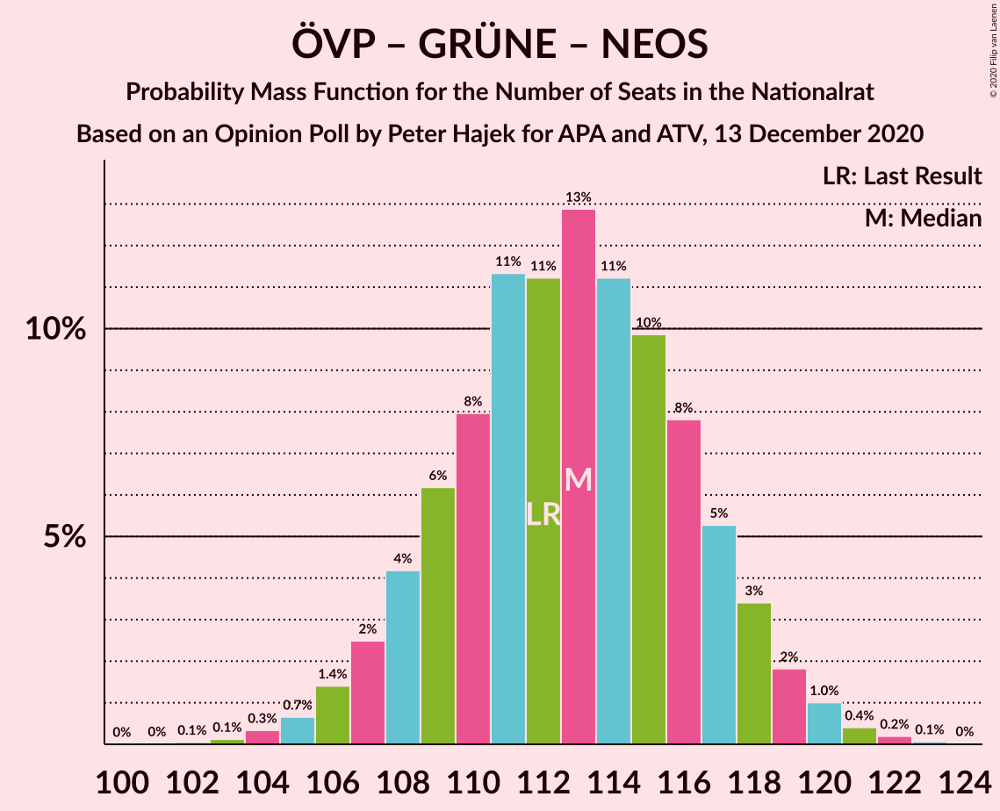

| Number of Seats | Probability | Accumulated | Special Marks |
|:---------------:|:-----------:|:-----------:|:-------------:|
| 102 | 0.1% | 100% |  |
| 103 | 0.1% | 99.9% |  |
| 104 | 0.3% | 99.8% |  |
| 105 | 0.7% | 99.5% |  |
| 106 | 1.4% | 98.8% |  |
| 107 | 2% | 97% |  |
| 108 | 4% | 95% |  |
| 109 | 6% | 91% |  |
| 110 | 8% | 85% |  |
| 111 | 11% | 77% |  |
| 112 | 11% | 65% | Last Result, Median |
| 113 | 13% | 54% |  |
| 114 | 11% | 41% |  |
| 115 | 10% | 30% |  |
| 116 | 8% | 20% |  |
| 117 | 5% | 12% |  |
| 118 | 3% | 7% |  |
| 119 | 2% | 4% |  |
| 120 | 1.0% | 2% |  |
| 121 | 0.4% | 0.7% |  |
| 122 | 0.2% | 0.3% |  |
| 123 | 0.1% | 0.1% |  |
| 124 | 0% | 0% |  |

### Österreichische Volkspartei – Freiheitliche Partei Österreichs

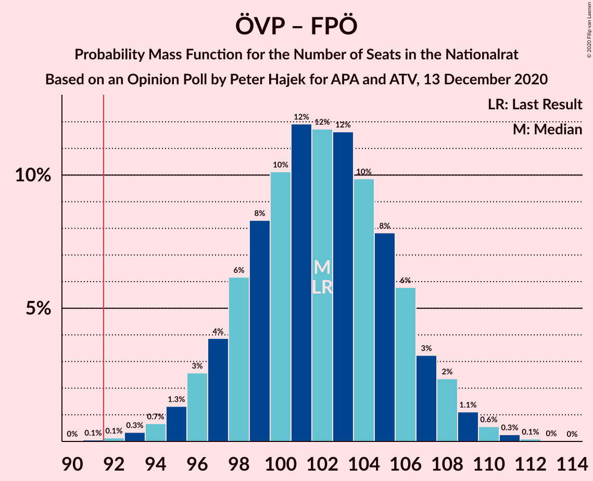

| Number of Seats | Probability | Accumulated | Special Marks |
|:---------------:|:-----------:|:-----------:|:-------------:|
| 91 | 0.1% | 100% |  |
| 92 | 0.1% | 99.9% | Majority |
| 93 | 0.3% | 99.8% |  |
| 94 | 0.7% | 99.4% |  |
| 95 | 1.3% | 98.8% |  |
| 96 | 3% | 97% |  |
| 97 | 4% | 95% |  |
| 98 | 6% | 91% |  |
| 99 | 8% | 85% |  |
| 100 | 10% | 77% |  |
| 101 | 12% | 66% | Median |
| 102 | 12% | 54% | Last Result |
| 103 | 12% | 43% |  |
| 104 | 10% | 31% |  |
| 105 | 8% | 21% |  |
| 106 | 6% | 13% |  |
| 107 | 3% | 8% |  |
| 108 | 2% | 4% |  |
| 109 | 1.1% | 2% |  |
| 110 | 0.6% | 1.0% |  |
| 111 | 0.3% | 0.4% |  |
| 112 | 0.1% | 0.1% |  |
| 113 | 0% | 0.1% |  |
| 114 | 0% | 0% |  |

### Österreichische Volkspartei – Die Grünen–Die Grüne Alternative

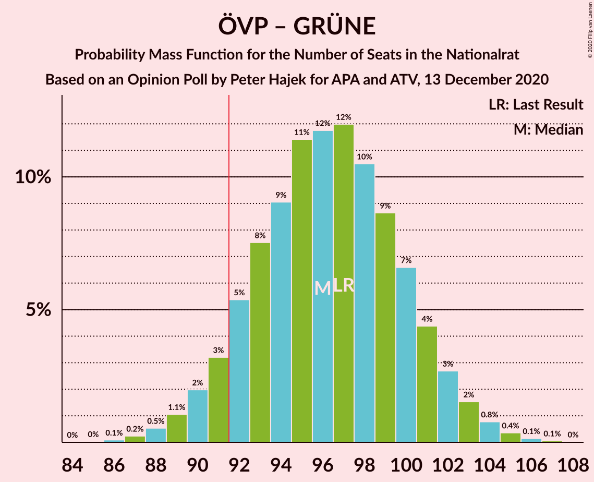

| Number of Seats | Probability | Accumulated | Special Marks |
|:---------------:|:-----------:|:-----------:|:-------------:|
| 85 | 0% | 100% |  |
| 86 | 0.1% | 99.9% |  |
| 87 | 0.2% | 99.9% |  |
| 88 | 0.5% | 99.6% |  |
| 89 | 1.1% | 99.1% |  |
| 90 | 2% | 98% |  |
| 91 | 3% | 96% |  |
| 92 | 5% | 93% | Majority |
| 93 | 8% | 87% |  |
| 94 | 9% | 80% |  |
| 95 | 11% | 71% |  |
| 96 | 12% | 59% | Median |
| 97 | 12% | 48% | Last Result |
| 98 | 10% | 36% |  |
| 99 | 9% | 25% |  |
| 100 | 7% | 17% |  |
| 101 | 4% | 10% |  |
| 102 | 3% | 6% |  |
| 103 | 2% | 3% |  |
| 104 | 0.8% | 1.4% |  |
| 105 | 0.4% | 0.6% |  |
| 106 | 0.1% | 0.2% |  |
| 107 | 0.1% | 0.1% |  |
| 108 | 0% | 0% |  |

### Österreichische Volkspartei – NEOS–Das Neue Österreich und Liberales Forum

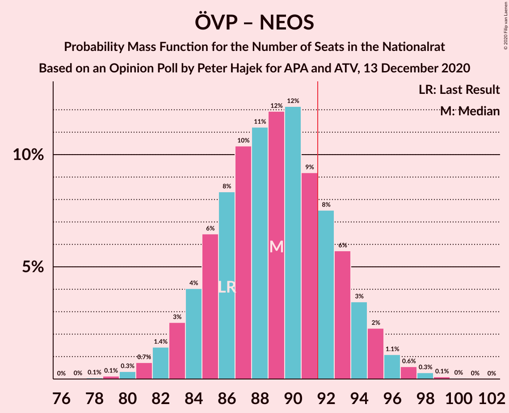

| Number of Seats | Probability | Accumulated | Special Marks |
|:---------------:|:-----------:|:-----------:|:-------------:|
| 78 | 0.1% | 100% |  |
| 79 | 0.1% | 99.9% |  |
| 80 | 0.3% | 99.8% |  |
| 81 | 0.7% | 99.5% |  |
| 82 | 1.4% | 98.7% |  |
| 83 | 3% | 97% |  |
| 84 | 4% | 95% |  |
| 85 | 6% | 91% |  |
| 86 | 8% | 84% | Last Result |
| 87 | 10% | 76% |  |
| 88 | 11% | 66% | Median |
| 89 | 12% | 54% |  |
| 90 | 12% | 42% |  |
| 91 | 9% | 30% |  |
| 92 | 8% | 21% | Majority |
| 93 | 6% | 14% |  |
| 94 | 3% | 8% |  |
| 95 | 2% | 4% |  |
| 96 | 1.1% | 2% |  |
| 97 | 0.6% | 1.0% |  |
| 98 | 0.3% | 0.4% |  |
| 99 | 0.1% | 0.2% |  |
| 100 | 0% | 0.1% |  |
| 101 | 0% | 0% |  |

### Sozialdemokratische Partei Österreichs – Die Grünen–Die Grüne Alternative – NEOS–Das Neue Österreich und Liberales Forum

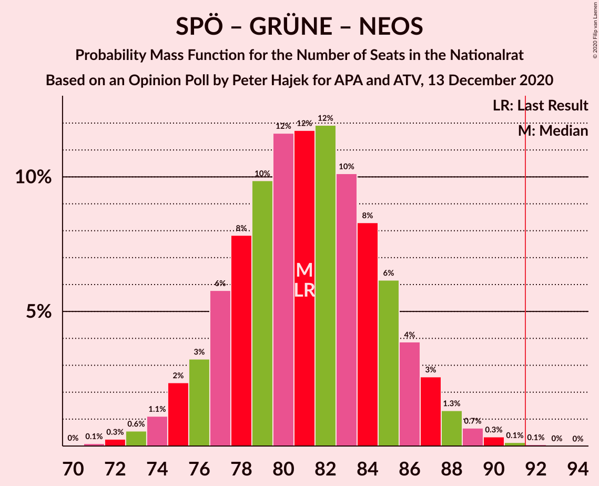

| Number of Seats | Probability | Accumulated | Special Marks |
|:---------------:|:-----------:|:-----------:|:-------------:|
| 70 | 0% | 100% |  |
| 71 | 0.1% | 99.9% |  |
| 72 | 0.3% | 99.9% |  |
| 73 | 0.6% | 99.6% |  |
| 74 | 1.1% | 99.0% |  |
| 75 | 2% | 98% |  |
| 76 | 3% | 96% |  |
| 77 | 6% | 92% |  |
| 78 | 8% | 87% |  |
| 79 | 10% | 79% |  |
| 80 | 12% | 69% |  |
| 81 | 12% | 57% | Last Result, Median |
| 82 | 12% | 46% |  |
| 83 | 10% | 34% |  |
| 84 | 8% | 23% |  |
| 85 | 6% | 15% |  |
| 86 | 4% | 9% |  |
| 87 | 3% | 5% |  |
| 88 | 1.3% | 3% |  |
| 89 | 0.7% | 1.2% |  |
| 90 | 0.3% | 0.6% |  |
| 91 | 0.1% | 0.2% |  |
| 92 | 0.1% | 0.1% | Majority |
| 93 | 0% | 0% |  |

### Österreichische Volkspartei

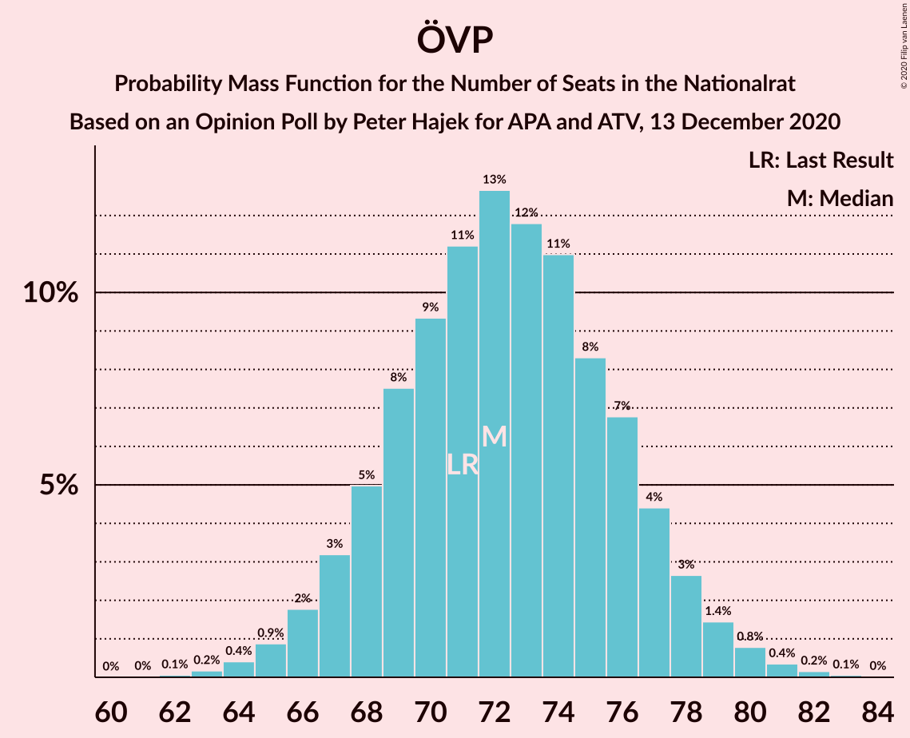

| Number of Seats | Probability | Accumulated | Special Marks |
|:---------------:|:-----------:|:-----------:|:-------------:|
| 62 | 0.1% | 100% |  |
| 63 | 0.2% | 99.9% |  |
| 64 | 0.4% | 99.7% |  |
| 65 | 0.9% | 99.3% |  |
| 66 | 2% | 98% |  |
| 67 | 3% | 97% |  |
| 68 | 5% | 93% |  |
| 69 | 8% | 89% |  |
| 70 | 9% | 81% |  |
| 71 | 11% | 72% | Last Result |
| 72 | 13% | 60% | Median |
| 73 | 12% | 48% |  |
| 74 | 11% | 36% |  |
| 75 | 8% | 25% |  |
| 76 | 7% | 17% |  |
| 77 | 4% | 10% |  |
| 78 | 3% | 5% |  |
| 79 | 1.4% | 3% |  |
| 80 | 0.8% | 1.4% |  |
| 81 | 0.4% | 0.6% |  |
| 82 | 0.2% | 0.2% |  |
| 83 | 0.1% | 0.1% |  |
| 84 | 0% | 0% |  |

### Sozialdemokratische Partei Österreichs – Freiheitliche Partei Österreichs

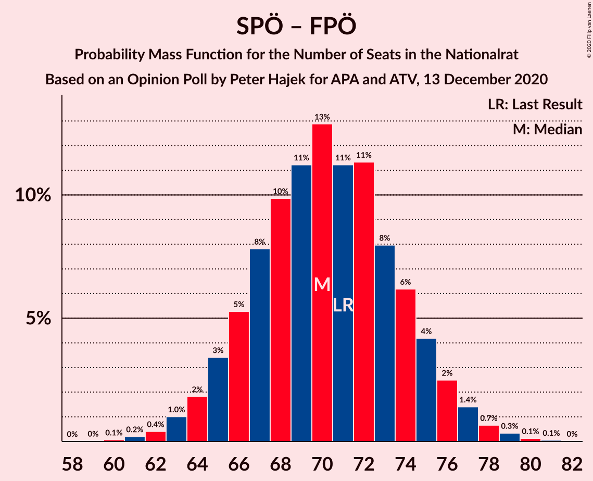

| Number of Seats | Probability | Accumulated | Special Marks |
|:---------------:|:-----------:|:-----------:|:-------------:|
| 60 | 0.1% | 100% |  |
| 61 | 0.2% | 99.9% |  |
| 62 | 0.4% | 99.7% |  |
| 63 | 1.0% | 99.3% |  |
| 64 | 2% | 98% |  |
| 65 | 3% | 96% |  |
| 66 | 5% | 93% |  |
| 67 | 8% | 88% |  |
| 68 | 10% | 80% |  |
| 69 | 11% | 70% |  |
| 70 | 13% | 59% | Median |
| 71 | 11% | 46% | Last Result |
| 72 | 11% | 35% |  |
| 73 | 8% | 23% |  |
| 74 | 6% | 15% |  |
| 75 | 4% | 9% |  |
| 76 | 2% | 5% |  |
| 77 | 1.4% | 3% |  |
| 78 | 0.7% | 1.2% |  |
| 79 | 0.3% | 0.5% |  |
| 80 | 0.1% | 0.2% |  |
| 81 | 0.1% | 0.1% |  |
| 82 | 0% | 0% |  |

### Sozialdemokratische Partei Österreichs – Die Grünen–Die Grüne Alternative

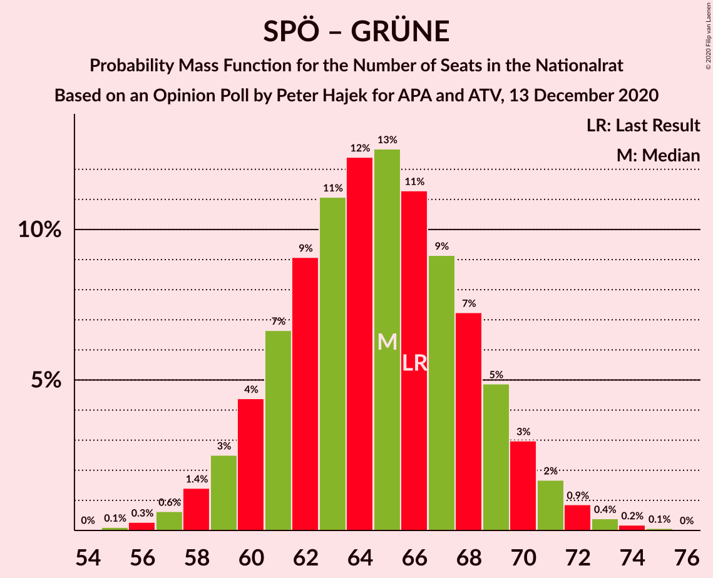

| Number of Seats | Probability | Accumulated | Special Marks |
|:---------------:|:-----------:|:-----------:|:-------------:|
| 55 | 0.1% | 100% |  |
| 56 | 0.3% | 99.8% |  |
| 57 | 0.6% | 99.6% |  |
| 58 | 1.4% | 98.9% |  |
| 59 | 3% | 98% |  |
| 60 | 4% | 95% |  |
| 61 | 7% | 91% |  |
| 62 | 9% | 84% |  |
| 63 | 11% | 75% |  |
| 64 | 12% | 64% |  |
| 65 | 13% | 51% | Median |
| 66 | 11% | 39% | Last Result |
| 67 | 9% | 27% |  |
| 68 | 7% | 18% |  |
| 69 | 5% | 11% |  |
| 70 | 3% | 6% |  |
| 71 | 2% | 3% |  |
| 72 | 0.9% | 2% |  |
| 73 | 0.4% | 0.7% |  |
| 74 | 0.2% | 0.3% |  |
| 75 | 0.1% | 0.1% |  |
| 76 | 0% | 0% |  |

### Sozialdemokratische Partei Österreichs

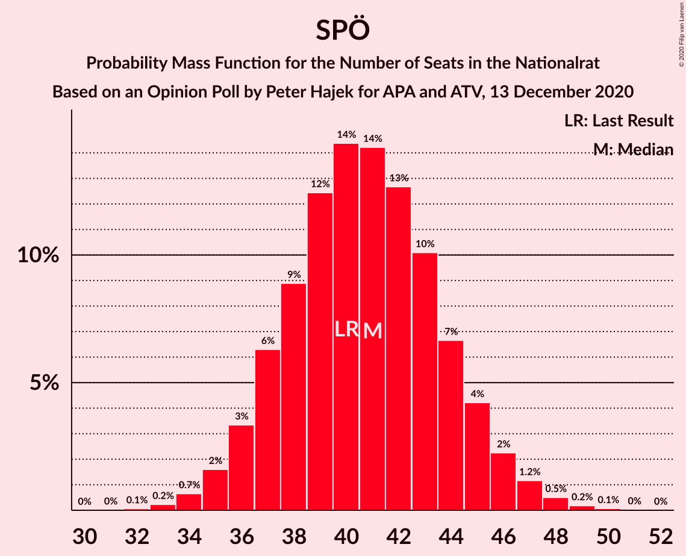

| Number of Seats | Probability | Accumulated | Special Marks |
|:---------------:|:-----------:|:-----------:|:-------------:|
| 32 | 0.1% | 100% |  |
| 33 | 0.2% | 99.9% |  |
| 34 | 0.7% | 99.7% |  |
| 35 | 2% | 99.0% |  |
| 36 | 3% | 97% |  |
| 37 | 6% | 94% |  |
| 38 | 9% | 88% |  |
| 39 | 12% | 79% |  |
| 40 | 14% | 66% | Last Result |
| 41 | 14% | 52% | Median |
| 42 | 13% | 38% |  |
| 43 | 10% | 25% |  |
| 44 | 7% | 15% |  |
| 45 | 4% | 8% |  |
| 46 | 2% | 4% |  |
| 47 | 1.2% | 2% |  |
| 48 | 0.5% | 0.8% |  |
| 49 | 0.2% | 0.3% |  |
| 50 | 0.1% | 0.1% |  |
| 51 | 0% | 0% |  |

## Technical Information

### Opinion Poll

+ **Polling firm:** Peter Hajek
+ **Commissioner(s):** APA and ATV
+ **Fieldwork period:** 13 December 2020

### Calculations

+ **Sample size:** 800
+ **Simulations done:** 1,048,576
+ **Error estimate:** 0.55%

