# Opinion Poll by OGM for KURIER, 15–17 December 2020

<a href="#voting-intentions">Voting Intentions</a> | <a href="#seats">Seats</a> | <a href="#coalitions">Coalitions</a> | <a href="#technical-information">Technical Information</a>

## Voting Intentions

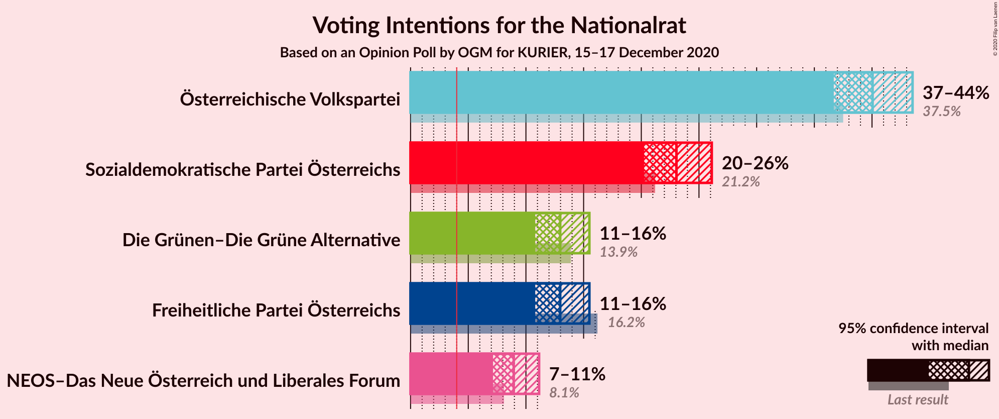

### Confidence Intervals

| Party | Last Result | Poll Result | 80% Confidence Interval | 90% Confidence Interval | 95% Confidence Interval | 99% Confidence Interval |
|:-----:|:-----------:|:-----------:|:-----------------------:|:-----------------------:|:-----------------------:|:-----------------------:|
| Österreichische Volkspartei | 37.5% | 40.1% | 37.8–42.3% |37.2–43.0% |36.7–43.5% |35.7–44.6% |
| Sozialdemokratische Partei Österreichs | 21.2% | 23.0% | 21.2–25.1% |20.7–25.6% |20.2–26.1% |19.4–27.1% |
| Freiheitliche Partei Österreichs | 16.2% | 13.0% | 11.6–14.6% |11.1–15.1% |10.8–15.5% |10.2–16.3% |
| Die Grünen–Die Grüne Alternative | 13.9% | 13.0% | 11.6–14.6% |11.1–15.1% |10.8–15.5% |10.2–16.3% |
| NEOS–Das Neue Österreich und Liberales Forum | 8.1% | 8.9% | 7.8–10.4% |7.4–10.8% |7.1–11.1% |6.6–11.9% |

*Note:* The poll result column reflects the actual value used in the calculations. Published results may vary slightly, and in addition be rounded to fewer digits.

## Seats

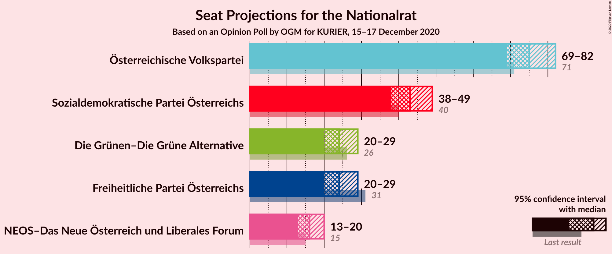

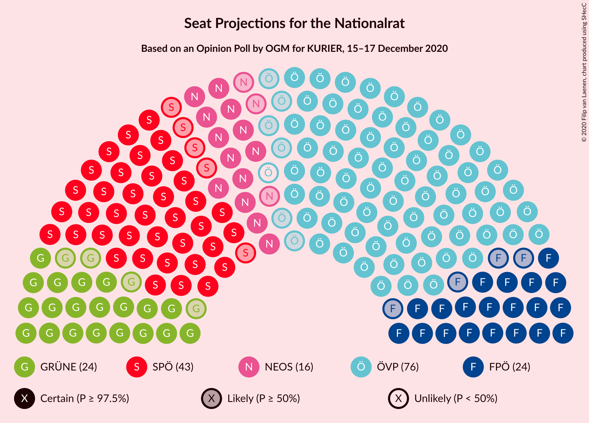

### Confidence Intervals

| Party | Last Result | Median | 80% Confidence Interval | 90% Confidence Interval | 95% Confidence Interval | 99% Confidence Interval |
|:-----:|:-----------:|:------:|:-----------------------:|:-----------------------:|:-----------------------:|:-----------------------:|
| <a href="#österreichische-volkspartei">Österreichische Volkspartei</a> | 71 | 75 | 71–79 |70–80 |69–82 |67–84 |
| <a href="#sozialdemokratische-partei-österreichs">Sozialdemokratische Partei Österreichs</a> | 40 | 43 | 40–47 |39–48 |38–49 |36–50 |
| <a href="#freiheitliche-partei-österreichs">Freiheitliche Partei Österreichs</a> | 31 | 24 | 21–27 |21–28 |20–29 |19–30 |
| <a href="#die-grünen–die-grüne-alternative">Die Grünen–Die Grüne Alternative</a> | 26 | 24 | 21–27 |21–28 |20–29 |19–30 |
| <a href="#neos–das-neue-österreich-und-liberales-forum">NEOS–Das Neue Österreich und Liberales Forum</a> | 15 | 16 | 14–19 |14–20 |13–20 |12–22 |

### Österreichische Volkspartei

*For a full overview of the results for this party, see the [Österreichische Volkspartei](party-österreichischevolkspartei.html) page.*

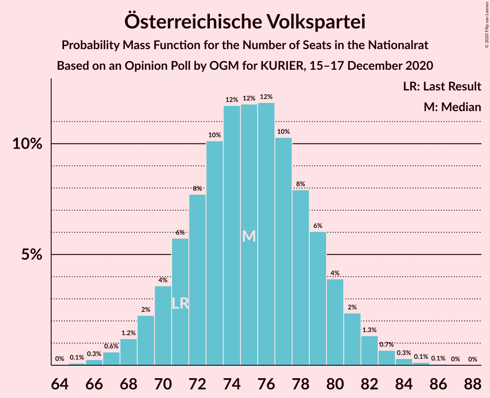

| Number of Seats | Probability | Accumulated | Special Marks |
|:---------------:|:-----------:|:-----------:|:-------------:|
| 65 | 0.1% | 100% |  |
| 66 | 0.3% | 99.9% |  |
| 67 | 0.6% | 99.6% |  |
| 68 | 1.2% | 99.0% |  |
| 69 | 2% | 98% |  |
| 70 | 4% | 96% |  |
| 71 | 6% | 92% | Last Result |
| 72 | 8% | 86% |  |
| 73 | 10% | 79% |  |
| 74 | 12% | 68% |  |
| 75 | 12% | 57% | Median |
| 76 | 12% | 45% |  |
| 77 | 10% | 33% |  |
| 78 | 8% | 23% |  |
| 79 | 6% | 15% |  |
| 80 | 4% | 9% |  |
| 81 | 2% | 5% |  |
| 82 | 1.3% | 3% |  |
| 83 | 0.7% | 1.2% |  |
| 84 | 0.3% | 0.5% |  |
| 85 | 0.1% | 0.2% |  |
| 86 | 0.1% | 0.1% |  |
| 87 | 0% | 0% |  |

### Sozialdemokratische Partei Österreichs

*For a full overview of the results for this party, see the [Sozialdemokratische Partei Österreichs](party-sozialdemokratischeparteiösterreichs.html) page.*

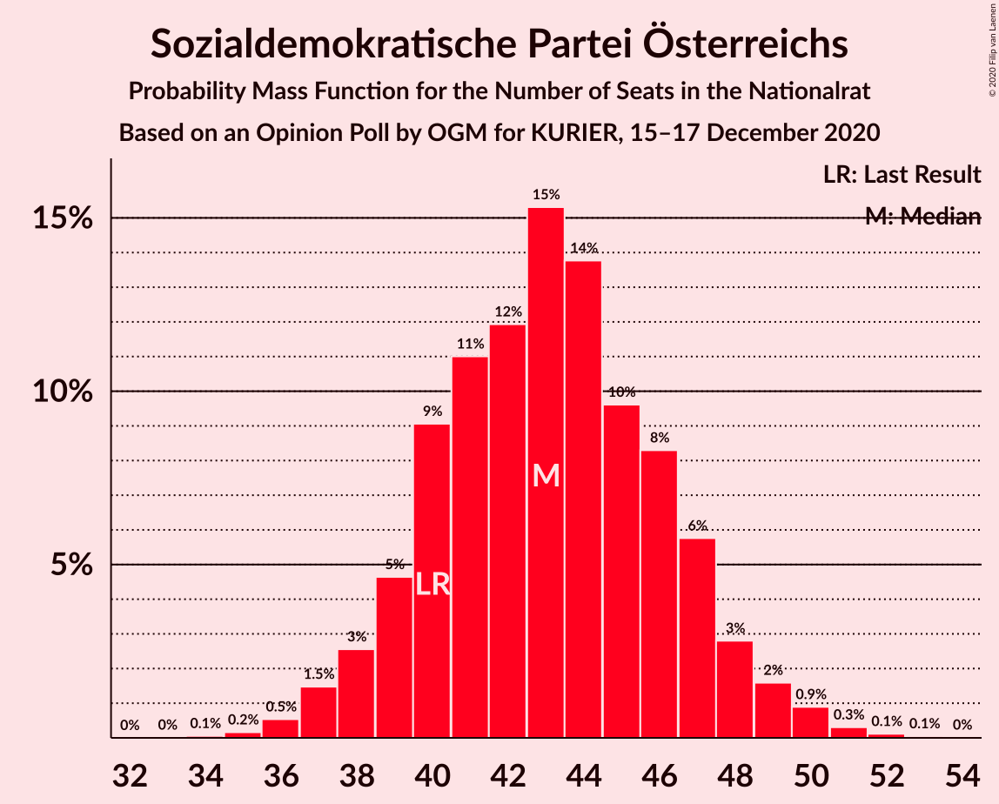

| Number of Seats | Probability | Accumulated | Special Marks |
|:---------------:|:-----------:|:-----------:|:-------------:|
| 34 | 0.1% | 100% |  |
| 35 | 0.2% | 99.9% |  |
| 36 | 0.5% | 99.8% |  |
| 37 | 1.5% | 99.2% |  |
| 38 | 3% | 98% |  |
| 39 | 5% | 95% |  |
| 40 | 9% | 91% | Last Result |
| 41 | 11% | 81% |  |
| 42 | 12% | 70% |  |
| 43 | 15% | 59% | Median |
| 44 | 14% | 43% |  |
| 45 | 10% | 29% |  |
| 46 | 8% | 20% |  |
| 47 | 6% | 12% |  |
| 48 | 3% | 6% |  |
| 49 | 2% | 3% |  |
| 50 | 0.9% | 1.4% |  |
| 51 | 0.3% | 0.5% |  |
| 52 | 0.1% | 0.2% |  |
| 53 | 0.1% | 0.1% |  |
| 54 | 0% | 0% |  |

### Freiheitliche Partei Österreichs

*For a full overview of the results for this party, see the [Freiheitliche Partei Österreichs](party-freiheitlicheparteiösterreichs.html) page.*

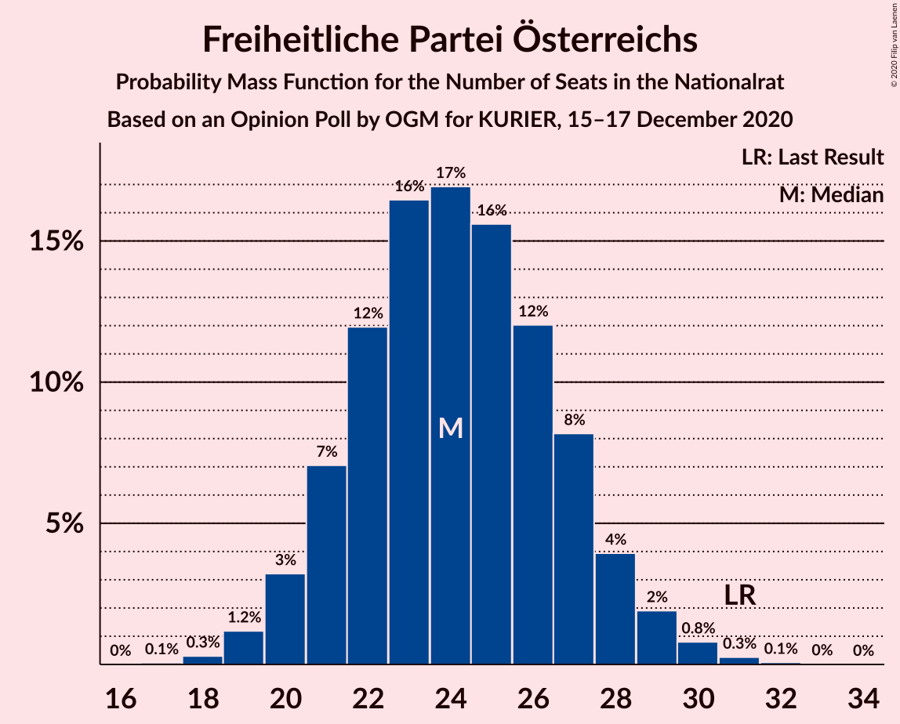

| Number of Seats | Probability | Accumulated | Special Marks |
|:---------------:|:-----------:|:-----------:|:-------------:|
| 17 | 0.1% | 100% |  |
| 18 | 0.3% | 99.9% |  |
| 19 | 1.2% | 99.6% |  |
| 20 | 3% | 98% |  |
| 21 | 7% | 95% |  |
| 22 | 12% | 88% |  |
| 23 | 16% | 76% |  |
| 24 | 17% | 60% | Median |
| 25 | 16% | 43% |  |
| 26 | 12% | 27% |  |
| 27 | 8% | 15% |  |
| 28 | 4% | 7% |  |
| 29 | 2% | 3% |  |
| 30 | 0.8% | 1.2% |  |
| 31 | 0.3% | 0.4% | Last Result |
| 32 | 0.1% | 0.1% |  |
| 33 | 0% | 0% |  |

### Die Grünen–Die Grüne Alternative

*For a full overview of the results for this party, see the [Die Grünen–Die Grüne Alternative](party-diegrünen–diegrünealternative.html) page.*

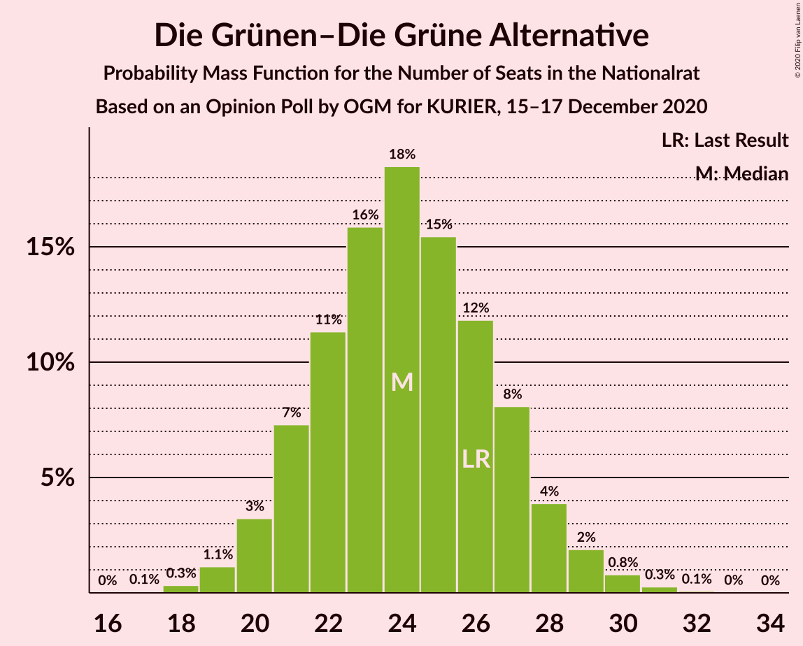

| Number of Seats | Probability | Accumulated | Special Marks |
|:---------------:|:-----------:|:-----------:|:-------------:|
| 17 | 0.1% | 100% |  |
| 18 | 0.3% | 99.9% |  |
| 19 | 1.1% | 99.6% |  |
| 20 | 3% | 98% |  |
| 21 | 7% | 95% |  |
| 22 | 11% | 88% |  |
| 23 | 16% | 77% |  |
| 24 | 18% | 61% | Median |
| 25 | 15% | 42% |  |
| 26 | 12% | 27% | Last Result |
| 27 | 8% | 15% |  |
| 28 | 4% | 7% |  |
| 29 | 2% | 3% |  |
| 30 | 0.8% | 1.2% |  |
| 31 | 0.3% | 0.4% |  |
| 32 | 0.1% | 0.1% |  |
| 33 | 0% | 0% |  |

### NEOS–Das Neue Österreich und Liberales Forum

*For a full overview of the results for this party, see the [NEOS–Das Neue Österreich und Liberales Forum](party-neos–dasneueösterreichundliberalesforum.html) page.*

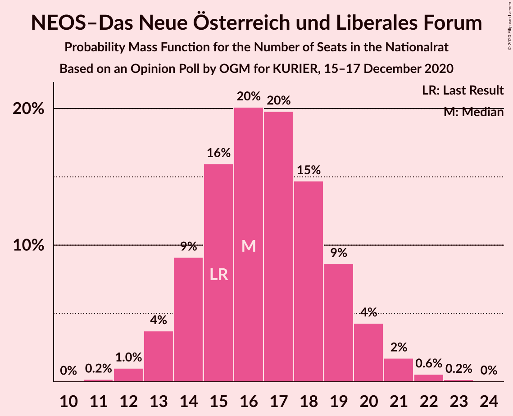

| Number of Seats | Probability | Accumulated | Special Marks |
|:---------------:|:-----------:|:-----------:|:-------------:|
| 11 | 0.2% | 100% |  |
| 12 | 1.0% | 99.8% |  |
| 13 | 4% | 98.8% |  |
| 14 | 9% | 95% |  |
| 15 | 16% | 86% | Last Result |
| 16 | 20% | 70% | Median |
| 17 | 20% | 50% |  |
| 18 | 15% | 30% |  |
| 19 | 9% | 15% |  |
| 20 | 4% | 7% |  |
| 21 | 2% | 2% |  |
| 22 | 0.6% | 0.8% |  |
| 23 | 0.2% | 0.2% |  |
| 24 | 0% | 0% |  |

## Coalitions

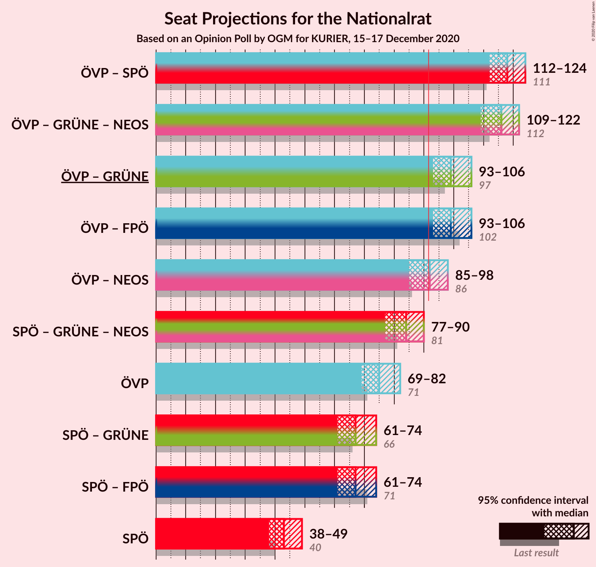

### Confidence Intervals

| Coalition | Last Result | Median | Majority? | 80% Confidence Interval | 90% Confidence Interval | 95% Confidence Interval | 99% Confidence Interval |
|:---------:|:-----------:|:------:|:---------:|:-----------------------:|:-----------------------:|:-----------------------:|:-----------------------:|
| Österreichische Volkspartei – Sozialdemokratische Partei Österreichs | 111 | 118 | 100% | 114–122 | 113–123 | 112–124 | 110–126 |
| Österreichische Volkspartei – Die Grünen–Die Grüne Alternative – NEOS–Das Neue Österreich und Liberales Forum | 112 | 116 | 100% | 112–120 | 110–121 | 109–122 | 107–124 |
| Österreichische Volkspartei – Die Grünen–Die Grüne Alternative | 97 | 99 | 99.0% | 95–103 | 94–105 | 93–106 | 91–108 |
| Österreichische Volkspartei – Freiheitliche Partei Österreichs | 102 | 99 | 99.0% | 95–103 | 94–105 | 93–106 | 91–108 |
| Österreichische Volkspartei – NEOS–Das Neue Österreich und Liberales Forum | 86 | 92 | 52% | 87–96 | 86–97 | 85–98 | 83–100 |
| Sozialdemokratische Partei Österreichs – Die Grünen–Die Grüne Alternative – NEOS–Das Neue Österreich und Liberales Forum | 81 | 84 | 1.0% | 80–88 | 78–89 | 77–90 | 75–92 |
| Österreichische Volkspartei | 71 | 75 | 0% | 71–79 | 70–80 | 69–82 | 67–84 |
| Sozialdemokratische Partei Österreichs – Die Grünen–Die Grüne Alternative | 66 | 67 | 0% | 63–71 | 62–73 | 61–74 | 59–76 |
| Sozialdemokratische Partei Österreichs – Freiheitliche Partei Österreichs | 71 | 67 | 0% | 63–71 | 62–73 | 61–74 | 59–76 |
| Sozialdemokratische Partei Österreichs | 40 | 43 | 0% | 40–47 | 39–48 | 38–49 | 36–50 |

### Österreichische Volkspartei – Sozialdemokratische Partei Österreichs

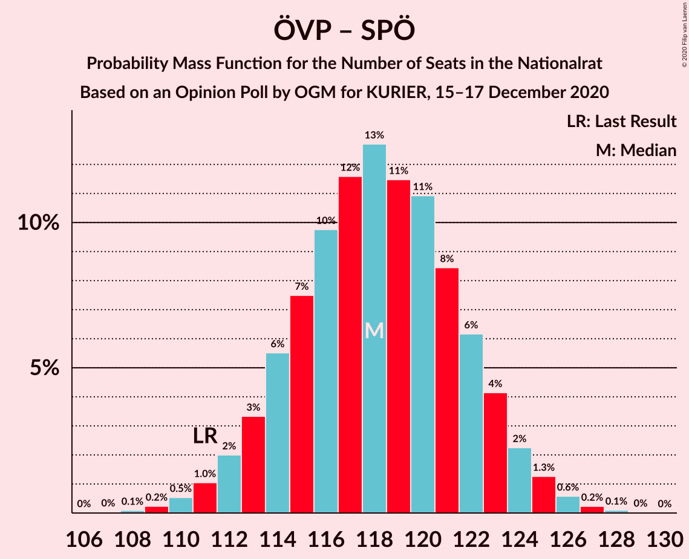

| Number of Seats | Probability | Accumulated | Special Marks |
|:---------------:|:-----------:|:-----------:|:-------------:|
| 107 | 0% | 100% |  |
| 108 | 0.1% | 99.9% |  |
| 109 | 0.2% | 99.9% |  |
| 110 | 0.5% | 99.6% |  |
| 111 | 1.0% | 99.1% | Last Result |
| 112 | 2% | 98% |  |
| 113 | 3% | 96% |  |
| 114 | 6% | 93% |  |
| 115 | 7% | 87% |  |
| 116 | 10% | 80% |  |
| 117 | 12% | 70% |  |
| 118 | 13% | 58% | Median |
| 119 | 11% | 46% |  |
| 120 | 11% | 34% |  |
| 121 | 8% | 23% |  |
| 122 | 6% | 15% |  |
| 123 | 4% | 9% |  |
| 124 | 2% | 4% |  |
| 125 | 1.3% | 2% |  |
| 126 | 0.6% | 1.0% |  |
| 127 | 0.2% | 0.4% |  |
| 128 | 0.1% | 0.1% |  |
| 129 | 0% | 0% |  |

### Österreichische Volkspartei – Die Grünen–Die Grüne Alternative – NEOS–Das Neue Österreich und Liberales Forum

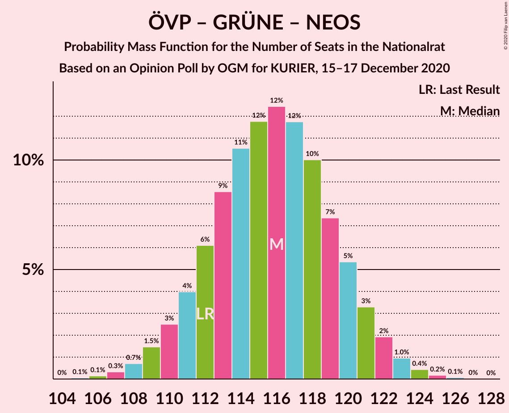

| Number of Seats | Probability | Accumulated | Special Marks |
|:---------------:|:-----------:|:-----------:|:-------------:|
| 105 | 0.1% | 100% |  |
| 106 | 0.1% | 99.9% |  |
| 107 | 0.3% | 99.8% |  |
| 108 | 0.7% | 99.4% |  |
| 109 | 1.5% | 98.7% |  |
| 110 | 3% | 97% |  |
| 111 | 4% | 95% |  |
| 112 | 6% | 91% | Last Result |
| 113 | 9% | 85% |  |
| 114 | 11% | 76% |  |
| 115 | 12% | 66% | Median |
| 116 | 12% | 54% |  |
| 117 | 12% | 41% |  |
| 118 | 10% | 30% |  |
| 119 | 7% | 20% |  |
| 120 | 5% | 12% |  |
| 121 | 3% | 7% |  |
| 122 | 2% | 4% |  |
| 123 | 1.0% | 2% |  |
| 124 | 0.4% | 0.7% |  |
| 125 | 0.2% | 0.3% |  |
| 126 | 0.1% | 0.1% |  |
| 127 | 0% | 0% |  |

### Österreichische Volkspartei – Die Grünen–Die Grüne Alternative

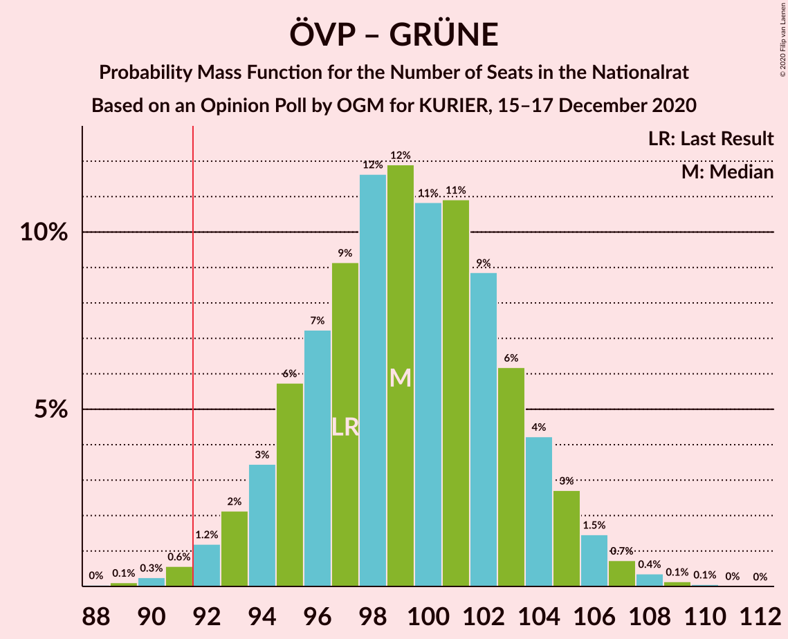

| Number of Seats | Probability | Accumulated | Special Marks |
|:---------------:|:-----------:|:-----------:|:-------------:|
| 88 | 0% | 100% |  |
| 89 | 0.1% | 99.9% |  |
| 90 | 0.3% | 99.8% |  |
| 91 | 0.6% | 99.6% |  |
| 92 | 1.2% | 99.0% | Majority |
| 93 | 2% | 98% |  |
| 94 | 3% | 96% |  |
| 95 | 6% | 92% |  |
| 96 | 7% | 86% |  |
| 97 | 9% | 79% | Last Result |
| 98 | 12% | 70% |  |
| 99 | 12% | 58% | Median |
| 100 | 11% | 47% |  |
| 101 | 11% | 36% |  |
| 102 | 9% | 25% |  |
| 103 | 6% | 16% |  |
| 104 | 4% | 10% |  |
| 105 | 3% | 6% |  |
| 106 | 1.5% | 3% |  |
| 107 | 0.7% | 1.3% |  |
| 108 | 0.4% | 0.6% |  |
| 109 | 0.1% | 0.2% |  |
| 110 | 0.1% | 0.1% |  |
| 111 | 0% | 0% |  |

### Österreichische Volkspartei – Freiheitliche Partei Österreichs

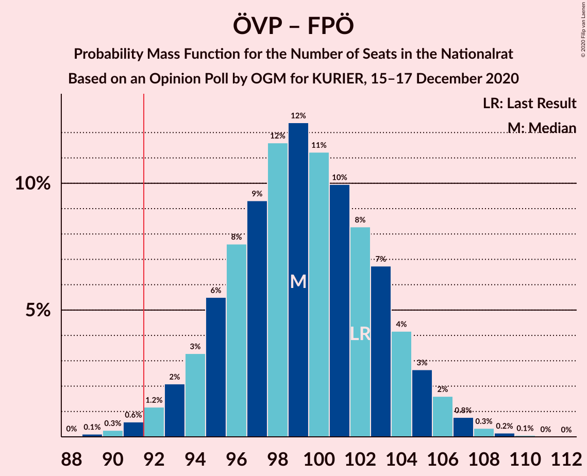

| Number of Seats | Probability | Accumulated | Special Marks |
|:---------------:|:-----------:|:-----------:|:-------------:|
| 88 | 0% | 100% |  |
| 89 | 0.1% | 99.9% |  |
| 90 | 0.3% | 99.8% |  |
| 91 | 0.6% | 99.6% |  |
| 92 | 1.2% | 99.0% | Majority |
| 93 | 2% | 98% |  |
| 94 | 3% | 96% |  |
| 95 | 6% | 92% |  |
| 96 | 8% | 87% |  |
| 97 | 9% | 79% |  |
| 98 | 12% | 70% |  |
| 99 | 12% | 58% | Median |
| 100 | 11% | 46% |  |
| 101 | 10% | 35% |  |
| 102 | 8% | 25% | Last Result |
| 103 | 7% | 17% |  |
| 104 | 4% | 10% |  |
| 105 | 3% | 6% |  |
| 106 | 2% | 3% |  |
| 107 | 0.8% | 1.4% |  |
| 108 | 0.3% | 0.6% |  |
| 109 | 0.2% | 0.2% |  |
| 110 | 0.1% | 0.1% |  |
| 111 | 0% | 0% |  |

### Österreichische Volkspartei – NEOS–Das Neue Österreich und Liberales Forum

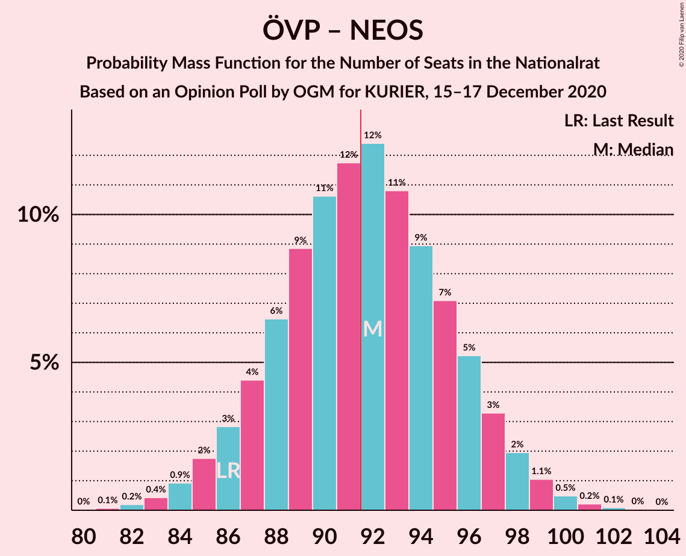

| Number of Seats | Probability | Accumulated | Special Marks |
|:---------------:|:-----------:|:-----------:|:-------------:|
| 81 | 0.1% | 100% |  |
| 82 | 0.2% | 99.9% |  |
| 83 | 0.4% | 99.7% |  |
| 84 | 0.9% | 99.3% |  |
| 85 | 2% | 98% |  |
| 86 | 3% | 97% | Last Result |
| 87 | 4% | 94% |  |
| 88 | 6% | 89% |  |
| 89 | 9% | 83% |  |
| 90 | 11% | 74% |  |
| 91 | 12% | 63% | Median |
| 92 | 12% | 52% | Majority |
| 93 | 11% | 39% |  |
| 94 | 9% | 28% |  |
| 95 | 7% | 19% |  |
| 96 | 5% | 12% |  |
| 97 | 3% | 7% |  |
| 98 | 2% | 4% |  |
| 99 | 1.1% | 2% |  |
| 100 | 0.5% | 0.9% |  |
| 101 | 0.2% | 0.4% |  |
| 102 | 0.1% | 0.1% |  |
| 103 | 0% | 0.1% |  |
| 104 | 0% | 0% |  |

### Sozialdemokratische Partei Österreichs – Die Grünen–Die Grüne Alternative – NEOS–Das Neue Österreich und Liberales Forum

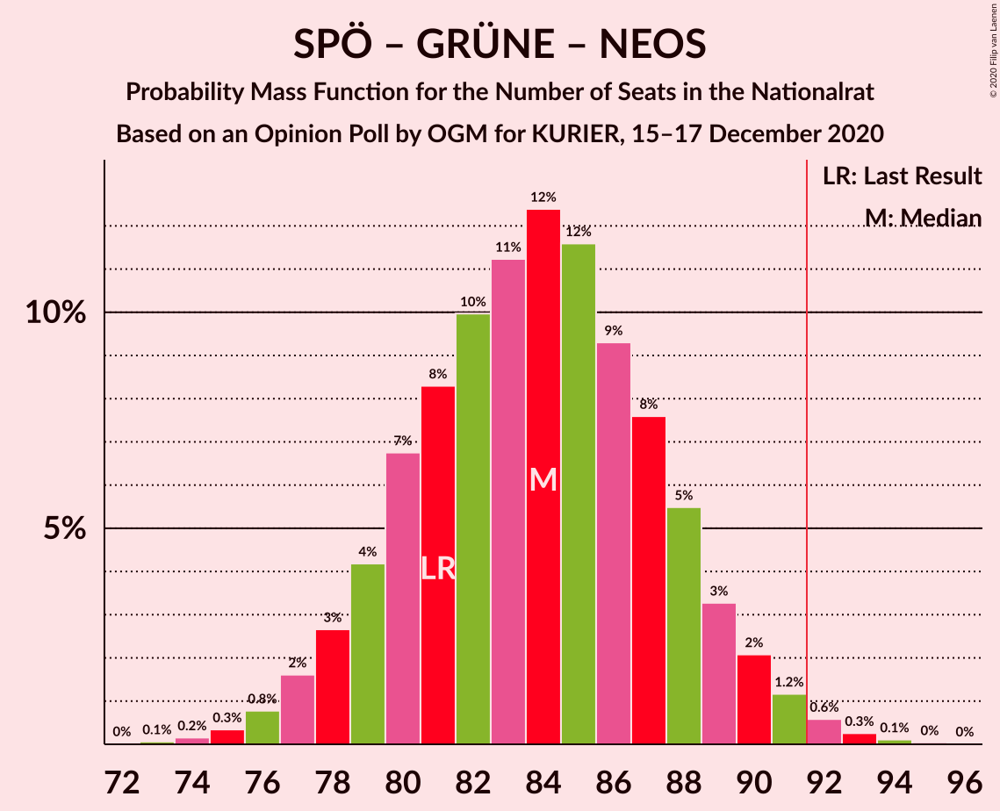

| Number of Seats | Probability | Accumulated | Special Marks |
|:---------------:|:-----------:|:-----------:|:-------------:|
| 73 | 0.1% | 100% |  |
| 74 | 0.2% | 99.9% |  |
| 75 | 0.3% | 99.8% |  |
| 76 | 0.8% | 99.4% |  |
| 77 | 2% | 98.6% |  |
| 78 | 3% | 97% |  |
| 79 | 4% | 94% |  |
| 80 | 7% | 90% |  |
| 81 | 8% | 83% | Last Result |
| 82 | 10% | 75% |  |
| 83 | 11% | 65% | Median |
| 84 | 12% | 54% |  |
| 85 | 12% | 42% |  |
| 86 | 9% | 30% |  |
| 87 | 8% | 21% |  |
| 88 | 5% | 13% |  |
| 89 | 3% | 8% |  |
| 90 | 2% | 4% |  |
| 91 | 1.2% | 2% |  |
| 92 | 0.6% | 1.0% | Majority |
| 93 | 0.3% | 0.4% |  |
| 94 | 0.1% | 0.2% |  |
| 95 | 0% | 0.1% |  |
| 96 | 0% | 0% |  |

### Österreichische Volkspartei

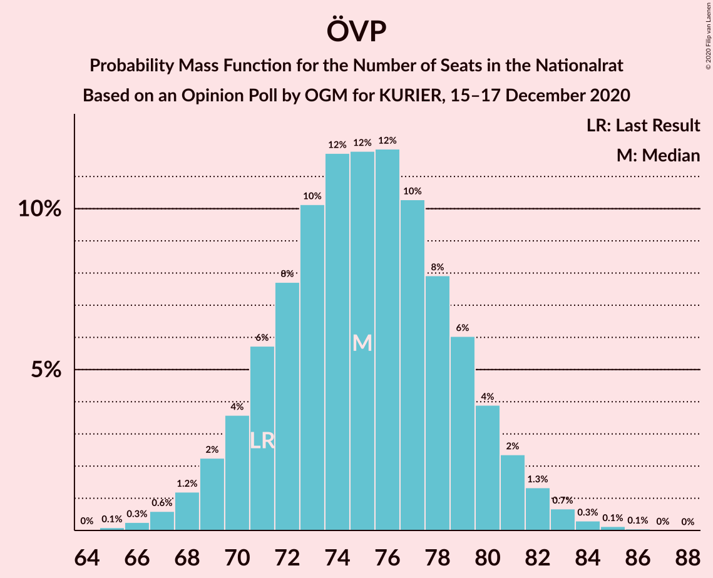

| Number of Seats | Probability | Accumulated | Special Marks |
|:---------------:|:-----------:|:-----------:|:-------------:|
| 65 | 0.1% | 100% |  |
| 66 | 0.3% | 99.9% |  |
| 67 | 0.6% | 99.6% |  |
| 68 | 1.2% | 99.0% |  |
| 69 | 2% | 98% |  |
| 70 | 4% | 96% |  |
| 71 | 6% | 92% | Last Result |
| 72 | 8% | 86% |  |
| 73 | 10% | 79% |  |
| 74 | 12% | 68% |  |
| 75 | 12% | 57% | Median |
| 76 | 12% | 45% |  |
| 77 | 10% | 33% |  |
| 78 | 8% | 23% |  |
| 79 | 6% | 15% |  |
| 80 | 4% | 9% |  |
| 81 | 2% | 5% |  |
| 82 | 1.3% | 3% |  |
| 83 | 0.7% | 1.2% |  |
| 84 | 0.3% | 0.5% |  |
| 85 | 0.1% | 0.2% |  |
| 86 | 0.1% | 0.1% |  |
| 87 | 0% | 0% |  |

### Sozialdemokratische Partei Österreichs – Die Grünen–Die Grüne Alternative

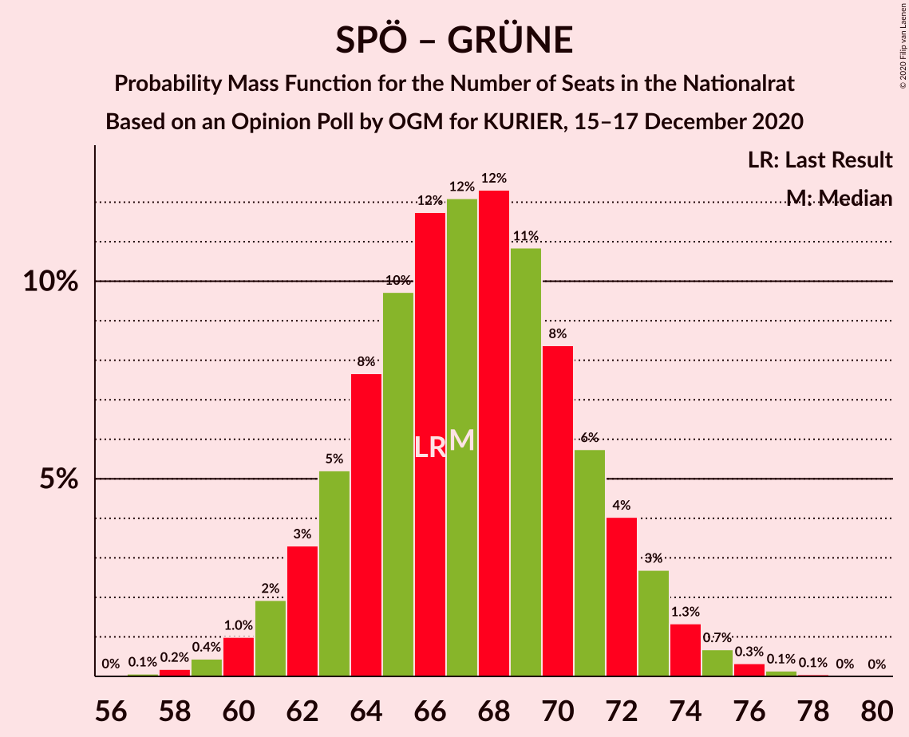

| Number of Seats | Probability | Accumulated | Special Marks |
|:---------------:|:-----------:|:-----------:|:-------------:|
| 57 | 0.1% | 100% |  |
| 58 | 0.2% | 99.9% |  |
| 59 | 0.4% | 99.7% |  |
| 60 | 1.0% | 99.3% |  |
| 61 | 2% | 98% |  |
| 62 | 3% | 96% |  |
| 63 | 5% | 93% |  |
| 64 | 8% | 88% |  |
| 65 | 10% | 80% |  |
| 66 | 12% | 70% | Last Result |
| 67 | 12% | 59% | Median |
| 68 | 12% | 47% |  |
| 69 | 11% | 34% |  |
| 70 | 8% | 23% |  |
| 71 | 6% | 15% |  |
| 72 | 4% | 9% |  |
| 73 | 3% | 5% |  |
| 74 | 1.3% | 3% |  |
| 75 | 0.7% | 1.2% |  |
| 76 | 0.3% | 0.6% |  |
| 77 | 0.1% | 0.2% |  |
| 78 | 0.1% | 0.1% |  |
| 79 | 0% | 0% |  |

### Sozialdemokratische Partei Österreichs – Freiheitliche Partei Österreichs

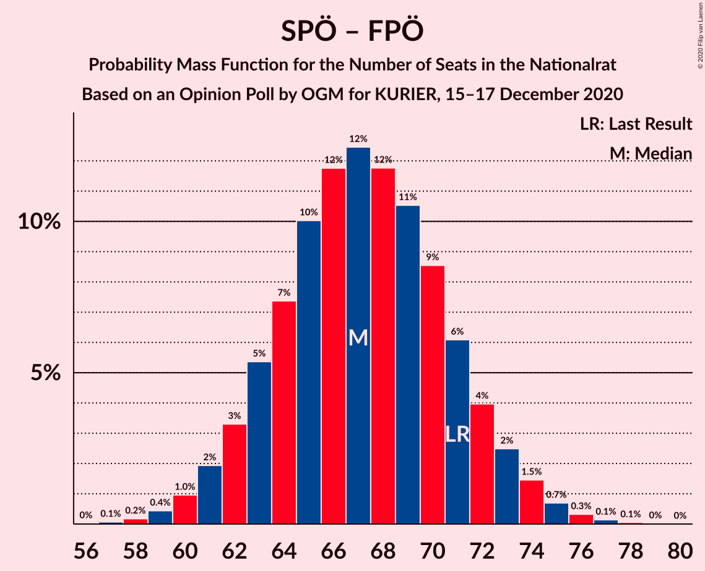

| Number of Seats | Probability | Accumulated | Special Marks |
|:---------------:|:-----------:|:-----------:|:-------------:|
| 57 | 0.1% | 100% |  |
| 58 | 0.2% | 99.9% |  |
| 59 | 0.4% | 99.7% |  |
| 60 | 1.0% | 99.3% |  |
| 61 | 2% | 98% |  |
| 62 | 3% | 96% |  |
| 63 | 5% | 93% |  |
| 64 | 7% | 88% |  |
| 65 | 10% | 80% |  |
| 66 | 12% | 70% |  |
| 67 | 12% | 59% | Median |
| 68 | 12% | 46% |  |
| 69 | 11% | 34% |  |
| 70 | 9% | 24% |  |
| 71 | 6% | 15% | Last Result |
| 72 | 4% | 9% |  |
| 73 | 2% | 5% |  |
| 74 | 1.5% | 3% |  |
| 75 | 0.7% | 1.2% |  |
| 76 | 0.3% | 0.5% |  |
| 77 | 0.1% | 0.2% |  |
| 78 | 0.1% | 0.1% |  |
| 79 | 0% | 0% |  |

### Sozialdemokratische Partei Österreichs

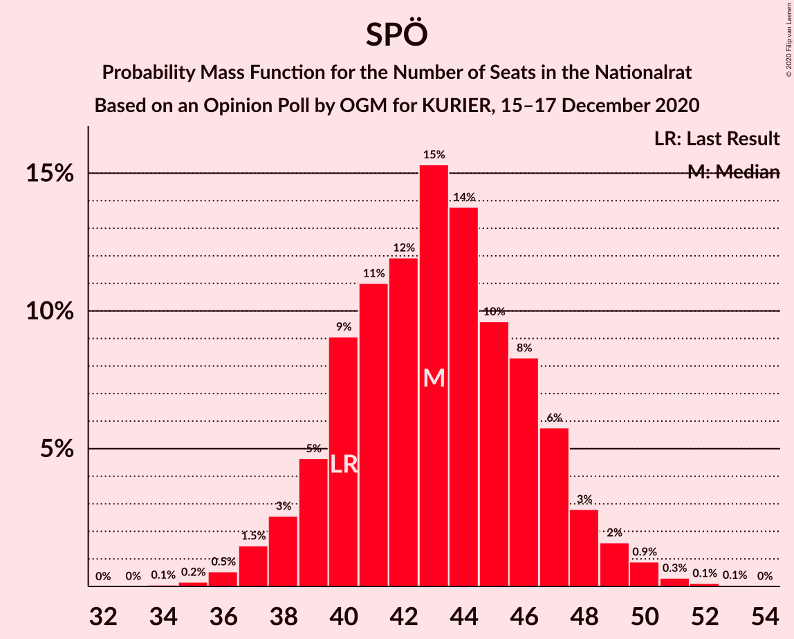

| Number of Seats | Probability | Accumulated | Special Marks |
|:---------------:|:-----------:|:-----------:|:-------------:|
| 34 | 0.1% | 100% |  |
| 35 | 0.2% | 99.9% |  |
| 36 | 0.5% | 99.8% |  |
| 37 | 1.5% | 99.2% |  |
| 38 | 3% | 98% |  |
| 39 | 5% | 95% |  |
| 40 | 9% | 91% | Last Result |
| 41 | 11% | 81% |  |
| 42 | 12% | 70% |  |
| 43 | 15% | 59% | Median |
| 44 | 14% | 43% |  |
| 45 | 10% | 29% |  |
| 46 | 8% | 20% |  |
| 47 | 6% | 12% |  |
| 48 | 3% | 6% |  |
| 49 | 2% | 3% |  |
| 50 | 0.9% | 1.4% |  |
| 51 | 0.3% | 0.5% |  |
| 52 | 0.1% | 0.2% |  |
| 53 | 0.1% | 0.1% |  |
| 54 | 0% | 0% |  |

## Technical Information

### Opinion Poll

+ **Polling firm:** OGM
+ **Commissioner(s):** KURIER
+ **Fieldwork period:** 15–17 December 2020

### Calculations

+ **Sample size:** 794
+ **Simulations done:** 1,048,576
+ **Error estimate:** 0.70%

