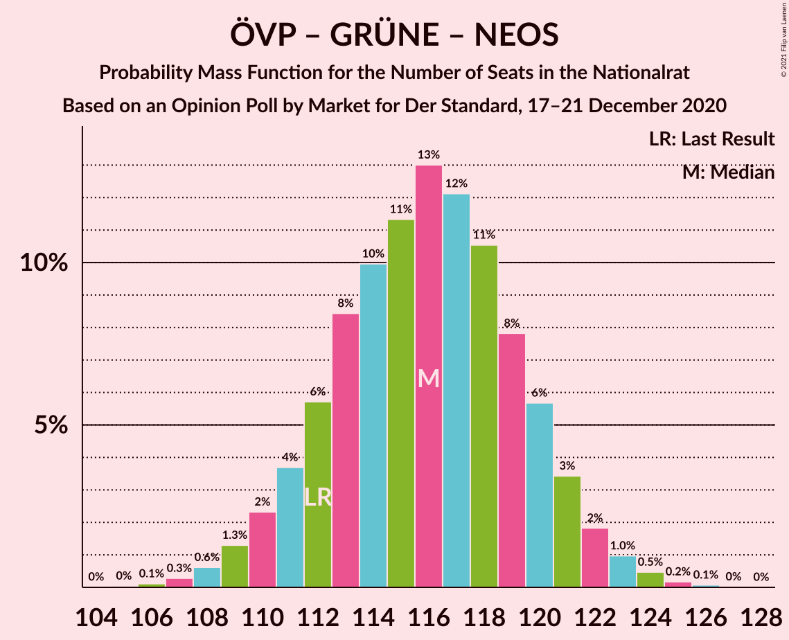
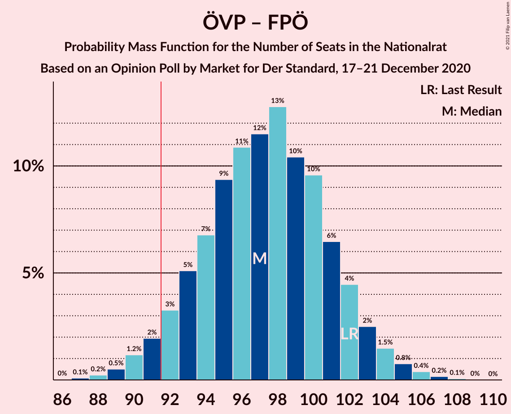
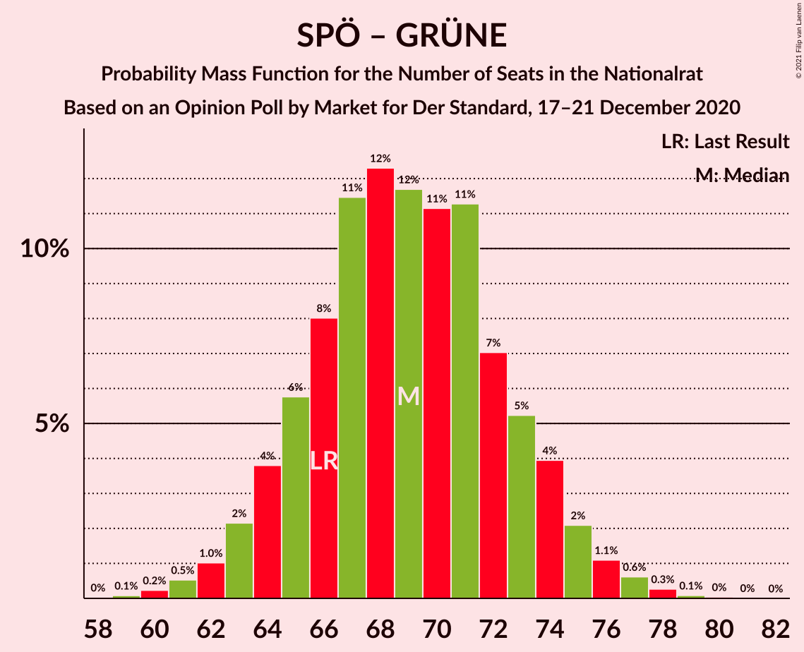

# Opinion Poll by Market for Der Standard, 17–21 December 2020

<a href="#voting-intentions">Voting Intentions</a> | <a href="#seats">Seats</a> | <a href="#coalitions">Coalitions</a> | <a href="#technical-information">Technical Information</a>

## Voting Intentions

### Confidence Intervals

| Party | Last Result | Poll Result | 80% Confidence Interval | 90% Confidence Interval | 95% Confidence Interval | 99% Confidence Interval |
|:-----:|:-----------:|:-----------:|:-----------------------:|:-----------------------:|:-----------------------:|:-----------------------:|
| Österreichische Volkspartei | 37.5% | 39.1% | 36.9–41.3% |36.3–41.9% |35.8–42.5% |34.7–43.5% |
| Sozialdemokratische Partei Österreichs | 21.2% | 23.0% | 21.2–25.0% |20.7–25.5% |20.2–26.0% |19.4–27.0% |
| Die Grünen–Die Grüne Alternative | 13.9% | 14.0% | 12.5–15.7% |12.1–16.1% |11.8–16.5% |11.1–17.4% |
| Freiheitliche Partei Österreichs | 16.2% | 13.0% | 11.6–14.6% |11.2–15.1% |10.8–15.5% |10.2–16.3% |
| NEOS–Das Neue Österreich und Liberales Forum | 8.1% | 9.0% | 7.8–10.4% |7.5–10.9% |7.2–11.2% |6.7–11.9% |

*Note:* The poll result column reflects the actual value used in the calculations. Published results may vary slightly, and in addition be rounded to fewer digits.

## Seats

### Confidence Intervals

| Party | Last Result | Median | 80% Confidence Interval | 90% Confidence Interval | 95% Confidence Interval | 99% Confidence Interval |
|:-----:|:-----------:|:------:|:-----------------------:|:-----------------------:|:-----------------------:|:-----------------------:|
| <a href="#österreichische-volkspartei">Österreichische Volkspartei</a> | 71 | 73 | 70–76 |68–78 |67–80 |65–82 |
| <a href="#sozialdemokratische-partei-österreichs">Sozialdemokratische Partei Österreichs</a> | 40 | 43 | 40–46 |39–48 |38–49 |36–50 |
| <a href="#die-grünen–die-grüne-alternative">Die Grünen–Die Grüne Alternative</a> | 26 | 26 | 23–29 |22–30 |22–31 |20–32 |
| <a href="#freiheitliche-partei-österreichs">Freiheitliche Partei Österreichs</a> | 31 | 24 | 22–27 |21–28 |20–29 |19–30 |
| <a href="#neos–das-neue-österreich-und-liberales-forum">NEOS–Das Neue Österreich und Liberales Forum</a> | 15 | 17 | 14–19 |14–20 |13–21 |12–22 |

### Österreichische Volkspartei

*For a full overview of the results for this party, see the [Österreichische Volkspartei](party-österreichischevolkspartei.html) page.*

| Number of Seats | Probability | Accumulated | Special Marks |
|:---------------:|:-----------:|:-----------:|:-------------:|
| 63 | 0.1% | 100% |  |
| 64 | 0.3% | 99.9% |  |
| 65 | 0.6% | 99.6% |  |
| 66 | 1.0% | 99.1% |  |
| 67 | 1.5% | 98% |  |
| 68 | 2% | 97% |  |
| 69 | 4% | 95% |  |
| 70 | 6% | 90% |  |
| 71 | 9% | 84% | Last Result |
| 72 | 14% | 75% |  |
| 73 | 15% | 61% | Median |
| 74 | 19% | 47% |  |
| 75 | 11% | 27% |  |
| 76 | 7% | 16% |  |
| 77 | 3% | 10% |  |
| 78 | 2% | 6% |  |
| 79 | 2% | 5% |  |
| 80 | 1.4% | 3% |  |
| 81 | 0.9% | 2% |  |
| 82 | 0.6% | 0.8% |  |
| 83 | 0.1% | 0.2% |  |
| 84 | 0% | 0.1% |  |
| 85 | 0% | 0% |  |

### Sozialdemokratische Partei Österreichs

*For a full overview of the results for this party, see the [Sozialdemokratische Partei Österreichs](party-sozialdemokratischeparteiösterreichs.html) page.*

| Number of Seats | Probability | Accumulated | Special Marks |
|:---------------:|:-----------:|:-----------:|:-------------:|
| 34 | 0.1% | 100% |  |
| 35 | 0.3% | 99.9% |  |
| 36 | 0.7% | 99.6% |  |
| 37 | 1.2% | 98.9% |  |
| 38 | 2% | 98% |  |
| 39 | 2% | 96% |  |
| 40 | 4% | 94% | Last Result |
| 41 | 13% | 90% |  |
| 42 | 22% | 77% |  |
| 43 | 19% | 55% | Median |
| 44 | 15% | 35% |  |
| 45 | 9% | 20% |  |
| 46 | 3% | 11% |  |
| 47 | 2% | 8% |  |
| 48 | 2% | 6% |  |
| 49 | 2% | 4% |  |
| 50 | 1.0% | 1.4% |  |
| 51 | 0.3% | 0.5% |  |
| 52 | 0.2% | 0.2% |  |
| 53 | 0% | 0% |  |

### Die Grünen–Die Grüne Alternative

*For a full overview of the results for this party, see the [Die Grünen–Die Grüne Alternative](party-diegrünen–diegrünealternative.html) page.*

| Number of Seats | Probability | Accumulated | Special Marks |
|:---------------:|:-----------:|:-----------:|:-------------:|
| 19 | 0.1% | 100% |  |
| 20 | 0.4% | 99.9% |  |
| 21 | 1.4% | 99.5% |  |
| 22 | 4% | 98% |  |
| 23 | 7% | 94% |  |
| 24 | 12% | 87% |  |
| 25 | 16% | 75% |  |
| 26 | 18% | 59% | Last Result, Median |
| 27 | 13% | 41% |  |
| 28 | 12% | 27% |  |
| 29 | 10% | 16% |  |
| 30 | 3% | 6% |  |
| 31 | 2% | 3% |  |
| 32 | 0.7% | 1.1% |  |
| 33 | 0.2% | 0.3% |  |
| 34 | 0.1% | 0.1% |  |
| 35 | 0% | 0% |  |

### Freiheitliche Partei Österreichs

*For a full overview of the results for this party, see the [Freiheitliche Partei Österreichs](party-freiheitlicheparteiösterreichs.html) page.*

| Number of Seats | Probability | Accumulated | Special Marks |
|:---------------:|:-----------:|:-----------:|:-------------:|
| 18 | 0.3% | 100% |  |
| 19 | 1.2% | 99.6% |  |
| 20 | 3% | 98% |  |
| 21 | 5% | 95% |  |
| 22 | 14% | 90% |  |
| 23 | 17% | 76% |  |
| 24 | 13% | 58% | Median |
| 25 | 16% | 45% |  |
| 26 | 15% | 29% |  |
| 27 | 8% | 14% |  |
| 28 | 3% | 6% |  |
| 29 | 2% | 3% |  |
| 30 | 1.0% | 1.3% |  |
| 31 | 0.3% | 0.4% | Last Result |
| 32 | 0.1% | 0.1% |  |
| 33 | 0% | 0% |  |

### NEOS–Das Neue Österreich und Liberales Forum

*For a full overview of the results for this party, see the [NEOS–Das Neue Österreich und Liberales Forum](party-neos–dasneueösterreichundliberalesforum.html) page.*

| Number of Seats | Probability | Accumulated | Special Marks |
|:---------------:|:-----------:|:-----------:|:-------------:|
| 11 | 0.1% | 100% |  |
| 12 | 0.9% | 99.9% |  |
| 13 | 3% | 99.0% |  |
| 14 | 8% | 96% |  |
| 15 | 15% | 88% | Last Result |
| 16 | 21% | 73% |  |
| 17 | 20% | 52% | Median |
| 18 | 16% | 32% |  |
| 19 | 8% | 16% |  |
| 20 | 5% | 8% |  |
| 21 | 2% | 3% |  |
| 22 | 0.7% | 0.9% |  |
| 23 | 0.2% | 0.2% |  |
| 24 | 0% | 0% |  |

## Coalitions

### Confidence Intervals

| Coalition | Last Result | Median | Majority? | 80% Confidence Interval | 90% Confidence Interval | 95% Confidence Interval | 99% Confidence Interval |
|:---------:|:-----------:|:------:|:---------:|:-----------------------:|:-----------------------:|:-----------------------:|:-----------------------:|
| Österreichische Volkspartei – Die Grünen–Die Grüne Alternative – NEOS–Das Neue Österreich und Liberales Forum | 112 | 116 | 100% | 112–119 | 111–121 | 110–122 | 107–124 |
| Österreichische Volkspartei – Sozialdemokratische Partei Österreichs | 111 | 116 | 100% | 112–120 | 111–121 | 110–122 | 108–124 |
| Österreichische Volkspartei – Die Grünen–Die Grüne Alternative | 97 | 99 | 98.7% | 96–103 | 94–104 | 92–106 | 91–108 |
| Österreichische Volkspartei – Freiheitliche Partei Österreichs | 102 | 97 | 96% | 94–101 | 92–102 | 91–104 | 89–106 |
| Österreichische Volkspartei – NEOS–Das Neue Österreich und Liberales Forum | 86 | 90 | 30% | 86–94 | 85–95 | 84–96 | 82–98 |
| Sozialdemokratische Partei Österreichs – Die Grünen–Die Grüne Alternative – NEOS–Das Neue Österreich und Liberales Forum | 81 | 86 | 4% | 82–89 | 81–91 | 79–92 | 77–94 |
| Österreichische Volkspartei | 71 | 73 | 0% | 70–76 | 68–78 | 67–80 | 65–82 |
| Sozialdemokratische Partei Österreichs – Die Grünen–Die Grüne Alternative | 66 | 69 | 0% | 65–73 | 64–74 | 63–75 | 61–78 |
| Sozialdemokratische Partei Österreichs – Freiheitliche Partei Österreichs | 71 | 67 | 0% | 64–71 | 62–72 | 61–73 | 59–76 |
| Sozialdemokratische Partei Österreichs | 40 | 43 | 0% | 40–46 | 39–48 | 38–49 | 36–50 |

### Österreichische Volkspartei – Die Grünen–Die Grüne Alternative – NEOS–Das Neue Österreich und Liberales Forum

| Number of Seats | Probability | Accumulated | Special Marks |
|:---------------:|:-----------:|:-----------:|:-------------:|
| 105 | 0% | 100% |  |
| 106 | 0.1% | 99.9% |  |
| 107 | 0.3% | 99.8% |  |
| 108 | 0.7% | 99.5% |  |
| 109 | 1.1% | 98.8% |  |
| 110 | 2% | 98% |  |
| 111 | 3% | 96% |  |
| 112 | 4% | 93% | Last Result |
| 113 | 7% | 88% |  |
| 114 | 10% | 82% |  |
| 115 | 14% | 71% |  |
| 116 | 17% | 57% | Median |
| 117 | 12% | 40% |  |
| 118 | 10% | 28% |  |
| 119 | 8% | 18% |  |
| 120 | 4% | 10% |  |
| 121 | 2% | 5% |  |
| 122 | 1.3% | 3% |  |
| 123 | 1.1% | 2% |  |
| 124 | 0.5% | 0.7% |  |
| 125 | 0.2% | 0.3% |  |
| 126 | 0.1% | 0.1% |  |
| 127 | 0% | 0% |  |

### Österreichische Volkspartei – Sozialdemokratische Partei Österreichs

| Number of Seats | Probability | Accumulated | Special Marks |
|:---------------:|:-----------:|:-----------:|:-------------:|
| 105 | 0% | 100% |  |
| 106 | 0.1% | 99.9% |  |
| 107 | 0.2% | 99.8% |  |
| 108 | 0.4% | 99.7% |  |
| 109 | 1.3% | 99.2% |  |
| 110 | 2% | 98% |  |
| 111 | 2% | 95% | Last Result |
| 112 | 5% | 94% |  |
| 113 | 11% | 89% |  |
| 114 | 11% | 78% |  |
| 115 | 8% | 67% |  |
| 116 | 12% | 59% | Median |
| 117 | 15% | 47% |  |
| 118 | 11% | 31% |  |
| 119 | 5% | 21% |  |
| 120 | 6% | 15% |  |
| 121 | 5% | 9% |  |
| 122 | 3% | 5% |  |
| 123 | 0.8% | 2% |  |
| 124 | 0.5% | 1.0% |  |
| 125 | 0.3% | 0.5% |  |
| 126 | 0.1% | 0.1% |  |
| 127 | 0% | 0% |  |

### Österreichische Volkspartei – Die Grünen–Die Grüne Alternative

| Number of Seats | Probability | Accumulated | Special Marks |
|:---------------:|:-----------:|:-----------:|:-------------:|
| 89 | 0.1% | 100% |  |
| 90 | 0.3% | 99.8% |  |
| 91 | 0.8% | 99.5% |  |
| 92 | 1.3% | 98.7% | Majority |
| 93 | 2% | 97% |  |
| 94 | 2% | 96% |  |
| 95 | 2% | 93% |  |
| 96 | 5% | 91% |  |
| 97 | 9% | 86% | Last Result |
| 98 | 12% | 77% |  |
| 99 | 21% | 65% | Median |
| 100 | 13% | 44% |  |
| 101 | 14% | 30% |  |
| 102 | 5% | 16% |  |
| 103 | 4% | 11% |  |
| 104 | 1.4% | 6% |  |
| 105 | 2% | 5% |  |
| 106 | 2% | 3% |  |
| 107 | 0.6% | 1.3% |  |
| 108 | 0.5% | 0.7% |  |
| 109 | 0.2% | 0.2% |  |
| 110 | 0.1% | 0.1% |  |
| 111 | 0% | 0% |  |

### Österreichische Volkspartei – Freiheitliche Partei Österreichs

| Number of Seats | Probability | Accumulated | Special Marks |
|:---------------:|:-----------:|:-----------:|:-------------:|
| 87 | 0.1% | 100% |  |
| 88 | 0.3% | 99.8% |  |
| 89 | 0.7% | 99.6% |  |
| 90 | 1.1% | 98.8% |  |
| 91 | 1.4% | 98% |  |
| 92 | 2% | 96% | Majority |
| 93 | 3% | 94% |  |
| 94 | 5% | 91% |  |
| 95 | 10% | 86% |  |
| 96 | 13% | 76% |  |
| 97 | 14% | 63% | Median |
| 98 | 17% | 49% |  |
| 99 | 12% | 32% |  |
| 100 | 8% | 20% |  |
| 101 | 4% | 11% |  |
| 102 | 3% | 7% | Last Result |
| 103 | 1.3% | 4% |  |
| 104 | 2% | 3% |  |
| 105 | 0.7% | 2% |  |
| 106 | 0.6% | 0.9% |  |
| 107 | 0.3% | 0.3% |  |
| 108 | 0.1% | 0.1% |  |
| 109 | 0% | 0% |  |

### Österreichische Volkspartei – NEOS–Das Neue Österreich und Liberales Forum

| Number of Seats | Probability | Accumulated | Special Marks |
|:---------------:|:-----------:|:-----------:|:-------------:|
| 79 | 0.1% | 100% |  |
| 80 | 0.2% | 99.9% |  |
| 81 | 0.2% | 99.7% |  |
| 82 | 0.7% | 99.5% |  |
| 83 | 0.9% | 98.8% |  |
| 84 | 3% | 98% |  |
| 85 | 3% | 95% |  |
| 86 | 6% | 92% | Last Result |
| 87 | 6% | 86% |  |
| 88 | 14% | 80% |  |
| 89 | 10% | 66% |  |
| 90 | 16% | 56% | Median |
| 91 | 9% | 39% |  |
| 92 | 12% | 30% | Majority |
| 93 | 6% | 18% |  |
| 94 | 6% | 12% |  |
| 95 | 3% | 6% |  |
| 96 | 2% | 4% |  |
| 97 | 0.9% | 2% |  |
| 98 | 0.6% | 1.1% |  |
| 99 | 0.3% | 0.5% |  |
| 100 | 0.1% | 0.2% |  |
| 101 | 0.1% | 0.1% |  |
| 102 | 0% | 0% |  |

### Sozialdemokratische Partei Österreichs – Die Grünen–Die Grüne Alternative – NEOS–Das Neue Österreich und Liberales Forum

| Number of Seats | Probability | Accumulated | Special Marks |
|:---------------:|:-----------:|:-----------:|:-------------:|
| 75 | 0.1% | 100% |  |
| 76 | 0.3% | 99.9% |  |
| 77 | 0.6% | 99.7% |  |
| 78 | 0.7% | 99.1% |  |
| 79 | 2% | 98% |  |
| 80 | 1.3% | 97% |  |
| 81 | 3% | 96% | Last Result |
| 82 | 4% | 93% |  |
| 83 | 8% | 88% |  |
| 84 | 12% | 80% |  |
| 85 | 17% | 68% |  |
| 86 | 14% | 51% | Median |
| 87 | 13% | 37% |  |
| 88 | 10% | 24% |  |
| 89 | 5% | 14% |  |
| 90 | 3% | 9% |  |
| 91 | 2% | 6% |  |
| 92 | 1.3% | 4% | Majority |
| 93 | 1.1% | 2% |  |
| 94 | 0.7% | 1.2% |  |
| 95 | 0.3% | 0.4% |  |
| 96 | 0.1% | 0.1% |  |
| 97 | 0% | 0% |  |

### Österreichische Volkspartei

| Number of Seats | Probability | Accumulated | Special Marks |
|:---------------:|:-----------:|:-----------:|:-------------:|
| 63 | 0.1% | 100% |  |
| 64 | 0.3% | 99.9% |  |
| 65 | 0.6% | 99.6% |  |
| 66 | 1.0% | 99.1% |  |
| 67 | 1.5% | 98% |  |
| 68 | 2% | 97% |  |
| 69 | 4% | 95% |  |
| 70 | 6% | 90% |  |
| 71 | 9% | 84% | Last Result |
| 72 | 14% | 75% |  |
| 73 | 15% | 61% | Median |
| 74 | 19% | 47% |  |
| 75 | 11% | 27% |  |
| 76 | 7% | 16% |  |
| 77 | 3% | 10% |  |
| 78 | 2% | 6% |  |
| 79 | 2% | 5% |  |
| 80 | 1.4% | 3% |  |
| 81 | 0.9% | 2% |  |
| 82 | 0.6% | 0.8% |  |
| 83 | 0.1% | 0.2% |  |
| 84 | 0% | 0.1% |  |
| 85 | 0% | 0% |  |

### Sozialdemokratische Partei Österreichs – Die Grünen–Die Grüne Alternative

| Number of Seats | Probability | Accumulated | Special Marks |
|:---------------:|:-----------:|:-----------:|:-------------:|
| 59 | 0.1% | 100% |  |
| 60 | 0.2% | 99.8% |  |
| 61 | 0.5% | 99.6% |  |
| 62 | 1.2% | 99.2% |  |
| 63 | 1.2% | 98% |  |
| 64 | 3% | 97% |  |
| 65 | 6% | 94% |  |
| 66 | 6% | 88% | Last Result |
| 67 | 8% | 82% |  |
| 68 | 20% | 73% |  |
| 69 | 12% | 53% | Median |
| 70 | 9% | 41% |  |
| 71 | 17% | 33% |  |
| 72 | 4% | 16% |  |
| 73 | 5% | 11% |  |
| 74 | 3% | 7% |  |
| 75 | 1.4% | 3% |  |
| 76 | 1.0% | 2% |  |
| 77 | 0.5% | 1.0% |  |
| 78 | 0.3% | 0.5% |  |
| 79 | 0.1% | 0.2% |  |
| 80 | 0% | 0.1% |  |
| 81 | 0% | 0% |  |

### Sozialdemokratische Partei Österreichs – Freiheitliche Partei Österreichs

| Number of Seats | Probability | Accumulated | Special Marks |
|:---------------:|:-----------:|:-----------:|:-------------:|
| 57 | 0.1% | 100% |  |
| 58 | 0.2% | 99.9% |  |
| 59 | 0.5% | 99.7% |  |
| 60 | 1.1% | 99.2% |  |
| 61 | 1.3% | 98% |  |
| 62 | 2% | 97% |  |
| 63 | 4% | 95% |  |
| 64 | 8% | 90% |  |
| 65 | 10% | 82% |  |
| 66 | 12% | 72% |  |
| 67 | 17% | 60% | Median |
| 68 | 14% | 43% |  |
| 69 | 10% | 28% |  |
| 70 | 7% | 18% |  |
| 71 | 4% | 12% | Last Result |
| 72 | 3% | 7% |  |
| 73 | 2% | 4% |  |
| 74 | 1.1% | 2% |  |
| 75 | 0.7% | 1.2% |  |
| 76 | 0.3% | 0.5% |  |
| 77 | 0.1% | 0.2% |  |
| 78 | 0% | 0.1% |  |
| 79 | 0% | 0% |  |

### Sozialdemokratische Partei Österreichs

| Number of Seats | Probability | Accumulated | Special Marks |
|:---------------:|:-----------:|:-----------:|:-------------:|
| 34 | 0.1% | 100% |  |
| 35 | 0.3% | 99.9% |  |
| 36 | 0.7% | 99.6% |  |
| 37 | 1.2% | 98.9% |  |
| 38 | 2% | 98% |  |
| 39 | 2% | 96% |  |
| 40 | 4% | 94% | Last Result |
| 41 | 13% | 90% |  |
| 42 | 22% | 77% |  |
| 43 | 19% | 55% | Median |
| 44 | 15% | 35% |  |
| 45 | 9% | 20% |  |
| 46 | 3% | 11% |  |
| 47 | 2% | 8% |  |
| 48 | 2% | 6% |  |
| 49 | 2% | 4% |  |
| 50 | 1.0% | 1.4% |  |
| 51 | 0.3% | 0.5% |  |
| 52 | 0.2% | 0.2% |  |
| 53 | 0% | 0% |  |

## Technical Information

### Opinion Poll

+ **Polling firm:** Market
+ **Commissioner(s):** Der Standard
+ **Fieldwork period:** 17–21 December 2020

### Calculations

+ **Sample size:** 809
+ **Simulations done:** 131,072
+ **Error estimate:** 0.67%

