# Opinion Poll by Research Affairs for ÖSTERREICH, 4–7 January 2021

<a href="#voting-intentions">Voting Intentions</a> | <a href="#seats">Seats</a> | <a href="#coalitions">Coalitions</a> | <a href="#technical-information">Technical Information</a>

## Voting Intentions

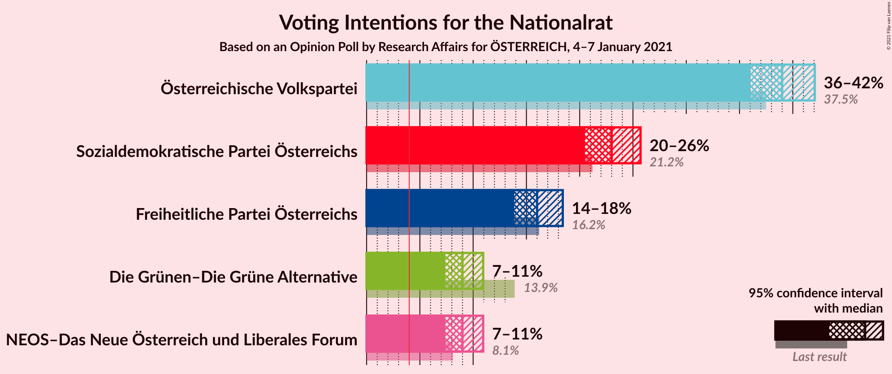

### Confidence Intervals

| Party | Last Result | Poll Result | 80% Confidence Interval | 90% Confidence Interval | 95% Confidence Interval | 99% Confidence Interval |
|:-----:|:-----------:|:-----------:|:-----------------------:|:-----------------------:|:-----------------------:|:-----------------------:|
| Österreichische Volkspartei | 37.5% | 39.0% | 37.1–41.0% |36.5–41.6% |36.0–42.1% |35.1–43.0% |
| Sozialdemokratische Partei Österreichs | 21.2% | 23.0% | 21.4–24.8% |20.9–25.3% |20.5–25.7% |19.7–26.6% |
| Freiheitliche Partei Österreichs | 16.2% | 16.0% | 14.6–17.6% |14.2–18.0% |13.9–18.4% |13.2–19.2% |
| NEOS–Das Neue Österreich und Liberales Forum | 8.1% | 9.0% | 7.9–10.3% |7.6–10.6% |7.4–10.9% |6.9–11.6% |
| Die Grünen–Die Grüne Alternative | 13.9% | 9.0% | 7.9–10.3% |7.6–10.6% |7.4–10.9% |6.9–11.6% |

*Note:* The poll result column reflects the actual value used in the calculations. Published results may vary slightly, and in addition be rounded to fewer digits.

## Seats

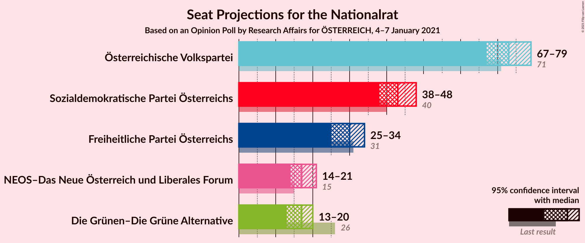

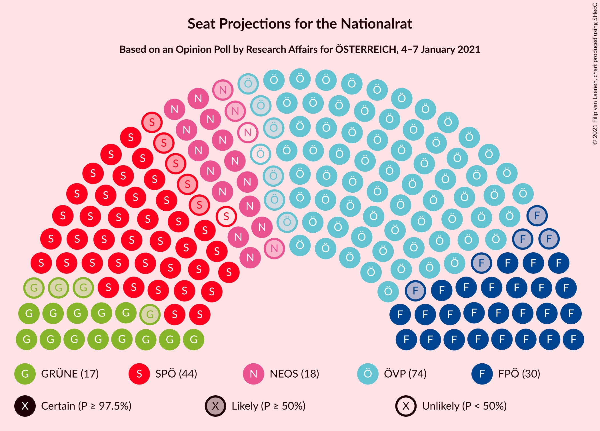

### Confidence Intervals

| Party | Last Result | Median | 80% Confidence Interval | 90% Confidence Interval | 95% Confidence Interval | 99% Confidence Interval |
|:-----:|:-----------:|:------:|:-----------------------:|:-----------------------:|:-----------------------:|:-----------------------:|
| <a href="#österreichische-volkspartei">Österreichische Volkspartei</a> | 71 | 73 | 69–77 |68–78 |67–79 |65–81 |
| <a href="#sozialdemokratische-partei-österreichs">Sozialdemokratische Partei Österreichs</a> | 40 | 43 | 39–46 |39–47 |38–48 |36–50 |
| <a href="#freiheitliche-partei-österreichs">Freiheitliche Partei Österreichs</a> | 31 | 30 | 27–33 |26–34 |25–34 |24–36 |
| <a href="#neos–das-neue-österreich-und-liberales-forum">NEOS–Das Neue Österreich und Liberales Forum</a> | 15 | 17 | 14–18 |14–19 |14–21 |13–21 |
| <a href="#die-grünen–die-grüne-alternative">Die Grünen–Die Grüne Alternative</a> | 26 | 17 | 14–19 |14–20 |13–20 |12–21 |

### Österreichische Volkspartei

*For a full overview of the results for this party, see the [Österreichische Volkspartei](party-österreichischevolkspartei.html) page.*

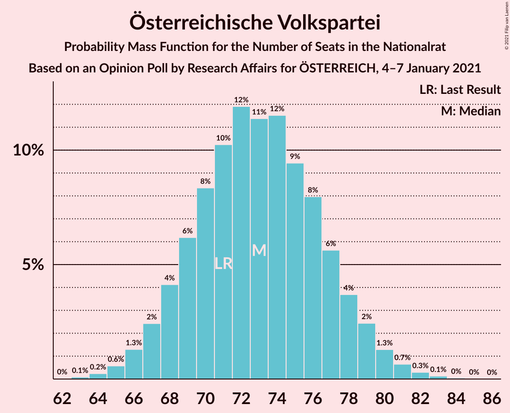

| Number of Seats | Probability | Accumulated | Special Marks |
|:---------------:|:-----------:|:-----------:|:-------------:|
| 63 | 0.1% | 100% |  |
| 64 | 0.2% | 99.9% |  |
| 65 | 0.6% | 99.6% |  |
| 66 | 1.3% | 99.1% |  |
| 67 | 2% | 98% |  |
| 68 | 4% | 95% |  |
| 69 | 6% | 91% |  |
| 70 | 8% | 85% |  |
| 71 | 10% | 77% | Last Result |
| 72 | 12% | 66% |  |
| 73 | 11% | 55% | Median |
| 74 | 12% | 43% |  |
| 75 | 9% | 32% |  |
| 76 | 8% | 22% |  |
| 77 | 6% | 14% |  |
| 78 | 4% | 9% |  |
| 79 | 2% | 5% |  |
| 80 | 1.3% | 2% |  |
| 81 | 0.7% | 1.1% |  |
| 82 | 0.3% | 0.5% |  |
| 83 | 0.1% | 0.2% |  |
| 84 | 0% | 0.1% |  |
| 85 | 0% | 0% |  |

### Sozialdemokratische Partei Österreichs

*For a full overview of the results for this party, see the [Sozialdemokratische Partei Österreichs](party-sozialdemokratischeparteiösterreichs.html) page.*

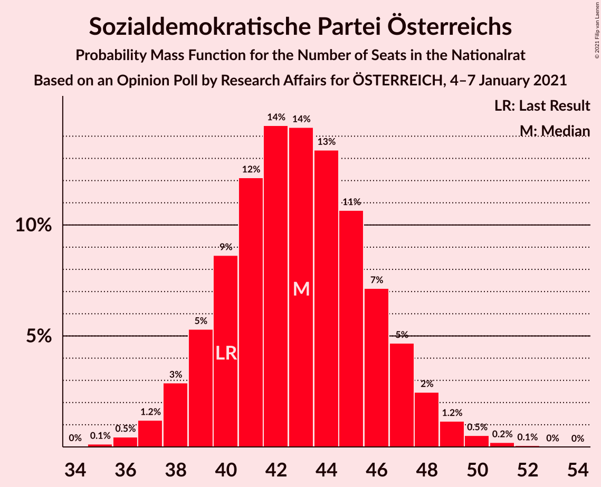

| Number of Seats | Probability | Accumulated | Special Marks |
|:---------------:|:-----------:|:-----------:|:-------------:|
| 35 | 0.1% | 100% |  |
| 36 | 0.5% | 99.8% |  |
| 37 | 1.2% | 99.4% |  |
| 38 | 3% | 98% |  |
| 39 | 5% | 95% |  |
| 40 | 9% | 90% | Last Result |
| 41 | 12% | 81% |  |
| 42 | 14% | 69% |  |
| 43 | 14% | 55% | Median |
| 44 | 13% | 40% |  |
| 45 | 11% | 27% |  |
| 46 | 7% | 16% |  |
| 47 | 5% | 9% |  |
| 48 | 2% | 4% |  |
| 49 | 1.2% | 2% |  |
| 50 | 0.5% | 0.8% |  |
| 51 | 0.2% | 0.3% |  |
| 52 | 0.1% | 0.1% |  |
| 53 | 0% | 0% |  |

### Freiheitliche Partei Österreichs

*For a full overview of the results for this party, see the [Freiheitliche Partei Österreichs](party-freiheitlicheparteiösterreichs.html) page.*

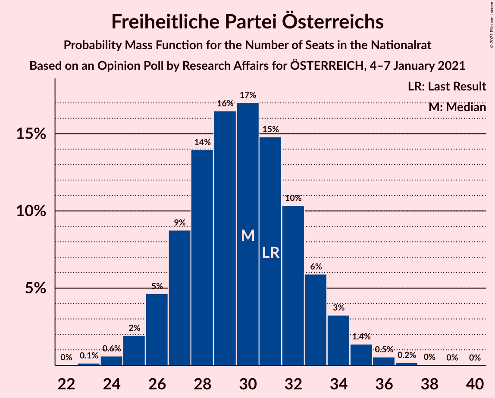

| Number of Seats | Probability | Accumulated | Special Marks |
|:---------------:|:-----------:|:-----------:|:-------------:|
| 23 | 0.1% | 100% |  |
| 24 | 0.6% | 99.8% |  |
| 25 | 2% | 99.2% |  |
| 26 | 5% | 97% |  |
| 27 | 9% | 93% |  |
| 28 | 14% | 84% |  |
| 29 | 16% | 70% |  |
| 30 | 17% | 53% | Median |
| 31 | 15% | 36% | Last Result |
| 32 | 10% | 22% |  |
| 33 | 6% | 11% |  |
| 34 | 3% | 5% |  |
| 35 | 1.4% | 2% |  |
| 36 | 0.5% | 0.8% |  |
| 37 | 0.2% | 0.2% |  |
| 38 | 0% | 0.1% |  |
| 39 | 0% | 0% |  |

### NEOS–Das Neue Österreich und Liberales Forum

*For a full overview of the results for this party, see the [NEOS–Das Neue Österreich und Liberales Forum](party-neos–dasneueösterreichundliberalesforum.html) page.*

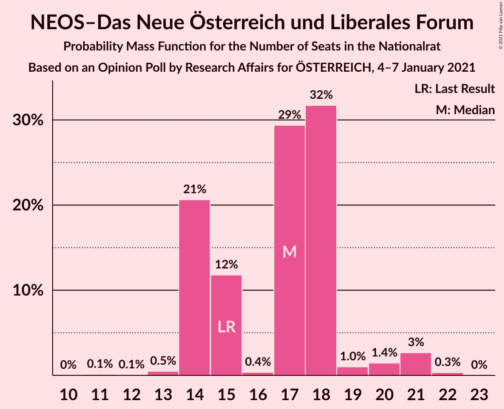

| Number of Seats | Probability | Accumulated | Special Marks |
|:---------------:|:-----------:|:-----------:|:-------------:|
| 11 | 0.1% | 100% |  |
| 12 | 0.1% | 99.9% |  |
| 13 | 0.5% | 99.8% |  |
| 14 | 21% | 99.3% |  |
| 15 | 12% | 79% | Last Result |
| 16 | 0.4% | 67% |  |
| 17 | 29% | 67% | Median |
| 18 | 32% | 37% |  |
| 19 | 1.0% | 5% |  |
| 20 | 1.4% | 4% |  |
| 21 | 3% | 3% |  |
| 22 | 0.3% | 0.4% |  |
| 23 | 0% | 0% |  |

### Die Grünen–Die Grüne Alternative

*For a full overview of the results for this party, see the [Die Grünen–Die Grüne Alternative](party-diegrünen–diegrünealternative.html) page.*

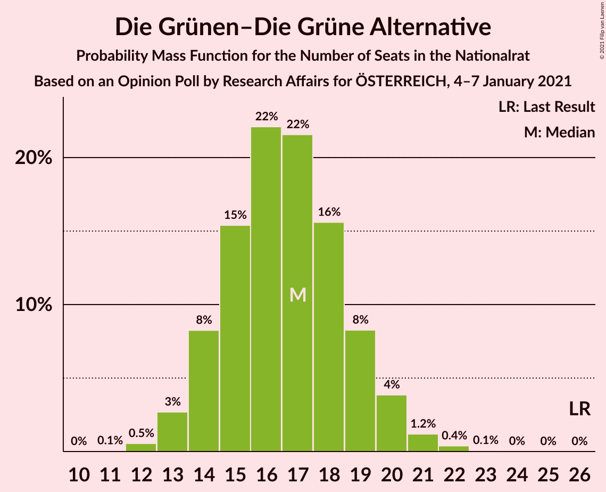

| Number of Seats | Probability | Accumulated | Special Marks |
|:---------------:|:-----------:|:-----------:|:-------------:|
| 11 | 0.1% | 100% |  |
| 12 | 0.5% | 99.9% |  |
| 13 | 3% | 99.4% |  |
| 14 | 8% | 97% |  |
| 15 | 15% | 88% |  |
| 16 | 22% | 73% |  |
| 17 | 22% | 51% | Median |
| 18 | 16% | 29% |  |
| 19 | 8% | 14% |  |
| 20 | 4% | 6% |  |
| 21 | 1.2% | 2% |  |
| 22 | 0.4% | 0.5% |  |
| 23 | 0.1% | 0.1% |  |
| 24 | 0% | 0% |  |
| 25 | 0% | 0% |  |
| 26 | 0% | 0% | Last Result |

## Coalitions

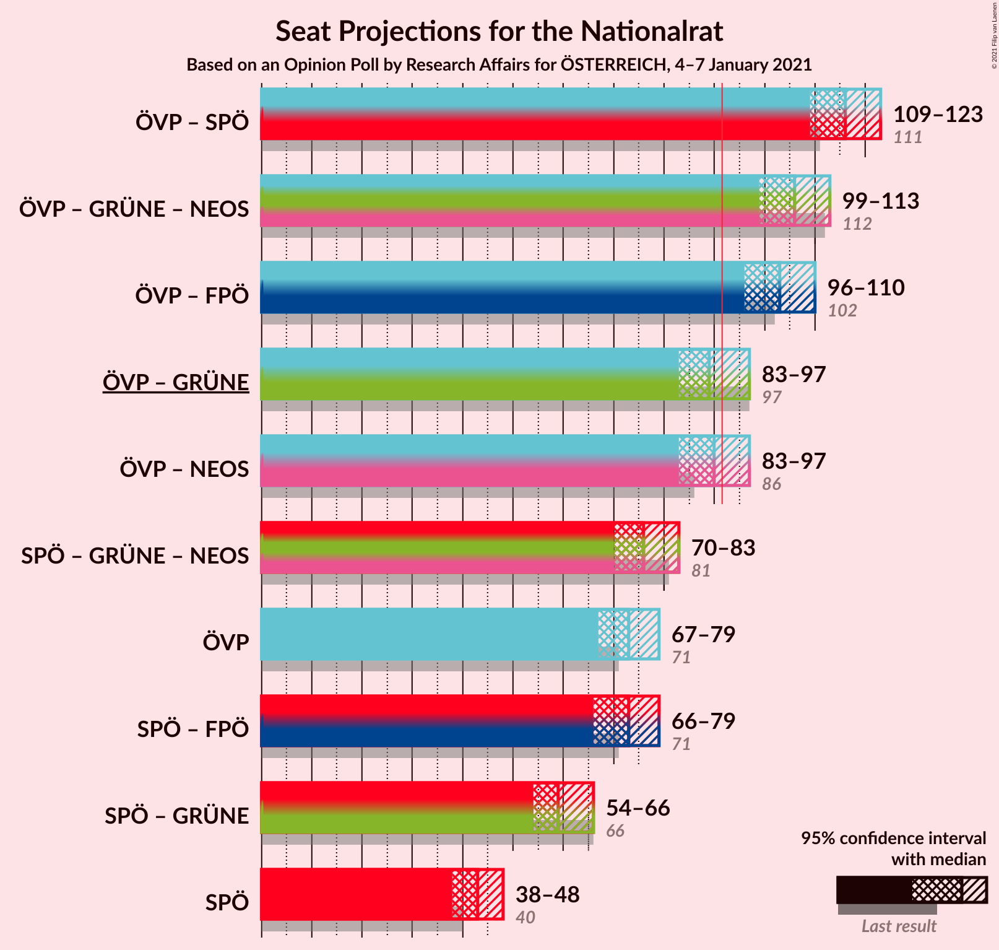

### Confidence Intervals

| Coalition | Last Result | Median | Majority? | 80% Confidence Interval | 90% Confidence Interval | 95% Confidence Interval | 99% Confidence Interval |
|:---------:|:-----------:|:------:|:---------:|:-----------------------:|:-----------------------:|:-----------------------:|:-----------------------:|
| Österreichische Volkspartei – Sozialdemokratische Partei Österreichs | 111 | 116 | 100% | 111–121 | 110–122 | 109–123 | 107–125 |
| Österreichische Volkspartei – Die Grünen–Die Grüne Alternative – NEOS–Das Neue Österreich und Liberales Forum | 112 | 106 | 100% | 101–111 | 100–112 | 99–113 | 97–115 |
| Österreichische Volkspartei – Freiheitliche Partei Österreichs | 102 | 103 | 100% | 98–108 | 97–109 | 96–110 | 94–112 |
| Österreichische Volkspartei – Die Grünen–Die Grüne Alternative | 97 | 89 | 29% | 85–94 | 84–95 | 83–97 | 81–99 |
| Österreichische Volkspartei – NEOS–Das Neue Österreich und Liberales Forum | 86 | 90 | 30% | 85–94 | 84–95 | 83–97 | 81–99 |
| Sozialdemokratische Partei Österreichs – Die Grünen–Die Grüne Alternative – NEOS–Das Neue Österreich und Liberales Forum | 81 | 76 | 0% | 72–80 | 71–82 | 70–83 | 68–85 |
| Österreichische Volkspartei | 71 | 73 | 0% | 69–77 | 68–78 | 67–79 | 65–81 |
| Sozialdemokratische Partei Österreichs – Freiheitliche Partei Österreichs | 71 | 73 | 0% | 68–77 | 67–78 | 66–79 | 64–81 |
| Sozialdemokratische Partei Österreichs – Die Grünen–Die Grüne Alternative | 66 | 59 | 0% | 56–63 | 54–65 | 54–66 | 52–68 |
| Sozialdemokratische Partei Österreichs | 40 | 43 | 0% | 39–46 | 39–47 | 38–48 | 36–50 |

### Österreichische Volkspartei – Sozialdemokratische Partei Österreichs

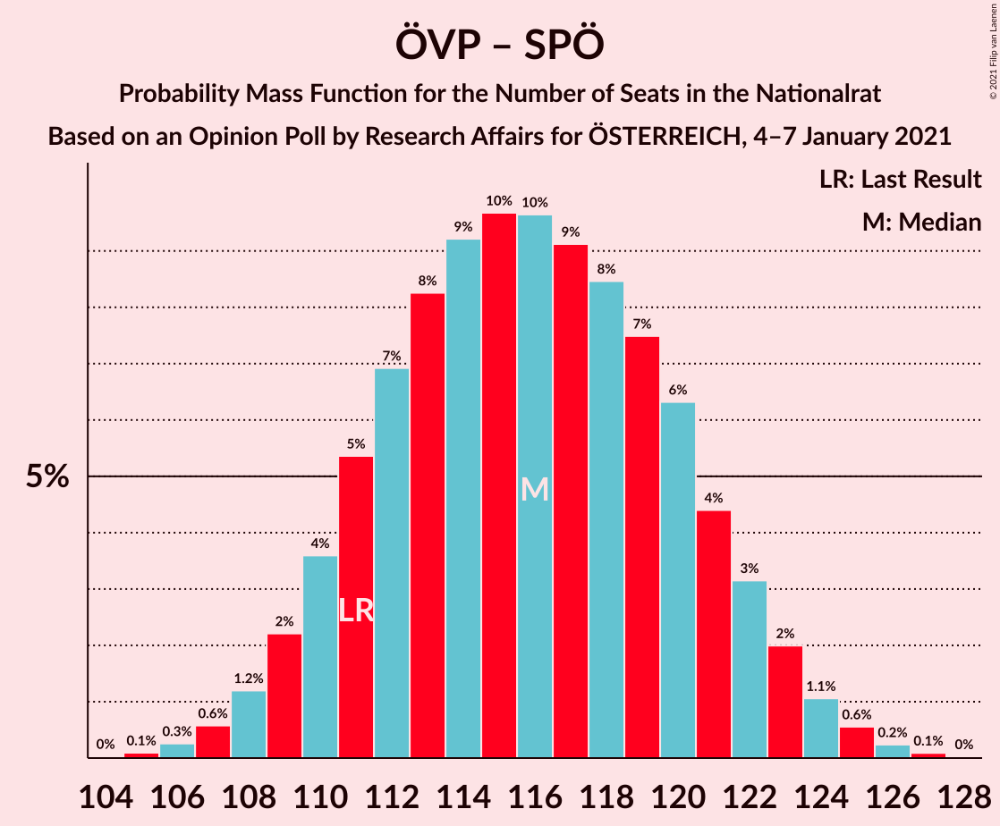

| Number of Seats | Probability | Accumulated | Special Marks |
|:---------------:|:-----------:|:-----------:|:-------------:|
| 105 | 0.1% | 100% |  |
| 106 | 0.3% | 99.9% |  |
| 107 | 0.6% | 99.6% |  |
| 108 | 1.2% | 99.0% |  |
| 109 | 2% | 98% |  |
| 110 | 4% | 96% |  |
| 111 | 5% | 92% | Last Result |
| 112 | 7% | 87% |  |
| 113 | 8% | 80% |  |
| 114 | 9% | 71% |  |
| 115 | 10% | 62% |  |
| 116 | 10% | 53% | Median |
| 117 | 9% | 43% |  |
| 118 | 8% | 34% |  |
| 119 | 7% | 25% |  |
| 120 | 6% | 18% |  |
| 121 | 4% | 12% |  |
| 122 | 3% | 7% |  |
| 123 | 2% | 4% |  |
| 124 | 1.1% | 2% |  |
| 125 | 0.6% | 0.9% |  |
| 126 | 0.2% | 0.4% |  |
| 127 | 0.1% | 0.1% |  |
| 128 | 0% | 0% |  |

### Österreichische Volkspartei – Die Grünen–Die Grüne Alternative – NEOS–Das Neue Österreich und Liberales Forum

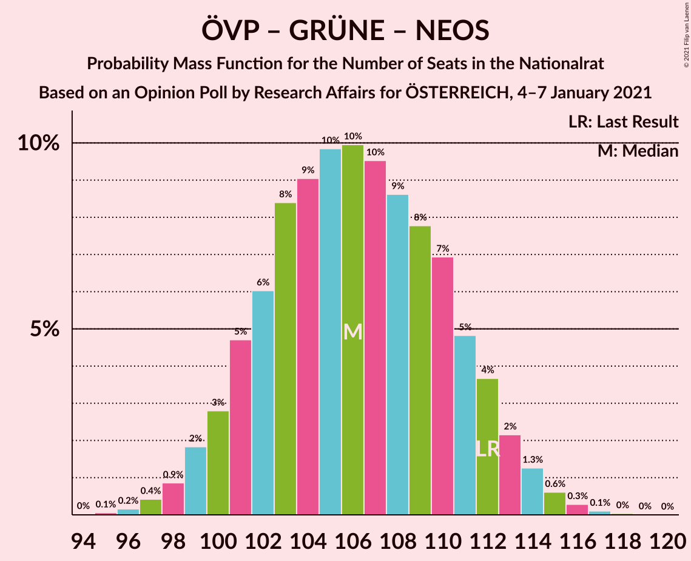

| Number of Seats | Probability | Accumulated | Special Marks |
|:---------------:|:-----------:|:-----------:|:-------------:|
| 95 | 0.1% | 100% |  |
| 96 | 0.2% | 99.9% |  |
| 97 | 0.4% | 99.8% |  |
| 98 | 0.9% | 99.3% |  |
| 99 | 2% | 98% |  |
| 100 | 3% | 97% |  |
| 101 | 5% | 94% |  |
| 102 | 6% | 89% |  |
| 103 | 8% | 83% |  |
| 104 | 9% | 75% |  |
| 105 | 10% | 66% |  |
| 106 | 10% | 56% |  |
| 107 | 10% | 46% | Median |
| 108 | 9% | 36% |  |
| 109 | 8% | 28% |  |
| 110 | 7% | 20% |  |
| 111 | 5% | 13% |  |
| 112 | 4% | 8% | Last Result |
| 113 | 2% | 4% |  |
| 114 | 1.3% | 2% |  |
| 115 | 0.6% | 1.1% |  |
| 116 | 0.3% | 0.4% |  |
| 117 | 0.1% | 0.2% |  |
| 118 | 0% | 0.1% |  |
| 119 | 0% | 0% |  |

### Österreichische Volkspartei – Freiheitliche Partei Österreichs

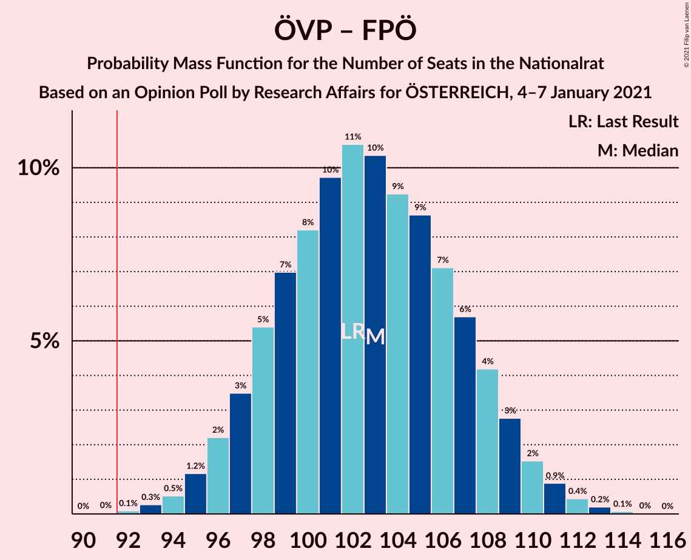

| Number of Seats | Probability | Accumulated | Special Marks |
|:---------------:|:-----------:|:-----------:|:-------------:|
| 92 | 0.1% | 100% | Majority |
| 93 | 0.3% | 99.9% |  |
| 94 | 0.5% | 99.6% |  |
| 95 | 1.2% | 99.1% |  |
| 96 | 2% | 98% |  |
| 97 | 3% | 96% |  |
| 98 | 5% | 92% |  |
| 99 | 7% | 87% |  |
| 100 | 8% | 80% |  |
| 101 | 10% | 72% |  |
| 102 | 11% | 62% | Last Result |
| 103 | 10% | 51% | Median |
| 104 | 9% | 41% |  |
| 105 | 9% | 32% |  |
| 106 | 7% | 23% |  |
| 107 | 6% | 16% |  |
| 108 | 4% | 10% |  |
| 109 | 3% | 6% |  |
| 110 | 2% | 3% |  |
| 111 | 0.9% | 2% |  |
| 112 | 0.4% | 0.8% |  |
| 113 | 0.2% | 0.3% |  |
| 114 | 0.1% | 0.1% |  |
| 115 | 0% | 0% |  |

### Österreichische Volkspartei – Die Grünen–Die Grüne Alternative

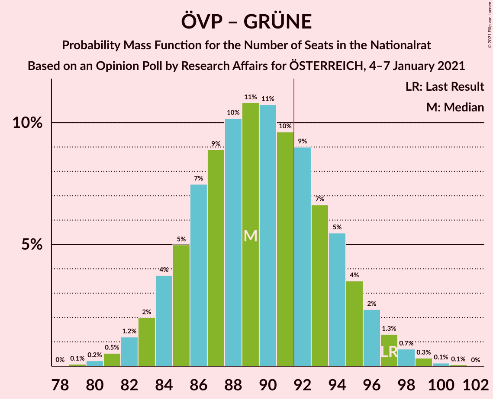

| Number of Seats | Probability | Accumulated | Special Marks |
|:---------------:|:-----------:|:-----------:|:-------------:|
| 79 | 0.1% | 100% |  |
| 80 | 0.2% | 99.9% |  |
| 81 | 0.5% | 99.7% |  |
| 82 | 1.2% | 99.1% |  |
| 83 | 2% | 98% |  |
| 84 | 4% | 96% |  |
| 85 | 5% | 92% |  |
| 86 | 7% | 87% |  |
| 87 | 9% | 80% |  |
| 88 | 10% | 71% |  |
| 89 | 11% | 61% |  |
| 90 | 11% | 50% | Median |
| 91 | 10% | 39% |  |
| 92 | 9% | 29% | Majority |
| 93 | 7% | 20% |  |
| 94 | 5% | 14% |  |
| 95 | 4% | 8% |  |
| 96 | 2% | 5% |  |
| 97 | 1.3% | 3% | Last Result |
| 98 | 0.7% | 1.2% |  |
| 99 | 0.3% | 0.5% |  |
| 100 | 0.1% | 0.2% |  |
| 101 | 0.1% | 0.1% |  |
| 102 | 0% | 0% |  |

### Österreichische Volkspartei – NEOS–Das Neue Österreich und Liberales Forum

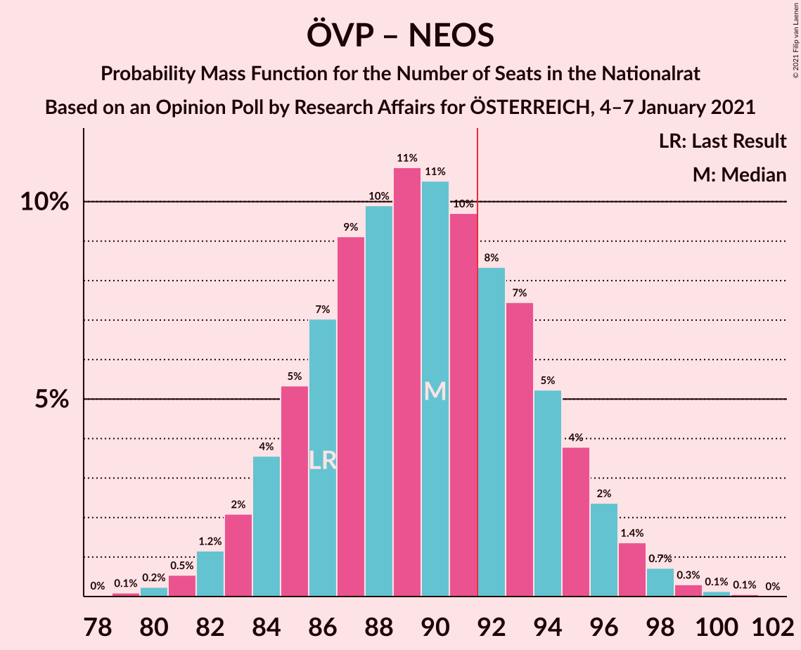

| Number of Seats | Probability | Accumulated | Special Marks |
|:---------------:|:-----------:|:-----------:|:-------------:|
| 79 | 0.1% | 100% |  |
| 80 | 0.2% | 99.9% |  |
| 81 | 0.5% | 99.6% |  |
| 82 | 1.2% | 99.1% |  |
| 83 | 2% | 98% |  |
| 84 | 4% | 96% |  |
| 85 | 5% | 92% |  |
| 86 | 7% | 87% | Last Result |
| 87 | 9% | 80% |  |
| 88 | 10% | 71% |  |
| 89 | 11% | 61% |  |
| 90 | 11% | 50% | Median |
| 91 | 10% | 39% |  |
| 92 | 8% | 30% | Majority |
| 93 | 7% | 21% |  |
| 94 | 5% | 14% |  |
| 95 | 4% | 9% |  |
| 96 | 2% | 5% |  |
| 97 | 1.4% | 3% |  |
| 98 | 0.7% | 1.2% |  |
| 99 | 0.3% | 0.5% |  |
| 100 | 0.1% | 0.2% |  |
| 101 | 0.1% | 0.1% |  |
| 102 | 0% | 0% |  |

### Sozialdemokratische Partei Österreichs – Die Grünen–Die Grüne Alternative – NEOS–Das Neue Österreich und Liberales Forum

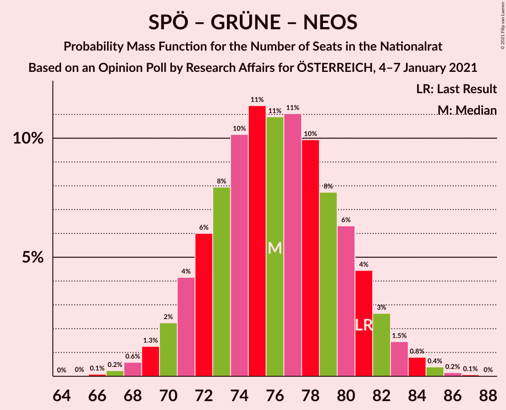

| Number of Seats | Probability | Accumulated | Special Marks |
|:---------------:|:-----------:|:-----------:|:-------------:|
| 66 | 0.1% | 100% |  |
| 67 | 0.2% | 99.9% |  |
| 68 | 0.6% | 99.6% |  |
| 69 | 1.3% | 99.0% |  |
| 70 | 2% | 98% |  |
| 71 | 4% | 96% |  |
| 72 | 6% | 91% |  |
| 73 | 8% | 85% |  |
| 74 | 10% | 77% |  |
| 75 | 11% | 67% |  |
| 76 | 11% | 56% |  |
| 77 | 11% | 45% | Median |
| 78 | 10% | 34% |  |
| 79 | 8% | 24% |  |
| 80 | 6% | 16% |  |
| 81 | 4% | 10% | Last Result |
| 82 | 3% | 6% |  |
| 83 | 1.5% | 3% |  |
| 84 | 0.8% | 1.4% |  |
| 85 | 0.4% | 0.6% |  |
| 86 | 0.2% | 0.2% |  |
| 87 | 0.1% | 0.1% |  |
| 88 | 0% | 0% |  |

### Österreichische Volkspartei

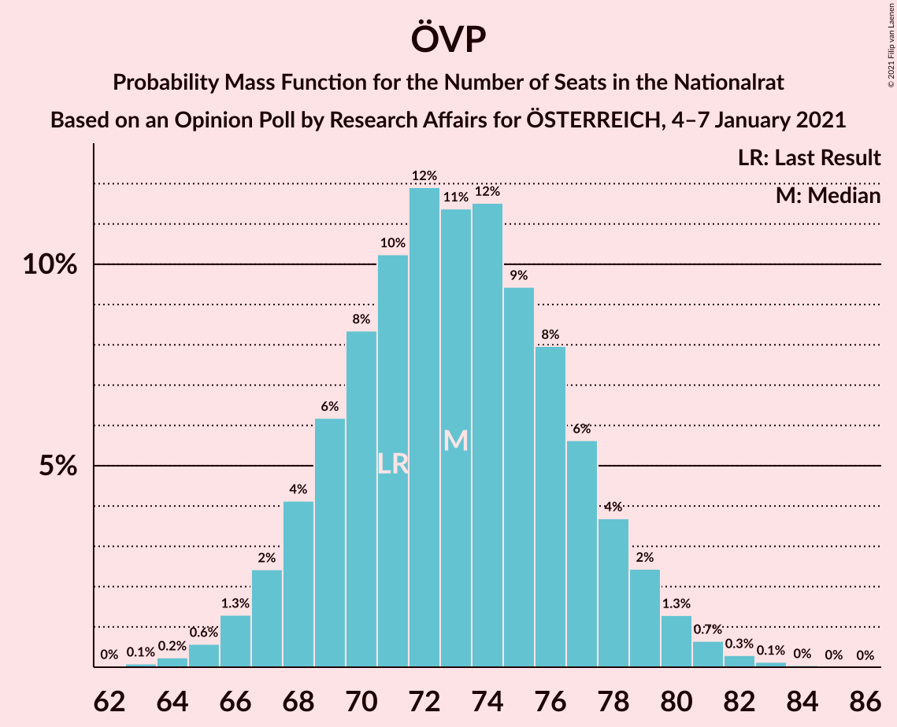

| Number of Seats | Probability | Accumulated | Special Marks |
|:---------------:|:-----------:|:-----------:|:-------------:|
| 63 | 0.1% | 100% |  |
| 64 | 0.2% | 99.9% |  |
| 65 | 0.6% | 99.6% |  |
| 66 | 1.3% | 99.1% |  |
| 67 | 2% | 98% |  |
| 68 | 4% | 95% |  |
| 69 | 6% | 91% |  |
| 70 | 8% | 85% |  |
| 71 | 10% | 77% | Last Result |
| 72 | 12% | 66% |  |
| 73 | 11% | 55% | Median |
| 74 | 12% | 43% |  |
| 75 | 9% | 32% |  |
| 76 | 8% | 22% |  |
| 77 | 6% | 14% |  |
| 78 | 4% | 9% |  |
| 79 | 2% | 5% |  |
| 80 | 1.3% | 2% |  |
| 81 | 0.7% | 1.1% |  |
| 82 | 0.3% | 0.5% |  |
| 83 | 0.1% | 0.2% |  |
| 84 | 0% | 0.1% |  |
| 85 | 0% | 0% |  |

### Sozialdemokratische Partei Österreichs – Freiheitliche Partei Österreichs

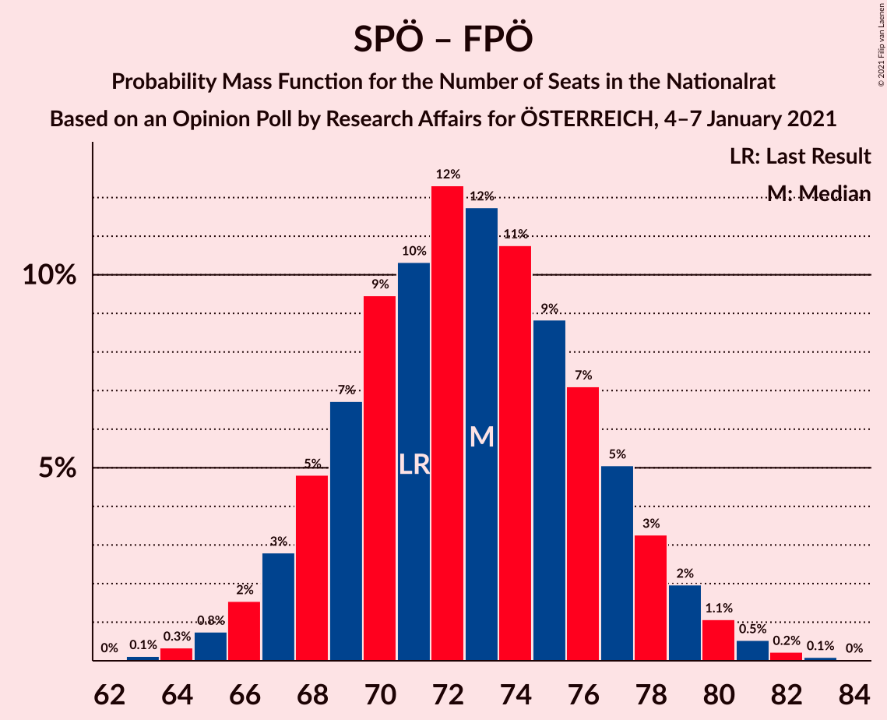

| Number of Seats | Probability | Accumulated | Special Marks |
|:---------------:|:-----------:|:-----------:|:-------------:|
| 62 | 0% | 100% |  |
| 63 | 0.1% | 99.9% |  |
| 64 | 0.3% | 99.8% |  |
| 65 | 0.8% | 99.5% |  |
| 66 | 2% | 98.7% |  |
| 67 | 3% | 97% |  |
| 68 | 5% | 94% |  |
| 69 | 7% | 90% |  |
| 70 | 9% | 83% |  |
| 71 | 10% | 73% | Last Result |
| 72 | 12% | 63% |  |
| 73 | 12% | 51% | Median |
| 74 | 11% | 39% |  |
| 75 | 9% | 28% |  |
| 76 | 7% | 19% |  |
| 77 | 5% | 12% |  |
| 78 | 3% | 7% |  |
| 79 | 2% | 4% |  |
| 80 | 1.1% | 2% |  |
| 81 | 0.5% | 0.9% |  |
| 82 | 0.2% | 0.4% |  |
| 83 | 0.1% | 0.1% |  |
| 84 | 0% | 0% |  |

### Sozialdemokratische Partei Österreichs – Die Grünen–Die Grüne Alternative

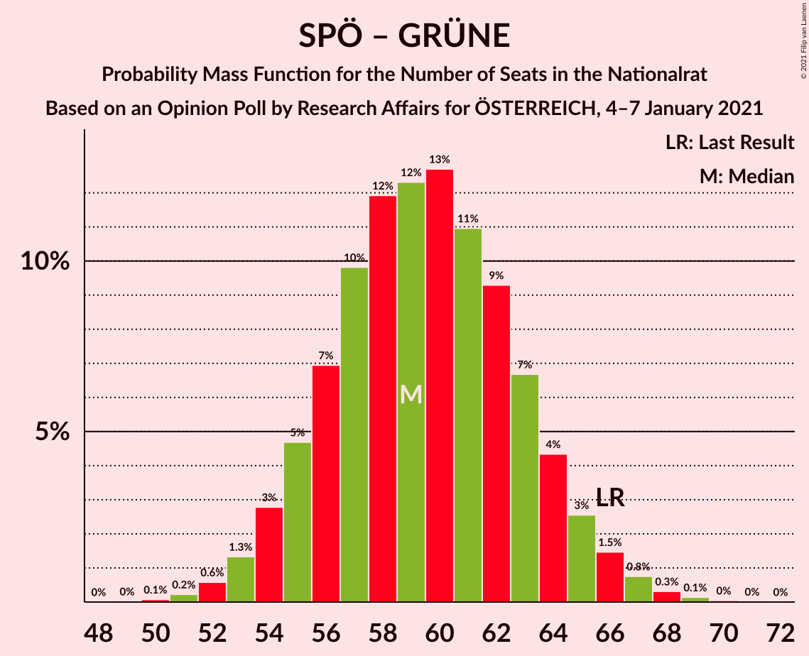

| Number of Seats | Probability | Accumulated | Special Marks |
|:---------------:|:-----------:|:-----------:|:-------------:|
| 50 | 0.1% | 100% |  |
| 51 | 0.2% | 99.9% |  |
| 52 | 0.6% | 99.7% |  |
| 53 | 1.3% | 99.1% |  |
| 54 | 3% | 98% |  |
| 55 | 5% | 95% |  |
| 56 | 7% | 90% |  |
| 57 | 10% | 83% |  |
| 58 | 12% | 74% |  |
| 59 | 12% | 62% |  |
| 60 | 13% | 49% | Median |
| 61 | 11% | 37% |  |
| 62 | 9% | 26% |  |
| 63 | 7% | 16% |  |
| 64 | 4% | 10% |  |
| 65 | 3% | 5% |  |
| 66 | 1.5% | 3% | Last Result |
| 67 | 0.8% | 1.3% |  |
| 68 | 0.3% | 0.5% |  |
| 69 | 0.1% | 0.2% |  |
| 70 | 0% | 0.1% |  |
| 71 | 0% | 0% |  |

### Sozialdemokratische Partei Österreichs

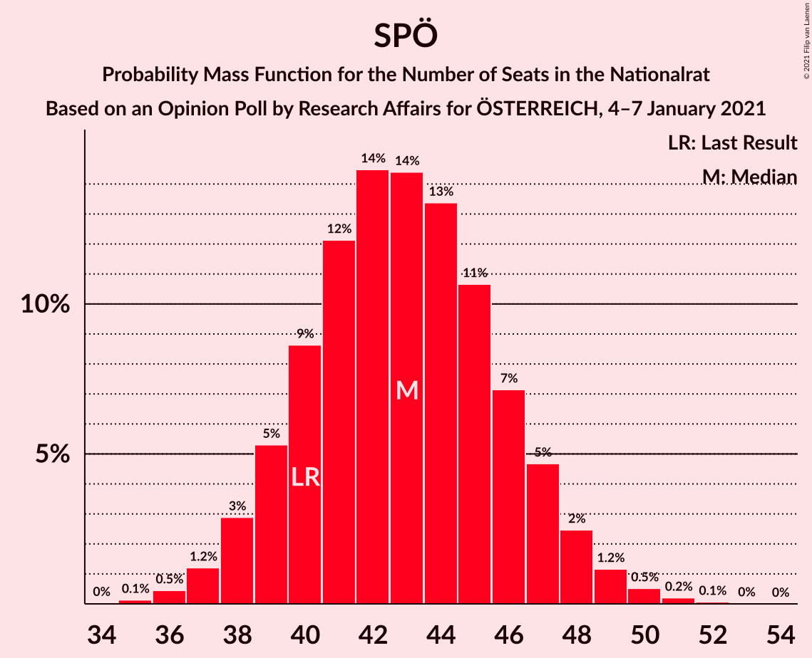

| Number of Seats | Probability | Accumulated | Special Marks |
|:---------------:|:-----------:|:-----------:|:-------------:|
| 35 | 0.1% | 100% |  |
| 36 | 0.5% | 99.8% |  |
| 37 | 1.2% | 99.4% |  |
| 38 | 3% | 98% |  |
| 39 | 5% | 95% |  |
| 40 | 9% | 90% | Last Result |
| 41 | 12% | 81% |  |
| 42 | 14% | 69% |  |
| 43 | 14% | 55% | Median |
| 44 | 13% | 40% |  |
| 45 | 11% | 27% |  |
| 46 | 7% | 16% |  |
| 47 | 5% | 9% |  |
| 48 | 2% | 4% |  |
| 49 | 1.2% | 2% |  |
| 50 | 0.5% | 0.8% |  |
| 51 | 0.2% | 0.3% |  |
| 52 | 0.1% | 0.1% |  |
| 53 | 0% | 0% |  |

## Technical Information

### Opinion Poll

+ **Polling firm:** Research Affairs
+ **Commissioner(s):** ÖSTERREICH
+ **Fieldwork period:** 4–7 January 2021

### Calculations

+ **Sample size:** 1000
+ **Simulations done:** 1,048,576
+ **Error estimate:** 0.55%

