# Opinion Poll by Unique Research for profil, 11–14 January 2021

<a href="#voting-intentions">Voting Intentions</a> | <a href="#seats">Seats</a> | <a href="#coalitions">Coalitions</a> | <a href="#technical-information">Technical Information</a>

## Voting Intentions

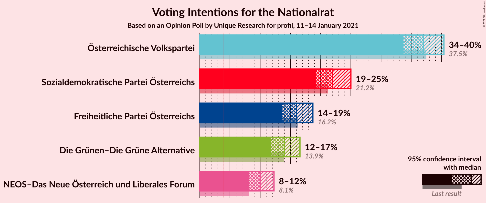

### Confidence Intervals

| Party | Last Result | Poll Result | 80% Confidence Interval | 90% Confidence Interval | 95% Confidence Interval | 99% Confidence Interval |
|:-----:|:-----------:|:-----------:|:-----------------------:|:-----------------------:|:-----------------------:|:-----------------------:|
| Österreichische Volkspartei | 37.5% | 37.0% | 34.8–39.2% |34.2–39.9% |33.7–40.4% |32.7–41.5% |
| Sozialdemokratische Partei Österreichs | 21.2% | 22.0% | 20.2–24.0% |19.7–24.5% |19.3–25.0% |18.4–26.0% |
| Freiheitliche Partei Österreichs | 16.2% | 16.0% | 14.4–17.8% |14.0–18.3% |13.6–18.7% |12.9–19.6% |
| Die Grünen–Die Grüne Alternative | 13.9% | 14.0% | 12.5–15.7% |12.1–16.2% |11.8–16.6% |11.1–17.4% |
| NEOS–Das Neue Österreich und Liberales Forum | 8.1% | 10.0% | 8.7–11.5% |8.4–11.9% |8.1–12.3% |7.5–13.0% |

*Note:* The poll result column reflects the actual value used in the calculations. Published results may vary slightly, and in addition be rounded to fewer digits.

## Seats

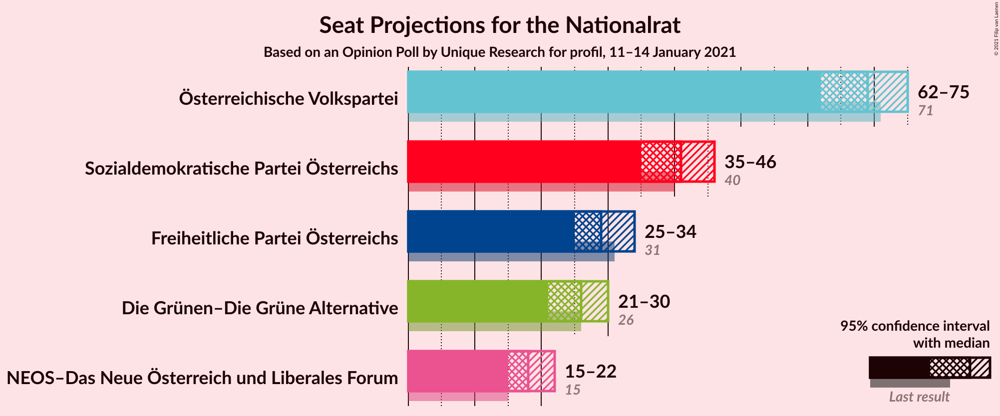

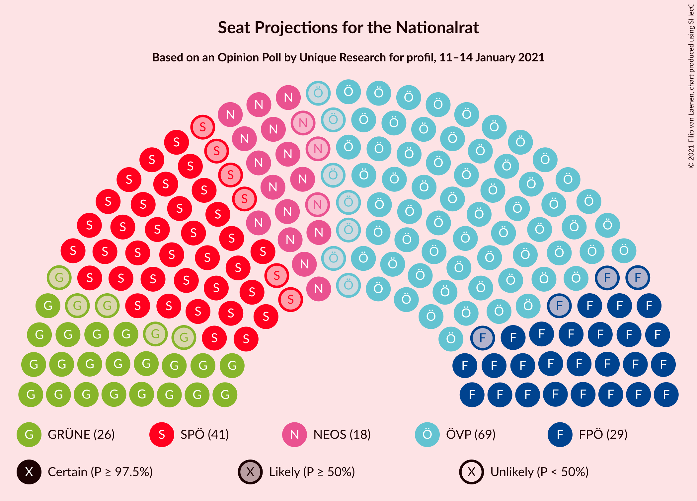

### Confidence Intervals

| Party | Last Result | Median | 80% Confidence Interval | 90% Confidence Interval | 95% Confidence Interval | 99% Confidence Interval |
|:-----:|:-----------:|:------:|:-----------------------:|:-----------------------:|:-----------------------:|:-----------------------:|
| <a href="#österreichische-volkspartei">Österreichische Volkspartei</a> | 71 | 69 | 65–73 |63–74 |62–75 |61–77 |
| <a href="#sozialdemokratische-partei-österreichs">Sozialdemokratische Partei Österreichs</a> | 40 | 41 | 37–44 |36–45 |35–46 |34–48 |
| <a href="#freiheitliche-partei-österreichs">Freiheitliche Partei Österreichs</a> | 31 | 29 | 26–33 |26–34 |25–34 |24–36 |
| <a href="#die-grünen–die-grüne-alternative">Die Grünen–Die Grüne Alternative</a> | 26 | 26 | 23–29 |22–30 |21–30 |20–32 |
| <a href="#neos–das-neue-österreich-und-liberales-forum">NEOS–Das Neue Österreich und Liberales Forum</a> | 15 | 18 | 16–21 |15–22 |15–22 |14–24 |

### Österreichische Volkspartei

*For a full overview of the results for this party, see the [Österreichische Volkspartei](party-österreichischevolkspartei.html) page.*

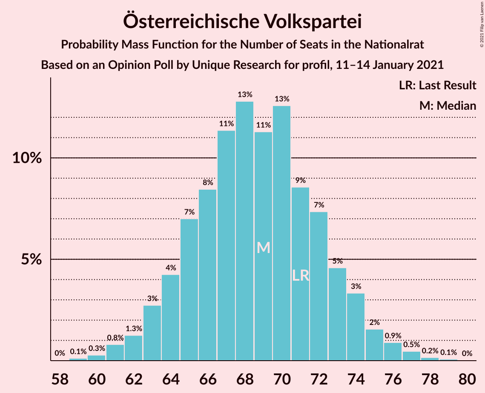

| Number of Seats | Probability | Accumulated | Special Marks |
|:---------------:|:-----------:|:-----------:|:-------------:|
| 58 | 0% | 100% |  |
| 59 | 0.1% | 99.9% |  |
| 60 | 0.3% | 99.8% |  |
| 61 | 0.8% | 99.5% |  |
| 62 | 1.3% | 98.7% |  |
| 63 | 3% | 97% |  |
| 64 | 4% | 95% |  |
| 65 | 7% | 91% |  |
| 66 | 8% | 84% |  |
| 67 | 11% | 75% |  |
| 68 | 13% | 64% |  |
| 69 | 11% | 51% | Median |
| 70 | 13% | 40% |  |
| 71 | 9% | 27% | Last Result |
| 72 | 7% | 18% |  |
| 73 | 5% | 11% |  |
| 74 | 3% | 7% |  |
| 75 | 2% | 3% |  |
| 76 | 0.9% | 2% |  |
| 77 | 0.5% | 0.7% |  |
| 78 | 0.2% | 0.3% |  |
| 79 | 0.1% | 0.1% |  |
| 80 | 0% | 0% |  |

### Sozialdemokratische Partei Österreichs

*For a full overview of the results for this party, see the [Sozialdemokratische Partei Österreichs](party-sozialdemokratischeparteiösterreichs.html) page.*

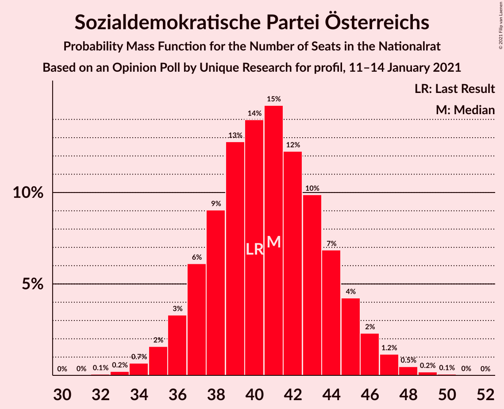

| Number of Seats | Probability | Accumulated | Special Marks |
|:---------------:|:-----------:|:-----------:|:-------------:|
| 32 | 0.1% | 100% |  |
| 33 | 0.2% | 99.9% |  |
| 34 | 0.7% | 99.7% |  |
| 35 | 2% | 99.0% |  |
| 36 | 3% | 97% |  |
| 37 | 6% | 94% |  |
| 38 | 9% | 88% |  |
| 39 | 13% | 79% |  |
| 40 | 14% | 66% | Last Result |
| 41 | 15% | 52% | Median |
| 42 | 12% | 37% |  |
| 43 | 10% | 25% |  |
| 44 | 7% | 15% |  |
| 45 | 4% | 8% |  |
| 46 | 2% | 4% |  |
| 47 | 1.2% | 2% |  |
| 48 | 0.5% | 0.8% |  |
| 49 | 0.2% | 0.3% |  |
| 50 | 0.1% | 0.1% |  |
| 51 | 0% | 0% |  |

### Freiheitliche Partei Österreichs

*For a full overview of the results for this party, see the [Freiheitliche Partei Österreichs](party-freiheitlicheparteiösterreichs.html) page.*

| Number of Seats | Probability | Accumulated | Special Marks |
|:---------------:|:-----------:|:-----------:|:-------------:|
| 22 | 0.1% | 100% |  |
| 23 | 0.2% | 99.9% |  |
| 24 | 2% | 99.7% |  |
| 25 | 2% | 98% |  |
| 26 | 7% | 96% |  |
| 27 | 10% | 89% |  |
| 28 | 9% | 79% |  |
| 29 | 24% | 69% | Median |
| 30 | 7% | 45% |  |
| 31 | 20% | 38% | Last Result |
| 32 | 6% | 18% |  |
| 33 | 6% | 12% |  |
| 34 | 4% | 6% |  |
| 35 | 0.8% | 2% |  |
| 36 | 0.9% | 1.1% |  |
| 37 | 0.1% | 0.2% |  |
| 38 | 0.1% | 0.1% |  |
| 39 | 0% | 0% |  |

### Die Grünen–Die Grüne Alternative

*For a full overview of the results for this party, see the [Die Grünen–Die Grüne Alternative](party-diegrünen–diegrünealternative.html) page.*

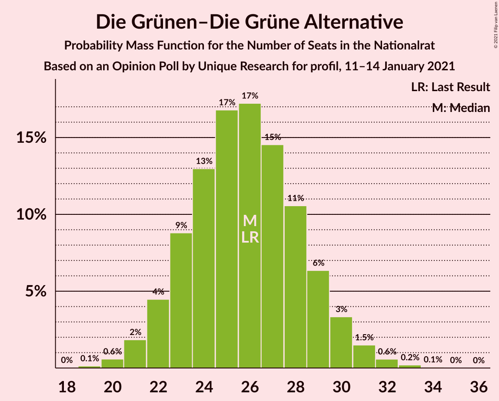

| Number of Seats | Probability | Accumulated | Special Marks |
|:---------------:|:-----------:|:-----------:|:-------------:|
| 19 | 0.1% | 100% |  |
| 20 | 0.6% | 99.8% |  |
| 21 | 2% | 99.3% |  |
| 22 | 4% | 97% |  |
| 23 | 9% | 93% |  |
| 24 | 13% | 84% |  |
| 25 | 17% | 71% |  |
| 26 | 17% | 54% | Last Result, Median |
| 27 | 15% | 37% |  |
| 28 | 11% | 23% |  |
| 29 | 6% | 12% |  |
| 30 | 3% | 6% |  |
| 31 | 1.5% | 2% |  |
| 32 | 0.6% | 0.9% |  |
| 33 | 0.2% | 0.3% |  |
| 34 | 0.1% | 0.1% |  |
| 35 | 0% | 0% |  |

### NEOS–Das Neue Österreich und Liberales Forum

*For a full overview of the results for this party, see the [NEOS–Das Neue Österreich und Liberales Forum](party-neos–dasneueösterreichundliberalesforum.html) page.*

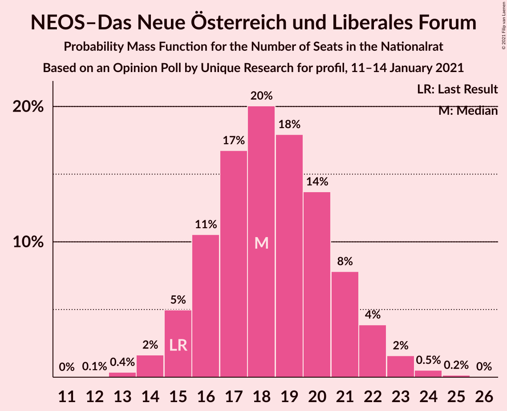

| Number of Seats | Probability | Accumulated | Special Marks |
|:---------------:|:-----------:|:-----------:|:-------------:|
| 12 | 0.1% | 100% |  |
| 13 | 0.4% | 99.9% |  |
| 14 | 2% | 99.6% |  |
| 15 | 5% | 98% | Last Result |
| 16 | 11% | 93% |  |
| 17 | 17% | 82% |  |
| 18 | 20% | 66% | Median |
| 19 | 18% | 46% |  |
| 20 | 14% | 28% |  |
| 21 | 8% | 14% |  |
| 22 | 4% | 6% |  |
| 23 | 2% | 2% |  |
| 24 | 0.5% | 0.7% |  |
| 25 | 0.2% | 0.2% |  |
| 26 | 0% | 0% |  |

## Coalitions

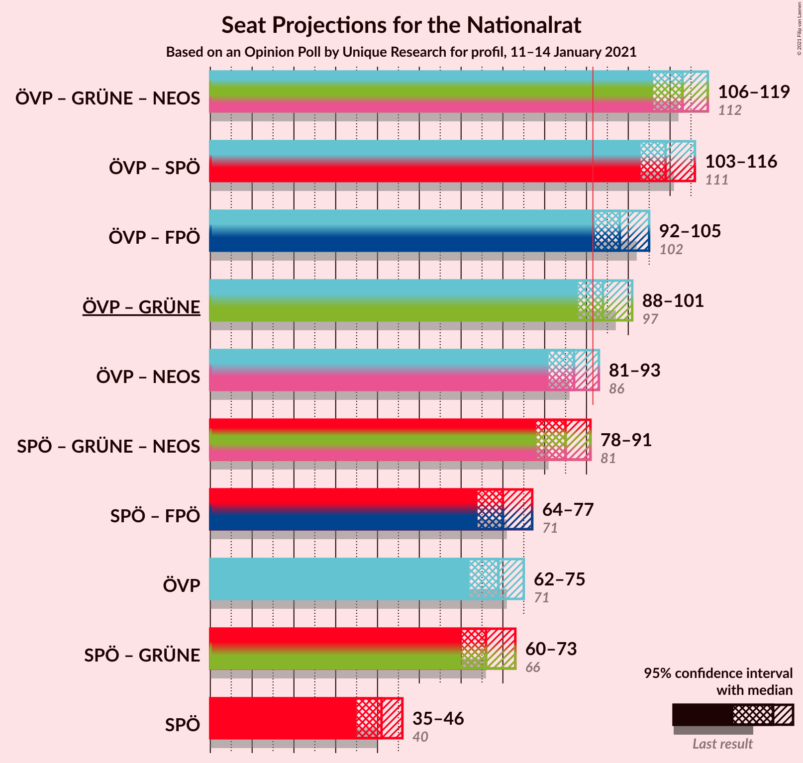

### Confidence Intervals

| Coalition | Last Result | Median | Majority? | 80% Confidence Interval | 90% Confidence Interval | 95% Confidence Interval | 99% Confidence Interval |
|:---------:|:-----------:|:------:|:---------:|:-----------------------:|:-----------------------:|:-----------------------:|:-----------------------:|
| Österreichische Volkspartei – Die Grünen–Die Grüne Alternative – NEOS–Das Neue Österreich und Liberales Forum | 112 | 113 | 100% | 109–117 | 108–118 | 106–119 | 104–121 |
| Österreichische Volkspartei – Sozialdemokratische Partei Österreichs | 111 | 109 | 100% | 105–113 | 104–115 | 103–116 | 101–118 |
| Österreichische Volkspartei – Freiheitliche Partei Österreichs | 102 | 98 | 98% | 94–102 | 93–104 | 92–105 | 90–107 |
| Österreichische Volkspartei – Die Grünen–Die Grüne Alternative | 97 | 94 | 82% | 90–99 | 89–100 | 88–101 | 86–103 |
| Österreichische Volkspartei – NEOS–Das Neue Österreich und Liberales Forum | 86 | 87 | 8% | 83–91 | 82–92 | 81–93 | 79–95 |
| Sozialdemokratische Partei Österreichs – Die Grünen–Die Grüne Alternative – NEOS–Das Neue Österreich und Liberales Forum | 81 | 85 | 2% | 81–89 | 79–90 | 78–91 | 76–93 |
| Sozialdemokratische Partei Österreichs – Freiheitliche Partei Österreichs | 71 | 70 | 0% | 66–74 | 65–75 | 64–77 | 62–79 |
| Österreichische Volkspartei | 71 | 69 | 0% | 65–73 | 63–74 | 62–75 | 61–77 |
| Sozialdemokratische Partei Österreichs – Die Grünen–Die Grüne Alternative | 66 | 66 | 0% | 62–71 | 61–72 | 60–73 | 58–75 |
| Sozialdemokratische Partei Österreichs | 40 | 41 | 0% | 37–44 | 36–45 | 35–46 | 34–48 |

### Österreichische Volkspartei – Die Grünen–Die Grüne Alternative – NEOS–Das Neue Österreich und Liberales Forum

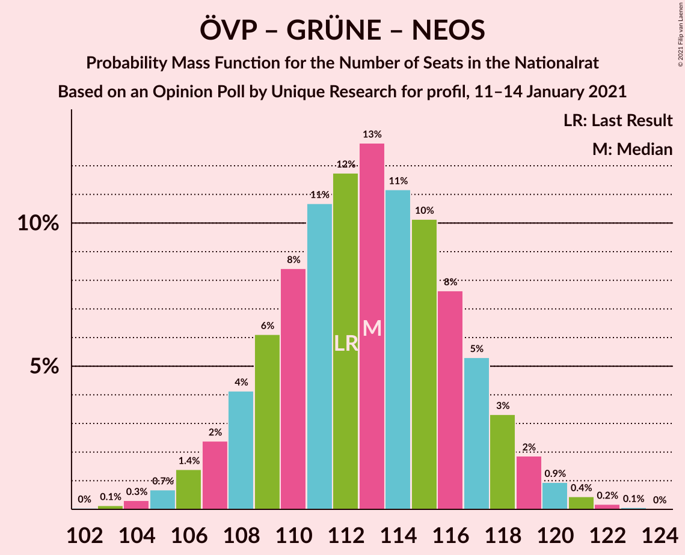

| Number of Seats | Probability | Accumulated | Special Marks |
|:---------------:|:-----------:|:-----------:|:-------------:|
| 102 | 0% | 100% |  |
| 103 | 0.1% | 99.9% |  |
| 104 | 0.3% | 99.8% |  |
| 105 | 0.7% | 99.5% |  |
| 106 | 1.4% | 98.8% |  |
| 107 | 2% | 97% |  |
| 108 | 4% | 95% |  |
| 109 | 6% | 91% |  |
| 110 | 8% | 85% |  |
| 111 | 11% | 76% |  |
| 112 | 12% | 66% | Last Result |
| 113 | 13% | 54% | Median |
| 114 | 11% | 41% |  |
| 115 | 10% | 30% |  |
| 116 | 8% | 20% |  |
| 117 | 5% | 12% |  |
| 118 | 3% | 7% |  |
| 119 | 2% | 4% |  |
| 120 | 0.9% | 2% |  |
| 121 | 0.4% | 0.7% |  |
| 122 | 0.2% | 0.3% |  |
| 123 | 0.1% | 0.1% |  |
| 124 | 0% | 0% |  |

### Österreichische Volkspartei – Sozialdemokratische Partei Österreichs

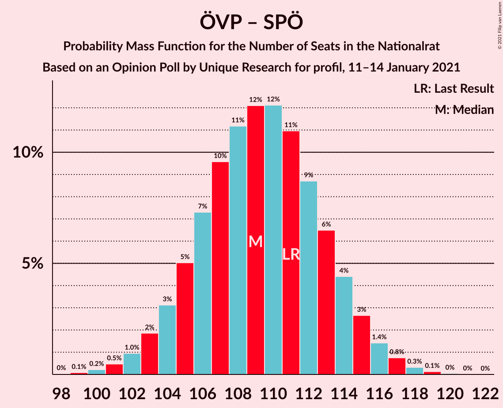

| Number of Seats | Probability | Accumulated | Special Marks |
|:---------------:|:-----------:|:-----------:|:-------------:|
| 99 | 0.1% | 100% |  |
| 100 | 0.2% | 99.9% |  |
| 101 | 0.5% | 99.7% |  |
| 102 | 1.0% | 99.2% |  |
| 103 | 2% | 98% |  |
| 104 | 3% | 96% |  |
| 105 | 5% | 93% |  |
| 106 | 7% | 88% |  |
| 107 | 10% | 81% |  |
| 108 | 11% | 71% |  |
| 109 | 12% | 60% |  |
| 110 | 12% | 48% | Median |
| 111 | 11% | 36% | Last Result |
| 112 | 9% | 25% |  |
| 113 | 6% | 16% |  |
| 114 | 4% | 10% |  |
| 115 | 3% | 5% |  |
| 116 | 1.4% | 3% |  |
| 117 | 0.8% | 1.3% |  |
| 118 | 0.3% | 0.5% |  |
| 119 | 0.1% | 0.2% |  |
| 120 | 0% | 0.1% |  |
| 121 | 0% | 0% |  |

### Österreichische Volkspartei – Freiheitliche Partei Österreichs

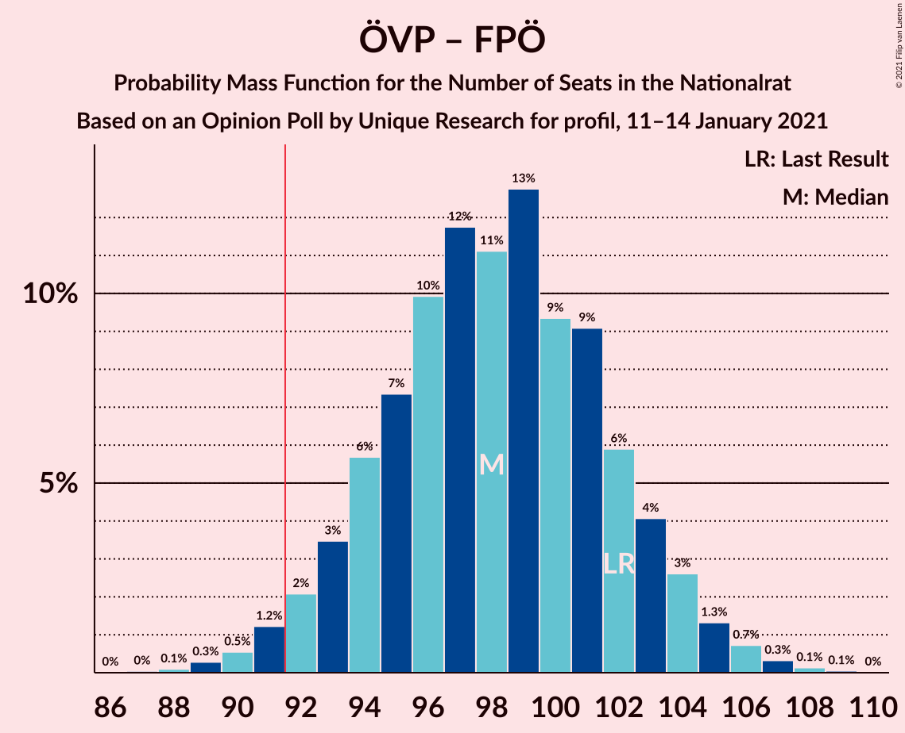

| Number of Seats | Probability | Accumulated | Special Marks |
|:---------------:|:-----------:|:-----------:|:-------------:|
| 87 | 0% | 100% |  |
| 88 | 0.1% | 99.9% |  |
| 89 | 0.3% | 99.8% |  |
| 90 | 0.5% | 99.6% |  |
| 91 | 1.2% | 99.0% |  |
| 92 | 2% | 98% | Majority |
| 93 | 3% | 96% |  |
| 94 | 6% | 92% |  |
| 95 | 7% | 87% |  |
| 96 | 10% | 79% |  |
| 97 | 12% | 69% |  |
| 98 | 11% | 57% | Median |
| 99 | 13% | 46% |  |
| 100 | 9% | 34% |  |
| 101 | 9% | 24% |  |
| 102 | 6% | 15% | Last Result |
| 103 | 4% | 9% |  |
| 104 | 3% | 5% |  |
| 105 | 1.3% | 3% |  |
| 106 | 0.7% | 1.3% |  |
| 107 | 0.3% | 0.5% |  |
| 108 | 0.1% | 0.2% |  |
| 109 | 0.1% | 0.1% |  |
| 110 | 0% | 0% |  |

### Österreichische Volkspartei – Die Grünen–Die Grüne Alternative

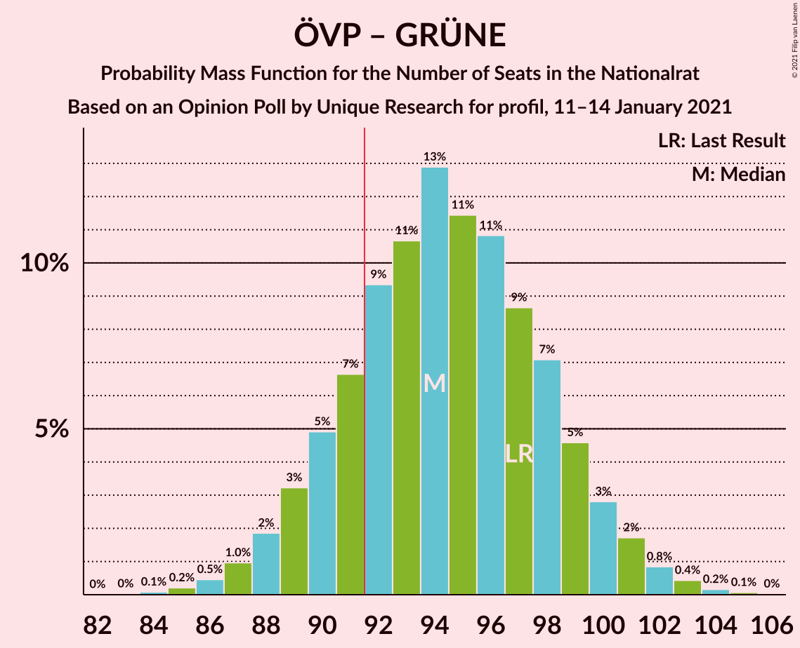

| Number of Seats | Probability | Accumulated | Special Marks |
|:---------------:|:-----------:|:-----------:|:-------------:|
| 84 | 0.1% | 100% |  |
| 85 | 0.2% | 99.9% |  |
| 86 | 0.5% | 99.7% |  |
| 87 | 1.0% | 99.2% |  |
| 88 | 2% | 98% |  |
| 89 | 3% | 96% |  |
| 90 | 5% | 93% |  |
| 91 | 7% | 88% |  |
| 92 | 9% | 82% | Majority |
| 93 | 11% | 72% |  |
| 94 | 13% | 62% |  |
| 95 | 11% | 49% | Median |
| 96 | 11% | 37% |  |
| 97 | 9% | 26% | Last Result |
| 98 | 7% | 18% |  |
| 99 | 5% | 11% |  |
| 100 | 3% | 6% |  |
| 101 | 2% | 3% |  |
| 102 | 0.8% | 2% |  |
| 103 | 0.4% | 0.7% |  |
| 104 | 0.2% | 0.3% |  |
| 105 | 0.1% | 0.1% |  |
| 106 | 0% | 0% |  |

### Österreichische Volkspartei – NEOS–Das Neue Österreich und Liberales Forum

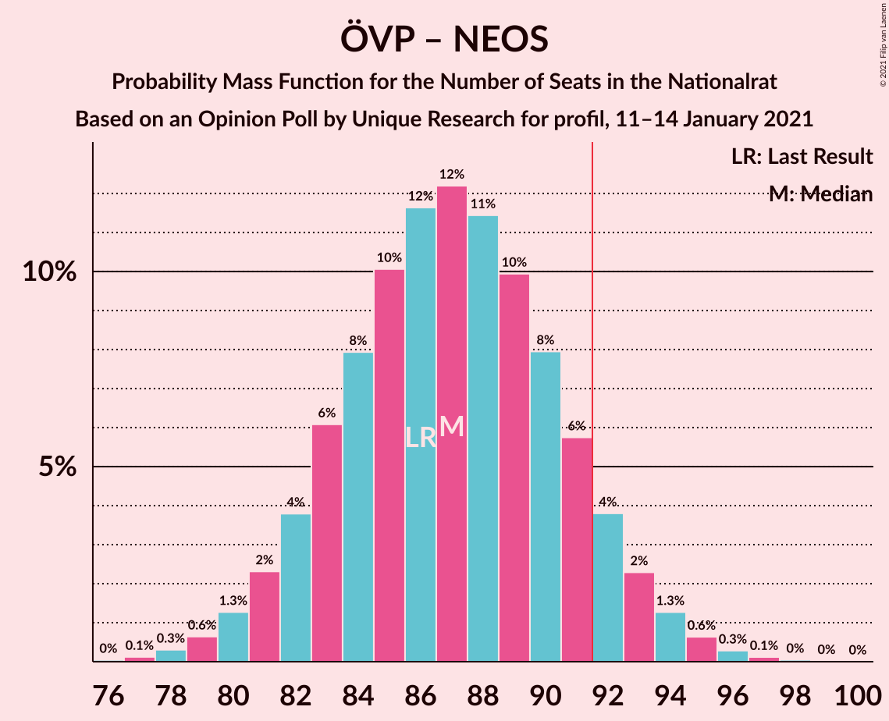

| Number of Seats | Probability | Accumulated | Special Marks |
|:---------------:|:-----------:|:-----------:|:-------------:|
| 76 | 0% | 100% |  |
| 77 | 0.1% | 99.9% |  |
| 78 | 0.3% | 99.8% |  |
| 79 | 0.6% | 99.5% |  |
| 80 | 1.3% | 98.9% |  |
| 81 | 2% | 98% |  |
| 82 | 4% | 95% |  |
| 83 | 6% | 91% |  |
| 84 | 8% | 85% |  |
| 85 | 10% | 77% |  |
| 86 | 12% | 67% | Last Result |
| 87 | 12% | 56% | Median |
| 88 | 11% | 44% |  |
| 89 | 10% | 32% |  |
| 90 | 8% | 22% |  |
| 91 | 6% | 14% |  |
| 92 | 4% | 8% | Majority |
| 93 | 2% | 5% |  |
| 94 | 1.3% | 2% |  |
| 95 | 0.6% | 1.1% |  |
| 96 | 0.3% | 0.5% |  |
| 97 | 0.1% | 0.2% |  |
| 98 | 0% | 0.1% |  |
| 99 | 0% | 0% |  |

### Sozialdemokratische Partei Österreichs – Die Grünen–Die Grüne Alternative – NEOS–Das Neue Österreich und Liberales Forum

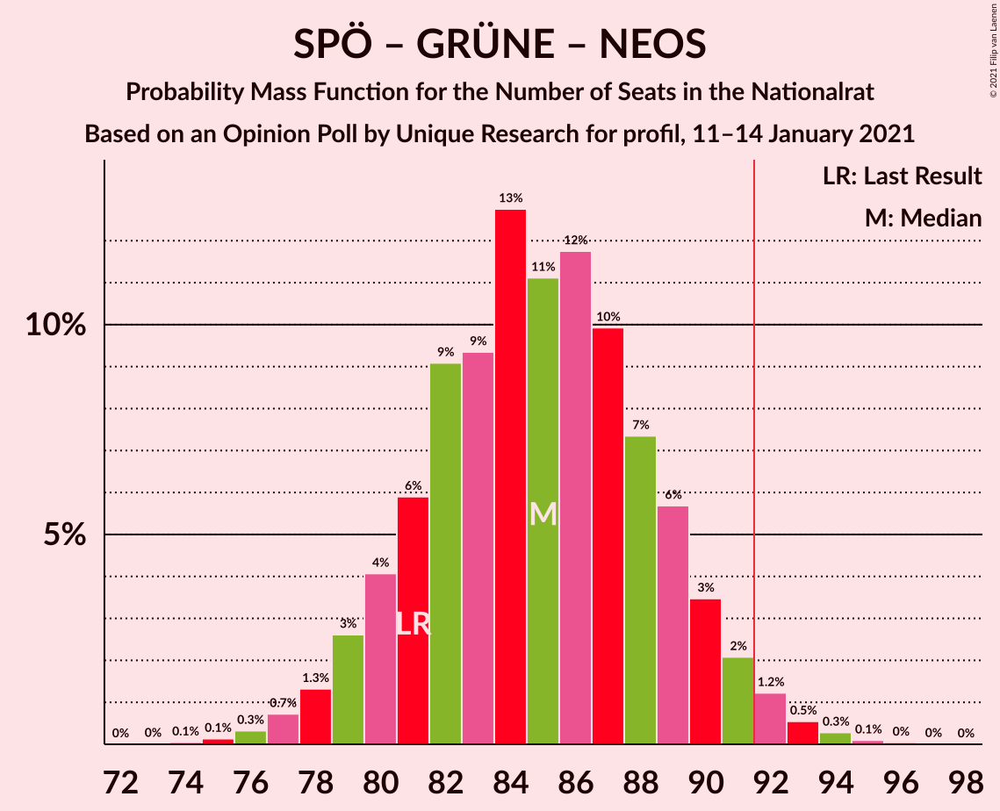

| Number of Seats | Probability | Accumulated | Special Marks |
|:---------------:|:-----------:|:-----------:|:-------------:|
| 74 | 0.1% | 100% |  |
| 75 | 0.1% | 99.9% |  |
| 76 | 0.3% | 99.8% |  |
| 77 | 0.7% | 99.5% |  |
| 78 | 1.3% | 98.7% |  |
| 79 | 3% | 97% |  |
| 80 | 4% | 95% |  |
| 81 | 6% | 91% | Last Result |
| 82 | 9% | 85% |  |
| 83 | 9% | 76% |  |
| 84 | 13% | 66% |  |
| 85 | 11% | 54% | Median |
| 86 | 12% | 43% |  |
| 87 | 10% | 31% |  |
| 88 | 7% | 21% |  |
| 89 | 6% | 13% |  |
| 90 | 3% | 8% |  |
| 91 | 2% | 4% |  |
| 92 | 1.2% | 2% | Majority |
| 93 | 0.5% | 1.0% |  |
| 94 | 0.3% | 0.4% |  |
| 95 | 0.1% | 0.2% |  |
| 96 | 0% | 0.1% |  |
| 97 | 0% | 0% |  |

### Sozialdemokratische Partei Österreichs – Freiheitliche Partei Österreichs

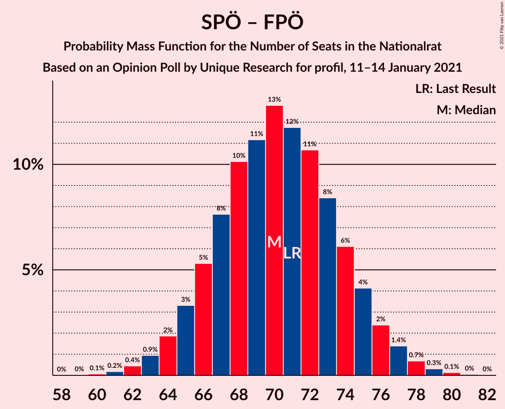

| Number of Seats | Probability | Accumulated | Special Marks |
|:---------------:|:-----------:|:-----------:|:-------------:|
| 60 | 0.1% | 100% |  |
| 61 | 0.2% | 99.9% |  |
| 62 | 0.4% | 99.7% |  |
| 63 | 0.9% | 99.3% |  |
| 64 | 2% | 98% |  |
| 65 | 3% | 96% |  |
| 66 | 5% | 93% |  |
| 67 | 8% | 88% |  |
| 68 | 10% | 80% |  |
| 69 | 11% | 70% |  |
| 70 | 13% | 59% | Median |
| 71 | 12% | 46% | Last Result |
| 72 | 11% | 34% |  |
| 73 | 8% | 24% |  |
| 74 | 6% | 15% |  |
| 75 | 4% | 9% |  |
| 76 | 2% | 5% |  |
| 77 | 1.4% | 3% |  |
| 78 | 0.7% | 1.2% |  |
| 79 | 0.3% | 0.5% |  |
| 80 | 0.1% | 0.2% |  |
| 81 | 0% | 0.1% |  |
| 82 | 0% | 0% |  |

### Österreichische Volkspartei

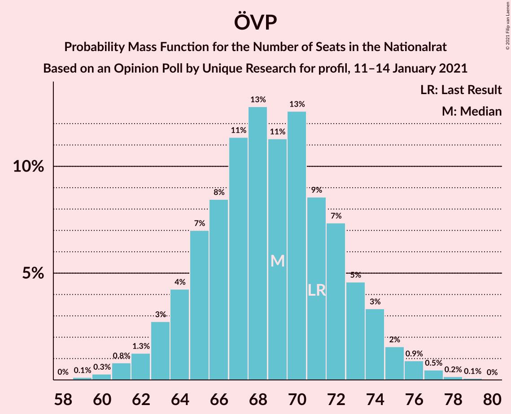

| Number of Seats | Probability | Accumulated | Special Marks |
|:---------------:|:-----------:|:-----------:|:-------------:|
| 58 | 0% | 100% |  |
| 59 | 0.1% | 99.9% |  |
| 60 | 0.3% | 99.8% |  |
| 61 | 0.8% | 99.5% |  |
| 62 | 1.3% | 98.7% |  |
| 63 | 3% | 97% |  |
| 64 | 4% | 95% |  |
| 65 | 7% | 91% |  |
| 66 | 8% | 84% |  |
| 67 | 11% | 75% |  |
| 68 | 13% | 64% |  |
| 69 | 11% | 51% | Median |
| 70 | 13% | 40% |  |
| 71 | 9% | 27% | Last Result |
| 72 | 7% | 18% |  |
| 73 | 5% | 11% |  |
| 74 | 3% | 7% |  |
| 75 | 2% | 3% |  |
| 76 | 0.9% | 2% |  |
| 77 | 0.5% | 0.7% |  |
| 78 | 0.2% | 0.3% |  |
| 79 | 0.1% | 0.1% |  |
| 80 | 0% | 0% |  |

### Sozialdemokratische Partei Österreichs – Die Grünen–Die Grüne Alternative

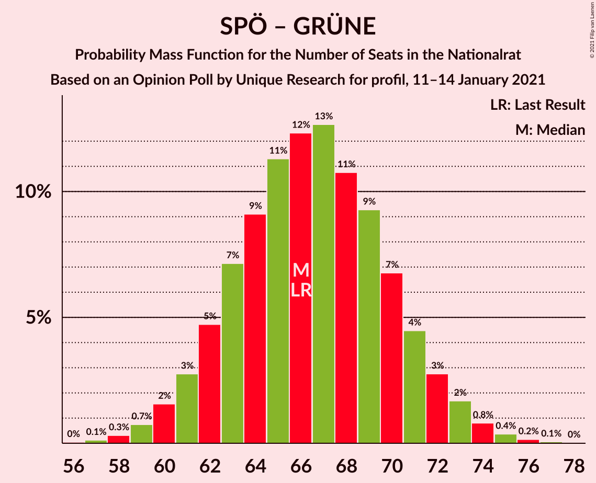

| Number of Seats | Probability | Accumulated | Special Marks |
|:---------------:|:-----------:|:-----------:|:-------------:|
| 56 | 0% | 100% |  |
| 57 | 0.1% | 99.9% |  |
| 58 | 0.3% | 99.8% |  |
| 59 | 0.7% | 99.5% |  |
| 60 | 2% | 98.7% |  |
| 61 | 3% | 97% |  |
| 62 | 5% | 94% |  |
| 63 | 7% | 90% |  |
| 64 | 9% | 83% |  |
| 65 | 11% | 73% |  |
| 66 | 12% | 62% | Last Result |
| 67 | 13% | 50% | Median |
| 68 | 11% | 37% |  |
| 69 | 9% | 26% |  |
| 70 | 7% | 17% |  |
| 71 | 4% | 10% |  |
| 72 | 3% | 6% |  |
| 73 | 2% | 3% |  |
| 74 | 0.8% | 1.4% |  |
| 75 | 0.4% | 0.6% |  |
| 76 | 0.2% | 0.3% |  |
| 77 | 0.1% | 0.1% |  |
| 78 | 0% | 0% |  |

### Sozialdemokratische Partei Österreichs

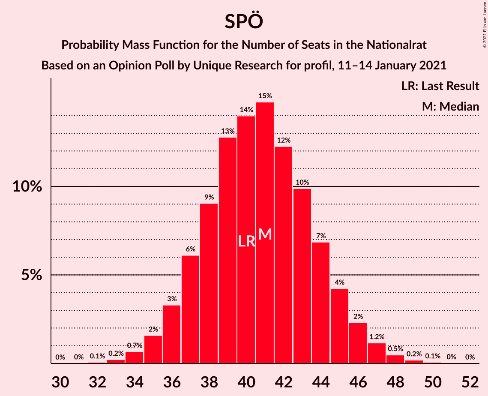

| Number of Seats | Probability | Accumulated | Special Marks |
|:---------------:|:-----------:|:-----------:|:-------------:|
| 32 | 0.1% | 100% |  |
| 33 | 0.2% | 99.9% |  |
| 34 | 0.7% | 99.7% |  |
| 35 | 2% | 99.0% |  |
| 36 | 3% | 97% |  |
| 37 | 6% | 94% |  |
| 38 | 9% | 88% |  |
| 39 | 13% | 79% |  |
| 40 | 14% | 66% | Last Result |
| 41 | 15% | 52% | Median |
| 42 | 12% | 37% |  |
| 43 | 10% | 25% |  |
| 44 | 7% | 15% |  |
| 45 | 4% | 8% |  |
| 46 | 2% | 4% |  |
| 47 | 1.2% | 2% |  |
| 48 | 0.5% | 0.8% |  |
| 49 | 0.2% | 0.3% |  |
| 50 | 0.1% | 0.1% |  |
| 51 | 0% | 0% |  |

## Technical Information

### Opinion Poll

+ **Polling firm:** Unique Research
+ **Commissioner(s):** profil
+ **Fieldwork period:** 11–14 January 2021

### Calculations

+ **Sample size:** 800
+ **Simulations done:** 1,048,576
+ **Error estimate:** 0.72%

