# Opinion Poll by Research Affairs for ÖSTERREICH, 1–4 February 2021

<a href="#voting-intentions">Voting Intentions</a> | <a href="#seats">Seats</a> | <a href="#coalitions">Coalitions</a> | <a href="#technical-information">Technical Information</a>

## Voting Intentions

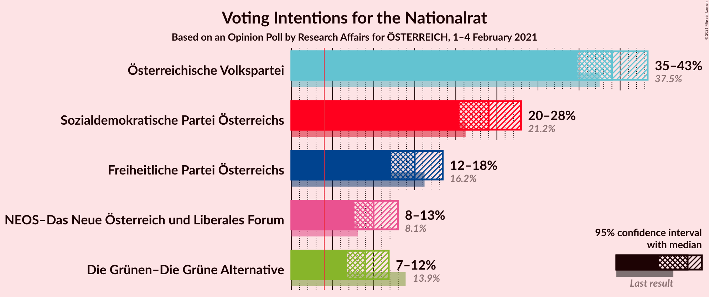

### Confidence Intervals

| Party | Last Result | Poll Result | 80% Confidence Interval | 90% Confidence Interval | 95% Confidence Interval | 99% Confidence Interval |
|:-----:|:-----------:|:-----------:|:-----------------------:|:-----------------------:|:-----------------------:|:-----------------------:|
| Österreichische Volkspartei | 37.5% | 39.0% | 36.3–41.9% |35.5–42.7% |34.8–43.3% |33.5–44.7% |
| Sozialdemokratische Partei Österreichs | 21.2% | 24.0% | 21.7–26.6% |21.0–27.3% |20.5–27.9% |19.4–29.2% |
| Freiheitliche Partei Österreichs | 16.2% | 15.0% | 13.1–17.2% |12.6–17.8% |12.1–18.4% |11.3–19.5% |
| NEOS–Das Neue Österreich und Liberales Forum | 8.1% | 10.0% | 8.5–11.9% |8.0–12.5% |7.7–13.0% |7.0–13.9% |
| Die Grünen–Die Grüne Alternative | 13.9% | 9.0% | 7.5–10.9% |7.1–11.4% |6.8–11.8% |6.2–12.8% |

*Note:* The poll result column reflects the actual value used in the calculations. Published results may vary slightly, and in addition be rounded to fewer digits.

## Seats

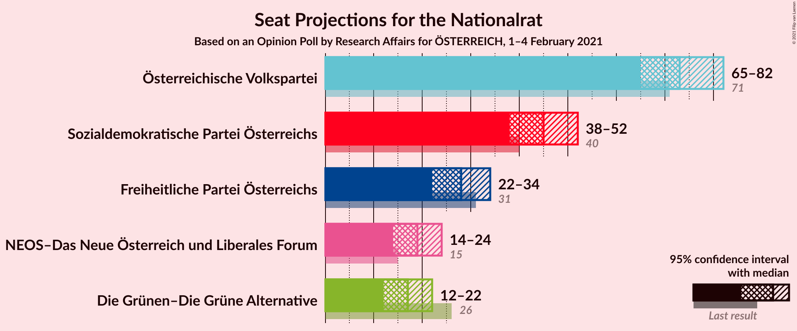

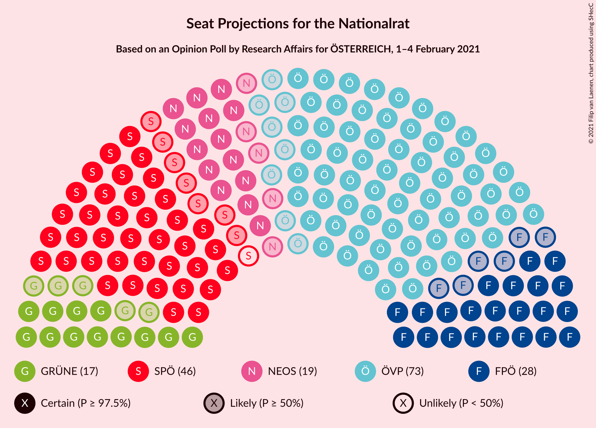

### Confidence Intervals

| Party | Last Result | Median | 80% Confidence Interval | 90% Confidence Interval | 95% Confidence Interval | 99% Confidence Interval |
|:-----:|:-----------:|:------:|:-----------------------:|:-----------------------:|:-----------------------:|:-----------------------:|
| <a href="#österreichische-volkspartei">Österreichische Volkspartei</a> | 71 | 73 | 68–79 |66–80 |65–82 |62–84 |
| <a href="#sozialdemokratische-partei-österreichs">Sozialdemokratische Partei Österreichs</a> | 40 | 45 | 40–50 |39–51 |38–52 |36–55 |
| <a href="#freiheitliche-partei-österreichs">Freiheitliche Partei Österreichs</a> | 31 | 28 | 24–32 |23–33 |22–34 |21–36 |
| <a href="#neos–das-neue-österreich-und-liberales-forum">NEOS–Das Neue Österreich und Liberales Forum</a> | 15 | 19 | 16–22 |15–23 |14–24 |13–26 |
| <a href="#die-grünen–die-grüne-alternative">Die Grünen–Die Grüne Alternative</a> | 26 | 17 | 14–20 |13–21 |12–22 |11–24 |

### Österreichische Volkspartei

*For a full overview of the results for this party, see the [Österreichische Volkspartei](party-österreichischevolkspartei.html) page.*

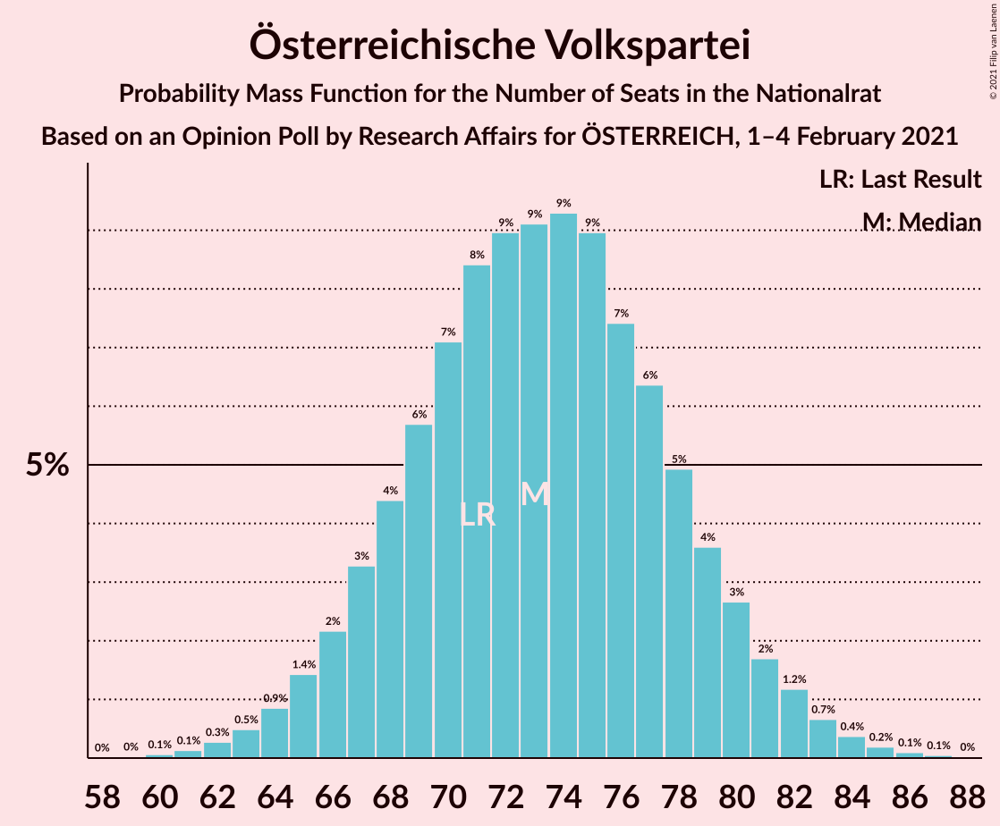

| Number of Seats | Probability | Accumulated | Special Marks |
|:---------------:|:-----------:|:-----------:|:-------------:|
| 60 | 0.1% | 100% |  |
| 61 | 0.1% | 99.9% |  |
| 62 | 0.3% | 99.8% |  |
| 63 | 0.5% | 99.5% |  |
| 64 | 0.9% | 99.0% |  |
| 65 | 1.4% | 98% |  |
| 66 | 2% | 97% |  |
| 67 | 3% | 95% |  |
| 68 | 4% | 91% |  |
| 69 | 6% | 87% |  |
| 70 | 7% | 81% |  |
| 71 | 8% | 74% | Last Result |
| 72 | 9% | 66% |  |
| 73 | 9% | 57% | Median |
| 74 | 9% | 48% |  |
| 75 | 9% | 38% |  |
| 76 | 7% | 29% |  |
| 77 | 6% | 22% |  |
| 78 | 5% | 16% |  |
| 79 | 4% | 11% |  |
| 80 | 3% | 7% |  |
| 81 | 2% | 4% |  |
| 82 | 1.2% | 3% |  |
| 83 | 0.7% | 1.4% |  |
| 84 | 0.4% | 0.8% |  |
| 85 | 0.2% | 0.4% |  |
| 86 | 0.1% | 0.2% |  |
| 87 | 0.1% | 0.1% |  |
| 88 | 0% | 0% |  |

### Sozialdemokratische Partei Österreichs

*For a full overview of the results for this party, see the [Sozialdemokratische Partei Österreichs](party-sozialdemokratischeparteiösterreichs.html) page.*

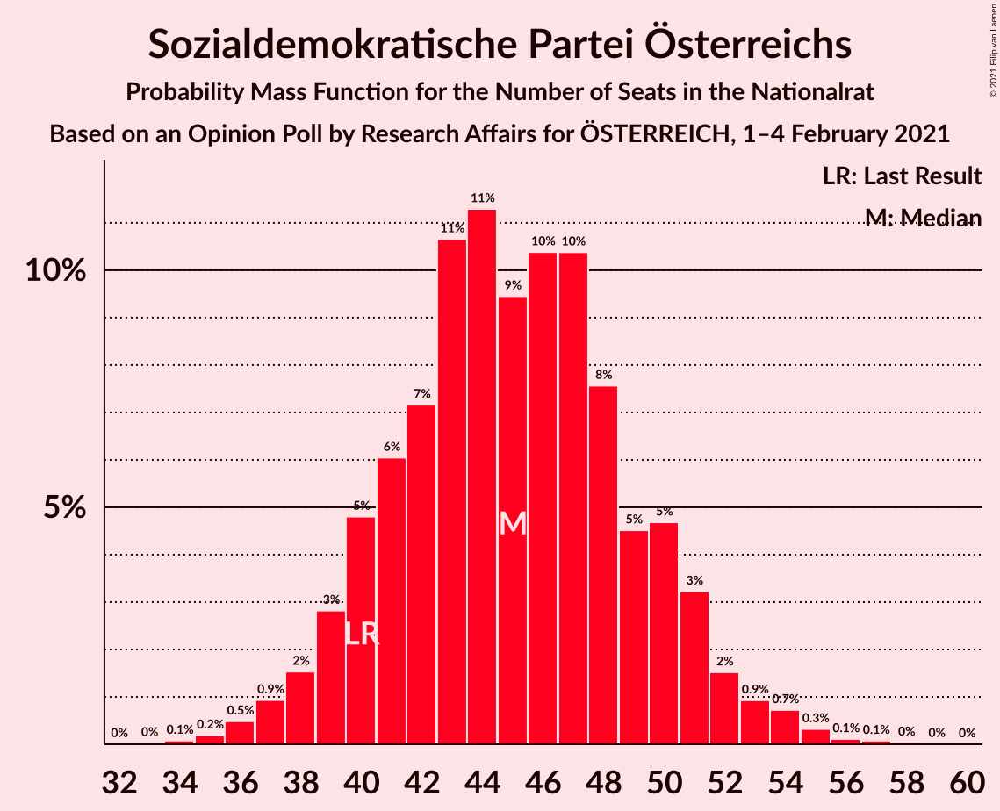

| Number of Seats | Probability | Accumulated | Special Marks |
|:---------------:|:-----------:|:-----------:|:-------------:|
| 34 | 0.1% | 100% |  |
| 35 | 0.2% | 99.9% |  |
| 36 | 0.5% | 99.7% |  |
| 37 | 0.9% | 99.2% |  |
| 38 | 2% | 98% |  |
| 39 | 3% | 97% |  |
| 40 | 5% | 94% | Last Result |
| 41 | 6% | 89% |  |
| 42 | 7% | 83% |  |
| 43 | 11% | 76% |  |
| 44 | 11% | 65% |  |
| 45 | 9% | 54% | Median |
| 46 | 10% | 44% |  |
| 47 | 10% | 34% |  |
| 48 | 8% | 24% |  |
| 49 | 5% | 16% |  |
| 50 | 5% | 12% |  |
| 51 | 3% | 7% |  |
| 52 | 2% | 4% |  |
| 53 | 0.9% | 2% |  |
| 54 | 0.7% | 1.3% |  |
| 55 | 0.3% | 0.6% |  |
| 56 | 0.1% | 0.2% |  |
| 57 | 0.1% | 0.1% |  |
| 58 | 0% | 0.1% |  |
| 59 | 0% | 0% |  |

### Freiheitliche Partei Österreichs

*For a full overview of the results for this party, see the [Freiheitliche Partei Österreichs](party-freiheitlicheparteiösterreichs.html) page.*

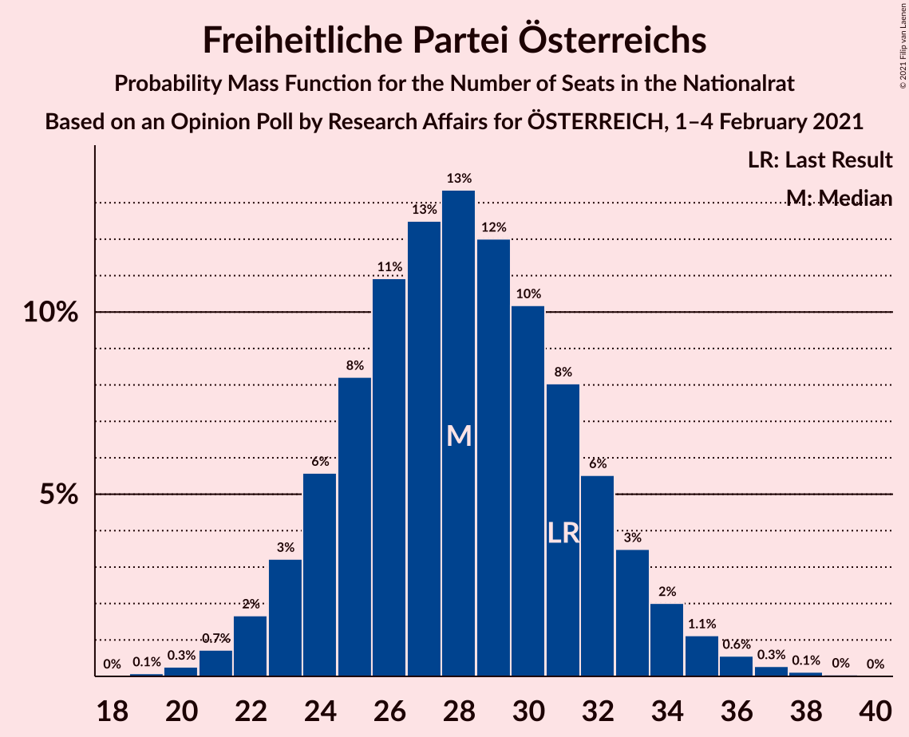

| Number of Seats | Probability | Accumulated | Special Marks |
|:---------------:|:-----------:|:-----------:|:-------------:|
| 19 | 0.1% | 100% |  |
| 20 | 0.3% | 99.9% |  |
| 21 | 0.7% | 99.6% |  |
| 22 | 2% | 98.9% |  |
| 23 | 3% | 97% |  |
| 24 | 6% | 94% |  |
| 25 | 8% | 88% |  |
| 26 | 11% | 80% |  |
| 27 | 13% | 69% |  |
| 28 | 13% | 57% | Median |
| 29 | 12% | 43% |  |
| 30 | 10% | 31% |  |
| 31 | 8% | 21% | Last Result |
| 32 | 6% | 13% |  |
| 33 | 3% | 8% |  |
| 34 | 2% | 4% |  |
| 35 | 1.1% | 2% |  |
| 36 | 0.6% | 1.0% |  |
| 37 | 0.3% | 0.5% |  |
| 38 | 0.1% | 0.2% |  |
| 39 | 0% | 0.1% |  |
| 40 | 0% | 0% |  |

### NEOS–Das Neue Österreich und Liberales Forum

*For a full overview of the results for this party, see the [NEOS–Das Neue Österreich und Liberales Forum](party-neos–dasneueösterreichundliberalesforum.html) page.*

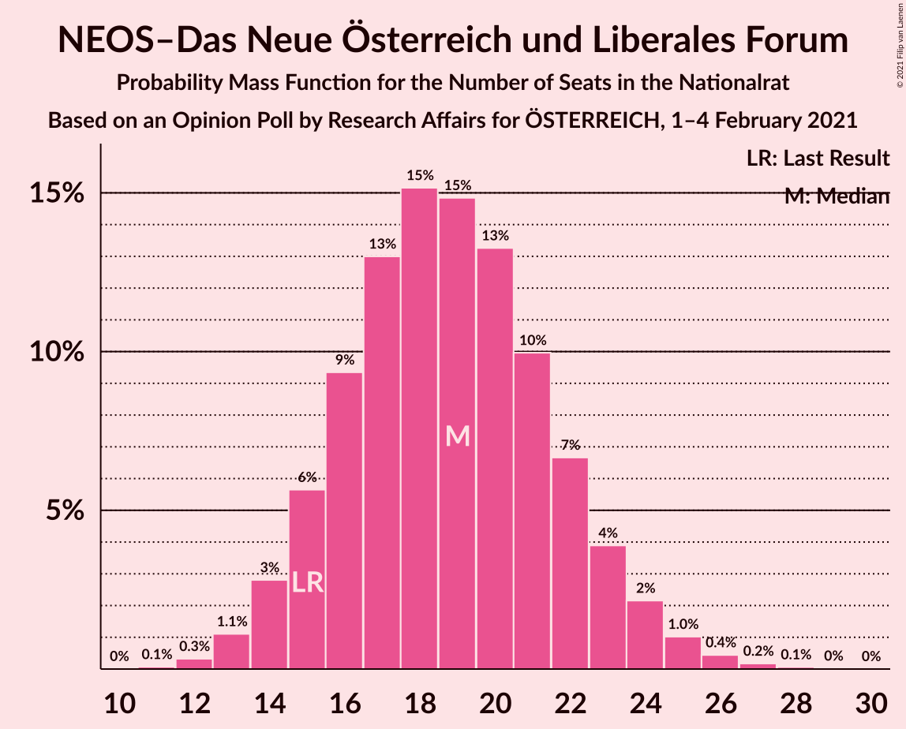

| Number of Seats | Probability | Accumulated | Special Marks |
|:---------------:|:-----------:|:-----------:|:-------------:|
| 11 | 0.1% | 100% |  |
| 12 | 0.3% | 99.9% |  |
| 13 | 1.1% | 99.6% |  |
| 14 | 3% | 98% |  |
| 15 | 6% | 96% | Last Result |
| 16 | 9% | 90% |  |
| 17 | 13% | 81% |  |
| 18 | 15% | 68% |  |
| 19 | 15% | 53% | Median |
| 20 | 13% | 38% |  |
| 21 | 10% | 24% |  |
| 22 | 7% | 14% |  |
| 23 | 4% | 8% |  |
| 24 | 2% | 4% |  |
| 25 | 1.0% | 2% |  |
| 26 | 0.4% | 0.7% |  |
| 27 | 0.2% | 0.3% |  |
| 28 | 0.1% | 0.1% |  |
| 29 | 0% | 0% |  |

### Die Grünen–Die Grüne Alternative

*For a full overview of the results for this party, see the [Die Grünen–Die Grüne Alternative](party-diegrünen–diegrünealternative.html) page.*

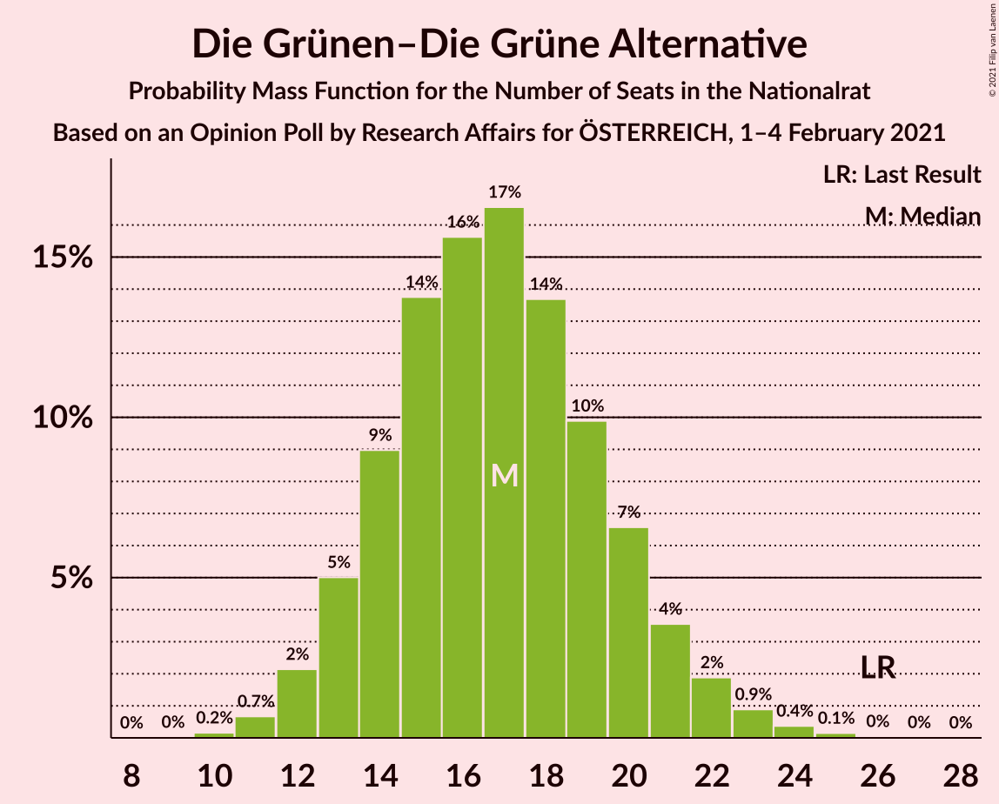

| Number of Seats | Probability | Accumulated | Special Marks |
|:---------------:|:-----------:|:-----------:|:-------------:|
| 10 | 0.2% | 100% |  |
| 11 | 0.7% | 99.8% |  |
| 12 | 2% | 99.1% |  |
| 13 | 5% | 97% |  |
| 14 | 9% | 92% |  |
| 15 | 14% | 83% |  |
| 16 | 16% | 69% |  |
| 17 | 17% | 54% | Median |
| 18 | 14% | 37% |  |
| 19 | 10% | 23% |  |
| 20 | 7% | 13% |  |
| 21 | 4% | 7% |  |
| 22 | 2% | 3% |  |
| 23 | 0.9% | 1.5% |  |
| 24 | 0.4% | 0.6% |  |
| 25 | 0.1% | 0.2% |  |
| 26 | 0% | 0.1% | Last Result |
| 27 | 0% | 0% |  |

## Coalitions

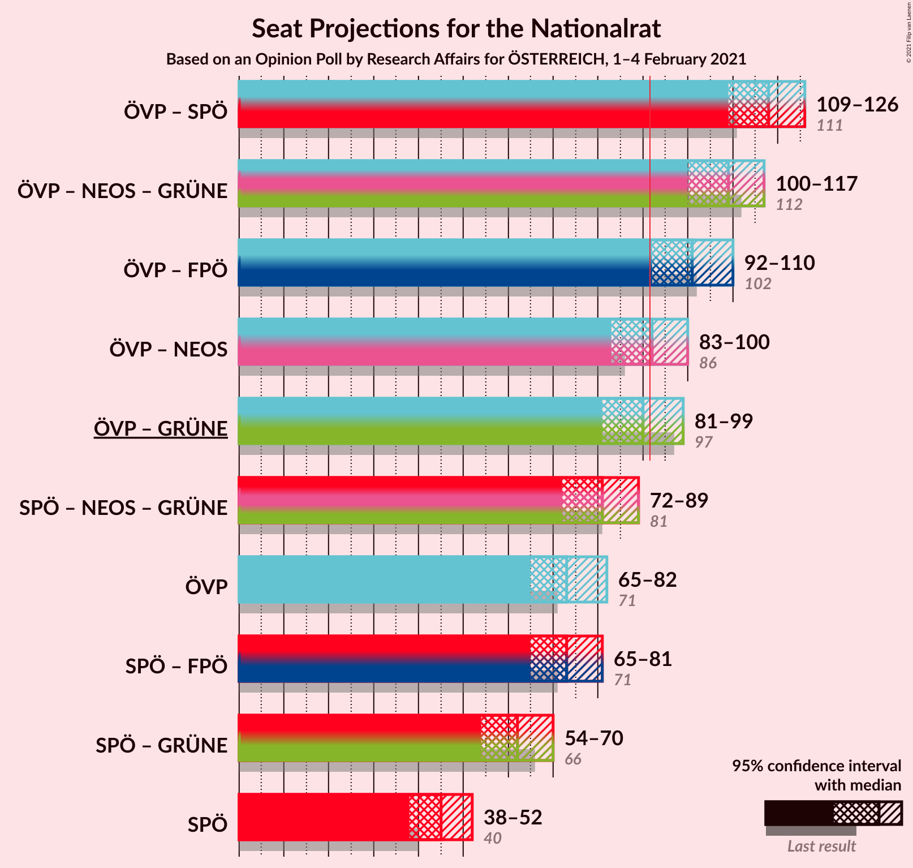

### Confidence Intervals

| Coalition | Last Result | Median | Majority? | 80% Confidence Interval | 90% Confidence Interval | 95% Confidence Interval | 99% Confidence Interval |
|:---------:|:-----------:|:------:|:---------:|:-----------------------:|:-----------------------:|:-----------------------:|:-----------------------:|
| Österreichische Volkspartei – Sozialdemokratische Partei Österreichs | 111 | 118 | 100% | 113–124 | 111–125 | 109–126 | 106–129 |
| Österreichische Volkspartei – NEOS–Das Neue Österreich und Liberales Forum – Die Grünen–Die Grüne Alternative | 112 | 109 | 100% | 103–114 | 101–116 | 100–117 | 97–120 |
| Österreichische Volkspartei – Freiheitliche Partei Österreichs | 102 | 101 | 98% | 96–107 | 94–108 | 92–110 | 90–112 |
| Österreichische Volkspartei – NEOS–Das Neue Österreich und Liberales Forum | 86 | 92 | 55% | 86–98 | 85–99 | 83–100 | 80–103 |
| Österreichische Volkspartei – Die Grünen–Die Grüne Alternative | 97 | 90 | 37% | 84–96 | 83–97 | 81–99 | 79–101 |
| Sozialdemokratische Partei Österreichs – NEOS–Das Neue Österreich und Liberales Forum – Die Grünen–Die Grüne Alternative | 81 | 81 | 0.6% | 75–86 | 73–88 | 72–89 | 70–92 |
| Österreichische Volkspartei | 71 | 73 | 0% | 68–79 | 66–80 | 65–82 | 62–84 |
| Sozialdemokratische Partei Österreichs – Freiheitliche Partei Österreichs | 71 | 73 | 0% | 68–78 | 66–80 | 65–81 | 62–84 |
| Sozialdemokratische Partei Österreichs – Die Grünen–Die Grüne Alternative | 66 | 62 | 0% | 57–67 | 55–69 | 54–70 | 52–72 |
| Sozialdemokratische Partei Österreichs | 40 | 45 | 0% | 40–50 | 39–51 | 38–52 | 36–55 |

### Österreichische Volkspartei – Sozialdemokratische Partei Österreichs

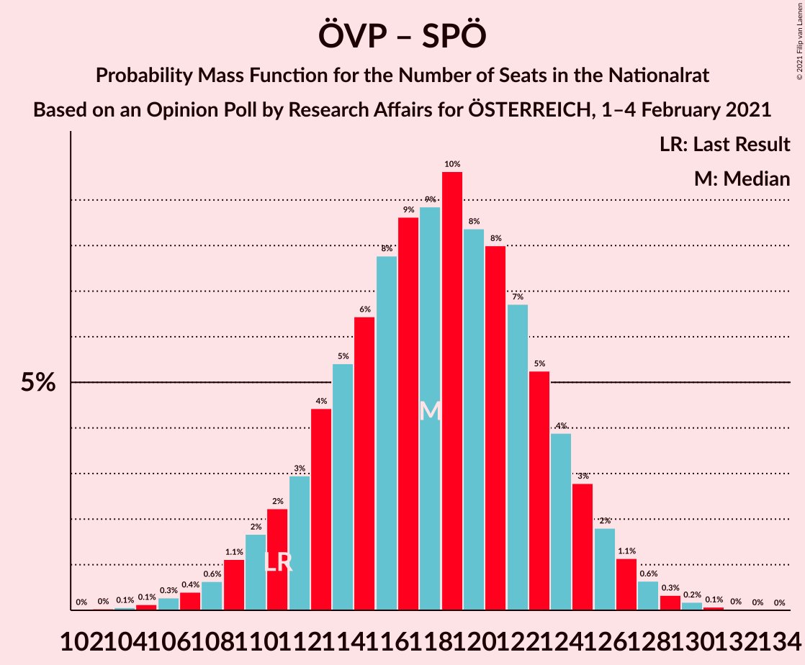

| Number of Seats | Probability | Accumulated | Special Marks |
|:---------------:|:-----------:|:-----------:|:-------------:|
| 103 | 0% | 100% |  |
| 104 | 0.1% | 99.9% |  |
| 105 | 0.1% | 99.9% |  |
| 106 | 0.3% | 99.7% |  |
| 107 | 0.4% | 99.5% |  |
| 108 | 0.6% | 99.1% |  |
| 109 | 1.1% | 98% |  |
| 110 | 2% | 97% |  |
| 111 | 2% | 96% | Last Result |
| 112 | 3% | 93% |  |
| 113 | 4% | 90% |  |
| 114 | 5% | 86% |  |
| 115 | 6% | 81% |  |
| 116 | 8% | 74% |  |
| 117 | 9% | 66% |  |
| 118 | 9% | 58% | Median |
| 119 | 10% | 49% |  |
| 120 | 8% | 39% |  |
| 121 | 8% | 31% |  |
| 122 | 7% | 23% |  |
| 123 | 5% | 16% |  |
| 124 | 4% | 11% |  |
| 125 | 3% | 7% |  |
| 126 | 2% | 4% |  |
| 127 | 1.1% | 2% |  |
| 128 | 0.6% | 1.3% |  |
| 129 | 0.3% | 0.6% |  |
| 130 | 0.2% | 0.3% |  |
| 131 | 0.1% | 0.1% |  |
| 132 | 0% | 0.1% |  |
| 133 | 0% | 0% |  |

### Österreichische Volkspartei – NEOS–Das Neue Österreich und Liberales Forum – Die Grünen–Die Grüne Alternative

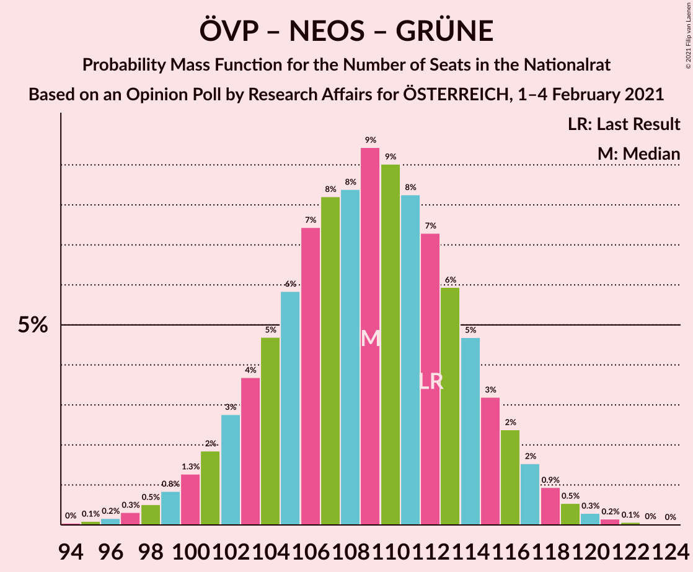

| Number of Seats | Probability | Accumulated | Special Marks |
|:---------------:|:-----------:|:-----------:|:-------------:|
| 94 | 0% | 100% |  |
| 95 | 0.1% | 99.9% |  |
| 96 | 0.2% | 99.8% |  |
| 97 | 0.3% | 99.6% |  |
| 98 | 0.5% | 99.3% |  |
| 99 | 0.8% | 98.8% |  |
| 100 | 1.3% | 98% |  |
| 101 | 2% | 97% |  |
| 102 | 3% | 95% |  |
| 103 | 4% | 92% |  |
| 104 | 5% | 88% |  |
| 105 | 6% | 84% |  |
| 106 | 7% | 78% |  |
| 107 | 8% | 70% |  |
| 108 | 8% | 62% |  |
| 109 | 9% | 54% | Median |
| 110 | 9% | 44% |  |
| 111 | 8% | 35% |  |
| 112 | 7% | 27% | Last Result |
| 113 | 6% | 20% |  |
| 114 | 5% | 14% |  |
| 115 | 3% | 9% |  |
| 116 | 2% | 6% |  |
| 117 | 2% | 4% |  |
| 118 | 0.9% | 2% |  |
| 119 | 0.5% | 1.1% |  |
| 120 | 0.3% | 0.6% |  |
| 121 | 0.2% | 0.3% |  |
| 122 | 0.1% | 0.1% |  |
| 123 | 0% | 0.1% |  |
| 124 | 0% | 0% |  |

### Österreichische Volkspartei – Freiheitliche Partei Österreichs

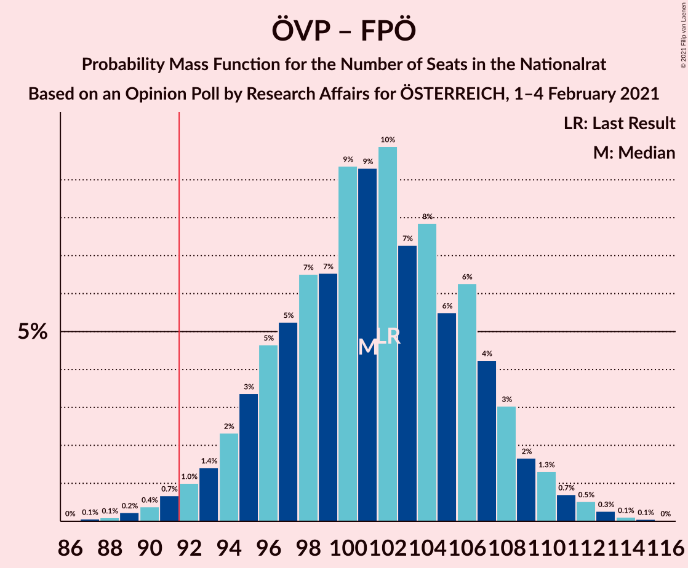

| Number of Seats | Probability | Accumulated | Special Marks |
|:---------------:|:-----------:|:-----------:|:-------------:|
| 86 | 0% | 100% |  |
| 87 | 0.1% | 99.9% |  |
| 88 | 0.1% | 99.9% |  |
| 89 | 0.2% | 99.8% |  |
| 90 | 0.4% | 99.6% |  |
| 91 | 0.7% | 99.2% |  |
| 92 | 1.0% | 98% | Majority |
| 93 | 1.4% | 97% |  |
| 94 | 2% | 96% |  |
| 95 | 3% | 94% |  |
| 96 | 5% | 90% |  |
| 97 | 5% | 86% |  |
| 98 | 7% | 80% |  |
| 99 | 7% | 74% |  |
| 100 | 9% | 67% |  |
| 101 | 9% | 58% | Median |
| 102 | 10% | 49% | Last Result |
| 103 | 7% | 39% |  |
| 104 | 8% | 32% |  |
| 105 | 6% | 24% |  |
| 106 | 6% | 18% |  |
| 107 | 4% | 12% |  |
| 108 | 3% | 8% |  |
| 109 | 2% | 5% |  |
| 110 | 1.3% | 3% |  |
| 111 | 0.7% | 2% |  |
| 112 | 0.5% | 1.0% |  |
| 113 | 0.3% | 0.5% |  |
| 114 | 0.1% | 0.2% |  |
| 115 | 0.1% | 0.1% |  |
| 116 | 0% | 0% |  |

### Österreichische Volkspartei – NEOS–Das Neue Österreich und Liberales Forum

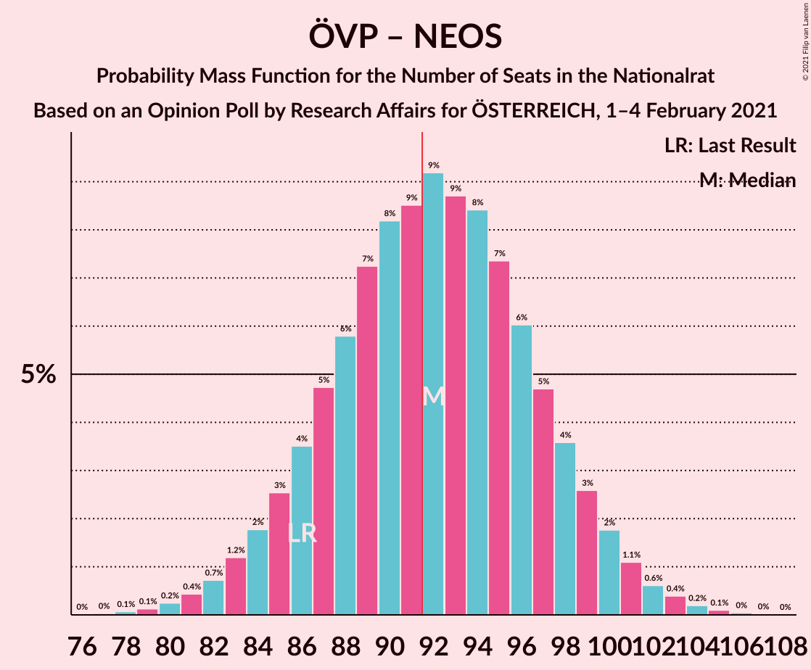

| Number of Seats | Probability | Accumulated | Special Marks |
|:---------------:|:-----------:|:-----------:|:-------------:|
| 77 | 0% | 100% |  |
| 78 | 0.1% | 99.9% |  |
| 79 | 0.1% | 99.9% |  |
| 80 | 0.2% | 99.7% |  |
| 81 | 0.4% | 99.5% |  |
| 82 | 0.7% | 99.1% |  |
| 83 | 1.2% | 98% |  |
| 84 | 2% | 97% |  |
| 85 | 3% | 95% |  |
| 86 | 4% | 93% | Last Result |
| 87 | 5% | 89% |  |
| 88 | 6% | 85% |  |
| 89 | 7% | 79% |  |
| 90 | 8% | 72% |  |
| 91 | 9% | 63% |  |
| 92 | 9% | 55% | Median, Majority |
| 93 | 9% | 46% |  |
| 94 | 8% | 37% |  |
| 95 | 7% | 29% |  |
| 96 | 6% | 21% |  |
| 97 | 5% | 15% |  |
| 98 | 4% | 10% |  |
| 99 | 3% | 7% |  |
| 100 | 2% | 4% |  |
| 101 | 1.1% | 2% |  |
| 102 | 0.6% | 1.4% |  |
| 103 | 0.4% | 0.8% |  |
| 104 | 0.2% | 0.4% |  |
| 105 | 0.1% | 0.2% |  |
| 106 | 0% | 0.1% |  |
| 107 | 0% | 0% |  |

### Österreichische Volkspartei – Die Grünen–Die Grüne Alternative

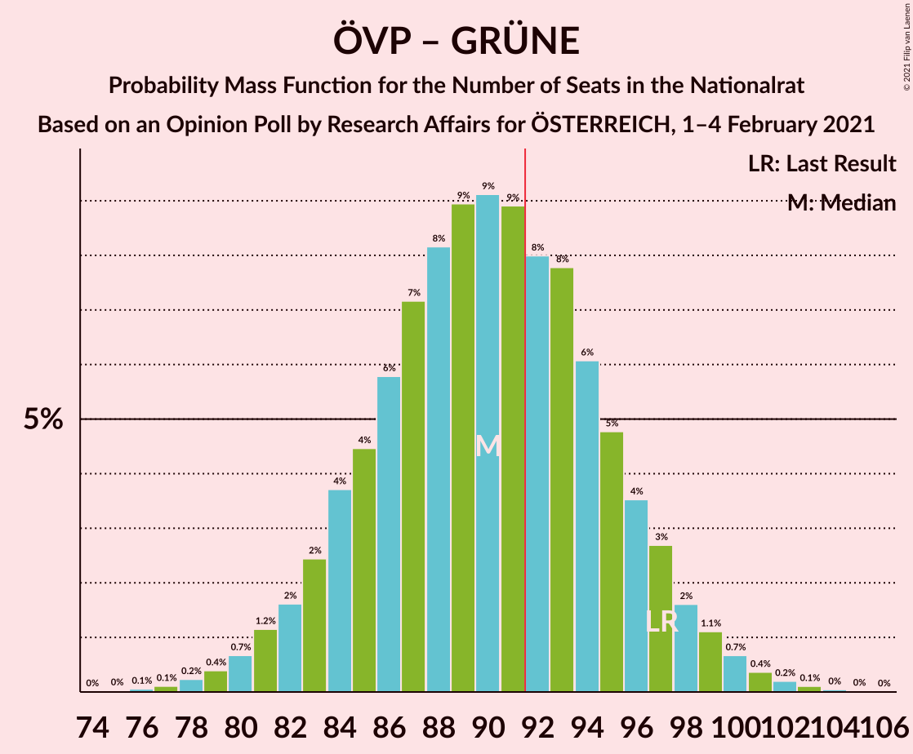

| Number of Seats | Probability | Accumulated | Special Marks |
|:---------------:|:-----------:|:-----------:|:-------------:|
| 75 | 0% | 100% |  |
| 76 | 0.1% | 99.9% |  |
| 77 | 0.1% | 99.9% |  |
| 78 | 0.2% | 99.8% |  |
| 79 | 0.4% | 99.5% |  |
| 80 | 0.7% | 99.2% |  |
| 81 | 1.2% | 98% |  |
| 82 | 2% | 97% |  |
| 83 | 2% | 96% |  |
| 84 | 4% | 93% |  |
| 85 | 4% | 90% |  |
| 86 | 6% | 85% |  |
| 87 | 7% | 79% |  |
| 88 | 8% | 72% |  |
| 89 | 9% | 64% |  |
| 90 | 9% | 55% | Median |
| 91 | 9% | 46% |  |
| 92 | 8% | 37% | Majority |
| 93 | 8% | 29% |  |
| 94 | 6% | 21% |  |
| 95 | 5% | 15% |  |
| 96 | 4% | 10% |  |
| 97 | 3% | 7% | Last Result |
| 98 | 2% | 4% |  |
| 99 | 1.1% | 3% |  |
| 100 | 0.7% | 1.4% |  |
| 101 | 0.4% | 0.8% |  |
| 102 | 0.2% | 0.4% |  |
| 103 | 0.1% | 0.2% |  |
| 104 | 0% | 0.1% |  |
| 105 | 0% | 0% |  |

### Sozialdemokratische Partei Österreichs – NEOS–Das Neue Österreich und Liberales Forum – Die Grünen–Die Grüne Alternative

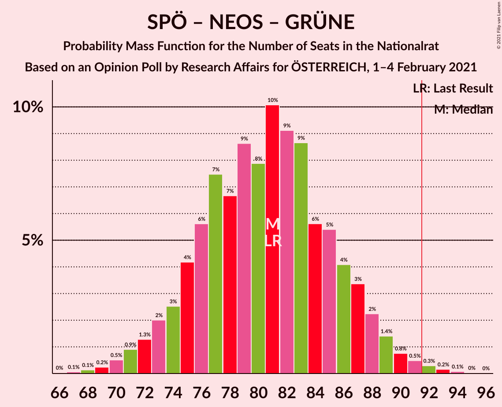

| Number of Seats | Probability | Accumulated | Special Marks |
|:---------------:|:-----------:|:-----------:|:-------------:|
| 66 | 0% | 100% |  |
| 67 | 0.1% | 99.9% |  |
| 68 | 0.1% | 99.9% |  |
| 69 | 0.2% | 99.7% |  |
| 70 | 0.5% | 99.5% |  |
| 71 | 0.9% | 99.0% |  |
| 72 | 1.3% | 98% |  |
| 73 | 2% | 97% |  |
| 74 | 3% | 95% |  |
| 75 | 4% | 92% |  |
| 76 | 6% | 88% |  |
| 77 | 7% | 82% |  |
| 78 | 7% | 75% |  |
| 79 | 9% | 68% |  |
| 80 | 8% | 60% |  |
| 81 | 10% | 52% | Last Result, Median |
| 82 | 9% | 42% |  |
| 83 | 9% | 33% |  |
| 84 | 6% | 24% |  |
| 85 | 5% | 18% |  |
| 86 | 4% | 13% |  |
| 87 | 3% | 9% |  |
| 88 | 2% | 5% |  |
| 89 | 1.4% | 3% |  |
| 90 | 0.8% | 2% |  |
| 91 | 0.5% | 1.1% |  |
| 92 | 0.3% | 0.6% | Majority |
| 93 | 0.2% | 0.3% |  |
| 94 | 0.1% | 0.1% |  |
| 95 | 0% | 0.1% |  |
| 96 | 0% | 0% |  |

### Österreichische Volkspartei

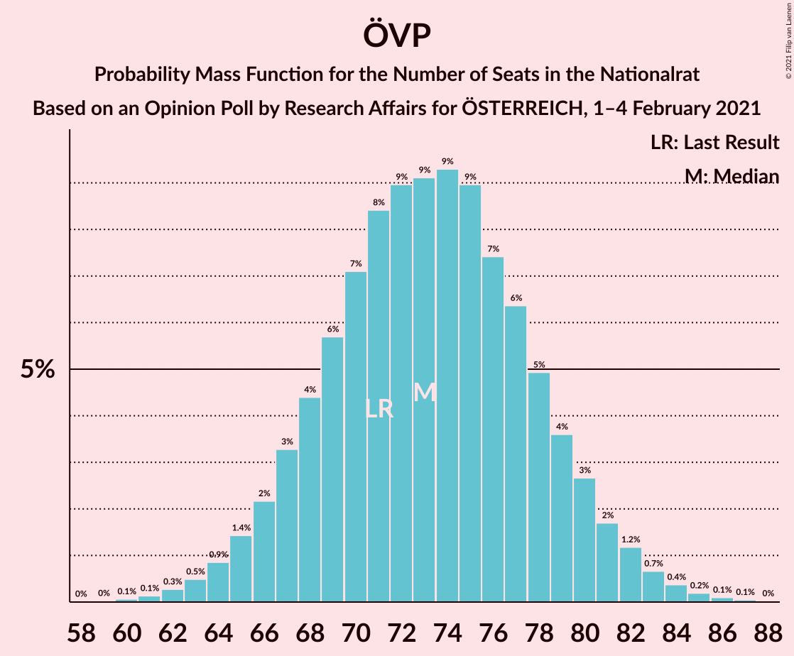

| Number of Seats | Probability | Accumulated | Special Marks |
|:---------------:|:-----------:|:-----------:|:-------------:|
| 60 | 0.1% | 100% |  |
| 61 | 0.1% | 99.9% |  |
| 62 | 0.3% | 99.8% |  |
| 63 | 0.5% | 99.5% |  |
| 64 | 0.9% | 99.0% |  |
| 65 | 1.4% | 98% |  |
| 66 | 2% | 97% |  |
| 67 | 3% | 95% |  |
| 68 | 4% | 91% |  |
| 69 | 6% | 87% |  |
| 70 | 7% | 81% |  |
| 71 | 8% | 74% | Last Result |
| 72 | 9% | 66% |  |
| 73 | 9% | 57% | Median |
| 74 | 9% | 48% |  |
| 75 | 9% | 38% |  |
| 76 | 7% | 29% |  |
| 77 | 6% | 22% |  |
| 78 | 5% | 16% |  |
| 79 | 4% | 11% |  |
| 80 | 3% | 7% |  |
| 81 | 2% | 4% |  |
| 82 | 1.2% | 3% |  |
| 83 | 0.7% | 1.4% |  |
| 84 | 0.4% | 0.8% |  |
| 85 | 0.2% | 0.4% |  |
| 86 | 0.1% | 0.2% |  |
| 87 | 0.1% | 0.1% |  |
| 88 | 0% | 0% |  |

### Sozialdemokratische Partei Österreichs – Freiheitliche Partei Österreichs

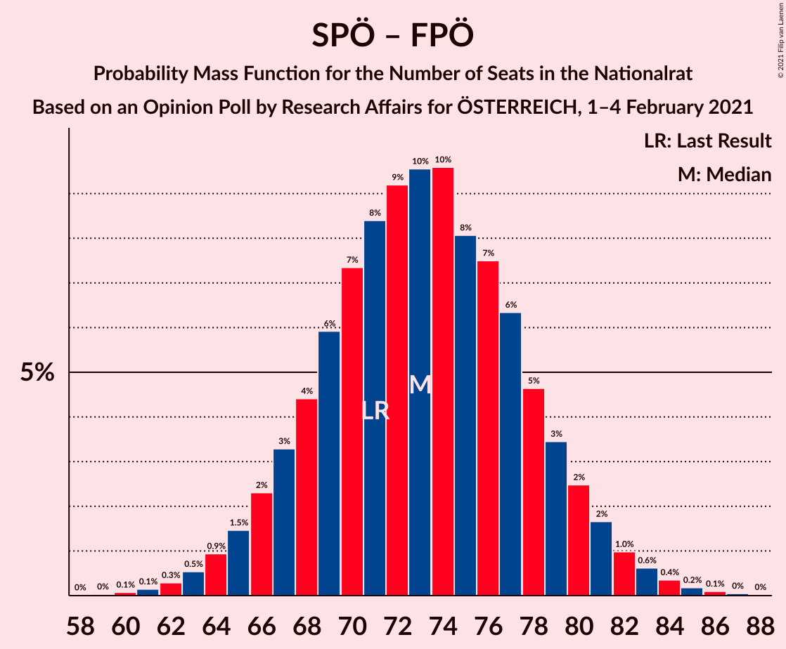

| Number of Seats | Probability | Accumulated | Special Marks |
|:---------------:|:-----------:|:-----------:|:-------------:|
| 59 | 0% | 100% |  |
| 60 | 0.1% | 99.9% |  |
| 61 | 0.1% | 99.9% |  |
| 62 | 0.3% | 99.7% |  |
| 63 | 0.5% | 99.4% |  |
| 64 | 0.9% | 98.9% |  |
| 65 | 1.5% | 98% |  |
| 66 | 2% | 96% |  |
| 67 | 3% | 94% |  |
| 68 | 4% | 91% |  |
| 69 | 6% | 86% |  |
| 70 | 7% | 81% |  |
| 71 | 8% | 73% | Last Result |
| 72 | 9% | 65% |  |
| 73 | 10% | 56% | Median |
| 74 | 10% | 46% |  |
| 75 | 8% | 36% |  |
| 76 | 7% | 28% |  |
| 77 | 6% | 21% |  |
| 78 | 5% | 15% |  |
| 79 | 3% | 10% |  |
| 80 | 2% | 6% |  |
| 81 | 2% | 4% |  |
| 82 | 1.0% | 2% |  |
| 83 | 0.6% | 1.3% |  |
| 84 | 0.4% | 0.7% |  |
| 85 | 0.2% | 0.4% |  |
| 86 | 0.1% | 0.2% |  |
| 87 | 0% | 0.1% |  |
| 88 | 0% | 0% |  |

### Sozialdemokratische Partei Österreichs – Die Grünen–Die Grüne Alternative

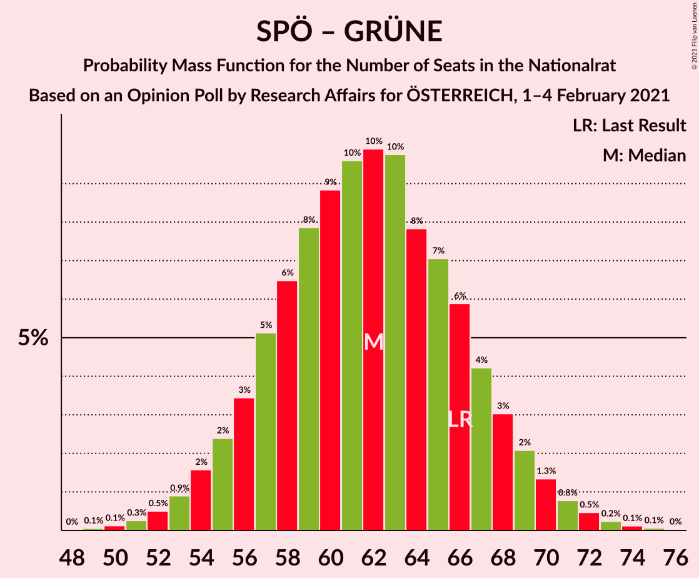

| Number of Seats | Probability | Accumulated | Special Marks |
|:---------------:|:-----------:|:-----------:|:-------------:|
| 49 | 0.1% | 100% |  |
| 50 | 0.1% | 99.9% |  |
| 51 | 0.3% | 99.8% |  |
| 52 | 0.5% | 99.5% |  |
| 53 | 0.9% | 99.0% |  |
| 54 | 2% | 98% |  |
| 55 | 2% | 97% |  |
| 56 | 3% | 94% |  |
| 57 | 5% | 91% |  |
| 58 | 6% | 86% |  |
| 59 | 8% | 79% |  |
| 60 | 9% | 71% |  |
| 61 | 10% | 62% |  |
| 62 | 10% | 53% | Median |
| 63 | 10% | 43% |  |
| 64 | 8% | 33% |  |
| 65 | 7% | 25% |  |
| 66 | 6% | 18% | Last Result |
| 67 | 4% | 12% |  |
| 68 | 3% | 8% |  |
| 69 | 2% | 5% |  |
| 70 | 1.3% | 3% |  |
| 71 | 0.8% | 2% |  |
| 72 | 0.5% | 0.9% |  |
| 73 | 0.2% | 0.5% |  |
| 74 | 0.1% | 0.2% |  |
| 75 | 0.1% | 0.1% |  |
| 76 | 0% | 0% |  |

### Sozialdemokratische Partei Österreichs

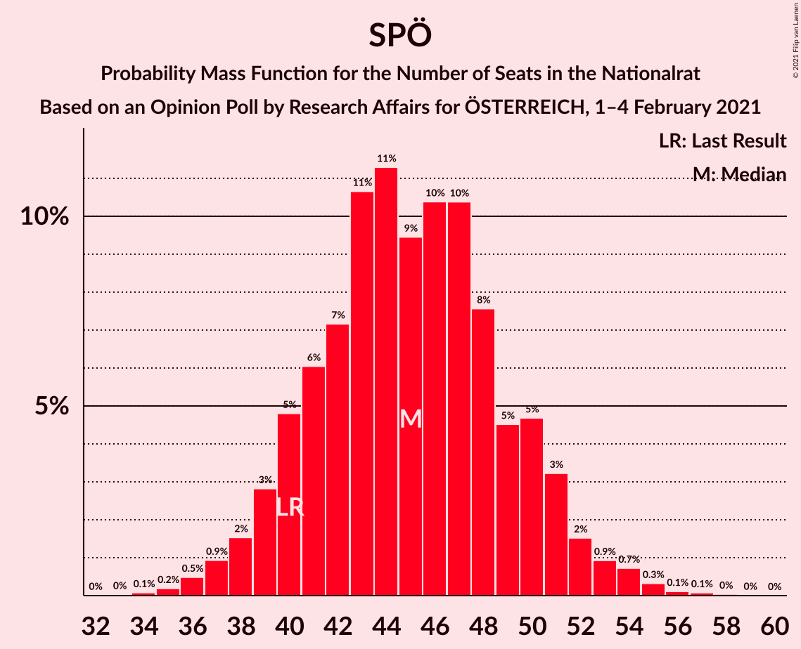

| Number of Seats | Probability | Accumulated | Special Marks |
|:---------------:|:-----------:|:-----------:|:-------------:|
| 34 | 0.1% | 100% |  |
| 35 | 0.2% | 99.9% |  |
| 36 | 0.5% | 99.7% |  |
| 37 | 0.9% | 99.2% |  |
| 38 | 2% | 98% |  |
| 39 | 3% | 97% |  |
| 40 | 5% | 94% | Last Result |
| 41 | 6% | 89% |  |
| 42 | 7% | 83% |  |
| 43 | 11% | 76% |  |
| 44 | 11% | 65% |  |
| 45 | 9% | 54% | Median |
| 46 | 10% | 44% |  |
| 47 | 10% | 34% |  |
| 48 | 8% | 24% |  |
| 49 | 5% | 16% |  |
| 50 | 5% | 12% |  |
| 51 | 3% | 7% |  |
| 52 | 2% | 4% |  |
| 53 | 0.9% | 2% |  |
| 54 | 0.7% | 1.3% |  |
| 55 | 0.3% | 0.6% |  |
| 56 | 0.1% | 0.2% |  |
| 57 | 0.1% | 0.1% |  |
| 58 | 0% | 0.1% |  |
| 59 | 0% | 0% |  |

## Technical Information

### Opinion Poll

+ **Polling firm:** Research Affairs
+ **Commissioner(s):** ÖSTERREICH
+ **Fieldwork period:** 1–4 February 2021

### Calculations

+ **Sample size:** 500
+ **Simulations done:** 1,048,576
+ **Error estimate:** 1.11%

