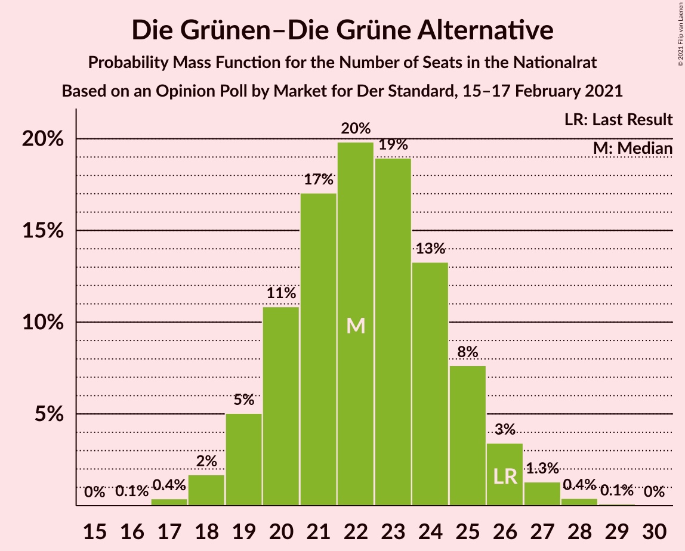
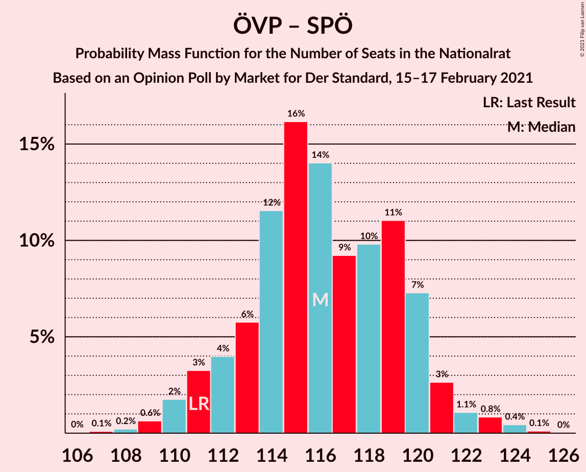
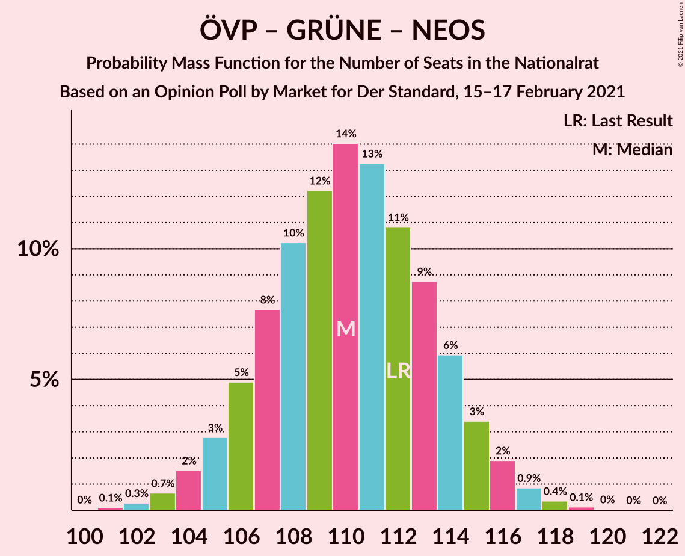
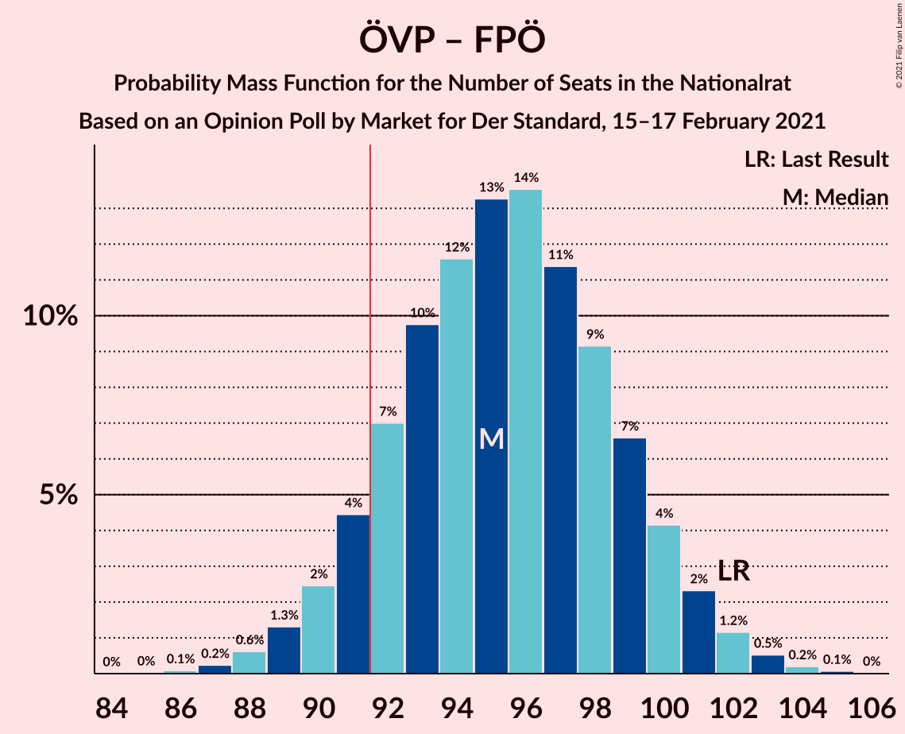
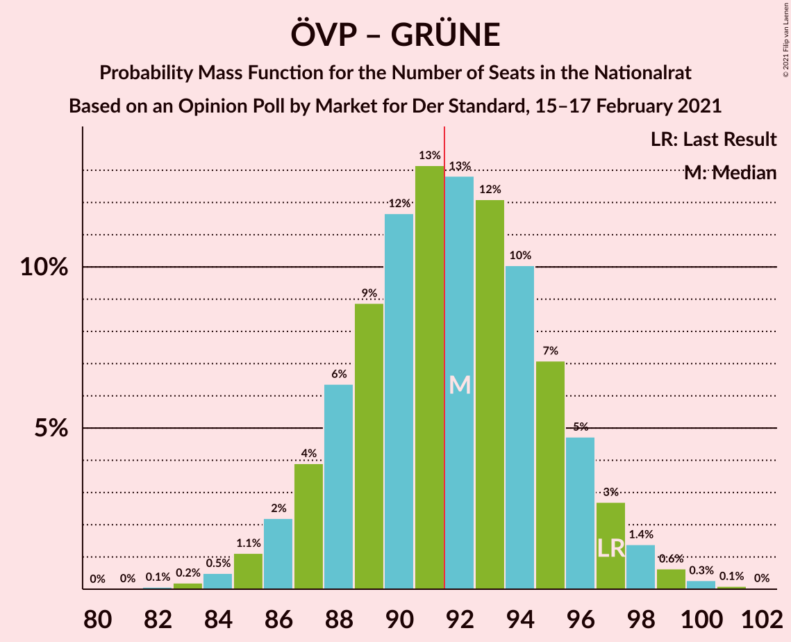
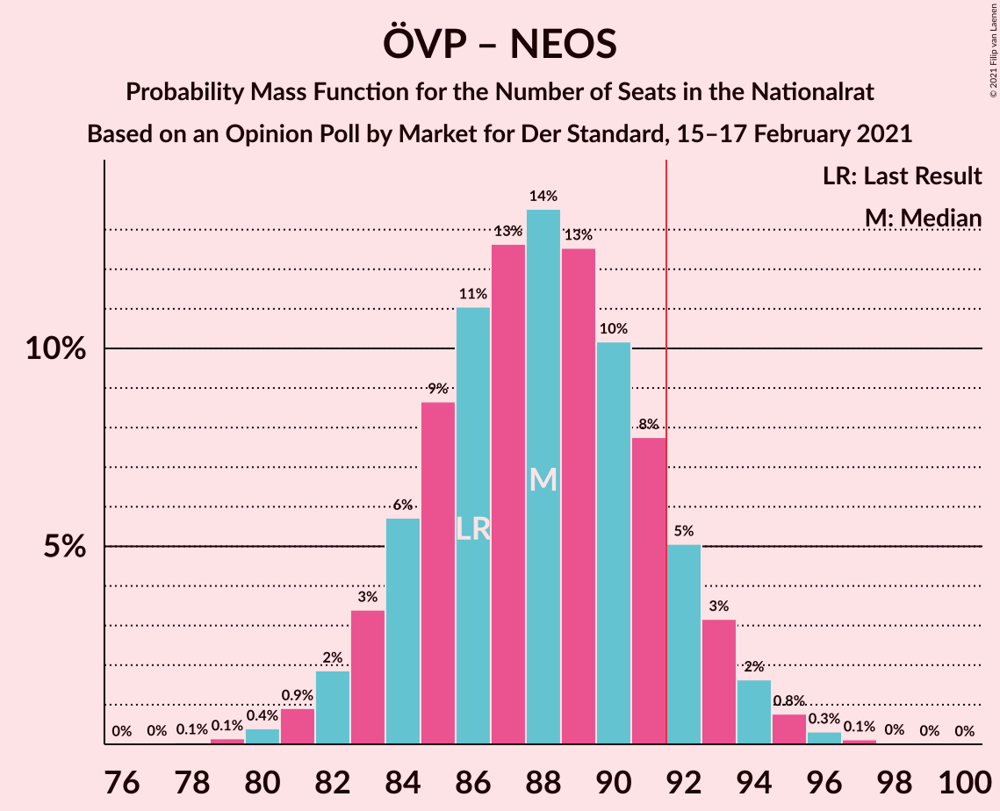
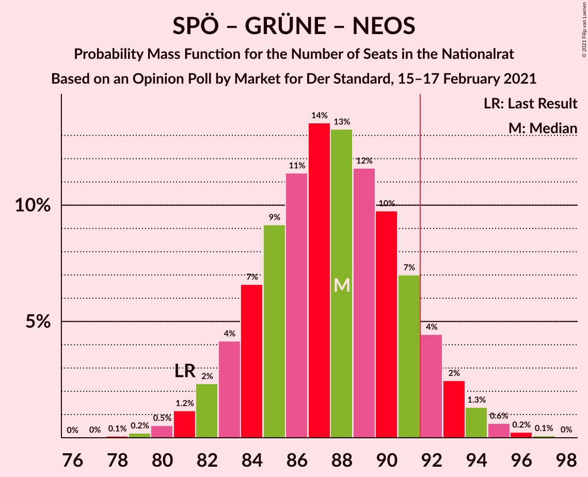
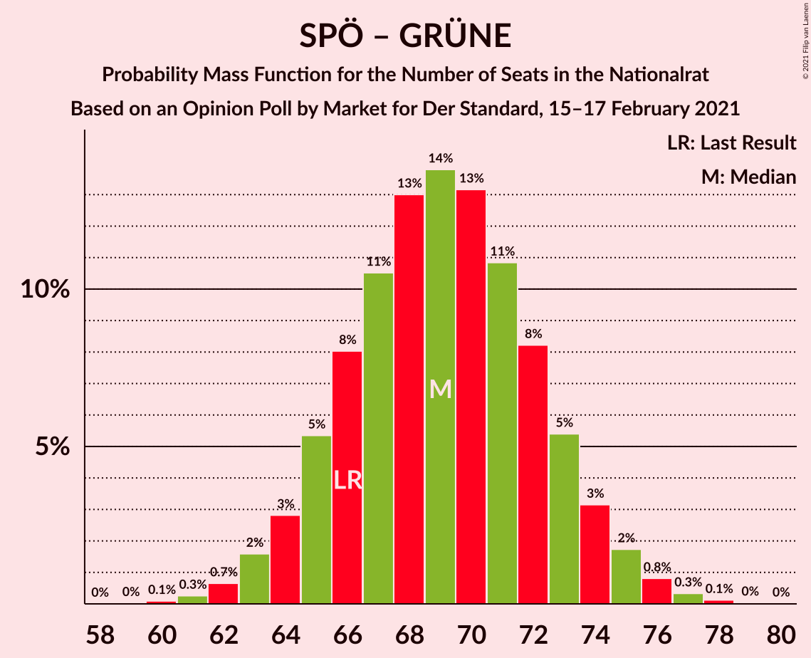

# Opinion Poll by Market for Der Standard, 15–17 February 2021

<a href="#voting-intentions">Voting Intentions</a> | <a href="#seats">Seats</a> | <a href="#coalitions">Coalitions</a> | <a href="#technical-information">Technical Information</a>

## Voting Intentions

### Confidence Intervals

| Party | Last Result | Poll Result | 80% Confidence Interval | 90% Confidence Interval | 95% Confidence Interval | 99% Confidence Interval |
|:-----:|:-----------:|:-----------:|:-----------------------:|:-----------------------:|:-----------------------:|:-----------------------:|
| Österreichische Volkspartei | 37.5% | 37.0% | 35.1–39.0% |34.5–39.6% |34.0–40.0% |33.2–41.0% |
| Sozialdemokratische Partei Österreichs | 21.2% | 25.0% | 23.3–26.8% |22.8–27.3% |22.4–27.8% |21.6–28.7% |
| Freiheitliche Partei Österreichs | 16.2% | 14.0% | 12.7–15.5% |12.3–15.9% |12.0–16.3% |11.4–17.0% |
| Die Grünen–Die Grüne Alternative | 13.9% | 12.0% | 10.8–13.4% |10.4–13.8% |10.1–14.2% |9.6–14.9% |
| NEOS–Das Neue Österreich und Liberales Forum | 8.1% | 10.0% | 8.9–11.3% |8.6–11.7% |8.3–12.0% |7.8–12.7% |

*Note:* The poll result column reflects the actual value used in the calculations. Published results may vary slightly, and in addition be rounded to fewer digits.

## Seats

### Confidence Intervals

| Party | Last Result | Median | 80% Confidence Interval | 90% Confidence Interval | 95% Confidence Interval | 99% Confidence Interval |
|:-----:|:-----------:|:------:|:-----------------------:|:-----------------------:|:-----------------------:|:-----------------------:|
| <a href="#österreichische-volkspartei">Österreichische Volkspartei</a> | 71 | 69 | 66–73 |65–74 |64–75 |62–77 |
| <a href="#sozialdemokratische-partei-österreichs">Sozialdemokratische Partei Österreichs</a> | 40 | 47 | 43–50 |43–51 |42–52 |40–54 |
| <a href="#freiheitliche-partei-österreichs">Freiheitliche Partei Österreichs</a> | 31 | 26 | 23–29 |23–30 |22–30 |21–32 |
| <a href="#die-grünen–die-grüne-alternative">Die Grünen–Die Grüne Alternative</a> | 26 | 22 | 20–25 |19–26 |19–26 |18–28 |
| <a href="#neos–das-neue-österreich-und-liberales-forum">NEOS–Das Neue Österreich und Liberales Forum</a> | 15 | 18 | 16–21 |16–22 |15–22 |14–23 |

### Österreichische Volkspartei

*For a full overview of the results for this party, see the [Österreichische Volkspartei](party-österreichischevolkspartei.html) page.*

| Number of Seats | Probability | Accumulated | Special Marks |
|:---------------:|:-----------:|:-----------:|:-------------:|
| 60 | 0.1% | 100% |  |
| 61 | 0.2% | 99.9% |  |
| 62 | 0.5% | 99.7% |  |
| 63 | 1.2% | 99.2% |  |
| 64 | 2% | 98% |  |
| 65 | 4% | 96% |  |
| 66 | 7% | 91% |  |
| 67 | 10% | 84% |  |
| 68 | 12% | 74% |  |
| 69 | 14% | 62% | Median |
| 70 | 13% | 48% |  |
| 71 | 11% | 34% | Last Result |
| 72 | 9% | 23% |  |
| 73 | 6% | 14% |  |
| 74 | 4% | 8% |  |
| 75 | 2% | 4% |  |
| 76 | 1.0% | 2% |  |
| 77 | 0.4% | 0.7% |  |
| 78 | 0.2% | 0.3% |  |
| 79 | 0.1% | 0.1% |  |
| 80 | 0% | 0% |  |

### Sozialdemokratische Partei Österreichs

*For a full overview of the results for this party, see the [Sozialdemokratische Partei Österreichs](party-sozialdemokratischeparteiösterreichs.html) page.*

| Number of Seats | Probability | Accumulated | Special Marks |
|:---------------:|:-----------:|:-----------:|:-------------:|
| 39 | 0.1% | 100% |  |
| 40 | 0.4% | 99.8% | Last Result |
| 41 | 1.3% | 99.4% |  |
| 42 | 3% | 98% |  |
| 43 | 5% | 95% |  |
| 44 | 9% | 90% |  |
| 45 | 12% | 81% |  |
| 46 | 16% | 69% |  |
| 47 | 14% | 53% | Median |
| 48 | 14% | 39% |  |
| 49 | 10% | 25% |  |
| 50 | 7% | 15% |  |
| 51 | 4% | 8% |  |
| 52 | 2% | 4% |  |
| 53 | 1.0% | 2% |  |
| 54 | 0.4% | 0.5% |  |
| 55 | 0.1% | 0.2% |  |
| 56 | 0% | 0.1% |  |
| 57 | 0% | 0% |  |

### Freiheitliche Partei Österreichs

*For a full overview of the results for this party, see the [Freiheitliche Partei Österreichs](party-freiheitlicheparteiösterreichs.html) page.*

| Number of Seats | Probability | Accumulated | Special Marks |
|:---------------:|:-----------:|:-----------:|:-------------:|
| 20 | 0.2% | 100% |  |
| 21 | 0.9% | 99.8% |  |
| 22 | 3% | 98.9% |  |
| 23 | 7% | 96% |  |
| 24 | 12% | 89% |  |
| 25 | 17% | 77% |  |
| 26 | 19% | 60% | Median |
| 27 | 17% | 41% |  |
| 28 | 12% | 24% |  |
| 29 | 7% | 12% |  |
| 30 | 3% | 5% |  |
| 31 | 1.4% | 2% | Last Result |
| 32 | 0.4% | 0.6% |  |
| 33 | 0.1% | 0.2% |  |
| 34 | 0% | 0% |  |

### Die Grünen–Die Grüne Alternative

*For a full overview of the results for this party, see the [Die Grünen–Die Grüne Alternative](party-diegrünen–diegrünealternative.html) page.*

| Number of Seats | Probability | Accumulated | Special Marks |
|:---------------:|:-----------:|:-----------:|:-------------:|
| 16 | 0.1% | 100% |  |
| 17 | 0.4% | 99.9% |  |
| 18 | 2% | 99.6% |  |
| 19 | 5% | 98% |  |
| 20 | 11% | 93% |  |
| 21 | 17% | 82% |  |
| 22 | 20% | 65% | Median |
| 23 | 19% | 45% |  |
| 24 | 13% | 26% |  |
| 25 | 8% | 13% |  |
| 26 | 3% | 5% | Last Result |
| 27 | 1.3% | 2% |  |
| 28 | 0.4% | 0.5% |  |
| 29 | 0.1% | 0.1% |  |
| 30 | 0% | 0% |  |

### NEOS–Das Neue Österreich und Liberales Forum

*For a full overview of the results for this party, see the [NEOS–Das Neue Österreich und Liberales Forum](party-neos–dasneueösterreichundliberalesforum.html) page.*

| Number of Seats | Probability | Accumulated | Special Marks |
|:---------------:|:-----------:|:-----------:|:-------------:|
| 13 | 0.1% | 100% |  |
| 14 | 0.8% | 99.9% |  |
| 15 | 3% | 99.1% | Last Result |
| 16 | 9% | 96% |  |
| 17 | 16% | 87% |  |
| 18 | 22% | 71% | Median |
| 19 | 21% | 49% |  |
| 20 | 15% | 28% |  |
| 21 | 8% | 13% |  |
| 22 | 3% | 5% |  |
| 23 | 1.2% | 2% |  |
| 24 | 0.3% | 0.4% |  |
| 25 | 0.1% | 0.1% |  |
| 26 | 0% | 0% |  |

## Coalitions

### Confidence Intervals

| Coalition | Last Result | Median | Majority? | 80% Confidence Interval | 90% Confidence Interval | 95% Confidence Interval | 99% Confidence Interval |
|:---------:|:-----------:|:------:|:---------:|:-----------------------:|:-----------------------:|:-----------------------:|:-----------------------:|
| Österreichische Volkspartei – Sozialdemokratische Partei Österreichs | 111 | 116 | 100% | 113–120 | 111–121 | 110–122 | 109–124 |
| Österreichische Volkspartei – Die Grünen–Die Grüne Alternative – NEOS–Das Neue Österreich und Liberales Forum | 112 | 110 | 100% | 106–114 | 105–115 | 104–116 | 103–118 |
| Österreichische Volkspartei – Freiheitliche Partei Österreichs | 102 | 95 | 91% | 92–99 | 91–100 | 90–101 | 88–103 |
| Österreichische Volkspartei – Die Grünen–Die Grüne Alternative | 97 | 92 | 52% | 88–95 | 87–97 | 86–97 | 84–99 |
| Österreichische Volkspartei – NEOS–Das Neue Österreich und Liberales Forum | 86 | 88 | 11% | 84–92 | 83–93 | 82–94 | 80–96 |
| Sozialdemokratische Partei Österreichs – Die Grünen–Die Grüne Alternative – NEOS–Das Neue Österreich und Liberales Forum | 81 | 88 | 9% | 84–91 | 83–92 | 82–93 | 80–95 |
| Sozialdemokratische Partei Österreichs – Freiheitliche Partei Österreichs | 71 | 73 | 0% | 69–77 | 68–78 | 67–79 | 65–80 |
| Österreichische Volkspartei | 71 | 69 | 0% | 66–73 | 65–74 | 64–75 | 62–77 |
| Sozialdemokratische Partei Österreichs – Die Grünen–Die Grüne Alternative | 66 | 69 | 0% | 65–73 | 64–74 | 63–75 | 62–77 |
| Sozialdemokratische Partei Österreichs | 40 | 47 | 0% | 43–50 | 43–51 | 42–52 | 40–54 |

### Österreichische Volkspartei – Sozialdemokratische Partei Österreichs

| Number of Seats | Probability | Accumulated | Special Marks |
|:---------------:|:-----------:|:-----------:|:-------------:|
| 106 | 0% | 100% |  |
| 107 | 0.1% | 99.9% |  |
| 108 | 0.2% | 99.9% |  |
| 109 | 0.6% | 99.6% |  |
| 110 | 2% | 99.0% |  |
| 111 | 3% | 97% | Last Result |
| 112 | 4% | 94% |  |
| 113 | 6% | 90% |  |
| 114 | 12% | 84% |  |
| 115 | 16% | 73% |  |
| 116 | 14% | 57% | Median |
| 117 | 9% | 43% |  |
| 118 | 10% | 33% |  |
| 119 | 11% | 23% |  |
| 120 | 7% | 12% |  |
| 121 | 3% | 5% |  |
| 122 | 1.1% | 3% |  |
| 123 | 0.8% | 1.4% |  |
| 124 | 0.4% | 0.6% |  |
| 125 | 0.1% | 0.1% |  |
| 126 | 0% | 0% |  |

### Österreichische Volkspartei – Die Grünen–Die Grüne Alternative – NEOS–Das Neue Österreich und Liberales Forum

| Number of Seats | Probability | Accumulated | Special Marks |
|:---------------:|:-----------:|:-----------:|:-------------:|
| 101 | 0.1% | 100% |  |
| 102 | 0.3% | 99.8% |  |
| 103 | 0.7% | 99.6% |  |
| 104 | 2% | 98.9% |  |
| 105 | 3% | 97% |  |
| 106 | 5% | 95% |  |
| 107 | 8% | 90% |  |
| 108 | 10% | 82% |  |
| 109 | 12% | 72% | Median |
| 110 | 14% | 60% |  |
| 111 | 13% | 46% |  |
| 112 | 11% | 32% | Last Result |
| 113 | 9% | 21% |  |
| 114 | 6% | 13% |  |
| 115 | 3% | 7% |  |
| 116 | 2% | 3% |  |
| 117 | 0.9% | 1.4% |  |
| 118 | 0.4% | 0.5% |  |
| 119 | 0.1% | 0.2% |  |
| 120 | 0% | 0.1% |  |
| 121 | 0% | 0% |  |

### Österreichische Volkspartei – Freiheitliche Partei Österreichs

| Number of Seats | Probability | Accumulated | Special Marks |
|:---------------:|:-----------:|:-----------:|:-------------:|
| 86 | 0.1% | 100% |  |
| 87 | 0.2% | 99.9% |  |
| 88 | 0.6% | 99.6% |  |
| 89 | 1.3% | 99.0% |  |
| 90 | 2% | 98% |  |
| 91 | 4% | 95% |  |
| 92 | 7% | 91% | Majority |
| 93 | 10% | 84% |  |
| 94 | 12% | 74% |  |
| 95 | 13% | 62% | Median |
| 96 | 14% | 49% |  |
| 97 | 11% | 36% |  |
| 98 | 9% | 24% |  |
| 99 | 7% | 15% |  |
| 100 | 4% | 8% |  |
| 101 | 2% | 4% |  |
| 102 | 1.2% | 2% | Last Result |
| 103 | 0.5% | 0.8% |  |
| 104 | 0.2% | 0.3% |  |
| 105 | 0.1% | 0.1% |  |
| 106 | 0% | 0% |  |

### Österreichische Volkspartei – Die Grünen–Die Grüne Alternative

| Number of Seats | Probability | Accumulated | Special Marks |
|:---------------:|:-----------:|:-----------:|:-------------:|
| 82 | 0.1% | 100% |  |
| 83 | 0.2% | 99.9% |  |
| 84 | 0.5% | 99.7% |  |
| 85 | 1.1% | 99.2% |  |
| 86 | 2% | 98% |  |
| 87 | 4% | 96% |  |
| 88 | 6% | 92% |  |
| 89 | 9% | 86% |  |
| 90 | 12% | 77% |  |
| 91 | 13% | 65% | Median |
| 92 | 13% | 52% | Majority |
| 93 | 12% | 39% |  |
| 94 | 10% | 27% |  |
| 95 | 7% | 17% |  |
| 96 | 5% | 10% |  |
| 97 | 3% | 5% | Last Result |
| 98 | 1.4% | 2% |  |
| 99 | 0.6% | 1.0% |  |
| 100 | 0.3% | 0.4% |  |
| 101 | 0.1% | 0.1% |  |
| 102 | 0% | 0% |  |

### Österreichische Volkspartei – NEOS–Das Neue Österreich und Liberales Forum

| Number of Seats | Probability | Accumulated | Special Marks |
|:---------------:|:-----------:|:-----------:|:-------------:|
| 78 | 0.1% | 100% |  |
| 79 | 0.1% | 99.9% |  |
| 80 | 0.4% | 99.8% |  |
| 81 | 0.9% | 99.4% |  |
| 82 | 2% | 98% |  |
| 83 | 3% | 97% |  |
| 84 | 6% | 93% |  |
| 85 | 9% | 87% |  |
| 86 | 11% | 79% | Last Result |
| 87 | 13% | 68% | Median |
| 88 | 14% | 55% |  |
| 89 | 13% | 42% |  |
| 90 | 10% | 29% |  |
| 91 | 8% | 19% |  |
| 92 | 5% | 11% | Majority |
| 93 | 3% | 6% |  |
| 94 | 2% | 3% |  |
| 95 | 0.8% | 1.3% |  |
| 96 | 0.3% | 0.5% |  |
| 97 | 0.1% | 0.2% |  |
| 98 | 0% | 0.1% |  |
| 99 | 0% | 0% |  |

### Sozialdemokratische Partei Österreichs – Die Grünen–Die Grüne Alternative – NEOS–Das Neue Österreich und Liberales Forum

| Number of Seats | Probability | Accumulated | Special Marks |
|:---------------:|:-----------:|:-----------:|:-------------:|
| 78 | 0.1% | 100% |  |
| 79 | 0.2% | 99.9% |  |
| 80 | 0.5% | 99.7% |  |
| 81 | 1.2% | 99.2% | Last Result |
| 82 | 2% | 98% |  |
| 83 | 4% | 96% |  |
| 84 | 7% | 92% |  |
| 85 | 9% | 85% |  |
| 86 | 11% | 76% |  |
| 87 | 14% | 64% | Median |
| 88 | 13% | 51% |  |
| 89 | 12% | 38% |  |
| 90 | 10% | 26% |  |
| 91 | 7% | 16% |  |
| 92 | 4% | 9% | Majority |
| 93 | 2% | 5% |  |
| 94 | 1.3% | 2% |  |
| 95 | 0.6% | 1.0% |  |
| 96 | 0.2% | 0.4% |  |
| 97 | 0.1% | 0.1% |  |
| 98 | 0% | 0% |  |

### Sozialdemokratische Partei Österreichs – Freiheitliche Partei Österreichs

| Number of Seats | Probability | Accumulated | Special Marks |
|:---------------:|:-----------:|:-----------:|:-------------:|
| 63 | 0% | 100% |  |
| 64 | 0.1% | 99.9% |  |
| 65 | 0.4% | 99.8% |  |
| 66 | 0.9% | 99.5% |  |
| 67 | 2% | 98.6% |  |
| 68 | 3% | 97% |  |
| 69 | 6% | 93% |  |
| 70 | 9% | 87% |  |
| 71 | 11% | 79% | Last Result |
| 72 | 13% | 68% |  |
| 73 | 14% | 54% | Median |
| 74 | 12% | 40% |  |
| 75 | 10% | 28% |  |
| 76 | 8% | 18% |  |
| 77 | 5% | 10% |  |
| 78 | 3% | 5% |  |
| 79 | 2% | 3% |  |
| 80 | 0.7% | 1.1% |  |
| 81 | 0.3% | 0.4% |  |
| 82 | 0.1% | 0.2% |  |
| 83 | 0% | 0% |  |

### Österreichische Volkspartei

| Number of Seats | Probability | Accumulated | Special Marks |
|:---------------:|:-----------:|:-----------:|:-------------:|
| 60 | 0.1% | 100% |  |
| 61 | 0.2% | 99.9% |  |
| 62 | 0.5% | 99.7% |  |
| 63 | 1.2% | 99.2% |  |
| 64 | 2% | 98% |  |
| 65 | 4% | 96% |  |
| 66 | 7% | 91% |  |
| 67 | 10% | 84% |  |
| 68 | 12% | 74% |  |
| 69 | 14% | 62% | Median |
| 70 | 13% | 48% |  |
| 71 | 11% | 34% | Last Result |
| 72 | 9% | 23% |  |
| 73 | 6% | 14% |  |
| 74 | 4% | 8% |  |
| 75 | 2% | 4% |  |
| 76 | 1.0% | 2% |  |
| 77 | 0.4% | 0.7% |  |
| 78 | 0.2% | 0.3% |  |
| 79 | 0.1% | 0.1% |  |
| 80 | 0% | 0% |  |

### Sozialdemokratische Partei Österreichs – Die Grünen–Die Grüne Alternative

| Number of Seats | Probability | Accumulated | Special Marks |
|:---------------:|:-----------:|:-----------:|:-------------:|
| 60 | 0.1% | 100% |  |
| 61 | 0.3% | 99.9% |  |
| 62 | 0.7% | 99.6% |  |
| 63 | 2% | 99.0% |  |
| 64 | 3% | 97% |  |
| 65 | 5% | 95% |  |
| 66 | 8% | 89% | Last Result |
| 67 | 11% | 81% |  |
| 68 | 13% | 71% |  |
| 69 | 14% | 58% | Median |
| 70 | 13% | 44% |  |
| 71 | 11% | 31% |  |
| 72 | 8% | 20% |  |
| 73 | 5% | 12% |  |
| 74 | 3% | 6% |  |
| 75 | 2% | 3% |  |
| 76 | 0.8% | 1.3% |  |
| 77 | 0.3% | 0.5% |  |
| 78 | 0.1% | 0.2% |  |
| 79 | 0% | 0.1% |  |
| 80 | 0% | 0% |  |

### Sozialdemokratische Partei Österreichs

| Number of Seats | Probability | Accumulated | Special Marks |
|:---------------:|:-----------:|:-----------:|:-------------:|
| 39 | 0.1% | 100% |  |
| 40 | 0.4% | 99.8% | Last Result |
| 41 | 1.3% | 99.4% |  |
| 42 | 3% | 98% |  |
| 43 | 5% | 95% |  |
| 44 | 9% | 90% |  |
| 45 | 12% | 81% |  |
| 46 | 16% | 69% |  |
| 47 | 14% | 53% | Median |
| 48 | 14% | 39% |  |
| 49 | 10% | 25% |  |
| 50 | 7% | 15% |  |
| 51 | 4% | 8% |  |
| 52 | 2% | 4% |  |
| 53 | 1.0% | 2% |  |
| 54 | 0.4% | 0.5% |  |
| 55 | 0.1% | 0.2% |  |
| 56 | 0% | 0.1% |  |
| 57 | 0% | 0% |  |

## Technical Information

### Opinion Poll

+ **Polling firm:** Market
+ **Commissioner(s):** Der Standard
+ **Fieldwork period:** 15–17 February 2021

### Calculations

+ **Sample size:** 1000
+ **Simulations done:** 1,048,576
+ **Error estimate:** 0.27%

