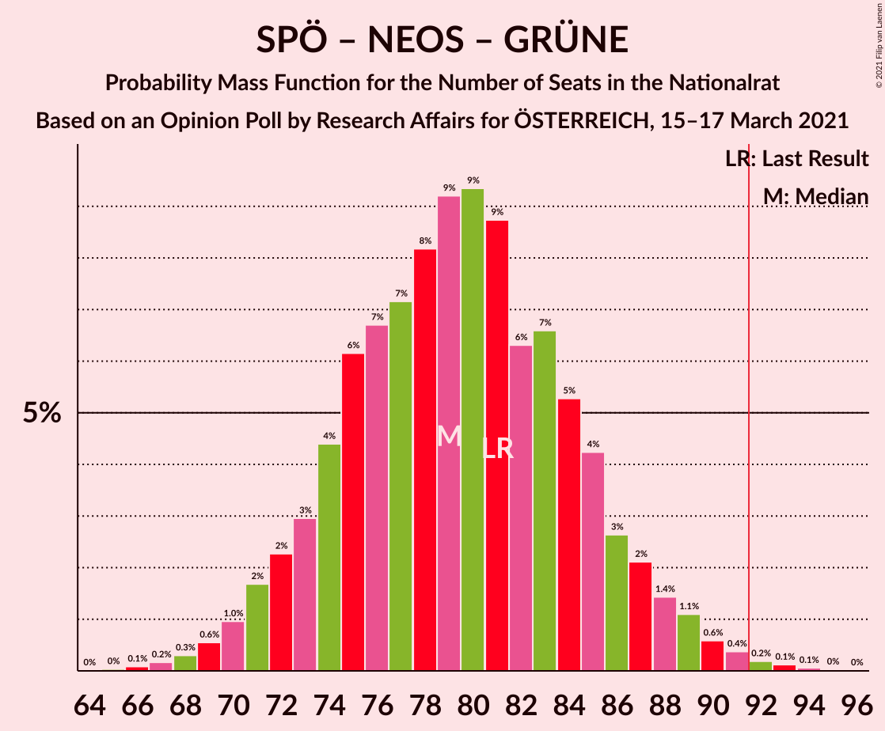
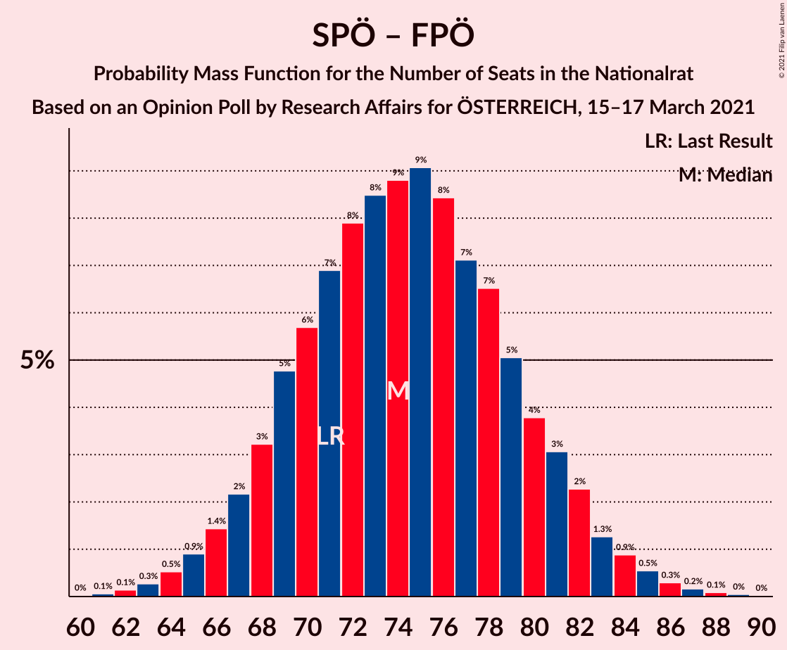
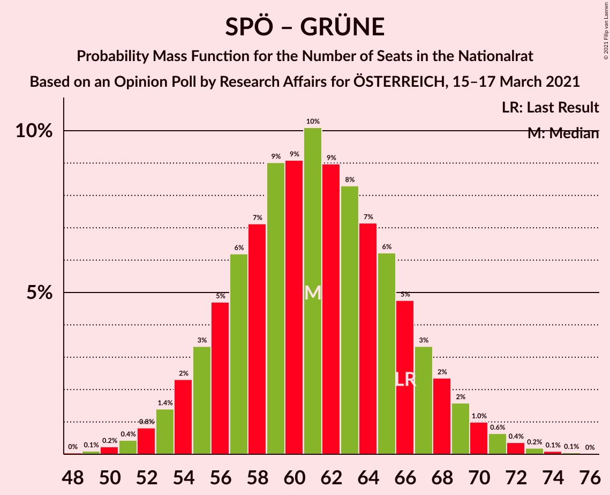

# Opinion Poll by Research Affairs for ÖSTERREICH, 15–17 March 2021

<a href="#voting-intentions">Voting Intentions</a> | <a href="#seats">Seats</a> | <a href="#coalitions">Coalitions</a> | <a href="#technical-information">Technical Information</a>

## Voting Intentions

### Confidence Intervals

| Party | Last Result | Poll Result | 80% Confidence Interval | 90% Confidence Interval | 95% Confidence Interval | 99% Confidence Interval |
|:-----:|:-----------:|:-----------:|:-----------------------:|:-----------------------:|:-----------------------:|:-----------------------:|
| Österreichische Volkspartei | 37.5% | 36.9% | 34.2–39.7% |33.5–40.5% |32.8–41.2% |31.5–42.6% |
| Sozialdemokratische Partei Österreichs | 21.2% | 24.0% | 21.7–26.6% |21.0–27.3% |20.5–27.9% |19.4–29.2% |
| Freiheitliche Partei Österreichs | 16.2% | 16.1% | 14.1–18.3% |13.6–19.0% |13.1–19.5% |12.2–20.7% |
| NEOS–Das Neue Österreich und Liberales Forum | 8.1% | 9.9% | 8.4–11.8% |8.0–12.4% |7.6–12.8% |6.9–13.8% |
| Die Grünen–Die Grüne Alternative | 13.9% | 8.9% | 7.5–10.8% |7.1–11.3% |6.7–11.8% |6.1–12.7% |

*Note:* The poll result column reflects the actual value used in the calculations. Published results may vary slightly, and in addition be rounded to fewer digits.

## Seats

### Confidence Intervals

| Party | Last Result | Median | 80% Confidence Interval | 90% Confidence Interval | 95% Confidence Interval | 99% Confidence Interval |
|:-----:|:-----------:|:------:|:-----------------------:|:-----------------------:|:-----------------------:|:-----------------------:|
| <a href="#österreichische-volkspartei">Österreichische Volkspartei</a> | 71 | 69 | 63–74 |62–76 |60–77 |58–80 |
| <a href="#sozialdemokratische-partei-österreichs">Sozialdemokratische Partei Österreichs</a> | 40 | 44 | 40–49 |38–51 |37–52 |36–55 |
| <a href="#freiheitliche-partei-österreichs">Freiheitliche Partei Österreichs</a> | 31 | 30 | 26–34 |25–35 |24–36 |22–38 |
| <a href="#neos–das-neue-österreich-und-liberales-forum">NEOS–Das Neue Österreich und Liberales Forum</a> | 15 | 18 | 15–22 |14–22 |14–23 |12–26 |
| <a href="#die-grünen–die-grüne-alternative">Die Grünen–Die Grüne Alternative</a> | 26 | 16 | 13–20 |13–21 |12–22 |11–23 |

### Österreichische Volkspartei

*For a full overview of the results for this party, see the [Österreichische Volkspartei](party-österreichischevolkspartei.html) page.*

| Number of Seats | Probability | Accumulated | Special Marks |
|:---------------:|:-----------:|:-----------:|:-------------:|
| 55 | 0% | 100% |  |
| 56 | 0.1% | 99.9% |  |
| 57 | 0.2% | 99.8% |  |
| 58 | 0.4% | 99.7% |  |
| 59 | 0.8% | 99.3% |  |
| 60 | 1.1% | 98% |  |
| 61 | 2% | 97% |  |
| 62 | 3% | 96% |  |
| 63 | 4% | 93% |  |
| 64 | 6% | 89% |  |
| 65 | 7% | 83% |  |
| 66 | 6% | 76% |  |
| 67 | 9% | 70% |  |
| 68 | 10% | 61% |  |
| 69 | 10% | 50% | Median |
| 70 | 7% | 40% |  |
| 71 | 8% | 33% | Last Result |
| 72 | 6% | 24% |  |
| 73 | 5% | 18% |  |
| 74 | 4% | 13% |  |
| 75 | 3% | 9% |  |
| 76 | 2% | 5% |  |
| 77 | 1.2% | 3% |  |
| 78 | 0.7% | 2% |  |
| 79 | 0.5% | 1.3% |  |
| 80 | 0.4% | 0.7% |  |
| 81 | 0.2% | 0.4% |  |
| 82 | 0.1% | 0.2% |  |
| 83 | 0.1% | 0.1% |  |
| 84 | 0% | 0% |  |

### Sozialdemokratische Partei Österreichs

*For a full overview of the results for this party, see the [Sozialdemokratische Partei Österreichs](party-sozialdemokratischeparteiösterreichs.html) page.*

| Number of Seats | Probability | Accumulated | Special Marks |
|:---------------:|:-----------:|:-----------:|:-------------:|
| 33 | 0.1% | 100% |  |
| 34 | 0.1% | 99.9% |  |
| 35 | 0.2% | 99.8% |  |
| 36 | 0.6% | 99.6% |  |
| 37 | 2% | 99.0% |  |
| 38 | 3% | 97% |  |
| 39 | 3% | 94% |  |
| 40 | 3% | 91% | Last Result |
| 41 | 6% | 88% |  |
| 42 | 11% | 82% |  |
| 43 | 11% | 71% |  |
| 44 | 13% | 60% | Median |
| 45 | 8% | 46% |  |
| 46 | 7% | 39% |  |
| 47 | 9% | 31% |  |
| 48 | 6% | 22% |  |
| 49 | 5% | 15% |  |
| 50 | 5% | 10% |  |
| 51 | 2% | 5% |  |
| 52 | 1.2% | 3% |  |
| 53 | 0.9% | 2% |  |
| 54 | 0.5% | 1.1% |  |
| 55 | 0.5% | 0.6% |  |
| 56 | 0.1% | 0.2% |  |
| 57 | 0% | 0.1% |  |
| 58 | 0% | 0% |  |

### Freiheitliche Partei Österreichs

*For a full overview of the results for this party, see the [Freiheitliche Partei Österreichs](party-freiheitlicheparteiösterreichs.html) page.*

| Number of Seats | Probability | Accumulated | Special Marks |
|:---------------:|:-----------:|:-----------:|:-------------:|
| 20 | 0% | 100% |  |
| 21 | 0.2% | 99.9% |  |
| 22 | 0.4% | 99.8% |  |
| 23 | 1.2% | 99.4% |  |
| 24 | 2% | 98% |  |
| 25 | 4% | 96% |  |
| 26 | 7% | 92% |  |
| 27 | 9% | 86% |  |
| 28 | 11% | 76% |  |
| 29 | 13% | 65% |  |
| 30 | 12% | 53% | Median |
| 31 | 12% | 41% | Last Result |
| 32 | 10% | 29% |  |
| 33 | 7% | 19% |  |
| 34 | 5% | 12% |  |
| 35 | 3% | 7% |  |
| 36 | 2% | 4% |  |
| 37 | 0.8% | 2% |  |
| 38 | 0.6% | 1.0% |  |
| 39 | 0.3% | 0.5% |  |
| 40 | 0.1% | 0.2% |  |
| 41 | 0% | 0.1% |  |
| 42 | 0% | 0% |  |

### NEOS–Das Neue Österreich und Liberales Forum

*For a full overview of the results for this party, see the [NEOS–Das Neue Österreich und Liberales Forum](party-neos–dasneueösterreichundliberalesforum.html) page.*

| Number of Seats | Probability | Accumulated | Special Marks |
|:---------------:|:-----------:|:-----------:|:-------------:|
| 11 | 0.1% | 100% |  |
| 12 | 0.5% | 99.9% |  |
| 13 | 2% | 99.4% |  |
| 14 | 3% | 98% |  |
| 15 | 6% | 95% | Last Result |
| 16 | 13% | 88% |  |
| 17 | 17% | 76% |  |
| 18 | 16% | 59% | Median |
| 19 | 11% | 43% |  |
| 20 | 11% | 32% |  |
| 21 | 10% | 21% |  |
| 22 | 7% | 12% |  |
| 23 | 2% | 5% |  |
| 24 | 1.2% | 2% |  |
| 25 | 0.7% | 1.3% |  |
| 26 | 0.3% | 0.5% |  |
| 27 | 0.1% | 0.2% |  |
| 28 | 0% | 0.1% |  |
| 29 | 0% | 0% |  |

### Die Grünen–Die Grüne Alternative

*For a full overview of the results for this party, see the [Die Grünen–Die Grüne Alternative](party-diegrünen–diegrünealternative.html) page.*

| Number of Seats | Probability | Accumulated | Special Marks |
|:---------------:|:-----------:|:-----------:|:-------------:|
| 10 | 0.2% | 100% |  |
| 11 | 0.9% | 99.7% |  |
| 12 | 3% | 98.8% |  |
| 13 | 7% | 96% |  |
| 14 | 9% | 89% |  |
| 15 | 14% | 80% |  |
| 16 | 17% | 66% | Median |
| 17 | 16% | 49% |  |
| 18 | 12% | 32% |  |
| 19 | 9% | 20% |  |
| 20 | 6% | 11% |  |
| 21 | 3% | 6% |  |
| 22 | 2% | 3% |  |
| 23 | 0.6% | 1.1% |  |
| 24 | 0.3% | 0.5% |  |
| 25 | 0.1% | 0.2% |  |
| 26 | 0% | 0% | Last Result |

## Coalitions

### Confidence Intervals

| Coalition | Last Result | Median | Majority? | 80% Confidence Interval | 90% Confidence Interval | 95% Confidence Interval | 99% Confidence Interval |
|:---------:|:-----------:|:------:|:---------:|:-----------------------:|:-----------------------:|:-----------------------:|:-----------------------:|
| Österreichische Volkspartei – Sozialdemokratische Partei Österreichs | 111 | 113 | 100% | 107–119 | 105–121 | 104–122 | 101–125 |
| Österreichische Volkspartei – NEOS–Das Neue Österreich und Liberales Forum – Die Grünen–Die Grüne Alternative | 112 | 103 | 99.5% | 97–110 | 96–111 | 94–113 | 92–115 |
| Österreichische Volkspartei – Freiheitliche Partei Österreichs | 102 | 99 | 92% | 92–105 | 91–106 | 89–108 | 87–110 |
| Österreichische Volkspartei – NEOS–Das Neue Österreich und Liberales Forum | 86 | 87 | 16% | 81–93 | 80–94 | 78–96 | 76–99 |
| Österreichische Volkspartei – Die Grünen–Die Grüne Alternative | 97 | 85 | 8% | 80–91 | 78–93 | 76–94 | 74–97 |
| Sozialdemokratische Partei Österreichs – NEOS–Das Neue Österreich und Liberales Forum – Die Grünen–Die Grüne Alternative | 81 | 79 | 0.5% | 74–85 | 72–87 | 71–88 | 69–91 |
| Sozialdemokratische Partei Österreichs – Freiheitliche Partei Österreichs | 71 | 74 | 0% | 69–80 | 67–82 | 66–83 | 64–86 |
| Österreichische Volkspartei | 71 | 69 | 0% | 63–74 | 62–76 | 60–77 | 58–80 |
| Sozialdemokratische Partei Österreichs – Die Grünen–Die Grüne Alternative | 66 | 61 | 0% | 56–67 | 54–68 | 53–69 | 51–72 |
| Sozialdemokratische Partei Österreichs | 40 | 44 | 0% | 40–49 | 38–51 | 37–52 | 36–55 |

### Österreichische Volkspartei – Sozialdemokratische Partei Österreichs

| Number of Seats | Probability | Accumulated | Special Marks |
|:---------------:|:-----------:|:-----------:|:-------------:|
| 98 | 0% | 100% |  |
| 99 | 0.1% | 99.9% |  |
| 100 | 0.1% | 99.9% |  |
| 101 | 0.3% | 99.7% |  |
| 102 | 0.5% | 99.5% |  |
| 103 | 0.8% | 99.0% |  |
| 104 | 1.3% | 98% |  |
| 105 | 2% | 97% |  |
| 106 | 2% | 95% |  |
| 107 | 5% | 92% |  |
| 108 | 5% | 88% |  |
| 109 | 6% | 83% |  |
| 110 | 6% | 77% |  |
| 111 | 8% | 71% | Last Result |
| 112 | 8% | 63% |  |
| 113 | 7% | 56% | Median |
| 114 | 7% | 48% |  |
| 115 | 8% | 41% |  |
| 116 | 8% | 33% |  |
| 117 | 6% | 25% |  |
| 118 | 6% | 19% |  |
| 119 | 5% | 13% |  |
| 120 | 3% | 8% |  |
| 121 | 2% | 5% |  |
| 122 | 1.3% | 4% |  |
| 123 | 0.9% | 2% |  |
| 124 | 0.6% | 1.4% |  |
| 125 | 0.3% | 0.8% |  |
| 126 | 0.2% | 0.5% |  |
| 127 | 0.2% | 0.3% |  |
| 128 | 0.1% | 0.1% |  |
| 129 | 0% | 0% |  |

### Österreichische Volkspartei – NEOS–Das Neue Österreich und Liberales Forum – Die Grünen–Die Grüne Alternative

| Number of Seats | Probability | Accumulated | Special Marks |
|:---------------:|:-----------:|:-----------:|:-------------:|
| 89 | 0.1% | 100% |  |
| 90 | 0.1% | 99.9% |  |
| 91 | 0.2% | 99.8% |  |
| 92 | 0.4% | 99.5% | Majority |
| 93 | 0.7% | 99.2% |  |
| 94 | 1.2% | 98.5% |  |
| 95 | 2% | 97% |  |
| 96 | 3% | 96% |  |
| 97 | 3% | 93% |  |
| 98 | 5% | 90% |  |
| 99 | 6% | 85% |  |
| 100 | 6% | 79% |  |
| 101 | 7% | 74% |  |
| 102 | 11% | 66% |  |
| 103 | 7% | 55% | Median |
| 104 | 7% | 48% |  |
| 105 | 7% | 41% |  |
| 106 | 8% | 34% |  |
| 107 | 8% | 27% |  |
| 108 | 5% | 19% |  |
| 109 | 4% | 14% |  |
| 110 | 3% | 11% |  |
| 111 | 3% | 8% |  |
| 112 | 1.5% | 4% | Last Result |
| 113 | 1.0% | 3% |  |
| 114 | 1.1% | 2% |  |
| 115 | 0.4% | 0.9% |  |
| 116 | 0.2% | 0.5% |  |
| 117 | 0.1% | 0.3% |  |
| 118 | 0.1% | 0.1% |  |
| 119 | 0% | 0.1% |  |
| 120 | 0% | 0% |  |

### Österreichische Volkspartei – Freiheitliche Partei Österreichs

| Number of Seats | Probability | Accumulated | Special Marks |
|:---------------:|:-----------:|:-----------:|:-------------:|
| 84 | 0% | 100% |  |
| 85 | 0.1% | 99.9% |  |
| 86 | 0.2% | 99.8% |  |
| 87 | 0.4% | 99.6% |  |
| 88 | 0.6% | 99.2% |  |
| 89 | 1.1% | 98.6% |  |
| 90 | 2% | 97% |  |
| 91 | 3% | 95% |  |
| 92 | 3% | 92% | Majority |
| 93 | 3% | 89% |  |
| 94 | 6% | 86% |  |
| 95 | 9% | 80% |  |
| 96 | 7% | 71% |  |
| 97 | 7% | 64% |  |
| 98 | 6% | 57% |  |
| 99 | 11% | 51% | Median |
| 100 | 10% | 41% |  |
| 101 | 6% | 31% |  |
| 102 | 4% | 25% | Last Result |
| 103 | 4% | 21% |  |
| 104 | 6% | 17% |  |
| 105 | 5% | 11% |  |
| 106 | 2% | 6% |  |
| 107 | 0.9% | 4% |  |
| 108 | 0.9% | 3% |  |
| 109 | 1.2% | 2% |  |
| 110 | 0.5% | 0.9% |  |
| 111 | 0.1% | 0.4% |  |
| 112 | 0.1% | 0.3% |  |
| 113 | 0.1% | 0.2% |  |
| 114 | 0% | 0.1% |  |
| 115 | 0% | 0% |  |

### Österreichische Volkspartei – NEOS–Das Neue Österreich und Liberales Forum

| Number of Seats | Probability | Accumulated | Special Marks |
|:---------------:|:-----------:|:-----------:|:-------------:|
| 73 | 0.1% | 100% |  |
| 74 | 0.1% | 99.9% |  |
| 75 | 0.2% | 99.7% |  |
| 76 | 0.5% | 99.5% |  |
| 77 | 0.7% | 99.0% |  |
| 78 | 1.3% | 98% |  |
| 79 | 2% | 97% |  |
| 80 | 3% | 95% |  |
| 81 | 3% | 92% |  |
| 82 | 5% | 89% |  |
| 83 | 7% | 85% |  |
| 84 | 7% | 78% |  |
| 85 | 9% | 71% |  |
| 86 | 8% | 62% | Last Result |
| 87 | 9% | 53% | Median |
| 88 | 9% | 44% |  |
| 89 | 6% | 35% |  |
| 90 | 9% | 29% |  |
| 91 | 5% | 21% |  |
| 92 | 5% | 16% | Majority |
| 93 | 3% | 11% |  |
| 94 | 3% | 7% |  |
| 95 | 2% | 5% |  |
| 96 | 0.6% | 3% |  |
| 97 | 1.1% | 2% |  |
| 98 | 0.4% | 1.1% |  |
| 99 | 0.3% | 0.7% |  |
| 100 | 0.2% | 0.4% |  |
| 101 | 0.1% | 0.2% |  |
| 102 | 0% | 0.1% |  |
| 103 | 0% | 0% |  |

### Österreichische Volkspartei – Die Grünen–Die Grüne Alternative

| Number of Seats | Probability | Accumulated | Special Marks |
|:---------------:|:-----------:|:-----------:|:-------------:|
| 71 | 0.1% | 100% |  |
| 72 | 0.1% | 99.9% |  |
| 73 | 0.2% | 99.8% |  |
| 74 | 0.4% | 99.6% |  |
| 75 | 0.9% | 99.3% |  |
| 76 | 1.5% | 98% |  |
| 77 | 2% | 97% |  |
| 78 | 2% | 95% |  |
| 79 | 3% | 93% |  |
| 80 | 7% | 90% |  |
| 81 | 7% | 83% |  |
| 82 | 6% | 76% |  |
| 83 | 6% | 70% |  |
| 84 | 8% | 64% |  |
| 85 | 11% | 57% | Median |
| 86 | 9% | 46% |  |
| 87 | 5% | 36% |  |
| 88 | 4% | 31% |  |
| 89 | 8% | 26% |  |
| 90 | 7% | 19% |  |
| 91 | 4% | 12% |  |
| 92 | 2% | 8% | Majority |
| 93 | 2% | 6% |  |
| 94 | 2% | 4% |  |
| 95 | 1.2% | 2% |  |
| 96 | 0.6% | 1.1% |  |
| 97 | 0.2% | 0.5% | Last Result |
| 98 | 0.1% | 0.3% |  |
| 99 | 0.1% | 0.2% |  |
| 100 | 0.1% | 0.1% |  |
| 101 | 0% | 0% |  |

### Sozialdemokratische Partei Österreichs – NEOS–Das Neue Österreich und Liberales Forum – Die Grünen–Die Grüne Alternative

| Number of Seats | Probability | Accumulated | Special Marks |
|:---------------:|:-----------:|:-----------:|:-------------:|
| 65 | 0.1% | 100% |  |
| 66 | 0.1% | 99.9% |  |
| 67 | 0.1% | 99.8% |  |
| 68 | 0.2% | 99.7% |  |
| 69 | 0.6% | 99.5% |  |
| 70 | 1.2% | 98.9% |  |
| 71 | 2% | 98% |  |
| 72 | 1.3% | 96% |  |
| 73 | 3% | 95% |  |
| 74 | 6% | 92% |  |
| 75 | 8% | 87% |  |
| 76 | 5% | 79% |  |
| 77 | 5% | 73% |  |
| 78 | 10% | 69% | Median |
| 79 | 13% | 59% |  |
| 80 | 8% | 46% |  |
| 81 | 6% | 38% | Last Result |
| 82 | 6% | 32% |  |
| 83 | 8% | 26% |  |
| 84 | 7% | 19% |  |
| 85 | 3% | 12% |  |
| 86 | 2% | 9% |  |
| 87 | 2% | 6% |  |
| 88 | 2% | 4% |  |
| 89 | 0.8% | 2% |  |
| 90 | 0.5% | 1.2% |  |
| 91 | 0.2% | 0.7% |  |
| 92 | 0.2% | 0.5% | Majority |
| 93 | 0.1% | 0.2% |  |
| 94 | 0.1% | 0.1% |  |
| 95 | 0% | 0% |  |

### Sozialdemokratische Partei Österreichs – Freiheitliche Partei Österreichs

| Number of Seats | Probability | Accumulated | Special Marks |
|:---------------:|:-----------:|:-----------:|:-------------:|
| 61 | 0.1% | 100% |  |
| 62 | 0.2% | 99.9% |  |
| 63 | 0.2% | 99.7% |  |
| 64 | 0.6% | 99.5% |  |
| 65 | 1.0% | 98.9% |  |
| 66 | 1.2% | 98% |  |
| 67 | 2% | 97% |  |
| 68 | 3% | 95% |  |
| 69 | 6% | 92% |  |
| 70 | 5% | 86% |  |
| 71 | 6% | 80% | Last Result |
| 72 | 9% | 75% |  |
| 73 | 9% | 66% |  |
| 74 | 9% | 57% | Median |
| 75 | 8% | 49% |  |
| 76 | 11% | 41% |  |
| 77 | 7% | 30% |  |
| 78 | 5% | 23% |  |
| 79 | 5% | 18% |  |
| 80 | 4% | 13% |  |
| 81 | 4% | 9% |  |
| 82 | 2% | 5% |  |
| 83 | 1.2% | 3% |  |
| 84 | 0.9% | 2% |  |
| 85 | 0.6% | 1.2% |  |
| 86 | 0.3% | 0.6% |  |
| 87 | 0.1% | 0.3% |  |
| 88 | 0.1% | 0.2% |  |
| 89 | 0.1% | 0.1% |  |
| 90 | 0% | 0% |  |

### Österreichische Volkspartei

| Number of Seats | Probability | Accumulated | Special Marks |
|:---------------:|:-----------:|:-----------:|:-------------:|
| 55 | 0% | 100% |  |
| 56 | 0.1% | 99.9% |  |
| 57 | 0.2% | 99.8% |  |
| 58 | 0.4% | 99.7% |  |
| 59 | 0.8% | 99.3% |  |
| 60 | 1.1% | 98% |  |
| 61 | 2% | 97% |  |
| 62 | 3% | 96% |  |
| 63 | 4% | 93% |  |
| 64 | 6% | 89% |  |
| 65 | 7% | 83% |  |
| 66 | 6% | 76% |  |
| 67 | 9% | 70% |  |
| 68 | 10% | 61% |  |
| 69 | 10% | 50% | Median |
| 70 | 7% | 40% |  |
| 71 | 8% | 33% | Last Result |
| 72 | 6% | 24% |  |
| 73 | 5% | 18% |  |
| 74 | 4% | 13% |  |
| 75 | 3% | 9% |  |
| 76 | 2% | 5% |  |
| 77 | 1.2% | 3% |  |
| 78 | 0.7% | 2% |  |
| 79 | 0.5% | 1.3% |  |
| 80 | 0.4% | 0.7% |  |
| 81 | 0.2% | 0.4% |  |
| 82 | 0.1% | 0.2% |  |
| 83 | 0.1% | 0.1% |  |
| 84 | 0% | 0% |  |

### Sozialdemokratische Partei Österreichs – Die Grünen–Die Grüne Alternative

| Number of Seats | Probability | Accumulated | Special Marks |
|:---------------:|:-----------:|:-----------:|:-------------:|
| 48 | 0% | 100% |  |
| 49 | 0.1% | 99.9% |  |
| 50 | 0.2% | 99.8% |  |
| 51 | 0.4% | 99.6% |  |
| 52 | 0.7% | 99.2% |  |
| 53 | 2% | 98.5% |  |
| 54 | 2% | 97% |  |
| 55 | 3% | 95% |  |
| 56 | 5% | 91% |  |
| 57 | 5% | 87% |  |
| 58 | 7% | 81% |  |
| 59 | 10% | 74% |  |
| 60 | 10% | 65% | Median |
| 61 | 10% | 55% |  |
| 62 | 9% | 45% |  |
| 63 | 9% | 36% |  |
| 64 | 7% | 27% |  |
| 65 | 6% | 21% |  |
| 66 | 4% | 14% | Last Result |
| 67 | 4% | 10% |  |
| 68 | 2% | 6% |  |
| 69 | 1.4% | 4% |  |
| 70 | 0.8% | 2% |  |
| 71 | 0.6% | 1.4% |  |
| 72 | 0.4% | 0.8% |  |
| 73 | 0.2% | 0.3% |  |
| 74 | 0.1% | 0.2% |  |
| 75 | 0.1% | 0.1% |  |
| 76 | 0% | 0% |  |

### Sozialdemokratische Partei Österreichs

| Number of Seats | Probability | Accumulated | Special Marks |
|:---------------:|:-----------:|:-----------:|:-------------:|
| 33 | 0.1% | 100% |  |
| 34 | 0.1% | 99.9% |  |
| 35 | 0.2% | 99.8% |  |
| 36 | 0.6% | 99.6% |  |
| 37 | 2% | 99.0% |  |
| 38 | 3% | 97% |  |
| 39 | 3% | 94% |  |
| 40 | 3% | 91% | Last Result |
| 41 | 6% | 88% |  |
| 42 | 11% | 82% |  |
| 43 | 11% | 71% |  |
| 44 | 13% | 60% | Median |
| 45 | 8% | 46% |  |
| 46 | 7% | 39% |  |
| 47 | 9% | 31% |  |
| 48 | 6% | 22% |  |
| 49 | 5% | 15% |  |
| 50 | 5% | 10% |  |
| 51 | 2% | 5% |  |
| 52 | 1.2% | 3% |  |
| 53 | 0.9% | 2% |  |
| 54 | 0.5% | 1.1% |  |
| 55 | 0.5% | 0.6% |  |
| 56 | 0.1% | 0.2% |  |
| 57 | 0% | 0.1% |  |
| 58 | 0% | 0% |  |

## Technical Information

### Opinion Poll

+ **Polling firm:** Research Affairs
+ **Commissioner(s):** ÖSTERREICH
+ **Fieldwork period:** 15–17 March 2021

### Calculations

+ **Sample size:** 504
+ **Simulations done:** 131,072
+ **Error estimate:** 0.70%

