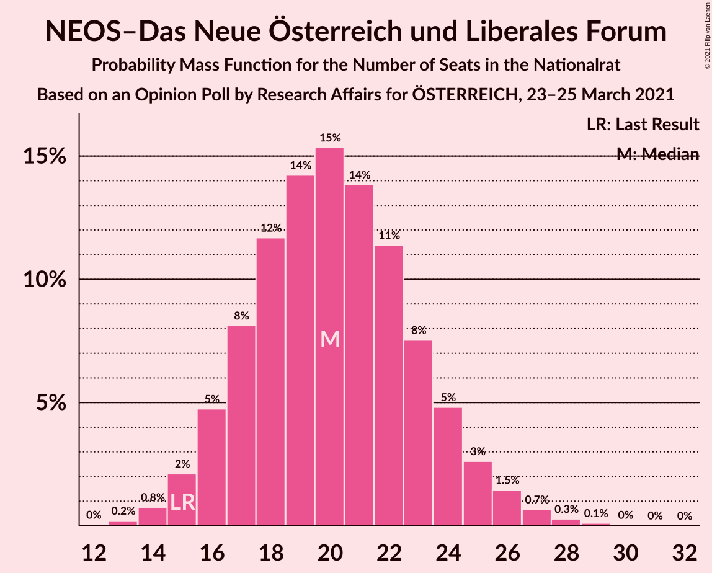
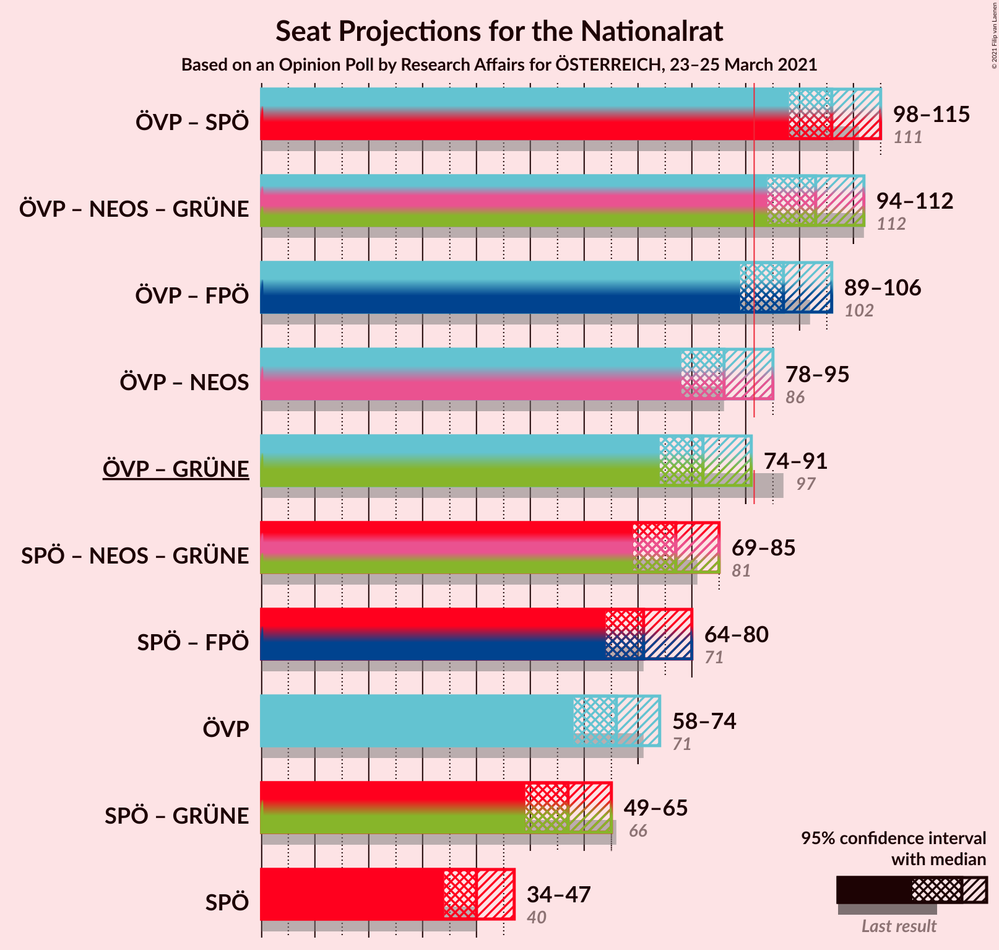
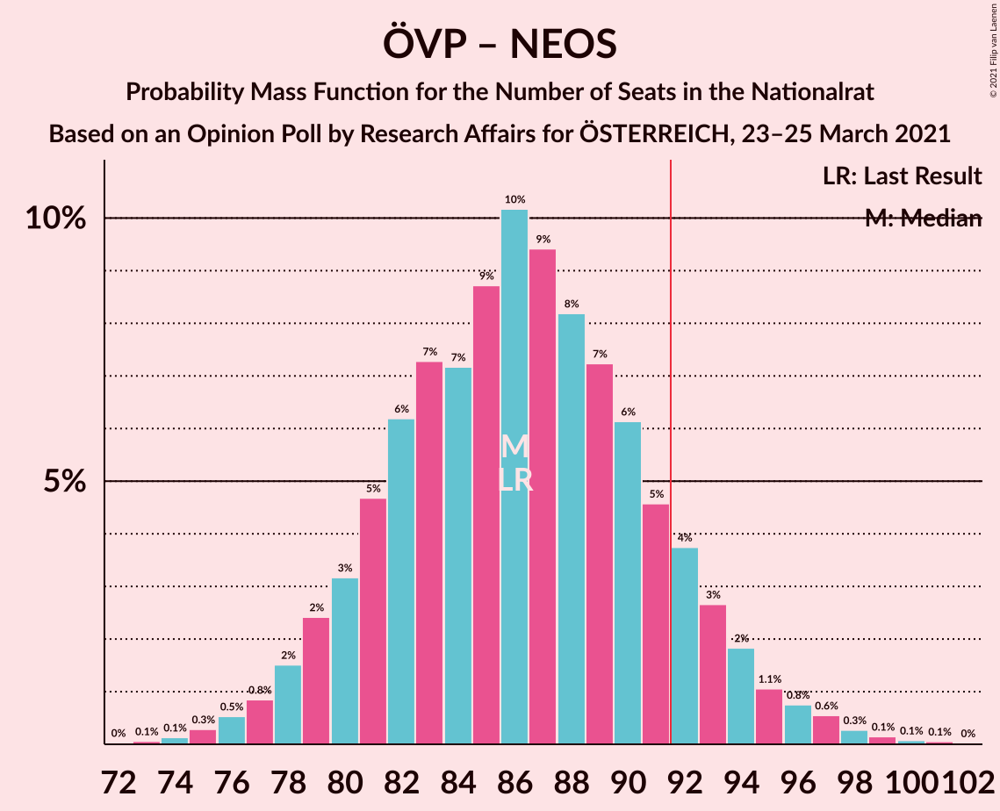

# Opinion Poll by Research Affairs for ÖSTERREICH, 23–25 March 2021

<a href="#voting-intentions">Voting Intentions</a> | <a href="#seats">Seats</a> | <a href="#coalitions">Coalitions</a> | <a href="#technical-information">Technical Information</a>

## Voting Intentions

### Confidence Intervals

| Party | Last Result | Poll Result | 80% Confidence Interval | 90% Confidence Interval | 95% Confidence Interval | 99% Confidence Interval |
|:-----:|:-----------:|:-----------:|:-----------------------:|:-----------------------:|:-----------------------:|:-----------------------:|
| Österreichische Volkspartei | 37.5% | 35.9% | 33.2–38.7% |32.5–39.5% |31.8–40.2% |30.6–41.6% |
| Sozialdemokratische Partei Österreichs | 21.2% | 22.0% | 19.7–24.5% |19.1–25.2% |18.5–25.8% |17.5–27.0% |
| Freiheitliche Partei Österreichs | 16.2% | 17.0% | 15.0–19.3% |14.4–19.9% |13.9–20.5% |13.0–21.7% |
| NEOS–Das Neue Österreich und Liberales Forum | 8.1% | 11.0% | 9.4–13.0% |8.9–13.5% |8.5–14.0% |7.8–15.0% |
| Die Grünen–Die Grüne Alternative | 13.9% | 9.0% | 7.5–10.8% |7.1–11.4% |6.8–11.8% |6.1–12.8% |

*Note:* The poll result column reflects the actual value used in the calculations. Published results may vary slightly, and in addition be rounded to fewer digits.

## Seats

### Confidence Intervals

| Party | Last Result | Median | 80% Confidence Interval | 90% Confidence Interval | 95% Confidence Interval | 99% Confidence Interval |
|:-----:|:-----------:|:------:|:-----------------------:|:-----------------------:|:-----------------------:|:-----------------------:|
| <a href="#österreichische-volkspartei">Österreichische Volkspartei</a> | 71 | 66 | 61–71 |60–73 |58–74 |56–77 |
| <a href="#sozialdemokratische-partei-österreichs">Sozialdemokratische Partei Österreichs</a> | 40 | 40 | 36–45 |35–46 |34–47 |32–50 |
| <a href="#freiheitliche-partei-österreichs">Freiheitliche Partei Österreichs</a> | 31 | 31 | 27–35 |26–36 |25–38 |24–40 |
| <a href="#neos–das-neue-österreich-und-liberales-forum">NEOS–Das Neue Österreich und Liberales Forum</a> | 15 | 20 | 17–23 |16–25 |15–26 |14–27 |
| <a href="#die-grünen–die-grüne-alternative">Die Grünen–Die Grüne Alternative</a> | 26 | 16 | 13–20 |13–21 |12–21 |11–23 |

### Österreichische Volkspartei

*For a full overview of the results for this party, see the [Österreichische Volkspartei](party-österreichischevolkspartei.html) page.*

| Number of Seats | Probability | Accumulated | Special Marks |
|:---------------:|:-----------:|:-----------:|:-------------:|
| 53 | 0% | 100% |  |
| 54 | 0.1% | 99.9% |  |
| 55 | 0.2% | 99.8% |  |
| 56 | 0.4% | 99.7% |  |
| 57 | 0.8% | 99.3% |  |
| 58 | 1.3% | 98% |  |
| 59 | 2% | 97% |  |
| 60 | 3% | 95% |  |
| 61 | 5% | 92% |  |
| 62 | 6% | 87% |  |
| 63 | 8% | 81% |  |
| 64 | 9% | 73% |  |
| 65 | 9% | 65% |  |
| 66 | 10% | 55% | Median |
| 67 | 9% | 45% |  |
| 68 | 9% | 36% |  |
| 69 | 7% | 27% |  |
| 70 | 6% | 20% |  |
| 71 | 5% | 14% | Last Result |
| 72 | 3% | 9% |  |
| 73 | 2% | 6% |  |
| 74 | 1.5% | 4% |  |
| 75 | 1.0% | 2% |  |
| 76 | 0.6% | 1.3% |  |
| 77 | 0.3% | 0.7% |  |
| 78 | 0.2% | 0.4% |  |
| 79 | 0.1% | 0.2% |  |
| 80 | 0.1% | 0.1% |  |
| 81 | 0% | 0% |  |

### Sozialdemokratische Partei Österreichs

*For a full overview of the results for this party, see the [Sozialdemokratische Partei Österreichs](party-sozialdemokratischeparteiösterreichs.html) page.*

| Number of Seats | Probability | Accumulated | Special Marks |
|:---------------:|:-----------:|:-----------:|:-------------:|
| 30 | 0.1% | 100% |  |
| 31 | 0.2% | 99.9% |  |
| 32 | 0.6% | 99.7% |  |
| 33 | 1.1% | 99.1% |  |
| 34 | 2% | 98% |  |
| 35 | 4% | 96% |  |
| 36 | 5% | 92% |  |
| 37 | 7% | 87% |  |
| 38 | 10% | 79% |  |
| 39 | 11% | 70% |  |
| 40 | 12% | 59% | Last Result, Median |
| 41 | 11% | 47% |  |
| 42 | 10% | 36% |  |
| 43 | 8% | 26% |  |
| 44 | 6% | 18% |  |
| 45 | 4% | 12% |  |
| 46 | 3% | 7% |  |
| 47 | 2% | 4% |  |
| 48 | 1.1% | 2% |  |
| 49 | 0.6% | 1.2% |  |
| 50 | 0.3% | 0.6% |  |
| 51 | 0.2% | 0.3% |  |
| 52 | 0.1% | 0.1% |  |
| 53 | 0% | 0.1% |  |
| 54 | 0% | 0% |  |

### Freiheitliche Partei Österreichs

*For a full overview of the results for this party, see the [Freiheitliche Partei Österreichs](party-freiheitlicheparteiösterreichs.html) page.*

| Number of Seats | Probability | Accumulated | Special Marks |
|:---------------:|:-----------:|:-----------:|:-------------:|
| 22 | 0.1% | 100% |  |
| 23 | 0.3% | 99.9% |  |
| 24 | 0.8% | 99.5% |  |
| 25 | 2% | 98.7% |  |
| 26 | 3% | 97% |  |
| 27 | 6% | 94% |  |
| 28 | 8% | 88% |  |
| 29 | 10% | 80% |  |
| 30 | 13% | 70% |  |
| 31 | 13% | 57% | Last Result, Median |
| 32 | 11% | 44% |  |
| 33 | 10% | 32% |  |
| 34 | 9% | 23% |  |
| 35 | 5% | 14% |  |
| 36 | 4% | 9% |  |
| 37 | 2% | 5% |  |
| 38 | 1.4% | 3% |  |
| 39 | 0.6% | 1.2% |  |
| 40 | 0.3% | 0.6% |  |
| 41 | 0.2% | 0.3% |  |
| 42 | 0.1% | 0.1% |  |
| 43 | 0% | 0% |  |

### NEOS–Das Neue Österreich und Liberales Forum

*For a full overview of the results for this party, see the [NEOS–Das Neue Österreich und Liberales Forum](party-neos–dasneueösterreichundliberalesforum.html) page.*

| Number of Seats | Probability | Accumulated | Special Marks |
|:---------------:|:-----------:|:-----------:|:-------------:|
| 12 | 0% | 100% |  |
| 13 | 0.2% | 99.9% |  |
| 14 | 0.8% | 99.7% |  |
| 15 | 2% | 99.0% | Last Result |
| 16 | 5% | 97% |  |
| 17 | 8% | 92% |  |
| 18 | 12% | 84% |  |
| 19 | 14% | 72% |  |
| 20 | 15% | 58% | Median |
| 21 | 14% | 43% |  |
| 22 | 11% | 29% |  |
| 23 | 8% | 18% |  |
| 24 | 5% | 10% |  |
| 25 | 3% | 5% |  |
| 26 | 1.5% | 3% |  |
| 27 | 0.7% | 1.1% |  |
| 28 | 0.3% | 0.4% |  |
| 29 | 0.1% | 0.2% |  |
| 30 | 0% | 0.1% |  |
| 31 | 0% | 0% |  |

### Die Grünen–Die Grüne Alternative

*For a full overview of the results for this party, see the [Die Grünen–Die Grüne Alternative](party-diegrünen–diegrünealternative.html) page.*

| Number of Seats | Probability | Accumulated | Special Marks |
|:---------------:|:-----------:|:-----------:|:-------------:|
| 10 | 0.2% | 100% |  |
| 11 | 1.0% | 99.7% |  |
| 12 | 3% | 98.7% |  |
| 13 | 6% | 96% |  |
| 14 | 11% | 89% |  |
| 15 | 15% | 78% |  |
| 16 | 16% | 64% | Median |
| 17 | 16% | 47% |  |
| 18 | 12% | 31% |  |
| 19 | 9% | 19% |  |
| 20 | 5% | 10% |  |
| 21 | 3% | 5% |  |
| 22 | 1.3% | 2% |  |
| 23 | 0.6% | 0.9% |  |
| 24 | 0.2% | 0.4% |  |
| 25 | 0.1% | 0.1% |  |
| 26 | 0% | 0% | Last Result |

## Coalitions

### Confidence Intervals

| Coalition | Last Result | Median | Majority? | 80% Confidence Interval | 90% Confidence Interval | 95% Confidence Interval | 99% Confidence Interval |
|:---------:|:-----------:|:------:|:---------:|:-----------------------:|:-----------------------:|:-----------------------:|:-----------------------:|
| Österreichische Volkspartei – Sozialdemokratische Partei Österreichs | 111 | 106 | 100% | 101–112 | 99–114 | 98–115 | 96–119 |
| Österreichische Volkspartei – NEOS–Das Neue Österreich und Liberales Forum – Die Grünen–Die Grüne Alternative | 112 | 103 | 99.6% | 97–108 | 96–110 | 94–112 | 92–115 |
| Österreichische Volkspartei – Freiheitliche Partei Österreichs | 102 | 97 | 91% | 92–103 | 90–105 | 89–106 | 86–109 |
| Österreichische Volkspartei – NEOS–Das Neue Österreich und Liberales Forum | 86 | 86 | 11% | 81–92 | 79–93 | 78–95 | 75–98 |
| Österreichische Volkspartei – Die Grünen–Die Grüne Alternative | 97 | 82 | 2% | 77–88 | 76–90 | 74–91 | 72–94 |
| Sozialdemokratische Partei Österreichs – NEOS–Das Neue Österreich und Liberales Forum – Die Grünen–Die Grüne Alternative | 81 | 77 | 0.1% | 71–82 | 70–84 | 69–85 | 66–88 |
| Sozialdemokratische Partei Österreichs – Freiheitliche Partei Österreichs | 71 | 71 | 0% | 66–77 | 65–78 | 64–80 | 61–83 |
| Österreichische Volkspartei | 71 | 66 | 0% | 61–71 | 60–73 | 58–74 | 56–77 |
| Sozialdemokratische Partei Österreichs – Die Grünen–Die Grüne Alternative | 66 | 57 | 0% | 52–62 | 50–63 | 49–65 | 47–67 |
| Sozialdemokratische Partei Österreichs | 40 | 40 | 0% | 36–45 | 35–46 | 34–47 | 32–50 |

### Österreichische Volkspartei – Sozialdemokratische Partei Österreichs

| Number of Seats | Probability | Accumulated | Special Marks |
|:---------------:|:-----------:|:-----------:|:-------------:|
| 93 | 0.1% | 100% |  |
| 94 | 0.1% | 99.9% |  |
| 95 | 0.3% | 99.8% |  |
| 96 | 0.5% | 99.5% |  |
| 97 | 0.8% | 99.0% |  |
| 98 | 1.4% | 98% |  |
| 99 | 2% | 97% |  |
| 100 | 3% | 95% |  |
| 101 | 4% | 92% |  |
| 102 | 6% | 87% |  |
| 103 | 7% | 82% |  |
| 104 | 8% | 75% |  |
| 105 | 9% | 67% |  |
| 106 | 9% | 58% | Median |
| 107 | 9% | 49% |  |
| 108 | 8% | 39% |  |
| 109 | 8% | 31% |  |
| 110 | 6% | 23% |  |
| 111 | 5% | 17% | Last Result |
| 112 | 4% | 12% |  |
| 113 | 3% | 8% |  |
| 114 | 2% | 6% |  |
| 115 | 1.3% | 4% |  |
| 116 | 0.9% | 2% |  |
| 117 | 0.6% | 1.4% |  |
| 118 | 0.4% | 0.9% |  |
| 119 | 0.2% | 0.5% |  |
| 120 | 0.1% | 0.3% |  |
| 121 | 0.1% | 0.2% |  |
| 122 | 0% | 0.1% |  |
| 123 | 0% | 0% |  |

### Österreichische Volkspartei – NEOS–Das Neue Österreich und Liberales Forum – Die Grünen–Die Grüne Alternative

| Number of Seats | Probability | Accumulated | Special Marks |
|:---------------:|:-----------:|:-----------:|:-------------:|
| 89 | 0.1% | 100% |  |
| 90 | 0.1% | 99.9% |  |
| 91 | 0.2% | 99.8% |  |
| 92 | 0.4% | 99.6% | Majority |
| 93 | 0.7% | 99.1% |  |
| 94 | 1.2% | 98% |  |
| 95 | 2% | 97% |  |
| 96 | 3% | 95% |  |
| 97 | 4% | 92% |  |
| 98 | 5% | 88% |  |
| 99 | 7% | 83% |  |
| 100 | 8% | 76% |  |
| 101 | 9% | 69% |  |
| 102 | 9% | 60% | Median |
| 103 | 9% | 51% |  |
| 104 | 9% | 41% |  |
| 105 | 7% | 33% |  |
| 106 | 7% | 25% |  |
| 107 | 5% | 18% |  |
| 108 | 4% | 13% |  |
| 109 | 3% | 9% |  |
| 110 | 2% | 6% |  |
| 111 | 2% | 4% |  |
| 112 | 0.9% | 3% | Last Result |
| 113 | 0.6% | 2% |  |
| 114 | 0.4% | 0.9% |  |
| 115 | 0.2% | 0.5% |  |
| 116 | 0.1% | 0.3% |  |
| 117 | 0.1% | 0.2% |  |
| 118 | 0% | 0.1% |  |
| 119 | 0% | 0% |  |

### Österreichische Volkspartei – Freiheitliche Partei Österreichs

| Number of Seats | Probability | Accumulated | Special Marks |
|:---------------:|:-----------:|:-----------:|:-------------:|
| 83 | 0% | 100% |  |
| 84 | 0.1% | 99.9% |  |
| 85 | 0.1% | 99.9% |  |
| 86 | 0.3% | 99.7% |  |
| 87 | 0.5% | 99.4% |  |
| 88 | 0.9% | 98.9% |  |
| 89 | 1.5% | 98% |  |
| 90 | 2% | 97% |  |
| 91 | 3% | 94% |  |
| 92 | 5% | 91% | Majority |
| 93 | 6% | 86% |  |
| 94 | 7% | 81% |  |
| 95 | 8% | 73% |  |
| 96 | 9% | 65% |  |
| 97 | 9% | 56% | Median |
| 98 | 9% | 47% |  |
| 99 | 8% | 38% |  |
| 100 | 7% | 30% |  |
| 101 | 6% | 22% |  |
| 102 | 5% | 16% | Last Result |
| 103 | 4% | 11% |  |
| 104 | 3% | 8% |  |
| 105 | 2% | 5% |  |
| 106 | 1.2% | 3% |  |
| 107 | 0.8% | 2% |  |
| 108 | 0.5% | 1.2% |  |
| 109 | 0.3% | 0.7% |  |
| 110 | 0.2% | 0.4% |  |
| 111 | 0.1% | 0.2% |  |
| 112 | 0.1% | 0.1% |  |
| 113 | 0% | 0.1% |  |
| 114 | 0% | 0% |  |

### Österreichische Volkspartei – NEOS–Das Neue Österreich und Liberales Forum

| Number of Seats | Probability | Accumulated | Special Marks |
|:---------------:|:-----------:|:-----------:|:-------------:|
| 72 | 0% | 100% |  |
| 73 | 0.1% | 99.9% |  |
| 74 | 0.1% | 99.9% |  |
| 75 | 0.3% | 99.8% |  |
| 76 | 0.5% | 99.5% |  |
| 77 | 0.8% | 98.9% |  |
| 78 | 2% | 98% |  |
| 79 | 2% | 97% |  |
| 80 | 3% | 94% |  |
| 81 | 5% | 91% |  |
| 82 | 6% | 86% |  |
| 83 | 7% | 80% |  |
| 84 | 7% | 73% |  |
| 85 | 9% | 66% |  |
| 86 | 10% | 57% | Last Result, Median |
| 87 | 9% | 47% |  |
| 88 | 8% | 37% |  |
| 89 | 7% | 29% |  |
| 90 | 6% | 22% |  |
| 91 | 5% | 16% |  |
| 92 | 4% | 11% | Majority |
| 93 | 3% | 7% |  |
| 94 | 2% | 5% |  |
| 95 | 1.1% | 3% |  |
| 96 | 0.8% | 2% |  |
| 97 | 0.6% | 1.2% |  |
| 98 | 0.3% | 0.6% |  |
| 99 | 0.1% | 0.3% |  |
| 100 | 0.1% | 0.2% |  |
| 101 | 0.1% | 0.1% |  |
| 102 | 0% | 0% |  |

### Österreichische Volkspartei – Die Grünen–Die Grüne Alternative

| Number of Seats | Probability | Accumulated | Special Marks |
|:---------------:|:-----------:|:-----------:|:-------------:|
| 69 | 0% | 100% |  |
| 70 | 0.1% | 99.9% |  |
| 71 | 0.2% | 99.8% |  |
| 72 | 0.4% | 99.6% |  |
| 73 | 0.8% | 99.2% |  |
| 74 | 1.1% | 98% |  |
| 75 | 2% | 97% |  |
| 76 | 3% | 95% |  |
| 77 | 4% | 92% |  |
| 78 | 5% | 88% |  |
| 79 | 8% | 83% |  |
| 80 | 7% | 75% |  |
| 81 | 9% | 68% |  |
| 82 | 10% | 59% | Median |
| 83 | 9% | 49% |  |
| 84 | 8% | 40% |  |
| 85 | 8% | 32% |  |
| 86 | 6% | 24% |  |
| 87 | 5% | 18% |  |
| 88 | 4% | 13% |  |
| 89 | 3% | 8% |  |
| 90 | 2% | 5% |  |
| 91 | 1.3% | 3% |  |
| 92 | 0.9% | 2% | Majority |
| 93 | 0.5% | 1.2% |  |
| 94 | 0.3% | 0.7% |  |
| 95 | 0.2% | 0.4% |  |
| 96 | 0.1% | 0.2% |  |
| 97 | 0.1% | 0.1% | Last Result |
| 98 | 0% | 0.1% |  |
| 99 | 0% | 0% |  |

### Sozialdemokratische Partei Österreichs – NEOS–Das Neue Österreich und Liberales Forum – Die Grünen–Die Grüne Alternative

| Number of Seats | Probability | Accumulated | Special Marks |
|:---------------:|:-----------:|:-----------:|:-------------:|
| 63 | 0% | 100% |  |
| 64 | 0.1% | 99.9% |  |
| 65 | 0.1% | 99.9% |  |
| 66 | 0.3% | 99.7% |  |
| 67 | 0.6% | 99.4% |  |
| 68 | 1.0% | 98.8% |  |
| 69 | 2% | 98% |  |
| 70 | 3% | 96% |  |
| 71 | 4% | 94% |  |
| 72 | 5% | 90% |  |
| 73 | 7% | 85% |  |
| 74 | 8% | 79% |  |
| 75 | 9% | 71% |  |
| 76 | 9% | 62% | Median |
| 77 | 10% | 53% |  |
| 78 | 9% | 43% |  |
| 79 | 8% | 35% |  |
| 80 | 7% | 26% |  |
| 81 | 6% | 19% | Last Result |
| 82 | 4% | 14% |  |
| 83 | 3% | 9% |  |
| 84 | 2% | 6% |  |
| 85 | 2% | 4% |  |
| 86 | 1.0% | 2% |  |
| 87 | 0.6% | 1.4% |  |
| 88 | 0.4% | 0.8% |  |
| 89 | 0.2% | 0.4% |  |
| 90 | 0.1% | 0.2% |  |
| 91 | 0.1% | 0.1% |  |
| 92 | 0% | 0.1% | Majority |
| 93 | 0% | 0% |  |

### Sozialdemokratische Partei Österreichs – Freiheitliche Partei Österreichs

| Number of Seats | Probability | Accumulated | Special Marks |
|:---------------:|:-----------:|:-----------:|:-------------:|
| 58 | 0% | 100% |  |
| 59 | 0.1% | 99.9% |  |
| 60 | 0.2% | 99.9% |  |
| 61 | 0.3% | 99.7% |  |
| 62 | 0.7% | 99.3% |  |
| 63 | 1.2% | 98.7% |  |
| 64 | 2% | 98% |  |
| 65 | 3% | 96% |  |
| 66 | 4% | 93% |  |
| 67 | 6% | 89% |  |
| 68 | 7% | 83% |  |
| 69 | 8% | 76% |  |
| 70 | 9% | 68% |  |
| 71 | 10% | 59% | Last Result, Median |
| 72 | 9% | 49% |  |
| 73 | 9% | 39% |  |
| 74 | 8% | 31% |  |
| 75 | 6% | 23% |  |
| 76 | 5% | 17% |  |
| 77 | 4% | 12% |  |
| 78 | 3% | 8% |  |
| 79 | 2% | 5% |  |
| 80 | 1.3% | 3% |  |
| 81 | 0.8% | 2% |  |
| 82 | 0.4% | 1.0% |  |
| 83 | 0.3% | 0.6% |  |
| 84 | 0.1% | 0.3% |  |
| 85 | 0.1% | 0.2% |  |
| 86 | 0% | 0.1% |  |
| 87 | 0% | 0% |  |

### Österreichische Volkspartei

| Number of Seats | Probability | Accumulated | Special Marks |
|:---------------:|:-----------:|:-----------:|:-------------:|
| 53 | 0% | 100% |  |
| 54 | 0.1% | 99.9% |  |
| 55 | 0.2% | 99.8% |  |
| 56 | 0.4% | 99.7% |  |
| 57 | 0.8% | 99.3% |  |
| 58 | 1.3% | 98% |  |
| 59 | 2% | 97% |  |
| 60 | 3% | 95% |  |
| 61 | 5% | 92% |  |
| 62 | 6% | 87% |  |
| 63 | 8% | 81% |  |
| 64 | 9% | 73% |  |
| 65 | 9% | 65% |  |
| 66 | 10% | 55% | Median |
| 67 | 9% | 45% |  |
| 68 | 9% | 36% |  |
| 69 | 7% | 27% |  |
| 70 | 6% | 20% |  |
| 71 | 5% | 14% | Last Result |
| 72 | 3% | 9% |  |
| 73 | 2% | 6% |  |
| 74 | 1.5% | 4% |  |
| 75 | 1.0% | 2% |  |
| 76 | 0.6% | 1.3% |  |
| 77 | 0.3% | 0.7% |  |
| 78 | 0.2% | 0.4% |  |
| 79 | 0.1% | 0.2% |  |
| 80 | 0.1% | 0.1% |  |
| 81 | 0% | 0% |  |

### Sozialdemokratische Partei Österreichs – Die Grünen–Die Grüne Alternative

| Number of Seats | Probability | Accumulated | Special Marks |
|:---------------:|:-----------:|:-----------:|:-------------:|
| 45 | 0.1% | 100% |  |
| 46 | 0.2% | 99.9% |  |
| 47 | 0.4% | 99.7% |  |
| 48 | 0.8% | 99.3% |  |
| 49 | 1.4% | 98.5% |  |
| 50 | 2% | 97% |  |
| 51 | 3% | 95% |  |
| 52 | 5% | 91% |  |
| 53 | 6% | 86% |  |
| 54 | 8% | 80% |  |
| 55 | 10% | 71% |  |
| 56 | 10% | 62% | Median |
| 57 | 10% | 52% |  |
| 58 | 9% | 42% |  |
| 59 | 8% | 32% |  |
| 60 | 7% | 24% |  |
| 61 | 6% | 17% |  |
| 62 | 4% | 11% |  |
| 63 | 3% | 7% |  |
| 64 | 2% | 5% |  |
| 65 | 1.2% | 3% |  |
| 66 | 0.7% | 2% | Last Result |
| 67 | 0.4% | 0.9% |  |
| 68 | 0.2% | 0.4% |  |
| 69 | 0.1% | 0.2% |  |
| 70 | 0.1% | 0.1% |  |
| 71 | 0% | 0% |  |

### Sozialdemokratische Partei Österreichs

| Number of Seats | Probability | Accumulated | Special Marks |
|:---------------:|:-----------:|:-----------:|:-------------:|
| 30 | 0.1% | 100% |  |
| 31 | 0.2% | 99.9% |  |
| 32 | 0.6% | 99.7% |  |
| 33 | 1.1% | 99.1% |  |
| 34 | 2% | 98% |  |
| 35 | 4% | 96% |  |
| 36 | 5% | 92% |  |
| 37 | 7% | 87% |  |
| 38 | 10% | 79% |  |
| 39 | 11% | 70% |  |
| 40 | 12% | 59% | Last Result, Median |
| 41 | 11% | 47% |  |
| 42 | 10% | 36% |  |
| 43 | 8% | 26% |  |
| 44 | 6% | 18% |  |
| 45 | 4% | 12% |  |
| 46 | 3% | 7% |  |
| 47 | 2% | 4% |  |
| 48 | 1.1% | 2% |  |
| 49 | 0.6% | 1.2% |  |
| 50 | 0.3% | 0.6% |  |
| 51 | 0.2% | 0.3% |  |
| 52 | 0.1% | 0.1% |  |
| 53 | 0% | 0.1% |  |
| 54 | 0% | 0% |  |

## Technical Information

### Opinion Poll

+ **Polling firm:** Research Affairs
+ **Commissioner(s):** ÖSTERREICH
+ **Fieldwork period:** 23–25 March 2021

### Calculations

+ **Sample size:** 501
+ **Simulations done:** 1,048,576
+ **Error estimate:** 1.17%

