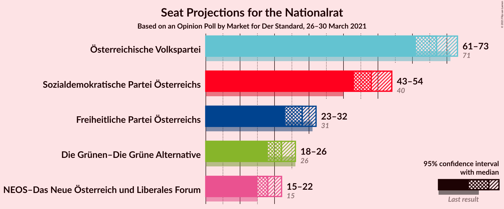
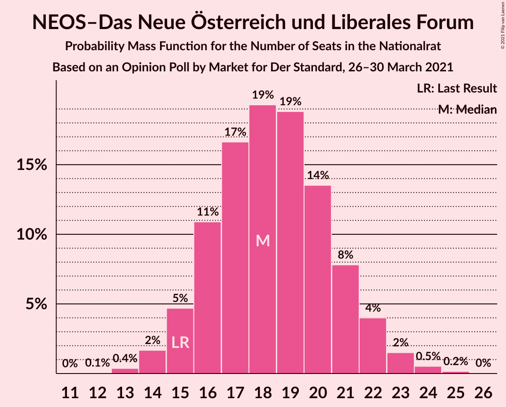
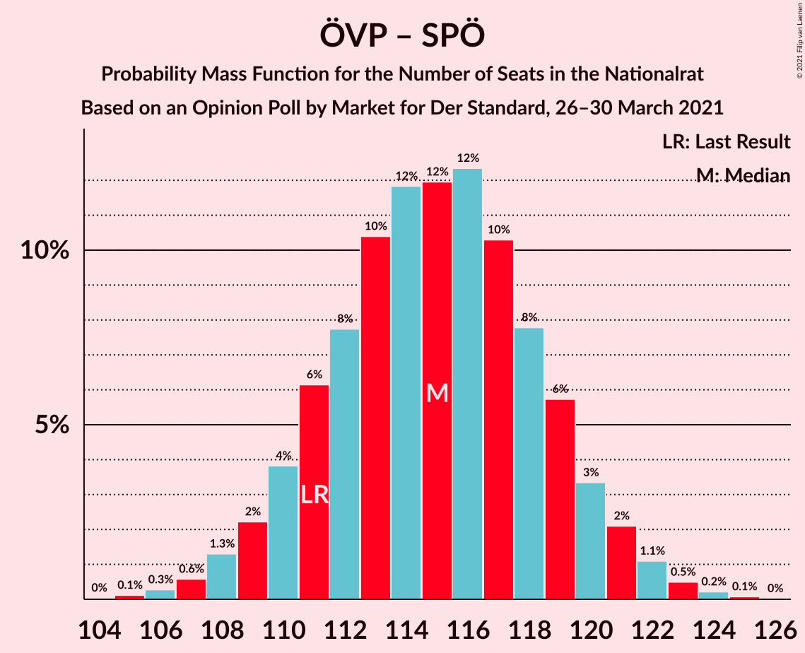
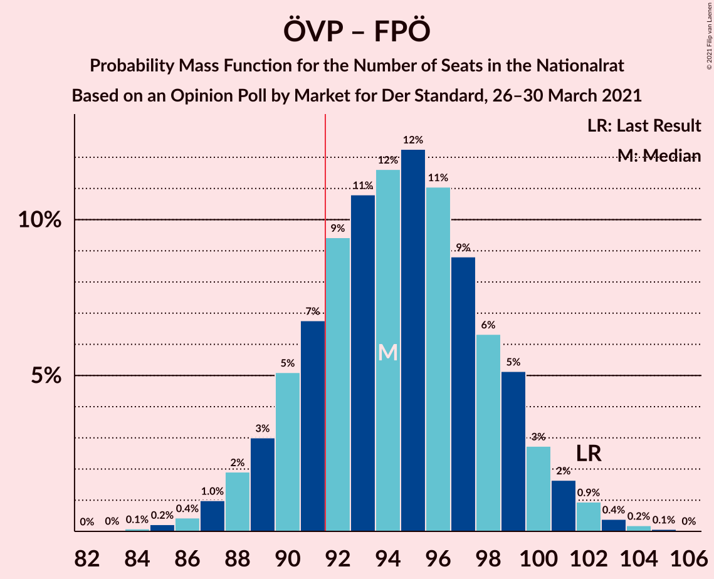
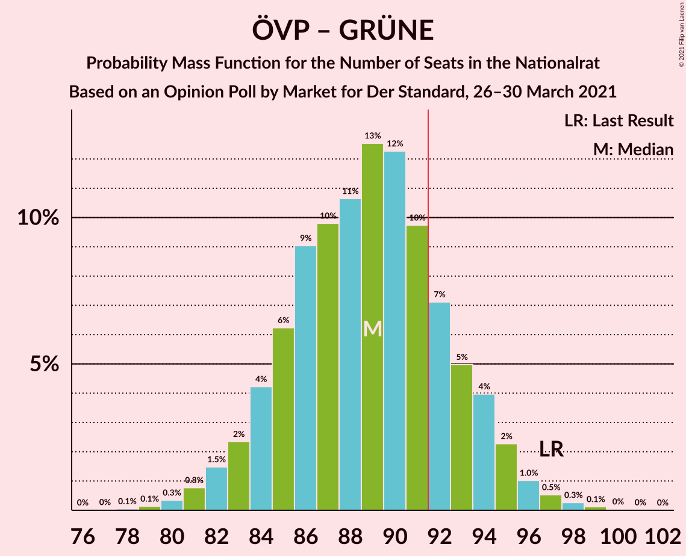
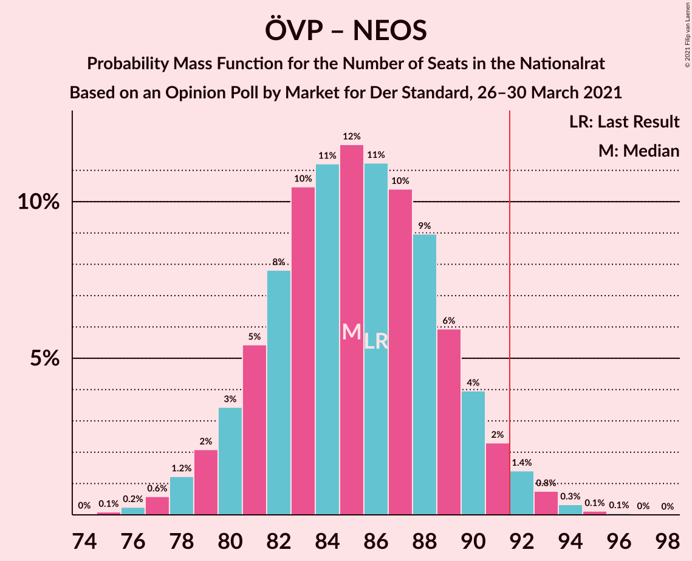

# Opinion Poll by Market for Der Standard, 26–30 March 2021

<a href="#voting-intentions">Voting Intentions</a> | <a href="#seats">Seats</a> | <a href="#coalitions">Coalitions</a> | <a href="#technical-information">Technical Information</a>

## Voting Intentions

### Confidence Intervals

| Party | Last Result | Poll Result | 80% Confidence Interval | 90% Confidence Interval | 95% Confidence Interval | 99% Confidence Interval |
|:-----:|:-----------:|:-----------:|:-----------------------:|:-----------------------:|:-----------------------:|:-----------------------:|
| Österreichische Volkspartei | 37.5% | 36.0% | 33.9–38.2% |33.3–38.9% |32.7–39.4% |31.7–40.5% |
| Sozialdemokratische Partei Österreichs | 21.2% | 26.0% | 24.1–28.1% |23.5–28.7% |23.1–29.2% |22.2–30.2% |
| Freiheitliche Partei Österreichs | 16.2% | 15.0% | 13.5–16.7% |13.0–17.2% |12.7–17.6% |12.0–18.5% |
| Die Grünen–Die Grüne Alternative | 13.9% | 12.0% | 10.6–13.6% |10.2–14.1% |9.9–14.4% |9.3–15.2% |
| NEOS–Das Neue Österreich und Liberales Forum | 8.1% | 10.0% | 8.7–11.5% |8.4–11.9% |8.1–12.3% |7.5–13.0% |

*Note:* The poll result column reflects the actual value used in the calculations. Published results may vary slightly, and in addition be rounded to fewer digits.

## Seats

### Confidence Intervals

| Party | Last Result | Median | 80% Confidence Interval | 90% Confidence Interval | 95% Confidence Interval | 99% Confidence Interval |
|:-----:|:-----------:|:------:|:-----------------------:|:-----------------------:|:-----------------------:|:-----------------------:|
| <a href="#österreichische-volkspartei">Österreichische Volkspartei</a> | 71 | 67 | 63–71 |62–72 |61–73 |59–75 |
| <a href="#sozialdemokratische-partei-österreichs">Sozialdemokratische Partei Österreichs</a> | 40 | 48 | 44–52 |43–53 |43–54 |41–56 |
| <a href="#freiheitliche-partei-österreichs">Freiheitliche Partei Österreichs</a> | 31 | 28 | 25–31 |24–32 |23–32 |22–34 |
| <a href="#die-grünen–die-grüne-alternative">Die Grünen–Die Grüne Alternative</a> | 26 | 22 | 19–25 |19–26 |18–26 |17–28 |
| <a href="#neos–das-neue-österreich-und-liberales-forum">NEOS–Das Neue Österreich und Liberales Forum</a> | 15 | 18 | 16–21 |15–22 |15–22 |14–24 |

### Österreichische Volkspartei

*For a full overview of the results for this party, see the [Österreichische Volkspartei](party-österreichischevolkspartei.html) page.*

| Number of Seats | Probability | Accumulated | Special Marks |
|:---------------:|:-----------:|:-----------:|:-------------:|
| 57 | 0.1% | 100% |  |
| 58 | 0.2% | 99.9% |  |
| 59 | 0.7% | 99.6% |  |
| 60 | 1.2% | 99.0% |  |
| 61 | 2% | 98% |  |
| 62 | 4% | 95% |  |
| 63 | 7% | 92% |  |
| 64 | 8% | 85% |  |
| 65 | 11% | 76% |  |
| 66 | 12% | 66% |  |
| 67 | 13% | 54% | Median |
| 68 | 12% | 41% |  |
| 69 | 9% | 29% |  |
| 70 | 7% | 19% |  |
| 71 | 5% | 12% | Last Result |
| 72 | 3% | 7% |  |
| 73 | 2% | 4% |  |
| 74 | 0.9% | 2% |  |
| 75 | 0.5% | 0.8% |  |
| 76 | 0.2% | 0.3% |  |
| 77 | 0.1% | 0.1% |  |
| 78 | 0% | 0% |  |

### Sozialdemokratische Partei Österreichs

*For a full overview of the results for this party, see the [Sozialdemokratische Partei Österreichs](party-sozialdemokratischeparteiösterreichs.html) page.*

| Number of Seats | Probability | Accumulated | Special Marks |
|:---------------:|:-----------:|:-----------:|:-------------:|
| 39 | 0.1% | 100% |  |
| 40 | 0.2% | 99.9% | Last Result |
| 41 | 0.7% | 99.7% |  |
| 42 | 1.3% | 99.0% |  |
| 43 | 3% | 98% |  |
| 44 | 5% | 95% |  |
| 45 | 7% | 90% |  |
| 46 | 11% | 82% |  |
| 47 | 13% | 71% |  |
| 48 | 13% | 58% | Median |
| 49 | 14% | 45% |  |
| 50 | 10% | 31% |  |
| 51 | 9% | 21% |  |
| 52 | 6% | 12% |  |
| 53 | 3% | 7% |  |
| 54 | 2% | 3% |  |
| 55 | 0.9% | 2% |  |
| 56 | 0.4% | 0.7% |  |
| 57 | 0.2% | 0.3% |  |
| 58 | 0.1% | 0.1% |  |
| 59 | 0% | 0% |  |

### Freiheitliche Partei Österreichs

*For a full overview of the results for this party, see the [Freiheitliche Partei Österreichs](party-freiheitlicheparteiösterreichs.html) page.*

| Number of Seats | Probability | Accumulated | Special Marks |
|:---------------:|:-----------:|:-----------:|:-------------:|
| 20 | 0% | 100% |  |
| 21 | 0.2% | 99.9% |  |
| 22 | 0.8% | 99.7% |  |
| 23 | 3% | 98.9% |  |
| 24 | 5% | 96% |  |
| 25 | 9% | 91% |  |
| 26 | 13% | 82% |  |
| 27 | 16% | 68% |  |
| 28 | 16% | 52% | Median |
| 29 | 14% | 36% |  |
| 30 | 10% | 22% |  |
| 31 | 6% | 11% | Last Result |
| 32 | 3% | 6% |  |
| 33 | 1.5% | 2% |  |
| 34 | 0.6% | 0.9% |  |
| 35 | 0.2% | 0.3% |  |
| 36 | 0.1% | 0.1% |  |
| 37 | 0% | 0% |  |

### Die Grünen–Die Grüne Alternative

*For a full overview of the results for this party, see the [Die Grünen–Die Grüne Alternative](party-diegrünen–diegrünealternative.html) page.*

| Number of Seats | Probability | Accumulated | Special Marks |
|:---------------:|:-----------:|:-----------:|:-------------:|
| 16 | 0.2% | 100% |  |
| 17 | 1.0% | 99.7% |  |
| 18 | 3% | 98.7% |  |
| 19 | 7% | 96% |  |
| 20 | 12% | 89% |  |
| 21 | 17% | 76% |  |
| 22 | 18% | 59% | Median |
| 23 | 16% | 41% |  |
| 24 | 12% | 25% |  |
| 25 | 7% | 13% |  |
| 26 | 3% | 6% | Last Result |
| 27 | 2% | 2% |  |
| 28 | 0.6% | 0.8% |  |
| 29 | 0.2% | 0.2% |  |
| 30 | 0% | 0.1% |  |
| 31 | 0% | 0% |  |

### NEOS–Das Neue Österreich und Liberales Forum

*For a full overview of the results for this party, see the [NEOS–Das Neue Österreich und Liberales Forum](party-neos–dasneueösterreichundliberalesforum.html) page.*

| Number of Seats | Probability | Accumulated | Special Marks |
|:---------------:|:-----------:|:-----------:|:-------------:|
| 12 | 0.1% | 100% |  |
| 13 | 0.4% | 99.9% |  |
| 14 | 2% | 99.6% |  |
| 15 | 5% | 98% | Last Result |
| 16 | 11% | 93% |  |
| 17 | 17% | 82% |  |
| 18 | 19% | 66% | Median |
| 19 | 19% | 46% |  |
| 20 | 14% | 28% |  |
| 21 | 8% | 14% |  |
| 22 | 4% | 6% |  |
| 23 | 2% | 2% |  |
| 24 | 0.5% | 0.7% |  |
| 25 | 0.2% | 0.2% |  |
| 26 | 0% | 0% |  |

## Coalitions

### Confidence Intervals

| Coalition | Last Result | Median | Majority? | 80% Confidence Interval | 90% Confidence Interval | 95% Confidence Interval | 99% Confidence Interval |
|:---------:|:-----------:|:------:|:---------:|:-----------------------:|:-----------------------:|:-----------------------:|:-----------------------:|
| Österreichische Volkspartei – Sozialdemokratische Partei Österreichs | 111 | 115 | 100% | 111–119 | 110–120 | 109–121 | 107–123 |
| Österreichische Volkspartei – Die Grünen–Die Grüne Alternative – NEOS–Das Neue Österreich und Liberales Forum | 112 | 107 | 100% | 103–111 | 102–113 | 101–113 | 99–116 |
| Österreichische Volkspartei – Freiheitliche Partei Österreichs | 102 | 94 | 81% | 90–99 | 89–100 | 88–101 | 86–103 |
| Sozialdemokratische Partei Österreichs – Die Grünen–Die Grüne Alternative – NEOS–Das Neue Österreich und Liberales Forum | 81 | 89 | 19% | 84–93 | 83–94 | 82–95 | 80–97 |
| Österreichische Volkspartei – Die Grünen–Die Grüne Alternative | 97 | 89 | 20% | 85–93 | 83–94 | 82–95 | 80–97 |
| Österreichische Volkspartei – NEOS–Das Neue Österreich und Liberales Forum | 86 | 85 | 3% | 81–89 | 80–90 | 79–92 | 77–94 |
| Sozialdemokratische Partei Österreichs – Freiheitliche Partei Österreichs | 71 | 76 | 0% | 72–80 | 70–81 | 70–82 | 67–84 |
| Sozialdemokratische Partei Österreichs – Die Grünen–Die Grüne Alternative | 66 | 70 | 0% | 66–74 | 65–75 | 64–77 | 62–79 |
| Österreichische Volkspartei | 71 | 67 | 0% | 63–71 | 62–72 | 61–73 | 59–75 |
| Sozialdemokratische Partei Österreichs | 40 | 48 | 0% | 44–52 | 43–53 | 43–54 | 41–56 |

### Österreichische Volkspartei – Sozialdemokratische Partei Österreichs

| Number of Seats | Probability | Accumulated | Special Marks |
|:---------------:|:-----------:|:-----------:|:-------------:|
| 104 | 0% | 100% |  |
| 105 | 0.1% | 99.9% |  |
| 106 | 0.3% | 99.8% |  |
| 107 | 0.6% | 99.5% |  |
| 108 | 1.3% | 99.0% |  |
| 109 | 2% | 98% |  |
| 110 | 4% | 95% |  |
| 111 | 6% | 92% | Last Result |
| 112 | 8% | 85% |  |
| 113 | 10% | 78% |  |
| 114 | 12% | 67% |  |
| 115 | 12% | 55% | Median |
| 116 | 12% | 44% |  |
| 117 | 10% | 31% |  |
| 118 | 8% | 21% |  |
| 119 | 6% | 13% |  |
| 120 | 3% | 7% |  |
| 121 | 2% | 4% |  |
| 122 | 1.1% | 2% |  |
| 123 | 0.5% | 0.8% |  |
| 124 | 0.2% | 0.3% |  |
| 125 | 0.1% | 0.1% |  |
| 126 | 0% | 0% |  |

### Österreichische Volkspartei – Die Grünen–Die Grüne Alternative – NEOS–Das Neue Österreich und Liberales Forum

| Number of Seats | Probability | Accumulated | Special Marks |
|:---------------:|:-----------:|:-----------:|:-------------:|
| 96 | 0% | 100% |  |
| 97 | 0.1% | 99.9% |  |
| 98 | 0.2% | 99.9% |  |
| 99 | 0.6% | 99.7% |  |
| 100 | 1.2% | 99.0% |  |
| 101 | 2% | 98% |  |
| 102 | 3% | 96% |  |
| 103 | 6% | 93% |  |
| 104 | 9% | 88% |  |
| 105 | 10% | 79% |  |
| 106 | 9% | 69% |  |
| 107 | 12% | 59% | Median |
| 108 | 13% | 48% |  |
| 109 | 12% | 34% |  |
| 110 | 7% | 23% |  |
| 111 | 6% | 15% |  |
| 112 | 5% | 10% | Last Result |
| 113 | 3% | 5% |  |
| 114 | 1.2% | 2% |  |
| 115 | 0.6% | 1.1% |  |
| 116 | 0.3% | 0.5% |  |
| 117 | 0.1% | 0.2% |  |
| 118 | 0% | 0.1% |  |
| 119 | 0% | 0% |  |

### Österreichische Volkspartei – Freiheitliche Partei Österreichs

| Number of Seats | Probability | Accumulated | Special Marks |
|:---------------:|:-----------:|:-----------:|:-------------:|
| 84 | 0.1% | 100% |  |
| 85 | 0.2% | 99.9% |  |
| 86 | 0.4% | 99.6% |  |
| 87 | 1.0% | 99.2% |  |
| 88 | 2% | 98% |  |
| 89 | 3% | 96% |  |
| 90 | 5% | 93% |  |
| 91 | 7% | 88% |  |
| 92 | 9% | 81% | Majority |
| 93 | 11% | 72% |  |
| 94 | 12% | 61% |  |
| 95 | 12% | 50% | Median |
| 96 | 11% | 37% |  |
| 97 | 9% | 26% |  |
| 98 | 6% | 17% |  |
| 99 | 5% | 11% |  |
| 100 | 3% | 6% |  |
| 101 | 2% | 3% |  |
| 102 | 0.9% | 2% | Last Result |
| 103 | 0.4% | 0.7% |  |
| 104 | 0.2% | 0.3% |  |
| 105 | 0.1% | 0.1% |  |
| 106 | 0% | 0% |  |

### Sozialdemokratische Partei Österreichs – Die Grünen–Die Grüne Alternative – NEOS–Das Neue Österreich und Liberales Forum

| Number of Seats | Probability | Accumulated | Special Marks |
|:---------------:|:-----------:|:-----------:|:-------------:|
| 78 | 0.1% | 100% |  |
| 79 | 0.2% | 99.9% |  |
| 80 | 0.4% | 99.7% |  |
| 81 | 0.9% | 99.3% | Last Result |
| 82 | 2% | 98% |  |
| 83 | 3% | 97% |  |
| 84 | 5% | 94% |  |
| 85 | 6% | 89% |  |
| 86 | 9% | 83% |  |
| 87 | 11% | 74% |  |
| 88 | 12% | 63% | Median |
| 89 | 12% | 50% |  |
| 90 | 11% | 39% |  |
| 91 | 9% | 28% |  |
| 92 | 7% | 19% | Majority |
| 93 | 5% | 12% |  |
| 94 | 3% | 7% |  |
| 95 | 2% | 4% |  |
| 96 | 1.0% | 2% |  |
| 97 | 0.4% | 0.8% |  |
| 98 | 0.2% | 0.4% |  |
| 99 | 0.1% | 0.1% |  |
| 100 | 0% | 0% |  |

### Österreichische Volkspartei – Die Grünen–Die Grüne Alternative

| Number of Seats | Probability | Accumulated | Special Marks |
|:---------------:|:-----------:|:-----------:|:-------------:|
| 78 | 0.1% | 100% |  |
| 79 | 0.1% | 99.9% |  |
| 80 | 0.3% | 99.8% |  |
| 81 | 0.8% | 99.4% |  |
| 82 | 1.5% | 98.7% |  |
| 83 | 2% | 97% |  |
| 84 | 4% | 95% |  |
| 85 | 6% | 91% |  |
| 86 | 9% | 84% |  |
| 87 | 10% | 75% |  |
| 88 | 11% | 66% |  |
| 89 | 13% | 55% | Median |
| 90 | 12% | 42% |  |
| 91 | 10% | 30% |  |
| 92 | 7% | 20% | Majority |
| 93 | 5% | 13% |  |
| 94 | 4% | 8% |  |
| 95 | 2% | 4% |  |
| 96 | 1.0% | 2% |  |
| 97 | 0.5% | 1.0% | Last Result |
| 98 | 0.3% | 0.4% |  |
| 99 | 0.1% | 0.2% |  |
| 100 | 0% | 0.1% |  |
| 101 | 0% | 0% |  |

### Österreichische Volkspartei – NEOS–Das Neue Österreich und Liberales Forum

| Number of Seats | Probability | Accumulated | Special Marks |
|:---------------:|:-----------:|:-----------:|:-------------:|
| 74 | 0% | 100% |  |
| 75 | 0.1% | 99.9% |  |
| 76 | 0.2% | 99.8% |  |
| 77 | 0.6% | 99.6% |  |
| 78 | 1.2% | 99.0% |  |
| 79 | 2% | 98% |  |
| 80 | 3% | 96% |  |
| 81 | 5% | 92% |  |
| 82 | 8% | 87% |  |
| 83 | 10% | 79% |  |
| 84 | 11% | 69% |  |
| 85 | 12% | 57% | Median |
| 86 | 11% | 46% | Last Result |
| 87 | 10% | 34% |  |
| 88 | 9% | 24% |  |
| 89 | 6% | 15% |  |
| 90 | 4% | 9% |  |
| 91 | 2% | 5% |  |
| 92 | 1.4% | 3% | Majority |
| 93 | 0.8% | 1.3% |  |
| 94 | 0.3% | 0.5% |  |
| 95 | 0.1% | 0.2% |  |
| 96 | 0.1% | 0.1% |  |
| 97 | 0% | 0% |  |

### Sozialdemokratische Partei Österreichs – Freiheitliche Partei Österreichs

| Number of Seats | Probability | Accumulated | Special Marks |
|:---------------:|:-----------:|:-----------:|:-------------:|
| 65 | 0% | 100% |  |
| 66 | 0.1% | 99.9% |  |
| 67 | 0.3% | 99.8% |  |
| 68 | 0.6% | 99.5% |  |
| 69 | 1.2% | 98.9% |  |
| 70 | 3% | 98% |  |
| 71 | 5% | 95% | Last Result |
| 72 | 6% | 90% |  |
| 73 | 7% | 85% |  |
| 74 | 12% | 77% |  |
| 75 | 13% | 66% |  |
| 76 | 12% | 52% | Median |
| 77 | 9% | 41% |  |
| 78 | 10% | 31% |  |
| 79 | 9% | 21% |  |
| 80 | 6% | 12% |  |
| 81 | 3% | 7% |  |
| 82 | 2% | 4% |  |
| 83 | 1.2% | 2% |  |
| 84 | 0.6% | 1.0% |  |
| 85 | 0.2% | 0.3% |  |
| 86 | 0.1% | 0.1% |  |
| 87 | 0% | 0.1% |  |
| 88 | 0% | 0% |  |

### Sozialdemokratische Partei Österreichs – Die Grünen–Die Grüne Alternative

| Number of Seats | Probability | Accumulated | Special Marks |
|:---------------:|:-----------:|:-----------:|:-------------:|
| 60 | 0.1% | 100% |  |
| 61 | 0.2% | 99.9% |  |
| 62 | 0.5% | 99.7% |  |
| 63 | 1.0% | 99.3% |  |
| 64 | 2% | 98% |  |
| 65 | 3% | 96% |  |
| 66 | 5% | 93% | Last Result |
| 67 | 8% | 88% |  |
| 68 | 10% | 80% |  |
| 69 | 12% | 70% |  |
| 70 | 12% | 58% | Median |
| 71 | 12% | 46% |  |
| 72 | 10% | 34% |  |
| 73 | 9% | 24% |  |
| 74 | 6% | 15% |  |
| 75 | 4% | 9% |  |
| 76 | 2% | 5% |  |
| 77 | 1.4% | 3% |  |
| 78 | 0.7% | 1.2% |  |
| 79 | 0.3% | 0.5% |  |
| 80 | 0.1% | 0.2% |  |
| 81 | 0.1% | 0.1% |  |
| 82 | 0% | 0% |  |

### Österreichische Volkspartei

| Number of Seats | Probability | Accumulated | Special Marks |
|:---------------:|:-----------:|:-----------:|:-------------:|
| 57 | 0.1% | 100% |  |
| 58 | 0.2% | 99.9% |  |
| 59 | 0.7% | 99.6% |  |
| 60 | 1.2% | 99.0% |  |
| 61 | 2% | 98% |  |
| 62 | 4% | 95% |  |
| 63 | 7% | 92% |  |
| 64 | 8% | 85% |  |
| 65 | 11% | 76% |  |
| 66 | 12% | 66% |  |
| 67 | 13% | 54% | Median |
| 68 | 12% | 41% |  |
| 69 | 9% | 29% |  |
| 70 | 7% | 19% |  |
| 71 | 5% | 12% | Last Result |
| 72 | 3% | 7% |  |
| 73 | 2% | 4% |  |
| 74 | 0.9% | 2% |  |
| 75 | 0.5% | 0.8% |  |
| 76 | 0.2% | 0.3% |  |
| 77 | 0.1% | 0.1% |  |
| 78 | 0% | 0% |  |

### Sozialdemokratische Partei Österreichs

| Number of Seats | Probability | Accumulated | Special Marks |
|:---------------:|:-----------:|:-----------:|:-------------:|
| 39 | 0.1% | 100% |  |
| 40 | 0.2% | 99.9% | Last Result |
| 41 | 0.7% | 99.7% |  |
| 42 | 1.3% | 99.0% |  |
| 43 | 3% | 98% |  |
| 44 | 5% | 95% |  |
| 45 | 7% | 90% |  |
| 46 | 11% | 82% |  |
| 47 | 13% | 71% |  |
| 48 | 13% | 58% | Median |
| 49 | 14% | 45% |  |
| 50 | 10% | 31% |  |
| 51 | 9% | 21% |  |
| 52 | 6% | 12% |  |
| 53 | 3% | 7% |  |
| 54 | 2% | 3% |  |
| 55 | 0.9% | 2% |  |
| 56 | 0.4% | 0.7% |  |
| 57 | 0.2% | 0.3% |  |
| 58 | 0.1% | 0.1% |  |
| 59 | 0% | 0% |  |

## Technical Information

### Opinion Poll

+ **Polling firm:** Market
+ **Commissioner(s):** Der Standard
+ **Fieldwork period:** 26–30 March 2021

### Calculations

+ **Sample size:** 800
+ **Simulations done:** 1,048,576
+ **Error estimate:** 0.37%

