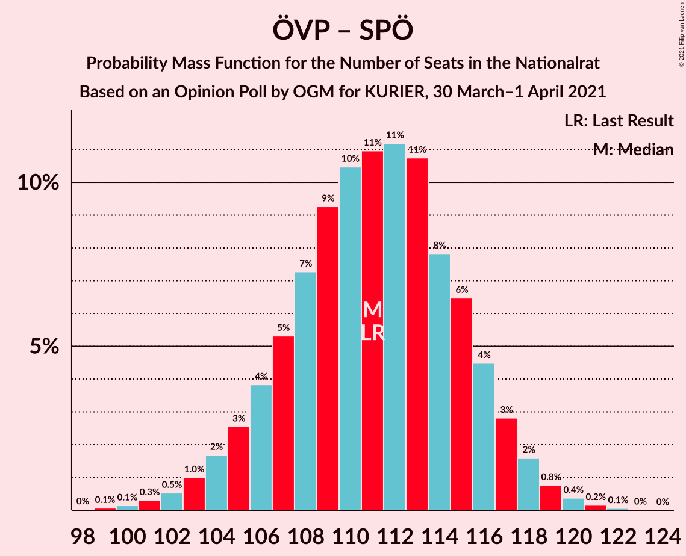
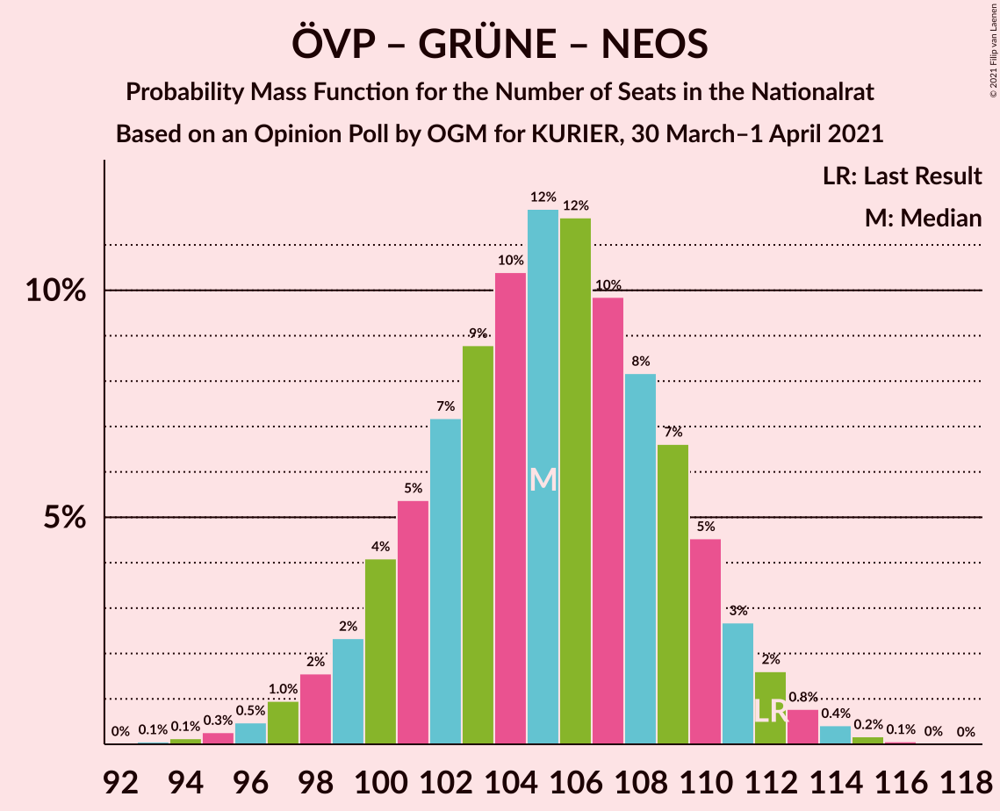
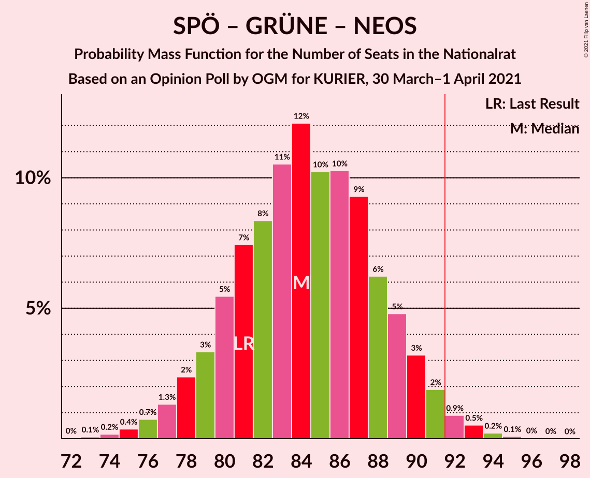
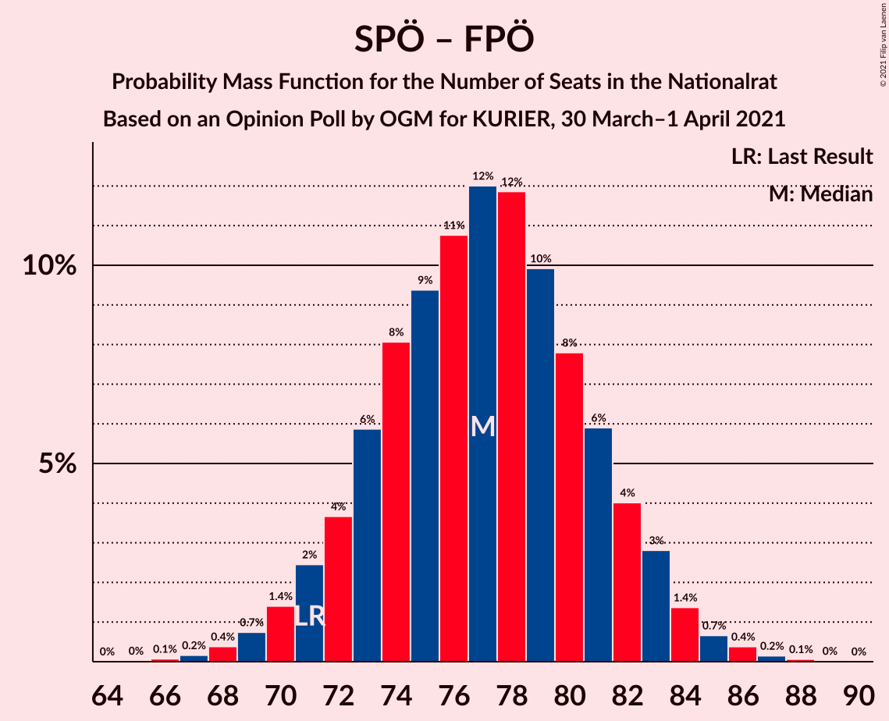
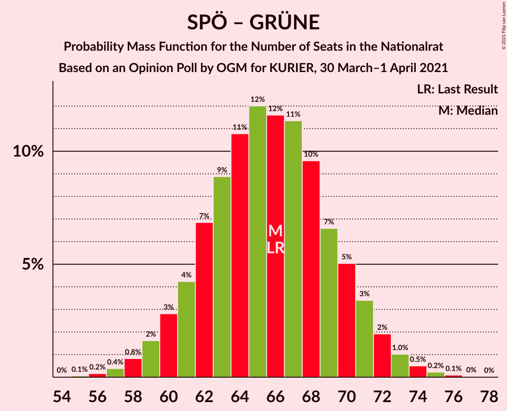

# Opinion Poll by OGM for KURIER, 30 March–1 April 2021

<a href="#voting-intentions">Voting Intentions</a> | <a href="#seats">Seats</a> | <a href="#coalitions">Coalitions</a> | <a href="#technical-information">Technical Information</a>

## Voting Intentions

### Confidence Intervals

| Party | Last Result | Poll Result | 80% Confidence Interval | 90% Confidence Interval | 95% Confidence Interval | 99% Confidence Interval |
|:-----:|:-----------:|:-----------:|:-----------------------:|:-----------------------:|:-----------------------:|:-----------------------:|
| Österreichische Volkspartei | 37.5% | 35.0% | 32.8–37.2% |32.2–37.8% |31.7–38.3% |30.7–39.4% |
| Sozialdemokratische Partei Österreichs | 21.2% | 24.0% | 22.1–26.0% |21.6–26.6% |21.1–27.1% |20.3–28.0% |
| Freiheitliche Partei Österreichs | 16.2% | 17.0% | 15.4–18.8% |14.9–19.3% |14.5–19.7% |13.8–20.6% |
| Die Grünen–Die Grüne Alternative | 13.9% | 11.0% | 9.7–12.5% |9.3–13.0% |9.0–13.4% |8.4–14.1% |
| NEOS–Das Neue Österreich und Liberales Forum | 8.1% | 10.0% | 8.7–11.5% |8.4–11.9% |8.1–12.3% |7.5–13.0% |

*Note:* The poll result column reflects the actual value used in the calculations. Published results may vary slightly, and in addition be rounded to fewer digits.

## Seats

### Confidence Intervals

| Party | Last Result | Median | 80% Confidence Interval | 90% Confidence Interval | 95% Confidence Interval | 99% Confidence Interval |
|:-----:|:-----------:|:------:|:-----------------------:|:-----------------------:|:-----------------------:|:-----------------------:|
| <a href="#österreichische-volkspartei">Österreichische Volkspartei</a> | 71 | 66 | 62–70 |61–71 |60–73 |57–74 |
| <a href="#sozialdemokratische-partei-österreichs">Sozialdemokratische Partei Österreichs</a> | 40 | 45 | 42–49 |41–50 |40–51 |38–53 |
| <a href="#freiheitliche-partei-österreichs">Freiheitliche Partei Österreichs</a> | 31 | 32 | 29–35 |28–36 |27–37 |26–39 |
| <a href="#die-grünen–die-grüne-alternative">Die Grünen–Die Grüne Alternative</a> | 26 | 20 | 19–22 |18–25 |18–26 |15–26 |
| <a href="#neos–das-neue-österreich-und-liberales-forum">NEOS–Das Neue Österreich und Liberales Forum</a> | 15 | 18 | 16–21 |16–22 |15–23 |14–24 |

### Österreichische Volkspartei

*For a full overview of the results for this party, see the [Österreichische Volkspartei](party-österreichischevolkspartei.html) page.*

| Number of Seats | Probability | Accumulated | Special Marks |
|:---------------:|:-----------:|:-----------:|:-------------:|
| 55 | 0% | 100% |  |
| 56 | 0.1% | 99.9% |  |
| 57 | 0.4% | 99.8% |  |
| 58 | 0.6% | 99.5% |  |
| 59 | 1.0% | 98.9% |  |
| 60 | 3% | 98% |  |
| 61 | 5% | 95% |  |
| 62 | 4% | 91% |  |
| 63 | 8% | 86% |  |
| 64 | 12% | 79% |  |
| 65 | 12% | 66% |  |
| 66 | 10% | 55% | Median |
| 67 | 12% | 45% |  |
| 68 | 10% | 33% |  |
| 69 | 7% | 22% |  |
| 70 | 6% | 15% |  |
| 71 | 4% | 9% | Last Result |
| 72 | 2% | 5% |  |
| 73 | 1.5% | 3% |  |
| 74 | 0.8% | 1.1% |  |
| 75 | 0.2% | 0.4% |  |
| 76 | 0.1% | 0.2% |  |
| 77 | 0.1% | 0.1% |  |
| 78 | 0% | 0% |  |

### Sozialdemokratische Partei Österreichs

*For a full overview of the results for this party, see the [Sozialdemokratische Partei Österreichs](party-sozialdemokratischeparteiösterreichs.html) page.*

| Number of Seats | Probability | Accumulated | Special Marks |
|:---------------:|:-----------:|:-----------:|:-------------:|
| 36 | 0.1% | 100% |  |
| 37 | 0.2% | 99.9% |  |
| 38 | 0.6% | 99.7% |  |
| 39 | 1.3% | 99.2% |  |
| 40 | 3% | 98% | Last Result |
| 41 | 5% | 95% |  |
| 42 | 7% | 91% |  |
| 43 | 10% | 83% |  |
| 44 | 13% | 73% |  |
| 45 | 16% | 60% | Median |
| 46 | 12% | 44% |  |
| 47 | 11% | 32% |  |
| 48 | 8% | 21% |  |
| 49 | 6% | 12% |  |
| 50 | 3% | 7% |  |
| 51 | 2% | 3% |  |
| 52 | 0.9% | 2% |  |
| 53 | 0.4% | 0.6% |  |
| 54 | 0.2% | 0.2% |  |
| 55 | 0.1% | 0.1% |  |
| 56 | 0% | 0% |  |

### Freiheitliche Partei Österreichs

*For a full overview of the results for this party, see the [Freiheitliche Partei Österreichs](party-freiheitlicheparteiösterreichs.html) page.*

| Number of Seats | Probability | Accumulated | Special Marks |
|:---------------:|:-----------:|:-----------:|:-------------:|
| 24 | 0.1% | 100% |  |
| 25 | 0.3% | 99.9% |  |
| 26 | 0.8% | 99.7% |  |
| 27 | 2% | 98.8% |  |
| 28 | 4% | 97% |  |
| 29 | 9% | 92% |  |
| 30 | 10% | 83% |  |
| 31 | 16% | 73% | Last Result |
| 32 | 16% | 57% | Median |
| 33 | 12% | 41% |  |
| 34 | 14% | 29% |  |
| 35 | 6% | 15% |  |
| 36 | 5% | 9% |  |
| 37 | 2% | 4% |  |
| 38 | 0.7% | 1.4% |  |
| 39 | 0.5% | 0.7% |  |
| 40 | 0.1% | 0.2% |  |
| 41 | 0% | 0.1% |  |
| 42 | 0% | 0% |  |

### Die Grünen–Die Grüne Alternative

*For a full overview of the results for this party, see the [Die Grünen–Die Grüne Alternative](party-diegrünen–diegrünealternative.html) page.*

| Number of Seats | Probability | Accumulated | Special Marks |
|:---------------:|:-----------:|:-----------:|:-------------:|
| 14 | 0.2% | 100% |  |
| 15 | 0.4% | 99.8% |  |
| 16 | 0.4% | 99.4% |  |
| 17 | 0.2% | 99.0% |  |
| 18 | 4% | 98.8% |  |
| 19 | 25% | 95% |  |
| 20 | 40% | 70% | Median |
| 21 | 20% | 30% |  |
| 22 | 4% | 10% |  |
| 23 | 0.3% | 7% |  |
| 24 | 0.9% | 6% |  |
| 25 | 3% | 5% |  |
| 26 | 2% | 3% | Last Result |
| 27 | 0.4% | 0.4% |  |
| 28 | 0% | 0% |  |

### NEOS–Das Neue Österreich und Liberales Forum

*For a full overview of the results for this party, see the [NEOS–Das Neue Österreich und Liberales Forum](party-neos–dasneueösterreichundliberalesforum.html) page.*

| Number of Seats | Probability | Accumulated | Special Marks |
|:---------------:|:-----------:|:-----------:|:-------------:|
| 13 | 0.2% | 100% |  |
| 14 | 1.3% | 99.8% |  |
| 15 | 3% | 98% | Last Result |
| 16 | 10% | 95% |  |
| 17 | 12% | 86% |  |
| 18 | 24% | 74% | Median |
| 19 | 15% | 50% |  |
| 20 | 19% | 35% |  |
| 21 | 8% | 17% |  |
| 22 | 5% | 8% |  |
| 23 | 2% | 3% |  |
| 24 | 0.9% | 1.2% |  |
| 25 | 0.2% | 0.3% |  |
| 26 | 0.1% | 0.1% |  |
| 27 | 0% | 0% |  |

## Coalitions

### Confidence Intervals

| Coalition | Last Result | Median | Majority? | 80% Confidence Interval | 90% Confidence Interval | 95% Confidence Interval | 99% Confidence Interval |
|:---------:|:-----------:|:------:|:---------:|:-----------------------:|:-----------------------:|:-----------------------:|:-----------------------:|
| Österreichische Volkspartei – Sozialdemokratische Partei Österreichs | 111 | 111 | 100% | 107–116 | 105–117 | 104–118 | 102–120 |
| Österreichische Volkspartei – Die Grünen–Die Grüne Alternative – NEOS–Das Neue Österreich und Liberales Forum | 112 | 105 | 100% | 100–109 | 99–110 | 98–111 | 96–113 |
| Österreichische Volkspartei – Freiheitliche Partei Österreichs | 102 | 98 | 97% | 93–102 | 92–103 | 91–105 | 89–106 |
| Österreichische Volkspartei – Die Grünen–Die Grüne Alternative | 97 | 86 | 6% | 82–90 | 81–92 | 80–93 | 78–95 |
| Österreichische Volkspartei – NEOS–Das Neue Österreich und Liberales Forum | 86 | 85 | 2% | 80–89 | 79–90 | 78–91 | 76–93 |
| Sozialdemokratische Partei Österreichs – Die Grünen–Die Grüne Alternative – NEOS–Das Neue Österreich und Liberales Forum | 81 | 84 | 1.5% | 80–89 | 78–90 | 77–91 | 75–93 |
| Sozialdemokratische Partei Österreichs – Freiheitliche Partei Österreichs | 71 | 77 | 0% | 73–81 | 72–83 | 71–83 | 68–85 |
| Österreichische Volkspartei | 71 | 66 | 0% | 62–70 | 61–71 | 60–73 | 57–74 |
| Sozialdemokratische Partei Österreichs – Die Grünen–Die Grüne Alternative | 66 | 65 | 0% | 61–70 | 60–71 | 59–72 | 57–74 |
| Sozialdemokratische Partei Österreichs | 40 | 45 | 0% | 42–49 | 41–50 | 40–51 | 38–53 |

### Österreichische Volkspartei – Sozialdemokratische Partei Österreichs

| Number of Seats | Probability | Accumulated | Special Marks |
|:---------------:|:-----------:|:-----------:|:-------------:|
| 99 | 0.1% | 100% |  |
| 100 | 0.2% | 99.9% |  |
| 101 | 0.2% | 99.7% |  |
| 102 | 0.4% | 99.5% |  |
| 103 | 0.8% | 99.1% |  |
| 104 | 2% | 98% |  |
| 105 | 3% | 97% |  |
| 106 | 4% | 94% |  |
| 107 | 4% | 90% |  |
| 108 | 7% | 86% |  |
| 109 | 11% | 79% |  |
| 110 | 11% | 68% |  |
| 111 | 9% | 58% | Last Result, Median |
| 112 | 9% | 49% |  |
| 113 | 15% | 39% |  |
| 114 | 6% | 24% |  |
| 115 | 6% | 18% |  |
| 116 | 6% | 12% |  |
| 117 | 3% | 6% |  |
| 118 | 2% | 3% |  |
| 119 | 0.8% | 1.4% |  |
| 120 | 0.3% | 0.5% |  |
| 121 | 0.2% | 0.3% |  |
| 122 | 0.1% | 0.1% |  |
| 123 | 0% | 0% |  |

### Österreichische Volkspartei – Die Grünen–Die Grüne Alternative – NEOS–Das Neue Österreich und Liberales Forum

| Number of Seats | Probability | Accumulated | Special Marks |
|:---------------:|:-----------:|:-----------:|:-------------:|
| 93 | 0% | 100% |  |
| 94 | 0.1% | 99.9% |  |
| 95 | 0.2% | 99.8% |  |
| 96 | 0.5% | 99.6% |  |
| 97 | 0.8% | 99.1% |  |
| 98 | 1.4% | 98% |  |
| 99 | 3% | 97% |  |
| 100 | 4% | 94% |  |
| 101 | 4% | 90% |  |
| 102 | 8% | 85% |  |
| 103 | 10% | 78% |  |
| 104 | 13% | 68% | Median |
| 105 | 12% | 55% |  |
| 106 | 10% | 43% |  |
| 107 | 12% | 33% |  |
| 108 | 7% | 21% |  |
| 109 | 5% | 14% |  |
| 110 | 4% | 9% |  |
| 111 | 2% | 5% |  |
| 112 | 1.3% | 2% | Last Result |
| 113 | 0.7% | 1.2% |  |
| 114 | 0.2% | 0.5% |  |
| 115 | 0.2% | 0.2% |  |
| 116 | 0.1% | 0.1% |  |
| 117 | 0% | 0% |  |

### Österreichische Volkspartei – Freiheitliche Partei Österreichs

| Number of Seats | Probability | Accumulated | Special Marks |
|:---------------:|:-----------:|:-----------:|:-------------:|
| 86 | 0.1% | 100% |  |
| 87 | 0.1% | 99.9% |  |
| 88 | 0.3% | 99.8% |  |
| 89 | 0.5% | 99.5% |  |
| 90 | 1.2% | 99.0% |  |
| 91 | 1.0% | 98% |  |
| 92 | 3% | 97% | Majority |
| 93 | 4% | 93% |  |
| 94 | 5% | 89% |  |
| 95 | 7% | 84% |  |
| 96 | 10% | 77% |  |
| 97 | 12% | 67% |  |
| 98 | 7% | 55% | Median |
| 99 | 13% | 48% |  |
| 100 | 11% | 36% |  |
| 101 | 6% | 24% |  |
| 102 | 9% | 18% | Last Result |
| 103 | 5% | 9% |  |
| 104 | 1.4% | 4% |  |
| 105 | 1.3% | 3% |  |
| 106 | 0.9% | 1.4% |  |
| 107 | 0.3% | 0.5% |  |
| 108 | 0.1% | 0.2% |  |
| 109 | 0.1% | 0.1% |  |
| 110 | 0% | 0% |  |

### Österreichische Volkspartei – Die Grünen–Die Grüne Alternative

| Number of Seats | Probability | Accumulated | Special Marks |
|:---------------:|:-----------:|:-----------:|:-------------:|
| 75 | 0% | 100% |  |
| 76 | 0.1% | 99.9% |  |
| 77 | 0.2% | 99.8% |  |
| 78 | 0.5% | 99.6% |  |
| 79 | 0.7% | 99.2% |  |
| 80 | 2% | 98% |  |
| 81 | 2% | 97% |  |
| 82 | 6% | 95% |  |
| 83 | 6% | 89% |  |
| 84 | 11% | 82% |  |
| 85 | 14% | 71% |  |
| 86 | 11% | 58% | Median |
| 87 | 15% | 46% |  |
| 88 | 8% | 31% |  |
| 89 | 8% | 23% |  |
| 90 | 7% | 15% |  |
| 91 | 3% | 8% |  |
| 92 | 3% | 6% | Majority |
| 93 | 1.1% | 3% |  |
| 94 | 0.7% | 2% |  |
| 95 | 0.5% | 0.8% |  |
| 96 | 0.2% | 0.4% |  |
| 97 | 0.1% | 0.2% | Last Result |
| 98 | 0% | 0.1% |  |
| 99 | 0% | 0% |  |

### Österreichische Volkspartei – NEOS–Das Neue Österreich und Liberales Forum

| Number of Seats | Probability | Accumulated | Special Marks |
|:---------------:|:-----------:|:-----------:|:-------------:|
| 73 | 0.1% | 100% |  |
| 74 | 0.1% | 99.9% |  |
| 75 | 0.2% | 99.8% |  |
| 76 | 0.6% | 99.6% |  |
| 77 | 1.1% | 99.0% |  |
| 78 | 2% | 98% |  |
| 79 | 4% | 96% |  |
| 80 | 4% | 93% |  |
| 81 | 5% | 88% |  |
| 82 | 10% | 83% |  |
| 83 | 9% | 73% |  |
| 84 | 11% | 64% | Median |
| 85 | 12% | 53% |  |
| 86 | 10% | 41% | Last Result |
| 87 | 10% | 31% |  |
| 88 | 8% | 21% |  |
| 89 | 5% | 13% |  |
| 90 | 3% | 8% |  |
| 91 | 3% | 5% |  |
| 92 | 1.2% | 2% | Majority |
| 93 | 0.6% | 1.1% |  |
| 94 | 0.3% | 0.5% |  |
| 95 | 0.1% | 0.2% |  |
| 96 | 0.1% | 0.1% |  |
| 97 | 0% | 0% |  |

### Sozialdemokratische Partei Österreichs – Die Grünen–Die Grüne Alternative – NEOS–Das Neue Österreich und Liberales Forum

| Number of Seats | Probability | Accumulated | Special Marks |
|:---------------:|:-----------:|:-----------:|:-------------:|
| 73 | 0.1% | 100% |  |
| 74 | 0.2% | 99.9% |  |
| 75 | 0.3% | 99.7% |  |
| 76 | 0.8% | 99.4% |  |
| 77 | 1.4% | 98.7% |  |
| 78 | 2% | 97% |  |
| 79 | 3% | 95% |  |
| 80 | 6% | 92% |  |
| 81 | 10% | 86% | Last Result |
| 82 | 7% | 76% |  |
| 83 | 12% | 68% | Median |
| 84 | 14% | 56% |  |
| 85 | 6% | 43% |  |
| 86 | 11% | 37% |  |
| 87 | 10% | 26% |  |
| 88 | 6% | 16% |  |
| 89 | 4% | 11% |  |
| 90 | 3% | 7% |  |
| 91 | 2% | 4% |  |
| 92 | 0.5% | 1.5% | Majority |
| 93 | 0.6% | 0.9% |  |
| 94 | 0.2% | 0.3% |  |
| 95 | 0.1% | 0.1% |  |
| 96 | 0% | 0.1% |  |
| 97 | 0% | 0% |  |

### Sozialdemokratische Partei Österreichs – Freiheitliche Partei Österreichs

| Number of Seats | Probability | Accumulated | Special Marks |
|:---------------:|:-----------:|:-----------:|:-------------:|
| 66 | 0% | 100% |  |
| 67 | 0.1% | 99.9% |  |
| 68 | 0.3% | 99.8% |  |
| 69 | 0.5% | 99.5% |  |
| 70 | 1.1% | 98.9% |  |
| 71 | 2% | 98% | Last Result |
| 72 | 3% | 96% |  |
| 73 | 6% | 93% |  |
| 74 | 6% | 87% |  |
| 75 | 8% | 81% |  |
| 76 | 14% | 72% |  |
| 77 | 11% | 59% | Median |
| 78 | 12% | 48% |  |
| 79 | 13% | 36% |  |
| 80 | 9% | 23% |  |
| 81 | 6% | 15% |  |
| 82 | 3% | 9% |  |
| 83 | 3% | 5% |  |
| 84 | 1.4% | 2% |  |
| 85 | 0.5% | 1.0% |  |
| 86 | 0.3% | 0.4% |  |
| 87 | 0.1% | 0.2% |  |
| 88 | 0.1% | 0.1% |  |
| 89 | 0% | 0% |  |

### Österreichische Volkspartei

| Number of Seats | Probability | Accumulated | Special Marks |
|:---------------:|:-----------:|:-----------:|:-------------:|
| 55 | 0% | 100% |  |
| 56 | 0.1% | 99.9% |  |
| 57 | 0.4% | 99.8% |  |
| 58 | 0.6% | 99.5% |  |
| 59 | 1.0% | 98.9% |  |
| 60 | 3% | 98% |  |
| 61 | 5% | 95% |  |
| 62 | 4% | 91% |  |
| 63 | 8% | 86% |  |
| 64 | 12% | 79% |  |
| 65 | 12% | 66% |  |
| 66 | 10% | 55% | Median |
| 67 | 12% | 45% |  |
| 68 | 10% | 33% |  |
| 69 | 7% | 22% |  |
| 70 | 6% | 15% |  |
| 71 | 4% | 9% | Last Result |
| 72 | 2% | 5% |  |
| 73 | 1.5% | 3% |  |
| 74 | 0.8% | 1.1% |  |
| 75 | 0.2% | 0.4% |  |
| 76 | 0.1% | 0.2% |  |
| 77 | 0.1% | 0.1% |  |
| 78 | 0% | 0% |  |

### Sozialdemokratische Partei Österreichs – Die Grünen–Die Grüne Alternative

| Number of Seats | Probability | Accumulated | Special Marks |
|:---------------:|:-----------:|:-----------:|:-------------:|
| 55 | 0% | 100% |  |
| 56 | 0.2% | 99.9% |  |
| 57 | 0.3% | 99.8% |  |
| 58 | 0.7% | 99.4% |  |
| 59 | 1.4% | 98.7% |  |
| 60 | 3% | 97% |  |
| 61 | 5% | 94% |  |
| 62 | 6% | 90% |  |
| 63 | 10% | 83% |  |
| 64 | 14% | 74% |  |
| 65 | 12% | 60% | Median |
| 66 | 11% | 48% | Last Result |
| 67 | 11% | 36% |  |
| 68 | 9% | 26% |  |
| 69 | 6% | 16% |  |
| 70 | 4% | 10% |  |
| 71 | 3% | 6% |  |
| 72 | 2% | 4% |  |
| 73 | 1.0% | 2% |  |
| 74 | 0.5% | 0.8% |  |
| 75 | 0.2% | 0.3% |  |
| 76 | 0.1% | 0.1% |  |
| 77 | 0% | 0% |  |

### Sozialdemokratische Partei Österreichs

| Number of Seats | Probability | Accumulated | Special Marks |
|:---------------:|:-----------:|:-----------:|:-------------:|
| 36 | 0.1% | 100% |  |
| 37 | 0.2% | 99.9% |  |
| 38 | 0.6% | 99.7% |  |
| 39 | 1.3% | 99.2% |  |
| 40 | 3% | 98% | Last Result |
| 41 | 5% | 95% |  |
| 42 | 7% | 91% |  |
| 43 | 10% | 83% |  |
| 44 | 13% | 73% |  |
| 45 | 16% | 60% | Median |
| 46 | 12% | 44% |  |
| 47 | 11% | 32% |  |
| 48 | 8% | 21% |  |
| 49 | 6% | 12% |  |
| 50 | 3% | 7% |  |
| 51 | 2% | 3% |  |
| 52 | 0.9% | 2% |  |
| 53 | 0.4% | 0.6% |  |
| 54 | 0.2% | 0.2% |  |
| 55 | 0.1% | 0.1% |  |
| 56 | 0% | 0% |  |

## Technical Information

### Opinion Poll

+ **Polling firm:** OGM
+ **Commissioner(s):** KURIER
+ **Fieldwork period:** 30 March–1 April 2021

### Calculations

+ **Sample size:** 801
+ **Simulations done:** 131,072
+ **Error estimate:** 1.65%

