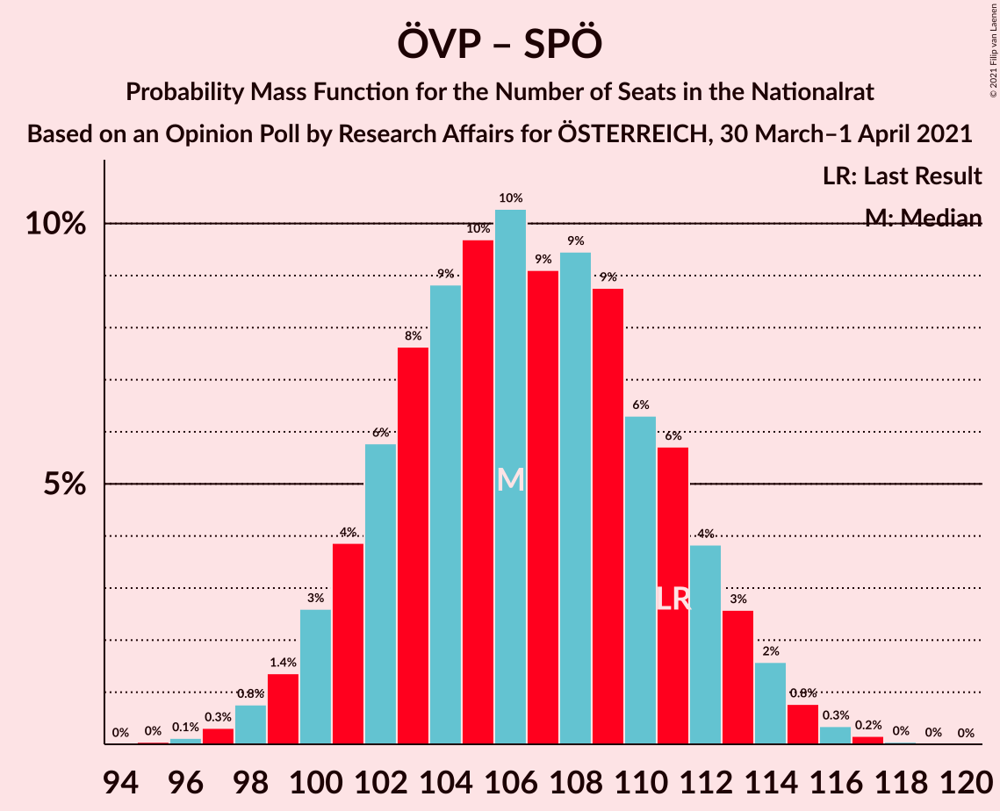
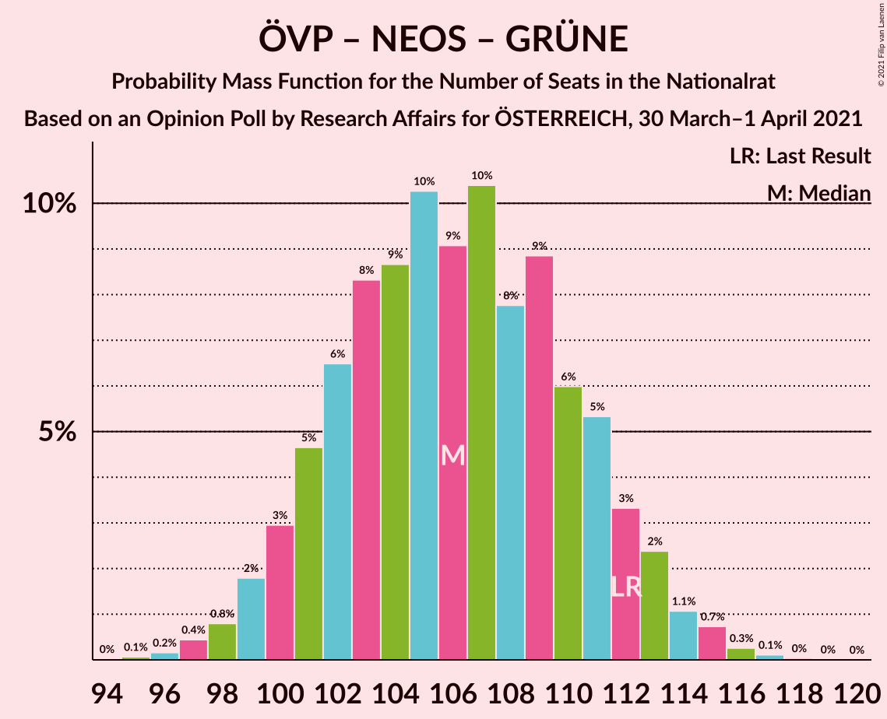
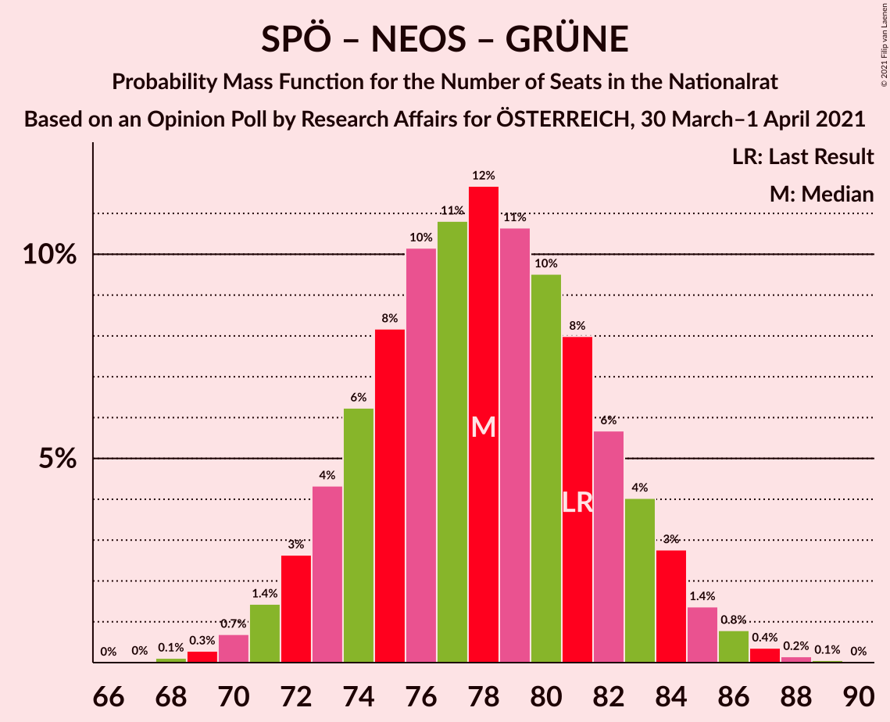
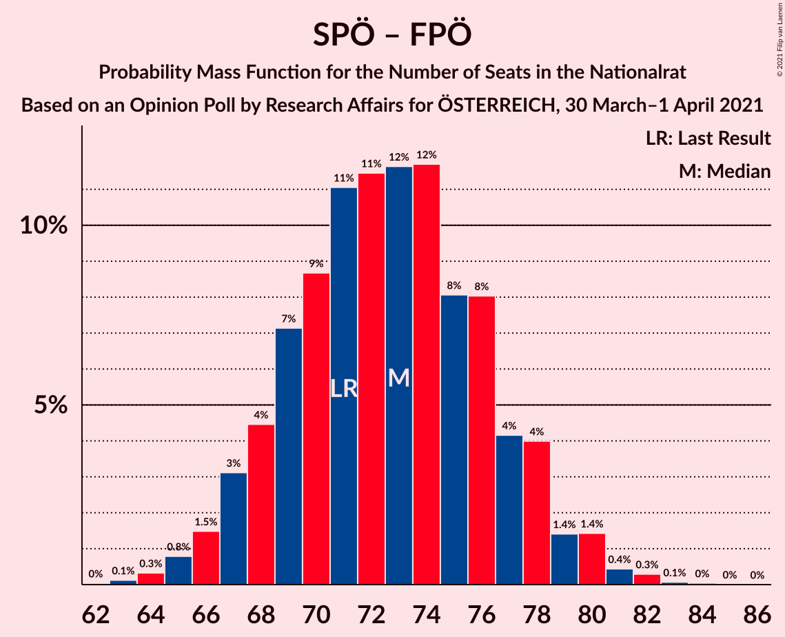
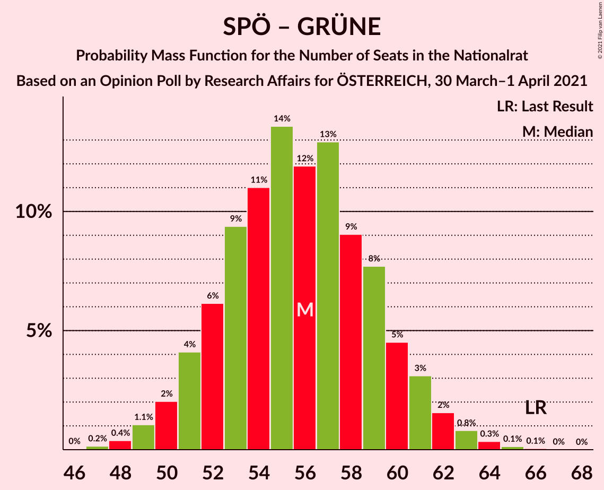

# Opinion Poll by Research Affairs for ÖSTERREICH, 30 March–1 April 2021

<a href="#voting-intentions">Voting Intentions</a> | <a href="#seats">Seats</a> | <a href="#coalitions">Coalitions</a> | <a href="#technical-information">Technical Information</a>

## Voting Intentions

### Confidence Intervals

| Party | Last Result | Poll Result | 80% Confidence Interval | 90% Confidence Interval | 95% Confidence Interval | 99% Confidence Interval |
|:-----:|:-----------:|:-----------:|:-----------------------:|:-----------------------:|:-----------------------:|:-----------------------:|
| Österreichische Volkspartei | 37.5% | 36.0% | 34.1–38.0% |33.5–38.5% |33.1–39.0% |32.2–40.0% |
| Sozialdemokratische Partei Österreichs | 21.2% | 21.0% | 19.4–22.7% |19.0–23.2% |18.6–23.6% |17.8–24.5% |
| Freiheitliche Partei Österreichs | 16.2% | 18.0% | 16.5–19.6% |16.1–20.1% |15.7–20.5% |15.0–21.3% |
| NEOS–Das Neue Österreich und Liberales Forum | 8.1% | 12.0% | 10.8–13.4% |10.4–13.8% |10.1–14.2% |9.6–14.9% |
| Die Grünen–Die Grüne Alternative | 13.9% | 9.0% | 7.9–10.3% |7.6–10.6% |7.4–10.9% |6.9–11.6% |

*Note:* The poll result column reflects the actual value used in the calculations. Published results may vary slightly, and in addition be rounded to fewer digits.

## Seats

### Confidence Intervals

| Party | Last Result | Median | 80% Confidence Interval | 90% Confidence Interval | 95% Confidence Interval | 99% Confidence Interval |
|:-----:|:-----------:|:------:|:-----------------------:|:-----------------------:|:-----------------------:|:-----------------------:|
| <a href="#österreichische-volkspartei">Österreichische Volkspartei</a> | 71 | 67 | 63–71 |62–73 |61–74 |59–76 |
| <a href="#sozialdemokratische-partei-österreichs">Sozialdemokratische Partei Österreichs</a> | 40 | 39 | 36–43 |35–43 |34–44 |33–46 |
| <a href="#freiheitliche-partei-österreichs">Freiheitliche Partei Österreichs</a> | 31 | 33 | 30–37 |30–38 |29–38 |28–40 |
| <a href="#neos–das-neue-österreich-und-liberales-forum">NEOS–Das Neue Österreich und Liberales Forum</a> | 15 | 22 | 20–25 |19–26 |18–26 |17–28 |
| <a href="#die-grünen–die-grüne-alternative">Die Grünen–Die Grüne Alternative</a> | 26 | 17 | 14–19 |14–20 |13–20 |12–21 |

### Österreichische Volkspartei

*For a full overview of the results for this party, see the [Österreichische Volkspartei](party-österreichischevolkspartei.html) page.*

| Number of Seats | Probability | Accumulated | Special Marks |
|:---------------:|:-----------:|:-----------:|:-------------:|
| 57 | 0% | 100% |  |
| 58 | 0.1% | 99.9% |  |
| 59 | 0.4% | 99.8% |  |
| 60 | 0.8% | 99.5% |  |
| 61 | 2% | 98.6% |  |
| 62 | 3% | 97% |  |
| 63 | 5% | 94% |  |
| 64 | 8% | 88% |  |
| 65 | 10% | 81% |  |
| 66 | 11% | 71% |  |
| 67 | 12% | 59% | Median |
| 68 | 12% | 47% |  |
| 69 | 11% | 36% |  |
| 70 | 8% | 25% |  |
| 71 | 6% | 16% | Last Result |
| 72 | 4% | 10% |  |
| 73 | 3% | 6% |  |
| 74 | 1.5% | 3% |  |
| 75 | 0.8% | 1.4% |  |
| 76 | 0.3% | 0.6% |  |
| 77 | 0.1% | 0.2% |  |
| 78 | 0.1% | 0.1% |  |
| 79 | 0% | 0% |  |

### Sozialdemokratische Partei Österreichs

*For a full overview of the results for this party, see the [Sozialdemokratische Partei Österreichs](party-sozialdemokratischeparteiösterreichs.html) page.*

| Number of Seats | Probability | Accumulated | Special Marks |
|:---------------:|:-----------:|:-----------:|:-------------:|
| 31 | 0.1% | 100% |  |
| 32 | 0.2% | 99.9% |  |
| 33 | 0.8% | 99.7% |  |
| 34 | 2% | 98.9% |  |
| 35 | 4% | 97% |  |
| 36 | 8% | 93% |  |
| 37 | 11% | 85% |  |
| 38 | 14% | 73% |  |
| 39 | 16% | 59% | Median |
| 40 | 15% | 44% | Last Result |
| 41 | 11% | 29% |  |
| 42 | 8% | 18% |  |
| 43 | 5% | 10% |  |
| 44 | 3% | 5% |  |
| 45 | 1.2% | 2% |  |
| 46 | 0.5% | 0.8% |  |
| 47 | 0.2% | 0.3% |  |
| 48 | 0.1% | 0.1% |  |
| 49 | 0% | 0% |  |

### Freiheitliche Partei Österreichs

*For a full overview of the results for this party, see the [Freiheitliche Partei Österreichs](party-freiheitlicheparteiösterreichs.html) page.*

| Number of Seats | Probability | Accumulated | Special Marks |
|:---------------:|:-----------:|:-----------:|:-------------:|
| 26 | 0.1% | 100% |  |
| 27 | 0.3% | 99.9% |  |
| 28 | 1.1% | 99.6% |  |
| 29 | 3% | 98% |  |
| 30 | 6% | 96% |  |
| 31 | 10% | 90% | Last Result |
| 32 | 14% | 80% |  |
| 33 | 17% | 65% | Median |
| 34 | 16% | 49% |  |
| 35 | 13% | 33% |  |
| 36 | 9% | 20% |  |
| 37 | 6% | 11% |  |
| 38 | 3% | 5% |  |
| 39 | 1.4% | 2% |  |
| 40 | 0.6% | 0.8% |  |
| 41 | 0.2% | 0.3% |  |
| 42 | 0.1% | 0.1% |  |
| 43 | 0% | 0% |  |

### NEOS–Das Neue Österreich und Liberales Forum

*For a full overview of the results for this party, see the [NEOS–Das Neue Österreich und Liberales Forum](party-neos–dasneueösterreichundliberalesforum.html) page.*

| Number of Seats | Probability | Accumulated | Special Marks |
|:---------------:|:-----------:|:-----------:|:-------------:|
| 15 | 0% | 100% | Last Result |
| 16 | 0.1% | 100% |  |
| 17 | 0.5% | 99.9% |  |
| 18 | 2% | 99.4% |  |
| 19 | 6% | 97% |  |
| 20 | 11% | 92% |  |
| 21 | 17% | 80% |  |
| 22 | 20% | 63% | Median |
| 23 | 18% | 44% |  |
| 24 | 13% | 26% |  |
| 25 | 7% | 13% |  |
| 26 | 4% | 6% |  |
| 27 | 1.4% | 2% |  |
| 28 | 0.5% | 0.6% |  |
| 29 | 0.1% | 0.2% |  |
| 30 | 0% | 0% |  |

### Die Grünen–Die Grüne Alternative

*For a full overview of the results for this party, see the [Die Grünen–Die Grüne Alternative](party-diegrünen–diegrünealternative.html) page.*

| Number of Seats | Probability | Accumulated | Special Marks |
|:---------------:|:-----------:|:-----------:|:-------------:|
| 11 | 0.1% | 100% |  |
| 12 | 0.5% | 99.9% |  |
| 13 | 3% | 99.4% |  |
| 14 | 8% | 97% |  |
| 15 | 16% | 89% |  |
| 16 | 22% | 73% |  |
| 17 | 22% | 51% | Median |
| 18 | 16% | 30% |  |
| 19 | 8% | 14% |  |
| 20 | 4% | 5% |  |
| 21 | 1.2% | 2% |  |
| 22 | 0.3% | 0.4% |  |
| 23 | 0.1% | 0.1% |  |
| 24 | 0% | 0% |  |
| 25 | 0% | 0% |  |
| 26 | 0% | 0% | Last Result |

## Coalitions

### Confidence Intervals

| Coalition | Last Result | Median | Majority? | 80% Confidence Interval | 90% Confidence Interval | 95% Confidence Interval | 99% Confidence Interval |
|:---------:|:-----------:|:------:|:---------:|:-----------------------:|:-----------------------:|:-----------------------:|:-----------------------:|
| Österreichische Volkspartei – Sozialdemokratische Partei Österreichs | 111 | 106 | 100% | 102–111 | 100–113 | 99–114 | 97–116 |
| Österreichische Volkspartei – NEOS–Das Neue Österreich und Liberales Forum – Die Grünen–Die Grüne Alternative | 112 | 106 | 100% | 101–111 | 100–112 | 99–113 | 97–115 |
| Österreichische Volkspartei – Freiheitliche Partei Österreichs | 102 | 101 | 99.7% | 96–106 | 95–107 | 94–108 | 92–110 |
| Österreichische Volkspartei – NEOS–Das Neue Österreich und Liberales Forum | 86 | 90 | 30% | 85–94 | 84–95 | 83–97 | 81–99 |
| Österreichische Volkspartei – Die Grünen–Die Grüne Alternative | 97 | 84 | 1.5% | 79–88 | 78–90 | 77–91 | 75–93 |
| Sozialdemokratische Partei Österreichs – NEOS–Das Neue Österreich und Liberales Forum – Die Grünen–Die Grüne Alternative | 81 | 78 | 0% | 74–82 | 72–84 | 71–85 | 70–87 |
| Sozialdemokratische Partei Österreichs – Freiheitliche Partei Österreichs | 71 | 73 | 0% | 68–77 | 67–78 | 66–79 | 64–81 |
| Österreichische Volkspartei | 71 | 67 | 0% | 63–71 | 62–73 | 61–74 | 59–76 |
| Sozialdemokratische Partei Österreichs – Die Grünen–Die Grüne Alternative | 66 | 56 | 0% | 52–60 | 51–61 | 50–62 | 48–64 |
| Sozialdemokratische Partei Österreichs | 40 | 39 | 0% | 36–43 | 35–43 | 34–44 | 33–46 |

### Österreichische Volkspartei – Sozialdemokratische Partei Österreichs

| Number of Seats | Probability | Accumulated | Special Marks |
|:---------------:|:-----------:|:-----------:|:-------------:|
| 95 | 0% | 100% |  |
| 96 | 0.1% | 99.9% |  |
| 97 | 0.3% | 99.8% |  |
| 98 | 0.8% | 99.5% |  |
| 99 | 1.4% | 98.7% |  |
| 100 | 3% | 97% |  |
| 101 | 4% | 95% |  |
| 102 | 6% | 91% |  |
| 103 | 8% | 85% |  |
| 104 | 9% | 77% |  |
| 105 | 10% | 69% |  |
| 106 | 10% | 59% | Median |
| 107 | 9% | 49% |  |
| 108 | 9% | 40% |  |
| 109 | 9% | 30% |  |
| 110 | 6% | 21% |  |
| 111 | 6% | 15% | Last Result |
| 112 | 4% | 9% |  |
| 113 | 3% | 6% |  |
| 114 | 2% | 3% |  |
| 115 | 0.8% | 1.4% |  |
| 116 | 0.3% | 0.6% |  |
| 117 | 0.2% | 0.2% |  |
| 118 | 0% | 0.1% |  |
| 119 | 0% | 0% |  |

### Österreichische Volkspartei – NEOS–Das Neue Österreich und Liberales Forum – Die Grünen–Die Grüne Alternative

| Number of Seats | Probability | Accumulated | Special Marks |
|:---------------:|:-----------:|:-----------:|:-------------:|
| 95 | 0.1% | 100% |  |
| 96 | 0.2% | 99.9% |  |
| 97 | 0.4% | 99.7% |  |
| 98 | 0.8% | 99.3% |  |
| 99 | 2% | 98.5% |  |
| 100 | 3% | 97% |  |
| 101 | 5% | 94% |  |
| 102 | 6% | 89% |  |
| 103 | 8% | 83% |  |
| 104 | 9% | 74% |  |
| 105 | 10% | 66% |  |
| 106 | 9% | 55% | Median |
| 107 | 10% | 46% |  |
| 108 | 8% | 36% |  |
| 109 | 9% | 28% |  |
| 110 | 6% | 19% |  |
| 111 | 5% | 13% |  |
| 112 | 3% | 8% | Last Result |
| 113 | 2% | 5% |  |
| 114 | 1.1% | 2% |  |
| 115 | 0.7% | 1.2% |  |
| 116 | 0.3% | 0.4% |  |
| 117 | 0.1% | 0.2% |  |
| 118 | 0% | 0.1% |  |
| 119 | 0% | 0% |  |

### Österreichische Volkspartei – Freiheitliche Partei Österreichs

| Number of Seats | Probability | Accumulated | Special Marks |
|:---------------:|:-----------:|:-----------:|:-------------:|
| 90 | 0.1% | 100% |  |
| 91 | 0.2% | 99.9% |  |
| 92 | 0.5% | 99.7% | Majority |
| 93 | 1.1% | 99.2% |  |
| 94 | 2% | 98% |  |
| 95 | 3% | 96% |  |
| 96 | 5% | 93% |  |
| 97 | 7% | 88% |  |
| 98 | 8% | 81% |  |
| 99 | 10% | 73% |  |
| 100 | 10% | 63% | Median |
| 101 | 10% | 53% |  |
| 102 | 10% | 43% | Last Result |
| 103 | 9% | 33% |  |
| 104 | 7% | 24% |  |
| 105 | 6% | 17% |  |
| 106 | 4% | 11% |  |
| 107 | 3% | 6% |  |
| 108 | 2% | 4% |  |
| 109 | 0.9% | 2% |  |
| 110 | 0.5% | 0.8% |  |
| 111 | 0.2% | 0.3% |  |
| 112 | 0.1% | 0.1% |  |
| 113 | 0% | 0% |  |

### Österreichische Volkspartei – NEOS–Das Neue Österreich und Liberales Forum

| Number of Seats | Probability | Accumulated | Special Marks |
|:---------------:|:-----------:|:-----------:|:-------------:|
| 79 | 0.1% | 100% |  |
| 80 | 0.2% | 99.9% |  |
| 81 | 0.5% | 99.7% |  |
| 82 | 1.1% | 99.1% |  |
| 83 | 2% | 98% |  |
| 84 | 4% | 96% |  |
| 85 | 5% | 92% |  |
| 86 | 7% | 87% | Last Result |
| 87 | 9% | 80% |  |
| 88 | 11% | 71% |  |
| 89 | 10% | 60% | Median |
| 90 | 11% | 50% |  |
| 91 | 10% | 39% |  |
| 92 | 8% | 30% | Majority |
| 93 | 7% | 21% |  |
| 94 | 5% | 14% |  |
| 95 | 4% | 8% |  |
| 96 | 2% | 5% |  |
| 97 | 1.3% | 3% |  |
| 98 | 0.7% | 1.2% |  |
| 99 | 0.3% | 0.5% |  |
| 100 | 0.1% | 0.2% |  |
| 101 | 0.1% | 0.1% |  |
| 102 | 0% | 0% |  |

### Österreichische Volkspartei – Die Grünen–Die Grüne Alternative

| Number of Seats | Probability | Accumulated | Special Marks |
|:---------------:|:-----------:|:-----------:|:-------------:|
| 73 | 0% | 100% |  |
| 74 | 0.1% | 99.9% |  |
| 75 | 0.3% | 99.8% |  |
| 76 | 0.8% | 99.5% |  |
| 77 | 2% | 98.7% |  |
| 78 | 3% | 97% |  |
| 79 | 5% | 94% |  |
| 80 | 7% | 90% |  |
| 81 | 8% | 83% |  |
| 82 | 10% | 75% |  |
| 83 | 11% | 65% |  |
| 84 | 11% | 54% | Median |
| 85 | 11% | 43% |  |
| 86 | 9% | 33% |  |
| 87 | 7% | 23% |  |
| 88 | 6% | 16% |  |
| 89 | 4% | 10% |  |
| 90 | 3% | 6% |  |
| 91 | 2% | 3% |  |
| 92 | 0.8% | 1.5% | Majority |
| 93 | 0.4% | 0.7% |  |
| 94 | 0.2% | 0.3% |  |
| 95 | 0.1% | 0.1% |  |
| 96 | 0% | 0% |  |
| 97 | 0% | 0% | Last Result |

### Sozialdemokratische Partei Österreichs – NEOS–Das Neue Österreich und Liberales Forum – Die Grünen–Die Grüne Alternative

| Number of Seats | Probability | Accumulated | Special Marks |
|:---------------:|:-----------:|:-----------:|:-------------:|
| 67 | 0% | 100% |  |
| 68 | 0.1% | 99.9% |  |
| 69 | 0.3% | 99.8% |  |
| 70 | 0.7% | 99.5% |  |
| 71 | 1.4% | 98.9% |  |
| 72 | 3% | 97% |  |
| 73 | 4% | 95% |  |
| 74 | 6% | 90% |  |
| 75 | 8% | 84% |  |
| 76 | 10% | 76% |  |
| 77 | 11% | 66% |  |
| 78 | 12% | 55% | Median |
| 79 | 11% | 43% |  |
| 80 | 10% | 33% |  |
| 81 | 8% | 23% | Last Result |
| 82 | 6% | 15% |  |
| 83 | 4% | 10% |  |
| 84 | 3% | 6% |  |
| 85 | 1.4% | 3% |  |
| 86 | 0.8% | 1.4% |  |
| 87 | 0.4% | 0.6% |  |
| 88 | 0.2% | 0.2% |  |
| 89 | 0.1% | 0.1% |  |
| 90 | 0% | 0% |  |

### Sozialdemokratische Partei Österreichs – Freiheitliche Partei Österreichs

| Number of Seats | Probability | Accumulated | Special Marks |
|:---------------:|:-----------:|:-----------:|:-------------:|
| 62 | 0% | 100% |  |
| 63 | 0.1% | 99.9% |  |
| 64 | 0.3% | 99.8% |  |
| 65 | 0.8% | 99.5% |  |
| 66 | 1.5% | 98.7% |  |
| 67 | 3% | 97% |  |
| 68 | 4% | 94% |  |
| 69 | 7% | 90% |  |
| 70 | 9% | 82% |  |
| 71 | 11% | 74% | Last Result |
| 72 | 11% | 63% | Median |
| 73 | 12% | 51% |  |
| 74 | 12% | 40% |  |
| 75 | 8% | 28% |  |
| 76 | 8% | 20% |  |
| 77 | 4% | 12% |  |
| 78 | 4% | 8% |  |
| 79 | 1.4% | 4% |  |
| 80 | 1.4% | 2% |  |
| 81 | 0.4% | 0.9% |  |
| 82 | 0.3% | 0.4% |  |
| 83 | 0.1% | 0.1% |  |
| 84 | 0% | 0.1% |  |
| 85 | 0% | 0% |  |

### Österreichische Volkspartei

| Number of Seats | Probability | Accumulated | Special Marks |
|:---------------:|:-----------:|:-----------:|:-------------:|
| 57 | 0% | 100% |  |
| 58 | 0.1% | 99.9% |  |
| 59 | 0.4% | 99.8% |  |
| 60 | 0.8% | 99.5% |  |
| 61 | 2% | 98.6% |  |
| 62 | 3% | 97% |  |
| 63 | 5% | 94% |  |
| 64 | 8% | 88% |  |
| 65 | 10% | 81% |  |
| 66 | 11% | 71% |  |
| 67 | 12% | 59% | Median |
| 68 | 12% | 47% |  |
| 69 | 11% | 36% |  |
| 70 | 8% | 25% |  |
| 71 | 6% | 16% | Last Result |
| 72 | 4% | 10% |  |
| 73 | 3% | 6% |  |
| 74 | 1.5% | 3% |  |
| 75 | 0.8% | 1.4% |  |
| 76 | 0.3% | 0.6% |  |
| 77 | 0.1% | 0.2% |  |
| 78 | 0.1% | 0.1% |  |
| 79 | 0% | 0% |  |

### Sozialdemokratische Partei Österreichs – Die Grünen–Die Grüne Alternative

| Number of Seats | Probability | Accumulated | Special Marks |
|:---------------:|:-----------:|:-----------:|:-------------:|
| 46 | 0% | 100% |  |
| 47 | 0.2% | 99.9% |  |
| 48 | 0.4% | 99.8% |  |
| 49 | 1.1% | 99.4% |  |
| 50 | 2% | 98% |  |
| 51 | 4% | 96% |  |
| 52 | 6% | 92% |  |
| 53 | 9% | 86% |  |
| 54 | 11% | 77% |  |
| 55 | 14% | 66% |  |
| 56 | 12% | 52% | Median |
| 57 | 13% | 40% |  |
| 58 | 9% | 27% |  |
| 59 | 8% | 18% |  |
| 60 | 5% | 11% |  |
| 61 | 3% | 6% |  |
| 62 | 2% | 3% |  |
| 63 | 0.8% | 1.4% |  |
| 64 | 0.3% | 0.6% |  |
| 65 | 0.1% | 0.2% |  |
| 66 | 0.1% | 0.1% | Last Result |
| 67 | 0% | 0% |  |

### Sozialdemokratische Partei Österreichs

| Number of Seats | Probability | Accumulated | Special Marks |
|:---------------:|:-----------:|:-----------:|:-------------:|
| 31 | 0.1% | 100% |  |
| 32 | 0.2% | 99.9% |  |
| 33 | 0.8% | 99.7% |  |
| 34 | 2% | 98.9% |  |
| 35 | 4% | 97% |  |
| 36 | 8% | 93% |  |
| 37 | 11% | 85% |  |
| 38 | 14% | 73% |  |
| 39 | 16% | 59% | Median |
| 40 | 15% | 44% | Last Result |
| 41 | 11% | 29% |  |
| 42 | 8% | 18% |  |
| 43 | 5% | 10% |  |
| 44 | 3% | 5% |  |
| 45 | 1.2% | 2% |  |
| 46 | 0.5% | 0.8% |  |
| 47 | 0.2% | 0.3% |  |
| 48 | 0.1% | 0.1% |  |
| 49 | 0% | 0% |  |

## Technical Information

### Opinion Poll

+ **Polling firm:** Research Affairs
+ **Commissioner(s):** ÖSTERREICH
+ **Fieldwork period:** 30 March–1 April 2021

### Calculations

+ **Sample size:** 1000
+ **Simulations done:** 1,048,576
+ **Error estimate:** 0.35%

