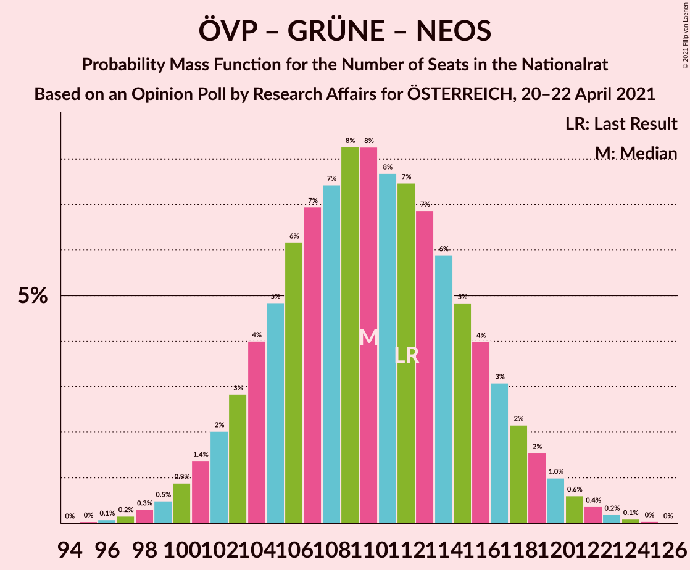
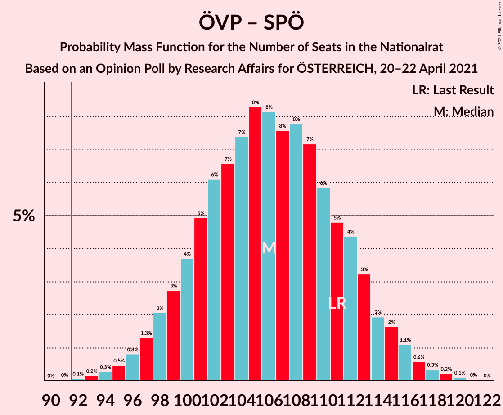
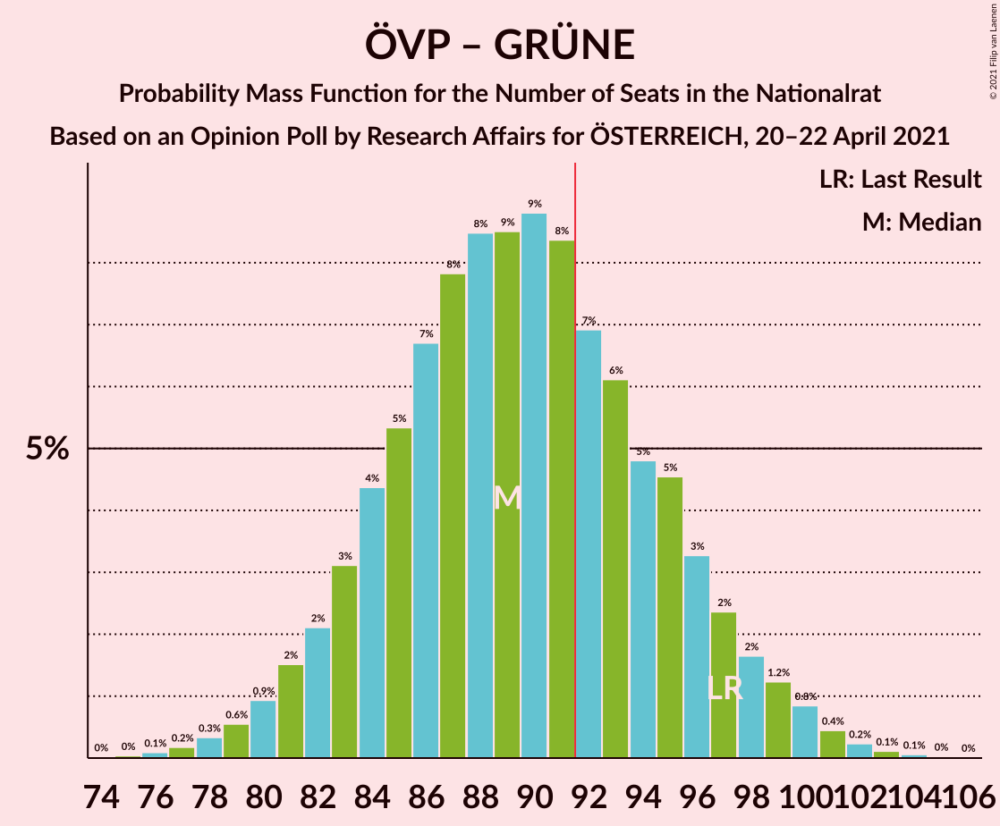
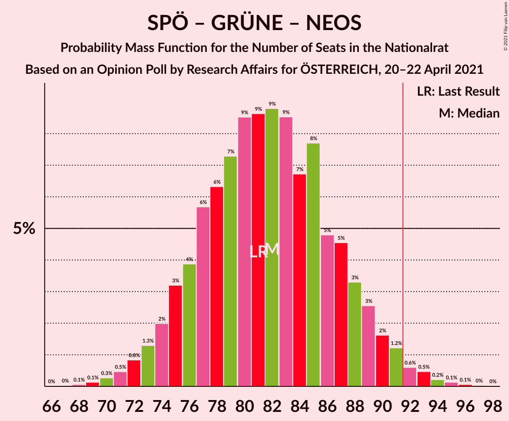
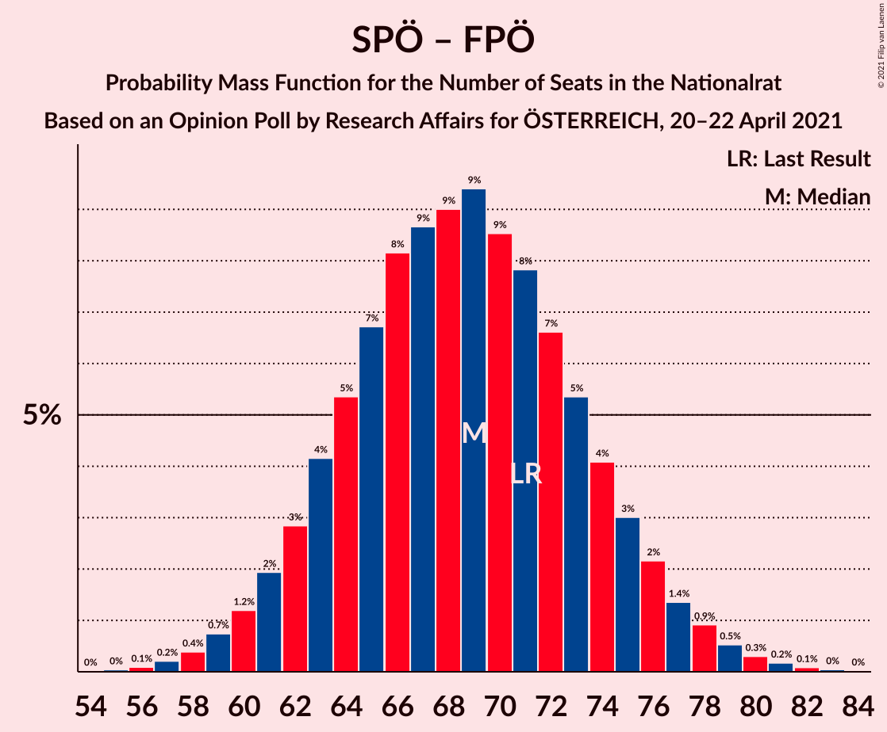

# Opinion Poll by Research Affairs for ÖSTERREICH, 20–22 April 2021

<a href="#voting-intentions">Voting Intentions</a> | <a href="#seats">Seats</a> | <a href="#coalitions">Coalitions</a> | <a href="#technical-information">Technical Information</a>

## Voting Intentions

### Confidence Intervals

| Party | Last Result | Poll Result | 80% Confidence Interval | 90% Confidence Interval | 95% Confidence Interval | 99% Confidence Interval |
|:-----:|:-----------:|:-----------:|:-----------------------:|:-----------------------:|:-----------------------:|:-----------------------:|
| Österreichische Volkspartei | 37.5% | 36.1% | 33.4–38.9% |32.7–39.7% |32.0–40.4% |30.8–41.7% |
| Sozialdemokratische Partei Österreichs | 21.2% | 20.9% | 18.7–23.4% |18.1–24.1% |17.6–24.7% |16.6–25.9% |
| Freiheitliche Partei Österreichs | 16.2% | 16.0% | 14.1–18.2% |13.5–18.9% |13.0–19.4% |12.2–20.5% |
| Die Grünen–Die Grüne Alternative | 13.9% | 12.0% | 10.3–14.1% |9.9–14.6% |9.5–15.2% |8.7–16.2% |
| NEOS–Das Neue Österreich und Liberales Forum | 8.1% | 11.0% | 9.4–13.0% |9.0–13.6% |8.6–14.1% |7.9–15.1% |

*Note:* The poll result column reflects the actual value used in the calculations. Published results may vary slightly, and in addition be rounded to fewer digits.

## Seats

### Confidence Intervals

| Party | Last Result | Median | 80% Confidence Interval | 90% Confidence Interval | 95% Confidence Interval | 99% Confidence Interval |
|:-----:|:-----------:|:------:|:-----------------------:|:-----------------------:|:-----------------------:|:-----------------------:|
| <a href="#österreichische-volkspartei">Österreichische Volkspartei</a> | 71 | 67 | 62–73 |60–74 |59–76 |57–78 |
| <a href="#sozialdemokratische-partei-österreichs">Sozialdemokratische Partei Österreichs</a> | 40 | 39 | 34–43 |33–45 |32–46 |30–48 |
| <a href="#freiheitliche-partei-österreichs">Freiheitliche Partei Österreichs</a> | 31 | 30 | 26–34 |25–35 |24–36 |22–38 |
| <a href="#die-grünen–die-grüne-alternative">Die Grünen–Die Grüne Alternative</a> | 26 | 22 | 19–26 |18–27 |17–28 |16–30 |
| <a href="#neos–das-neue-österreich-und-liberales-forum">NEOS–Das Neue Österreich und Liberales Forum</a> | 15 | 20 | 17–24 |16–25 |16–26 |14–28 |

### Österreichische Volkspartei

*For a full overview of the results for this party, see the [Österreichische Volkspartei](party-österreichischevolkspartei.html) page.*

| Number of Seats | Probability | Accumulated | Special Marks |
|:---------------:|:-----------:|:-----------:|:-------------:|
| 54 | 0.1% | 100% |  |
| 55 | 0.1% | 99.9% |  |
| 56 | 0.2% | 99.8% |  |
| 57 | 0.5% | 99.6% |  |
| 58 | 0.8% | 99.1% |  |
| 59 | 1.4% | 98% |  |
| 60 | 2% | 97% |  |
| 61 | 3% | 95% |  |
| 62 | 5% | 91% |  |
| 63 | 6% | 87% |  |
| 64 | 7% | 81% |  |
| 65 | 8% | 74% |  |
| 66 | 9% | 65% |  |
| 67 | 9% | 56% | Median |
| 68 | 9% | 47% |  |
| 69 | 8% | 38% |  |
| 70 | 8% | 30% |  |
| 71 | 6% | 22% | Last Result |
| 72 | 5% | 16% |  |
| 73 | 4% | 11% |  |
| 74 | 3% | 7% |  |
| 75 | 2% | 5% |  |
| 76 | 1.2% | 3% |  |
| 77 | 0.8% | 2% |  |
| 78 | 0.4% | 0.9% |  |
| 79 | 0.2% | 0.5% |  |
| 80 | 0.1% | 0.2% |  |
| 81 | 0.1% | 0.1% |  |
| 82 | 0% | 0.1% |  |
| 83 | 0% | 0% |  |

### Sozialdemokratische Partei Österreichs

*For a full overview of the results for this party, see the [Sozialdemokratische Partei Österreichs](party-sozialdemokratischeparteiösterreichs.html) page.*

| Number of Seats | Probability | Accumulated | Special Marks |
|:---------------:|:-----------:|:-----------:|:-------------:|
| 28 | 0% | 100% |  |
| 29 | 0.1% | 99.9% |  |
| 30 | 0.3% | 99.8% |  |
| 31 | 0.8% | 99.5% |  |
| 32 | 2% | 98.7% |  |
| 33 | 3% | 97% |  |
| 34 | 4% | 94% |  |
| 35 | 6% | 90% |  |
| 36 | 8% | 84% |  |
| 37 | 11% | 75% |  |
| 38 | 11% | 65% |  |
| 39 | 12% | 54% | Median |
| 40 | 11% | 42% | Last Result |
| 41 | 9% | 31% |  |
| 42 | 8% | 23% |  |
| 43 | 5% | 15% |  |
| 44 | 4% | 10% |  |
| 45 | 3% | 6% |  |
| 46 | 2% | 3% |  |
| 47 | 0.9% | 2% |  |
| 48 | 0.4% | 0.9% |  |
| 49 | 0.3% | 0.5% |  |
| 50 | 0.1% | 0.2% |  |
| 51 | 0.1% | 0.1% |  |
| 52 | 0% | 0% |  |

### Freiheitliche Partei Österreichs

*For a full overview of the results for this party, see the [Freiheitliche Partei Österreichs](party-freiheitlicheparteiösterreichs.html) page.*

| Number of Seats | Probability | Accumulated | Special Marks |
|:---------------:|:-----------:|:-----------:|:-------------:|
| 20 | 0% | 100% |  |
| 21 | 0.2% | 99.9% |  |
| 22 | 0.5% | 99.8% |  |
| 23 | 1.2% | 99.3% |  |
| 24 | 2% | 98% |  |
| 25 | 4% | 96% |  |
| 26 | 7% | 92% |  |
| 27 | 9% | 85% |  |
| 28 | 12% | 76% |  |
| 29 | 13% | 63% |  |
| 30 | 12% | 51% | Median |
| 31 | 11% | 39% | Last Result |
| 32 | 9% | 28% |  |
| 33 | 7% | 18% |  |
| 34 | 5% | 11% |  |
| 35 | 3% | 6% |  |
| 36 | 2% | 4% |  |
| 37 | 1.0% | 2% |  |
| 38 | 0.5% | 0.9% |  |
| 39 | 0.2% | 0.4% |  |
| 40 | 0.1% | 0.2% |  |
| 41 | 0% | 0.1% |  |
| 42 | 0% | 0% |  |

### Die Grünen–Die Grüne Alternative

*For a full overview of the results for this party, see the [Die Grünen–Die Grüne Alternative](party-diegrünen–diegrünealternative.html) page.*

| Number of Seats | Probability | Accumulated | Special Marks |
|:---------------:|:-----------:|:-----------:|:-------------:|
| 14 | 0.1% | 100% |  |
| 15 | 0.3% | 99.9% |  |
| 16 | 0.8% | 99.7% |  |
| 17 | 2% | 98.9% |  |
| 18 | 4% | 97% |  |
| 19 | 7% | 93% |  |
| 20 | 11% | 85% |  |
| 21 | 14% | 74% |  |
| 22 | 15% | 60% | Median |
| 23 | 14% | 45% |  |
| 24 | 11% | 32% |  |
| 25 | 8% | 20% |  |
| 26 | 5% | 12% | Last Result |
| 27 | 3% | 7% |  |
| 28 | 2% | 4% |  |
| 29 | 1.0% | 2% |  |
| 30 | 0.5% | 0.8% |  |
| 31 | 0.2% | 0.3% |  |
| 32 | 0.1% | 0.1% |  |
| 33 | 0% | 0% |  |

### NEOS–Das Neue Österreich und Liberales Forum

*For a full overview of the results for this party, see the [NEOS–Das Neue Österreich und Liberales Forum](party-neos–dasneueösterreichundliberalesforum.html) page.*

| Number of Seats | Probability | Accumulated | Special Marks |
|:---------------:|:-----------:|:-----------:|:-------------:|
| 13 | 0.1% | 100% |  |
| 14 | 0.5% | 99.8% |  |
| 15 | 2% | 99.3% | Last Result |
| 16 | 4% | 98% |  |
| 17 | 7% | 94% |  |
| 18 | 10% | 87% |  |
| 19 | 14% | 77% |  |
| 20 | 15% | 63% | Median |
| 21 | 14% | 48% |  |
| 22 | 12% | 34% |  |
| 23 | 9% | 22% |  |
| 24 | 6% | 13% |  |
| 25 | 4% | 7% |  |
| 26 | 2% | 4% |  |
| 27 | 1.0% | 2% |  |
| 28 | 0.4% | 0.7% |  |
| 29 | 0.2% | 0.3% |  |
| 30 | 0.1% | 0.1% |  |
| 31 | 0% | 0% |  |

## Coalitions

### Confidence Intervals

| Coalition | Last Result | Median | Majority? | 80% Confidence Interval | 90% Confidence Interval | 95% Confidence Interval | 99% Confidence Interval |
|:---------:|:-----------:|:------:|:---------:|:-----------------------:|:-----------------------:|:-----------------------:|:-----------------------:|
| Österreichische Volkspartei – Die Grünen–Die Grüne Alternative – NEOS–Das Neue Österreich und Liberales Forum | 112 | 110 | 100% | 104–116 | 102–118 | 101–119 | 98–122 |
| Österreichische Volkspartei – Sozialdemokratische Partei Österreichs | 111 | 106 | 99.9% | 100–112 | 98–114 | 97–115 | 94–118 |
| Österreichische Volkspartei – Freiheitliche Partei Österreichs | 102 | 97 | 88% | 91–103 | 89–105 | 88–106 | 85–109 |
| Österreichische Volkspartei – Die Grünen–Die Grüne Alternative | 97 | 89 | 33% | 84–96 | 82–97 | 81–99 | 78–101 |
| Österreichische Volkspartei – NEOS–Das Neue Österreich und Liberales Forum | 86 | 88 | 20% | 82–94 | 80–95 | 79–97 | 76–100 |
| Sozialdemokratische Partei Österreichs – Die Grünen–Die Grüne Alternative – NEOS–Das Neue Österreich und Liberales Forum | 81 | 82 | 2% | 76–88 | 74–89 | 73–91 | 70–93 |
| Sozialdemokratische Partei Österreichs – Freiheitliche Partei Österreichs | 71 | 69 | 0% | 63–74 | 62–76 | 60–77 | 58–80 |
| Österreichische Volkspartei | 71 | 67 | 0% | 62–73 | 60–74 | 59–76 | 57–78 |
| Sozialdemokratische Partei Österreichs – Die Grünen–Die Grüne Alternative | 66 | 61 | 0% | 56–67 | 55–68 | 53–70 | 51–72 |
| Sozialdemokratische Partei Österreichs | 40 | 39 | 0% | 34–43 | 33–45 | 32–46 | 30–48 |

### Österreichische Volkspartei – Die Grünen–Die Grüne Alternative – NEOS–Das Neue Österreich und Liberales Forum

| Number of Seats | Probability | Accumulated | Special Marks |
|:---------------:|:-----------:|:-----------:|:-------------:|
| 95 | 0% | 100% |  |
| 96 | 0.1% | 99.9% |  |
| 97 | 0.2% | 99.9% |  |
| 98 | 0.3% | 99.7% |  |
| 99 | 0.5% | 99.4% |  |
| 100 | 0.9% | 98.9% |  |
| 101 | 1.4% | 98% |  |
| 102 | 2% | 97% |  |
| 103 | 3% | 95% |  |
| 104 | 4% | 92% |  |
| 105 | 5% | 88% |  |
| 106 | 6% | 83% |  |
| 107 | 7% | 77% |  |
| 108 | 7% | 70% |  |
| 109 | 8% | 62% | Median |
| 110 | 8% | 54% |  |
| 111 | 8% | 46% |  |
| 112 | 7% | 38% | Last Result |
| 113 | 7% | 31% |  |
| 114 | 6% | 24% |  |
| 115 | 5% | 18% |  |
| 116 | 4% | 13% |  |
| 117 | 3% | 9% |  |
| 118 | 2% | 6% |  |
| 119 | 2% | 4% |  |
| 120 | 1.0% | 2% |  |
| 121 | 0.6% | 1.3% |  |
| 122 | 0.4% | 0.7% |  |
| 123 | 0.2% | 0.4% |  |
| 124 | 0.1% | 0.2% |  |
| 125 | 0% | 0.1% |  |
| 126 | 0% | 0% |  |

### Österreichische Volkspartei – Sozialdemokratische Partei Österreichs

| Number of Seats | Probability | Accumulated | Special Marks |
|:---------------:|:-----------:|:-----------:|:-------------:|
| 91 | 0% | 100% |  |
| 92 | 0.1% | 99.9% | Majority |
| 93 | 0.2% | 99.9% |  |
| 94 | 0.3% | 99.7% |  |
| 95 | 0.5% | 99.4% |  |
| 96 | 0.8% | 99.0% |  |
| 97 | 1.3% | 98% |  |
| 98 | 2% | 97% |  |
| 99 | 3% | 95% |  |
| 100 | 4% | 92% |  |
| 101 | 5% | 88% |  |
| 102 | 6% | 83% |  |
| 103 | 7% | 77% |  |
| 104 | 7% | 71% |  |
| 105 | 8% | 63% |  |
| 106 | 8% | 55% | Median |
| 107 | 8% | 47% |  |
| 108 | 8% | 39% |  |
| 109 | 7% | 31% |  |
| 110 | 6% | 24% |  |
| 111 | 5% | 18% | Last Result |
| 112 | 4% | 14% |  |
| 113 | 3% | 9% |  |
| 114 | 2% | 6% |  |
| 115 | 2% | 4% |  |
| 116 | 1.1% | 2% |  |
| 117 | 0.6% | 1.3% |  |
| 118 | 0.3% | 0.7% |  |
| 119 | 0.2% | 0.4% |  |
| 120 | 0.1% | 0.2% |  |
| 121 | 0% | 0.1% |  |
| 122 | 0% | 0% |  |

### Österreichische Volkspartei – Freiheitliche Partei Österreichs

| Number of Seats | Probability | Accumulated | Special Marks |
|:---------------:|:-----------:|:-----------:|:-------------:|
| 82 | 0% | 100% |  |
| 83 | 0.1% | 99.9% |  |
| 84 | 0.1% | 99.9% |  |
| 85 | 0.3% | 99.7% |  |
| 86 | 0.5% | 99.4% |  |
| 87 | 0.8% | 98.9% |  |
| 88 | 1.5% | 98% |  |
| 89 | 2% | 97% |  |
| 90 | 3% | 95% |  |
| 91 | 4% | 92% |  |
| 92 | 5% | 88% | Majority |
| 93 | 6% | 83% |  |
| 94 | 7% | 77% |  |
| 95 | 8% | 70% |  |
| 96 | 9% | 62% |  |
| 97 | 8% | 53% | Median |
| 98 | 9% | 46% |  |
| 99 | 7% | 36% |  |
| 100 | 7% | 30% |  |
| 101 | 6% | 22% |  |
| 102 | 5% | 17% | Last Result |
| 103 | 4% | 12% |  |
| 104 | 3% | 8% |  |
| 105 | 2% | 5% |  |
| 106 | 1.5% | 4% |  |
| 107 | 0.8% | 2% |  |
| 108 | 0.6% | 1.2% |  |
| 109 | 0.3% | 0.6% |  |
| 110 | 0.2% | 0.3% |  |
| 111 | 0.1% | 0.2% |  |
| 112 | 0% | 0.1% |  |
| 113 | 0% | 0% |  |

### Österreichische Volkspartei – Die Grünen–Die Grüne Alternative

| Number of Seats | Probability | Accumulated | Special Marks |
|:---------------:|:-----------:|:-----------:|:-------------:|
| 75 | 0% | 100% |  |
| 76 | 0.1% | 99.9% |  |
| 77 | 0.2% | 99.8% |  |
| 78 | 0.3% | 99.7% |  |
| 79 | 0.6% | 99.3% |  |
| 80 | 0.9% | 98.8% |  |
| 81 | 2% | 98% |  |
| 82 | 2% | 96% |  |
| 83 | 3% | 94% |  |
| 84 | 4% | 91% |  |
| 85 | 5% | 87% |  |
| 86 | 7% | 81% |  |
| 87 | 8% | 75% |  |
| 88 | 8% | 67% |  |
| 89 | 9% | 58% | Median |
| 90 | 9% | 50% |  |
| 91 | 8% | 41% |  |
| 92 | 7% | 33% | Majority |
| 93 | 6% | 26% |  |
| 94 | 5% | 20% |  |
| 95 | 5% | 15% |  |
| 96 | 3% | 10% |  |
| 97 | 2% | 7% | Last Result |
| 98 | 2% | 5% |  |
| 99 | 1.2% | 3% |  |
| 100 | 0.8% | 2% |  |
| 101 | 0.4% | 0.9% |  |
| 102 | 0.2% | 0.5% |  |
| 103 | 0.1% | 0.2% |  |
| 104 | 0.1% | 0.1% |  |
| 105 | 0% | 0.1% |  |
| 106 | 0% | 0% |  |

### Österreichische Volkspartei – NEOS–Das Neue Österreich und Liberales Forum

| Number of Seats | Probability | Accumulated | Special Marks |
|:---------------:|:-----------:|:-----------:|:-------------:|
| 73 | 0% | 100% |  |
| 74 | 0.1% | 99.9% |  |
| 75 | 0.2% | 99.9% |  |
| 76 | 0.3% | 99.7% |  |
| 77 | 0.5% | 99.4% |  |
| 78 | 0.9% | 98.9% |  |
| 79 | 1.4% | 98% |  |
| 80 | 2% | 97% |  |
| 81 | 3% | 94% |  |
| 82 | 4% | 92% |  |
| 83 | 5% | 87% |  |
| 84 | 6% | 82% |  |
| 85 | 8% | 76% |  |
| 86 | 8% | 68% | Last Result |
| 87 | 9% | 60% | Median |
| 88 | 8% | 52% |  |
| 89 | 8% | 43% |  |
| 90 | 8% | 35% |  |
| 91 | 7% | 28% |  |
| 92 | 5% | 20% | Majority |
| 93 | 4% | 15% |  |
| 94 | 4% | 11% |  |
| 95 | 2% | 7% |  |
| 96 | 2% | 5% |  |
| 97 | 1.2% | 3% |  |
| 98 | 0.7% | 2% |  |
| 99 | 0.5% | 1.0% |  |
| 100 | 0.3% | 0.5% |  |
| 101 | 0.1% | 0.3% |  |
| 102 | 0.1% | 0.1% |  |
| 103 | 0% | 0.1% |  |
| 104 | 0% | 0% |  |

### Sozialdemokratische Partei Österreichs – Die Grünen–Die Grüne Alternative – NEOS–Das Neue Österreich und Liberales Forum

| Number of Seats | Probability | Accumulated | Special Marks |
|:---------------:|:-----------:|:-----------:|:-------------:|
| 67 | 0% | 100% |  |
| 68 | 0.1% | 99.9% |  |
| 69 | 0.1% | 99.9% |  |
| 70 | 0.3% | 99.8% |  |
| 71 | 0.5% | 99.5% |  |
| 72 | 0.8% | 99.0% |  |
| 73 | 1.3% | 98% |  |
| 74 | 2% | 97% |  |
| 75 | 3% | 95% |  |
| 76 | 4% | 92% |  |
| 77 | 6% | 88% |  |
| 78 | 6% | 82% |  |
| 79 | 7% | 76% |  |
| 80 | 9% | 69% |  |
| 81 | 9% | 60% | Last Result, Median |
| 82 | 9% | 51% |  |
| 83 | 9% | 43% |  |
| 84 | 7% | 34% |  |
| 85 | 8% | 27% |  |
| 86 | 5% | 20% |  |
| 87 | 5% | 15% |  |
| 88 | 3% | 10% |  |
| 89 | 3% | 7% |  |
| 90 | 2% | 4% |  |
| 91 | 1.2% | 3% |  |
| 92 | 0.6% | 2% | Majority |
| 93 | 0.5% | 0.9% |  |
| 94 | 0.2% | 0.5% |  |
| 95 | 0.1% | 0.3% |  |
| 96 | 0.1% | 0.1% |  |
| 97 | 0% | 0.1% |  |
| 98 | 0% | 0% |  |

### Sozialdemokratische Partei Österreichs – Freiheitliche Partei Österreichs

| Number of Seats | Probability | Accumulated | Special Marks |
|:---------------:|:-----------:|:-----------:|:-------------:|
| 55 | 0% | 100% |  |
| 56 | 0.1% | 99.9% |  |
| 57 | 0.2% | 99.8% |  |
| 58 | 0.4% | 99.6% |  |
| 59 | 0.7% | 99.2% |  |
| 60 | 1.2% | 98% |  |
| 61 | 2% | 97% |  |
| 62 | 3% | 95% |  |
| 63 | 4% | 93% |  |
| 64 | 5% | 88% |  |
| 65 | 7% | 83% |  |
| 66 | 8% | 76% |  |
| 67 | 9% | 68% |  |
| 68 | 9% | 59% |  |
| 69 | 9% | 50% | Median |
| 70 | 9% | 41% |  |
| 71 | 8% | 33% | Last Result |
| 72 | 7% | 25% |  |
| 73 | 5% | 18% |  |
| 74 | 4% | 13% |  |
| 75 | 3% | 9% |  |
| 76 | 2% | 6% |  |
| 77 | 1.4% | 3% |  |
| 78 | 0.9% | 2% |  |
| 79 | 0.5% | 1.2% |  |
| 80 | 0.3% | 0.6% |  |
| 81 | 0.2% | 0.3% |  |
| 82 | 0.1% | 0.2% |  |
| 83 | 0% | 0.1% |  |
| 84 | 0% | 0% |  |

### Österreichische Volkspartei

| Number of Seats | Probability | Accumulated | Special Marks |
|:---------------:|:-----------:|:-----------:|:-------------:|
| 54 | 0.1% | 100% |  |
| 55 | 0.1% | 99.9% |  |
| 56 | 0.2% | 99.8% |  |
| 57 | 0.5% | 99.6% |  |
| 58 | 0.8% | 99.1% |  |
| 59 | 1.4% | 98% |  |
| 60 | 2% | 97% |  |
| 61 | 3% | 95% |  |
| 62 | 5% | 91% |  |
| 63 | 6% | 87% |  |
| 64 | 7% | 81% |  |
| 65 | 8% | 74% |  |
| 66 | 9% | 65% |  |
| 67 | 9% | 56% | Median |
| 68 | 9% | 47% |  |
| 69 | 8% | 38% |  |
| 70 | 8% | 30% |  |
| 71 | 6% | 22% | Last Result |
| 72 | 5% | 16% |  |
| 73 | 4% | 11% |  |
| 74 | 3% | 7% |  |
| 75 | 2% | 5% |  |
| 76 | 1.2% | 3% |  |
| 77 | 0.8% | 2% |  |
| 78 | 0.4% | 0.9% |  |
| 79 | 0.2% | 0.5% |  |
| 80 | 0.1% | 0.2% |  |
| 81 | 0.1% | 0.1% |  |
| 82 | 0% | 0.1% |  |
| 83 | 0% | 0% |  |

### Sozialdemokratische Partei Österreichs – Die Grünen–Die Grüne Alternative

| Number of Seats | Probability | Accumulated | Special Marks |
|:---------------:|:-----------:|:-----------:|:-------------:|
| 48 | 0% | 100% |  |
| 49 | 0.1% | 99.9% |  |
| 50 | 0.2% | 99.8% |  |
| 51 | 0.4% | 99.7% |  |
| 52 | 0.7% | 99.3% |  |
| 53 | 1.2% | 98.5% |  |
| 54 | 2% | 97% |  |
| 55 | 3% | 95% |  |
| 56 | 5% | 92% |  |
| 57 | 6% | 88% |  |
| 58 | 8% | 82% |  |
| 59 | 8% | 74% |  |
| 60 | 9% | 66% |  |
| 61 | 10% | 57% | Median |
| 62 | 9% | 47% |  |
| 63 | 9% | 37% |  |
| 64 | 7% | 28% |  |
| 65 | 6% | 21% |  |
| 66 | 5% | 15% | Last Result |
| 67 | 4% | 10% |  |
| 68 | 3% | 7% |  |
| 69 | 2% | 4% |  |
| 70 | 1.1% | 3% |  |
| 71 | 0.7% | 1.4% |  |
| 72 | 0.3% | 0.8% |  |
| 73 | 0.2% | 0.4% |  |
| 74 | 0.1% | 0.2% |  |
| 75 | 0.1% | 0.1% |  |
| 76 | 0% | 0% |  |

### Sozialdemokratische Partei Österreichs

| Number of Seats | Probability | Accumulated | Special Marks |
|:---------------:|:-----------:|:-----------:|:-------------:|
| 28 | 0% | 100% |  |
| 29 | 0.1% | 99.9% |  |
| 30 | 0.3% | 99.8% |  |
| 31 | 0.8% | 99.5% |  |
| 32 | 2% | 98.7% |  |
| 33 | 3% | 97% |  |
| 34 | 4% | 94% |  |
| 35 | 6% | 90% |  |
| 36 | 8% | 84% |  |
| 37 | 11% | 75% |  |
| 38 | 11% | 65% |  |
| 39 | 12% | 54% | Median |
| 40 | 11% | 42% | Last Result |
| 41 | 9% | 31% |  |
| 42 | 8% | 23% |  |
| 43 | 5% | 15% |  |
| 44 | 4% | 10% |  |
| 45 | 3% | 6% |  |
| 46 | 2% | 3% |  |
| 47 | 0.9% | 2% |  |
| 48 | 0.4% | 0.9% |  |
| 49 | 0.3% | 0.5% |  |
| 50 | 0.1% | 0.2% |  |
| 51 | 0.1% | 0.1% |  |
| 52 | 0% | 0% |  |

## Technical Information

### Opinion Poll

+ **Polling firm:** Research Affairs
+ **Commissioner(s):** ÖSTERREICH
+ **Fieldwork period:** 20–22 April 2021

### Calculations

+ **Sample size:** 507
+ **Simulations done:** 1,048,576
+ **Error estimate:** 0.76%

