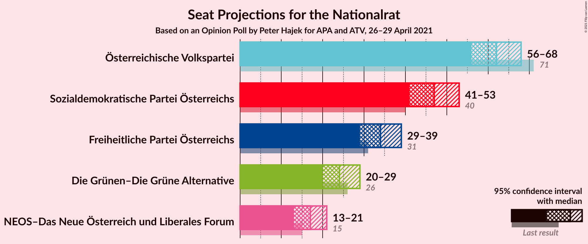
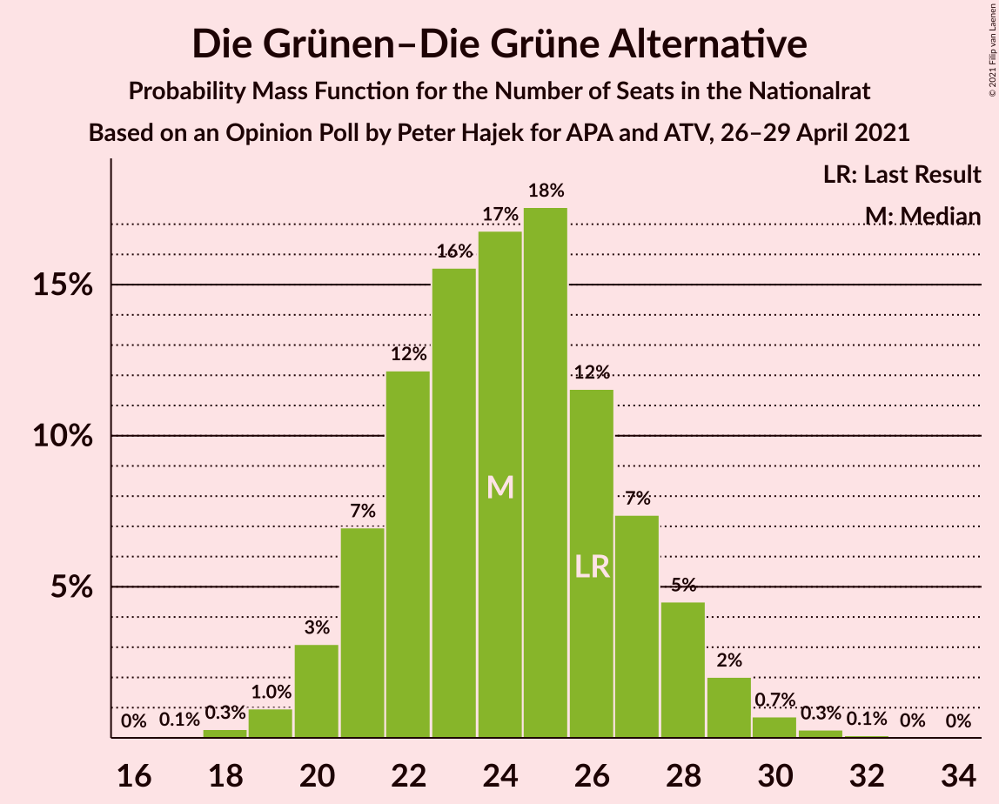
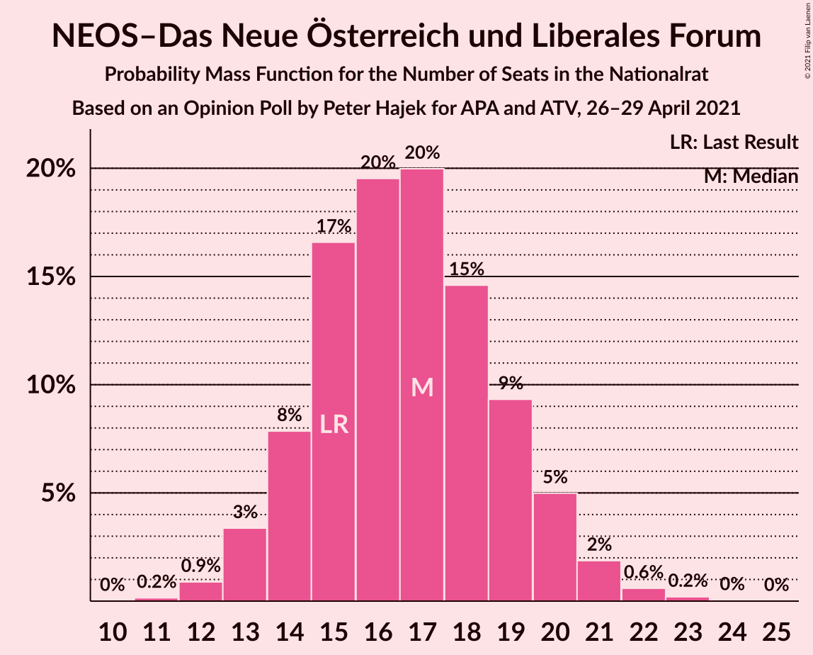
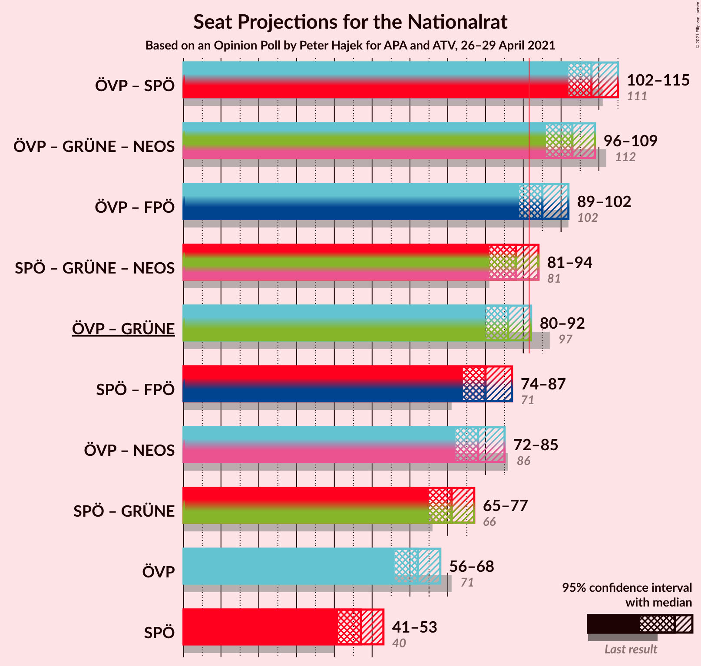
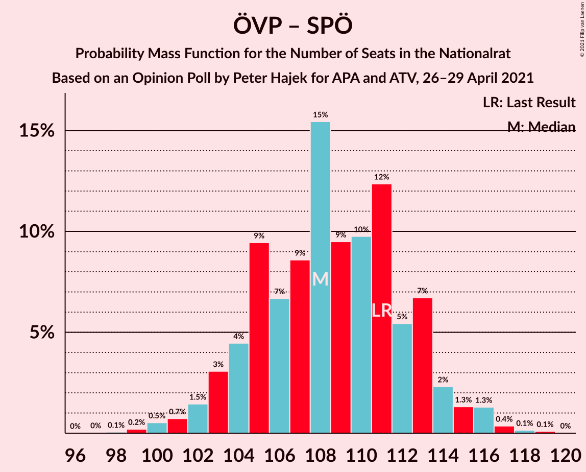
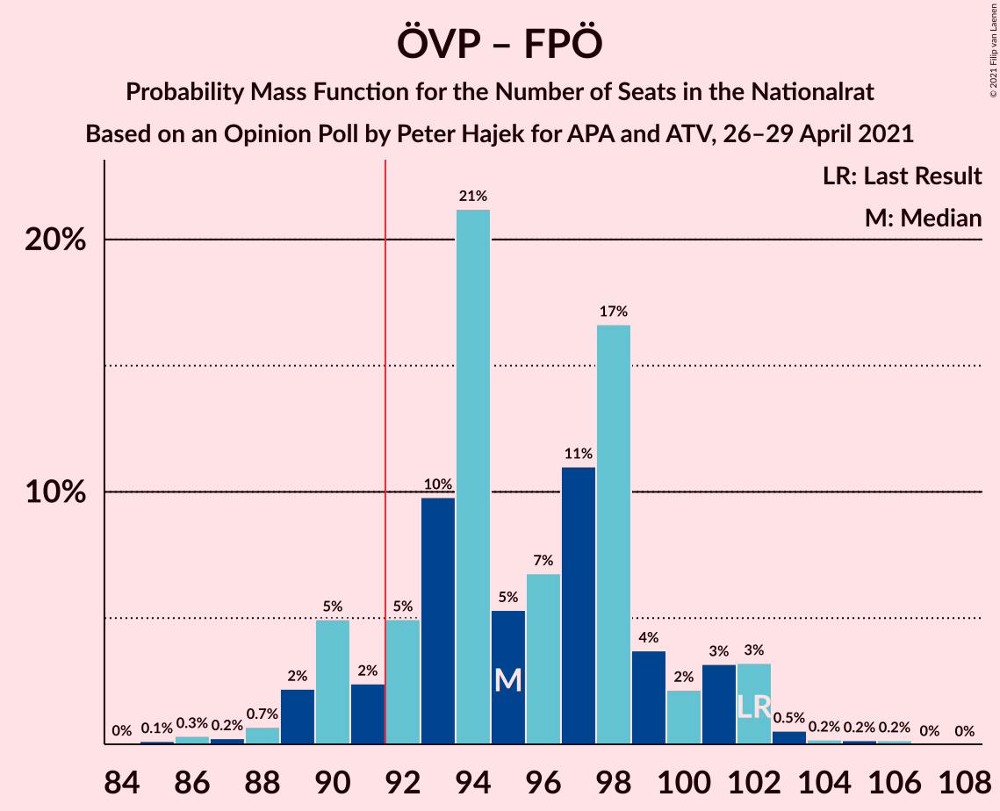
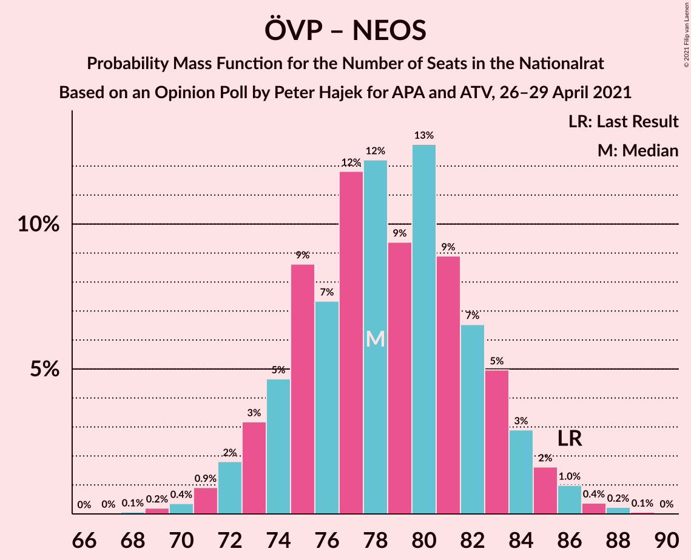

# Opinion Poll by Peter Hajek for APA and ATV, 26–29 April 2021

<a href="#voting-intentions">Voting Intentions</a> | <a href="#seats">Seats</a> | <a href="#coalitions">Coalitions</a> | <a href="#technical-information">Technical Information</a>

## Voting Intentions

### Confidence Intervals

| Party | Last Result | Poll Result | 80% Confidence Interval | 90% Confidence Interval | 95% Confidence Interval | 99% Confidence Interval |
|:-----:|:-----------:|:-----------:|:-----------------------:|:-----------------------:|:-----------------------:|:-----------------------:|
| Österreichische Volkspartei | 37.5% | 33.0% | 30.9–35.2% |30.3–35.8% |29.8–36.3% |28.8–37.4% |
| Sozialdemokratische Partei Österreichs | 21.2% | 25.0% | 23.1–27.0% |22.6–27.6% |22.1–28.1% |21.2–29.1% |
| Freiheitliche Partei Österreichs | 16.2% | 18.0% | 16.4–19.8% |15.9–20.4% |15.5–20.8% |14.7–21.7% |
| Die Grünen–Die Grüne Alternative | 13.9% | 13.0% | 11.6–14.6% |11.2–15.1% |10.8–15.5% |10.2–16.3% |
| NEOS–Das Neue Österreich und Liberales Forum | 8.1% | 9.0% | 7.8–10.4% |7.5–10.8% |7.2–11.2% |6.7–11.9% |

*Note:* The poll result column reflects the actual value used in the calculations. Published results may vary slightly, and in addition be rounded to fewer digits.

## Seats

### Confidence Intervals

| Party | Last Result | Median | 80% Confidence Interval | 90% Confidence Interval | 95% Confidence Interval | 99% Confidence Interval |
|:-----:|:-----------:|:------:|:-----------------------:|:-----------------------:|:-----------------------:|:-----------------------:|
| <a href="#österreichische-volkspartei">Österreichische Volkspartei</a> | 71 | 62 | 58–66 |57–67 |56–68 |54–70 |
| <a href="#sozialdemokratische-partei-österreichs">Sozialdemokratische Partei Österreichs</a> | 40 | 47 | 43–50 |42–51 |41–53 |40–54 |
| <a href="#freiheitliche-partei-österreichs">Freiheitliche Partei Österreichs</a> | 31 | 34 | 30–37 |29–38 |29–39 |27–40 |
| <a href="#die-grünen–die-grüne-alternative">Die Grünen–Die Grüne Alternative</a> | 26 | 24 | 21–27 |21–28 |20–29 |19–30 |
| <a href="#neos–das-neue-österreich-und-liberales-forum">NEOS–Das Neue Österreich und Liberales Forum</a> | 15 | 17 | 14–19 |14–20 |13–21 |12–22 |

### Österreichische Volkspartei

*For a full overview of the results for this party, see the [Österreichische Volkspartei](party-österreichischevolkspartei.html) page.*

| Number of Seats | Probability | Accumulated | Special Marks |
|:---------------:|:-----------:|:-----------:|:-------------:|
| 52 | 0.1% | 100% |  |
| 53 | 0.2% | 99.9% |  |
| 54 | 0.5% | 99.7% |  |
| 55 | 1.3% | 99.1% |  |
| 56 | 2% | 98% |  |
| 57 | 5% | 96% |  |
| 58 | 6% | 91% |  |
| 59 | 8% | 85% |  |
| 60 | 11% | 77% |  |
| 61 | 11% | 66% |  |
| 62 | 13% | 54% | Median |
| 63 | 13% | 41% |  |
| 64 | 8% | 29% |  |
| 65 | 9% | 21% |  |
| 66 | 5% | 12% |  |
| 67 | 3% | 7% |  |
| 68 | 2% | 4% |  |
| 69 | 0.9% | 2% |  |
| 70 | 0.5% | 0.8% |  |
| 71 | 0.2% | 0.3% | Last Result |
| 72 | 0.1% | 0.1% |  |
| 73 | 0% | 0% |  |

### Sozialdemokratische Partei Österreichs

*For a full overview of the results for this party, see the [Sozialdemokratische Partei Österreichs](party-sozialdemokratischeparteiösterreichs.html) page.*

| Number of Seats | Probability | Accumulated | Special Marks |
|:---------------:|:-----------:|:-----------:|:-------------:|
| 38 | 0.1% | 100% |  |
| 39 | 0.3% | 99.9% |  |
| 40 | 0.9% | 99.5% | Last Result |
| 41 | 2% | 98.6% |  |
| 42 | 3% | 97% |  |
| 43 | 6% | 93% |  |
| 44 | 10% | 87% |  |
| 45 | 11% | 77% |  |
| 46 | 13% | 67% |  |
| 47 | 14% | 54% | Median |
| 48 | 12% | 39% |  |
| 49 | 10% | 27% |  |
| 50 | 8% | 17% |  |
| 51 | 5% | 10% |  |
| 52 | 2% | 5% |  |
| 53 | 1.4% | 3% |  |
| 54 | 0.8% | 1.2% |  |
| 55 | 0.3% | 0.4% |  |
| 56 | 0.1% | 0.2% |  |
| 57 | 0% | 0.1% |  |
| 58 | 0% | 0% |  |

### Freiheitliche Partei Österreichs

*For a full overview of the results for this party, see the [Freiheitliche Partei Österreichs](party-freiheitlicheparteiösterreichs.html) page.*

| Number of Seats | Probability | Accumulated | Special Marks |
|:---------------:|:-----------:|:-----------:|:-------------:|
| 26 | 0.2% | 100% |  |
| 27 | 0.4% | 99.8% |  |
| 28 | 1.5% | 99.4% |  |
| 29 | 3% | 98% |  |
| 30 | 6% | 95% |  |
| 31 | 9% | 88% | Last Result |
| 32 | 13% | 79% |  |
| 33 | 15% | 67% |  |
| 34 | 16% | 51% | Median |
| 35 | 13% | 35% |  |
| 36 | 10% | 23% |  |
| 37 | 5% | 12% |  |
| 38 | 4% | 7% |  |
| 39 | 2% | 3% |  |
| 40 | 0.8% | 1.3% |  |
| 41 | 0.3% | 0.5% |  |
| 42 | 0.1% | 0.2% |  |
| 43 | 0% | 0% |  |

### Die Grünen–Die Grüne Alternative

*For a full overview of the results for this party, see the [Die Grünen–Die Grüne Alternative](party-diegrünen–diegrünealternative.html) page.*

| Number of Seats | Probability | Accumulated | Special Marks |
|:---------------:|:-----------:|:-----------:|:-------------:|
| 17 | 0.1% | 100% |  |
| 18 | 0.3% | 99.9% |  |
| 19 | 1.0% | 99.6% |  |
| 20 | 3% | 98.7% |  |
| 21 | 7% | 96% |  |
| 22 | 12% | 89% |  |
| 23 | 16% | 76% |  |
| 24 | 17% | 61% | Median |
| 25 | 18% | 44% |  |
| 26 | 12% | 27% | Last Result |
| 27 | 7% | 15% |  |
| 28 | 5% | 8% |  |
| 29 | 2% | 3% |  |
| 30 | 0.7% | 1.1% |  |
| 31 | 0.3% | 0.4% |  |
| 32 | 0.1% | 0.1% |  |
| 33 | 0% | 0% |  |

### NEOS–Das Neue Österreich und Liberales Forum

*For a full overview of the results for this party, see the [NEOS–Das Neue Österreich und Liberales Forum](party-neos–dasneueösterreichundliberalesforum.html) page.*

| Number of Seats | Probability | Accumulated | Special Marks |
|:---------------:|:-----------:|:-----------:|:-------------:|
| 11 | 0.2% | 100% |  |
| 12 | 0.9% | 99.8% |  |
| 13 | 3% | 98.9% |  |
| 14 | 8% | 96% |  |
| 15 | 17% | 88% | Last Result |
| 16 | 20% | 71% |  |
| 17 | 20% | 52% | Median |
| 18 | 15% | 32% |  |
| 19 | 9% | 17% |  |
| 20 | 5% | 8% |  |
| 21 | 2% | 3% |  |
| 22 | 0.6% | 0.9% |  |
| 23 | 0.2% | 0.3% |  |
| 24 | 0% | 0.1% |  |
| 25 | 0% | 0% |  |

## Coalitions

### Confidence Intervals

| Coalition | Last Result | Median | Majority? | 80% Confidence Interval | 90% Confidence Interval | 95% Confidence Interval | 99% Confidence Interval |
|:---------:|:-----------:|:------:|:---------:|:-----------------------:|:-----------------------:|:-----------------------:|:-----------------------:|
| Österreichische Volkspartei – Sozialdemokratische Partei Österreichs | 111 | 108 | 100% | 104–113 | 103–114 | 102–115 | 100–117 |
| Österreichische Volkspartei – Die Grünen–Die Grüne Alternative – NEOS–Das Neue Österreich und Liberales Forum | 112 | 103 | 100% | 98–107 | 97–108 | 96–109 | 94–111 |
| Österreichische Volkspartei – Freiheitliche Partei Österreichs | 102 | 95 | 89% | 91–99 | 90–101 | 89–102 | 87–104 |
| Sozialdemokratische Partei Österreichs – Die Grünen–Die Grüne Alternative – NEOS–Das Neue Österreich und Liberales Forum | 81 | 88 | 11% | 84–92 | 82–93 | 81–94 | 79–96 |
| Österreichische Volkspartei – Die Grünen–Die Grüne Alternative | 97 | 86 | 5% | 82–90 | 81–91 | 80–92 | 77–94 |
| Sozialdemokratische Partei Österreichs – Freiheitliche Partei Österreichs | 71 | 80 | 0% | 76–85 | 75–86 | 74–87 | 72–89 |
| Österreichische Volkspartei – NEOS–Das Neue Österreich und Liberales Forum | 86 | 78 | 0% | 74–83 | 73–84 | 72–85 | 70–87 |
| Sozialdemokratische Partei Österreichs – Die Grünen–Die Grüne Alternative | 66 | 71 | 0% | 67–75 | 66–76 | 65–77 | 63–79 |
| Österreichische Volkspartei | 71 | 62 | 0% | 58–66 | 57–67 | 56–68 | 54–70 |
| Sozialdemokratische Partei Österreichs | 40 | 47 | 0% | 43–50 | 42–51 | 41–53 | 40–54 |

### Österreichische Volkspartei – Sozialdemokratische Partei Österreichs

| Number of Seats | Probability | Accumulated | Special Marks |
|:---------------:|:-----------:|:-----------:|:-------------:|
| 98 | 0.1% | 100% |  |
| 99 | 0.2% | 99.9% |  |
| 100 | 0.5% | 99.7% |  |
| 101 | 0.7% | 99.2% |  |
| 102 | 1.5% | 98% |  |
| 103 | 3% | 97% |  |
| 104 | 4% | 94% |  |
| 105 | 9% | 89% |  |
| 106 | 7% | 80% |  |
| 107 | 9% | 73% |  |
| 108 | 15% | 65% |  |
| 109 | 9% | 49% | Median |
| 110 | 10% | 40% |  |
| 111 | 12% | 30% | Last Result |
| 112 | 5% | 18% |  |
| 113 | 7% | 12% |  |
| 114 | 2% | 6% |  |
| 115 | 1.3% | 3% |  |
| 116 | 1.3% | 2% |  |
| 117 | 0.4% | 0.6% |  |
| 118 | 0.1% | 0.3% |  |
| 119 | 0.1% | 0.1% |  |
| 120 | 0% | 0% |  |

### Österreichische Volkspartei – Die Grünen–Die Grüne Alternative – NEOS–Das Neue Österreich und Liberales Forum

| Number of Seats | Probability | Accumulated | Special Marks |
|:---------------:|:-----------:|:-----------:|:-------------:|
| 92 | 0.1% | 100% | Majority |
| 93 | 0.2% | 99.9% |  |
| 94 | 0.4% | 99.7% |  |
| 95 | 0.8% | 99.3% |  |
| 96 | 2% | 98.5% |  |
| 97 | 3% | 97% |  |
| 98 | 5% | 94% |  |
| 99 | 7% | 89% |  |
| 100 | 9% | 83% |  |
| 101 | 10% | 74% |  |
| 102 | 13% | 63% |  |
| 103 | 10% | 51% | Median |
| 104 | 11% | 41% |  |
| 105 | 9% | 29% |  |
| 106 | 7% | 20% |  |
| 107 | 6% | 13% |  |
| 108 | 3% | 7% |  |
| 109 | 2% | 3% |  |
| 110 | 1.1% | 2% |  |
| 111 | 0.4% | 0.8% |  |
| 112 | 0.2% | 0.4% | Last Result |
| 113 | 0.1% | 0.1% |  |
| 114 | 0% | 0% |  |

### Österreichische Volkspartei – Freiheitliche Partei Österreichs

| Number of Seats | Probability | Accumulated | Special Marks |
|:---------------:|:-----------:|:-----------:|:-------------:|
| 85 | 0.1% | 100% |  |
| 86 | 0.3% | 99.8% |  |
| 87 | 0.2% | 99.5% |  |
| 88 | 0.7% | 99.3% |  |
| 89 | 2% | 98.6% |  |
| 90 | 5% | 96% |  |
| 91 | 2% | 91% |  |
| 92 | 5% | 89% | Majority |
| 93 | 10% | 84% |  |
| 94 | 21% | 74% |  |
| 95 | 5% | 53% |  |
| 96 | 7% | 48% | Median |
| 97 | 11% | 41% |  |
| 98 | 17% | 30% |  |
| 99 | 4% | 13% |  |
| 100 | 2% | 10% |  |
| 101 | 3% | 7% |  |
| 102 | 3% | 4% | Last Result |
| 103 | 0.5% | 1.1% |  |
| 104 | 0.2% | 0.5% |  |
| 105 | 0.2% | 0.3% |  |
| 106 | 0.2% | 0.2% |  |
| 107 | 0% | 0% |  |

### Sozialdemokratische Partei Österreichs – Die Grünen–Die Grüne Alternative – NEOS–Das Neue Österreich und Liberales Forum

| Number of Seats | Probability | Accumulated | Special Marks |
|:---------------:|:-----------:|:-----------:|:-------------:|
| 77 | 0.2% | 100% |  |
| 78 | 0.2% | 99.8% |  |
| 79 | 0.2% | 99.7% |  |
| 80 | 0.5% | 99.5% |  |
| 81 | 3% | 98.9% | Last Result |
| 82 | 3% | 96% |  |
| 83 | 2% | 93% |  |
| 84 | 4% | 90% |  |
| 85 | 17% | 87% |  |
| 86 | 11% | 70% |  |
| 87 | 7% | 59% |  |
| 88 | 5% | 52% | Median |
| 89 | 21% | 47% |  |
| 90 | 10% | 26% |  |
| 91 | 5% | 16% |  |
| 92 | 2% | 11% | Majority |
| 93 | 5% | 9% |  |
| 94 | 2% | 4% |  |
| 95 | 0.7% | 1.4% |  |
| 96 | 0.2% | 0.7% |  |
| 97 | 0.3% | 0.5% |  |
| 98 | 0.1% | 0.2% |  |
| 99 | 0% | 0% |  |

### Österreichische Volkspartei – Die Grünen–Die Grüne Alternative

| Number of Seats | Probability | Accumulated | Special Marks |
|:---------------:|:-----------:|:-----------:|:-------------:|
| 75 | 0% | 100% |  |
| 76 | 0.1% | 99.9% |  |
| 77 | 0.4% | 99.8% |  |
| 78 | 0.6% | 99.5% |  |
| 79 | 1.3% | 98.9% |  |
| 80 | 3% | 98% |  |
| 81 | 4% | 95% |  |
| 82 | 6% | 91% |  |
| 83 | 8% | 85% |  |
| 84 | 10% | 77% |  |
| 85 | 11% | 67% |  |
| 86 | 13% | 56% | Median |
| 87 | 10% | 43% |  |
| 88 | 10% | 33% |  |
| 89 | 8% | 23% |  |
| 90 | 6% | 15% |  |
| 91 | 4% | 9% |  |
| 92 | 2% | 5% | Majority |
| 93 | 1.3% | 2% |  |
| 94 | 0.7% | 1.2% |  |
| 95 | 0.3% | 0.5% |  |
| 96 | 0.1% | 0.2% |  |
| 97 | 0% | 0.1% | Last Result |
| 98 | 0% | 0% |  |

### Sozialdemokratische Partei Österreichs – Freiheitliche Partei Österreichs

| Number of Seats | Probability | Accumulated | Special Marks |
|:---------------:|:-----------:|:-----------:|:-------------:|
| 70 | 0.1% | 100% |  |
| 71 | 0.2% | 99.9% | Last Result |
| 72 | 0.4% | 99.6% |  |
| 73 | 1.1% | 99.2% |  |
| 74 | 2% | 98% |  |
| 75 | 3% | 97% |  |
| 76 | 6% | 93% |  |
| 77 | 7% | 87% |  |
| 78 | 9% | 80% |  |
| 79 | 11% | 71% |  |
| 80 | 10% | 59% |  |
| 81 | 13% | 49% | Median |
| 82 | 10% | 37% |  |
| 83 | 9% | 26% |  |
| 84 | 7% | 17% |  |
| 85 | 5% | 11% |  |
| 86 | 3% | 6% |  |
| 87 | 2% | 3% |  |
| 88 | 0.8% | 1.5% |  |
| 89 | 0.4% | 0.7% |  |
| 90 | 0.2% | 0.3% |  |
| 91 | 0.1% | 0.1% |  |
| 92 | 0% | 0% | Majority |

### Österreichische Volkspartei – NEOS–Das Neue Österreich und Liberales Forum

| Number of Seats | Probability | Accumulated | Special Marks |
|:---------------:|:-----------:|:-----------:|:-------------:|
| 68 | 0.1% | 100% |  |
| 69 | 0.2% | 99.9% |  |
| 70 | 0.4% | 99.7% |  |
| 71 | 0.9% | 99.3% |  |
| 72 | 2% | 98% |  |
| 73 | 3% | 97% |  |
| 74 | 5% | 93% |  |
| 75 | 9% | 89% |  |
| 76 | 7% | 80% |  |
| 77 | 12% | 73% |  |
| 78 | 12% | 61% |  |
| 79 | 9% | 49% | Median |
| 80 | 13% | 39% |  |
| 81 | 9% | 27% |  |
| 82 | 7% | 18% |  |
| 83 | 5% | 11% |  |
| 84 | 3% | 6% |  |
| 85 | 2% | 3% |  |
| 86 | 1.0% | 2% | Last Result |
| 87 | 0.4% | 0.7% |  |
| 88 | 0.2% | 0.3% |  |
| 89 | 0.1% | 0.1% |  |
| 90 | 0% | 0% |  |

### Sozialdemokratische Partei Österreichs – Die Grünen–Die Grüne Alternative

| Number of Seats | Probability | Accumulated | Special Marks |
|:---------------:|:-----------:|:-----------:|:-------------:|
| 61 | 0.1% | 100% |  |
| 62 | 0.3% | 99.8% |  |
| 63 | 0.5% | 99.6% |  |
| 64 | 1.4% | 99.1% |  |
| 65 | 2% | 98% |  |
| 66 | 4% | 95% | Last Result |
| 67 | 6% | 92% |  |
| 68 | 8% | 86% |  |
| 69 | 10% | 77% |  |
| 70 | 11% | 67% |  |
| 71 | 12% | 56% | Median |
| 72 | 14% | 44% |  |
| 73 | 9% | 30% |  |
| 74 | 7% | 21% |  |
| 75 | 6% | 14% |  |
| 76 | 3% | 8% |  |
| 77 | 2% | 4% |  |
| 78 | 1.2% | 2% |  |
| 79 | 0.5% | 1.0% |  |
| 80 | 0.3% | 0.5% |  |
| 81 | 0.1% | 0.2% |  |
| 82 | 0% | 0.1% |  |
| 83 | 0% | 0% |  |

### Österreichische Volkspartei

| Number of Seats | Probability | Accumulated | Special Marks |
|:---------------:|:-----------:|:-----------:|:-------------:|
| 52 | 0.1% | 100% |  |
| 53 | 0.2% | 99.9% |  |
| 54 | 0.5% | 99.7% |  |
| 55 | 1.3% | 99.1% |  |
| 56 | 2% | 98% |  |
| 57 | 5% | 96% |  |
| 58 | 6% | 91% |  |
| 59 | 8% | 85% |  |
| 60 | 11% | 77% |  |
| 61 | 11% | 66% |  |
| 62 | 13% | 54% | Median |
| 63 | 13% | 41% |  |
| 64 | 8% | 29% |  |
| 65 | 9% | 21% |  |
| 66 | 5% | 12% |  |
| 67 | 3% | 7% |  |
| 68 | 2% | 4% |  |
| 69 | 0.9% | 2% |  |
| 70 | 0.5% | 0.8% |  |
| 71 | 0.2% | 0.3% | Last Result |
| 72 | 0.1% | 0.1% |  |
| 73 | 0% | 0% |  |

### Sozialdemokratische Partei Österreichs

| Number of Seats | Probability | Accumulated | Special Marks |
|:---------------:|:-----------:|:-----------:|:-------------:|
| 38 | 0.1% | 100% |  |
| 39 | 0.3% | 99.9% |  |
| 40 | 0.9% | 99.5% | Last Result |
| 41 | 2% | 98.6% |  |
| 42 | 3% | 97% |  |
| 43 | 6% | 93% |  |
| 44 | 10% | 87% |  |
| 45 | 11% | 77% |  |
| 46 | 13% | 67% |  |
| 47 | 14% | 54% | Median |
| 48 | 12% | 39% |  |
| 49 | 10% | 27% |  |
| 50 | 8% | 17% |  |
| 51 | 5% | 10% |  |
| 52 | 2% | 5% |  |
| 53 | 1.4% | 3% |  |
| 54 | 0.8% | 1.2% |  |
| 55 | 0.3% | 0.4% |  |
| 56 | 0.1% | 0.2% |  |
| 57 | 0% | 0.1% |  |
| 58 | 0% | 0% |  |

## Technical Information

### Opinion Poll

+ **Polling firm:** Peter Hajek
+ **Commissioner(s):** APA and ATV
+ **Fieldwork period:** 26–29 April 2021

### Calculations

+ **Sample size:** 800
+ **Simulations done:** 131,072
+ **Error estimate:** 1.20%

