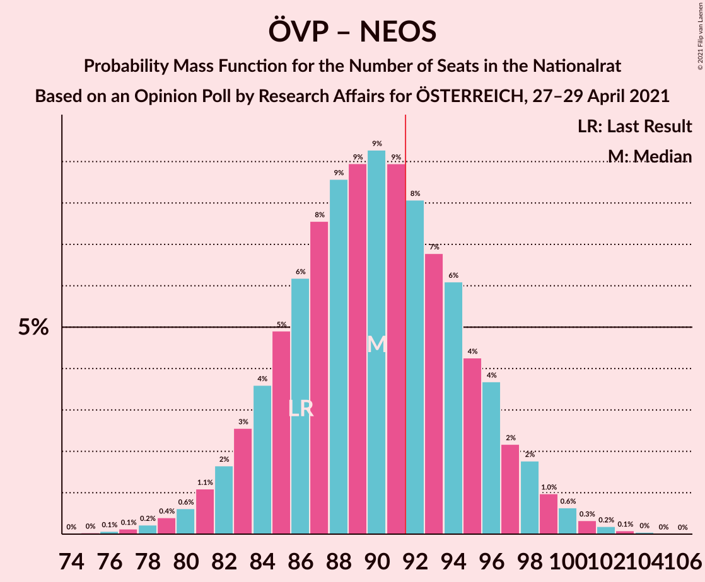
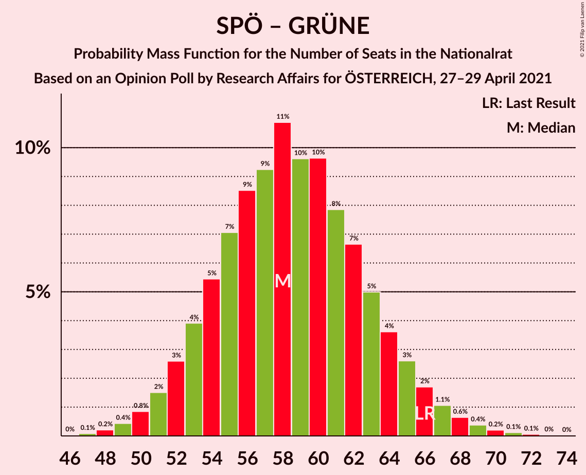

# Opinion Poll by Research Affairs for ÖSTERREICH, 27–29 April 2021

<a href="#voting-intentions">Voting Intentions</a> | <a href="#seats">Seats</a> | <a href="#coalitions">Coalitions</a> | <a href="#technical-information">Technical Information</a>

## Voting Intentions

### Confidence Intervals

| Party | Last Result | Poll Result | 80% Confidence Interval | 90% Confidence Interval | 95% Confidence Interval | 99% Confidence Interval |
|:-----:|:-----------:|:-----------:|:-----------------------:|:-----------------------:|:-----------------------:|:-----------------------:|
| Österreichische Volkspartei | 37.5% | 36.0% | 33.3–38.8% |32.6–39.6% |32.0–40.3% |30.7–41.6% |
| Sozialdemokratische Partei Österreichs | 21.2% | 20.0% | 17.8–22.4% |17.2–23.1% |16.7–23.7% |15.7–24.8% |
| Freiheitliche Partei Österreichs | 16.2% | 16.0% | 14.1–18.3% |13.6–18.9% |13.1–19.5% |12.2–20.6% |
| NEOS–Das Neue Österreich und Liberales Forum | 8.1% | 11.9% | 10.3–14.0% |9.8–14.5% |9.4–15.0% |8.7–16.1% |
| Die Grünen–Die Grüne Alternative | 13.9% | 11.9% | 10.3–14.0% |9.8–14.5% |9.4–15.0% |8.7–16.1% |

*Note:* The poll result column reflects the actual value used in the calculations. Published results may vary slightly, and in addition be rounded to fewer digits.

## Seats

### Confidence Intervals

| Party | Last Result | Median | 80% Confidence Interval | 90% Confidence Interval | 95% Confidence Interval | 99% Confidence Interval |
|:-----:|:-----------:|:------:|:-----------------------:|:-----------------------:|:-----------------------:|:-----------------------:|
| <a href="#österreichische-volkspartei">Österreichische Volkspartei</a> | 71 | 67 | 61–72 |60–74 |59–75 |56–78 |
| <a href="#sozialdemokratische-partei-österreichs">Sozialdemokratische Partei Österreichs</a> | 40 | 37 | 33–41 |32–43 |31–44 |29–46 |
| <a href="#freiheitliche-partei-österreichs">Freiheitliche Partei Österreichs</a> | 31 | 29 | 26–34 |25–35 |24–36 |22–38 |
| <a href="#neos–das-neue-österreich-und-liberales-forum">NEOS–Das Neue Österreich und Liberales Forum</a> | 15 | 23 | 22–25 |21–25 |16–25 |15–30 |
| <a href="#die-grünen–die-grüne-alternative">Die Grünen–Die Grüne Alternative</a> | 26 | 22 | 18–25 |18–26 |17–27 |16–29 |

### Österreichische Volkspartei

*For a full overview of the results for this party, see the [Österreichische Volkspartei](party-österreichischevolkspartei.html) page.*

| Number of Seats | Probability | Accumulated | Special Marks |
|:---------------:|:-----------:|:-----------:|:-------------:|
| 54 | 0.1% | 100% |  |
| 55 | 0.1% | 99.9% |  |
| 56 | 0.3% | 99.7% |  |
| 57 | 0.6% | 99.4% |  |
| 58 | 1.0% | 98.9% |  |
| 59 | 2% | 98% |  |
| 60 | 3% | 96% |  |
| 61 | 4% | 93% |  |
| 62 | 5% | 90% |  |
| 63 | 7% | 84% |  |
| 64 | 8% | 78% |  |
| 65 | 9% | 70% |  |
| 66 | 9% | 61% |  |
| 67 | 10% | 52% | Median |
| 68 | 9% | 42% |  |
| 69 | 8% | 33% |  |
| 70 | 7% | 25% |  |
| 71 | 6% | 19% | Last Result |
| 72 | 4% | 13% |  |
| 73 | 3% | 9% |  |
| 74 | 2% | 6% |  |
| 75 | 1.5% | 3% |  |
| 76 | 0.8% | 2% |  |
| 77 | 0.5% | 1.1% |  |
| 78 | 0.3% | 0.6% |  |
| 79 | 0.1% | 0.3% |  |
| 80 | 0.1% | 0.2% |  |
| 81 | 0% | 0.1% |  |
| 82 | 0% | 0% |  |

### Sozialdemokratische Partei Österreichs

*For a full overview of the results for this party, see the [Sozialdemokratische Partei Österreichs](party-sozialdemokratischeparteiösterreichs.html) page.*

| Number of Seats | Probability | Accumulated | Special Marks |
|:---------------:|:-----------:|:-----------:|:-------------:|
| 27 | 0.1% | 100% |  |
| 28 | 0.3% | 99.9% |  |
| 29 | 0.7% | 99.6% |  |
| 30 | 1.4% | 98.9% |  |
| 31 | 2% | 98% |  |
| 32 | 4% | 95% |  |
| 33 | 6% | 91% |  |
| 34 | 9% | 84% |  |
| 35 | 10% | 76% |  |
| 36 | 11% | 66% |  |
| 37 | 12% | 54% | Median |
| 38 | 11% | 42% |  |
| 39 | 9% | 31% |  |
| 40 | 7% | 22% | Last Result |
| 41 | 5% | 15% |  |
| 42 | 4% | 9% |  |
| 43 | 2% | 5% |  |
| 44 | 1.5% | 3% |  |
| 45 | 0.8% | 2% |  |
| 46 | 0.4% | 0.8% |  |
| 47 | 0.2% | 0.4% |  |
| 48 | 0.1% | 0.2% |  |
| 49 | 0% | 0.1% |  |
| 50 | 0% | 0% |  |

### Freiheitliche Partei Österreichs

*For a full overview of the results for this party, see the [Freiheitliche Partei Österreichs](party-freiheitlicheparteiösterreichs.html) page.*

| Number of Seats | Probability | Accumulated | Special Marks |
|:---------------:|:-----------:|:-----------:|:-------------:|
| 20 | 0% | 100% |  |
| 21 | 0.2% | 99.9% |  |
| 22 | 0.4% | 99.8% |  |
| 23 | 1.1% | 99.3% |  |
| 24 | 2% | 98% |  |
| 25 | 5% | 96% |  |
| 26 | 7% | 91% |  |
| 27 | 10% | 85% |  |
| 28 | 11% | 75% |  |
| 29 | 13% | 63% | Median |
| 30 | 12% | 50% |  |
| 31 | 12% | 38% | Last Result |
| 32 | 8% | 26% |  |
| 33 | 7% | 18% |  |
| 34 | 5% | 11% |  |
| 35 | 3% | 6% |  |
| 36 | 2% | 3% |  |
| 37 | 0.9% | 2% |  |
| 38 | 0.5% | 0.8% |  |
| 39 | 0.2% | 0.4% |  |
| 40 | 0.1% | 0.1% |  |
| 41 | 0% | 0.1% |  |
| 42 | 0% | 0% |  |

### NEOS–Das Neue Österreich und Liberales Forum

*For a full overview of the results for this party, see the [NEOS–Das Neue Österreich und Liberales Forum](party-neos–dasneueösterreichundliberalesforum.html) page.*

| Number of Seats | Probability | Accumulated | Special Marks |
|:---------------:|:-----------:|:-----------:|:-------------:|
| 14 | 0.2% | 100% |  |
| 15 | 1.0% | 99.8% | Last Result |
| 16 | 2% | 98.8% |  |
| 17 | 1.0% | 97% |  |
| 18 | 0.2% | 96% |  |
| 19 | 0% | 96% |  |
| 20 | 0% | 96% |  |
| 21 | 1.1% | 96% |  |
| 22 | 14% | 95% |  |
| 23 | 37% | 81% | Median |
| 24 | 31% | 43% |  |
| 25 | 10% | 12% |  |
| 26 | 1.2% | 2% |  |
| 27 | 0.1% | 0.6% |  |
| 28 | 0% | 0.5% |  |
| 29 | 0% | 0.5% |  |
| 30 | 0.1% | 0.5% |  |
| 31 | 0.2% | 0.4% |  |
| 32 | 0.2% | 0.2% |  |
| 33 | 0.1% | 0.1% |  |
| 34 | 0% | 0% |  |

### Die Grünen–Die Grüne Alternative

*For a full overview of the results for this party, see the [Die Grünen–Die Grüne Alternative](party-diegrünen–diegrünealternative.html) page.*

| Number of Seats | Probability | Accumulated | Special Marks |
|:---------------:|:-----------:|:-----------:|:-------------:|
| 14 | 0.1% | 100% |  |
| 15 | 0.4% | 99.9% |  |
| 16 | 1.2% | 99.5% |  |
| 17 | 3% | 98% |  |
| 18 | 6% | 95% |  |
| 19 | 10% | 89% |  |
| 20 | 14% | 79% |  |
| 21 | 15% | 65% |  |
| 22 | 15% | 50% | Median |
| 23 | 12% | 35% |  |
| 24 | 9% | 22% |  |
| 25 | 6% | 13% |  |
| 26 | 3% | 7% | Last Result |
| 27 | 2% | 4% |  |
| 28 | 0.9% | 2% |  |
| 29 | 0.5% | 0.9% |  |
| 30 | 0.3% | 0.4% |  |
| 31 | 0.1% | 0.2% |  |
| 32 | 0% | 0.1% |  |
| 33 | 0% | 0% |  |

## Coalitions

### Confidence Intervals

| Coalition | Last Result | Median | Majority? | 80% Confidence Interval | 90% Confidence Interval | 95% Confidence Interval | 99% Confidence Interval |
|:---------:|:-----------:|:------:|:---------:|:-----------------------:|:-----------------------:|:-----------------------:|:-----------------------:|
| Österreichische Volkspartei – Die Grünen–Die Grüne Alternative – NEOS–Das Neue Österreich und Liberales Forum | 112 | 111 | 100% | 106–118 | 104–119 | 103–121 | 100–123 |
| Österreichische Volkspartei – Sozialdemokratische Partei Österreichs | 111 | 104 | 99.7% | 98–110 | 96–111 | 95–113 | 92–115 |
| Österreichische Volkspartei – Freiheitliche Partei Österreichs | 102 | 96 | 86% | 91–102 | 89–104 | 88–105 | 85–108 |
| Österreichische Volkspartei – NEOS–Das Neue Österreich und Liberales Forum | 86 | 90 | 35% | 84–95 | 83–97 | 81–98 | 79–101 |
| Österreichische Volkspartei – Die Grünen–Die Grüne Alternative | 97 | 88 | 23% | 83–94 | 81–96 | 80–97 | 78–100 |
| Sozialdemokratische Partei Österreichs – Die Grünen–Die Grüne Alternative – NEOS–Das Neue Österreich und Liberales Forum | 81 | 82 | 1.4% | 76–87 | 75–89 | 73–90 | 71–93 |
| Sozialdemokratische Partei Österreichs – Freiheitliche Partei Österreichs | 71 | 66 | 0% | 61–72 | 60–74 | 59–75 | 56–78 |
| Österreichische Volkspartei | 71 | 67 | 0% | 61–72 | 60–74 | 59–75 | 56–78 |
| Sozialdemokratische Partei Österreichs – Die Grünen–Die Grüne Alternative | 66 | 58 | 0% | 54–64 | 52–65 | 51–67 | 49–69 |
| Sozialdemokratische Partei Österreichs | 40 | 37 | 0% | 33–41 | 32–43 | 31–44 | 29–46 |

### Österreichische Volkspartei – Die Grünen–Die Grüne Alternative – NEOS–Das Neue Österreich und Liberales Forum

| Number of Seats | Probability | Accumulated | Special Marks |
|:---------------:|:-----------:|:-----------:|:-------------:|
| 97 | 0% | 100% |  |
| 98 | 0.1% | 99.9% |  |
| 99 | 0.2% | 99.8% |  |
| 100 | 0.4% | 99.6% |  |
| 101 | 0.6% | 99.3% |  |
| 102 | 1.1% | 98.6% |  |
| 103 | 2% | 98% |  |
| 104 | 2% | 96% |  |
| 105 | 3% | 93% |  |
| 106 | 5% | 90% |  |
| 107 | 5% | 85% |  |
| 108 | 7% | 80% |  |
| 109 | 7% | 73% |  |
| 110 | 8% | 66% |  |
| 111 | 8% | 58% |  |
| 112 | 8% | 49% | Last Result, Median |
| 113 | 8% | 41% |  |
| 114 | 7% | 33% |  |
| 115 | 6% | 26% |  |
| 116 | 5% | 20% |  |
| 117 | 4% | 15% |  |
| 118 | 3% | 11% |  |
| 119 | 2% | 7% |  |
| 120 | 2% | 5% |  |
| 121 | 1.3% | 3% |  |
| 122 | 0.7% | 2% |  |
| 123 | 0.5% | 0.9% |  |
| 124 | 0.2% | 0.5% |  |
| 125 | 0.1% | 0.2% |  |
| 126 | 0.1% | 0.1% |  |
| 127 | 0% | 0% |  |

### Österreichische Volkspartei – Sozialdemokratische Partei Österreichs

| Number of Seats | Probability | Accumulated | Special Marks |
|:---------------:|:-----------:|:-----------:|:-------------:|
| 89 | 0% | 100% |  |
| 90 | 0.1% | 99.9% |  |
| 91 | 0.2% | 99.9% |  |
| 92 | 0.3% | 99.7% | Majority |
| 93 | 0.5% | 99.4% |  |
| 94 | 0.9% | 98.9% |  |
| 95 | 1.5% | 98% |  |
| 96 | 2% | 96% |  |
| 97 | 3% | 94% |  |
| 98 | 4% | 91% |  |
| 99 | 5% | 87% |  |
| 100 | 7% | 81% |  |
| 101 | 7% | 75% |  |
| 102 | 8% | 67% |  |
| 103 | 8% | 59% |  |
| 104 | 8% | 51% | Median |
| 105 | 8% | 42% |  |
| 106 | 7% | 34% |  |
| 107 | 7% | 27% |  |
| 108 | 6% | 21% |  |
| 109 | 4% | 15% |  |
| 110 | 3% | 11% |  |
| 111 | 3% | 8% | Last Result |
| 112 | 2% | 5% |  |
| 113 | 1.2% | 3% |  |
| 114 | 0.7% | 2% |  |
| 115 | 0.5% | 1.0% |  |
| 116 | 0.3% | 0.5% |  |
| 117 | 0.1% | 0.2% |  |
| 118 | 0.1% | 0.1% |  |
| 119 | 0% | 0% |  |

### Österreichische Volkspartei – Freiheitliche Partei Österreichs

| Number of Seats | Probability | Accumulated | Special Marks |
|:---------------:|:-----------:|:-----------:|:-------------:|
| 82 | 0% | 100% |  |
| 83 | 0.1% | 99.9% |  |
| 84 | 0.2% | 99.8% |  |
| 85 | 0.3% | 99.7% |  |
| 86 | 0.6% | 99.3% |  |
| 87 | 1.1% | 98.7% |  |
| 88 | 2% | 98% |  |
| 89 | 2% | 96% |  |
| 90 | 3% | 94% |  |
| 91 | 5% | 90% |  |
| 92 | 6% | 86% | Majority |
| 93 | 7% | 80% |  |
| 94 | 7% | 73% |  |
| 95 | 9% | 65% |  |
| 96 | 8% | 57% | Median |
| 97 | 8% | 48% |  |
| 98 | 8% | 40% |  |
| 99 | 7% | 32% |  |
| 100 | 6% | 25% |  |
| 101 | 5% | 18% |  |
| 102 | 4% | 13% | Last Result |
| 103 | 3% | 9% |  |
| 104 | 2% | 6% |  |
| 105 | 2% | 4% |  |
| 106 | 1.0% | 2% |  |
| 107 | 0.6% | 1.4% |  |
| 108 | 0.4% | 0.8% |  |
| 109 | 0.2% | 0.4% |  |
| 110 | 0.1% | 0.2% |  |
| 111 | 0.1% | 0.1% |  |
| 112 | 0% | 0% |  |

### Österreichische Volkspartei – NEOS–Das Neue Österreich und Liberales Forum

| Number of Seats | Probability | Accumulated | Special Marks |
|:---------------:|:-----------:|:-----------:|:-------------:|
| 75 | 0% | 100% |  |
| 76 | 0.1% | 99.9% |  |
| 77 | 0.1% | 99.9% |  |
| 78 | 0.2% | 99.7% |  |
| 79 | 0.4% | 99.5% |  |
| 80 | 0.6% | 99.1% |  |
| 81 | 1.1% | 98% |  |
| 82 | 2% | 97% |  |
| 83 | 3% | 96% |  |
| 84 | 4% | 93% |  |
| 85 | 5% | 90% |  |
| 86 | 6% | 85% | Last Result |
| 87 | 8% | 78% |  |
| 88 | 9% | 71% |  |
| 89 | 9% | 62% |  |
| 90 | 9% | 53% | Median |
| 91 | 9% | 44% |  |
| 92 | 8% | 35% | Majority |
| 93 | 7% | 27% |  |
| 94 | 6% | 20% |  |
| 95 | 4% | 14% |  |
| 96 | 4% | 10% |  |
| 97 | 2% | 6% |  |
| 98 | 2% | 4% |  |
| 99 | 1.0% | 2% |  |
| 100 | 0.6% | 1.3% |  |
| 101 | 0.3% | 0.7% |  |
| 102 | 0.2% | 0.4% |  |
| 103 | 0.1% | 0.2% |  |
| 104 | 0% | 0.1% |  |
| 105 | 0% | 0% |  |

### Österreichische Volkspartei – Die Grünen–Die Grüne Alternative

| Number of Seats | Probability | Accumulated | Special Marks |
|:---------------:|:-----------:|:-----------:|:-------------:|
| 75 | 0.1% | 100% |  |
| 76 | 0.1% | 99.9% |  |
| 77 | 0.2% | 99.8% |  |
| 78 | 0.5% | 99.6% |  |
| 79 | 0.8% | 99.1% |  |
| 80 | 2% | 98% |  |
| 81 | 2% | 97% |  |
| 82 | 3% | 95% |  |
| 83 | 4% | 91% |  |
| 84 | 6% | 87% |  |
| 85 | 7% | 81% |  |
| 86 | 8% | 74% |  |
| 87 | 9% | 66% |  |
| 88 | 9% | 57% |  |
| 89 | 9% | 48% | Median |
| 90 | 8% | 39% |  |
| 91 | 7% | 31% |  |
| 92 | 6% | 23% | Majority |
| 93 | 5% | 17% |  |
| 94 | 4% | 12% |  |
| 95 | 3% | 8% |  |
| 96 | 2% | 6% |  |
| 97 | 1.4% | 3% | Last Result |
| 98 | 0.8% | 2% |  |
| 99 | 0.5% | 1.3% |  |
| 100 | 0.3% | 0.7% |  |
| 101 | 0.2% | 0.4% |  |
| 102 | 0.1% | 0.2% |  |
| 103 | 0.1% | 0.1% |  |
| 104 | 0% | 0.1% |  |
| 105 | 0% | 0% |  |

### Sozialdemokratische Partei Österreichs – Die Grünen–Die Grüne Alternative – NEOS–Das Neue Österreich und Liberales Forum

| Number of Seats | Probability | Accumulated | Special Marks |
|:---------------:|:-----------:|:-----------:|:-------------:|
| 68 | 0% | 100% |  |
| 69 | 0.1% | 99.9% |  |
| 70 | 0.2% | 99.8% |  |
| 71 | 0.4% | 99.6% |  |
| 72 | 0.7% | 99.2% |  |
| 73 | 1.2% | 98% |  |
| 74 | 2% | 97% |  |
| 75 | 3% | 95% |  |
| 76 | 4% | 92% |  |
| 77 | 5% | 88% |  |
| 78 | 7% | 83% |  |
| 79 | 8% | 76% |  |
| 80 | 8% | 68% |  |
| 81 | 9% | 60% | Last Result |
| 82 | 9% | 51% | Median |
| 83 | 9% | 42% |  |
| 84 | 8% | 34% |  |
| 85 | 7% | 26% |  |
| 86 | 6% | 19% |  |
| 87 | 4% | 14% |  |
| 88 | 3% | 9% |  |
| 89 | 2% | 6% |  |
| 90 | 2% | 4% |  |
| 91 | 1.0% | 2% |  |
| 92 | 0.6% | 1.4% | Majority |
| 93 | 0.3% | 0.7% |  |
| 94 | 0.2% | 0.4% |  |
| 95 | 0.1% | 0.2% |  |
| 96 | 0% | 0.1% |  |
| 97 | 0% | 0% |  |

### Sozialdemokratische Partei Österreichs – Freiheitliche Partei Österreichs

| Number of Seats | Probability | Accumulated | Special Marks |
|:---------------:|:-----------:|:-----------:|:-------------:|
| 54 | 0.1% | 100% |  |
| 55 | 0.2% | 99.9% |  |
| 56 | 0.3% | 99.7% |  |
| 57 | 0.7% | 99.4% |  |
| 58 | 1.1% | 98.7% |  |
| 59 | 2% | 98% |  |
| 60 | 3% | 96% |  |
| 61 | 4% | 93% |  |
| 62 | 5% | 89% |  |
| 63 | 8% | 83% |  |
| 64 | 8% | 76% |  |
| 65 | 9% | 68% |  |
| 66 | 9% | 59% | Median |
| 67 | 10% | 50% |  |
| 68 | 9% | 40% |  |
| 69 | 7% | 32% |  |
| 70 | 7% | 24% |  |
| 71 | 5% | 18% | Last Result |
| 72 | 4% | 12% |  |
| 73 | 3% | 8% |  |
| 74 | 2% | 5% |  |
| 75 | 1.4% | 3% |  |
| 76 | 0.8% | 2% |  |
| 77 | 0.5% | 1.0% |  |
| 78 | 0.3% | 0.6% |  |
| 79 | 0.2% | 0.3% |  |
| 80 | 0.1% | 0.1% |  |
| 81 | 0% | 0.1% |  |
| 82 | 0% | 0% |  |

### Österreichische Volkspartei

| Number of Seats | Probability | Accumulated | Special Marks |
|:---------------:|:-----------:|:-----------:|:-------------:|
| 54 | 0.1% | 100% |  |
| 55 | 0.1% | 99.9% |  |
| 56 | 0.3% | 99.7% |  |
| 57 | 0.6% | 99.4% |  |
| 58 | 1.0% | 98.9% |  |
| 59 | 2% | 98% |  |
| 60 | 3% | 96% |  |
| 61 | 4% | 93% |  |
| 62 | 5% | 90% |  |
| 63 | 7% | 84% |  |
| 64 | 8% | 78% |  |
| 65 | 9% | 70% |  |
| 66 | 9% | 61% |  |
| 67 | 10% | 52% | Median |
| 68 | 9% | 42% |  |
| 69 | 8% | 33% |  |
| 70 | 7% | 25% |  |
| 71 | 6% | 19% | Last Result |
| 72 | 4% | 13% |  |
| 73 | 3% | 9% |  |
| 74 | 2% | 6% |  |
| 75 | 1.5% | 3% |  |
| 76 | 0.8% | 2% |  |
| 77 | 0.5% | 1.1% |  |
| 78 | 0.3% | 0.6% |  |
| 79 | 0.1% | 0.3% |  |
| 80 | 0.1% | 0.2% |  |
| 81 | 0% | 0.1% |  |
| 82 | 0% | 0% |  |

### Sozialdemokratische Partei Österreichs – Die Grünen–Die Grüne Alternative

| Number of Seats | Probability | Accumulated | Special Marks |
|:---------------:|:-----------:|:-----------:|:-------------:|
| 47 | 0.1% | 100% |  |
| 48 | 0.2% | 99.9% |  |
| 49 | 0.4% | 99.7% |  |
| 50 | 0.8% | 99.2% |  |
| 51 | 2% | 98% |  |
| 52 | 3% | 97% |  |
| 53 | 4% | 94% |  |
| 54 | 5% | 90% |  |
| 55 | 7% | 85% |  |
| 56 | 9% | 78% |  |
| 57 | 9% | 69% |  |
| 58 | 11% | 60% |  |
| 59 | 10% | 49% | Median |
| 60 | 10% | 40% |  |
| 61 | 8% | 30% |  |
| 62 | 7% | 22% |  |
| 63 | 5% | 15% |  |
| 64 | 4% | 10% |  |
| 65 | 3% | 7% |  |
| 66 | 2% | 4% | Last Result |
| 67 | 1.1% | 3% |  |
| 68 | 0.6% | 1.5% |  |
| 69 | 0.4% | 0.8% |  |
| 70 | 0.2% | 0.4% |  |
| 71 | 0.1% | 0.2% |  |
| 72 | 0.1% | 0.1% |  |
| 73 | 0% | 0.1% |  |
| 74 | 0% | 0% |  |

### Sozialdemokratische Partei Österreichs

| Number of Seats | Probability | Accumulated | Special Marks |
|:---------------:|:-----------:|:-----------:|:-------------:|
| 27 | 0.1% | 100% |  |
| 28 | 0.3% | 99.9% |  |
| 29 | 0.7% | 99.6% |  |
| 30 | 1.4% | 98.9% |  |
| 31 | 2% | 98% |  |
| 32 | 4% | 95% |  |
| 33 | 6% | 91% |  |
| 34 | 9% | 84% |  |
| 35 | 10% | 76% |  |
| 36 | 11% | 66% |  |
| 37 | 12% | 54% | Median |
| 38 | 11% | 42% |  |
| 39 | 9% | 31% |  |
| 40 | 7% | 22% | Last Result |
| 41 | 5% | 15% |  |
| 42 | 4% | 9% |  |
| 43 | 2% | 5% |  |
| 44 | 1.5% | 3% |  |
| 45 | 0.8% | 2% |  |
| 46 | 0.4% | 0.8% |  |
| 47 | 0.2% | 0.4% |  |
| 48 | 0.1% | 0.2% |  |
| 49 | 0% | 0.1% |  |
| 50 | 0% | 0% |  |

## Technical Information

### Opinion Poll

+ **Polling firm:** Research Affairs
+ **Commissioner(s):** ÖSTERREICH
+ **Fieldwork period:** 27–29 April 2021

### Calculations

+ **Sample size:** 511
+ **Simulations done:** 1,048,576
+ **Error estimate:** 0.72%

