# Opinion Poll by Research Affairs for ÖSTERREICH, 4–6 May 2021

<a href="#voting-intentions">Voting Intentions</a> | <a href="#seats">Seats</a> | <a href="#coalitions">Coalitions</a> | <a href="#technical-information">Technical Information</a>

## Voting Intentions

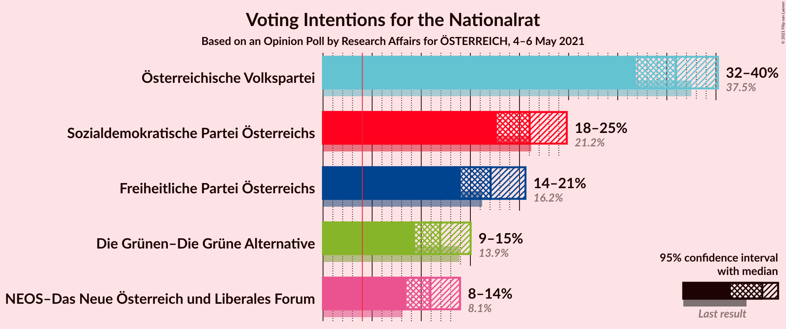

### Confidence Intervals

| Party | Last Result | Poll Result | 80% Confidence Interval | 90% Confidence Interval | 95% Confidence Interval | 99% Confidence Interval |
|:-----:|:-----------:|:-----------:|:-----------------------:|:-----------------------:|:-----------------------:|:-----------------------:|
| Österreichische Volkspartei | 37.5% | 35.9% | 33.2–38.7% |32.5–39.5% |31.8–40.2% |30.6–41.6% |
| Sozialdemokratische Partei Österreichs | 21.2% | 21.0% | 18.8–23.5% |18.2–24.2% |17.7–24.8% |16.7–26.0% |
| Freiheitliche Partei Österreichs | 16.2% | 17.1% | 15.1–19.4% |14.5–20.0% |14.0–20.6% |13.1–21.7% |
| Die Grünen–Die Grüne Alternative | 13.9% | 11.9% | 10.2–13.9% |9.8–14.5% |9.4–15.0% |8.6–16.1% |
| NEOS–Das Neue Österreich und Liberales Forum | 8.1% | 10.9% | 9.3–12.9% |8.9–13.5% |8.5–13.9% |7.8–15.0% |

*Note:* The poll result column reflects the actual value used in the calculations. Published results may vary slightly, and in addition be rounded to fewer digits.

## Seats

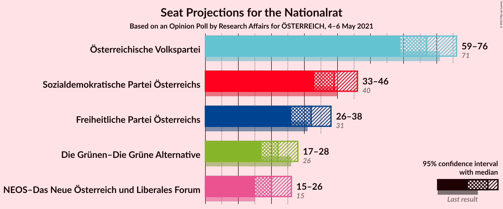

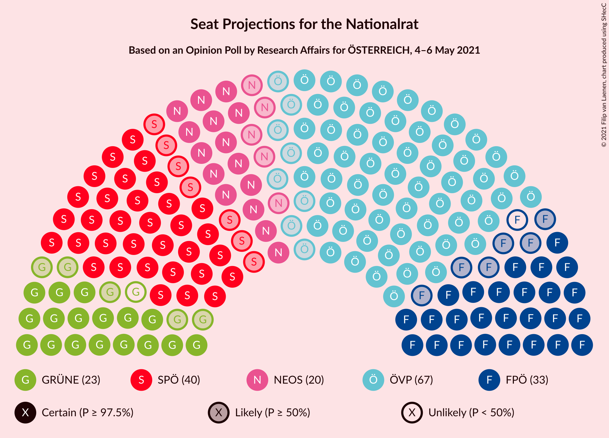

### Confidence Intervals

| Party | Last Result | Median | 80% Confidence Interval | 90% Confidence Interval | 95% Confidence Interval | 99% Confidence Interval |
|:-----:|:-----------:|:------:|:-----------------------:|:-----------------------:|:-----------------------:|:-----------------------:|
| <a href="#österreichische-volkspartei">Österreichische Volkspartei</a> | 71 | 67 | 62–73 |61–74 |59–75 |57–78 |
| <a href="#sozialdemokratische-partei-österreichs">Sozialdemokratische Partei Österreichs</a> | 40 | 40 | 35–44 |34–45 |33–47 |31–49 |
| <a href="#freiheitliche-partei-österreichs">Freiheitliche Partei Österreichs</a> | 31 | 32 | 28–36 |27–37 |26–38 |24–40 |
| <a href="#die-grünen–die-grüne-alternative">Die Grünen–Die Grüne Alternative</a> | 26 | 22 | 19–26 |18–27 |17–28 |16–30 |
| <a href="#neos–das-neue-österreich-und-liberales-forum">NEOS–Das Neue Österreich und Liberales Forum</a> | 15 | 20 | 17–24 |16–25 |15–26 |14–28 |

### Österreichische Volkspartei

*For a full overview of the results for this party, see the [Österreichische Volkspartei](party-österreichischevolkspartei.html) page.*

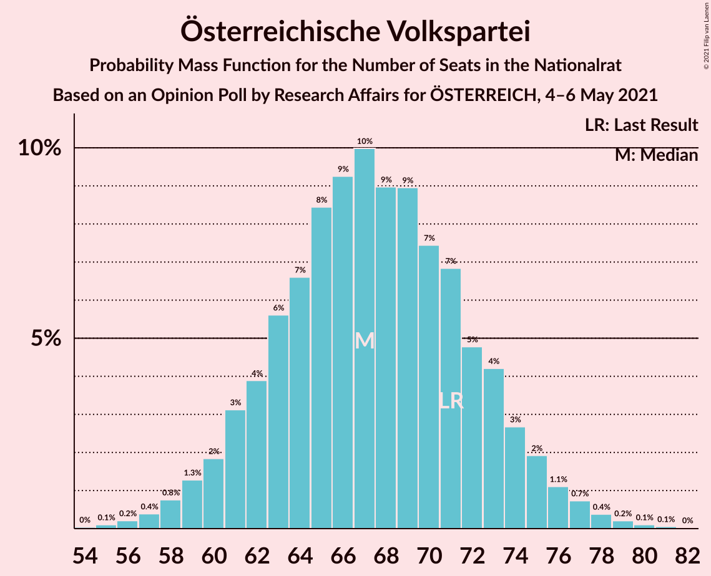

| Number of Seats | Probability | Accumulated | Special Marks |
|:---------------:|:-----------:|:-----------:|:-------------:|
| 54 | 0% | 100% |  |
| 55 | 0.1% | 99.9% |  |
| 56 | 0.2% | 99.8% |  |
| 57 | 0.5% | 99.6% |  |
| 58 | 0.7% | 99.1% |  |
| 59 | 1.2% | 98% |  |
| 60 | 2% | 97% |  |
| 61 | 3% | 95% |  |
| 62 | 4% | 92% |  |
| 63 | 6% | 88% |  |
| 64 | 7% | 82% |  |
| 65 | 10% | 75% |  |
| 66 | 10% | 65% |  |
| 67 | 10% | 56% | Median |
| 68 | 9% | 46% |  |
| 69 | 6% | 37% |  |
| 70 | 7% | 30% |  |
| 71 | 6% | 24% | Last Result |
| 72 | 5% | 17% |  |
| 73 | 5% | 12% |  |
| 74 | 3% | 7% |  |
| 75 | 2% | 4% |  |
| 76 | 0.9% | 2% |  |
| 77 | 0.5% | 1.3% |  |
| 78 | 0.3% | 0.8% |  |
| 79 | 0.2% | 0.4% |  |
| 80 | 0.1% | 0.3% |  |
| 81 | 0.1% | 0.1% |  |
| 82 | 0% | 0% |  |

### Sozialdemokratische Partei Österreichs

*For a full overview of the results for this party, see the [Sozialdemokratische Partei Österreichs](party-sozialdemokratischeparteiösterreichs.html) page.*

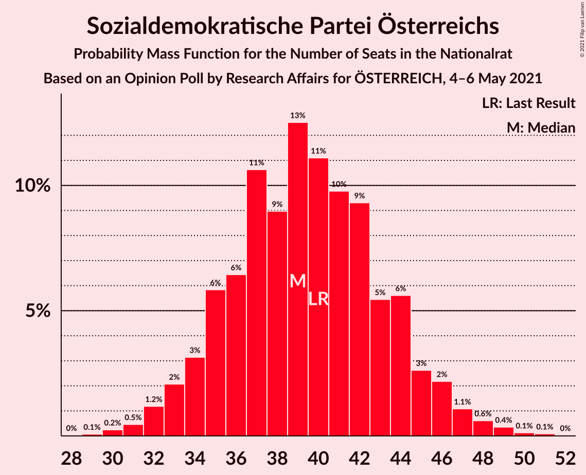

| Number of Seats | Probability | Accumulated | Special Marks |
|:---------------:|:-----------:|:-----------:|:-------------:|
| 29 | 0.1% | 100% |  |
| 30 | 0.2% | 99.9% |  |
| 31 | 0.7% | 99.6% |  |
| 32 | 1.0% | 99.0% |  |
| 33 | 3% | 98% |  |
| 34 | 2% | 95% |  |
| 35 | 6% | 93% |  |
| 36 | 7% | 86% |  |
| 37 | 7% | 80% |  |
| 38 | 11% | 73% |  |
| 39 | 7% | 62% |  |
| 40 | 15% | 55% | Last Result, Median |
| 41 | 8% | 40% |  |
| 42 | 12% | 32% |  |
| 43 | 6% | 20% |  |
| 44 | 6% | 14% |  |
| 45 | 4% | 9% |  |
| 46 | 1.4% | 4% |  |
| 47 | 2% | 3% |  |
| 48 | 0.4% | 0.9% |  |
| 49 | 0.3% | 0.6% |  |
| 50 | 0.1% | 0.2% |  |
| 51 | 0.1% | 0.1% |  |
| 52 | 0% | 0.1% |  |
| 53 | 0% | 0% |  |

### Freiheitliche Partei Österreichs

*For a full overview of the results for this party, see the [Freiheitliche Partei Österreichs](party-freiheitlicheparteiösterreichs.html) page.*

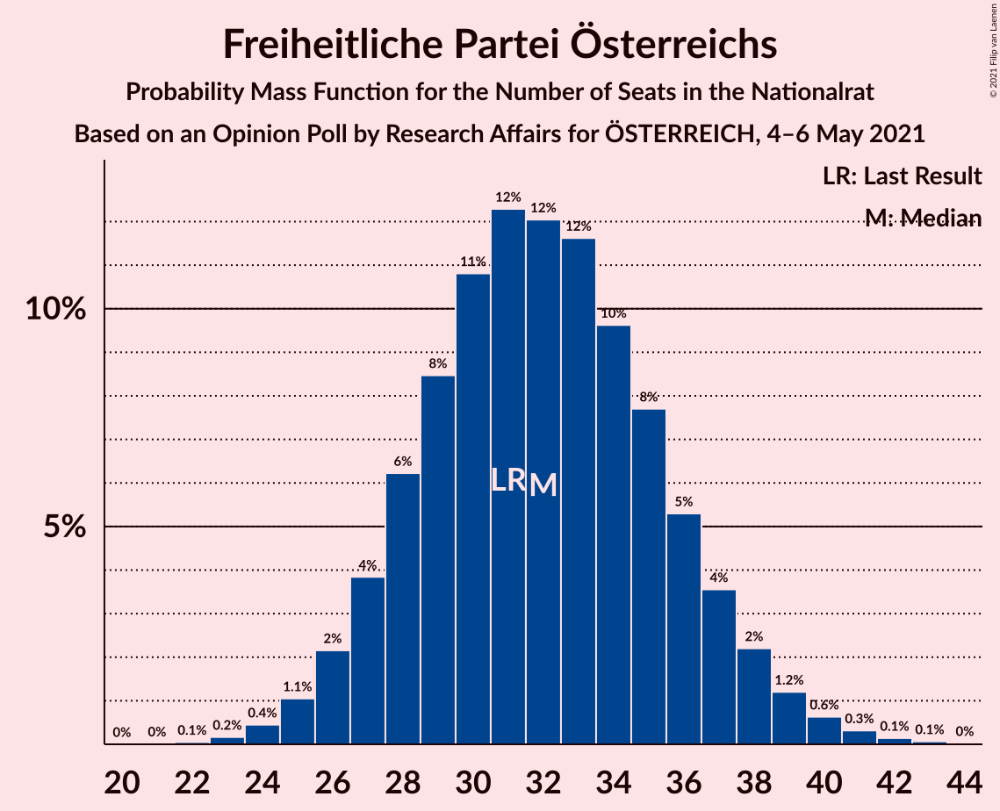

| Number of Seats | Probability | Accumulated | Special Marks |
|:---------------:|:-----------:|:-----------:|:-------------:|
| 22 | 0.1% | 100% |  |
| 23 | 0.2% | 99.9% |  |
| 24 | 0.5% | 99.7% |  |
| 25 | 1.1% | 99.3% |  |
| 26 | 2% | 98% |  |
| 27 | 4% | 96% |  |
| 28 | 6% | 92% |  |
| 29 | 9% | 85% |  |
| 30 | 12% | 77% |  |
| 31 | 13% | 65% | Last Result |
| 32 | 11% | 52% | Median |
| 33 | 11% | 41% |  |
| 34 | 9% | 30% |  |
| 35 | 8% | 21% |  |
| 36 | 6% | 13% |  |
| 37 | 3% | 8% |  |
| 38 | 2% | 5% |  |
| 39 | 1.2% | 2% |  |
| 40 | 0.7% | 1.2% |  |
| 41 | 0.3% | 0.5% |  |
| 42 | 0.1% | 0.2% |  |
| 43 | 0.1% | 0.1% |  |
| 44 | 0% | 0% |  |

### Die Grünen–Die Grüne Alternative

*For a full overview of the results for this party, see the [Die Grünen–Die Grüne Alternative](party-diegrünen–diegrünealternative.html) page.*

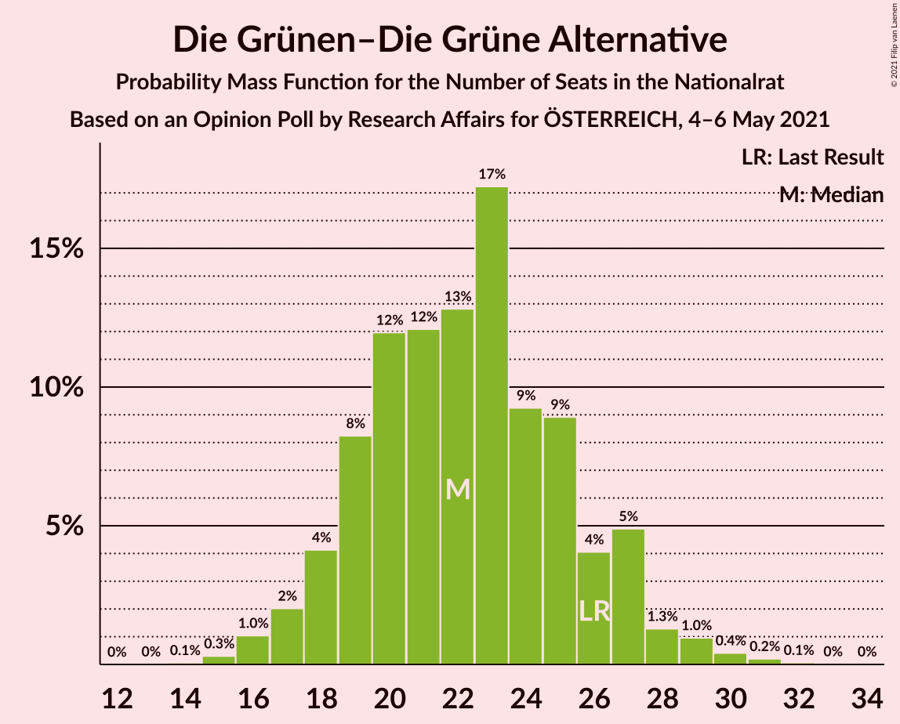

| Number of Seats | Probability | Accumulated | Special Marks |
|:---------------:|:-----------:|:-----------:|:-------------:|
| 14 | 0.1% | 100% |  |
| 15 | 0.3% | 99.9% |  |
| 16 | 1.0% | 99.6% |  |
| 17 | 2% | 98.6% |  |
| 18 | 4% | 97% |  |
| 19 | 8% | 92% |  |
| 20 | 12% | 84% |  |
| 21 | 12% | 72% |  |
| 22 | 13% | 60% | Median |
| 23 | 17% | 47% |  |
| 24 | 9% | 30% |  |
| 25 | 9% | 21% |  |
| 26 | 4% | 12% | Last Result |
| 27 | 5% | 8% |  |
| 28 | 1.3% | 3% |  |
| 29 | 1.0% | 2% |  |
| 30 | 0.4% | 0.7% |  |
| 31 | 0.2% | 0.3% |  |
| 32 | 0.1% | 0.1% |  |
| 33 | 0% | 0% |  |

### NEOS–Das Neue Österreich und Liberales Forum

*For a full overview of the results for this party, see the [NEOS–Das Neue Österreich und Liberales Forum](party-neos–dasneueösterreichundliberalesforum.html) page.*

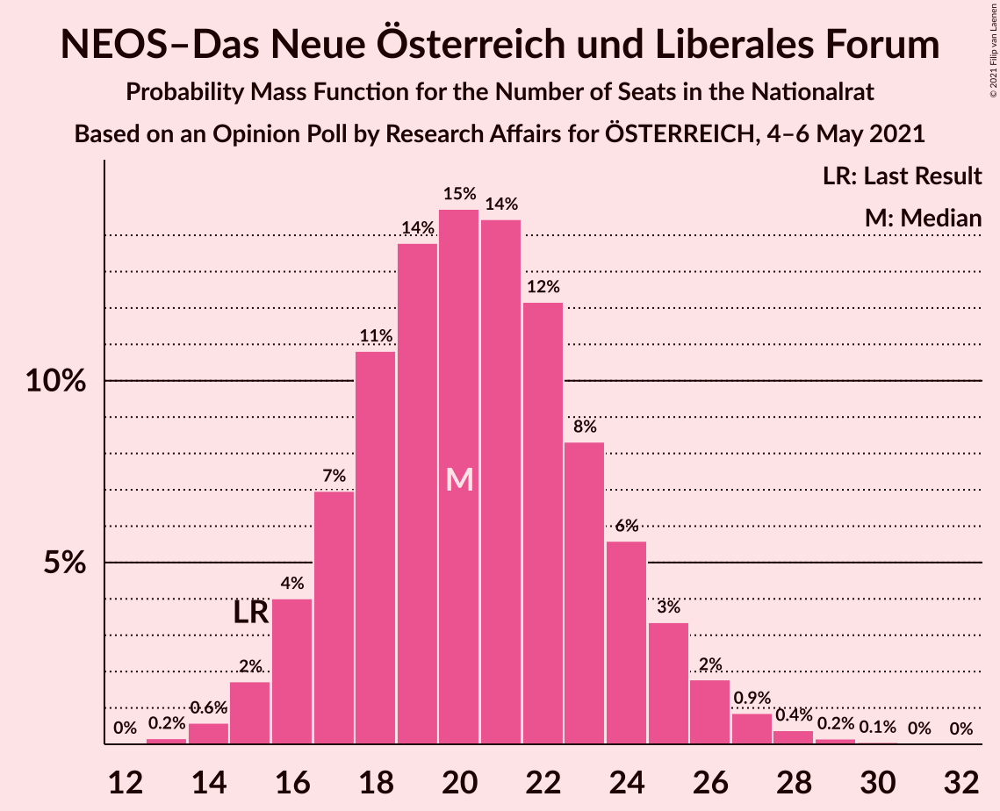

| Number of Seats | Probability | Accumulated | Special Marks |
|:---------------:|:-----------:|:-----------:|:-------------:|
| 13 | 0.1% | 100% |  |
| 14 | 0.6% | 99.8% |  |
| 15 | 2% | 99.2% | Last Result |
| 16 | 4% | 97% |  |
| 17 | 7% | 93% |  |
| 18 | 11% | 86% |  |
| 19 | 13% | 75% |  |
| 20 | 15% | 62% | Median |
| 21 | 14% | 47% |  |
| 22 | 13% | 34% |  |
| 23 | 8% | 20% |  |
| 24 | 6% | 12% |  |
| 25 | 3% | 6% |  |
| 26 | 2% | 3% |  |
| 27 | 0.9% | 2% |  |
| 28 | 0.4% | 0.7% |  |
| 29 | 0.1% | 0.2% |  |
| 30 | 0.1% | 0.1% |  |
| 31 | 0% | 0% |  |

## Coalitions

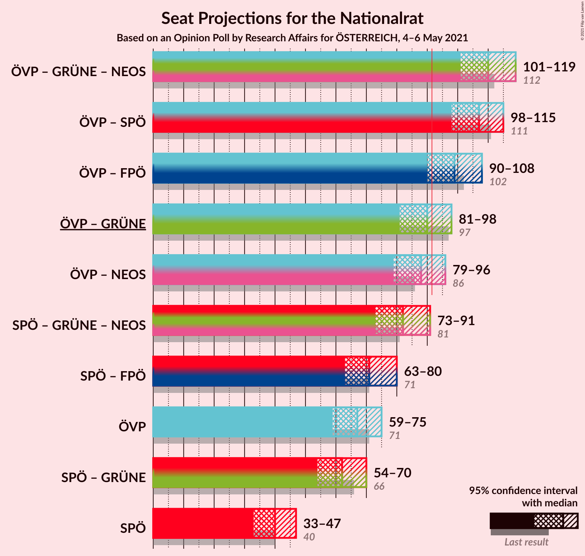

### Confidence Intervals

| Coalition | Last Result | Median | Majority? | 80% Confidence Interval | 90% Confidence Interval | 95% Confidence Interval | 99% Confidence Interval |
|:---------:|:-----------:|:------:|:---------:|:-----------------------:|:-----------------------:|:-----------------------:|:-----------------------:|
| Österreichische Volkspartei – Die Grünen–Die Grüne Alternative – NEOS–Das Neue Österreich und Liberales Forum | 112 | 110 | 100% | 104–116 | 103–117 | 101–119 | 98–121 |
| Österreichische Volkspartei – Sozialdemokratische Partei Österreichs | 111 | 107 | 100% | 101–113 | 100–114 | 98–115 | 95–118 |
| Österreichische Volkspartei – Freiheitliche Partei Österreichs | 102 | 99 | 96% | 93–105 | 92–107 | 90–108 | 88–111 |
| Österreichische Volkspartei – Die Grünen–Die Grüne Alternative | 97 | 90 | 33% | 84–95 | 82–97 | 81–98 | 78–101 |
| Österreichische Volkspartei – NEOS–Das Neue Österreich und Liberales Forum | 86 | 88 | 19% | 82–93 | 80–95 | 79–96 | 76–99 |
| Sozialdemokratische Partei Österreichs – Die Grünen–Die Grüne Alternative – NEOS–Das Neue Österreich und Liberales Forum | 81 | 82 | 2% | 77–88 | 75–89 | 73–91 | 71–93 |
| Sozialdemokratische Partei Österreichs – Freiheitliche Partei Österreichs | 71 | 71 | 0% | 66–77 | 64–79 | 63–80 | 61–82 |
| Österreichische Volkspartei | 71 | 67 | 0% | 62–73 | 61–74 | 59–75 | 57–78 |
| Sozialdemokratische Partei Österreichs – Die Grünen–Die Grüne Alternative | 66 | 62 | 0% | 56–67 | 55–68 | 54–70 | 51–72 |
| Sozialdemokratische Partei Österreichs | 40 | 40 | 0% | 35–44 | 34–45 | 33–47 | 31–49 |

### Österreichische Volkspartei – Die Grünen–Die Grüne Alternative – NEOS–Das Neue Österreich und Liberales Forum

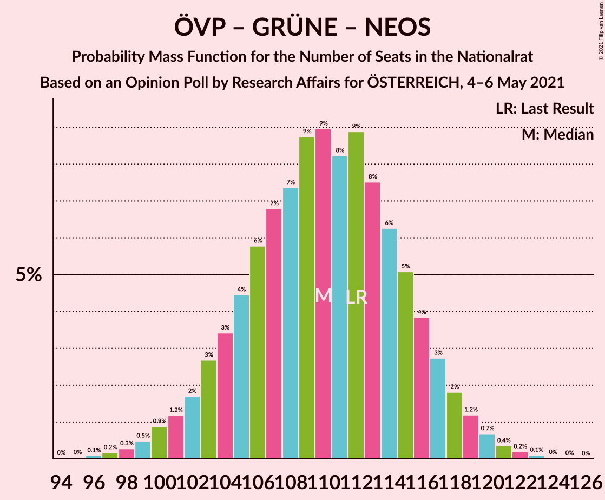

| Number of Seats | Probability | Accumulated | Special Marks |
|:---------------:|:-----------:|:-----------:|:-------------:|
| 95 | 0% | 100% |  |
| 96 | 0.1% | 99.9% |  |
| 97 | 0.2% | 99.8% |  |
| 98 | 0.3% | 99.6% |  |
| 99 | 0.6% | 99.4% |  |
| 100 | 0.8% | 98.7% |  |
| 101 | 1.3% | 98% |  |
| 102 | 1.5% | 97% |  |
| 103 | 3% | 95% |  |
| 104 | 4% | 92% |  |
| 105 | 4% | 88% |  |
| 106 | 6% | 85% |  |
| 107 | 7% | 78% |  |
| 108 | 8% | 72% |  |
| 109 | 10% | 64% | Median |
| 110 | 7% | 54% |  |
| 111 | 9% | 47% |  |
| 112 | 9% | 38% | Last Result |
| 113 | 7% | 29% |  |
| 114 | 6% | 22% |  |
| 115 | 5% | 15% |  |
| 116 | 4% | 11% |  |
| 117 | 2% | 7% |  |
| 118 | 2% | 4% |  |
| 119 | 1.2% | 3% |  |
| 120 | 0.8% | 1.4% |  |
| 121 | 0.3% | 0.7% |  |
| 122 | 0.2% | 0.4% |  |
| 123 | 0.1% | 0.2% |  |
| 124 | 0% | 0.1% |  |
| 125 | 0% | 0% |  |

### Österreichische Volkspartei – Sozialdemokratische Partei Österreichs

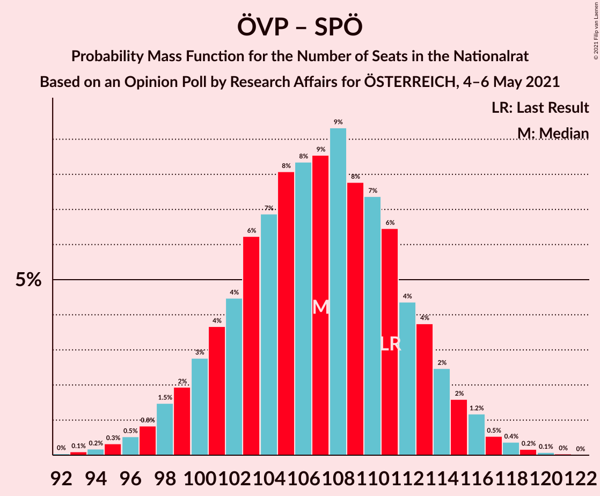

| Number of Seats | Probability | Accumulated | Special Marks |
|:---------------:|:-----------:|:-----------:|:-------------:|
| 92 | 0.1% | 100% | Majority |
| 93 | 0.1% | 99.9% |  |
| 94 | 0.2% | 99.8% |  |
| 95 | 0.3% | 99.7% |  |
| 96 | 0.4% | 99.3% |  |
| 97 | 0.9% | 98.9% |  |
| 98 | 1.3% | 98% |  |
| 99 | 2% | 97% |  |
| 100 | 3% | 95% |  |
| 101 | 3% | 92% |  |
| 102 | 5% | 89% |  |
| 103 | 6% | 84% |  |
| 104 | 7% | 78% |  |
| 105 | 8% | 70% |  |
| 106 | 6% | 62% |  |
| 107 | 9% | 56% | Median |
| 108 | 10% | 46% |  |
| 109 | 5% | 36% |  |
| 110 | 9% | 31% |  |
| 111 | 7% | 22% | Last Result |
| 112 | 4% | 15% |  |
| 113 | 4% | 11% |  |
| 114 | 2% | 7% |  |
| 115 | 2% | 5% |  |
| 116 | 1.0% | 2% |  |
| 117 | 0.6% | 1.3% |  |
| 118 | 0.4% | 0.6% |  |
| 119 | 0.1% | 0.3% |  |
| 120 | 0.1% | 0.2% |  |
| 121 | 0% | 0.1% |  |
| 122 | 0% | 0% |  |

### Österreichische Volkspartei – Freiheitliche Partei Österreichs

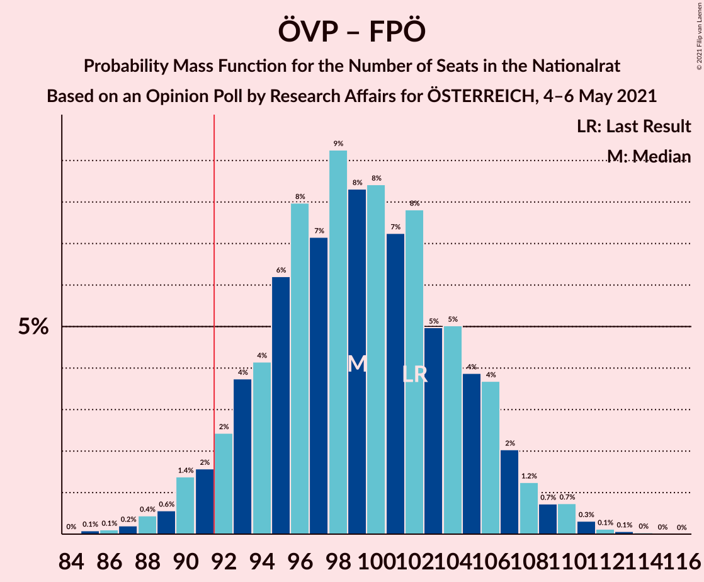

| Number of Seats | Probability | Accumulated | Special Marks |
|:---------------:|:-----------:|:-----------:|:-------------:|
| 85 | 0.1% | 100% |  |
| 86 | 0.1% | 99.9% |  |
| 87 | 0.2% | 99.8% |  |
| 88 | 0.4% | 99.6% |  |
| 89 | 0.6% | 99.1% |  |
| 90 | 1.4% | 98.6% |  |
| 91 | 2% | 97% |  |
| 92 | 2% | 96% | Majority |
| 93 | 4% | 93% |  |
| 94 | 4% | 89% |  |
| 95 | 6% | 85% |  |
| 96 | 8% | 79% |  |
| 97 | 7% | 71% |  |
| 98 | 9% | 64% |  |
| 99 | 8% | 55% | Median |
| 100 | 8% | 46% |  |
| 101 | 7% | 38% |  |
| 102 | 8% | 31% | Last Result |
| 103 | 5% | 23% |  |
| 104 | 5% | 18% |  |
| 105 | 4% | 13% |  |
| 106 | 4% | 9% |  |
| 107 | 2% | 5% |  |
| 108 | 1.2% | 3% |  |
| 109 | 0.7% | 2% |  |
| 110 | 0.7% | 1.3% |  |
| 111 | 0.3% | 0.6% |  |
| 112 | 0.1% | 0.3% |  |
| 113 | 0.1% | 0.1% |  |
| 114 | 0% | 0.1% |  |
| 115 | 0% | 0% |  |

### Österreichische Volkspartei – Die Grünen–Die Grüne Alternative

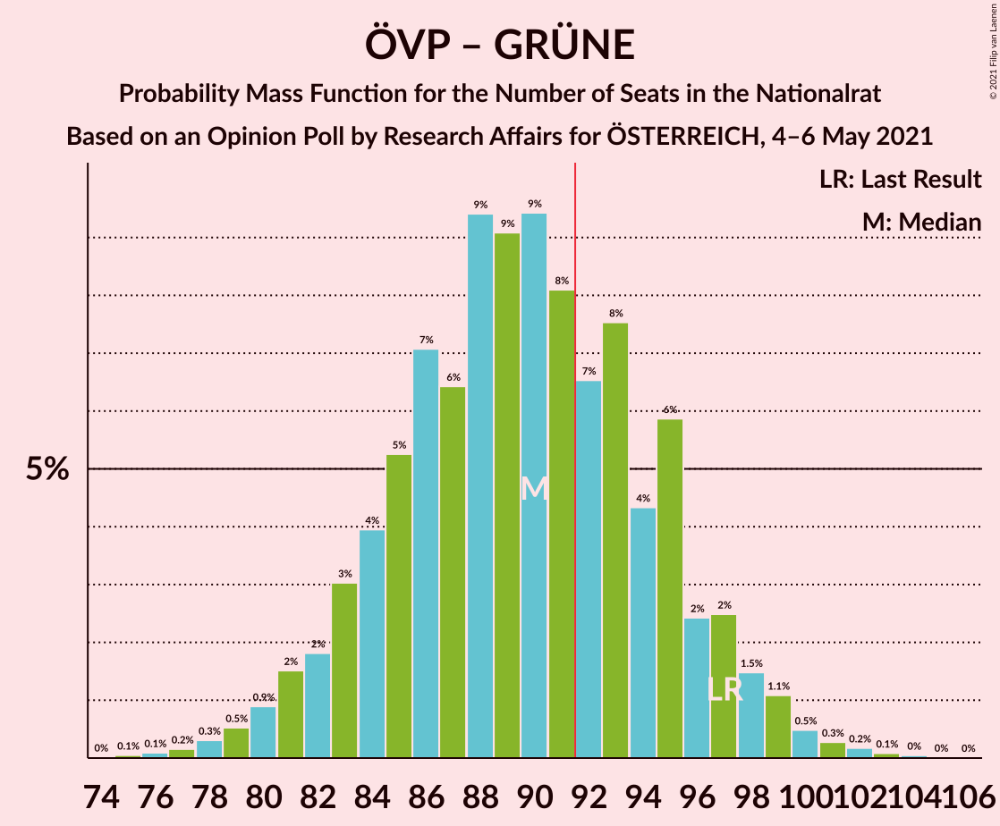

| Number of Seats | Probability | Accumulated | Special Marks |
|:---------------:|:-----------:|:-----------:|:-------------:|
| 75 | 0.1% | 100% |  |
| 76 | 0.1% | 99.9% |  |
| 77 | 0.2% | 99.8% |  |
| 78 | 0.3% | 99.7% |  |
| 79 | 0.5% | 99.4% |  |
| 80 | 0.9% | 98.8% |  |
| 81 | 2% | 98% |  |
| 82 | 2% | 96% |  |
| 83 | 3% | 95% |  |
| 84 | 4% | 92% |  |
| 85 | 5% | 88% |  |
| 86 | 7% | 82% |  |
| 87 | 6% | 75% |  |
| 88 | 9% | 69% |  |
| 89 | 9% | 59% | Median |
| 90 | 9% | 50% |  |
| 91 | 8% | 41% |  |
| 92 | 7% | 33% | Majority |
| 93 | 8% | 26% |  |
| 94 | 4% | 19% |  |
| 95 | 6% | 14% |  |
| 96 | 2% | 9% |  |
| 97 | 2% | 6% | Last Result |
| 98 | 1.5% | 4% |  |
| 99 | 1.1% | 2% |  |
| 100 | 0.5% | 1.1% |  |
| 101 | 0.3% | 0.6% |  |
| 102 | 0.2% | 0.3% |  |
| 103 | 0.1% | 0.2% |  |
| 104 | 0% | 0.1% |  |
| 105 | 0% | 0% |  |

### Österreichische Volkspartei – NEOS–Das Neue Österreich und Liberales Forum

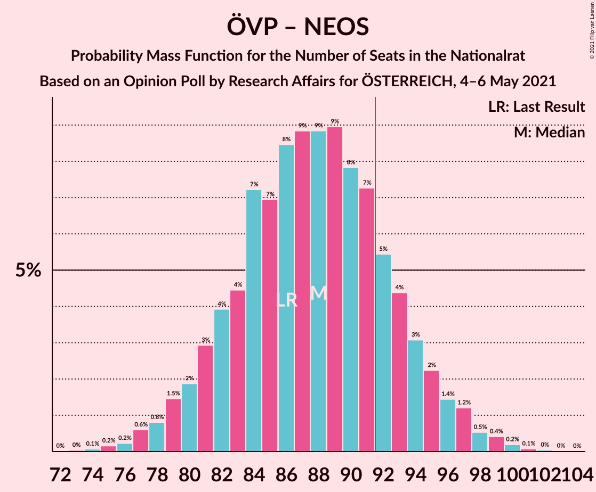

| Number of Seats | Probability | Accumulated | Special Marks |
|:---------------:|:-----------:|:-----------:|:-------------:|
| 73 | 0% | 100% |  |
| 74 | 0.1% | 99.9% |  |
| 75 | 0.2% | 99.9% |  |
| 76 | 0.2% | 99.7% |  |
| 77 | 0.6% | 99.5% |  |
| 78 | 0.8% | 98.9% |  |
| 79 | 1.5% | 98% |  |
| 80 | 2% | 97% |  |
| 81 | 3% | 95% |  |
| 82 | 4% | 92% |  |
| 83 | 4% | 88% |  |
| 84 | 7% | 83% |  |
| 85 | 7% | 76% |  |
| 86 | 8% | 69% | Last Result |
| 87 | 9% | 61% | Median |
| 88 | 9% | 52% |  |
| 89 | 9% | 43% |  |
| 90 | 8% | 34% |  |
| 91 | 7% | 26% |  |
| 92 | 5% | 19% | Majority |
| 93 | 4% | 14% |  |
| 94 | 3% | 9% |  |
| 95 | 2% | 6% |  |
| 96 | 1.4% | 4% |  |
| 97 | 1.2% | 2% |  |
| 98 | 0.5% | 1.3% |  |
| 99 | 0.4% | 0.8% |  |
| 100 | 0.2% | 0.3% |  |
| 101 | 0.1% | 0.1% |  |
| 102 | 0% | 0.1% |  |
| 103 | 0% | 0% |  |

### Sozialdemokratische Partei Österreichs – Die Grünen–Die Grüne Alternative – NEOS–Das Neue Österreich und Liberales Forum

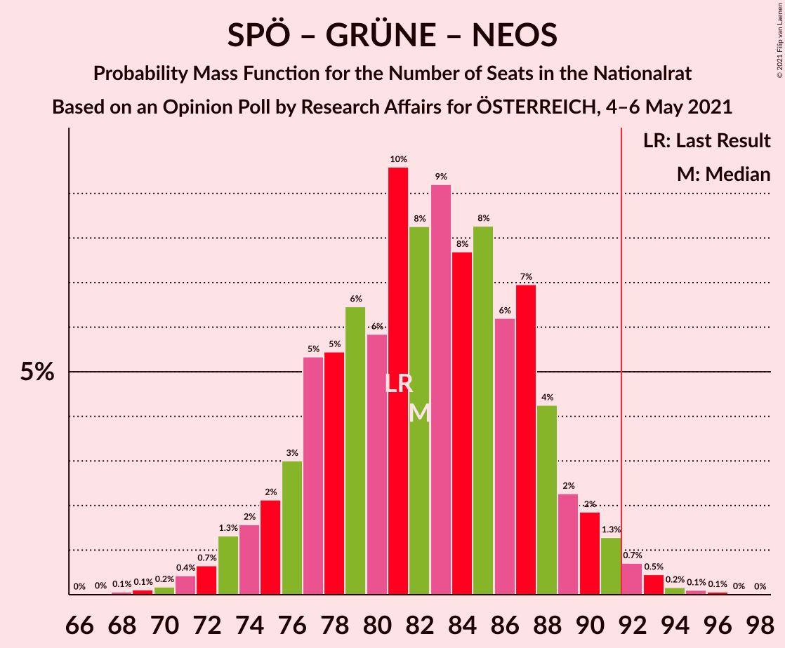

| Number of Seats | Probability | Accumulated | Special Marks |
|:---------------:|:-----------:|:-----------:|:-------------:|
| 68 | 0.1% | 100% |  |
| 69 | 0.1% | 99.9% |  |
| 70 | 0.2% | 99.8% |  |
| 71 | 0.4% | 99.6% |  |
| 72 | 0.7% | 99.2% |  |
| 73 | 1.3% | 98.5% |  |
| 74 | 2% | 97% |  |
| 75 | 2% | 96% |  |
| 76 | 3% | 93% |  |
| 77 | 5% | 90% |  |
| 78 | 5% | 85% |  |
| 79 | 6% | 80% |  |
| 80 | 6% | 73% |  |
| 81 | 10% | 67% | Last Result |
| 82 | 8% | 58% | Median |
| 83 | 9% | 50% |  |
| 84 | 8% | 40% |  |
| 85 | 8% | 33% |  |
| 86 | 6% | 24% |  |
| 87 | 7% | 18% |  |
| 88 | 4% | 11% |  |
| 89 | 2% | 7% |  |
| 90 | 2% | 5% |  |
| 91 | 1.3% | 3% |  |
| 92 | 0.7% | 2% | Majority |
| 93 | 0.5% | 0.8% |  |
| 94 | 0.2% | 0.4% |  |
| 95 | 0.1% | 0.2% |  |
| 96 | 0.1% | 0.1% |  |
| 97 | 0% | 0% |  |

### Sozialdemokratische Partei Österreichs – Freiheitliche Partei Österreichs

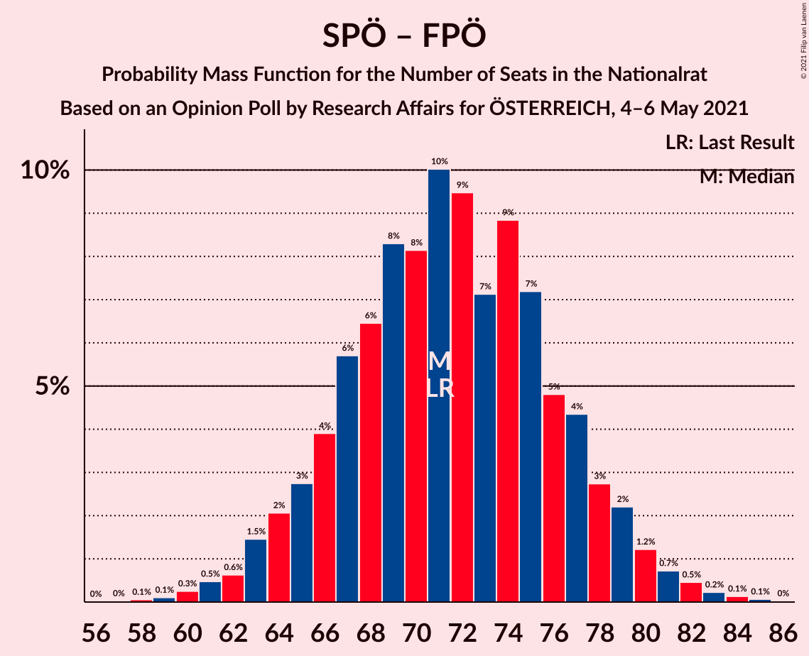

| Number of Seats | Probability | Accumulated | Special Marks |
|:---------------:|:-----------:|:-----------:|:-------------:|
| 58 | 0.1% | 100% |  |
| 59 | 0.1% | 99.9% |  |
| 60 | 0.3% | 99.8% |  |
| 61 | 0.5% | 99.5% |  |
| 62 | 0.6% | 99.1% |  |
| 63 | 1.5% | 98% |  |
| 64 | 2% | 97% |  |
| 65 | 3% | 95% |  |
| 66 | 4% | 92% |  |
| 67 | 6% | 88% |  |
| 68 | 6% | 83% |  |
| 69 | 8% | 76% |  |
| 70 | 8% | 68% |  |
| 71 | 10% | 60% | Last Result |
| 72 | 9% | 50% | Median |
| 73 | 7% | 40% |  |
| 74 | 9% | 33% |  |
| 75 | 7% | 24% |  |
| 76 | 5% | 17% |  |
| 77 | 4% | 12% |  |
| 78 | 3% | 8% |  |
| 79 | 2% | 5% |  |
| 80 | 1.2% | 3% |  |
| 81 | 0.7% | 2% |  |
| 82 | 0.5% | 0.9% |  |
| 83 | 0.2% | 0.5% |  |
| 84 | 0.1% | 0.2% |  |
| 85 | 0.1% | 0.1% |  |
| 86 | 0% | 0% |  |

### Österreichische Volkspartei

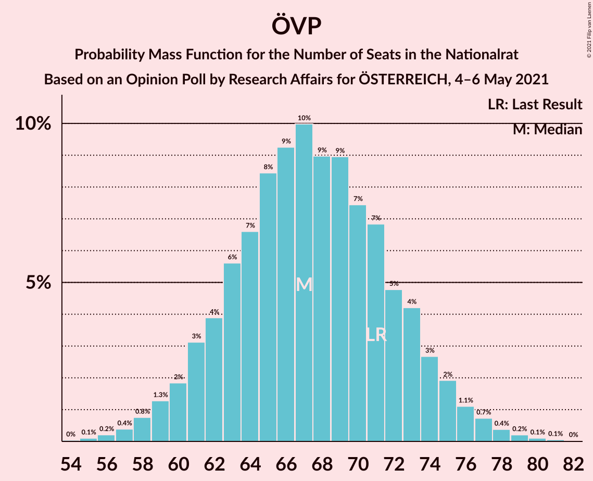

| Number of Seats | Probability | Accumulated | Special Marks |
|:---------------:|:-----------:|:-----------:|:-------------:|
| 54 | 0% | 100% |  |
| 55 | 0.1% | 99.9% |  |
| 56 | 0.2% | 99.8% |  |
| 57 | 0.5% | 99.6% |  |
| 58 | 0.7% | 99.1% |  |
| 59 | 1.2% | 98% |  |
| 60 | 2% | 97% |  |
| 61 | 3% | 95% |  |
| 62 | 4% | 92% |  |
| 63 | 6% | 88% |  |
| 64 | 7% | 82% |  |
| 65 | 10% | 75% |  |
| 66 | 10% | 65% |  |
| 67 | 10% | 56% | Median |
| 68 | 9% | 46% |  |
| 69 | 6% | 37% |  |
| 70 | 7% | 30% |  |
| 71 | 6% | 24% | Last Result |
| 72 | 5% | 17% |  |
| 73 | 5% | 12% |  |
| 74 | 3% | 7% |  |
| 75 | 2% | 4% |  |
| 76 | 0.9% | 2% |  |
| 77 | 0.5% | 1.3% |  |
| 78 | 0.3% | 0.8% |  |
| 79 | 0.2% | 0.4% |  |
| 80 | 0.1% | 0.3% |  |
| 81 | 0.1% | 0.1% |  |
| 82 | 0% | 0% |  |

### Sozialdemokratische Partei Österreichs – Die Grünen–Die Grüne Alternative

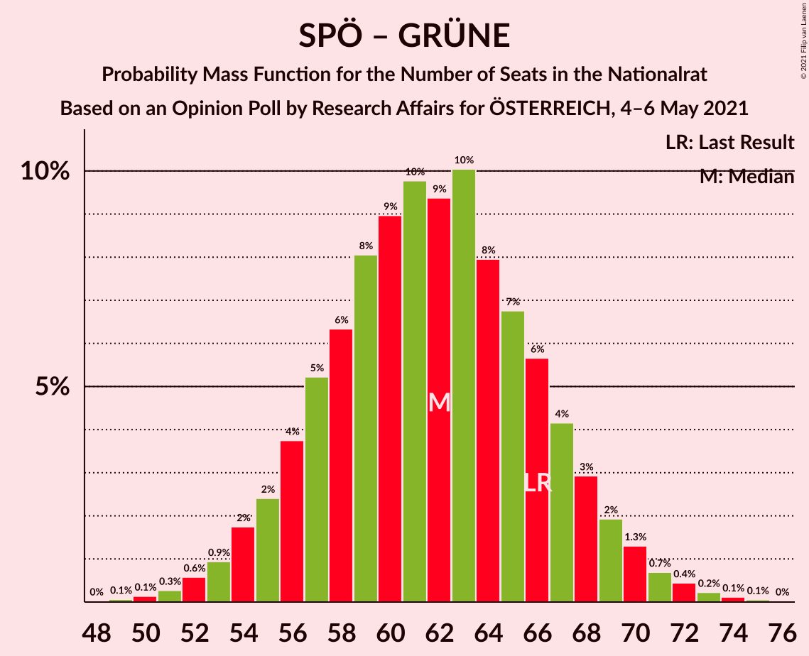

| Number of Seats | Probability | Accumulated | Special Marks |
|:---------------:|:-----------:|:-----------:|:-------------:|
| 49 | 0.1% | 100% |  |
| 50 | 0.2% | 99.9% |  |
| 51 | 0.3% | 99.7% |  |
| 52 | 0.8% | 99.5% |  |
| 53 | 0.9% | 98.7% |  |
| 54 | 2% | 98% |  |
| 55 | 2% | 96% |  |
| 56 | 4% | 94% |  |
| 57 | 5% | 90% |  |
| 58 | 6% | 85% |  |
| 59 | 7% | 79% |  |
| 60 | 8% | 72% |  |
| 61 | 8% | 64% |  |
| 62 | 10% | 56% | Median |
| 63 | 11% | 46% |  |
| 64 | 8% | 35% |  |
| 65 | 7% | 27% |  |
| 66 | 7% | 20% | Last Result |
| 67 | 5% | 13% |  |
| 68 | 4% | 9% |  |
| 69 | 2% | 5% |  |
| 70 | 1.3% | 3% |  |
| 71 | 0.7% | 2% |  |
| 72 | 0.5% | 0.9% |  |
| 73 | 0.2% | 0.4% |  |
| 74 | 0.1% | 0.2% |  |
| 75 | 0.1% | 0.1% |  |
| 76 | 0% | 0% |  |

### Sozialdemokratische Partei Österreichs

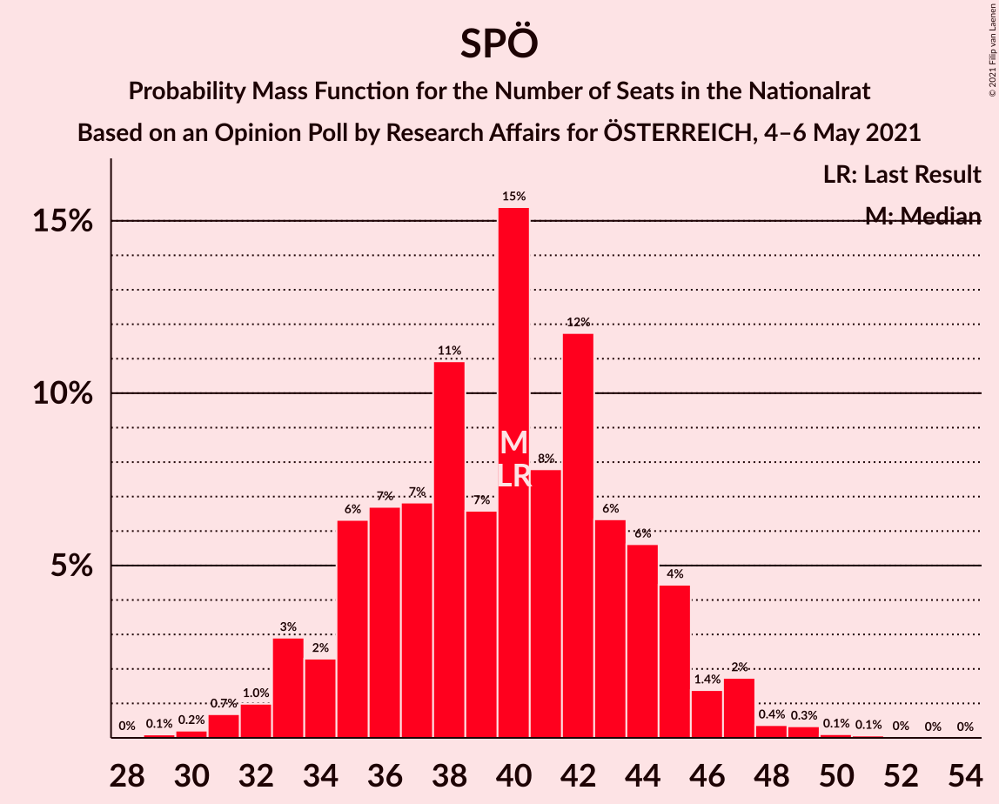

| Number of Seats | Probability | Accumulated | Special Marks |
|:---------------:|:-----------:|:-----------:|:-------------:|
| 29 | 0.1% | 100% |  |
| 30 | 0.2% | 99.9% |  |
| 31 | 0.7% | 99.6% |  |
| 32 | 1.0% | 99.0% |  |
| 33 | 3% | 98% |  |
| 34 | 2% | 95% |  |
| 35 | 6% | 93% |  |
| 36 | 7% | 86% |  |
| 37 | 7% | 80% |  |
| 38 | 11% | 73% |  |
| 39 | 7% | 62% |  |
| 40 | 15% | 55% | Last Result, Median |
| 41 | 8% | 40% |  |
| 42 | 12% | 32% |  |
| 43 | 6% | 20% |  |
| 44 | 6% | 14% |  |
| 45 | 4% | 9% |  |
| 46 | 1.4% | 4% |  |
| 47 | 2% | 3% |  |
| 48 | 0.4% | 0.9% |  |
| 49 | 0.3% | 0.6% |  |
| 50 | 0.1% | 0.2% |  |
| 51 | 0.1% | 0.1% |  |
| 52 | 0% | 0.1% |  |
| 53 | 0% | 0% |  |

## Technical Information

### Opinion Poll

+ **Polling firm:** Research Affairs
+ **Commissioner(s):** ÖSTERREICH
+ **Fieldwork period:** 4–6 May 2021

### Calculations

+ **Sample size:** 504
+ **Simulations done:** 131,072
+ **Error estimate:** 1.23%

