# Opinion Poll by Research Affairs for ÖSTERREICH, 18–20 May 2021

<a href="#voting-intentions">Voting Intentions</a> | <a href="#seats">Seats</a> | <a href="#coalitions">Coalitions</a> | <a href="#technical-information">Technical Information</a>

## Voting Intentions

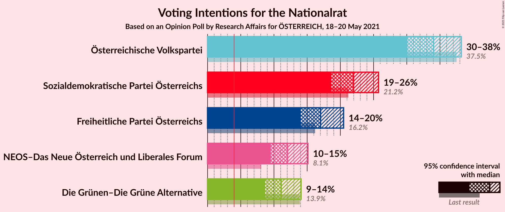

### Confidence Intervals

| Party | Last Result | Poll Result | 80% Confidence Interval | 90% Confidence Interval | 95% Confidence Interval | 99% Confidence Interval |
|:-----:|:-----------:|:-----------:|:-----------------------:|:-----------------------:|:-----------------------:|:-----------------------:|
| Österreichische Volkspartei | 37.5% | 34.0% | 31.4–36.8% |30.7–37.5% |30.1–38.2% |28.9–39.5% |
| Sozialdemokratische Partei Österreichs | 21.2% | 22.0% | 19.8–24.4% |19.2–25.1% |18.6–25.7% |17.6–26.9% |
| Freiheitliche Partei Österreichs | 16.2% | 17.0% | 15.1–19.3% |14.5–19.9% |14.0–20.5% |13.1–21.6% |
| NEOS–Das Neue Österreich und Liberales Forum | 8.1% | 12.0% | 10.4–14.1% |9.9–14.6% |9.5–15.1% |8.8–16.1% |
| Die Grünen–Die Grüne Alternative | 13.9% | 11.1% | 9.5–13.0% |9.1–13.6% |8.7–14.1% |8.0–15.1% |

*Note:* The poll result column reflects the actual value used in the calculations. Published results may vary slightly, and in addition be rounded to fewer digits.

## Seats

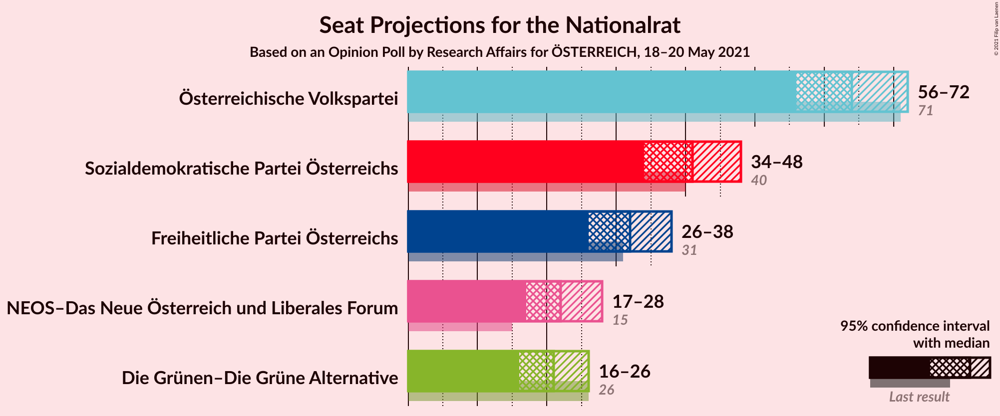

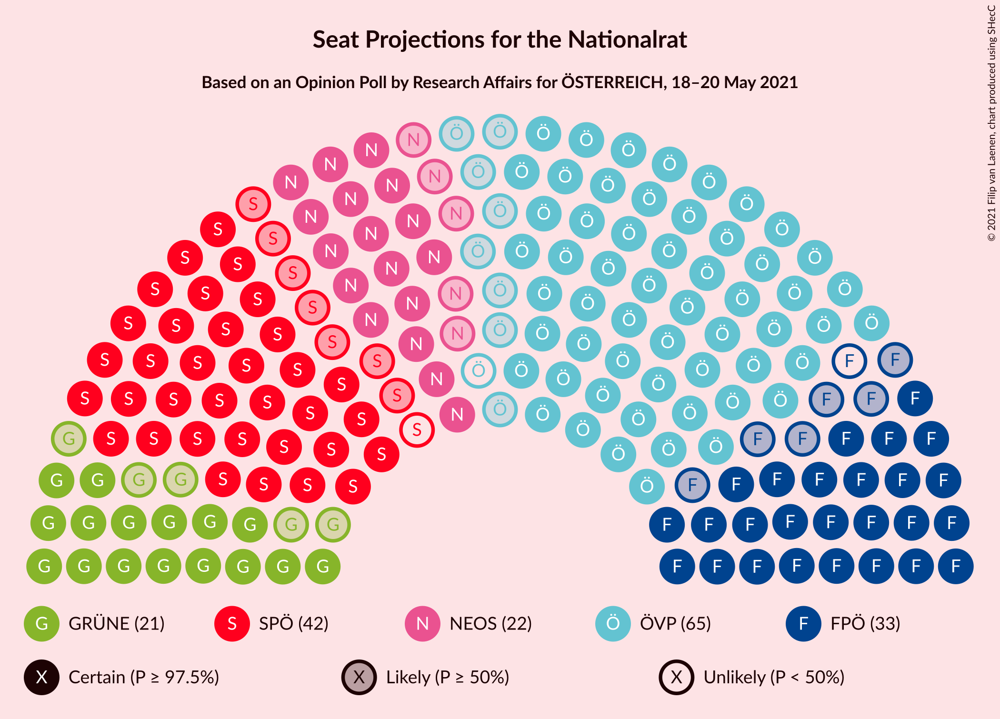

### Confidence Intervals

| Party | Last Result | Median | 80% Confidence Interval | 90% Confidence Interval | 95% Confidence Interval | 99% Confidence Interval |
|:-----:|:-----------:|:------:|:-----------------------:|:-----------------------:|:-----------------------:|:-----------------------:|
| <a href="#österreichische-volkspartei">Österreichische Volkspartei</a> | 71 | 64 | 58–69 |57–70 |56–72 |53–74 |
| <a href="#sozialdemokratische-partei-österreichs">Sozialdemokratische Partei Österreichs</a> | 40 | 41 | 36–46 |35–47 |34–48 |32–50 |
| <a href="#freiheitliche-partei-österreichs">Freiheitliche Partei Österreichs</a> | 31 | 32 | 28–36 |27–37 |26–38 |24–40 |
| <a href="#neos–das-neue-österreich-und-liberales-forum">NEOS–Das Neue Österreich und Liberales Forum</a> | 15 | 22 | 19–26 |18–27 |17–28 |16–30 |
| <a href="#die-grünen–die-grüne-alternative">Die Grünen–Die Grüne Alternative</a> | 26 | 21 | 17–24 |16–25 |16–26 |14–28 |

### Österreichische Volkspartei

*For a full overview of the results for this party, see the [Österreichische Volkspartei](party-österreichischevolkspartei.html) page.*

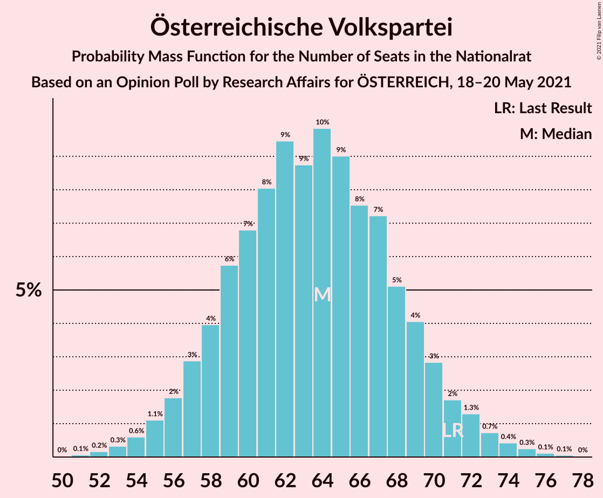

| Number of Seats | Probability | Accumulated | Special Marks |
|:---------------:|:-----------:|:-----------:|:-------------:|
| 51 | 0.1% | 100% |  |
| 52 | 0.2% | 99.9% |  |
| 53 | 0.3% | 99.7% |  |
| 54 | 0.6% | 99.4% |  |
| 55 | 1.1% | 98.8% |  |
| 56 | 2% | 98% |  |
| 57 | 3% | 96% |  |
| 58 | 4% | 93% |  |
| 59 | 6% | 89% |  |
| 60 | 7% | 83% |  |
| 61 | 8% | 77% |  |
| 62 | 9% | 68% |  |
| 63 | 9% | 59% |  |
| 64 | 10% | 50% | Median |
| 65 | 9% | 40% |  |
| 66 | 8% | 31% |  |
| 67 | 7% | 24% |  |
| 68 | 5% | 17% |  |
| 69 | 4% | 12% |  |
| 70 | 3% | 7% |  |
| 71 | 2% | 5% | Last Result |
| 72 | 1.3% | 3% |  |
| 73 | 0.7% | 2% |  |
| 74 | 0.4% | 0.9% |  |
| 75 | 0.3% | 0.5% |  |
| 76 | 0.1% | 0.2% |  |
| 77 | 0.1% | 0.1% |  |
| 78 | 0% | 0% |  |

### Sozialdemokratische Partei Österreichs

*For a full overview of the results for this party, see the [Sozialdemokratische Partei Österreichs](party-sozialdemokratischeparteiösterreichs.html) page.*

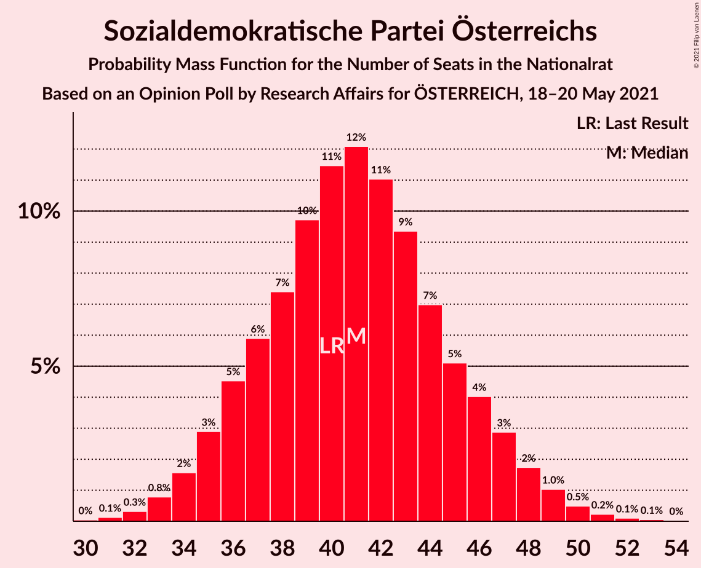

| Number of Seats | Probability | Accumulated | Special Marks |
|:---------------:|:-----------:|:-----------:|:-------------:|
| 30 | 0% | 100% |  |
| 31 | 0.1% | 99.9% |  |
| 32 | 0.3% | 99.8% |  |
| 33 | 0.8% | 99.5% |  |
| 34 | 2% | 98.7% |  |
| 35 | 3% | 97% |  |
| 36 | 5% | 94% |  |
| 37 | 6% | 90% |  |
| 38 | 7% | 84% |  |
| 39 | 10% | 76% |  |
| 40 | 11% | 67% | Last Result |
| 41 | 12% | 55% | Median |
| 42 | 11% | 43% |  |
| 43 | 9% | 32% |  |
| 44 | 7% | 23% |  |
| 45 | 5% | 16% |  |
| 46 | 4% | 11% |  |
| 47 | 3% | 7% |  |
| 48 | 2% | 4% |  |
| 49 | 1.0% | 2% |  |
| 50 | 0.5% | 0.9% |  |
| 51 | 0.2% | 0.4% |  |
| 52 | 0.1% | 0.2% |  |
| 53 | 0.1% | 0.1% |  |
| 54 | 0% | 0% |  |

### Freiheitliche Partei Österreichs

*For a full overview of the results for this party, see the [Freiheitliche Partei Österreichs](party-freiheitlicheparteiösterreichs.html) page.*

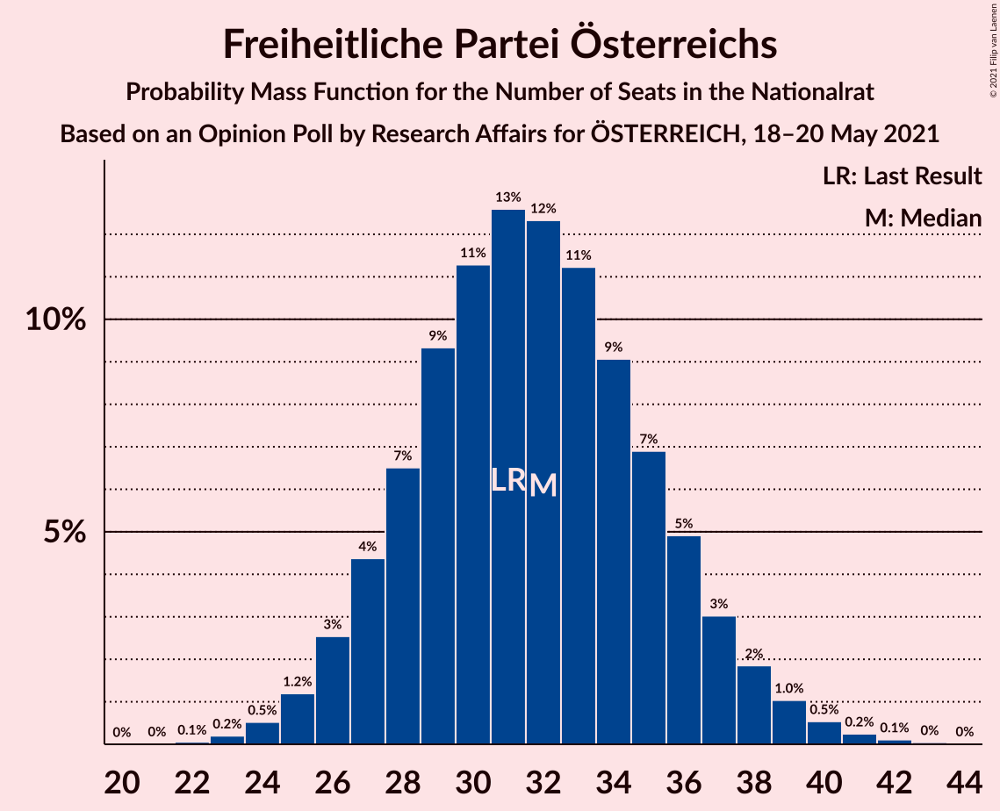

| Number of Seats | Probability | Accumulated | Special Marks |
|:---------------:|:-----------:|:-----------:|:-------------:|
| 22 | 0.1% | 100% |  |
| 23 | 0.2% | 99.9% |  |
| 24 | 0.5% | 99.7% |  |
| 25 | 1.2% | 99.2% |  |
| 26 | 3% | 98% |  |
| 27 | 4% | 95% |  |
| 28 | 7% | 91% |  |
| 29 | 9% | 85% |  |
| 30 | 11% | 75% |  |
| 31 | 13% | 64% | Last Result |
| 32 | 12% | 51% | Median |
| 33 | 11% | 39% |  |
| 34 | 9% | 28% |  |
| 35 | 7% | 19% |  |
| 36 | 5% | 12% |  |
| 37 | 3% | 7% |  |
| 38 | 2% | 4% |  |
| 39 | 1.0% | 2% |  |
| 40 | 0.5% | 1.0% |  |
| 41 | 0.2% | 0.4% |  |
| 42 | 0.1% | 0.2% |  |
| 43 | 0% | 0.1% |  |
| 44 | 0% | 0% |  |

### NEOS–Das Neue Österreich und Liberales Forum

*For a full overview of the results for this party, see the [NEOS–Das Neue Österreich und Liberales Forum](party-neos–dasneueösterreichundliberalesforum.html) page.*

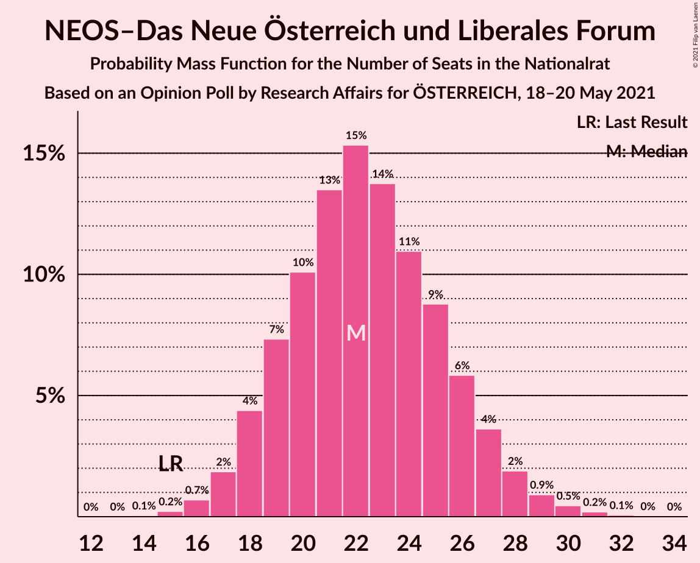

| Number of Seats | Probability | Accumulated | Special Marks |
|:---------------:|:-----------:|:-----------:|:-------------:|
| 14 | 0.1% | 100% |  |
| 15 | 0.2% | 99.9% | Last Result |
| 16 | 0.7% | 99.7% |  |
| 17 | 2% | 99.0% |  |
| 18 | 4% | 97% |  |
| 19 | 7% | 93% |  |
| 20 | 10% | 85% |  |
| 21 | 13% | 75% |  |
| 22 | 15% | 62% | Median |
| 23 | 14% | 47% |  |
| 24 | 11% | 33% |  |
| 25 | 9% | 22% |  |
| 26 | 6% | 13% |  |
| 27 | 4% | 7% |  |
| 28 | 2% | 4% |  |
| 29 | 0.9% | 2% |  |
| 30 | 0.5% | 0.8% |  |
| 31 | 0.2% | 0.3% |  |
| 32 | 0.1% | 0.1% |  |
| 33 | 0% | 0% |  |

### Die Grünen–Die Grüne Alternative

*For a full overview of the results for this party, see the [Die Grünen–Die Grüne Alternative](party-diegrünen–diegrünealternative.html) page.*

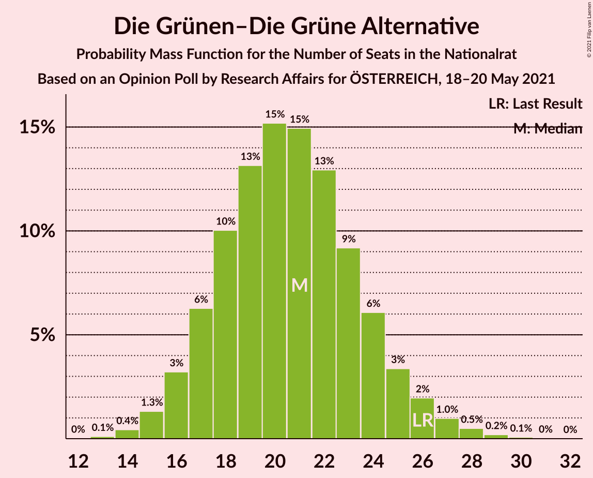

| Number of Seats | Probability | Accumulated | Special Marks |
|:---------------:|:-----------:|:-----------:|:-------------:|
| 13 | 0.1% | 100% |  |
| 14 | 0.4% | 99.9% |  |
| 15 | 1.3% | 99.4% |  |
| 16 | 3% | 98% |  |
| 17 | 6% | 95% |  |
| 18 | 10% | 89% |  |
| 19 | 13% | 79% |  |
| 20 | 15% | 65% |  |
| 21 | 15% | 50% | Median |
| 22 | 13% | 35% |  |
| 23 | 9% | 22% |  |
| 24 | 6% | 13% |  |
| 25 | 3% | 7% |  |
| 26 | 2% | 4% | Last Result |
| 27 | 1.0% | 2% |  |
| 28 | 0.5% | 0.8% |  |
| 29 | 0.2% | 0.3% |  |
| 30 | 0.1% | 0.1% |  |
| 31 | 0% | 0% |  |

## Coalitions

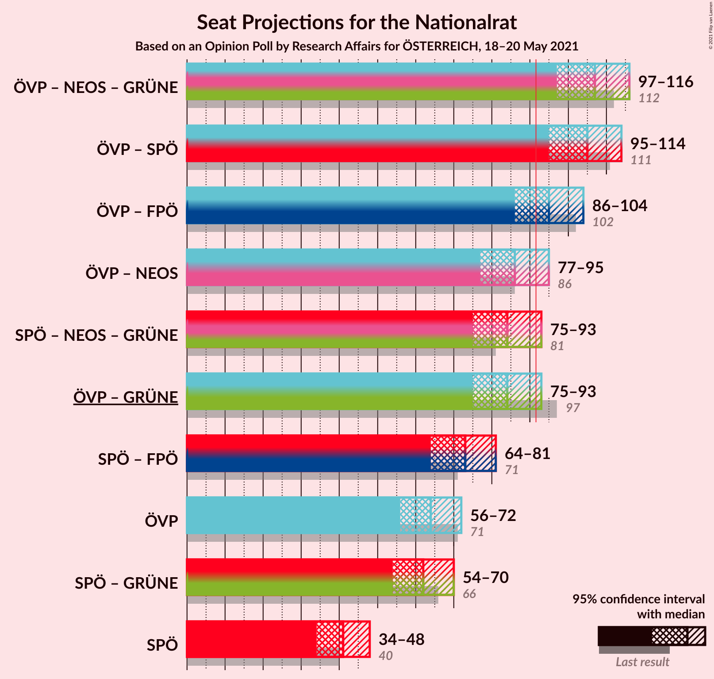

### Confidence Intervals

| Coalition | Last Result | Median | Majority? | 80% Confidence Interval | 90% Confidence Interval | 95% Confidence Interval | 99% Confidence Interval |
|:---------:|:-----------:|:------:|:---------:|:-----------------------:|:-----------------------:|:-----------------------:|:-----------------------:|
| Österreichische Volkspartei – NEOS–Das Neue Österreich und Liberales Forum – Die Grünen–Die Grüne Alternative | 112 | 107 | 100% | 100–113 | 99–114 | 97–116 | 95–118 |
| Österreichische Volkspartei – Sozialdemokratische Partei Österreichs | 111 | 105 | 99.8% | 99–111 | 97–112 | 95–114 | 93–116 |
| Österreichische Volkspartei – Freiheitliche Partei Österreichs | 102 | 95 | 79% | 89–101 | 88–103 | 86–104 | 84–107 |
| Österreichische Volkspartei – NEOS–Das Neue Österreich und Liberales Forum | 86 | 86 | 11% | 80–92 | 79–93 | 77–95 | 75–97 |
| Sozialdemokratische Partei Österreichs – NEOS–Das Neue Österreich und Liberales Forum – Die Grünen–Die Grüne Alternative | 81 | 84 | 5% | 78–90 | 77–91 | 75–93 | 73–96 |
| Österreichische Volkspartei – Die Grünen–Die Grüne Alternative | 97 | 84 | 5% | 78–90 | 77–92 | 75–93 | 73–96 |
| Sozialdemokratische Partei Österreichs – Freiheitliche Partei Österreichs | 71 | 73 | 0% | 67–78 | 66–80 | 64–81 | 62–84 |
| Österreichische Volkspartei | 71 | 64 | 0% | 58–69 | 57–70 | 56–72 | 53–74 |
| Sozialdemokratische Partei Österreichs – Die Grünen–Die Grüne Alternative | 66 | 62 | 0% | 56–67 | 55–68 | 54–70 | 51–72 |
| Sozialdemokratische Partei Österreichs | 40 | 41 | 0% | 36–46 | 35–47 | 34–48 | 32–50 |

### Österreichische Volkspartei – NEOS–Das Neue Österreich und Liberales Forum – Die Grünen–Die Grüne Alternative

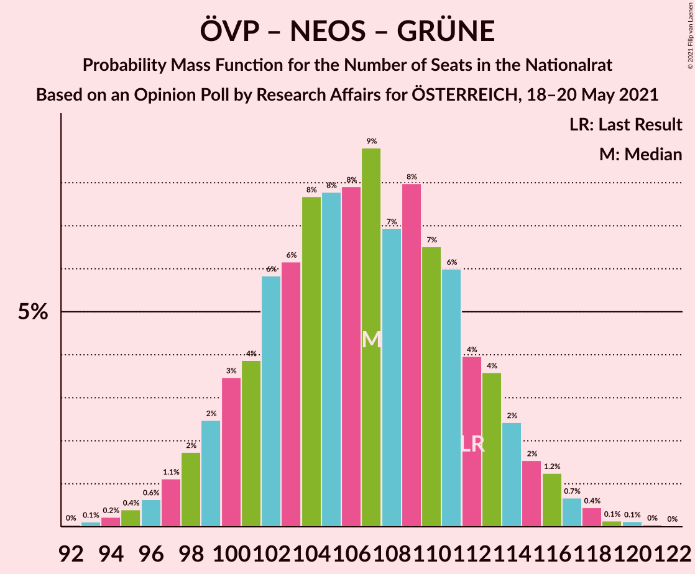

| Number of Seats | Probability | Accumulated | Special Marks |
|:---------------:|:-----------:|:-----------:|:-------------:|
| 92 | 0% | 100% | Majority |
| 93 | 0.1% | 99.9% |  |
| 94 | 0.2% | 99.8% |  |
| 95 | 0.4% | 99.6% |  |
| 96 | 0.6% | 99.2% |  |
| 97 | 1.1% | 98.5% |  |
| 98 | 2% | 97% |  |
| 99 | 2% | 96% |  |
| 100 | 3% | 93% |  |
| 101 | 4% | 90% |  |
| 102 | 6% | 86% |  |
| 103 | 6% | 80% |  |
| 104 | 8% | 74% |  |
| 105 | 8% | 66% |  |
| 106 | 8% | 58% |  |
| 107 | 9% | 50% | Median |
| 108 | 7% | 42% |  |
| 109 | 8% | 35% |  |
| 110 | 7% | 27% |  |
| 111 | 6% | 20% |  |
| 112 | 4% | 14% | Last Result |
| 113 | 4% | 10% |  |
| 114 | 2% | 7% |  |
| 115 | 2% | 4% |  |
| 116 | 1.2% | 3% |  |
| 117 | 0.7% | 1.5% |  |
| 118 | 0.4% | 0.8% |  |
| 119 | 0.1% | 0.3% |  |
| 120 | 0.1% | 0.2% |  |
| 121 | 0% | 0.1% |  |
| 122 | 0% | 0% |  |

### Österreichische Volkspartei – Sozialdemokratische Partei Österreichs

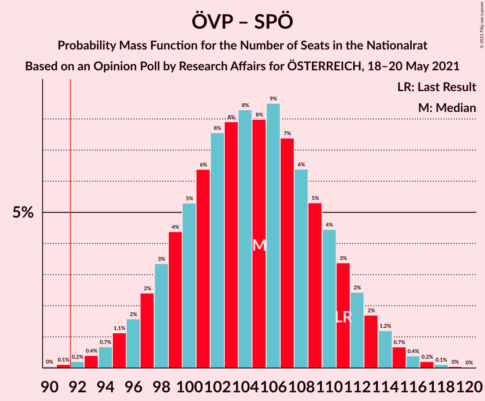

| Number of Seats | Probability | Accumulated | Special Marks |
|:---------------:|:-----------:|:-----------:|:-------------:|
| 90 | 0% | 100% |  |
| 91 | 0.1% | 99.9% |  |
| 92 | 0.2% | 99.8% | Majority |
| 93 | 0.4% | 99.6% |  |
| 94 | 0.7% | 99.2% |  |
| 95 | 1.1% | 98.5% |  |
| 96 | 2% | 97% |  |
| 97 | 2% | 96% |  |
| 98 | 3% | 93% |  |
| 99 | 4% | 90% |  |
| 100 | 5% | 86% |  |
| 101 | 6% | 80% |  |
| 102 | 8% | 74% |  |
| 103 | 8% | 66% |  |
| 104 | 8% | 59% |  |
| 105 | 8% | 50% | Median |
| 106 | 9% | 42% |  |
| 107 | 7% | 34% |  |
| 108 | 6% | 26% |  |
| 109 | 5% | 20% |  |
| 110 | 4% | 15% |  |
| 111 | 3% | 10% | Last Result |
| 112 | 2% | 7% |  |
| 113 | 2% | 4% |  |
| 114 | 1.2% | 3% |  |
| 115 | 0.7% | 1.5% |  |
| 116 | 0.4% | 0.8% |  |
| 117 | 0.2% | 0.4% |  |
| 118 | 0.1% | 0.2% |  |
| 119 | 0% | 0.1% |  |
| 120 | 0% | 0% |  |

### Österreichische Volkspartei – Freiheitliche Partei Österreichs

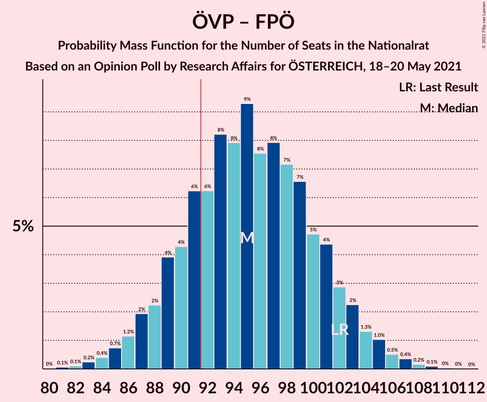

| Number of Seats | Probability | Accumulated | Special Marks |
|:---------------:|:-----------:|:-----------:|:-------------:|
| 81 | 0.1% | 100% |  |
| 82 | 0.1% | 99.9% |  |
| 83 | 0.2% | 99.8% |  |
| 84 | 0.4% | 99.5% |  |
| 85 | 0.7% | 99.1% |  |
| 86 | 1.2% | 98% |  |
| 87 | 2% | 97% |  |
| 88 | 2% | 95% |  |
| 89 | 4% | 93% |  |
| 90 | 4% | 89% |  |
| 91 | 6% | 85% |  |
| 92 | 6% | 79% | Majority |
| 93 | 8% | 72% |  |
| 94 | 8% | 64% |  |
| 95 | 9% | 56% |  |
| 96 | 8% | 47% | Median |
| 97 | 8% | 39% |  |
| 98 | 7% | 31% |  |
| 99 | 7% | 24% |  |
| 100 | 5% | 18% |  |
| 101 | 4% | 13% |  |
| 102 | 3% | 9% | Last Result |
| 103 | 2% | 6% |  |
| 104 | 1.3% | 4% |  |
| 105 | 1.0% | 2% |  |
| 106 | 0.5% | 1.2% |  |
| 107 | 0.4% | 0.7% |  |
| 108 | 0.2% | 0.3% |  |
| 109 | 0.1% | 0.2% |  |
| 110 | 0% | 0.1% |  |
| 111 | 0% | 0% |  |

### Österreichische Volkspartei – NEOS–Das Neue Österreich und Liberales Forum

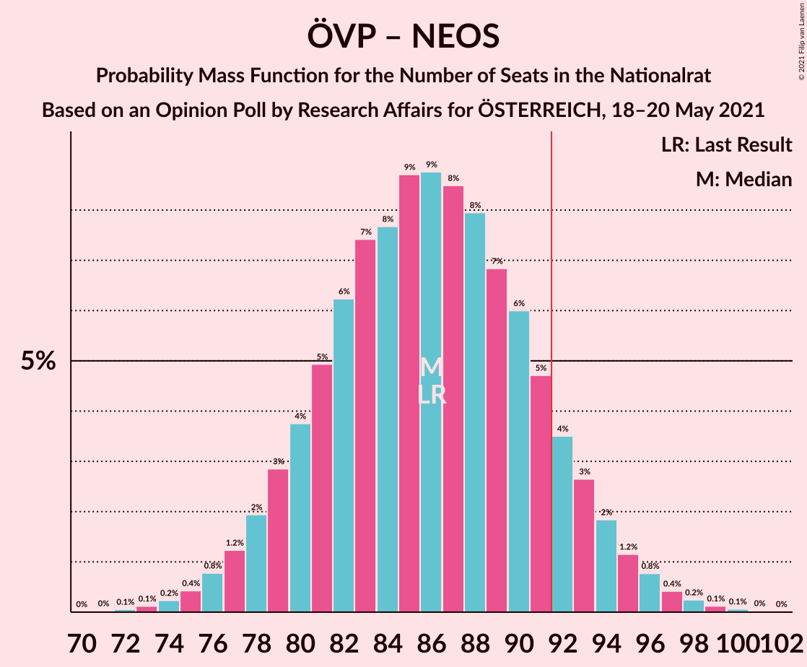

| Number of Seats | Probability | Accumulated | Special Marks |
|:---------------:|:-----------:|:-----------:|:-------------:|
| 72 | 0.1% | 100% |  |
| 73 | 0.1% | 99.9% |  |
| 74 | 0.2% | 99.8% |  |
| 75 | 0.4% | 99.5% |  |
| 76 | 0.8% | 99.1% |  |
| 77 | 1.2% | 98% |  |
| 78 | 2% | 97% |  |
| 79 | 3% | 95% |  |
| 80 | 4% | 92% |  |
| 81 | 5% | 89% |  |
| 82 | 6% | 84% |  |
| 83 | 7% | 77% |  |
| 84 | 8% | 70% |  |
| 85 | 9% | 62% |  |
| 86 | 9% | 54% | Last Result, Median |
| 87 | 8% | 45% |  |
| 88 | 8% | 36% |  |
| 89 | 7% | 28% |  |
| 90 | 6% | 22% |  |
| 91 | 5% | 16% |  |
| 92 | 4% | 11% | Majority |
| 93 | 3% | 7% |  |
| 94 | 2% | 5% |  |
| 95 | 1.2% | 3% |  |
| 96 | 0.8% | 2% |  |
| 97 | 0.4% | 0.9% |  |
| 98 | 0.2% | 0.5% |  |
| 99 | 0.1% | 0.2% |  |
| 100 | 0.1% | 0.1% |  |
| 101 | 0% | 0.1% |  |
| 102 | 0% | 0% |  |

### Sozialdemokratische Partei Österreichs – NEOS–Das Neue Österreich und Liberales Forum – Die Grünen–Die Grüne Alternative

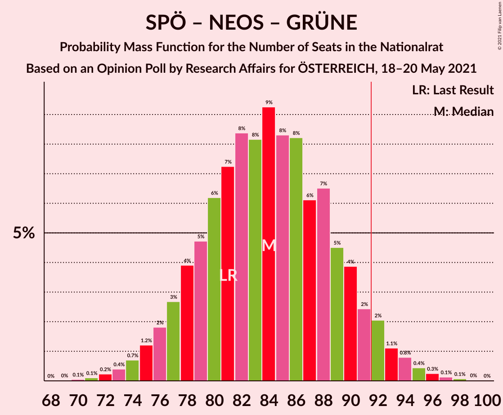

| Number of Seats | Probability | Accumulated | Special Marks |
|:---------------:|:-----------:|:-----------:|:-------------:|
| 70 | 0.1% | 100% |  |
| 71 | 0.1% | 99.9% |  |
| 72 | 0.2% | 99.8% |  |
| 73 | 0.4% | 99.6% |  |
| 74 | 0.7% | 99.2% |  |
| 75 | 1.2% | 98% |  |
| 76 | 2% | 97% |  |
| 77 | 3% | 95% |  |
| 78 | 4% | 93% |  |
| 79 | 5% | 89% |  |
| 80 | 6% | 84% |  |
| 81 | 7% | 78% | Last Result |
| 82 | 8% | 71% |  |
| 83 | 8% | 62% |  |
| 84 | 9% | 54% | Median |
| 85 | 8% | 45% |  |
| 86 | 8% | 37% |  |
| 87 | 6% | 28% |  |
| 88 | 7% | 22% |  |
| 89 | 5% | 16% |  |
| 90 | 4% | 11% |  |
| 91 | 2% | 7% |  |
| 92 | 2% | 5% | Majority |
| 93 | 1.1% | 3% |  |
| 94 | 0.8% | 2% |  |
| 95 | 0.4% | 0.9% |  |
| 96 | 0.3% | 0.5% |  |
| 97 | 0.1% | 0.3% |  |
| 98 | 0.1% | 0.1% |  |
| 99 | 0% | 0.1% |  |
| 100 | 0% | 0% |  |

### Österreichische Volkspartei – Die Grünen–Die Grüne Alternative

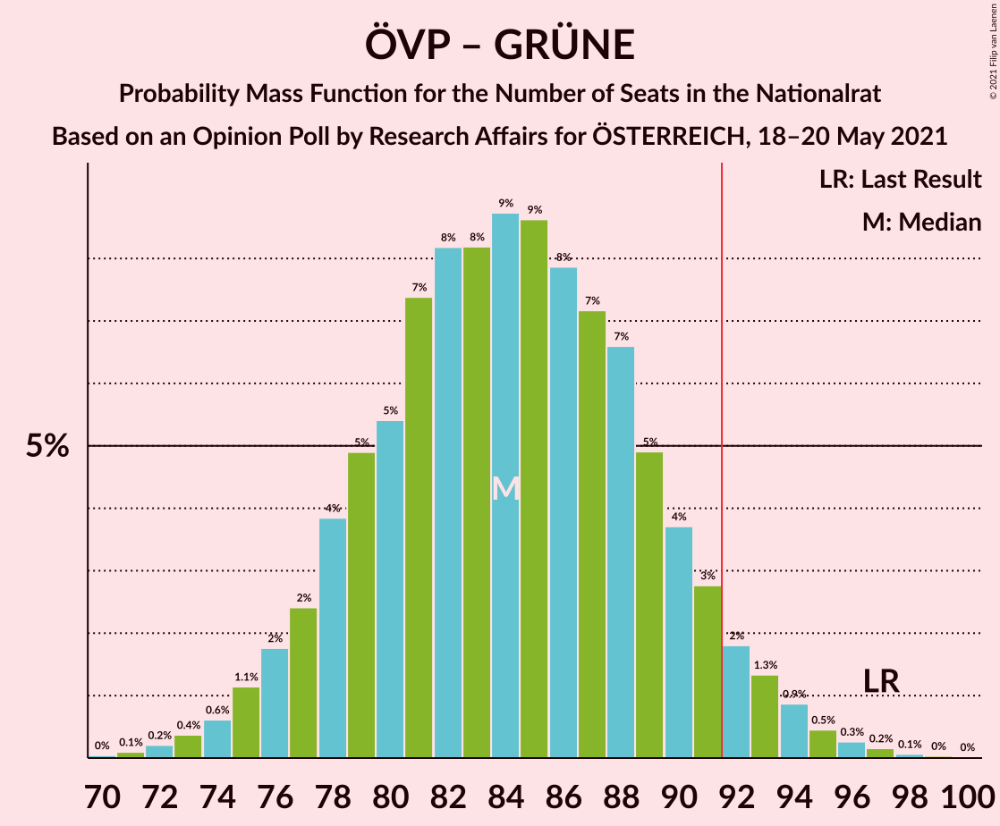

| Number of Seats | Probability | Accumulated | Special Marks |
|:---------------:|:-----------:|:-----------:|:-------------:|
| 70 | 0% | 100% |  |
| 71 | 0.1% | 99.9% |  |
| 72 | 0.2% | 99.8% |  |
| 73 | 0.4% | 99.6% |  |
| 74 | 0.6% | 99.2% |  |
| 75 | 1.1% | 98.6% |  |
| 76 | 2% | 97% |  |
| 77 | 2% | 96% |  |
| 78 | 4% | 93% |  |
| 79 | 5% | 89% |  |
| 80 | 5% | 85% |  |
| 81 | 7% | 79% |  |
| 82 | 8% | 72% |  |
| 83 | 8% | 64% |  |
| 84 | 9% | 55% |  |
| 85 | 9% | 47% | Median |
| 86 | 8% | 38% |  |
| 87 | 7% | 30% |  |
| 88 | 7% | 23% |  |
| 89 | 5% | 16% |  |
| 90 | 4% | 11% |  |
| 91 | 3% | 8% |  |
| 92 | 2% | 5% | Majority |
| 93 | 1.3% | 3% |  |
| 94 | 0.9% | 2% |  |
| 95 | 0.5% | 1.0% |  |
| 96 | 0.3% | 0.5% |  |
| 97 | 0.2% | 0.3% | Last Result |
| 98 | 0.1% | 0.1% |  |
| 99 | 0% | 0.1% |  |
| 100 | 0% | 0% |  |

### Sozialdemokratische Partei Österreichs – Freiheitliche Partei Österreichs

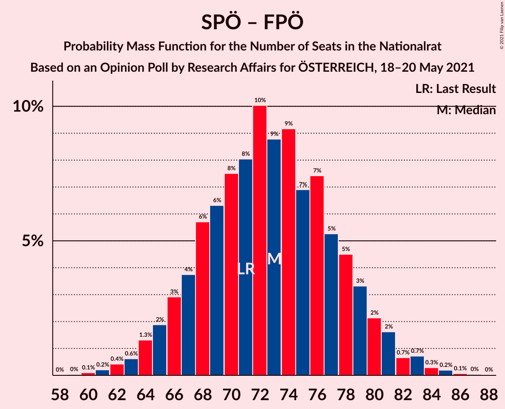

| Number of Seats | Probability | Accumulated | Special Marks |
|:---------------:|:-----------:|:-----------:|:-------------:|
| 59 | 0% | 100% |  |
| 60 | 0.1% | 99.9% |  |
| 61 | 0.2% | 99.8% |  |
| 62 | 0.4% | 99.6% |  |
| 63 | 0.6% | 99.2% |  |
| 64 | 1.3% | 98.6% |  |
| 65 | 2% | 97% |  |
| 66 | 3% | 95% |  |
| 67 | 4% | 92% |  |
| 68 | 6% | 89% |  |
| 69 | 6% | 83% |  |
| 70 | 8% | 77% |  |
| 71 | 8% | 69% | Last Result |
| 72 | 10% | 61% |  |
| 73 | 9% | 51% | Median |
| 74 | 9% | 42% |  |
| 75 | 7% | 33% |  |
| 76 | 7% | 26% |  |
| 77 | 5% | 19% |  |
| 78 | 5% | 14% |  |
| 79 | 3% | 9% |  |
| 80 | 2% | 6% |  |
| 81 | 2% | 4% |  |
| 82 | 0.7% | 2% |  |
| 83 | 0.7% | 1.3% |  |
| 84 | 0.3% | 0.6% |  |
| 85 | 0.2% | 0.3% |  |
| 86 | 0.1% | 0.1% |  |
| 87 | 0% | 0.1% |  |
| 88 | 0% | 0% |  |

### Österreichische Volkspartei

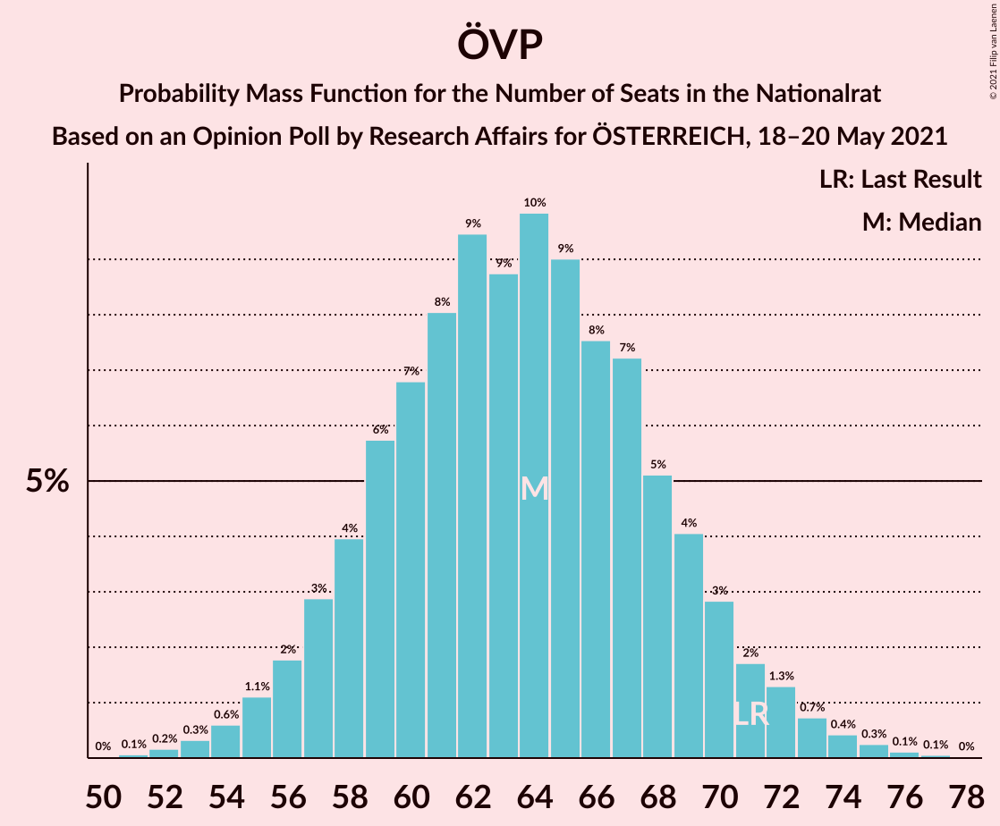

| Number of Seats | Probability | Accumulated | Special Marks |
|:---------------:|:-----------:|:-----------:|:-------------:|
| 51 | 0.1% | 100% |  |
| 52 | 0.2% | 99.9% |  |
| 53 | 0.3% | 99.7% |  |
| 54 | 0.6% | 99.4% |  |
| 55 | 1.1% | 98.8% |  |
| 56 | 2% | 98% |  |
| 57 | 3% | 96% |  |
| 58 | 4% | 93% |  |
| 59 | 6% | 89% |  |
| 60 | 7% | 83% |  |
| 61 | 8% | 77% |  |
| 62 | 9% | 68% |  |
| 63 | 9% | 59% |  |
| 64 | 10% | 50% | Median |
| 65 | 9% | 40% |  |
| 66 | 8% | 31% |  |
| 67 | 7% | 24% |  |
| 68 | 5% | 17% |  |
| 69 | 4% | 12% |  |
| 70 | 3% | 7% |  |
| 71 | 2% | 5% | Last Result |
| 72 | 1.3% | 3% |  |
| 73 | 0.7% | 2% |  |
| 74 | 0.4% | 0.9% |  |
| 75 | 0.3% | 0.5% |  |
| 76 | 0.1% | 0.2% |  |
| 77 | 0.1% | 0.1% |  |
| 78 | 0% | 0% |  |

### Sozialdemokratische Partei Österreichs – Die Grünen–Die Grüne Alternative

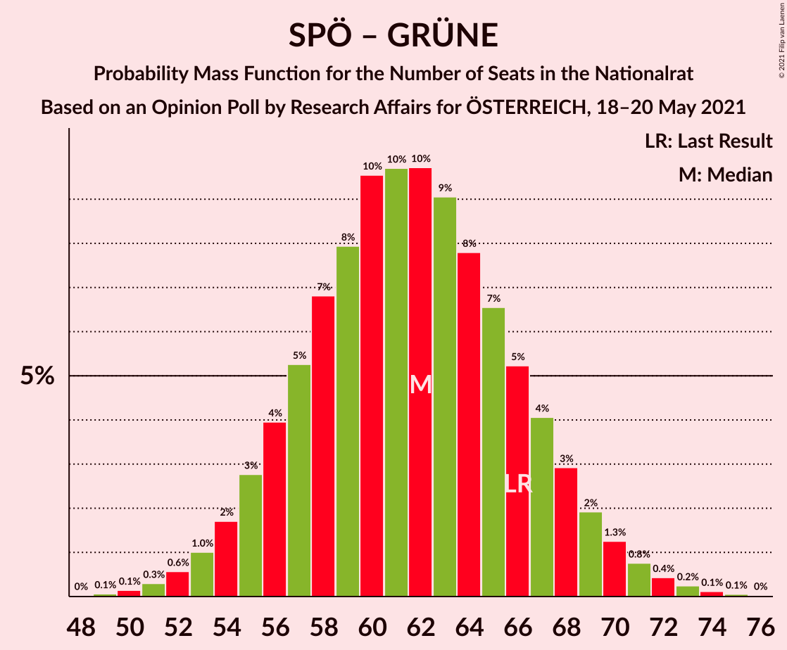

| Number of Seats | Probability | Accumulated | Special Marks |
|:---------------:|:-----------:|:-----------:|:-------------:|
| 49 | 0.1% | 100% |  |
| 50 | 0.1% | 99.9% |  |
| 51 | 0.3% | 99.8% |  |
| 52 | 0.6% | 99.5% |  |
| 53 | 1.0% | 98.9% |  |
| 54 | 2% | 98% |  |
| 55 | 3% | 96% |  |
| 56 | 4% | 93% |  |
| 57 | 5% | 89% |  |
| 58 | 7% | 84% |  |
| 59 | 8% | 77% |  |
| 60 | 10% | 69% |  |
| 61 | 10% | 60% |  |
| 62 | 10% | 50% | Median |
| 63 | 9% | 40% |  |
| 64 | 8% | 31% |  |
| 65 | 7% | 24% |  |
| 66 | 5% | 17% | Last Result |
| 67 | 4% | 12% |  |
| 68 | 3% | 8% |  |
| 69 | 2% | 5% |  |
| 70 | 1.3% | 3% |  |
| 71 | 0.8% | 2% |  |
| 72 | 0.4% | 0.9% |  |
| 73 | 0.2% | 0.5% |  |
| 74 | 0.1% | 0.2% |  |
| 75 | 0.1% | 0.1% |  |
| 76 | 0% | 0% |  |

### Sozialdemokratische Partei Österreichs

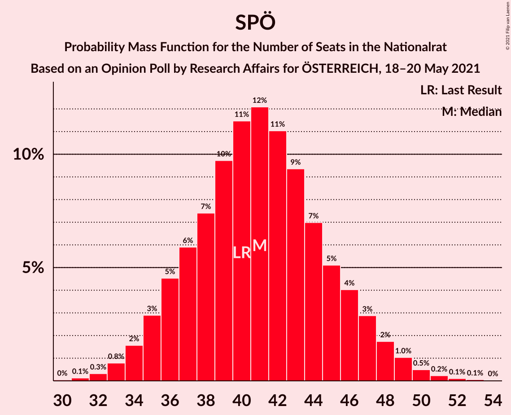

| Number of Seats | Probability | Accumulated | Special Marks |
|:---------------:|:-----------:|:-----------:|:-------------:|
| 30 | 0% | 100% |  |
| 31 | 0.1% | 99.9% |  |
| 32 | 0.3% | 99.8% |  |
| 33 | 0.8% | 99.5% |  |
| 34 | 2% | 98.7% |  |
| 35 | 3% | 97% |  |
| 36 | 5% | 94% |  |
| 37 | 6% | 90% |  |
| 38 | 7% | 84% |  |
| 39 | 10% | 76% |  |
| 40 | 11% | 67% | Last Result |
| 41 | 12% | 55% | Median |
| 42 | 11% | 43% |  |
| 43 | 9% | 32% |  |
| 44 | 7% | 23% |  |
| 45 | 5% | 16% |  |
| 46 | 4% | 11% |  |
| 47 | 3% | 7% |  |
| 48 | 2% | 4% |  |
| 49 | 1.0% | 2% |  |
| 50 | 0.5% | 0.9% |  |
| 51 | 0.2% | 0.4% |  |
| 52 | 0.1% | 0.2% |  |
| 53 | 0.1% | 0.1% |  |
| 54 | 0% | 0% |  |

## Technical Information

### Opinion Poll

+ **Polling firm:** Research Affairs
+ **Commissioner(s):** ÖSTERREICH
+ **Fieldwork period:** 18–20 May 2021

### Calculations

+ **Sample size:** 523
+ **Simulations done:** 1,048,576
+ **Error estimate:** 0.50%

