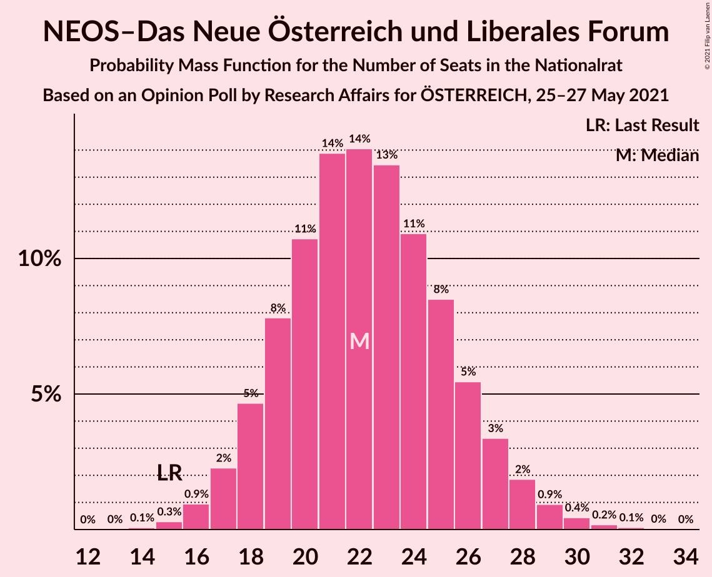
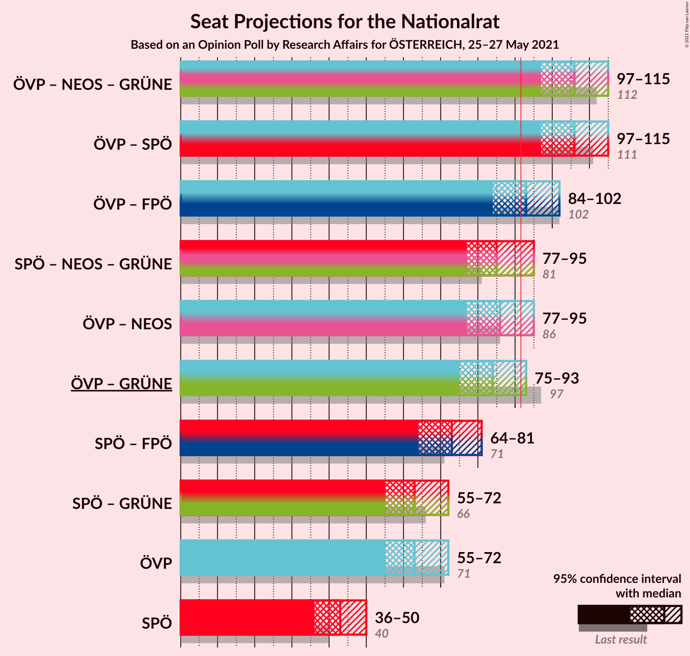
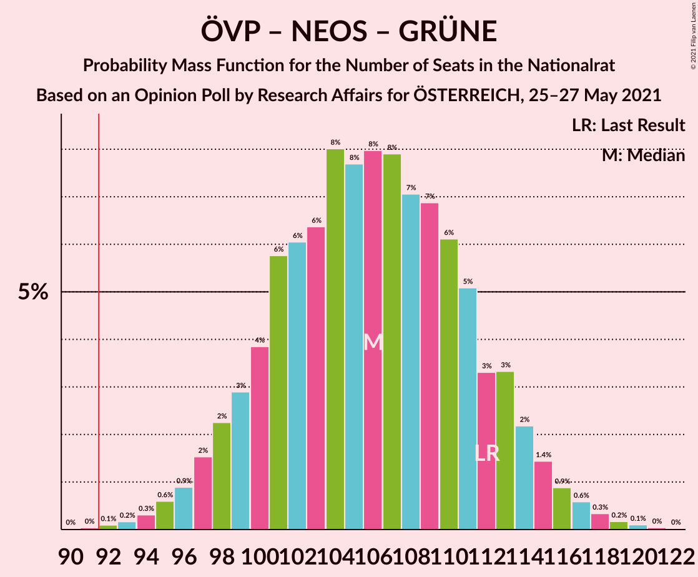
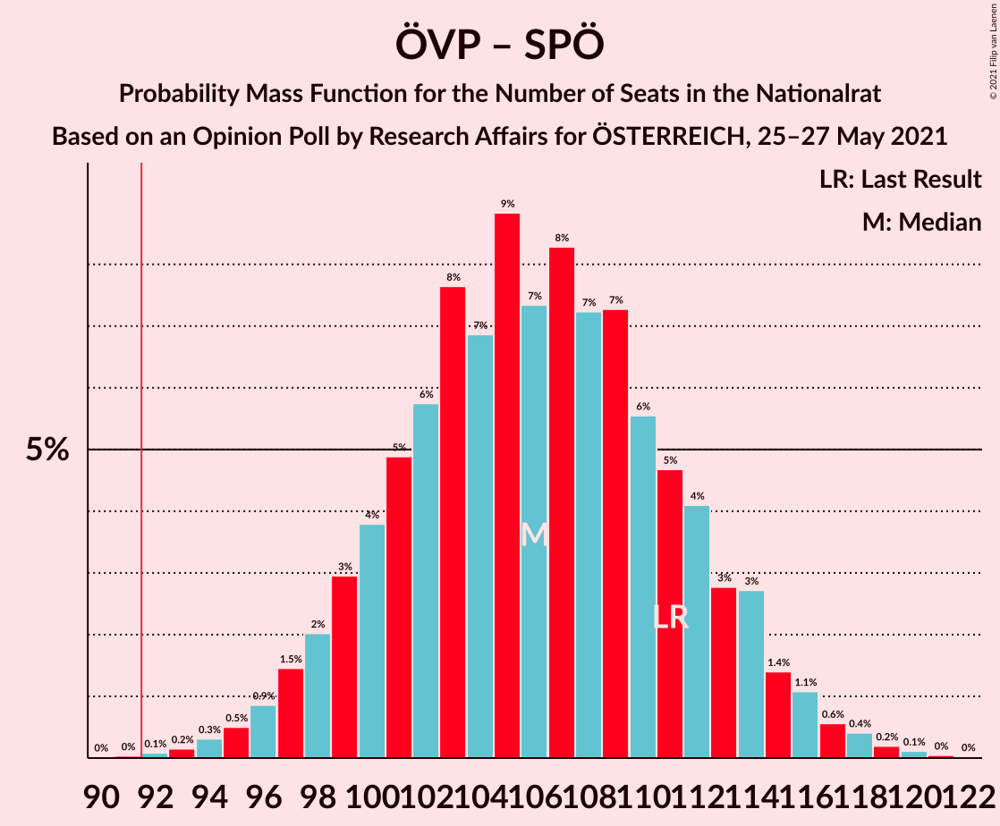
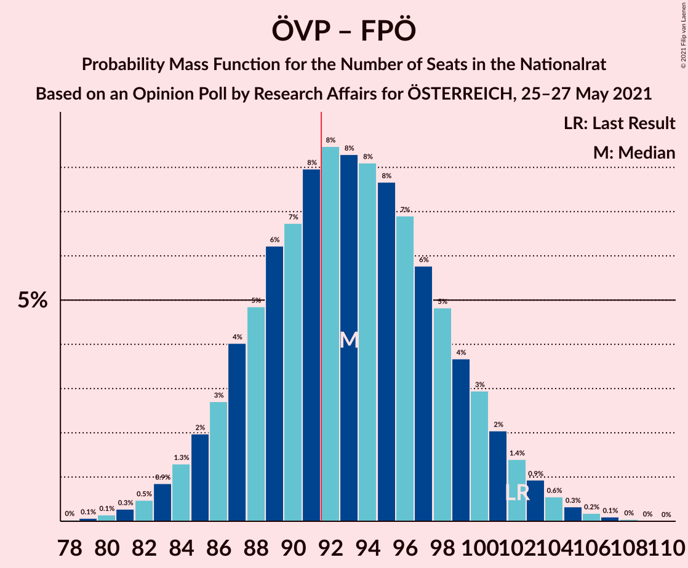
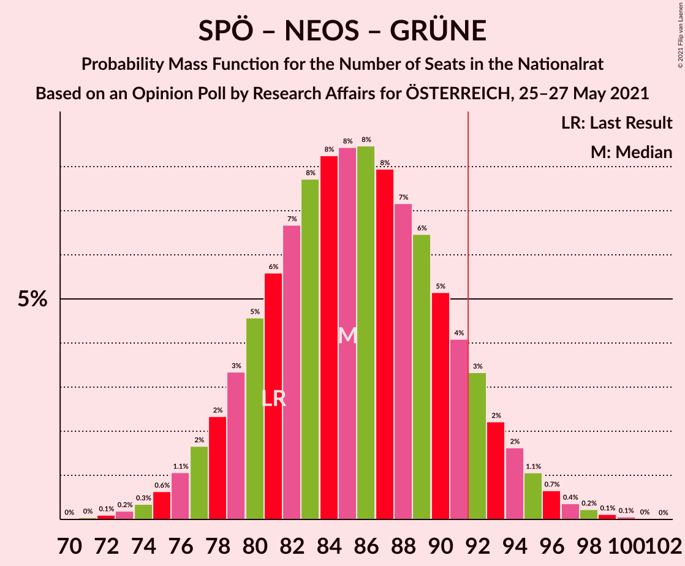
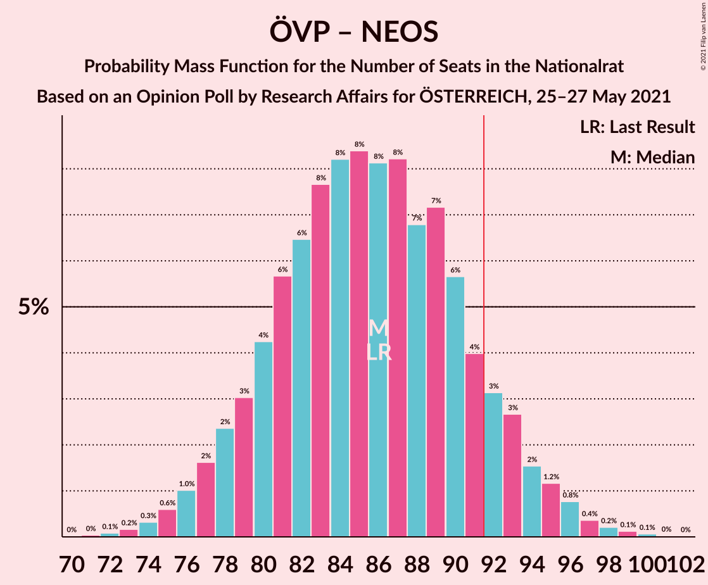
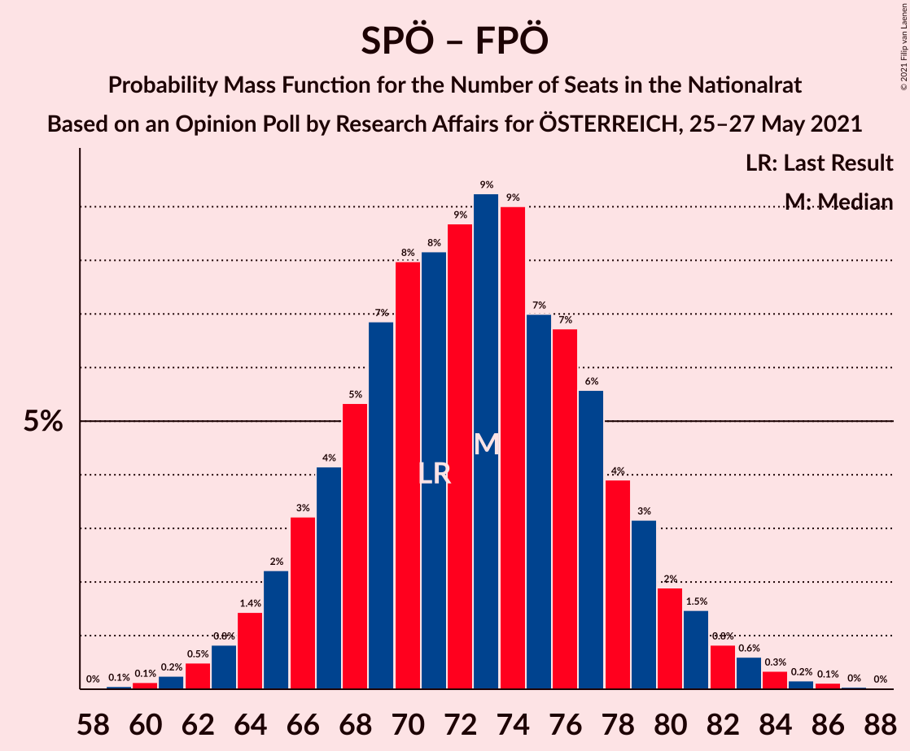

# Opinion Poll by Research Affairs for ÖSTERREICH, 25–27 May 2021

<a href="#voting-intentions">Voting Intentions</a> | <a href="#seats">Seats</a> | <a href="#coalitions">Coalitions</a> | <a href="#technical-information">Technical Information</a>

## Voting Intentions

### Confidence Intervals

| Party | Last Result | Poll Result | 80% Confidence Interval | 90% Confidence Interval | 95% Confidence Interval | 99% Confidence Interval |
|:-----:|:-----------:|:-----------:|:-----------------------:|:-----------------------:|:-----------------------:|:-----------------------:|
| Österreichische Volkspartei | 37.5% | 34.0% | 31.4–36.8% |30.6–37.6% |30.0–38.3% |28.7–39.6% |
| Sozialdemokratische Partei Österreichs | 21.2% | 23.0% | 20.7–25.5% |20.1–26.3% |19.5–26.9% |18.5–28.2% |
| Freiheitliche Partei Österreichs | 16.2% | 16.0% | 14.1–18.3% |13.5–18.9% |13.0–19.5% |12.2–20.6% |
| NEOS–Das Neue Österreich und Liberales Forum | 8.1% | 12.0% | 10.3–14.1% |9.8–14.6% |9.4–15.2% |8.7–16.2% |
| Die Grünen–Die Grüne Alternative | 13.9% | 11.0% | 9.4–13.0% |8.9–13.5% |8.6–14.1% |7.8–15.1% |

*Note:* The poll result column reflects the actual value used in the calculations. Published results may vary slightly, and in addition be rounded to fewer digits.

## Seats

### Confidence Intervals

| Party | Last Result | Median | 80% Confidence Interval | 90% Confidence Interval | 95% Confidence Interval | 99% Confidence Interval |
|:-----:|:-----------:|:------:|:-----------------------:|:-----------------------:|:-----------------------:|:-----------------------:|
| <a href="#österreichische-volkspartei">Österreichische Volkspartei</a> | 71 | 63 | 58–69 |56–70 |55–72 |53–74 |
| <a href="#sozialdemokratische-partei-österreichs">Sozialdemokratische Partei Österreichs</a> | 40 | 43 | 38–48 |37–49 |36–50 |34–53 |
| <a href="#freiheitliche-partei-österreichs">Freiheitliche Partei Österreichs</a> | 31 | 30 | 26–34 |25–35 |24–36 |22–38 |
| <a href="#neos–das-neue-österreich-und-liberales-forum">NEOS–Das Neue Österreich und Liberales Forum</a> | 15 | 22 | 19–26 |18–27 |17–28 |16–30 |
| <a href="#die-grünen–die-grüne-alternative">Die Grünen–Die Grüne Alternative</a> | 26 | 20 | 17–24 |16–25 |15–26 |14–28 |

### Österreichische Volkspartei

*For a full overview of the results for this party, see the [Österreichische Volkspartei](party-österreichischevolkspartei.html) page.*

| Number of Seats | Probability | Accumulated | Special Marks |
|:---------------:|:-----------:|:-----------:|:-------------:|
| 50 | 0% | 100% |  |
| 51 | 0.1% | 99.9% |  |
| 52 | 0.2% | 99.8% |  |
| 53 | 0.5% | 99.6% |  |
| 54 | 0.7% | 99.2% |  |
| 55 | 1.4% | 98% |  |
| 56 | 2% | 97% |  |
| 57 | 3% | 95% |  |
| 58 | 5% | 92% |  |
| 59 | 6% | 87% |  |
| 60 | 8% | 82% |  |
| 61 | 8% | 74% |  |
| 62 | 9% | 66% |  |
| 63 | 10% | 57% | Median |
| 64 | 9% | 47% |  |
| 65 | 9% | 38% |  |
| 66 | 7% | 30% |  |
| 67 | 6% | 22% |  |
| 68 | 5% | 16% |  |
| 69 | 4% | 11% |  |
| 70 | 3% | 7% |  |
| 71 | 2% | 5% | Last Result |
| 72 | 1.2% | 3% |  |
| 73 | 0.7% | 2% |  |
| 74 | 0.4% | 0.9% |  |
| 75 | 0.2% | 0.5% |  |
| 76 | 0.1% | 0.2% |  |
| 77 | 0.1% | 0.1% |  |
| 78 | 0% | 0.1% |  |
| 79 | 0% | 0% |  |

### Sozialdemokratische Partei Österreichs

*For a full overview of the results for this party, see the [Sozialdemokratische Partei Österreichs](party-sozialdemokratischeparteiösterreichs.html) page.*

| Number of Seats | Probability | Accumulated | Special Marks |
|:---------------:|:-----------:|:-----------:|:-------------:|
| 32 | 0.1% | 100% |  |
| 33 | 0.2% | 99.9% |  |
| 34 | 0.5% | 99.6% |  |
| 35 | 1.0% | 99.1% |  |
| 36 | 2% | 98% |  |
| 37 | 3% | 96% |  |
| 38 | 5% | 93% |  |
| 39 | 7% | 88% |  |
| 40 | 8% | 81% | Last Result |
| 41 | 10% | 73% |  |
| 42 | 11% | 63% |  |
| 43 | 11% | 52% | Median |
| 44 | 10% | 41% |  |
| 45 | 9% | 32% |  |
| 46 | 7% | 23% |  |
| 47 | 5% | 15% |  |
| 48 | 4% | 10% |  |
| 49 | 3% | 6% |  |
| 50 | 2% | 4% |  |
| 51 | 0.9% | 2% |  |
| 52 | 0.6% | 1.1% |  |
| 53 | 0.3% | 0.5% |  |
| 54 | 0.1% | 0.3% |  |
| 55 | 0.1% | 0.1% |  |
| 56 | 0% | 0% |  |

### Freiheitliche Partei Österreichs

*For a full overview of the results for this party, see the [Freiheitliche Partei Österreichs](party-freiheitlicheparteiösterreichs.html) page.*

| Number of Seats | Probability | Accumulated | Special Marks |
|:---------------:|:-----------:|:-----------:|:-------------:|
| 20 | 0% | 100% |  |
| 21 | 0.2% | 99.9% |  |
| 22 | 0.5% | 99.8% |  |
| 23 | 1.2% | 99.3% |  |
| 24 | 2% | 98% |  |
| 25 | 4% | 96% |  |
| 26 | 7% | 91% |  |
| 27 | 9% | 85% |  |
| 28 | 11% | 76% |  |
| 29 | 12% | 64% |  |
| 30 | 13% | 52% | Median |
| 31 | 12% | 39% | Last Result |
| 32 | 9% | 28% |  |
| 33 | 7% | 18% |  |
| 34 | 5% | 11% |  |
| 35 | 3% | 7% |  |
| 36 | 2% | 4% |  |
| 37 | 1.0% | 2% |  |
| 38 | 0.5% | 1.0% |  |
| 39 | 0.3% | 0.5% |  |
| 40 | 0.1% | 0.2% |  |
| 41 | 0% | 0.1% |  |
| 42 | 0% | 0% |  |

### NEOS–Das Neue Österreich und Liberales Forum

*For a full overview of the results for this party, see the [NEOS–Das Neue Österreich und Liberales Forum](party-neos–dasneueösterreichundliberalesforum.html) page.*

| Number of Seats | Probability | Accumulated | Special Marks |
|:---------------:|:-----------:|:-----------:|:-------------:|
| 14 | 0.1% | 100% |  |
| 15 | 0.3% | 99.9% | Last Result |
| 16 | 0.9% | 99.6% |  |
| 17 | 2% | 98.7% |  |
| 18 | 5% | 96% |  |
| 19 | 8% | 92% |  |
| 20 | 11% | 84% |  |
| 21 | 14% | 73% |  |
| 22 | 14% | 59% | Median |
| 23 | 13% | 45% |  |
| 24 | 11% | 32% |  |
| 25 | 8% | 21% |  |
| 26 | 5% | 12% |  |
| 27 | 3% | 7% |  |
| 28 | 2% | 4% |  |
| 29 | 0.9% | 2% |  |
| 30 | 0.4% | 0.7% |  |
| 31 | 0.2% | 0.3% |  |
| 32 | 0.1% | 0.1% |  |
| 33 | 0% | 0% |  |

### Die Grünen–Die Grüne Alternative

*For a full overview of the results for this party, see the [Die Grünen–Die Grüne Alternative](party-diegrünen–diegrünealternative.html) page.*

| Number of Seats | Probability | Accumulated | Special Marks |
|:---------------:|:-----------:|:-----------:|:-------------:|
| 13 | 0.2% | 100% |  |
| 14 | 0.6% | 99.8% |  |
| 15 | 2% | 99.2% |  |
| 16 | 4% | 97% |  |
| 17 | 7% | 93% |  |
| 18 | 11% | 86% |  |
| 19 | 14% | 75% |  |
| 20 | 15% | 61% | Median |
| 21 | 14% | 47% |  |
| 22 | 12% | 33% |  |
| 23 | 9% | 21% |  |
| 24 | 6% | 13% |  |
| 25 | 3% | 7% |  |
| 26 | 2% | 3% | Last Result |
| 27 | 0.9% | 2% |  |
| 28 | 0.4% | 0.7% |  |
| 29 | 0.2% | 0.3% |  |
| 30 | 0.1% | 0.1% |  |
| 31 | 0% | 0% |  |

## Coalitions

### Confidence Intervals

| Coalition | Last Result | Median | Majority? | 80% Confidence Interval | 90% Confidence Interval | 95% Confidence Interval | 99% Confidence Interval |
|:---------:|:-----------:|:------:|:---------:|:-----------------------:|:-----------------------:|:-----------------------:|:-----------------------:|
| Österreichische Volkspartei – NEOS–Das Neue Österreich und Liberales Forum – Die Grünen–Die Grüne Alternative | 112 | 106 | 99.9% | 100–112 | 98–114 | 97–115 | 94–118 |
| Österreichische Volkspartei – Sozialdemokratische Partei Österreichs | 111 | 106 | 99.9% | 100–112 | 98–114 | 97–115 | 94–118 |
| Österreichische Volkspartei – Freiheitliche Partei Österreichs | 102 | 93 | 62% | 87–99 | 85–101 | 84–102 | 81–105 |
| Sozialdemokratische Partei Österreichs – NEOS–Das Neue Österreich und Liberales Forum – Die Grünen–Die Grüne Alternative | 81 | 85 | 10% | 80–91 | 78–93 | 77–95 | 74–97 |
| Österreichische Volkspartei – NEOS–Das Neue Österreich und Liberales Forum | 86 | 86 | 10% | 80–92 | 78–93 | 77–95 | 74–97 |
| Österreichische Volkspartei – Die Grünen–Die Grüne Alternative | 97 | 84 | 5% | 78–90 | 76–91 | 75–93 | 72–96 |
| Sozialdemokratische Partei Österreichs – Freiheitliche Partei Österreichs | 71 | 73 | 0% | 67–78 | 65–80 | 64–81 | 62–84 |
| Sozialdemokratische Partei Österreichs – Die Grünen–Die Grüne Alternative | 66 | 63 | 0% | 58–69 | 56–70 | 55–72 | 53–74 |
| Österreichische Volkspartei | 71 | 63 | 0% | 58–69 | 56–70 | 55–72 | 53–74 |
| Sozialdemokratische Partei Österreichs | 40 | 43 | 0% | 38–48 | 37–49 | 36–50 | 34–53 |

### Österreichische Volkspartei – NEOS–Das Neue Österreich und Liberales Forum – Die Grünen–Die Grüne Alternative

| Number of Seats | Probability | Accumulated | Special Marks |
|:---------------:|:-----------:|:-----------:|:-------------:|
| 91 | 0% | 100% |  |
| 92 | 0.1% | 99.9% | Majority |
| 93 | 0.2% | 99.8% |  |
| 94 | 0.3% | 99.7% |  |
| 95 | 0.6% | 99.4% |  |
| 96 | 0.9% | 98.8% |  |
| 97 | 2% | 98% |  |
| 98 | 2% | 96% |  |
| 99 | 3% | 94% |  |
| 100 | 4% | 91% |  |
| 101 | 6% | 87% |  |
| 102 | 6% | 82% |  |
| 103 | 6% | 76% |  |
| 104 | 8% | 69% |  |
| 105 | 8% | 61% | Median |
| 106 | 8% | 53% |  |
| 107 | 8% | 45% |  |
| 108 | 7% | 38% |  |
| 109 | 7% | 30% |  |
| 110 | 6% | 24% |  |
| 111 | 5% | 18% |  |
| 112 | 3% | 12% | Last Result |
| 113 | 3% | 9% |  |
| 114 | 2% | 6% |  |
| 115 | 1.4% | 4% |  |
| 116 | 0.9% | 2% |  |
| 117 | 0.6% | 1.3% |  |
| 118 | 0.3% | 0.7% |  |
| 119 | 0.2% | 0.4% |  |
| 120 | 0.1% | 0.2% |  |
| 121 | 0% | 0.1% |  |
| 122 | 0% | 0% |  |

### Österreichische Volkspartei – Sozialdemokratische Partei Österreichs

| Number of Seats | Probability | Accumulated | Special Marks |
|:---------------:|:-----------:|:-----------:|:-------------:|
| 91 | 0% | 100% |  |
| 92 | 0.1% | 99.9% | Majority |
| 93 | 0.2% | 99.8% |  |
| 94 | 0.3% | 99.7% |  |
| 95 | 0.5% | 99.4% |  |
| 96 | 0.9% | 98.9% |  |
| 97 | 1.5% | 98% |  |
| 98 | 2% | 97% |  |
| 99 | 3% | 95% |  |
| 100 | 4% | 92% |  |
| 101 | 5% | 88% |  |
| 102 | 6% | 83% |  |
| 103 | 8% | 77% |  |
| 104 | 7% | 70% |  |
| 105 | 9% | 63% |  |
| 106 | 7% | 54% | Median |
| 107 | 8% | 46% |  |
| 108 | 7% | 38% |  |
| 109 | 7% | 31% |  |
| 110 | 6% | 24% |  |
| 111 | 5% | 18% | Last Result |
| 112 | 4% | 13% |  |
| 113 | 3% | 9% |  |
| 114 | 3% | 7% |  |
| 115 | 1.4% | 4% |  |
| 116 | 1.1% | 2% |  |
| 117 | 0.6% | 1.4% |  |
| 118 | 0.4% | 0.8% |  |
| 119 | 0.2% | 0.4% |  |
| 120 | 0.1% | 0.2% |  |
| 121 | 0% | 0.1% |  |
| 122 | 0% | 0% |  |

### Österreichische Volkspartei – Freiheitliche Partei Österreichs

| Number of Seats | Probability | Accumulated | Special Marks |
|:---------------:|:-----------:|:-----------:|:-------------:|
| 78 | 0% | 100% |  |
| 79 | 0.1% | 99.9% |  |
| 80 | 0.1% | 99.9% |  |
| 81 | 0.3% | 99.7% |  |
| 82 | 0.5% | 99.4% |  |
| 83 | 0.9% | 99.0% |  |
| 84 | 1.3% | 98% |  |
| 85 | 2% | 97% |  |
| 86 | 3% | 95% |  |
| 87 | 4% | 92% |  |
| 88 | 5% | 88% |  |
| 89 | 6% | 83% |  |
| 90 | 7% | 77% |  |
| 91 | 8% | 70% |  |
| 92 | 8% | 62% | Majority |
| 93 | 8% | 54% | Median |
| 94 | 8% | 46% |  |
| 95 | 8% | 37% |  |
| 96 | 7% | 30% |  |
| 97 | 6% | 23% |  |
| 98 | 5% | 17% |  |
| 99 | 4% | 12% |  |
| 100 | 3% | 9% |  |
| 101 | 2% | 6% |  |
| 102 | 1.4% | 4% | Last Result |
| 103 | 0.9% | 2% |  |
| 104 | 0.6% | 1.3% |  |
| 105 | 0.3% | 0.7% |  |
| 106 | 0.2% | 0.4% |  |
| 107 | 0.1% | 0.2% |  |
| 108 | 0% | 0.1% |  |
| 109 | 0% | 0% |  |

### Sozialdemokratische Partei Österreichs – NEOS–Das Neue Österreich und Liberales Forum – Die Grünen–Die Grüne Alternative

| Number of Seats | Probability | Accumulated | Special Marks |
|:---------------:|:-----------:|:-----------:|:-------------:|
| 71 | 0% | 100% |  |
| 72 | 0.1% | 99.9% |  |
| 73 | 0.2% | 99.8% |  |
| 74 | 0.3% | 99.6% |  |
| 75 | 0.6% | 99.3% |  |
| 76 | 1.1% | 98.7% |  |
| 77 | 2% | 98% |  |
| 78 | 2% | 96% |  |
| 79 | 3% | 94% |  |
| 80 | 5% | 90% |  |
| 81 | 6% | 86% | Last Result |
| 82 | 7% | 80% |  |
| 83 | 8% | 73% |  |
| 84 | 8% | 66% |  |
| 85 | 8% | 57% | Median |
| 86 | 8% | 49% |  |
| 87 | 8% | 41% |  |
| 88 | 7% | 33% |  |
| 89 | 6% | 25% |  |
| 90 | 5% | 19% |  |
| 91 | 4% | 14% |  |
| 92 | 3% | 10% | Majority |
| 93 | 2% | 6% |  |
| 94 | 2% | 4% |  |
| 95 | 1.1% | 3% |  |
| 96 | 0.7% | 1.5% |  |
| 97 | 0.4% | 0.8% |  |
| 98 | 0.2% | 0.5% |  |
| 99 | 0.1% | 0.2% |  |
| 100 | 0.1% | 0.1% |  |
| 101 | 0% | 0.1% |  |
| 102 | 0% | 0% |  |

### Österreichische Volkspartei – NEOS–Das Neue Österreich und Liberales Forum

| Number of Seats | Probability | Accumulated | Special Marks |
|:---------------:|:-----------:|:-----------:|:-------------:|
| 71 | 0% | 100% |  |
| 72 | 0.1% | 99.9% |  |
| 73 | 0.2% | 99.8% |  |
| 74 | 0.3% | 99.7% |  |
| 75 | 0.6% | 99.4% |  |
| 76 | 1.0% | 98.8% |  |
| 77 | 2% | 98% |  |
| 78 | 2% | 96% |  |
| 79 | 3% | 94% |  |
| 80 | 4% | 91% |  |
| 81 | 6% | 86% |  |
| 82 | 6% | 81% |  |
| 83 | 8% | 74% |  |
| 84 | 8% | 67% |  |
| 85 | 8% | 58% | Median |
| 86 | 8% | 50% | Last Result |
| 87 | 8% | 42% |  |
| 88 | 7% | 34% |  |
| 89 | 7% | 27% |  |
| 90 | 6% | 20% |  |
| 91 | 4% | 14% |  |
| 92 | 3% | 10% | Majority |
| 93 | 3% | 7% |  |
| 94 | 2% | 4% |  |
| 95 | 1.2% | 3% |  |
| 96 | 0.8% | 2% |  |
| 97 | 0.4% | 0.8% |  |
| 98 | 0.2% | 0.5% |  |
| 99 | 0.1% | 0.2% |  |
| 100 | 0.1% | 0.1% |  |
| 101 | 0% | 0.1% |  |
| 102 | 0% | 0% |  |

### Österreichische Volkspartei – Die Grünen–Die Grüne Alternative

| Number of Seats | Probability | Accumulated | Special Marks |
|:---------------:|:-----------:|:-----------:|:-------------:|
| 69 | 0% | 100% |  |
| 70 | 0.1% | 99.9% |  |
| 71 | 0.1% | 99.9% |  |
| 72 | 0.3% | 99.7% |  |
| 73 | 0.5% | 99.4% |  |
| 74 | 0.9% | 98.9% |  |
| 75 | 1.5% | 98% |  |
| 76 | 2% | 97% |  |
| 77 | 3% | 94% |  |
| 78 | 4% | 91% |  |
| 79 | 5% | 87% |  |
| 80 | 7% | 82% |  |
| 81 | 7% | 75% |  |
| 82 | 8% | 68% |  |
| 83 | 9% | 60% | Median |
| 84 | 9% | 51% |  |
| 85 | 8% | 42% |  |
| 86 | 7% | 34% |  |
| 87 | 7% | 27% |  |
| 88 | 6% | 20% |  |
| 89 | 4% | 15% |  |
| 90 | 3% | 11% |  |
| 91 | 2% | 7% |  |
| 92 | 2% | 5% | Majority |
| 93 | 1.1% | 3% |  |
| 94 | 0.7% | 2% |  |
| 95 | 0.5% | 1.0% |  |
| 96 | 0.2% | 0.5% |  |
| 97 | 0.1% | 0.3% | Last Result |
| 98 | 0.1% | 0.1% |  |
| 99 | 0% | 0.1% |  |
| 100 | 0% | 0% |  |

### Sozialdemokratische Partei Österreichs – Freiheitliche Partei Österreichs

| Number of Seats | Probability | Accumulated | Special Marks |
|:---------------:|:-----------:|:-----------:|:-------------:|
| 59 | 0.1% | 100% |  |
| 60 | 0.1% | 99.9% |  |
| 61 | 0.2% | 99.8% |  |
| 62 | 0.5% | 99.5% |  |
| 63 | 0.8% | 99.0% |  |
| 64 | 1.4% | 98% |  |
| 65 | 2% | 97% |  |
| 66 | 3% | 95% |  |
| 67 | 4% | 91% |  |
| 68 | 5% | 87% |  |
| 69 | 7% | 82% |  |
| 70 | 8% | 75% |  |
| 71 | 8% | 67% | Last Result |
| 72 | 9% | 59% |  |
| 73 | 9% | 50% | Median |
| 74 | 9% | 41% |  |
| 75 | 7% | 32% |  |
| 76 | 7% | 25% |  |
| 77 | 6% | 18% |  |
| 78 | 4% | 13% |  |
| 79 | 3% | 9% |  |
| 80 | 2% | 6% |  |
| 81 | 1.5% | 4% |  |
| 82 | 0.8% | 2% |  |
| 83 | 0.6% | 1.3% |  |
| 84 | 0.3% | 0.7% |  |
| 85 | 0.2% | 0.4% |  |
| 86 | 0.1% | 0.2% |  |
| 87 | 0% | 0.1% |  |
| 88 | 0% | 0% |  |

### Sozialdemokratische Partei Österreichs – Die Grünen–Die Grüne Alternative

| Number of Seats | Probability | Accumulated | Special Marks |
|:---------------:|:-----------:|:-----------:|:-------------:|
| 50 | 0% | 100% |  |
| 51 | 0.1% | 99.9% |  |
| 52 | 0.2% | 99.8% |  |
| 53 | 0.5% | 99.6% |  |
| 54 | 0.8% | 99.1% |  |
| 55 | 1.4% | 98% |  |
| 56 | 2% | 97% |  |
| 57 | 3% | 95% |  |
| 58 | 5% | 91% |  |
| 59 | 6% | 87% |  |
| 60 | 7% | 80% |  |
| 61 | 8% | 73% |  |
| 62 | 9% | 65% |  |
| 63 | 9% | 56% | Median |
| 64 | 9% | 46% |  |
| 65 | 9% | 37% |  |
| 66 | 7% | 29% | Last Result |
| 67 | 6% | 21% |  |
| 68 | 5% | 15% |  |
| 69 | 4% | 11% |  |
| 70 | 3% | 7% |  |
| 71 | 2% | 4% |  |
| 72 | 1.2% | 3% |  |
| 73 | 0.7% | 2% |  |
| 74 | 0.4% | 0.9% |  |
| 75 | 0.2% | 0.4% |  |
| 76 | 0.1% | 0.2% |  |
| 77 | 0.1% | 0.1% |  |
| 78 | 0% | 0% |  |

### Österreichische Volkspartei

| Number of Seats | Probability | Accumulated | Special Marks |
|:---------------:|:-----------:|:-----------:|:-------------:|
| 50 | 0% | 100% |  |
| 51 | 0.1% | 99.9% |  |
| 52 | 0.2% | 99.8% |  |
| 53 | 0.5% | 99.6% |  |
| 54 | 0.7% | 99.2% |  |
| 55 | 1.4% | 98% |  |
| 56 | 2% | 97% |  |
| 57 | 3% | 95% |  |
| 58 | 5% | 92% |  |
| 59 | 6% | 87% |  |
| 60 | 8% | 82% |  |
| 61 | 8% | 74% |  |
| 62 | 9% | 66% |  |
| 63 | 10% | 57% | Median |
| 64 | 9% | 47% |  |
| 65 | 9% | 38% |  |
| 66 | 7% | 30% |  |
| 67 | 6% | 22% |  |
| 68 | 5% | 16% |  |
| 69 | 4% | 11% |  |
| 70 | 3% | 7% |  |
| 71 | 2% | 5% | Last Result |
| 72 | 1.2% | 3% |  |
| 73 | 0.7% | 2% |  |
| 74 | 0.4% | 0.9% |  |
| 75 | 0.2% | 0.5% |  |
| 76 | 0.1% | 0.2% |  |
| 77 | 0.1% | 0.1% |  |
| 78 | 0% | 0.1% |  |
| 79 | 0% | 0% |  |

### Sozialdemokratische Partei Österreichs

| Number of Seats | Probability | Accumulated | Special Marks |
|:---------------:|:-----------:|:-----------:|:-------------:|
| 32 | 0.1% | 100% |  |
| 33 | 0.2% | 99.9% |  |
| 34 | 0.5% | 99.6% |  |
| 35 | 1.0% | 99.1% |  |
| 36 | 2% | 98% |  |
| 37 | 3% | 96% |  |
| 38 | 5% | 93% |  |
| 39 | 7% | 88% |  |
| 40 | 8% | 81% | Last Result |
| 41 | 10% | 73% |  |
| 42 | 11% | 63% |  |
| 43 | 11% | 52% | Median |
| 44 | 10% | 41% |  |
| 45 | 9% | 32% |  |
| 46 | 7% | 23% |  |
| 47 | 5% | 15% |  |
| 48 | 4% | 10% |  |
| 49 | 3% | 6% |  |
| 50 | 2% | 4% |  |
| 51 | 0.9% | 2% |  |
| 52 | 0.6% | 1.1% |  |
| 53 | 0.3% | 0.5% |  |
| 54 | 0.1% | 0.3% |  |
| 55 | 0.1% | 0.1% |  |
| 56 | 0% | 0% |  |

## Technical Information

### Opinion Poll

+ **Polling firm:** Research Affairs
+ **Commissioner(s):** ÖSTERREICH
+ **Fieldwork period:** 25–27 May 2021

### Calculations

+ **Sample size:** 500
+ **Simulations done:** 1,048,576
+ **Error estimate:** 1.04%

