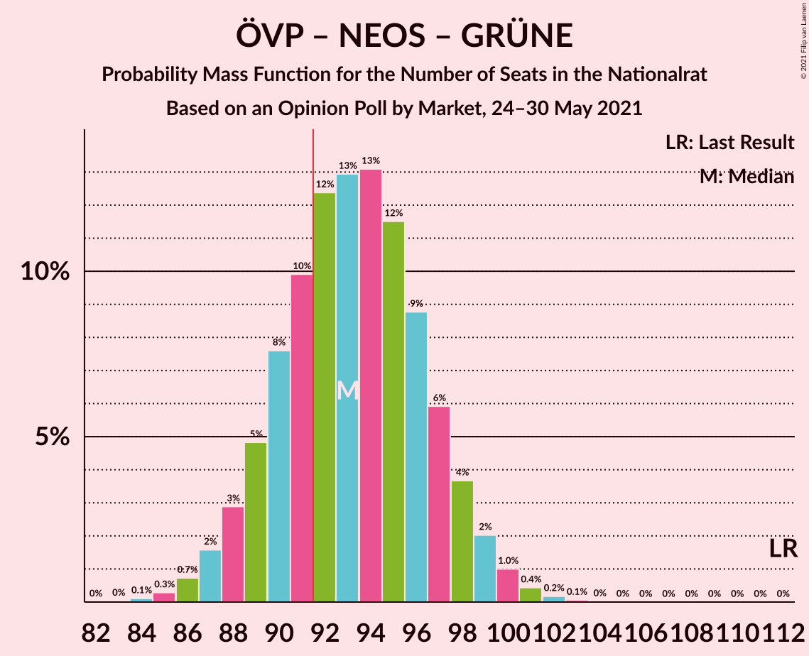
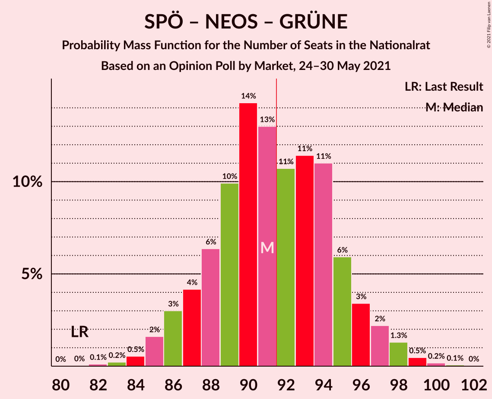
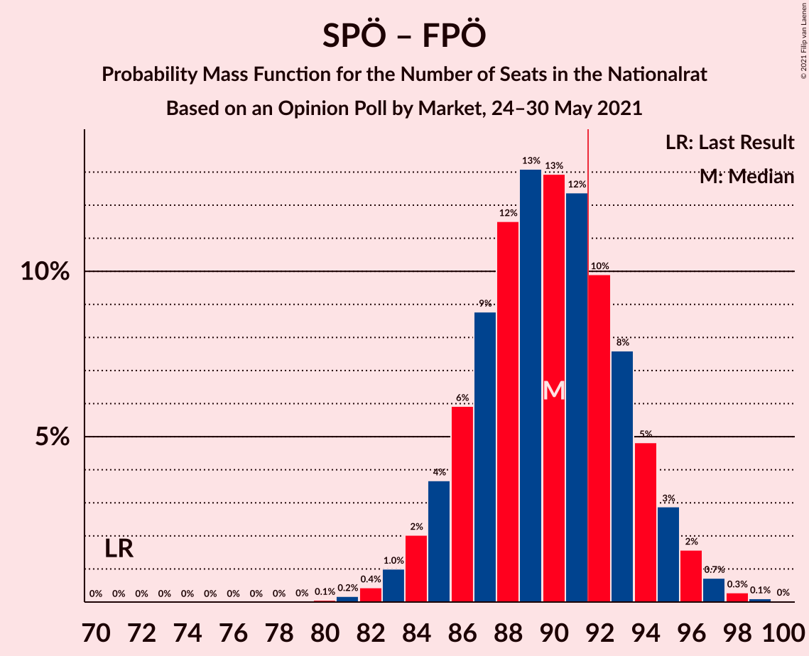
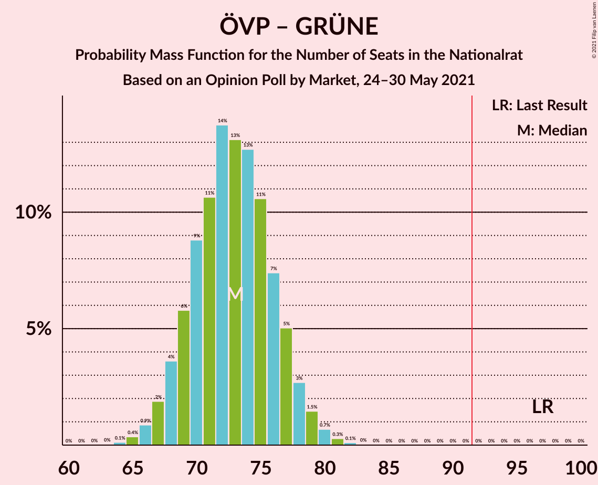

# Opinion Poll by Market, 24–30 May 2021

<a href="#voting-intentions">Voting Intentions</a> | <a href="#seats">Seats</a> | <a href="#coalitions">Coalitions</a> | <a href="#technical-information">Technical Information</a>

## Voting Intentions

### Confidence Intervals

| Party | Last Result | Poll Result | 80% Confidence Interval | 90% Confidence Interval | 95% Confidence Interval | 99% Confidence Interval |
|:-----:|:-----------:|:-----------:|:-----------------------:|:-----------------------:|:-----------------------:|:-----------------------:|
| Österreichische Volkspartei | 37.5% | 29.0% | 27.2–30.9% |26.7–31.4% |26.3–31.9% |25.4–32.8% |
| Sozialdemokratische Partei Österreichs | 21.2% | 28.0% | 26.2–29.9% |25.7–30.4% |25.3–30.9% |24.5–31.8% |
| Freiheitliche Partei Österreichs | 16.2% | 20.0% | 18.4–21.7% |18.0–22.2% |17.6–22.6% |16.9–23.4% |
| NEOS–Das Neue Österreich und Liberales Forum | 8.1% | 11.0% | 9.8–12.4% |9.5–12.8% |9.2–13.1% |8.7–13.8% |
| Die Grünen–Die Grüne Alternative | 13.9% | 10.0% | 8.9–11.3% |8.6–11.7% |8.3–12.0% |7.8–12.7% |

*Note:* The poll result column reflects the actual value used in the calculations. Published results may vary slightly, and in addition be rounded to fewer digits.

## Seats

### Confidence Intervals

| Party | Last Result | Median | 80% Confidence Interval | 90% Confidence Interval | 95% Confidence Interval | 99% Confidence Interval |
|:-----:|:-----------:|:------:|:-----------------------:|:-----------------------:|:-----------------------:|:-----------------------:|
| <a href="#österreichische-volkspartei">Österreichische Volkspartei</a> | 71 | 54 | 51–58 |50–59 |49–60 |48–61 |
| <a href="#sozialdemokratische-partei-österreichs">Sozialdemokratische Partei Österreichs</a> | 40 | 52 | 49–56 |48–57 |47–58 |46–59 |
| <a href="#freiheitliche-partei-österreichs">Freiheitliche Partei Österreichs</a> | 31 | 37 | 34–41 |34–41 |33–42 |32–43 |
| <a href="#neos–das-neue-österreich-und-liberales-forum">NEOS–Das Neue Österreich und Liberales Forum</a> | 15 | 20 | 18–23 |17–24 |17–24 |16–25 |
| <a href="#die-grünen–die-grüne-alternative">Die Grünen–Die Grüne Alternative</a> | 26 | 18 | 16–21 |16–22 |15–22 |14–23 |

### Österreichische Volkspartei

*For a full overview of the results for this party, see the [Österreichische Volkspartei](party-österreichischevolkspartei.html) page.*

| Number of Seats | Probability | Accumulated | Special Marks |
|:---------------:|:-----------:|:-----------:|:-------------:|
| 46 | 0.1% | 100% |  |
| 47 | 0.3% | 99.9% |  |
| 48 | 1.0% | 99.5% |  |
| 49 | 2% | 98.6% |  |
| 50 | 5% | 96% |  |
| 51 | 7% | 92% |  |
| 52 | 10% | 85% |  |
| 53 | 13% | 75% |  |
| 54 | 15% | 62% | Median |
| 55 | 14% | 47% |  |
| 56 | 12% | 33% |  |
| 57 | 9% | 21% |  |
| 58 | 6% | 12% |  |
| 59 | 3% | 6% |  |
| 60 | 2% | 3% |  |
| 61 | 0.8% | 1.2% |  |
| 62 | 0.3% | 0.5% |  |
| 63 | 0.1% | 0.1% |  |
| 64 | 0% | 0% |  |
| 65 | 0% | 0% |  |
| 66 | 0% | 0% |  |
| 67 | 0% | 0% |  |
| 68 | 0% | 0% |  |
| 69 | 0% | 0% |  |
| 70 | 0% | 0% |  |
| 71 | 0% | 0% | Last Result |

### Sozialdemokratische Partei Österreichs

*For a full overview of the results for this party, see the [Sozialdemokratische Partei Österreichs](party-sozialdemokratischeparteiösterreichs.html) page.*

| Number of Seats | Probability | Accumulated | Special Marks |
|:---------------:|:-----------:|:-----------:|:-------------:|
| 40 | 0% | 100% | Last Result |
| 41 | 0% | 100% |  |
| 42 | 0% | 100% |  |
| 43 | 0% | 100% |  |
| 44 | 0.1% | 100% |  |
| 45 | 0.3% | 99.9% |  |
| 46 | 0.8% | 99.6% |  |
| 47 | 2% | 98.8% |  |
| 48 | 4% | 97% |  |
| 49 | 7% | 93% |  |
| 50 | 10% | 86% |  |
| 51 | 13% | 76% |  |
| 52 | 14% | 63% | Median |
| 53 | 15% | 49% |  |
| 54 | 12% | 34% |  |
| 55 | 9% | 22% |  |
| 56 | 6% | 12% |  |
| 57 | 4% | 7% |  |
| 58 | 2% | 3% |  |
| 59 | 0.8% | 1.3% |  |
| 60 | 0.3% | 0.5% |  |
| 61 | 0.1% | 0.2% |  |
| 62 | 0% | 0% |  |

### Freiheitliche Partei Österreichs

*For a full overview of the results for this party, see the [Freiheitliche Partei Österreichs](party-freiheitlicheparteiösterreichs.html) page.*

| Number of Seats | Probability | Accumulated | Special Marks |
|:---------------:|:-----------:|:-----------:|:-------------:|
| 30 | 0.1% | 100% |  |
| 31 | 0.3% | 99.9% | Last Result |
| 32 | 2% | 99.6% |  |
| 33 | 2% | 98% |  |
| 34 | 10% | 96% |  |
| 35 | 5% | 86% |  |
| 36 | 21% | 81% |  |
| 37 | 10% | 60% | Median |
| 38 | 20% | 50% |  |
| 39 | 11% | 29% |  |
| 40 | 9% | 19% |  |
| 41 | 6% | 10% |  |
| 42 | 2% | 4% |  |
| 43 | 2% | 2% |  |
| 44 | 0.2% | 0.5% |  |
| 45 | 0.2% | 0.3% |  |
| 46 | 0% | 0% |  |

### NEOS–Das Neue Österreich und Liberales Forum

*For a full overview of the results for this party, see the [NEOS–Das Neue Österreich und Liberales Forum](party-neos–dasneueösterreichundliberalesforum.html) page.*

| Number of Seats | Probability | Accumulated | Special Marks |
|:---------------:|:-----------:|:-----------:|:-------------:|
| 15 | 0.2% | 100% | Last Result |
| 16 | 1.2% | 99.7% |  |
| 17 | 4% | 98.6% |  |
| 18 | 10% | 94% |  |
| 19 | 17% | 85% |  |
| 20 | 21% | 68% | Median |
| 21 | 20% | 47% |  |
| 22 | 14% | 27% |  |
| 23 | 8% | 13% |  |
| 24 | 4% | 5% |  |
| 25 | 1.3% | 2% |  |
| 26 | 0.4% | 0.5% |  |
| 27 | 0.1% | 0.1% |  |
| 28 | 0% | 0% |  |

### Die Grünen–Die Grüne Alternative

*For a full overview of the results for this party, see the [Die Grünen–Die Grüne Alternative](party-diegrünen–diegrünealternative.html) page.*

| Number of Seats | Probability | Accumulated | Special Marks |
|:---------------:|:-----------:|:-----------:|:-------------:|
| 13 | 0.1% | 100% |  |
| 14 | 0.8% | 99.9% |  |
| 15 | 3% | 99.1% |  |
| 16 | 9% | 96% |  |
| 17 | 16% | 87% |  |
| 18 | 21% | 71% | Median |
| 19 | 21% | 50% |  |
| 20 | 15% | 29% |  |
| 21 | 8% | 14% |  |
| 22 | 4% | 5% |  |
| 23 | 1.2% | 2% |  |
| 24 | 0.3% | 0.4% |  |
| 25 | 0.1% | 0.1% |  |
| 26 | 0% | 0% | Last Result |

## Coalitions

### Confidence Intervals

| Coalition | Last Result | Median | Majority? | 80% Confidence Interval | 90% Confidence Interval | 95% Confidence Interval | 99% Confidence Interval |
|:---------:|:-----------:|:------:|:---------:|:-----------------------:|:-----------------------:|:-----------------------:|:-----------------------:|
| Österreichische Volkspartei – Sozialdemokratische Partei Österreichs | 111 | 107 | 100% | 103–110 | 102–112 | 101–112 | 99–114 |
| Österreichische Volkspartei – NEOS–Das Neue Österreich und Liberales Forum – Die Grünen–Die Grüne Alternative | 112 | 93 | 72% | 89–97 | 88–98 | 87–99 | 86–101 |
| Österreichische Volkspartei – Freiheitliche Partei Österreichs | 102 | 92 | 53% | 88–95 | 87–97 | 86–98 | 84–99 |
| Sozialdemokratische Partei Österreichs – NEOS–Das Neue Österreich und Liberales Forum – Die Grünen–Die Grüne Alternative | 81 | 91 | 47% | 88–95 | 86–96 | 85–97 | 84–99 |
| Sozialdemokratische Partei Österreichs – Freiheitliche Partei Österreichs | 71 | 90 | 28% | 86–94 | 85–95 | 84–96 | 82–97 |
| Österreichische Volkspartei – NEOS–Das Neue Österreich und Liberales Forum | 86 | 75 | 0% | 71–78 | 70–79 | 69–80 | 67–82 |
| Österreichische Volkspartei – Die Grünen–Die Grüne Alternative | 97 | 73 | 0% | 69–77 | 68–78 | 67–79 | 65–80 |
| Sozialdemokratische Partei Österreichs – Die Grünen–Die Grüne Alternative | 66 | 71 | 0% | 67–75 | 66–76 | 65–77 | 64–78 |
| Österreichische Volkspartei | 71 | 54 | 0% | 51–58 | 50–59 | 49–60 | 48–61 |
| Sozialdemokratische Partei Österreichs | 40 | 52 | 0% | 49–56 | 48–57 | 47–58 | 46–59 |

### Österreichische Volkspartei – Sozialdemokratische Partei Österreichs

| Number of Seats | Probability | Accumulated | Special Marks |
|:---------------:|:-----------:|:-----------:|:-------------:|
| 97 | 0.1% | 100% |  |
| 98 | 0.2% | 99.9% |  |
| 99 | 0.4% | 99.7% |  |
| 100 | 1.0% | 99.3% |  |
| 101 | 2% | 98% |  |
| 102 | 4% | 96% |  |
| 103 | 6% | 92% |  |
| 104 | 9% | 86% |  |
| 105 | 11% | 77% |  |
| 106 | 13% | 66% | Median |
| 107 | 13% | 53% |  |
| 108 | 13% | 40% |  |
| 109 | 10% | 27% |  |
| 110 | 7% | 17% |  |
| 111 | 5% | 10% | Last Result |
| 112 | 3% | 5% |  |
| 113 | 1.4% | 2% |  |
| 114 | 0.6% | 1.0% |  |
| 115 | 0.2% | 0.4% |  |
| 116 | 0.1% | 0.1% |  |
| 117 | 0% | 0% |  |

### Österreichische Volkspartei – NEOS–Das Neue Österreich und Liberales Forum – Die Grünen–Die Grüne Alternative

| Number of Seats | Probability | Accumulated | Special Marks |
|:---------------:|:-----------:|:-----------:|:-------------:|
| 84 | 0.1% | 100% |  |
| 85 | 0.3% | 99.8% |  |
| 86 | 0.7% | 99.6% |  |
| 87 | 2% | 98.8% |  |
| 88 | 3% | 97% |  |
| 89 | 5% | 94% |  |
| 90 | 8% | 90% |  |
| 91 | 10% | 82% |  |
| 92 | 12% | 72% | Median, Majority |
| 93 | 13% | 60% |  |
| 94 | 13% | 47% |  |
| 95 | 12% | 34% |  |
| 96 | 9% | 22% |  |
| 97 | 6% | 13% |  |
| 98 | 4% | 7% |  |
| 99 | 2% | 4% |  |
| 100 | 1.0% | 2% |  |
| 101 | 0.4% | 0.7% |  |
| 102 | 0.2% | 0.3% |  |
| 103 | 0.1% | 0.1% |  |
| 104 | 0% | 0% |  |
| 105 | 0% | 0% |  |
| 106 | 0% | 0% |  |
| 107 | 0% | 0% |  |
| 108 | 0% | 0% |  |
| 109 | 0% | 0% |  |
| 110 | 0% | 0% |  |
| 111 | 0% | 0% |  |
| 112 | 0% | 0% | Last Result |

### Österreichische Volkspartei – Freiheitliche Partei Österreichs

| Number of Seats | Probability | Accumulated | Special Marks |
|:---------------:|:-----------:|:-----------:|:-------------:|
| 82 | 0.1% | 100% |  |
| 83 | 0.2% | 99.9% |  |
| 84 | 0.5% | 99.7% |  |
| 85 | 1.3% | 99.3% |  |
| 86 | 2% | 98% |  |
| 87 | 3% | 96% |  |
| 88 | 6% | 92% |  |
| 89 | 11% | 86% |  |
| 90 | 11% | 75% |  |
| 91 | 11% | 64% | Median |
| 92 | 13% | 53% | Majority |
| 93 | 14% | 40% |  |
| 94 | 10% | 26% |  |
| 95 | 6% | 16% |  |
| 96 | 4% | 10% |  |
| 97 | 3% | 6% |  |
| 98 | 2% | 3% |  |
| 99 | 0.5% | 0.9% |  |
| 100 | 0.2% | 0.4% |  |
| 101 | 0.1% | 0.2% |  |
| 102 | 0% | 0% | Last Result |

### Sozialdemokratische Partei Österreichs – NEOS–Das Neue Österreich und Liberales Forum – Die Grünen–Die Grüne Alternative

| Number of Seats | Probability | Accumulated | Special Marks |
|:---------------:|:-----------:|:-----------:|:-------------:|
| 81 | 0% | 100% | Last Result |
| 82 | 0.1% | 100% |  |
| 83 | 0.2% | 99.8% |  |
| 84 | 0.5% | 99.6% |  |
| 85 | 2% | 99.1% |  |
| 86 | 3% | 97% |  |
| 87 | 4% | 94% |  |
| 88 | 6% | 90% |  |
| 89 | 10% | 84% |  |
| 90 | 14% | 74% | Median |
| 91 | 13% | 60% |  |
| 92 | 11% | 47% | Majority |
| 93 | 11% | 36% |  |
| 94 | 11% | 25% |  |
| 95 | 6% | 14% |  |
| 96 | 3% | 8% |  |
| 97 | 2% | 4% |  |
| 98 | 1.3% | 2% |  |
| 99 | 0.5% | 0.7% |  |
| 100 | 0.2% | 0.3% |  |
| 101 | 0.1% | 0.1% |  |
| 102 | 0% | 0% |  |

### Sozialdemokratische Partei Österreichs – Freiheitliche Partei Österreichs

| Number of Seats | Probability | Accumulated | Special Marks |
|:---------------:|:-----------:|:-----------:|:-------------:|
| 71 | 0% | 100% | Last Result |
| 72 | 0% | 100% |  |
| 73 | 0% | 100% |  |
| 74 | 0% | 100% |  |
| 75 | 0% | 100% |  |
| 76 | 0% | 100% |  |
| 77 | 0% | 100% |  |
| 78 | 0% | 100% |  |
| 79 | 0% | 100% |  |
| 80 | 0.1% | 100% |  |
| 81 | 0.2% | 99.9% |  |
| 82 | 0.4% | 99.7% |  |
| 83 | 1.0% | 99.3% |  |
| 84 | 2% | 98% |  |
| 85 | 4% | 96% |  |
| 86 | 6% | 93% |  |
| 87 | 9% | 87% |  |
| 88 | 12% | 78% |  |
| 89 | 13% | 66% | Median |
| 90 | 13% | 53% |  |
| 91 | 12% | 40% |  |
| 92 | 10% | 28% | Majority |
| 93 | 8% | 18% |  |
| 94 | 5% | 10% |  |
| 95 | 3% | 6% |  |
| 96 | 2% | 3% |  |
| 97 | 0.7% | 1.2% |  |
| 98 | 0.3% | 0.4% |  |
| 99 | 0.1% | 0.2% |  |
| 100 | 0% | 0% |  |

### Österreichische Volkspartei – NEOS–Das Neue Österreich und Liberales Forum

| Number of Seats | Probability | Accumulated | Special Marks |
|:---------------:|:-----------:|:-----------:|:-------------:|
| 65 | 0.1% | 100% |  |
| 66 | 0.1% | 99.9% |  |
| 67 | 0.4% | 99.8% |  |
| 68 | 0.9% | 99.4% |  |
| 69 | 2% | 98% |  |
| 70 | 4% | 96% |  |
| 71 | 6% | 92% |  |
| 72 | 9% | 86% |  |
| 73 | 11% | 77% |  |
| 74 | 13% | 66% | Median |
| 75 | 13% | 53% |  |
| 76 | 13% | 40% |  |
| 77 | 10% | 27% |  |
| 78 | 7% | 17% |  |
| 79 | 5% | 9% |  |
| 80 | 2% | 5% |  |
| 81 | 1.4% | 2% |  |
| 82 | 0.7% | 1.1% |  |
| 83 | 0.3% | 0.4% |  |
| 84 | 0.1% | 0.1% |  |
| 85 | 0% | 0% |  |
| 86 | 0% | 0% | Last Result |

### Österreichische Volkspartei – Die Grünen–Die Grüne Alternative

| Number of Seats | Probability | Accumulated | Special Marks |
|:---------------:|:-----------:|:-----------:|:-------------:|
| 63 | 0% | 100% |  |
| 64 | 0.1% | 99.9% |  |
| 65 | 0.4% | 99.8% |  |
| 66 | 0.9% | 99.5% |  |
| 67 | 2% | 98.6% |  |
| 68 | 4% | 97% |  |
| 69 | 6% | 93% |  |
| 70 | 9% | 87% |  |
| 71 | 11% | 79% |  |
| 72 | 14% | 68% | Median |
| 73 | 13% | 54% |  |
| 74 | 13% | 41% |  |
| 75 | 11% | 28% |  |
| 76 | 7% | 18% |  |
| 77 | 5% | 10% |  |
| 78 | 3% | 5% |  |
| 79 | 1.5% | 3% |  |
| 80 | 0.7% | 1.1% |  |
| 81 | 0.3% | 0.4% |  |
| 82 | 0.1% | 0.2% |  |
| 83 | 0% | 0% |  |
| 84 | 0% | 0% |  |
| 85 | 0% | 0% |  |
| 86 | 0% | 0% |  |
| 87 | 0% | 0% |  |
| 88 | 0% | 0% |  |
| 89 | 0% | 0% |  |
| 90 | 0% | 0% |  |
| 91 | 0% | 0% |  |
| 92 | 0% | 0% | Majority |
| 93 | 0% | 0% |  |
| 94 | 0% | 0% |  |
| 95 | 0% | 0% |  |
| 96 | 0% | 0% |  |
| 97 | 0% | 0% | Last Result |

### Sozialdemokratische Partei Österreichs – Die Grünen–Die Grüne Alternative

| Number of Seats | Probability | Accumulated | Special Marks |
|:---------------:|:-----------:|:-----------:|:-------------:|
| 62 | 0.1% | 100% |  |
| 63 | 0.3% | 99.8% |  |
| 64 | 0.7% | 99.5% |  |
| 65 | 2% | 98.8% |  |
| 66 | 3% | 97% | Last Result |
| 67 | 5% | 94% |  |
| 68 | 8% | 88% |  |
| 69 | 12% | 80% |  |
| 70 | 13% | 69% | Median |
| 71 | 14% | 56% |  |
| 72 | 13% | 42% |  |
| 73 | 11% | 30% |  |
| 74 | 8% | 19% |  |
| 75 | 5% | 11% |  |
| 76 | 3% | 6% |  |
| 77 | 2% | 3% |  |
| 78 | 0.7% | 1.2% |  |
| 79 | 0.3% | 0.5% |  |
| 80 | 0.1% | 0.2% |  |
| 81 | 0% | 0.1% |  |
| 82 | 0% | 0% |  |

### Österreichische Volkspartei

| Number of Seats | Probability | Accumulated | Special Marks |
|:---------------:|:-----------:|:-----------:|:-------------:|
| 46 | 0.1% | 100% |  |
| 47 | 0.3% | 99.9% |  |
| 48 | 1.0% | 99.5% |  |
| 49 | 2% | 98.6% |  |
| 50 | 5% | 96% |  |
| 51 | 7% | 92% |  |
| 52 | 10% | 85% |  |
| 53 | 13% | 75% |  |
| 54 | 15% | 62% | Median |
| 55 | 14% | 47% |  |
| 56 | 12% | 33% |  |
| 57 | 9% | 21% |  |
| 58 | 6% | 12% |  |
| 59 | 3% | 6% |  |
| 60 | 2% | 3% |  |
| 61 | 0.8% | 1.2% |  |
| 62 | 0.3% | 0.5% |  |
| 63 | 0.1% | 0.1% |  |
| 64 | 0% | 0% |  |
| 65 | 0% | 0% |  |
| 66 | 0% | 0% |  |
| 67 | 0% | 0% |  |
| 68 | 0% | 0% |  |
| 69 | 0% | 0% |  |
| 70 | 0% | 0% |  |
| 71 | 0% | 0% | Last Result |

### Sozialdemokratische Partei Österreichs

| Number of Seats | Probability | Accumulated | Special Marks |
|:---------------:|:-----------:|:-----------:|:-------------:|
| 40 | 0% | 100% | Last Result |
| 41 | 0% | 100% |  |
| 42 | 0% | 100% |  |
| 43 | 0% | 100% |  |
| 44 | 0.1% | 100% |  |
| 45 | 0.3% | 99.9% |  |
| 46 | 0.8% | 99.6% |  |
| 47 | 2% | 98.8% |  |
| 48 | 4% | 97% |  |
| 49 | 7% | 93% |  |
| 50 | 10% | 86% |  |
| 51 | 13% | 76% |  |
| 52 | 14% | 63% | Median |
| 53 | 15% | 49% |  |
| 54 | 12% | 34% |  |
| 55 | 9% | 22% |  |
| 56 | 6% | 12% |  |
| 57 | 4% | 7% |  |
| 58 | 2% | 3% |  |
| 59 | 0.8% | 1.3% |  |
| 60 | 0.3% | 0.5% |  |
| 61 | 0.1% | 0.2% |  |
| 62 | 0% | 0% |  |

## Technical Information

### Opinion Poll

+ **Polling firm:** Market
+ **Commissioner(s):** —
+ **Fieldwork period:** 24–30 May 2021

### Calculations

+ **Sample size:** 1000
+ **Simulations done:** 1,048,576
+ **Error estimate:** 1.22%

