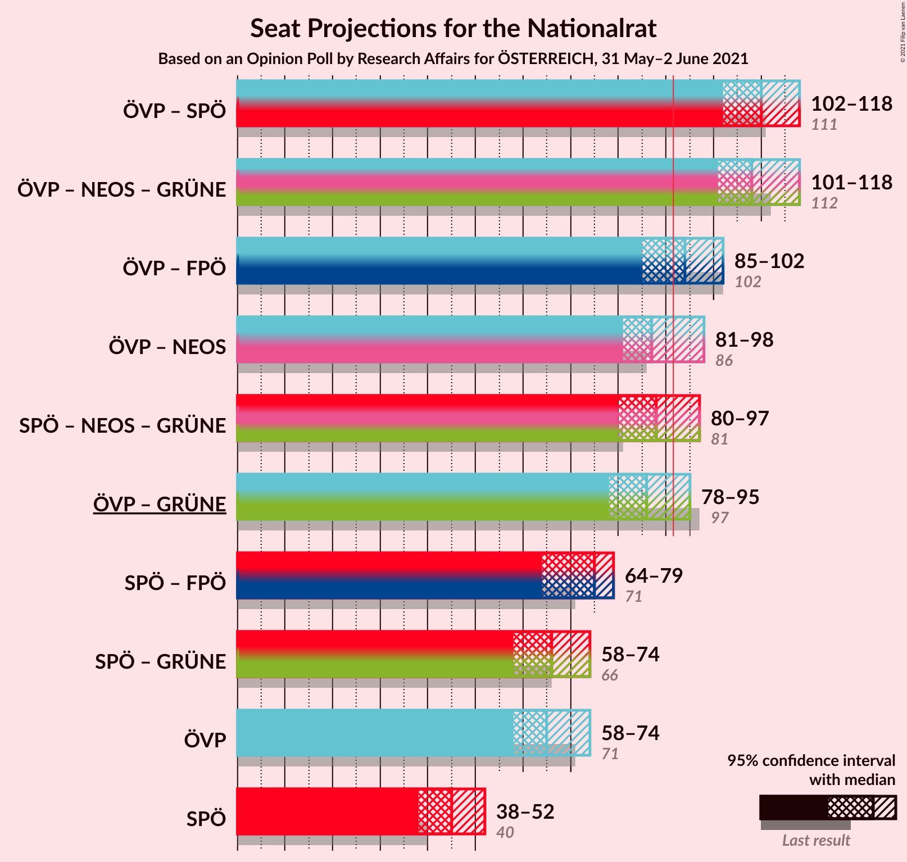
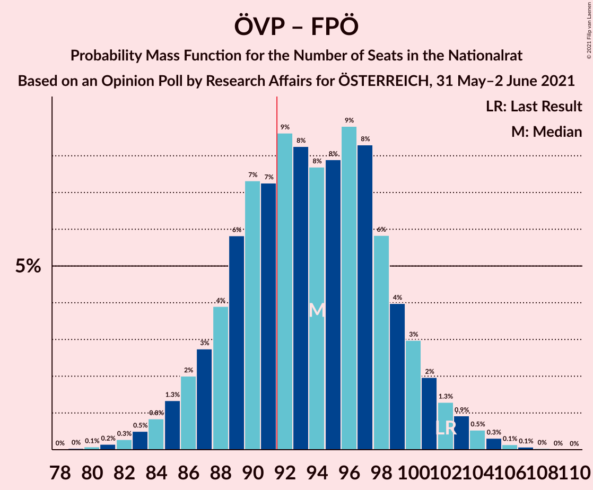
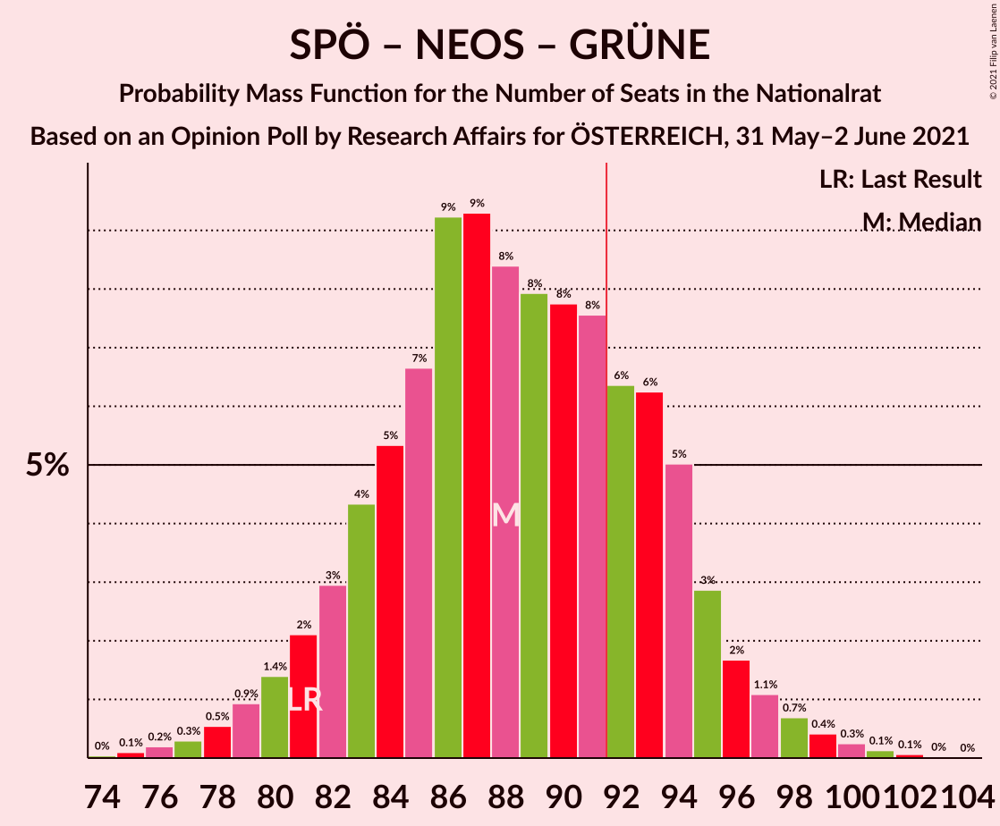

# Opinion Poll by Research Affairs for ÖSTERREICH, 31 May–2 June 2021

<a href="#voting-intentions">Voting Intentions</a> | <a href="#seats">Seats</a> | <a href="#coalitions">Coalitions</a> | <a href="#technical-information">Technical Information</a>

## Voting Intentions

### Confidence Intervals

| Party | Last Result | Poll Result | 80% Confidence Interval | 90% Confidence Interval | 95% Confidence Interval | 99% Confidence Interval |
|:-----:|:-----------:|:-----------:|:-----------------------:|:-----------------------:|:-----------------------:|:-----------------------:|
| Österreichische Volkspartei | 37.5% | 35.0% | 32.3–37.8% |31.6–38.6% |30.9–39.2% |29.7–40.6% |
| Sozialdemokratische Partei Österreichs | 21.2% | 23.9% | 21.6–26.5% |21.0–27.2% |20.4–27.8% |19.3–29.1% |
| Freiheitliche Partei Österreichs | 16.2% | 15.0% | 13.1–17.2% |12.6–17.9% |12.2–18.4% |11.3–19.5% |
| NEOS–Das Neue Österreich und Liberales Forum | 8.1% | 12.1% | 10.4–14.1% |9.9–14.7% |9.5–15.2% |8.7–16.2% |
| Die Grünen–Die Grüne Alternative | 13.9% | 11.1% | 9.4–13.0% |9.0–13.6% |8.6–14.1% |7.9–15.1% |

*Note:* The poll result column reflects the actual value used in the calculations. Published results may vary slightly, and in addition be rounded to fewer digits.

## Seats

### Confidence Intervals

| Party | Last Result | Median | 80% Confidence Interval | 90% Confidence Interval | 95% Confidence Interval | 99% Confidence Interval |
|:-----:|:-----------:|:------:|:-----------------------:|:-----------------------:|:-----------------------:|:-----------------------:|
| <a href="#österreichische-volkspartei">Österreichische Volkspartei</a> | 71 | 66 | 61–69 |60–71 |59–73 |56–77 |
| <a href="#sozialdemokratische-partei-österreichs">Sozialdemokratische Partei Österreichs</a> | 40 | 45 | 40–49 |40–51 |38–51 |36–54 |
| <a href="#freiheitliche-partei-österreichs">Freiheitliche Partei Österreichs</a> | 31 | 29 | 25–31 |24–32 |23–34 |21–36 |
| <a href="#neos–das-neue-österreich-und-liberales-forum">NEOS–Das Neue Österreich und Liberales Forum</a> | 15 | 22 | 19–26 |18–27 |17–28 |16–30 |
| <a href="#die-grünen–die-grüne-alternative">Die Grünen–Die Grüne Alternative</a> | 26 | 21 | 17–24 |17–25 |16–26 |14–28 |

### Österreichische Volkspartei

*For a full overview of the results for this party, see the [Österreichische Volkspartei](party-österreichischevolkspartei.html) page.*

| Number of Seats | Probability | Accumulated | Special Marks |
|:---------------:|:-----------:|:-----------:|:-------------:|
| 52 | 0% | 100% |  |
| 53 | 0.1% | 99.9% |  |
| 54 | 0.1% | 99.9% |  |
| 55 | 0.2% | 99.8% |  |
| 56 | 0.3% | 99.6% |  |
| 57 | 0.5% | 99.3% |  |
| 58 | 0.8% | 98.8% |  |
| 59 | 1.2% | 98% |  |
| 60 | 2% | 97% |  |
| 61 | 5% | 94% |  |
| 62 | 7% | 90% |  |
| 63 | 10% | 83% |  |
| 64 | 11% | 73% |  |
| 65 | 12% | 63% |  |
| 66 | 12% | 51% | Median |
| 67 | 15% | 39% |  |
| 68 | 11% | 24% |  |
| 69 | 5% | 13% |  |
| 70 | 2% | 8% |  |
| 71 | 2% | 6% | Last Result |
| 72 | 1.1% | 4% |  |
| 73 | 0.6% | 3% |  |
| 74 | 0.4% | 2% |  |
| 75 | 0.5% | 2% |  |
| 76 | 0.5% | 1.2% |  |
| 77 | 0.4% | 0.8% |  |
| 78 | 0.2% | 0.4% |  |
| 79 | 0.1% | 0.1% |  |
| 80 | 0% | 0.1% |  |
| 81 | 0% | 0% |  |

### Sozialdemokratische Partei Österreichs

*For a full overview of the results for this party, see the [Sozialdemokratische Partei Österreichs](party-sozialdemokratischeparteiösterreichs.html) page.*

| Number of Seats | Probability | Accumulated | Special Marks |
|:---------------:|:-----------:|:-----------:|:-------------:|
| 34 | 0.1% | 100% |  |
| 35 | 0.2% | 99.9% |  |
| 36 | 0.4% | 99.7% |  |
| 37 | 0.6% | 99.3% |  |
| 38 | 2% | 98.7% |  |
| 39 | 2% | 97% |  |
| 40 | 6% | 95% | Last Result |
| 41 | 5% | 89% |  |
| 42 | 10% | 84% |  |
| 43 | 8% | 75% |  |
| 44 | 14% | 67% |  |
| 45 | 8% | 53% | Median |
| 46 | 12% | 44% |  |
| 47 | 10% | 32% |  |
| 48 | 5% | 22% |  |
| 49 | 8% | 17% |  |
| 50 | 2% | 9% |  |
| 51 | 4% | 6% |  |
| 52 | 0.5% | 2% |  |
| 53 | 1.1% | 2% |  |
| 54 | 0.3% | 0.8% |  |
| 55 | 0.3% | 0.4% |  |
| 56 | 0.1% | 0.2% |  |
| 57 | 0% | 0.1% |  |
| 58 | 0% | 0% |  |

### Freiheitliche Partei Österreichs

*For a full overview of the results for this party, see the [Freiheitliche Partei Österreichs](party-freiheitlicheparteiösterreichs.html) page.*

| Number of Seats | Probability | Accumulated | Special Marks |
|:---------------:|:-----------:|:-----------:|:-------------:|
| 19 | 0.1% | 100% |  |
| 20 | 0.3% | 99.9% |  |
| 21 | 0.5% | 99.6% |  |
| 22 | 0.9% | 99.1% |  |
| 23 | 1.2% | 98% |  |
| 24 | 3% | 97% |  |
| 25 | 7% | 94% |  |
| 26 | 9% | 87% |  |
| 27 | 11% | 78% |  |
| 28 | 15% | 67% |  |
| 29 | 19% | 52% | Median |
| 30 | 15% | 33% |  |
| 31 | 10% | 18% | Last Result |
| 32 | 3% | 8% |  |
| 33 | 2% | 4% |  |
| 34 | 2% | 3% |  |
| 35 | 0.5% | 1.0% |  |
| 36 | 0.2% | 0.6% |  |
| 37 | 0.1% | 0.3% |  |
| 38 | 0.1% | 0.2% |  |
| 39 | 0.1% | 0.1% |  |
| 40 | 0% | 0% |  |

### NEOS–Das Neue Österreich und Liberales Forum

*For a full overview of the results for this party, see the [NEOS–Das Neue Österreich und Liberales Forum](party-neos–dasneueösterreichundliberalesforum.html) page.*

| Number of Seats | Probability | Accumulated | Special Marks |
|:---------------:|:-----------:|:-----------:|:-------------:|
| 14 | 0% | 100% |  |
| 15 | 0.2% | 99.9% | Last Result |
| 16 | 0.7% | 99.8% |  |
| 17 | 2% | 99.1% |  |
| 18 | 4% | 97% |  |
| 19 | 8% | 94% |  |
| 20 | 10% | 86% |  |
| 21 | 15% | 76% |  |
| 22 | 14% | 61% | Median |
| 23 | 13% | 46% |  |
| 24 | 13% | 34% |  |
| 25 | 8% | 21% |  |
| 26 | 6% | 13% |  |
| 27 | 3% | 7% |  |
| 28 | 2% | 4% |  |
| 29 | 0.9% | 2% |  |
| 30 | 0.4% | 0.6% |  |
| 31 | 0.2% | 0.3% |  |
| 32 | 0.1% | 0.1% |  |
| 33 | 0% | 0% |  |

### Die Grünen–Die Grüne Alternative

*For a full overview of the results for this party, see the [Die Grünen–Die Grüne Alternative](party-diegrünen–diegrünealternative.html) page.*

| Number of Seats | Probability | Accumulated | Special Marks |
|:---------------:|:-----------:|:-----------:|:-------------:|
| 13 | 0.1% | 100% |  |
| 14 | 0.4% | 99.9% |  |
| 15 | 1.2% | 99.5% |  |
| 16 | 3% | 98% |  |
| 17 | 6% | 95% |  |
| 18 | 9% | 89% |  |
| 19 | 14% | 81% |  |
| 20 | 16% | 67% |  |
| 21 | 13% | 50% | Median |
| 22 | 13% | 37% |  |
| 23 | 10% | 24% |  |
| 24 | 6% | 14% |  |
| 25 | 4% | 8% |  |
| 26 | 2% | 4% | Last Result |
| 27 | 1.1% | 2% |  |
| 28 | 0.6% | 0.9% |  |
| 29 | 0.2% | 0.4% |  |
| 30 | 0.1% | 0.1% |  |
| 31 | 0% | 0.1% |  |
| 32 | 0% | 0% |  |

## Coalitions

### Confidence Intervals

| Coalition | Last Result | Median | Majority? | 80% Confidence Interval | 90% Confidence Interval | 95% Confidence Interval | 99% Confidence Interval |
|:---------:|:-----------:|:------:|:---------:|:-----------------------:|:-----------------------:|:-----------------------:|:-----------------------:|
| Österreichische Volkspartei – NEOS–Das Neue Österreich und Liberales Forum – Die Grünen–Die Grüne Alternative | 112 | 109 | 100% | 105–112 | 103–113 | 102–118 | 97–121 |
| Österreichische Volkspartei – Sozialdemokratische Partei Österreichs | 111 | 110 | 100% | 105–116 | 103–117 | 102–118 | 99–121 |
| Österreichische Volkspartei – Freiheitliche Partei Österreichs | 102 | 95 | 67% | 88–98 | 87–101 | 85–103 | 83–105 |
| Österreichische Volkspartei – NEOS–Das Neue Österreich und Liberales Forum | 86 | 88 | 6% | 85–90 | 83–92 | 82–98 | 77–100 |
| Sozialdemokratische Partei Österreichs – NEOS–Das Neue Österreich und Liberales Forum – Die Grünen–Die Grüne Alternative | 81 | 87 | 26% | 83–94 | 81–95 | 79–95 | 76–100 |
| Österreichische Volkspartei – Die Grünen–Die Grüne Alternative | 97 | 86 | 7% | 82–91 | 80–92 | 79–94 | 76–98 |
| Sozialdemokratische Partei Österreichs – Freiheitliche Partei Österreichs | 71 | 74 | 0% | 70–76 | 68–77 | 65–78 | 62–85 |
| Österreichische Volkspartei | 71 | 66 | 0% | 61–69 | 60–71 | 59–73 | 56–77 |
| Sozialdemokratische Partei Österreichs – Die Grünen–Die Grüne Alternative | 66 | 65 | 0% | 61–71 | 59–72 | 58–73 | 55–76 |
| Sozialdemokratische Partei Österreichs | 40 | 45 | 0% | 40–49 | 40–51 | 38–51 | 36–54 |

### Österreichische Volkspartei – NEOS–Das Neue Österreich und Liberales Forum – Die Grünen–Die Grüne Alternative

| Number of Seats | Probability | Accumulated | Special Marks |
|:---------------:|:-----------:|:-----------:|:-------------:|
| 93 | 0% | 100% |  |
| 94 | 0.1% | 99.9% |  |
| 95 | 0.1% | 99.9% |  |
| 96 | 0.1% | 99.8% |  |
| 97 | 0.2% | 99.7% |  |
| 98 | 0.3% | 99.5% |  |
| 99 | 0.4% | 99.2% |  |
| 100 | 0.4% | 98.8% |  |
| 101 | 0.6% | 98% |  |
| 102 | 1.2% | 98% |  |
| 103 | 2% | 97% |  |
| 104 | 3% | 94% |  |
| 105 | 4% | 91% |  |
| 106 | 6% | 87% |  |
| 107 | 13% | 81% |  |
| 108 | 16% | 68% |  |
| 109 | 16% | 52% | Median |
| 110 | 15% | 36% |  |
| 111 | 9% | 21% |  |
| 112 | 5% | 11% | Last Result |
| 113 | 2% | 6% |  |
| 114 | 0.6% | 4% |  |
| 115 | 0.2% | 4% |  |
| 116 | 0.3% | 4% |  |
| 117 | 0.5% | 3% |  |
| 118 | 0.8% | 3% |  |
| 119 | 0.8% | 2% |  |
| 120 | 0.6% | 1.2% |  |
| 121 | 0.3% | 0.5% |  |
| 122 | 0.1% | 0.2% |  |
| 123 | 0% | 0.1% |  |
| 124 | 0% | 0% |  |

### Österreichische Volkspartei – Sozialdemokratische Partei Österreichs

| Number of Seats | Probability | Accumulated | Special Marks |
|:---------------:|:-----------:|:-----------:|:-------------:|
| 96 | 0% | 100% |  |
| 97 | 0.1% | 99.9% |  |
| 98 | 0.1% | 99.8% |  |
| 99 | 0.3% | 99.7% |  |
| 100 | 0.6% | 99.4% |  |
| 101 | 0.7% | 98.8% |  |
| 102 | 1.4% | 98% |  |
| 103 | 2% | 97% |  |
| 104 | 3% | 94% |  |
| 105 | 3% | 91% |  |
| 106 | 6% | 88% |  |
| 107 | 8% | 82% |  |
| 108 | 6% | 74% |  |
| 109 | 9% | 68% |  |
| 110 | 10% | 59% |  |
| 111 | 6% | 49% | Last Result, Median |
| 112 | 7% | 42% |  |
| 113 | 12% | 35% |  |
| 114 | 6% | 23% |  |
| 115 | 5% | 17% |  |
| 116 | 6% | 12% |  |
| 117 | 2% | 6% |  |
| 118 | 1.5% | 4% |  |
| 119 | 1.3% | 2% |  |
| 120 | 0.6% | 1.1% |  |
| 121 | 0.2% | 0.5% |  |
| 122 | 0.1% | 0.3% |  |
| 123 | 0.1% | 0.2% |  |
| 124 | 0% | 0.1% |  |
| 125 | 0% | 0% |  |

### Österreichische Volkspartei – Freiheitliche Partei Österreichs

| Number of Seats | Probability | Accumulated | Special Marks |
|:---------------:|:-----------:|:-----------:|:-------------:|
| 79 | 0% | 100% |  |
| 80 | 0.1% | 99.9% |  |
| 81 | 0.1% | 99.9% |  |
| 82 | 0.2% | 99.8% |  |
| 83 | 0.5% | 99.5% |  |
| 84 | 0.7% | 99.1% |  |
| 85 | 1.4% | 98% |  |
| 86 | 1.3% | 97% |  |
| 87 | 1.4% | 96% |  |
| 88 | 5% | 94% |  |
| 89 | 9% | 89% |  |
| 90 | 7% | 80% |  |
| 91 | 5% | 73% |  |
| 92 | 4% | 67% | Majority |
| 93 | 3% | 63% |  |
| 94 | 3% | 60% |  |
| 95 | 10% | 58% | Median |
| 96 | 22% | 47% |  |
| 97 | 13% | 25% |  |
| 98 | 4% | 12% |  |
| 99 | 2% | 8% |  |
| 100 | 0.9% | 6% |  |
| 101 | 0.7% | 6% |  |
| 102 | 1.5% | 5% | Last Result |
| 103 | 2% | 3% |  |
| 104 | 1.0% | 2% |  |
| 105 | 0.5% | 0.6% |  |
| 106 | 0% | 0.1% |  |
| 107 | 0% | 0.1% |  |
| 108 | 0% | 0.1% |  |
| 109 | 0% | 0% |  |

### Österreichische Volkspartei – NEOS–Das Neue Österreich und Liberales Forum

| Number of Seats | Probability | Accumulated | Special Marks |
|:---------------:|:-----------:|:-----------:|:-------------:|
| 73 | 0% | 100% |  |
| 74 | 0.1% | 99.9% |  |
| 75 | 0.1% | 99.9% |  |
| 76 | 0.2% | 99.7% |  |
| 77 | 0.3% | 99.6% |  |
| 78 | 0.4% | 99.3% |  |
| 79 | 0.3% | 98.9% |  |
| 80 | 0.3% | 98.6% |  |
| 81 | 0.5% | 98% |  |
| 82 | 1.1% | 98% |  |
| 83 | 2% | 97% |  |
| 84 | 4% | 95% |  |
| 85 | 7% | 91% |  |
| 86 | 11% | 83% | Last Result |
| 87 | 13% | 72% |  |
| 88 | 18% | 58% | Median |
| 89 | 20% | 40% |  |
| 90 | 11% | 21% |  |
| 91 | 4% | 10% |  |
| 92 | 2% | 6% | Majority |
| 93 | 0.5% | 4% |  |
| 94 | 0.2% | 4% |  |
| 95 | 0.2% | 4% |  |
| 96 | 0.4% | 4% |  |
| 97 | 0.5% | 3% |  |
| 98 | 0.8% | 3% |  |
| 99 | 0.9% | 2% |  |
| 100 | 0.6% | 1.0% |  |
| 101 | 0.3% | 0.4% |  |
| 102 | 0.1% | 0.1% |  |
| 103 | 0% | 0% |  |

### Sozialdemokratische Partei Österreichs – NEOS–Das Neue Österreich und Liberales Forum – Die Grünen–Die Grüne Alternative

| Number of Seats | Probability | Accumulated | Special Marks |
|:---------------:|:-----------:|:-----------:|:-------------:|
| 74 | 0% | 100% |  |
| 75 | 0.1% | 99.9% |  |
| 76 | 0.3% | 99.8% |  |
| 77 | 0.2% | 99.5% |  |
| 78 | 0.6% | 99.2% |  |
| 79 | 1.1% | 98.6% |  |
| 80 | 2% | 97% |  |
| 81 | 2% | 96% | Last Result |
| 82 | 2% | 94% |  |
| 83 | 4% | 92% |  |
| 84 | 4% | 88% |  |
| 85 | 4% | 84% |  |
| 86 | 13% | 79% |  |
| 87 | 22% | 66% |  |
| 88 | 10% | 44% | Median |
| 89 | 3% | 33% |  |
| 90 | 2% | 30% |  |
| 91 | 2% | 28% |  |
| 92 | 3% | 26% | Majority |
| 93 | 7% | 23% |  |
| 94 | 9% | 16% |  |
| 95 | 5% | 7% |  |
| 96 | 0.9% | 2% |  |
| 97 | 0.2% | 1.1% |  |
| 98 | 0.1% | 0.8% |  |
| 99 | 0.1% | 0.7% |  |
| 100 | 0.3% | 0.6% |  |
| 101 | 0.2% | 0.3% |  |
| 102 | 0.1% | 0.1% |  |
| 103 | 0% | 0% |  |

### Österreichische Volkspartei – Die Grünen–Die Grüne Alternative

| Number of Seats | Probability | Accumulated | Special Marks |
|:---------------:|:-----------:|:-----------:|:-------------:|
| 72 | 0% | 100% |  |
| 73 | 0.1% | 99.9% |  |
| 74 | 0.1% | 99.9% |  |
| 75 | 0.2% | 99.7% |  |
| 76 | 0.3% | 99.5% |  |
| 77 | 0.5% | 99.2% |  |
| 78 | 0.8% | 98.7% |  |
| 79 | 1.3% | 98% |  |
| 80 | 2% | 97% |  |
| 81 | 3% | 94% |  |
| 82 | 5% | 91% |  |
| 83 | 7% | 86% |  |
| 84 | 10% | 79% |  |
| 85 | 10% | 69% |  |
| 86 | 14% | 59% |  |
| 87 | 11% | 45% | Median |
| 88 | 9% | 34% |  |
| 89 | 9% | 25% |  |
| 90 | 6% | 16% |  |
| 91 | 4% | 10% |  |
| 92 | 2% | 7% | Majority |
| 93 | 1.3% | 4% |  |
| 94 | 0.8% | 3% |  |
| 95 | 0.6% | 2% |  |
| 96 | 0.5% | 1.4% |  |
| 97 | 0.4% | 0.9% | Last Result |
| 98 | 0.3% | 0.6% |  |
| 99 | 0.1% | 0.3% |  |
| 100 | 0.1% | 0.2% |  |
| 101 | 0% | 0.1% |  |
| 102 | 0% | 0% |  |

### Sozialdemokratische Partei Österreichs – Freiheitliche Partei Österreichs

| Number of Seats | Probability | Accumulated | Special Marks |
|:---------------:|:-----------:|:-----------:|:-------------:|
| 59 | 0.1% | 100% |  |
| 60 | 0.1% | 99.9% |  |
| 61 | 0.2% | 99.8% |  |
| 62 | 0.4% | 99.5% |  |
| 63 | 0.7% | 99.1% |  |
| 64 | 0.8% | 98% |  |
| 65 | 0.8% | 98% |  |
| 66 | 0.5% | 97% |  |
| 67 | 0.5% | 96% |  |
| 68 | 1.0% | 96% |  |
| 69 | 2% | 95% |  |
| 70 | 4% | 92% |  |
| 71 | 8% | 88% | Last Result |
| 72 | 12% | 80% |  |
| 73 | 17% | 69% |  |
| 74 | 17% | 52% | Median |
| 75 | 16% | 35% |  |
| 76 | 12% | 20% |  |
| 77 | 4% | 8% |  |
| 78 | 1.4% | 4% |  |
| 79 | 0.3% | 2% |  |
| 80 | 0.2% | 2% |  |
| 81 | 0.1% | 2% |  |
| 82 | 0.2% | 1.4% |  |
| 83 | 0.3% | 1.2% |  |
| 84 | 0.4% | 1.0% |  |
| 85 | 0.3% | 0.6% |  |
| 86 | 0.2% | 0.3% |  |
| 87 | 0.1% | 0.1% |  |
| 88 | 0% | 0% |  |

### Österreichische Volkspartei

| Number of Seats | Probability | Accumulated | Special Marks |
|:---------------:|:-----------:|:-----------:|:-------------:|
| 52 | 0% | 100% |  |
| 53 | 0.1% | 99.9% |  |
| 54 | 0.1% | 99.9% |  |
| 55 | 0.2% | 99.8% |  |
| 56 | 0.3% | 99.6% |  |
| 57 | 0.5% | 99.3% |  |
| 58 | 0.8% | 98.8% |  |
| 59 | 1.2% | 98% |  |
| 60 | 2% | 97% |  |
| 61 | 5% | 94% |  |
| 62 | 7% | 90% |  |
| 63 | 10% | 83% |  |
| 64 | 11% | 73% |  |
| 65 | 12% | 63% |  |
| 66 | 12% | 51% | Median |
| 67 | 15% | 39% |  |
| 68 | 11% | 24% |  |
| 69 | 5% | 13% |  |
| 70 | 2% | 8% |  |
| 71 | 2% | 6% | Last Result |
| 72 | 1.1% | 4% |  |
| 73 | 0.6% | 3% |  |
| 74 | 0.4% | 2% |  |
| 75 | 0.5% | 2% |  |
| 76 | 0.5% | 1.2% |  |
| 77 | 0.4% | 0.8% |  |
| 78 | 0.2% | 0.4% |  |
| 79 | 0.1% | 0.1% |  |
| 80 | 0% | 0.1% |  |
| 81 | 0% | 0% |  |

### Sozialdemokratische Partei Österreichs – Die Grünen–Die Grüne Alternative

| Number of Seats | Probability | Accumulated | Special Marks |
|:---------------:|:-----------:|:-----------:|:-------------:|
| 53 | 0.1% | 100% |  |
| 54 | 0.1% | 99.9% |  |
| 55 | 0.3% | 99.8% |  |
| 56 | 0.6% | 99.5% |  |
| 57 | 0.9% | 98.9% |  |
| 58 | 2% | 98% |  |
| 59 | 2% | 96% |  |
| 60 | 3% | 94% |  |
| 61 | 3% | 91% |  |
| 62 | 7% | 88% |  |
| 63 | 8% | 80% |  |
| 64 | 11% | 72% |  |
| 65 | 12% | 61% |  |
| 66 | 11% | 49% | Last Result, Median |
| 67 | 8% | 38% |  |
| 68 | 6% | 30% |  |
| 69 | 6% | 24% |  |
| 70 | 5% | 18% |  |
| 71 | 5% | 13% |  |
| 72 | 4% | 8% |  |
| 73 | 2% | 4% |  |
| 74 | 0.8% | 2% |  |
| 75 | 0.4% | 0.9% |  |
| 76 | 0.2% | 0.5% |  |
| 77 | 0.2% | 0.3% |  |
| 78 | 0.1% | 0.2% |  |
| 79 | 0% | 0.1% |  |
| 80 | 0% | 0% |  |

### Sozialdemokratische Partei Österreichs

| Number of Seats | Probability | Accumulated | Special Marks |
|:---------------:|:-----------:|:-----------:|:-------------:|
| 34 | 0.1% | 100% |  |
| 35 | 0.2% | 99.9% |  |
| 36 | 0.4% | 99.7% |  |
| 37 | 0.6% | 99.3% |  |
| 38 | 2% | 98.7% |  |
| 39 | 2% | 97% |  |
| 40 | 6% | 95% | Last Result |
| 41 | 5% | 89% |  |
| 42 | 10% | 84% |  |
| 43 | 8% | 75% |  |
| 44 | 14% | 67% |  |
| 45 | 8% | 53% | Median |
| 46 | 12% | 44% |  |
| 47 | 10% | 32% |  |
| 48 | 5% | 22% |  |
| 49 | 8% | 17% |  |
| 50 | 2% | 9% |  |
| 51 | 4% | 6% |  |
| 52 | 0.5% | 2% |  |
| 53 | 1.1% | 2% |  |
| 54 | 0.3% | 0.8% |  |
| 55 | 0.3% | 0.4% |  |
| 56 | 0.1% | 0.2% |  |
| 57 | 0% | 0.1% |  |
| 58 | 0% | 0% |  |

## Technical Information

### Opinion Poll

+ **Polling firm:** Research Affairs
+ **Commissioner(s):** ÖSTERREICH
+ **Fieldwork period:** 31 May–2 June 2021

### Calculations

+ **Sample size:** 506
+ **Simulations done:** 131,072
+ **Error estimate:** 0.17%

